># <h1 id=''>[Android知识体系](https://blog.csdn.net/liuwg1226/article/details/114777562)</h1>
- [**文件结构**](#文件结构)
	- [文件夹目录介绍](#文件夹目录介绍)
		- [Android文件目录展示](#Android文件目录展示)
		- [Project文件目录展示](#Project文件目录展示)
- [**基础组件**](#基础组件) 
	- [设置宽高](#设置宽高)
	- [TextView设置圆角](#TextView设置圆角)
- [**Activity生命周期**](#Activity生命周期)
	- [配置文件指定启动模式](#配置文件指定启动模式)
	- [Activity启动模式](#Activity启动模式)
	- [默认启动模式standard](#默认启动模式standard)
	- [栈顶复用模式singleTop](#栈顶复用模式singleTop)
	- [栈内复用模式singleTask](#栈内复用模式singleTask)
	- [全局唯一模式singleInstance](#全局唯一模式singleInstance)
- [**Activity**](#Activity)
	- [‌显示Intent和隐式Intent](#显示Intent和隐式Intent)
	- [显示Intent](#显示Intent)
	- [向上一个Activity返回数据](#向上一个Activity返回数据)
	- [向下一个Activity返回数据](#向下一个Activity返回数据)
- [详解Application](#详解Application)
- [详解Context](#详解Context)
	- [getContext()的作用](#getContext()的作用)
- [碎片🧩Fragment](#碎片🧩Fragment)
- [**持久化存储**](#持久化存储) 
	- [文件存储](#文件存储) 
	- [SharedPreferences存储](#SharedPreferences存储)
- [**项目配置**](#项目配置)
	- [打包](#打包)

- [**开发大坑**](#开发大坑)
	- [更新RecycleView内的ItemView组件位置后，无法对其他View进行隐藏](#更新RecycleView内的ItemView组件位置后，无法对其他View进行隐藏)


- [AndroidStudio配置修改](#AndroidStudio配置修改)
	- [选中文件打开源码](#选中文件打开源码)

<br/><br/>


<br/><br/>

***
<br/><br/><br/>

> <h1 id='文件结构'>文件结构</h1>

**文件结构：**
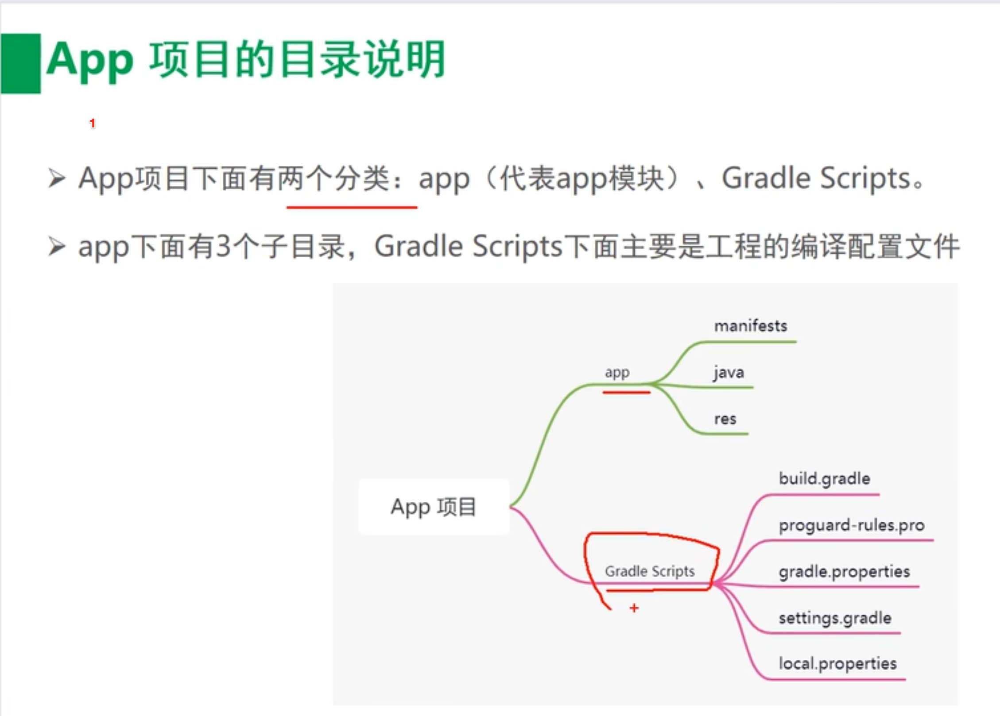


<br/><br/><br/>

<h2 id='Android文件目录展示'>Android文件目录展示</h2>

**老板Android目录展示**

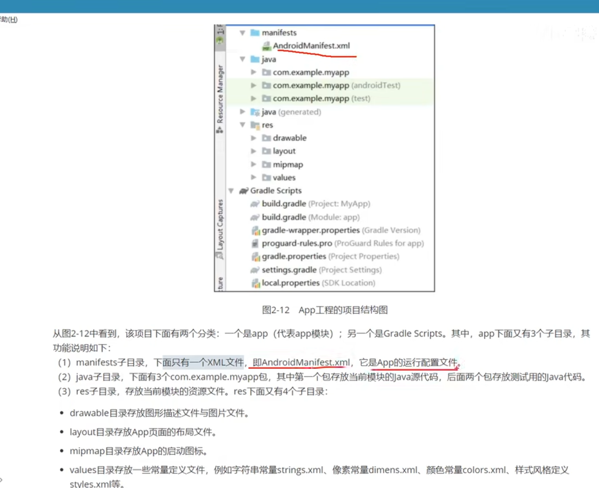

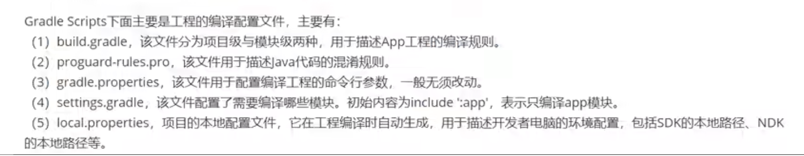


<br/><br/>


**新版新建Android项目目录展示：**

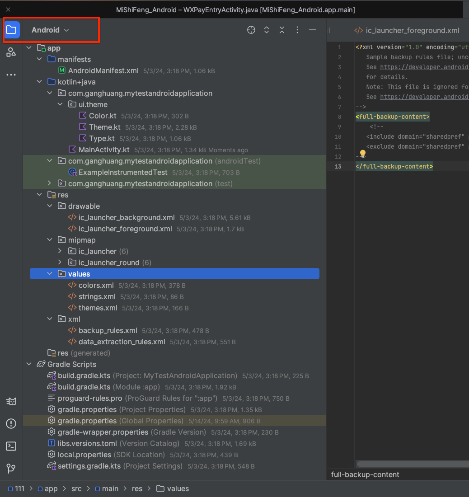

**kotlin+java** 

毫无疑问，kotlin+java目录是放置我们所有Java代码的地方（Kotlin代码也放在这里），展开该目录，你将看到系统帮我们自动生成了一个MainActivity文件。

<br/>


**res**

这个目录下的内容就有点多了。简单点说，就是你在项目中使用到的所有图片、布局、字符串等资源都要存放在这个目录下。当然这个目录下还有很多子目录，图片放在drawable目录下，布局放在layout目录下，字符串放在values目录下，所以你不用担心会把整个res目录弄得乱糟糟的。

<br/> 

**AndroidManifest.xm**

这是整个Android项目的配置文件，你在程序中定义的所有四大组件都需要在这个文件里注册，另外还可以在这个文件中给应用程序添加权限声明。由于这个文件以后会经常用到，我们等用到的时候再做详细说明。


<br/> 

**test**

此处是用来编写Unit Test测试用例的，是对项目进行自动化测试的另一种方式。

<br/>

**.gitignore**

这个文件用于将app模块内指定的目录或文件排除在版本控制之外，作用和外层的.gitignore文件类似。

是
<br/>

**build.gradle**

这是app模块的gradle构建脚本，这个文件中会指定很多项目构建相关的配置，我们稍后将会详细分析gradle构建脚本中的具体内容。


<br/>

**proguard-rules.pro**

这个文件用于指定项目代码的混淆规则，当代码开发完成后打包成安装包文件，如果不希望代码被别人破解，通常会将代码进行混淆，从而让破解者难以阅读。


>?


<br/><br/><br/>

> <h2 id='Project文件目录展示'>Project文件目录展示</h2>


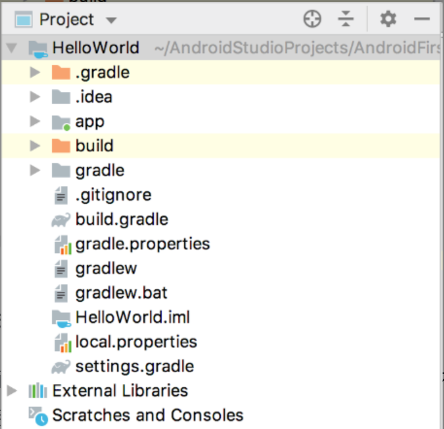


**gradle：** 

这个目录下包含了gradle wrapper的配置文件，使用gradle wrapper的方式不需要提前将gradle下载好，而是会自动根据本地的缓存情况决定是否需要联网下载gradle。

<br/>

**.gitignore**

这个文件是用来将指定的目录或文件排除在版本控制之外的。


<br/>

**build.gradle**


这是项目全局的gradle构建脚本，通常这个文件中的内容是不需要修改的。

<br/>

**gradle.properties**

这个文件是全局的gradle配置文件，在这里配置的属性将会影响到项目中所有的gradle编译脚本。

<br/>

**gradlew和gradlew.bat**

这两个文件是用来在命令行界面中执行gradle命令的，其中gradlew是在Linux或Mac系统中使用的，gradlew.bat是在Windows系统中使用的。

<br/>

**local.properties**

这个文件用于指定本机中的Android SDK路径，通常内容是自动生成的，我们并不需要修改。除非你本机中的Android SDK位置发生了变化，那么就将这个文件中的路径改成新的位置即可。

<br/>

**settings.gradle**

这个文件用于指定项目中所有引入的模块。由于HelloWorld项目中只有一个app模块，因此该文件中也就只引入了app这一个模块。通常情况下，模块的引入是自动完成的，需要我们手动修改这个文件的场景可能比较少。


<br/>

**Res文件下的各个子文件用处描述：**


&emsp； res目录中的内容就变得非常简单了。所有以“drawable”开头的目录都是用来放图片的，所有以“mipmap”开头的目录都是用来放应用图标的，所有以“values”开头的目录都是用来放字符串、样式、颜色等配置的，所有以“layout”开头的目录都是用来放布局文件的。


<br/>

***
<br/><br/><br/>

> <h1 id='基础组件'>基础组件</h1>


<br/><br/><br/>

> <h2 id='设置宽高'>设置宽高</h2>

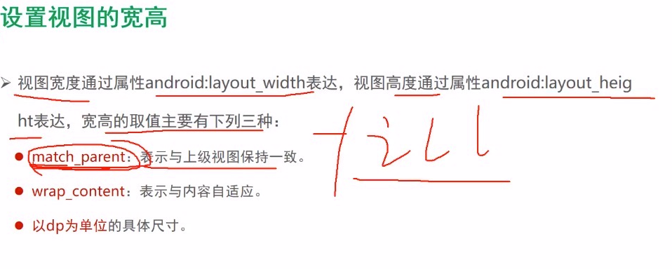


<br/><br/><br/>

> <h2 id="TextView设置圆角">TextView设置圆角</h2>

设置TextView的圆角没有效果的主要原因可能是因为在设置CornerRadius的时候，TextView还没有完成测量和布局，因此textView.getHeight()返回的是0。你需要确保在TextView完成布局后再设置圆角。


<br/> <br/>
你可以使用以下几种方法确保在布局完成后设置圆角：

- **方法一：使用ViewTreeObserver**
使用ViewTreeObserver.OnGlobalLayoutListener监听布局完成事件：


```
TextView textView = findViewById(R.id.test_drawable_activity_txtView00);

textView.getViewTreeObserver().addOnGlobalLayoutListener(new ViewTreeObserver.OnGlobalLayoutListener() {
    @Override
    public void onGlobalLayout() {
        // 移除监听器，防止重复调用
        textView.getViewTreeObserver().removeOnGlobalLayoutListener(this);

        // 获取高度并设置圆角
        int height = textView.getHeight();
        GradientDrawable gradientDrawable = new GradientDrawable();
        gradientDrawable.setCornerRadius(height / 2);
        gradientDrawable.setColor(Color.YELLOW);

        // 设置背景
        textView.setBackground(gradientDrawable);
    }
});

```

<br/> <br/>

- **方法二：使用post方法**

使用post方法确保在布局完成后设置圆角：

```
TextView textView = findViewById(R.id.test_drawable_activity_txtView00);

textView.post(new Runnable() {
    @Override
    public void run() {
        // 获取高度并设置圆角
        int height = textView.getHeight();
        GradientDrawable gradientDrawable = new GradientDrawable();
        gradientDrawable.setCornerRadius(height / 2);
        gradientDrawable.setColor(Color.YELLOW);

        // 设置背景
        textView.setBackground(gradientDrawable);
    }
});

```


<br/> <br/>

- **方法三：在布局完成后动态设置**

你可以在onCreate方法中通过延迟或者等待某些事件（例如用户交互）后再设置圆角：

```
TextView textView = findViewById(R.id.test_drawable_activity_txtView00);

// 延迟一些时间后设置圆角，确保布局完成（这是一种不太推荐的做法，因为时间不确定）
textView.postDelayed(new Runnable() {
    @Override
    public void run() {
        // 获取高度并设置圆角
        int height = textView.getHeight();
        GradientDrawable gradientDrawable = new GradientDrawable();
        gradientDrawable.setCornerRadius(height / 2);
        gradientDrawable.setColor(Color.YELLOW);

        // 设置背景
        textView.setBackground(gradientDrawable);
    }
}, 100); // 延迟100毫秒

```


<br/>

***
<br/><br/><br/><br/>

> <h1 id='Activity生命周期'>Activity生命周期</h1>

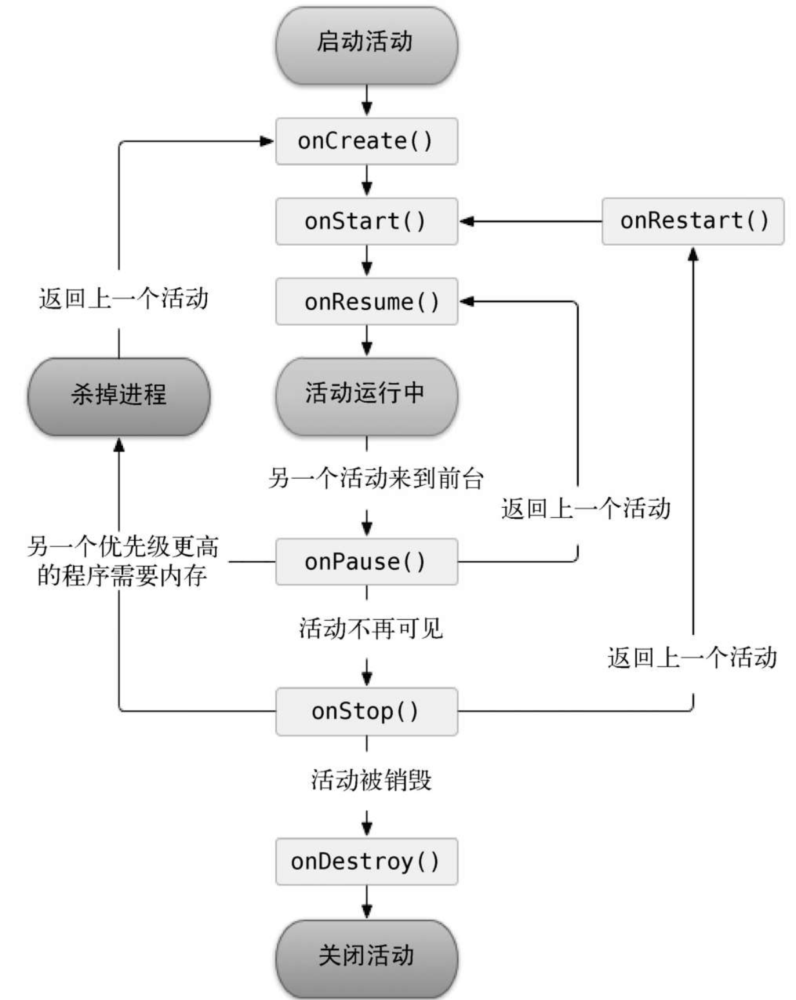


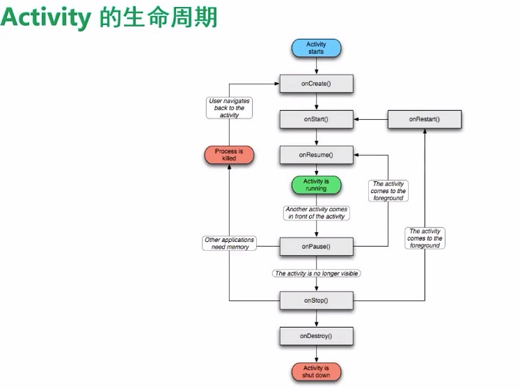

<br/>

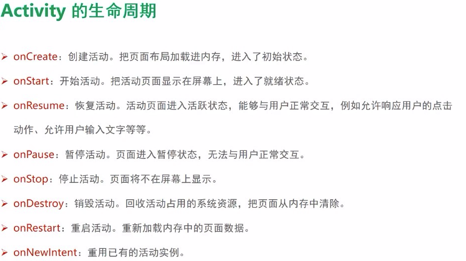

<br/> <br/>

**各个状态的切换过程：**

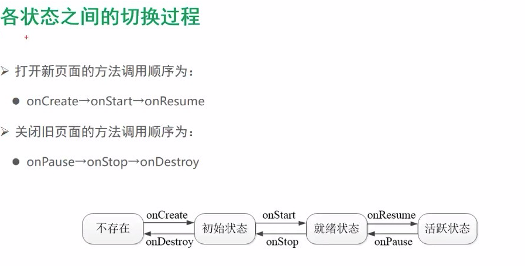


<br/><br/><br/>

> <h2 id='Activity启动模式'>Activity启动模式</h2>

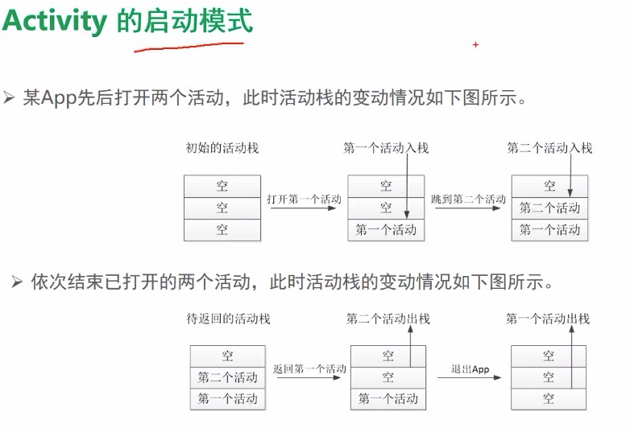

<br/>

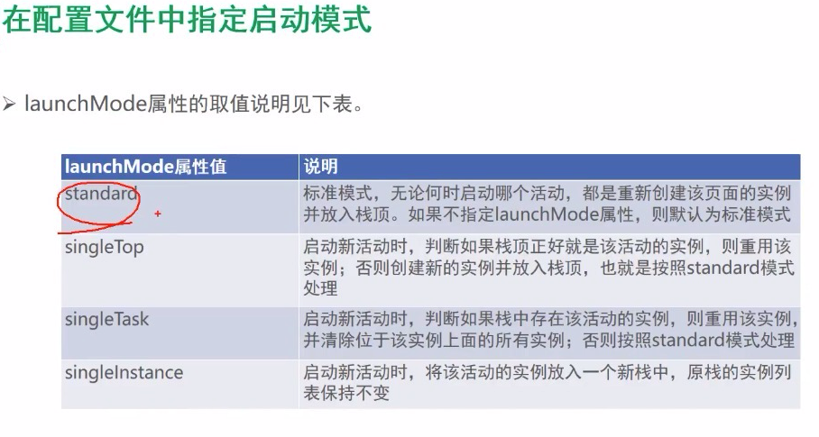


<br/><br/>

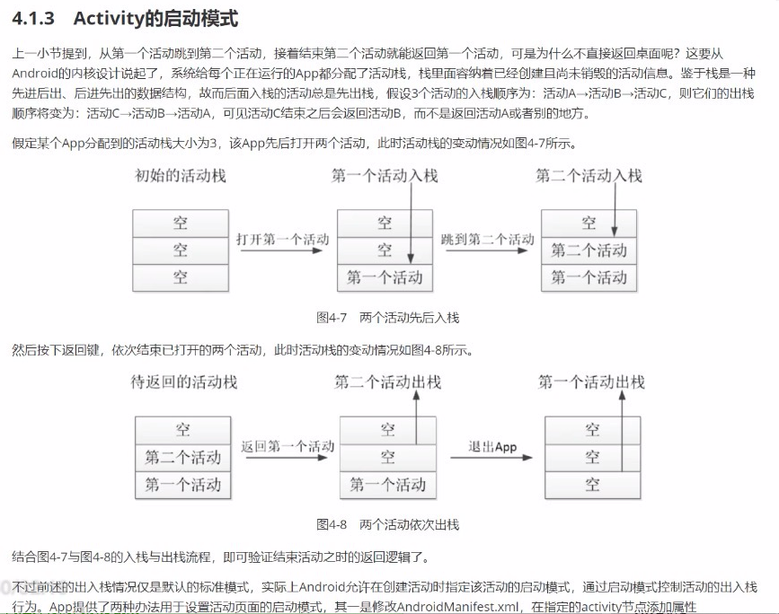

<br/><br/><br/>

> <h2 id='配置文件指定启动模式'>配置文件指定启动模式</h2>

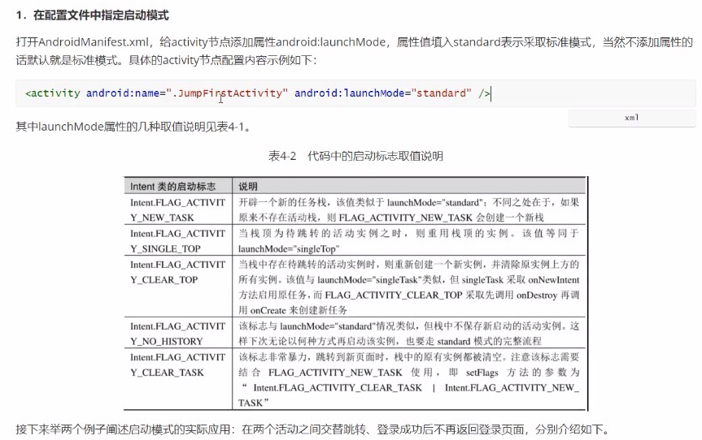


<br/><br/><br/>

> <h2 id='默认启动模式standard'>默认启动模式standard</h2>

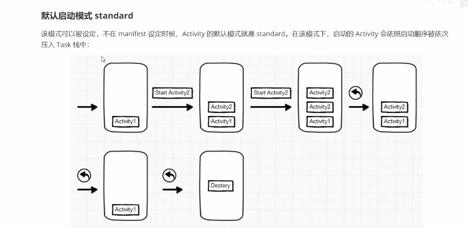

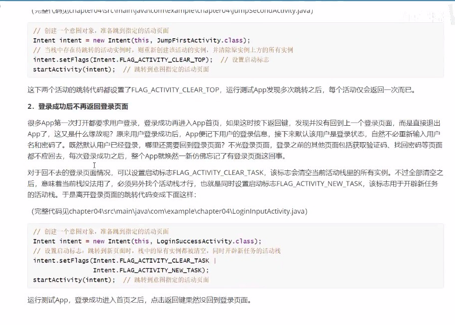


<br/><br/><br/>

> <h2 id='栈顶复用模式singleTop'>栈顶复用模式singleTop</h2>

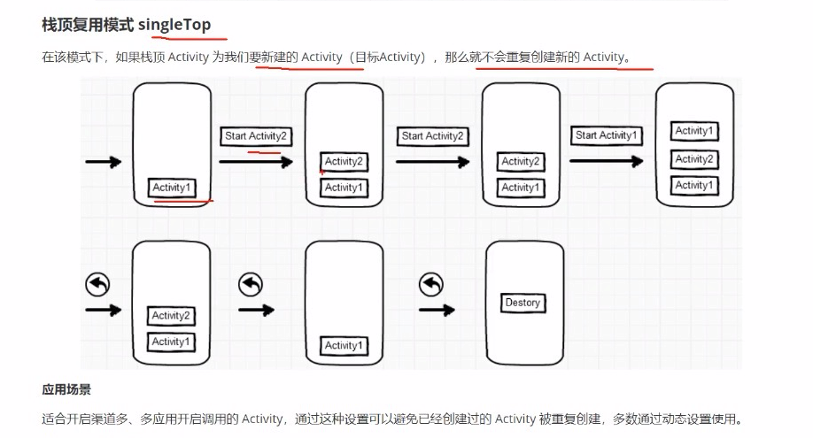


<br/><br/><br/>

> <h2 id='栈内复用模式singleTask'>栈内复用模式singleTask</h2>

使用singleTop模式可以很好地解决重复创建栈顶活动的问题，但是正如你在上一节所看到 的，如果该活动并没有处于栈顶的位置，还是可能会创建多个活动实例的。那么有没有什么办法 可以让某个活动在整个应用程序的上下文中只存在 一个实例呢?这就要借助singleTask模式来实 现了。当活动的启动模式指定为singleTask，每次启动该活动时系统首先会在返回栈中检查是否 存在该活动的实例，如果发现已经存在则直接使用该实例，并把在这个活动之上的所有活动统统 出栈，如果没有发现就会创建 一个新的活动实例。


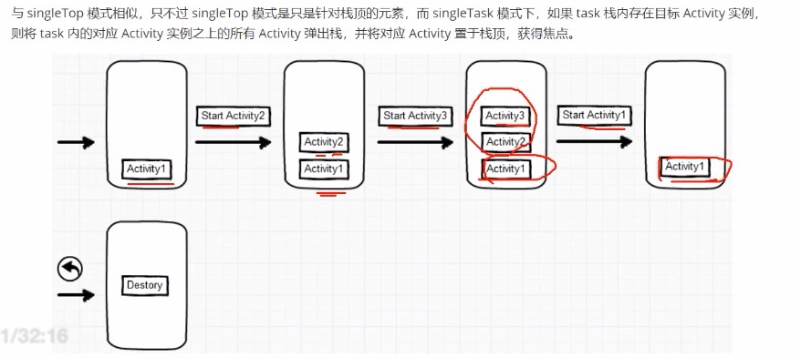

- **应用场景：**

	- **程序主界面**：我们肯定不希望足额界面被创建多次，而且在主界面推出的时候退出整个App是最好的效果。

	- **耗费系统资源的Activity：** 对于那些及其耗费资源的Activity，我们可以考虑将其设为singleTask模式，减少资源耗费。


<br/><br/><br/>

> <h2 id='全局唯一模式singleInstance'>全局唯一模式singleInstance</h2>

singlelnstance模式应该算是4种启动模式中最特殊也最复杂的一个了，你也需要多花点功夫 来理解这个模式。不同于以上3种启动模式，指定为singlelnstance模式的活动会启用 一个新的回栈来管理这个活动(其实如果singleTask模式指定了不同的taskAffinity ， 也会启动一个新的返回栈)。那么这样做有什么意义呢?想象以下场景，假设我们的程序中有 一个活动是允许其他程 序调用的，如果我们想实现其他程序和我们的程序可以共享这个活动的实例，应该如何实现呢? 使用前面3种启动模式肯定是做不到的，因为每个应用程序都会有自己的返回栈，同一个活动在不同的返回栈中入栈时必然是创建了新的实例 。 而使用singlelnstance模式就可以解决这个问题， 在这种模式下会有一个单独的返回栈来管理这个活动，不管是哪个应用程序来访问这个活动，都 共用的同 一个返回栈，也就解决了共享活动实例的问题。

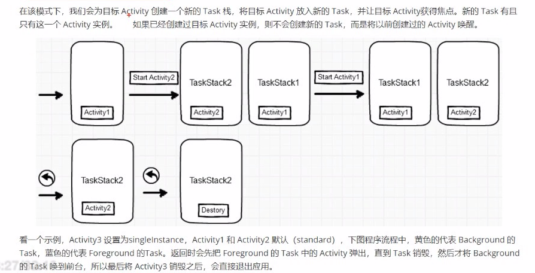
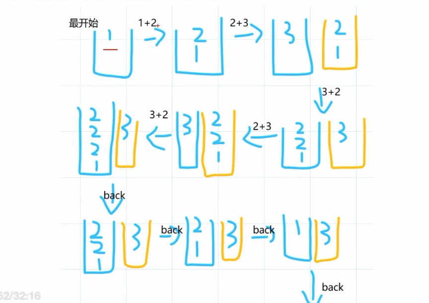
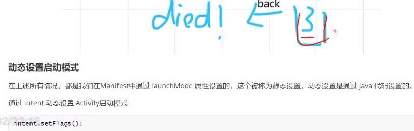


<br/>

*** 
<br/><br/><br/>

> <h2 id='Activity'>Activity</h2>

<br/> <br/> <br/>

> <h2 id='显示Intent和隐式Intent'>显示Intent和隐式Intent</h2>
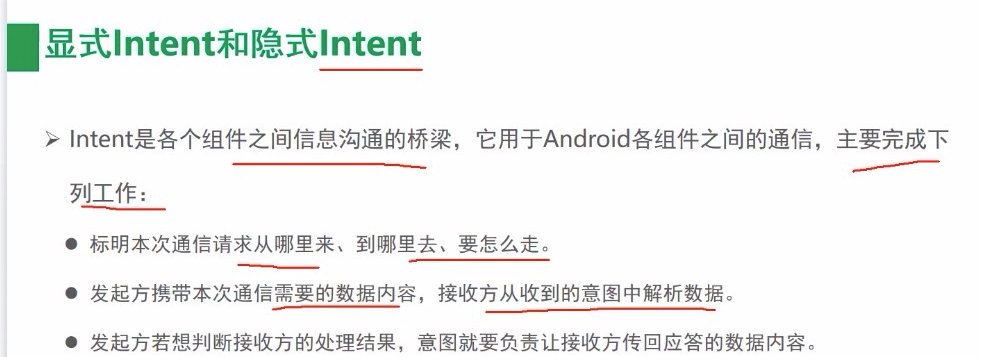

<br/>

**组成部分：**

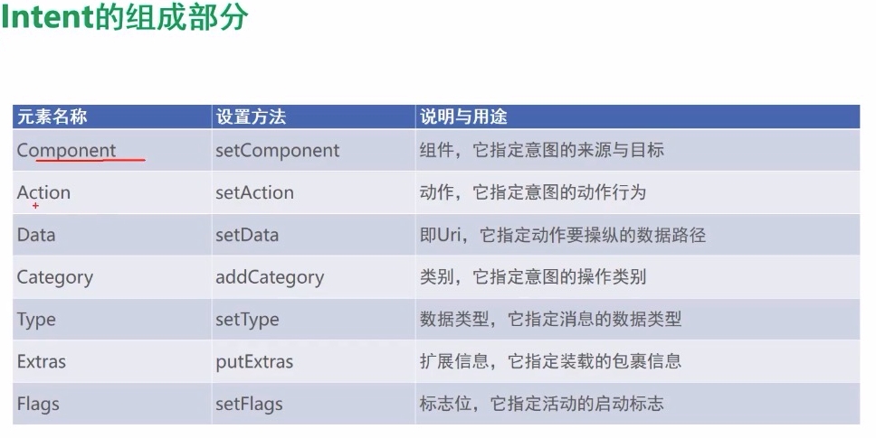


<br/><br/><br/>

> <h2 id='显示Intent'>显示Intent</h2>

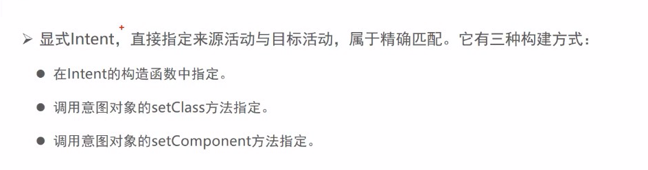

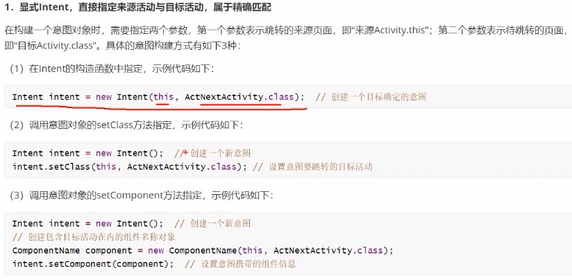


<br/>

```
Intent intent = new Intent(this, ScanCodeIntoActivity.class);
//用于启动一个新的Activity。intent是一个Intent对象，它定义了你希望启动的Activity以及需要传递给该Activity的数据（如果有）
startActivity(intent);
```

`startActivity:` 这是Android Context 类（Activity 类是 Context 的子类，因此可以直接调用）中的一个方法，用于启动一个新的Activity实例。

 `intent:` Intent是Android中用于启动Activity、服务(Service)、广播接收器(BroadcastReceiver)的意图对象。它不仅指定了要启动的组件（通过setAction, setClass 或 setComponent等方法），还可以携带额外的数据（通过putExtra方法）给目标Activity。

&emsp; 当调用startActivity(intent);时，Android系统会根据Intent中提供的信息查找并启动对应的Activity。如果Intent没有明确指定组件名称，系统会根据Intent的动作为以及其他附加信息（如类别、数据等）去匹配并启动最合适的Activity。


<br/><br/>

> <h2 id='Intent组成部分'>Intent组成部分</h2>


<br/><br/><br/>

> <h2 id='向下一个Activity发送数据'>向下一个Activity发送数据</h2>


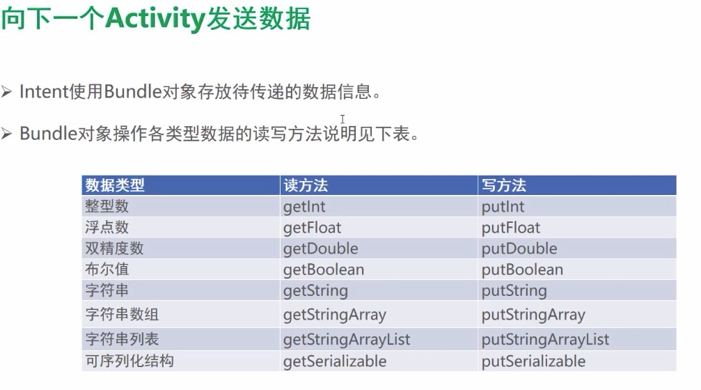

<br/><br/>

**Bundle**

- 在代码中发送消息包裹，嗲用意图对象的putExtras方法，即可存入消息包裹；
- 在代码中接受消息包裹，调用意图对象的getExtras方法，即可取消消息包裹；


<br/><br/><br/>

> <h2 id=''>向上一个Activity返回数据</h2>

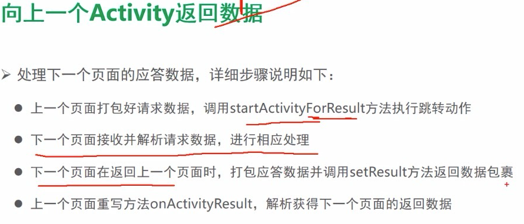


<br/><br/><br/>

> <h2 id=''></h2>


<br/><br/><br/>

> <h2 id=''></h2>


<br/><br/><br/>

> <h2 id='详解Application'>详解Application</h2>


**android.app.Application** 类是Android应用程序的基础类，它扮演着整个应用程序环境的全局容器角色。以下几点概述了Application类的主要用途和重要性：

-  **全局状态管理：** 您可以将Application类用作存储整个应用程序范围内的全局状态信息的地方，比如配置设置、全局变量等。通过定义静态成员或实例变量，您可以在应用的所有组件（如Activities、Services、BroadcastReceivers）之间共享数据。

-  **生命周期管理：** 尽管Application类没有像Activity那样的明显生命周期回调（如onCreate、onStart、onResume等），但它确实有一个重要的回调方法onCreate()，该方法在应用程序启动时被调用一次。您可以在onCreate()中执行应用级别的初始化操作，如初始化数据库连接、第三方库、全局变量等。

-  **资源初始化：** 因为Application的onCreate()方法在整个应用启动之初就会被调用，它是进行全局资源初始化的理想时机，例如设置缓存、初始化网络连接池、加载配置文件等。

-  **异常处理：** Application类可以用来实现全局的异常捕获和处理机制，通过自定义的Thread.UncaughtExceptionHandler，可以捕获未处理的异常并采取相应措施，如记录日志、崩溃报告等。

-  **单例模式：** 由于每个Android应用只会有一个Application实例，因此它自然符合单例模式。通过定义静态方法获取这个实例，您可以确保在应用的任何位置都可以访问到相同的Application对象，这有利于管理跨组件共享的资源和服务。

-  **组件间通信：** 虽然不是直接的通信桥梁，但Application类可以作为一个中心点来存放用于跨组件通信的数据或接口，比如使用EventBus时，可以在Application中进行注册和注销。

总之，**android.app.Application**类为开发者提供了一个控制和管理整个应用程序生命周期、状态和资源的中心点，是构建复杂应用架构时不可或缺的一部分。


<br/><br/><br/>

> <h2 id='详解Context'>详解Context</h2>

**Context**是一个非常核心的类，几乎贯穿了整个应用的开发过程。简单来说，Context可以理解为提供给应用访问系统服务和资源的一个桥梁或者环境。每个Android应用组件（如Activity, Service, BroadcastReceiver, ContentProvider）在运行时都会有一个关联的Context对象，它允许该组件访问应用的资源、启动其他组件、获取系统服务等。

<br/><br/><br/>

> <h2 id='getContext()的作用'>getContext()的作用</h2>

getContext() 是Android开发中常见的一个方法，主要在与上下文(Context)相关的类中使用，如View, Fragment等。这个方法的作用是返回当前对象所关联的Android上下文(Context)对象。

<br/><br/>

- **作用：**

	- **访问资源**：通过Context，你可以访问应用的资源，如字符串、图片、布局文件等。例如，`getContext().getString(R.string.app_name)`可以获取应用名称字符串资源。


	-  **启动Activity或Service：** Context提供了启动其他Activity或Service的方法，如`getContext().startActivity(intent)`。

	-  **获取系统服务：** 可以用来获取系统的各种服务，如`LocationManager、NotificationManager`等，如`getContext().getSystemService(Context.LOCATION_SERVICE)`。

	-  **创建View：** 在创建新的View时，通常需要传入一个Context对象，以确保新创建的View能够访问到应用的资源和主题设置。

	-  **文件操作：** 用于访问应用的内部或外部存储空间，如通过getContext().openFileOutput()写入文件。

<br/> <br/>

- **注意事项**

	-  **内存泄漏风险：** 持有Context的引用可能会导致内存泄漏，特别是当长时间持有一个Activity的Context时。推荐在不需要使用Activity特定功能时，使用Application Context而非Activity Context。

	-  **Context类型**：getContext()在不同的场景下可能返回不同类型的Context。在Fragment或View中，通常返回的是宿主Activity的Context；而在Application或Service中直接使用，返回的就是对应类型的Context。


<br/><br/><br/>

> <h2 id="碎片🧩Fragment">碎片🧩Fragment</h2>

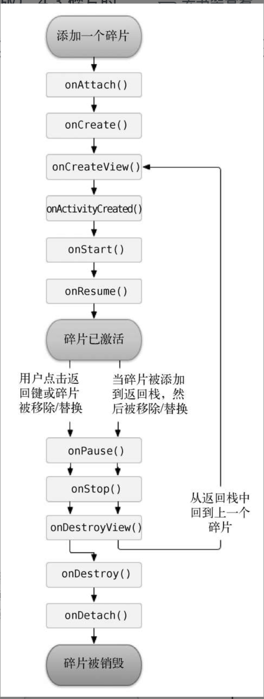


<br/>

***
<br/><br/><br/>

> <h1 id="持久化存储">持久化存储</h1>


<br/><br/><br/>

> <h2 id="文件存储">文件存储</h2>

在Android Studio中打开存储的文件：

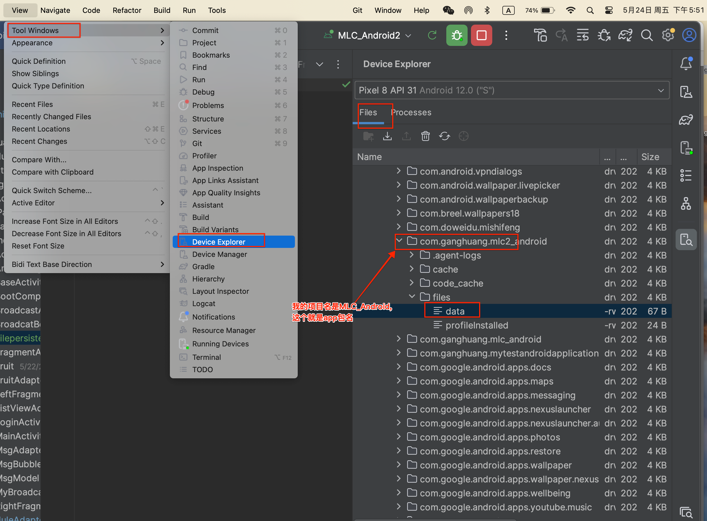


<br/><br/><br/>

> <h2 id="SharedPreferences存储">SharedPreferences存储</h2>

在Android Studio中打开存储的文件：

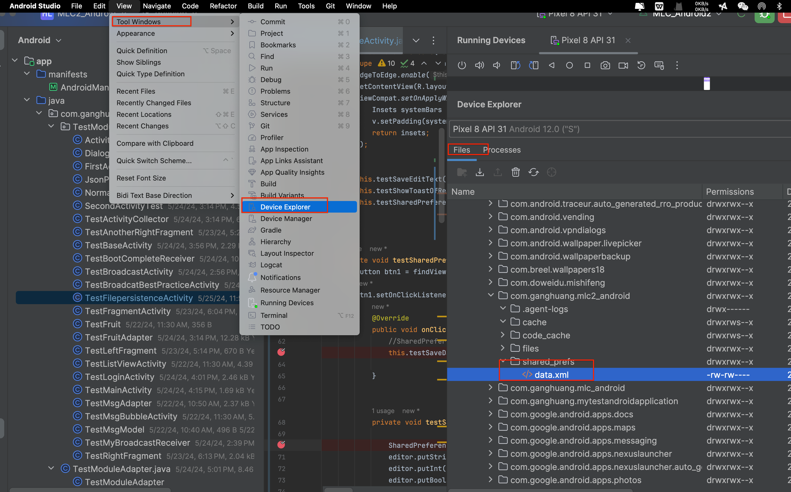


<br/>

***

<br/><br/><br/>

> <h1 id="项目配置">项目配置</h1>

<br/><br/><br/>

> <h2 id="配置环境资源">配置环境资源</h2>

你可能需要在不同的资源目录中配置 Beta 环境的特定资源，例如 src/beta。你可以创建一个新的资源目录并添加 Beta 特定的资源文件。

```
src
|-- main
|   |-- java
|   |-- res
|-- beta
|   |-- java
|   |-- res

```

在 src/beta 目录中，你可以放置 Beta 环境特有的资源文件，这些文件会覆盖 src/main 中的文件。

<br/><br/><br/>

> <h2 id="打包">打包</h2>

- **1.配置 build.gradle**(注意：**app级别的**)
首先，打开你的 app 级别的 build.gradle 文件，添加一个新的构建变体或配置现有的构建变体以支持 Beta 环境。下面是一个示例：

```
android {
    ...
    buildTypes {
        debug {
            ...
        }
        release {
            ...
        }
        beta {
            initWith(buildTypes.release)
            matchingFallbacks = ['release']
            // 你可以在这里添加Beta特定的配置
            // 比如不同的签名配置
            signingConfig signingConfigs.release
            // 或者不同的应用ID
            applicationIdSuffix ".beta"
            // 不同的版本名或版本号
            versionNameSuffix "-beta"
        }
    }
}

```

如图：

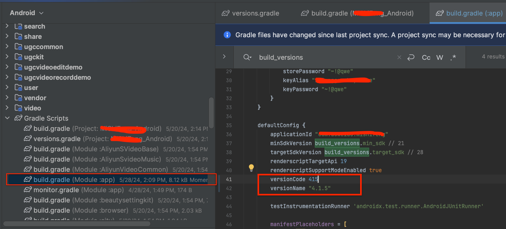


<br/> <br/>

- **2.选择构建变体(选择打包环境)**

导航栏**View**-> Build Variants,然后在下拉列表中选择打包环境，如下：

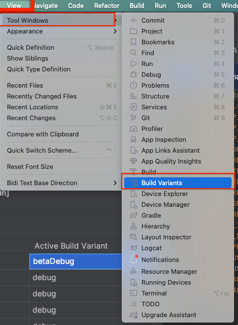

在 Build Variants 窗口中，找到你的模块（通常是 app），然后从下拉菜单中选择 beta。


<br/> <br/>

- 3.**打包应用**

一旦选择了 beta 构建变体，你可以开始打包你的应用：

- 在菜单中选择 Build。
- 点击 Build Bundle(s) / APK(s)。
- 选择 Build APK(s) 或 Build Bundle(s) 以生成 APK 或 AAB 文件。

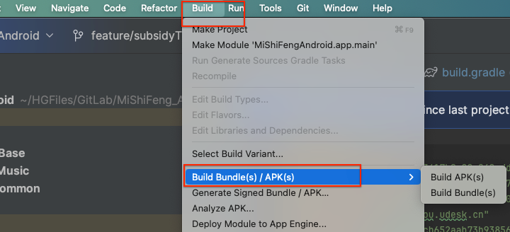


<br/><br/>

- **4.签名配置（可选）**

如果你需要为 Beta 版本使用不同的签名配置，可以在 build.gradle 中添加特定的签名配置：


```
android {
    ...
    signingConfigs {
        release {
            keyAlias 'yourKeyAlias'
            keyPassword 'yourKeyPassword'
            storeFile file('path/to/your/keystore')
            storePassword 'yourStorePassword'
        }
        beta {
            keyAlias 'yourBetaKeyAlias'
            keyPassword 'yourBetaKeyPassword'
            storeFile file('path/to/your/beta/keystore')
            storePassword 'yourBetaStorePassword'
        }
    }
    buildTypes {
        ...
        beta {
            ...
            signingConfig signingConfigs.beta
        }
    }
}

```

<br/><br/>

- **5.打包后的路径**


APK路径：

```
<your_project_directory>/app/build/outputs/apk/beta/app-beta.apk
```

<br/>

**打包 AAB (Android App Bundle)路径**

```
<your_project_directory>/app/build/outputs/bundle/beta/app-beta.aab
```


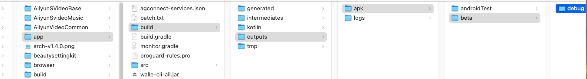


<br/>

***
<br/><br/><br/>

> <h1 id="开发大坑">开发大坑</h1>


<br/><br/><br/>


> <h2 id="更新RecycleView内的ItemView组件位置后，无法对其他View进行隐藏">更新RecycleView内的ItemView组件位置后，无法对其他View进行隐藏</h2>

问题描述如下：

```
if  subsidyAmount>0 {
	补贴tag显示
	抢光进度条内的2个组件隐藏
	补贴后的价格位置下移
}else {
	补贴tag隐藏
	抢光进度条内的2个组件显示
	补贴后的价格位置上移（恢复原状）
}
```

如图：


<br/> <br/>

因为是初始开发，遇到了很多坑吧？因为想着Android开发和iOS开发也许有着相同之处，但是我错了！

**坑一：** 我对补贴tag修改约束前，就对补贴Tag、抢光进度条、补贴后的价格设置隐藏或者显示导致没有效果，后来查看ChatGpt发现因为更新布局后，需要延迟一段时间。然后我加了延迟，果然有效果，但是有点出现新的问题，有卡顿了！！


**坑2：** 后来我吧代码换了下位置，先是改变约束，再对其隐藏或者显示设置，然后也不卡顿了，都解决了

请看代码：

```
ConstraintLayout constraintLayout;
FrameLayout bottomLayout;
    
//在XXXItemHolder构造方法设置
public XXXItemHolder(){
	        
    constraintLayout = itemView.findViewById(R.id.layout_fxz_activity_list_item_constraintLayout);
        bottomLayout = itemView.findViewById(R.id.layout_fxz_activity_list_bottomLayout);    
}
	
private void changeStateOfSubsidy(FxzActivityItem data) {
ConstraintSet constraintSet = new ConstraintSet();
constraintSet.clone(constraintLayout);
if (data.getSubsidy_amount() > 0) {
    //富文本的设置
    String subsidyAmont = MoneyUtils.formatMoney(data.getSubsidy_amount(), "¥#0.##");
    SpannableString amount = new SpannableString(subsidyAmont);
    SpannableString amountDesc = new SpannableString(data.getSubsidy_amount_desc());
    amount.setSpan(new StyleSpan(Typeface.BOLD), 0, subsidyAmont.length(), Spannable.SPAN_EXCLUSIVE_EXCLUSIVE);

    SpannableStringBuilder strBuilder = new SpannableStringBuilder();
    strBuilder.append(amountDesc);
    strBuilder.append(amount);
    subsidyText.setText(strBuilder);
    
    //mActivityPriceView.getId()：价格的ID
    //ConstraintSet.PARENT_ID 父容器的ID
    //mActivityPriceSavedView.getId() 真实价格组件ID
    //mLabelView.getId() 打折标签ID
    constraintSet.connect(mActivityPriceView.getId(), ConstraintSet.BOTTOM, ConstraintSet.PARENT_ID, ConstraintSet.BOTTOM, dpToPx(0));
    constraintSet.connect(mActivityPriceSavedView.getId(), ConstraintSet.BOTTOM, ConstraintSet.PARENT_ID, ConstraintSet.BOTTOM, dpToPx(3));
    constraintSet.connect(mLabelView.getId(), ConstraintSet.BOTTOM, ConstraintSet.PARENT_ID, ConstraintSet.BOTTOM, dpToPx(3));

} else {
    constraintSet.connect(mActivityPriceView.getId(), ConstraintSet.BOTTOM, ConstraintSet.PARENT_ID, ConstraintSet.BOTTOM, dpToPx(23));
    constraintSet.connect(mActivityPriceSavedView.getId(), ConstraintSet.BOTTOM, ConstraintSet.PARENT_ID, ConstraintSet.BOTTOM, dpToPx(26));
    constraintSet.connect(mLabelView.getId(), ConstraintSet.BOTTOM, ConstraintSet.PARENT_ID, ConstraintSet.BOTTOM, dpToPx(26));

}
constraintSet.applyTo(constraintLayout);

// 延迟执行隐藏操作 我将延迟注销了
//        itemView.postDelayed(new Runnable() {
//            @Override
//            public void run() {
if (data.getSubsidy_amount() > 0) {//一开始这个逻辑我写在上面判断的逻辑里的
    bottomLayout.setVisibility(View.GONE); //底部进度容器是否隐藏
    subsidyText.setVisibility(View.VISIBLE);//补贴是否隐藏
} else {
    bottomLayout.setVisibility(View.VISIBLE);
    subsidyText.setVisibility(View.GONE);
}
//            }
//        }, 2);
}
 
```


<br/>

***

<br/><br/><br/>

> <h1 id='AndroidStudio配置修改'>AndroidStudio配置修改</h1>

<br/><br/><br/>

> <h2 id='选中文件打开源码'> 选中文件打开源码</h2>

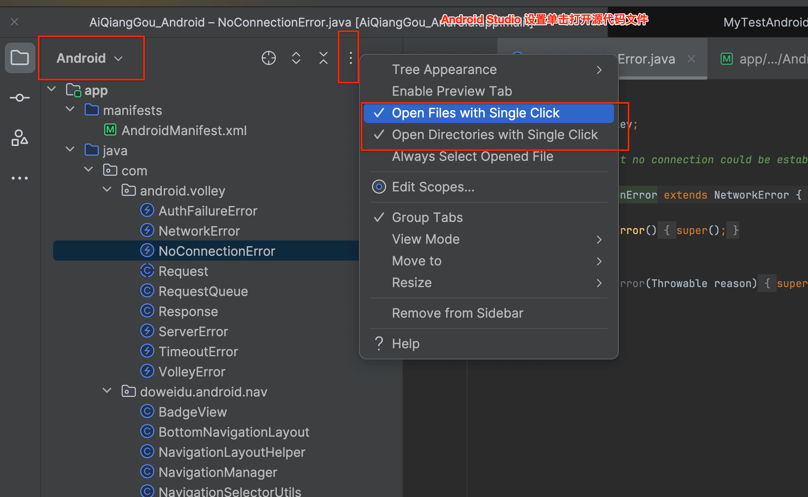


