># <h1 id=''>[Android知识体系](https://blog.csdn.net/liuwg1226/article/details/114777562)</h1>
[**Android Studio简介、安装和配置**](https://m.imooc.com/wiki/androidstudio-cpuprofiler)
- [**文件结构**](#文件结构)
	- [文件夹目录介绍](#文件夹目录介绍)
		- [Android文件目录展示](#Android文件目录展示)
		- [Project文件目录展示](#Project文件目录展示)
- [**基础组件**](#基础组件) 
	- [设置宽高](#设置宽高)
	- [TextView设置圆角](#TextView设置圆角)
- [**Activity生命周期**](#Activity生命周期)
	- [配置文件指定启动模式](#配置文件指定启动模式)
	- [Activity启动模式](#Activity启动模式)
	- [默认启动模式standard](#默认启动模式standard)
	- [栈顶复用模式singleTop](#栈顶复用模式singleTop)
	- [栈内复用模式singleTask](#栈内复用模式singleTask)
	- [全局唯一模式singleInstance](#全局唯一模式singleInstance)
- [**Activity**](#Activity)
	- [‌显示Intent和隐式Intent](#显示Intent和隐式Intent)
	- [显示Intent](#显示Intent)
	- [向上一个Activity返回数据](#向上一个Activity返回数据)
	- [向下一个Activity发送数据](#向下一个Activity发送数据)
- [**碎片Fragement**](#碎片Fragement)
- [**xml文件的3种布局**](#xml3种布局)
	- [线性布局](#线性布局)
	- [相对布局RelativeLayout](#相对布局RelativeLayout)
		- [父容器定位属性示意图](#父容器定位属性示意图)
		- [兄弟组件定位](#兄弟组件定位)
		- [梅花布局](#梅花布局)
		- [属性说明](#属性说明)
			- [属性值为true或false相对于父元素的位置](#属性值为true或false相对于父元素的位置)
			- [属性值必须为id的引用名](#属性值必须为id的引用名)
			- [在元素周围](#在元素周围)
			- [相对于元素内部四周](#相对于元素内部四周)
			- [属性值为具体的像素值，如30dip，40px](#属性值为具体的像素值，如30dip，40px)
			- [padding与layout_margin的区别与用法](#padding与layout_margin的区别与用法)
	- [相对布局ConstraintLayout](#相对布局ConstraintLayout)
		- [layout_goneMarginEnd和layout_marginEnd区别](#layout_goneMarginEnd和layout_marginEnd区别)
		- [viewgone的理解](#viewgone的理解)
		- [巧妙居中](#巧妙居中)
		- [弹性居中](#弹性居中)
- [详解Application](#详解Application)
- [详解Context](#详解Context)
	- [getContext()的作用](#getContext()的作用)
- [碎片🧩Fragment](#碎片🧩Fragment)
- [**持久化存储**](#持久化存储) 
	- [文件存储](#文件存储) 
	- [SharedPreferences存储](#SharedPreferences存储)
- [**项目配置**](#项目配置)
	- [Gradle基础](#Gradle基础)
	- [Android各个版本](#Android各个版本)
	- [打包](#打包)
	- [发版](#发版)

- [**开发大坑**](#开发大坑)
	- [更新RecycleView内的ItemView组件位置后，无法对其他View进行隐藏](#更新RecycleView内的ItemView组件位置后，无法对其他View进行隐藏)
	- [Gradle和AGP版本不一致到错构建项目出错](#Gradle和AGP版本不一致到错构建项目出错)


- [AndroidStudio配置修改](#AndroidStudio配置修改)
	- [选中文件打开源码](#选中文件打开源码)

<br/><br/>


<br/><br/>

***
<br/><br/><br/>

> <h1 id='文件结构'>文件结构</h1>

**文件结构：**


<br/><br/><br/>

<h2 id='Android文件目录展示'>Android文件目录展示</h2>

**老板Android目录展示**


<br/><br/>


**新版新建Android项目目录展示：**


**kotlin+java** 

毫无疑问，kotlin+java目录是放置我们所有Java代码的地方（Kotlin代码也放在这里），展开该目录，你将看到系统帮我们自动生成了一个MainActivity文件。

<br/>


**res**

这个目录下的内容就有点多了。简单点说，就是你在项目中使用到的所有图片、布局、字符串等资源都要存放在这个目录下。当然这个目录下还有很多子目录，图片放在drawable目录下，布局放在layout目录下，字符串放在values目录下，所以你不用担心会把整个res目录弄得乱糟糟的。

<br/> 

**AndroidManifest.xm**

这是整个Android项目的配置文件，你在程序中定义的所有四大组件都需要在这个文件里注册，另外还可以在这个文件中给应用程序添加权限声明。由于这个文件以后会经常用到，我们等用到的时候再做详细说明。


<br/> 

**test**

此处是用来编写Unit Test测试用例的，是对项目进行自动化测试的另一种方式。

<br/>

**.gitignore**

这个文件用于将app模块内指定的目录或文件排除在版本控制之外，作用和外层的.gitignore文件类似。

是
<br/>

**build.gradle**

这是app模块的gradle构建脚本，这个文件中会指定很多项目构建相关的配置，我们稍后将会详细分析gradle构建脚本中的具体内容。


<br/>

**proguard-rules.pro**

这个文件用于指定项目代码的混淆规则，当代码开发完成后打包成安装包文件，如果不希望代码被别人破解，通常会将代码进行混淆，从而让破解者难以阅读。


>?


<br/><br/><br/>

> <h2 id='Project文件目录展示'>Project文件目录展示</h2>


**gradle：** 

这个目录下包含了gradle wrapper的配置文件，使用gradle wrapper的方式不需要提前将gradle下载好，而是会自动根据本地的缓存情况决定是否需要联网下载gradle。

<br/>

**.gitignore**

这个文件是用来将指定的目录或文件排除在版本控制之外的。


<br/>

**build.gradle**


这是项目全局的gradle构建脚本，通常这个文件中的内容是不需要修改的。

<br/>

**gradle.properties**

这个文件是全局的gradle配置文件，在这里配置的属性将会影响到项目中所有的gradle编译脚本。

<br/>

**gradlew和gradlew.bat**

这两个文件是用来在命令行界面中执行gradle命令的，其中gradlew是在Linux或Mac系统中使用的，gradlew.bat是在Windows系统中使用的。

<br/>

**local.properties**

这个文件用于指定本机中的Android SDK路径，通常内容是自动生成的，我们并不需要修改。除非你本机中的Android SDK位置发生了变化，那么就将这个文件中的路径改成新的位置即可。

<br/>

**settings.gradle**

这个文件用于指定项目中所有引入的模块。由于HelloWorld项目中只有一个app模块，因此该文件中也就只引入了app这一个模块。通常情况下，模块的引入是自动完成的，需要我们手动修改这个文件的场景可能比较少。


<br/>

**Res文件下的各个子文件用处描述：**


&emsp； res目录中的内容就变得非常简单了。所有以“drawable”开头的目录都是用来放图片的，所有以“mipmap”开头的目录都是用来放应用图标的，所有以“values”开头的目录都是用来放字符串、样式、颜色等配置的，所有以“layout”开头的目录都是用来放布局文件的。


<br/>

***
<br/><br/><br/>

> <h1 id='基础组件'>基础组件</h1>


<br/><br/><br/>

> <h2 id='设置宽高'>设置宽高</h2>


<br/><br/><br/>

> <h2 id="TextView设置圆角">TextView设置圆角</h2>

设置TextView的圆角没有效果的主要原因可能是因为在设置CornerRadius的时候，TextView还没有完成测量和布局，因此textView.getHeight()返回的是0。你需要确保在TextView完成布局后再设置圆角。


<br/> <br/>
你可以使用以下几种方法确保在布局完成后设置圆角：

- **方法一：使用ViewTreeObserver**
使用ViewTreeObserver.OnGlobalLayoutListener监听布局完成事件：


```
TextView textView = findViewById(R.id.test_drawable_activity_txtView00);

textView.getViewTreeObserver().addOnGlobalLayoutListener(new ViewTreeObserver.OnGlobalLayoutListener() {
    @Override
    public void onGlobalLayout() {
        // 移除监听器，防止重复调用
        textView.getViewTreeObserver().removeOnGlobalLayoutListener(this);

        // 获取高度并设置圆角
        int height = textView.getHeight();
        GradientDrawable gradientDrawable = new GradientDrawable();
        gradientDrawable.setCornerRadius(height / 2);
        gradientDrawable.setColor(Color.YELLOW);

        // 设置背景
        textView.setBackground(gradientDrawable);
    }
});

```

<br/> <br/>

- **方法二：使用post方法**

使用post方法确保在布局完成后设置圆角：

```
TextView textView = findViewById(R.id.test_drawable_activity_txtView00);

textView.post(new Runnable() {
    @Override
    public void run() {
        // 获取高度并设置圆角
        int height = textView.getHeight();
        GradientDrawable gradientDrawable = new GradientDrawable();
        gradientDrawable.setCornerRadius(height / 2);
        gradientDrawable.setColor(Color.YELLOW);

        // 设置背景
        textView.setBackground(gradientDrawable);
    }
});

```


<br/> <br/>

- **方法三：在布局完成后动态设置**

你可以在onCreate方法中通过延迟或者等待某些事件（例如用户交互）后再设置圆角：

```
TextView textView = findViewById(R.id.test_drawable_activity_txtView00);

// 延迟一些时间后设置圆角，确保布局完成（这是一种不太推荐的做法，因为时间不确定）
textView.postDelayed(new Runnable() {
    @Override
    public void run() {
        // 获取高度并设置圆角
        int height = textView.getHeight();
        GradientDrawable gradientDrawable = new GradientDrawable();
        gradientDrawable.setCornerRadius(height / 2);
        gradientDrawable.setColor(Color.YELLOW);

        // 设置背景
        textView.setBackground(gradientDrawable);
    }
}, 100); // 延迟100毫秒

```


<br/>

***
<br/><br/><br/><br/>

> <h1 id='Activity生命周期'>Activity生命周期</h1>


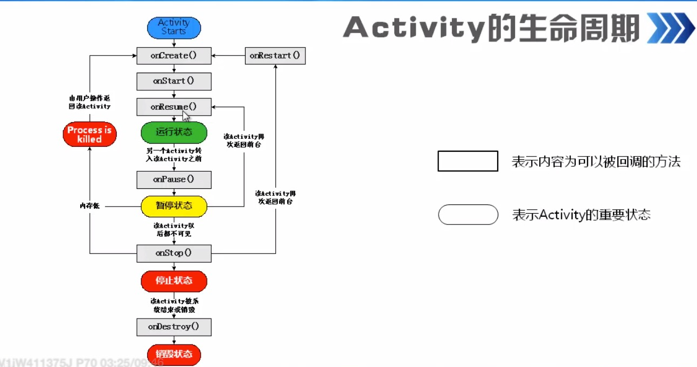


<br/>


<br/> <br/>

**各个状态的切换过程：**


<br/>

几种情况如下：


<br/><br/><br/>

> <h2 id='Activity启动模式'>Activity启动模式</h2>


<br/>


<br/><br/>


<br/><br/><br/>

> <h2 id='配置文件指定启动模式'>配置文件指定启动模式</h2>


<br/><br/><br/>

> <h2 id='默认启动模式standard'>默认启动模式standard</h2>


<br/><br/><br/>

> <h2 id='栈顶复用模式singleTop'>栈顶复用模式singleTop</h2>


<br/><br/><br/>

> <h2 id='栈内复用模式singleTask'>栈内复用模式singleTask</h2>

使用singleTop模式可以很好地解决重复创建栈顶活动的问题，但是正如你在上一节所看到 的，如果该活动并没有处于栈顶的位置，还是可能会创建多个活动实例的。那么有没有什么办法 可以让某个活动在整个应用程序的上下文中只存在 一个实例呢?这就要借助singleTask模式来实 现了。当活动的启动模式指定为singleTask，每次启动该活动时系统首先会在返回栈中检查是否 存在该活动的实例，如果发现已经存在则直接使用该实例，并把在这个活动之上的所有活动统统 出栈，如果没有发现就会创建 一个新的活动实例。


- **应用场景：**

	- **程序主界面**：我们肯定不希望足额界面被创建多次，而且在主界面推出的时候退出整个App是最好的效果。

	- **耗费系统资源的Activity：** 对于那些及其耗费资源的Activity，我们可以考虑将其设为singleTask模式，减少资源耗费。


<br/><br/><br/>

> <h2 id='全局唯一模式singleInstance'>全局唯一模式singleInstance</h2>

singlelnstance模式应该算是4种启动模式中最特殊也最复杂的一个了，你也需要多花点功夫 来理解这个模式。不同于以上3种启动模式，指定为singlelnstance模式的活动会启用 一个新的回栈来管理这个活动(其实如果singleTask模式指定了不同的taskAffinity ， 也会启动一个新的返回栈)。那么这样做有什么意义呢?想象以下场景，假设我们的程序中有 一个活动是允许其他程 序调用的，如果我们想实现其他程序和我们的程序可以共享这个活动的实例，应该如何实现呢? 使用前面3种启动模式肯定是做不到的，因为每个应用程序都会有自己的返回栈，同一个活动在不同的返回栈中入栈时必然是创建了新的实例 。 而使用singlelnstance模式就可以解决这个问题， 在这种模式下会有一个单独的返回栈来管理这个活动，不管是哪个应用程序来访问这个活动，都 共用的同 一个返回栈，也就解决了共享活动实例的问题。


<br/>

*** 
<br/><br/><br/>

> <h2 id='Activity'>Activity</h2>

<br/> <br/> <br/>

> <h2 id='显示Intent和隐式Intent'>显示Intent和隐式Intent</h2>


<br/>

**组成部分：**


<br/><br/><br/>

> <h2 id='显示Intent'>显示Intent</h2>


<br/>

```
Intent intent = new Intent(this, ScanCodeIntoActivity.class);
//用于启动一个新的Activity。intent是一个Intent对象，它定义了你希望启动的Activity以及需要传递给该Activity的数据（如果有）
startActivity(intent);
```

`startActivity:` 这是Android Context 类（Activity 类是 Context 的子类，因此可以直接调用）中的一个方法，用于启动一个新的Activity实例。

 `intent:` Intent是Android中用于启动Activity、服务(Service)、广播接收器(BroadcastReceiver)的意图对象。它不仅指定了要启动的组件（通过setAction, setClass 或 setComponent等方法），还可以携带额外的数据（通过putExtra方法）给目标Activity。

&emsp; 当调用startActivity(intent);时，Android系统会根据Intent中提供的信息查找并启动对应的Activity。如果Intent没有明确指定组件名称，系统会根据Intent的动作为以及其他附加信息（如类别、数据等）去匹配并启动最合适的Activity。


<br/><br/>

> <h2 id='Intent组成部分'>Intent组成部分</h2>


<br/><br/><br/>

> <h2 id='向上一个Activity返回数据'>向上一个Activity返回数据</h2>


<br/><br/><br/>

> <h2 id='向下一个Activity发送数据'>向下一个Activity发送数据</h2>


<br/><br/>

**Bundle**

- 在代码中发送消息包裹，嗲用意图对象的putExtras方法，即可存入消息包裹；
- 在代码中接受消息包裹，调用意图对象的getExtras方法，即可取消消息包裹；


<br/>

***
<br/><br/><br/>

> <h1 id="碎片Fragement">碎片Fragement</h1>

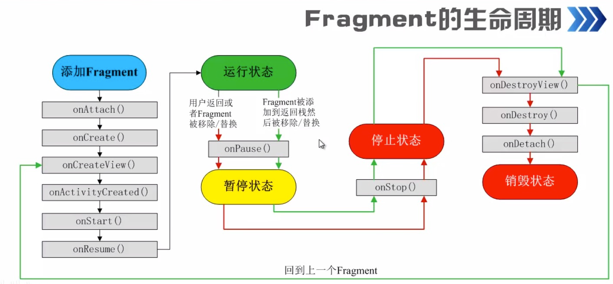


<br/>

***
<br/><br/><br/>

> <h1 id="xml3种布局">xml的3种布局</h1>

```
protected void onCreate(Bundle savedInstanceState) {
        super.onCreate(savedInstanceState);
        EdgeToEdge.enable(this);

        /**
         * setContentView里的内容‘R’为就是系统给声明的静态变量，所有的子类都是通过‘R’来调用。
         * 而‘R’的路径则是 Android 工程路径下的 app -> src -> main -> res 下。
         *
         * R.layout指res文件夹下一个名为layout的文件夹，而R.layout.activity_linear_layout之后的部分则是layout文件夹下自己定义的.xml文件。
         * */
        setContentView(R.layout.activity_test_uilayout2);
        ViewCompat.setOnApplyWindowInsetsListener(findViewById(R.id.main), (v, insets) -> {
            Insets systemBars = insets.getInsets(WindowInsetsCompat.Type.systemBars());
            v.setPadding(systemBars.left, systemBars.top, systemBars.right, systemBars.bottom);
            return insets;
        });
    }
```

<br/><br/><br/>

> <h2 id='线性布局'>线性布局</h2>

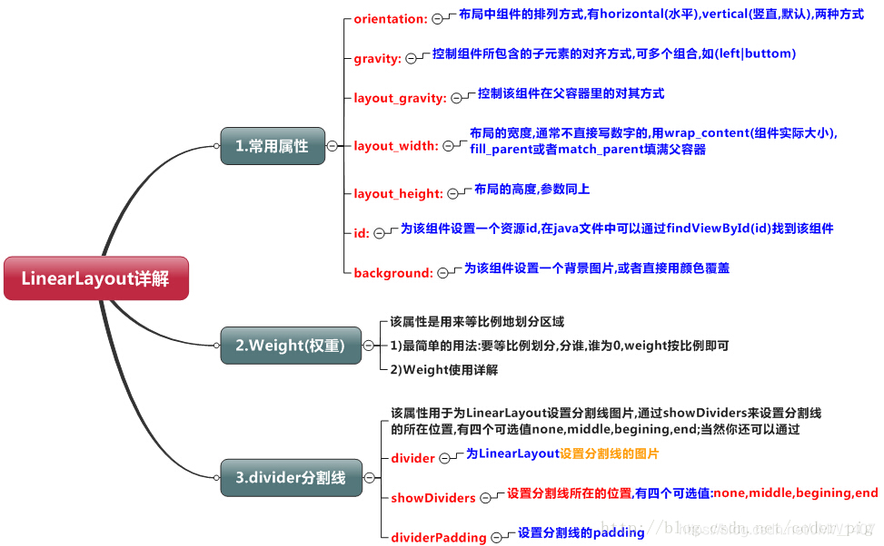

- **android:layout_weight：** 权重，除了被显示占据的空间以外的的空间，然后根据权重的大小来分配空间，使用权重通常会把分配该权重方向的宽度设置为0dp，如果未设置0dp，则该控件会占据指定的宽度，然后再加上根据权重来分配的空间

<br/><br/>

**layout_weight(权重)、gravity（对齐方式）**

```
<LinearLayout
    android:layout_marginTop="30dp"
    android:layout_width="match_parent"
    android:layout_height="wrap_content">
    <TextView
        android:layout_width="0dp"
        android:layout_height="45dp"
        android:layout_weight="1"
        android:background="#55ff0000"
        android:gravity="center"
        android:text="线性布局aaaaaaaaaaaaaaaaa"/>


    <TextView
        android:layout_width="0dp"
        android:layout_height="45dp"
        android:layout_weight="2"
        android:background="#5500ff00"
        android:gravity="center"
        android:text="线性布局 b"/>

    <TextView
        android:layout_width="0dp"
        android:layout_height="45dp"
        android:layout_weight="3"
        android:background="#550000ff"
        android:gravity="center"
        android:text="线性布局c"/>

</LinearLayout>
```

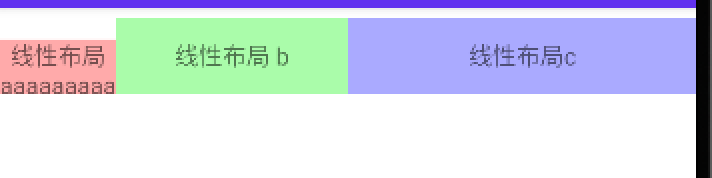

很明显，第一个textview的对齐方式不是我们想要的，出现这种现象的原因是LinearLayout默认子控件按照基准线对齐，所以我们需要在LinearLayout`中添加一个属性就即可解决：android:baselineAligned=“false” 使得子控件不按照基线对齐。

<br/>

- **weightSum属性得使用**

如果布局中只有一个控件，并且我只想让它占据1/2的宽度，这个时候就可以利用LinearLayout的weightSum属性，来看看这个例子


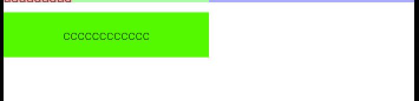


<br/><br/><br/>

> <h2 id='相对布局RelativeLayout'>相对布局 RelativeLayout</h2>

相对布局：相对布局也是常用的布局之一，它可以设置某一个控件相对于其他控件的位置，这些位置可以包括上下左右等，因此相较于其他的布局方式而言具有很大的灵活性。

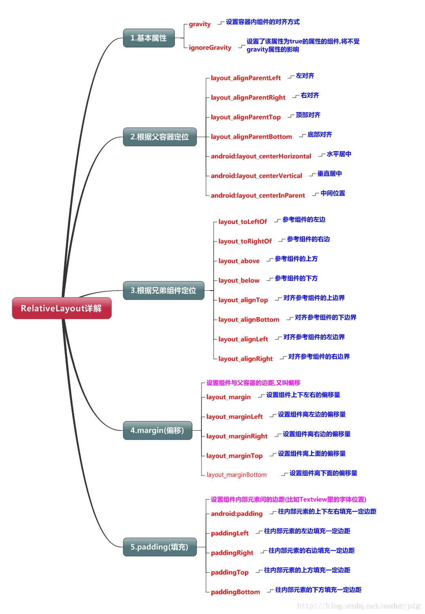


<br/><br/><br/>

> <h2 id="父容器定位属性示意图">父容器定位属性示意图</h2>

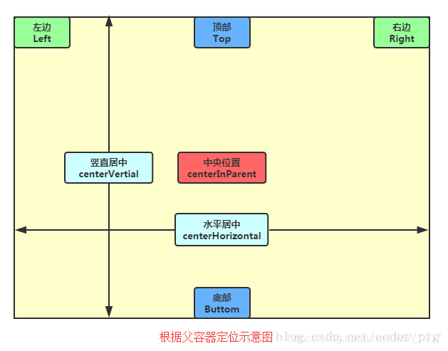


<br/><br/><br/>

> <h2 id="兄弟组件定位">兄弟组件定位</h2>

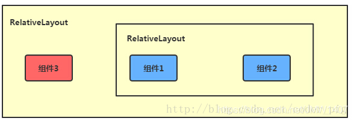

图中的组件1,2就是兄弟组件了,而组件3与组件1或组件2并不是兄弟组件,所以组件3不能通过 组件1或2来进行定位,比如layout_toleftof = "组件1"这样是会报错的！


<br/><br/><br/>> <h2 id="梅花布局">梅花布局</h2>


```
<RelativeLayout xmlns:android="http://schemas.android.com/apk/res/android"
    xmlns:app="http://schemas.android.com/apk/res-auto"
    xmlns:tools="http://schemas.android.com/tools"
    android:id="@+id/main"
    android:layout_width="match_parent"
    android:layout_height="match_parent"
    android:orientation="horizontal"
    tools:context=".TestModules.TestFruitAdapter$TestUILayoutActivityTest">

		<Button
        android:id="@+id/uiLayout3_0"
        android:layout_width="wrap_content"
        android:layout_height="wrap_content"
        android:layout_above="@id/test_uiLayout_button2_2"
        android:layout_toLeftOf="@id/test_uiLayout_button2_2"
        android:textColor="@color/red_Crimson_DC143C"
        android:text="按钮🐔" />


    <Button
        android:id="@+id/uiLayout3_1"
        android:layout_width="wrap_content"
        android:layout_height="wrap_content"
        android:layout_above="@id/test_uiLayout_button2_2"
        android:layout_toRightOf="@id/test_uiLayout_button2_2"
        android:text="按钮🐦" />


    <Button
        android:id="@+id/test_uiLayout_button2_2"
        android:layout_width="wrap_content"
        android:layout_height="wrap_content"
        android:layout_centerInParent="true"
        android:text="中心⏰🌞 2_2" />

    <Button
        android:id="@+id/uiLayout3_2"
        android:layout_width="wrap_content"
        android:layout_height="wrap_content"
        android:layout_below="@id/test_uiLayout_button2_2"
        android:layout_toLeftOf="@id/test_uiLayout_button2_2"
        android:textColor="@color/red_Crimson_DC143C"
        android:text="按钮🐣" />


    <Button
        android:id="@+id/uiLayout3_3"
        android:layout_width="wrap_content"
        android:layout_height="wrap_content"
        android:layout_below="@id/test_uiLayout_button2_2"
        android:layout_toRightOf="@id/test_uiLayout_button2_2"
        android:text="按钮🪿" />
</RelativeLayout>
```

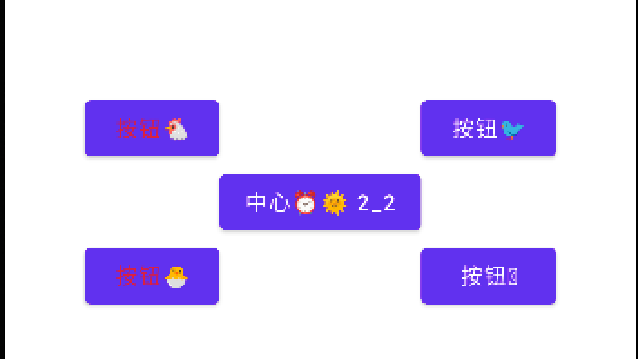


<br/><br/><br/>

> <h2 id="属性说明">属性说明</h2>

<br/><br/><br/>

> <h2 id="属性值为true或false相对于父元素的位置">属性值为true或false：相对于父元素的位置</h2>

```
android:layout_centerHrizontal 水平居中
android:layout_centerVertical 垂直居中
android:layout_centerInparent 相对于父元素完全居中
android:layout_alignParentBottom 贴紧父元素的下边缘
android:layout_alignParentLeft 贴紧父元素的左边缘
android:layout_alignParentRight 贴紧父元素的右边缘
android:layout_alignParentTop 贴紧父元素的上边缘
android:layout_alignWithParentIfMissing 如果对应的兄弟元素找不到的话就以父元素做参照物
```

**元素在父容器中间**

```
<RelativeLayout
    android:layout_marginTop="10dp"
    android:layout_width="match_parent"
    android:layout_height="100dp"
    android:background="@color/red_FF1493">
    
    <TextView
        android:id="@+id/middle"
        android:layout_width="wrap_content"
        android:layout_height="wrap_content"
        android:layout_centerInParent="true"
        android:background="@color/blue_0000FF"
        android:textColor="@color/white"
        android:text="RelativeLayout 我在最中间"/>
        
</RelativeLayout>
```


<br/><br/><br/>

> <h2 id="属性值必须为id的引用名“@id/id-name”">属性值必须为id的引用名“@id/id-name”，</h2>

```
//相对于子元素外部的位置
android:layout_below 在某元素的下方
android:layout_above 在某元素的的上方
android:layout_toLeftOf 在某元素的左边
android:layout_toRightOf 在某元素的右边
//相对于子元素内部的位置
android:layout_alignTop 本元素的上边缘和某元素的的上边缘对齐
android:layout_alignLeft 本元素的左边缘和某元素的的左边缘对齐
android:layout_alignBottom 本元素的下边缘和某元素的的下边缘对齐
android:layout_alignRight 本元素的右边缘和某元素的的右边缘对齐
```

<br/><br/><br/>

> <h2 id="在元素周围">在元素周围</h2>

```
 <RelativeLayout
    android:layout_marginTop="20dp"
    android:layout_width="match_parent"
    android:layout_height="300dp"
    android:background="@color/teal_200">
    <TextView
        android:id="@+id/middle"
        android:layout_width="200dp"
        android:layout_height="200dp"
        android:gravity="center"
        android:layout_centerInParent="true"
        android:background="@android:color/holo_blue_bright"
        android:text="我在最中间"/>
    <TextView
        android:layout_width="wrap_content"
        android:layout_height="wrap_content"
        android:layout_below="@id/middle"
        android:text="layout_below"
        android:layout_centerHorizontal="true"
        android:background="@android:color/holo_green_light"/>
    <TextView
        android:layout_width="wrap_content"
        android:layout_height="wrap_content"
        android:layout_above="@id/middle"
        android:text="layout_above"
        android:layout_centerHorizontal="true"
        android:background="@android:color/holo_green_light"/>
    <TextView
        android:layout_width="wrap_content"
        android:layout_height="wrap_content"
        android:layout_toLeftOf="@id/middle"
        android:text="layout_toLeftOf"
        android:layout_centerVertical="true"
        android:background="@android:color/holo_green_light"/>
    <TextView
        android:layout_width="wrap_content"
        android:layout_height="wrap_content"
        android:layout_toRightOf="@id/middle"
        android:text="layout_toRightOf"
        android:layout_centerVertical="true"
        android:background="@android:color/holo_green_light"/>
</RelativeLayout>
```

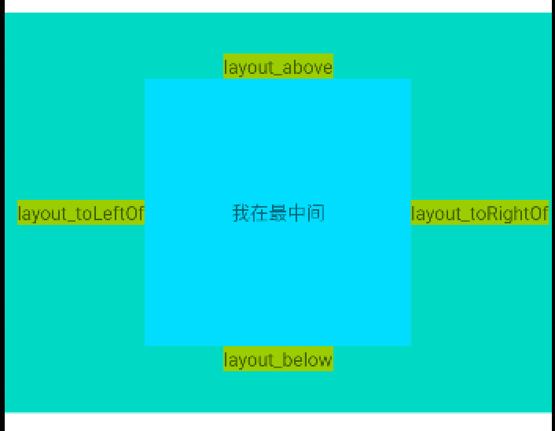


<br/><br/><br/>

> <h2 id="相对于元素内部四周">相对于元素内部四周</h2>

```
<RelativeLayout
    xmlns:android="http://schemas.android.com/apk/res/android"
    android:layout_width="match_parent"
    android:layout_height="300dp"
    android:background="@color/red_Crimson_DC143C">
    <TextView
        android:id="@+id/middle"
        android:layout_width="200dp"
        android:layout_height="200dp"
        android:gravity="center"
        android:layout_centerInParent="true"
        android:background="@android:color/holo_blue_bright"
        android:text="我在最中间"/>
    <TextView
        android:layout_width="wrap_content"
        android:layout_height="wrap_content"
        android:layout_alignBottom="@id/middle"
        android:text="layout_alignBottom"
        android:layout_centerHorizontal="true"
        android:background="@android:color/holo_orange_light"/>
    <TextView
        android:layout_width="wrap_content"
        android:layout_height="wrap_content"
        android:layout_alignTop="@id/middle"
        android:text="layout_alignTop"
        android:layout_centerHorizontal="true"
        android:background="@android:color/holo_orange_light"/>
    <TextView
        android:layout_width="wrap_content"
        android:layout_height="wrap_content"
        android:layout_alignLeft="@id/middle"
        android:text="alignLeft"
        android:layout_centerVertical="true"
        android:background="@android:color/holo_orange_light"/>
    <TextView
        android:layout_width="wrap_content"
        android:layout_height="wrap_content"
        android:layout_alignRight="@id/middle"
        android:text="alignRight"
        android:layout_centerVertical="true"
        android:background="@android:color/holo_orange_light"/>
</RelativeLayout>

```


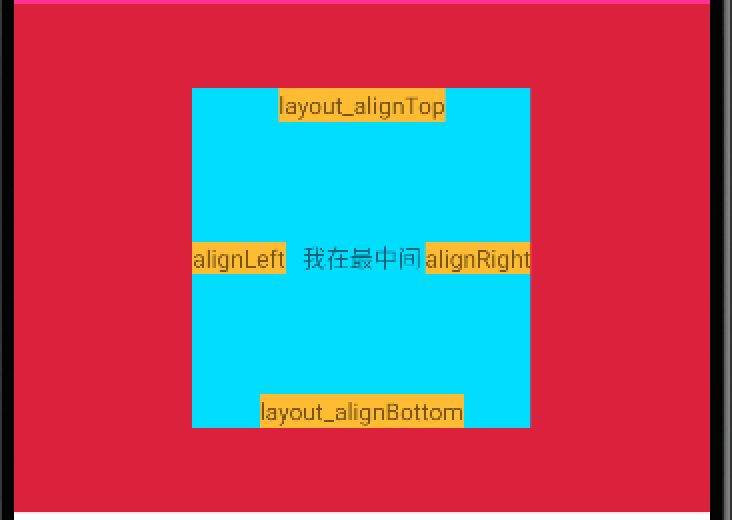

<br/><br/><br/>

> <h2 id="属性值为具体的像素值，如30dip，40px">属性值为具体的像素值，如30dip，40px</h2>

```
android:layout_marginBottom 离某元素底边缘的距离
android:layout_marginLeft 离某元素左边缘的距离
android:layout_marginRight 离某元素右边缘的距离
android:layout_marginTop 离某元素上边缘的距离
```

<br/><br/>

**android:gravity**

- **android:gravity**属性是对该view 内容的限定．比如一个button 上面的text. 你可以设置该text 在view的靠左，靠右等位置．以button为例，android:gravity="right"则button上面的文字靠右


<br/><br/> 

**android:layout_gravity**

- **android:layout_gravity**是用来设置该view相对与起父view 的位置．比如一个button在Linearlayout(线性布局)里，你想把该button放在靠左、靠右等位置就可以通过该属性设置．以button为例，android:layout_gravity="right"则button靠右


<br/><br/><br/>

> <h2 id="padding与layout_margin的区别与用法
">padding与layout_margin的区别与用法
</h2>

**Margin:设置组件与父容器(通常是布局)的边距**

```
android:layout_margin: 指定控件的四周的外部留出一定的边距
android:layout_marginLeft: 指定控件的左边的外部留出一定的边距
android:layout_marginTop: 指定控件的上边的外部留出一定的边距
android:layout_marginRight: 指定控件的右边的外部留出一定的边距
android:layout_marginBottom: 指定控件的下边的外部留出一定的边距
```

<br/>

**Padding:设置组件内部元素间的边距(可以理解为填充)**

```
android:padding :指定控件的四周的内部留出一定的边距
android:paddingLeft: 指定控件的左边的内部留出一定的边距
android:paddingTop: 指定控件的上边的内部留出一定的边距
android:paddingRight: 指定控件的右边的内部留出一定的边距
android:paddingBottom: 指定控件的下边的内部留出一定的边距
```


<br/><br/>

**android:layout_margin** 就是设置view的上下左右边框的额外空间

**android:padding** 是设置内容相对view的边框的距离

- **padding**，含义为“填充”，像垫肩压类似的填充物，一个控件的padding及此控件内部的填充，由此可见padding是以所被定义的控件A为parent控件，而内部的内容物与控件A的间距。而layout_margin是A控件所在的控件为parent控件，是A与其的间距。

<br/>

其实概念很简单，padding是站在父view的角度描述问题，它规定它里面的内容必须与这个父view边界的距离。margin则是站在自己的角度描述问题，规定自己和其他（上下左右）的view之间的距离，如果同一级只有一个view，那么它的效果基本上就和padding一样了


```
当按钮分别设置以上两个属性时，得到的效果是不一样的。
android:paddingLeft="30px"

按钮上设置的内容（例如图片）离按钮左边边界30个像素
android:layout_marginLeft="30px"
整个按钮离左边设置的内容30个像素
```


<br/><br/><br/>

> <h2 id="相对布局ConstraintLayout">相对布局 ConstraintLayout</h2>

| 属性 | 描述 |
|:--|:--|
| app:layout_constraintLeft_toLeftOf | 把A的left side放在B的left side（左边对齐） |
| app:layout_constraintLeft_toRightOf | 把A的left side放在B的right side（左边相对右边对齐） |
| app:layout_constraintRight_toLeftOf | 把A的right side放在B的left side（右边相对左边对齐） |
| app:layout_constraintRight_toRightOf | 把A的right side放在B的right side（右边对齐） |
| app:layout_constraintTop_toTopOf | 把A的top side放在B的top side（顶部对齐） |
| app:layout_constraintTop_toBottomOf | 把A的top side放在B的bottom side（顶部相对底部对齐） |
| app:layout_constraintBottom_toTopOf | 把A的bottom side放在B的top side（底部相对顶部对齐） |
| app:layout_constraintBottom_toBottomOf | 把A的bottom side放在B的bottom side（底部对齐） |
| app:layout_constraintStart_toEndOf | 把A的start position放在B的end position（起始位置相对结束位置对齐） |
| app:layout_constraintStart_toStartOf | 把A的start position放在B的start position（起始位置对齐） |
| app:layout_constraintEnd_toStartOf | 把A的end position放在B的start position（结束位置相对起始位置对齐） |
| app:layout_constraintEnd_toEndOf | 把A的end position放在B的end position（结束位置对齐） |
| app:layout_constraintBaseline_toBaselineOf	 | 把A的bottom side放在B的top side（基准线对齐） |


```
<androidx.constraintlayout.widget.ConstraintLayout
    android:layout_width="match_parent"
    android:layout_height="match_parent"
    android:layout_marginTop="10dp"
    android:background="@color/green_40E0D0">

    <android.widget.Button
        android:id="@+id/a"
        android:layout_width="100dp"
        android:layout_height="60dp"
        android:text="A"
        android:background="@color/red_FF1493"
        app:layout_constraintLeft_toLeftOf="parent"
        app:layout_constraintTop_toTopOf="parent" />

    <android.widget.Button
        android:id="@+id/b"
        android:layout_width="100dp"
        android:layout_height="60dp"
        android:text="B"
        android:background="@color/red_Crimson_DC143C"
        app:layout_constraintLeft_toRightOf="@id/a"
        app:layout_constraintTop_toTopOf="@id/a" />

    <android.widget.Button
        android:id="@+id/c"
        android:layout_width="100dp"
        android:layout_height="60dp"
        android:text="C"
        android:background="@color/purple_700"
        app:layout_constraintLeft_toLeftOf="@id/a"
        app:layout_constraintTop_toBottomOf="@id/a" />

    <android.widget.Button
        android:id="@+id/d"
        android:layout_width="100dp"
        android:layout_height="60dp"
        android:text="D"
        android:background="@color/red_FF1493"
        app:layout_constraintLeft_toRightOf="@id/a"
        app:layout_constraintTop_toTopOf="@id/c" />

</androidx.constraintlayout.widget.ConstraintLayout>

```

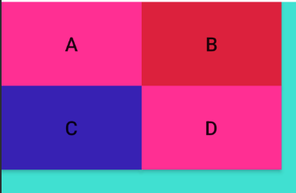

- **从中可以看到**

	- 1、layout_constraint*属性的值可以是某个id或者parent（父布局）

	- 2、B要位于A的右边，则使用`app:layout_constraintLeft_toRightOf="@id/a"`,C位于A的下边，则使用`app:layout_constraintTop_toBottomOf="@id/a"`

对于一个View的边界界定，官方给了下面这张图：

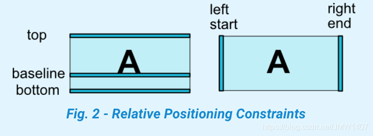


<br/><br/><br/>

> <h2 id="layout_goneMarginEnd和layout_marginEnd区别">layout_goneMarginEnd和layout_marginEnd区别</h2>

id为right_topdeTextView没有`android:visibility="gone"`
时的代码

```
<androidx.constraintlayout.widget.ConstraintLayout
    android:layout_marginTop="20dp"
    android:background="@color/teal_200"
    android:id="@+id/root"
    android:layout_width="match_parent"
    android:layout_height="match_parent">

    <TextView
        android:id="@+id/right_top"
        android:layout_width="wrap_content"
        android:layout_height="wrap_content"
        android:background="@color/purple_200"
        android:gravity="center"
        android:text="右上角1111111"
        app:layout_goneMarginStart="20dp"
        android:layout_marginStart="20dp"
        android:textSize="32sp"
        app:layout_constraintEnd_toEndOf="parent"
        app:layout_constraintTop_toTopOf="parent"
        app:layout_constraintWidth_min="120dp" />

    <TextView
        android:id="@+id/where"
        android:layout_width="wrap_content"
        android:layout_height="wrap_content"
        android:text="我在哪里"
        app:layout_goneMarginEnd="160dp"
        android:layout_marginEnd="40dp"
        android:background="#ff0000"
        app:layout_constraintTop_toTopOf="parent"
        app:layout_constraintRight_toLeftOf="@+id/right_top"/>
</androidx.constraintlayout.widget.ConstraintLayout>

```

xml的图：

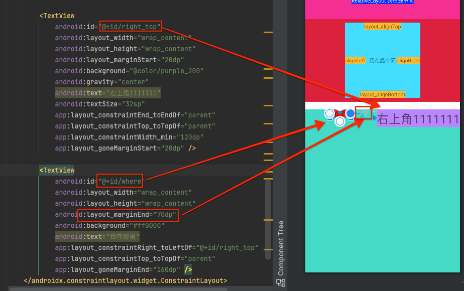

实际效果图：

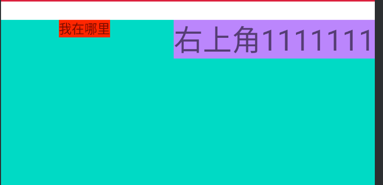

<br/><br/>

@+id/right_top的TextView加上`android:visibility="gone"`属性后如下：

```
<androidx.constraintlayout.widget.ConstraintLayout
    android:id="@+id/root"
    android:layout_width="match_parent"
    android:layout_height="match_parent"
    android:layout_marginTop="20dp"
    android:background="@color/teal_200">

    <TextView
        android:id="@+id/right_top"
        android:layout_width="wrap_content"
        android:layout_height="wrap_content"
        android:layout_marginStart="20dp"
        android:background="@color/purple_200"
        android:gravity="center"
        android:text="右上角1111111"
        android:textSize="32sp"
        android:visibility="gone"
        app:layout_constraintEnd_toEndOf="parent"
        app:layout_constraintTop_toTopOf="parent"
        app:layout_constraintWidth_min="120dp"
        app:layout_goneMarginStart="20dp" />

    <TextView
        android:id="@+id/where"
        android:layout_width="wrap_content"
        android:layout_height="wrap_content"
        android:layout_marginEnd="70dp"
        android:background="#ff0000"
        android:text="我在哪里"
        app:layout_constraintRight_toLeftOf="@+id/right_top"
        app:layout_constraintTop_toTopOf="parent"
        app:layout_goneMarginEnd="260dp" />
</androidx.constraintlayout.widget.ConstraintLayout>
```

Xml效果图：

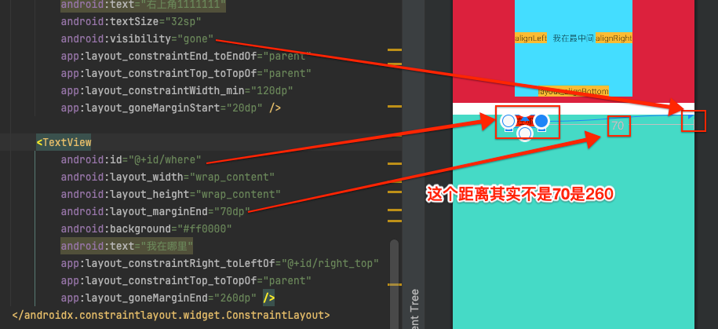

<br/>

效果图：

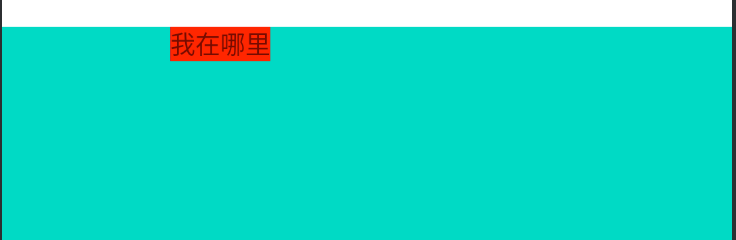


**总结：**

- 这里使用了两种margin属性：
	- 一种就是**app:layout_goneMarginEnd**，这个只在right_top被gone的时候生效；
	- 一种就是`android:layout_marginEnd`，任何时候都生效。

但是这里的margin需要生效，只有id为where的TextView被id为right_top的TextView所约束，那么id为where的TextView的margin相对于id为right_top的TextView的才生效。

而id为right_top的TextView并没有被id为where的TextView约束，所以id为right_top的TextView的margin_start其实看不到生效。这里其实可以认为right_top的margin_start生效了，只不过是相对于parent的左边，但是因为right_top在parent的右上角，所以看不到这个margin效果


<br/><br/><br/>

> <h2 id="viewgone的理解">view gone的理解</h2>

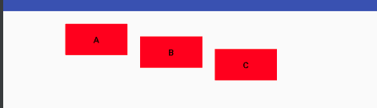

```
<?xml version="1.0" encoding="utf-8"?>
<android.support.constraint.ConstraintLayout 
    ...>

    <android.widget.Button
        android:id="@+id/a"
        ...
        android:layout_marginLeft="100dp"
        android:layout_marginTop="20dp"
        app:layout_constraintLeft_toLeftOf="parent"
        app:layout_constraintTop_toTopOf="parent" />

    <android.widget.Button
        android:id="@+id/b"
        ...
        android:layout_marginLeft="20dp"
        android:layout_marginTop="20dp"
        app:layout_constraintLeft_toRightOf="@id/a"
        app:layout_constraintTop_toTopOf="@id/a"
         />

    <android.widget.Button
        android:id="@+id/c"
       ....
        android:layout_marginLeft="20dp"
        android:layout_marginTop="20dp"
        app:layout_constraintLeft_toRightOf="@id/b"
        app:layout_constraintTop_toTopOf="@id/b" />
</android.support.constraint.ConstraintLayout>
```

<br/>

考虑一个问题，如果B动态设为gone了，C会怎么显示呢？

真实情况如下：

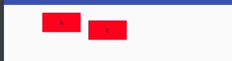

<br/>
为什么会这样显示呢？看他的蓝图应该会好理解些：

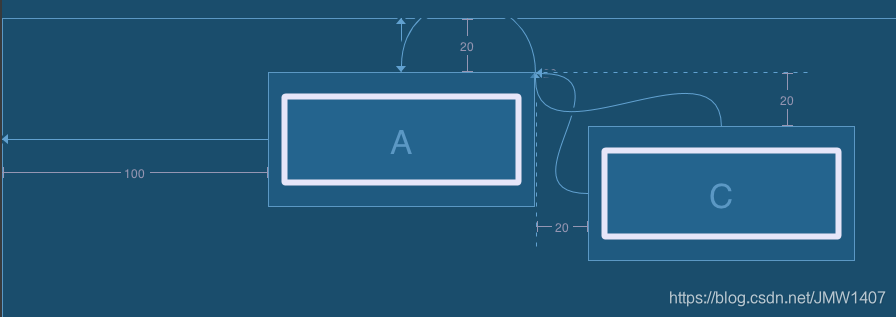


可以看出，b设为gone之后，他的宽、高、margin都失效了，变为一个点了，但它的constrain还生效，位于指定的位置。c还是可以继续以他为锚点。

那么如何解决关于View gone引起的非预期的布局变化呢？

- 1、如果可以，尽量使用invisible
- 2、尽量其他view的布局不依赖会gone的view
- 3、google也提供了属性layout_goneMargin*=“xdp”，意思是比如当

constrainleft的锚点gone时，layout_goneMarginLeft将生效。但因
为这个只能设置固定的距离，个人感觉灵活性不是很高。


<br/><br/><br/>

> <h2 id="巧妙居中">巧妙居中</h2>

一个view如何设置为居中呢？如果查找属性，会发现并没有如RelativeLayout类似的layout_centerVertical属性，那如何设置居中呢？constraint的思想很巧妙。

```
app:layout_constraintLeft_toLeftOf="parent"
app:layout_constraintRight_toRightOf="parent"
app:layout_constraintTop_toTopOf="parent"
app:layout_constraintBottom_toBottomOf="parent"
```

<br/>

大家知道如果设置`app:layout_constraintLeft_toLeftOf=“parent”`,则view会贴着父view的左边，设置`app:layout_constraintRight_toRightOf=“parent” `则会贴着右边，那如果两个都设置，效果会怎样呢？

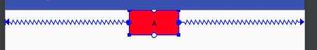


<br/><br/><br/>

> <h2 id="弹性居中">弹性居中</h2>

```
<androidx.constraintlayout.widget.ConstraintLayout
    xmlns:android="http://schemas.android.com/apk/res/android"
    xmlns:app="http://schemas.android.com/apk/res-auto"
    xmlns:tools="http://schemas.android.com/tools"
    android:layout_marginTop="20dp"
    android:id="@+id/root"
    android:background="@color/blue_0000FF"
    android:layout_width="match_parent"
    android:layout_height="match_parent">

    <TextView
        android:id="@+id/left_top"
        android:layout_width="wrap_content"
        android:layout_height="wrap_content"
        android:background="@color/teal_200"
        android:gravity="center"
        android:text="左上角"
        android:textSize="32sp"
        app:layout_constraintStart_toStartOf="@id/root"
        app:layout_constraintTop_toTopOf="parent"
        app:layout_constraintWidth_min="120dp" />

    <TextView
        android:id="@+id/right_top"
        android:layout_width="wrap_content"
        android:layout_height="wrap_content"
        android:background="@color/red_FF1493"
        android:gravity="center"
        android:text="右上角"
        app:layout_goneMarginStart="20dp"
        android:layout_marginStart="20dp"
        android:textSize="32sp"
        app:layout_constraintEnd_toEndOf="parent"
        app:layout_constraintTop_toTopOf="parent"
        app:layout_constraintWidth_min="120dp" />

    <TextView
        android:layout_width="wrap_content"
        android:layout_height="wrap_content"
        android:text="我在哪里"
        android:background="#ff0000"
        app:layout_constraintLeft_toRightOf="@+id/left_top"
        app:layout_constraintTop_toTopOf="parent"
        app:layout_constraintRight_toLeftOf="@+id/right_top"/>
</androidx.constraintlayout.widget.ConstraintLayout>

```


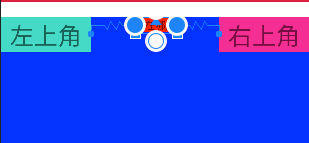

至此可以看出，对constraint的理解其实可以看成是像两个弹簧一样，如果只在左边加一个弹簧，右边没有，那左边的势必会把view拉到左边去，如果在右边也加一根弹簧，两个弹簧力相互平衡，则view就居中了。

<br/><br/>

上面是view居中，如果我想让view向左偏一些，或者位于1/3处该怎么处理？其实也是一样的，想象一下，如果左边的弹簧力大一些，view不是就自然往左偏了嘛。如何使力大一些呢？使用如下属性

<br/>

- `layout_constraintHorizontal_bias`

- `layout_constraintVertical_bias`

这两个属性单独使用并不能生效，水平方向的必须要给控件的左右两边都添加约束才会生效，垂直方向的必须要给控件的上下两边都添加约束才可以生效。

<br/>

bias即偏移量,他们的取值范围从0~1，0即挨着左边，1是挨着右边，所以要使处于1/3处，可以设置如下属性`app:layout_constraintHorizontal_bias=“0.33”`,效果图如下：


```
    <androidx.constraintlayout.widget.ConstraintLayout xmlns:android="http://schemas.android.com/apk/res/android"
        xmlns:app="http://schemas.android.com/apk/res-auto"
        xmlns:tools="http://schemas.android.com/tools"
        android:id="@+id/root"
        android:layout_width="match_parent"
        android:layout_height="match_parent"
        android:background="@color/purple_200">

        <android.widget.Button
            android:id="@+id/button13"
            android:layout_width="wrap_content"
            android:layout_height="wrap_content"
            android:background="@color/red_FF1493"
            android:text="Button"
            app:layout_constraintHorizontal_bias="0.4"
            app:layout_constraintLeft_toRightOf="@+id/left_top"
            app:layout_constraintRight_toRightOf="parent"
            app:layout_constraintVertical_bias="0"
            tools:layout_editor_absoluteX="120dp"
            tools:layout_editor_absoluteY="189dp"
            tools:ignore="MissingConstraints" />

        <TextView
            android:id="@+id/left_top"
            android:layout_width="wrap_content"
            android:layout_height="wrap_content"
            android:background="@color/teal_700"
            android:gravity="center"
            android:text="左上角"
            android:textSize="32sp"
            app:layout_constraintStart_toStartOf="@id/root"
            app:layout_constraintTop_toTopOf="parent"
            app:layout_constraintWidth_min="120dp" />
    </androidx.constraintlayout.widget.ConstraintLayout>

```

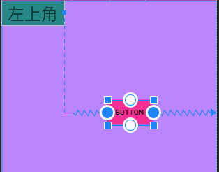

比如这个例子，Button的左边被TextView的右边约束，Button的右边被parent约束，这样Button的左右两边都有约束，那么给Button添加水平方向的bias属性就可以生效，即根据Button的左边约束偏移一定的比例，这里就是相对于TextView的右边位置偏移40%。
bias的偏移，是根据控件的水平或者垂直方向的剩余位置的百分比来偏移。


<br/><br/><br/>

> <h2 id="view的尺寸">view的尺寸</h2>

设置view的大小除了传统的wrap_content、指定尺寸、match_parent(虽然官方不推荐使用match_parent)外，还可以设置为0dp（官方取名叫MATCH_CONSTRAINT），0dp在constraint可不是指大小是0dp，而是有特殊含义的。他的作用会随着不同的设置有不同的含义：

layout_constraintWidth_default，有三个取值，作用如下：

<br/><br/><br/>

> <h2 id="spread占用符合约束空间">spread占用符合约束空间</h2>

- **1、spread，默认值，意思是占用所有的符合约束的空间**

```
<androidx.constraintlayout.widget.ConstraintLayout
    android:id="@+id/root"
    android:layout_width="match_parent"
    android:layout_height="match_parent"
    android:layout_marginTop="20dp"
    android:background="@color/purple_200">

    <android.widget.Button
        android:id="@+id/a"
        android:layout_width="0dp"
        android:layout_height="81dp"
        android:layout_marginLeft="20dp"
        android:layout_marginRight="20dp"
        android:background="@color/red_Crimson_DC143C"
        android:text="A"
        app:layout_constraintLeft_toLeftOf="parent"
        app:layout_constraintRight_toRightOf="parent"
        tools:ignore="MissingConstraints" />


</androidx.constraintlayout.widget.ConstraintLayout>
```

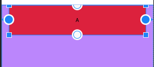

可以看到layout_width为0dp，实际的效果则是宽度和约束一样，左右两边的留白是margin的效果。


<br/><br/><br/>

> <h2 id="百分比占用空间">百分比占用空间</h2>


- **2.percent，意思是按照父布局的百分比设置,需要layout_constraintWidth_percent设置百分比例**

```
 <androidx.constraintlayout.widget.ConstraintLayout xmlns:android="http://schemas.android.com/apk/res/android"
    xmlns:app="http://schemas.android.com/apk/res-auto"
    xmlns:tools="http://schemas.android.com/tools"
    android:id="@+id/root"
    android:layout_width="300dp"
    android:layout_height="400dp"
    android:layout_marginTop="20dp"
    android:layout_marginLeft="40dp"
    android:background="@color/blue_0000FF"
    app:layout_constraintHorizontal_bias="0.3">

    <android.widget.Button
        android:id="@+id/a"
        android:layout_width="0dp"
        android:layout_height="60dp"
        android:background="@color/red_Crimson_DC143C"
        android:text="AAAAA"
        app:layout_constraintRight_toRightOf="parent"
        app:layout_constraintWidth_default="percent"
        app:layout_constraintWidth_percent="0.4"
        tools:ignore="MissingConstraints" />

</androidx.constraintlayout.widget.ConstraintLayout>
```

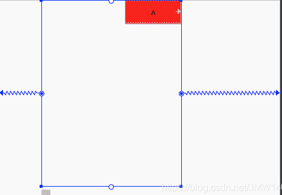

效果图：

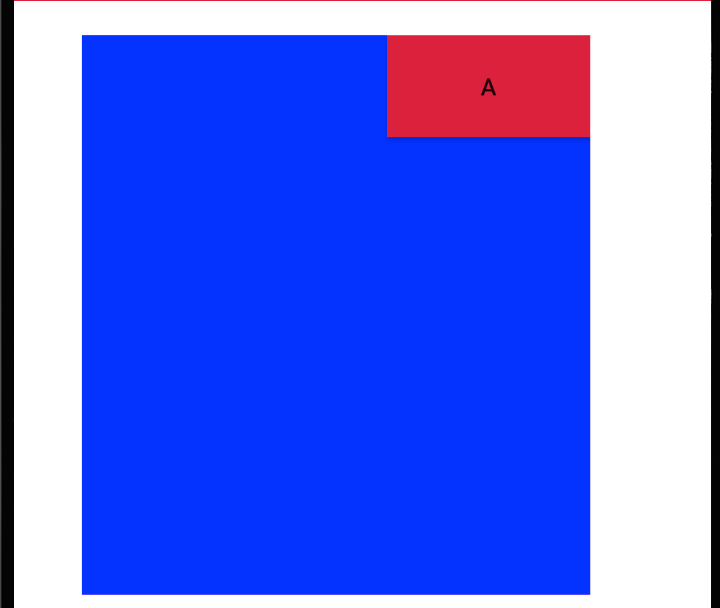

A的宽度设为0.4，则其宽度为父布局的0.4倍。另外，设置了layout_constraintWidth_percent属性，可以不用指定layout_constraintWidth_default，他会自动设置为percent

<br/><br/><br/>

> <h2 id="wrap">wrap</h2>

意思匹配内容大小但不超过约束限制，注意和直接指定宽度为wrap_content的区别就是不超过约束限制，如下：

```
<androidx.constraintlayout.widget.ConstraintLayout xmlns:android="http://schemas.android.com/apk/res/android"
    xmlns:app="http://schemas.android.com/apk/res-auto"
    xmlns:tools="http://schemas.android.com/tools"
    android:id="@+id/root"
    android:layout_width="match_parent"
    android:layout_height="match_parent"
    android:layout_marginTop="20dp"
    android:background="@color/blue_0000FF">

    <android.widget.Button
        android:id="@+id/a"
        android:layout_width="0dp"
        android:layout_height="60dp"
        android:background="@color/red_Crimson_DC143C"
        android:text="A"
        app:layout_constraintLeft_toLeftOf="parent"
        tools:ignore="MissingConstraints" />

    <android.widget.Button
        android:id="@+id/c"
        android:layout_width="0dp"
        android:layout_height="60dp"
        android:background="@color/red_Crimson_DC143C"
        android:text="C"
        app:layout_constraintRight_toRightOf="parent"
        tools:ignore="MissingConstraints" />


    <android.widget.Button
        android:id="@+id/b"
        android:layout_width="0dp"
        android:layout_height="60dp"
        android:background="@color/green_40E0D0"
        android:text="bbbbbbbbbbbbbbbbbbbbbbbbbb1111111111111111"
        app:layout_constraintLeft_toRightOf="@id/a"
        app:layout_constraintRight_toLeftOf="@id/c"
        app:layout_constraintWidth_default="wrap"
        tools:ignore="MissingConstraints" />

    <android.widget.Button
        android:id="@+id/d"
        android:layout_width="wrap_content"
        android:layout_height="60dp"
        android:background="@color/purple_200"
        android:text="ddddddddddddd00000000000000000000000"
        app:layout_constraintLeft_toRightOf="@id/a"
        app:layout_constraintRight_toLeftOf="@id/c"
        app:layout_constraintTop_toBottomOf="@id/b" />

</androidx.constraintlayout.widget.ConstraintLayout>

```


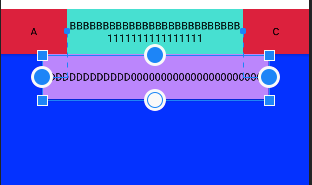

可以看到虽然文字很长，但第一行的绿色button宽度达到约束时，就不在增加，而第二行的button显示了完整的内容，超过约束的限制。

<br/><br/><br/>

> <h2 id="ratio宽高比例">ratio宽高比例</h2>


layout_constraintDimensionRatio，即宽和高成一定的比例，其值可以是"width:height"的形式，也可以是width/height的值。该属性生效的前提：宽和高其中有一项为0dp，有constraint。下面按照有几个0dp来分别介绍下：

如果只有一项为0dp，则该项值按照比例计算出来。比如高为20dp，宽为0dp，radio为"2:1",则最终宽为40dp

如果两项都为0dp，则尺寸会设置为满足约束的最大值并保持比例。因为这是系统计算的，有的时候不是我们想要的，我们也可以通过在前面加H、W来指定是哪一个边需要计算。例如"H,2:1",则是指宽度匹配约束，高度是宽度的1/2


<br/><br/><br/>

> <h2 id="max和min">max和min</h2>

```
layout_constraintWidth_min
layout_constraintWidth_max
layout_constraintHeight_max
layout_constraintHeight_min

```

- 在ConstraintLayout中给控件设置min的宽度和高度，必须是要控件的layout_width或者layout_height为wrap_content或者0dp时。

- 给控件设置max的宽度或者高度的时候，必须是要控件的layout_width或者layout_height为0dp时。


<br/>

不过在设置max的时候需要注意一点，如果单纯只是设置了0dp，如果没给控件添加对应的左右约束或者上下约束，比如没有设置左右约束，那么layout_constraintWidth_max设置的再大也不会超过整个控件的wrap_content的长度。

```
<androidx.constraintlayout.widget.ConstraintLayout
    android:id="@+id/root"
    android:layout_width="match_parent"
    android:layout_height="match_parent"
    android:layout_marginTop="20dp"
    android:background="@color/blue_0000FF">
    
    <TextView
        android:layout_width="0dp"
        android:layout_height="wrap_content"
        android:background="@color/purple_200"
        android:maxLines="1"
        android:text="layout_constraintWidth_max1111111111111"
        app:layout_constraintWidth_max="550dp"
        tools:ignore="MissingConstraints"
        tools:layout_editor_absoluteX="100dp"
        tools:layout_editor_absoluteY="100dp" />

</androidx.constraintlayout.widget.ConstraintLayout>
```


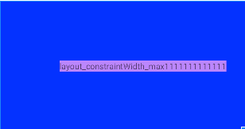

这里的绿色区域的控件，宽度显示的明显没有达到550dp，但是也不会继续变长了。

如果是设置了左右约束，那么最大宽度的限制也就是左右两个约束中间的剩余空间宽度

<br/><br/>

如果是设置了左右约束，那么最大宽度的限制也就是左右两个约束中间的剩余空间宽度


```
<androidx.constraintlayout.widget.ConstraintLayout
    android:id="@+id/root"
    android:layout_width="match_parent"
    android:layout_height="match_parent"
    android:layout_marginTop="20dp"
    android:background="@color/blue_0000FF">
    
    <TextView
        android:layout_width="0dp"
        android:layout_height="wrap_content"
        android:background="@color/purple_200"
        android:maxLines="1"
        android:text="22222222222222222222layout_constraintWidth_max11111111111113333"
        app:layout_constraintWidth_max="550dp"
        app:layout_constraintLeft_toLeftOf="parent"
        app:layout_constraintRight_toRightOf="parent"
        tools:ignore="MissingConstraints"
        tools:layout_editor_absoluteX="100dp"
        tools:layout_editor_absoluteY="100dp" />
</androidx.constraintlayout.widget.ConstraintLayout>
```


<br/><br/><br/>

> <h2 id="Guideline和Barrier">Guideline和Barrier</h2>

- **1.GuideLine**

即参考线的意思，有水平参考线和竖直参考线两种。他的作用就像是一个虚拟的参考线，只是用来方便其他View以他为锚点来布局。

如上一篇所了解到的，ConstraintLayout 的定位原则就是一个View参考其他View的相对布局，如果有的时候当前布局没有合适的参考View，而建一个专门用于定位的View又会太重，这种情况正是GuideLine的用武之地。

```
<androidx.constraintlayout.widget.ConstraintLayout
    android:id="@+id/root"
    android:layout_width="match_parent"
    android:layout_height="match_parent"
    android:layout_marginTop="20dp"
    android:background="@color/blue_0000FF">

    <androidx.constraintlayout.widget.Guideline
        android:id="@+id/guideline"
        android:layout_width="2dp"
        android:layout_height="1dp"
        android:orientation="vertical"
        app:layout_constraintGuide_percent="0.33" />

    <androidx.constraintlayout.widget.Guideline
        android:id="@+id/guideline2"
        android:layout_width="1dp"
        android:layout_height="1dp"
        android:orientation="horizontal"
        app:layout_constraintGuide_begin="130dp" />

    <android.widget.Button
        android:id="@+id/b"
        android:layout_width="0dp"
        android:layout_height="60dp"
        android:background="@color/green_40E0D0"
        android:text="bbbb"
        app:layout_constraintLeft_toLeftOf="@id/guideline"
        app:layout_constraintTop_toTopOf="@id/guideline2"
        app:layout_constraintWidth_default="wrap"
        tools:ignore="MissingConstraints" />


</androidx.constraintlayout.widget.ConstraintLayout>

```


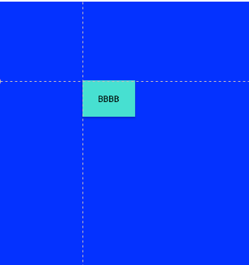

可以看到我分别添加了一个水平参考线和竖直参考线，之后的Button的布局就参考与这两个参考线，而在布局中并不会显示。
Guideline的大部分的属性如layout_width都是不会生效的，而他的位置的确定是由下面三个属性之一来确定的：

- `layout_constraintGuide_begin`：距离父布局的左边或者上边多大距离
- `layout_constraintGuide_end`:距离父布局的右边或者下边多大距离
- `layout_constraintGuide_percent`：百分比，0~1，距离父布局的左边或者上边占父布局的比例

<br/> <br/>

- **2,Barrier**

屏障，一个虚拟View。他主要解决下面遇到的问题：

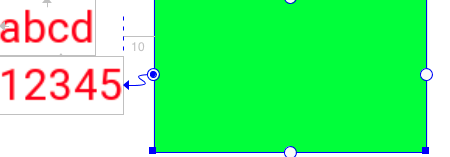

<br/>

如上图布局，两个TextView，一个button位于他们的右边。现在button设置的是在下面TextView的右边。假设有时候上面的TextView文本变长了，则布局会变为下面这个样子：

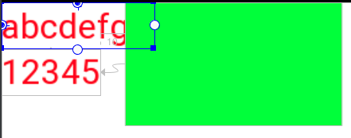

上面的TextView和Button重叠了。这时该怎么解决这个问题呢？Button只能设置一个View作为锚点，设置了上面就顾不了下面了。。。
所以就诞生了Barrier，他可以设置N个View作为锚点，使用方式如下：

```
<android.support.constraint.Barrier
  android:id="@+id/barrier"
  android:layout_width="wrap_content"
  android:layout_height="wrap_content"
  app:barrierDirection="end"//end,left,right,top,bottom
  app:constraint_referenced_ids="text1,text2" />
```

则Barrier始终位于text1,text2两个View最大宽度的右边，示意图如下：


<br/><br/>

- **3.Guideline和Barrier的区别**

这两个都是线条，都是辅助约束的，但是这两个有一点区别，就是当控件比如出现切换手机语言，而造成控件上的文本显示长度出现变化的时候，Guideline并不会随着控件的长度变化而变化，这样就会造成约束不灵活，而Barrier可以根据控件的宽高变化，灵活移动位置。

所以控件宽高是随着内容动态变化的，建议使用Barrier，如果控件的内容是不变的，可以使用Guideline。


<br/><br/><br/>

> <h2 id='详解Application'>详解Application</h2>


**android.app.Application** 类是Android应用程序的基础类，它扮演着整个应用程序环境的全局容器角色。以下几点概述了Application类的主要用途和重要性：

-  **全局状态管理：** 您可以将Application类用作存储整个应用程序范围内的全局状态信息的地方，比如配置设置、全局变量等。通过定义静态成员或实例变量，您可以在应用的所有组件（如Activities、Services、BroadcastReceivers）之间共享数据。

-  **生命周期管理：** 尽管Application类没有像Activity那样的明显生命周期回调（如onCreate、onStart、onResume等），但它确实有一个重要的回调方法onCreate()，该方法在应用程序启动时被调用一次。您可以在onCreate()中执行应用级别的初始化操作，如初始化数据库连接、第三方库、全局变量等。

-  **资源初始化：** 因为Application的onCreate()方法在整个应用启动之初就会被调用，它是进行全局资源初始化的理想时机，例如设置缓存、初始化网络连接池、加载配置文件等。

-  **异常处理：** Application类可以用来实现全局的异常捕获和处理机制，通过自定义的Thread.UncaughtExceptionHandler，可以捕获未处理的异常并采取相应措施，如记录日志、崩溃报告等。

-  **单例模式：** 由于每个Android应用只会有一个Application实例，因此它自然符合单例模式。通过定义静态方法获取这个实例，您可以确保在应用的任何位置都可以访问到相同的Application对象，这有利于管理跨组件共享的资源和服务。

-  **组件间通信：** 虽然不是直接的通信桥梁，但Application类可以作为一个中心点来存放用于跨组件通信的数据或接口，比如使用EventBus时，可以在Application中进行注册和注销。

总之，**android.app.Application**类为开发者提供了一个控制和管理整个应用程序生命周期、状态和资源的中心点，是构建复杂应用架构时不可或缺的一部分。


<br/><br/><br/>

> <h2 id='详解Context'>详解Context</h2>

**Context**是一个非常核心的类，几乎贯穿了整个应用的开发过程。简单来说，Context可以理解为提供给应用访问系统服务和资源的一个桥梁或者环境。每个Android应用组件（如Activity, Service, BroadcastReceiver, ContentProvider）在运行时都会有一个关联的Context对象，它允许该组件访问应用的资源、启动其他组件、获取系统服务等。

<br/><br/><br/>

> <h2 id='getContext()的作用'>getContext()的作用</h2>

getContext() 是Android开发中常见的一个方法，主要在与上下文(Context)相关的类中使用，如View, Fragment等。这个方法的作用是返回当前对象所关联的Android上下文(Context)对象。

<br/><br/>

- **作用：**

	- **访问资源**：通过Context，你可以访问应用的资源，如字符串、图片、布局文件等。例如，`getContext().getString(R.string.app_name)`可以获取应用名称字符串资源。


	-  **启动Activity或Service：** Context提供了启动其他Activity或Service的方法，如`getContext().startActivity(intent)`。

	-  **获取系统服务：** 可以用来获取系统的各种服务，如`LocationManager、NotificationManager`等，如`getContext().getSystemService(Context.LOCATION_SERVICE)`。

	-  **创建View：** 在创建新的View时，通常需要传入一个Context对象，以确保新创建的View能够访问到应用的资源和主题设置。

	-  **文件操作：** 用于访问应用的内部或外部存储空间，如通过getContext().openFileOutput()写入文件。

<br/> <br/>

- **注意事项**

	-  **内存泄漏风险：** 持有Context的引用可能会导致内存泄漏，特别是当长时间持有一个Activity的Context时。推荐在不需要使用Activity特定功能时，使用Application Context而非Activity Context。

	-  **Context类型**：getContext()在不同的场景下可能返回不同类型的Context。在Fragment或View中，通常返回的是宿主Activity的Context；而在Application或Service中直接使用，返回的就是对应类型的Context。


<br/><br/><br/>

> <h2 id="碎片🧩Fragment">碎片🧩Fragment</h2>


<br/>

***
<br/><br/><br/>

> <h1 id="持久化存储">持久化存储</h1>


<br/><br/><br/>

> <h2 id="文件存储">文件存储</h2>

在Android Studio中打开存储的文件：


<br/><br/><br/>

> <h2 id="SharedPreferences存储">SharedPreferences存储</h2>

在Android Studio中打开存储的文件：


<br/>

***

<br/><br/><br/>

> <h1 id="项目配置">项目配置</h1>

<br/><br/><br/>

> <h2 id="Gradle基础">Gradle基础</h2>


1. targetSdkVersion：指定应用程序针对的Android版本；

2. compileSdkVersion 是应用程序编译时使用的Android SDK版本

3. minSdkVersion 是应用程序可以运行的最低Android版本；


<br/><br/><br/>

> <h2 id="Android各个版本">Android各个版本</h2>


| Android 版本 | API 等级 | targetSdkVersion / compileSdkVersion 的值 |
|:--|:--|:--|
| Android 14 | 34 | 34 |
| Android 13 | 33 | 33 |
| Android 12L | 32 | 32 |
| Android 12 | 31 | 31 |
| Android 11 | 30 | 30 |
| Android 10 | 29 | 29 |
| Android 9 | 28 | 28 |
| Android 8.1 | 27 | 27 |
| Android 8.0 | 26 | 26 |
| Android 7.1 | 25 | 25 |
| Android 7.0 | 24 | 24 |
| Android 6.0 | 23 | 23 |
| Android 5.1 | 22 | 22 |
| Android 5.0 | 21 | 21 |
| Android 4.4W | 20 | 20 |
| Android 4.4 | 19 | 19 |
| Android 4.3 | 18 | 18 |
| Android 4.2 | 17 | 17 |
| Android 4.1 | 16 | 16 |
| Android 4.0.3 | 15 | 15 |

<br/><br/><br/>

> <h2 id="配置环境资源">配置环境资源</h2>

你可能需要在不同的资源目录中配置 Beta 环境的特定资源，例如 src/beta。你可以创建一个新的资源目录并添加 Beta 特定的资源文件。

```
src
|-- main
|   |-- java
|   |-- res
|-- beta
|   |-- java
|   |-- res

```

在 src/beta 目录中，你可以放置 Beta 环境特有的资源文件，这些文件会覆盖 src/main 中的文件。


<br/><br/><br/>

> <h2 id="build.gradle文件说明">build.gradle文件说明</h2>

```
apply plugin: 'com.android.application'  //应用 Android 应用程序插件，表示该项目是一个 Android 应用程序项目

android { //这是一个闭包，用于配置 Android 项目的各种设置。
   dataBinding {//这是一个闭包，用于配置数据绑定的相关选项。
   
       enabled true  //enabled true: 这一行启用了数据绑定功能。当设置为 true 时，Gradle 将为项目启用数据绑定功能，允许在布局文件中使用数据绑定表达式
       
       /**
	       数据绑定是 Android 开发中一个强大的工具，它允许将布局文件和应用程序逻辑绑定在一起，使得布局文件中的视图与数据模型之间可以自动同步。
	       启用数据绑定后，你可以在布局文件中使用特定的语法来绑定视图与数据模型，从而简化了视图和逻辑之间的耦合，并提高了代码的可读性和维护性
       **/
   }
    useLibrary 'org.apache.http.legacy'. //使用 Apache HTTP 客户端库，这在 Android 6.0 及以上版本中是非默认的，并且在 Android 9.0 及以上版本中已被标记为弃用
    
    //设置编译时使用的 SDK 版本
    compileSdkVersion build_versions.compile_sdk
       buildToolsVersion build_versions.build_tools

    compileOptions {//配置编译选项，设置源代码和目标代码的兼容性为 Java 11
        sourceCompatibility JavaVersion.VERSION_11
        targetCompatibility JavaVersion.VERSION_11
    }

    defaultConfig {//配置默认的应用程序配置，包括应用程序的包名、最小 SDK 版本、目标 SDK 版本、版本号、版本名等
        applicationId "com.xxx.android.xxx"
        minSdkVersion build_versions.min_sdk
        targetSdkVersion build_versions.target_sdk
        versionCode 181

        versionName project.Android_VERSION_NAME
        multiDexEnabled true
        
        
        /**
	        清单文件（AndroidManifest.xml）中的某些值可能需要在构建时根据不同的情况动态设置，例如应用程序 ID、渠道信息等，而清单占位符的作用就是提供了一种在构建时动态设置这些值的机制
        */
        manifestPlaceholders = [//这段代码是 Android 项目中的清单占位符（Manifest Placeholders）配置
                // release key
                GETUI_APPID        : "xxxxx", //这是个推（Getui）的应用 ID，用于推送服务的配置
                GT_INSTALL_CHANNEL : "android",  //这是应用程序的安装渠道，通常用于统计和分析
              //debug key
               //GETUI_APP_ID    : "ovzO2JkvtB7CjEVunatGD9",

                OPPO_APP_KEY       : "xxxaaa", //这是 OPPO 平台的应用密钥和应用密钥，用于集成 OPPO 平台的相关服务，例如推送服务等
                OPPO_APP_SECRET    : "xxxaaa",
        ]

        ndk {//这是一个闭包，用于配置 NDK 相关选项
            // 设置支持的 SO 库构架
            //这一行配置了支持的 CPU 架构。在 Android 应用程序中，原生库（Native Library）通常会根据设备的 CPU 架构编译多个版本，以便在不同的设备上运行。通过 abiFilters 参数，可以指定只编译特定 CPU 架构的原生库，这样可以减小 APK 大小，并提高应用程序的性能和兼容性。
            abiFilters 'arm64-v8a', 'x86', 'x86_64' //, 'armeabi', 'x86', 'x86_64', 'mips', 'mips64'
        }
       splits {//这段代码配置了基于 ABI（Application Binary Interface，应用程序二进制接口）的多 APK 生成
           // Configures multiple APKs based on ABI.
           abi {//指定了针对 ABI 进行 APK 分割的配置
               // Enables building multiple APKs per ABI.
               enable true  //这一行启用了针对 ABI 的 APK 分割功能。启用后，Gradle 将会根据不同的 CPU 架构编译生成不同的 APK 文件
               // By default all ABIs are included, so use reset() and include to specify that we only
               // want APKs for x86 and x86_64.
               // Resets the list of ABIs that Gradle should create APKs for to none.
              
               reset()。//这一行重置了 Gradle 应该为哪些 ABI 架构生成 APK 的设置。在此之前，Gradle 会为所有支持的 ABI 架构生成 APK，但通过调用 reset()，我们可以重新设置要生成 APK 的 ABI 架构列表。
               // Specifies a list of ABIs that Gradle should create APKs for.
               
               include "arm64-v8a", "armeabi-v7a" //这一行指定了要为哪些 ABI 架构生成 APK。在这个例子中，指定了支持的 ABI 架构为 arm64-v8a（64位 ARM 架构）和 armeabi-v7a（32位 ARM 架构）。只有这两种 ABI 架构的设备才会收到对应的 APK               // Specifies that we do not want to also generate a universal APK that includes all ABIs.
               
               universalApk false //这一行指定不要生成包含所有 ABI 架构的通用 APK。默认情况下，Gradle 会生成一个包含所有 ABI 架构的通用 APK，但通过设置为 false，我们禁止了生成这样的通用 APK。
           }
       }

        buildConfigField "String", "BUILD_DATE", "\"" + new Date().toString() + "\"" //这一行代码向 BuildConfig 类中添加了一个名为 BUILD_DATE 的字符串字段，该字段的值为当前的日期时间，以字符串形式表示。这样可以在代码中方便地获取构建的日期时间信息
        
        
        buildConfigField "String", "MESSAGE", "\"I am the base apk\"" //这一行代码向 BuildConfig 类中添加了一个名为 MESSAGE 的字符串字段，该字段的值为 "I am the base apk"。这个字段用于在代码中标识当前是基础 APK。
				
				//buildConfigField "String", "MESSAGE", "\"I am the patch apk\""
        
        //向 BuildConfig 类中添加了一个名为 TINKER_ID 的字符串字段，该字段的值是通过调用 gitCommitId() 方法获取的当前 Git 提交的短哈希值。
        //这个字段用于标识客户端版本，方便在应用程序中获取当前的 Git 版本信息。
        buildConfigField "String", "TINKER_ID", "\"${gitCommitId()}\""
        
        //向 BuildConfig 类中添加了一个名为 PLATFORM 的字符串字段，该字段的值为 "all"。
        //这个字段用于标识当前应用程序支持的平台，在这里是所有平台
        buildConfigField "String", "PLATFORM", "\"all\""
        
        //配置了测试的 Instrumentation Runner，指定了在运行单元测试时使用的测试运行器
        testInstrumentationRunner 'androidx.test.runner.AndroidJUnitRunner'
    }
    
    dexOptions {//配置了 Dex 选项
        //设置了是否预编译库。预编译库会将第三方库（例如 jar 文件）预先编译成 dex 格式，以便加快构建速度。
        //在这里设置为 false，表示禁用了预编译库的功能
        preDexLibraries = false 
        
        //设置了 Java 虚拟机的最大堆大小。在构建过程中，Dex 会消耗大量的内存，尤其是在处理大型项目时。
        //通过设置最大堆大小，可以确保在构建过程中有足够的内存可用。在这里设置为 "8g"，表示最大堆大小为 8GB。
        javaMaxHeapSize "8g"
        
        //这一行设置了是否启用 jumbo 模式。
        //Jumbo 模式用于处理超过 64KB 的方法数量的 dex 文件。
        //在这里设置为 true，表示启用了 jumbo 模式
        // 微信配置，dex选项
        jumboMode = true
    }
    lintOptions {//配置 lint 选项，设置在 lint 检查时是否中断构建和禁用某些 lint 检查
    
        //设置了在 lint 检查时是否中断构建。当设置为 false 时，即使发现 lint 错误，构建也会继续进行，不会因为 lint 错误而中断构建。
        //这样可以允许构建过程中存在 lint 错误，但可能会导致构建出的应用程序存在一些问题
        abortOnError false
        
        //这一行设置了要禁用的 lint 检查。在这里，禁用了名为 "InvalidPackage" 的 lint 检查。
        //该检查用于检查应用程序的包名是否有效。通过禁用这个检查，可以避免 lint 在构建过程中对包名进行检查，适用于某些特定场景下的应用程序
        disable 'InvalidPackage'

    }
    signingConfigs {//配置签名信息，包括存储文件、别名和密码
        xxxxpp {//这是签名配置的名称，可以根据实际情况进行命名，用于在构建过程中引用该签名配置
        
            //这一行指定了存储文件的路径。在这里，存储文件的路径为项目根目录下的 "release.keystore" 文件。
            //这个文件通常包含了用于对应用程序进行数字签名的密钥信息
            storeFile file("../release.keystore")
            
            //这一行指定了存储文件的密码。在这里，存储文件的密码为 "~!@qwe"，用于解锁存储文件以访问其中的密钥信息
            storePassword "~!@qwe"
            
            //这一行指定了密钥别名。密钥别名是存储文件中用于标识密钥的名称。在这里，密钥别名为 "aaa.keystore"，用于识别用于签名应用程序的密钥
            keyAlias "aaa.keystore"
            
            //这一行指定了密钥的密码。在这里，密钥的密码为 "~!@qwe"，用于解锁密钥以进行签名操作
            keyPassword "~!@qwe"
        }
    }
    
    //用于配置 Android Asset Packaging Tool (AAPT) 的选项。AAPT 是 Android 构建系统的一部分，负责处理应用程序资源（例如图片和 XML 文件）
    aaptOptions {
        //用于启用或禁用 PNG 图片压缩器
        cruncherEnabled true

    }

    //配置在打包 APK 时如何处理资源文件和类文件的选项
    packagingOptions {//配置打包选项，包括排除特定文件和选择第一个匹配文件等

        //排除 asm-license.txt 文件，这通常是一些开源库的许可证文件，可能不需要包含在最终的 APK 中
        //排除特定的文件或目录，使它们不包含在最终的 APK 中
        exclude 'asm-license.txt' 
        
        //用于指定在遇到冲突时选择第一个匹配的文件，忽略其他同名文件
        //如果多个库包含相同的文件（例如不同架构的 libjsc.so 文件），pickFirst 会选择第一个找到的文件，避免打包冲突
        pickFirst 'lib/x86_64/libjsc.so'
        pickFirst 'lib/arm64-v8a/libjsc.so'
    }
    buildTypes {//配置不同的构建类型，包括 debug 和 release，分别指定了不同的混淆设置和签名配置
        debug {
            minifyEnabled false //选项用于启用或禁用代码压缩
            shrinkResources false  //用于启用或禁用资源压缩
            signingConfig signingConfigs.xxxx //指定签名配置， 使用在 signingConfigs 中定义的 xxxx 签名配置
            
            //用于指定 ProGuard 配置文件，用于代码混淆
            //getDefaultProguardFile('proguard-android.txt') 指定了默认的 ProGuard 配置文件
            //proguard-rules.pro' 指定了自定义的 ProGuard 配置文件
            proguardFiles getDefaultProguardFile('proguard-android.txt'), 'proguard-rules.pro'
        }
        release {
            minifyEnabled true
            shrinkResources false
            signingConfig signingConfigs.xxxx
            proguardFiles getDefaultProguardFile('proguard-android.txt'), 'proguard-rules.pro'
        }
    }
    
    sourceSets {//配置源代码和资源文件的目录结构。每个 sourceSet 定义了编译和打包的输入
        main {//这是默认的主要源集，包含应用的主要源代码和资源文件
           
            //jniLibs：指定包含 JNI (Java Native Interface) 库的目录。
            //srcDirs = ['libs']：将 libs 目录设置为 JNI 库的源目录。这意味着所有放在 libs 目录下的 JNI 库文件（如 .so 文件）将被包含在构建中
            jniLibs.srcDirs = ['libs']
        }
    }
    repositories {//定义了构建过程中从哪里获取依赖库
        flatDir {//指定一个扁平目录结构来查找依赖库
            
            //将 libs 目录设置为依赖库目录。所有放在这个目录中的 .jar 或 .aar 文件都将被 Gradle 识别为项目的依赖
            dirs 'libs'
        }

        maven {//指定一个 Maven 仓库来查找依赖库
            // sophix热修复
            allowInsecureProtocol = true //允许使用不安全的 HTTP 协议来访问 Maven 仓库
            
            //指定阿里云的 Maven 仓库 URL，用于获取依赖库。这个仓库地址通常包含了一些开源项目的发布版本。
            url "http://maven.aliyun.com/nexus/content/repositories/releases"
        }
    }

    //配置了 productFlavors，用于定义不同的产品变种（flavors）。
    //具体来说，它定义了一个 dev flavor，并通过一个名为 getFilter 的函数获取该 flavor 的相关配置属性。
    //这些属性被用来动态地生成 buildConfigField 和 manifestPlaceholders
    productFlavors {
        
        //定义了 flavor 的维度。Flavors 可以分为不同的维度，每个 flavor 都必须指定一个维度。这允许构建系统根据不同的维度组合生成多个变种
        flavorDimensions "product"

        dev {//定义了一个名为 dev 的产品变种
            dimension "product"//将 dev flavor 归类到 product 维度中。
            
            //调用 getFilter 方法并传递 "dev" 作为参数，获取与 dev flavor 相关的配置属性。props 是一个 Properties 对象，包含所有相关的键值对
            def props = getFilter("dev")
            
            //遍历 props 中的每一个属性名称
            props.propertyNames().each { name ->
                
                //根据属性名称和属性值生成 buildConfigField。这将动态地将属性添加到生成的 BuildConfig 类中
                //valueType(props.getProperty(name.toString()))：确定属性值的类型（例如 String、int 等
                //name：属性名称
                //props.getProperty(name.toString())：属性值buildConfigField(valueType(props.getProperty(name.toString())), name, props.getProperty(name.toString()))
            }
            
            //添加 manifest 占位符，这些占位符将被替换为 props 中指定的值
            //GETUI_APPID：从 props 中获取 GETUI_APP_ID 属性值，并去除引号。
            //SENSORS_ANALYTICS_SCHEME：从 props 中获取 SENSORS_ANALYTICS_SCHEME 属性值，并去除引号。
            addManifestPlaceholders([
                    GETUI_APPID             : props.getProperty("GETUI_APP_ID").replace("\"", ""),
                    SENSORS_ANALYTICS_SCHEME: props.getProperty("SENSORS_ANALYTICS_SCHEME").replace("\"", ""),
            ])
        }
        yingyongbao {
            dimension "product"
            def props = getFilter("yingyongbao")
            props.propertyNames().each { name ->
                buildConfigField(valueType(props.getProperty(name.toString())), name, props.getProperty(name.toString()))
            }
            addManifestPlaceholders([
                    SENSORS_ANALYTICS_SCHEME: props.getProperty("SENSORS_ANALYTICS_SCHEME").replace("\"", ""),
            ])
        }
        qihoo {
            dimension "product"
            def props = getFilter("qihoo")
            props.propertyNames().each { name ->
                buildConfigField(valueType(props.getProperty(name.toString())), name, props.getProperty(name.toString()))
            }
            addManifestPlaceholders([
                    SENSORS_ANALYTICS_SCHEME: props.getProperty("SENSORS_ANALYTICS_SCHEME").replace("\"", ""),
            ])
        }
    }

    //配置块定义了项目中的源代码目录。通常会有多个 source set，比如 main 和 test
    sourceSets {
    
        //main 是默认的源代码集，包含项目的主代码
        //java.srcDirs 指定了 Java 源代码目录
        //+= "src/main/kotlin"：将 "src/main/kotlin" 目录添加到主代码集的 Java 源代码目录中。这意味着，src/main/kotlin 目录中的 Kotlin 源代码文件将被包含在编译过程中。
        main.java.srcDirs += "src/main/kotlin"
    }

    compileOptions {//指定 Java 编译选项

        //指定生成的字节码的版本，即目标 Java 版本为 1.8。生成的字节码将与 Java 1.8 兼容
        targetCompatibility JavaVersion.VERSION_1_8
        
        //指定源代码的版本，即编译时使用的 Java 版本为 1.8。这意味着编译器将按照 Java 1.8 的语法和特性进行编译
        sourceCompatibility JavaVersion.VERSION_1_8
    }
}

dependencies {//这是一个闭包，用于指定项目的依赖关系。它包括了项目需要的各种第三方库和插件
    
    //目录下的所有 .jar 文件作为依赖库添加到项目中。implementation 用于指定依赖关系。
    implementation fileTree(include: ['*.jar'], dir: 'libs'). //添加 libs 目录下的所有 jar 包作为依赖
    
    //添加项目中的另一个模块（子项目）作为依赖。在这里，:library:zxing 表示 zxing 库模块
    implementation project(':library:zxing')
    implementation project(':library:tagview')
    implementation project(':sku-attr')
    implementation project(':common')

    //deps.multidex、deps.androidx.app_compat、deps.lifecycle.extensions：这些是从 deps 对象中引用的依赖项。deps 通常是一个包含依赖版本和库的对象，便于管理和复用
    implementation deps.multidex

    //
    implementation deps.androidx.app_compat
    implementation deps.androidx.constraint_layout
    implementation deps.androidx.design
    implementation deps.androidx.recyclerview
    implementation deps.androidx.cardview

    //添加 Android Data Binding 库的依赖，版本为 3.2.0-alpha11
    implementation 'androidx.databinding:baseLibrary:3.2.0-alpha11'
    annotationProcessor deps.lifecycle.compiler
  
    // 同盾
    implementation 'cn.tongdun:fraudmetrix:3.6.7@aar'
    // 数美
    implementation fileTree(dir: 'libs', include: ['*.jar', 'smsdk-3.0.6_build6-release.aar'])

    //implementation(name: 'alipaysdk-noutdid-15.8.00.201112210139', ext: 'aar')：添加支付宝 SDK 的依赖，文件名为 alipaysdk-noutdid-15.8.00.201112210139，扩展名为 aar
    implementation(name: 'alipaysdk-noutdid-15.8.00.201112210139', ext: 'aar')
    androidTestImplementation 'androidx.test.espresso:espresso-core:3.1.0', {
        exclude group: 'com.android.support', module: 'support-annotations'
    }
    // 微信登录支付SDK带统计功能
    // https://open.weixin.qq.com/cgi-bin/showdocument?action=dir_list&t=resource/res_list&verify=1&id=1417751808&token=&lang=zh_CN
    implementation 'com.tencent.mm.opensdk:wechat-sdk-android-without-mta:6.8.0'
    // 刷新控件
    implementation 'com.scwang.smart:refresh-layout-kernel:2.0.3'      //核心必须依赖
    implementation 'com.scwang.smart:refresh-header-classics:2.0.3'    //经典刷新头
    implementation 'com.scwang.smart:refresh-footer-classics:2.0.3'    //经典加载
    implementation('com.aliyun.ams:alicloud-android-httpdns:1.3.2.3') {
        transitive true
    }
    
    implementation 'com.getui.opt:xmp:3.0.2@aar' // 小米
    // 定位功能
    implementation 'com.amap.api:location:latest.integration'

    //闪验一键登录SDK
    implementation(name: 'shanyan_sdk_v2.4.5.2', ext: "aar")

    implementation 'com.github.zhpanvip:bannerviewpager:3.5.5'

//    if (Boolean.parseBoolean(String.valueOf(DWD_MODULE_FLUTTER_ENABLE))) {
//        if (Boolean.parseBoolean(String.valueOf(DWD_MODULE_FLUTTER_DEBUG))) {
            // Flutter Debug模式接入
        implementation project(path: ':flutter')
        implementation project(':flutter_boost')
//        } else {
//            implementation 'com.xxxx.flutter.hsq_flutter_module:flutter_release:0.0.3'
//            // flutter engine version
//            def engineVersion = "241c87ad800beeab545ab867354d4683d5bfb6ce"
//            implementation "io.flutter:flutter_embedding_release:1.0.0-$engineVersion"
//            implementation "io.flutter:armeabi_v7a_release:1.0.0-$engineVersion"
//            // 若app模块只保留armeabi_v7a，可不需要配置arm64_v8a
//            implementation "io.flutter:arm64_v8a_release:1.0.0-$engineVersion"
//        }
//    }
}


configurations.all {//配置所有配置项，在这里使用了 resolutionStrategy 强制使用特定版本的库
    
    //resolutionStrategy：依赖解析策略
    resolutionStrategy {
        
        //强制指定 androidx.core:core 依赖版本为 1.6.0。即使其他库可能会尝试使用不同版本的 androidx.core:core，这个配置会确保最终使用的版本是 1.6.0
        force 'androidx.core:core:1.6.0'
    }
}


//在所有项目评估完成后执行此块中的代码。确保所有任务和配置已被定义
afterEvaluate {//在项目评估后执行的代码块，这里用于配置 Dex 额外参数和最大索引数
    tasks.matching {//匹配所有任务名称以 dex 开头的任务，这通常包括 dexDebug, dexRelease 等任务
        it.name.startsWith('dex')
    }.each { dx ->
        
        //如果 additionalParameters 为空，初始化为包含 --multi-dex 的列表
        if (dx.additionalParameters == null) {//如果 additionalParameters 为空，初始化为包含 --multi-dex 的列表
            dx.additionalParameters = ['--multi-dex']
        } else {//如果已经存在其他参数，追加 --multi-dex 到参数列表中
            
            //--multi-dex：启用 MultiDex 支持，这是在单个 dex 文件无法容纳所有方法时使用的功能
            dx.additionalParameters += '--multi-dex'
        }
        // optional
        //可选参数，设置单个 dex 文件的最大方法索引数为 55,000。通常 dex 文件的默认方法索引限制是 65,536，这是一个常见的限制（也称为 64K 方法限制）
        dx.additionalParameters = ['--set-max-idx-number=55000']
    }
}

def gitCommitId() {//定义了一个 Groovy 函数 gitCommitId() 用于获取 Git 提交 ID
    try {
        
        //git rev-parse --short HEAD：Git 命令，用于获取当前仓库的最新提交的短版本提交 ID
        //.execute(null, project.rootDir).text.trim()：执行 Git 命令并获取其输出
        //execute() 方法返回一个 Process 对象，可以通过 text 属性获取执行结果，然后使用 trim() 方法去除结果中的空白字符
        String gitRev = 'git rev-parse --short HEAD'.execute(null, project.rootDir).text.trim()
        
        //检查获取的提交 ID 是否为空，如果为空，抛出 Gradle 异常，提示用户无法获取提交 ID
        if (gitRev == null) {
            throw new GradleException("can't get git rev, you should add git to system path or just input test value, such as 'buildId'")
        }
        return gitRev
    } catch (Exception e) {
        throw new GradleException("can't get git rev, you should add git to system path or just input test value, such as 'buildId'")
    }
}

//应用华为 AGC（AppGallery Connect）插件，用于集成华为的推送等服务
apply plugin: 'com.huawei.agconnect'

//应用名为 monitor.gradle 的脚本文件
//apply from: 'monitor.gradle'


```


<br/><br/><br/>

> <h2 id="打包">打包</h2>

- **打包或者发版前最好，清零下项目，可以如下两步：**
	- 清理下项目：导航栏Build -> clean Project
		- 原理：删除构建过程中生成的临时文件、编译输出目录和其他构建产物，以确保项目从一个干净的状态开始构建。
	- 执行 Gradle 项目中的 Clean:   `./gradlew clean`

- **1.配置 build.gradle**(注意：**app级别的**)
首先，打开你的 app 级别的 build.gradle 文件，添加一个新的构建变体或配置现有的构建变体以支持 Beta 环境。下面是一个示例：

```
android {
    ...
    buildTypes {
        debug {
            ...
        }
        release {
            ...
        }
        beta {
            initWith(buildTypes.release)
            matchingFallbacks = ['release']
            // 你可以在这里添加Beta特定的配置
            // 比如不同的签名配置
            signingConfig signingConfigs.release
            // 或者不同的应用ID
            applicationIdSuffix ".beta"
            // 不同的版本名或版本号
            versionNameSuffix "-beta"
        }
    }
}

```

如图：


<br/> <br/>

- **2.选择构建变体(选择打包环境)**

导航栏**View**-> Build Variants,然后在下拉列表中选择打包环境，如下：


在 Build Variants 窗口中，找到你的模块（通常是 app），然后从下拉菜单中选择 beta。


<br/> <br/>

- 3.**打包应用**

一旦选择了 beta 构建变体，你可以开始打包你的应用：

- 在菜单中选择 Build。
- 点击 Build Bundle(s) / APK(s)。
- 选择 Build APK(s) 或 Build Bundle(s) 以生成 APK 或 AAB 文件。


<br/><br/>

- **4.签名配置（可选）**

如果你需要为 Beta 版本使用不同的签名配置，可以在 build.gradle 中添加特定的签名配置：


```
android {
    ...
    signingConfigs {
        release {
            keyAlias 'yourKeyAlias'
            keyPassword 'yourKeyPassword'
            storeFile file('path/to/your/keystore')
            storePassword 'yourStorePassword'
        }
        beta {
            keyAlias 'yourBetaKeyAlias'
            keyPassword 'yourBetaKeyPassword'
            storeFile file('path/to/your/beta/keystore')
            storePassword 'yourBetaStorePassword'
        }
    }
    buildTypes {
        ...
        beta {
            ...
            signingConfig signingConfigs.beta
        }
    }
}

```

<br/><br/>

- **5.打包后的路径**


APK路径：

```
<your_project_directory>/app/build/outputs/apk/beta/app-beta.apk
```

<br/>

**打包 AAB (Android App Bundle)路径**

```
<your_project_directory>/app/build/outputs/bundle/beta/app-beta.aab
```


<br/><br/><br/>

># <h2 id="发版">[发版](https://juejin.cn/post/7137506267945238565)</h2>

[Android App的打包和上架流程（掘金）](https://juejin.cn/post/6999252844524077069)

[Android签名验证过程](https://www.cnblogs.com/3clove/p/16949939.html)

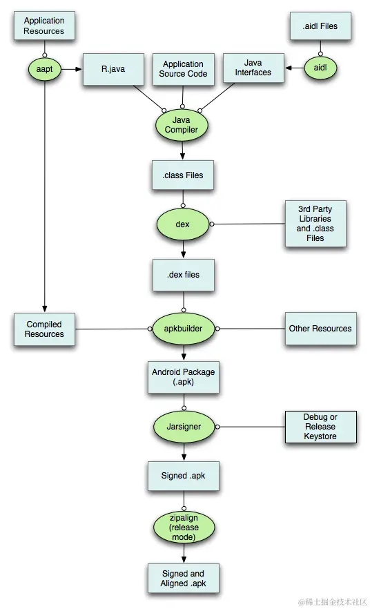

<br/> <br/>

- 批量打多个平台的渠道包：
	- [美团打包wall-cli命令方式----批量打包](https://blog.csdn.net/qq_23045311/article/details/120164173)
	- [多渠道打包美团工具walle使用步骤](https://blog.csdn.net/qq_33902817/article/details/123902688)
	- [walle-cli-all.jar使用的原因（美团github）](https://github.com/Meituan-Dianping/walle)


<br/>

- aapt把resources目录下的资源生成R.java文件 ，并为AndroidManifest.xml生成Manifest.java类。
	- res 目录下有许多子目录，每个子目录对应一种类型的资源，例如：
		- drawable/：存放图片资源，如图标、背景图片等。
		- layout/：存放XML布局文件，定义了用户界面的结构和控件布局。
		- values/：存放各种常量值，如字符串、颜色定义、尺寸定义等，通常在 strings.xml、colors.xml、dimens.xml 等文件中定义。
		- mipmap/：存放不同分辨率的启动图标。
		- anim/：存放动画定义文件。
		- animator/：存放属性动画定义文件。
		- 还有其他如 raw/、menu/、xml/ 等，分别用于存放原始文件、菜单定义和自定义XML资源等。

<br/>

- aidl把项目中自定义的aidl文件生成对应的java类。
	- AIDL 文件是 Android Interface Definition Language（Android 接口定义语言）的缩写，是一种用于定义跨进程通信接口的文件。在Android开发中，当应用程序需要在不同的进程间进行数据交换或方法调用时，可以使用AIDL来定义这些交互的接口。

	- AIDL 文件具有以下特点和用途：

		-  文件类型与位置：AIDL 文件是一种文本文件，后缀名为 .aidl，通常位于 Android 项目的 src/main/aidl 目录下。每个AIDL文件定义了一个接口（interface），这个接口声明了客户端和服务端可以相互调用的方法。

		- 支持的数据类型：AIDL 支持一系列默认的数据类型，包括Java的基本数据类型（如 int、long、double等）、String、CharSequence、List（但列表元素也必须是AIDL支持的类型）、Map（键和值也必须是支持的类型）以及自定义的Parcelable对象。对于自定义类型，需要创建相应的AIDL文件来声明其接口。

		- 生成代理类：构建项目时，Android Gradle插件会自动处理AIDL文件，为定义的接口在客户端和服务端各自生成对应的Java接口和Stub（存根）类。客户端通过Stub类与服务端进行交互，而服务端则需要实现由AIDL文件生成的接口。

		- 跨进程通信：AIDL是基于Android的Binder机制实现的，Binder是Android系统提供的一种高性能的IPC（Inter-Process Communication，进程间通信）方式。AIDL接口的调用会被编译器转化为对Binder对象的调用，从而实现跨进程的数据传输和方法调用。

		- 同步与异步调用：AIDL接口支持同步和异步两种调用方式，开发者可以根据需要选择合适的调用模式。

<br/>

- JavaCompiler把所有的Java源文件编译成class文件，包括：aapt生成的、aidl生成的、项目中自有的java源文件


<br/>

- 使用proguard混淆，并生成一个proguardMapping.xml文件（可选项：可以混淆也可以不混淆）

<br/>

- 使用dex工具把所有的class文件生成.dex文件

<br/>

- 使用aapt资源打包工具把resources、assets目录下的资源打包成一个_ap文件

<br/>

- 使用apkbuilder把所有的dex、_ap文件、AndroidManifest.xml文件打包成一个未签名的apk

<br/>

- 使用jarsinger生成一个签名过的apk包

<br/>

- 使用zipalign工具对要发布的apk文件进行对齐操作，以便在运行时节约内存


<br/>

***
<br/><br/><br/>

> <h1 id="开发大坑">开发大坑</h1>


<br/><br/><br/>


> <h2 id="更新RecycleView内的ItemView组件位置后，无法对其他View进行隐藏">更新RecycleView内的ItemView组件位置后，无法对其他View进行隐藏</h2>

问题描述如下：

```
if  subsidyAmount>0 {
	补贴tag显示
	抢光进度条内的2个组件隐藏
	补贴后的价格位置下移
}else {
	补贴tag隐藏
	抢光进度条内的2个组件显示
	补贴后的价格位置上移（恢复原状）
}
```

如图：


<br/> <br/>

因为是初始开发，遇到了很多坑吧？因为想着Android开发和iOS开发也许有着相同之处，但是我错了！

**坑一：** 我对补贴tag修改约束前，就对补贴Tag、抢光进度条、补贴后的价格设置隐藏或者显示导致没有效果，后来查看ChatGpt发现因为更新布局后，需要延迟一段时间。然后我加了延迟，果然有效果，但是有点出现新的问题，有卡顿了！！


**坑2：** 后来我吧代码换了下位置，先是改变约束，再对其隐藏或者显示设置，然后也不卡顿了，都解决了

请看代码：

```
ConstraintLayout constraintLayout;
FrameLayout bottomLayout;
    
//在XXXItemHolder构造方法设置
public XXXItemHolder(){
	        
    constraintLayout = itemView.findViewById(R.id.layout_fxz_activity_list_item_constraintLayout);
        bottomLayout = itemView.findViewById(R.id.layout_fxz_activity_list_bottomLayout);    
}
	
private void changeStateOfSubsidy(FxzActivityItem data) {
ConstraintSet constraintSet = new ConstraintSet();
constraintSet.clone(constraintLayout);
if (data.getSubsidy_amount() > 0) {
    //富文本的设置
    String subsidyAmont = MoneyUtils.formatMoney(data.getSubsidy_amount(), "¥#0.##");
    SpannableString amount = new SpannableString(subsidyAmont);
    SpannableString amountDesc = new SpannableString(data.getSubsidy_amount_desc());
    amount.setSpan(new StyleSpan(Typeface.BOLD), 0, subsidyAmont.length(), Spannable.SPAN_EXCLUSIVE_EXCLUSIVE);

    SpannableStringBuilder strBuilder = new SpannableStringBuilder();
    strBuilder.append(amountDesc);
    strBuilder.append(amount);
    subsidyText.setText(strBuilder);
    
    //mActivityPriceView.getId()：价格的ID
    //ConstraintSet.PARENT_ID 父容器的ID
    //mActivityPriceSavedView.getId() 真实价格组件ID
    //mLabelView.getId() 打折标签ID
    constraintSet.connect(mActivityPriceView.getId(), ConstraintSet.BOTTOM, ConstraintSet.PARENT_ID, ConstraintSet.BOTTOM, dpToPx(0));
    constraintSet.connect(mActivityPriceSavedView.getId(), ConstraintSet.BOTTOM, ConstraintSet.PARENT_ID, ConstraintSet.BOTTOM, dpToPx(3));
    constraintSet.connect(mLabelView.getId(), ConstraintSet.BOTTOM, ConstraintSet.PARENT_ID, ConstraintSet.BOTTOM, dpToPx(3));

} else {
    constraintSet.connect(mActivityPriceView.getId(), ConstraintSet.BOTTOM, ConstraintSet.PARENT_ID, ConstraintSet.BOTTOM, dpToPx(23));
    constraintSet.connect(mActivityPriceSavedView.getId(), ConstraintSet.BOTTOM, ConstraintSet.PARENT_ID, ConstraintSet.BOTTOM, dpToPx(26));
    constraintSet.connect(mLabelView.getId(), ConstraintSet.BOTTOM, ConstraintSet.PARENT_ID, ConstraintSet.BOTTOM, dpToPx(26));

}
constraintSet.applyTo(constraintLayout);

// 延迟执行隐藏操作 我将延迟注销了
//        itemView.postDelayed(new Runnable() {
//            @Override
//            public void run() {
if (data.getSubsidy_amount() > 0) {//一开始这个逻辑我写在上面判断的逻辑里的
    bottomLayout.setVisibility(View.GONE); //底部进度容器是否隐藏
    subsidyText.setVisibility(View.VISIBLE);//补贴是否隐藏
} else {
    bottomLayout.setVisibility(View.VISIBLE);
    subsidyText.setVisibility(View.GONE);
}
//            }
//        }, 2);
}
 
```


<br/><br/><br/>

> <h2 id="Gradle和AGP版本不一致到错构建项目出错">Gradle和AGP版本不一致到错构建项目出错</h2>

[Gradle官方发布各个版本](https://services.gradle.org/distributions/)


<br/>

***
<br/><br/><br/>

> <h1 id='AndroidStudio配置修改'>AndroidStudio配置修改</h1>

<br/><br/><br/>

> <h2 id='选中文件打开源码'> 选中文件打开源码</h2>


<br/>

**疑问一：**

```
android项目中的 gradle-wrapper.properties文件中的：
distributionUrl=https\://services.gradle.org/distributions/gradle-6.7-all.zip


与versions.gradle中的
versions.android_gradle_plugin = '3.5.3'

有什么关系吗
```

<br/>

解释说明：

gradle-wrapper.properties 文件中的 distributionUrl 和 versions.gradle 文件中的 versions.android_gradle_plugin 是用来管理不同的 Gradle 组件的版本，它们分别指向 Gradle 和 Android Gradle 插件的版本。具体解释如下：

- 1.**`gradle-wrapper.properties 文件中的 distributionUrl:`**

```
distributionUrl=https\://services.gradle.org/distributions/gradle-6.7-all.zip
```

这个 URL 指定了项目使用的 Gradle 版本。在这个例子中，项目使用的是 Gradle 6.7。Gradle 是一个构建工具，它负责编译代码、运行测试、打包应用等。

<br/><br/>

2.**`versions.gradle 文件中的 versions.android_gradle_plugin:`**

```
versions.android_gradle_plugin = '3.5.3'
```

这个属性指定了 Android Gradle 插件（AGP）的版本。在这个例子中，项目使用的是 AGP 3.5.3。AGP 是一个 Gradle 插件，它为 Android 项目提供了特定的构建任务和工具。它依赖于 Gradle，但它本身是一个独立的插件，需要特定的版本来匹配 Android 项目的需求。

<br/><br/>

**关系**


虽然 Gradle 和 Android Gradle 插件（AGP）是两个独立的组件，它们之间有一些相互依赖性。具体来说：

每个 AGP 版本要求最低的 Gradle 版本。如果使用的 Gradle 版本过低，可能会导致构建失败或某些功能无法使用。
一般情况下，当你更新 AGP 时，也需要确保 Gradle 的版本满足 AGP 的最低要求。

例如，AGP 3.5.3 可能要求 Gradle 5.4.1 或更高版本。如果你指定了较低的 Gradle 版本，例如 4.x 版本，那么项目在构建时可能会报错。

<br/><br/>

**总结**

- gradle-wrapper.properties 中的 distributionUrl 指定了项目使用的 Gradle 版本。
- versions.gradle 中的 versions.android_gradle_plugin 指定了项目使用的 Android Gradle 插件版本。

两者的版本需要相互兼容，以确保项目能够正常构建和运行。

- Gradle 6.7 支持的最低 AGP 版本是 4.1.0
- Gradle 6.7 支持的最高 AGP 版本是 4.2.x

若是Gradle和AGP的版本不兼容，会导致：构建失败、功能不稳定（即使构建成功，也可能会出现功能上的不稳定或某些特性无法正常工作，因为 AGP 和 Gradle 之间的某些 API 和功能调用可能不兼容。）

<br/> <br/>

所以查看下Gradle和AGP匹配的版本[Android Gradle插件8.4版本说明](https://developer.android.com/build/releases/gradle-plugin?hl=zh-cn#updating-gradle)

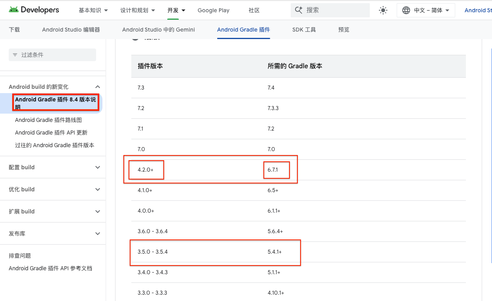


