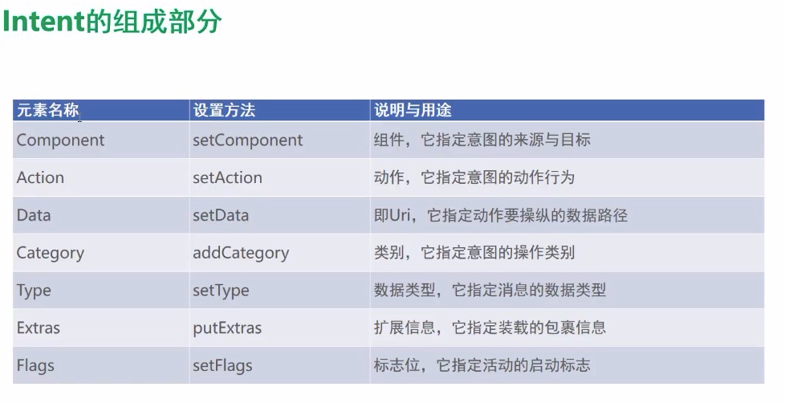
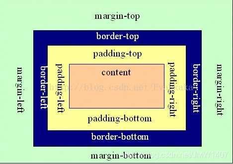
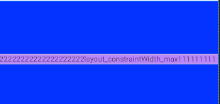
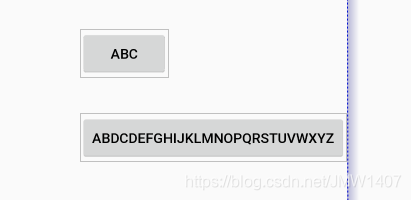

># <h1 id=''>[Android知识体系](https://blog.csdn.net/liuwg1226/article/details/114777562)</h1>
- [**文件结构**](#文件结构)
	- [文件夹目录介绍](#文件夹目录介绍)
		- [Android文件目录展示](#Android文件目录展示)
		- [Project文件目录展示](#Project文件目录展示)
- [**基础组件**](#基础组件) 
	- [设置宽高](#设置宽高)
	- [TextView设置圆角](#TextView设置圆角)
- [**Activity生命周期**](#Activity生命周期)
	- [配置文件指定启动模式](#配置文件指定启动模式)
	- [Activity启动模式](#Activity启动模式)
	- [默认启动模式standard](#默认启动模式standard)
	- [栈顶复用模式singleTop](#栈顶复用模式singleTop)
	- [栈内复用模式singleTask](#栈内复用模式singleTask)
	- [全局唯一模式singleInstance](#全局唯一模式singleInstance)
- [**Activity**](#Activity)
	- [‌显示Intent和隐式Intent](#显示Intent和隐式Intent)
	- [显示Intent](#显示Intent)
	- [向上一个Activity返回数据](#向上一个Activity返回数据)
	- [向下一个Activity返回数据](#向下一个Activity返回数据)
- [**xml文件的3种布局**](#xml3种布局)
	- [线性布局](#线性布局)
	- [相对布局RelativeLayout](#相对布局RelativeLayout)
		- [父容器定位属性示意图](#父容器定位属性示意图)
		- [兄弟组件定位](#兄弟组件定位)
		- [梅花布局](#梅花布局)
		- [属性说明](#属性说明)
			- [属性值为true或false相对于父元素的位置](#属性值为true或false相对于父元素的位置)
			- [属性值必须为id的引用名](#属性值必须为id的引用名)
			- [在元素周围](#在元素周围)
			- [相对于元素内部四周](#相对于元素内部四周)
			- [属性值为具体的像素值，如30dip，40px](#属性值为具体的像素值，如30dip，40px)
			- [padding与layout_margin的区别与用法](#padding与layout_margin的区别与用法)
	- [相对布局ConstraintLayout](#相对布局ConstraintLayout)
		- [layout_goneMarginEnd和layout_marginEnd区别](#layout_goneMarginEnd和layout_marginEnd区别)
		- [viewgone的理解](#viewgone的理解)
		- [巧妙居中](#巧妙居中)
		- [弹性居中](#弹性居中)
- [详解Application](#详解Application)
- [详解Context](#详解Context)
	- [getContext()的作用](#getContext()的作用)
- [碎片🧩Fragment](#碎片🧩Fragment)
- [**持久化存储**](#持久化存储) 
	- [文件存储](#文件存储) 
	- [SharedPreferences存储](#SharedPreferences存储)
- [**项目配置**](#项目配置)
	- [打包](#打包)

- [**开发大坑**](#开发大坑)
	- [更新RecycleView内的ItemView组件位置后，无法对其他View进行隐藏](#更新RecycleView内的ItemView组件位置后，无法对其他View进行隐藏)


- [AndroidStudio配置修改](#AndroidStudio配置修改)
	- [选中文件打开源码](#选中文件打开源码)

<br/><br/>


<br/><br/>

***
<br/><br/><br/>

> <h1 id='文件结构'>文件结构</h1>

**文件结构：**


<br/><br/><br/>

<h2 id='Android文件目录展示'>Android文件目录展示</h2>

**老板Android目录展示**


<br/><br/>


**新版新建Android项目目录展示：**


**kotlin+java** 

毫无疑问，kotlin+java目录是放置我们所有Java代码的地方（Kotlin代码也放在这里），展开该目录，你将看到系统帮我们自动生成了一个MainActivity文件。

<br/>


**res**

这个目录下的内容就有点多了。简单点说，就是你在项目中使用到的所有图片、布局、字符串等资源都要存放在这个目录下。当然这个目录下还有很多子目录，图片放在drawable目录下，布局放在layout目录下，字符串放在values目录下，所以你不用担心会把整个res目录弄得乱糟糟的。

<br/> 

**AndroidManifest.xm**

这是整个Android项目的配置文件，你在程序中定义的所有四大组件都需要在这个文件里注册，另外还可以在这个文件中给应用程序添加权限声明。由于这个文件以后会经常用到，我们等用到的时候再做详细说明。


<br/> 

**test**

此处是用来编写Unit Test测试用例的，是对项目进行自动化测试的另一种方式。

<br/>

**.gitignore**

这个文件用于将app模块内指定的目录或文件排除在版本控制之外，作用和外层的.gitignore文件类似。

是
<br/>

**build.gradle**

这是app模块的gradle构建脚本，这个文件中会指定很多项目构建相关的配置，我们稍后将会详细分析gradle构建脚本中的具体内容。


<br/>

**proguard-rules.pro**

这个文件用于指定项目代码的混淆规则，当代码开发完成后打包成安装包文件，如果不希望代码被别人破解，通常会将代码进行混淆，从而让破解者难以阅读。


>?


<br/><br/><br/>

> <h2 id='Project文件目录展示'>Project文件目录展示</h2>


**gradle：** 

这个目录下包含了gradle wrapper的配置文件，使用gradle wrapper的方式不需要提前将gradle下载好，而是会自动根据本地的缓存情况决定是否需要联网下载gradle。

<br/>

**.gitignore**

这个文件是用来将指定的目录或文件排除在版本控制之外的。


<br/>

**build.gradle**


这是项目全局的gradle构建脚本，通常这个文件中的内容是不需要修改的。

<br/>

**gradle.properties**

这个文件是全局的gradle配置文件，在这里配置的属性将会影响到项目中所有的gradle编译脚本。

<br/>

**gradlew和gradlew.bat**

这两个文件是用来在命令行界面中执行gradle命令的，其中gradlew是在Linux或Mac系统中使用的，gradlew.bat是在Windows系统中使用的。

<br/>

**local.properties**

这个文件用于指定本机中的Android SDK路径，通常内容是自动生成的，我们并不需要修改。除非你本机中的Android SDK位置发生了变化，那么就将这个文件中的路径改成新的位置即可。

<br/>

**settings.gradle**

这个文件用于指定项目中所有引入的模块。由于HelloWorld项目中只有一个app模块，因此该文件中也就只引入了app这一个模块。通常情况下，模块的引入是自动完成的，需要我们手动修改这个文件的场景可能比较少。


<br/>

**Res文件下的各个子文件用处描述：**


&emsp； res目录中的内容就变得非常简单了。所有以“drawable”开头的目录都是用来放图片的，所有以“mipmap”开头的目录都是用来放应用图标的，所有以“values”开头的目录都是用来放字符串、样式、颜色等配置的，所有以“layout”开头的目录都是用来放布局文件的。


<br/>

***
<br/><br/><br/>

> <h1 id='基础组件'>基础组件</h1>


<br/><br/><br/>

> <h2 id='设置宽高'>设置宽高</h2>


<br/><br/><br/>

> <h2 id="TextView设置圆角">TextView设置圆角</h2>

设置TextView的圆角没有效果的主要原因可能是因为在设置CornerRadius的时候，TextView还没有完成测量和布局，因此textView.getHeight()返回的是0。你需要确保在TextView完成布局后再设置圆角。


<br/> <br/>
你可以使用以下几种方法确保在布局完成后设置圆角：

- **方法一：使用ViewTreeObserver**
使用ViewTreeObserver.OnGlobalLayoutListener监听布局完成事件：


```
TextView textView = findViewById(R.id.test_drawable_activity_txtView00);

textView.getViewTreeObserver().addOnGlobalLayoutListener(new ViewTreeObserver.OnGlobalLayoutListener() {
    @Override
    public void onGlobalLayout() {
        // 移除监听器，防止重复调用
        textView.getViewTreeObserver().removeOnGlobalLayoutListener(this);

        // 获取高度并设置圆角
        int height = textView.getHeight();
        GradientDrawable gradientDrawable = new GradientDrawable();
        gradientDrawable.setCornerRadius(height / 2);
        gradientDrawable.setColor(Color.YELLOW);

        // 设置背景
        textView.setBackground(gradientDrawable);
    }
});

```

<br/> <br/>

- **方法二：使用post方法**

使用post方法确保在布局完成后设置圆角：

```
TextView textView = findViewById(R.id.test_drawable_activity_txtView00);

textView.post(new Runnable() {
    @Override
    public void run() {
        // 获取高度并设置圆角
        int height = textView.getHeight();
        GradientDrawable gradientDrawable = new GradientDrawable();
        gradientDrawable.setCornerRadius(height / 2);
        gradientDrawable.setColor(Color.YELLOW);

        // 设置背景
        textView.setBackground(gradientDrawable);
    }
});

```


<br/> <br/>

- **方法三：在布局完成后动态设置**

你可以在onCreate方法中通过延迟或者等待某些事件（例如用户交互）后再设置圆角：

```
TextView textView = findViewById(R.id.test_drawable_activity_txtView00);

// 延迟一些时间后设置圆角，确保布局完成（这是一种不太推荐的做法，因为时间不确定）
textView.postDelayed(new Runnable() {
    @Override
    public void run() {
        // 获取高度并设置圆角
        int height = textView.getHeight();
        GradientDrawable gradientDrawable = new GradientDrawable();
        gradientDrawable.setCornerRadius(height / 2);
        gradientDrawable.setColor(Color.YELLOW);

        // 设置背景
        textView.setBackground(gradientDrawable);
    }
}, 100); // 延迟100毫秒

```


<br/>

***
<br/><br/><br/><br/>

> <h1 id='Activity生命周期'>Activity生命周期</h1>


<br/>


<br/> <br/>

**各个状态的切换过程：**


<br/><br/><br/>

> <h2 id='Activity启动模式'>Activity启动模式</h2>


<br/>


<br/><br/>


<br/><br/><br/>

> <h2 id='配置文件指定启动模式'>配置文件指定启动模式</h2>


<br/><br/><br/>

> <h2 id='默认启动模式standard'>默认启动模式standard</h2>


<br/><br/><br/>

> <h2 id='栈顶复用模式singleTop'>栈顶复用模式singleTop</h2>


<br/><br/><br/>

> <h2 id='栈内复用模式singleTask'>栈内复用模式singleTask</h2>

使用singleTop模式可以很好地解决重复创建栈顶活动的问题，但是正如你在上一节所看到 的，如果该活动并没有处于栈顶的位置，还是可能会创建多个活动实例的。那么有没有什么办法 可以让某个活动在整个应用程序的上下文中只存在 一个实例呢?这就要借助singleTask模式来实 现了。当活动的启动模式指定为singleTask，每次启动该活动时系统首先会在返回栈中检查是否 存在该活动的实例，如果发现已经存在则直接使用该实例，并把在这个活动之上的所有活动统统 出栈，如果没有发现就会创建 一个新的活动实例。


- **应用场景：**

	- **程序主界面**：我们肯定不希望足额界面被创建多次，而且在主界面推出的时候退出整个App是最好的效果。

	- **耗费系统资源的Activity：** 对于那些及其耗费资源的Activity，我们可以考虑将其设为singleTask模式，减少资源耗费。


<br/><br/><br/>

> <h2 id='全局唯一模式singleInstance'>全局唯一模式singleInstance</h2>

singlelnstance模式应该算是4种启动模式中最特殊也最复杂的一个了，你也需要多花点功夫 来理解这个模式。不同于以上3种启动模式，指定为singlelnstance模式的活动会启用 一个新的回栈来管理这个活动(其实如果singleTask模式指定了不同的taskAffinity ， 也会启动一个新的返回栈)。那么这样做有什么意义呢?想象以下场景，假设我们的程序中有 一个活动是允许其他程 序调用的，如果我们想实现其他程序和我们的程序可以共享这个活动的实例，应该如何实现呢? 使用前面3种启动模式肯定是做不到的，因为每个应用程序都会有自己的返回栈，同一个活动在不同的返回栈中入栈时必然是创建了新的实例 。 而使用singlelnstance模式就可以解决这个问题， 在这种模式下会有一个单独的返回栈来管理这个活动，不管是哪个应用程序来访问这个活动，都 共用的同 一个返回栈，也就解决了共享活动实例的问题。


<br/>

*** 
<br/><br/><br/>

> <h2 id='Activity'>Activity</h2>

<br/> <br/> <br/>

> <h2 id='显示Intent和隐式Intent'>显示Intent和隐式Intent</h2>


<br/>

**组成部分：**


<br/><br/><br/>

> <h2 id='显示Intent'>显示Intent</h2>


<br/>

```
Intent intent = new Intent(this, ScanCodeIntoActivity.class);
//用于启动一个新的Activity。intent是一个Intent对象，它定义了你希望启动的Activity以及需要传递给该Activity的数据（如果有）
startActivity(intent);
```

`startActivity:` 这是Android Context 类（Activity 类是 Context 的子类，因此可以直接调用）中的一个方法，用于启动一个新的Activity实例。

 `intent:` Intent是Android中用于启动Activity、服务(Service)、广播接收器(BroadcastReceiver)的意图对象。它不仅指定了要启动的组件（通过setAction, setClass 或 setComponent等方法），还可以携带额外的数据（通过putExtra方法）给目标Activity。

&emsp; 当调用startActivity(intent);时，Android系统会根据Intent中提供的信息查找并启动对应的Activity。如果Intent没有明确指定组件名称，系统会根据Intent的动作为以及其他附加信息（如类别、数据等）去匹配并启动最合适的Activity。


<br/><br/>

> <h2 id='Intent组成部分'>Intent组成部分</h2>



<br/><br/><br/>

> <h2 id='向下一个Activity发送数据'>向下一个Activity发送数据</h2>


<br/><br/>

**Bundle**

- 在代码中发送消息包裹，嗲用意图对象的putExtras方法，即可存入消息包裹；
- 在代码中接受消息包裹，调用意图对象的getExtras方法，即可取消消息包裹；


<br/><br/><br/>

> <h2 id=''>向上一个Activity返回数据</h2>


<br/>

***
<br/><br/><br/>

> <h1 id="xml3种布局">xml的3种布局</h1>

```
protected void onCreate(Bundle savedInstanceState) {
        super.onCreate(savedInstanceState);
        EdgeToEdge.enable(this);

        /**
         * setContentView里的内容‘R’为就是系统给声明的静态变量，所有的子类都是通过‘R’来调用。
         * 而‘R’的路径则是 Android 工程路径下的 app -> src -> main -> res 下。
         *
         * R.layout指res文件夹下一个名为layout的文件夹，而R.layout.activity_linear_layout之后的部分则是layout文件夹下自己定义的.xml文件。
         * */
        setContentView(R.layout.activity_test_uilayout2);
        ViewCompat.setOnApplyWindowInsetsListener(findViewById(R.id.main), (v, insets) -> {
            Insets systemBars = insets.getInsets(WindowInsetsCompat.Type.systemBars());
            v.setPadding(systemBars.left, systemBars.top, systemBars.right, systemBars.bottom);
            return insets;
        });
    }
```

<br/><br/><br/>

> <h2 id='线性布局'>线性布局</h2>


- **android:layout_weight：** 权重，除了被显示占据的空间以外的的空间，然后根据权重的大小来分配空间，使用权重通常会把分配该权重方向的宽度设置为0dp，如果未设置0dp，则该控件会占据指定的宽度，然后再加上根据权重来分配的空间

<br/><br/>

**layout_weight(权重)、gravity（对齐方式）**

```
<LinearLayout
    android:layout_marginTop="30dp"
    android:layout_width="match_parent"
    android:layout_height="wrap_content">
    <TextView
        android:layout_width="0dp"
        android:layout_height="45dp"
        android:layout_weight="1"
        android:background="#55ff0000"
        android:gravity="center"
        android:text="线性布局aaaaaaaaaaaaaaaaa"/>


    <TextView
        android:layout_width="0dp"
        android:layout_height="45dp"
        android:layout_weight="2"
        android:background="#5500ff00"
        android:gravity="center"
        android:text="线性布局 b"/>

    <TextView
        android:layout_width="0dp"
        android:layout_height="45dp"
        android:layout_weight="3"
        android:background="#550000ff"
        android:gravity="center"
        android:text="线性布局c"/>

</LinearLayout>
```


很明显，第一个textview的对齐方式不是我们想要的，出现这种现象的原因是LinearLayout默认子控件按照基准线对齐，所以我们需要在LinearLayout`中添加一个属性就即可解决：android:baselineAligned=“false” 使得子控件不按照基线对齐。

<br/>

- **weightSum属性得使用**

如果布局中只有一个控件，并且我只想让它占据1/2的宽度，这个时候就可以利用LinearLayout的weightSum属性，来看看这个例子


<br/><br/><br/>

> <h2 id='相对布局RelativeLayout'>相对布局 RelativeLayout</h2>

相对布局：相对布局也是常用的布局之一，它可以设置某一个控件相对于其他控件的位置，这些位置可以包括上下左右等，因此相较于其他的布局方式而言具有很大的灵活性。


<br/><br/><br/>

> <h2 id="父容器定位属性示意图">父容器定位属性示意图</h2>


<br/><br/><br/>

> <h2 id="兄弟组件定位">兄弟组件定位</h2>


图中的组件1,2就是兄弟组件了,而组件3与组件1或组件2并不是兄弟组件,所以组件3不能通过 组件1或2来进行定位,比如layout_toleftof = "组件1"这样是会报错的！


<br/><br/><br/>> <h2 id="梅花布局">梅花布局</h2>


```
<RelativeLayout xmlns:android="http://schemas.android.com/apk/res/android"
    xmlns:app="http://schemas.android.com/apk/res-auto"
    xmlns:tools="http://schemas.android.com/tools"
    android:id="@+id/main"
    android:layout_width="match_parent"
    android:layout_height="match_parent"
    android:orientation="horizontal"
    tools:context=".TestModules.TestFruitAdapter$TestUILayoutActivityTest">

		<Button
        android:id="@+id/uiLayout3_0"
        android:layout_width="wrap_content"
        android:layout_height="wrap_content"
        android:layout_above="@id/test_uiLayout_button2_2"
        android:layout_toLeftOf="@id/test_uiLayout_button2_2"
        android:textColor="@color/red_Crimson_DC143C"
        android:text="按钮🐔" />


    <Button
        android:id="@+id/uiLayout3_1"
        android:layout_width="wrap_content"
        android:layout_height="wrap_content"
        android:layout_above="@id/test_uiLayout_button2_2"
        android:layout_toRightOf="@id/test_uiLayout_button2_2"
        android:text="按钮🐦" />


    <Button
        android:id="@+id/test_uiLayout_button2_2"
        android:layout_width="wrap_content"
        android:layout_height="wrap_content"
        android:layout_centerInParent="true"
        android:text="中心⏰🌞 2_2" />

    <Button
        android:id="@+id/uiLayout3_2"
        android:layout_width="wrap_content"
        android:layout_height="wrap_content"
        android:layout_below="@id/test_uiLayout_button2_2"
        android:layout_toLeftOf="@id/test_uiLayout_button2_2"
        android:textColor="@color/red_Crimson_DC143C"
        android:text="按钮🐣" />


    <Button
        android:id="@+id/uiLayout3_3"
        android:layout_width="wrap_content"
        android:layout_height="wrap_content"
        android:layout_below="@id/test_uiLayout_button2_2"
        android:layout_toRightOf="@id/test_uiLayout_button2_2"
        android:text="按钮🪿" />
</RelativeLayout>
```


<br/><br/><br/>

> <h2 id="属性说明">属性说明</h2>

<br/><br/><br/>

> <h2 id="属性值为true或false相对于父元素的位置">属性值为true或false：相对于父元素的位置</h2>

```
android:layout_centerHrizontal 水平居中
android:layout_centerVertical 垂直居中
android:layout_centerInparent 相对于父元素完全居中
android:layout_alignParentBottom 贴紧父元素的下边缘
android:layout_alignParentLeft 贴紧父元素的左边缘
android:layout_alignParentRight 贴紧父元素的右边缘
android:layout_alignParentTop 贴紧父元素的上边缘
android:layout_alignWithParentIfMissing 如果对应的兄弟元素找不到的话就以父元素做参照物
```

**元素在父容器中间**

```
<RelativeLayout
    android:layout_marginTop="10dp"
    android:layout_width="match_parent"
    android:layout_height="100dp"
    android:background="@color/red_FF1493">
    
    <TextView
        android:id="@+id/middle"
        android:layout_width="wrap_content"
        android:layout_height="wrap_content"
        android:layout_centerInParent="true"
        android:background="@color/blue_0000FF"
        android:textColor="@color/white"
        android:text="RelativeLayout 我在最中间"/>
        
</RelativeLayout>
```


<br/><br/><br/>

> <h2 id="属性值必须为id的引用名“@id/id-name”">属性值必须为id的引用名“@id/id-name”，</h2>

```
//相对于子元素外部的位置
android:layout_below 在某元素的下方
android:layout_above 在某元素的的上方
android:layout_toLeftOf 在某元素的左边
android:layout_toRightOf 在某元素的右边
//相对于子元素内部的位置
android:layout_alignTop 本元素的上边缘和某元素的的上边缘对齐
android:layout_alignLeft 本元素的左边缘和某元素的的左边缘对齐
android:layout_alignBottom 本元素的下边缘和某元素的的下边缘对齐
android:layout_alignRight 本元素的右边缘和某元素的的右边缘对齐
```

<br/><br/><br/>

> <h2 id="在元素周围">在元素周围</h2>

```
 <RelativeLayout
    android:layout_marginTop="20dp"
    android:layout_width="match_parent"
    android:layout_height="300dp"
    android:background="@color/teal_200">
    <TextView
        android:id="@+id/middle"
        android:layout_width="200dp"
        android:layout_height="200dp"
        android:gravity="center"
        android:layout_centerInParent="true"
        android:background="@android:color/holo_blue_bright"
        android:text="我在最中间"/>
    <TextView
        android:layout_width="wrap_content"
        android:layout_height="wrap_content"
        android:layout_below="@id/middle"
        android:text="layout_below"
        android:layout_centerHorizontal="true"
        android:background="@android:color/holo_green_light"/>
    <TextView
        android:layout_width="wrap_content"
        android:layout_height="wrap_content"
        android:layout_above="@id/middle"
        android:text="layout_above"
        android:layout_centerHorizontal="true"
        android:background="@android:color/holo_green_light"/>
    <TextView
        android:layout_width="wrap_content"
        android:layout_height="wrap_content"
        android:layout_toLeftOf="@id/middle"
        android:text="layout_toLeftOf"
        android:layout_centerVertical="true"
        android:background="@android:color/holo_green_light"/>
    <TextView
        android:layout_width="wrap_content"
        android:layout_height="wrap_content"
        android:layout_toRightOf="@id/middle"
        android:text="layout_toRightOf"
        android:layout_centerVertical="true"
        android:background="@android:color/holo_green_light"/>
</RelativeLayout>
```


<br/><br/><br/>

> <h2 id="相对于元素内部四周">相对于元素内部四周</h2>

```
<RelativeLayout
    xmlns:android="http://schemas.android.com/apk/res/android"
    android:layout_width="match_parent"
    android:layout_height="300dp"
    android:background="@color/red_Crimson_DC143C">
    <TextView
        android:id="@+id/middle"
        android:layout_width="200dp"
        android:layout_height="200dp"
        android:gravity="center"
        android:layout_centerInParent="true"
        android:background="@android:color/holo_blue_bright"
        android:text="我在最中间"/>
    <TextView
        android:layout_width="wrap_content"
        android:layout_height="wrap_content"
        android:layout_alignBottom="@id/middle"
        android:text="layout_alignBottom"
        android:layout_centerHorizontal="true"
        android:background="@android:color/holo_orange_light"/>
    <TextView
        android:layout_width="wrap_content"
        android:layout_height="wrap_content"
        android:layout_alignTop="@id/middle"
        android:text="layout_alignTop"
        android:layout_centerHorizontal="true"
        android:background="@android:color/holo_orange_light"/>
    <TextView
        android:layout_width="wrap_content"
        android:layout_height="wrap_content"
        android:layout_alignLeft="@id/middle"
        android:text="alignLeft"
        android:layout_centerVertical="true"
        android:background="@android:color/holo_orange_light"/>
    <TextView
        android:layout_width="wrap_content"
        android:layout_height="wrap_content"
        android:layout_alignRight="@id/middle"
        android:text="alignRight"
        android:layout_centerVertical="true"
        android:background="@android:color/holo_orange_light"/>
</RelativeLayout>

```


<br/><br/><br/>

> <h2 id="属性值为具体的像素值，如30dip，40px">属性值为具体的像素值，如30dip，40px</h2>

```
android:layout_marginBottom 离某元素底边缘的距离
android:layout_marginLeft 离某元素左边缘的距离
android:layout_marginRight 离某元素右边缘的距离
android:layout_marginTop 离某元素上边缘的距离
```

<br/><br/>

**android:gravity**

- **android:gravity**属性是对该view 内容的限定．比如一个button 上面的text. 你可以设置该text 在view的靠左，靠右等位置．以button为例，android:gravity="right"则button上面的文字靠右


<br/><br/> 

**android:layout_gravity**

- **android:layout_gravity**是用来设置该view相对与起父view 的位置．比如一个button在Linearlayout(线性布局)里，你想把该button放在靠左、靠右等位置就可以通过该属性设置．以button为例，android:layout_gravity="right"则button靠右


<br/><br/><br/>

> <h2 id="padding与layout_margin的区别与用法
">padding与layout_margin的区别与用法
</h2>

**Margin:设置组件与父容器(通常是布局)的边距**

```
android:layout_margin: 指定控件的四周的外部留出一定的边距
android:layout_marginLeft: 指定控件的左边的外部留出一定的边距
android:layout_marginTop: 指定控件的上边的外部留出一定的边距
android:layout_marginRight: 指定控件的右边的外部留出一定的边距
android:layout_marginBottom: 指定控件的下边的外部留出一定的边距
```

<br/>

**Padding:设置组件内部元素间的边距(可以理解为填充)**

```
android:padding :指定控件的四周的内部留出一定的边距
android:paddingLeft: 指定控件的左边的内部留出一定的边距
android:paddingTop: 指定控件的上边的内部留出一定的边距
android:paddingRight: 指定控件的右边的内部留出一定的边距
android:paddingBottom: 指定控件的下边的内部留出一定的边距
```


<br/><br/>

**android:layout_margin** 就是设置view的上下左右边框的额外空间

**android:padding** 是设置内容相对view的边框的距离

- **padding**，含义为“填充”，像垫肩压类似的填充物，一个控件的padding及此控件内部的填充，由此可见padding是以所被定义的控件A为parent控件，而内部的内容物与控件A的间距。而layout_margin是A控件所在的控件为parent控件，是A与其的间距。

<br/>

其实概念很简单，padding是站在父view的角度描述问题，它规定它里面的内容必须与这个父view边界的距离。margin则是站在自己的角度描述问题，规定自己和其他（上下左右）的view之间的距离，如果同一级只有一个view，那么它的效果基本上就和padding一样了



```
当按钮分别设置以上两个属性时，得到的效果是不一样的。
android:paddingLeft="30px"

按钮上设置的内容（例如图片）离按钮左边边界30个像素
android:layout_marginLeft="30px"
整个按钮离左边设置的内容30个像素
```


<br/><br/><br/>

> <h2 id="相对布局ConstraintLayout">相对布局 ConstraintLayout</h2>

| 属性 | 描述 |
|:--|:--|
| app:layout_constraintLeft_toLeftOf | 把A的left side放在B的left side（左边对齐） |
| app:layout_constraintLeft_toRightOf | 把A的left side放在B的right side（左边相对右边对齐） |
| app:layout_constraintRight_toLeftOf | 把A的right side放在B的left side（右边相对左边对齐） |
| app:layout_constraintRight_toRightOf | 把A的right side放在B的right side（右边对齐） |
| app:layout_constraintTop_toTopOf | 把A的top side放在B的top side（顶部对齐） |
| app:layout_constraintTop_toBottomOf | 把A的top side放在B的bottom side（顶部相对底部对齐） |
| app:layout_constraintBottom_toTopOf | 把A的bottom side放在B的top side（底部相对顶部对齐） |
| app:layout_constraintBottom_toBottomOf | 把A的bottom side放在B的bottom side（底部对齐） |
| app:layout_constraintStart_toEndOf | 把A的start position放在B的end position（起始位置相对结束位置对齐） |
| app:layout_constraintStart_toStartOf | 把A的start position放在B的start position（起始位置对齐） |
| app:layout_constraintEnd_toStartOf | 把A的end position放在B的start position（结束位置相对起始位置对齐） |
| app:layout_constraintEnd_toEndOf | 把A的end position放在B的end position（结束位置对齐） |
| app:layout_constraintBaseline_toBaselineOf	 | 把A的bottom side放在B的top side（基准线对齐） |


```
<androidx.constraintlayout.widget.ConstraintLayout
    android:layout_width="match_parent"
    android:layout_height="match_parent"
    android:layout_marginTop="10dp"
    android:background="@color/green_40E0D0">

    <android.widget.Button
        android:id="@+id/a"
        android:layout_width="100dp"
        android:layout_height="60dp"
        android:text="A"
        android:background="@color/red_FF1493"
        app:layout_constraintLeft_toLeftOf="parent"
        app:layout_constraintTop_toTopOf="parent" />

    <android.widget.Button
        android:id="@+id/b"
        android:layout_width="100dp"
        android:layout_height="60dp"
        android:text="B"
        android:background="@color/red_Crimson_DC143C"
        app:layout_constraintLeft_toRightOf="@id/a"
        app:layout_constraintTop_toTopOf="@id/a" />

    <android.widget.Button
        android:id="@+id/c"
        android:layout_width="100dp"
        android:layout_height="60dp"
        android:text="C"
        android:background="@color/purple_700"
        app:layout_constraintLeft_toLeftOf="@id/a"
        app:layout_constraintTop_toBottomOf="@id/a" />

    <android.widget.Button
        android:id="@+id/d"
        android:layout_width="100dp"
        android:layout_height="60dp"
        android:text="D"
        android:background="@color/red_FF1493"
        app:layout_constraintLeft_toRightOf="@id/a"
        app:layout_constraintTop_toTopOf="@id/c" />

</androidx.constraintlayout.widget.ConstraintLayout>

```


- **从中可以看到**

	- 1、layout_constraint*属性的值可以是某个id或者parent（父布局）

	- 2、B要位于A的右边，则使用`app:layout_constraintLeft_toRightOf="@id/a"`,C位于A的下边，则使用`app:layout_constraintTop_toBottomOf="@id/a"`

对于一个View的边界界定，官方给了下面这张图：


<br/><br/><br/>

> <h2 id="layout_goneMarginEnd和layout_marginEnd区别">layout_goneMarginEnd和layout_marginEnd区别</h2>

id为right_topdeTextView没有`android:visibility="gone"`
时的代码

```
<androidx.constraintlayout.widget.ConstraintLayout
    android:layout_marginTop="20dp"
    android:background="@color/teal_200"
    android:id="@+id/root"
    android:layout_width="match_parent"
    android:layout_height="match_parent">

    <TextView
        android:id="@+id/right_top"
        android:layout_width="wrap_content"
        android:layout_height="wrap_content"
        android:background="@color/purple_200"
        android:gravity="center"
        android:text="右上角1111111"
        app:layout_goneMarginStart="20dp"
        android:layout_marginStart="20dp"
        android:textSize="32sp"
        app:layout_constraintEnd_toEndOf="parent"
        app:layout_constraintTop_toTopOf="parent"
        app:layout_constraintWidth_min="120dp" />

    <TextView
        android:id="@+id/where"
        android:layout_width="wrap_content"
        android:layout_height="wrap_content"
        android:text="我在哪里"
        app:layout_goneMarginEnd="160dp"
        android:layout_marginEnd="40dp"
        android:background="#ff0000"
        app:layout_constraintTop_toTopOf="parent"
        app:layout_constraintRight_toLeftOf="@+id/right_top"/>
</androidx.constraintlayout.widget.ConstraintLayout>

```

xml的图：


实际效果图：


<br/><br/>

@+id/right_top的TextView加上`android:visibility="gone"`属性后如下：

```
<androidx.constraintlayout.widget.ConstraintLayout
    android:id="@+id/root"
    android:layout_width="match_parent"
    android:layout_height="match_parent"
    android:layout_marginTop="20dp"
    android:background="@color/teal_200">

    <TextView
        android:id="@+id/right_top"
        android:layout_width="wrap_content"
        android:layout_height="wrap_content"
        android:layout_marginStart="20dp"
        android:background="@color/purple_200"
        android:gravity="center"
        android:text="右上角1111111"
        android:textSize="32sp"
        android:visibility="gone"
        app:layout_constraintEnd_toEndOf="parent"
        app:layout_constraintTop_toTopOf="parent"
        app:layout_constraintWidth_min="120dp"
        app:layout_goneMarginStart="20dp" />

    <TextView
        android:id="@+id/where"
        android:layout_width="wrap_content"
        android:layout_height="wrap_content"
        android:layout_marginEnd="70dp"
        android:background="#ff0000"
        android:text="我在哪里"
        app:layout_constraintRight_toLeftOf="@+id/right_top"
        app:layout_constraintTop_toTopOf="parent"
        app:layout_goneMarginEnd="260dp" />
</androidx.constraintlayout.widget.ConstraintLayout>
```

Xml效果图：


<br/>

效果图：


**总结：**

- 这里使用了两种margin属性：
	- 一种就是**app:layout_goneMarginEnd**，这个只在right_top被gone的时候生效；
	- 一种就是`android:layout_marginEnd`，任何时候都生效。

但是这里的margin需要生效，只有id为where的TextView被id为right_top的TextView所约束，那么id为where的TextView的margin相对于id为right_top的TextView的才生效。

而id为right_top的TextView并没有被id为where的TextView约束，所以id为right_top的TextView的margin_start其实看不到生效。这里其实可以认为right_top的margin_start生效了，只不过是相对于parent的左边，但是因为right_top在parent的右上角，所以看不到这个margin效果


<br/><br/><br/>

> <h2 id="viewgone的理解">view gone的理解</h2>


```
<?xml version="1.0" encoding="utf-8"?>
<android.support.constraint.ConstraintLayout 
    ...>

    <android.widget.Button
        android:id="@+id/a"
        ...
        android:layout_marginLeft="100dp"
        android:layout_marginTop="20dp"
        app:layout_constraintLeft_toLeftOf="parent"
        app:layout_constraintTop_toTopOf="parent" />

    <android.widget.Button
        android:id="@+id/b"
        ...
        android:layout_marginLeft="20dp"
        android:layout_marginTop="20dp"
        app:layout_constraintLeft_toRightOf="@id/a"
        app:layout_constraintTop_toTopOf="@id/a"
         />

    <android.widget.Button
        android:id="@+id/c"
       ....
        android:layout_marginLeft="20dp"
        android:layout_marginTop="20dp"
        app:layout_constraintLeft_toRightOf="@id/b"
        app:layout_constraintTop_toTopOf="@id/b" />
</android.support.constraint.ConstraintLayout>
```

<br/>

考虑一个问题，如果B动态设为gone了，C会怎么显示呢？

真实情况如下：


<br/>
为什么会这样显示呢？看他的蓝图应该会好理解些：


可以看出，b设为gone之后，他的宽、高、margin都失效了，变为一个点了，但它的constrain还生效，位于指定的位置。c还是可以继续以他为锚点。

那么如何解决关于View gone引起的非预期的布局变化呢？

- 1、如果可以，尽量使用invisible
- 2、尽量其他view的布局不依赖会gone的view
- 3、google也提供了属性layout_goneMargin*=“xdp”，意思是比如当

constrainleft的锚点gone时，layout_goneMarginLeft将生效。但因
为这个只能设置固定的距离，个人感觉灵活性不是很高。


<br/><br/><br/>

> <h2 id="巧妙居中">巧妙居中</h2>

一个view如何设置为居中呢？如果查找属性，会发现并没有如RelativeLayout类似的layout_centerVertical属性，那如何设置居中呢？constraint的思想很巧妙。

```
app:layout_constraintLeft_toLeftOf="parent"
app:layout_constraintRight_toRightOf="parent"
app:layout_constraintTop_toTopOf="parent"
app:layout_constraintBottom_toBottomOf="parent"
```

<br/>

大家知道如果设置`app:layout_constraintLeft_toLeftOf=“parent”`,则view会贴着父view的左边，设置`app:layout_constraintRight_toRightOf=“parent” `则会贴着右边，那如果两个都设置，效果会怎样呢？


<br/><br/><br/>

> <h2 id="弹性居中">弹性居中</h2>

```
<androidx.constraintlayout.widget.ConstraintLayout
    xmlns:android="http://schemas.android.com/apk/res/android"
    xmlns:app="http://schemas.android.com/apk/res-auto"
    xmlns:tools="http://schemas.android.com/tools"
    android:layout_marginTop="20dp"
    android:id="@+id/root"
    android:background="@color/blue_0000FF"
    android:layout_width="match_parent"
    android:layout_height="match_parent">

    <TextView
        android:id="@+id/left_top"
        android:layout_width="wrap_content"
        android:layout_height="wrap_content"
        android:background="@color/teal_200"
        android:gravity="center"
        android:text="左上角"
        android:textSize="32sp"
        app:layout_constraintStart_toStartOf="@id/root"
        app:layout_constraintTop_toTopOf="parent"
        app:layout_constraintWidth_min="120dp" />

    <TextView
        android:id="@+id/right_top"
        android:layout_width="wrap_content"
        android:layout_height="wrap_content"
        android:background="@color/red_FF1493"
        android:gravity="center"
        android:text="右上角"
        app:layout_goneMarginStart="20dp"
        android:layout_marginStart="20dp"
        android:textSize="32sp"
        app:layout_constraintEnd_toEndOf="parent"
        app:layout_constraintTop_toTopOf="parent"
        app:layout_constraintWidth_min="120dp" />

    <TextView
        android:layout_width="wrap_content"
        android:layout_height="wrap_content"
        android:text="我在哪里"
        android:background="#ff0000"
        app:layout_constraintLeft_toRightOf="@+id/left_top"
        app:layout_constraintTop_toTopOf="parent"
        app:layout_constraintRight_toLeftOf="@+id/right_top"/>
</androidx.constraintlayout.widget.ConstraintLayout>

```


至此可以看出，对constraint的理解其实可以看成是像两个弹簧一样，如果只在左边加一个弹簧，右边没有，那左边的势必会把view拉到左边去，如果在右边也加一根弹簧，两个弹簧力相互平衡，则view就居中了。

<br/><br/>

上面是view居中，如果我想让view向左偏一些，或者位于1/3处该怎么处理？其实也是一样的，想象一下，如果左边的弹簧力大一些，view不是就自然往左偏了嘛。如何使力大一些呢？使用如下属性

<br/>

- `layout_constraintHorizontal_bias`

- `layout_constraintVertical_bias`

这两个属性单独使用并不能生效，水平方向的必须要给控件的左右两边都添加约束才会生效，垂直方向的必须要给控件的上下两边都添加约束才可以生效。

<br/>

bias即偏移量,他们的取值范围从0~1，0即挨着左边，1是挨着右边，所以要使处于1/3处，可以设置如下属性`app:layout_constraintHorizontal_bias=“0.33”`,效果图如下：


```
    <androidx.constraintlayout.widget.ConstraintLayout xmlns:android="http://schemas.android.com/apk/res/android"
        xmlns:app="http://schemas.android.com/apk/res-auto"
        xmlns:tools="http://schemas.android.com/tools"
        android:id="@+id/root"
        android:layout_width="match_parent"
        android:layout_height="match_parent"
        android:background="@color/purple_200">

        <android.widget.Button
            android:id="@+id/button13"
            android:layout_width="wrap_content"
            android:layout_height="wrap_content"
            android:background="@color/red_FF1493"
            android:text="Button"
            app:layout_constraintHorizontal_bias="0.4"
            app:layout_constraintLeft_toRightOf="@+id/left_top"
            app:layout_constraintRight_toRightOf="parent"
            app:layout_constraintVertical_bias="0"
            tools:layout_editor_absoluteX="120dp"
            tools:layout_editor_absoluteY="189dp"
            tools:ignore="MissingConstraints" />

        <TextView
            android:id="@+id/left_top"
            android:layout_width="wrap_content"
            android:layout_height="wrap_content"
            android:background="@color/teal_700"
            android:gravity="center"
            android:text="左上角"
            android:textSize="32sp"
            app:layout_constraintStart_toStartOf="@id/root"
            app:layout_constraintTop_toTopOf="parent"
            app:layout_constraintWidth_min="120dp" />
    </androidx.constraintlayout.widget.ConstraintLayout>

```


比如这个例子，Button的左边被TextView的右边约束，Button的右边被parent约束，这样Button的左右两边都有约束，那么给Button添加水平方向的bias属性就可以生效，即根据Button的左边约束偏移一定的比例，这里就是相对于TextView的右边位置偏移40%。
bias的偏移，是根据控件的水平或者垂直方向的剩余位置的百分比来偏移。


<br/><br/><br/>

> <h2 id="view的尺寸">view的尺寸</h2>

设置view的大小除了传统的wrap_content、指定尺寸、match_parent(虽然官方不推荐使用match_parent)外，还可以设置为0dp（官方取名叫MATCH_CONSTRAINT），0dp在constraint可不是指大小是0dp，而是有特殊含义的。他的作用会随着不同的设置有不同的含义：

layout_constraintWidth_default，有三个取值，作用如下：

<br/><br/><br/>

> <h2 id="spread占用符合约束空间">spread占用符合约束空间</h2>

- **1、spread，默认值，意思是占用所有的符合约束的空间**

```
<androidx.constraintlayout.widget.ConstraintLayout
    android:id="@+id/root"
    android:layout_width="match_parent"
    android:layout_height="match_parent"
    android:layout_marginTop="20dp"
    android:background="@color/purple_200">

    <android.widget.Button
        android:id="@+id/a"
        android:layout_width="0dp"
        android:layout_height="81dp"
        android:layout_marginLeft="20dp"
        android:layout_marginRight="20dp"
        android:background="@color/red_Crimson_DC143C"
        android:text="A"
        app:layout_constraintLeft_toLeftOf="parent"
        app:layout_constraintRight_toRightOf="parent"
        tools:ignore="MissingConstraints" />


</androidx.constraintlayout.widget.ConstraintLayout>
```


可以看到layout_width为0dp，实际的效果则是宽度和约束一样，左右两边的留白是margin的效果。


<br/><br/><br/>

> <h2 id="百分比占用空间">百分比占用空间</h2>


- **2.percent，意思是按照父布局的百分比设置,需要layout_constraintWidth_percent设置百分比例**

```
 <androidx.constraintlayout.widget.ConstraintLayout xmlns:android="http://schemas.android.com/apk/res/android"
    xmlns:app="http://schemas.android.com/apk/res-auto"
    xmlns:tools="http://schemas.android.com/tools"
    android:id="@+id/root"
    android:layout_width="300dp"
    android:layout_height="400dp"
    android:layout_marginTop="20dp"
    android:layout_marginLeft="40dp"
    android:background="@color/blue_0000FF"
    app:layout_constraintHorizontal_bias="0.3">

    <android.widget.Button
        android:id="@+id/a"
        android:layout_width="0dp"
        android:layout_height="60dp"
        android:background="@color/red_Crimson_DC143C"
        android:text="AAAAA"
        app:layout_constraintRight_toRightOf="parent"
        app:layout_constraintWidth_default="percent"
        app:layout_constraintWidth_percent="0.4"
        tools:ignore="MissingConstraints" />

</androidx.constraintlayout.widget.ConstraintLayout>
```


效果图：


A的宽度设为0.4，则其宽度为父布局的0.4倍。另外，设置了layout_constraintWidth_percent属性，可以不用指定layout_constraintWidth_default，他会自动设置为percent

<br/><br/><br/>

> <h2 id="wrap">wrap</h2>

意思匹配内容大小但不超过约束限制，注意和直接指定宽度为wrap_content的区别就是不超过约束限制，如下：

```
<androidx.constraintlayout.widget.ConstraintLayout xmlns:android="http://schemas.android.com/apk/res/android"
    xmlns:app="http://schemas.android.com/apk/res-auto"
    xmlns:tools="http://schemas.android.com/tools"
    android:id="@+id/root"
    android:layout_width="match_parent"
    android:layout_height="match_parent"
    android:layout_marginTop="20dp"
    android:background="@color/blue_0000FF">

    <android.widget.Button
        android:id="@+id/a"
        android:layout_width="0dp"
        android:layout_height="60dp"
        android:background="@color/red_Crimson_DC143C"
        android:text="A"
        app:layout_constraintLeft_toLeftOf="parent"
        tools:ignore="MissingConstraints" />

    <android.widget.Button
        android:id="@+id/c"
        android:layout_width="0dp"
        android:layout_height="60dp"
        android:background="@color/red_Crimson_DC143C"
        android:text="C"
        app:layout_constraintRight_toRightOf="parent"
        tools:ignore="MissingConstraints" />


    <android.widget.Button
        android:id="@+id/b"
        android:layout_width="0dp"
        android:layout_height="60dp"
        android:background="@color/green_40E0D0"
        android:text="bbbbbbbbbbbbbbbbbbbbbbbbbb1111111111111111"
        app:layout_constraintLeft_toRightOf="@id/a"
        app:layout_constraintRight_toLeftOf="@id/c"
        app:layout_constraintWidth_default="wrap"
        tools:ignore="MissingConstraints" />

    <android.widget.Button
        android:id="@+id/d"
        android:layout_width="wrap_content"
        android:layout_height="60dp"
        android:background="@color/purple_200"
        android:text="ddddddddddddd00000000000000000000000"
        app:layout_constraintLeft_toRightOf="@id/a"
        app:layout_constraintRight_toLeftOf="@id/c"
        app:layout_constraintTop_toBottomOf="@id/b" />

</androidx.constraintlayout.widget.ConstraintLayout>

```


可以看到虽然文字很长，但第一行的绿色button宽度达到约束时，就不在增加，而第二行的button显示了完整的内容，超过约束的限制。

<br/><br/><br/>

> <h2 id="ratio宽高比例">ratio宽高比例</h2>


layout_constraintDimensionRatio，即宽和高成一定的比例，其值可以是"width:height"的形式，也可以是width/height的值。该属性生效的前提：宽和高其中有一项为0dp，有constraint。下面按照有几个0dp来分别介绍下：

如果只有一项为0dp，则该项值按照比例计算出来。比如高为20dp，宽为0dp，radio为"2:1",则最终宽为40dp

如果两项都为0dp，则尺寸会设置为满足约束的最大值并保持比例。因为这是系统计算的，有的时候不是我们想要的，我们也可以通过在前面加H、W来指定是哪一个边需要计算。例如"H,2:1",则是指宽度匹配约束，高度是宽度的1/2


<br/><br/><br/>

> <h2 id="max和min">max和min</h2>
```
layout_constraintWidth_min
layout_constraintWidth_max
layout_constraintHeight_max
layout_constraintHeight_min

```

- 在ConstraintLayout中给控件设置min的宽度和高度，必须是要控件的layout_width或者layout_height为wrap_content或者0dp时。

- 给控件设置max的宽度或者高度的时候，必须是要控件的layout_width或者layout_height为0dp时。


<br/>

不过在设置max的时候需要注意一点，如果单纯只是设置了0dp，如果没给控件添加对应的左右约束或者上下约束，比如没有设置左右约束，那么layout_constraintWidth_max设置的再大也不会超过整个控件的wrap_content的长度。

```
<androidx.constraintlayout.widget.ConstraintLayout
    android:id="@+id/root"
    android:layout_width="match_parent"
    android:layout_height="match_parent"
    android:layout_marginTop="20dp"
    android:background="@color/blue_0000FF">
    
    <TextView
        android:layout_width="0dp"
        android:layout_height="wrap_content"
        android:background="@color/purple_200"
        android:maxLines="1"
        android:text="layout_constraintWidth_max1111111111111"
        app:layout_constraintWidth_max="550dp"
        tools:ignore="MissingConstraints"
        tools:layout_editor_absoluteX="100dp"
        tools:layout_editor_absoluteY="100dp" />

</androidx.constraintlayout.widget.ConstraintLayout>
```


这里的绿色区域的控件，宽度显示的明显没有达到550dp，但是也不会继续变长了。

如果是设置了左右约束，那么最大宽度的限制也就是左右两个约束中间的剩余空间宽度

<br/><br/>

如果是设置了左右约束，那么最大宽度的限制也就是左右两个约束中间的剩余空间宽度


```
<androidx.constraintlayout.widget.ConstraintLayout
    android:id="@+id/root"
    android:layout_width="match_parent"
    android:layout_height="match_parent"
    android:layout_marginTop="20dp"
    android:background="@color/blue_0000FF">
    
    <TextView
        android:layout_width="0dp"
        android:layout_height="wrap_content"
        android:background="@color/purple_200"
        android:maxLines="1"
        android:text="22222222222222222222layout_constraintWidth_max11111111111113333"
        app:layout_constraintWidth_max="550dp"
        app:layout_constraintLeft_toLeftOf="parent"
        app:layout_constraintRight_toRightOf="parent"
        tools:ignore="MissingConstraints"
        tools:layout_editor_absoluteX="100dp"
        tools:layout_editor_absoluteY="100dp" />
</androidx.constraintlayout.widget.ConstraintLayout>
```




<br/><br/><br/>

> <h2 id="Guideline和Barrier">Guideline和Barrier</h2>

- **1.GuideLine**

即参考线的意思，有水平参考线和竖直参考线两种。他的作用就像是一个虚拟的参考线，只是用来方便其他View以他为锚点来布局。

如上一篇所了解到的，ConstraintLayout 的定位原则就是一个View参考其他View的相对布局，如果有的时候当前布局没有合适的参考View，而建一个专门用于定位的View又会太重，这种情况正是GuideLine的用武之地。

```
<androidx.constraintlayout.widget.ConstraintLayout
    android:id="@+id/root"
    android:layout_width="match_parent"
    android:layout_height="match_parent"
    android:layout_marginTop="20dp"
    android:background="@color/blue_0000FF">

    <androidx.constraintlayout.widget.Guideline
        android:id="@+id/guideline"
        android:layout_width="2dp"
        android:layout_height="1dp"
        android:orientation="vertical"
        app:layout_constraintGuide_percent="0.33" />

    <androidx.constraintlayout.widget.Guideline
        android:id="@+id/guideline2"
        android:layout_width="1dp"
        android:layout_height="1dp"
        android:orientation="horizontal"
        app:layout_constraintGuide_begin="130dp" />

    <android.widget.Button
        android:id="@+id/b"
        android:layout_width="0dp"
        android:layout_height="60dp"
        android:background="@color/green_40E0D0"
        android:text="bbbb"
        app:layout_constraintLeft_toLeftOf="@id/guideline"
        app:layout_constraintTop_toTopOf="@id/guideline2"
        app:layout_constraintWidth_default="wrap"
        tools:ignore="MissingConstraints" />


</androidx.constraintlayout.widget.ConstraintLayout>

```


可以看到我分别添加了一个水平参考线和竖直参考线，之后的Button的布局就参考与这两个参考线，而在布局中并不会显示。
Guideline的大部分的属性如layout_width都是不会生效的，而他的位置的确定是由下面三个属性之一来确定的：

- `layout_constraintGuide_begin`：距离父布局的左边或者上边多大距离
- `layout_constraintGuide_end`:距离父布局的右边或者下边多大距离
- `layout_constraintGuide_percent`：百分比，0~1，距离父布局的左边或者上边占父布局的比例

<br/> <br/>

- **2,Barrier**

屏障，一个虚拟View。他主要解决下面遇到的问题：


<br/>

如上图布局，两个TextView，一个button位于他们的右边。现在button设置的是在下面TextView的右边。假设有时候上面的TextView文本变长了，则布局会变为下面这个样子：


上面的TextView和Button重叠了。这时该怎么解决这个问题呢？Button只能设置一个View作为锚点，设置了上面就顾不了下面了。。。
所以就诞生了Barrier，他可以设置N个View作为锚点，使用方式如下：

```
<android.support.constraint.Barrier
  android:id="@+id/barrier"
  android:layout_width="wrap_content"
  android:layout_height="wrap_content"
  app:barrierDirection="end"//end,left,right,top,bottom
  app:constraint_referenced_ids="text1,text2" />
```

则Barrier始终位于text1,text2两个View最大宽度的右边，示意图如下：



<br/><br/>

- **3.Guideline和Barrier的区别**

这两个都是线条，都是辅助约束的，但是这两个有一点区别，就是当控件比如出现切换手机语言，而造成控件上的文本显示长度出现变化的时候，Guideline并不会随着控件的长度变化而变化，这样就会造成约束不灵活，而Barrier可以根据控件的宽高变化，灵活移动位置。

所以控件宽高是随着内容动态变化的，建议使用Barrier，如果控件的内容是不变的，可以使用Guideline。


<br/><br/><br/>

> <h2 id='详解Application'>详解Application</h2>


**android.app.Application** 类是Android应用程序的基础类，它扮演着整个应用程序环境的全局容器角色。以下几点概述了Application类的主要用途和重要性：

-  **全局状态管理：** 您可以将Application类用作存储整个应用程序范围内的全局状态信息的地方，比如配置设置、全局变量等。通过定义静态成员或实例变量，您可以在应用的所有组件（如Activities、Services、BroadcastReceivers）之间共享数据。

-  **生命周期管理：** 尽管Application类没有像Activity那样的明显生命周期回调（如onCreate、onStart、onResume等），但它确实有一个重要的回调方法onCreate()，该方法在应用程序启动时被调用一次。您可以在onCreate()中执行应用级别的初始化操作，如初始化数据库连接、第三方库、全局变量等。

-  **资源初始化：** 因为Application的onCreate()方法在整个应用启动之初就会被调用，它是进行全局资源初始化的理想时机，例如设置缓存、初始化网络连接池、加载配置文件等。

-  **异常处理：** Application类可以用来实现全局的异常捕获和处理机制，通过自定义的Thread.UncaughtExceptionHandler，可以捕获未处理的异常并采取相应措施，如记录日志、崩溃报告等。

-  **单例模式：** 由于每个Android应用只会有一个Application实例，因此它自然符合单例模式。通过定义静态方法获取这个实例，您可以确保在应用的任何位置都可以访问到相同的Application对象，这有利于管理跨组件共享的资源和服务。

-  **组件间通信：** 虽然不是直接的通信桥梁，但Application类可以作为一个中心点来存放用于跨组件通信的数据或接口，比如使用EventBus时，可以在Application中进行注册和注销。

总之，**android.app.Application**类为开发者提供了一个控制和管理整个应用程序生命周期、状态和资源的中心点，是构建复杂应用架构时不可或缺的一部分。


<br/><br/><br/>

> <h2 id='详解Context'>详解Context</h2>

**Context**是一个非常核心的类，几乎贯穿了整个应用的开发过程。简单来说，Context可以理解为提供给应用访问系统服务和资源的一个桥梁或者环境。每个Android应用组件（如Activity, Service, BroadcastReceiver, ContentProvider）在运行时都会有一个关联的Context对象，它允许该组件访问应用的资源、启动其他组件、获取系统服务等。

<br/><br/><br/>

> <h2 id='getContext()的作用'>getContext()的作用</h2>

getContext() 是Android开发中常见的一个方法，主要在与上下文(Context)相关的类中使用，如View, Fragment等。这个方法的作用是返回当前对象所关联的Android上下文(Context)对象。

<br/><br/>

- **作用：**

	- **访问资源**：通过Context，你可以访问应用的资源，如字符串、图片、布局文件等。例如，`getContext().getString(R.string.app_name)`可以获取应用名称字符串资源。


	-  **启动Activity或Service：** Context提供了启动其他Activity或Service的方法，如`getContext().startActivity(intent)`。

	-  **获取系统服务：** 可以用来获取系统的各种服务，如`LocationManager、NotificationManager`等，如`getContext().getSystemService(Context.LOCATION_SERVICE)`。

	-  **创建View：** 在创建新的View时，通常需要传入一个Context对象，以确保新创建的View能够访问到应用的资源和主题设置。

	-  **文件操作：** 用于访问应用的内部或外部存储空间，如通过getContext().openFileOutput()写入文件。

<br/> <br/>

- **注意事项**

	-  **内存泄漏风险：** 持有Context的引用可能会导致内存泄漏，特别是当长时间持有一个Activity的Context时。推荐在不需要使用Activity特定功能时，使用Application Context而非Activity Context。

	-  **Context类型**：getContext()在不同的场景下可能返回不同类型的Context。在Fragment或View中，通常返回的是宿主Activity的Context；而在Application或Service中直接使用，返回的就是对应类型的Context。


<br/><br/><br/>

> <h2 id="碎片🧩Fragment">碎片🧩Fragment</h2>


<br/>

***
<br/><br/><br/>

> <h1 id="持久化存储">持久化存储</h1>


<br/><br/><br/>

> <h2 id="文件存储">文件存储</h2>

在Android Studio中打开存储的文件：


<br/><br/><br/>

> <h2 id="SharedPreferences存储">SharedPreferences存储</h2>

在Android Studio中打开存储的文件：


<br/>

***

<br/><br/><br/>

> <h1 id="项目配置">项目配置</h1>

<br/><br/><br/>

> <h2 id="配置环境资源">配置环境资源</h2>

你可能需要在不同的资源目录中配置 Beta 环境的特定资源，例如 src/beta。你可以创建一个新的资源目录并添加 Beta 特定的资源文件。

```
src
|-- main
|   |-- java
|   |-- res
|-- beta
|   |-- java
|   |-- res

```

在 src/beta 目录中，你可以放置 Beta 环境特有的资源文件，这些文件会覆盖 src/main 中的文件。

<br/><br/><br/>

> <h2 id="打包">打包</h2>

- **1.配置 build.gradle**(注意：**app级别的**)
首先，打开你的 app 级别的 build.gradle 文件，添加一个新的构建变体或配置现有的构建变体以支持 Beta 环境。下面是一个示例：

```
android {
    ...
    buildTypes {
        debug {
            ...
        }
        release {
            ...
        }
        beta {
            initWith(buildTypes.release)
            matchingFallbacks = ['release']
            // 你可以在这里添加Beta特定的配置
            // 比如不同的签名配置
            signingConfig signingConfigs.release
            // 或者不同的应用ID
            applicationIdSuffix ".beta"
            // 不同的版本名或版本号
            versionNameSuffix "-beta"
        }
    }
}

```

如图：


<br/> <br/>

- **2.选择构建变体(选择打包环境)**

导航栏**View**-> Build Variants,然后在下拉列表中选择打包环境，如下：


在 Build Variants 窗口中，找到你的模块（通常是 app），然后从下拉菜单中选择 beta。


<br/> <br/>

- 3.**打包应用**

一旦选择了 beta 构建变体，你可以开始打包你的应用：

- 在菜单中选择 Build。
- 点击 Build Bundle(s) / APK(s)。
- 选择 Build APK(s) 或 Build Bundle(s) 以生成 APK 或 AAB 文件。


<br/><br/>

- **4.签名配置（可选）**

如果你需要为 Beta 版本使用不同的签名配置，可以在 build.gradle 中添加特定的签名配置：


```
android {
    ...
    signingConfigs {
        release {
            keyAlias 'yourKeyAlias'
            keyPassword 'yourKeyPassword'
            storeFile file('path/to/your/keystore')
            storePassword 'yourStorePassword'
        }
        beta {
            keyAlias 'yourBetaKeyAlias'
            keyPassword 'yourBetaKeyPassword'
            storeFile file('path/to/your/beta/keystore')
            storePassword 'yourBetaStorePassword'
        }
    }
    buildTypes {
        ...
        beta {
            ...
            signingConfig signingConfigs.beta
        }
    }
}

```

<br/><br/>

- **5.打包后的路径**


APK路径：

```
<your_project_directory>/app/build/outputs/apk/beta/app-beta.apk
```

<br/>

**打包 AAB (Android App Bundle)路径**

```
<your_project_directory>/app/build/outputs/bundle/beta/app-beta.aab
```


<br/>

***
<br/><br/><br/>

> <h1 id="开发大坑">开发大坑</h1>


<br/><br/><br/>


> <h2 id="更新RecycleView内的ItemView组件位置后，无法对其他View进行隐藏">更新RecycleView内的ItemView组件位置后，无法对其他View进行隐藏</h2>

问题描述如下：

```
if  subsidyAmount>0 {
	补贴tag显示
	抢光进度条内的2个组件隐藏
	补贴后的价格位置下移
}else {
	补贴tag隐藏
	抢光进度条内的2个组件显示
	补贴后的价格位置上移（恢复原状）
}
```

如图：


<br/> <br/>

因为是初始开发，遇到了很多坑吧？因为想着Android开发和iOS开发也许有着相同之处，但是我错了！

**坑一：** 我对补贴tag修改约束前，就对补贴Tag、抢光进度条、补贴后的价格设置隐藏或者显示导致没有效果，后来查看ChatGpt发现因为更新布局后，需要延迟一段时间。然后我加了延迟，果然有效果，但是有点出现新的问题，有卡顿了！！


**坑2：** 后来我吧代码换了下位置，先是改变约束，再对其隐藏或者显示设置，然后也不卡顿了，都解决了

请看代码：

```
ConstraintLayout constraintLayout;
FrameLayout bottomLayout;
    
//在XXXItemHolder构造方法设置
public XXXItemHolder(){
	        
    constraintLayout = itemView.findViewById(R.id.layout_fxz_activity_list_item_constraintLayout);
        bottomLayout = itemView.findViewById(R.id.layout_fxz_activity_list_bottomLayout);    
}
	
private void changeStateOfSubsidy(FxzActivityItem data) {
ConstraintSet constraintSet = new ConstraintSet();
constraintSet.clone(constraintLayout);
if (data.getSubsidy_amount() > 0) {
    //富文本的设置
    String subsidyAmont = MoneyUtils.formatMoney(data.getSubsidy_amount(), "¥#0.##");
    SpannableString amount = new SpannableString(subsidyAmont);
    SpannableString amountDesc = new SpannableString(data.getSubsidy_amount_desc());
    amount.setSpan(new StyleSpan(Typeface.BOLD), 0, subsidyAmont.length(), Spannable.SPAN_EXCLUSIVE_EXCLUSIVE);

    SpannableStringBuilder strBuilder = new SpannableStringBuilder();
    strBuilder.append(amountDesc);
    strBuilder.append(amount);
    subsidyText.setText(strBuilder);
    
    //mActivityPriceView.getId()：价格的ID
    //ConstraintSet.PARENT_ID 父容器的ID
    //mActivityPriceSavedView.getId() 真实价格组件ID
    //mLabelView.getId() 打折标签ID
    constraintSet.connect(mActivityPriceView.getId(), ConstraintSet.BOTTOM, ConstraintSet.PARENT_ID, ConstraintSet.BOTTOM, dpToPx(0));
    constraintSet.connect(mActivityPriceSavedView.getId(), ConstraintSet.BOTTOM, ConstraintSet.PARENT_ID, ConstraintSet.BOTTOM, dpToPx(3));
    constraintSet.connect(mLabelView.getId(), ConstraintSet.BOTTOM, ConstraintSet.PARENT_ID, ConstraintSet.BOTTOM, dpToPx(3));

} else {
    constraintSet.connect(mActivityPriceView.getId(), ConstraintSet.BOTTOM, ConstraintSet.PARENT_ID, ConstraintSet.BOTTOM, dpToPx(23));
    constraintSet.connect(mActivityPriceSavedView.getId(), ConstraintSet.BOTTOM, ConstraintSet.PARENT_ID, ConstraintSet.BOTTOM, dpToPx(26));
    constraintSet.connect(mLabelView.getId(), ConstraintSet.BOTTOM, ConstraintSet.PARENT_ID, ConstraintSet.BOTTOM, dpToPx(26));

}
constraintSet.applyTo(constraintLayout);

// 延迟执行隐藏操作 我将延迟注销了
//        itemView.postDelayed(new Runnable() {
//            @Override
//            public void run() {
if (data.getSubsidy_amount() > 0) {//一开始这个逻辑我写在上面判断的逻辑里的
    bottomLayout.setVisibility(View.GONE); //底部进度容器是否隐藏
    subsidyText.setVisibility(View.VISIBLE);//补贴是否隐藏
} else {
    bottomLayout.setVisibility(View.VISIBLE);
    subsidyText.setVisibility(View.GONE);
}
//            }
//        }, 2);
}
 
```


<br/>

***

<br/><br/><br/>

> <h1 id='AndroidStudio配置修改'>AndroidStudio配置修改</h1>

<br/><br/><br/>

> <h2 id='选中文件打开源码'> 选中文件打开源码</h2>


