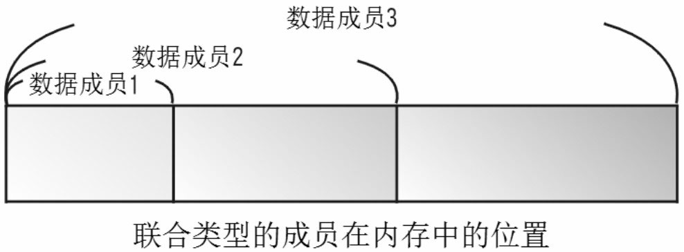

> <h2 id=''></h2>
- [**命名**](#命名)
	- [左值引用](#左值引用)
- [**字符串**](#字符串)
	- [字符串作为参数的传递](#字符串作为参数的传递)
	- [打印](#打印)
	- [输入](#输入)
- [**数组**](#数组)
	- [函数中返回数组](#函数中返回数组)
- [**结构体**](#结构体)
	- [结构体的存取](#结构体的存取)
- [结构变量](#结构变量)
	- [结构体的存取](#结构体的存取)
	- [结构指针数组](#结构指针数组)
- [嵌套结构](#嵌套结构)
- [函数与结构](#函数与结构)
- 	[**枚举类型**](#枚举类型)
- 	[联合类型](#联合类型)
- [**空指针**](#空指针)
	- [NULL](#NULL)
	- [nullptr](#nullptr)
	- [0](#0)
- [**预处理指令**](#预处理指令)
	- [__LINE__](#__LINE__)
	- [__FILE__](#__FILE__)
	- [if条件](#if)
	- [endif](#endif)


<br/>
<br/>

***
<br/>

> <h1 id='命名'>命名</h1>

<br/>

> <h2 id='左值引用'>左值引用</h2>

- 声明具名变量为引用，即既存对象或函数的别名。

- 引用必须被初始化为指代一个有效的对象或函数

- 引用不是对象；它们不必占用存储，尽管若需要分配存储以实现所需语义（例如，引用类型的非静态数据成员通常会增加类的大小，量为存储内存地址所需），则编译器会这么做。

<br/>

&emsp; 因为引用不是对象，故不存在引用的数组，不存在指向引用的指针，不存在引用的引用：

```
int& a[3]; // 错误
int&* p;   // 错误
int& &r;   // 错误
```


<br/>

**std: :string &**
- std：是一个命名空间，命名空间是防止名字冲突的一个策略；

- string: 是 std 命名空间中的一个类，即字符串类;

- 定义引用的,其表示方法与定义指针相似，只是用 & 代替了 *;

<br/>

引用的声明方法：类型标识符 &引用名=目标变量名;

`std::string & strOut` 的意思是声明一个 string 类型的引用，该引用变量名为 strOut


<br/>
<br/>

**左值引用:** 可用于建立既存对象的别名（可选地拥有不同的 cv 限定）：

```
#include <iostream>
#include <string>
 
int main() {
    std::string s = "Ex";
    std::string& r1 = s;
    const std::string& r2 = s;
 
    r1 += "ample";           // 修改 s
//  r2 += "!";               // 错误：不能通过到 const 的引用修改
    std::cout << r2 << '\n'; // 打印 s，现在保有 "Example"
}
```


<br/>

它们亦可用于在函数调用中实现按引用传递语义：

```
#include <iostream>
#include <string>
 
void double_string(std::string& s) {
    s += s; // 's' 与 main() 的 'str' 是同一对象
}
 
int main() {
    std::string str = "Test";
    double_string(str);
    std::cout << str << '\n';
}
```


<br/>
<br/>

<br/>

> <h2 id='引用声明'>引用声明</h2>

**`const char c_str();`**
- c_str()函数返回一个指向正规C字符串的指针常量, 内容与本string串相同.

&emsp; 这是为了与c语言兼容，在c语言中没有string类型，故必须通过string类对象的成员函数c_str()把string 对象转换成c中的字符串样式。

**注意：**一定要使用strcpy()函数 等来操作方法c_str()返回的指针

<br/>

比如,最好不要这样:

```
char* c;

string s="1234";

c = s.c_str(); //c最后指向的内容是垃圾，因为s对象被析构，其内容被处理，同时，编译器也将报错——将一个const char *赋与一个char *。
```


<br/>


应该这样用：

```
char c[20];

string s="1234";

strcpy(c,s.c_str());

```

这样才不会出错，c_str()返回的是一个临时指针，不能对其进行操作

<br/>


再举个例子:

&emsp; **c_str()** 以 char* 形式传回 string 内含字符串,如果一个函数要求char*参数，可以使用c_str()方法：

```
string s = "Hello World!";

printf("%s", s.c_str()); //输出 "Hello World!"
```


<br/>


> <h2 id=''></h2>


<br/>
<br/>

***
<br/>


> <h1 id="字符串">字符串</h1>

> <h2 id='字符串作为参数的传递'>字符串作为参数的传递</h2>

1) 有两种风格的字符串形式

```
char a[]={'h','e','l','l','o','\0'}  

//或者  
//C++ 编译器会在初始化数组时，自动把 '\0' 放在字符串的末尾；
char a[]="hello";

//长度
strlrn（a）;
```


<br/>

2）`string a="hello"; `
 
 ```
  //输出
  cout<<a 
  
  //或者
  for(int i=0;i<strlen(a);i++)  cout<<a[i]（或者a.at(i) ）；
  
  //长度
  a.size();
```


<br/>

2.字符串作为参数传入函数的两种方法

```
#include <iostream>
#include <string> 

using namespace std;

 
int getFilePath(char *str_test1,const string& str_test2)
{  
     cout<< str_test1<<endl;
     printf("%s",str_test2.c_str());
     
}
 
int main ()
{
     char str_test1[] = "测试路径1";
     string str_test2 = "测试路径2\n";
     getFilePath(str_test1,str_test2);


}
```


<br/>
<br/>

> <h2 id='打印'>打印</h2>

<br/>

```
//包含iostream头文件，C++中有关输入/输出的函数都在这个头文件中定义
#include <iostream>
//cstdlib是标准函数库的缩写，有许多实用的函数，包括使用的system()函数。
#include <cstdlib>

int main(int argc, const char * argv[]) {
    
    std::cout << "Hello, World!\n"<<std::endl;
    std::cout<<"sss"<<"qqq"<<"eee"<<std::endl;
    
    //cout是C++语言的输出指令，其中endl代表换行
    std:cout<<"我的第一个C++程序"<<std::endl;
    
    //目的是让程序输出结果暂停，等用户按下任意键后才会退出程序的输出窗口。
    system("pause");
    return 0;
}
```

打印：

```
sssqqqeee
我的第一个C++程序
sh: pause: command not found
```


<br/>
<br/>

> <h2 id='输入'>输入</h2>


```
#include <iostream>
#include <cstdlib>

int main(int argc, const char * argv[]) {
    
    char str[30];
    std::cout<<"数组长度：30， 可接受输入长度： 10"<<std::endl;
    std::cout<<"请输入任意字符串"<<std::endl;
    
    //getline()函数进行输入，它会读取用户所输入的每个字符（包含空格符），直到用户按下【Enter】键为止。
    //getline(字符串变量， 输入长度， 字符串结束符)
    std::cin.getline(str, 10, '\n');
    
    std::cout<<"str字符串变量为："<<str<<std::endl;
    system("pause");
    
    return 0;
}

```
打印：

```

数组长度：30， 可接受输入长度： 10
请输入任意字符串
请问二体育i1234567
str字符串变量为：qwertyui1
sh: pause: command not found

```


<br/>
<br/>


> <h1 id="数组">数组</h1>

<br/>

> <h2 id="函数中返回数组">函数中返回数组</h2>

```
#include <iostream>
#include <cstdlib>
#include <ctime>
 
using namespace std;
 
// 要生成和返回随机数的函数
int * getRandom( )
{
  static int  r[10];
 
  // 设置种子
  srand( (unsigned)time( NULL ) );
  for (int i = 0; i < 10; ++i)
  {
    r[i] = rand();
    cout << r[i] << endl;
  }
 
  return r;
}
 
// 要调用上面定义函数的主函数
int main ()
{
   // 一个指向整数的指针
   int *p;
 
   p = getRandom();
   for ( int i = 0; i < 10; i++ )
   {
       cout << "*(p + " << i << ") : ";
       cout << *(p + i) << endl;
   }
 
   return 0;
}
```


> <h2 id=''></h2>


<br/>
<br/>

***
<br/>


> <h1 id='结构体'>结构体</h1>

- 结构是一种类型，而不是变量，因此结构声明是在创建一种新类型，声明后才能创建结构变量来加以使用。结构的声明方式如下：

```

struct结构类型名称

   {

        数据类型 结构成员1；

        数据类型 结构成员2；

        ……

    };
```

<br/>
<br/>

> <h2 id='结构体的存取'>结构体的存取</h2>


&emsp; 定义完新的结构类型及声明结构变量后就可以开始使用所定义的结构成员了。只要在结构变量后加上成员运算符“.”与结构成员名称，就可以直接存取该结构成员了：

`结构变量．结构成员名称；`

```
#include <iostream>
#include <cstdlib>
    
using namespace std;
    
     
int main()
    
{
    
   struct student
    
   {
    
       char name[10];
    
       int score;
    
     } s1, s2; // 结构类型的声明与定义
    

    
      cout<<"学生姓名=";
    
      cin>>s1.name; //输入s1结构变量的name成员
    
      cout<<"学生成绩=";
    
      cin>>s1.score; // 输入s1结构变量的score成员
    
      s2 = s1; //结构变量的赋值
    
       cout<<"s1.name ="<<s1.name<<endl;
    
       cout<<"s1.score ="<<s1.score<<endl;
    
       cout<<"s2.name ="<<s2.name<<endl;
    
       cout<<"s2.score ="<<s2.score<<endl;
    

    
       system("pause");
    
       return 0;
    
  }

```

*`总结：`*根据上面所得，结构体在声明以后是已经申请好了一块内存，然后才对其内的各个成员变量进行赋值。


<br/>

***
<br/>

> <h1 id='	结构变量'>	结构变量</h1>

&emsp; 其可以直接对其成员进行存取，但是由于结构指针是以此结构为数据类型的指针变量，所存储的内容是地址，因此还是和一般指针变量一样，必须先指定结构变量的地址给指针才能间接存取其指向的结构变量的成员，如下所示：

```
结构指针 = &结构变量；
```

&emsp; 基本上，结构指针的数据访问方法有以下两种方式:

- （1）使用->符号指向结构指针的数据成员：

`结构指针->结构成员名称；`
    
- （2）使用取值运算符`“*”`以及小数点`“.”`存取结构变量的数据成员：

`(＊结构指针)．结构成员名称；`

```
#include <iostream>
    
#include <cstdlib>
    
using namespace std;
    

    
struct circle
    
{
           
	float r;
    
    float pi;
    
           float area;
    
      };  //声明circle结构
    
      int main()
    
      {
    
   	       struct circle myCircle;
    
   	       struct circle ＊getData;
    
   	
    
   	      //getData指向myCircle
    
   	       getData = &myCircle;
    
   	      //设置圆半径
    
   	       myCircle.r=5;
    
   	       myCircle.pi = 3.14159;
    
   	      //设置圆周率
    
   	       myCircle.area = myCircle.r＊myCircle.r＊myCircle.pi;
    
   	      //计算圆面积
    
   	
           
  		   cout<<"getData->r ="<<getData->r<<endl;
    
  	       cout<<"getData->pi ="<<getData->pi<<endl;
    
  	       cout<<"getData->area ="<<getData->area<<endl;
    
  	      //第一种结构指针的存取方式
    
  	       cout<<"--------------------------------------"<<endl;
    31       cout<<"(＊getData).r ="<<(＊getData).r<<endl;
    
  	       cout<<"(＊getData).pi ="<<(＊getData).pi<<endl;
    
  	       cout<<"(＊getData).area ="<<(＊getData).area<<endl;
    
  	      //第二种结构指针的存取方式
    
  	       system("pause");
    
  	       return 0;
    
  	  }
```


<br/>
<br/>

> <h2 id='结构指针数组'>结构指针数组</h2>

```
#include <iostream>
    
#include <cstdlib>
    
  using namespace std;
    

    
  int main()
    
  {
    
       struct student
    
       {
    
           char name[10];
    
           int score;
    
       };
    
       struct student s1[5] = { {"Justin", 90},

       							{"Momor",  95},
       							{"Becky",  98},
       							{"Bush",   75},
       							{"Snoopy", 80} }; // 设置5个成员的初始值
          struct student ＊s2[5]; // 声明成结构指针数组
    
       int i;
    

    
       for(i = 0; i < 5; i++)
    
          s2[i] = &s1[i]; //复制结构成员
    

    
       for(i = 0; i < 5; i++)
    
       {
    
          cout<<"姓名："<<s2[i]->name<<'\t';
    
          cout<<"成绩："<<s2[i]->score<<endl;
    
      }//显示结构成员
    

    
       system("pause");
    
       return 0;
    
  }
```


<br/>

***
<br/>

> <h1 id='嵌套结构'>嵌套结构</h1>


&emsp; 所谓嵌套结构，就是在一个结构中声明创建另一个结构，就如同一个书包（外层结构）里面还装有数个文件夹（内层结构），如图10-6所示。

<br/>



<br/>

***
<br/>


> <h1 id='函数与结构'>函数与结构</h1>


&emsp;由于结构是一种用户自定义数据类型，因此也可以在函数与函数之间传递结构变量。结构数据类型并不是C++的基本数据类型，因此要在函数中传递结构类型，就必须在全局范围内事先声明，其他函数才可以使用此结构类型来定义变量。

&emsp;在C++的函数间传递参数，可分为`传值（call by value）、传址（call by address）与传引用（call by reference）`三种方式。当然，函数中的结构数据传递也可以使用这几种参数传递方法。


<br/>

-	**结构传值调用**

&emsp; 传值调用会将整个结构变量复制到函数里，结构的所有成员项会一直存在函数中，以供函数内的语句直接使用。但是，当结构对象容量很大时，不仅占用许多内存空间，还会降低程序运行的效率。

```
函数类型 函数名称(struct结构类型名称 结构变量);

    或
    
函数类型 函数名称(struct结构类型名称);
```

例如：

`int calculate(struct product inbook);`

调用时，直接将结构变量传入函数即可：

`calculate(book);`


<br/>


- **结构传址调用**

&emsp; 传址调用所传入的参数为结构变量的内存地址，并以“&”运算符将地址传给函数，在函数内则通过结构指针来存取结构数据。这样的方式可解决传值调用时所造成的占用内存与效率降低的问题。不过，如果在函数中更改了传来的参数值，那么主函数内结构变量的值也会同步更改。函数原型声明如下：

```

函数类型 函数名称(struct结构类型名称 ＊结构变量);

或
函数类型 函数名称(struct结构类型名称 ＊);
```

例如：
`int calculate(struct product ＊inbook);`

调用时，直接将结构变量的地址传入函数即可:

`calculate(&book);`


<br/>


-	**结构传引用调用**

C++中的传引用调用方式也是类似于传址调用的一种，当然结构类型也可以使用传引用调用方式。当在函数内更改了形式参数的值时，也就更改了原先调用函数中的实际参数。在使用结构传引用调用时，只需要在函数原型和定义函数所要传递的参数前加上&运算符即可。函数原型声明如下：
```

    函数类型 函数名称(struct结构类型名称 &结构变量);

    或

    函数类型 函数名称(struct结构类型名称 &);
```
例如：

    `int calculate(struct product &inbook);`
调用时，直接将结构变量的地址传入函数即可：

    `calculate(book);`


<br/>


- **其他自定义数据类型**

&emsp; 所谓自定义数据类型，就是根据设计需要自行定义的数据类型。在程序中，可以用自定义类型来定义这种自定义数据类型的变量。除了上述的struct可自定义数据类型外，还有枚举（enum）、联合（union）与类型定义（typedef）三种方式。本节中会针对这三种类型特性分别进行说明。

**类型定义指令**

&emsp;类型定义指令（typedef）可用来重新定义数据类型，将原有的类型或结构使用typedef指令以有意义的新名称来取代，让程序可读性更高。声明语法如下：


```
typedef原类型 新定义类型；
```

&emsp; 要让类型名称更有意义，程序员可以使用typedef指令将int重新定义为integer：

```
typedef int integer;
integer age=20;
```

&emsp; 经过以上声明，int和integer就都声明为整数类型了。如果要重新定义结构类型，程序代码声明就不必每次都加上struct保留字了，例如：

```
typedef struct house
{
	int roomNumber;
	char houseName[10];
} house_Info;

house_Info  myhouse;
```


<br/>

***
<br/>


> <h1 id='枚举类型'>枚举类型</h1>


枚举类型（enum）也是一种由用户自行定义的数据类型，内容是由一组常数集合成的枚举成员，并给予各个常数值不同的命名。枚举类型的优点在于把变量值限定在枚举成员的常数集合里，并使用名称的方式来进行赋值，使得程序的可读性大为提高。

```

enum枚举类型名称

     {
	
            枚举成员1,
	
            枚举成员2,
	
            ……
          
	};
      enum枚举类型名称 枚举类型变量；

例如：

      enum Drink

            {
	
            coffee,  //默认值为0
	
            milk,    //默认值为1
	
            tea,      //默认值为2
	
            water    //默认值为3
	
            };
```


<br/>

***
<br/>


> <h1 id='联合类型'>联合类型</h1>


&emsp; 联合类型（union）与结构类型（struct）无论是在定义方法还是成员存取上都十分相似，但结构类型所定义的每个成员拥有各自的内存空间，而联合却是共享内存空间，如图10-11所示。

<br/>




联合变量的定义与声明方式如下：
```

    union联合类型名称

    {
	
        数据类型 数据成员1;
	
        数据类型 数据成员2;
	
    数据类型 数据成员3;
	
        ……
	
    };
```
	


    
union联合类型名称 联合变量；
联合变量内的各个成员以同一个内存区块来存储数据，并以占最大内存空间的成员作为联合类型的内存空间大小。例如，定义下面的联合类型Data, u1联合对象所占内存空间的大小则会以字符数组name为主，也就是20个字节：
```

    union Data

    {
	
        int a;
	
        int b;
	
        char name[20];
	
    } u1;
```

定义完新的联合类型和声明联合变量后就可以开始使用所定义的数据成员了。只要在联合变量后加上成员运算符“.”与数据成员名称就可以直接存取该数据成员：

联合对象．数据成员；

```
 #include <iostream>

#include <cstdlib>

using namespace std;

int encode(int);    // 加密函数

int decode(int);    // 解密函数


int main(int argc, const char * argv[]) {
    

    int pwd;
    cout<<"请输入密码：";
    cin>>pwd;

    pwd = encode(pwd);
    
    cout<<"加密后："<<pwd<<endl;
    pwd = decode(pwd);
    cout<<"解密后："<<pwd<<endl;
    system("pause");
    
    return 0;
    
}
    // 参  数：未加密的密码
    // 返回值：加密后的密码
int encode(int pwd){
    int i;
    union{
        int num;
        char c[sizeof(int)];
    } u1;

    u1.num = pwd;
    for(i = 0; i< sizeof(int); i++){
        u1.c[i] += 32;
    }
        return u1.num;
}
int decode(int pwd)
{
    int i;
    union{
        int num;
        char c[sizeof(int)];
    } u1;

    u1.num = pwd;
    
    for(i = 0; i< sizeof(int); i++)
        u1.c[i] -= 32;

    return u1.num;
}


```


<br/>

***
<br/>


> <h1 id='空指针'>空指针</h1>

> <h2 id='NULL'>NULL</h2>


&emsp; 在C语言中，我们使用NULL表示空指针，也就是我们可以写如下代码：
	
```
int *i = NULL;
foo_t *f = NULL;
```

<br/>

实际上在C语言中，NULL通常被定义为如下：

```
define NULL ((void *)0);
```

&emsp; 也就是说NULL实际上是一个void *的指针，然后吧void *指针赋值给int *和foo_t *的指针的时候，隐式转换成相应的类型。而如果换做一个C++编译器来编译的话是要出错的，因为C++是强类型的，void *是不能隐式转换成其他指针类型的，所以通常情况下，编译器提供的头文件会这样定义NULL：

```
#ifdef __cplusplus ---简称：cpp c++ 文件

#define NULL 0

#else

#define NULL ((void *)0)

#endif
```

<br/>
<br/>

> <h2 id='nullptr'>nullptr</h2>


<br/>
<br/>

> <h2 id='0'>0</h2>


&emsp; C++中不能将void *类型的指针隐式转换成其他指针类型，而又为了解决空指针的问题，所以C++中引入0来表示空指针（注：0表示，还是有缺陷不完美），这样就有了类似上面的代码来定义NULL。实际上C++的书都会推荐说C++中更习惯使用0来表示空指针而不是NULL，尽管NULL在C++编译器下就是0。


<br/>

***
<br/>

> <h1 id='预处理指令'>预处理指令</h1>


<br/>
<br/>


> <h2 id='__LINE__'>__LINE__</h2>

- `__LINE__`宏可打印出此宏所出现的行号;

<br/>
<br/>

> <h2 id='__FILE__'>__FILE__</h2>

- `__FILE__`宏可打印出正在被编译的文件路径与名称;


<br/>
<br/>

> <h2 id='if条件'>if条件</h2>


- `#if`条件编译指令类似于if条件语句，当此条件成立时，会执行此程序语句区块的程序代码，如果不成立，就略过不执行;

- `#endif`指令是搭配#if等条件编译指令来使用的，作用类似于`}`大括号，有结束的功能。声明语法如下：

```
#if条件表达式


   程序语句区块
   
#endif
```

- `#else`条件编译指令，必须搭配`#if`指令，形成和`if else`条件语句类似的功能，当`#if`指令不成立时会跳过程序语句区块一，执行`#else`下面的程序语句区块二，声明语法如下：

```

#if条件表达式


    程序语句区块一


#else条件表达式


程序语句区块二


#endif
```


<br/>
<br/>


- `#elif`指令在C++中类似于`if else if`条件语句中的`else if`语句。可以针对多种编译条件来进行验证，只要其中的一个条件成立，就执行该条件的程序区块。

```

#if条件表达式一


 程序语句区块一


#elif条件表达式二


    程序语句区块二


#elif条件表达式三


    程序语句区块三

    …


#endif
```


<br/>

预处理命令简单使用:


<br/>

解释：


<br/>
<br/>

- `#ifdef`条件编译指令的条件判断式是由单一的标识符组成的，通过判断`预处理指令#define`是否定义了此标识符来决定是否编译区块内的程序语句。声明语法如下：

```

    #ifdef宏名称


        程序语句区块


    #endif
```

- `#ifndef`条件编译指令与`#ifdef`条件编译的作用正好相反，当宏名称没有被定义时才会执行`#ifndef`的程序语句区块部分。声明语法如下：

```

    #ifndef宏名称


        程序语句区块


    #endif
```


<br/>
<br/>

***
<br/>

> <h1 id=''></h1>

<br/>


> <h2 id=''></h2>

<br/>
<br/>

***
<br/>


<br/>
<br/>

***
<br/>

> <h1 id=''></h1>

<br/>


> <h2 id=''></h2>


<br/>
<br/>

***
<br/>

> <h1 id=''></h1>

<br/>


> <h2 id=''></h2>


<br/>
<br/>

***
<br/>

> <h1 id=''></h1>

<br/>


> <h2 id=''></h2>


<br/>
<br/>

***
<br/>

> <h1 id=''></h1>

<br/>


> <h2 id=''></h2>


<br/>
<br/>

***
<br/>

> <h1 id=''></h1>

<br/>


> <h2 id=''></h2>


<br/>
<br/>

***
<br/>

> <h1 id=''></h1>

<br/>


> <h2 id=''></h2>


