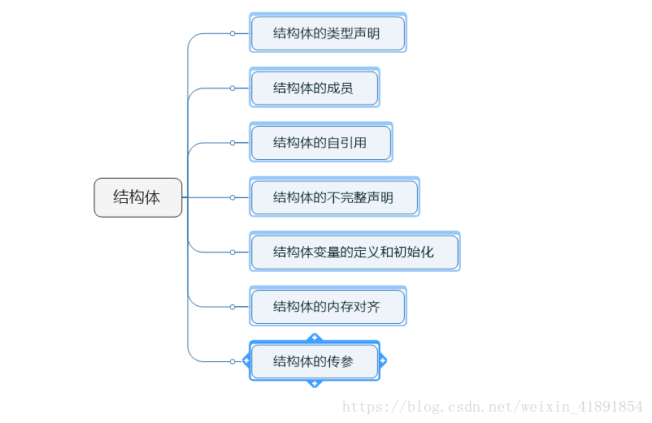
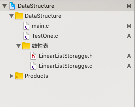
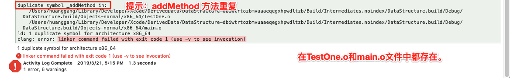

> <h2 id=''></h2>
- [**++i和i++**](#++i和i++)
- [**结构体**](#结构体)
	- [申明和定义](#申明和定义)
	- [结构体成员](#结构体成员)
	- [结构体的引用](#结构体的引用)
	- [结构体变量的定义和初始化](#结构体变量的定义和初始化)
	- [结构体内存对齐](#结构体内存对齐)
	- [Structure传参](#Structure传参)
- 	[**输入和输出**](#输入和输出)
	- [	getchar()和putchar(）](#getchar()和putchar())
	- [	gets()和puts()](#gets()和puts())
	- 	[scanf()和printf()](#scanf()和printf())
- [	**文件包含**](#文件包含)
	- [.c文件和.h文件的意义](#.c文件和.h文件的意义)
	- [文件包含形式](#文件包含形式)
	- [编译多文件程序](#编译多文件程序)


<br/>
<br/>

***
<br/>

> <h1 id='++i和i++'>++i和i++</h1>


```
#include <studio.h>
int main() {
  int i,x;
  i = 1;
  x = 1;
  x = i ++;  　　　　  //先让x变成i的值1，再让i加1
  print("%d", x);     //x=1
  print("%d", i);     //i=2

  i = 1;
  x = 1;
  x = ++i;  　　　　  //先让i加1, 再让x变成i的值2
  print("%d", x);    //x=2
  print("%d", i);    //i=2
}

```

&emsp;  经过运算后，i的值都是2,在while和for循环中的 ++i 和 i++ 是没有区别的。

<br/>

**`i++和++i的区别就是：`**
- i++ ：先引用，后增加
- ++i ：先增加，后引用

<br/>

**`换句话就是：`**

&emsp; i++ : 先在i所在的表达式中使用i的当前值，再让i加1

&emsp; ++i : 先让i加1，再在i所在的表达式中使用i的新值


<br/>


**`取决于＋＋和i的相对位置：`**

&emsp; ＋＋在i前面，i先加1，然后在表达式中用i的值；＋＋在i后面，先在表达式中用i的值，然后i再加1。


<br/>
<br/>

***
<br/>

> <h1 id='结构体'>结构体</h1>

**学习结构体的原因：**

&emsp;  首先我们要了解为什么要用到`结构体`，我们已经学了很多`int 、char …`等类型还学到了同类型元素构成的数组，以及上述类型的指针，在一些小应用可以灵活使用。然而，在我们实际应用中，每一种变量进行一次声明，再结合起来显然是不太实际的，比如一位学生的信息管理，他可能有，姓名（char）、学号（int）、成绩（float）等多种数据。如果把这些数据分别单独定义，就会特别松散、复杂，难以规划。因此我们需要把一些相关的变量组合起来，以一个整体形式对对象进行描述，这就是`结构体`的好处。





<br/>
<br/>


> <h2 id='申明和定义'>申明和定义</h2>

- **`结构体特点`**
	-  结构体变量分配地址，而结构体的定义是不分配空间的；
	-  结构体中各成员的定义和之前的变量定义一样，但在定义时也不分配空间；
	-  结构体变量的声明需要在主函数之上或者主函数中声明，如果在主函数之下则会报错；
	-    C语言中的结构体不能直接进行强制转换，只有结构体指针才能进行强制转换。

- **`结构体的申明`**

```
struct StructureName{

    memberVariableList;

} StructureVariableList;

```

-  StructureName: 结构体名字；
-  memberVariableList： 成员变量类表；
-  StructureVariableList：结构体变量列表；


<br/>

> **`定义结构体的几种方法`**

-  1.先定义结构体类型，再定义结构体变量

```

struct Student{
      char number[20];         //学号
      char name[20];       //姓名
      char sex[5];         //性别
      int age;             //年龄
};             

//stu1,stu2为student结构体变量,分配空间
struct Student stu1,stu2;

// 用别名定义结构体类型的普通变量、指针变量和数组
struct Student stu1, *ps, stu[5]; 

size_t size_struct = sizeof(stu1);
size_t size_int = sizeof(int);
size_t size_char = sizeof(char);
printf(" struct stu1占用内存：%zu\n int 占用内存：%zu\n char 占用内存：%zu\n ", size_struct, size_int, size_char);

```
打印：
<br/>
` struct stu1占用内存：52`
` int 占用内存：4`
`char 占用内存：1`


<br/>


- **2.`定义结构体类型的同时定义结构体变量`**

```
struct Student{
    char number[20];   //学号
    char name[20];     //姓名
    char sex[5];       //性别
    int age;           //年龄
} stu1,stu2;  //结构体变量的定义 分配空间


// 用别名定义结构体类型的普通变量、指针变量和数组
struct Student stu1, *ps, stu[5]; 

size_t size_struct = sizeof(stu1);
size_t size_int = sizeof(int);
size_t size_char = sizeof(char);
printf(" struct stu1占用内存：%zu\n int 占用内存：%zu\n char 占用内存：%zu\n ", size_struct, size_int, size_char);

```

打印：

```
struct stu1占用内存：52
int 占用内存：4
char 占用内存：1
```

此时还可以继续定义Student结构体变量，如：`struct Student stu3;`


<br/>

- **3.不指定类型名而直接定义结构体变量**

```
struct{
    char    number[20];     //学号
    char    name[20];       //姓名
    char    sex[5];         //性别
    int     age;            //年龄
} stu1,stu2;  //结构体变量的定义 分配空间


size_t size_struct = sizeof(stu1);
size_t size_int = sizeof(int);
size_t size_char = sizeof(char);
printf(" struct stu1占用内存：%zu\n int 占用内存：%zu\n char 占用内存：%zu\n ", size_struct, size_int, size_char);

```

打印：

```
struct stu1占用内存：52

int 占用内存：4

char 占用内存：1
```

&emsp;  一般不使用这种方法，因为直接定义结构体变量stu1、stu2之后，就不能再继续定义该类型的变量。


<br/>

- **4.用typedef定义结构体变量**

```
typedef struct Stdudent{
    char    number[20];     //学号
    char    name[20];       //姓名
    char    sex[5];         //性别
    int     age;            //年龄
} Apprentice;

// 用别名定义结构体类型的普通变量、指针变量和数组
Apprentice stu1, *ps, stu[5]; 

Apprentice student;
size_t size_struct = sizeof(student);
size_t size_int = sizeof(int);
size_t size_char = sizeof(char);
printf(" struct student占用内存：%zu\n int 占用内存：%zu\n char 占用内存：%zu\n ", size_struct, size_int, size_char);
```

打印：

```
struct student占用内存：52
int 占用内存：4
char 占用内存：1
```

&emsp;  上面的代码，定义了一个结构体变量类型，这个类型有2个名字：第一个名字是Stdudent；第二个类型名字是Apprentice.


<br/>
<br/>

定义了这个之后，下面有2中方法可以定义结构体变量

**第一种：** 

```
//定义了一个student_1的结构体变量，分配空间
struct Stdudent student_1;   
```

<br/>

**第二种：**

```
//定义了一个student_1的结构体变量，分配空间
Apprentice student_1            
```


<br/>
<br/>


> <h2 id='结构体成员'>结构体成员</h2>

&emsp;  获取结构体成员的一般格式为：`结构体变量名.成员名;`

```
struct Student
    {
        long ID;
        char name[20];
        float score;
    }ChengXin;

struct Student stu1;

```

-  `struct Student *p=&stu1;`

-  `(* p). score;`

-  ` p -> ID;`


<br/>
<br/>

> <h2 id='结构体的引用'>结构体的引用</h2>

```
typedef struct Tool{
    char    eraser[10];
    char    knife[20];
}LearnTools;

typedef struct Stdudent{
    char    number[20];     //学号
    char    name[20];       //姓名
    char    sex[5];         //性别
    int     age;            //年龄
    
    LearnTools *tool;
} Apprentice;

```

&emsp;  在结构体中不可以包含一个类型为他自身的结构体,但结构体中可以包含自身类型的指针类型。


<br/>
<br/>


> <h2 id='结构体变量的定义和初始化'>结构体变量的定义和初始化</h2>


```
typedef struct Tool{
    char    eraser[10];
    char    knife[20];
}LearnTools;

typedef struct Stdudent{
    char    number[20];     //学号
    char    name[20];       //姓名
    char    sex[5];         //性别
    int     age;            //年龄
    
    LearnTools tool;
} Apprentice;


# one 结构体赋值
    //定义
    Apprentice student_one;
    //初始化
    LearnTools tool = {"橡皮", "卷笔刀"};
    //结构体嵌套
    Apprentice student_two = {"2019314", "harley.boTe", "male", 16, {"🐸橡皮","威力刀具"}};
    
    printf("tool 结构体值为：%s,  %s\n", tool.eraser, tool.knife);
    printf("student_two 结构体值为：%s,  %s, %s,  %d, %s,  %s", student_two.number, student_two.name, student_two
           .sex, student_two.age, student_two.tool.eraser, student_two.tool.knife);


# two strcpy 赋值
typedef struct Stdudent{
    char    number[20];     //学号
    char    name[20];       //姓名
    char    sex[5];         //性别
    int     age;            //年龄
} Apprentice;


int main(int argc, const char * argv[]) {
    Apprentice student;
    
    strcpy(student.number, "20191038");
    strcpy(student.name, "hello");
    strcpy(student.sex, "male");
    student.age = 25;
//    strcpy(student.age, 26);//注意：这个库函数针对于字符串，int型不可以
    printf("numger: %s, name: %s, sex: %s, age: %d\n", student.number, student.name, student.sex, student.age);


//输出：numger: 20191038, name: hello, sex: male, age: 25


# three 定义之后任意赋值
int main(int argc, const char * argv[]) {
    Apprentice student = {
        .number = "20191038",
        .name = "hello",
        .sex = "male",
        .age = 25,
    };
    
    
    printf("numger: %s, name: %s, sex: %s, age: %d\n", student.number, student.name, student.sex, student.age);

//输出值为：numger: 20191038, name: hello, sex: male, age: 25
}
```

<br/>

输出:

```
tool 结构体值为：橡皮,  卷笔刀
student_two 结构体值为：2019314,  harley.boTe, male,  16, 🐸橡皮威力刀具,  威力刀具 struct student占用内存：84
```

结构体的赋值只能访问成员变量逐个赋值，不可以一起赋值。


<br/>
<br/>


> <h2 id='结构体内存对齐'>结构体内存对齐</h2>

```
struct Compare_one{
    int     a;
    char    c;
    double  d;
};
struct Compare_Two{
    char    c;
    double  d;
    int     a;
};

int main(int argc, const char * argv[]) {
      printf("size for int : %lu, char: %lu, double: %lu\n", sizeof(int), sizeof(char), sizeof(double));
      printf("%lu\n", sizeof(struct Compare_one));
      printf("%lu\n", sizeof(struct Compare_Two));
      system("pause");
}

```


<br/>

我们原希望输出：

```
size for int : 4, char: 1, double: 8
13
13
```


<br/>

实际输出为：

```
size for int : 4, char: 1, double: 8
16
24
```

**这是为什么呢？**

&emsp; 这就是结构体的[内存对齐](https://blog.csdn.net/shanghx_123/article/details/79679726)，其原因主要有：`平台和性能两个原因，简而言之，就是拿空间换取时间`。


<br/>

- **对齐规则：**
	-  第一个成员在结构体变量的偏移量为0的地指处；
	
	-  下一个成员变量对齐到该成员变量对齐数的整数倍地址处，对齐数=min（默认对齐数（OC：8，liunux：4），该成员字节数）；
	
	-  结构体的总大小为所有成员变量最大对齐数的整数倍；
	
	-  如果结构体嵌套，嵌套的结构体对齐到自己最大对齐数的整数倍除，结构体的整体大小就是所有成员变量最大的对齐数的整数倍。


<br/>
<br/>

**`DEMO`**

```
struct Compare_one{
    int     a;  //4
    char    c;  //4+1=5
    double  d;  //5+3+8=16
};
struct Compare_Two{
    char    c;                  //1
    struct Compare_one one;     //1+7+16=24
    double  d;                  //24+8=32
    int     a;                  //32+4=36
};//大于36的最小的整除最大对齐数8的是40，所以运算结果应该是40

int main(int argc, const char * argv[]) {
    printf("size for int : %lu, char: %lu, double: %lu\n", sizeof(int), sizeof(char), sizeof(double));
    printf("%lu\n", sizeof(struct Compare_Two));
    system("pause");
}
```

<br/>

输出：

```
size for int : 4, char: 1, double: 8
40
```


<br/>

***
<br/>


> <h2 id='Structure传参'>Structure 传参</h2>


```
void print_one(struct Compare_one one){
    //传值
    printf("one.a:%d\n", one.a);
}

void print_two(struct Compare_Two *two){
    //传指针
    printf("two.a:%d\n", two->a);
    printf("two.c:%c\n", (*two).c);

}


int main(int argc, const char * argv[]) {
    struct Compare_one one = {6, 'H', 12.00};
    struct Compare_Two two = {'E', {8, 'L', 120.00}, 124.00, 8};
    print_one(one);
    print_two(&two);
}
```

<br/>

输出：

```
one.a:6
two.a:8
two.c:E
```


<br/>
<br/>

***
<br/>


> <h1 id='输入和输出'>输入和输出</h1>


<br/>

> <h2 id='getchar()和putchar(）'>getchar()和putchar(）</h2>


&emsp;    `int getchar(void)` 函数从屏幕读取下一个可用的字符，并把它返回为一个整数。这个函数在同一个时间内只会读取一个单一的字符。您可以在循环内使用这个方法，以便从屏幕上读取多个字符。

&emsp;    `int putchar(int c) `函数把字符输出到屏幕上，并返回相同的字符。这个函数在同一个时间内只会输出一个单一的字符。您可以在循环内使用这个方法，以便在屏幕上输出多个字符。

```

    int data;
    printf("输入 Content：\n");
    data = getchar();
    printf("输出值为：");
    putchar(data);
    printf("\n");

```

<br/>

输出：

```
输入 Content:
RRRRRR
输出值为：R
```


<br/>
<br/>


> <h2 id='gets()和puts()'>gets()和puts()</h2>


&emsp;   ` char *gets(char *s)` 函数从 stdin 读取一行到 s 所指向的缓冲区，直到一个终止符或 EOF。

&emsp;   `int puts(const char *s) `函数把字符串 s 和一个尾随的换行符写入到 stdout。

```

    char conent[100];
    printf("输入 Content：");
    gets(conent);
    printf("\n打印值为：");
    puts(conent);
    printf("\n");

```

<br/>

输出：

```
输入 Content：warning: this program uses gets(), which is unsafe.
QQQQQQQQQQQ
打印值为：QQQQQQQQQQQ
```


<br/>
<br/>


> <h2 id='scanf()和printf()'>scanf()和printf()</h2>

 
&emsp;  `int scanf(const char *format, ...)` 函数从标准输入流 `stdin `读取输入，并根据提供的 format 来浏览输入。

&emsp;  `int printf(const char *format, ...)` 函数把输出写入到标准输出流 `stdout` ，并根据提供的格式产生输出。

&emsp;  `format `可以是一个简单的常量字符串，但是您可以分别指定 `%s、%d、%c、%f` 等来输出或读取字符串、整数、字符或浮点数。还有许多其他可用的格式选项，可以根据需要使用。

```

    char conent[100];
    printf("输入 Content：");
    scanf("%s", conent);
    printf("value = %s \n", conent);
    

```

<br/>

打印：

```
输入 Content：DDDDDDDDDDD
value = DDDDDDDDDDD
```


<br/>
<br/>

***
<br/>


> <h1 id='文件包含'>文件包含</h1>

&emsp;  C语言文件包含处理在程序开发中会给我们的模块化程序设计带来很大的好处，通过文件包含的方法把程序中的各个功能模块联系起来是模块化程序设计中的一种非常有利的手段。

&emsp;  `文件包含处理`是指在一个源文件中，通过文件包含命令将另一个源文件的内容全部包含在此文件中。在源文件编译时，连同被包含进来的文件一同编译，生成目标目标文件。


<br/>


- **`文件包含分为两种：`**
	- 包含.c文件
	- 多文件程序

&emsp; `多文件程序`: 是在源文件编译时把多个文件进行编译、连接在一起生成一个可执行文件;

&emsp;  `包含.c文件`: 按照我们上边的说法则是把多个文件合并为一个文件进行编译。


<br/>

- **`文件包含的两个处理阶段`**
	-  处理时间：文件包含也是以`"#"开头来写的(#include )`, 那么它就是写给预处理器来看了, 也就是说文件包含是会在编译预处理阶段进行处理的;
	-  处理方法：在预处理阶段，系统自动对`#include`命令进行处理，具体做法是:将包含文件的内容复制到包含语句`(#include )`处，得到新的文件，然后再对这个新的文件进行编译。


<br/>
<br/>

> <h2 id='.c文件和.h文件的意义'>.c文件和.h文件的意义</h2>

.h为头文件，.c为源文件，其实两者都是代码。

<br/>

- **主要有几点好处：**
	- .h头文件用于共享，只用一句#include就能包含，当然.c也可以包含；
	- 如果你要写库的话，可是你又不想暴露你的源代码，你可以把.c编译成.obj或是.lib发给别人用，然后把.h作为。
	-   所以一般情况下，.h里面全部都是声明，.c里面全部都是实现，有了.h就可以编译，有了.lib或你的.obj就可以连接。


<br/>
<br/>

> <h2 id='文件包含形式'>文件包含形式</h2>




**`main.c 文件中`**

```
#include <stdio.h>
#include "LinearListStoragge.h"
#include "TestOne.c"  //导入TestOne.c 文件会报错
#pragma mark -- CustomClass

int main(int argc, const char * argv[]) {

    orderListMethodCalling();
    
    int a = 5, b = 15;
    addMethod(a, b);
    
    return 0;
}
```


&emsp;  这时`Command+B`，就会在Xcode中编译报错，如下图：



<br/>

&emsp;  当时看别人编写C语言博客时，需要在main.c文件中要导入`TestOne.c`文件，需要加入`#include "TestOne.c"`。当时我也这么想也这么做的，但是我忽略了Xcode的强大，它把这件事当仁不让的做了,去掉 `#include "TestOne.c" `即可。在上面的代码段中，将 `.h` 文件去除`(注释掉：#include "LinearListStoragge.h")`也可以的，在 main 方法中也可以调用其方法。

<br/>


`main.c 文件`

```
#include <stdio.h>
#pragma mark -- CustomClass

int main(int argc, const char * argv[]) {

    orderListMethodCalling();
    
    int a = 5, b = 15;
    addMethod(a, b);
    
    return 0;
}

```

<br/>

`TestOne.c 文件`

```

#include <stdio.h>


void addMethod(int a, int b){
    int c = a + b;
    printf(".c文件中的addMethod: %d\n", c);
}

```
输出：

```
.c文件中的addMethod: 20
```

<br/>

&emsp;  这个例子是采用包含.c文件 的方法实现的。
 
&emsp;  在编译时，直接去编译`main.c`文件，预处理器会先把`TestOne.c` 文件中的内容复制到`main.c`中来，然后再对新的`main.c`进行编译。通过编译命令：

 ```
gcc main.c -o main
```

可以看到，这里并没有对TestOne.c进行编译，但还是生成了最终的main可执行程序。

也可以通过命令来观察一下预处理的结果：
编译命令：

```
   gcc -E main.c -o main.cpp
```

&emsp;  通过在main.cpp文件末尾可以观察到，其实就是将TestOne.c文件中的内容添加到了main函数之前，然后对新的文件进行编译，生成最终的可执行程序。


<br/>
<br/>

> <h2 id='编译多文件程序'>编译多文件程序</h2>


&emsp;  同样是上边的例子，现在编译器不是Xcode，我们需要在main.c中导入`TestOne.c`文件。但是我们把main.c中“` #include "TestOne.c" `”注释掉，加上一句：“`extern int c;`”因为 `c` 变量在文件`TestOne.c`中定义。

<br/>

**`main.c 文件`**

```
#include <stdio.h>
//#include "TestOne.c"
//添加上这一句
extern int c;

int main(int argc, const char * argv[]) {

    orderListMethodCalling();
    
    int a = 5, b = 15;
    addMethod(a, b);
    
    return 0;
}

```


<br/>

**`TestOne.c 文件`**

```
#include <stdio.h>

int c = 0;
void addMethod(int a, int b){
     c = a + b;
    printf(".c文件中的addMethod: %d\n", c);
}

```

&emsp;  这次如果还是按照上面的方法只编译main.c的话就会出错，因为变量c和函数`addMethod(int a, int b)`并没有在main.c中定义，所以编译时需要将`TestOne.c `一起编译：

<br/>

编译命令：

```   
gcc -c main.c -o main.o                 #编译main.c
gcc -c TestOne.c  -o TestOne.o          #编译TestOne.c 
gcc main.o TestOne.o -o main            #用main.o TestOne.o生成main
```


<br/>

       
- **`两者的不足之处是：`**
	-  包含.c的文件: 容易产生"重定义",大家想想如果一个工程中有多个文件都同时包含了某一个件，那么这个被包含文件的内容就会被复制到多个文件中去，也就相当于每个包含该文件的文件中都定义被包含文件中的变量和函数，这样在链接时就会产生"重定义"错误。
	
	-  多文件分开编译: 这个比较好，不容易出现"重定义"之类的问题，这也是我们最常用的一种方法，但是并不是像上面这个例子中这样直接去用，而是使用"头文件"将各个.c文件联系起来。
   
<br/>  

&emsp;  上边这个例子大家会发现，在main.c中需要加上“extern int c;”这样一句声明，如果包含的文件较多？如果全局变量较多？...这个我们可以省掉吗？回答是肯定的！方法就是给它写上一个头文件。
 


<br/>

- **1.包含.h文件** 

**`main.c `**

```
#include <stdio.h>
#include "LinearListStoragge.h"


int main(int argc, const char * argv[]) {

    orderListMethodCalling();
    
    int a = 5, b = 15;
    addMethod(a, b);
    
    return 0;
}


```

<br/>


**LinearListStoragge.h**

```
extern int c;               //把c声明为外部可用的
void addMethod(int a, int b);   //addMethod函数的声明

```


<br/>

**`LinearListStoragge.c`**

```
#include "LinearListStoragge.h"

int c = 0;
void addMethod(int a, int b){
    c = a + b;
    printf(".c文件中的addMethod: %d\n", c);
}

```


<br/>

&emsp;  由上面来看，在要用到fun.c中定义的函数或变量的文件中只要包含`.h`文件就可以了，是不是这样？？？`Ha Ha`，当然是了。。。

&emsp;  预处理时会把`.h文件`中的内容复制到包含它的文件中去，而复制的这些内容只是声名，不是定义，所以它被复制再多份也不会出现"重定义"的错误。。。

&emsp;  前面说了头文件的方法也是模块化程序设计中的一种非常有利的手段。

&emsp;  把同一类功能写到一个`.c`文件中，这样可以把它们划为一个模块，另外再对应的写上一个`.h`文件做它的声明。这样以后再使用这个模块时只需要把这两个文件添加进工程，同时在要使用模块内函数或变量的文件中包含`.h`文件就可以了。
         
&emsp;  举个很实际的例子，在单片机、ARM或其他嵌入式开发中，每一个平台可能本身都有多种不同的硬件模块，使用时需要去写相应的驱动程序，这样就可以把各个硬件模块的驱动程序作为一个模块(比如`lcd驱动`对对应`lcd.c`和`lcd.h`，`IIC驱动`对应`I2C.c`和`I2C.h`等)，当具体使用到某个模块时，只需要在将对应的.c和.h文件添加进工程，并在文件中包含对就的.h文件即可。


<br/>
 
- **`所以关于头文件的写法个人总结以下几点:`**
	-  对应的.c文件中写变量、函数的定义
	-  对应的.h文件中写变量、函数的声明
	-  如果有数据类型的定义 和 宏定义 ，请写的头文件(.h)中
	-  头文件中一定加上#ifndef...#define....#endif之类的防止重包含的语句
	-  模块的.c文件中别忘包含自己的.h文件


<br/>
<br/>

> <h2 id=''></h2>


<br/>
<br/>

> <h2 id=''></h2>


<br/>
<br/>

***
<br/>


> <h1 id=''></h1>


<br/>

> <h2 id=''></h2>


<br/>
<br/>

***
<br/>


> <h1 id=''></h1>


<br/>

> <h2 id=''></h2>


