> <h2 id=''></h2>
-  [**指针**](#指针)
-  [**指针介绍**](#指针介绍)
-  [指针的操作](#指针的操作)
	- [取址](#取址)
	- 	[解址](#解址)
	- 	[指针之间的赋值](#指针之间的赋值)
	- [	指针的属性](#指针的属性)
- [**指针与数组**](#指针与数组)
- [**指针与字符串**](#指针与字符串)
- [**内存**](#内存)
- [**指针类型**](#指针类型)
	- [空指针](#空指针)
	- [坏指针](#坏指针)
	- [void*类型指针](#void*类型指针)
	- [野指针](#野指针)
- [**函数指针**](#函数指针)
- [**结构体指针**](#结构体指针)
	- 	[结构体变量申明](#结构体变量申明)
- [**数组和指针**](#数组和指针)
- [**函数和指针**](#函数和指针)
	- 	[参数为指针的结构体](#参数为指针的结构体)
- [**const 和指针**](#const和指针)
- [**深拷贝和浅拷贝**](#深拷贝和浅拷贝)
- **参考资料**
	- [C 语言指针详解](https://www.cnblogs.com/lulipro/p/7460206.html)
	- [malloc与free本质(内存的释放与回收)](https://www.cnblogs.com/shiweihappy/p/4246372.html)
	- [静态存储区、栈区、堆区的区别](https://blog.csdn.net/u010977122/article/details/53099425)
 


<br/>

***
<br/>

> <h1 id='指针'>指针</h1>


<br/>

**物理内存**

&emsp;    ==维修==电脑师傅眼中的内存：内存在物理上是由一组DRAM芯片组成的.

<br/>

**软件内存**

&emsp;    操作系统将`RAM`(分为两大类：`SRAM`和`DRAM`)等硬件和软件结合起来，给程序员提供的一种对内存使用的抽象。这种抽象机制使得程序使用的是虚拟存储器,而不是直接操作和使用真实存在的物理存储器,所有的虚拟地址形成的集合就是虚拟地址空间。如下图：

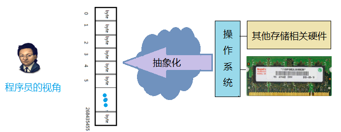


<br/>

系统中的实际内存排列：

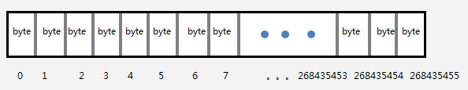

&emsp;  内存是一个很大的，线性的字节数组（平坦寻址）。每一个字节都是固定的大小，由8个二进制位组成。最关键的是，每一个字节都有一个唯一的编号,编号从0开始，一直到最后一个字节。如上图中，这是一个256M的内存，他一共有256x1024x1024=268435456个字节，那么它的地址范围就是 0 ~ 268435455(在内存中，每一个字节（byte）都有一个内存编号，也就是地址，如同现实生活中的地址一样，每一个地址都可存储二进制编码（bit）的数据.)。

&emsp;  `系统中的内存每一个字节都有一个唯一的编号。因此，在程序中使用的变量，常量，甚至函数等数据，当它们被载入到内存中后，都有自己唯一的编号，这个编号就是这个数据的地址，指针就是这样形成的。`


<br/>

-  bit(位):   一个二进制数据0或1，是`1bit`；

-  byte(字节):  存储空间的基本计量单位,`1byte  =  8  bit`;

-  1 字母 = 1 byte = 8 bit;

-  1 汉字 = 2 byte = 16 bit;


==**`+ 64 位的编译器各类型字节数显示`**==

```
//不同的编译器位数，其字节数显示是不同的。通过在程序中打印：
printf("%lu", sizeof(int));   //在Xcode中输出：4，说明是64位的编译器


char：      1个字节

short：     2个字节

int：       4个字节

long：      8个字节

float:      4个字节

double：    8个字节

```

&emsp;   查看操作系统位数，在终端输入：`uname -a` 在末尾有` x86_64`说明是64位的操作系统。


<br/>
<br/>
<br/>

***
<br/>

> <h1 id='指针介绍'>指针介绍</h1>


**代码Demo：**

```
include <iostream>

int main(int argc, const char * argv[]) {
    
    std::cout << "<<<<<<<<<<<<<<<<<<    Start\n";

    int num1 = 10;
    char ch1[2] = "A";
    
    std::cout<<"变量名称    变量值 内存地址"<<std::endl;
    std::cout<<"-----------------------"<<std::endl;

    std::cout<<"num1"<<"\t"<<num1<<"\t"<<&num1 <<std::endl;
    std::cout<<"ch1"<<"\t""\t"<<ch1<<"\t"<<&ch1 <<std::endl;


    std::cout << ">>>>>>>>>>>>>>>>>>    End!\n";
    system("pause");
    return 0;
}

```
输出：

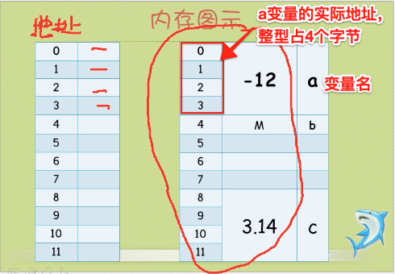


```
int a = -12;
char b = M;
float c = 3.14
```


<br/>


<br/>


```diff
+ 指针的申明：
- 首先必须定义指针的数据类型，并在数据类型后加上“*”符号，再赋予指针名称，即可声明一个指针变量。

- 由于指针属于系统底层的存取功能，因此通过指针可以存取内存中所指向的内存区内容。假如赋予指针错误的地址，而该地址又刚好是系统数据存储的内存区，此时若覆盖（override）该内存区的内容，很可能会造成系统不稳定或者宕机的情况。另外，如果声明指针时未指定初值，就经常会让指针指向未知的内存地址。
```


<br/>

**第一种方式：**

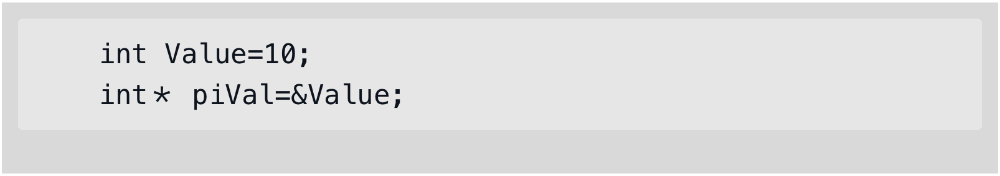

<br/>

**第二种方式：**

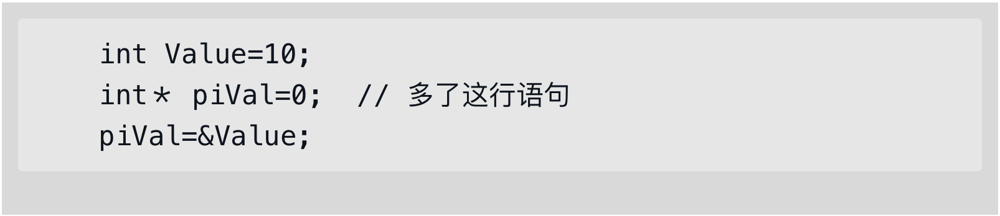

&emsp;  第一种方式在声明时即赋予了初值；
&emsp;  第二种方式则在声明时先设置初值为0，日后需要使用指针时再把变量地址赋值给指针变量。在此要特别说明一点，此处的初值0代表NULL，而不是数值0。因此在声明指针变量时，万万不能直接将指针变量的初值设置为数值，这样会使指针变量指向不合法的地址，因而造成不可预期的错误。

例如：`int *piVal = 10; // 不合法语句`
以下的声明也会造成指针变量指向不合法地址，请大家小心：

```diff
! int *piVal;
*piVal = 10; // 不合法语句
```

&emsp;如果指针变量已经事先指向了一个定义或声明过的变量地址，那么程序可以通过`*`（取值运算符，或引用运算符）来存取重新指向此指针变量的数据内容，使用格式如下：

`*指针变量 = 数值; // 此指针变量已指向合法地址`


<br/>

编译器将变量名和地址进行挂钩，内存中没有存放变量的名字；


&emsp;  **`指针的值实质是内存单元（即字节）的编号，所以指针单独从数值上看，也是整数，他们一般用16进制表示。指针的值（虚拟地址值）使用一个机器字的大小来存储,也就是说,对于一个机器字为w位的电脑而言,它的虚拟地址空间是0~2w － 1 ,程序最多能访问2w个字节。`**

&emsp;  **`所以可以把指针看做是一个变量，其值为另一个变量的地址，即内存位置的直接地址。`**

```
//地址是计算机内存中的某个位置，而指针是专门用来存放地址的特殊类型变量
type *pointer;

type：      指针的基类型；
*   ：      申明指针；
pointer：   指针变量；//作用：是用来存放地址和对地址进行索引
```


<br/>

**`DEMO图`**

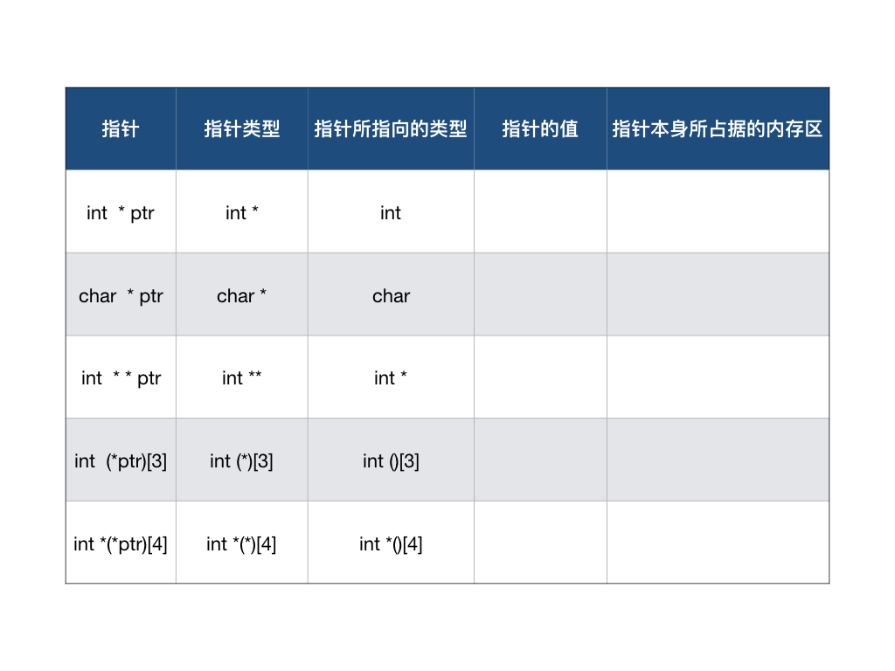


&emsp;  要掌握指针的四方面的内容：指针的类型、指针所指向的类型、指针的值(或者叫指针所指向的内存区)、指针本身所占据的内存区。

- 指针的类型： 从语法的角度看，把指针声明语句里的指针名字去掉，剩下的部分就是指针的类型；
-  指针所指向的类型：决定了编译器将把那片内存区里的内容当做什么来看待。从语法上看，你只须把指针声明语句中的指针名字和名字左边的指针声明符`*`去掉，剩下的就是指针所指向的类型；

-  指针的值：是指针本身存储的数值，这个值被编译器当作一个地址，而不是一个一般的数值。在64 位程序里，所有类型指针的值都是一个64 位整数，因为64 位程序里内存地址全都是64 位长。`指针的值`代表那个内存地址的开始，长度为`sizeof(数据类型)`的一片内存区。以后，我们说一个指针的值是XX，就相当于说该指针指向了以XX 为首地址的一片内存区域；我们说一个指针指向了某块内存区域，相当于说该指针的值是这块内存区域的首地址。`指针的值`和`指针所指向的类型`是两个完全不同的概念。在上图中，指针所指向的类型已经有了，但由于指针还未初始化，所以它所指向的内存区是不存在的，或者说是无意义的。

-  指针本身所占据的内存区：指针本身占用的内存可以用函数`sizeof(数据类型)`测一下就知道了。在64 位平台里，指针本身占据了8 个字节的长度。指针本身占据的内存这个概念在判断一个指针表达式是否是左值时很有用。


<br/>

```

//普通的整型变量
int p; 

//首先从P 处开始,先与*结合,所以说明P 是一个指针,然后再与int 结合,说明指针所指向的类型为int 型.所以P是一个返回整型数据的指针
int *p;  

//首先从P 处开始,先与[]结合,说明P 是一个数组,然后与int 结合,说明数组里的元素是整型的,所以P 是一个由整型数据组成的数组  
int p[3]; 

//首先从P 处开始,先与[]结合,因为其优先级比*高,所以P 是一个数组,然后再与*结合,说明数组里的元素是指针类型,
//然后再与int 结合,说明指针所指向的类型是整型的,所以P 是一个返回整型数据的指针所组成的数组  
int *p[3]; 

//首先从P 处开始,先与*结合,说明P 是一个指针然后再与[]结合,说明指针所指向的内容是一个数组,
//然后再与int 结合,说明数组里的元素是整型的.所以P 是一个指向整型数据组成的数组的指针  
int (*p)[3]; 

//首先从P 开始,先与*结合,说是P 是一个指针,然后再与*结合,说明指针所指向的元素是指针,然后再与int 结合,说明该指针所指向的元素是整型数据.
//由于二级指针以及更高级的指针极少用在复杂的类型中,所以后面更复杂的类型我们就不考虑多级指针了,最多只考虑一级指针.  
int **p; 

//从P 处起,先与()结合,说明P 是一个函数,然后进入()里分析,说明该函数有一个整型变量的参数,然后再与外面的int 结合,说明函数的返回值是一个整型数据 
int p(int); 

//从P 处开始,先与指针结合,说明P 是一个指针,然后与()结合,说明指针指向的是一个函数,然后再与()里的int 结合,说明函数有一个int 型的参数,
//再与最外层的int 结合,说明函数的返回类型是整型,所以P 是一个指向有一个整型参数且返回类型为整型的函数的指针  
Int (*p)(int); 

//从P 开始,先与()结合,说明P 是一个函数,然后进入()里面,与int 结合,说明函数有一个整型变量参数,然后再与外面的*结合,说明函数返回的是一个指针,
//然后到最外面一层,先与[]结合,说明返回的指针指向的是一个数组,然后再与*结合,说明数组里的元素是指针,然后再与int 结合,说明指针指向的内容是整型数据.
//所以P 是一个参数为一个整数据且返回一个指向由整型指针变量组成的数组的指针变量的函数. 
int *(*p(int))[3]; 

```
 

<br/>
<br/>
<br/>

***
<br/>

<h1 id='指针的操作'>指针的操作</h1>

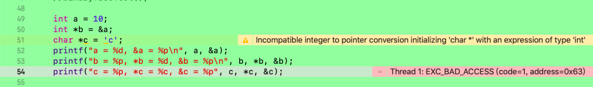

打印：

```
! a = 10, &a = 0x7ffeefbff4fc

! b = 0x7ffeefbff4fc, *b = 10, &b = 0x7ffeefbff4f0

```
```
void contactAddressAndPointer()
{
    int num = 97;
    //定义一个指针pointer
    int *pointer;
    //对  num  取地址(&num, 使用连字号&运算符访问的地址), 赋值给指针变量pointer
    pointer = &num;

    /*
      int num=97;
      //在定义指针pointer的同时将num的地址赋给指针pointer
      int *pointer=&num;
    */

    //pointer：指向的变量num的地址；
    // &pointer：指针pointer的地址，因为指针也是一个变量自己也有地址的；
    //&num：变量 num 的地址；
    printf("地址：\np:%p,  &p:%p,  &num:%p\n\n",pointer, &pointer, &num);

    //*pointer：变量 num 的值；
    //i：变量 i 的值；
    printf("值：\n指针变量*pointer：%d,  num的值：%d\n",*pointer,num);
}

```

打印值：

```
地址：
p:0x7ffeefbff57c,  &p:0x7ffeefbff570,  &num:0x7ffeefbff57c

值：
指针变量*pointer：97,  num的值：97
```


&emsp;  用来保存 指针 的变量，就是指针变量。如果指针变量pointer保存了变量 num的地址，则就说：pointer指向了变量num，也可以说pointer指向了num所在的内存块 ，这种指向关系，在图中一般用 箭头表示。

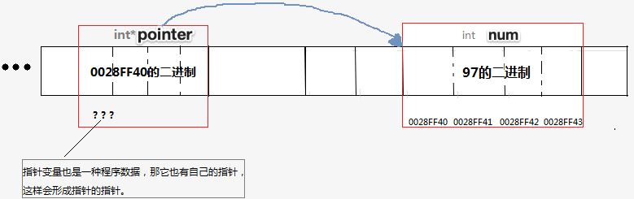

&emsp;  指针变量pointer指向了num所在的内存块 ，即从地址0028FF40开始的4个byte 的内存块。


<br/>

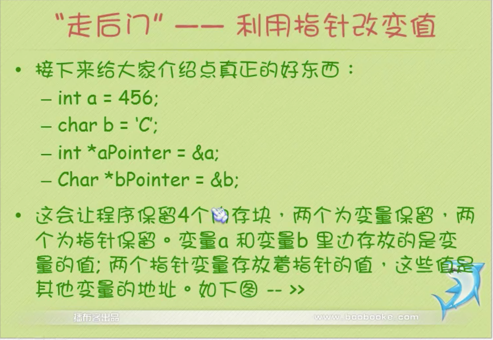

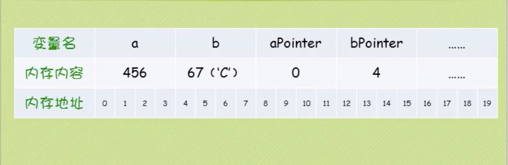


<br/>
<br/>

># <h2 id='取址'>**取址**</h2>

```
    int pointerFunc(int x, int b){
        return x + b;
    }


    int num = 97;
    float scrore = 10.00F;
    int arr[3] = {1, 2, 3};
    int (*ptr)(int, int);
    
    int *p_num = &num;
    float *p_scrore = &scrore;
    int (*p_arr)[3] = &arr; //指向含有3个int元素的数组的指针 
    ptr = *pointerFunc;
    const char *msg = "Hello Pointer";
    
    printf(" p_num: %p, *p_num: %d, &num:%p\n", p_num, *p_num, &num);
    printf(" p_scrore: %p,  *p_scrore: %f, &num:%p\n", p_scrore, *p_scrore, &scrore);
    printf(" p_arr: %p, *p_arr:%p, &arr:%p\n", p_arr, *p_arr, &arr);
    printf(" pointerFunc 地址：%p, &pointerFunc: %p, *pointerFunc:%p\n", pointerFunc, &pointerFunc, *pointerFunc);
    printf(" msg: %p,  *msg:%c,&msg:%p\n", msg, *msg, &msg);
    int n = (*ptr)(10, 5);
    printf(" n = %d", n);

```

打印：

```
 - p_num: 0x7ffeefbff534, *p_num: 97, &num:0x7ffeefbff534
 - p_scrore: 0x7ffeefbff530,  *p_scrore: 10.000000, &scrore:0x7ffeefbff530
 - p_arr: 0x7ffeefbff54c, *p_arr:0x7ffeefbff54c, &arr:0x7ffeefbff54c
 - pointerFunc 地址：0x100001360, &pointerFunc: 0x100001360, *pointerFunc:0x100001360
 - msg: 0x100001c60,  *msg:H,&msg:0x7ffeefbff508
 - n = 15
 ```


特殊的情况，他们并不一定需要使用&取地址：
-  数组名的值就是这个数组的第一个元素的地址。
-  函数名的值就是这个函数的地址。
-  字符串字面值常量作为右值时，就是这个字符串对应的字符数组的名称,也就是这个字符串在内存中的地址。 


<br/>
<br/>
<br/>

># <h2 id='解址'>**‌解址**</h2>

&emsp;  实质是：从指针指向的内存块中取出这个内存数据。
&emsp;  对一个指针解地址，就可以取到这个内存数据，解地址 的写法，就是在指针的前面加一个`*`号。

```
    int age = 19;
    int：*p_age = &age;
    *p_age  = 20;  //通过指针修改指向的内存数据
    
    printf("age = %d\n",*p_age);   //通过指针读取指向的内存数据
    printf("age = %d\n",age);

```
打印：

```
age = 20
age = 20
```

<br/>

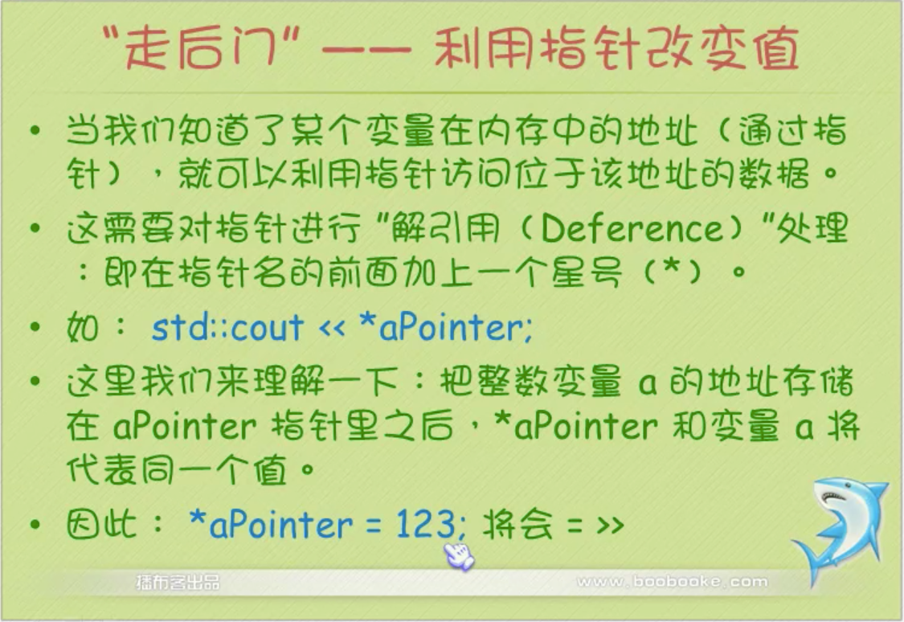

- **`注意：`**
	-  指针所保留的是内存中一个地址，它并不保存指向的数据的值本身。因此，务必确保指针对应一个已经存在的变量或者一块已经分配了的内存；
	
	-  星号有两种用途：
	    * 用于创建指针：`int *myPointer = &myInt;`
    * 对指针进行解引用：`*myPointer = 3998;`


<br/>
<br/>


> <h2 id='指针之间的赋值'>指针之间的赋值</h2>


&emsp;  指针赋值和int变量赋值一样，就是将地址的值拷贝给另外一个。指针之间的赋值是一种浅拷贝，是在多个编程单元之间共享内存数据的高效的方法。

```
//通过指针 p1 、 p3 都可以对内存数据 num 进行读写，如果2个函数分别使用了p1 和p3，那么这2个函数就共享了数据num。
int num = 10;
int* p1  = & num;
int* p3 = p1;


printf("num值没改变：num= %d, *p1= %d, *p3= %d", num, *p1, *p3);
    
num = 100;
printf("\n\nnum值改变后：num= %d, *p1= %d, *p3= %d", num, *p1, *p3);

```
输出值：
`num值没改变：num= 10, *p1= 10, *p3= 10`

`num值改变后：num= 100, *p1= 100, *p3= 100`

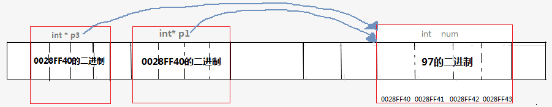


<br/>
<br/>

> <h2 id='指针的属性'>指针的属性</h2>


```
int main(void)
{
    int num = 97;
    int *p1  = &num;
    char* p2 = (char*)(&num);

    printf("%d\n",*p1);    //输出  97
    putchar(*p2);          //输出  a
    return 0;
}
```

`指针的值`：很好理解，如上面的num 变量 ，其地址的值就是0028FF40 ，因此 p1的值就是0028FF40。数据的地址用于在内存中定位和标识这个数据，因为任何2个内存不重叠的不同数据的地址都是不同的。
`指针的类型`：指针的类型决定了这个指针指向的内存的字节数并如何解释这些字节信息。一般指针变量的类型要和它指向的数据的类型匹配。
 
 
由于num的地址是0028FF40，因此p1  和  p2的值都是0028FF40
`*p1`  :  将从地址0028FF40
开始解析，因为p1是int类型指针，int占4字节，因此向后连续取4个字节，并将这4个字节的二进制数据解析为一个整数 97。
`*p2`  :  将从地址0028FF40 开始解析，因为p2是char类型指针，char占1字节，因此向后连续取1个字节，并将这1个字节的二进制数据解析为一个字符，即`a`。
 
同样的地址，因为指针的类型不同，对它指向的内存的解释就不同，得到的就是不同的数据。


<br/>
<br/>
<br/>

***
<br/>


> <h1 id='指针与数组'>指针与数组</h1>


&emsp;  对于已定义好的数组，也可以直接使用数组名来进行指针加法运算，也就是数组名可以直接当成一种指针常数来用，并能使用指针的各种运算。例如，只要在数组名上加1，表示移动一个数组元素内存的偏移量。或者通过取址运算符“&”取得该数组元素的地址，并以指针方式直接存取数组内的元素值。 两种语法如下：


-   数组可以直接当成指针常数来用，而数组名地址则是数组第一个元素的地址。不过由于数组的地址是只读的，因此不能改变其值，这点是和指针变量最大的不同。例如：

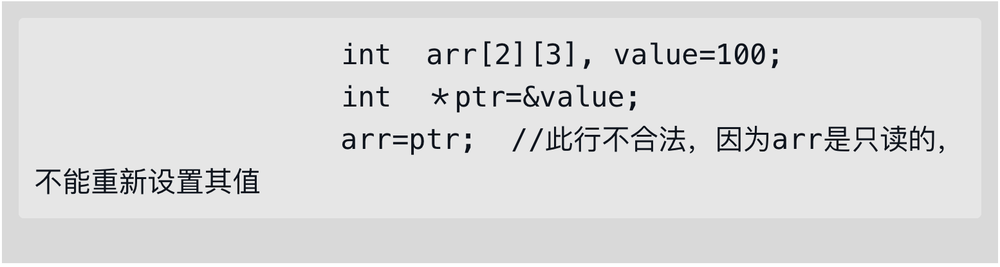


<br/>
<br/>
<br/>

***
<br/>

> <h1 id='指针与字符串'>指针与字符串</h1>


- 指针变量表示字符串

字符数组声明字符串的方式：


C++中的字符串也可以通过指针来声明与操作。例如，在C++程序中可以使用字符串指针变量来指向字符串常数，声明格式如下：

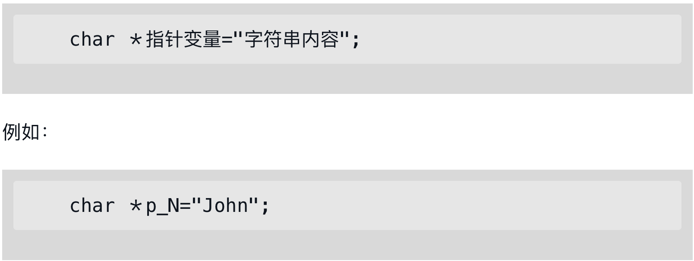


当声明完成时，系统将分配内存来存储字符串"John"，并设置指针变量`*p_N`来指向此变量的起始位置:

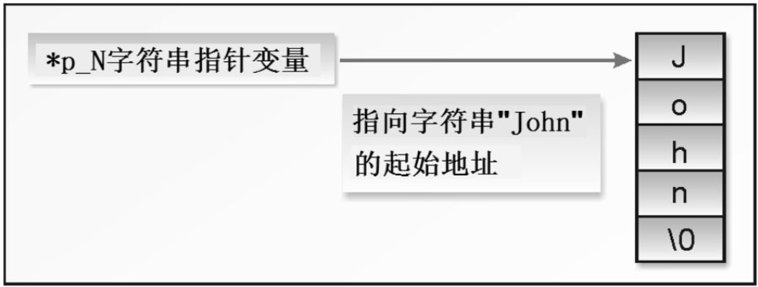


<h2 id=''></h2>
- [内存](#内存)
	- [静态存储区](#静态存储区)
	- [栈区](#栈区)
	- [堆区](#堆区)
	- [内存泄漏](#内存泄漏)
	- [内存溢出](#内存溢出)
	- [野指针](#野指针)
	- [指针置为nil和对象release的作用](#指针置为nil和对象release的作用)
- [指针类型](#指针类型)
	- [空指针](#空指针)
	- [坏指针](#坏指针)
	- [野指针](#野指针)
- [函数指针](#函数指针)
- [结构体指针](#结构体指针)
	- [结构体变量申明和指针结构体声明](#结构体变量申明和指针结构体声明)
	-[ 结构体变量申明](#结构体变量申明和指针结构体声明) 
- [数组和指针](#数组和指针)
- [函数和指针](#函数和指针)
- [const 和指针](#const和指针)
- [深拷贝和浅拷贝](#深拷贝和浅拷贝)


<br/>
<br/>

***
<br/>


> <h1 id='内存'>内存</h1>

<br/>

- **`1.静态存储区`**

&emsp;  内存在程序编译的时候就已经分配好，这块内存在程序的整个运行期间都存在。它主要存放静态数据、全局数据和常量。

<br/>

- **`2.栈区`**

&emsp;  在执行函数时，函数（包括main函数）内局部变量的存储单元都可以在栈上创建，函数执行结束时这些存储单元自动被释放。栈内存分配运算内置于处理器的指令集中，效率很高，但是分配的内存容量有限。（任何变量都处于栈区，例如int a[] = {1, 2},变量a处于栈区。数组的内容也存在于栈区。）


<br/>

- **`3.堆区`**

&emsp;  亦称动态内存分配。程序在运行的时候用malloc或new申请任意大小的内存，程序员自己负责在适当的时候用free或delete释放内存。动态内存的生存期可以由我们决定，如果我们不释放内存，程序将在最后才释放掉动态内存。 但是，良好的编程习惯是：如果某动态内存不再使用，需要将其释放掉，并立即将指针置位NULL，防止产生野指针。


<br/>

- **`4.内存泄漏：`**

&emsp;  是指申请的内存空间使用完毕之后未回收。一次内存泄露危害可以忽略，但若一直泄漏，无论有多少内存，迟早都会被占用光，最终导致程序crash。


<br/>


- **`5.内存溢出：`**

&emsp;  是指程序在申请内存时，没有足够的内存空间供其使用。通俗理解就是内存不够用了，通常在运行大型应用或游戏时，应用或游戏所需要的内存远远超出了你主机内安装的内存所承受大小，就叫内存溢出。最终导致机器重启或者程序crash。


<br/>


- **`6.野指针：`**

&emsp;  指向一个已删除的对象或者受限内存区域的指针，参考：[野指针and空指针](https://www.cnblogs.com/mjios/archive/2013/04/22/3034788.html)，


<br/>


- **`7.指针置为nil和对象release的作用`**

&emsp; `nil`就是把一个对象的指针置为空，只是切断了指针与内存中对象的联系；

&emsp; `release`是通知内存释放这个对象，但是在IOS中其实也不会立马释放内存，而是将内存计数器剪去1，直到计数器变为0，才会释放掉内存，所以release的目的是为了释放内存，而self.object = nil，是清空指针。


<br/>
<br/>

***
<br/>

># <h1 id='指针类型'>指针类型</h1>


<br/>

> <h2 id='空指针'>空指针</h2>

&emsp;  指向空，或者说不指向任何东西。在C语言中，我们让指针变量赋值为NULL表示一个空指针，而C语言中，NULL实质是 `((void*)0)` ，  在C++中，`NULL实质是 0`。

&emsp;  任何程序数据都不会存储在地址为0的内存块中，它是被操作系统预留的内存块。

摘自 `stddef.h`

```
#ifdef __cplusplus
     #define NULL    0
#else    
     #define NULL    ((void *)0)
#endif
```


<br/>
<br/>


<h2 id='坏指针'>坏指针</h2>

&emsp;  指针变量的值是 `NULL`，或者未知的地址值，或者是当前应用程序不可访问的地址值，这样的指针就是`坏指针`，不能对他们做解指针操作，否则程序会出现运行时错误，导致程序意外终止。

&emsp;  任何一个指针变量在做 解地址操作前，都必须保证它指向的是有效的，可用的内存块，否则就会出错。坏指针是造成C语言Bug的最频繁的原因之一。

```
void opp()
{
     int*p = NULL;
     *p = 10;      //Oops! 不能对NULL解地址
}

void foo()
{
     int*p;
     *p = 10;      //Oops! 不能对一个未知的地址解地址
}

void bar()
{
     int*p = (int*)1000; 
     *p =10;      //Oops!   不能对一个可能不属于本程序的内存的地址的指针解地址
}
```


<br/>
<br/>


<h2 id='void*类型指针'>void* 类型指针</h2>

&emsp;  由于void是空类型，因此`void*`类型的指针只保存了指针的值，而丢失了类型信息，我们不知道他指向的数据是什么类型的，只指定这个数据在内存中的起始地址，如果想要完整的提取指向的数据，程序员就必须对这个指针做出正确的类型转换，然后再解指针。因为，编译器不允许直接对`void*`类型的指针做解指针操作。


<br/>
<br/>

<h2 id='野指针'>野指针</h2>


&emsp; `野指针`：就是指针指向的位置是不可知的（随机的、不正确的、没有明确限制的）很可能触发运行时段错误。

&emsp; `产生原因`：指针变量如果是局部变量，则分配在栈上，本身遵从栈的规律（反复使用，使用完不擦除，所以是脏的，本次在栈上分配到的变量的默认值是上次这个栈空间被使用时余留下来的值），就决定了栈的使用多少会影响这个默认值。

&emsp; 指针变量在定义时如果未初始化，值也是随机的。指针变量的值其实就是别的变量（指针所指向的那个变量）的地址，所以意味着这个指针指向了一个地址是不确定的变量，这时候去解引用就是去访问这个地址不确定的变量，所以结果是不可知的。

&emsp; `危害`:
-  指向不可访问（操作系统不允许访问的敏感地址，譬如内核空间）的地址，结果是触发段错误，这种算是最好的情况了；
-  指向一个可用的、而且没什么特别意义的空间（譬如我们曾经使用过但是已经不用的栈空间或堆空间），这时候程序运行不会出错，也不会对当前程序造成损害，这种情况下会掩盖你的程序错误，让你以为程序没问题，其实是有问题的；
-  指向了一个可用的空间，而且这个空间其实在程序中正在被使用（譬如说是程序的一个变量x），那么野指针的解引用就会刚好修改这个变量x的值，导致这个变量莫名其妙的被改变，程序出现离奇的错误。一般最终都会导致程序崩溃，或者数据被损害。这种危害是最大的。


<br/>

- **`野指针产生`**

```

#include <stdio.h>
#include <stdlib.h>
 
int main()
{
	char *p1 = NULL;
    printf("p1:%p, &p1:%p\n",p1,&p1);
    
    p1 = (char*)malloc(100);      //为p1在堆区分配空间
    if(p1 == NULL)                //若为空直接return出程序
    {
        return 0;
    }
    printf("p1:%p, &p1:%p\n",p1,&p1);
    
    if(p1 != NULL)                //目的：释放p1
    {
        free(p1);                 //只释放了p1指向的堆区空间  并没有将指针p1置为空
    }
    printf("p1:%p, &p1:%p\n",p1,&p1);
}
```

打印值：

```
p1:0x0, &p1:0x7ffeefbff548

p1:0x1006179f0, &p1:0x7ffeefbff548

p1:0x1006179f0, &p1:0x7ffeefbff548
```

由打印值看：`p1并不为0，也就是在释放p1时，仅仅释放的是p1指向的内存空间，并没有将指针p1指为空，此时p1就成了野指针！`

**解决方法：**
	- `在定义一个指针时初始化为NULL;`
	- `释放指针指向的内存空间时，将指针重置为NULL;`

**`优化代码`**

```
#include <stdio.h>
#include <stdlib.h>
 
int main()
{
    char *p1 = NULL;
    printf("p1:%p, &p1:%p\n",p1,&p1);
    
    p1 = (char*)malloc(100);      //为p1在堆区分配空间
    if(p1 == NULL)                //若为空直接return出程序
    {
        return 0;
    }
    printf("p1:%p, &p1:%p\n",p1,&p1);
    
    if(p1 != NULL)                //目的：释放p1
    {
        free(p1);                 //只释放了p1指向的堆区空间  并没有将指针p1置为空
        p1 = NULL;			      //重新置为空
    }
    printf("p1:%p, &p1:%p\n",p1,&p1);
}

```
打印值：

```
p1:0x0, &p1:0x7ffeefbff548

p1:0x10058fdd0, &p1:0x7ffeefbff548

p1:0x0, &p1:0x7ffeefbff548
```


<br/>
<br/>

***
<br/>


<h1 id='函数指针'>函数指针</h1>

&emsp;  一个函数总是占用一段连续的内存区域，函数名在表达式中有时也会被转换为该函数所在内存区域的首地址，这和数组名非常类似。我们可以把函数的这个首地址（或称入口地址）赋予一个指针变量，使指针变量指向函数所在的内存区域，然后通过指针变量就可以找到并调用该函数，这种指针就是`函数指针`。

<br/>

**定义：**

- ***returnType (*pointerName)(parameters list)是谁`***
	-  returnType 为函数返回值类型;
	-  pointerNmae 为指针名称;
	-  parameters list 为函数参数列表;
	-  ( )的优先级高于*，第一个括号不能省略，如果写作returnType *pointerName(paramlist);


**`DEMO`**

```
int main(int argc, const char * argv[])
{
    //函数申明
    int  pointerFunc(int x);

    int (*ptr)(int);
    //将pointerFunc函数的首地址赋给指针ptr
    ptr = pointerFunc;  //等价于 ptr = * pointerFunc, ptr = & pointerFunc;
    printf(" pointerFunc 地址：%p,\n &pointerFunc: %p,\n  *pointerFunc:%p", pointerFunc, &pointerFunc, *pointerFunc);
    int n = (*ptr)(10);
    printf("n = %d", n);

}

//函数实现
int pointerFunc(int x){
    return x +10;
}
```
打印结果：

```
ointerFunc 地址：0x100001410,
 
&pointerFunc: 0x100001410,

*pointerFunc:0x100001410

n = 20

```
 
&emsp;  ptr是指向函数的`指针变量`，所以可把函数pointerFunc赋给ptr作为ptr的值，即把pointerFunc的入口地址赋给ptr,以后就可以用ptr来调用该函数。
&emsp; 实际上ptr和pointerFunc都指向同一个入口地址，不同就是ptr是一个指针变量，不像函数名称那样是死的，它可以指向任何函数。在程序中把哪个函数的地址赋给它，它就指向哪个函数。而后用指针变量调用它，因此可以先后指向不同的函数。


<br/>

***
<br/>

<h1 id='结构体指针'>结构体指针</h1>


结构体指针有特殊的语法：  -> 符号 

如果p是一个结构体指针，则可以使用 p ->【成员】 的方法访问结构体的成员。p->member 等价于 (*p).member。

```
typedef struct
{
    char name[31];
    int age;
    float score;
}Student;


int main(int argc, const char * argv[])
{
     Student stu = {"Bob" , 19, 98.0};
    Student*ps = &stu;
    
    ps->age = 20;
    ps->score = 99.0;
    printf("name:%s age:%d\n",ps->name,ps->age);
    return 0;
}
```
输出：

`name:Bob age:20`


 <br/>
 
- **结构体变量申明和指针结构体声明**

**`指针结构体声明`**

```
typedef struct BinaryTreeNode {
    char data;
    struct BinaryTreeNode *leftChild;
    struct BinaryTreeNode *rightChild;
} BinaryTreeNode, *BinaryTree;


void binaryTreeTest(void);


int initBinaryTree(BinaryTree *binaryTree){
    *binaryTree = NULL;
    
    return TRUE;
}

void  setTest(BinaryTree *node){
    *node = (BinaryTreeNode *)malloc(sizeof(BinaryTreeNode));
    printf("\n\n*node:%p, node:%p", *node, node);
    (*node)->data = 'S';
}

//方法调用
void binaryTreeTest(void){
    BinaryTree binaryTree;  //指针结构体声明
    
    int statusCode = 0;
    

    statusCode = initBinaryTree(&binaryTree);
    printf("binaryTree:%p,  &binaryTree:%p", binaryTree, &binaryTree);
    setTest(&binaryTree);
    printf("data:%c, binaryTree:%p, &binaryTree:%p", binaryTree->data, binaryTree, &binaryTree);
    
}

```
打印：

```
- //binaryTree：指针变量地址，&binaryTree：指针的地址

binaryTree:0x0,  &binaryTree:0x7ffeefbff4d8

+ //变量地址不同了，但是指针的地址相同


*node:0x1007156a0, node:0x7ffeefbff4d8 

! //binaryTree->data中的binaryTree指向的地址都是相同的。

data:S, binaryTree:0x1007156a0, &binaryTree:0x7ffeefbff4d8  
```


<br/>

&emsp; `BinaryTreeNode`为结构名，这个名字主要是为了在结构体中包含自己为成员变量的时候有用(因为执行到的其内其内成员变量时的,别名还没有被编译，只能用结构名来定义指向这个结构的指针.) 
BinaryTreeNode 为struct BinaryTreeNode的别名 
BinaryTree 为struct BinaryTreeNode*的别名

例如：

```diff
+ BinaryTree L;//定义了一个指向ANSWER_HEADER的指针L

# 相当于

-   BinaryTreeNode *L;

```

<br/>
<br/>

<h2 id='结构体变量申明'>结构体变量申明</h2>


```
typedef struct BinaryTreeNode {
    char data;
    struct BinaryTreeNode *leftChild;
    struct BinaryTreeNode *rightChild;
} BinaryTreeNode, *BinaryTree;


void binaryTreeTest(void);


int initBinaryTree(BinaryTreeNode *binaryTree){
    binaryTree = NULL;
    
    return TRUE;
}


void  setTest(BinaryTreeNode *node){
    node = (BinaryTreeNode *)malloc(sizeof(BinaryTreeNode));
    printf("\n\n*node:%p, &node:%p", node, &node);
    node->data = 'S';
}

//方法调用
void binaryTreeTest(void){
    BinaryTreeNode binaryTree;
    
    int statusCode = 0;

    statusCode = initBinaryTree(&binaryTree);
    printf("binaryTree:%p,  &binaryTree:%p", binaryTree, &binaryTree);
    setTest(&binaryTree);
    printf("\n\n-->>data:%c, binaryTree:%p, &binaryTree:%p", binaryTree.data, binaryTree, &binaryTree);

    
}

```
打印：

```
binaryTree:0x7ffeefbff4c8,  &binaryTree:0x0

*node:0x1006609d0, &node:0x7ffeefbff488  //可以看到与上述的结构体变量地址完全不同，是两个不同的结构体。相当于类初始化2个对象

-->>data:, binaryTree:0x7ffeefbff4c8, &binaryTree:0x7ffeefbff4c8(lldb) 
```


<br/>

***
<br/>


> <h1 id='数组和指针'>数组和指针</h1>


**`数组名作为右值的时候，就是第一个元素的地址`**

```
    int arr[3] = {1,2,3};
    
    int *p_first = arr;
    printf("%d\n",*p_first);  /输出：1
```

<br/>

**`指向数组元素的指针支持 递增、递减运算`**

```
    int arr[3] = {1,2,3};
    
    int*p = arr;
    for(;p!=arr+3;p++){
        printf("%d\n",*p);
    }
    printf("arr size:%lu", sizeof(arr));
    printf("sizeof(p): %lu\n",sizeof(p));
```
输出：

```
1

2

3

arr size:12

izeof(p): 8
```


总结：
-  p= p+1 意思是，让p指向原来指向的内存块的下一个相邻的相同类型的内存块。
      同一个数组中，元素的指针之间可以做减法运算，此时，指针之差等于下标之差。

-    p[n]    == *(p+n)
     p[n][m]  == *(  *(p+n)+ m )

-  对数组名使用sizeof时，返回的是整个数组占用的内存字节数。当把数组名赋值给一个指针后，再对指针使用sizeof运算符，返回的是指针的大小。


 

<br/>

***
<br/>

<h1 id='函数和指针'>函数和指针</h1>


&emsp;  C语言中，实参传递给形参，是按值传递的，也就是说，函数中的形参是实参的拷贝。形参和实参只是在值上一样，而不是同一个内存数据对象。这就意味着：这种数据传递是单向的，即从调用者传递给被调函数，而被调函数无法修改传递的参数达到回传的效果。

```
void change(int a)
{
    a++;      //在函数中改变的只是这个函数的局部变量a，而随着函数执行结束，a被销毁。age还是原来的age，纹丝不动。
    printf("change 方法中a=%d， a 地址：%p\n\n", a, &a);
}
int main(void)
{
    int age = 19;
    printf("age 地址：%p\n\n", &age);
    change(age);
    printf("age = %d\n",age);   // age = 19
    return 0;
}
```
输出：

```
age 地址：0x7ffeefbff4fc

change 方法中a=20， a 地址：0x7ffeefbff4dc
```

&emsp;  由此我们可以看到，这是一种深拷贝，age和方法change中的变量地址是两块不同的内存区域。

&emsp;  有时候我们可以使用函数的返回值来回传数据，在简单的情况下是可以的，但是如果返回值有其它用途（如返回函数的执行状态量），或者要回传的数据不止一个，返回值就解决不了。


<br/>

传递变量的指针可解决上述的问题：

```
void change(int* pa)
{
    (*pa)++;   //因为传递的是age的地址，因此pa指向内存数据age。当在函数中对指针pa解地址时，
               //会直接去内存中找到age这个数据，然后把它增1。
    printf("change 方法中a=%d， pa 地址：%p\n\n", *pa, pa);
}
int main(void)
{
    int age = 19;
    printf("age 地址：%p\n\n", &age);
    change(&age);
    printf("age = %d\n",age);   // age = 20
    return 0;
}
```
输出：

```
age 地址：0x7ffeefbff4fc

change 方法中a=20， pa 地址：0x7ffeefbff4fc

age = 20

```
&emsp;  从指针传递变量我们可以看到，这是一种浅拷贝，age和方法change中的变量地址是两块相同的内存区域。

&emsp;  若传过去的是地址，在函数中必须要通过`" * "`对指针进行解引用，除非有其他用途。
<br/>


`函数交换变量`

```
void swap_bad(int a,int b);
void swap_ok(int*pa,int*pb);


int main(int argc, const char * argv[])
{
    
    int a = 5, b = 9;
    int c = 10, d = 40;
    
    swap_bad(a, b);
    swap_ok(&c, &d);
    
    printf("a = %d, b = %d\n", a,b);
    printf("c = %d, d = %d", c, d);


    return 0;
}

//错误的写法
void swap_bad(int a,int b)
{
    int t;
    t=a;
    a=b;
    b=t;
}

//正确的写法：通过指针
void swap_ok(int*pa,int*pb)
{
    int t;
    t=*pa;
    *pa=*pb;
    *pb=t;
}

```
输出：

```
a = 5, b = 9

c = 40, d = 10

```


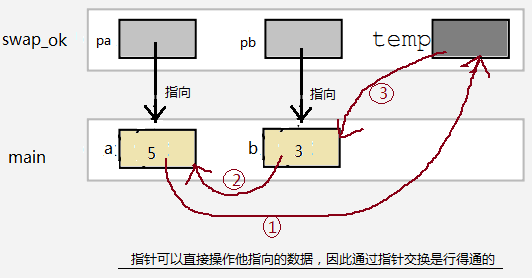


<br/>

<h2 id='参数为指针的结构体'>参数为指针的结构体</h2>


```
typedef struct {
    char name[31];
    int age;
    float score;
}Student;

void show(const Student *student);

void show(const Student *student){
    printf("name:%s , age:%d , score:%.2f\n",student->name,student->age,student->score);
}


int main(int argc, const char * argv[])
{
    Student student = {"Harley", 27, 750};
    
    show(&student);
     printf("student size:%lu", sizeof(student));
    return 0;
}

```
输出：

```
name:Harley , age:27 , score:750.00

student size:40
```

&emsp;   从定义的结构看出，Student变量的大小至少是39个字节，那么通过函数直接传递变量，实参赋值数据给形参需要拷贝至少39个字节的数据，极不高效。而传递变量的指针却快很多，因为在同一个平台下，无论什么类型的指针大小都是固定的：X86指针4字节，X64指针8字节，远远比一个Student结构体变量小。

<br/>

***
<br/>

<h1 id='const和指针'>const和指针</h1>


&emsp;  如果const 后面是一个类型，则跳过最近的原子类型，修饰后面的数据。（原子类型是不可再分割的类型，如int, short , char，以及typedef包装后的类型）

&emsp;  如果const后面就是一个数据，则直接修饰这个数据。

```
typedef int* pint_t;  //将 int* 类型 包装为 pint_t,则pint_t 现在是一个完整的原子类型


int main(int argc, const char * argv[])
{
    int a = 1;
    
    int const *p1 = &a;        //const后面是*p1，实质是数据a，则修饰*p1，通过p1不能修改a的值
    const int*p2 =  &a;        //const后面是int类型，则跳过int ，修饰*p2， 效果同上
    
    int* const p3 = NULL;      //const后面是数据p3。也就是指针p3本身是const .
    
    const int* const p4 = &a;  // 通过p4不能改变a 的值，同时p4本身也是 const
    int const* const p5 = &a;  //效果同上
    
    
    const pint_t p6 = &a;  //同样，const跳过类型pint_t，修饰p1，指针p1本身是const
    pint_t const p7 = &a;  //const 直接修饰p，同上
    
    return 0;
}

```


<br/>

***
<br/>


<h1 id='深拷贝和浅拷贝'>深拷贝和浅拷贝</h1>


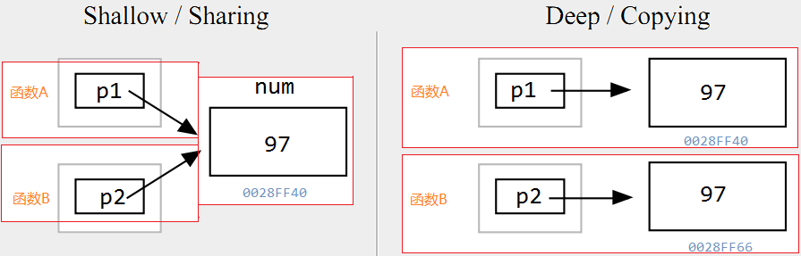


&emsp;  如果2个程序单元（例如2个函数）是通过拷贝 他们所共享的数据的 指针来工作的，这就是浅拷贝，因为真正要访问的数据并没有被拷贝。如果被访问的数据被拷贝了，在每个单元中都有自己的一份，对目标数据的操作相互 不受影响，则叫做深拷贝。


**`浅拷贝Demo`**

```
    int *pp;
    int arr[3] = {1,2,3};
    
    pp = &arr[2];
    arr[2] = 100;
    
    printf("pp= %p, *pp = %d\n", pp, *pp);

```
输出：
<br/>
`pp= 0x7ffeefbff4e4, *pp = 100`


 


 
