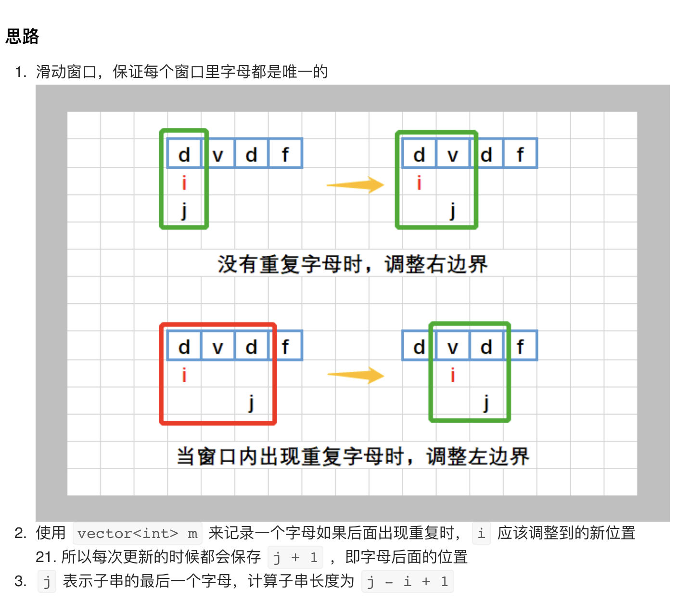
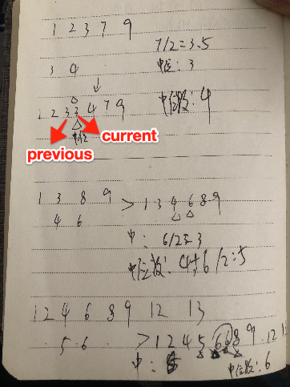

> <h1 id=""></h1>
- **知识点**
	- [std::](#std)
	- [Vector向量](#Vector向量)
	- [(::)范围解析运算符](#范围解析运算符)
	- [include](#include)
	- [size()和strlen()](#size和strlen)
- **算法练习**
	- [宏定义](#宏定义)
		- [普通打印-println](#普通打印-println)
		- [数组打印-printArr](#数组打印-printArr)
	- [**递归**](#递归)
		- [斐波那契数列](#斐波那契数列)
	- [两数之和](#两数之和)
	- [两数相加](#两数相加)
	- [无重复字符的最长子串](#无重复字符的最长子串)
	- [寻找两个正序数组的中位数](#寻找两个正序数组的中位数)
	- [最长回文子串](#最长回文子串)


<br/>

***
<br/>
<br/>


> <h1 id="知识点">知识点</h1>

<br/>

> <h2 id="std">std::</h2>

[**std::**](https://blog.csdn.net/Calvin_zhou/article/details/78440145)是个名称空间标识符，C++标准库中的函数或者对象都是在命名空间std中定义的，所以我们要使用标准库中的函数或者对象都要用std来限定。


<br/>


> <h2 id="Vector向量">Vector向量</h2>

[**Vector向量**](https://www.runoob.com/w3cnote/cpp-vector-container-analysis.html)是一个封装了动态大小数组的顺序容器（Sequence Container）。跟任意其它类型容器一样，它能够存放各种类型的对象。可以简单的认为，向量是一个能够存放任意类型的动态数组。

<br/>


> <h2 id="范围解析运算符">(::)范围解析运算符</h2>

**(::)范围解析运算符**：在前面的类声明范例中，我们都把成员函数定义在类内。事实上，类中成员函数的程序代码不一定要写在类内，我们也可以在类中事先声明成员函数的原型，然后在类外面再编写成员函数的程序代码部分。如果是在类外面编写成员函数，只要在外部定义时函数名称前面加上类名称与范围解析运算符（::）即可。范围解析运算符的主要作用就是指出成员函数所属的类。


<br/>

> <h2 id="include">#include</h2>
**#include**

```

 #include并不是什么申请指令，只是将指定文件的内容，原封不动的拷贝进来
 *.h文件做的是类的声明，包括类成员的定义和函数的声明
 *.cpp文件做的类成员函数的具体实现（定义）
 在*.cpp文件的第一行一般也是#include"*.h"文件，其实也相当于把*.h文件里的东西复制到*.cpp文件的开头
 */
```


<br/>


> <h2 id="size和strlen">size()和strlen()</h2>

- size()：计算string的长度；
- strlen：计算字符的长度；

这2个函数方法需要导入`#include <string.h>`的标准库。

```
//size()计算string的长度，strlen计算字符的长度
size_t length = s.size();

```


- **size_t类型**
	- size_t的真实类型与操作系统有关，在32位架构中被普遍定义为：
		- typedef   unsigned int size_t;
	- 而在64位架构中被定义为：
		- typedef  unsigned long size_t;


<br/>

***
<br/>


> <h1 id="算法练习">算法练习</h1>


<br/>


> <h2 id="宏定义">宏定义</h2>


<br/>

> <h3 id="普通打印-println">普通打印-println</h3>

```
///C语言自动换行定义的宏:https://www.bennyhuo.com/2020/06/14/c-println/
#define println(format, ...) printf("🌷🌹(%s:%s [%d行] %s) "format"\n", __DATE__, __TIME__, __LINE__, __FUNCTION__, ##__VA_ARGS__)
```


<br/>
<br/>

> <h3 id="数组打印-printArr">数组打印-printArr</h3>


```
///C语言数组打印
#define printArr(array,len) \
    printf("🌷🌹 %s [%d行] %s=> ",__TIME__, __LINE__, __FUNCTION__); \
    do  \
    { \
        for(int i = 0;i<len;i++) \
        { \
            printf("%02X ",array[i]); \
        } \
        printf("\r\n"); \
    }while(0)
```


<br/>

***
<br/>
<br/>


> <h1 id="递归">递归</h1>


<br/>


> <h2 id="斐波那契数列">斐波那契数列</h2>

斐波那契数列： 0, 1, 1, 2, 3, 5, 8, 13, 21, 34, 55, 89, 144, 233, 377, 610, 987

斐波那契数列代数式：

```
n = 0，F(n) = 0;
n = 1,    F(N) = 1;
n > 1,    F(n-1) + F(n-2)
```


```
#pragma mark -- 递归
int Fbi(int data){
    if (data < 2) {
        return data == 0 ? 0 : 1;
    }
    
    return Fbi(data -1) + Fbi(data -2);
}


void linkStackTestMethod(void){
    for (int i = 0; i < 17 ; i ++) {
            printf(" %d,",Fbi(i));
        }
}
```
输出：

```
0, 1, 1, 2, 3, 5, 8, 13, 21, 34, 55, 89, 144, 233, 377, 610, 987,
```


来模拟上述代码中当Fbi(int data) 中，data = 5时的操作：


&emsp;  递归中，调用自己和其他函数并没有本质不同，我们`把一个直接调用自己或通过一系列的调用语句间接地调用自己的函数，称作递归函数`。

&emsp;  在写递归时需要注意，`每个递归定义必须至少有一个条件，满足时递归不再进行，既不再引用自身而是返回值退出`。比如上述的例子中，总有一次递归会使得i<2的，这样就可以执行 `return i`的语句而不用继续递归了。

&emsp;  `迭代和递归的区别`：迭代使用的是循环结构，递归使用的是选择结构。递归能使程序的结构更清晰、简洁、更容易让人理解，从而减少读懂代码的时间。但是大量的递归调用会建立函数的副本，会耗费大量的时间和内存。迭代则不需要反复调用函数和占用额外的内存。

&emsp;  递归的本质：递归过程退回的顺序是它前行顺序的逆序。在退回过程中，可能要执行某些动作，包括恢复在前行过程中的存储起来的某些数据。

&emsp;  这种存储某些数据，并在后面又以存储的逆序恢复这些数据，以提供之后使用的需求，显然很符合栈这样的数据结构，因此，编译器使用栈实现递归就没有什么好奇怪的了。

&emsp;  简单的来说，就是在前行阶段，对于每一层递归，函数的局部变量、参数值以及返回地址都被压入栈中。再退回阶段，位于栈顶的局部变量、参数值和返回地址被弹出，用于返回调用层次中执行代码的其余部分，也就恢复了调用的状态。


<br/>
<br/>


> <h2 id="两数之和">两数之和</h2>

```
给定一个整数数组 nums 和一个整数目标值 target，请你在该数组中找出 和为目标值 的那 两个 整数，并返回它们的数组下标。

你可以假设每种输入只会对应一个答案。但是，数组中同一个元素在答案里不能重复出现。

你可以按任意顺序返回答案。


示例 1：

输入：nums = [2,7,11,15], target = 9
输出：[0,1]
解释：因为 nums[0] + nums[1] == 9 ，返回 [0, 1] 。
示例 2：

输入：nums = [3,2,4], target = 6
输出：[1,2]
示例 3：

输入：nums = [3,3], target = 6
输出：[0,1]

```

答案Code：

**C++ 代码**

```

vector<int> twoSum(vector<int>& nums, int target) {
    vector<int> backNums = vector<int>();

    
    for (int i = 0; i < nums.size(); i ++) {
        for (int j = i +1; j < nums.size(); j ++) {
            if (nums[i] + nums[j] == target) {
                backNums.push_back(i);
                backNums.push_back(j);
                return backNums;;
            }
        }
    }
    
    
    
    
    return  backNums;
    
};


int main(int argc, const char * argv[]) {
    
    
    //vector<int> vec1{2,7,11,15};
    vector<int> vec1{0,4,3,0};
    twoSum(vec1, 3);
}

```


<br/>

**C 代码**


```
int* twoSum(int* nums, int numsSize, int target, int* returnSize){
    int *sum= NULL;
    for(int i = 0; i < numsSize-1; i++){
        for(int j= i+1; j < numsSize; j++){
            if(target == nums[i]+nums[j]){
                sum = (int *)malloc(sizeof(int) *2);
                *returnSize = 2;
                sum[0]= i;
                sum[1]=j;
                return sum;
            }
        }
    }
    return sum;
}

//调用
int nums [4] = {2, 7, 11, 15};
int returnSize = 2;
int *returnArr = twoSum(nums, 4, 9, &returnSize);
printArr(returnArr, 2);//宏定义
```

打印:

```
🌷🌹 18:41:00 [49行] +[HGTestAlgorithm testLeetcodeAlgorithmModule:]=> 00 01 
```


<br/>
<br/>


> <h2 id= "两数相加">两数相加</h2>

```
给你两个 非空 的链表，表示两个非负的整数。它们每位数字都是按照 逆序 的方式存储的，并且每个节点只能存储 一位 数字。

请你将两个数相加，并以相同形式返回一个表示和的链表。

你可以假设除了数字 0 之外，这两个数都不会以 0 开头。


示例 1：
输入：l1 = [2,4,3], l2 = [5,6,4]
输出：[7,0,8]
解释：342 + 465 = 807.


示例 2：
输入：l1 = [0], l2 = [0]
输出：[0]


示例 3：
输入：l1 = [9,9,9,9,9,9,9], l2 = [9,9,9,9]
输出：[8,9,9,9,0,0,0,1]
```


<br/>


```
typedef struct ListNode {
    int value;
    ListNode *next;
}ListNode;

ListNode* addTwoNumbers(ListNode* l1, ListNode* l2) {
    ListNode *sumList = (ListNode *)malloc(sizeof(ListNode));
    sumList->next = NULL;
    sumList->value = 0;
    
    ListNode *tempP = sumList;
    
    //2数加之和
    int sum = 0;
    //进位点
    int carry = 0;
    //进位以后的值
    int singleValue = 0;
    while (l1 || l2) {
    
		//错误：int value1 = l1->next == NULL ? 0 : l1->value;会导致最后的无法取到值，一直为0了
        int value1 = l1 == NULL ? 0 : l1->value;
        int value2 = l2 == NULL ? 0 : l2->value;
        
        sum = value1 + value2 + carry;
        carry = sum / 10;
        singleValue = sum % 10;
        
        ListNode *insertNode = (ListNode *)malloc(sizeof(ListNode));
        insertNode->next = NULL;
        insertNode->value = singleValue;
        tempP->next = insertNode;
        
        tempP = insertNode;
        
        if (l1) {
            l1 = l1->next;
        }
        if (l2) {
            l2 = l2->next;
        }
    }
    
    if (carry > 0) {
        ListNode *insertNode = (ListNode *)malloc(sizeof(ListNode));
        insertNode->next = NULL;
        insertNode->value = carry;
        tempP->next = insertNode;
    }
    
    //返回下一个元素，因为第一个值没有设任何值
    return sumList->next;

};


int main(int argc, const char * argv[]) {
    ListNode *insertNode1 = (ListNode *)malloc(sizeof(ListNode));
    insertNode1->next = NULL;
    insertNode1->value = 2;
    
    ListNode *insertNode2 = (ListNode *)malloc(sizeof(ListNode));
    insertNode2->next = NULL;
    insertNode2->value = 4;
    insertNode1->next = insertNode2;
    
    
    ListNode *insertNode3 = (ListNode *)malloc(sizeof(ListNode));
    insertNode3->next = NULL;
    insertNode3->value = 3;
    insertNode2->next = insertNode3;
    
    
    
    
    
    ListNode *node1 = (ListNode *)malloc(sizeof(ListNode));
    node1->next = NULL;
    node1->value = 5;
    
    ListNode *node2 = (ListNode *)malloc(sizeof(ListNode));
    node2->next = NULL;
    node2->value = 6;
    node1->next = node2;
    
    
    ListNode *node3 = (ListNode *)malloc(sizeof(ListNode));
    node3->next = NULL;
    node3->value = 4;
    node2->next = node3;
    
    
    ListNode *sumNode = addTwoNumbers(insertNode1, node1);
    
    while (sumNode != NULL) {
        printf("%d", sumNode->value);
        sumNode = sumNode->next;
    }
    
    
   
}
```

打印：`708`

&emsp; 因为第一个节点链表是:2, 4, 3
	
&emsp; 第二个节点链表是: 5, 6, 4	

所以打印为: 807 才对


<br/>
<br/>


**C语言-递归解决法**

```
struct ListNode {
      int val;
      struct ListNode *next;
};

void get_sum(struct ListNode *pre, struct ListNode* l1, struct ListNode* l2, int carry ){
    if (!l1 && !l2 && !carry) {
        return;
    }//递归边界：三者均为零（或指针为空）时则递归停止
    
    struct ListNode *node = (struct ListNode *)malloc(sizeof(struct ListNode));
    node->next = NULL;//忘了加这个在leetcode会报错,但是真正运行时并不会报错.但是在打印这个链表时会报错
    
    int n1 = l1 ? l1->val : 0;//若l1存在则取其节点值，否则为0；
    int n2 = l2 ? l2->val : 0;//若l2存在则取其节点值，否则为0；
    int sum = carry + n1 + n2;
    carry = sum / 10;//更新进位值；
    node->val = sum % 10;//为当前新节点赋值；
    pre->next = node;//将新节点放置于前驱节点之后；
    
    l1 = l1 ? l1->next : NULL;//更新l1至后继节点；
    l2 = l2 ? l2->next : NULL;//更新l2至后继节点；
    
    get_sum(node, l1, l2, carry);//调用自身进行递归；
}


struct ListNode* addTwoNumbers(struct ListNode* l1, struct ListNode* l2){
    //[2, 4, 3]
    struct ListNode *l1_0 = (struct ListNode *)malloc(sizeof(struct ListNode));
    l1_0->val = 2;
    struct ListNode *l1_1 = (struct ListNode *)malloc(sizeof(struct ListNode));
    l1_1->val = 4;
    struct ListNode *l1_2 = (struct ListNode *)malloc(sizeof(struct ListNode));
    l1_2->val = 3;
    l1_2->next = NULL;
    
    l1_0->next = l1_1;
    l1_1->next = l1_2;
    
    //[5, 6, 4]
    struct ListNode *l2_0 = (struct ListNode *)malloc(sizeof(struct ListNode));
    l2_0->val = 5;
    struct ListNode *l2_1 = (struct ListNode *)malloc(sizeof(struct ListNode));
    l2_1->val = 6;
    struct ListNode *l2_2 = (struct ListNode *)malloc(sizeof(struct ListNode));
    l2_2->val = 4;
    l2_2->next = NULL;//要加,否则运行报错,因为不知道什么时候结束,这个可以作为判断链表结束时的条件
    
    l2_0->next =l2_1;
    l2_1->next = l2_2;
    
    l1 = l1_0;
    l2 = l2_0;

    
    
    int carry = 0;//数值相加后的进位值,比如8+9 = 17,进位1
    struct ListNode *headNode = (struct ListNode *)malloc(sizeof(struct ListNode));
    headNode->val = 0; // 忘了这个 需要初始化赋值
    //必须要初始化,原因: 在访问某个变量时，因为这个变量中含有未赋值的指针。定义但是不赋值的指针叫做野指针。
    //野指针指向不明，对程序有不可知的后果，引用了更是出大问题，所以，c语言严格反对野指针
    headNode->next = NULL; // 忘了这个 需要初始化赋值
    
    get_sum(headNode, l1, l2, carry);
    
    
    struct ListNode *node = headNode->next;
    while (node) {
        println("%d", node->val);
        node = node->next;
    }
    
    return headNode->next;
}

//调用
addTwoNumbers(NULL, NULL);
```

打印:

```
🌷🌹(Mar 20 2023:18:51:45 [77行] addTwoNumbers) 7
🌷🌹(Mar 20 2023:18:51:45 [77行] addTwoNumbers) 0
🌷🌹(Mar 20 2023:18:51:45 [77行] addTwoNumbers) 8
```


<br/>
<br/>


> <h2 id="无重复字符的最长子串">无重复字符的最长子串</h2>

```
给定一个字符串，请你找出其中不含有重复字符的 最长子串 的长度。

 

示例 1:
输入: s = "abcabcbb"
输出: 3 
解释: 因为无重复字符的最长子串是 "abc"，所以其长度为 3。


示例 2:
输入: s = "bbbbb"
输出: 1
解释: 因为无重复字符的最长子串是 "b"，所以其长度为 1。


示例 3:
输入: s = "pwwkew"
输出: 3
解释: 因为无重复字符的最长子串是 "wke"，所以其长度为 3。
     请注意，你的答案必须是 子串 的长度，"pwke" 是一个子序列，不是子串。


示例 4:
输入: s = ""
输出: 0
```


解题思路:



<br/>


**C++解答Code:**

```

int lengthOfLongestSubstring(string methodName, string s) {
    printf("\n=================%s=================\n", methodName.c_str());
    int max = 0;
    int head = 0;
    int tail = 0;
    
    //size()计算string的长度，strlen计算字符的长度
    size_t length = s.size();
    
    while (tail < length) {
        //head指向头，若是没有遇到相同的它会一直指窗口第一个字符
        for (int i = head; i < tail; i++) {
            if (s[i] == s[tail]) {
                max = max > tail - head ? max : tail - head;
                //遇到相同的了，窗口要向后移动一格，退出本次循环。减少循环
                //而且之前还循环过了，没必要再次循环一遍
                head = i + 1;
                break;
            }
        }
        
        tail++;
        //当字符串只有一个字符时，若没有这段代码会出错的，一个它没法计算
        max = max > tail - head ? max : tail - head;

    }
    
    return  max;
}


int main(int argc, const char * argv[]) {
    
    string str = "abcabcbb";
    string str1 = "bbbbb";
    string str2 = "pwwkew";
    string str3 = "lengthOfLongestSubstring";
    string str4 = "c";

    
    int sum = lengthOfLongestSubstring("无重复字符的最长子串", str);
    printf("\n 长度为： %i\n", sum);
}
```

打印：

```
=================无重复字符的最长子串=================

 长度为： 3
```

<br/>

**C语言解答code**

```
int lengthOfLongestSubstring(char * s){
    unsigned long length = strlen(s);
    int head = 0;
    int tail = 0;
    int max = 0;

    while (tail < length){
       for(int i = head; i < tail; i++){
           if(s[i] == s[tail]){
               head = i+1;//窗口左边移动一格,注意不是: head  +=1;这不是按照目前的窗口进行加1,而是整个数组了,所以不行
               break;
           }
       }
       tail +=1;//窗口右边移动一格
       max = max > (tail - head) ? max : (tail - head);
   }
    
    println("长度是: %d", max);
    
    return max;
}


//调用
char *s = "pwwkew";
//char *s = "abcabcbb";
lengthOfLongestSubstring(s);

```


打印:

```
🌷🌹(Mar 25 2023:10:55:27 [29行] lengthOfLongestSubstring) 长度是: 3
```

<br/>
<br/>


> <h2 id="寻找两个正序数组的中位数">寻找两个正序数组的中位数</h2>

```

给定两个大小分别为 m 和 n 的正序（从小到大）数组 nums1 和 nums2。请你找出并返回这两个正序数组的 中位数 。

 

示例 1：
输入：nums1 = [1,3], nums2 = [2]
输出：2.00000
解释：合并数组 = [1,2,3] ，中位数 2

示例 2：
输入：nums1 = [1,2], nums2 = [3,4]
输出：2.50000
解释：合并数组 = [1,2,3,4] ，中位数 (2 + 3) / 2 = 2.5

示例 3：
输入：nums1 = [0,0], nums2 = [0,0]
输出：0.00000

示例 4：
输入：nums1 = [], nums2 = [1]
输出：1.00000

示例 5：
输入：nums1 = [2], nums2 = []
输出：2.00000
```

<br/>


**C++答案Code：**

```
double findMedianSortedArrays(string methodName,vector<int>& nums1, vector<int>& nums2) {
    printf("\n=================%s=================\n", methodName.c_str());
    
    size_t length1 = nums1.size();
    size_t length2 = nums2.size();
    
    if (length1 == 0 && length2 == 0) {
        return  0;
    }else if (length1 == 0 && length2 > 0){
        //加 length2 != 1 这个判断是防止数组中只有一个元素时出错
        if (length2 % 2 != 0 && length2 != 1) {
            int middle = length2 / 2;
            double a = (nums2[middle] + nums2[middle+1])/2.0;
            return a;
        }else {
            int middle = length2 / 2;
            
            return  nums2[middle];
        }
        
    }else if (length1 > 0 && length2 == 0) {
        if (length1 % 2 != 0 && length1 != 1) {
            int middle = length1 / 2;
            double a = (nums1[middle] + nums1[middle+1])/2.0;
            return a;
        }else {
            int middle = length2 / 2;
            
            return  nums1[middle];
        }
    }else {
        int tag1 = 0;
        int tag2 = 0;
        vector<int> sums = vector<int>();
        
        while (tag1 < length1 || tag2 < length2 ) {
            //tag1 < length1 加这个判断是为了防止即使num1数组加完了仍然在sums中添加元素造成死循环。程序崩溃了。
            if (nums1[tag1] < nums2[tag2] && tag1 < length1) {
                sums.push_back(nums1[tag1]);
                if (tag1 < length1) {
                    ++tag1;
                }
                
            }else if (nums1[tag1] > nums2[tag2] && tag2 < length2) {
                sums.push_back(nums2[tag2]);
                if (tag2 < length2) {
                    ++tag2;
                }
            }else {
                
                if (tag2 < length2) {
                    //之所以要加一个判断，防止即使数组越界仍然可以添加元素，那结果就不对了
                    sums.push_back(nums2[tag2]);
                    ++tag2;
                }
                if (tag1 < length1) {
                    sums.push_back(nums1[tag1]);
                    ++tag1;
                }
            }
        }
        
        int sumLength = sums.size();
        if(sumLength % 2 == 0) {
            int middle = length2 / 2;
            
            return  nums1[middle];
            
        }else {
            int middle = sumLength / 2;
            double a = (sums[middle] + sums[middle+1])/2.0;
            
            return a;
        }
    }
    
    
    
    return  0.0;
}


int main(int argc, const char * argv[]) {
    
    vector<int> nums1 = {1,3}, nums2 = {2};
    //    vector<int> nums1 = {0,0}, nums2 = {0,0};
    //    vector<int> nums1 = {}, nums2 = {};
    //    vector<int> nums1 = {1}, nums2 = {};
    //    vector<int> nums1 = {2}, nums2 = {};
    
    
    
    double c = findMedianSortedArrays("寻找两个正序数组的中位数", nums1, nums2);
    printf("中位数为： %f", c);
}

```

打印：

```
=================寻找两个正序数组的中位数=================
中位数为： 2.500000

```


<br/>
<br/>

解题思路:




**C语言Code**

```
double findMedianSortedArrays(int* nums1, int nums1Size, int* nums2, int nums2Size){
    int j = 0,k = 0;//要同时赋值为0,错误: int j, k=0;导致不知道j的值 ,j nums1数组下标值, num2数组下标值
    double previous = 0.0,current = 0.0; //previous 指向前一个值, current 指向后一个值
    int mid = (nums1Size + nums2Size) /2;
    
    for(int i = 0; i <= mid; i++){
        if(j < nums1Size && k < nums2Size){
            if(nums1[j]< nums2[k]){
                previous = current;
                current = nums1[j];
                j++;
                continue;
            }else {
                previous = current;
                current = nums2[k];
                k++;
                continue;
            }
        }
        
        if(k < nums2Size){
            previous = current;
            current = nums2[k];
            k++;
            continue;
        }
        
        if(j < nums1Size){
            previous = current;
            current = nums1[j];
            j++;
            continue;
        }
    }
    
    
    double medValue = 0.0;
    if(((nums1Size + nums2Size)%2) == 0){
        medValue = (previous+current)/2;
    }else{
        medValue = current;
    }
    println("中位数:%f", medValue);
    
    return medValue;
}


//调用
int num1[]={1, 2};
int num2[]={3, 4};
findMedianSortedArrays(num1, 2, num2, 2);
```

打印值:

```
🌷🌹(Mar 26 2023:10:30:44 [54行] findMedianSortedArrays) 中位数:2.500000
```


<br/>
<br/>


> <h2 id="最长回文子串">最长回文子串</h2>
[动态规划](https://blog.csdn.net/u013309870/article/details/75193592)

给你一个字符串 s，找到 s 中最长的回文子串。


```
示例 1：

输入：s = "babad"
输出："bab"
解释："aba" 同样是符合题意的答案。


示例 2：

输入：s = "cbbd"
输出："bb"


示例 3：

输入：s = "a"
输出："a"
示例 4：

输入：s = "ac"
输出："a"


```


<br/>
<br/>


> <h2 id=""></h2>


<br/>
<br/>


> <h2 id=""></h2>


<br/>
<br/>


> <h2 id=""></h2>


<br/>
<br/>


> <h2 id=""></h2>


