> <h1 id=""></h1>
- **知识点**
	- [std::](#std)
	- [Vector向量](#Vector向量)
	- [(::)范围解析运算符](#范围解析运算符)
	- [include](#include)
	- [size()和strlen()](#size和strlen)
- **算法练习**
	- [宏定义](#宏定义)
		- [普通打印-println](#普通打印-println)
		- [数组打印-printArr](#数组打印-printArr)
	- [**递归回溯**](#递归回溯)
		- [斐波那契数列](#斐波那契数列)
		- [电话号码的字母组合](#电话号码的字母组合)
		- [括号生成](#括号生成)
	- [**链表**](#链表)
		- [推导二叉树的遍历(富途)](#推导二叉树的遍历)
		- [2个队列实现一个栈(七猫)](#2个队列实现一个栈)
		- [删除链表的倒数第 N 个结点](#删除链表的倒数第N个结点)
		- [合并K个升序链表(有段不太明白)](#合并K个升序链表)
		- [合并两个有序链表](#合并两个有序链表)
	- [**栈与队列**](#栈与队列)
		- [有效的括号](#有效的括号)
		- [最长有效括号](#最长有效括号)
		- [每日温度](#每日温度)
	- [两数之和](#两数之和)
	- [两数相加](#两数相加)
	- [无重复字符的最长子串](#无重复字符的最长子串)
	- [寻找两个正序数组的中位数](#寻找两个正序数组的中位数)
	- [最长回文子串](#最长回文子串)
	- [正则表达式匹配](#正则表达式匹配)
	- [盛最多水的容器](#盛最多水的容器)
	- [三数之和](#三数之和)
	- [下一个排列](#下一个排列)
- **参考资料**
	- [**leetcode 热题100**](https://leetcode-cn.com/problem-list/2cktkvj/)
	- [C语言(菜鸟教程)](https://www.runoob.com/cprogramming/c-tutorial.html)
	- [10大基础实用算法及其讲解](https://mp.weixin.qq.com/s?__biz=MzI0MjE3OTYwMg==&mid=401441966&idx=1&sn=653fe22c5a7e6c221fbf121124fd18a2&scene=21#wechat_redirect)
	- [算法-春水煎茶](https://writings.sh/posts)
	- [**代码随想录**](https://www.programmercarl.com/)
		- [代码随想录(B站视频)](https://space.bilibili.com/525438321/)


<br/>

***
<br/>
<br/>


> <h1 id="知识点">知识点</h1>

<br/>

> <h2 id="std">std::</h2>

[**std::**](https://blog.csdn.net/Calvin_zhou/article/details/78440145)是个名称空间标识符，C++标准库中的函数或者对象都是在命名空间std中定义的，所以我们要使用标准库中的函数或者对象都要用std来限定。


<br/>


> <h2 id="Vector向量">Vector向量</h2>

[**Vector向量**](https://www.runoob.com/w3cnote/cpp-vector-container-analysis.html)是一个封装了动态大小数组的顺序容器（Sequence Container）。跟任意其它类型容器一样，它能够存放各种类型的对象。可以简单的认为，向量是一个能够存放任意类型的动态数组。

<br/>


> <h2 id="范围解析运算符">(::)范围解析运算符</h2>

**(::)范围解析运算符**：在前面的类声明范例中，我们都把成员函数定义在类内。事实上，类中成员函数的程序代码不一定要写在类内，我们也可以在类中事先声明成员函数的原型，然后在类外面再编写成员函数的程序代码部分。如果是在类外面编写成员函数，只要在外部定义时函数名称前面加上类名称与范围解析运算符（::）即可。范围解析运算符的主要作用就是指出成员函数所属的类。


<br/>

> <h2 id="include">#include</h2>
**#include**

```

 #include并不是什么申请指令，只是将指定文件的内容，原封不动的拷贝进来
 *.h文件做的是类的声明，包括类成员的定义和函数的声明
 *.cpp文件做的类成员函数的具体实现（定义）
 在*.cpp文件的第一行一般也是#include"*.h"文件，其实也相当于把*.h文件里的东西复制到*.cpp文件的开头
 */
```


<br/>


> <h2 id="size和strlen">size()和strlen()</h2>

- size()：计算string的长度；
- strlen：计算字符的长度；

这2个函数方法需要导入`#include <string.h>`的标准库。

```
//size()计算string的长度，strlen计算字符的长度
size_t length = s.size();

```


- **size_t类型**
	- size_t的真实类型与操作系统有关，在32位架构中被普遍定义为：
		- typedef   unsigned int size_t;
	- 而在64位架构中被定义为：
		- typedef  unsigned long size_t;


<br/>

***
<br/>


> <h1 id="算法练习">算法练习</h1>


<br/>


> <h2 id="宏定义">宏定义</h2>


<br/>

> <h3 id="普通打印-println">普通打印-println</h3>

```
///C语言自动换行定义的宏:https://www.bennyhuo.com/2020/06/14/c-println/
#define println(format, ...) printf("🌷🌹(%s:%s [%d行] %s) "format"\n", __DATE__, __TIME__, __LINE__, __FUNCTION__, ##__VA_ARGS__)
```


<br/>
<br/>

> <h3 id="数组打印-printArr">数组打印-printArr</h3>


```
///C语言数组打印
#define printArr(array,len) \
    printf("🌷🌹 %s [%d行] %s=> ",__TIME__, __LINE__, __FUNCTION__); \
    do  \
    { \
        for(int i = 0;i<len;i++) \
        { \
            printf("%02X ",array[i]); \
        } \
        printf("\r\n"); \
    }while(0)
```


<br/>

***
<br/>
<br/>


> <h1 id="递归回溯">递归回溯</h1>

<br/>


> <h2 id="斐波那契数列">斐波那契数列</h2>

斐波那契数列： 0, 1, 1, 2, 3, 5, 8, 13, 21, 34, 55, 89, 144, 233, 377, 610, 987

斐波那契数列代数式：

```
n = 0，F(n) = 0;
n = 1,    F(N) = 1;
n > 1,    F(n-1) + F(n-2)
```


```
#pragma mark -- 递归
int Fbi(int data){
    if (data < 2) {
        return data == 0 ? 0 : 1;
    }
    
    return Fbi(data -1) + Fbi(data -2);
}


void linkStackTestMethod(void){
    for (int i = 0; i < 17 ; i ++) {
            printf(" %d,",Fbi(i));
        }
}
```
输出：

```
0, 1, 1, 2, 3, 5, 8, 13, 21, 34, 55, 89, 144, 233, 377, 610, 987,
```


来模拟上述代码中当Fbi(int data) 中，data = 5时的操作：


&emsp;  递归中，调用自己和其他函数并没有本质不同，我们`把一个直接调用自己或通过一系列的调用语句间接地调用自己的函数，称作递归函数`。

&emsp;  在写递归时需要注意，`每个递归定义必须至少有一个条件，满足时递归不再进行，既不再引用自身而是返回值退出`。比如上述的例子中，总有一次递归会使得i<2的，这样就可以执行 `return i`的语句而不用继续递归了。

&emsp;  `迭代和递归的区别`：迭代使用的是循环结构，递归使用的是选择结构。递归能使程序的结构更清晰、简洁、更容易让人理解，从而减少读懂代码的时间。但是大量的递归调用会建立函数的副本，会耗费大量的时间和内存。迭代则不需要反复调用函数和占用额外的内存。

&emsp;  递归的本质：递归过程退回的顺序是它前行顺序的逆序。在退回过程中，可能要执行某些动作，包括恢复在前行过程中的存储起来的某些数据。

&emsp;  这种存储某些数据，并在后面又以存储的逆序恢复这些数据，以提供之后使用的需求，显然很符合栈这样的数据结构，因此，编译器使用栈实现递归就没有什么好奇怪的了。

&emsp;  简单的来说，就是在前行阶段，对于每一层递归，函数的局部变量、参数值以及返回地址都被压入栈中。再退回阶段，位于栈顶的局部变量、参数值和返回地址被弹出，用于返回调用层次中执行代码的其余部分，也就恢复了调用的状态。


> <h2 id="电话号码的字母组合">电话号码的字母组合</h2>


给定一个仅包含数字 2-9 的字符串，返回所有它能表示的字母组合。答案可以按 任意顺序 返回。

给出数字到字母的映射如下（与电话按键相同）。注意 1 不对应任何字母。


 

示例 1：

```
输入：digits = "23"
输出：["ad","ae","af","bd","be","bf","cd","ce","cf"]
```

示例 2：

```
输入：digits = ""
输出：[]
```

示例 3：

```
输入：digits = "2"
输出：["a","b","c"]
```


**[回溯法](https://programmercarl.com/回溯算法理论基础.html#回溯法的效率)解决n个for循环问题**

思路:

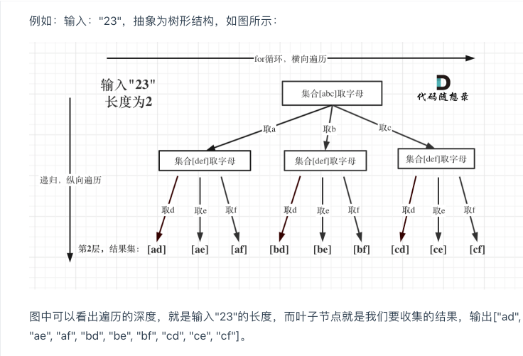


<br/>

**回溯三部曲：**

- 确定回溯函数参数

首先需要一个字符串pathArray来收集叶子节点的结果，然后用一个字符串数组resultLetters保存起来，这两个变量我依然定义为全局。

再来看参数，参数指定是有题目中给的char* digits，然后还要有一个参数就是int型的index。

这个index是记录遍历第几个数字了，就是用来遍历digits的（题目中给出数字字符串），同时index也表示树的深度。

代码如下：

```
///数组要加*号,否则报错:excess elements in char array initializer [solution.c]
///原因:是多个字符串，不是单个字符，这得用，指针数组
///每个号码盘代表的数字
char *numberChar[10]= {
    "",     //0
    "",     //1
    "abc",  //2
    "def",  //3
    "ghi",  //4
    "jkl",  //5
    "mno",  //6
    "pqrs", //7
    "tuv",  //8
    "wxyz", //9
};
///字母组合结果
char **resultLetters;
///每次遍历到枝节点时盛放元素的数组
char *pathArray;
///存放结果数组元素序列号, 不能在这里直接赋值,否则在leetcode不通过
int resultTop;
///路径深度
int pathTop;

void backTracking(char* digits, int index) 
```


- 确定终止条件

例如输入用例"23"，两个数字，那么根节点往下递归两层就可以了，叶子节点就是要收集的结果集。

那么终止条件就是如果index 等于 输入的数字个数（strlen(digits)了（本来index就是用来遍历digits的）。

然后收集结果，结束本层递归。

代码如下：

```
//若当前下标等于digits数组长度
if (strlen(digits) == index) {
    //在这里不需要把pathArray置为NULL,因为在下面的循环遍历中会把它覆盖掉的

    int digitLength = (int)strlen(digits);
    //复制digits数组，因为最后要多存储一个0，所以数组长度要+1
    char *tempStr = (char *)malloc(sizeof(char)*(digitLength+1));
    for (int j = 0; j < digitLength ; j++) {
        tempStr[j]= pathArray[j];
    }
    
    //tempStr最后一个要设置为空,也就是0
    tempStr[digitLength]= 0;
    resultLetters[resultTop++]= tempStr;
    
    return;
}
```


- 确定单层遍历逻辑

首先要取index指向的数字，并找到对应的字符集（手机键盘的字符集）。

然后for循环来处理这个字符集，代码如下：

```
///键盘第几个数字
//将字符数字转换为真的数字,要减去字符'0',不是数字0否则会出错
int currentIndex = digits[index] - '0';
///获取对应键盘数字的字符串元素
char *numbers = numberChar[currentIndex];
///键盘字符串长度
int numberLength = (int)strlen(numbers);

for (int i = 0; i < numberLength; i++) {
    pathArray[pathTop++]= numbers[i];
    //递归，处理下一层数字
    backTracking(digits, index+1);
    pathTop--;
}
```


所以总的代码是:


```
///数组要加*号,否则报错:excess elements in char array initializer [solution.c]
///原因:是多个字符串，不是单个字符，这得用，指针数组
///每个号码盘代表的数字
char *numberChar[10]= {
    "",     //0
    "",     //1
    "abc",  //2
    "def",  //3
    "ghi",  //4
    "jkl",  //5
    "mno",  //6
    "pqrs", //7
    "tuv",  //8
    "wxyz", //9
};
///字母组合结果
char **resultLetters;
///每次遍历到枝节点时盛放元素的数组
char *pathArray;
///存放结果数组元素序列号, 不能在这里直接赋值,否则在leetcode不通过
int resultTop;
///路径深度
int pathTop;

void backTracking(char* digits, int index) {
    
    //若当前下标等于digits数组长度
    if (strlen(digits) == index) {
        //在这里不需要把pathArray置为NULL,因为在下面的循环遍历中会把它覆盖掉的

        int digitLength = (int)strlen(digits);
        //复制digits数组，因为最后要多存储一个0，所以数组长度要+1
        char *tempStr = (char *)malloc(sizeof(char)*(digitLength+1));
        for (int j = 0; j < digitLength ; j++) {
            tempStr[j]= pathArray[j];
        }
        
        //tempStr最后一个要设置为空,也就是0
        tempStr[digitLength]= 0;
        resultLetters[resultTop++]= tempStr;
        
        return;
    }
    
    ///键盘第几个数字
    //将字符数字转换为真的数字,要减去字符'0',不是数字0否则会出错
    int currentIndex = digits[index] - '0';
    ///获取对应键盘数字的字符串元素
    char *numbers = numberChar[currentIndex];
    ///键盘字符串长度
    int numberLength = (int)strlen(numbers);
    
    for (int i = 0; i < numberLength; i++) {
        pathArray[pathTop++]= numbers[i];
        //递归，处理下一层数字
        backTracking(digits, index+1);
        pathTop--;
    }
}

char ** letterCombinations(char * digits, int* returnSize){
    
    int length = (int)strlen(digits);
    resultLetters = (char **)malloc(sizeof(char*) * 300);
    pathArray = (char *)malloc(sizeof(char) * length);
    *returnSize = 0;

    ///若digits数组中元素个数为0，返回空集
    if (length == 0) {
        return resultLetters;
    }
    pathTop = resultTop = 0;
    backTracking(digits, 0);
    *returnSize = resultTop;
    
    return resultLetters;
}


///调用
///递归回溯
+ (void)testLetterCombinations{
    char digits[] = {"23"};
    int size = 1;
    
    char **a = letterCombinations(digits, &size);
    
    for (int i = 0; i < size; i++) {
        printf("🌷🌹行:");
        char *b = a[i];
        for (int j = 0; j < 3; j++) {
            printf("%c", b[j]);
        }
        printf("\n");

    }
}

```


**Log:**

```
🌷🌹行:ad
🌷🌹行:ae
🌷🌹行:af
🌷🌹行:bd
🌷🌹行:be
🌷🌹行:bf
🌷🌹行:cd
🌷🌹行:ce
🌷🌹行:cf
```


<br/><br/>


> <h2 id='括号生成'>括号生成</h2>


数字 n 代表生成括号的对数，请你设计一个函数，用于能够生成所有可能的并且 有效的 括号组合。

 


示例 1：

```
输入：n = 3
输出：["((()))","(()())","(())()","()(())","()()()"]
```

示例 2：

```
输入：n = 1
输出：["()"]
```


```
void generateBracket(int open, int close, int n, char **result, int *bracketsize, char *str, int index){
    if (open == n && close == n) { //左右括号都用完
        result[(*bracketsize)]= (char *)calloc((2*n+1), sizeof(char));
        strcpy(result[(*bracketsize)++] , str);
        return;
    }
    
    if (open < n) { //当左括号没用完时
        str[index] = '(';
        generateBracket(open+1, close, n, result, bracketsize, str, index+1);
    }
    
    if (close < open && close < n) { //右括号数量必须小于左括号，否则一定不合法，且右括号没有用完
        str[index] = ')';
        generateBracket(open, close+1, n, result, bracketsize, str, index+1);
    }
}

char ** generateParenthesis(int n, int* returnSize){
    char **kuoHaoArr = (char **)malloc(sizeof(char *) * 1430);///1430卡特兰数
    *returnSize = 0;
    char *str=(char *)calloc((2*n +1),sizeof(char));
    
    generateBracket(0, 0, n, kuoHaoArr, returnSize, str, 0);
    
    return kuoHaoArr;
}


///调用
+ (void)testGenerateParenthesis{
    
    
    int size = 1;
    char **a= generateParenthesis(2, &size);
    for (int i = 0; i < size; i++) {
        printf("🌷🌹行:");
        char *b = a[i];
        for (int j = 0; j < (2*size); j++) {
            printf("%c", b[j]);
        }
        printf("\n");

    }
    
}
```


**log:**

```
🌷🌹行:(())
🌷🌹行:()()
```


<br/>

***
<br/><br/>

> <h1 id='链表'>链表</h1>


<br/><br/>

>## <h2 id='推导二叉树的遍历'>[推导二叉树的遍历](http://b23.tv/cBRRZJI)</h2>

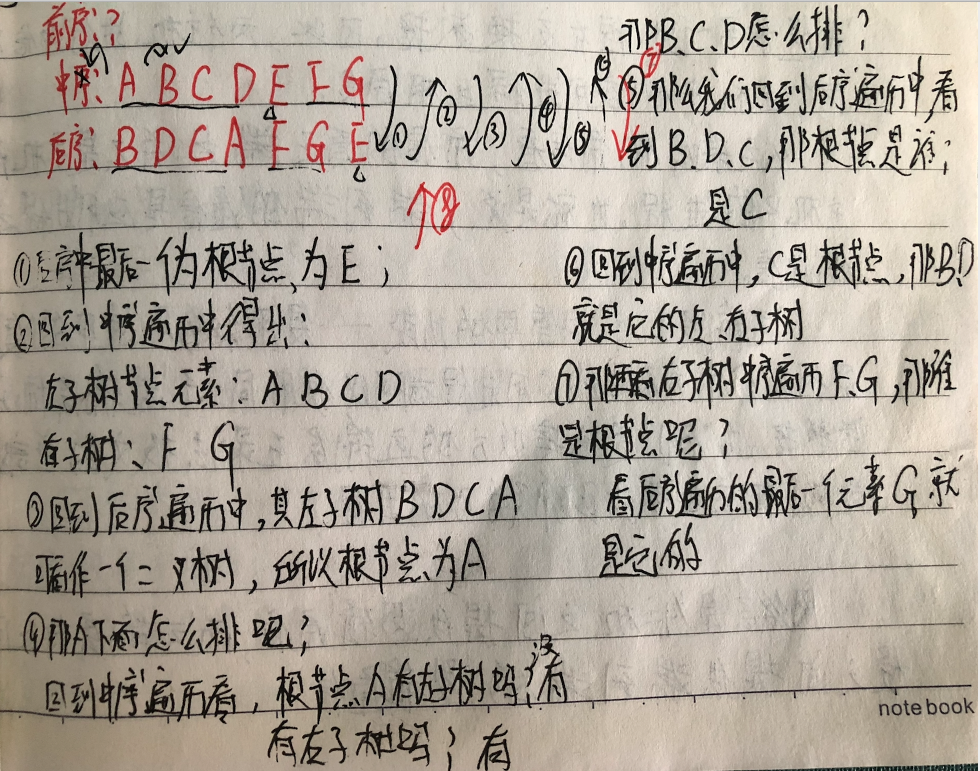

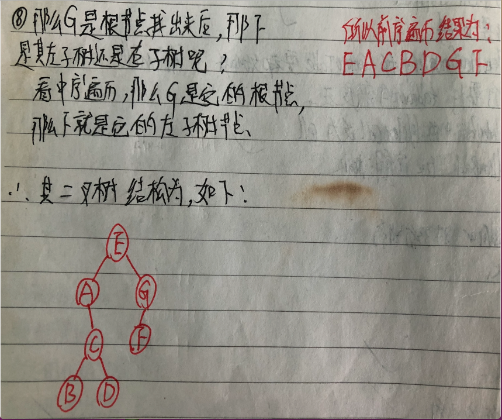


<br/>

- **出题1:**
	- 	前序遍历:ABDHKECFIGJ
	- 	中序遍历:HKDBEAIFCGJ
	
	求给出后续遍历的序列?
	
	
	这个可以看下《大话数据结构》中的Page183,有详解!
	
	答案:KHDEBIFJGCA
	
	
	<br/>


- **出题2:**
	- 	前序遍历:ABCDEF
	- 	中序遍历:CBAEDF

	
	求给出后续遍历的序列?
	
	
这个可以看下《大话数据结构》中的Page184,有详解!

		
答案:CBEFDA


<br/><br/>

> <h2 id='2个队列实现一个栈'>2个队列实现一个栈</h2>

**思路:**


q1是专职进出栈的，q2只是个中转站

**入栈**：直接入队列q1即可

**出栈**：把q1的除最后一个元素外全部转移到队q2中,然后把刚才剩下q1中的那个元素出队列。之后把q2中的全部元素转移回q1中

图示

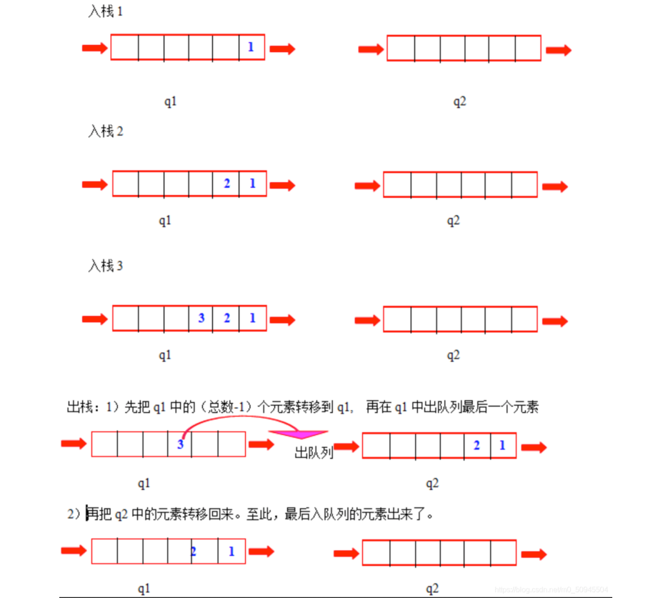


**code:**

**Stackby_two_queue.h**

```
#pragma once

typedef char DataType2;

typedef struct Queue
{
	DataType2* queue_data;
	int head;
	int tail;
	int size;
	int capacity;
}Queue;

typedef struct Stack
{
	Queue queue1;
	Queue queue2;
	//栈中有效元素个数
	int size;
}Stack;

//栈的初始化
void StackInit(Stack *stack,int vector_capacity);
//栈的销毁
void StackDestory(Stack* stack);
//入栈
void StackPush(Stack* stack, DataType2 value);
//出栈
void StackPop(Stack* stack);
//取栈顶元素
DataType2 StackGetTop(Stack* stack);
```


<br/>

**Stackby_two_queue.c**

```
#include <stdio.h>
#include <stdlib.h>
#include <assert.h>
#include "Stackby_two_queue.h"

void QueueInit(Queue* queue, int vector_capacity)
{
	if (queue == NULL)
	{
		assert(0);
		return -1;
	}
	queue->capacity = vector_capacity;
	queue->queue_data = (DataType2*)malloc(sizeof(DataType2)*queue->capacity);
	queue->size = 0;
	queue->head = 0;
	queue->tail = 0;
}

void QueueDestory(Queue* queue)
{
	if (queue == NULL)
	{
		assert(0);
		return -1;
	}
	free(queue->queue_data);
	queue->queue_data = NULL;
	queue->size = 0;
	queue->head = 0;
	queue->tail = 0;
	queue->capacity = 0;
}

void QueuePush(Queue* queue,DataType2 value)
{
	if (queue == NULL)
	{
		assert(0);
		return -1;
	}
	if (queue->size >= queue->capacity)
	{
		return ;
	}
	queue->queue_data[queue->tail++] = value;
	queue->size++;
	if (queue->tail > queue->capacity)
	{
		queue->tail = 0;
	}
}

void QueuePop(Queue* queue)
{
	if (queue == NULL)
	{
		assert(0);
		return -1;
	}
	if (queue->size == 0)
	{
		return ; 
	}
	if (queue->head >= queue->capacity)
	{
		queue->head = 0;
	}
	queue->head++;
	queue->size--;
	if (queue->size == 0)
	{
		queue->head = 0;
		queue->tail = 0;
	}
}
//取队首元素
DataType2 QueueGetTop(Queue* queue)
{
	if (queue == NULL)
	{
		assert(0);
		return -1;
	}
	if (queue->size == 0)
	{
		return ;
	}
	return queue->queue_data[queue->head];
}

//打印整个队列
void PrintQueue(Queue* queue)
{
	if (queue == NULL)
	{
		assert(0);
		return -1;
	}
	if (queue->size == 0)
	{
		return ; 
	}
	if (queue->head < queue->tail)
	{
		int i = queue->head;
		for (; i < queue->tail; i++)
		{
			printf("%c ", queue->queue_data[i]);
		}
	}
	else
	{
		int i = queue->head;
		while (queue->head < queue->capacity)
		{
			printf("%c", queue->queue_data[queue->head]);
			queue->head++;
		}
		queue->head = 0;
		for (i = queue->head; i < queue->tail; ++i)
		{
			printf("%c ", queue->queue_data[i]);
		}
	}
	printf("\n");
}

//通过两个队列实现一个栈的入栈，出栈和取栈顶元素操作
//栈的初始化函数
void StackInit(Stack* stack,int vector_capacity)
{
	if (stack == NULL)
	{
		assert(0);
		return -1;
	}
	QueueInit(&stack->queue1,vector_capacity);
	QueueInit(&stack->queue2,vector_capacity);
	stack->size = 0;
}

//销毁一个栈
void StackDestory(Stack* stack)
{
	if (stack == NULL)
	{
		assert(0);
		return -1;
	}
	QueueDestory(&stack->queue1);
	QueueDestory(&stack->queue2);
	stack->size = 0;
}

//入栈操作
void StackPush(Stack* stack,DataType2 value)
{
	if (stack == NULL)
	{
		assert(0);
		return -1;
	}
	if (stack->queue1.size != 0) {
		QueuePush(&stack->queue1, value);
	}
	else {
		QueuePush(&stack->queue2, value);
	}
	stack->size++;
}

void StackPop(Stack* stack)
{
	if (stack == NULL)
	{
		assert(0);
		return -1;
	}
	if (stack->queue1.size == 0 && stack->queue2.size == 0)
	{
		return ;
	}
	Queue* from = NULL;
	Queue* to = NULL;
	//判断数据放在了哪个队列
	if (stack->queue1.size != 0)
	{
		from = &stack->queue1;
		to = &stack->queue2;
	}
	else
	{
		from = &stack->queue2;
		to = &stack->queue1;
	}
	while (from->size > 1)
	{
		//取到from队列的队头元素
		DataType2 tmp = QueueGetTop(from);
		//from做一次出队列操作
		QueuePop(from);
		//将from的对头放到to队列
		QueuePush(to, tmp);
	}
	//把from队列剩的最后一个元素移出队列，模拟出栈
	QueuePop(from);
	//栈中的有效数据个数减一
	stack->size--;
}

DataType2 StackGetTop(Stack* stack)
{
	if (stack == NULL)
	{
		assert(0);
		return -1;
	}
	if ((stack->queue1.size == 0) && (stack->queue2.size == 0))
	{
		return ;
	}
	Queue* from = NULL;
	Queue* to = NULL;
	//判断数据放在了哪个队列
	if (stack->queue1.size != 0)
	{
		from = &stack->queue1;
		to = &stack->queue2;
	}
	else
	{
		from = &stack->queue2;
		to = &stack->queue1;
	}
	while (from->size > 1)
	{
		//取到from队列的队头元素
		DataType2 tmp = QueueGetTop(from);
		//from做一次出队列操作
		QueuePop(from);
		//将from的对头放到to队列
		QueuePush(to, tmp);
	}
	//读取from队列的最后一个元素，模拟读取栈顶
	DataType2 stacktop = QueueGetTop(from);
	QueuePop(from);
	QueuePush(to, stacktop);
	return stacktop;
}

void PrintStack(Stack* stack)
{
	if (stack == NULL)
	{
		assert(0);
		return -1;
	}
	if (stack->size == 0)
	{
		return ;
	}
	Queue* print = NULL;
	if (stack->queue1.size == 0)
	{
		print = &stack->queue2;
	}
	else
	{
		print = &stack->queue1;
	}
	PrintQueue(print);
}

int main()
{
	Stack stack;
	//初始化
	StackInit(&stack,10);
	//入栈函数测试
	StackPush(&stack, 'a');
	StackPush(&stack, 'b');
	StackPush(&stack, 'c');
	StackPush(&stack, 'd');
	StackPop(&stack);
	PrintStack(&stack);
	DataType2 top_value = StackGetTop(&stack);
	printf("%c \n", top_value);
	StackDestory(&stack);
	system("pause");
	return 0;
}
```

<br/>
<br/>

> <h2 id='删除链表的倒数第N个结点'> 删除链表的倒数第 N 个结点</h2>

给你一个链表，删除链表的倒数第 n 个结点，并且返回链表的头结点。


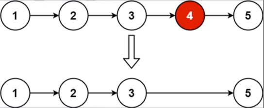


示例 1：

```
输入：head = [1,2,3,4,5], n = 2
输出：[1,2,3,5]
```

示例 2：

```
输入：head = [1], n = 1
输出：[]
```

示例 3：

```
输入：head = [1,2], n = 1
输出：[1]
```


大神解题思路:

双指针的经典应用，如果要删除倒数第n个节点，让fast移动n步，然后让fast和slow同时移动，直到fast指向链表末尾。删掉slow所指向的节点就可以了。

思路是这样的，但要注意一些细节。

分为如下几步：

首先这里我推荐大家使用虚拟头结点，这样方便处理删除实际头结点的逻辑，如果虚拟头结点不清楚，可以看这篇： 链表：听说用虚拟头节点会方便很多？ (opens new window)

定义fast指针和slow指针，初始值为虚拟头结点，如图：


fast首先走n + 1步 ，为什么是n+1呢，因为只有这样同时移动的时候slow才能指向删除节点的上一个节点（方便做删除操作），如图： 


fast和slow同时移动，直到fast指向末尾，如题：

 

删除slow指向的下一个节点，如图： 


```
struct ListNode* removeNthFromEnd(struct ListNode* head, int n) {
    //定义虚拟头节点dummy 并初始化使其指向head
    struct ListNode* dummy = malloc(sizeof(struct ListNode));
    dummy->val = 0;
    dummy->next = head;
    //定义 fast slow 双指针
    struct ListNode* fast = head;
    struct ListNode* slow = dummy;

    for (int i = 0; i < n; ++i) {
        fast = fast->next;
    }
    while (fast) {
        fast = fast->next;
        slow = slow->next;
    }
    slow->next = slow->next->next;//删除倒数第n个节点
    head = dummy->next;
    free(dummy);//删除虚拟节点dummy
    return head;
}


///调用
+ (void)testRemoveNthFromEnd{
    
    int list[]={1, 2, 3, 4, 5};
    int listLength = sizeof(list)/sizeof(int);
    struct ListNode *head = (struct ListNode*)malloc(sizeof(struct ListNode));
    head->val = list[0];
    head->next = NULL;
    
    struct ListNode* node = head;
    node->next = NULL;
    
    ///采用尾插法
    for (int i = 1; i < listLength; i ++) {
        struct ListNode* addNode = (struct ListNode*)malloc(sizeof(struct ListNode));
        addNode->val = list[i];
        addNode->next = NULL;//这里要置为NULL,否则后面无法判断链表是否结束
        
        node->next = addNode;
        node = addNode;
    }
    
    struct ListNode *nowHead = removeNthFromEnd(head, 2);
    
    while(nowHead){
        println("链表节点: %d", nowHead->val);
        nowHead = nowHead->next;
    }
}
```


Log:

```
🌷🌹(May  4 2023:22:10:49 [132行] +[HGTestAlgorithm testRemoveNthFromEnd]) 链表节点: 1
🌷🌹(May  4 2023:22:10:49 [132行] +[HGTestAlgorithm testRemoveNthFromEnd]) 链表节点: 2
🌷🌹(May  4 2023:22:10:49 [132行] +[HGTestAlgorithm testRemoveNthFromEnd]) 链表节点: 3
🌷🌹(May  4 2023:22:10:49 [132行] +[HGTestAlgorithm testRemoveNthFromEnd]) 链表节点: 5
```


我的思路:
	使用一个N记录总共的节点数,然后当它等于正数第(N-n)个时进行返回,采用递归.我是这样想的.然后用一个节点记录上一个节点,这样就可以了!


<br/><br/>


> <h2 id='合并K个升序链表'>合并 K 个升序链表</h2>


给你一个链表数组，每个链表都已经按升序排列。

请你将所有链表合并到一个升序链表中，返回合并后的链表。


示例 1：

```
输入：lists = [[1,4,5],[1,3,4],[2,6]]
输出：[1,1,2,3,4,4,5,6]
解释：链表数组如下：
[
  1->4->5,
  1->3->4,
  2->6
]
将它们合并到一个有序链表中得到。
1->1->2->3->4->4->5->6
```

示例 2：

```
输入：lists = []
输出：[]
```

示例 3：

```
输入：lists = [[]]
输出：[]
```


<br/>


**思路:**

如果对快速排序或者归并排序有了解的同学代码也许一眼就能看明白，有点参考他们的思想

程序主题思想还是递归，归并或者快速排序的思想复杂度为nlgn级别，

因为是递归，如果嵌套十分深入的话，还是需要一点堆栈的空间的

mergeTwoLists 这个函数可以不看，是之前做题已经实现的程序，。直接拿来用就可以了

核心代码不过 _mergeKLists(...) 函数里面的十行有余

如果有bug,请指正


```
struct ListNode *_twoListMerge(struct ListNode *l1, struct ListNode *l2){
    
    struct ListNode head;
    head.next = l1;
    l1 = &head;
    struct ListNode *q,*p;
    
    if (!l1) {
        return l2;
    }
    
    if (!l2) {
        return l1;
    }
    
    while (l2) {
        q = l1->next;
        p = l2 ->next;
        
        
        if (!l1->next) {
            l1->next = l2;
            break;
        }
        
        /*这段代码错误的,为什么不能替换下面的
        if (q->val <= l2->val) {
            l2->next = q->next;
            q->next = l2;
    
            l2 = p;
        }
    
        l1 = q;
         */
        
        if (q->val >= l2->val) {
            l1->next = l2;
            l2->next = q;
            l2 = p;
        }
        
        l1 = l1->next;
    }
    
    return head.next;
}

struct ListNode *_mergeKLists(struct ListNode** lists, int listsSize){
    
    if (listsSize == 0) {
        return NULL;
    }else if(listsSize == 1){
        return lists[0];//*lists[listsSize] 报错为什么
    }else if(listsSize == 2){
        return _twoListMerge(lists[0], lists[1]);
    }
    
    struct ListNode *l1 = _mergeKLists(&lists[0], (listsSize+1)/2);
    struct ListNode *l2 = _mergeKLists(&lists[(listsSize+1)/2], listsSize-(listsSize+1)/2);
    
    return _twoListMerge(l1, l2);
}

struct ListNode* mergeKLists(struct ListNode** lists, int listsSize){
    return _mergeKLists(lists, listsSize);
}
```


<br/><br/>

> <h2 id='合并两个有序链表'>合并两个有序链表</h2>

将两个升序链表合并为一个新的 升序 链表并返回。新链表是通过拼接给定的两个链表的所有节点组成的。  

示例 1：


```
输入：l1 = [1,2,4], l2 = [1,3,4]
输出：[1,1,2,3,4,4]
```

示例 2：

```
输入：l1 = [], l2 = []
输出：[]
```

示例 3：

```
输入：l1 = [], l2 = [0]
输出：[0]
```


```
struct ListNode* mergeTwoLists(struct ListNode* list1, struct ListNode* list2){
    struct ListNode *tmp = (struct ListNode*)malloc(sizeof(struct ListNode));
    tmp->next = NULL;
    tmp->val = 0;
    struct ListNode *head = tmp;

    while(list1 && list2){
        if(list1->val < list2->val){
            tmp->next = list1;
            list1 = list1->next;
            tmp = tmp->next;
        }else{
            tmp->next = list2;
            list2 = list2->next;
            tmp=tmp->next;
        }
    }
    tmp->next = list1 ? list1 : list2;

    return head->next;
}


///调用
+ (void)testMergeTwoLists {
    
    int list[]={1, 2, 4};
    int list1[]={1, 3, 4};
    int listLength = sizeof(list)/sizeof(int);
    int list1Length =sizeof(list1)/sizeof(int);;
    
    struct ListNode *head = (struct ListNode*)malloc(sizeof(struct ListNode));
    head->val = list[0];
    head->next = NULL;
    
    struct ListNode* node = head;
    node->next = NULL;
    
    for (int i = 1; i < listLength; i ++) {
        struct ListNode* addNode = (struct ListNode*)malloc(sizeof(struct ListNode));
        addNode->val = list[i];
        addNode->next = NULL;
        
        node->next = addNode;
        node = addNode;
    }
    
    
    struct ListNode *head1 = (struct ListNode*)malloc(sizeof(struct ListNode));
    head1->val = list1[0];
    head1->next = NULL;
    
    struct ListNode* node1 = head1;
    node1->next = NULL;
    
    for (int i = 1; i < list1Length; i ++) {
        struct ListNode* addNode = (struct ListNode*)malloc(sizeof(struct ListNode));
        addNode->val = list1[i];
        addNode->next = NULL;
        
        node1->next = addNode;
        node1 = addNode;
    }
    
    
    
   struct ListNode* resultNode = mergeTwoLists(head, head1);
    while (resultNode) {
        println("%d", resultNode->val);
        resultNode=resultNode->next;
    }
}
```

Log:

```
🌷🌹(May  8 2023:21:02:27 [154行] +[HGTestAlgorithm testMergeTwoLists]) 1
🌷🌹(May  8 2023:21:02:27 [154行] +[HGTestAlgorithm testMergeTwoLists]) 1
🌷🌹(May  8 2023:21:02:27 [154行] +[HGTestAlgorithm testMergeTwoLists]) 2
🌷🌹(May  8 2023:21:02:27 [154行] +[HGTestAlgorithm testMergeTwoLists]) 3
🌷🌹(May  8 2023:21:02:27 [154行] +[HGTestAlgorithm testMergeTwoLists]) 4
🌷🌹(May  8 2023:21:02:27 [154行] +[HGTestAlgorithm testMergeTwoLists]) 4
```


<br/>

***
<br/><br/>


> <h1 id='栈与队列'>栈与队列</h1>

<br/><br/>

>## <h2 id='有效的括号'>[有效的括号](https://www.bilibili.com/video/BV1AF411w78g/)</h2>


给定一个只包括 '('，')'，'{'，'}'，'['，']' 的字符串 s ，判断字符串是否有效。

有效字符串需满足：

- 左括号必须用相同类型的右括号闭合。
- 左括号必须以正确的顺序闭合。
- 每个右括号都有一个对应的相同类型的左括号。
 

示例 1：

```
输入：s = "()"
输出：true
```


示例 2：

```
输入：s = "()[]{}"
输出：true
```

示例 3：

```
输入：s = "(]"
输出：false
```


开始看到这个题目，我都懵了，不知道从哪下手！所以下面分析下，大神的思路：

由于栈结构的特殊性，非常适合做对称匹配类的题目。

首先要弄清楚，字符串里的括号不匹配有几种情况。

一些同学，在面试中看到这种题目上来就开始写代码，然后就越写越乱。

建议在写代码之前要分析好有哪几种不匹配的情况，如果不在动手之前分析好，写出的代码也会有很多问题。

先来分析一下 这里有三种不匹配的情况，

第一种情况，字符串里左方向的括号多余了 ，所以不匹配。 


第二种情况，括号没有多余，但是 括号的类型没有匹配上。 


第三种情况，字符串里右方向的括号多余了，所以不匹配。


我们的代码只要覆盖了这三种不匹配的情况，就不会出问题，可以看出 动手之前分析好题目的重要性。

动画如下：


第一种情况：已经遍历完了字符串，但是栈不为空，说明有相应的左括号没有右括号来匹配，所以return false

第二种情况：遍历字符串匹配的过程中，发现栈里没有要匹配的字符。所以return false

第三种情况：遍历字符串匹配的过程中，栈已经为空了，没有匹配的字符了，说明右括号没有找到对应的左括号return false

那么什么时候说明左括号和右括号全都匹配了呢，就是字符串遍历完之后，栈是空的，就说明全都匹配了。


<br/>


**Code**

```
//辅助函数：判断栈顶元素与输入的括号是否为一对。若不是，则返回False
int isMatchKuoHao(int top, char kuoHao, char *stack) {
   
    int isMatch = 0;

    switch(kuoHao){
        case ')':
            isMatch = stack[top-1] != '(';//说明栈顶元素和比较的符号是匹配的
            return isMatch;
            break;
        case ']':
            isMatch = stack[top-1] != '[';
            return isMatch;
            break;
        case '}':
            isMatch = stack[top-1] != '{';
            return isMatch;
        break;

    }

    return isMatch;
}

int isValid(char * s){

    int length = (int)strlen(s);//"([{}]()"
    char charStack[5000];//设置为5000，设置为500会导致leetcode出错，因为leetCode的元素远比这大
    int topP = 0;

    //遍历字符串
    for(int i=0; i< length; i++){
        //取出当前下标所对应字符
        char kuoHao = s[i];

        //若当前字符为左括号，则入栈
        if(kuoHao == '(' || kuoHao == '[' ||
           kuoHao == '{') {
               charStack[topP++]= kuoHao;//注意：topP++和++topP的区别，第一次中括号内的topP++是0，而第一次中括号内的++topP是1
        }else if(topP == 0 || isMatchKuoHao(topP, kuoHao, charStack)){//若当前字符为右括号，且栈中无元素或右括号与栈顶元素不符，返回False
            return 0;
        }else{//当前字符与栈顶元素为一对括号，将栈顶元素出栈
            charStack[topP-1]= '\0';//删除的元素置为空
            topP--;
        }
    }
    
    //若栈中有元素，返回False。若没有元素（stackTop为0），返回True
    return !topP;
}


+ (void)testIsValid {
//    char *charStr = "([{}]()";//字符串可以这样设置
//    char charStr[] = "([{}]()";
    char charStr[] = {'(', '[', '{', ']', '(', ')'};
    
    bool isMatch = isValid(charStr);
    println("括号字符串%s", isMatch ? "匹配" : "不匹配");
}
```

**Log:**

```
🌷🌹(May  5 2023:23:46:08 [115行] +[HGTestAlgorithm testIsValid]) 括号字符串不匹配
```


<br/><br/>


> <h2 id='最长有效括号'>最长有效括号</h2>


给你一个只包含 '(' 和 ')' 的字符串，找出最长有效（格式正确且连续）括号子串的长度。

 

示例 1：

```
输入：s = "(()"
输出：2
解释：最长有效括号子串是 "()"
```


示例 2：

```
输入：s = ")()())"
输出：4
解释：最长有效括号子串是 "()()"
```

示例 3：

```
输入：s = ""
输出：0
```

<br/>

**解题思路:**

从左到右扫描字符串，栈顶保存当前扫描的时候，合法序列前的一个位置位置下标是多少，啥意思嘞？

我们扫描到左括号，就将当前位置入栈。

扫描到右括号，就将栈顶出栈（代表栈顶的左括号匹配到了右括号），然后分两种情况。

栈不空，那么就用当前的位置减去栈顶的存的位置，然后就得到当前合法序列的长度，然后更新一下最长长度。

栈是空的，说明之前没有与之匹配的左括号，那么就将当前的位置入栈。

看下图示，更好的理解一下。

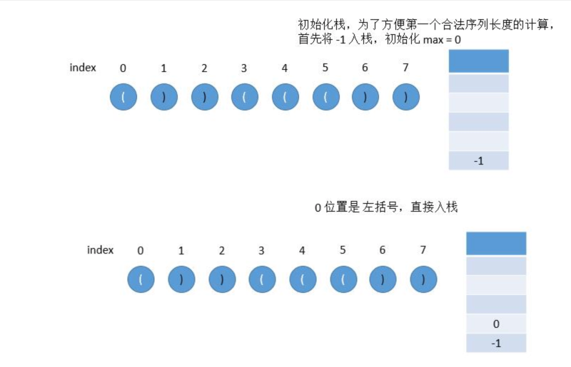
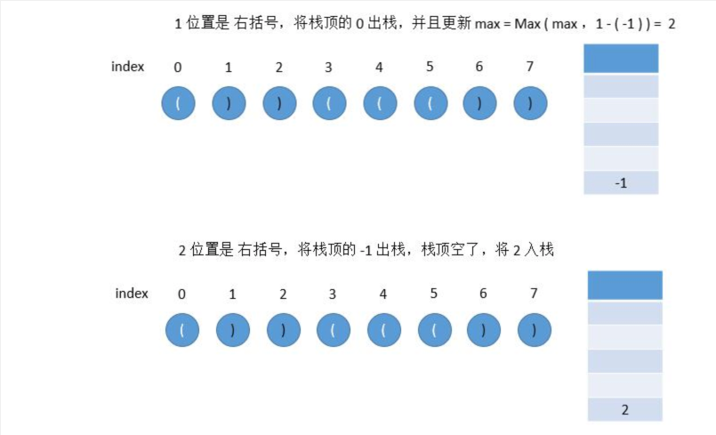
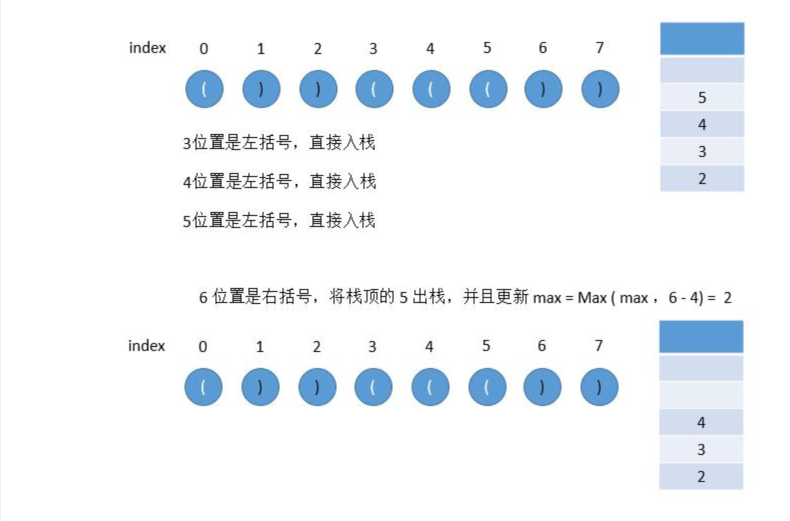
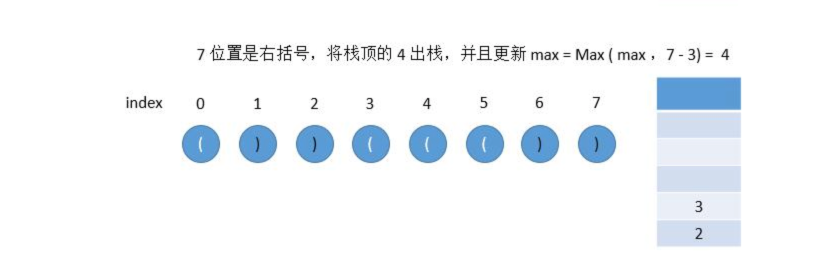


**Code**

```
int longestValidParentheses(char * s){
    //数组长度最大值
    int max = 0;
    //数组长度
    int size = (int)strlen(s);
    //存放括号索引的栈数组,若是直接为size会出错,因为s=""时,size为0,会报错
    int stackArray[size+1];
    //表示栈顶
    int top = -1;
    stackArray[++top] = -1;

    for(int i = 0; i< size; i++) {
        if(s[i] == '('){//入栈
            stackArray[++top] = i;//存入左括号的索引
        }else{//出栈
            --top;
            if (top == -1) {//重新定义标准
                stackArray[++top] = i;
            }else{//stackArray[top]取出栈顶的索引,i-i - stackArray[top]: 就是括号的长度
                max = max > (i - stackArray[top]) ? max : (i - stackArray[top]);
            }
        }
    }

    return max;
}


///调用
+ (void)testLongestValidParentheses{
//    char *str = "(()";
    char *str = ")()())";
//    char *str = ")))()";
//    char *str = "";

    int max = longestValidParentheses(str);
    
    println("最长有效括号值:%d", max);
}
```

**Log:**

```
🌷🌹(May 19 2023:22:38:55 [137行] +[HGTestAlgorithm testLongestValidParentheses]) 最长有效括号值:4
```


<br/><br/>

> <h2 id='每日温度'>每日温度</h2>

&emsp; 给定一个整数数组 temperatures ，表示每天的温度，返回一个数组 answer ，其中 answer[i] 是指对于第 i 天，下一个更高温度出现在几天后。如果气温在这之后都不会升高，请在该位置用 0 来代替。

 

示例 1:

```
输入: temperatures = [73,74,75,71,69,72,76,73]
输出: [1,1,4,2,1,1,0,0]
```

示例 2:

```
输入: temperatures = [30,40,50,60]
输出: [1,1,1,0]
```

示例 3:

```
输入: temperatures = [30,60,90]
输出: [1,1,0]
```


<br/>
<br/>


一开始看题目的时候,压根不知道怎么回事! 若是在面试中遇到,还是直接投降吧!若是想了解,这也是一道不错的栈经典题目如下解析:


题目解析：

这道题目最 “难” 的一个点是题目的理解。

给定列表 temperatures = [73, 74, 75, 71, 69, 72, 76, 73]，为啥输出就是 [1, 1, 4, 2, 1, 1, 0, 0] ？

下面来一个个进行解释。

对于输入 73，它需要 经过一天 才能等到温度的升高，也就是在第二天的时候，温度升高到 74 ，所以对应的结果是 1。

对于输入 74，它需要 经过一天 才能等到温度的升高，也就是在第三天的时候，温度升高到 75 ，所以对应的结果是 1。

对于输入 75，它经过 1 天后发现温度是 71，没有超过它，继续等，一直 等了四天，在第七天才等到温度的升高，温度升高到 76 ，所以对应的结果是 4 。

对于输入 71，它经过 1 天后发现温度是 69，没有超过它，继续等，一直 等了两天，在第六天才等到温度的升高，温度升高到 72 ，所以对应的结果是 2 。

对于输入 69，它 经过一天 后发现温度是 72，已经超过它，所以对应的结果是 1 。

对于输入 72，它 经过一天 后发现温度是 76，已经超过它，所以对应的结果是 1 。

对于输入 76，后续 没有温度 可以超过它，所以对应的结果是 0 。

对于输入 73，后续 没有温度 可以超过它，所以对应的结果是 0 。


<br/>


**思路:**

[leetCode官方讲解](https://leetcode.cn/problems/daily-temperatures/solution/mei-ri-wen-du-by-leetcode-solution/)


<br/>

**Code**

```
///每日温度
int* dailyTemperatures(int* temperatures, int temperaturesSize, int* returnSize){
    
    int *stacks = (int *)malloc(sizeof(int)*temperaturesSize);
    //在leetcode用malloc会导致案例出错,
    //malloc和calloc区别是:malloc 和 calloc 之间的不同点是，malloc 不会设置内存为零，而 calloc 会设置分配的内存为零。
    //int *ans = (int *)malloc(sizeof(int)* temperaturesSize);
     int* ans = (int*)calloc(temperaturesSize, sizeof(int));
    int top = 0;
    *returnSize = temperaturesSize;

    
    for (int i = 0; i < temperaturesSize; i++) {
        
        while (top != 0 && temperatures[i] > temperatures[stacks[top-1]]) {//让栈顶元素和当前元素对比
            ans[stacks[top-1]] = i - stacks[top-1];
            stacks[top-1] = 0;
            --top;
        }
        stacks[top++] = i;//存储序号
    }
    free(stacks);

    return ans;
}


///调用
+ (void)testDailyTemperatures{
    int temArray[] = {73,74,75,71,69,72,76,73};
    int size = sizeof(temArray)/sizeof(int);
    int returnSize = 0;
    
    int *array = dailyTemperatures(temArray, size, &returnSize);
    
    printArr(array, returnSize);
}
```


<br/>

Log:

```
🌷🌹 19:43:58 [149行] +[HGTestAlgorithm testDailyTemperatures]=> 01 01 04 02 01 01 00 00 
```


<br/>
<br/>


> <h2 id="两数之和">两数之和</h2>

```
给定一个整数数组 nums 和一个整数目标值 target，请你在该数组中找出 和为目标值 的那 两个 整数，并返回它们的数组下标。

你可以假设每种输入只会对应一个答案。但是，数组中同一个元素在答案里不能重复出现。

你可以按任意顺序返回答案。


示例 1：

输入：nums = [2,7,11,15], target = 9
输出：[0,1]
解释：因为 nums[0] + nums[1] == 9 ，返回 [0, 1] 。
示例 2：

输入：nums = [3,2,4], target = 6
输出：[1,2]
示例 3：

输入：nums = [3,3], target = 6
输出：[0,1]

```

答案Code：

**C++ 代码**

```

vector<int> twoSum(vector<int>& nums, int target) {
    vector<int> backNums = vector<int>();

    
    for (int i = 0; i < nums.size(); i ++) {
        for (int j = i +1; j < nums.size(); j ++) {
            if (nums[i] + nums[j] == target) {
                backNums.push_back(i);
                backNums.push_back(j);
                return backNums;;
            }
        }
    }
    
    
    
    
    return  backNums;
    
};


int main(int argc, const char * argv[]) {
    
    
    //vector<int> vec1{2,7,11,15};
    vector<int> vec1{0,4,3,0};
    twoSum(vec1, 3);
}

```


<br/>

**C 代码**


```
int* twoSum(int* nums, int numsSize, int target, int* returnSize){
    int *sum= NULL;
    for(int i = 0; i < numsSize-1; i++){
        for(int j= i+1; j < numsSize; j++){
            if(target == nums[i]+nums[j]){
                sum = (int *)malloc(sizeof(int) *2);
                *returnSize = 2;
                sum[0]= i;
                sum[1]=j;
                return sum;
            }
        }
    }
    return sum;
}

//调用
int nums [4] = {2, 7, 11, 15};
int returnSize = 2;
int *returnArr = twoSum(nums, 4, 9, &returnSize);
printArr(returnArr, 2);//宏定义
```

打印:

```
🌷🌹 18:41:00 [49行] +[HGTestAlgorithm testLeetcodeAlgorithmModule:]=> 00 01 
```


<br/>
<br/>


> <h2 id= "两数相加">两数相加</h2>

```
给你两个 非空 的链表，表示两个非负的整数。它们每位数字都是按照 逆序 的方式存储的，并且每个节点只能存储 一位 数字。

请你将两个数相加，并以相同形式返回一个表示和的链表。

你可以假设除了数字 0 之外，这两个数都不会以 0 开头。


示例 1：
输入：l1 = [2,4,3], l2 = [5,6,4]
输出：[7,0,8]
解释：342 + 465 = 807.


示例 2：
输入：l1 = [0], l2 = [0]
输出：[0]


示例 3：
输入：l1 = [9,9,9,9,9,9,9], l2 = [9,9,9,9]
输出：[8,9,9,9,0,0,0,1]
```


<br/>


```
typedef struct ListNode {
    int value;
    ListNode *next;
}ListNode;

ListNode* addTwoNumbers(ListNode* l1, ListNode* l2) {
    ListNode *sumList = (ListNode *)malloc(sizeof(ListNode));
    sumList->next = NULL;
    sumList->value = 0;
    
    ListNode *tempP = sumList;
    
    //2数加之和
    int sum = 0;
    //进位点
    int carry = 0;
    //进位以后的值
    int singleValue = 0;
    while (l1 || l2) {
    
		//错误：int value1 = l1->next == NULL ? 0 : l1->value;会导致最后的无法取到值，一直为0了
        int value1 = l1 == NULL ? 0 : l1->value;
        int value2 = l2 == NULL ? 0 : l2->value;
        
        sum = value1 + value2 + carry;
        carry = sum / 10;
        singleValue = sum % 10;
        
        ListNode *insertNode = (ListNode *)malloc(sizeof(ListNode));
        insertNode->next = NULL;
        insertNode->value = singleValue;
        tempP->next = insertNode;
        
        tempP = insertNode;
        
        if (l1) {
            l1 = l1->next;
        }
        if (l2) {
            l2 = l2->next;
        }
    }
    
    if (carry > 0) {
        ListNode *insertNode = (ListNode *)malloc(sizeof(ListNode));
        insertNode->next = NULL;
        insertNode->value = carry;
        tempP->next = insertNode;
    }
    
    //返回下一个元素，因为第一个值没有设任何值
    return sumList->next;

};


int main(int argc, const char * argv[]) {
    ListNode *insertNode1 = (ListNode *)malloc(sizeof(ListNode));
    insertNode1->next = NULL;
    insertNode1->value = 2;
    
    ListNode *insertNode2 = (ListNode *)malloc(sizeof(ListNode));
    insertNode2->next = NULL;
    insertNode2->value = 4;
    insertNode1->next = insertNode2;
    
    
    ListNode *insertNode3 = (ListNode *)malloc(sizeof(ListNode));
    insertNode3->next = NULL;
    insertNode3->value = 3;
    insertNode2->next = insertNode3;
    
    
    
    
    
    ListNode *node1 = (ListNode *)malloc(sizeof(ListNode));
    node1->next = NULL;
    node1->value = 5;
    
    ListNode *node2 = (ListNode *)malloc(sizeof(ListNode));
    node2->next = NULL;
    node2->value = 6;
    node1->next = node2;
    
    
    ListNode *node3 = (ListNode *)malloc(sizeof(ListNode));
    node3->next = NULL;
    node3->value = 4;
    node2->next = node3;
    
    
    ListNode *sumNode = addTwoNumbers(insertNode1, node1);
    
    while (sumNode != NULL) {
        printf("%d", sumNode->value);
        sumNode = sumNode->next;
    }
    
    
   
}
```

打印：`708`

&emsp; 因为第一个节点链表是:2, 4, 3
	
&emsp; 第二个节点链表是: 5, 6, 4	

所以打印为: 807 才对


<br/>
<br/>


**C语言-递归解决法**

```
struct ListNode {
      int val;
      struct ListNode *next;
};

void get_sum(struct ListNode *pre, struct ListNode* l1, struct ListNode* l2, int carry ){
    if (!l1 && !l2 && !carry) {
        return;
    }//递归边界：三者均为零（或指针为空）时则递归停止
    
    struct ListNode *node = (struct ListNode *)malloc(sizeof(struct ListNode));
    node->next = NULL;//忘了加这个在leetcode会报错,但是真正运行时并不会报错.但是在打印这个链表时会报错
    
    int n1 = l1 ? l1->val : 0;//若l1存在则取其节点值，否则为0；
    int n2 = l2 ? l2->val : 0;//若l2存在则取其节点值，否则为0；
    int sum = carry + n1 + n2;
    carry = sum / 10;//更新进位值；
    node->val = sum % 10;//为当前新节点赋值；
    pre->next = node;//将新节点放置于前驱节点之后；
    
    l1 = l1 ? l1->next : NULL;//更新l1至后继节点；
    l2 = l2 ? l2->next : NULL;//更新l2至后继节点；
    
    get_sum(node, l1, l2, carry);//调用自身进行递归；
}


struct ListNode* addTwoNumbers(struct ListNode* l1, struct ListNode* l2){
    //[2, 4, 3]
    struct ListNode *l1_0 = (struct ListNode *)malloc(sizeof(struct ListNode));
    l1_0->val = 2;
    struct ListNode *l1_1 = (struct ListNode *)malloc(sizeof(struct ListNode));
    l1_1->val = 4;
    struct ListNode *l1_2 = (struct ListNode *)malloc(sizeof(struct ListNode));
    l1_2->val = 3;
    l1_2->next = NULL;
    
    l1_0->next = l1_1;
    l1_1->next = l1_2;
    
    //[5, 6, 4]
    struct ListNode *l2_0 = (struct ListNode *)malloc(sizeof(struct ListNode));
    l2_0->val = 5;
    struct ListNode *l2_1 = (struct ListNode *)malloc(sizeof(struct ListNode));
    l2_1->val = 6;
    struct ListNode *l2_2 = (struct ListNode *)malloc(sizeof(struct ListNode));
    l2_2->val = 4;
    l2_2->next = NULL;//要加,否则运行报错,因为不知道什么时候结束,这个可以作为判断链表结束时的条件
    
    l2_0->next =l2_1;
    l2_1->next = l2_2;
    
    l1 = l1_0;
    l2 = l2_0;

    
    
    int carry = 0;//数值相加后的进位值,比如8+9 = 17,进位1
    struct ListNode *headNode = (struct ListNode *)malloc(sizeof(struct ListNode));
    headNode->val = 0; // 忘了这个 需要初始化赋值
    //必须要初始化,原因: 在访问某个变量时，因为这个变量中含有未赋值的指针。定义但是不赋值的指针叫做野指针。
    //野指针指向不明，对程序有不可知的后果，引用了更是出大问题，所以，c语言严格反对野指针
    headNode->next = NULL; // 忘了这个 需要初始化赋值
    
    get_sum(headNode, l1, l2, carry);
    
    
    struct ListNode *node = headNode->next;
    while (node) {
        println("%d", node->val);
        node = node->next;
    }
    
    return headNode->next;
}

//调用
addTwoNumbers(NULL, NULL);
```

打印:

```
🌷🌹(Mar 20 2023:18:51:45 [77行] addTwoNumbers) 7
🌷🌹(Mar 20 2023:18:51:45 [77行] addTwoNumbers) 0
🌷🌹(Mar 20 2023:18:51:45 [77行] addTwoNumbers) 8
```


<br/>
<br/>


> <h2 id="无重复字符的最长子串">无重复字符的最长子串</h2>

```
给定一个字符串，请你找出其中不含有重复字符的 最长子串 的长度。

 

示例 1:
输入: s = "abcabcbb"
输出: 3 
解释: 因为无重复字符的最长子串是 "abc"，所以其长度为 3。


示例 2:
输入: s = "bbbbb"
输出: 1
解释: 因为无重复字符的最长子串是 "b"，所以其长度为 1。


示例 3:
输入: s = "pwwkew"
输出: 3
解释: 因为无重复字符的最长子串是 "wke"，所以其长度为 3。
     请注意，你的答案必须是 子串 的长度，"pwke" 是一个子序列，不是子串。


示例 4:
输入: s = ""
输出: 0
```


解题思路:


<br/>


**C++解答Code:**

```

int lengthOfLongestSubstring(string methodName, string s) {
    printf("\n=================%s=================\n", methodName.c_str());
    int max = 0;
    int head = 0;
    int tail = 0;
    
    //size()计算string的长度，strlen计算字符的长度
    size_t length = s.size();
    
    while (tail < length) {
        //head指向头，若是没有遇到相同的它会一直指窗口第一个字符
        for (int i = head; i < tail; i++) {
            if (s[i] == s[tail]) {
                max = max > tail - head ? max : tail - head;
                //遇到相同的了，窗口要向后移动一格，退出本次循环。减少循环
                //而且之前还循环过了，没必要再次循环一遍
                head = i + 1;
                break;
            }
        }
        
        tail++;
        //当字符串只有一个字符时，若没有这段代码会出错的，一个它没法计算
        max = max > tail - head ? max : tail - head;

    }
    
    return  max;
}


int main(int argc, const char * argv[]) {
    
    string str = "abcabcbb";
    string str1 = "bbbbb";
    string str2 = "pwwkew";
    string str3 = "lengthOfLongestSubstring";
    string str4 = "c";

    
    int sum = lengthOfLongestSubstring("无重复字符的最长子串", str);
    printf("\n 长度为： %i\n", sum);
}
```

打印：

```
=================无重复字符的最长子串=================

 长度为： 3
```

<br/>

**C语言解答code**

```
int lengthOfLongestSubstring(char * s){
    unsigned long length = strlen(s);
    int head = 0;
    int tail = 0;
    int max = 0;

    while (tail < length){
       for(int i = head; i < tail; i++){
           if(s[i] == s[tail]){
               head = i+1;//窗口左边移动一格,注意不是: head  +=1;这不是按照目前的窗口进行加1,而是整个数组了,所以不行
               break;
           }
       }
       tail +=1;//窗口右边移动一格
       max = max > (tail - head) ? max : (tail - head);
   }
    
    println("长度是: %d", max);
    
    return max;
}


//调用
char *s = "pwwkew";
//char *s = "abcabcbb";
lengthOfLongestSubstring(s);

```


打印:

```
🌷🌹(Mar 25 2023:10:55:27 [29行] lengthOfLongestSubstring) 长度是: 3
```

<br/>
<br/>


> <h2 id="寻找两个正序数组的中位数">寻找两个正序数组的中位数</h2>

```

给定两个大小分别为 m 和 n 的正序（从小到大）数组 nums1 和 nums2。请你找出并返回这两个正序数组的 中位数 。

 

示例 1：
输入：nums1 = [1,3], nums2 = [2]
输出：2.00000
解释：合并数组 = [1,2,3] ，中位数 2

示例 2：
输入：nums1 = [1,2], nums2 = [3,4]
输出：2.50000
解释：合并数组 = [1,2,3,4] ，中位数 (2 + 3) / 2 = 2.5

示例 3：
输入：nums1 = [0,0], nums2 = [0,0]
输出：0.00000

示例 4：
输入：nums1 = [], nums2 = [1]
输出：1.00000

示例 5：
输入：nums1 = [2], nums2 = []
输出：2.00000
```

<br/>


**C++答案Code：**

```
double findMedianSortedArrays(string methodName,vector<int>& nums1, vector<int>& nums2) {
    printf("\n=================%s=================\n", methodName.c_str());
    
    size_t length1 = nums1.size();
    size_t length2 = nums2.size();
    
    if (length1 == 0 && length2 == 0) {
        return  0;
    }else if (length1 == 0 && length2 > 0){
        //加 length2 != 1 这个判断是防止数组中只有一个元素时出错
        if (length2 % 2 != 0 && length2 != 1) {
            int middle = length2 / 2;
            double a = (nums2[middle] + nums2[middle+1])/2.0;
            return a;
        }else {
            int middle = length2 / 2;
            
            return  nums2[middle];
        }
        
    }else if (length1 > 0 && length2 == 0) {
        if (length1 % 2 != 0 && length1 != 1) {
            int middle = length1 / 2;
            double a = (nums1[middle] + nums1[middle+1])/2.0;
            return a;
        }else {
            int middle = length2 / 2;
            
            return  nums1[middle];
        }
    }else {
        int tag1 = 0;
        int tag2 = 0;
        vector<int> sums = vector<int>();
        
        while (tag1 < length1 || tag2 < length2 ) {
            //tag1 < length1 加这个判断是为了防止即使num1数组加完了仍然在sums中添加元素造成死循环。程序崩溃了。
            if (nums1[tag1] < nums2[tag2] && tag1 < length1) {
                sums.push_back(nums1[tag1]);
                if (tag1 < length1) {
                    ++tag1;
                }
                
            }else if (nums1[tag1] > nums2[tag2] && tag2 < length2) {
                sums.push_back(nums2[tag2]);
                if (tag2 < length2) {
                    ++tag2;
                }
            }else {
                
                if (tag2 < length2) {
                    //之所以要加一个判断，防止即使数组越界仍然可以添加元素，那结果就不对了
                    sums.push_back(nums2[tag2]);
                    ++tag2;
                }
                if (tag1 < length1) {
                    sums.push_back(nums1[tag1]);
                    ++tag1;
                }
            }
        }
        
        int sumLength = sums.size();
        if(sumLength % 2 == 0) {
            int middle = length2 / 2;
            
            return  nums1[middle];
            
        }else {
            int middle = sumLength / 2;
            double a = (sums[middle] + sums[middle+1])/2.0;
            
            return a;
        }
    }
    
    
    
    return  0.0;
}


int main(int argc, const char * argv[]) {
    
    vector<int> nums1 = {1,3}, nums2 = {2};
    //    vector<int> nums1 = {0,0}, nums2 = {0,0};
    //    vector<int> nums1 = {}, nums2 = {};
    //    vector<int> nums1 = {1}, nums2 = {};
    //    vector<int> nums1 = {2}, nums2 = {};
    
    
    
    double c = findMedianSortedArrays("寻找两个正序数组的中位数", nums1, nums2);
    printf("中位数为： %f", c);
}

```

打印：

```
=================寻找两个正序数组的中位数=================
中位数为： 2.500000

```


<br/>
<br/>

解题思路:


**C语言Code**

```
double findMedianSortedArrays(int* nums1, int nums1Size, int* nums2, int nums2Size){
    int j = 0,k = 0;//要同时赋值为0,错误: int j, k=0;导致不知道j的值 ,j nums1数组下标值, num2数组下标值
    double previous = 0.0,current = 0.0; //previous 指向前一个值, current 指向后一个值
    int mid = (nums1Size + nums2Size) /2;
    
    for(int i = 0; i <= mid; i++){
        if(j < nums1Size && k < nums2Size){
            if(nums1[j]< nums2[k]){
                previous = current;
                current = nums1[j];
                j++;
                continue;
            }else {
                previous = current;
                current = nums2[k];
                k++;
                continue;
            }
        }
        
        if(k < nums2Size){
            previous = current;
            current = nums2[k];
            k++;
            continue;
        }
        
        if(j < nums1Size){
            previous = current;
            current = nums1[j];
            j++;
            continue;
        }
    }
    
    
    double medValue = 0.0;
    if(((nums1Size + nums2Size)%2) == 0){
        medValue = (previous+current)/2;
    }else{
        medValue = current;
    }
    println("中位数:%f", medValue);
    
    return medValue;
}


//调用
int num1[]={1, 2};
int num2[]={3, 4};
findMedianSortedArrays(num1, 2, num2, 2);
```

打印值:

```
🌷🌹(Mar 26 2023:10:30:44 [54行] findMedianSortedArrays) 中位数:2.500000
```


<br/>
<br/>


>## <h2 id="最长回文子串">[最长回文子串](https://writings.sh/post/algorithm-longest-palindromic-substring#二维动态规划方法)</h2>

[动态规划](https://blog.csdn.net/u013309870/article/details/75193592)

给你一个字符串 s，找到 s 中最长的回文子串。


```
示例 1：

输入：s = "babad"
输出："bab"
解释："aba" 同样是符合题意的答案。


示例 2：

输入：s = "cbbd"
输出："bb"


示例 3：

输入：s = "a"
输出："a"
示例 4：

输入：s = "ac"
输出："a"


```


<br/>

解题思路:


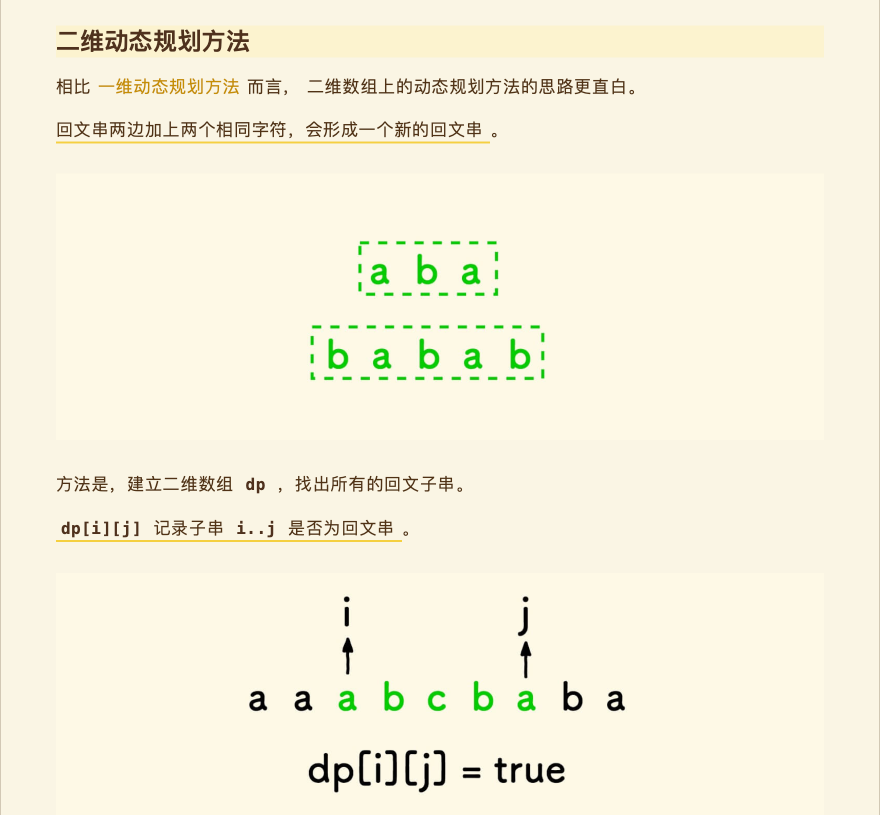
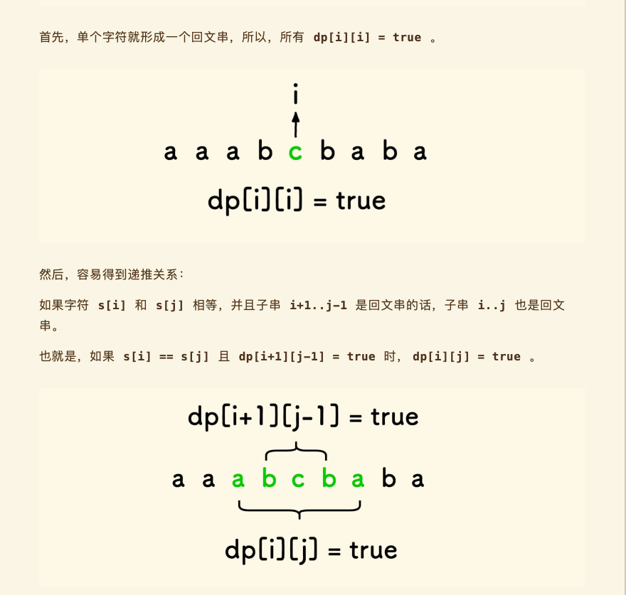
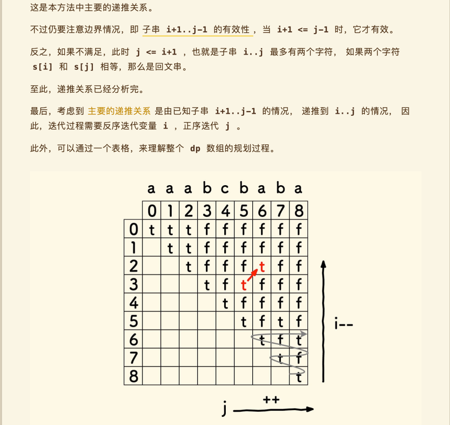
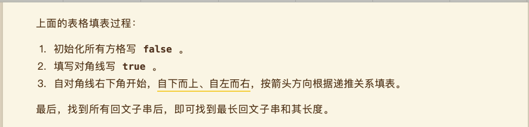

<br/>

**代码:**

```
//最长回文子串
char * longestPalindrome(char * s){
    int length = strlen(s);
    if(!s || length < 0){
        return s;
    }
    
    // dp[i][j] 表示 s[i..j] 是否回文，j >= i
    int dp[length][length];
    // 记录最大回文子串的长度，至少为 1
    int maxLength = 1, begin = 0, end = 0;
    
    // 初始化
    for(int i = 0; i<length; i++){
        for(int j = i; j <length; j++){
            dp[i][j] = 0;
        }
    }
    
    // 易知，单个字符 s[i..i] 构成回文
    for(int i =0; i<length; i++){
        dp[i][i]= 1;
    }
    
    // 考虑递推
    // 主要的递推关系是 dp[i][j] = dp[i+1][j-1]
    // 所以倒序遍历 i ，才可以形成递推
    for(int i = length - 1; i >= 0; i--){
        for(int j = i; j < length; j++){
            if(s[i] == s[j]){
                if(j-1 >= i+1){ // 子串 s[i+1..j-1] 有效性
                    if(dp[i+1][j-1]){
                        dp[i][j] = 1;
                    }
                }else {
                    // 此时 j < i + 2 即 j <= i+1
                    // 再之 s[i] == s[j]，必回文
                    dp[i][j] = 1;
                }
            }
            
            if(dp[i][j]){
                // 更新最大长度
                int length = j - i + 1;
                
                if( length > maxLength){
                    maxLength = length;
                    begin = i;
                    end = j;
                }
            }
        }
    }
    
    //char *sub=(char *)malloc(sizeof(int) * (maxLength * 2));
    //初始化sub，sub指向一块10个char大小的内存
    char *sub = (char*)malloc(sizeof(char) * maxLength);
    int i = 0;
    for( ;i<maxLength; i++){
        sub[i] = s[begin];
        begin = begin+1;
    }
    //sub[i] = '\0';
    
    return sub;
}


///调用
char *charArray= "babad";
char *charArray= "cbbd";
char *a = longestPalindrome(charArray);
println("%s", a);
```

打印:

```
🌷🌹(Apr 19 2023:22:40:01 [74行] +[HGTestAlgorithm testLeetcodeAlgorithmModule:]) bb
```


<br/>
<br/>


> <h2 id="正则表达式匹配">正则表达式匹配</h2>

给你一个字符串 s 和一个字符规律 p，请你来实现一个支持 '.' 和 '*' 的正则表达式匹配。

- '.' 匹配任意单个字符
- '*' 匹配零个或多个前面的那一个元素

所谓匹配，是要涵盖 整个 字符串 s的，而不是部分字符串。

 
示例 1：

```
输入：s = "aa", p = "a"
输出：false
解释："a" 无法匹配 "aa" 整个字符串。
```

示例 2:

```
输入：s = "aa", p = "a*"
输出：true
解释：因为 '*' 代表可以匹配零个或多个前面的那一个元素, 在这里前面的元素就是 'a'。因此，字符串 "aa" 可被视为 'a' 重复了一次。
```

示例 3：

```
输入：s = "ab", p = ".*"
输出：true
解释：".*" 表示可匹配零个或多个（'*'）任意字符（'.'）
```


提示：

- 1 <= s.length <= 20
- 1 <= p.length <= 20
- s 只包含从 a-z 的小写字母。
- p 只包含从 a-z 的小写字母，以及字符 . 和 *。
- 保证每次出现字符 * 时，前面都匹配到有效的字符


**code:**

```
/**解题思路:
 *1、如果p为空，s为空匹配，s非空不匹配；
 *2、s非空，p == s || p == '.'时第一个字符匹配；
 *3、(p+1) != ''，则递归判断剩下的是否匹配 first_match && isMatch(++s, ++p)
 *4、(p+1) == '*'，则有两种情况匹配：
 *a: *匹配0个字符，s匹配剩下的，即isMatch(s, p+2)
 *b: *匹配1个字符，继续用p匹配剩下的s，即first_match && isMatch(s+1, p)
 */
 
 
int isMatch(char * s, char * p){

    if (!*p) {
        return !*s;
    }
    
    int isFirstMatch = *s && (*s == *p || *p == '.');
    if (*(p+1) == '*') {
        return isMatch(s, p+2) || (isFirstMatch && isMatch(++s, p));
    }else {
        return (isFirstMatch && isMatch(++s, ++p));
    }
}


//调用
//    char *s = "aa";
//    char *p = "a";

char *s = "aa";
char *p = "a*";

//    char *s = "ab";
//    char *p = ".*";

int is_match = isMatch(s, p);
char *desc = is_match == 1 ? "匹配正则表达式" : "不匹配正则表达式";
println("%s", desc);
```

打印:

```
🌷🌹(Apr 20 2023:20:28:39 [144行] +[HGTestAlgorithm testLeetcodeIsMatch]) 匹配正则表达式
```


<br/>
<br/>


>## <h2 id="三数之和">[三数之和(动态规划)](http://b23.tv/drt9epH)</h2>


给你一个整数数组 nums ，判断是否存在三元组 [nums[i], nums[j], nums[k]] 满足 i != j、i != k 且 j != k ，同时还满足 nums[i] + nums[j] + nums[k] == 0 。请

你返回所有和为 0 且不重复的三元组。

注意：答案中不可以包含重复的三元组。

 


示例 1：

```
输入：nums = [-1,0,1,2,-1,-4]
输出：[[-1,-1,2],[-1,0,1]]
解释：
nums[0] + nums[1] + nums[2] = (-1) + 0 + 1 = 0 。
nums[1] + nums[2] + nums[4] = 0 + 1 + (-1) = 0 。
nums[0] + nums[3] + nums[4] = (-1) + 2 + (-1) = 0 。
不同的三元组是 [-1,0,1] 和 [-1,-1,2] 。
注意，输出的顺序和三元组的顺序并不重要。
```

示例 2：

```
输入：nums = [0,1,1]
输出：[]
解释：唯一可能的三元组和不为 0 。
```

示例 3：

```
输入：nums = [0,0,0]
输出：[[0,0,0]]
解释：唯一可能的三元组和为 0 。
```

<br/>

解题思路图:

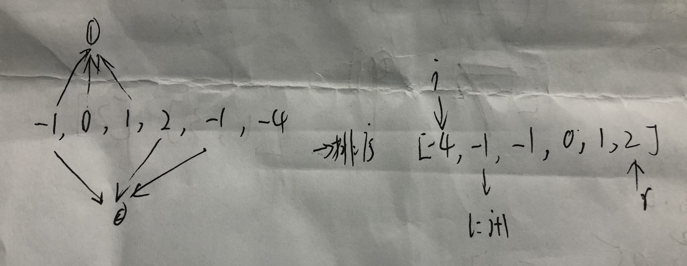


```
///筛选
int sortComp(const void* pa, const void* pb){
    int a=*(int*)pa;
    int b=*(int*)pb;
    return a>b?1:-1;
}


int** threeSum(int* nums, int numsSize, int* returnSize, int** returnColumnSizes){
    //C语言函数
    qsort(nums, numsSize, sizeof(int), sortComp);
    int baseLength = 100; //数组初始长度100
    //初始化处理返回值，二维数组的大小和保存每一个一维数组大小的数组的空间保持一致
    int **newArr = (int **)malloc(sizeof(int*) * baseLength);
    *returnColumnSizes = (int *)malloc(sizeof(int)* baseLength);
    *returnSize = 0;

    for(int i = 0; i < numsSize; i ++){
        if(i > 0 && nums[i] == nums[i -1]){//跳过重复元素(现在的元素和上一个相同了)
            continue;
        }
        //不能放在for循环外面.否则后来循环不能计算末尾元素了,也就是第二个指针
        int r = numsSize -1;
        //i下标的下一个元素
        int l = i + 1;
        int target = 0 - nums[i];        
        while(l < r){//l下标小于最末尾元素下标
            if(nums[l]+nums[r] == target){//符合相加为0
                //申请返回值二维数组的空间
                newArr[*returnSize]= (int *)malloc(sizeof(int)*3);
                //每一个数组大小都为3
                (*returnColumnSizes)[*returnSize]= 3;
                //赋值
                newArr[*returnSize][0]= nums[i];
                newArr[*returnSize][1]= nums[l];
                newArr[*returnSize][2]= nums[r];

                //二维数组的行数加1
                (*returnSize)++;

                //数组扩展一倍
                if(*returnSize == baseLength){
                    baseLength *=2;
                    //relloc重新分配内存大小,但是地址不变:https://www.runoob.com/cprogramming/c-function-realloc.html
                    newArr = (int **)realloc(newArr, sizeof(int*)*baseLength);
                    *returnColumnSizes=(int*)realloc(*returnColumnSizes,sizeof(int)*baseLength);
                }
                while(l < r && nums[l] == nums[l+1]){//跳过重复元素
                    l++;
                }
                while(l<r && nums[r] == nums[r-1]){//跳过重复元素
                    r--;
                }

                l++;
                r--;
            }else if(nums[l]+nums[r] < target){//左边元素下标太小了
                l++;
            }else{
                r--;
            }
        }
    }
    
    return newArr;
}


///调用
int nums[] = {-1,0,1,2,-1,-4};
int numSize = sizeof(nums)/sizeof(int);

///calloc:C 库函数 void *calloc(size_t nitems, size_t size) 分配所需的内存空间，并返回一个指向它的指针。malloc 和 calloc 之间的不同点是，malloc 不会设置内存为零，而 calloc 会设置分配的内存为零。
///注意：calloc() 函数将分配的内存全部初始化为零。如果不需要初始化，可以使用 malloc() 函数代替。另外，使用 calloc() 函数时需要注意，如果分配的内存块过大，可能会导致内存不足的问题。
int *returnSize = (int *)calloc(1, sizeof(int));

//这里的内存分配最大值,即排列组合知识,C几取3
//C6取3 == 20
int** returnColumnSizes = (int**)malloc(sizeof(int*) * (numSize * (numSize - 1) * (numSize - 2)) / 6);

int **a = threeSum(nums, numSize, returnSize, returnColumnSizes);
for (int i = 0; i < *returnSize; i++) {
    printf("🌷🌹行:");
    int *b = a[i];
    for (int j = 0; j < 3; j++) {
        printf("%d, ", b[j]);
    }
    printf("\n");

}
```

Log:

```
🌷🌹行:-1, -1, 2, 
🌷🌹行:-1, 0, 1, 
```

<br/>
<br/>


> <h2 id="盛最多水的容器">盛最多水的容器(贪心算法)</h2>

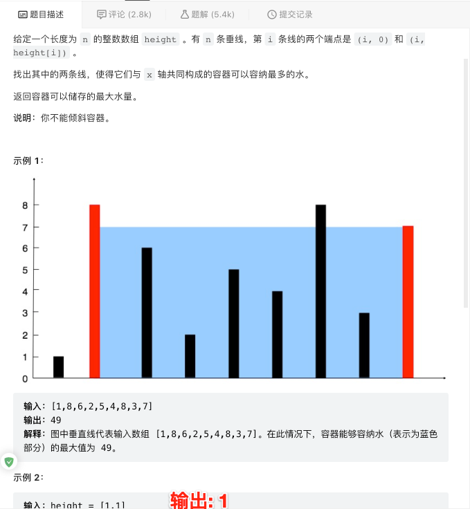


```
int maxArea(int* height, int heightSize){
    int left=0;
    int right=heightSize-1;
    int tall=0;//高
    int area=0;//面积--储水量
    int max=0;

    while(left < right)
    {
        tall=height[left]<height[right] ? height[left] : height[right];
        area=tall*(right-left);
        max=max>area ? max : area;
        
        if(height[left] < height[right])left++;
        else right--;
    }

    return max;
}

```

<br/>
<br/>


<br/>
<br/>


> <h2 id="下一个排列">下一个排列</h2>


整数数组的一个 排列  就是将其所有成员以序列或线性顺序排列。

例如，arr = [1,2,3] ，以下这些都可以视作 arr 的排列：[1,2,3]、[1,3,2]、[3,1,2]、[2,3,1] 。

整数数组的 下一个排列 是指其整数的下一个字典序更大的排列。更正式地，如果数组的所有排列根据其字典顺序从小到大排列在一个容器中，那么数组的 下一个排列 就是在这个有序容器中排在它后面的那个排列。如果不存在下一个更大的排列，那么这个数组必须重排为字典序最小的排列（即，其元素按升序排列）。

例如，arr = [1,2,3] 的下一个排列是 [1,3,2] 。

类似地，arr = [2,3,1] 的下一个排列是 [3,1,2] 。

而 arr = [3,2,1] 的下一个排列是 [1,2,3] ，因为 [3,2,1] 不存在一个字典序更大的排列。

给你一个整数数组 nums ，找出 nums 的下一个排列。

必须 原地 修改，只允许使用额外常数空间。

 

示例 1：

```
输入：nums = [1,2,3]
输出：[1,3,2]
```

示例 2：

```
输入：nums = [3,2,1]
输出：[1,2,3]
```

示例 3：

```
输入：nums = [1,1,5]
输出：[1,5,1]
```


<br/>

思路图:

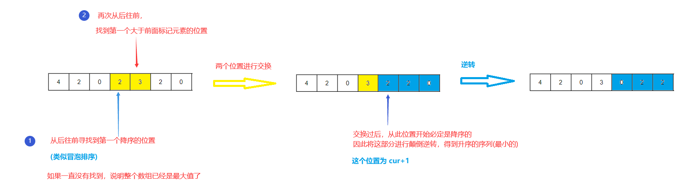


<br/>


```
//比较
int cmp(void* a, void* b){
    return *(int *)a  - *(int *)b;
}
//交换
void swap(int *a, int *b){
    int tmp = *b;
    *b = *a;
    *a = tmp;
}
//颠倒顺序
void reverse(int *array, int size, int start){
    int end = size -1;
    while(start < end) {
        swap(&array[start], &array[end]);
       
        start++;
        end--;
    }
}


void nextPermutation(int* nums, int numsSize){
    int cur = numsSize - 2;
    while(cur>=0 && nums[cur]>=nums[cur+1]){//nums[cur]>=nums[cur+1] 倒数第一和倒数第二个数做对比,
        //若是符合这个条件说明末尾是降序排列,后面只需要颠倒顺序即可,就可以做到升序排列了
        cur--;
    }

    if(cur < 0){//若是升序排列: cur = -1;
        qsort(nums, numsSize, sizeof(int), cmp);
    }else {
        //cur是从后面比较,找到第一个前面大于后面的数字的索引序列
        int pos = numsSize -1;
        while(nums[pos] <= nums[cur]){//注意: 获取数组元素值:nums[pos]
            pos--;
        }
        //从后往前找,找到比在索引序列cur还大一点的数组元素,进行交换
        swap(&nums[pos], &nums[cur]);//注意:这样传递数组元素指针值
        reverse(nums, numsSize, cur+1);//颠倒顺序做到末尾升序排列,因为排序是从cur+1开始的
        //注意: 传递数组,只要传递数组首地址就可以了
    }
}


//调用
+ (void)testNextPermutation{
    
    int nums[] = {4, 2, 5, 3, 2, 1, 0};
//    int nums[] = {4, 3, 2, 1, 0};//升序排列
    
    int size = sizeof(nums)/sizeof(int);
    nextPermutation(nums, size);
    
    printArr(nums, size);
}
```

**Log:**

```
🌷🌹 21:04:45 [125行] +[HGTestAlgorithm testNextPermutation]=> 04 03 00 01 02 02 05 
```


<br/>
<br/>


> <h2 id=""></h2>


<br/>
<br/>


> <h2 id=""></h2>


<br/>
<br/>


> <h2 id=""></h2>


<br/>
<br/>


> <h2 id=""></h2>


<br/>
<br/>


> <h2 id=""></h2>


<br/>
<br/>


> <h2 id=""></h2>


<br/>
<br/>


> <h2 id=""></h2>


<br/>
<br/>


> <h2 id=""></h2>


<br/>
<br/>


> <h2 id=""></h2>


<br/>
<br/>


> <h2 id=""></h2>


<br/>
<br/>


> <h2 id=""></h2>


<br/>
<br/>


> <h2 id=""></h2>


<br/>
<br/>


> <h2 id=""></h2>


<br/>
<br/>


> <h2 id=""></h2>


<br/>
<br/>


> <h2 id=""></h2>


<br/>
<br/>


> <h2 id=""></h2>


<br/>
<br/>


> <h2 id=""></h2>


<br/>
<br/>


> <h2 id=""></h2>


<br/>
<br/>


> <h2 id=""></h2>


<br/>
<br/>


> <h2 id=""></h2>


<br/>
<br/>


> <h2 id=""></h2>


<br/>
<br/>


> <h2 id=""></h2>


<br/>
<br/>


> <h2 id=""></h2>


<br/>
<br/>


> <h2 id=""></h2>


<br/>
<br/>


> <h2 id=""></h2>


<br/>
<br/>


> <h2 id=""></h2>


<br/>
<br/>


> <h2 id=""></h2>


