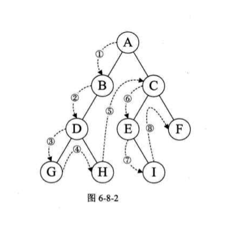
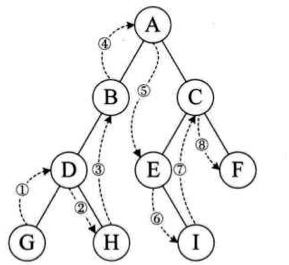
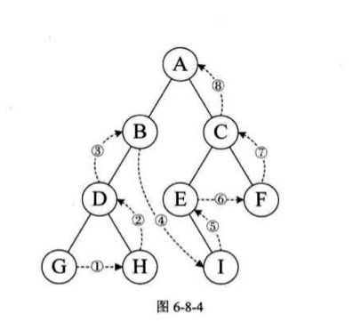

> <h2 id=''></h2>
- [**时间复杂度的计算**](#时间复杂度的计算)
	- [推导大O阶](#推导大O阶)
		- [习题](#习题)	
			- [错误5](#错误5)
			- [错误6](#错误6)
			- [错误7](#错误7)
			- [错误8](#错误8)
			- [错误9](#错误9)
			- 	[错误10](#错误10)
- [**线性表**](#线性表)
	- [**线性的表顺序存储**](#线性的表顺序存储)
		- [插入](#插入)
		- [单链表插入2比较](#单链表插入2比较)
			- [一般头节点](#一般头节点)
			- [二级指针充当头节点](#二级指针充当头节点)
			- [二级指针比较](#二级指针比较)
		- [删除](#删除)
- [**线性表的链式存储**](#线性表的链式存储)
	- [头指针作用](#头指针作用)
	- [头节点作用](#头节点作用)
	- [结构体节点的定义和申明](#结构体节点的定义和申明)
	- [单链表的插入](#单链表的插入)
		- [头插法(代码需要整理)](#头插法)
		- [头插法创建链表](#头插法创建链表)
		- [尾插法创建链表](#尾插法创建链表)
			- [尾插法链表: 解决尾指针节点跟随插入节点走动顾虑](#尾插法链表解决尾指针节点跟随插入节点走动顾虑)
	- [单链表元素的删除](#单链表元素的删除)
- [**循环链表**](#循环链表)
- [**双向链表**](#双向链表)
	- [双向链表的插入](#双向链表的插入)
	- [双向链表的删除](#双向链表的删除)
- [**链栈**](#链栈)
	- [进栈](#进栈)
	- [出栈](#出栈)
	- [清空栈元素](#清空栈元素)
	- [四则运算表达式(栈的应用)](#四则运算表达式栈的应用)
- [**队列**](#队列)
	- [链式队列](#链式队列)
	- [入队列](#入队列)
	- [链式出队列](#链式出队列)
- [**二叉树**](#二叉树)
	- [性质](#性质)
	- [遍历](#遍历)
	- [易错点](#易错点)
	- [二叉树的前、中、后遍历](#二叉树的前中后遍历)
- **参考资料**
	- [**线性表2**](https://www.jianshu.com/p/1ed7e2d2c761)
	- [数据结构](https://www.cnblogs.com/linuxAndMcu/category/1084577.html)
	- [**栈的四则运算**](https://www.cnblogs.com/mm93/p/6702083.html)
	- [**判断运算符优先级：**](https://blog.csdn.net/wenzhou1219/article/details/23961307)
	- [**代码：**](https://www.xuebuyuan.com/1389583.html)

<br/>


***
<br/>

> <h1 id="时间复杂度的计算">时间复杂度的计算</h1>

<br/>


<h2 id="推导大O阶">推导大O阶:</h2>

- 用常数 1 取代运行时间中的所有加法常数；
- 在修改后的运行数函数中，只保留最高阶项；
- 如果最高阶项存在且不是 1 就， 则去除与这个项相乘的常数，得到结果就是大 O 阶。


<br/><br/>

> <h3 id='习题'>习题</h3>

**1).O(n²)**

```
sum=0; // (1次)
for(i=1;i<=n;i++) 
    //(n次)
    for(j=1;j<=n;j++)
        //(n²次)
        sum++; // (n²次)
```

**T(n) = O(n²)**

<br/>
<br/>


**2).O(n²)**


```
for (i=1;i<n;i++)  {
    y=y+1; // ①
    for (j=0;j<=(2*n);j++)
        x++; // ②
}
```


解:语句1的频度是n-1

语句2的频度是(n-1)(2n+1)=2n²-n-1

f(n)=2n²-n-1+(n-1)=2n²-2

该程序的时间复杂度**T(n) = O(n²)**


<br/>
<br/>


**3).O(n)**

```
a=0;
b=1;   // ①
for (i=1;i<=n;i++)   {//②
    s=a+b; // ③
    b=a;   // ④
    a=s;   // ⑤
} 
```


解:语句1的频度:1,

语句2的频度:n,

语句3的频度:n-1,

语句4的频度:n-1,

语句5的频度:n-1,

**T(n) = 1+n+3(n-1) = 4n-2 = O(n)**


<br/>
<br/>


**4).O(log₂ⁿ)**


```
i=1; // ①
while (i<=n)
    //②
    i=i*2;
```


解:语句1的频度是1

设语句2的频度是f(n),

则:2^f(n)=n; f(n)=log₂ⁿ

取最大值f(n)=log₂ⁿ, **T(n)=O(log₂ⁿ)**


<br/>
<br/>

> <h4 id='错误5'>错误5</h2>

**5).O(n³)**

```
for(i=1;i<=n;i++)  {
    for(j=1;j<=i;j++)  {
        for(k=1;k<=j;k++)
            x=x+2;
    }
}
```


错误答案是: n * (n²+n)/2 *n = (n⁴+n³)/2

解:循环共进行了[1+(1+2)+(1+2+3)+…+(1+2+3+…+n) = n(n+1)(n+2)/6](https://qb.zuoyebang.com/xfe-question/question/5b910feb17621b0087f5e2a3cfcbcd44.html) 次，

所以，时间复杂度为T(n) = O(n³)


<br/>
<br/>

> <h4 id='错误6'>错误6</h2>


**6).**


某算法的时间复杂度为O(n2)，表明该算法的（ ）
A.问题规模是n2 

B.执行时间等于n2

C.执行时间与n2成正比 

D.问题规模与n2成正比

错误: A


解答: **此题选C**，时间复杂度为O(n2)，说明算法的执行时间T(n)<=c * n2(c为比例常数)，即T(n)=O(n2)，时间复杂度T(n)是问题规模n的函数，其问题规模仍然是n而不是n2。

<br/>
<br/>

> <h4 id='错误7'>错误7</h2>

**7).**

求整数n (n>=0)阶乘的算法如下，其时间复杂度是（ ）


```
int fact(int n){
    if (n<=1) return 1;
    return n*fact(n-1);
}
```

T(n)=O(n)，本题是求阶乘n!的递归代码，即n(n-1)...*1共执行n次乘法操作，故T(n)=O(n)。


<br/>
<br/>


> <h4 id='错误8'>错误8</h2>

**8).**


程序段

```
for(i=n-1;i>1;i--)
   for(j=1;j<i;j++)
       if (A[j]>A[j+1])
           A[j]与 A[j+1]对换;
```

其中n为正整数，则最后一行的语句频度在最坏情况下是（ ）


错误解答:(n-2) * (n²-2n+1)/2


解答: (n-1)+(n-2)+(n-3)+....+2 = (n-2)(n+1)/2

T(n)= 0(n²)


<br/>
<br/>


> <h4 id='错误9'>错误8</h9>

**9).**


下面说法错误的是（ ）。

Ⅰ.算法原地工作的含义是指不需要任何额外的辅助空间

Ⅱ.在相同的规模n下，复杂度O(n)的算法在时间上总是优于复杂度O(2n)的算法

Ⅲ.所谓时间复杂度是指最坏情况下，估算算法执行时间的一个上界

Ⅳ.同一个算法，实现语言的级别越高，执行效率就越低

A. Ⅰ 

B. Ⅰ、Ⅱ 

C. Ⅰ、Ⅳ 

D. Ⅲ


错误解答: 选D

正确解答: 选A

Ⅰ，算法原地工作是指算法所需的辅助空间是常量。Ⅱ，题中是指算法的时间复杂度，不要想当然认为是程序（该算法的实现）的具体执行时间，而赋予n—个特殊的值。时间复杂度为O(n)的算法，必然总是优于时间复杂度为O(2n)的算法。Ⅲ，时间复杂度总是考虑在最坏情况下的时间复杂度，以保证算法的运行时间不会比它更长。Ⅳ为严蔚敏教材的原话。

<br/>
<br/>

> <h4 id='错误10'>错误10</h10>

**10).**

分析以下各程序段，求出算法的时间复杂度。

```
// 程序段①
i=1;k=0;
while(i<n-1){
    k=k+10*i;
    i++;
}


// 程序段②
y=0;
while((y+1)*(y+1)<=n)
    y=y+1;


// 程序段③
for(i=1;i<=n;i++)
    for(j =1;j <=i;j ++)
        for(k=1;k<=j;k++)
            x++;


// 程序段④
for(i=0;i<n;i++)
    for(j=0;j<m;j++)
        a[i] [j]=0;
```


①基本语句是k=k+10i，共执行了n-2次，所以T(n) = O(n)。

②设循环体共执行T(n)次，每循环一次，循环变量y加1,最终T(n)=y。故(T(n))2<=n，解得 T(n) = O(n1/2)。

③参考[练习题5](#错误5)，T(n) = O(n3)

④ai=0是基本语句，内循环执行m次，外循环执行n次，共执行了mn次，所以 T(m, n) = O(mn)


<br/>


***
<br/>
<br/>

> <h1 id="线性表">线性表</h1>


> <h2 id="线性的表顺序存储">线性的表顺序存储</h2>

<br/>

> <h3 id="插入">插入</h3>


```
int initList(SqList *list){
    list -> length = 0;
    
    return OK;
}


//线性表顺序插入
int listInsert(SqList *list, int i, int e){
    //顺序线性表已经满
    if (list->length == MAXSIZE ) {
        return ERROR;
    }
    
    //当i比第一位置小或者比最后一位置后一位置还要大时(如：数组长度为9，但是i为10)
    if (i < 1 || i > list->length +1) {
        return ERROR;
    }
    
    //若插入数据位置不在表尾
    if (i <= list->length) {
        for (int k = list->length-1; k >= i-1; k --) {
            list->data[k+1] = list->data[k];
        }
    }
    
    //将新元素插入
    list->data[i -1] = e;
    list->length++;
    
    return TRUE;
}

//初始条件：顺序线性表L已存在
//操作结果：依次对L的每个数据元素输出
int listTraverse(SqList list){
    int i;
    for (i = 0; i < list.length; i ++) {
        int k = visitElement(list.data[i]);
        printf("\n");
    }
    return OK;
}

int visitElement(ElemType c){
    printf("%d", c);
    
    return OK;
}


SqList  L;
    
ElemType e = NULL;
Status  i;
int j;
    
i = initList(&L);
printf("初始化L后：L.length=%d\n",L.length);
    
for (j = 1; j <= 5; j ++) {
    i = listInsert(&L, j, 1);
}
printf("在L的表头依次插入1～5后：L.data=\n");
listTraverse(L);

```

输出：

```
初始化L后：L.length=0
在L的表头依次插入1～5后：L.data=
1
1
1
1
1
```


<br/>
<br/>


> <h2 id="单链表插入2比较">单链表插入2比较</h2>

- <h3 id="一般头节点">一般头节点</h3>

```
#include <stdio.h>
#include <stdlib.h>

typedef struct Node {
    int data;
    struct Node *next;
} ChainNode;

typedef struct Node* HeaderNode;


ChainNode* insertNode(ChainNode *header, int i, int data) {
    
    if (header == NULL) {
	    //传过来的header指针经过初始化会被覆盖掉，在main函数里面的header头节点仍然为null，所以在这个函数里要传头节点指针
        header = (ChainNode *)malloc(sizeof(ChainNode));
        //若不指向为null，则在遍历时可能这个指针指向了未知空间引起crash
        header->next = 0;
    }
    
    ChainNode *tagNode = header;
    int j = 0;
    
    while (j < i) {
        tagNode = tagNode->next;
        ++j;
    }
    
    ChainNode *insertNode = (ChainNode *)malloc(sizeof(ChainNode));
    insertNode->data = data;
    
    insertNode->next = tagNode->next;
    tagNode->next = insertNode;
    
    return  header;
}

//单链表值的遍历
int chainedListTraverse(ChainNode *list){
    if (list->next == NULL) {
        return 0;
    }
    
    printf("链表的值是：");
    
    ChainNode *traverse = list->next;
    while (traverse != NULL) {
        printf("%d,  ", traverse->data);
        traverse = traverse->next;
    }
    return 1;
}
```

打印：

```
链表的值是：0,  1,  2,  3,  4,  5,  6,  7,  8,  9,  
```

<br/>


- <h3 id="二级指针充当头节点">二级指针充当头节点</h3>


```
#include <stdio.h>
#include <stdlib.h>

typedef struct Node {
    int data;
    struct Node *next;
} ChainNode;

//可以用来充当二级指针声明
typedef struct Node* HeaderNode;


void insertNode1(HeaderNode *header, int i, int data) {
    
    if (*header == NULL) {
        //C 库函数 void *malloc(size_t size) 分配所需的内存空间，并返回一个指向它的指针。
        *header = (HeaderNode)malloc(sizeof(HeaderNode));
        //若不指向为null，则在遍历时可能这个指针指向了未知空间引起crash
        //。在此要特别说明一点，此处的初值0代表NULL，而不是数值0。因此在声明指针变量时，万万不能直接将指针变量的初值设置为数值，这样会使指针变量指向不合法的地址，因而造成不可预期的错误。
        (*header)->next = 0;
    }
    
    HeaderNode tagNode = *header;
    int j = 0;
    
    while (j < i) {
        tagNode = tagNode->next;
        ++j;
    }
    
    ChainNode *insertNode = (ChainNode *)malloc(sizeof(ChainNode));
    insertNode->data = data;
    
    insertNode->next = tagNode->next;
    tagNode->next = insertNode;
    
}

//单链表值的遍历
int chainedListTraverse1(HeaderNode *list){
    if ((*list)->next == NULL) {
        return 0;
    }
    
    printf("链表的值是：");
    
    ChainNode *traverse = (*list)->next;
    while (traverse != NULL) {
        printf("%d,  ", traverse->data);
        traverse = traverse->next;
    }
    return 1;
}


int main(int argc, const char * argv[]) {
    /**多重指针
     *由于指针变量存储的是指针所指向的内存地址，而指针变量自己所占有的内存空间也拥有一个地址，
     *因此可以声明“指针的指针”（pointer of pointer），就是“指向指针变量的指针变量”，或者称为“多重指针”的应用。
     *
     *int num = 10;
     *int *ptr1 = &num; //定义指针变量 *ptr1，并指向整数变量num地址
     *int **ptr2 = &ptr1; //定义指针变量ptr2，并指向指针变量ptr1的地址
     */
    HeaderNode headerNode = NULL;
    for (int i = 0; i < 10; i ++) {
	    //&headerNode变为二级指针
        insertNode1(&headerNode, i, i);
    }
    chainedListTraverse1(&headerNode);
}

```

打印：

```
链表的值是：0,  1,  2,  3,  4,  5,  6,  7,  8,  9,  
```


<br/>

- <h3 id="二级指针比较">二级指针比较</h2>
&emsp; 由于指针变量存储的是指针所指向的内存地址，而指针变量自己所占有的内存空间也拥有一个地址，因此可以声明“指针的指针”（pointer of pointer），就是“指向指针变量的指针变量”，或者称为“多重指针”的应用。

```
int main(int argc, const char * argv[]) {

	int num = 10;
    int *ptr1 = &num; //定义指针变量 *ptr1，并指向整数变量num地址
    int **ptr2 = &ptr1; //定义指针变量ptr2，并指向指针变量ptr1的地址

    printf("\n\n-------------------------------------------------\n");
    printf("num=%d &num=%p\n", num, &num);
    printf("-------------------------------------------------\n");
    printf("&ptr1=%p ptr1=%p *ptr1=%d\n", &ptr1, ptr1, *ptr1);
    printf("-------------------------------------------------\n");
    printf("&ptr2=%p ptr2=%p *ptr2=%p **ptr2=%d\n", &ptr2, ptr2, *ptr2, **ptr2);
}
```

打印：

```
-------------------------------------------------
num=10 &num=0x7ffeefbff430
-------------------------------------------------
&ptr1=0x7ffeefbff428 ptr1=0x7ffeefbff430 *ptr1=10
-------------------------------------------------
&ptr2=0x7ffeefbff420 ptr2=0x7ffeefbff428 *ptr2=0x7ffeefbff430 **ptr2=10
```


&emsp; 上面的声明范例表示变量num存储的值为10，而指针ptr1会存储变量num所占用内存的内存地址，指针ptr2则存储指针ptr1所占用内存的内存地址，如下图：


<br/>
<br/>

> <h2 id="删除">删除</h2>


```
typedef struct
{
    //数组，存储数据元素
    ElemType data[MAXSIZE];
    //线性表当前长度
    int length;                                
}SqList;

//线性表顺序删除
int listDelete(SqList *list, int i, ElemType *e){
    
    //线性表为空
    if (list->length == 0) {
        return ERROR;
    }
    
    //删除位置不正确
    if (i < 1 || i > list->length) {
        return ERROR;
    }
    
    //取数组地址赋值给指针变量e
    *e = list->data[i-1];
    
    if (i < list->length) {
        for (int k = i-1; k < list->length; k ++) {
            list->data[k] = list->data[k +1];
        }
    }
    
    list->length -=1;
    
    return OK;
}


SqList list = {{1,1,1,1,1}, 5}; 
int k = 5;
int e = NULL;

listDelete(&list, k, &e);
printf("删除第%d个的元素值为：%d\n",k,e);
    
```
输出：
`删除第5个的元素值为：1`


<br/>

***
<br/>

> <h1 id="线性表的链式存储">线性表的链式存储</h2>


><h2 id="头指针作用">头指针作用：</h2>

 
- 头指针是指链表指向第一个节点的指针，若链表有头结点，则是指向头结点的指针；

- 头指针具有表示作用，所以常用头指针冠以链表的名字；

-  无论链表是否为空，头指针均不为空。头指针是链表的必要元素；


<br/>

><h2 id="头结点作用">头结点作用</h2> 

- 头结点是为了操作的的统一个方便而设立的，放在第一元素的节点之前，其数据域一般无意义；

- 有了头结点，对在第一元素节点前插入节点和删除第一节点，其操作与其他节点的操作就统一了。

-  头结点不一定是链表必须的要素。

<br/>


<br/>
<br/>

> <h1 id="结构体节点的定义和申明">结构体节点的定义和申明</h2>

```

typedef struct Node {
    int data;
    struct Node *next;
}Node;


typedef  struct Node* LinkList; //Node* 等价于 LinkList

```


<br/>
<br/>
<br/>

> <h2 id="单链表的插入">单链表的插入</h2>


<br/>
<br/>
<br/>

> <h2 id="头插法">头插法(代码需要整理)</h2>


```

//初始条件：顺序线性表L已存在,1≤i≤ListLength(L)
//操作结果：在L中第i个位置之前插入新的数据元素e，L的长度加1，若是i=1，相当于头插法
Status chainedListInsert(LinkList *list, int i, int e){
    int j = 1;
    LinkList insertNode = (LinkList)malloc(sizeof(LinkList));
    LinkList tagNode = *list;
    
    if (!(*list) || j > i) {
        return FALSE;
    }
    
    //寻找第i个结点
    while (tagNode && j < i) {
        tagNode = tagNode->next;
        ++ j;
        
    }
    
    if (tagNode != NULL || i > 1) {
        insertNode->next = tagNode->next;
        tagNode->next = insertNode;
        insertNode->data = e;
       
        return TRUE;
    }
    

    return TRUE;
}


//单链表值的遍历
int chainedListTraverse(LinkList *list){
    if ((*list)->next == NULL) {
        return FALSE;
    }
    
    printf("链表的值是：");
    
    LinkList traverse = (*list)->next;
    while (traverse) {
        printf("%d,  ", traverse->data);
        traverse = traverse->next;
    }
    return TRUE;
}


void chainedListTest(void){
    LinkList list;
    int i, j, k, e;

for (j = 1; j <= 10; j ++) {
        chainedListInsert(&list, j, j);
    }
    printf("\n\n在list的表尾依次插入1～10后：list.data=");
    chainedListTraverse(&list);
}

```

输出：

```
在list的表尾依次插入1～10后：list.data=链表的值是：1,  2,  3,  4,  5,  6,  7,  8,  9,  10,  
```


<br/>
<br/>


> <h3 id="头插法创建链表">头插法创建链表</h3>


```
typedef struct Node {
    int data;
    struct Node *next;
}Node;

typedef  struct Node* LinkList; //Node* 等价于 LinkList

//头插法创建链表
int createListOfHeadInsert(LinkList *list, int length){
    if (length < 0) {
        return  FALSE;
    }
    
    //初始化随机数种子
    srand(time(0));
    //先建立一个带头结点的单链表
    (*list) = (LinkList)malloc(sizeof(Node));
    (*list)->next = NULL;
    
    while (length > 0) {
        LinkList insertNote = (LinkList)malloc(sizeof(Node));//注意：sizeof里的是类型名字，不能是LinkList，它是Node *
        insertNote->data = length;  //insertNote->data = rand()%100+1;
        insertNote->next = (*list)->next;
        //插入到表头
        (*list)->next = insertNote;
        
        length --;
    }
    
    return TRUE;
}


//单链表值的遍历
int chainedListTraverse(LinkList *list){
    if ((*list)->next == NULL) {
        return FALSE;
    }
    
    printf("链表的值是：");
    
    LinkList traverse = (*list)->next;
    while (traverse) {
        printf("%d,  ", traverse->data);
        traverse = traverse->next;
    }
    return TRUE;
}

//链表的删除
//LinkList *list申明的变量中，*list是一个变量，而且是一个指针变量。相当于 int a，这个a相当于 *list
int deleteChainedList(LinkList *list){
    
    LinkList p = (*list)->next;
    LinkList q = NULL;
    
    while (p) {
        //先判断p是否存在，再对q赋值，否则容易造成崩溃
        q = p->next;
        free(p);
        p = q;
    }
    
    //头结点指针域为空
    (*list)->next = NULL;
    
    return TRUE;
}


#pragma mark -- 链表方法调用
void chainedListTest(void){
    LinkList list;
    int i, j, k, e;
    

//头插法创建链表
    createListOfHeadInsert( &list, 20);
    chainedListTraverse(&list);
    i = deleteChainedList(&list);
    printf("\n\n头插法链表删除后的布尔值：%d(1:是 0:否)\n\n", i);
}


```
输出：
`链表的值是：1,  2,  3,  4,  5,  6,  7,  8,  9,  10,  11,  12,  13,  14,  15,  16,  17,  18,  19,  20, ` 

`头插法链表删除后的布尔值：1(1:是 0:否)`


<br/>
<br/>

<h3 id="尾插法创建链表">尾插法创建链表</h3>


```
typedef struct Node {
    int data;
    struct Node *next;
}Node;

typedef  struct Node* LinkList; //Node* 等价于 LinkList


//尾插法创建链表
int createListOfTailInsert(LinkList *list, int length){
    if (length < 0) {
        return FALSE;
    }
    
    *list = (LinkList)malloc(sizeof(Node));
    //是指针的一种浅拷贝，相当于整型之间的赋值一样
    LinkList tagNode = *list;
    
    while (length > 0) {
        LinkList insertNode = (LinkList)malloc(sizeof(Node));
        insertNode->data = length;
        //将表尾终端结点的指针指向新结点
        tagNode->next = insertNode;
        //将当前的新结点定义为表尾终端结点
        tagNode = insertNode;
        
        length --;
    }
    
    //表示当前链表结束
    tagNode->next = NULL;
    
    return TRUE;
    
}


/单链表值的遍历
int chainedListTraverse(LinkList *list){
    if ((*list)->next == NULL) {
        return FALSE;
    }
    
    printf("链表的值是：");
    
    LinkList traverse = (*list)->next;
    while (traverse) {
        printf("%d,  ", traverse->data);
        traverse = traverse->next;
    }
    return TRUE;
}

//链表的删除
//LinkList *list申明的变量中，*list是一个变量，而且是一个指针变量。相当于 int a，这个a相当于 *list
int deleteChainedList(LinkList *list){
    
    LinkList p = (*list)->next;
    LinkList q = NULL;
    
    while (p) {
        //先判断p是否存在，再对q赋值，否则容易造成崩溃
        q = p->next;
        free(p);
        p = q;
    }
    
    //头结点指针域为空
    (*list)->next = NULL;
    
    return TRUE;
}


#pragma mark -- 链表方法调用
void chainedListTest(void){
    LinkList list;
    int i, j, k, e;
    
 //尾插法创建链表
    createListOfTailInsert(&list, 20);
    chainedListTraverse(&list);
    i = deleteChainedList(&list);
    printf("\n\n尾插法链表删除后的布尔值：%d(1:是 0:否)", i);
    
    
    printf("\n\n");
}


```
输出：

```
链表的值是：20,  19,  18,  17,  16,  15,  14,  13,  12,  11,  10,  9,  8,  7,  6,  5,  4,  3,  2,  1,  

尾插法链表删除后的布尔值：1(1:是 0:否)
```


<br/>
<br/>

> <h4 id='尾插法链表解决尾指针节点跟随插入节点走动顾虑'>尾插法链表: 解决尾指针节点跟随插入节点走动顾虑</h4>
> 

```
///头插法-链表
typedef struct ChainNode {
    int num;
    struct ChainNode *next;
}ChainNode, *ChainHeaderNode;


void testStructureTypeTailInsert(void){
    ChainNode *tailNode = (ChainNode *)malloc(sizeof(ChainNode));
    tailNode->next = NULL;
    ChainNode *tagNode = tailNode;
    
    int num[]= {1, 2, 3, 4, 5};
    int length = sizeof(num)/sizeof(num[0]);
    println("1- tailNode地址:%p &tailNode地址:%p \ntagNode地址:%p &tagNode地址:%p", tailNode, &tailNode, tagNode, &tagNode);

    for (int i = 0; i < length; i ++) {
        ChainNode *node = (ChainNode *)malloc(sizeof(ChainNode));
        node->next = NULL;
        node->num = num[i];
        
        tagNode->next = node;
        tagNode = node;
        println("2- node地址:%p &node地址:%p \ntagNoded地址:%p &tagNode地址:%p", node, &node, tagNode, &tagNode);

    }
    
    ///注意: 这里tailNode不会在继续指向tagNode的初始值了,因为后来tagNode被覆盖了.
    println("3- tailNode地址:%p &tailNode地址:%p \ntagNode地址:%p &tagNode地址:%p", tailNode, &tailNode, tagNode, &tagNode);
    
    ChainNode *node = tailNode->next;
    while (node != NULL) {
        println("链表尾插法:%d", node->num);
        
        node = node->next;
    }
    
}


///调用
testStructureTypeTailInsert(void);
```

打印:

```
🌷🌹(Apr 16 2023:12:29:26 [20行] testStructureTypeTailInsert) 1- tailNode地址:0x6000007a4420 &tailNode地址:0x7ffeef4bac28 
tagNode地址:0x6000007a4420 &tagNode地址:0x7ffeef4bac20
🌷🌹(Apr 16 2023:12:29:26 [29行] testStructureTypeTailInsert) 2- node地址:0x6000007a45b0 &node地址:0x7ffeef4bac10 
tagNoded地址:0x6000007a45b0 &tagNode地址:0x7ffeef4bac20
🌷🌹(Apr 16 2023:12:29:26 [29行] testStructureTypeTailInsert) 2- node地址:0x6000007a4540 &node地址:0x7ffeef4bac10 
tagNoded地址:0x6000007a4540 &tagNode地址:0x7ffeef4bac20
🌷🌹(Apr 16 2023:12:29:26 [29行] testStructureTypeTailInsert) 2- node地址:0x6000007a4480 &node地址:0x7ffeef4bac10 
tagNoded地址:0x6000007a4480 &tagNode地址:0x7ffeef4bac20
🌷🌹(Apr 16 2023:12:29:26 [29行] testStructureTypeTailInsert) 2- node地址:0x6000007a4490 &node地址:0x7ffeef4bac10 
tagNoded地址:0x6000007a4490 &tagNode地址:0x7ffeef4bac20
🌷🌹(Apr 16 2023:12:29:26 [29行] testStructureTypeTailInsert) 2- node地址:0x6000007a4a30 &node地址:0x7ffeef4bac10 
tagNoded地址:0x6000007a4a30 &tagNode地址:0x7ffeef4bac20
🌷🌹(Apr 16 2023:12:29:26 [34行] testStructureTypeTailInsert) 3- tailNode地址:0x6000007a4420 &tailNode地址:0x7ffeef4bac28 
tagNode地址:0x6000007a4a30 &tagNode地址:0x7ffeef4bac20
🌷🌹(Apr 16 2023:12:29:26 [38行] testStructureTypeTailInsert) 链表尾插法:1
🌷🌹(Apr 16 2023:12:29:26 [38行] testStructureTypeTailInsert) 链表尾插法:2
🌷🌹(Apr 16 2023:12:29:26 [38行] testStructureTypeTailInsert) 链表尾插法:3
🌷🌹(Apr 16 2023:12:29:26 [38行] testStructureTypeTailInsert) 链表尾插法:4
🌷🌹(Apr 16 2023:12:29:26 [38行] testStructureTypeTailInsert) 链表尾插法:5
```


<br/>
<br/>


><h1 id="单链表元素的删除">单链表元素的删除</h2>


```
typedef struct Node {
    int data;
    struct Node *next;
}Node;

typedef  struct Node* LinkList; //Node* 等价于 LinkList

//初始条件：顺序线性表L已存在,1≤i≤ListLength(L)
//操作结果：在L中第i个位置之前插入新的数据元素e，L的长度加1，若是i=1，相当于头插法
Status chainedListInsert(LinkList *list, int i, int e){
    int j = 1;
    LinkList insertNode = (LinkList)malloc(sizeof(LinkList));
    LinkList tagNode = *list;
    
    if (!(*list) || j > i) {
        return FALSE;
    }
    
    //寻找第i个结点
    while (tagNode && j < i) {
        tagNode = tagNode->next;
        ++ j;
        
    }
    
    if (tagNode != NULL || i > 1) {
        insertNode->next = tagNode->next;
        tagNode->next = insertNode;
        insertNode->data = e;
       
        return TRUE;
    }
    

    return TRUE;
}


/链表的删除
//LinkList *list申明的变量中，*list是一个变量，而且是一个指针变量。相当于 int a，这个a相当于 *list
int deleteChainedList(LinkList *list){
    
    LinkList p = (*list)->next;
    LinkList q = NULL;
    
    while (p) {
        //先判断p是否存在，再对q赋值，否则容易造成崩溃
        q = p->next;
        free(p);
        p = q;
    }
    
    //头结点指针域为空
    (*list)->next = NULL;
    
    return TRUE;
}


//单链表值的遍历
int chainedListTraverse(LinkList *list){
    if ((*list)->next == NULL) {
        return FALSE;
    }
    
    printf("链表的值是：");
    
    LinkList traverse = (*list)->next;
    while (traverse) {
        printf("%d,  ", traverse->data);
        traverse = traverse->next;
    }
    return TRUE;
}


#pragma mark -- 链表方法调用
void chainedListTest(void){
    //删除某一个元素
    for (j = 1; j <= 10; j ++) {
        chainedListInsert(&list, j, j);
    }
    printf("\n\n在list的表尾依次插入1～10后：list.data=");
    chainedListTraverse(&list);
    j=5;
    i = deleteChainedListElement(&list,j,&e); /* 删除第5个数据 */
    printf("\n\n删除元素后的布尔值：%d(1:是 0:否),删除第%d个的元素值为：%d\n",i,j,e);
    printf("\n\n在list的表尾依次插入1～9后：list.data=");
    chainedListTraverse(&list);
    i = deleteChainedList(&list);
    printf("\n\n链表删除后的布尔值：%d(1:是 0:否)", i);
    
    
    //头插法创建链表
    
    printf("\n\n");
    
}


```
输出：

```
在list的表尾依次插入1～10后：list.data=链表的值是：1,  2,  3,  4,  5,  6,  7,  8,  9,  10,  

删除元素后的布尔值：1(1:是 0:否),删除第5个的元素值为：5


在list的表尾依次插入1～9后：list.data=链表的值是：1,  2,  3,  4,  6,  7,  8,  9,  10,  
```


<br/>


***
<br/>


> <h2 id="循环链表">循环链表</h2>


<br/>

**2个循环链表进行合并**


```
//保存A表头的头结点，即①
p = rearA->next;
//将本是指向B表的第一个节点(不是头结点，是第一个节点)赋值给rearA->next,即②
rearA->next = rearB->next->next;
//将原A表的头结点赋值给rearB->next,即③
rearB->next = p;
//释放p
free(p);

```


循环链表：

```
//
//  main.c
//  DataStruct
//
//  Created by Harley Huang on 20/5/2021.
//

#include <stdio.h>
#include <stdlib.h>
#include <string.h>

#define TRUE 1
#define FALSE 0

typedef int Status; // Status是函数结果状态，成功返回TRUE,失败返回FALSE
typedef int ElemType;

/* 线性表的循环链表存储结构 */
typedef struct node
{
    ElemType data;
    struct node *next;
}Node, LinkList;

// 初始化链表操作
void initList(LinkList **pList);
// 插入元素操作
Status insertList(LinkList *pList, int i, const ElemType e);
// 删除元素操作
Status deleteList(LinkList *pList, int i, ElemType *e);
// 获取元素操作
Status getElem(LinkList *pList, int i, ElemType *e);
// 头部后插入元素操作
Status insertListHead(LinkList *pList, const ElemType e);
// 尾部后插入元素操作
Status insertListTail(LinkList *pList, const ElemType e);
// 清空链表操作
Status clearList(LinkList *pList);
// 遍历链表操作
void traverseList(LinkList *pList);
// 获取链表长度操作
int getLength(LinkList *pList);

int main(int argc, const char * argv[]) {
    
    
    LinkList *pList;
    
    // 初始化链表
    initList(&pList);
    printf("初始化链表!\n\n");
    
    // 尾部后插入结点
    insertListTail(pList, 1);
    printf("尾部后插入元素1\n");
    insertListTail(pList, 2);
    printf("尾部后插入元素2\n\n");
    
    // 插入结点
    insertList(pList, 1, 4);
    printf("位置1插入元素4\n\n");
    
    // 删除结点
    int val;
    deleteList(pList, 3, &val);
    printf("删除位置3的结点，删除结点的数据为： %d\n", val);
    printf("\n");
    
    return 0;

    // 遍历链表并显示元素操作
    printf("遍历链表：");
    traverseList(pList);
    printf("\n");
    
    // 获得链表长度
    printf("链表长度: %d\n\n", getLength(pList));
    
    // 销毁链表
    clearList(pList);
    printf("销毁链表\n\n");
    
    printf("\n\nHello, World!\n");
    return 0;
}


// 初始化链表操作
// 必须使用双重指针，一重指针申请会出错
void initList(LinkList **pList)
{
    *pList = (LinkList *)malloc(sizeof(LinkList));
    if (!pList)
    {
        printf("malloc error!\n");
        return;
    }
    
    (*pList)->data = 0;
    // 因为是循环链表，所以尾指针指向头节点
    (*pList)->next = *pList;
}


// 插入元素操作
Status insertList(LinkList *pList, int i, const ElemType e)
{
    // 指向位置i所在的前一个结点
    Node *front;
    // 计数器
    int j;
    
    // 判断链表是否存在
    if (!pList)
    {
        printf("list not exist!\n");
        return FALSE;
    }
    
    // 只能在位置1以及后面插入，所以i至少为1
    if (i < 1)
    {
        printf("i is invalid!\n");
        return FALSE;
    }
    
    // 找到i位置所在的前一个结点
    front = pList;
    if (i != 1) // 对i!=1的情况特殊处理
    {
        front = pList->next; // 指向第2个结点的前一个结点，与j对应
        for (j = 2; j < i; j++) // j为计数器，赋值为2，对应front指向的下一个结点
        {
            front = front->next;
            if (front == pList)
            {
                printf("dont find front!\n");
                return FALSE;
            }
        }
    }
    
    
    // 创建一个空节点，存放要插入的新元素
    Node *temp = (Node *)malloc(sizeof(Node));
    if (!temp)
    {
        printf("malloc error!\n");
        return FALSE;
    }
    temp->data = e;
    
    // 插入结点
    temp->next = front->next;
    front->next = temp;
    
    return TRUE;
}


// 删除元素操作
Status deleteList(LinkList *pList, int i, ElemType *e)
{
    Node *front; // 指向位置i所在的前一个结点
    int j; // 计数器
    
    // 判断链表是否存在
    if (!pList)
    {
        printf("list not exist!\n");
        return FALSE;
    }
    // 只能删除位置1以及以后的结点
    if (i < 1)
    {
        printf("i is invalid!\n");
        return FALSE;
    }
    
    // 找到i位置所在的前一个结点
    front = pList;
    if (i != 1) // 对i=1的情况特殊处理
    {
        front = pList->next; // 指向第2个结点的前一个结点，与j对应
        for (int j = 2; j < i; j++) // j为计数器，赋值为2，对应front指向的下一个结点
        {
            front = front->next;
            if (front->next == pList)
            {
                printf("dont find front!\n");
                return FALSE;
            }
        }
    }
    
    // 提前保存要删除的结点
    Node *temp = front->next;
    *e = temp->data; // 将要删除结点的数据赋给e
    
    // 删除结点
    front->next = front->next->next;
    
    // 销毁结点
    free(temp);
    temp = NULL;
    
    return TRUE;
}

// 获取元素操作
Status getElem(LinkList *pList, int i, ElemType *e)
{
    Node *cur;
    
    // 判断链表是否存在
    if (!pList)
    {
        printf("list not exist!\n");
        return FALSE;
    }
    // 只能获取位置1以及以后的元素
    if (i < 1)
    {
        printf("i is invalid!\n");
        return FALSE;
    }
    
    // 找到i位置所在的结点
    cur = pList->next; // 这里是让cur指向链表的第1个结点
    int j = 1; // j为计数器，赋值为1，对应cur指向结点
    while (cur != pList && j < i)
    {
        cur = cur->next;
        j++;
    }
    // 未找到i位置所在的前一个结点
    if (cur == pList)
    {
        printf("dont find front!\n");
        return FALSE;
    }
    
    // 取第i个结点的数据
    *e = cur->data;
    
    return TRUE;
}

// 头部后插入元素操作
Status insertListHead(LinkList *pList, const ElemType e)
{
    Node *head;
    Node *temp;
    
    // 判断链表是否存在
    if (!pList)
    {
        printf("list not exist!\n");
        return FALSE;
    }
    
    // 让head指向链表的头结点
    head = pList;
    
    // 创建存放插入元素的结点
    temp = (Node *)malloc(sizeof(Node));
    if (!temp)
    {
        printf("malloc error!\n");
        return FALSE;
    }
    temp->data = e;
    
    // 头结点后插入结点
    temp->next = head->next;
    head->next = temp;
    
    return TRUE;
}

// 尾部后插入元素操作
Status insertListTail(LinkList *pList, const ElemType e)
{
    Node *cur;
    Node *temp;
    
    // 判断链表是否存在
    if (!pList)
    {
        printf("list not exist!\n");
        return FALSE;
    }
    
    // 找到链表尾节点
    cur = pList;
    while (cur->next != pList)
    {
        cur = cur->next;
    }
    
    // 创建存放插入元素的结点
    temp = (Node *)malloc(sizeof(Node));
    if (!temp)
    {
        printf("malloc error!\n");
        return -1;
    }
    temp->data = e;
    
    // 尾结点后插入结点
    temp->next = cur->next;
    cur->next = temp;
    
    return TRUE;
}

// 清空链表操作
Status clearList(LinkList *pList)
{
    Node *cur; // 当前结点
    Node *temp; // 事先保存下一结点，防止释放当前结点后导致“掉链”
    
    // 判断链表是否存在
    if (!pList)
    {
        printf("list not exist!\n");
        return FALSE;
    }
    
    cur = pList->next; // 指向头结点后的第一个结点
    while (cur != pList)
    {
        temp = cur->next; // 事先保存下一结点，防止释放当前结点后导致“掉链”
        free(cur); // 释放当前结点
        cur = NULL;
        cur = temp; // 将下一结点赋给当前结点p
    }
    pList->next = NULL; // 头结点指针域指向空
    
    return TRUE;
}

// 遍历链表操作
void traverseList(LinkList *pList)
{
    // 判断链表是否存在
    if (!pList)
    {
        printf("list not exist!\n");
        return;
    }
    
    Node *cur = pList->next;
    while (cur != pList)
    {
        printf("%d ", cur->data);
        cur = cur->next;
    }
    printf("\n");
}

// 获取链表长度操作
int getLength(LinkList *pList)
{
    Node *cur = pList;
    int length = 0;
    
    while (cur->next != pList)
    {
        cur = cur->next;
        length++;
    }
    
    return length;
}
```

打印：

```
初始化链表!

尾部后插入元素1
尾部后插入元素2

位置1插入元素4

删除位置3的结点，删除结点的数据为： 2

Program ended with exit code: 0
```


<br/>

***
<br/>


> <h1 id="双向链表">双向链表</h1>


<br/>

> <h2 id="双向链表的插入">双向链表的插入</h2>


<br/>


> <h2 id="双向链表的删除">双向链表的删除</h2>


```
//把p->next赋值给p->prior的后继，即①
p->prior->next = p->next;
//把p->prior赋值给p->next的前缀，即②
p->next->prior = p->prior;
//释放节点p
free(p);
```

代码案例：

```
//
//  main.c
//  DataStruct
//
//  Created by Harley Huang on 20/5/2021.
//

#include <stdio.h>
#include <stdlib.h>
#include <string.h>

#define TRUE 1
#define FALSE 0

// Status是函数结果状态，成功返回TRUE,失败返回FALSE
typedef int Status;
typedef int ElemType;


typedef int ElemType;
// 双向非循环链表的结构定义
typedef struct Node
{
    ElemType data;  //数据域
    struct Node *prior;   //指向前驱结点的指针
    struct Node *next;    //指向后继结点的指针
}Node, DulList;

// 初始化链表操作
void initList(DulList **pList);
// 插入元素操作
Status insertList(DulList *pList, int i, const ElemType e);
// 删除元素操作
Status deleteList(DulList *pList, int i, ElemType *e);
// 获取元素操作
Status getElem(DulList *pList, int i, ElemType *e);
// 头部后插入元素操作
Status insertListHead(DulList *pList, const ElemType e);
// 尾部后插入元素操作
Status insertListTail(DulList *pList, const ElemType e);
// 清空链表操作
Status clearList(DulList *pList);
// 遍历链表操作
void traverseList(DulList *pList);
// 获取链表长度操作
int getLength(DulList *pList);


// 初始化链表操作
void initList(DulList **pList) // 必须使用双重指针，一重指针申请会出错
{
    *pList = (DulList *)malloc(sizeof(Node));
    if (!pList)
    {
        printf("malloc error!\n");
        return;
    }
    
    (*pList)->data = 0;
    (*pList)->prior = NULL;
    (*pList)->next = NULL;
}

// 插入元素操作
Status insertList(DulList *pList, int i, const ElemType e)
{
    // 判断链表是否存在
    if (!pList)
    {
        printf("list not exist!\n");
        return FALSE;
    }
    // 只能在位置1以及后面插入，所以i至少为1
    if (i < 1)
    {
        printf("i is invalid!\n");
        return FALSE;
    }
    
    // 找到i位置所在的前一个结点
    Node *front = pList; // 这里是让front与i不同步，始终指向j对应的前一个结点
    for (int j = 1; j < i; j++) // j为计数器，赋值为1，对应front指向的下一个结点，即插入位置结点
    {
        front = front->next;
        if (front == NULL)
        {
            printf("dont find front!\n");
            return FALSE;
        }
    }
    
    // 创建一个空节点，存放要插入的新元素
    Node *temp = (Node *)malloc(sizeof(Node));
    if (!temp)
    {
        printf("malloc error!\n");
        return FALSE;
    }
    temp->data = e;
    
    // 插入结点
    temp->prior = front;
    temp->next = front->next;
    // 当空链表第一次插入结点时，此时head->next = NULL，调用NULL->prior会出错
    if (front->next != NULL)
        front->next->prior = temp;
    front->next = temp;
    
    return TRUE;
}

// 删除元素操作
Status deleteList(DulList *pList, int i, ElemType *e)
{
    // 判断链表是否存在
    if (!pList)
    {
        printf("list not exist!\n");
        return FALSE;
    }
    // 只能删除位置1以及以后的结点
    if (i < 1)
    {
        printf("i is invalid!\n");
        return FALSE;
    }
    
    // 找到i位置所在的前一个结点
    Node *front = pList; // 这里是让front与i不同步，始终指向j对应的前一个结点
    for (int j = 1; j < i; j++) // j为计数器，赋值为1，对应front指向的下一个结点，即插入位置结点
    {
        front = front->next;
        if (front->next == NULL)
        {
            printf("dont find front!\n");
            return FALSE;
        }
    }
    
    // 提前保存要删除的结点
    Node *temp = front->next;
    *e = temp->data; // 将要删除结点的数据赋给e
    
    // 删除结点
    if (front->next->next != NULL) // 删除的不是尾结点，才进入
    {
        front->next->prior = front;
    }
    front->next = front->next->next;
    
    // 销毁结点
    free(temp);
    temp = NULL;
    
    return TRUE;
}

// 获取元素操作
Status getElem(DulList *pList, int i, ElemType *e)
{
    // 判断链表是否存在
    if (!pList)
    {
        printf("list not exist!\n");
        return FALSE;
    }
    // 只能获取位置1以及以后的元素
    if (i < 1)
    {
        printf("i is invalid!\n");
        return FALSE;
    }
    
    // 找到i位置所在的结点
    Node *cur = pList->next; // 这里是让cur指向链表的第1个结点，与j同步
    for (int j = 1; j < i; j++) // j为计数器，赋值为1，对应cur指向结点
    {
        cur = cur->next;
        if (cur == NULL)
        {
            printf("dont find front!\n");
            return FALSE;
        }
    }
    
    // 取第i个结点的数据
    *e = cur->data;
    
    return TRUE;
}

// 头部后插入元素操作
Status insertListHead(DulList *plist, const ElemType e)
{
    Node *head;
    Node *temp;
    
    // 判断链表是否存在
    if (!plist)
    {
        printf("list not exist!\n");
        return FALSE;
    }
    
    // 让head指向链表的头结点
    head = plist;
    
    // 创建存放插入元素的结点
    temp = (Node *)malloc(sizeof(Node));
    if (!temp)
    {
        printf("malloc error!\n");
        return FALSE;
    }
    temp->data = e;
    
    // 头结点后插入结点
    temp->prior = head;
    temp->next = head->next;
    // 当空链表第一次插入结点时，此时head->next = NULL，调用NULL->prior会出错
    if (head->next != NULL)
        head->next->prior = temp;
    head->next = temp;
    
    return TRUE;
}

// 尾部后插入元素操作
Status insertListTail(DulList *pList, const ElemType e)
{
    Node *cur;
    Node *temp;
    
    // 判断链表是否存在
    if (!pList)
    {
        printf("list not exist!\n");
        return FALSE;
    }
    
    // 找到链表尾节点
    cur = pList;
    while (cur->next)
    {
        cur = cur->next;
    }
    
    // 创建存放插入元素的结点
    temp = (Node *)malloc(sizeof(Node));
    if (!temp)
    {
        printf("malloc error!\n");
        return -1;
    }
    temp->data = e;
    
    // 尾结点后插入结点
    temp->prior = cur;
    temp->next = cur->next;
    cur->next = temp; // 尾结点的直接后继指针是NULL，所以不用指定NULL的前驱指针
    
    return TRUE;
}

// 清空链表操作
Status clearList(DulList *pList)
{
    Node *cur; // 当前结点
    Node *temp; // 事先保存下一结点，防止释放当前结点后导致“掉链”
    
    // 判断链表是否存在
    if (!pList)
    {
        printf("list not exist!\n");
        return FALSE;
    }
    
    cur = pList->next; // 指向第一个结点
    while (cur)
    {
        temp = cur->next; // 事先保存下一结点，防止释放当前结点后导致“掉链”
        free(cur); // 释放当前结点
        cur = temp; // 将下一结点赋给当前结点p
    }
    pList->next = NULL; // 头结点指针域指向空
    
    return TRUE;
}

// 遍历链表操作
void traverseList(DulList *pList)
{
    // 判断链表是否存在
    if (!pList)
    {
        printf("list not exist!\n");
        return;
    }
    
    Node *cur = pList->next;
    while (cur != NULL)
    {
        printf("%d ", cur->data);
        cur = cur->next;
    }
    printf("\n");
}

// 获取链表长度操作
int getLength(DulList *pList)
{
    Node *cur = pList;
    int length = 0;
    
    while (cur->next)
    {
        cur = cur->next;
        length++;
    }
    
    return length;
}

int main(int argc, const char * argv[]) {
    
    
    DulList *pList;
    
    // 初始化链表
    initList(&pList);
    printf("初始化链表!\n\n");
    
    // 尾部后插入结点
    printf("尾部后插入元素1、2、3\n\n");
    for (int i = 0; i < 3; i++)
    {
        insertListTail(pList, i+1);
    }
    
    // 头部后插入元素
    insertListHead(pList, 5);
    printf("头部后插入元素5\n\n");
    
    // 插入结点
    insertList(pList, 1, 9);
    printf("在位置1插入元素9\n\n");
    
    // 遍历链表并显示元素操作
    printf("遍历链表：");
    traverseList(pList);
    printf("\n");
    
    // 删除结点
    int val;
    deleteList(pList, 2, &val);
    printf("删除位置2的结点，删除结点的数据为： %d\n", val);
    printf("\n");
    
    // 遍历链表并显示元素操作
    printf("遍历链表：");
    traverseList(pList);
    printf("\n");
    
    // 获得链表长度
    printf("链表长度: %d\n\n", getLength(pList));
    
    // 销毁链表
    clearList(pList);
    printf("销毁链表\n\n");
    
    
    printf("\n\nHello, World!\n");
    return 0;
}


```

打印：

```
初始化链表!

尾部后插入元素1、2、3

头部后插入元素5

在位置1插入元素9

遍历链表：9 5 1 2 3 

删除位置2的结点，删除结点的数据为： 5

遍历链表：9 1 2 3 

链表长度: 4

销毁链表

```


<br/>

***
<br/>


> <h1 id="链栈">链栈</h1>


**`公共Code`**

```
typedef struct StackNode{
    int data;
    struct StackNode *next;
}StackNode, *LinkStackPtr;

typedef struct{
    LinkStackPtr top;
    int count;
} LinkStack;


void linkStackTestMethod(void);


//链栈的初始化
int initWithStack(LinkStack *linkStack){
    linkStack->top = (LinkStackPtr)malloc(sizeof(StackNode));
    if (!linkStack->top) {
        return FALSE;
    }
    
    linkStack->top = NULL;
    linkStack->count = 0;
    return TRUE;
}

//判断栈是否为空
int isLinkStackEmpty(LinkStack *linkStack){
    if (linkStack->count > 0) {
        return TRUE;
    }else {
        return FALSE;
    }
}

//栈元素遍历
int linkStackTraverse(LinkStack linkStack){
    if (linkStack.count > 0) {
        StackNode *node = linkStack.top;
        while (node) {
            printf(" %d,", node->data);
            node = node->next;
        }
    }else {
        return FALSE;
    }
    
    printf("\n\n");

    return TRUE;
}

```


<br/>

> <h2 id="进栈">进栈</h2>


```

//栈的push
int pushInStack(LinkStack *linkStack, int data){
    
    StackNode *insertNode = (StackNode *)malloc(sizeof(StackNode));
    insertNode->data = data;
    //把当前的栈顶元素赋值给新结点的直接后继，见图中①
    insertNode->next = linkStack->top;
    
    //将新的结点s赋值给栈顶指针，见图中②
    linkStack->top = insertNode;
    linkStack->count ++;
    
    return TRUE;
}

void linkStackTestMethod(void){
    
    LinkStack linkStack;
    
    int statusCode = initWithStack(&linkStack);
    if (statusCode) {
        for (int i = 0; i <11; i ++) {
            pushInStack(&linkStack, i);
        }
    }
    linkStackTraverse(linkStack);
}
```
输出：

```
10, 9, 8, 7, 6, 5, 4, 3, 2, 1, 0,
```

<br/>
<br/>


> <h2 id="出栈">出栈</h2>


```
//栈的pop
int pushOutStack(LinkStack *linkStack,int *data){
    //将栈顶结点赋值给p，见图中③
    StackNode *outNode = linkStack->top;
    *data = outNode->data;  //不能是data = &(outNode->data),这是把它的地址值赋给data

    //使得栈顶指针下移一位，指向后一结点，见图中④
    linkStack->top = outNode->next;
    //释放结点p
    free(outNode);
    linkStack->count--;
    
    return TRUE;
}


void linkStackTestMethod(void){
    
    LinkStack linkStack;
    
    int statusCode = initWithStack(&linkStack);
    if (statusCode) {
        for (int i = 0; i <11; i ++) {
            pushInStack(&linkStack, i);
        }
    }
    
    int popE;
    pushOutStack(&linkStack, &popE);
    printf("出栈的元素popE是：%d\n\n",popE);
    linkStackTraverse(linkStack);
}
```
输出：

```
出栈的元素popE是：10

9, 8, 7, 6, 5, 4, 3, 2, 1, 0,
```

<br/>
<br/>

> <h2 id="清空栈元素">清空栈元素</h2>


```
//清空栈
int clearLinkStack(LinkStack *linkStack){
    if (linkStack->count == 0) {
        return FALSE;
    }
    
    StackNode *deleteNode = linkStack->top;
    while (deleteNode) {
        linkStack->top = deleteNode->next;
        free(deleteNode);
        deleteNode = linkStack->top;
    }
    linkStack->count = 0;
    return TRUE;
}


void linkStackTestMethod(void){
    
    LinkStack linkStack;
    
    int statusCode = initWithStack(&linkStack);
    if (statusCode) {
        for (int i = 0; i <11; i ++) {
            pushInStack(&linkStack, i);
        }
    }


    statusCode = clearLinkStack(&linkStack);
    linkStackTraverse(linkStack);
    printf("清空栈后，栈空否：%d(1:空 0:否)", statusCode);
    
    printf("\n\n");
}
```

输出：

```
清空栈后，栈空否：1(1:空 0:否)
```


<br/>
<br/>

># <h2 id='四则运算表达式栈的应用'>四则运算表达式(栈的应用)</h2> 

中缀表达式：` 9+(3-1)x3+10÷2 `

后缀表达式：` 9 3 1 - 3 x + 10 2 ÷ + `

- **`后缀表达式规则：`**
&emsp; 从左到右遍历表达式的每个数字和符号，遇到是数字就进栈，遇到是符号，就将处于栈顶两个数字出栈，进行运算，运算结果进栈，一直到最终获得结果。

- **`后缀表达式计算:`**
&emsp;  将后缀表达式从左到右依次遍历，如果当前元素为数字则入（操作数）栈，如果为操作符，则pop出栈顶两个元素（第一次pop出的是右操作数，第二次pop出的是左操作数）进行运算，然后将计算结果再次入栈，直至表达式结束，此时操作数栈内理应只剩一个元素即表达式结果。


<br/>

- **`中缀转后缀规则：`**

&emsp;  ①.  从左到右遍历中缀表达式中的每个数字和符号；

&emsp;  ②.  若是数字就输出，即成为后缀表达式的一部分；

&emsp;  ③.  若是符号，则判断其与栈顶符号的优先级，是右括号或优先级低于栈顶符号(乘除优先加减)则栈顶元素出栈并输出，并将当前符号进栈，一直到最终输出后缀表达式为止。

<br/>

**`中缀转后缀详细过程：`**

&emsp;  ①. 遍历中缀表达式；

&emsp;  ②. 如果当前中缀元素为操作数，则直接将此操作数“输出”到后缀表达式尾端；

&emsp;  ③. 如果当前中缀元素为'*'，'/'或'('，直接push入操作符栈；

&emsp;  ④. 如果当前中缀元素为')'，则依次pop出栈顶操作符，“输出”到后缀表达式尾端，直至pop得到的是一个'('才停止，并丢弃该'('；

&emsp;  ⑤. 如果当前中缀元素为'+'或'-'，则依次pop出栈顶操作符、“输出”到后缀表达式尾端，直至栈底（栈空）或pop得到了一个'('，若pop得到一个'('，将'('重新push入栈。达到这两个条件之一后，将此操作符（'+'或'-'）入栈；
&emsp; 

 ⑥. 如果当前中缀元素为'='，则依次pop出栈顶操作符、“输出”到后缀表达式尾端，直至栈底（栈空）。

&emsp;  `注意`：根据④、⑤两点，可以看出：只有遍历到')'才会导致'('弹出，其它操作符均不会使'('弹出。


<br/>

**`完整Code`**

`Arithmetic.h 文件`

```
#ifndef Arithmetic_h
#define Arithmetic_h

#include <stdio.h>
#include <stdlib.h>

#include "LinearListStoragge.h"

typedef struct OperationNode{
    char operation;
    struct OperationNode *next;
} OperationNode;


typedef struct {
    struct OperationNode *top;
    int count;
} OperationStack;


typedef struct CharacterNode{
    char number;
    struct CharacterNode *next;
} CharacterNode;

//后缀表达式栈
typedef struct {
    struct CharacterNode *top;
    int count;
} PostfixStack;

void arithmeticCalculateTest(void);

#endif /* Arithmetic_h */
```


<br/>

`Arithmetic.c 文件`

```

//
//  Arithmetic.c
//  DataStructure
//
//  Created by Harley on 2019/4/17.
//  Copyright © 2019 Harley'sMac. All rights reserved.
//

#include "Arithmetic.h"
#include <string.h>

//前缀表达式字符数组
char PrefixCharacter[100];

//操作符栈初始化
int initWithOperationStack(OperationStack *operataionStack){
    operataionStack->top = (OperationNode *)malloc(sizeof(OperationNode));
    if (!operataionStack->top) {
        return FALSE;
    }
    operataionStack->top = NULL;
    operataionStack->count = 0;
    
    return TRUE;
}

//后缀表达式栈初始化
int initWithPostfixStack(PostfixStack *postfixStack){
    postfixStack->top = (CharacterNode *)malloc(sizeof(CharacterNode));
    if (!postfixStack->top) {
        return FALSE;
    }
    
    postfixStack->top = NULL;
    postfixStack->count = 0;
    
    return TRUE;
}

//操作数进栈
int pushOperand(PostfixStack *postfixStack, char character){
    CharacterNode *insertNode = (CharacterNode *)malloc(sizeof(CharacterNode));
    if (!insertNode) {
        return FALSE;
    }
    insertNode->number = character;
    insertNode->next = postfixStack->top;
    
    postfixStack->top = insertNode;
    postfixStack->count ++;
    
    
    return TRUE;
}

//操作数出栈
int popOperand(PostfixStack *postfixStack, char *character){

    CharacterNode *deleteNode = postfixStack->top;
    *character = deleteNode->number;
    postfixStack->top = deleteNode->next;
    postfixStack->count--;
    
    free(deleteNode);
    
    return TRUE;
}

//操作符进栈
int pushOperator(OperationStack *operationStack, char character){
    if (!character) {
        return FALSE;
    }
    
    OperationNode *insertNode = (OperationNode *)malloc(sizeof(OperationNode));
    insertNode->next = operationStack->top;
    insertNode->operation = character;
    
    operationStack->top = insertNode;
    operationStack->count ++;
    
    return TRUE;
}


//操作符出栈
int popOperator(OperationStack *operationStack, char *character){
    OperationNode *deleteNode = operationStack->top;
    if (deleteNode == NULL) {
        return FALSE;
    }
    *character = deleteNode->operation;
    operationStack->top = deleteNode->next;
    operationStack->count --;

    free(deleteNode);
    
    return TRUE;
}

//对字符和数字进行存储
void judgeNumberOrCharacter(char character){
    
    //判断为数字
//    if (character >= '0' && character <= '9') {
//        pushOperand(<#PostfixStack *postfixStack#>, <#char character#>)
//    }
}

void traversePostfixStack(PostfixStack postfixStack){
    printf("后缀表达式是：");
    while (postfixStack.top != NULL) {
        CharacterNode *node = postfixStack.top;
        printf("%c  ", node->number);
        postfixStack.top = node->next;
    }
    printf("\n\n");
}

void traverseOperationStack(OperationStack operationStack){
    printf("符号栈是：");
    while (operationStack.top != NULL) {
        OperationNode *node = operationStack.top;
        printf("%c  ", node->operation);
        operationStack.top = node->next;
    }
    printf("\n\n");
}

//后缀表达式计算
int postfixExpressionCalculate(PostfixStack postfixStack){
    CharacterNode *node = postfixStack.top;
    if (node == NULL) {
        return FALSE;
    }
    
    PostfixStack inverseOrder;
    PostfixStack resultStack;
    
    int statusDatus = initWithPostfixStack(&resultStack);
    int statusCode = initWithPostfixStack(&inverseOrder);
    printf("后缀表达式逆序%d(1 成功  0 失败)\n\n", statusCode);
    
    while (postfixStack.top != NULL) {
        char character = '\0';
        popOperand(&postfixStack, &character);
        pushOperand(&inverseOrder, character);
    }
    
    traversePostfixStack(inverseOrder);
    
    //计算后缀表达式
    while (inverseOrder.top != NULL) {
        char character = '\0';
        char leftNumber = '\0';
        char rightNumber = '\0';
        int result = 0;
        
        popOperand(&inverseOrder, &character);
        
        if (character >= '0' && character <= '9') {
            pushOperand(&resultStack, character);
        }else {
            switch (character) {
                case '+':{
                    popOperand(&resultStack, &rightNumber);
                    popOperand(&resultStack, &leftNumber);
                    
                    leftNumber -= 48;
                    rightNumber -= 48;
                    result = rightNumber + leftNumber;
                }
                    break;
                    
                case '-':{
                    popOperand(&resultStack, &rightNumber);
                    popOperand(&resultStack, &leftNumber);
                    
                    leftNumber -= 48;
                    rightNumber -= 48;
                    result = leftNumber - rightNumber;
                }
                    break;
                    
                case '*':{
                    popOperand(&resultStack, &rightNumber);
                    popOperand(&resultStack, &leftNumber);
                    
                    leftNumber -= 48;
                    rightNumber -= 48;
                    result = leftNumber * rightNumber;
                }
                    break;
                    
                case '/':{
                    popOperand(&resultStack, &rightNumber);
                    popOperand(&resultStack, &leftNumber);
                    
                    leftNumber -= 48;
                    rightNumber -= 48;
                    result = leftNumber / rightNumber;
                }
                    break;
                    
                default:
                    break;
            }
            //将计算的结果进行入栈,字符与数值相差48
            pushOperand(&resultStack, (result +48));
            printf("%d %c %d = %d \n", leftNumber, character, rightNumber, result);

        }
    }
    
    char result = '\0';
    popOperand(&resultStack, &result);
    printf("结果值是：%d", (result -48));

    return TRUE;
    
}


void arithmeticCalculateTest(void){
    
    //状态码
    int statusCode = 0;
    //字符栈
    OperationStack operationStack;
    PostfixStack postfixStack;
    
    statusCode = initWithOperationStack(&operationStack);
    printf("操作符栈初始化成功%d(1是 0否)\n\n", statusCode);
    
    statusCode = initWithPostfixStack(&postfixStack);
    printf("后缀表达式栈初始化成功%d(1是 0否)\n\n", statusCode);
    
    //字符串数组，C语言没有字符串，字符串使用字符组成的数组
    char prefixCharacter[] = "9+(3-1)*3+8/2=";
    printf("中缀表达式是：%s\n\n", prefixCharacter);

    for (int i = 0; i< strlen(prefixCharacter); i++) {
        
        traversePostfixStack(postfixStack);
        traverseOperationStack(operationStack);
        
        //判断为数字
        if (prefixCharacter[i] >= '0' && prefixCharacter[i] <= '9') {
            pushOperand(&postfixStack, prefixCharacter[i]);
        }else {
            printf("-->> %c\n", prefixCharacter[i]);

            switch (prefixCharacter[i]) {            //如果当前中缀元素为'+'或'-'，则依次pop出栈顶操作符、“输出”到后缀表达式尾端，直至栈底（栈空）或pop得到了一个'('，若pop得到一个'('，将'('重新push入栈。达到这两个条件之一后，将此操作符（'+'或'-'）入栈；
                case '+':{
                    char character = '\0';
                    while (character != '(') {
                        popOperator(&operationStack, &character);
                        if (character != '(' && character != '\0') {
                            pushOperand(&postfixStack, character);
                            if (operationStack.top == NULL) {//出栈到栈顶，跳出循环将现在的'+'入栈
                                pushOperator(&operationStack, '+');
                                break;
                            }
                        }else {
                            pushOperator(&operationStack, character);
                            pushOperator(&operationStack, '+');
                            break;
                        }
                    }
                }
                    break;
                    
                case '-':{
                    char character = '\0';
                    while (character != '(') {
                        popOperator(&operationStack, &character);
                        if (character != '('  && character != '\0') {
                            pushOperand(&postfixStack, character);
                            if (operationStack.top == NULL) {//出栈到栈顶，跳出循环将现在的'+'入栈
                                pushOperator(&operationStack, '-');
                                break;
                            }
                        }else {//遇到'('跳出循环
                            pushOperator(&operationStack, character);
                            pushOperator(&operationStack, '-');
                            break;
                        }
                    }
                }
                    break;
                    
                case '*':{
                    pushOperator(&operationStack, '*');
                }
                    break;
                    
                case '/':{
                    pushOperator(&operationStack, '/');
                }
                    break;
                    
                case '(':{
                    pushOperator(&operationStack, '(');
                }
                    break;
                    
                case ')':{  //如果当前中缀元素为')'，则依次pop出栈顶操作符，“输出”到后缀表达式尾端，直至pop得到的是一个'('才停止，并丢弃该'('
                    char character = '\0';
                    while (character != '(') {
                        popOperator(&operationStack, &character);
                        if (character != '(') {
                            pushOperand(&postfixStack, character);
                        }else{
                            break;
                        }
                    }
                }
                    break;
                    
                case '=':{
                    char character = '\0';
                    while (operationStack.top != NULL) {
                        popOperator(&operationStack, &character);
                        pushOperand(&postfixStack, character);
                    }
                    
                }
                    break;
                    
                default:
                    break;
            }
        }
    }
    
    traversePostfixStack(postfixStack);
    
    postfixExpressionCalculate(postfixStack);
    
}


```

`输出打印：`

```

操作符栈初始化成功1(1是 0否)

后缀表达式栈初始化成功1(1是 0否)

中缀表达式是：9+(3-1)*3+8/2=

后缀表达式是：

符号栈是：

后缀表达式是：9  

符号栈是：

-->> +
后缀表达式是：9  

符号栈是：+  

-->> (
后缀表达式是：9  

符号栈是：(  +  

后缀表达式是：3  9  

符号栈是：(  +  

-->> -
后缀表达式是：3  9  

符号栈是：-  (  +  

后缀表达式是：1  3  9  

符号栈是：-  (  +  

-->> )
后缀表达式是：-  1  3  9  

符号栈是：+  

-->> *
后缀表达式是：-  1  3  9  

符号栈是：*  +  

后缀表达式是：3  -  1  3  9  

符号栈是：*  +  

-->> +
后缀表达式是：+  *  3  -  1  3  9  

符号栈是：+  

后缀表达式是：8  +  *  3  -  1  3  9  

符号栈是：+  

-->> /
后缀表达式是：8  +  *  3  -  1  3  9  

符号栈是：/  +  

后缀表达式是：2  8  +  *  3  -  1  3  9  

符号栈是：/  +  

-->> =
后缀表达式是：+  /  2  8  +  *  3  -  1  3  9  

后缀表达式逆序1(1 成功  0 失败)

后缀表达式是：9  3  1  -  3  *  +  8  2  /  +  

3 - 1 = 2 
2 * 3 = 6 
9 + 6 = 15 
8 / 2 = 4 
15 + 4 = 19 

```

&emsp;  但是这个程序有一个问题，就是当操作数是大于10以上的数，计算会失误。这是因为当我把四则运算字符串分割成了一个数组，对于大于10的数，就分割为2位了，所以出错。若是，你有解决办法，请麻烦告知下，谢谢！


<br/>

***
<br/>

> <h1 id="队列">队列</h1>


&emsp;  `队列是只允许在一端进行插入操作，而在另一端进行删除操作的线性表。`

&emsp;  队列是一种`先进先出(First In First Out)`的线性表，简称FIFO。只允许插入的一端为队尾，允许删除的一端称为队头。


<br/>
<br/>

> <h2 id="链式队列">链式队列</h2>


**`公共代码`**

```

typedef struct QueueNode{
    int data;
    struct QueueNode *next;
}QueueNode, *QueuePtr;

typedef struct {
    QueueNode *front, *rear;
} LinkQueue;

void linkQueueTest(void);


//遍历队列元素
int printQueueElement(LinkQueue linkQueue){
    if (linkQueue.front == NULL) {
        return FALSE;
    }
    
    QueueNode *node = linkQueue.front->next;
    while (node) {
        printf("    %d", node->data);
        node = node->next;
    }
    printf("\n\n");
    
    return TRUE;
}

//队列是否为空
int isQueueEmpty(LinkQueue linkQueue){
    if (linkQueue.front == linkQueue.rear) {
        return TRUE;
    }
    
    return FALSE;
}

//队列的长度
int queueLength(LinkQueue linkQueue){
    int length = 0;
    QueueNode *node = linkQueue.front;
    while (linkQueue.rear != node) {
        length ++;
        node = node->next;
    }
    return length;
}


//销毁队列
int destoryQueue(LinkQueue *linkQueue){
/*
    //错误代码
    QueueNode *deleteNode = linkQueue->front->next;
    while (deleteNode) {
        linkQueue->front = deleteNode->next;
        free(deleteNode);
        deleteNode = linkQueue->front;
    }
    linkQueue->rear = linkQueue->front;
 */
    
    //销毁，连着队列的头结点和队列的节点一块销毁掉了
    while (linkQueue->front) {
        linkQueue->rear = linkQueue->front->next;
        free(linkQueue->front);
        linkQueue->front = linkQueue->rear;
    }
    
    return TRUE;
}


//初始化队列
int initWithQueue(LinkQueue *linkQueue){
    //申请一个头结点的空间，使front和rear都指向它
    linkQueue->front = linkQueue->rear = (QueueNode *)malloc(sizeof(QueueNode));

    if (!linkQueue->front) {
        exit(OVERFLOW);
        return FALSE;
    }
    linkQueue->front->next = NULL;
    
    return TRUE;
    
}


```


<br/>

> <h2 id="入队列">入队列</h2>


```
//队列进入
int enterQueue(LinkQueue *linkQueue, int data){
    QueueNode *insertNode = (QueuePtr)malloc(sizeof(QueueNode));
    if (!insertNode) {  //存储空间分配失败
        exit(OVERFLOW);
        return FALSE;
    }
    
    insertNode->data = data;
    insertNode->next = NULL;
    //把拥有元素e的新结点s赋值给原队尾结点的后继，见图中①
    linkQueue->rear->next = insertNode;
    //把当前的s设置为队尾结点，rear指向s，见图中②
    linkQueue->rear = insertNode;
    
    return TRUE;
};

void linkQueueTest(void){
    LinkQueue linkQueue;
    int statusCode;
    int element;
    
    statusCode = initWithQueue(&linkQueue);
    printf("初始化成功%d(1是 0否)\n\n", statusCode);
    
    for (int i = 0; i <= 10; i ++) {
        enterQueue(&linkQueue, i);
    }
    printQueueElement(linkQueue);
}

```
输出：

```
初始化成功1(1是 0否)

0    1    2    3    4    5    6    7    8    9    10
```


<br/>
<br/>

> <h2 id="链式出队列">链式出队列</h2>


```
//出队列
int outQueue(LinkQueue *queue, int *data){
    if (queue->front == queue->rear) {
        return FALSE;
    }
    
    //将欲删除的队头结点暂存给deleteNode，见图中①
    QueueNode *deleteNode = queue->front->next;
    //将欲删除的队头结点的值赋值给data
    *data = deleteNode->data;
    //将原队头结点的后继deleteNode->next赋值给头结点后继，见图中②
    queue->front->next = deleteNode->next;
    
    if (queue->rear == deleteNode) {
        queue->rear = queue->front;
    }
    free(deleteNode);
    
    return TRUE;
};

void linkQueueTest(void){
    LinkQueue linkQueue;
    int statusCode;
    int element;
    
    statusCode = initWithQueue(&linkQueue);
    printf("初始化成功%d(1是 0否)\n\n", statusCode);
    
    for (int i = 0; i <= 10; i ++) {
        enterQueue(&linkQueue, i);
    }
    printQueueElement(linkQueue);
    
    statusCode = outQueue(&linkQueue, &element);
    printf("出队列成功%d(1是 0否),元素是：%d\n\n", statusCode, element);
    printQueueElement(linkQueue);
    
}
```
输出：

```
1    2    3    4    5    6    7    8    9    10

出队列成功1(1是 0否),元素是：0

1    2    3    4    5    6    7    8    9    10
```


<br/>

***
<br/>
<br/>

> <h1 id='二叉树'>二叉树</h1>


<br/>

># <h2 id='性质'>性质</h2>


- 性质1：`二叉树的第i层上至多有 2^(i-1) 个节点(i≥1)。`
i = 4 , 2^(4-1) = 8.

- 性质2：`深度为k的二叉树至多有  2^(k-1) 个节点(k≥1).`
k = 4, 有 1+2+4+8 = 15 = 2^(4-1) 个节点。

- 性质3：`任何一棵一棵二叉树T，如果其终端结点数为 n0 ，度为2的节点数为 n2，则 n0 = n2 +1；`
叶子节点数为 5， 度为2的节点数为4，则 5 = 4 +1;

- 性质4：`具有n个节点的完全二叉树的深度为「log2n」+1(「x」表示不大于x的最大整数)。`

- 性质5：`如果对一个有n个结点的完全二叉树(其深度为「log2n」+1)的节点按层序编号(从第1层到第「log2n」+1 层，每层从左到右)，对任一节点i (1≤i≤n
)有：`


<br/>

&emsp;  `①. 如果i=1，则结点i是从二叉树的根，无双亲；如果i>1,则其双亲是结点「i/2」；`

&emsp;  `②. 如果 2i>n,则结点i无左孩子(结点i为叶子结点)，否则其左孩子是结点2i；`

&emsp; ` ③. 如果 2i+1 > n,则结点i无右孩子，否则其右孩子是结点 2i +1.`


<br/>
<br/>


># <h2 id='遍历'>遍历</h2>


- **`前序遍历：若二叉树为空，则返回。否则先访问根节点，然后前序遍历左子树，再前序遍历右子树。`**



<br/>

```
//前序遍历
void preorderTraverse(BinaryTree *binaryTree){
    if (*binaryTree == NULL) {
        return;
    }
    
    printf("%c",(*binaryTree)->data);
    preorderTraverse(&(*binaryTree)->leftChild);
    preorderTraverse(&(*binaryTree)->rightChild);
}
```


<br/>
<br/>

- **`中序遍历：若树为空，则空返回。否则先从根节点开始，中序遍历根节点的左子树，然后访问根节点，最后中序遍历右子树`**



<br/>

```
//中序遍历
void infixOrderTraverse(BinaryTree *binaryTree){
    if (*binaryTree == NULL) {
        return;
    }
    
    infixOrderTraverse(&(*binaryTree)->leftChild);
    printf("%c",(*binaryTree)->data);
    infixOrderTraverse(&(*binaryTree)->rightChild);
    
    return;
}
```


<br/>
<br/>

- **`后序遍历：若树为空，则空返回。否则从左到右先叶子后节点的方式遍历访问左右子树，最后访问根节点`**



<br/>

```
//后序遍历
void epilogueOrderTraverse(BinaryTree *binaryTree){
    if (*binaryTree == NULL) {
        return;
    }
    
    epilogueOrderTraverse(&(*binaryTree)->leftChild);
    epilogueOrderTraverse(&(*binaryTree)->rightChild);
    printf("%c",(*binaryTree)->data);
    
    return;
}
```

<br/>
<br/>
<br/>

> <h2 id='易错点'>易错点</h2>


`.h 文件`

```
#ifndef BinaryTree_h
#define BinaryTree_h

#include <stdio.h>
#include <stdlib.h>
#include "math.h"
#include "string.h"

#include "LinearListStoragge.h"


typedef struct BinaryTreeNode {
    char data;
    struct BinaryTreeNode *leftChild;
    struct BinaryTreeNode *rightChild;
} BinaryTreeNode;


void binaryTreeTest(void);

#endif
```

**`.c文件`**

```
int initBinaryTree(BinaryTreeNode *binaryTree){
    binaryTree = (BinaryTreeNode *)malloc(sizeof(BinaryTreeNode));
    if (!binaryTree) {
        return FALSE;
    }
    
    binaryTree->data = '$';
    binaryTree->leftChild = NULL;
    binaryTree->rightChild = NULL;

   return TRUE;
}

void  setTest(BinaryTreeNode *node){
    node = (BinaryTreeNode *)malloc(sizeof(BinaryTreeNode));
    node->data = 'S';
}


void binaryTreeTest(void){
    BinaryTreeNode binaryTree;
    
    int statusCode = 0;
    

    statusCode = initBinaryTree(&binaryTree);
    setTest(&binaryTree);
}
```

打印：


```
(lldb) po binaryTree->data
<nil>
```

&emsp;  这是因为在 `initBinaryTree` 方法中有 ` binaryTree = (BinaryTreeNode *)malloc(sizeof(BinaryTreeNode));` 相当于又重新初始化了一个结构体 `BinaryTreeNode `,若没有这段代码，可以打印出 `S` 字符。


<br/>
<br/>

># <h2 id='二叉树的前中后遍历'>二叉树的前、中、后遍历</h2>

`.h文件`

```
#ifndef BinaryTree_h
#define BinaryTree_h

#include <stdio.h>
#include <stdlib.h>
#include "math.h"
#include "string.h"

#include "LinearListStoragge.h"

typedef struct BinaryTreeNode {
    char data;
    struct BinaryTreeNode *leftChild;
    struct BinaryTreeNode *rightChild;
} BinaryTreeNode, *BinaryTree;


void binaryTreeTest(void);


#endif 

```


# `.c文件`

```
#include "BinaryTree.h"
char characters[24] = "ABDH#K###E##CFI###G#J##";//BDH#K###E##CFI###G#J##
int number = 0;

void createBinaryTree(BinaryTree *binaryTree){
    char data = characters[number++];
    
    if (data == '#' || data == '\0') {
        *binaryTree = NULL;
    }else {
        *binaryTree = (BinaryTree)malloc(sizeof(BinaryTreeNode));
        if (!*binaryTree) {
            exit(OVERFLOW);
        }
        
        (*binaryTree)->data = data;
        createBinaryTree(&(*binaryTree)->leftChild);
        createBinaryTree(&(*binaryTree)->rightChild);
    }
    
}

//判断二叉树是否为空
int isEmptyBinaryTree(BinaryTree *binaryTree){
    if (binaryTree != NULL) {
        return TRUE;
    }
    return FALSE;
}

//计算二叉树的深度
int caculateBinaryTreeDepth(BinaryTree *binaryTree){
    int i, j;
    if (*binaryTree == NULL) {
        return 0;
    }
    
    if ((*binaryTree)->leftChild) {
        i = caculateBinaryTreeDepth(&(*binaryTree)->leftChild);
    }else {
        i = 0;
    }
    
    if ((*binaryTree)->rightChild) {
        j = caculateBinaryTreeDepth(&(*binaryTree)->rightChild);
    }else {
        j = 0;
    }
    
    
    return i>j ? i+1 : j+1;
}


//中序遍历
void infixOrderTraverse(BinaryTree *binaryTree){
    if (*binaryTree == NULL) {
        return;
    }
    
    infixOrderTraverse(&(*binaryTree)->leftChild);
    printf("%c",(*binaryTree)->data);
    infixOrderTraverse(&(*binaryTree)->rightChild);
    
    return;
}


//后序遍历
void epilogueOrderTraverse(BinaryTree *binaryTree){
    if (*binaryTree == NULL) {
        return;
    }
    
    epilogueOrderTraverse(&(*binaryTree)->leftChild);
    epilogueOrderTraverse(&(*binaryTree)->rightChild);
    printf("%c",(*binaryTree)->data);
    
    return;
}

//前序遍历
void preorderTraverse(BinaryTree *binaryTree){
    if (*binaryTree == NULL) {
        return;
    }
    
    printf("%c",(*binaryTree)->data);
    preorderTraverse(&(*binaryTree)->leftChild);
    preorderTraverse(&(*binaryTree)->rightChild);
}

int initBinaryTree(BinaryTree *binaryTree){
    *binaryTree = NULL;
    
    return TRUE;
}


//方法调用
void binaryTreeTest(void){
    BinaryTree binaryTree; //等价于：BinaryTreeNode* binaryTree;
    
    int statusCode = 0;
    
    statusCode = initBinaryTree(&binaryTree);
    
    //创建二叉树
    createBinaryTree(&binaryTree);
    
    statusCode = isEmptyBinaryTree(&binaryTree);
    printf("\n\n空树：%d(1否 0是)", statusCode);
    
    statusCode = caculateBinaryTreeDepth(&binaryTree);
    printf("\n\n二叉树的深度为：%d", statusCode);
    
    printf("\n\n前序遍历：");
    preorderTraverse(&binaryTree);
    
    printf("\n\n中序遍历：");
    infixOrderTraverse(&binaryTree);
    
    
    printf("\n\n后序遍历：");
    epilogueOrderTraverse(&binaryTree);
    
    
    
}

```
打印：

```
空树：1(1否 0是)

二叉树的深度为：5

前序遍历：ABDHKECFIGJ

中序遍历：HKDBEAIFCGJ

后序遍历：KHDEBIFJGCA
```


<br/>

***
<br/>
<br/>


> <h1 id=""></h1>


<br/>

> <h2 id=""></h2>


<br/>

***
<br/>
<br/>


> <h1 id=""></h1>


<br/>

> <h2 id=""></h2>


<br/>

***
<br/>
<br/>


> <h1 id=""></h1>


<br/>

> <h2 id=""></h2>


<br/>

***
<br/>
<br/>


> <h1 id=""></h1>


<br/>
<br/>

> <h2 id=""></h2>

```
```


<br/>

***
<br/>
<br/>


> <h1 id=""></h1>


<br/>
<br/>

> <h2 id=""></h2>


<br/>


<br/>
<br/>


<br/>

***
<br/>
<br/>


> <h1 id=""></h1>


<br/>

***
<br/>
<br/>


> <h1 id=""></h1>

