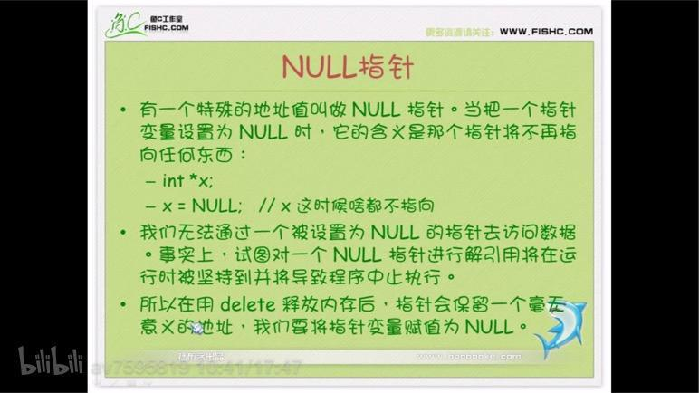
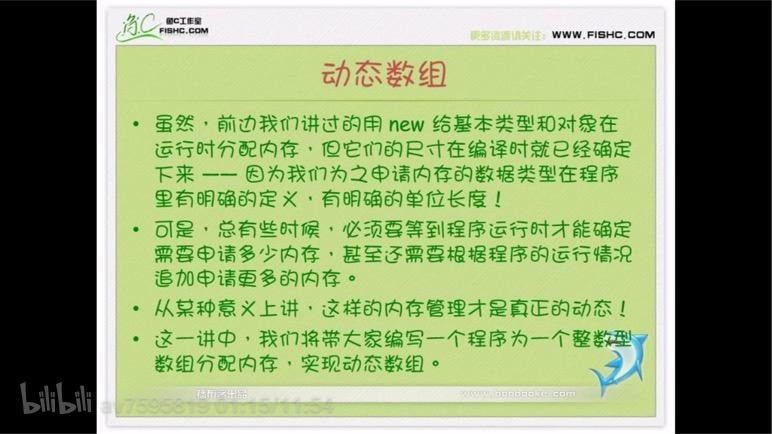
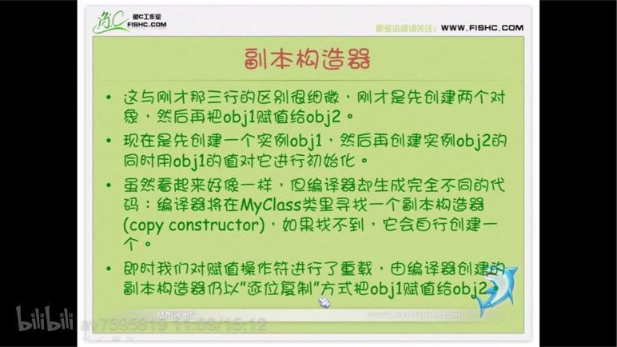
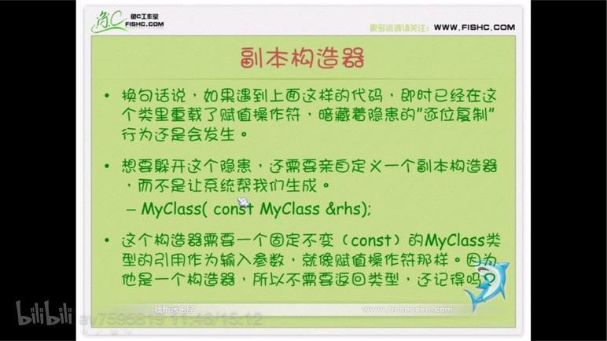
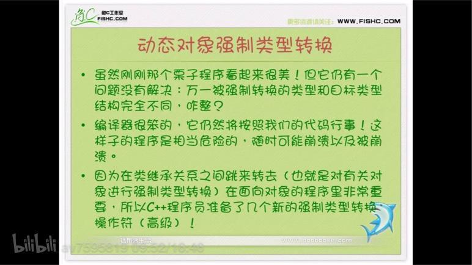
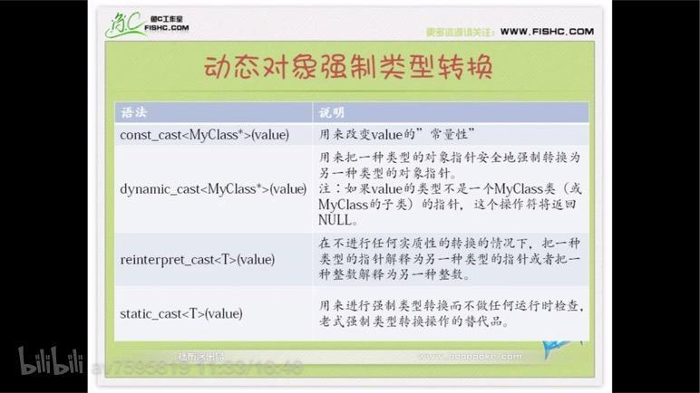
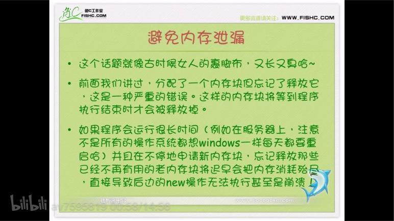
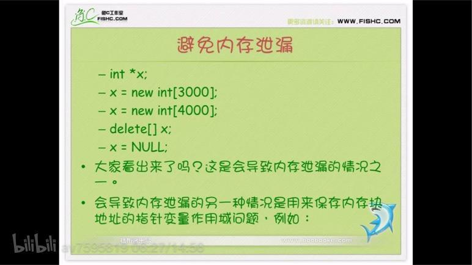

># NULL 指针



- **`静态内存、static 、new 的注意事项`**


&emsp;  为对象分配内存和为各种基本数据类型(int, char, float. . . )分配内存在做法上完全一样：
-  用new向内存池申请内存；
-  用delete 来释放内存；

<br/>

- **`避免内存泄漏`**
	- 搞对象时，千万不要忘记把方法声明为虚方法；
	- 在重新使用某个指针之前千万不要忘记调用`delete`语句，如果不这样做，那个指针将得到一个新内存块的地址，而程序将永远也无法释放原先那个内存块，因为它的地址已经被覆盖了；
	-  请记住，`delete`  语句只释放给定指针变量正指向的内存块，不影响这个指针。在执行delete语句之后，那个内存块被释放了，但指针变量还依然存在。


<br/>

***
<br/>

># 动态数组

**`动态数组引进`**




<br/>

***
<br/>

># 函数指针和指针函数

- **`函数指针`**
	-  指向函数首地址的指针变量称为函数指针；

- **`指针函数`**
	-  一个函数可以带回一个整型数据的值，字符类型值和实型类型的值，还可以带回指针类型的数据，使其指向某个地址单元；


<br/>

***
<br/>

># 副本构造器

&emsp;  EveryOne know!  我们可以把一个对象赋值给一个类型与之相同的变量。

&emsp;  编译器将生成必要的的代码把“源”对象各属性的值分别赋值给“目标”对象相应的对应成员，这种赋值行为称之为`逐位复制`。

&emsp;  这种行为在绝大多数场合是没有问题的，但如果某些成员变量是指针的话，问题来了：对象成员进行`逐位复制`的结果是你将拥有两个一模一样的实例，而这两个副本里的同名指针会指向相同的地址。 。 。 

分析如下代码：
```
MyClass obj1;
MyClass obj2;
obj2 = obj1;
```
前两行代码很简明，它们创建出了两个MyClass类的实例obj1 和 obj2 。第三行代码把 obj1 的值赋值给了 obj2，这里就可能会埋下祸根！

**`解决方法`**




&emsp;  上面方法并不能完全解决`逐位复制`问题，下面可以彻底解决：




<br/>

***
<br/>

># 动态对象强制类型转换

**`强制内型转换隐患`**






<br/>

***
<br/>

># 避免内存泄漏

**`内存泄漏的原因`**



<br/>


<br/>


**`内存泄漏案例Demo`**




上一篇[^fn1]
[^fn1]:[类(II)](https://www.jianshu.com/p/349ba7122f3a)

