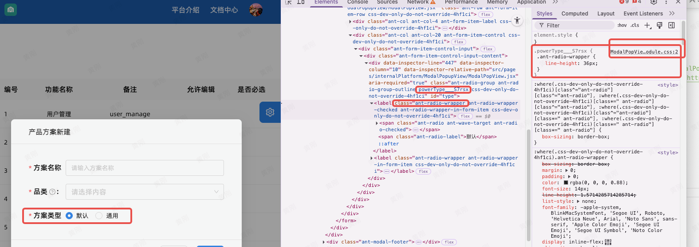
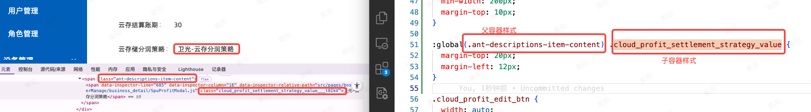

- [**样式模块化**](#样式模块化)
- [局部模块和全局模块化样式区别和影响](#局部模块和全局模块化样式区别和影响)
- [在antd组件的容器下写样式，涉及全局和局部hash样式](#在antd组件的容器下写样式，涉及全局和局部hash样式)
- [浮窗hover效果](#浮窗hover效果)
- [`./css`和`.less`文件处理流程](#样式文件处理流程)
- [overflow与阴影搭配](#overflow与阴影搭配)
- [媒体查询-最大宽度](#媒体查询-最大宽度)

<br/><br/><br/>

***
<br/>

> <h1 id="样式模块化">样式模块化</h1>

```less
.powerType {
  :global {
    .ant-radio-wrapper {
      line-height: 36px;
    }
  }
}
```

- **这段代码的含义是：**
	- 在一个局部样式（`.powerType`）作用域内，通过 `:global` 的方式对全局类名 `.ant-radio-wrapper` 进行样式覆盖，将其 `line-height` 设置为 `36px`。
	* `.ant-radio-wrapper` 是 Ant Design 的组件类名；
	* 所以你可以理解成：**为 `.powerType` 作用范围内的 `.ant-radio-wrapper` 设置 line-height 样式**。

<br/> 

**🟩 转换为普通 CSS 写法：**

CSS 中没有 `:global` 语法，因为它不做 CSS Modules 的作用域隔离。

你可以直接写成如下形式（等同效果）：

```css
.powerType .ant-radio-wrapper {
  line-height: 36px;
}
```

<br/> 

✅ 如何使用？


**📌 如果你使用的是 CSS Modules（如 `index.module.less`）：**

你的组件里应该这么写：

```tsx
import styles from './index.module.less';

return (
  <div className={styles.powerType}>
    <Radio.Group>
      <Radio value={1}>选项1</Radio>
    </Radio.Group>
  </div>
);
```

这样 `.powerType` 是局部类名，`.ant-radio-wrapper` 是全局类名，最终样式就会生效。

<br/><br/>

**📌 如果你不是用 CSS Modules，而是全局 CSS（如 `index.less`），可以直接写：**

```less
.powerType .ant-radio-wrapper {
  line-height: 36px;
}
```

然后组件中写法：

```tsx
import './index.less';

return (
  <div className="powerType">
    <Radio.Group>
      <Radio value={1}>选项1</Radio>
    </Radio.Group>
  </div>
);
```

***
<br/><br/>

**提问：**在js中引入css样式，然后使用模块化使用里面的样式，如何做？有如下：

```js
import styles from './StardFunionPointManagement/StardFunionPointManagement.css';

然后使用： styles.powerType 可以吗
```

是可以的，但是你的导入文件有问题。

<br/>

**css文件需要以如下结尾：比如 `.module.css` 或 `.module.less`**

```tsx
import styles from './StardFunionPointManagement/StardFunionPointManagement.module.css'; // 👈 注意文件名
```

文件名必须是 `xxx.module.css` 或 `xxx.module.less`，否则 `import styles from ...` 并不会返回一个样式对象。

在组件中你可以这样使用：

```tsx
<div className={styles.powerType}>
  <Radio.Group>
    <Radio value={1}>选项</Radio>
  </Radio.Group>
</div>
```

对应样式写法（在 `.module.css` 中）：

```css
.powerType :global(.ant-radio-wrapper) {
  line-height: 36px;
}
```

或（Less）：

```less
.powerType {
  :global {
    .ant-radio-wrapper {
      line-height: 36px;
    }
  }
}
```

✅ 这种情况下，`styles.powerType` 是有效的。

<br/>

 **❌ 情况：你用的是普通 CSS（文件名是 `.css` 或 `.less`，没有 `.module`）**

```tsx
import './StardFunionPointManagement/StardFunionPointManagement.css'; // 👈 普通样式
```

此时你不能写：

```tsx
<div className={styles.powerType}> // ❌ 报错：styles is undefined
```

你应该写：

```tsx
<div className="powerType">
  ...
</div>
```


<br/><br/><br/>


***
<br/>

> <h1 id="局部模块和全局模块化样式区别和影响">局部模块和全局模块化样式区别和影响</h1>


问题：为什么在 CSS Modules 的 `.module.less`（或 `.module.css`）文件中写

```css
:global {
  .powerType .ant-radio-wrapper {
    line-height: 36px;
  }
}
```



**不能达到**你期望的效果，而类似这样写：

```less
.powerType {
  :global(.ant-radio-wrapper) {
    line-height: 36px;
  }
}
```

却是正确可用的？而对 `:global` 的使用不太理解。

<br/>

**解释核心**

- **`:global` 用法语法区别**

  在 CSS Modules 中，`:global` 既可以接“括号形式”写法，也可以接“块级形式”写法，但二者作用范围不同。

1. `:global(selector)`  
   — 只让括号中 `selector`（选择器）部分**全局生效**，但其**外层的选择器依然是局部(带hash)的**。

2. `:global { ... }`  
   — 里面的所有样式或选择器全部视为**全局**，不会加局部哈希。  
   > 这个写法其实是声明了一个“全局样式块”，里面所有选择器都不会被模块化处理。


<br/>

**我写的：**

```css
:global {
  .powerType .ant-radio-wrapper {
    line-height: 36px;
  }
}
```

**翻译效果是：**

- `.powerType .ant-radio-wrapper` 这个完整选择器都是全局的，不带模块哈希。
- 也就是说，CSS Modules 不会给 `.powerType` 加哈希，所以它只能匹配全局的 `.powerType` 类，而不是模块局部生成的类名。

但一般情况下，你的 `.powerType` 是通过 CSS Modules 管理的，它的实际类名被转译成了类似 `.powerType_hash` 的样式名，你想选中的是这个局部类，而不是全局的 `.powerType`。

所以，上面写法**失效的原因是它匹配全局 `.powerType`，而你React里真正用的是局部哈希名**。

<br/>

**推荐正确写法：**

```less
.powerType {
  :global(.ant-radio-wrapper) {
    line-height: 36px;
  }
}
```

**这段代码含义是：**

- `.powerType` 是模块化的，会带上 hash，比如 `.powerType_hash`
- 里面的 `.ant-radio-wrapper` 被 `:global()` 包裹，**不会带 hash**，是全局选择器
- 生成的 CSS 类选择器大致会是：
  ```css
  .powerType_hash .ant-radio-wrapper {
    line-height: 36px;
  }
  ```
- 这样就既能正确定位模块内的 `.powerType`，又能作用到第三方库或全局的 `.ant-radio-wrapper`，符合预期逻辑。

<br/>

**总结对比表**

| 写法                     | 作用范围及效果                                   | 典型用途                          |
|--------------------------|------------------------------------------------|----------------------------------|
| `:global { .a .b {}}`    | `.a` 和 `.b` 都是 *全局* 的，没有 hash          | 覆盖完全全局类、覆盖第三方全局样式  |
| `.a { :global(.b) {}}`  | `.a` 是局部（带hash），`.b` 是全局（没hash）   | 组件内局部类调用全局第三方类        |
| `.a :global .b {}`       | 也是局部 `.a` + 全局 `.b`                       | 同上                              |

<br/>

**参考示例（基于你场景）**

假设 React 组件代码：

```jsx
import styles from './style.module.less';

function MyComponent() {
  return (
    
      
        {/* 内容 */}
      
    
  );
}
```

你需要 `.powerType` 组件内部的 `.ant-radio-wrapper` 设置样式，建议：

```less
.powerType {
  :global(.ant-radio-wrapper) {
    line-height: 36px;
  }
}
```

这种写法会正确生成：

```css
.powerType_hash .ant-radio-wrapper {
  line-height: 36px;
}
```

这样 React 渲染时会生效。

<br/>

**额外说明**

- 直接用 `:global { .powerType .ant-radio-wrapper {}}` 会让 `.powerType` 也全局生效，如果你并没有全局定义 `.powerType`，样式根本匹配不到。
- CSS Modules 的核心目标是隔离局部样式，让父级保持哈希，`：global()` 用来声明**部分选择器全局有效**。
- 可以参考官方和社区对此的解释，[GitHub css-modules issue #264](https://github.com/css-modules/css-modules/issues/264)[1]。

<br/>

**简单回答**

**你的写法不生效，是因为 `:global {}` 让所有选择器包含的 `.powerType` 都变全局了，而真实 `.powerType` 是局部哈希名，不匹配全局。**

**正确做法是：**

```less
.powerType {
  :global(.ant-radio-wrapper) {
    line-height: 36px;
  }
}
```

让 `.powerType` 保持局部，里面的 `.ant-radio-wrapper` 才全局生效。这样才会有预期效果。


<br/><br/><br/>

***
<br/>

> <h1 id="在antd组件的容器下写样式，涉及全局和局部hash样式">在antd组件的容器下写样式，涉及全局和局部hash样式</h1>



<br/>

**`xxx.module.css`** 有如下代码：

```css
:global(.ant-descriptions-item-content) .cloud_profit_settlement_strategy_value {
  margin-top: 20px;
  margin-left: 12px;
}
```

<br/>
**在 xx.jsx中使用如下：**

```js
import CSStyle from './xxx.module.css'

<span className={CSStyle.cloud_profit_settlement_strategy_value}>
	{spuStrategies.find((item) => item.value === strategy)?.label || '不参与分润'}
</span>
```

这样就有效果了。


<br/><br/><br/>

***
<br/>

> <h1 id="浮窗hover效果">浮窗hover效果</h1>

**CSS 模块（ViewStyle.module.css）：**

```css
/* 这个类会被分配到 <td class="xxx"> 上 */
.colTooltip {
  overflow: visible; /* 让该 td 不裁剪子元素 */
}

/* wrapper/浮窗样式 */
.tooltip_wrapper {
  position: relative;
  display: inline-block;
  cursor: pointer;
}

/* 浮层 */
.tooltip_text {
  visibility: hidden;
  position: absolute;
  z-index: 9999;
  bottom: 125%;                /* 或 top: 100% 根据你想要的位置 */
  left: 50%;
  transform: translateX(-50%);
  display: inline-block;
  max-width: 300px;
  white-space: normal;
  word-break: break-word;
  overflow-wrap: break-word;

  background: rgba(0,0,0,0.85);
  color: #fff;
  padding: 10px;
  border-radius: 8px;
  font-size: 14px;
}

/* hover 显示 */
.tooltip_wrapper:hover .tooltip_text {
  visibility: visible;
}
```

<br/>

**在 HTML 里用**

```js
import CSStyle from "./ViewStyle.module.css"
//<link rel="stylesheet" href="ViewStyle.module.css">


<div className={CSStyle.tooltip-wrapper}>
  苹果、香蕉、橘子、...
  <div className={tooltip-text}>
    苹果、香蕉、橘子、西瓜、桃子、梨子、菠萝、葡萄、芒果、草莓、柠檬、樱桃
  </div>
</div>
```

<br/><br/><br/>

***
<br/>

> <h1 id="样式文件处理流程">./css和.less文件处理流程</h1>

当在文件里写入 `import './index.less'` 到浏览器能看到样式，这几个工具（TypeScript编译检查、Webpack处理）分别在做什么。请看下面流程：

<br/> 

**⚡ 前端工程中 `.css` / `.less` 文件的处理流程**

```
┌──────────────────────────────┐
│  1. 你写代码                  │
│  import './index.less';      │
└───────────────┬──────────────┘
                │
                ▼
┌──────────────────────────────┐
│  2. TypeScript 检查           │
│  - 遇到 './index.less' 时，   │
│    先去看有没有声明模块       │
│  - typing.d.ts 里有：         │
│    declare module '*.less';   │
│  - 告诉 TS：这类文件合法      │
└───────────────┬──────────────┘
                │
                ▼
┌──────────────────────────────┐
│  3. 构建工具 (Webpack / Vite) │
│  - 根据配置找到 `less-loader` │
│    `css-loader` `style-loader`│
│  - 把 index.less 编译成 CSS   │
│  - 再把 CSS 转成 JS 模块       │
└───────────────┬──────────────┘
                │
                ▼
┌──────────────────────────────┐
│  4. 打包结果                  │
│  - JS 代码里会插入 <style> 标签│
│  - 或者把 CSS 单独抽出来 (插件)│
│  - 浏览器最终能解析样式        │
└──────────────────────────────┘
```

<br/>

 **🔑 关键点**

- **1.TypeScript 层**：
   只负责“不报错”，它不关心 CSS/LESS 里写了啥。
   → `declare module '*.css'` / `declare module '*.less'` 就是给 TS 一个“假的定义”。

- **2.Webpack/Vite 层**：
   真正干活的是构建工具。它们根据 loader/plugin 把 `.css` `.less` 转换成能运行的样子。


**3.运行时**：
   样式最终以 `<style>` 标签 或 单独的 `.css` 文件形式 注入到页面。


***
<br/>

**下面是一个`‌可运行的 React + TypeScript + Less`简单的DEMO**


<br/>

**📂 项目结构**

```
my-app/
├── src/
│   ├── App.tsx
│   ├── index.tsx
│   ├── index.less
│   └── typings.d.ts
├── dist/
│   └── index.html
├── package.json
├── tsconfig.json
└── webpack.config.js
```

<br/>

**🔑 文件内容**

**1.`src/App.tsx`**

```tsx
import React from 'react';
import './index.less'; // 引入样式

export default function App() {
  return (
    <div className="container">
      <h1>Hello, React + TS + Less!</h1>
    </div>
  );
}
```

<br/>


**2.`src/index.tsx`**

```tsx
import React from 'react';
import { createRoot } from 'react-dom/client';
import App from './App';

const root = createRoot(document.getElementById('root')!);
root.render(<App />);
```

<br/>

**3.`src/index.less`**

```less
@primary-color: #4CAF50;

.container {
  text-align: center;
  margin-top: 50px;

  h1 {
    color: @primary-color;
    font-size: 28px;
  }
}
```

<br/>

**4.`src/typings.d.ts`**

```ts
declare module '*.css';
declare module '*.less';
```

👉 作用：告诉 TypeScript，`.css` `.less` 文件可以被 `import`。

<br/>

**5.`package.json`（核心依赖）**

```json
{
  "name": "my-app",
  "version": "1.0.0",
  "scripts": {
    "start": "webpack serve --mode development --open",
    "build": "webpack --mode production"
  },
  "dependencies": {
    "react": "^18.3.0",
    "react-dom": "^18.3.0"
  },
  "devDependencies": {
    "typescript": "^5.4.0",
    "ts-loader": "^9.5.1",
    "webpack": "^5.91.0",
    "webpack-cli": "^5.1.4",
    "webpack-dev-server": "^4.15.0",
    "style-loader": "^3.3.3",
    "css-loader": "^6.10.0",
    "less": "^4.2.0",
    "less-loader": "^12.2.0"
  }
}
```

<br/>

**6.`tsconfig.json`**

```json
{
  "compilerOptions": {
    "target": "ES6",
    "module": "ESNext",
    "jsx": "react-jsx",
    "strict": true,
    "esModuleInterop": true,
    "skipLibCheck": true,
    "forceConsistentCasingInFileNames": true,
    "moduleResolution": "node",
    "baseUrl": "./src",
    "outDir": "./dist"
  },
  "include": ["src"]
}
```

<br/>

**7.`webpack.config.js`**

```js
const path = require('path');

module.exports = {
  entry: './src/index.tsx',
  output: {
    filename: 'bundle.js',
    path: path.resolve(__dirname, 'dist')
  },
  resolve: {
    extensions: ['.tsx', '.ts', '.js']
  },
  module: {
    rules: [
      {
        test: /\.tsx?$/,
        use: 'ts-loader',
        exclude: /node_modules/
      },
      {
        test: /\.css$/,
        use: ['style-loader', 'css-loader']
      },
      {
        test: /\.less$/,
        use: ['style-loader', 'css-loader', 'less-loader']
      }
    ]
  },
  devServer: {
    static: {
      directory: path.join(__dirname, 'dist')
    },
    port: 3000,
    hot: true
  }
};
```

***
<br/>

**8.`dist/index.html` (手动建一个)**

```html
<!DOCTYPE html>
<html lang="en">
  <head>
    <meta charset="UTF-8" />
    <title>React + TS + Less</title>
  </head>
  <body>
    <div id="root"></div>
    <script src="bundle.js"></script>
  </body>
</html>
```

啊，对，你提到的 **`dist/` 文件夹** 和 **`index.html`** 这部分确实容易让人困惑，我来帮你梳理一下：

<br/>

**📂 `dist/` 文件夹的作用**

* `dist` 代表 **打包输出目录**。

* 在 `webpack.config.js` 里我们写了：

  ```js
  output: {
    filename: 'bundle.js',
    path: path.resolve(__dirname, 'dist')
  }
  ```

  👉 这告诉 webpack：最终打包后的 `bundle.js` 要放到 `dist/` 目录下。

* **第一次运行前**，你手动创建一个空的 `dist/` 文件夹，并放一个最简单的 `index.html`（上面给的示例）。

* **以后打包的时候**，webpack 就会往这个目录里输出 `bundle.js`。

<br/>

**为什么 `index.html` 很简单？**


```html
<div id="root"></div>
<script src="bundle.js"></script>
```

* 确实没有额外样式或组件，因为这个是最小化示例，只是为了让你能跑起来并验证 `less` 样式生效。
* 真实项目里，你可能会在 `public/index.html` 里引入 favicon、reset.css 等等，但核心是 `div#root` —— React 就是挂载到这个节点上的。

<br/>

**样式是怎么生效的？**

虽然 `index.html` 没写 `<link>` 或 `<style>`，但是：

* 你在 `App.tsx` 里写了

  ```tsx
  import './index.less';
  ```
* webpack 在打包时，`less-loader + css-loader + style-loader` 会：

  1. 把 `index.less` 编译成 CSS。
  2. 把 CSS 变成 JS 代码。
  3. 运行时用 JS 往页面 `<head>` 里动态插入 `<style>` 标签。

所以即使 `index.html` 里没有写 `<style>`，运行时也能看到样式。


***
<br/>

 **🚀启动步骤**

```bash
# 初始化项目
npm install

# 开发模式启动
npm run start
```

浏览器会自动打开 [http://localhost:3000](http://localhost:3000)，页面上能看到绿色的 “Hello, React + TS + Less!”。


<br/><br/><br/>

***
<br/>

> <h1 id="overflow与阴影搭配">overflow与阴影搭配</h1>


- **1.`overflow` 属性的作用**

`overflow` 用来控制 **当元素内容超出容器盒子（即元素的 content box）时**，如何处理。

常见的取值有：

* **visible**（默认值） → 内容溢出会照常显示，不会被裁切。
* **hidden** → 超出的部分会被裁掉（不可见）。
* **scroll** → 不管内容是否超出，都出现滚动条。
* **auto** → 只有内容溢出时才出现滚动条。

<br/>

- **2.`overflow: hidden;` 的例子**

**裁剪溢出的内容**

```html
<div class="box">
  <p>这是一段很长的文字这是一段很长的文字这是一段很长的文字这是一段很长的文字这是一段很长的文字……</p>
</div>

<style>
.box {
  width: 200px;
  height: 50px;
  border: 1px solid #333;
  overflow: hidden; /* 超出200x50范围的文字会被裁掉 */
}
</style>
```

👉 效果：文字超过了 `200x50` 的盒子大小，超出的部分被 **隐藏**，不会显示出来。

<br/>

**配合 `box-shadow`**

```css
box-shadow: 0 2px 8px rgba(0, 0, 0, 0.1);
overflow: hidden;
```

这里常见的用途是：

* **box-shadow** 给容器加上阴影，营造浮起的效果。
* **overflow: hidden** 把容器里的子元素超出范围的部分裁掉。

<br/>

比如在卡片组件中：

```html
<div class="card">
  
  <p>卡片文字介绍</p>
</div>

<style>
.card {
  width: 200px;
  border-radius: 8px;                  /* 圆角 */
  box-shadow: 0 2px 8px rgba(0,0,0,0.1); /* 阴影 */
  overflow: hidden;                     /* 保证子元素（如图片）不会溢出圆角 */
}

.card img {
  width: 100%;
  display: block;
}
</style>
```

<br/>

**👉 效果：**

* 卡片有圆角和阴影。
* 如果没有 `overflow: hidden;`，图片的四个角可能超出卡片的圆角范围。
* 加上 `overflow: hidden;` 后，图片会被裁剪到圆角边界内，看起来更整齐。

<br/>

**3.详解 `overflow: hidden` 在实际开发中的常见用途**

1. **裁剪多余内容**：避免内容超出容器破坏布局。
2. **配合圆角使用**：裁剪子元素（特别是图片/背景），保持和父容器圆角一致。
3. **触发 BFC（Block Formatting Context）**：解决一些布局问题，比如父元素塌陷。

```css
.parent {
overflow: hidden; /* 可以让子元素浮动时父元素自动撑开 */
}
```


<br/>

**总结：**

* `overflow` → 控制内容溢出时的处理方式。
* `overflow: hidden` → 常用于裁剪内容 + 保证圆角效果 + 布局修复。
* 在 `box-shadow` 里一起用，主要是保证子元素不会突破圆角，让卡片更美观。

<br/><br/><br/>

***
<br/>

> <h1 id="媒体查询-最大宽度">媒体查询-最大宽度</h1>

```css
@media (max-width: 768px) {}
```

<br/>

**1.作用解释**

`@media (max-width: 768px)` 是 **媒体查询**，意思是：
👉 当 **屏幕宽度 ≤ 768px**（通常是平板或手机）时，里面的样式会生效。

* 你上面写的第一个：

  ```css
  @media (max-width: 768px) {
    .content-card {
      padding: 16px;
    }
  }
  ```

  这就表示：在小屏幕设备下，把 `.content-card` 的内边距改成 `16px`。

* 而第二个：

  ```css
  @media (max-width: 768px) {}
  ```

  里面是 **空的**，所以现在完全没有作用。

<br/>

**2.为什么可能会出现这种情况？**

一般是：

- 1.开发时先写了个 **空的 media 查询块**，准备后面加样式，忘了删。
- 2.有些代码生成器/模板会预留一个空的 media query，方便后续手写。

<br/>

- **3.结论**
	* **现在这段空的 `@media` 没有任何效果，可以删掉**。
	* 但如果你打算后面还要为小屏幕加新样式，可以保留作为占位。


---
注释: 0,15276 SHA-256 209714c24fdeec32a899065937ac8e6f  
@HuangGang <harley.smessage@icloud.com>: 63,64 194,13 209,14 224,4 232,8 244,6 5660,106 5777 5807 5813,12 5839,3 5851,7 5982,4 5988,8 6010,49 6125,2 6200 6208,15 12854,80 12950,2 13151,11 13187,2 13191,2 13200,2 13477,5 13484,2 13501,2 13664,7 14054,7 14062,2 14069,2 14180,5 14187,2 14224,2 14420,4 14434 14439,16 14465 14470,2 14474,5 14481,2 14486,2 14611,40 14655,7 14666,11 14719,11 14734,2 15066,5 15073,2 15090,2 15100,2 15142,2 15185,5 15192,4 15200,2 15203 15239 15271 15274,2  
...
