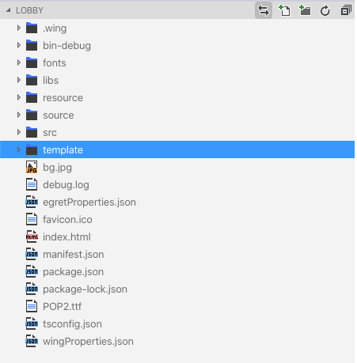
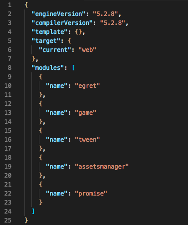
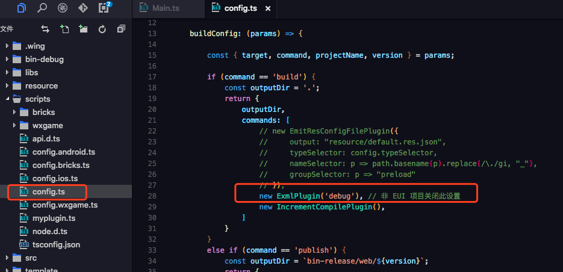
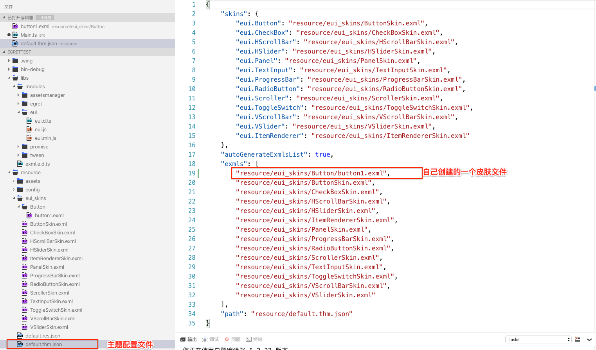

- 项目
	- 项目结构
- [**生命周期**](https://docs.egret.com/engine/docs/getStarted/lifecycle)
- [**VSCode插件安装**](https://docs.egret.com/engine/docs/installation/installation-plugin)
- [**入口文件说明**](https://docs.egret.com/engine/docs/projectConfig/indexFile)
	- Index.html参数配置
	- 启动参数说明
- [**模块配置**](https://docs.egret.com/engine/docs/projectConfig/modelconfig)
	-  [第三方库](https://github.com/egret-labs/egret-game-library)
- **`egretProperties.json`项目配置文件**
- **tsconfig 配置文件**
- **Demo项目**
	- 配置主题


<br/>


***
<br/>


># 项目

<br/>

> **项目结构**



**各文件夹功能说明:**
- .wing：包括 Egret 项目的任务配置文件和启动配置文件。
- wingProperties.json：Egret Wing 项目配置文件。
- bin-debug：项目调试时，所产生的文件存放于此目录。
- libs：库文件，包括 Egret 核心库和其他扩展库存放于此目录。
- resource：项目资源文件存放于此目录。
- scripts：项目构建和发布时需要用到的脚本文件存放在此目录。
- src：项目代码文件存放于此目录。
- template：项目模板文件存放于此目录。
- egretProperties.json：项目的配置文件。具体的配置说明可以参考：EgretProperties说明
- index.html：入口文件。具体的配置说明可以参考：入口文件说明
- manifest.json：网页清单文件。
- tsconfig.json：typescript 编译配置文件。


<br/>


***
<br/>

># 生命周期

在游戏中，用户可以切换应用的前后台。在用户进入后台时，关闭游戏逻辑、渲染逻辑、背景音乐，可以保证更好的用户体验。

生命周期管理器：egret.lifecycle。其代码示例如下：

```
egret.lifecycle.onPause = () => {
    console.log("app 进入后台");
    egret.ticker.pause(); // 关闭渲染与心跳
};
egret.lifecycle.onResume = () => {
    console.log("app 进入前台");
    egret.ticker.resume(); // 打开渲染与心跳
};
```


<br/>

***
<br/>


># 入口文件说明

> **Index.html参数配置**

index.html 为项目的入口文件，下面是 body 标签里的默认配置，您可以根据项目需求修改。

```
<div style="margin: auto;width: 100%;height: 100%;" class="egret-player"
         data-entry-class="Main"
         data-orientation="auto"
         data-scale-mode="showAll"
         data-frame-rate="30"
         data-content-width="640"
         data-content-height="1136"
         data-multi-fingered="2"
         data-show-fps="false" data-show-log="false"
         data-show-fps-style="x:0,y:0,size:12,textColor:0xffffff,bgAlpha:0.9">
</div>

```

data-entry-class：文件类名称。
data-orientation：旋转模式。
data-scale-mode：适配模式。
data-frame-rate：帧频数。
data-content-width：游戏内舞台的宽。
data-content-height：游戏内舞台的高。
data-multi-fingered：多指最大数量。
data-show-fps：是否显示 fps 帧频信息。
data-show-log：是否显示 egret.log 的输出信息。
data-show-fps-style：fps面板的样式。支持5种属性，x:0, y:0, size:30, textColor:0xffffff, bgAlpha:0.9


<br/>


> **启动参数说明**

script 标签内，有项目的启动参数,如下图所示

```
egret.runEgret({ renderMode: "webgl", audioType: 0,
    calculateCanvasScaleFactor: function (context) {
        const backingStore = context.backingStorePixelRatio ||
            context.webkitBackingStorePixelRatio ||
            context.mozBackingStorePixelRatio ||
            context.msBackingStorePixelRatio ||
            context.oBackingStorePixelRatio ||
            context.backingStorePixelRatio || 1;
        return (window.devicePixelRatio || 1) / backingStore;
} });

```
参数是一个对象，包括以下3个可选属性：

- "renderMode": 引擎渲染模式，"canvas" 或者 "webgl"
- "audioType": 使用的音频类型，0:默认，2:web audio，3:audio 两者的区别，可以参考文档
- "calculateCanvasScaleFactor"：屏幕的物理像素适配方法，使用默认的即可


<br/>

***
<br/>


># egretProperties.json 项目配置文件



- engineVersion：项目当前用来运行游戏的 egret 引擎版本，
- compilerVersion：项目当前使用的 egret 命令行版本，比如执行 build,publish 等命令，每个版本略有不同
- template：如果存在该字段，在发布 Html5 项目时，会使用 template/web/index.html 来作为入口文件。点击查看更多详情
- target：执行 build 和 publish 命令时的目标类型。
	- web：会编译成 Html5 项目
	- wxgame：会编译成微信小游戏项目
	- bricks ：会编译 QQ 玩一玩项目
	- android ：会编译成安卓项目
	- iOS：会编译成 iOS 项目
- modules 字段：定义项目中引用的所有库文件
	- name 字段是库名
	- path 字段是库文件存放路径
- urlParams 字段 
针对egret run命令添加URL参数

```

{
    "urlParams":{
        "okok":12,
        "id":455464564
    }
}

```

例如上面这个配置，在执行egret run后会在浏览器里打开地址：`http://10.0.4.63:3000/index.html?okok=12&id=455464564`


<br/>

***
<br/>

># tsconfig 配置文件

tsconfig.json 是 Typescript 项目的配置文件，TypeScript 编译器编译代码之前，会首先读取这个配置文件，并根据其中的属性来设置 TypeScript 项目的编译参数。

```

{
    "compilerOptions": {
    
	   // target:编译之后生成的JavaScript文件需要遵循的标准，默认为 es5，兼容性比较好，不建议修改
        "target": "es5",
        
        //outDir:编译出来的js文件，放到哪个目录下，默认编译到 bin-debug 里，目前暂不支持修改
        "outDir": "bin-debug",
        "experimentalDecorators": true,
        
        //lib: 编译需要的库文件，默认有3个，你可以根据需求自行添加
        "lib": [
            "es5",
            "dom",
            "es2015.promise"
        ],
        "types": []
    },
    "include": [
        "src",
        "libs"
    ]
    
    
    /**
    *其他常用参数
	* "sourceMap": true:把.ts 文件编译成.js 文件时，生成对应的 .js.map 文件，该文件可以让用户直接在浏览器里调试 ts 文件
	* "removeComments": true: 编译 .js 时删除原本 .ts 文件中的注释。
    */
}

```


<br/>

***
<br/>

># Demo项目

<br/>

> 创建一个新的eui项目

```
//终端执行命令
//Egret 会创建一个 HelloEUI 目录作为项目的根目录
$ egret create HelloEUI --type eui

//项目运行
$ egret run HelloEUI


```


<br/>
<br/>

> EUI项目配置

在 Egret 5.x 项目的 scripts 目录下，有个 config.ts 文件，里面可以配置 EUI 的编译模式



```
 if (command == 'build') {
     ......
     new ExmlPlugin('debug'), // 非 EUI 项目关闭此设置
 }
 else if (command == 'publish') {
    ......
     new ExmlPlugin('commonjs'), // 非 EUI 项目关闭此设置
 }
```
如上面的代码所示，可以分别设置 build（即 debug 模式）和 publish（即发布模式）的编译模式。

编译模式有以下几种：
- debug : 默认策略，用于开发环境
- contents : 将 EXML 的内容写入到主题文件中
- gjs : 将生成的JS文件写入到主题文件中
- commonjs : 将EXML合并为一个 CommonJS 风格的文件
- 将EXML合并为一个含有解析方法和皮肤定义的文件，且皮肤抽离为一份配置
- json : 将每个EXML文件生成一份配置


<br/>
<br/>

> [配置主题](http://developer.egret.com/cn/github/egret-docs/extension/EUI/skin/theme/index.html)

Main.ts 文件中定一个按钮组件

```
		/**
     * 创建场景界面
     * Create scene interface
     */
protected createGameScene(): void {
			 var button2 = new eui.Button();
        button2.x = 100;
        button2.y = 400;
        button2.skinName = 'resource/eui_skins/Button/button1.exml';
        button2.label = "labe 按钮 🔘";
        //对应皮肤部件Label的id： labelDisplay
        button2.labelDisplay.text = 'asjlgajslgjalsdjglajslg';
        this.addChild(button2);
        button2.addEventListener(egret.TouchEvent.TOUCH_TAP, this.onButtonClick2, this);
    }
	}

    //打印
    private onButtonClick2(e: egret.TouchEvent) {
        console.log('ssssssss');
    }


```


<br/>

**配置主题**




- 主题配置文件就是一个标准的JSON文件:

	- skins 指定组件的默认皮肤，其中键是组件的类名，值是需要赋值给这个组件skinName属性的值。可以是exml文件路径，也可以是EXML文件上注册的类名（根节点上的class属性）。

	- exmls 表示需要主题预加载的 EXML 文件列表。Theme 文件加载之后，它会优先加载这个列表中的EXML文件，由于 EXML 可能会存在相互依赖，所以 Theme 会按照列表中的顺序编译 EXML。可以监听 egret.Event.COMPLETE 来确认该列表中的EXML已经加载完成。

	- autoGenerateExmlsList 表示是否需要使用命令行工具自动生成 EXML 列表。


<br/>

***
<br/>


