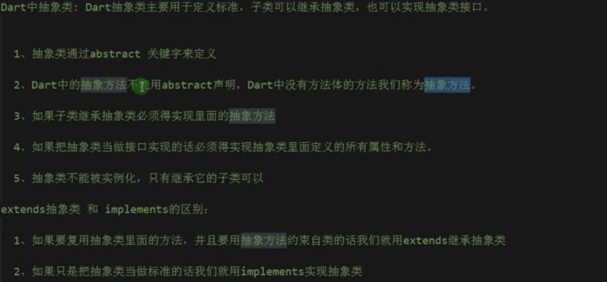
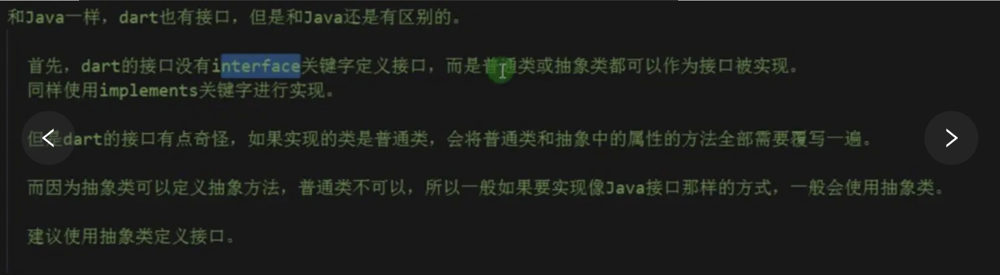
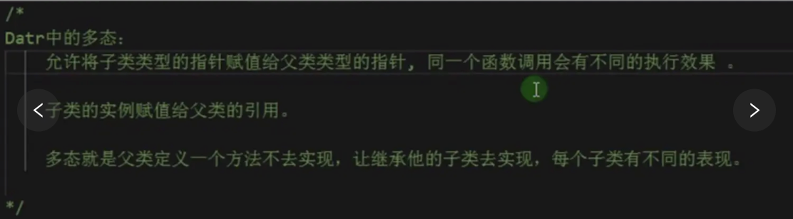
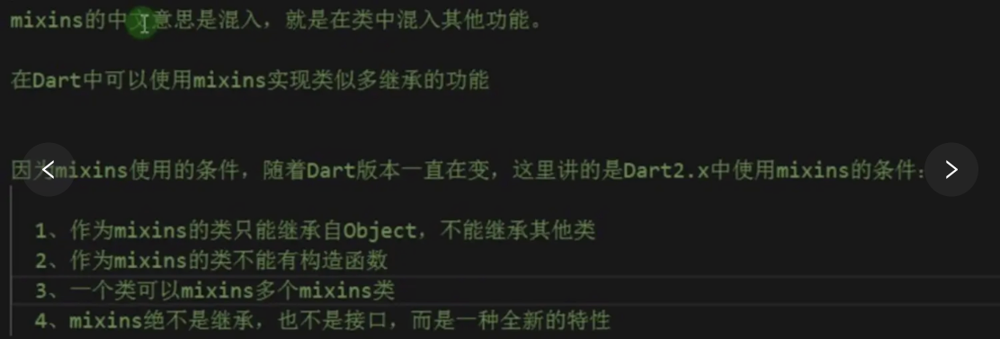
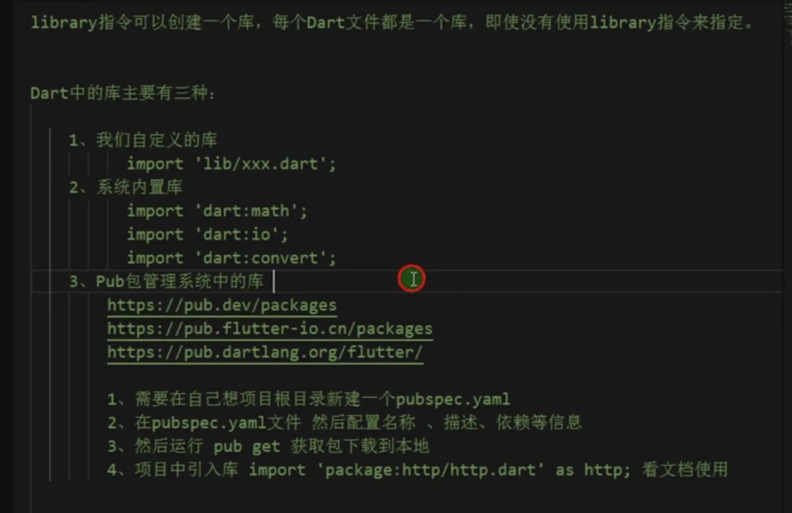
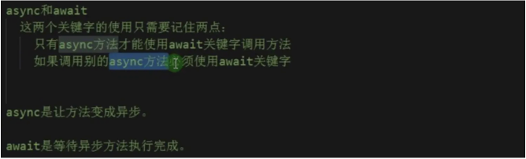
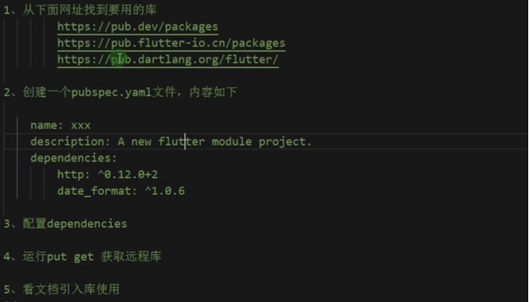

># [Flutter实战·第二版](https://book.flutterchina.club/)</h2>
># [Dart 编程语言概览](https://www.dartcn.com/guides/language/language-tour)
- [**变量**](#变量)
	- [dynamic和Object类型](#dynamic和Object类型)
	- [Final 和 Const](#Final和Const) 
		- [const在=左边](#const在=左边)
		- [const使用在=右边](#const使用在=右边)
- [**内置内型**](#内置内型)
	- [Set集合](#Set集合)
- [**运算符**](#运算符)
	- [类型判定运算符as， is， 和 is!](#类型判定运算符as，is和is!)
	- [赋值运算符](#赋值运算符)
	- [按位和移位运算符](#按位和移位运算符)
- [**空安全**](#空安全)
- [**关键字**](#关键字)
	- [@required](#@required)
	- [Mixin](#Mixin)
	- [mixin和on的结合使用](#mixin和on的结合使用)
	- [with](#with)
	- [final和const](#final和const)
- [**`类的方法`**](#类的方法)
	- [构造方法](#构造方法)
	- [get、 set方法](#getset方法)
	- [连缀书写](#连缀书写)
	- [类的继承构造方法](#类的继承构造方法)
	- [命名可选参数&可选参数](#命名可选参数&可选参数)
		- [命名可选参数](#命名可选参数)
		- [可选参数](#可选参数)
	- [模拟重载方法](#模拟重载方法)
- [**‌函数**](#函数)
	- [函数作为参数](#函数作为参数)
	- [匿名函数](#匿名函数)
	- [箭头函数](#箭头函数)
		- [条件表达式](#条件表达式)
	- [有状态函数](#有状态函数)
		- [自执行方法](#自执行方法)
		- [闭包](#闭包) 
- [**抽象类**](#抽象类)
	- [接口类](#接口类)
- [**范型限制**](#范型限制)
- [**Mixins 功能**](#Mixins功能)
- [**异步和同步**](#异步和同步)
- [**范型限制**](#范型限制)
- **[Flutter添加到现有应用](#Flutter添加到现有应用)**
	- [Flutter模块集成到iOS项目中](#Flutter模块集成到iOS项目中)
	- [Xcode调试运行Flutter](#Xcode调试运行Flutter)
- **资料**
	- [Flutter编程语言(官方)](https://www.dartcn.com/guides/get-started)
	- [Dart 基础二：函数(ghroosk-掘金)](https://juejin.cn/post/6931340267324702733#heading-19)
	- [Dart 语言基础入门篇](https://juejin.cn/post/6844904039394574344)


<br/>


***
<br/><br/><br/><br/><br/>


> <h1 id='变量'>变量</h1>

<br/><br/><br/>

> <h2 id='dynamic和Object类型'>dynamic和Object类型</h2>

<br/><br/>

> <h2 id='dynamic和object'>dynamic 和 Object</h2>


Object 是 Dart 所有对象的根基类，也就是说在 Dart 中所有类型都是Object的子类(包括Function和Null)，所以任何类型的数据都可以赋值给Object声明的对象。 dynamic与Object声明的变量都可以赋值任意对象，且后期可以改变赋值的类型，这和 var 是不同的，如：

```
dynamic t;
Object x;
t = "hi world";
x = 'Hello Object';
//下面代码没有问题
t = 1000;
x = 1000;
```


<br/>

dynamic与Object不同的是dynamic声明的对象编译器会提供所有可能的组合，而Object声明的对象只能使用 Object 的属性与方法, 否则编译器会报错，如:

```
dynamic a;
Object b = "";
main() {
	a = "";
	printLengths();
}   

printLengths() {
	// 正常
	print(a.length);
	// 报错 The getter 'length' is not defined for the class 'Object'
	print(b.length);
}
```

dynamic 的这个特点使得我们在使用它时需要格外注意，这很容易引入一个运行时错误，比如下面代码在编译时不会报错，而在运行时会报错：

```
print(a.xx); // a是字符串，没有"xx"属性，编译时不会报错，运行时会报错
```

<br/>

读了上面关于dynamic的举例和讲解，可能你还是云里雾里不知道啥意思吧？ 确实，感觉就是空话废话？ 下面我们**干货讲解：**

```
dynamic类型具有所有可能的属性和方法。Dart语言中函数方法都有dynamic类型作为函数的返回类型，函数的参数也都有dynamic类型。
```

上面的定义告诉我们，我们不会获得warning当我们调用dynamic变量的任何方法。其实dynamic不是实际的 type，而是类型检查开关，通过它定义的变量会关闭类型检查，这意味着 dynamic list= 3;  list.add();

这段代码静态类型检查不会报错(dynamic不是在编译时确定类型的，而是在运行时)，但是运行时会crash，因为list并没有add（） 方法，一个变量被dynamic修饰，相当于告诉系统“相信我，我知道我自己在做什么”。所以在大多数情况下，不推荐直接使用它。

```
void main() {
  dynamic name = '字符串';
  print(name.runtimeType); //输出：String
  name.add(); //静态类型检查不会报错,单在运行时会crash
  dynamic year = 2020;
  print(year.runtimeType); //输出：int
}

```

<br/>

但是用object定义变量时则会出现告警,object是Dart 对象的基类,你定义： object o =xxx ;时这个时候系统会认为o 是个对象，你可以调用o的toString()和hashCode()方法，但是如果你尝试调用o.add()时，静态类型检查会运行报错。

```
void main() {
 dynamic list= 3;  
 list.add(); // 不会报错
 object object = 3；
 object.add(); // 会报错
}

```


<br/><br/><br/>

> <h2 id='Final和Const'>Final 和 Const</h2>

使用过程中从来不会被修改的变量， 可以使用 final 或 const, 而不是 var 或者其他类型， Final 变量的值只能被设置一次； Const 变量在编译时就已经固定 (Const 变量 是隐式 Final 的类型.) 最高级 final 变量或类变量在第一次使用时被初始化。

<br/>

>**提示：** 实例变量可以是 final 类型但不能是 const 类型。 必须在构造函数体执行之前初始化 final 实例变量 —— 在变量声明中，参数构造函数中或构造函数的初始化列表中进行初始化。


final的要求就是 其声明的**变量在赋值之后就不再改变**，它并不要求变**量在编译时就已经确定**；

- **final有两种场景：**

	- 文件中的变量声明：必须在声明时赋值。
	- 类的成员变量声明：可以在声明时赋值，也可以通过构造函数赋值语法糖`Class({this.a})`，或者初始化列表的方式赋值。

```
class TestWidget extends StatefulWidget{

  final String name;
  
  final String url ="https://wwww.baidu.com"; // url 不能被修改:

  TestWidget(this.name);

  @override
  State<StatefulWidget> createState() {
    // TODO: implement createState
    return null;
  }
}
```


如果需要在**编译时**就固定变量的值，可以使用 const 类型变量。Const 关键字不仅可以用于声明常量变量， 还可以用来创建常量值，以及声明创建常量值的构造函数。 如果 const 变量是类级别的，需要标记为 static const。 在这些地方可以使用在编译时就已经固定不变的值，字面量的数字和字符串， 固定的变量，或者是用于计算的固定数字。

<br/><br/>

- **这2者没啥区别,有区别的是:**
	- const在编译时直接替换为常量值;
	- final变量在第一次使用时被初始化


创建和设置一个 Final 变量：

```
final name = 'Bob'; // Without a type annotation
final String nickname = 'Bobby';
```

final 不能被修改:

```
name = 'Alice'; // Error: 一个 final 变量只能被设置一次。
```


<br/><br/>

如果您从未打算更改一个变量，那么使用 final 或 const，不是var，也不是一个类型。 一个 final 变量只能被设置一次 。被final或者const修饰的变量，变量类型可以省略，如：

```
//可以省略String这个类型声明
final str = "hi world";

//final String str = "hi world"; 

const str1 = "hi world";
//const String str1 = "hi world";
```


<br/><br/><br/>

> <h2 id="const在=左边">const在=左边</h2>

当**const用在=左边**时，其作用是 声明变量，它要求 **必须在声明变量时赋值，一旦赋值就不允许修改，而声明值一定要是编译时常数**（它们必须由编译期就能被计算出来的数据创建，一个 const 的对象不能使用运行时才能确定的值），const在声明变量时可以省略变量的类型如var, int等。
这里的关键点在于区分 什么是编译时常数，有以下几种场景：

- **数值、字符串、其它的const变量**

```
void main() {
  const a = 1;
  const b = 'hello';
  const c = a;
}
```


<br/>

- **表达式，表达式的所有值都是编译时可知的。**

```
void main() {
  const a = 1;
  const b = a > 1 ? 2 : 1;
}
```

<br/>

- **集合或对象。集合必须用const修饰，对象的构造函数必须用const修饰。**

```
void main() {
  const a = const [1,2,3];
  const b = ConstObject(2);
  b.log();
}
class ConstObject {
  
  final value;
  
  const ConstObject(this.value);
  
  log() {
    print(value);
  }
}
```

<br/><br/><br/>


> <h2 id="const使用在=右边"> const使用在=右边 </h2>

**当const用在=右边**，其作用是 **修饰值，它意味着对象的整个深度状态可以在编译时完全确定**，并且对象将被冻结并且完全不可变。如果你有一个 final 的集合字段，集合里面的内容是可以改变的。如果你有一个 const 的集合对象，集合里面的一切都是 const 的，都是不能改变的。
一般用于修饰集合，它要求两点：

- **集合的元素都必须是编译时常数。**


```
void main() {
  var c = 2;
  //ERROR, 集合元素必须是编译时常数。
  var a = const [c,2,3];
}
```

<br/>

- **‌ 不允许对集合做任何改变**

```
void main() {
  const a = const [1,2,3];
  //ERROR, 不允许修改。
  a[1] = 2;
}
```


<br/>

- **const 修饰类的构造函数**

它们是规范化的，这点有些像字符串：对于一个 const 的 value，无论这个 value 被创建或者使用多少次，都是相同的；当const修饰类的构造函数时，它要求该类的所有成员都必须是final的。

```
class ConstObject {
  
  final value;
  //ERROR, 必须是 final 变量。
  int value2;
  
  const ConstObject(this.value);
  
  log() {
    print(value);
  }
}

main() {
  var a = ConstObject();
  var b = ConstObject();
  print(a===b); // true
}
```


<br/>

***

<br/><br/><br/>

> <h1 id='内置内型'>内置内型</h1>


<br/><br/><br/>

> <h2 id='Set集合'>Set集合</h2>

Set的语意和其他语言的是一样的，都是表示在容器中对象唯一。在Dart中，Set默认是LinkedHashSet实现，表示元素按添加先后顺序排序。

声明Set对象：

```
var halogens = {'fluorine', 'chlorine', 'bromine', 'iodine', 'astatine'};
```
遍历Set，遍历除了上面提到的for...in，你还可以使用类似 Java 的 lambada 中的 forEach 形式：

```
halogens.add('bromine');
halogens.add('astatine');
halogens.forEach((el) => print(el));
```
输出结果：

```
fluorine
chlorine
bromine
iodine
astatine
```

除了容器的对象唯一特性之外，其他基本和List是差不多的。

```
// 添加类型声明：
var elements = <String>{};

var promoActive = true;
// 动态添加元素
final navSet = {'Home', 'Furniture', promoActive? 'About':'Outlet'};
```


<br/>

***

<br/><br/><br/>


> <h1 id="运算符">运算符</h1>


<br/><br/><br/>


> <h2 id="类型判定运算符as，is和is!">类型判定运算符as，is和is!</h2>

as， is， 和 is! 运算符用于在运行时处理类型检查：

| Operator | Meaning |
|:--|:--|
| as | [Typecast (也被用于指定库前缀)](https://www.dartcn.com/guides/language/language-tour#%E6%8C%87%E5%AE%9A%E5%BA%93%E5%89%8D%E7%BC%80) |
| is | True if the object has the specified type |
| is！ | False if the object has the specified type |


<br/><br/>

># <h2 id='空安全'>[空安全](https://juejin.cn/post/6958965184631144478#heading-2)</h2>


**基础使用**


- **1.非空类型和可空类型**

```
void main() {
  int a;
  a = null; // 提示错误，因为 int a 表示 a 不能为空
  print('a is $a.');
}
```

这段代码通过 int 声明了变量 a 是一个非空变量，在执行 a = null 的时候报错。可以修改为 int? 类型，允许 a 为空：

```
void main() {
  int? a; // 表示允许 a 为空
  a = null; 
  print('a is $a.');
}
```


<br/>

例如， `obj is Object` 总是 true。 但是只有 obj 实现了 T 的接口时， obj is T 才是 true。
使用 as 运算符将对象强制转换为特定类型。 通常，可以认为是 is 类型判定后，被判定对象调用函数的一种缩写形式。 请考虑以下代码：

```
if (emp is Person) {
  // Type check
  emp.firstName = 'Bob';
}
使用 as 运算符进行缩写：
(emp as Person).firstName = 'Bob';
```


> **提示：** 以上代码并不是等价的。 如果 emp 为 null 或者不是 Person 对象， 那么第一个 is 的示例，后面将不回执行； 第二个 as 的示例会抛出异常。


<br/><br/><br/>

># <h2 id="赋值运算符">[赋值运算符](https://juejin.cn/post/6928375103780552717#heading-27)</h2>

使用 = 为变量赋值。 使用 ??= 运算符时，只有当被赋值的变量为 null 时才会赋值给它。

```
// 将值赋值给变量a
a = value;
// 如果b为空时，将变量赋值给b，否则，b的值保持不变。
b ??= value;
```


<br/><br/><br/>

> <h2 id="按位和移位运算符">按位和移位运算符</h2>

在 Dart 中，可以单独操作数字的某一位。 通常情况下整数类型使用按位和移位运算符来操作。

| Operator | Meaning |
|:--|:--|
| & | AND |
| ｜ | OR |
| ^ | XOR |
| ~_expr_ | Unary bitwise complement (0s become 1s; 1s become 0s) |
| << | 左移位 |
| >> | 右移位 |


下面是关于按位和移位运算符的示例：

```
final value = 0x22;
final bitmask = 0x0f;

assert((value & bitmask) == 0x02); // AND
assert((value & ~bitmask) == 0x20); // AND NOT
assert((value | bitmask) == 0x2f); // OR
assert((value ^ bitmask) == 0x2d); // XOR
assert((value << 4) == 0x220); // Shift left
assert((value >> 4) == 0x02); // Shift right
```


<br/><br/><br/>

> <h2 id="级联运算符 (..)">级联运算符 (..)</h2>

**级联运算符 (..) 可以实现对同一个对像进行一系列的操作。 除了调用函数， 还可以访问同一对象上的字段属性。** 这通常可以节省创建临时变量的步骤， 同时编写出更流畅的代码。 考虑一下代码：

```
querySelector('#confirm') // 获取对象。
  ..text = 'Confirm' // 调用成员变量。
  ..classes.add('important')
  ..onClick.listen((e) => window.alert('Confirmed!'));
```

第一句调用函数 querySelector() ， 返回获取到的对象。 获取的对象依次执行级联运算符后面的代码， 代码执行后的返回值会被忽略。 上面的代码等价于：

```
var button = querySelector('#confirm');
button.text = 'Confirm';
button.classes.add('important');
button.onClick.listen((e) => window.alert('Confirmed!'));
```

<br/>

级联运算符可以嵌套，例如：

```
final addressBook = (AddressBookBuilder()
      ..name = 'jenny'
      ..email = 'jenny@example.com'
      ..phone = (PhoneNumberBuilder()
            ..number = '415-555-0100'
            ..label = 'home')
          .build())
    .build();
```

<br/>

在返回对象的函数中谨慎使用级联操作符。 例如，下面的代码是错误的：

```
var sb = StringBuffer();
sb.write('foo')
  ..write('bar'); // Error: 'void' 没哟定义 'write' 函数
```

sb.write() 函数调用返回 void， 不能在 void 对象上创建级联操作。

> **提示： 严格的来讲， “两个点” 的级联语法不是一个运算符。 它只是一个 Dart 的特殊语法。**


<br/>

***
<br/><br/><br/>

># <h1 id='关键字'>[关键字](https://juejin.cn/post/6928375103780552717#heading-4)</h1>


<br/><br/>

> <h2 id='@required'>@required</h2>

使用 @required 注释表示参数是 required 性质的命名参数， 该方式可以在任何 Dart 代码中使用（不仅仅是Flutter）。


```
const Scrollbar({Key key, @required Widget child})
```

此时 Scrollbar 是一个构造函数， 当 child 参数缺少时，分析器会提示错误。


<br/><br/>. 
> <h2 id='Mixin'>Mixin</h2>

Dart 是不支持多继承的，Mixin 是一种允许一个类将其他类的功能添加到自己身上的机制, 而是将一个类的功能“混合”到另一个类中。这样，你可以共享代码，同时避免复杂的继承体系。

<br/>

- **Mixin 与 继承的区别:**
	- **继承：** 继承是建立在类之间的父子关系上，一个类继承另一个类，获得它的方法和属性。
	- **Mixin：** Mixin 是一种把功能“混合”到类中的方式。它没有类层次结构，只是将某些方法和功能添加到目标类中，不创建额外的父类/子类关系。

<br/>

- **Mixin 与 类之间的关系**
	- Mixin 可以混合多个类的功能：你可以将多个 Mixin 混合到一个类中，这样类就能继承多个不同类的功能，而不必使用复杂的继承层次。
	- Mixin 不能有构造函数：Mixin 本身不能定义构造函数，它只能包含方法和属性。

<br/>

- **创建一个 Mixin**

可以在 Mixin 中定义一些方法和属性，这些方法和属性可以被其他类所使用。

```dart
mixin CanRun {
  void run() {
    print("Running...");
  }
}
```

**将 Mixin 应用于类**

类可以使用 with 关键字来应用一个或多个 Mixin。通过 with 关键字，目标类可以使用 Mixin 中定义的所有方法和属性。

```dart
class Animal {}

class Dog extends Animal with CanRun {
  void bark() {
    print("Barking...");
  }
}

void main() {
  var dog = Dog();
  dog.bark();  // 输出 "Barking..."
  dog.run();   // 输出 "Running..."
}

```

Dog 类通过 with CanRun 使用了 CanRun Mixin。这样，Dog 类就获得了 CanRun 中定义的 run() 方法。

<br/>

&emsp; 我们定义了几个 mixin，然后通过 with 关键字将它们组合成不同的类。有一点需要注意：如果多个mixin 中有同名方法，with 时，会默认使用最后面的 mixin 的，mixin 方法中可以通过 super 关键字调用之前 mixin 或类中的方法。

注意：一个类可以使用多个 mixin，只需要用逗号分隔即可。使用 mixin 的一个主要好处是可以将代码重用和功能添加分离开，使得代码更加模块化和可维护。


<br/><br/>

```
class Person {
  say() {
    print('say');
  }
}

mixin Eat {
  eat(String eat) {
    print('eat: $eat');
  }
}

mixin Walk {
  walk() {
    print('walk');
  }
}

mixin Code {
  code() {
    print('key');
  }
}

// 仅仅使用Mixin中混合的方法
class Dog with Eat, Walk{
	void doSomething() {
    // 在这里使用 mixin 中定义的方法
    eat('Doing something...');
    walk();
  }
}

/** 多继承
 * Man 类继承自 Person 类。这意味着 Man 类会继承 Person 类中的所有成员（字段和方法）。
 * 然后使用Mixin混合方法
*/
class Man extends Person with Eat, Walk, Code{}


///使用
void main() {
  // 创建一个 Dog 的实例
  var dogObject = Dog();
  // 调用 Dog 中的方法，这个方法实际上是 mixin 中定义的
  dogObject.doSomething();
  
  
  var oldMan = Man()
  oldMan.say() // 类中的方法
  oldMan.eat() // mixin中的方法
  oldMan.walk() // mixin中的方法
  oldMan.code() // mixin中的方法
}
```

**疑问:** 可以理解成Person类使用了 Eat、Walk 和 Code 三个 mixin，通过 with Eat, Walk, Code 的方式,然后Man类继承自Person类吗?

解答:在这段代码中，Person 类并没有使用 mixin，而是定义了一个普通的类。而 Man 类则继承自 Person 类，并通过 with Eat, Walk, Code 的方式引入了三个 mixin，即 Eat、Walk 和 Code。

所以，可以理解为：

- Person 类是一个普通的类，它定义了一个 say 方法。
- Man 类继承自 Person 类，因此拥有 say 方法，并且通过 with Eat, Walk, Code 引入了 Eat、Walk 和 Code 三个 mixin，从而获得了这三个 mixin 中定义的方法。

这样的设计允许你在不修改 Person 类的情况下，通过 mixin 的方式为 Man 类添加额外的功能。

<br/><br/>
> <h3 id="mixin和on的结合使用">mixin和on的结合使用</h3>

在 Dart（Flutter）中，`on` 关键字用于**限制 Mixin 只能被特定类型的类使用**。这提供了更严格的类型约束，确保 Mixin 只能用于特定的基类或接口。

<br/>

- **1.`on` 关键字的作用**

默认情况下，Mixin 可以被任何类使用。例如：

```dart
mixin CanRun {
  void run() {
    print("Running...");
  }
}

class Person with CanRun {}  // ✅ 正常使用
class Animal with CanRun {}  // ✅ 也可以使用
```

但是，在某些情况下，我们可能希望 Mixin 只能被某些特定的类（或子类）使用，比如只允许 `Animal` 的子类使用 `CanRun` Mixin。这时候，就可以用 `on` 关键字进行约束：

```dart
mixin CanRun on Animal {  // 只有 Animal 的子类才能使用
  void run() {
    print("Running...");
  }
}

class Animal {}

class Dog extends Animal with CanRun {}  // ✅ 允许

class Car with CanRun {}  // ❌ 错误，Car 不是 Animal 的子类
```

这里 `on Animal` 限制了 `CanRun` Mixin 只能被 `Animal` 或其子类混合（`with`）。

<br/>

- **2.为什么要使用 `on` 关键字？**

使用 `on` 关键字可以：
- **限制 Mixin 的适用范围**，避免在不适合的类上使用 Mixin。
- **访问基类的成员**，Mixin 只能访问其 `on` 限制的基类的属性和方法，而不能访问任意类的属性。

例如：

```dart
mixin CanFly on Bird {
  void fly() {
    print('$name is flying!');
  }
}

class Bird {
  String name = "Unknown Bird";
}

class Sparrow extends Bird with CanFly {}

void main() {
  var sparrow = Sparrow();
  sparrow.name = "Sparrow";
  sparrow.fly();  // 输出：Sparrow is flying!
}
```

如果不使用 `on`，`CanFly` Mixin 可能会被其他非 `Bird` 类型的类使用，从而导致 `name` 属性缺失的错误。

<br/>
- **3.Mixin `on` 关键字的使用规则**

- `on` 关键字后面可以指定一个或多个基类：

```dart
mixin A on B, C { ... }
```

- Mixin 不能有构造函数，但可以访问 `on` 约束的类的 `super` 方法：

假设我们有一个 `Animal` 基类，它有一个 `makeSound()` 方法。我们希望 `LoudAnimal` Mixin 可以增强 `makeSound()`，但仅适用于 `Animal` 的子类：

```dart
class Animal {
  void makeSound() {
    print("Animal sound");
  }
}

mixin LoudAnimal on Animal {
  void makeSound() {
    super.makeSound(); // 调用 Animal 的 makeSound 方法
    print("... but LOUDER!");
  }
}

class Dog extends Animal with LoudAnimal {}

void main() {
  var dog = Dog();
  dog.makeSound();
}
```

**输出：**
```
Animal sound
... but LOUDER!
```

这里 `LoudAnimal` Mixin 只能被 `Animal` 的子类使用，并且可以调用 `super.makeSound()`，在原方法的基础上添加功能。

<br/>

- **5.`on` 关键字与接口的区别**

**`on` 关键字并不是接口，而是一种“约束”**。Mixin 不能单独实现接口，但它可以强制要求被用于某个基类。

示例：
```dart
abstract class Swimmable {
  void swim();
}

mixin CanSwim on Swimmable {
  void swim() {
    print("Swimming...");
  }
}

class Fish extends Swimmable with CanSwim {} // ❌ Swimmable 不能被直接实例化
```

这里会报错，因为 `Swimmable` 只是接口（没有实现），而 Mixin 需要一个具体的类。正确的方式是让 `Swimmable` 变成一个普通类，或者提供默认实现：

```dart
abstract class Swimmable {
  void swim() {
    print("Default swimming...");
  }
}

mixin CanSwim on Swimmable {
  @override
  void swim() {
    super.swim();
    print("Enhanced swimming...");
  }
}

class Fish extends Swimmable with CanSwim {}

void main() {
  var fish = Fish();
  fish.swim();
}
```

**输出：**

```
Default swimming...
Enhanced swimming...
```

<br/>

- **6.总结**

| 特性 | `mixin` | `mixin on` |
|------|---------|------------|
| **适用性** | 任何类都可以 `with` | 只能用于 `on` 限制的基类 |
| **继承限制** | 没有限制 | 必须是 `on` 指定类的子类 |
| **访问权限** | 不能访问基类方法 | 可以调用 `super` |


<br/><br/>
> <h2 id='with'>with</h2>

- Mixin: 指能够将另一个或多个类的功能添加到您自己的类中，而无需继承这些类。
	- with 关键字用于混入（mixin）一个或多个 Mixin，从而给类增加额外的功能，而不需要继承多个类（Dart 不支持多重继承）。
- implements : 将一个类作为接口使用

with 关键字通常用于将 Mixin 添加到类中。

```dart
mixin Logger {
  void log(String message) {
    print("Log: $message");
  }
}

class MyClass with Logger {}

void main() {
  var obj = MyClass();
  obj.log("Hello, Dart!");  // 输出：Log: Hello, Dart!
}

```

- **在这里：**
	- Logger 是一个 Mixin，它提供 log() 方法。
	- MyClass 使用 with Logger，因此它可以调用 log() 方法。

<br/>

**项目实战中的方法：**

```
class A {
  void a() {
    print('fun a => by a');
  }
}

class B implements A {
  @override
  void a() {
    print('fun a => by b');
  }
}

class C {

  void a() {
    print('fun a => by c');
  }

  void c() {
    print('fun c => by c');
  }

  void s(){
    print('fun s => by c');
  }
}

class E {
  String e = 'eeee';

  void s(){
    print('fun s => by e');
  }
}


///表示类 D 继承自 A 类，
//并混入了 C 和 E 两个类的功能,这意味着 D 类除了继承自 A 类的方法外，还包含了 C 类和 E 类中的方法和字段。
class D extends A with C, E {
  void c() {
    print('fun c => by d');
  }
}

void main() {
  D d = new D();
  d.a();
  d.s();
  d.c();
}
```

**Log:**

```
fun a => by c
fun s => by e
fun c => by d
```

&emsp; 首先看B implements A，所以此时A相对于B来说就是一个接口，所以他要实现B中的方法。换句话说，Dart每个类都是接口

&emsp; 然后看D extends A with C ,D继承于A,由于单继承特性，这个时候D不能再使用extends关键字继承其他类，但是可以使用with关键字折叠其他类以实现代码重用。

<br/>

**疑问:d.a();为什么执行的是C类中的方法?**

&emsp; 在给定的代码中，`D类`继承了`A类`并混入了`C类`，因此`D类`中来自`C类的a()方法`将覆盖来自`A类的a()方法`。

&emsp; 当调用 d.a(); 时，由于 Dart 中混入（with 关键字）的特性，它遵循以下原则：

- 1. **Mixin** 的方法优先级高于继承的方法。 即使 D 类继承自 A 类，但由于混入了 C 类，C 类中的 a() 方法将覆盖 A 类中的同名方法。
- 2. **混入的顺序很重要。** 如果有多个混入，方法调用将按照混入的顺序进行查找。在这里，D 类首先混入了 C 类，然后混入了 E 类。

&emsp; 因此，在这段代码中，d.a(); 执行时打印的是 fun a => by c，因为 C 类中的 a() 方法覆盖了 A 类中的同名方法。


<br/>

***
<br/><br/><br/>
> <h1 id='类的方法'>类的方法</h1>
&emsp; **`Dart`** 中所有的类都继承自 **`Object`** 类。[Flutter 中文官方文档](https://book.flutterchina.club/chapter14/flutter_app_startup.html)

<br/>
> <h2 id='构造方法'>构造方法</h2>

```
class Person {
  String name;
  int age;

  //默认构造函数只能写一个
  Person(this.name, this.age);
  /*
    ///实例化之前做的操作，实例化列表
    //遇上面的实例化只能存在一个
    Person(): name = "李白", age = 28 {
    print("实例化之前的操作：name: ${this.name}, age: ${this.age}");
  }
  */

  //命名构造函数可以写多个
  Person.info(){
    print("这个是命名构造函数");
  }

  void printInfo() {
      print("姓名： ${this.name}\n,年龄：${this.name},${20+80}");
    }
}


///调用
void testCustomClass() {
    print("<-----------------------------构造方法：start------------------------------>");
    Person person = Person("荆轲", 27);
    person.printInfo();
    Person person1 = Person.info();
    print("<-----------------------------构造方法：end------------------------------>");

}
```
打印：

```
flutter: <-----------------------------构造方法：start------------------------------>
flutter: 姓名： 荆轲,
         年龄：荆轲,100
flutter: 这个是命名构造函数
flutter: <-----------------------------构造方法：end------------------------------>
```


<br/>
<br/>

> <h2 id='getset方法'>get、set方法</h2>

```
/// get 方法
get getInfo{
print("get 方法的书写格式, 要把()去掉，这是一个计算属性，一般是返回一个计算值");
print("姓名： ${this.name},\n         年龄：${this.name},${20+80}");
return 20 + 80;
}


/// set方法
set userName(name) {
print("set 方法: 设置 name");
this.name = name;
}


///调用get、set方法
print("<-----------------------------start------------------------------>");
person.userName = "嬴政";
var length = person.getInfo;
print("get 计算返回的长度是： ${length}\n\n");
print("<-----------------------------end------------------------------>");
```

打印：

```
flutter: <-----------------------------start------------------------------>
flutter: set 方法: 设置 name
flutter: get 方法的书写格式, 要把()去掉，这是一个计算属性，一般是返回一个计算值
flutter: 姓名： 嬴政,
         年龄：嬴政,100
flutter: get 计算返回的长度是： 100
flutter: <-----------------------------end------------------------------>
```


<br/><br/>
> <h2 id='连缀书写'>连缀书写</h2>

```
///连缀书写
print("<-----------------------------连缀书写：start------------------------------>");
Person person = Person("荆轲", 27);
person..name = "盘古"
      ..age = 30
      ..getInfo;
print("<-----------------------------连缀书写：end------------------------------>");
```

打印：

```
flutter: <-----------------------------连缀书写：start------------------------------>
flutter: get 方法的书写格式, 要把()去掉，这是一个计算属性，一般是返回一个计算值
flutter: 姓名： 盘古,
         年龄：盘古,100
flutter: <-----------------------------连缀书写：end------------------------------>
```


<br/>
<br/>

> <h2 id='类的继承构造方法'>类的继承构造方法</h2>


```
class Student extends Person {
  String sex;
  Student(String name, int age, String sex): super(name, age){
    this.sex = sex;
  }
  get getStudentInfo {
    print("学生信息：name：${this.name},  age：${this.age}, sex：${this.sex}");
  }
}

///调用
    print("<-------------------------------get 方法：start------------------------------->");
    Student student = Student("李白", 49, "中性");
    student.getInfo;
    print("<-------------------------------get 方法：start------------------------------->");
```
打印：

```
flutter: <-------------------------------get 方法：start------------------------------->
flutter: get 方法的书写格式, 要把()去掉，这是一个计算属性，一般是返回一个计算值
flutter: 姓名： 李白,
         年龄：李白,100
flutter: <-------------------------------get 方法：start------------------------------->
```


<br/>
<br/>


> <h2 id='命名可选参数&可选参数'>命名可选参数&可选参数</h2>

<br/>

> <h3 id='命名可选参数'>命名可选参数</h3>

由 **{}** 包装的参数是一个命名的可选参数。这是一个例子：

- **1.单个命名可选参数**

```
getHttpUrl(String server, String path, {int port: 80}) {
  // ...
}
```

<br/>


- **2.多个命名可选参数**

您可以使用或不使用第三个参数调用getHttpUrl。调用该函数时必须使用参数名称。

```
getHttpUrl('example.com', '/index.html', port: 8080); // port == 8080
getHttpUrl('example.com', '/index.html');             // port == 80
```

您可以为函数指定多个命名参数：


```
getHttpUrl(String server, String path, {int port: 80, int numRetries: 3}) {
  // ...
}
```

因为命名参数是以名称引用的，所以它们可以以不同于它们的声明的顺序使用。

```
getHttpUrl('example.com', '/index.html');
getHttpUrl('example.com', '/index.html', port: 8080);
getHttpUrl('example.com', '/index.html', port: 8080, numRetries: 5);
getHttpUrl('example.com', '/index.html', numRetries: 5, port: 8080);
getHttpUrl('example.com', '/index.html', numRetries: 5);
```


<br/>
<br/>


> <h3 id='可选参数'>可选参数</h3>


可选参数只能在任何必需的参数之后声明。

可选参数可以有一个默认值，当默认值在调用者没有指定值时使用。

由 **[]** 包装的参数是位置可选参数。这是一个例子：

- **1.一个可选参数**

```
getHttpUrl(String server, String path, [int port=80]) {
  // ...
}


//调用
getHttpUrl('example.com', '/index.html', 8080); // port == 8080
getHttpUrl('example.com', '/index.html');       // port == 80

```


<br/>


- **2.多个可选参数**

```
getHttpUrl(String server, String path, [int port=80, int numRetries=3]) {
  // ...
}
```

可选参数是位置，如果要指定numRetries，则不能省略端口。

```
getHttpUrl('example.com', '/index.html');
getHttpUrl('example.com', '/index.html', 8080);
getHttpUrl('example.com', '/index.html', 8080, 5);
```

<br/>


- **函数类型，参数类型，变量类型是可以直接省略**

```
sum(a, b, c, d) {//函数参数类型和返回值类型可以省略
  return a + b + c + d;
}
main() {
  print('${sum(10, 12, 14, 12)}');//正常运行
}
```

上述的sum函数既没有返回值类型也没有参数类型，可能有的人会疑惑如果sum函数最后一个形参传入一个String类型会是怎么样。

答案是: **静态类型检查分析正常但是编译运行异常。**

```
sum(a, b, c, d) {
  return a + b + c + d;
}

main() {
  print('${sum(10, 12, 14, "12312")}');//静态检查类型检查正常，运行异常
}

//运行结果
Unhandled exception:
type 'String' is not a subtype of type 'num' of 'other' //请先记住这个子类型不匹配异常问题，因为在后面会详细分析子类型的含义，而且Dart、Flutter开发中会经常看到这个异常。
Process finished with exit code 255
```


<br/><br/><br/>
> <h2 id="模拟重载方法">模拟重载方法</h2>

**Dart不支持方法重载**


- **如何在 Dart 中实现类似方法重载的效果？**

虽然 Dart 不支持传统的**方法重载**，但是你可以通过以下方式实现类似的功能：

- **1.使用可选参数（Optional Parameters）**
Dart 支持函数的可选参数，可以使用 **命名参数** 或 **位置参数** 来让一个方法接受不同类型或数量的参数。

示例 1：使用命名参数

```dart
class Example {
  void printMessage({String? message, int? number}) {
    if (message != null) {
      print(message);
    } else if (number != null) {
      print(number);
    } else {
      print("No message or number provided.");
    }
  }
}

void main() {
  Example example = Example();
  
  example.printMessage(message: "Hello, World!"); // 使用字符串参数
  example.printMessage(number: 42); // 使用整数参数
  example.printMessage(); // 不传参数
}
```

在这个示例中，`printMessage` 方法有一个命名参数 `message` 和 `number`，你可以根据实际传入的参数来执行不同的逻辑。这就实现了类似方法重载的效果。

<br/>

**示例 2：使用位置参数**

```dart
class Example {
  void printMessage([String? message, int? number]) {
    if (message != null) {
      print(message);
    } else if (number != null) {
      print(number);
    } else {
      print("No message or number provided.");
    }
  }
}

void main() {
  Example example = Example();
  
  example.printMessage("Hello, World!"); // 使用字符串参数
  example.printMessage(42); // 使用整数参数
  example.printMessage(); // 不传参数
}
```

在这个示例中，`printMessage` 使用了位置参数，参数的顺序决定了调用时的匹配。你可以传递任意数量的参数，但需要手动检查它们的类型。

<br/>

- **2.使用泛型（Generics）**

通过使用泛型，你可以让一个方法接收不同类型的参数，而不需要重载方法。

```dart
class Example {
  void printMessage<T>(T message) {
    print(message);
  }
}

void main() {
  Example example = Example();

  example.printMessage<String>("Hello, World!"); // 使用字符串
  example.printMessage<int>(42); // 使用整数
}
```

通过泛型，`printMessage` 方法变得更加灵活，能够接受不同类型的参数，并且类型
会在调用时明确指定。

<br/>

- **3.使用函数重载风格的设计模式**
虽然 Dart 不能直接支持传统的重载方式，但你可以使用 **函数式编程** 的一些技巧来模拟方法重载，尤其是通过不同类型的函数参数来进行区分。

例如，利用 **函数类型** 和 **回调函数** 可以让你传递不同的实现来“模拟”重载的行为。

```dart
class Example {
  void performAction(Function action) {
    action();
  }
}

void main() {
  Example example = Example();
  
  example.performAction(() => print("Action with no parameters"));
  example.performAction(() => print("Action with parameters"));
}
```


<br/>

***
<br/><br/><br/>
> <h1 id='函数'>函数</h1>

**Dart 是一门真正面向对象的语言， 甚至其中的函数也是对象，并且有它的类型 Function 。** 这也意味着函数可以被赋值给变量或者作为参数传递给其他函数。 也可以把 Dart 类的实例当做方法来调用。[Dart官方函数介绍](https://www.dartcn.com/guides/language/language-tour#%E5%87%BD%E6%95%B0)

<br/><br/><br/>

> <h2 id='函数作为参数'>函数作为参数</h2>

**函数也是对象**，并且有它的类型 **`Function`** ，这意味着函数可以当做变量的值或者作为一个方法入传参数值。

```
void sayHello(var name){
  print('hello, $name');
}

void callHello(Function func, var name){
  func(name);
}

void main(){
  // 函数变量
  var helloFuc = sayHello;
  // 调用函数
  helloFuc('Girl');
  // 函数参数
  callHello(helloFuc,'Boy');
}
```

输出：

```
hello, Girl
hello, Boy
```


<br/> <br/>

再比如：

```
void printElement(int element) {
  print(element);
}
var list = [1, 2, 3];
// 将 printElement 函数作为参数传递。
list.forEach(printElement);
```

**代码解读:**

forEach 方法的签名是这样的：

```
void forEach(void f(E element))
```

&emsp; 这里，f 是一个接受单个参数的函数，参数类型为集合元素类型 E。当你调用 list.forEach(printElement) 时，printElement 函数就被传递给了 forEach 方法。

&emsp; forEach 内部实现了遍历集合的逻辑，对于每个元素，它会调用传递进来的函数 f，将当前元素作为参数传递给这个函数。

&emsp; 所以，虽然你在调用 forEach 的时候并没有显式传递参数，但 forEach 会在遍历集合时自动将每个元素作为参数传递给你提供的函数（在这里是 printElement 函数）。

<br/><br/>

在Java的回调函数中,如 View 的 onClickListener 需要定义一个接口，但在Dart中，我们可以直接指定一个回调方法给调用的方法，由调用的方法在合适的时机执行这个回调。

```
// 第一种调用者根本不确定 回调函数的返回值、参数是些什么
void setListener(Function listener){
    listener("Success");
}
// 第二种，返回值为void，参数为一个String的方法
void setListener(void listener(String result)){
    listener("Success");
}

//第三种：类型定义 将返回值为void，参数为一个String的方法定义为一个类型。
typedef void Listener(String result)；
  
void setListener(Listener listener){
  listener("Success");
}
```

同样的我们可以将一个函数赋值给一个变量，例如：

```
var loudify = (msg) => '!!! ${msg.toUpperCase()} !!!';
assert(loudify('hello') == '!!! HELLO !!!');
```

示例中使用了匿名函数。 


<br/> <br/>

**或者:**

同样可以将一个函数赋值给一个变量，例如：

```
var loudify = (msg) => '!!! ${msg.toUpperCase()} !!!';
assert(loudify('hello') == '!!! HELLO !!!');
```
示例中使用了匿名函数。 


<br/><br/>

> <h2 id='匿名函数'>匿名函数</h2>

多数函数是有名字的， 比如 **main()** 和 **printElement()**。 也可以创建没有名字的函数，这种函数被称为 匿名函数， 有时候也被称为 lambda 或者 closure 。 匿名函数可以赋值到一个变量中， 举个例子，在一个集合中可以添加或者删除一个匿名函数。

匿名函数和命名函数看起来类似— 在括号之间可以定义一些参数或可选参数，参数使用逗号分割。

后面大括号中的代码为函数体：

```
([[Type] param1[, …]]) {
  codeBlock;
};
```

<br/>

```
///匿名方法
var fn = (){
  print("我是匿名方法");
};
fn();

var printNum = (int n){
  print("匿名方法带参数：($n+100)");
};
printNum(100);


//定义了一个包含一个无类型参数 item 的匿名函数。 list 中的每个元素都会调用这个函数，打印元素位置和值的字符串
var list = ['apples🍎', 'bananas', 'oranges'];
list.forEach((item) {
  print('${list.indexOf(item)}: $item');
});
```

打印：

```
flutter: 我是匿名方法

flutter: 匿名方法带参数：(100+100)


0: apples🍎
1: bananas
2: oranges
```


<br/><br/>

> <h2 id='箭头函数'>箭头函数</h2>

对于只有一个表达式的简单函数，你还可以通过=>让函数变得更加简洁，=> expr在这里相当于{ return expr; } ，我们来看一下下面的语句：

```
String hello(var name ) => 'hello, $name';
```
相当于：

```
String hello(var name ){
  return 'hello, $name';
}
```


<br/> <br/>

**或者如下:**


```
///箭头函数
List listStr = ["吕布", "貂蝉", "诸葛亮", "曹操", "司马懿"];
List listNum = [1, 3, 5, 8, 9, 12, 14, 18];

listStr.forEach((value){
  print("$value");
});
//箭头后只有一行代码
listStr.forEach((value)=> print("---->> $value"));
listStr.forEach((value)=>{
  print("++++++>> $value")
});

var newListNum2 = listNum.map((value) => value > 2 ? value * 3 : value);
print(newListNum2);

```

打印：

```
flutter: 吕布
flutter: 貂蝉
flutter: 诸葛亮
flutter: 曹操
flutter: 司马懿
flutter: ---->> 吕布
flutter: ---->> 貂蝉
flutter: ---->> 诸葛亮
flutter: ---->> 曹操
flutter: ---->> 司马懿
flutter: ++++++>> 吕布
flutter: ++++++>> 貂蝉
flutter: ++++++>> 诸葛亮
flutter: ++++++>> 曹操
flutter: ++++++>> 司马懿
flutter: (1, 9, 15, 24, 27, 36, 42, 54)
```

<br/><br/>

如果函数中只有一句表达式，可以使用箭头语法简写语法：

```
bool isNoble(int atomicNumber) => _nobleGases[atomicNumber] != null;
```

提示： **在箭头 (=>) 和分号 (；) 之间只能使用一个 表达式** ，不能是 语句 。 例如：不能使用 if 语句 ，但是可以是用 **条件表达式**，表达式及语句区别请查看开篇的重要概念.

<br/>

**提示:**

&emsp; 在Dart 中方法可以有两种类型的参数：**必需的（ required）** 和**可选的（optional）**， required 类型参数在参数最前面， 随后是 optional 类型参数。 命名的可选参数也可以标记为 “@ required” 。


<br/><br/>


> <h3 id='条件表达式'>条件表达式</h3>


Dart有两个运算符，有时可以替换 if-else 表达式， 让表达式更简洁：

```
condition ? expr1 : expr2
```

如果条件为 true, 执行 expr1 (并返回它的值)： 否则, 执行并返回 expr2 的值。

<br/>

```
expr1 ?? expr2
```
如果 expr1 是 non-null， 返回 expr1 的值； 否则, 执行并返回 expr2 的值。


<br/>

如果赋值是根据布尔值， 考虑使用 ?:。

```
var visibility = isPublic ? 'public' : 'private';
```


<br/>

如果赋值是基于判定是否为 null， 考虑使用 ??。

```
String playerName(String name) => name ?? 'Guest';
```


<br/><br/>

> <h2 id='有状态函数'>有状态函数</h2>

```
void main() {
  var numberPrinter = (){
    int num = 0;
    return (){
      for(int i = 0; i < 10; i++){
        num++;
      }
      print(num);
    };
  };
  
  var printNumber = numberPrinter();
  printNumber(); // 10
  printNumber(); // 20
}
```

上面这段代码同样执行了两次 printNumber();，然而我们却得到了不同的输出 10，20。是不是有点奇怪呢?

<br/>

但看上去似乎还是有些难以理解，让我们一层一层来看。

```
var numberPrinter = (){
    int num = 0;
    /// execute function
  };
```

首先我们定义了一个 Function 对象，然后把交给 numberPrinter 管理。在创建出来的这个 Function 的 Lexical scoping(词法作用域)中定义了一个 num 变量，并赋值为 0。

**注意：** 这时候该方法并不会立刻执行，而是等调用了 numberPrinter() 的时候才执行。所以这时候 num 是不存在的。


```
return (){
    for(int i = 0; i < 10; i++){
        num++;
    }
    print(num);
};
```

然后返回了一个 Function。这个 Function 能够拿到其父级 scope 中的 num ，并让其增加 10，然后打印 num 的值。


```
var printNumber = numberPrinter();
```


然后我们通过调用 numberPrinter()，创建了该 Function 对象，这就是一个 Closure！ 这个对象真正执行我们刚才定义的 numberPrinter，并且在它的内部的 scope 中就定义了一个 int 类型的 num。然后返回了一个方法给 printNumber。

实际上返回的 匿名 Function 又是另一个闭包了。


然后我们执行第一次 printNumber()，这时候将会获得闭包储存的 num 变量，执行下面的内容。

```
// num: 0
for(int i = 0; i < 10; i++){
    num++;
}
print(num);
```

最开始 printNumber 的 scope 中储存的 num 为 0，所以经过 10 次自增，num 的值为 10，最后 print 打印了 10。

而第二次执行 printNumber() 我们使用的还是同一个 numberPrinter 对象，这个对象在第一次执行完毕后，其 num 已经为 10，所以第二次执行后，是从 10 开始自增，那么最后 print 的结果自然就是 20 了。

在整个调用过程中，printNumber 作为一个 closure，它保存了内部 num 的状态，只要 printNumber 不被回收，那么其内部的所有对象都不会被 GC 掉。

所以我们也需要注意到闭包可能会造成内存泄漏，或带来内存压力问题。


<br/>
<br/>


> <h2 id='自执行方法'>自执行方法</h2>


```
     ///自执行方法
    ((int n){
      print("自执行方法: $n");
    })(12);
```
打印：

`flutter: 自执行方法: 12`


<br/>
<br/>

> <h2 id='闭包'>闭包</h2>


```
///闭包
fn1(){
  var a = 123;
  return(){
    print("闭包： $a");
  };
}

var b = fn1();//相当于把return内的函数赋值给了b
b();
b();
b();
```
打印：

```
flutter: 闭包： 123
flutter: 闭包： 123
flutter: 闭包： 123
```


<br/>

- **`闭包`**

```
 T getData<T>(T value){
    return value;
  }


    ///范型
    print(this.getData("范型：value"));
    print(this.getData(1212341));
    print(getData<String>("泛型 傻逼"));

```
打印：

```
flutter: 范型：value
flutter: 1212341
flutter: 泛型 傻逼
```


> <h1 id='抽象类'>抽象类</h1>


- **`抽象类介绍`**



<br/>

- `抽象类`


**使用 extends 关键字时:**
	
&emsp; 子类继承了抽象类的实现和接口，但并**不要求子类实现抽象类中的所有方法**。如果子类不实现抽象类中的所有抽象方法，那么子类也必须声明为抽象类。

<br/>

**使用 implements 关键字：**

&emsp; 当子类实现一个抽象类或者实现多个接口时，使用 implements 关键字。子类需要提供抽象类中定义的**所有方法的实现。**

```
abstract class Animal {

	int x; // 实例字段
	
	Animal();//构造函数
	
  //抽象方法子类必须实现
  eat();  

	void doAnotherThing();
	
  void animalBaseInfo() {
    print("抽象类的公共普通方法：动物的基本信息");
  }
} 


class Dog extends Animal {
  
  @override
  eat() {
    print("小狗🐶🐶🐶🐶🐶🐶在吃骨头");
  }

	///没有实现doAnotherThing() 方法
}


///调用
print("<-------------------------------抽象类：start------------------------------->");
Dog dog = Dog();
dog.eat();
dog.animalBaseInfo();
print("<-------------------------------抽象类：start------------------------------->");

```

打印：

```
flutter: <-------------------------------抽象类：start------------------------------->
flutter: 小狗🐶🐶🐶🐶🐶🐶在吃骨头
flutter: 抽象类的公共方法：动物的基本信息
flutter: <-------------------------------抽象类：start------------------------------->
```


<br/>
<br/>

**案例:**

extends: 若是表示继承的时候只能继承一个;

implements: 若是表示实现,可以实现多个接口;

```
abstract class AbstractClass {
  void doSomething();
}

abstract class AnotherInterface {
  void doAnotherThing();
}

class BaseClass {
  void commonMethod() {
    print('Common method in BaseClass');
  }
}

class SubClass extends BaseClass implements AbstractClass, AnotherInterface {
  @override
  void doSomething() {
    print('SubClass is doing something');
  }

  @override
  void doAnotherThing() {
    print('SubClass is doing another thing');
  }
}

void main() {
  var sub = SubClass();
  sub.commonMethod();      // 输出：Common method in BaseClass
  sub.doSomething();       // 输出：SubClass is doing something
  sub.doAnotherThing();    // 输出：SubClass is doing another thing
}
```


SubClass 继承了 BaseClass，并实现了 AbstractClass 和 AnotherInterface 这两个接口。这样的场景下，你会看到 extends 用于类的继承，而 implements 用于接口的实现，可以更清晰地区分两者的使用。


<br/>
<br/>


> <h2 id='接口类'>接口类</h12>

Java 和 Dart 的接口区别




- 接口不能包含实例字段： Dart 中的接口只能包含方法和常量字段，不能包含实例字段
- 接口不能有构造函数： Dart 中的接口不能包含构造函数。

<br/>

**`Code Demo`**

```
/// 接口定义
abstract class  DataBase {

  String url;

  ///当作借口 接口： 就是约定、规范
  void add();
  void delete();
  void update();
  void search();
  
  static const int constantValue = 42; // 常量字段
}


class  MySQL implements DataBase {

  @override
  String url;

  MySQL(this.url);
  
  @override
  void add() {
    // TODO: implement add
    print("MySql 的添加方法");
  }

  @override
  void delete() {
    // TODO: implement delete
    print("MySql 的删除方法");
  }

  @override
  void search() {
    // TODO: implement search
    print("MySql 的查找方法");
  }

  @override
  void update() {
    // TODO: implement update
    print("MySql 的修改方法");
  }

  
}


/// 调用
print("<-------------------------------接口：start------------------------------->");
var mysql = MySQL("url 地址");
mysql.add();
mysql.delete();
mysql.update();
mysql.search();

print("<-------------------------------接口：start------------------------------->");
```

打印：

```
flutter: <-------------------------------接口：start------------------------------->
flutter: MySql 的添加方法
flutter: MySql 的删除方法
flutter: MySql 的修改方法
flutter: MySql 的查找方法
flutter: <-------------------------------接口：start------------------------------->
```


<br/>

***
<br/>


># <h1 id='多态'>多态</h1>


**`多态介绍`**



```
abstract class Animal {
  //抽象方法必须实现
  eat();  

  void animalBaseInfo() {
    print("抽象类的公共普通方法：动物的基本信息");
  }

  // 默认实现run方法
  void run() {}
}  


class Dog extends Animal {
  
  @override
  eat() {
    print("小狗🐶🐶🐶🐶🐶🐶在吃骨头");
  }
  
  void run() {
    print("小狗🐶 在画梅花，在❄️地🩸！！！！！！");
  }
}

class Cat extends Animal {
  @override
  eat() {
    print("🐱 在抓🐭，😂");
  }

  void run() {
    print("🐱小猫 在蹦跑！！！！！！");
  }
}


/// 调用
print("<-------------------------------抽象类：start------------------------------->");
Dog dog = Dog();
dog.eat();
dog.animalBaseInfo();

Cat cat = Cat();
cat.eat();
cat.animalBaseInfo();

print("<-------------------------------抽象类：start------------------------------->");
```

打印：

```
flutter: <-------------------------------抽象类：start------------------------------->
flutter: 小狗🐶🐶🐶🐶🐶🐶在吃骨头
flutter: 抽象类的公共普通方法：动物的基本信息
flutter: 🐱 在抓🐭，😂
flutter: 抽象类的公共普通方法：动物的基本信息
flutter: <-------------------------------抽象类：start------------------------------->
```

或者如下，通过指针赋值进行调用：

```
///多态指针赋值
print("<-------------------------------抽象类：start------------------------------->");
Animal d = new Dog();
d.eat();

Animal c = new Cat();
c.run();
print("<-------------------------------抽象类：start------------------------------->");
```

打印：

```
flutter: <-------------------------------抽象类：start------------------------------->
flutter: 小狗🐶🐶🐶🐶🐶🐶在吃骨头
flutter: 🐱小猫 在蹦跑！！！！！！
flutter: <-------------------------------抽象类：start------------------------------->
```


<br/>

***
<br/>

># <h1 id='Mixins功能'>Mixins 功能</h1>


mixins 的功能介绍




```
class A {
  void printAInfo() {
    print("------>>: 打印A的信息");
  }
}

class B {
  void printBInfo() {
    print("++++>>>>>: 打印B的信息");
  }
}

class C with A, B {
  
}


/// 调用
print("<-------------------------------Minxins：start------------------------------->");
var c = new C();
c.printAInfo();
c.printBInfo();

print("<-------------------------------Minxins：start------------------------------->");
```

打印：

```
flutter: <-------------------------------Minxins：start------------------------------->
flutter: ------>>: 打印A的信息
flutter: ++++>>>>>: 打印B的信息
flutter: <-------------------------------Minxins：start------------------------------->
```


<br/>

***
<br/>


># <h1 id='异步和同步'>异步和同步</h1>


-  **`库的介绍`**

库的介绍




- **`async 和 await 关键字介绍`**

async 和 await 关键字介绍



```
class SimpleNetwork {
   testAsync() async {
    return "Hello Flutter!";
  }

  ///API 接口：http://news-at.zhihu.com/api/3/stories/latest
  ///_方法名，在一个类文件中是一个私有方法：_getDataFromZhihuAPI
  getDataFromZhihuAPI() async {
    //创建HttpClient对象
    var httpClient = new HttpClient();
    //创建url对象
    var url = new Uri.http('news-at.zhihu.com', '/api/3/stories/latest');
    //发起请求，等待请求(请求数据是一个异步，异步改为同步需要用到dart中的await关键字，但是awiat必须用到异步方法中，所以_getDataFromZhihuAPI中有async关键字)
    var request = await httpClient.getUrl(url);
    //关闭请求，等待响应
    var response = await request.close();
    //解码响应的内容
    return await response.transform(utf8.decoder).join();
  }
}


/// 调用
//注意： testCustomClass 方法中也要用async，与 await 是一一对应的
void testCustomClass() async {
    print("<-------------------------------Minxins：start------------------------------->");
    var c = new SimpleNetwork();
    var dataJson = await c.getDataFromZhihuAPI();
    print("请求数据是：${dataJson}");

    print("<-------------------------------Minxins：start------------------------------->");
 }

```

打印：

```
flutter: <-------------------------------Minxins：start------------------------------->
flutter: 请求数据是：{"date":"20200406","stories":[{"image_hue":"0x444444","title":"小事 · 精神分裂症患者眼中的世界是什么样的？","url":"https:\/\/daily.zhihu.com\/story\/9722439","hint":"VOL.1185","ga_prefix":"040622","images":["https:\/\/pic2.zhimg.com\/v2-ddaa2be2068324b52c55460e38ff4f21.jpg"],"type":0,"id":9722439},{"image_hue":"0x15181f","title":"你心中古装剧 Top1 是哪一部？","url":"https:\/\/daily.zhihu.com\/story\/9722449","hint":"包茅子 · 3 分钟阅读","ga_prefix":"040620","images":["https:\/\/pic2.zhimg.com\/v2-39046a4132a4fc7eb13fce41d11e1895.jpg"],"type":0,"id":9722449},{"image_hue":"0xb0867b","title":"有哪些高效看文献的方法？","url":"https:\/\/daily.zhihu.com\/story\/9722455","hint":"宝珠道人 · 3 分钟阅读","ga_prefix":"040616","images":["https:\/\/pic2.zhimg.com\/v2-5964966c2419e79532ff78fd715b4e61.jpg"],"type":0,"id":9722455},{"image_hue":"0xb38b7d","title":"美国现在的疫情发展到什么程度了？","url":"http<…>
flutter: <-------------------------------Minxins：start------------------------------->

```


<br/>

- **使用第三方库**



注意： 途中的 终端命令：put get 错误，应该是 **`flutter pub get`**。


<br/>

***
<br/>


># <h1 id='范型限制'>范型限制</h1>


```

/*
*  <T extends BaseStatefulWidget,K extends BaseBloc>: 限制传入的类型是 BaseStatefulWidget(或者是其子类) 和 BaseBloc(或者是其子类)
*
* TemplateBarState<T>： 表示继承自 TemplateBarState(或者是其子类)， <T> 表示限制传入的类型是 BaseStatefulWidget (或者是其子类)
*/
abstract class TemplateBlocBarState<T extends BaseStatefulWidget,
    K extends BaseBloc> extends TemplateBarState<T> {
  K kBloc;

  @override
  void initState() {
    super.initState();
    kBloc = absKBloc();
  }

  K absKBloc();
}


/* 
*  SettingPage 继承自：BaseStatefulWidget
*  UserBloc 继承自：AbsUserBloc， AbsUserBloc 继承自：BaseBloc
*/
class _SettingPageState extends TemplateBlocBarState<SettingPage, UserBloc> { 


}

```


<br/>

***
<br/><br/><br/>

> <h1 id='Flutter添加到现有应用'>Flutter添加到现有应用</h1>

- [混合开发：flutter集成进iOS工程](https://juejin.cn/post/6844904000211386375)

- [将 Flutter 集成到现有应用](https://flutter.cn/docs/add-to-app)
	- [将 Flutter module 集成到 iOS 项目](https://flutter.cn/docs/add-to-app/ios/project-setup)

- [flutter项目调试 ios14 flutter module ios](https://blog.51cto.com/u_16099249/6832188)


<br/><br/>

**Flutter具备的类型:**


- **Flutter Application：** 标准的Flutter App工程，包含标准的Dart层与Native平台层;


- **Flutter Module ：** Flutter组件工程，仅包含Dart层实现，Native平台层子工程为通过Flutter自动生成的隐藏工程


- **Flutter Plugin：** Flutter平台插件工程，包含Dart层与Native平台层的实现


- **Flutter Package：** Flutter纯Dart插件工程，仅包含Dart层的实现，往往定义一些公共Widget


<br/><br/><br/>

> <h2 id='Flutter模块集成到iOS项目中'>Flutter模块集成到iOS项目中</h2>

- 创建 Flutter module

```
cd  iOS项目中Podfile所在路径

flutter create --template module mlc_flutter_moudle
```

<br/>

- Module 的目录结构

在 mlc_flutter_moudle 里，目录结构和普通 Flutter 应用类似：

```
mlc_flutter_moudle/
├── .ios/ (注意这个是隐藏目录,看不到的在iOS主工程中)
│   ├── Runner.xcworkspace
│   └── Flutter/podhelper.rb
├── lib/
│   └── main.dart
├── test/
└── pubspec.yaml

```

<br/>

- [使用 CocoaPods 和 Flutter SDK 集成](https://flutter.cn/docs/add-to-app/ios/project-setup#local-network-privacy-permissions)

这个方法需要你的项目的所有开发者，都在本地安装 Flutter SDK。你的工程在每次构建的的时候，都将会从源码里编译 Flutter 模块。只需要在 Xcode 中编译应用，就可以自动运行脚本来集成 Dart 代码和插件。这个方法允许你使用 Flutter module 中的最新代码快速迭代开发，而无需在 Xcode 以外执行额外的命令。

下面的示例假设你的既有应用和 Flutter module 在相邻目录。如果你有不同的目录结构，需要适配到对应的路径。

```
iOS工程路径
├── mlc_flutter_moudle/
│   └── .ios/
│       └── Flutter/
│         └── podhelper.rb
└── MyApp/
    └── Podfile
```

在Podfile 中添加下面代码:

```
# 这一行定义了 Flutter 代码所在的路径。在这个例子中，Flutter 代码位于名为 'flutter_module' 的文件夹中
flutter_application_path = './mlc_flutter_moudle'

#这行加载了 Flutter 项目中的 podhelper.rb 文件。这个文件通常包含一些用于配置 Flutter 框架的脚本和函数
load File.join(flutter_application_path, '.ios', 'Flutter', 'podhelper.rb')
```


<br/>

每个需要集成 Flutter 的 Podfile target，执行 install_all_flutter_pods(flutter_application_path)：

```
target 'MyApp' do
  
  #这一行调用了一个函数（假设在加载的 podhelper.rb 文件中定义了），用于安装 Flutter 项目中所需的所有 CocoaPods 依赖项
  install_all_flutter_pods(flutter_application_path)
end
```

<br/>

在 Podfile 的 post_install 部分，调用 flutter_post_install(installer)。

```
post_install do |installer|
  flutter_post_install(installer) if defined?(flutter_post_install)
end
```


<br/>

使用VScode打开刚刚创建的`mlc_flutter_moudle `模块,然后在终端运行:

```
flutter pub get
```

<br/>

然后在运行

```
pod install
```


<br/><br/><br/>

> <h2 id='Xcode调试运行Flutter'>Xcode调试运行Flutter</h2>

[Flutter混合开发-集成到iOS项目中](https://juejin.cn/post/7132416307839893534)

- 打开iOS主工程,添加plist.info的属性,否则在运行`flutter attacth`会报错:**‌ Waiting for connection**.在plist.info添加如下属性:

```
<key>NSLocalNetworkUsageDescription</key>
	<string>$(PRODUCT_NAME) App needs Local Network permission to find local devices.</string>
<key>NSBonjourServices</key>

<array>
        <string>_dartobservatory._tcp</string>
</array> 
```

<br/>

- 在iOS主工程中添加如下代码:

```
@import Flutter;
#import "GeneratedPluginRegistrant.h"


- (BOOL)application:(UIApplication *)application didFinishLaunchingWithOptions:(NSDictionary *)launchOptions {
     [self configFlutter];
}

-(void)configFlutter{
    // 1.创建一个FlutterEngine对象
    self.flutterEngine = [[FlutterEngine alloc] initWithName:@"my flutter engine"];

    // 2.启动flutterEngine

    [self.flutterEngine  run];

    [GeneratedPluginRegistrant registerWithRegistry:self.flutterEngine];
    
}


```

然后运行主工程在Xcode中

<br/>

VScode打开`mlc_flutter_moudle `文件夹,终端输入:

```
flutter attacth

[1]: 测试 iPhone 12 (00008101-001429303A68001E)
[2]: iPhone 15 Pro (69C42194-B477-4DE0-AC78-4B2D726326E8)
Please choose one (To quit, press "q/Q"): 1
Syncing files to device 测试 iPhone 12...                             7.9s

Flutter run key commands.
r Hot reload. 🔥🔥🔥
R Hot restart.
h List all available interactive commands.
d Detach (terminate "flutter run" but leave application running).
c Clear the screen
q Quit (terminate the application on the device).

💪 Running with sound null safety 
```

然后你就可以调试了


<br/><br/><br/>


> <h2 id='FlutterEngine'>FlutterEngine</h2>

FlutterEngine是Flutter在原生平台（如iOS）上的核心运行环境，负责加载和执行Dart代码，以及处理与原生端的交互。


```
FBFlutterViewContainer *flutterContainer = [FBFlutterViewContainer new];
/**
setName:@"testFlutterpage" 设置了 Flutter 页面的名称为 "testFlutterpage"。可能用于标识或路由到特定的Flutter页面。

uniqueId:nil 通常用于提供一个唯一的标识符，可能用于区分同一页面的不同实例。这里传入nil，可能意味着不使用或无需区分实例

params:@{} 传递给 Flutter 页面的参数为空字典。

opaque:true 表示 Flutter 页面是否是不透明的
*/
[flutterContainr setName:@"testFlutterpage" uniqueId:nil params:@{} opaque:true];

//获取的registry将用于后续注册插件
FlutterEngine *registry = flutterContainr.engine;

/*
通过registry调用registrarForPlugin:方法，获取与给定插件名称plugName相对应的registrar对象。registrar（注册器）是Flutter Engine提供的一个接口，用于原生端注册和管理Flutter插件。
如果registry有效且plugName对应的有效插件已加载，这一步将返回一个可用的注册器
*/
id reg = [registry registrarForPlugin:@"plugName"]; 

/*创建一个HSQFlutterPlugin实例（假设这是一个自定义的Flutter插件类），并通过调用其类方法registerPluginWithRegistrar:进行注册。
传入的参数是上一步得到的reg（即registrar对象）。
如果reg有效，这一步将会将插件注册到Flutter Engine中，使其能够响应来自Dart侧的调用。
*/
//@interface HSQFlutterPlugin : NSObject<FlutterPlugin>
HSQFlutterPlugin *plug = [HSQFlutterPlugin registerPluginWithRegistrar:reg]; 

/*
给创建的HSQFlutterPlugin实例（plug）的handler属性赋值。handler通常是一个负责处理插件实际业务逻辑的对象。
在这里，DWDFlutterPluginDefaultHandler.defaultHandler应该是某个预定义的默认处理器实例。
由于不清楚DWDFlutterPluginDefaultHandler的具体实现，无法提供更多细节。
如果defaultHandler是一个有效的处理器实例，这一行代码将设置插件的业务处理逻辑。
*/
plug.handler = DWDFlutterPluginDefaultHandler.defaultHandler; 

/*
将registry赋值给HSQFlutterPlugin实例的engine属性。
通常，engine属性用于存储与该插件关联的FlutterEngine实例。
这里将之前从flutterContainer获取的FlutterEngine赋值给插件，确保插件与正确的引擎关联。
*/
plug.engine = registry; 

/*
将reg赋值给HSQFlutterPlugin实例的registrar属性。
同样，将之前获取的注册器赋值给插件，便于插件通过注册器与Flutter Engine进行交互。
*/
plug.registrar = reg;
```

<br/>

- **上述代码作用总结:** 
	- 创建了一个FBFlutterViewContainer实例，用于承载一个名为`“testFlutterpage”`的Flutter页面。
	
	- 接着，从该容器中获取关联的FlutterEngine实例，并利用该引擎注册一个名为HSQFlutterPlugin的插件。插件的业务处理逻辑通过`DWDFlutterPluginDefaultHandler.defaultHandler`设置，并将引擎和注册器分别赋值给插件的相应属性。
	
	- 整体来看，这段代码完成了Flutter页面的嵌入准备和自定义插件的注册，为后续在原生iOS应用中使用Flutter功能奠定了基础。需要注意的是，代码中`setName:uniqueId:params:opaque:`方法的uniqueId参数传入了nil，这可能需要根据实际需求进行调整。

---
注释: 0,46529 SHA-256 8db9d5fc6b50da3aa925d6e01a58fca8  
@HuangGang <harley.smessage@icloud.com>: 493 501 507,35 10266,2 10279 10286 10343,2 10388,13 10414,3 10418,5 10426,3 10466,5 10477,3 10544,13 10571,2 10574,3 10645,3 10690 10692,11 10713,5 10755,10 10825,8 10845,3 10916,10 11133,6 11210,7 11447,6 11502 11565 11615 11663,2 11668,2 11672 11677,3 11681,2 11807,12 11873,20 12072,137 12211,4 12645,57 12792,5 12799,4 12819 13390,5 13397,4 13438,2 13478,2 13904,5 13910,4 13938 13964 14001 14603,5 14610,4 14632 15311 15362,5 15369,4 15380 15565,2 15648,4 15746 15773,10 15983,10 15997,2 16000,3 16034,3 16077,23 16984 16987 16991 16994 16999 17002 17006 17009 17011,5 17022 17028 17037 23632,2 23645,2 23648 24154,7 24162,2 24185 24506 24518,7 24526,2  
...
