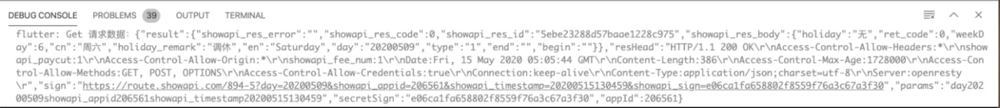
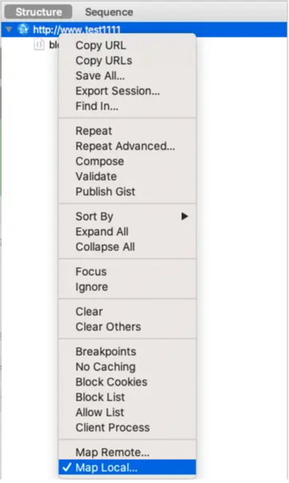
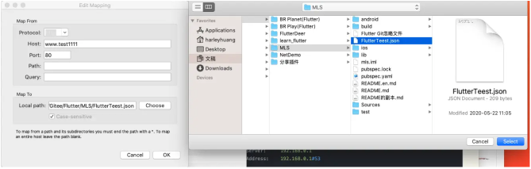
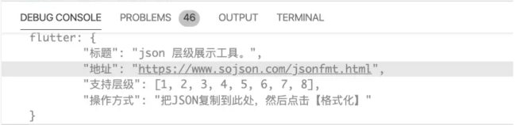
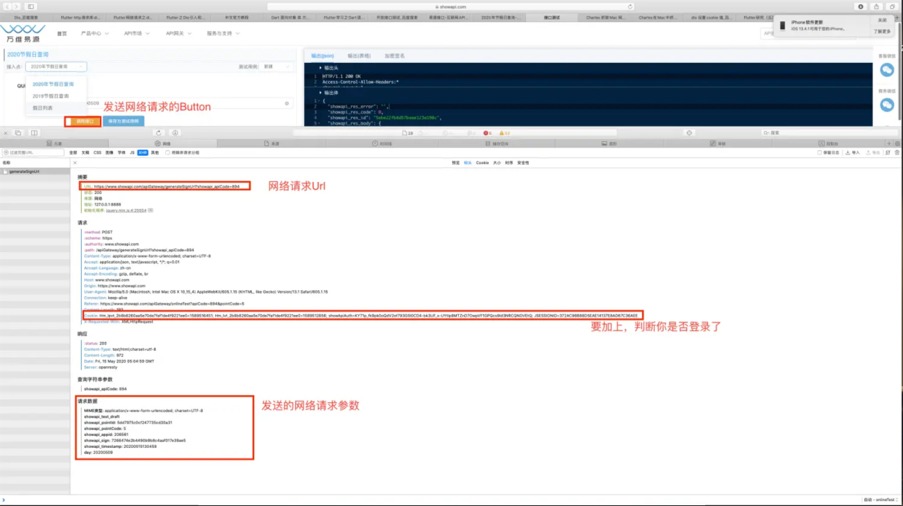

> <h2 id=''></h2>
- [**Dio**](#Dio)
	- [Get请求](#Get请求)
	- [取消请求](#取消请求)
- [Charles抓取Flutter网络请求](#Charles抓取Flutter网络请求)
	- [开源接口网站](#开源接口网站)


<br/><br/>

***
<br/><br/>


> <h1 id='Dio'>Dio</h1>

<br/>

> <h2 id='Get请求'>Get请求</h2>


```
///Get请求
  static getTest() async {
   
    try{
      Response response;
      Dio dio = new Dio();
      Map<String, dynamic> headers = new Map();
      //万维易源：https://www.showapi.com/apiGateway/onlineTest?apiCode=894&pointCode=5
      //cookie: 用来进行判断是否登录了
      headers['Cookie'] = ' Hm_lpvt_2b8b8260aa5e70de7faf1de4f9221ee0=1589516451; Hm_lvt_2b8b8260aa5e70de7faf1de4f9221ee0=1589512856; showApiAuth=KY71p_fk9pk0oQdV2of793G5l0CD4-bk3UF_x-UYtIp8MTZnD7OwpVF1GPQcs9Id3NRCQNOVEtQ; JSESSIONID=372AC98B88D5EAE14137E8AD67C36AEE';
      Options options = new Options(
        headers: headers
      );

      var data={'showapi_pointId':'5dd7975c0cf247735cd30a31', 'showapi_pointCode': '5', 'showapi_appid': '206561', 'showapi_sign': '479562cbc0dea0a2f14e27c661a8e6af', 'showapi_timestamp': '20200515130459', 'day': '20200509'};
      response = await Dio().get(
        "https://www.showapi.com/apiGateway/generateSignUrl?showapi_apiCode=894",
          queryParameters:data,
          options: options
      );
      return print('Get 请求数据：$response');
    }catch(e){
      return print(e);
    }

  }
```

打印：




<br/><br/><br/>

> <h2 id='取消请求'>取消请求</h2>

在 Flutter 中，CancelToken 是由 dio 库提供的，用于取消 Dio 发起的 HTTP 请求。Dio 是一个流行的 Flutter HTTP 客户端库，提供了丰富的功能和良好的性能。以下是关于 Dio 中 CancelToken 的详细说明及示例：

<br/>

**概述：**

CancelToken 在 Dio 中的作用与 Axios 中类似，它允许在请求发出后主动取消该请求。通过创建一个 CancelToken 实例，并将其作为请求配置的一部分传递给 Dio 的请求方法（如 dio.get、dio.post 等）。当需要取消请求时，调用该 CancelToken 实例的 cancel 方法，这将中断正在进行的请求，并触发相应的错误回调。


<br/>

**DEMO:**

```
import 'package:dio/dio.dart';

void main() async {
  final dio = Dio();
  final cancelToken = CancelToken();

  // 发起请求，并传入 CancelToken
  final responseFuture = dio.get(
    'https://api.example.com/data',
    cancelToken: cancelToken,
  );

  // 在某个条件满足时取消请求
  Future.delayed(Duration(seconds: 2), () {
    cancelToken.cancel('Request timed out after 2 seconds.');
  });

  try {
    final response = await responseFuture;
    print('Received response: ${response.data}');
  } on DioError catch (e) {
    if (e.type == DioErrorType.cancel) {
      print('Request was canceled: ${e.message}');
    } else {
      print('Other error occurred: ${e.message}');
    }
  }
}
```
**在这个示例中：**

- 创建了一个 Dio 实例和一个 CancelToken。
- 使用 dio.get 发起请求，并将 cancelToken 传给请求配置。
- 使用 Future.delayed 在 2 秒后模拟一个取消请求的条件，调用 cancelToken.cancel 方法。
- 在 try-catch 块中处理响应或捕获异常。如果捕获到的 DioError 类型为 cancel，则打印出请求被取消的消息。


<br/>
<br/>

> <h2 id=''></h2>


<br/>
<br/>

> <h2 id=''></h2>


<br/>
<br/>

> <h2 id=''></h2>


<br/>
<br/>

> <h2 id=''></h2>


<br/>
<br/>

> <h2 id=''></h2>


<br/>
<br/>

> <h2 id=''></h2>


<br/>
<br/>

> <h2 id=''></h2>


<br/>

***
<br/>
<br/>


> <h1 id='Charles抓取Flutter网络请求'>Charles抓取Flutter网络请求</h1>


&emsp; 不知怎么回事，Charles抓取原生网络请求轻而易举，但是在Flutter就是不行。后来在网上搜了下，知道了大概是不走代理造成的，经过多番尝试终于可以了。

- 查找本机的的`localhost`
  注意必须是本电脑的，乱写的是不可以的，在 Mac 终端输入：
  
```
$ nslookup localhost

//输出：
Server:		192.168.0.1
Address:	192.168.0.1#53

Name:	localhost//这就是我们要的localhost
Address: 127.0.0.1
```


- 使用Flutter的Dio网络请求组件，进行网络请求

```
RaisedButton(onPressed: () async {
          var dio = Dio();
          dio.options.contentType = "text";
          (dio.httpClientAdapter as DefaultHttpClientAdapter).onHttpClientCreate =
              (HttpClient client) {
            client.findProxy = (uri) {
              //proxy all request to localhost:8888
              return "PROXY 127.0.0.1:8888";
            };
            client.badCertificateCallback =
                (X509Certificate cert, String host, int port) => true;
          };
          
          Response<String> response;
          response = await dio.get("http://www.test1111/blog");
          print(response.data);       
          
        },
      child: Text('Charles： Stream'),
   ),
```

- Charles 进行配置

Proxy -> macOS Proxy

- 选择自己映射到的Json文件







- 控制台打印：




<br/>
<br/>


> <h2 id='开源接口网站'>开源接口网站</h2>

&emsp;  [万维易源](https://www.showapi.com)开源接口，当然有的需要收费的。本来想用Charles进行抓取接口，但是发现抓不到。后来通过Safari进行查看网络请求终于可以了。如下图：





<br/>

> <h2 id=''></h2>


