- [**OC知识点(I)**](./../iOS/Objective-C/知识点(I).md)
- [**Swift知识点(I)**](./../iOS/Swift/知识点(I).md)
- [**React知识点**](./../React/React知识点.md)

<br/><br/><br/>

># <h2 id=''>[《Flutter实战·第二版》](https://book.flutterchina.club/)</h2>
- [**原生**](#原生)
	- [如何与iOS和Android通信](#如何与iOS和Android通信)
- [**类**](#类)
	- [函数支持重载吗](#函数支持重载吗)
- [**关键字**](#关键字)
	- [mixin、extends、implement之间的关系?](#mixinextendsimplement之间的关系)
	- [mixin](#mixin)
		- [mixin怎么指定异常类型](#mixin怎么指定异常类型)
- [**Widget组件**](#Widget组件)
	- [状态](#状态)
		- [createState方法什么时候调用?state里为什么可以直接获取到widget对象?](#createState方法什么时候调用?state里为什么可以直接获取到widget对象?)
			- [widget和state的关联是永久的吗](#widget和state的关联是永久的吗)
			- [新widget的创建对旧widget的影响,和state的联系](#新widget的创建对旧widget的影响,和state的联系)
			- [新widget关联到旧的state如何处理](#新widget关联到旧的state如何处理)
	- [StatefulWidget生命周期](#StatefulWidget生命周期)
		- [state所在树与其他2个树的联系](#state所在树与其他2个树的联系)
		- [依赖对象发生什么变化调用didChangeDependencies方法](#依赖对象发生什么变化调用didChangeDependencies方法)
		- [State对象依赖的InheritedWidget发生变化时调用详解读](#State对象依赖的InheritedWidget发生变化时调用详解读)
		- [Builder组件详解](#Builder组件详解)
	- widget频繁更改创建是否会影响性能?复用和更新机制是怎么样的?
	- [widget有几种key](#widget有几种key)
		- [GlobyKey获取widget、state、context](#GlobyKey获取widget、state、context)
		- [什么时候用key](#什么时候用key)
	- [什么是 Widgets、RenderObjects 和 Elements？](#什么是WidgetRenderObjects和Elements)
		- [1).Widget](#1_Widget)
		- [2).Element](#2_Element)
		- [3).RenderObject](#3_RenderObject)
		- [4).三者关系如何](#4_三者关系如何?)
		- [widget和Element什么关系?是一一对应的吗?](#widget和Element什么关系?是一一对应的吗?)
	- [哪三棵树?](#哪三棵树?)
	- [Widget、State、Context的核心概念和是为了解决什么问题?](#WidgetStateContext的核心概念和是为了解决什么问题)
	- [简述StatelessWidget和StatefulWidget两种状态组件类](#简述StatelessWidget和StatefulWidget两种状态组件类)
	- [为什么Navigator可以实现无需上下文路由导航？](#为什么Navigator可以实现无需上下文路由导航)
	- [main()和runApp()函数在flutter的作用分别是什么？有什么关系吗？](#main和runApp函数在flutter的作用分别是什么有什么关系吗)
- [**数据**](#数据)
	- [使用哪几种流行的数据库软件包？](#使用哪几种流行的数据库软件包)
	- [Firebase数据库用途](#Firebase数据库用途)
		- [实时同步的实时应用程序](#实时同步的实时应用程序)
		- [用户身份验证与数据关联](#用户身份验证与数据关联)
		- [应用程序配置和设置](#应用程序配置和设置)
		- [时分析和监控](#时分析和监控)
- [**线程**](#线程)
	- [Dart多任务如何并行的？](#Dart多任务如何并行的)
	- [Stream与Future是什么关系](#Stream与Future是什么关系)
		- [Stream](#Stream)
			- [Stream有哪两种订阅模式？分别是怎么调用的？](#Stream有哪两种订阅模式分别是怎么调用的)
		- [Future](#Future)
	- [Future和Isolate有什么区别](#Future和Isolate有什么区别)
		- [怎么理解Isolate？](#怎么理解Isolate)
		- [isolate是怎么进行通信和实例化的？](#isolate是怎么进行通信和实例化的)
		- [Future和Isolate有什么区别？](#Future和Isolate有什么区别)
		- [简述Flutter的线程管理模型](#简述Flutter的线程管理模型)
	- [await for 如何使用?](#awaitfor如何使用)
- [**底层**](#底层)
	- [Flutter是怎么完成组件渲染的](#Flutter是怎么完成组件渲染的)
	- [简单解释下FrameWork层和Engine层](#简单解释下FrameWork层和Engine层)
	- flutter绘制原理是什么?
	- [简述Flutter的绘制流程](#简述Flutter的绘制流程)
	- [热重载](#热重载)
	- [Provider原理解析](#Provider原理解析)
	- [Provider种类](#Provider种类)
		- [基础Provider](#基础Provider)
		- [ValueListenableProvider](#ValueListenableProvider)
		- [ChangeNotifierProvider](#ChangeNotifierProvider)
		- [StreamProvider](#StreamProvider)
		- [FutureProvider](#FutureProvider)
		- [ListenableProvider](#ListenableProvider)
- [**设计模式**](#设计模式)
	- [管道流-响应式编程](#管道流-响应式编程)
	- [Bloc和MVVM](#Bloc和MVVM)
		- [Bloc模式](#Bloc模式)
		- [MVVM模式](#MVVM模式)
	- [**库**](#库)
		- [flutter_bloc](#flutter_bloc)
			- [Bloc](#Bloc)
			- [BlocBuilder](#BlocBuilder)
			- [BlocProvider](#BlocProvider)
			- [BlocProviderTree](#BlocProviderTree)
		- [flutter_redux](#flutter_redux)
			- 	[flutter_redux几个类作用](#)
		- [FlutterBoost](#FlutterBoost)
- **参考资料**
	- **状态**
		- [状态管理 - 初探与总结](https://juejin.cn/post/6844903842992095240)
	- [flutter_dating_template](https://github.com/meetqy/flutter_dating_template)
	- **设计模式**
		- [Streams和BLoC](https://segmentfault.com/a/1190000016426215)
		- [Steams 和 BLoC 实践范例](https://juejin.cn/post/6844903759642886152)
		- [状态管理探索篇——BLoC(三)](https://juejin.cn/post/6844903689082109960)
		- [基于Bloc框架的封装](https://blog.csdn.net/lizubing1992/article/details/93061005)
		- [状态管理之BLoC的封装](https://juejin.cn/post/6844903710192041998)
		- [使用Provider实现MVVM状态管理架构](https://examplecode.cn/2020/05/09/flutter-provider-mvvm/)
	- **案例**
		- [使用 Flutter for web 构建了 100+ Widget 实时预览示例](https://juejin.cn/post/6844903918410039303)
		- [基于BLoC完整Flutter App项目](https://www.jianshu.com/p/be0107298bc5)
	- **常用库**
		- [BLoc库](https://pub.dev/packages/bloc)
		- [flutter_bloc: ^8.1.2](https://pub.flutter-io.cn/packages/flutter_bloc)
		- [权限管理库permission_handler](https://blog.csdn.net/huchengzhiqiang/article/details/91449640)


<br/>

***
<br/>
<br/>


> <h1 id='原生'>原生</h1>


<br/>

>## <h2 id='如何与iOS和Android通信'>[如何与iOS和Android通信](https://juejin.cn/post/7012903456830652453)</h2>


- **Flutter 通过 PlatformChannel 与原生进行交互，其中 PlatformChannel 分为三种：**

	- 1).BasicMessageChannel：用于传递字符串和半结构化的信息。
		- 使用场景： 适用于简单的、双向的消息传递场景，可以传递任意数据类型。
		- 传递方式： 通过 send 方法发送消息，并通过 Dart 的 setMessageHandler 方法设置消息处理器。可以用于双向通信，Dart 可以向原生发送消息，同时也能接收来自原生的消息。
		- 例子： 用于传递简单的文本消息或其他数据，适合于没有明确的方法调用和回调的场景。

<br/>
在 Flutter 中：

```
// main.dart

import 'package:flutter/material.dart';
import 'package:flutter/services.dart';

void main() {
  runApp(MyApp());
}

class MyApp extends StatelessWidget {
  @override
  Widget build(BuildContext context) {
    return MaterialApp(
      home: MyHomePage(),
    );
  }
}

class MyHomePage extends StatefulWidget {
  @override
  _MyHomePageState createState() => _MyHomePageState();
}

class _MyHomePageState extends State<MyHomePage> {
  final BasicMessageChannel<String> messageChannel =
      BasicMessageChannel<String>('example_channel', StringCodec());

  String nativeResponse = 'Waiting for native response...';

  Future<void> _sendMessageToNative() async {
    try {
      final String reply = await messageChannel.send('Hello from Dart!');
      setState(() {
        nativeResponse = reply;
      });
    } on PlatformException catch (e) {
      setState(() {
        nativeResponse = 'Error: ${e.message}';
      });
    }
  }

  @override
  Widget build(BuildContext context) {
    return Scaffold(
      appBar: AppBar(
        title: Text('BasicMessageChannel Example'),
      ),
      body: Center(
        child: Column(
          mainAxisAlignment: MainAxisAlignment.center,
          children: <Widget>[
            Text(
              'Native Response:',
            ),
            Text(
              '$nativeResponse',
              style: TextStyle(fontWeight: FontWeight.bold),
            ),
            SizedBox(height: 20),
            ElevatedButton(
              onPressed: _sendMessageToNative,
              child: Text('Send Message to Native'),
            ),
          ],
        ),
      ),
    );
  }
}

```	

Swift 中的原生代码：

```
// AppDelegate.swift

import UIKit
import Flutter

@UIApplicationMain
@objc class AppDelegate: FlutterAppDelegate {
  override func application(
    _ application: UIApplication,
    didFinishLaunchingWithOptions launchOptions: [UIApplication.LaunchOptionsKey: Any]?
  ) -> Bool {
    let controller : FlutterViewController = window?.rootViewController as! FlutterViewController
    let messageChannel = FlutterBasicMessageChannel(name: "example_channel", binaryMessenger: controller.binaryMessenger)

    messageChannel.setMessageHandler { (message, reply) in
      // 处理来自 Dart 代码的消息
      print("Received message from Dart: \(message ?? "")")

      // 回复消息给 Dart 代码
      reply("Reply from Swift!")
    }

    GeneratedPluginRegistrant.register(with: self)
    return super.application(application, didFinishLaunchingWithOptions: launchOptions)
  }
}

```
	
<br/>
<br/>
	
- 2).[MethodChannel](https://juejin.cn/post/7012905714418974728/)：用于传递方法调用。Flutter主动调用原生代码的方法，并获取相应的返回值。
	- 使用场景： 适用于进行方法调用和获取返回值的场景。主要用于单向通信，Dart 调用原生方法，获取原生返回值。
	- 传递方式： 使用 invokeMethod 方法调用原生方法，并通过原生代码中的 setMethodCallHandler 方法设置方法处理器，用于处理 Dart 传递过来的方法调用。
	- 例子： 用于执行特定的原生方法，例如获取设备信息、执行原生的计算逻辑等。

<br/>

创建一个MethodChannel用于在Flutter和iOS之间传递数据，触发方法的调用，然后获取结果。

**Flutter端示例代码：**

```
// main.dart

import 'package:flutter/material.dart';
import 'package:flutter/services.dart';

void main() {
  runApp(MyApp());
}

class MyApp extends StatelessWidget {
  @override
  Widget build(BuildContext context) {
    return MaterialApp(
      home: MyHomePage(),
    );
  }
}

class MyHomePage extends StatefulWidget {
  @override
  _MyHomePageState createState() => _MyHomePageState();
}

class _MyHomePageState extends State<MyHomePage> {
  static const platform = const MethodChannel('example_channel');

  String nativeResponse = 'Waiting for native response...';

  Future<void> _callNativeMethod() async {
    try {
	  //使用 MethodChannel 来调用原生 iOS 代码中名为 'getNativeResponse' 的方法
      final String result = await platform.invokeMethod('getNativeResponse');
      setState(() {
        nativeResponse = result;
      });
    } on PlatformException catch (e) {
      setState(() {
        nativeResponse = 'Error: ${e.message}';
      });
    }
  }

  @override
  Widget build(BuildContext context) {
    return Scaffold(
      appBar: AppBar(
        title: Text('MethodChannel Example'),
      ),
      body: Center(
        child: Column(
          mainAxisAlignment: MainAxisAlignment.center,
          children: <Widget>[
            Text(
              'Native Response:',
            ),
            Text(
              '$nativeResponse',
              style: TextStyle(fontWeight: FontWeight.bold),
            ),
            SizedBox(height: 20),
            ElevatedButton(
              onPressed: _callNativeMethod,
              child: Text('Call Native Method'),
            ),
          ],
        ),
      ),
    );
  }
}
```

**iOS端示例代码（Swift）：**

```
// AppDelegate.swift

import UIKit
import Flutter

@UIApplicationMain
@objc class AppDelegate: FlutterAppDelegate {
  override func application(
    _ application: UIApplication,
    didFinishLaunchingWithOptions launchOptions: [UIApplication.LaunchOptionsKey: Any]?
  ) -> Bool {
    let controller : FlutterViewController = window?.rootViewController as! FlutterViewController
    let channel = FlutterMethodChannel(name: "example_channel", binaryMessenger: controller.binaryMessenger)
	
	//通过 channel.setMethodCallHandler 来监听 Flutter 发来的请求，并执行相应的原生逻辑，最后通过 result 返回结果给 Flutter
    channel.setMethodCallHandler { (call, result) in
      if call.method == "getNativeResponse" {
        // 在这里执行原生代码逻辑，例如返回一个字符串
        result("Hello from native Swift code!")
      } else {
        result(FlutterMethodNotImplemented)
      }
    }

    GeneratedPluginRegistrant.register(with: self)
    return super.application(application, didFinishLaunchingWithOptions: launchOptions)
  }
}
```

	
<br/>
<br/>


- 3).EventChannel：用于在Flutter和原生代码之间传递事件流。例如，你可以使用EventChannel实现数据的实时更新。

**Dart 中：**

```
// main.dart

import 'package:flutter/material.dart';
import 'package:flutter/services.dart';

void main() {
  runApp(MyApp());
}

class MyApp extends StatelessWidget {
  @override
  Widget build(BuildContext context) {
    return MaterialApp(
      home: MyHomePage(),
    );
  }
}

class MyHomePage extends StatefulWidget {
  @override
  _MyHomePageState createState() => _MyHomePageState();
}

class _MyHomePageState extends State<MyHomePage> {
  static const eventChannel = const EventChannel('example_event_channel');
  StreamSubscription<dynamic> _eventSubscription;

  String eventMessage = 'Waiting for events...';

  void _startListening() {
    _eventSubscription = eventChannel.receiveBroadcastStream().listen((event) {
      setState(() {
        eventMessage = 'Received event: $event';
      });
    });
  }

  void _stopListening() {
    _eventSubscription.cancel();
    setState(() {
      eventMessage = 'Event listening stopped.';
    });
  }

  @override
  Widget build(BuildContext context) {
    return Scaffold(
      appBar: AppBar(
        title: Text('EventChannel Example'),
      ),
      body: Center(
        child: Column(
          mainAxisAlignment: MainAxisAlignment.center,
          children: <Widget>[
            Text(
              'Event Message:',
            ),
            Text(
              '$eventMessage',
              style: TextStyle(fontWeight: FontWeight.bold),
            ),
            SizedBox(height: 20),
            ElevatedButton(
              onPressed: _startListening,
              child: Text('Start Listening'),
            ),
            ElevatedButton(
              onPressed: _stopListening,
              child: Text('Stop Listening'),
            ),
          ],
        ),
      ),
    );
  }
}
```


Swift 中的原生代码：

```
// AppDelegate.swift

import UIKit
import Flutter

@UIApplicationMain
@objc class AppDelegate: FlutterAppDelegate {
  override func application(
    _ application: UIApplication,
    didFinishLaunchingWithOptions launchOptions: [UIApplication.LaunchOptionsKey: Any]?
  ) -> Bool {
    let controller : FlutterViewController = window?.rootViewController as! FlutterViewController
    let eventChannel = FlutterEventChannel(name: "example_event_channel", binaryMessenger: controller.binaryMessenger)

	//置一个 StreamHandler 来处理事件流的监听和取消监听
    eventChannel.setStreamHandler(StreamHandler())

    GeneratedPluginRegistrant.register(with: self)
    return super.application(application, didFinishLaunchingWithOptions: launchOptions)
  }
}

class StreamHandler: NSObject, FlutterStreamHandler {
  var eventStream: FlutterEventSink?

  func onListen(withArguments arguments: Any?, eventSink events: @escaping FlutterEventSink) -> FlutterError? {
    // 在这里设置事件流的回调
    eventStream = events
    return nil
  }

  func onCancel(withArguments arguments: Any?) -> FlutterError? {
    // 在这里处理取消监听的逻辑
    eventStream = nil
    return nil
  }
}

```


<br/>
<br/>

> <h2 id=''></h2>

<br/>
<br/>

> <h2 id=''></h2>

<br/>
<br/>

> <h2 id=''></h2>

<br/>


<br/>

***
<br/>
<br/>


> <h1 id='类'>类</h1>


<br/>
<br/>


> <h2 id='函数支持重载吗'>函数支持重载吗</h2>

Dart中函数是不支持重载的,原因请看下面:

<br/>


我们可以使用反证法，假设dart支持函数重载，那么可能就会有以下这段代码:

```
class IllegalCode {
  overloaded(num data) {
  }
  overloaded(List data){//假设支持函数重载，实际上这是非法的
  }
}

main() {
    var data1 = 100; 
    var data2 = ["100"];
    //由于dart中的类型是可选的，以下函数调用，根本就无法分辨下面代码实际上调用哪个overloaded函数。
    overloaded(data1);
    overloaded(data2);
}
```

个人一些想法，如果仅从可选类型角度去考虑的话，实际上dart现在是可以支持基于类型的函数重载的，因为Dart有类型推导功能。如果dart能够推导出上述data1和data2类型，那么就可以根据推导出的类型去匹配重载的函数。Kotlin就是这样做的，以Kotlin为例:


```
fun overloaded(data: Int) {
    //....
}
fun overloaded(data: List<String>) {
   //....
}
fun main(args: Array<String>) {
    val data1 = 100 //这里Kotlin也是采用类型推导为Int
    val data2 = listOf("100")//这里Kotlin也是采用类型推导为List<String>
    //所以以下重载函数的调用在Kotlin中是合理的
    overloaded(data1)
    overloaded(data2)
}
```


<br/><br/>

>## <h2 id='函数里的参数是值传递还是引用传递'>[函数里的参数是值传递还是引用传递](https://juejin.cn/post/6931340267324702733#heading-8)</h2>

这要分情况,当参数是一个对象的实例时时引用传递,当是一个值类型时是值传递.


- **值传递和引用传递区别:**
	- 值传递（pass by value）是指在调用函数时将实际参数复制一份传递到函数中，这样在函数中如果对参数进行修改，将不会影响到实际参数。
	
	- 引用传递（pass by reference）是指在调用函数时将实际参数的地址直接传递到函数中，那么在函数中对参数所进行的修改，将影响到实际参数。


<br/>

***
<br/>
<br/>


> <h1 id='关键字'>关键字</h1>


<br/>

> <h2 id='mixinextendsimplement之间的关系'>mixin、extends、implement之间的关系?</h2>


- 继承（关键字 extends）、混入 mixins （关键字 with）、接口实现（关键字 implements）。这三者可以同时存在，前后顺序是extends -> mixins -> implements。

- Flutter中的继承是单继承，子类重写超类的方法要加@Override，子类调用超类的方法要用super。

- 在Flutter中，Mixins是一种在多个类层次结构中复用类代码的方法。mixins的对象是类，mixins绝不是继承，也不是接口，而是一种全新的特性，可以mixins多个类，mixins的使用需要满足一定条件。

- 如果有一个类 A,你想让类B拥有A的API，但又不想拥有A里的实现，那么你就应该把A当做接口，类B implements 类A.


<br/>
<br/>


> <h2 id='mixin'>mixin</h2>


首先mixin是一个定义类的关键字。直译出来是混入，混合的意思 Dart为了支持多重继承，引入了mixin关键字，它最大的特殊处在于： mixin定义的类不能有构造方法，这样可以避免继承多个类而产生的父类构造方法冲突


<br/>

- **使用mixins的条件：**

	- mixins类只能继承自object
	- mixins类不能有构造函数
	- 一个类可以mixins多个mixins类
	- 可以mixins多个类，不破坏Flutter的单继承

<br/>
<br/>


> <h3 id='mixin怎么指定异常类型'>mixin 怎么指定异常类型?</h3>


on 一个类：

```
class A {
  void a(){
    print("a");
  }
}


mixin X on A{
  void x(){
    print("x");
  }
}


class mixinsX extends A with X{
}
```

on 的是一个接口： 得首先实现这个接口，然后再用mix

```
class A {
  void a(){
    print("a");
  }
}

mixin X on A{
  void x(){
    print("x");
  }
}

class implA implements A{
  @override
  void a() {}
}

class mixinsX2 extends implA with X{
}
```


<br/>
<br/>


> <h2 id=''></h2>


<br/>
<br/>


> <h2 id=''></h2>


<br/>
<br/>


> <h2 id=''></h2>


<br/>
<br/>


> <h2 id=''></h2>


<br/>
<br/>


> <h2 id=''></h2>


<br/>
<br/>


> <h2 id=''></h2>


<br/>
<br/>


> <h2 id=''></h2>


<br/>
<br/>


> <h2 id=''></h2>


<br/>

***
<br/>
<br/>


> <h1 id='状态'>状态</h1>


<br/>


<br/>
<br/>


> <h2 id=''></h2>


<br/>
<br/>


> <h2 id=''></h2>


<br/>
<br/>


> <h2 id=''></h2>


<br/>
<br/>


> <h2 id=''></h2>


<br/>
<br/>


> <h2 id=''></h2>


<br/>
<br/>


> <h2 id=''></h2>


<br/>

***
<br/>
<br/>


> <h1 id='Widget组件'>Widget组件</h1>


&emsp; 在 Flutter 中，Widget 可以类比iOS的UIView ，你可以把它理解为“声明和构造 UI 的方法”，但它们又并非完全相同：

- 首先，widget 拥有着不同的生命周期： 整个生命周期内它是不可变的，且只能够存活到被修改的时候。一旦 widget 实例或者它的状态发生了改变， Flutter 框架就会创建一个新的由 Widget 实例构造而成的树状结构。
- 而在 iOS 里，修改一个视图并不会导致它重新创建实例，它作为一个可变对象，只会绘制一次，只有调用 setNeedsDisplay() 之后才会发生重绘。


<br/><br/>


> <h2 id='状态'>状态</h2>


<br/><br/>

> <h2 id='createState方法什么时候调用?state里为什么可以直接获取到widget对象?'>createState方法什么时候调用?state里为什么可以直接获取到widget对象?</h2>


<br/>


**问2:state里为什么可以直接获取到widget对象?**

因为widget是state的一个属性,你说它能不能获取到! 问这个问题,说明你的基础很差啊!

<br/>

来!来!给你科普一下:


- **State 中有两个常用属性：**

	- **widget:** 它表示与该 State 实例关联的 widget 实例，由Flutter 框架动态设置。
		- 注意，这种关联并非永久的，因为在应用生命周期中，UI树上的某一个节点的 widget 实例在重新构建时可能会变化，
		- 但State实例只会在第一次插入到树中时被创建，当在重新构建时，如果 widget 被修改了，Flutter 框架会动态设置State. widget 为新的 widget 实例。
		- 用途： 表示当前关联的StatefulWidget对象;
		- 例子： 你可以通过widget属性访问与当前State对象关联的StatefulWidget的属性
	
	- **context:** StatefulWidget对应的 BuildContext，作用同StatelessWidget 的BuildContext;
		- 用途： 表示BuildContext对象，提供了关于控件在树中位置的信息;
		- 例子： 在许多方法中，你需要使用context对象执行一些操作，如获取主题、定位父级控件等;

	- **mounted：**
		- 用途： 表示当前的State对象是否已经插入到控件树中。
		- 例子： 可以使用mounted属性检查State对象是否仍然有效，防止在控件被移除后访问已经被释放的State。


<br/>
<br/>

<br/><br/>

> <h2 id='widget和state的关联是永久的吗'>widget和state的关联是永久的吗</h2>


**疑问1:** widget和state的关联是永久的吗? 若不是为什么? 

&emsp; 不，Widget和State的关联并不是永久的。在Flutter中，Widget表示的是控件的配置信息，而State表示的是控件的状态和可变数据。一个Widget可以有一个或多个关联的State对象，但是这种关联是有生命周期的。

&emsp; 当你创建一个StatefulWidget时，Flutter框架会调用createState方法，这个方法会返回一个State对象，然后将这个State对象与相应的Widget关联起来。这个关联过程发生在控件被插入到控件树时。当控件从控件树中被移除时，相应的State对象会被销毁，这也就意味着Widget和State的关联并不是永久的。

&emsp; 原因主要是为了优化内存使用和提高性能。如果Widget和State的关联是永久的，那么当大量的控件被创建并插入到控件树中时，它们关联的State对象也会一直存在，占用大量内存。通过在不需要时销毁State对象，Flutter可以更好地管理内存，确保只有当前可见的控件及其状态被保留在内存中。

&emsp;这也是为什么在Flutter中，我们通常将可变的状态信息放在State中，而将不变的配置信息放在Widget中，以便在State对象被销毁时不丢失重要的数据。


<br/>
<br/>


<br/><br/>

> <h2 id='新widget的创建对旧widget的影响,和state的联系'>新widget的创建对旧widget的影响,和state的联系</h2>


**疑问2:** 当widget创建时state会与这个widget进行关联,当widget重新构建时和修改配置时,这个旧的widget会销毁还是复用? 那之前与旧的关联的state是销毁还是如何处理?

&emsp; 在Flutter中，与旧的Widget关联的State对象不会被直接销毁，而是可能会被重新关联到新的Widget实例上。Flutter框架在执行build方法时会比较新旧Widget树的差异，然后决定是否创建新的State对象或者复用旧的State对象。

&emsp; **如果新旧Widget实例的运行时类型相同**，Flutter通常会尝试将旧的State对象与新的Widget实例进行关联，而不是销毁和重新创建一个新的State对象。这种情况下，didUpdateWidget生命周期方法会被调用，允许State对象适应新的Widget实例。这样做是为了尽量保留一些不变的状态，避免不必要的重新创建和初始化，以提高性能。

&emsp; 但是，**如果新旧Widget实例的类型不同**（例如，它们的类型不是相同的runtimeType），那么旧的State对象可能会被销毁，而新的State对象会与新的Widget实例关联。

&emsp; 总的来说，State对象可能会被重新关联到新的Widget实例上，而不是直接销毁。这种复用机制有助于在UI更新时保留一些状态，减少不必要的重建开销。


<br/>
<br/>

<br/><br/>

> <h2 id='新widget关联到旧的state如何处理'>新widget关联到旧的state如何处理</h2>


**疑问3:** 新widget关联到旧的state是Flutter自动处理吗? 在哪个方法呢


&emsp; 是的，新的 Widget 关联到旧的 State 是由 Flutter 框架自动处理的。这个过程发生在 State 对象的 didUpdateWidget 生命周期方法中。当新的 Widget 实例被传递给 build 方法时，Flutter 框架会调用 didUpdateWidget 方法，以通知 State 对象发生了变化。

&emsp; 在 didUpdateWidget 方法中，你可以比较新旧 Widget 实例的一些属性，并根据需要更新 State 对象的状态。这个方法的签名如下：


```
void didUpdateWidget(covariant T oldWidget) {
  // 在这里处理新旧 Widget 之间的差异
  super.didUpdateWidget(oldWidget);
}
```


&emsp; 在这个方法中，oldWidget 参数表示旧的 Widget 实例。你可以通过比较 oldWidget 和 widget 属性来了解新旧 Widget 实例之间的差异，并相应地更新 State 对象的状态。

&emsp; 这种自动处理的机制使得在 UI 变化时能够在保持性能的同时，让开发者有机会处理一些状态的更新逻辑。


<br/>
<br/>


> <h2 id='StatefulWidget生命周期'>StatefulWidget生命周期</h2>

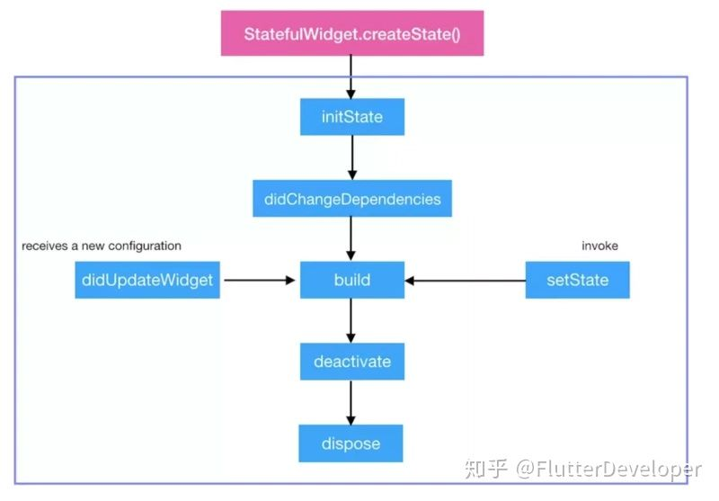


- **createState：**
	- 作用： 用于创建与 StatefulWidget 关联的 State 对象。
	- 调用时机： 当创建新的 StatefulWidget 时，会调用这个方法一次

<br/>

- **initState()**：Widget 初始化当前 State，在当前方法中是不能获取到 Context 的.如想获取，可以试试 Future.delayed().
	- 作用： 在 State 对象被插入到树中时调用，用于初始化状态。
	- 调用时机： 在 createState 返回的 State 对象被插入到控件树中时调用，通常在这里执行一些初始化操作，例如订阅数据、设置初始状态等。

<br/>

- **didChangeDependencies()：**
	- 作用： 在 initState 之后调用，在 State 对象依赖的对象发生变化时调用。
	- 调用时机： 当 State 对象依赖的 InheritedWidget 发生变化时调用。

<br/>

- **build：**
	- 作用： 构建控件的UI表示，返回一个 Widget。
	- 调用时机： 在 initState 和 didChangeDependencies 之后，以及每次调用 setState 后都会调用。

<br/>

- **deactivate()：** 当 State 被暂时从视图树中移除时会调用这个方法，页面切换时也会调用该方法，和Android里的 onPause 差不多。
	- 作用： 当 State 对象从树中移除时调用，通常在这里释放一些资源。
	- 调用时机： 当控件从控件树中被移除时调用，例如切换页面。

<br/>

- **dispose()：** Widget 销毁时调用。
	- 作用： 在 State 对象被永久从树中移除时调用，通常在这里释放一些资源。
	- 调用时机： 当 State 对象永久从控件树中被移除时调用，例如页面销毁时。
dart

<br/>

- **didUpdateWidget**：Widget 状态发生变化的时候调用。
	- 作用： 在 Widget 配置发生变化时调用，可以比较新旧 Widget 的属性，执行相应的更新操作。
	- 调用时机： 在 build 方法之后，如果新旧 Widget 不同，会调用这个方法。
dart

<br/>

- **setState：**
	- 作用： 用于通知框架，State 对象的状态发生了变化，需要重新构建UI。
	- 调用时机： 在 State 对象中调用 setState 方法时。


<br/><br/>

> <h2 id='state所在树与其他2个树的联系'>state所在树与其他2个树的联系</h2>


**疑问1:** 将State 对象被插入到树中时调用`initState()`方法,这个树与其他2棵树有什么区别和联系吗?

- **2棵树概念:**
	- widget树：
		- 概念： Widget树是由Widget对象构成的层次结构，它描述了应用程序的UI布局和外观。
		- 作用： Widget树是静态的，用于描述界面的结构。每个Widget都可以包含其他Widget，形成一个嵌套的结构。这个树表示了UI的层次结构和组织方式。
		
	- Element树：
		- 概念： Element树是由Element对象构成的层次结构，它对应于Widget树的实际渲染层次。
		- 作用： Element树是动态的，与Widget树相对应。当Widget树中的某个Widget发生变化时，相应的Element树会进行更新。Element负责实际的渲染、布局和管理状态。Element树实现了对Widget树的优化，只构建和更新实际显示的部分，以提高性能。


**Widget树和Element树的区别：**

&emsp;  Widget树是静态的，用于描述应用程序的UI结构；而Element树是动态的，用于实际的渲染和布局。Widget树和Element树是相互对应的，但Element树更加底层，负责实际的渲染和状态管理。


<br/>

回到我的问题:

**State对象什么时候插入到树中？**

&emsp; 当一个StatefulWidget被插入到Widget树中时，相应的State对象被创建并与这个Widget关联。这个插入过程通常发生在Widget树中的一个父级Widget调用build方法时，而该方法中包含了对子Widget的构建。当新的Widget被创建并插入到Widget树时，相应的State对象也被创建。

<br/>

**这个树指的是什么树？**

&emsp; 在这里，"树"通常指的是Widget树。Widget树表示了Flutter应用程序的UI层次结构，由各种嵌套的Widget对象组成。


<br/>

**这个控件树与其他2棵树有什么区别和联系吗？**

&emsp; Widget树和Element树的区别： Widget树是静态的，用于描述应用程序的UI结构；而Element树是动态的，用于实际的渲染和布局。Widget树和Element树是相互对应的，但Element树更加底层，负责实际的渲染和状态管理。


<br/><br/>

> <h2 id='依赖对象发生什么变化调用didChangeDependencies方法'>依赖对象发生什么变化调用didChangeDependencies方法</h2>


&emsp; didChangeDependencies()方法是State生命周期中的一个回调，当依赖的对象发生变化时会被调用。在Flutter中，依赖的对象通常指的是BuildContext。

&emsp; BuildContext表示了控件树中的位置信息，包含了一些关于控件树结构的元数据。而它的变化通常指的是在控件树中发生了结构性的变化，例如父级Widget的重建、新的路由页面的推入等。

&emsp; 当State对象依赖的BuildContext发生变化时，didChangeDependencies()方法就会被触发。


```
import 'package:flutter/material.dart';

class ExampleWidget extends StatefulWidget {
  @override
  _ExampleWidgetState createState() => _ExampleWidgetState();
}

class _ExampleWidgetState extends State<ExampleWidget> {
  @override
  void didChangeDependencies() {
    super.didChangeDependencies();
    
    // 当BuildContext发生变化时，此方法会被调用(在这里处理依赖对象变化时的逻辑)
    print("Dependencies have changed");
  }

  @override
  Widget build(BuildContext context) {
    return Scaffold(
      appBar: AppBar(
        title: Text('Example Widget'),
      ),
      body: Center(
        child: Column(
          mainAxisAlignment: MainAxisAlignment.center,
          children: <Widget>[
            Text('This is an example widget.'),
            ElevatedButton(
              onPressed: () {
                // 在按钮点击时，推入新的路由页面
                Navigator.of(context).push(
                  MaterialPageRoute(
                    builder: (context) => NewPage(),
                  ),
                );
              },
              child: Text('Push to New Page'),
            ),
          ],
        ),
      ),
    );
  }
}


class NewPage extends StatelessWidget {
  @override
  Widget build(BuildContext context) {
    return Scaffold(
      appBar: AppBar(
        title: Text('New Page'),
      ),
      body: Center(
        child: Text('This is a new page.'),
      ),
    );
  }
}

void main() {
  runApp(MaterialApp(
    home: ExampleWidget(),
  ));
}
```

&emsp; 在上面的例子中，didChangeDependencies()方法被重写。当从ExampleWidget页面切换到NewPage页面时，它会被调用，因为此时BuildContext发生了变化。你可以在这个方法中执行一些逻辑，例如获取最新的依赖信息或执行与全局状态相关的更新。

&emsp; didChangeDependencies()这个方法会在State对象被插入到树中，并且在依赖的BuildContext对象发生变化时被调用。一种常见的情况是，当BuildContext所在的位置发生变化，例如父级Widget被重新构建，didChangeDependencies()就会被调用。


&emsp; 在这个例子中有一个包含两个页面的简单Flutter应用。初始页面是ExampleWidget，当用户点击按钮时，会推入一个新的页面NewPage。每当从一个页面切换到另一个页面时，都会发生BuildContext的变化，因为每个页面都有不同的BuildContext。


<br/>

&emsp; 上面依赖对象BuildContext的变化指的是Navigator将新页面推入导航堆栈时，它引入了一组新的小部件，因此为该页面创建了一个新的BuildContext。小部件树结构的这种变化会触发相应State对象中的didChangeDependencies()方法。


&emsp; 在提供的示例中，当用户点击按钮时，触发Navigator.of(context).push(...)方法，将一个新页面（NewPage）推入导航堆栈。这个操作为NewPage的小部件创建了一个新的BuildContext。因此，由于小部件树的结构发生了变化，与_ExampleWidgetState相关联的BuildContext发生了变化，导致调用了_ExampleWidgetState中的didChangeDependencies()方法。


<br/><br/>


> <h2 id='State对象依赖的InheritedWidget发生变化时调用详解读'>State象依赖的InheritedWidget发生变化时调用详解读</h2>

**在 didChangeDependencies中 `State 对象依赖的 InheritedWidget 发生变化时调用?` 什么意思? 可以详细说下吗? 可以举一个完整详细的例子代码吗?**


在 Flutter 中，当 State 对象依赖的 InheritedWidget 发生变化时，会触发 didChangeDependencies() 方法的调用。这意味着 InheritedWidget 提供的共享数据发生了变化，而依赖这些数据的 State 对象需要执行一些操作以适应这些变化。

下面是一个例子，演示了如何在 didChangeDependencies() 中响应 InheritedWidget 的变化：

```
import 'package:flutter/material.dart';

// 定义一个 InheritedWidget
class CounterInheritedWidget extends InheritedWidget {
  final int counter;
  final VoidCallback? onCounterChange;

  CounterInheritedWidget({
    required this.counter,
    required Widget child,
    this.onCounterChange,
  }) : super(child: child);

  // 通过该方法获取最近的 Widget 树中的 CounterInheritedWidget 实例
  static CounterInheritedWidget of(BuildContext context) {
    return context.dependOnInheritedWidgetOfExactType<CounterInheritedWidget>()!;
  }

  @override
  bool updateShouldNotify(covariant CounterInheritedWidget oldWidget) {
    return oldWidget.counter != counter;
  }

  // 用于更新计数器的方法
  void updateCounter(int newCounter) {
    if (onCounterChange != null) {
      onCounterChange!();
    }
  }
}

class ExampleWidget extends StatefulWidget {
  @override
  _ExampleWidgetState createState() => _ExampleWidgetState();
}

class _ExampleWidgetState extends State<ExampleWidget> {
  @override
  Widget build(BuildContext context) {
    return Scaffold(
      appBar: AppBar(
        title: Text('Example Widget'),
      ),
      body: Center(
        child: Column(
          mainAxisAlignment: MainAxisAlignment.center,
          children: <Widget>[
            Text('This is an example widget.'),
            // 使用 CounterInheritedWidget 来获取和显示计数器的值
            Builder(
              builder: (context) {
                final counterInheritedWidget =
                    CounterInheritedWidget.of(context);
                return Text(
                  'Counter value from InheritedWidget: ${counterInheritedWidget.counter}',
                );
              },
            ),
            ElevatedButton(
              onPressed: () {
                // 模拟更新计数器的值
                final counterInheritedWidget =
                    CounterInheritedWidget.of(context);
                counterInheritedWidget.updateCounter(
                    counterInheritedWidget.counter + 1);
              },
              child: Text('Increment Counter'),
            ),
          ],
        ),
      ),
    );
  }
}

void main() {
  runApp(
    // 使用 CounterInheritedWidget 包裹整个应用
    CounterInheritedWidget(
      counter: 42,
      onCounterChange: () {
        // 这里可以执行在计数器变化时的逻辑
        print('Counter changed!');
      },
      child: MaterialApp(
        home: ExampleWidget(),
      ),
    ),
  );
}

```

&emsp; 在这个例子中，我们创建了 CounterInheritedWidget，用于传递和更新计数器的值。ExampleWidget 中的 Text 小部件通过 CounterInheritedWidget.of(context) 获取最近的 CounterInheritedWidget 实例，并显示计数器的值。点击按钮时，通过 CounterInheritedWidget 的 updateCounter 方法模拟更新计数器的值。这时，didChangeDependencies() 就会被调用，你可以在这个方法中执行相应的逻辑。


<br/>

**疑问1:当CounterInheritedWidget的counter改变时, _ExampleWidgetState 的build 方法中的组件Text的显示值会改变,那ExmpleWidget会销毁然后重新构建吗**


&emsp; 在上述的例子中，当 CounterInheritedWidget 的 counter 改变时，_ExampleWidgetState 中的 build 方法会重新执行，但 ExampleWidget 本身不会销毁和重新构建。这是因为 ExampleWidget 是一个 StatefulWidget，而其对应的 State 对象 _ExampleWidgetState 中的 build 方法会被调用，而不是 ExampleWidget 本身。

&emsp; 当 CounterInheritedWidget 中的 counter 发生变化时，CounterInheritedWidget 会通知依赖它的子孙节点进行更新。在这里，Builder 包裹的 Text 小部件是依赖 CounterInheritedWidget 的，因此 Builder 中的 build 方法会被重新执行，显示新的计数器值。

**总结一下：**

- CounterInheritedWidget 中的 updateShouldNotify 返回 true 时，依赖它的子孙节点会被通知更新。
- 在 ExampleWidget 中，通过 Builder 包裹的 Text 小部件是依赖 CounterInheritedWidget 的。
- 当 CounterInheritedWidget 的 counter 改变时，Builder 中的 build 方法会被重新执行，显示新的计数器值。
- ExampleWidget 本身不会被销毁和重新构建，只有与 CounterInheritedWidget 直接关联的 State 对象 _ExampleWidgetState 中的 build 方法会被调用。


<br/><br/>


> <h2 id='Builder组件详解'>Builder组件详解</h2>


对上述代码进行片段摘抄:
```
class _ExampleWidgetState extends State<ExampleWidget> {
  @override
  Widget build(BuildContext context) {
    return Scaffold(
      appBar: AppBar(
        title: Text('Example Widget'),
      ),
      body: Center(
        child: Column(
          mainAxisAlignment: MainAxisAlignment.center,
          children: <Widget>[
            Text('This is an example widget.'),
            // 使用 CounterInheritedWidget 来获取和显示计数器的值
            Builder(
              builder: (context) {
                final counterInheritedWidget =
                    CounterInheritedWidget.of(context);
                return Text(
                  'Counter value from InheritedWidget: ${counterInheritedWidget.counter}',
                );
              },
            ),
            ElevatedButton(
              onPressed: () {
                // 模拟更新计数器的值
                //class CounterInheritedWidget extends InheritedWidget {}
                final counterInheritedWidget =
                    CounterInheritedWidget.of(context);
                counterInheritedWidget.updateCounter(
                    counterInheritedWidget.counter + 1);
              },
              child: Text('Increment Counter'),
            ),
          ],
        ),
      ),
    );
  }
}
````

<br/>

在代码中会出现:

```
Builder(
	builder: (context) {
			return Text('你好!!!!');
		}
);
```

这个Builder是干嘛的?有什么用?还有哪些构造参数分别有什么用?

这个builder: (context) {}中的context指的是什么?


<br/>


&emsp; Builder 是 Flutter 中的一个小部件，它的主要作用是创建一个新的 BuildContext，以便在子树中使用。通常，Builder 会用来创建一个新的作用域，以解决某些特定情况下，需要使用不同的 BuildContext 的问题。

&emsp; 在上述的代码中，Builder 主要用于获取一个新的 BuildContext，以便在其中使用 CounterInheritedWidget.of(context) 获取最近的 CounterInheritedWidget 实例。这样做的目的是为了在 Text 小部件中获取 CounterInheritedWidget 的数据而不是在 ExampleWidget 直接获取。这确保了在依赖发生变化时，只有 Text 小部件会被重新构建，而不是整个 ExampleWidget。


&emsp; Builder 的构造函数签名如下：

```
Builder({
  Key? key,
  required WidgetBuilder builder,
})
```

- **其中：**
	- key： 用于标识小部件的可选键。
	- builder： 一个必须的回调函数，它接受一个 BuildContext 参数，返回一个 Widget。这个函数定义了 Builder 小部件的子树。


&emsp; 在 builder 方法中的 context 指的是由 Builder 创建的新的 BuildContext。这个新的 BuildContext 是在构建小部件树时传递给 builder 方法的，它是一个具有新的作用域的 BuildContext 实例。在这里，context 主要用于获取 CounterInheritedWidget 实例，以便在子树中使用共享的计数器值。


<br/>
<br/>
<br/>


># <h2 id='widget有几种key'>[widget有几种key](https://space.bilibili.com/589533168/channel/seriesdetail?sid=381997)</h2>


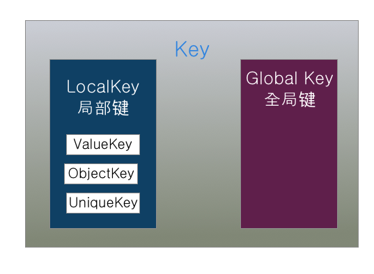

<br/>
<br/>


- **主要有2种类型的Key：**
	- GlobalKey（确保生成的Key在整个应用中唯一，是很昂贵的，允许element在树周围移动或变更父节点而不会丢失状态）
	- LocalKey(包含下面3种)
		- UniqueKey
		- ObjectKey
		- valueKey


&emsp; 在flutter中，每个widget都是被唯一标识的。这个唯一标识在build或rendering阶段由框架定义。该标识对应于可选的Key参数，如果省略，Flutter将会自动生成一个。


<br/>

&emsp; 当然key对于有状态的组件有意义,对与无状态的组件没有意义,这是为什呢?

&emsp; 这是因为widget只是一种配置,不会改变,加不加key它都不会改变.widget对应的renderObject是其要渲染到屏幕上的实例,每一个renderObject组成了一颗树,每一个renderObject都带着一个state.这个state对应状态的改变,key标识着一个widget用来区分的.若是都相同key或者没有key在同一级别相同组件类型是无法区分的.

&emsp; 在区分时,同一级别是先区分widge类型,比如若都是Text则再区分key.若不是同一类型的,则区分key意义不大

&emsp; 在LocalKey中是用在同级别中的,比如如下的树🀄️,我用一个json字典表示:

```
{
	A:{
		a1,
		a2,
		a3,
	},
	B,
	C,
}
```

&emsp; a1, a2, a3 表示同一级别相同类型的,若是不加key当对他们3者设置不同的颜色,然后在对它进行调转颜色可能颜色变了,里面的文本不变(我记得不太清了),是因为比较是发现都是同一类型的,key都相同(因为没有设值,认为都统一),所以这个时候设置key.


<br/><br/><br/>

> <h2 id='GlobyKey获取widget、state、context'>GlobyKey获取widget、state、context</h2>

&emsp; 而针对GlobyKey它可以游走于不同级别的组件,比如他在A、B、C中的任意一个或者是其子组件中的一个.通过这个GlobyKey我们可以获取到其状态组件的widget、state、context.通过这个context可以拿到其大小,但是这个GlobKey有点耗性能,建议少用!除此之外用这个Globy通过设置Row或者Clomun可以巧妙达到横竖屏幕的作用.

<br/>

**1.通过 Key 获取 Widget 和 State**

```
import 'package:flutter/material.dart';

class MyWidget extends StatefulWidget {
  final Key? myKey;

  MyWidget({Key? key, this.myKey}) : super(key: key);

  @override
  _MyWidgetState createState() => _MyWidgetState();
}

class _MyWidgetState extends State<MyWidget> {
  @override
  Widget build(BuildContext context) {
    return Container(
      child: Text('My Widget State'),
    );
  }
}

void main() {
  GlobalKey<_MyWidgetState> myKey = GlobalKey<_MyWidgetState>();

  runApp(
    MaterialApp(
      home: Scaffold(
        body: Column(
          children: [
            MyWidget(key: myKey),
            ElevatedButton(
              onPressed: () {
                // 通过 GlobalKey 获取 Widget
                MyWidget? widgetByKey = myKey.currentWidget;

                // 通过 GlobalKey 获取 State
                _MyWidgetState? stateByKey = myKey.currentState;

                // 输出 Widget 和 State 信息
                print('Widget by Key: $widgetByKey');
                print('State by Key: $stateByKey');
              },
              child: Text('Get Widget and State by Key'),
            ),
          ],
        ),
      ),
    ),
  );
}
```

&emsp; 通过 GlobalKey 来创建一个 Key，并将其传递给 MyWidget。然后，通过 myKey.currentWidget 可以获取与该 key 关联的 Widget 对象，通过 myKey.currentState 可以获取与该 key 关联的 State 对象


<br/>
<br/>

**2.Key 获取 BuildContext**

在 Flutter 中，通常情况下是通过 BuildContext 直接传递上下文的，而不是通过 Key。 BuildContext 表示的是在小部件树中的位置和作用域，而 Key 主要用于标识和检索特定的小部件或状态。

```
GlobalKey<_MyWidgetState> myKey = GlobalKey<_MyWidgetState>();
// 通过 Key 获取 BuildContext
BuildContext? contextByKey = myKey?.currentContext;

// 输出 BuildContext 信息
print('Context by Key: $contextByKey');

// 通过 BuildContext 可以做一些操作，例如获取 Theme
ThemeData? theme = Theme.of(context);
print('Theme data: $theme');
```


<br/>
<br/>

> <h3 id='什么时候用key'>什么时候用key</h3>


- **ValueKey**是先比较类型,然后比较其值,源码如下:

```
@override
  bool operator ==(Object other) {
    if (other.runtimeType != runtimeType)
      return false;
    return other is ValueKey<T>
        && other.value == value;
  }
```


例如: ValueKey如果您有一个 Todo List应用程序，它将会记录你需要完成的事情。我们假设每个 Todo事情都各不相同，而你想要对每个 Todo 进行滑动删除操作

```
return TodoItem(
    key: ValueKey("value1Name"),
    todo: todo,
    onDismissed: (direction){
        _removeTodo(context, todo);
    },
);
```


<br/>


- ObjectKey先比较类型，当类型不一致，判定为不是同一个对象.如果另外一个也是ObjectKey,则判断地址是否相同，只有地址相同才判定为同一个对象

```
@override
  bool operator ==(Object other) {
    if (other.runtimeType != runtimeType)
      return false;
    return other is ObjectKey
        && identical(other.value, value);
  }
```


例如: 如果你有一个生日应用，它可以记录某个人的生日，并用列表显示出来，同样的还是需要有一个滑动删除操作。我们知道人名可能会重复，这时候你无法保证给 Key 的值每次都会不同。但是，当人名和生日组合起来的 Object 将具有唯一性。这时候你需要使用 ObjectKey！官方显示比较类型，当类型不一致，判定为不是通过一个对象，如果另外一个也是ObjectKey,则判断地址是否相同，只有地址相同才判定为同一个对象。

```
@override
  bool operator ==(Object other) {
    if (other.runtimeType != runtimeType)
      return false;
    return other is ObjectKey
        && identical(other.value, value);
  }
```


<br/>

- 每次生成不同的值，当我们每次刷新都需要一个新的值，那么正是这个存在的意义。

我们每次刷新就生成一个新的 颜色，并且渐隐渐显效果。

```
AnimatedSwitcher(
  duration: Duration(milliseconds: 1000),
  child: Container(
    key: UniqueKey(),
    height: 100,
    width: 100,
    color: Colors.primaries[count % Colors.primaries.length],
  ),
)
```


如果组合的 Object 都无法满足唯一性的时候，你想要确保每一个 Key 都具有唯一性。那么，你可以使用UniqueKey。它将会通过该对象生成一个具有唯一性的 hash 码。不过这样做，每次 Widget 被构建时都会去重新生成一个新的 UniqueKey，失去了一致性。也就是说你的小部件还是会改变。（还不如不用😂）


<br/>

- PageStorageKey:当你有一个滑动列表，你通过某一个 Item 跳转到了一个新的页面，当你返回之前的列表页面时，你发现滑动的距离回到了顶部。这时候，给 Sliver 一个 PageStorageKey！它将能够保持 Sliver 的滚动状态。


<br/>

- GlobalKey:GlobalKey 能够跨 Widget 访问状态。 在这里我们有一个 Switcher 小部件，它可以通过 changeState 改变它的状态。


作为全局使用的key,当跨小部件我们通常可以使用GlobalKey来刷新其他小部件。

&emsp; GlobalObjectKey和ObjectKey是否相等的判定条件是一致的，GlobalObjectKey继承GlobalKey,通过GlobalKey<T extends State<StatefulWidget>>来指定继承state，并实现StatefulWidget接口的类，然后可以通过GlobalKey.currentState来获取当前state,然后调用state.setState((){})完成当前小部件标记为dirty，在下一帧刷新当前小部件。

```
class _ScreenState extends State<Screen> {
  final GlobalKey<SwitcherScreenState> key = GlobalKey<SwitcherScreenState>();

  @override
  Widget build(BuildContext context) {
    return Scaffold(
      body: SwitcherScreen(
        key: key,
      ),
      floatingActionButton: FloatingActionButton(onPressed: () {
        key.currentState.changeState();
      }),
    );
  }
}
```


<br/>
<br/>

> <h2 id='什么是WidgetRenderObjects和Elements'>什么是Widget、RenderObjects和Elements?</h2>

<br/>

> <h3 id='1_Widget'>1).Widget</h3>


&emsp; Widget会被inflate（填充）到Element，并由Element管理底层渲染树。Widget并不会直接管理状态及渲染,而是通过State这个对象来管理状态。

&emsp; Widget并不是我们屏幕上显示的,它只是一个配置信息!真正在屏幕显示,并且我们能看到的是ElementTree;

<br/>
<br/>

&emsp; Flutter创建Element的可见树，相对于Widget来说，是可变的，通常界面开发中，我们不用直接操作Element,而是由框架层实现内部逻辑。

&emsp; 比如一个UI视图树中，可能包含有多个TextWidget(Widget被使用多次)，但是放在内部视图树的视角，这些TextWidget都是填充到一个个独立的Element中。

&emsp; Element会持有renderObject和widget的实例。记住，Widget 只是一个配置，RenderObject 负责管理布局、绘制等操作。

<br/>
<br/>


&emsp; 在第一次创建 Widget 的时候，会对应创建一个 Element， 然后将该元素插入树中。如果之后 Widget 发生了变化，则将其与旧的 Widget 进行比较，并且相应地更新 Element。重要的是，Element 不会被重建，只是更新而已。

- **Widget:** 
	- 仅用于存储渲染配置所需要的信息;
	- Widget是用户界面的一部分,并且是不可变的。

<br/>

- **RenderObject:** 
	- 负责管理布局、绘制等操作;


<br/>

&emsp; 我们平时用 Widget使用声明式的形式写出来的界面，可以理解为 Widget 树，这是要介绍的第一棵树。

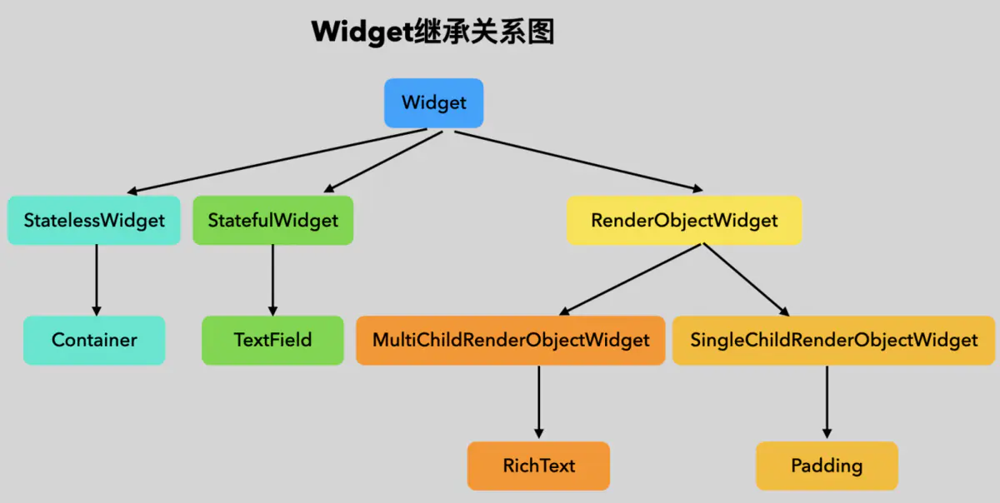


<br/>
<br/>

> <h3 id='2_Element'>2).Element</h3>


- **Element:** Element 是 widget 树中的一个节点，是由框架创建和管理的。每个 Element 与一个 widget 相关联，负责管理该 widget 的生命周期、状态以及子树的构建和更新。虽然 Element 与 BuildContext 有一些关联，但它们并不是一对一的关系。

&emsp; Widget 树是非常不稳定的，动不动就执行build方法，一旦调用 build 方法意味着这个 Widget 依赖的所有其他 Widget 都会重新创建，如果 Flutter 直接解析 Widget树，将其转化为 RenderObject 树来直接进行渲染，那么将会是一个非常消耗性能的过程，那对应的肯定有一个东西来消化这些变化中的不便，来做cache。

&emsp; 因此，这里就有另外一棵树 Element 树。Element 树这一层将 Widget 树的变化（类似 React 虚拟 DOM diff）做了抽象，可以只将真正需要修改的部分同步到真实的 RenderObject 树中，最大程度降低对真实渲染视图的修改，提高渲染效率，而不是销毁整个渲染视图树重建。


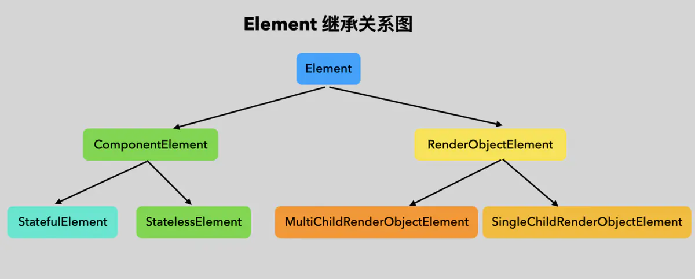


<br/>
<br/>


> <h3 id='3_RenderObject'>3).RenderObject</h3>

****

&emsp; RenderObject 负责管理布局、绘制等操作。

&emsp; RenderObject是渲染树中的一个对象，它的层次结构是渲染库的核心。

&emsp; Flutter 引擎需要把我们写的 Widget 树的信息都渲染到界面上，这样人眼才能看到，跟渲染有关的当然有一颗渲染树 RenderObject tree，这是第二颗树，渲染树节点叫做 RenderObject，这个节点里面处理布局、绘制相关的事情。这两个树的节点并不是一一对应的关系，有些 Widget是要显示的，有些 Widget ，比如那些继承自 StatelessWidget & StatefulWidget 的 Widget 只是将其他 Widget 做一个组合，这些 Widget 本身并不需要显示，因此在 RenderObject 树上并没有相对应的节点


三棵树如下图所示:

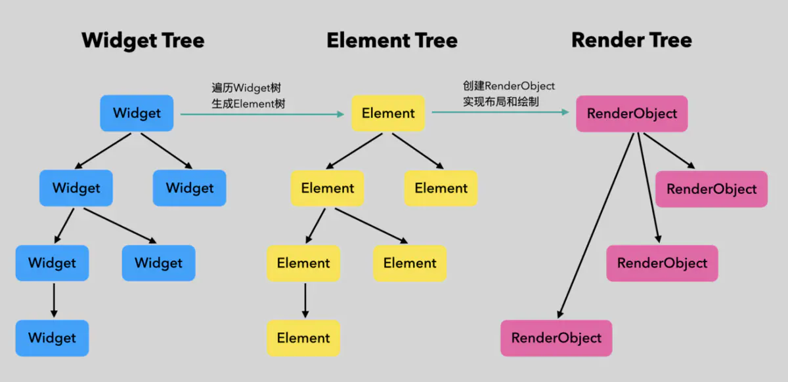


<br/>
<br/>

 

># <h3 id='4_三者关系如何?'>[4).三者关系如何?](https://juejin.cn/post/6860611787331469319)</h3>


[**解答:** Element与Widget和renderObject的联系](./组件基础.md#Element与Widget和renderObject的联系)


<br/><br/>


> <h2 id='widget和Element什么关系?是一一对应的吗?'>widget和Element什么关系?是一一对应的吗?</h2>

**widget和element是一一对应的**,若知为何,请往下看:


<br/>

Widget 只是描述一个UI元素的配置信息，那么真正的布局、绘制是由谁来完成的呢？

- **Flutter 框架的处理流程是这样的：**

	- 根据 Widget 树生成一个 Element 树，Element 树中的节点都继承自 Element 类。
	- 根据 Element 树生成 Render 树（渲染树），渲染树中的节点都继承自RenderObject 类。
	- 根据渲染树生成 Layer 树，然后上屏显示，Layer 树中的节点都继承自 Layer 类。

所以从这个流程来看,实际上是4棵树:widget树、element🌲、render🌲、layer🌲.

<br/>

真正的布局和渲染逻辑在 Render 树中，Element 是 Widget 和 RenderObject 的粘合剂，可以理解为一个中间代理。我们通过一个例子来说明，假设有如下 Widget 树：

```
Container( // 一个容器 widget
  color: Colors.blue, // 设置容器背景色
  child: Row( // 可以将子widget沿水平方向排列
    children: [
      Image.network('https://www.example.com/1.png'), // 显示图片的 widget
      const Text('A'),
    ],
  ),
);
```


注意，如果 Container 设置了背景色，Container 内部会创建一个新的 ColoredBox 来填充背景，相关逻辑如下：

```
if (color != null)
  current = ColoredBox(color: color!, child: current);
```


<br/>

而 Image 内部会通过 RawImage 来渲染图片、Text 内部会通过 RichText 来渲染文本，所以最终的 Widget树、Element 树、渲染树结构如下图所示：


<br/><br/>


- **这里需要注意：**

	- 1.三棵树中，Widget 和 Element 是一一对应的，但并不和 RenderObject 一一对应。比如 StatelessWidget 和 StatefulWidget 都没有对应的 RenderObject。
	- 2.渲染树在上屏前会生成一棵 Layer 树，

<br/><br/>

**疑问:** BuildContext与Element的联系,为什么需要BuildContext?


&emsp; 在Flutter中，BuildContext是一个重要的概念，它用于表示widget在渲染树中的位置，并提供了一种获取相关信息的途径。BuildContext与Element有密切的联系，因为每个BuildContext都对应一个Element，并通过Element来管理与之关联的Widget。

- **联系：**

- BuildContext与Element的关系：每个BuildContext都有一个对应的Element。当一个Widget被插入到渲染树中时，它会被包装在一个Element中，而该Element负责管理与之相关联的Widget。BuildContext实际上是通过Element来创建和管理的。

- 为什么需要BuildContext：
	- 位置标识：BuildContext用于标识widget在渲染树中的位置。它提供了一种唯一的方式来访问widget在树中的位置，这对于在树中导航、查找其他widget或执行一些与位置相关的操作是非常重要的。
	- 获取Theme和MediaQuery等信息：通过BuildContext，我们可以访问Theme、MediaQuery等，以便根据应用程序的全局状态或屏幕尺寸进行调整。这使得widget能够适应不同的环境。
	- 构建子树：BuildContext是在build方法中传递给widget的，通过它，widget可以构建其子树。BuildContext的子树会随着Element的创建而创建，并在需要时进行重建。

```
import 'package:flutter/material.dart';

class MyWidget extends StatelessWidget {
  @override
  Widget build(BuildContext context) {
    // 通过BuildContext获取Theme
    ThemeData theme = Theme.of(context);

    return Container(
      color: theme.primaryColor,
      child: Builder(
        builder: (BuildContext childContext) {
          // 通过BuildContext构建子树
          return Text('Hello, Flutter!', style: TextStyle(color: theme.accentColor));
        },
      ),
    );
  }
}

void main() {
  runApp(
    MaterialApp(
      home: Scaffold(
        body: MyWidget(),
      ),
    ),
  );
}

```

在这个例子中，BuildContext被用于获取Theme的信息，并且通过BuildContext构建了子树。这突显了BuildContext的作用，即在构建widget时提供上下文信息，使得widget能够适应其在渲染树中的位置和应用程序的全局状态。


<br/><br/>

**疑问:**  当一个Widget被插入到渲染树中时，它会被包装在一个Element中什么意思

&emsp; 当一个 Widget 被插入到 Flutter 渲染树中时，它实际上是通过创建一个相应的 Element 来管理的。Element 是 Flutter 框架中的一个核心类，它表示渲染树中的一个可管理单元，负责构建和更新与之关联的 Widget。

&emsp; 在 Flutter 中，Element 通过 BuildContext 与 Widget 进行连接。每个 Element 对应一个 Widget，而 BuildContext 是提供给 Widget 的一个描述 Widget 在树中位置的对象。当 Widget 被插入到渲染树中时，它的 Element 会被创建，同时 BuildContext 会被分配给该 Widget。

&emsp; 简而言之，一个 Widget 被插入到渲染树中，实际上就是它被包装在一个 Element 中，而这个 Element 就是负责管理这个 Widget 的实体。这个 Element 会在需要时负责构建、更新和维护与之关联的 Widget。这种方式使得 Flutter 框架能够更有效地管理渲染树，支持高效的布局和更新机制。


<br/>
<br/>

> <h2 id='哪三棵树?'>哪三棵树?</h2>

- widget树;
- element树(不包含业务,只管绘制);
- render(渲染树)树(根据element树计算所需要显示的树)

&emsp; 把widget中绘制的部分給分离出来形成了element树.这个主要是在widget中的绘制方法 **Widget build(BuildContext context)**,业务相关的不用管它.


<br/>


<br/>
<br/>

>## <h2 id='WidgetStateContext的核心概念和是为了解决什么问题'>[Widget、State、Context 的核心概念和是为了解决什么问题？](https://juejin.cn/post/6844903784187953165#heading-4)</h2>


- Widget: 在Flutter中，几乎所有东西都是Widget。将一个Widget想象为一个可视化的组件（或与应用可视化方面交互的组件），当你需要构建与布局直接或间接相关的任何内容时，你正在使用Widget。

- Widget树: Widget以树结构进行组织。包含其他Widget的被称为父Widget(或widget容器)。包含在父widget中的widget被称为子Widget。

- Context: 仅仅是已创建的所有Widget树结构中的**某个Widget的位置引用**。
	- 简而言之，将context作为widget树的一部分，其中context所对应的widget被添加到此树中。
	- **一个context只从属于一个widget**，它和widget一样是链接在一起的，并且会形成一个context树。

- State: 定义了StatefulWidget实例的行为，它包含了用于”交互/干预“Widget信息的行为和布局。应用于State的任何更改都会强制重建Widget。


<br/>


**State 和 Context 的关系:**

&emsp; 对于 StatefulWidget，State 与 Context 相关联。并且此关联是永久性的，State 对象将永远不会改变其 context。

&emsp; 即使可以在树结构周围移动 Widget Context，State 仍将与该 context 相关联。

&emsp; 当 State 与 Context 关联时，State 被视为已挂载。

**重点**：State 对象 与 context 相关联，就意味着该 State 对象是不（直接）访问另一个 context！


<br/>
<br/>

> <h2 id='简述StatelessWidget和StatefulWidget两种状态组件类'>简述StatelessWidget和StatefulWidget两种状态组件类？</h2>


**1.StatelessWidget**

&emsp; 一旦创建就不关心任何变化，在下次构建之前都不会改变。它们除了依赖于自身的配置信息（在父节点构建时提供）外不再依赖于任何其他信息。比如典型的Text、Row、Column、Container等，都是StatelessWidget。

&emsp; 它的生命周期相当简单：初始化、通过build()渲染。


<br/>
<br/>

**StatefulWidget**

&emsp; 在生命周期内，该类Widget所持有的数据可能会发生变化，这样的数据被称为State，这些拥有动态内部数据的Widget被称为StatefulWidget。比如复选框、Button等。State会与Context相关联，并且此关联是永久性的，State对象将永远不会改变其Context，即使可以在树结构周围移动，也仍将与该context相关联。

&emsp; 当state与context关联时，state被视为已挂载。StatefulWidget由两部分组成，在初始化时必须要在createState()时初始化一个与之相关的State对象。

<br/>

[BuildContext深入理解,这个需要多看几遍,一遍看的有点迷糊](https://juejin.cn/post/6844903777565147150)

[BuildContext,顾名思义，Build（构建Widget） Context（应用上下文），就是构建Widget中的应用上下文。](https://juejin.cn/post/6844903763656835086)

所以BuildContext只出现在两个地方：

- StatelessWidget.build 方法中：创建StatelessWidget的build方法
State对象中：一个是创建StatefulWidget的State对象的build方法中，另一个是State的成员变量

- BuildContext实际是Element,BuildContext是为了阻止直接对Element操作而抽象出来的，所以BuildContext是Element的抽象类，所有Element都继承自BuildContext。

每一个Widget都有一个BuildContext。BuildContext是Widget在Widget树中位置的句柄。


<br/>
<br/>


> <h2 id='为什么Navigator可以实现无需上下文路由导航'>为什么Navigator可以实现无需上下文路由导航？</h2>

&emsp; Navigator是在Flutter中负责管理维护页面堆栈的导航器。MaterialApp在需要的时候，会自动为我们创建Navigator。

&emsp; `Navigator.of(context)` 通过传递一个BuildContext来查找到查找到最近的Navigator，然后获取其对应的NavigatorState，从而进行导航操作。这是因为Navigator是一种基于树结构的导航管理器，BuildContext包含了构建元素树的上下文信息，可以用于向上遍历树找到最近的Navigator。


<br/>

&emsp; 以下是通过BuildContext找到最近的NavigatorState的简单示例：


```
void navigate(BuildContext context) {
  NavigatorState navigator = Navigator.of(context);
  navigator.push(MaterialPageRoute(builder: (BuildContext context) {
    return SecondScreen();
  }));
}
```

上述代码中，Navigator.of(context)会在当前BuildContext所在的元素树中向上查找，直到找到最近的Navigator。然后，可以通过获取其对应的NavigatorState，执行导航操作，比如使用push方法跳转到新的页面。

<br/><br/>


**疑问:** 所以如果在MaterialApp的navigatorKey属性内设置好一个Key就可以直接使用这个Key来进行路由导航，无需上下文。这是为什么?

这是因为在Flutter中，每个Navigator都可以通过设置一个GlobalKey<NavigatorState>来唯一标识，这个key可以通过GlobalKey的方式在整个应用程序中找到对应的NavigatorState。这就是为什么你可以使用Navigator的key属性来访问其对应的NavigatorState。

```
final GlobalKey<NavigatorState> navigatorKey = GlobalKey<NavigatorState>();

void main() {
  runApp(
    MaterialApp(
      navigatorKey: navigatorKey, // 设置Navigator的GlobalKey
      home: MyApp(),
    ),
  );
}

class MyApp extends StatelessWidget {
  @override
  Widget build(BuildContext context) {
    return Scaffold(
      body: Center(
        child: ElevatedButton(
          onPressed: () {
            // 通过key获取NavigatorState进行导航
            navigatorKey.currentState!.push(MaterialPageRoute(builder: (BuildContext context) {
              return SecondScreen();
            }));
          },
          child: Text('Navigate to Second Screen'),
        ),
      ),
    );
  }
}
```

&emsp; navigatorKey是GlobalKey<NavigatorState>类型，它通过MaterialApp的navigatorKey属性进行设置。然后，通过navigatorKey.currentState可以获取到对应的NavigatorState，从而进行导航操作。


<br/>
<br/>


> <h2 id='main和runApp函数在flutter的作用分别是什么有什么关系吗'>main()和runApp()函数在flutter的作用分别是什么？有什么关系吗？</h2>


- main函数是类似于java语言的程序运行入口函数

- runApp函数是渲染根widget树的函数

&emsp; 一般情况下runApp函数会在main函数里执行


<br/>

***
<br/>
<br/>


> <h1 id='数据'>数据</h1>

<br/>

> <h2 id='使用哪几种流行的数据库软件包'>使用哪几种流行的数据库软件包？</h2>


Flutter中使用最普遍的数据库软件包如下：

- sqflite数据库：它允许访问和操作SQLite数据库。
- Firebase数据库：它将使你能够访问和操作云数据库。

<br/>
<br/>


> <h2 id='Firebase数据库用途'>Firebase数据库用途</h2>

Firebase数据库是Google提供的一种云数据库服务，用于存储和同步应用程序的数据。它是一种 NoSQL 数据库，具有实时同步的特性，适用于移动应用和 Web 应用。


<br/>
<br/>


> <h2 id='实时同步的实时应用程序'>实时同步的实时应用程序</h2>

&emsp;  Firebase 数据库提供实时数据库同步，允许应用程序中的多个用户实时共享和更新数据。这对于需要实时反馈和协同工作的应用程序非常有用。

```
// Flutter 中使用 Firebase 数据库的简单示例
final databaseReference = FirebaseDatabase.instance.reference();

// 写入数据
databaseReference.child('messages').push().set({
  'text': 'Hello, Firebase!',
  'timestamp': ServerValue.timestamp,
});

// 读取数据
databaseReference.child('messages').onChildAdded.listen((Event event) {
  print('New message: ${event.snapshot.value}');
});
```


<br/><br/>

> <h2 id='用户身份验证与数据关联'>用户身份验证与数据关联</h2>

 Firebase 数据库可以与 Firebase 身份验证集成，帮助将用户身份与其数据关联。这使得只有特定用户能够访问和修改其个人数据。
 
 ```
 // 与 Firebase 身份验证结合使用的示例
final user = FirebaseAuth.instance.currentUser;
final userReference = databaseReference.child('users').child(user.uid);

// 写入用户相关数据
userReference.set({
  'username': 'john_doe',
  'email': 'john@example.com',
  // 其他用户信息
});

// 读取用户相关数据
userReference.once().then((DataSnapshot snapshot) {
  print('User data: ${snapshot.value}');
});
```


<br/><br/>

> <h2 id='应用程序配置和设置'>应用程序配置和设置</h2>

 将应用程序的配置信息和设置存储在 Firebase 数据库中，可以方便地进行动态更新，而不需要重新发布应用程序。
 
 ```
 // 存储和读取应用程序配置的示例
final configReference = databaseReference.child('config');

// 写入配置数据
configReference.set({
  'feature_enabled': true,
  'max_items': 100,
  // 其他配置项
});

// 读取配置数据
configReference.once().then((DataSnapshot snapshot) {
  print('App config: ${snapshot.value}');
});
```


<br/><br/>

> <h2 id='实时分析和监控'>实时分析和监控</h2>


Firebase 数据库的实时性质使其非常适合实时监控和分析应用程序的数据。开发者可以使用 Firebase 控制台监视数据库中的更改，了解用户行为和应用程序性能。

这只是 Firebase 数据库的一些用途示例，它还提供了更多功能，如离线支持、安全规则配置等。Firebase 数据库可以为开发者提供一个强大而灵活的云数据库解决方案


<br/>

***
<br/><br/>


> <h1 id='线程'>线程</h1>


<br/>

> <h1 id='Dart多任务如何并行的'>Dart多任务如何并行的？</h1>


&emsp; Dart不存在多线程，那如何进行多任务并行？

&emsp; Dart当中提供了一个类似于新线程，但是不共享内存的独立运行的 worker - isolate。

&emsp; 在dart中，一个Isolate对象其实就是一个isolate执行环境的引用，一般来说我们都是通过当前的isolate去控制其他的isolate完成彼此之间的交互.

&emsp; 而当我们想要创建一个新的Isolate.可以使用 Isolate.spawn方法获取返回的一个新的isolate对象，两个isolate之间使用SendPort相互发送消息，而isolate中也存在了一个与之对应的ReceivePort接受消息用来处理，但是我们需要注意的是，ReceivePort和SendPort在每个isolate都有一对，只有同一个isolate中的ReceivePort才能接受到当前类的SendPort发送的消息并且处理。


<br/>


> <h2 id='Stream与Future是什么关系'>Stream与Future是什么关系</h2>


- 在 Flutter 中有两种处理异步操作的方式 Future 和 Stream，Future 用于处理单个异步操作，Stream 用来处理连续的异步操作。

- [Future是异步操作,是不必立马等返回结果,而是有返回结果时再返回!](https://blog.csdn.net/chuyouyinghe/article/details/120356181)在主线程中执行Future还是会卡主线程的

- Stream 和 Feature 不同的地方是 Stream 可以接收多个异步结果，而Feature 只有一个。

- Stream 和 Future 是 Dart 异步处理的核心 API。Future 表示稍后获得的一个数据，所有异步的操作的返回值都用 Future来表示。但是Future只能表示一次异步获得的数据。而Stream表示多次异步获得的数据。比如界面上的按钮可能会被用户点击多次，所以按钮上的点击事件（onClick）就是一个Stream。简单地说，Future将返回一个值，而Stream将返回多次值。Dart中统一使用Stream处理异步事件流。Stream和一般的集合类似，都是一组数据，只不过一个是异步推送，一个是同步拉取。


<br/>
<br/>


> <h3 id='Stream'>Stream</h3>


- Stream 的创建可以使用Stream.fromFuture，也可以使用 StreamController 来创建和控制。

- 普通的 Stream只可以有一个订阅者，如果想要多订阅的话，要使用 asBroadcastStream()。


<br/>
<br/>

> <h4 id='Stream有哪两种订阅模式分别是怎么调用的'>Stream有哪两种订阅模式？分别是怎么调用的？</h4>


Stream有两种订阅模式：**单订阅(single) 和 多订阅（broadcast）**。


<br/>

&emsp; 单订阅就是只能有一个订阅者，而广播是可以有多个订阅者。这就有点类似于消息服务（Message Service）的处理模式。

&emsp; 单订阅类似于点对点，在订阅者出现之前会持有数据，在订阅者出现之后就才转交给它。而广播类似于发布订阅模式，可以同时有多个订阅者，当有数据时就会传递给所有的订阅者，而不管当前是否已有订阅者存在。

&emsp; Stream 默认处于单订阅模式，所以同一个 stream 上的 listen 和其它大多数方法只能调用一次，调用第二次就会报错。

&emsp; 但 Stream 可以通过 transform() 方法（返回另一个 Stream）进行连续调用。通过 Stream.asBroadcastStream() 可以将一个单订阅模式的 Stream 转换成一个多订阅模式的 Stream，isBroadcast 属性可以判断当前 Stream 所处的模式。


<br/><br/>


> <h3 id='Future'>Future</h3>

- **介绍:**
	- Dart 在单线程中是以消息循环机制来运行的，其中包含两个任务队列，一个是“微任务队列” microtask queue，另一个叫做“事件队列” event queue。
	
	- Future 默认情况下其实就是往「事件队列」里插入一个事件，当有空余时间的时候就去执行，当执行完毕后会回调 Future.then(v) 方法。
	
	- 而我们也可以通过使用 Future.microtask 方法来向 「微任务队列」中插入一个任务，这样就会提高他执行的效率。因为在 Dart 每一个 isolate 当中，执行优先级为 ： Main > MicroTask > EventQueue


<br/><br/>


> <h2 id='Future和Isolate有什么区别'>Future和Isolate有什么区别</h2>


- future是异步编程，调用本身后不是立即返回，并在稍后的某个时候执行完成时再获得返回结果。在普通代码中可以使用await 等待一个异步调用结束。

- isolate是并发编程，Dart有并发时的共享状态，所有Dart代码都在isolate中运行，包括最初的main()。
	
	- 每个isolate都有它自己的堆内存，意味着其中所有内存数据，包括全局数据，都仅对该isolate可见，它们之间的通信只能通过传递消息的机制完成，消息则通过端口(port)收发。
	
	- isolate只是一个概念，具体取决于如何实现，比如在Dart VM中一个isolate可能会是一个线程，在Web中可能会是一个Web Worker。

<br/>
<br/>


> <h3 id='怎么理解Isolate'>怎么理解Isolate？</h3>

&emsp; isolate是Dart对actor并发模式的实现。 

&emsp; isolate是有自己的内存和单线程控制的运行实体。

&emsp; isolate本身的意思是“隔离”，因为isolate之间的内存在逻辑上是隔离的。

&emsp; isolate中的代码是按顺序执行的，任何Dart程序的并发都是运行多个isolate的结果。

&emsp; 因为Dart没有共享内存的并发，没有竞争的可能性所以不需要锁，也就不用担心死锁的问题


<br/>
<br/>


> <h3 id='isolate是怎么进行通信和实例化的'>isolate是怎么进行通信和实例化的？</h3>


&emsp; isolate线程之间的通信主要通过port来进行，这个port消息传递过程是异步的。通过dart源码可以看出，实例化一个isolate的过程包括：

- 实例化isolate结构体;
- 在堆中分配线程内存;
- 配置port等过程;

<br/>


&emsp; 下面是一个isolate的例子，例子中新建了一个isolate，并且绑定了一个方法网络请求和数据解析处理，并通过port将处理好的数据返回给调用方。


```
loadData() async {
  // 通过spawn新建一个isolate，并绑定静态方法
  ReceivePort receivePort = ReceivePort();
  await Isolate.spawn(dataLoader, receivePort.sendPort);

  // 获取新的isolate监听port
  SendPort sendPort = await receivePort.first;
  //调用sendReceive自定义方法
  List dataList = await sendReceive(sendPort,
      'http://www.flutterj.com');
  print('dataList $dataList');
}

// isolate绑定方法
static dataLoader(SendPort sendPort) async {
  // 创建监听port，并将sendPort传给外界来调用
  ReceivePort receivePort = ReceivePort();
  sendPort.send(receivePort.sendPort);
// 监听外界调用
  await for (var msg in receivePort) {
    String requestURL = msg[0];
    SendPort callbackPort = msg[1];

    Client client = Client();
    Response response = await client.get(requestURL);
    List dataList = json.decode(response.body);
// 回调返回值给调用者
    callbackPort.send(dataList);
  }
}

// 创建自己的监听port，并且向新的isolate发送消息
Future sendReceive(SendPort sendPort, String url) {
  ReceivePort receivePort = ReceivePort();
  sendPort.send([url, receivePort.sendPort]);
// 接收到返回值， 返回给调用者
  return receivePort.first;
}
```


<br/>
<br/>


> <h3 id='简述Flutter的线程管理模型'>简述Flutter的线程管理模型</h3>


&emsp; 默认情况下，Flutter Engine层会创建一个Isolate，并且Dart代码默认就运行在这个主Isolate上。必要时可以使用spawnUri和spawn两种方式来创建新的Isolate，在Flutter中，新创建的Isolate由Flutter进行统一的管理。

&emsp; 事实上，Flutter Engine自己不创建和管理线程，Flutter Engine线程的创建和管理是Embeder负责的，Embeder指的是将引擎移植到平台的中间层代码，Flutter Engine层的架构示意图如下图所示:

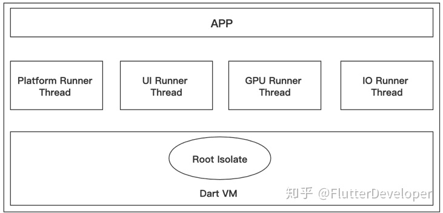

&emsp; 在Flutter的架构中，Embeder提供四个Task Runner，分别是Platform Task Runner、UI Task Runner Thread、GPU Task Runner和IO Task Runner，每个Task Runner负责不同的任务，Flutter Engine不在乎Task Runner运行在哪个线程，但是它需要线程在整个生命周期里面保持稳定。


<br/>
<br/>


> <h3 id='awaitfor如何使用'>await for 如何使用?</h3>

await for是不断获取stream流中的数据，然后执行循环体中的操作。它一般用在直到stream什么时候完成，并且必须等待传递完成之后才能使用，不然就会一直阻塞。

```
Stream<String> stream = new Stream<String>.fromIterable(['不开心', '面试', '没', '过']);
main() async{
  print('上午被开水烫了脚');
  await for(String s in stream){
    print(s);
  }
  print('晚上还没吃饭');
}
```


<br/>
<br/>


> <h2 id=''></h2>


<br/>
<br/>


> <h3 id=''></h3>


<br/>
<br/>

> <h3 id=''></h3>


<br/>
<br/>


<br/>
<br/>


> <h2 id=''></h2>


<br/>
<br/>


> <h3 id=''></h3>


<br/>
<br/>


> <h2 id=''></h2>


<br/>
<br/>


> <h3 id=''></h3>


<br/>
<br/>


> <h2 id=''></h2>


<br/>
<br/>


> <h3 id=''></h3>


<br/>
<br/>


> <h2 id=''></h2>


<br/>
<br/>


> <h3 id=''></h3>


<br/>
<br/>


> <h2 id=''></h2>


<br/>
<br/>


> <h3 id=''></h3>


<br/>
<br/>


> <h2 id=''></h2>


<br/>
<br/>


> <h3 id=''></h3>


<br/>
<br/>


> <h2 id=''></h2>


<br/>
<br/>


> <h3 id=''></h3>


<br/>

***
<br/>
<br/>


> <h1 id='底层'>底层</h1>


<br/>


> <h2 id='Flutter是怎么完成组件渲染的'>Flutter是怎么完成组件渲染的</h2>

&emsp; 在计算机系统中，图像的显示需要CPU、GPU和显示器一起配合完成CPU负责图像数据计算，GPU负责图像数据渲染，而显示器则负责最终图像显示。CPU把计算好的、需要显示的内容交给GPU，由GPU完成渲染后放入帧缓冲区，随后视频控制器根据垂直同步信号以每秒60次的速度，从帧缓冲区读取帧数据交由显示器完成图像显示。操作系统在呈现图像时遵循了这种机制。

&emsp; 而Flutter作为跨平台开发框架也采用了这种底层方案，UI线程使用Dart语言来构建视图结构数据，这些数据会在GPU线程进行图层合成，随后交给图像渲染引擎Skia加工成GPU数据，而这些数据会通过OpenGL最终提供给GPU渲染。

&emsp; 可以看到Flutter用了计算机最基本的图像渲染技术，摒弃其他一些通道和过程，用最直接的方式完成了图形显示，自然性能也就得到了保障。


<br/>
<br/>

> <h2 id=''></h2>


<br/>
<br/>


> <h2 id='简单解释下FrameWork层和Engine层'>简单解释下FrameWork层和Engine层</h2>


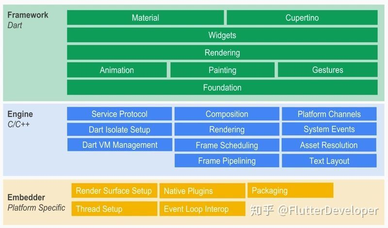


- **FrameWork层**

	- Flutter的顶层是用drat编写的框架（SDK），它实现了一套基础库，包含Material（Android风格UI）和Cupertino（iOS风格）的UI界面，下面是通用的Widgets（组件），之后是一些动画、绘制、渲染、手势库等。这个纯 Dart实现的 SDK被封装为了一个叫作 dart:ui的 Dart库。我们在使用 Flutter写 App的时候，直接导入这个库即可使用组件等功能。


<br/>


- **Engine层**

	- Skia是Google的一个 2D的绘图引擎库，其前身是一个向量绘图软件，Chrome和 Android均采用 Skia作为绘图引擎。Skia提供了非常友好的 API，并且在图形转换、文字渲染、位图渲染方面都提供了友好、高效的表现。Skia是跨平台的，所以可以被嵌入到 Flutter的 iOS SDK中，而不用去研究 iOS闭源的 Core Graphics / Core Animation。Android自带了 Skia，所以 Flutter Android SDK要比 iOS SDK小很多。

	- 第二是Dart 运行时环境
	
	- 第三文本渲染布局引擎。


<br/>

- **总结:**
	
	- 由上图可知，Flutter框架自下而上分为Embedder、Engine和Framework三层;
	
	- Embedder是操作系统适配层，实现了渲染 Surface设置，线程设置，以及平台插件等平台相关特性的适配；
	
	- Engine层负责图形绘制、文字排版和提供Dart运行时，Engine层具有独立虚拟机，正是由于它的存在，Flutter程序才能运行在不同的平台上，实现跨平台运行；

	- Framework层则是使用Dart编写的一套基础视图库，包含了动画、图形绘制和手势识别等功能，是使用频率最高的一层


<br/>
<br/>


> <h2 id='简述Flutter的绘制流程'>简述Flutter的绘制流程</h2>

Flutter的绘制流程如下图所示:

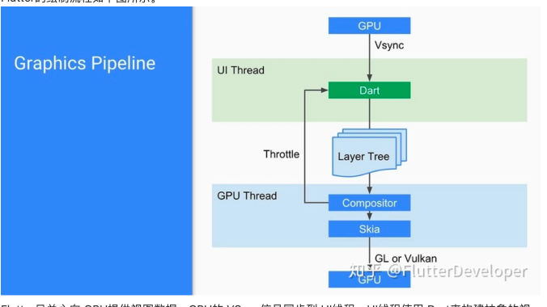


&emsp; Flutter只关心向 GPU提供视图数据，GPU的 VSync信号同步到 UI线程，UI线程使用 Dart来构建抽象的视图结构，这份数据结构在 GPU线程进行图层合成，视图数据提供给 Skia引擎渲染为 GPU数据，这些数据通过 OpenGL或者 Vulkan提供给 GPU

<br/>
<br/>


> <h2 id='热重载'>热重载</h2>


&emsp; Flutter 的热重载是基于 JIT 编译模式的代码增量同步。由于 JIT 属于动态编译，能够将 Dart 代码编译成生成中间代码，让 Dart VM 在运行时解释执行，因此可以通过动态更新中间代码实现增量同步。

&emsp; 热重载的流程可以分为 5 步，包括：扫描工程改动、增量编译、推送更新、代码合并、Widget 重建。Flutter 在接收到代码变更后，并不会让 App 重新启动执行，而只会触发 Widget 树的重新绘制，因此可以保持改动前的状态，大大缩短了从代码修改到看到修改产生的变化之间所需要的时间。

&emsp; 另一方面，由于涉及到状态的保存与恢复，涉及状态兼容与状态初始化的场景，热重载是无法支持的，如改动前后 Widget 状态无法兼容、全局变量与静态属性的更改、main 方法里的更改、initState 方法里的更改、枚举和泛型的更改等。

&emsp; 可以发现，热重载提高了调试 UI 的效率，非常适合写界面样式这样需要反复查看修改效果的场景。但由于其状态保存的机制所限，热重载本身也有一些无法支持的边界。


<br/>
<br/>


> <h2 id='Provider原理解析'>Provider原理解析</h2>

&emsp; 打开源码，最先注意到的就是Provider类。 此Provider非标题中的Provider。此处的Provider 顾名思义，只是一个数据的提供者，他只是对InheritedWidget的一层封装，方便我们对数据的操作。

- 继承自InheritedProvider
- 需要指定一个泛型T
- 一个普通构造器和一个命名构造器
- 一个静态方法static T of<T>(BuildContext context, {bool listen = true})，返回指定泛型为T的对象


<br/>
<br/>


> <h2 id='Provider种类'>Provider种类</h2>


&emsp; 下面的这些Provider可以根据应用的具体需求选择使用，一般情况下，ChangeNotifierProvider是最常用的一种，特别适用于小到中等规模的应用。在使用时，通常将Provider包裹在MaterialApp的home属性或Builder中，确保Provider在整个应用中可用。


<br/><br/>

> <h2 id='基础Provider'>基础Provider</h2>

- 通用的提供者，可以提供任何类型的数据;
- 使用create回调来提供初始值或创建对象;
- 示例:

```
Provider<int>(
  create: (context) => 42,
  child: MyApp(),
)
```


<br/><br/>

> <h2 id='ValueListenableProvider'>ValueListenableProvider</h2>


- 使用ValueListenable作为状态的提供者，当ValueListenable的值发生变化时，通知依赖进行更新;
-  监听一个可被监听的值，并且只暴露ValueListenable.value方法
- 适用于一些需要监听值变化的场景。
- 示例:

```
ValueListenableProvider<int>(
  create: (context) => ValueNotifier<int>(42),
  child: MyApp(),
)
```


<br/><br/>

> <h2 id='ChangeNotifierProvider'>ChangeNotifierProvider</h2>

- 使用ChangeNotifier作为状态的提供者，当数据发生变化时，通知依赖进行更新。
- ListerableProvider依托于ChangeNotifier的一个实现，它将会在需要的时候自动调用ChangeNotifier.dispose方法
- 用于简单的状态管理，适用于小规模的应用。
- 示例代码：

```
ChangeNotifierProvider(
  create: (context) => MyModel(),
  child: MyApp(),
)
```


<br/><br/>

> <h2 id='StreamProvider'>StreamProvider</h2>

- StreamProvider 监听一个流，并且暴露出其最近发送的值;
- 使用Stream作为状态的提供者，当Stream有新数据时，通知依赖进行更新。
- 适用于异步操作，如网络请求。
- 示例代码：

```
StreamProvider<int>(
  create: (context) => myStreamController.stream,
  initialData: 42,
  child: MyApp(),
)
```


<br/><br/>

> <h2 id='FutureProvider'>FutureProvider</h2>

- FutureProvider 接受一个Future作为参数，在这个Future完成的时候更新依赖;
- 当Future完成时，通知依赖进行更新。
- 示例代码：


```
FutureProvider<int>(
  create: (context) => fetchData(),
  initialData: 42,
  child: MyApp(),
)
```


<br/>
<br/>


> <h2 id='ListenableProvider'>ListenableProvider</h2>


&emsp; ListenableProvider 是 Provider 库提供的一种特殊类型的提供者，用于管理实现了 Listenable 接口的对象的状态。Listenable 是 Flutter 中表示可监听变化的对象的接口，当对象的状态发生变化时，它会通知监听者进行更新。

以下是一个使用 ListenableProvider 的简单例子，假设我们有一个 Counter 类，它实现了 Listenable 接口：

```
import 'package:flutter/material.dart';
import 'package:provider/provider.dart';

class Counter extends ChangeNotifier {
  int _count = 0;

  int get count => _count;

  void increment() {
    _count++;
    notifyListeners(); // 通知监听者有变化
  }
}

void main() {
  runApp(MyApp());
}

class MyApp extends StatelessWidget {
  @override
  Widget build(BuildContext context) {
    return MaterialApp(
      home: ListenableProvider<Counter>(
        create: (context) => Counter(),
        child: MyHomePage(),
      ),
    );
  }
}

class MyHomePage extends StatelessWidget {
  @override
  Widget build(BuildContext context) {
    return Scaffold(
      appBar: AppBar(
        title: Text('Counter App'),
      ),
      body: Center(
        child: Column(
          mainAxisAlignment: MainAxisAlignment.center,
          children: [
            Text(
              'Counter Value:',
              style: TextStyle(fontSize: 18),
            ),
            Consumer<Counter>(
              builder: (context, counter, child) {
                return Text(
                  '${counter.count}',
                  style: TextStyle(fontSize: 24, fontWeight: FontWeight.bold),
                );
              },
            ),
          ],
        ),
      ),
      floatingActionButton: FloatingActionButton(
        onPressed: () {
          // 获取 Counter 实例并调用 increment 方法
          Provider.of<Counter>(context, listen: false).increment();
        },
        child: Icon(Icons.add),
      ),
    );
  }
}

```

在这个例子中：

- 我们有一个 Counter 类，它继承了 ChangeNotifier 并实现了 Listenable 接口，具有可监听的能力。
- MyApp 中使用了 ListenableProvider，并提供了一个 Counter 的实例，以便在应用中共享和管理它的状态。
- MyHomePage 中通过 Consumer 将 Counter 的值显示在 UI 中，并在按钮点击时调用 increment 方法。

&emsp; 运行这个应用，你将看到一个简单的计数器应用，每次点击按钮都会增加计数器的值。ListenableProvider 用于管理实现了 Listenable 接口的状态对象，并在状态发生变化时通知相关的监听者进行更新。


<br/>

***
<br/><br/>


> <h1 id='设计模式'>设计模式</h1>

<br/>

> <h2 id='管道流-响应式编程'>管道流-响应式编程</h2>


&emsp; **StreamController** 是 Dart 中用于创建和管理 Dart 流（stream）的类。流是一系列异步事件的序列，可以用于处理异步操作，例如处理用户输入、网络请求或其他非同步事件。


<br/>

- **三元素**
	- StreamController：数据流管道
	- StreamSink：发出消息
	- Stream：收到消息


<br/>


- **步骤**

	- 首先在 StreamControlState 里实现 StreamController
	
	- StreamSink 通过 _streamController.sink 获取;
	
	- Stream 通过 _streamController.stream 获取


**代码:**

```
import 'dart:async';

void main() {
  // 创建一个 StreamController，用于处理整数类型的事件
  var controller = StreamController<int>();

  // 获取 StreamSink，用于将事件添加到流中
  var sink = controller.sink;

  // 监听流事件
  var subscription = controller.stream.listen((data) {
    print('Received data: $data');
  });

  // 使用 StreamSink 添加事件到流中
  sink.add(1);
  sink.add(2);
  sink.add(3);

  // 关闭 StreamSink，表示没有更多的事件将被添加
  sink.close();

  // 关闭 StreamSubscription
  subscription.cancel();
}
```

**总结:** 通过 sink 来添加事件到流中。sink 提供了一个类似于 add 的方法，即 sink.add(event)。使用 sink.add 和 sink.close 是为了更清晰地表示我们正在操作 StreamController 的输入端，向流中添加事件。

&emsp; 需要注意的是，当你关闭 sink 时，它也会关闭相应的 stream，这意味着不再允许往流中添加新的事件。在实际应用中，使用 sink 主要是为了在更复杂的异步处理中提供更多的控制和灵活性。


<br/><br/>

&emsp; 然后就可以通过 _sink 发送消息，在 _stream 处接受消息，这里你肯定会比较迷惑，发送一个消息，为什么搞的这么麻烦？

&emsp; 这正是响应式编程的魅力所在，如果直接发送，那么就是同步的，如果要实现异步发送，按照正常的实现，就必须要写很多监听和回调，很容易陷入回调陷阱，而在响应式编程里，我们只需关心 _sink 和 _stream，在 _sink 里发送消息，在 _stream 处接受消息，不需要写额外的监听和回调.

&emsp; StreamController 会帮我们处理，而且在 StreamController 里也可以对接受到的数据处理后在发送。


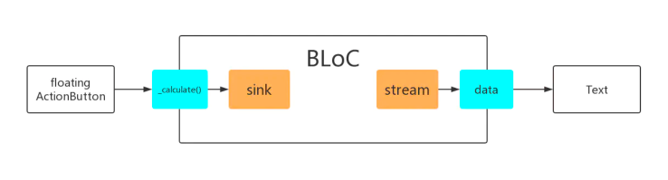


<br/><br/>


> <h2 id='Bloc和MVVM'>Bloc和MVVM</h2>


> <h2 id='Bloc模式'>Bloc模式</h2>

**1.Bloc图**

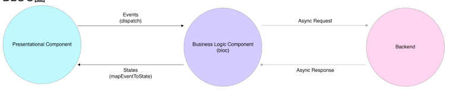


BLoC模式由来自Google的Paolo Soares和Cong Hui设计，并在2018年DartConf期间（2018年1月23日至24日）首次展示。

<br/>

- **业务逻辑（Business Logic ）**

	- 转移到一个或几个BLoC，
	- 尽可能从表现层中删除。 换句话说，UI组件应该只关心UI事物而不关心业务
	- 依赖Streams独家使用输入（Sink）和输出（流）
	- 保持平台独立
	- 保持环境独立
	- BLoC模式最初被设想为允许独立于平台重用相同的代码：Web应用程序，移动应用程序，后端。
- Widgets通过Sinks向BLoC发送事件
- BLoC通过Stream通知Widgets，
- 由BLoC实现的业务逻辑不是他们关注的问题。

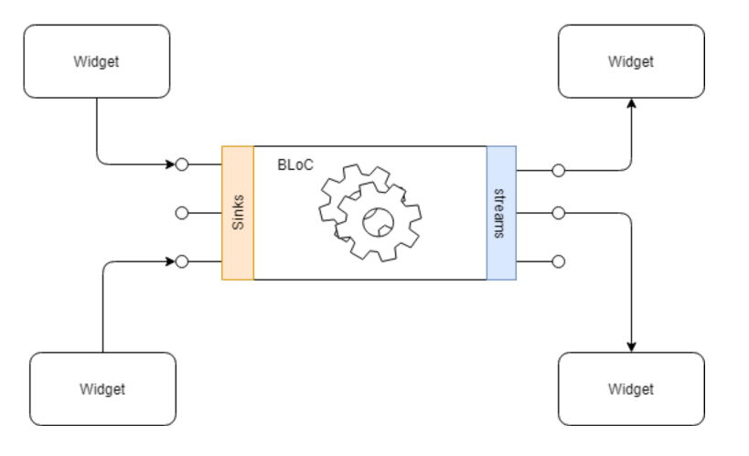

<br/>


下图是 BLoC 模式里的事件和状态流向图：


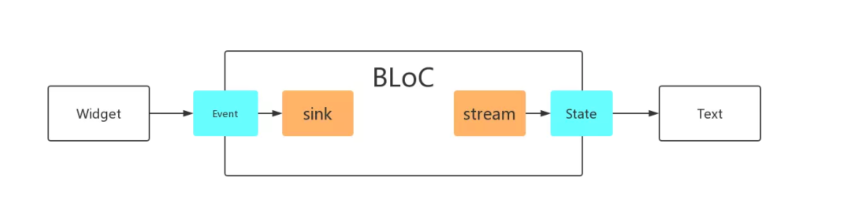

- Widget 向 BLoC 发送事件
- 事件会触发 BLoC 里的 sink
- 然后 Stream 会把 State 通知给 Widget


&emsp; 这里的 Event 是为了把 Widget 和具体的业务逻辑分离抽象出来的东西，State 就是 Widget 显示需要用到的数据，也是和业务逻辑分离的。

<br/>

**BLoC实现的业务逻辑层，具有以下的特点：**

- BLoC依赖响应式编程

- 有 Event 和 State


<br/>
<br/>

BLoC 实现了业务逻辑层和 UI 逻辑的分离，为此带来了巨大的好处：

- 可以用对 App 影响最小的方式修改业务逻辑
- 可以修改 UI，而不用担心影响业务逻辑
- 更加方便单元测试


<br/>


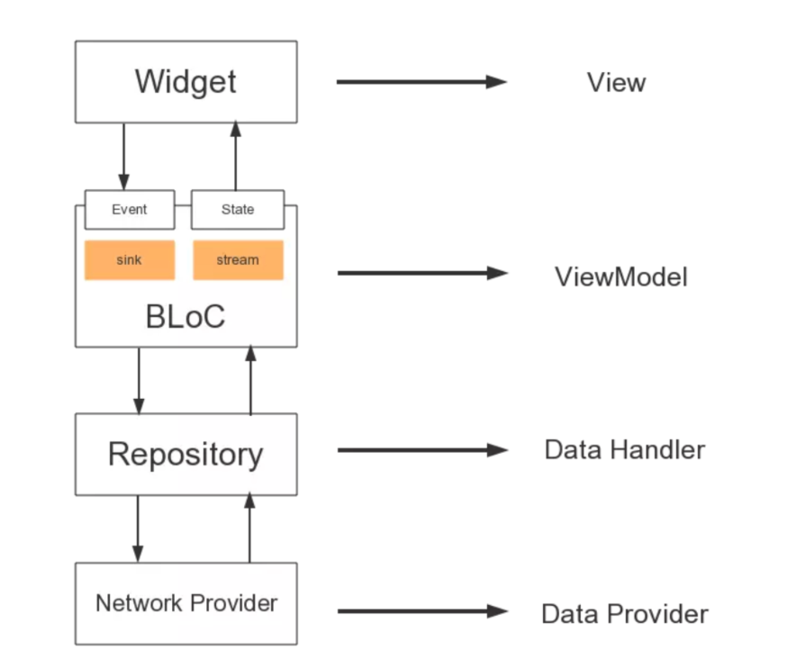

BLoC 模式的架构图，看到这里你觉得和某个模式很像，没错就是 MVVM

共有四层，从上到下分别是：
- UI Screen
- BLoC
- Repository
- Network Provider

Widget 对应的是 MVVM 里的 View，BLoC 对应的是 MVVM 里的 ViewModel，Repository 和 Network Provider 对应的是 MVVM 里的 Model。


<br/>

**简单Demo**

```
import 'dart:async';

import 'package:flutter/material.dart';

///Bloc + Stream
class BlocPage extends StatefulWidget {
  @override
  _BlocPageState createState() => _BlocPageState();
}

class _BlocPageState extends State<BlocPage> {
  final PageBloc _pageBloc = new PageBloc();

  @override
  void dispose() {
    _pageBloc.dispose();
    super.dispose();
  }

  @override
  Widget build(BuildContext context) {
    return Scaffold(
      appBar: AppBar(
        title: new Text("bloc"),
      ),
      body: Container(
        child: new StreamBuilder(
            initialData: 0,
            stream: _pageBloc.stream,
            builder: (context, snapShot) {
              return new Column(
                children: <Widget>[
                  new Expanded(
                      child: new Center(
                          child: new Text(snapShot.data.toString()))),
                  new Center(
                    child: new FlatButton(
                        onPressed: () {
                          _pageBloc.add();
                        },
                        color: Colors.blue,
                        child: new Text("+")),
                  ),
                  new Center(
                    child: new FlatButton(
                        onPressed: () {
                          _pageBloc.dec();
                        },
                        color: Colors.blue,
                        child: new Text("-")),
                  ),
                  new SizedBox(
                    height: 100,
                  )
                ],
              );
            }),
      ),
    );
  }
}


class PageBloc {
  int _count = 0;

  ///StreamController
  StreamController<int> _countController = StreamController<int>();

  ///对外提供入口
  StreamSink<int> get _countSink => _countController.sink;

  ///提供 stream StreamBuilder 订阅
  Stream<int> get stream => _countController.stream;

  void dispose() {
    _countController.close();
  }

  void add() {
    _count++;
    _countSink.add(_count);
  }

  void dec() {
    _count--;
    _countSink.add(_count);
  }
}

```


<br/>
<br/>


> <h3 id='MVVM模式'>MVVM模式</h3>

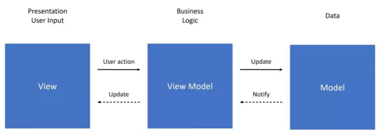


<br/>

***
<br/>
<br/>


> <h1 id='库'>库</h1>

<br/>


> <h2 id='flutter_bloc'>flutter_bloc</h2>

- **类分别是：**

	- Bloc
	- BlocBuilder
	- BlocProvider
	- BlocProviderTree
	- BlocListener
	- BlocListenerTree


<br/>
<br/>


> <h3 id='Bloc'>Bloc</h3>

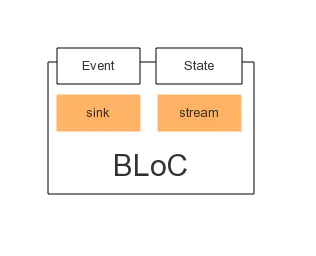

&emsp; 可以看到 Bloc 类里包含了 Event、State，也有 sink、stream 响应式编程，不过 sink、stream 响应式编程已经被 flutter_bloc 框架实现，我们只要关心 Event 和 State 就行


<br/>
<br/>


> <h3 id='BlocBuilder'>BlocBuilder</h3>

&emsp; BlocBuilder 是一个 Widget，它的功能类似于前面讲的 StreamBuilder，但是使用起来更简单，BlocBuiler 监听 Bloc 的状态，当状态发生变化时，就重建 Widget，因此 BlocBuiler 有两个参数：Bloc 和 BlocWidgetBuilder


<br/>
<br/>


> <h3 id='BlocProvider'>BlocProvider</h3>

&emsp; BlocProvider 是一个 Widget，可以将 Bloc 类提供给它的子 Widget。BlocProvider 经常用来作为依赖注入的部件，以便将单个 Bloc 类的实例，在多个 Widget 里共享。


<br/>
<br/>


> <h3 id='BlocProviderTree'>BlocProviderTree</h3>

&emsp; BlocProviderTree 也是一个 Widget，前面讲的 BlocProvider 是把一个 Bloc 实例共享到多个 Widget 里，有时候一个 Widget 也需要用到多个 Bloc。


<br/>
<br/>


> <h3 id='BlocListener'>BlocListener</h3>

&emsp; BlocListener 是一个 Widget，有两个参数：Bloc 和 BlocWidgetListener，类似于 BlocBuilder，需要接收一个 Bloc 类作为参数，但也有不同的地方， BlocBuilder 里的 BlocWidgetBuilder 需要返回 Widget，而 BlocWidgetListener 不用返回 Widget，它的返回类型是 void，所以用来做一些其他操作，例如：弹对话框、弹 SnackBar、跳转到新的页面等。

<br/>
<br/>


> <h3 id='BlocListenerTree'>BlocListenerTree</h3>

&emsp; BlocListenerTree 是一个 Widget，用于将多个 BlockListener 合成一个 Widget。


<br/>
<br/>


> <h2 id='flutter_redux'>flutter_redux</h2>

**Redux 简介**

&emsp; Redux 是 JavaScript 状态容器，提供可预测化的状态管理


<br/>

- **当你的场景非常复杂，具有以下场景时：**

	- 某个组件的状态，需要共享
	- 某个状态需要在任何地方都可以拿到
	- 一个组件需要改变全局状态
	- 一个组件需要改变另一个组件的状态


<br/>

Redux 使用流程图:

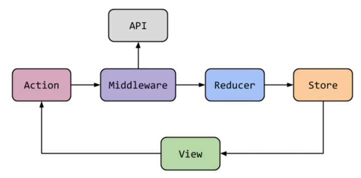


在这张图中：

- 如果 View 受到点击，就会抛出一个 Action，Action 是用来描述发生了什么。

- Action 会首先被 Middleware 接收，Middleware 里会根据接收到的 Action 进行不同的处理，但 Middleware 里主要是用来处理一些耗时的操作，例如 API 的数据请求，所以在 Middleware 里的操作都是异步的。

- 在 Middleware 异步操作得到数据后，便会把 Action 和数据一起抛给 Reducer 处理，Reducer 是纯函数，作用是生成新的 State，所以在接收到 Action 和数据之后，Reducer 会根据不同的业务逻辑，对数据进行处理，生成一个新的 State，并抛给 Store。

- Store 是用来存取状态的，当 Store 接收到从 Reducer 传过来的最新状态后，便会用最新的状态去刷新 View。


<br/><br/>


Action、Middleware、Reducer、Store 的角色和作用分别是：

- Action：Action 是一个简单的普通对象，用来描述发生了什么，也可以在 Action 中携带数据。

- Middleware：Middleware 是嵌到 Action 和 Reducer 之间的操作，用于处理耗时的操作，所以 Middleware 里都是异步操作，常用于数据请求。如果你的操作不耗时，就没必要使用 Middleware。

- Reducer：Reducer 是纯函数，用来描述应用如何更新状态，业务逻辑都在 Reducer 里，以此可以实现业务逻辑和 UI 逻辑的分离。

- Store 是用来存储和共享状态的，而且一个应用只有一个单一的 Store。


<br/>
<br/>


> <h3 id='flutter_redux几个类作用'>flutter_redux几个类作用</h3>

flutter_redux 非常强大，只要使用几个类，就可以让我们在 Flutter 中使用 Redux 来开发程序，这几个类是：

- Reducer

- Middleware

- Store

- StoreProvider

- StoreBuilder

- StoreConnector

- Reducer


<br/>


- **1). Reducer** 用于响应 Action，进行逻辑操作，然后生成新的 State。


- **2.)Middleware** 处于 Action 和 Reducer 之间，可以在 Reducer 之前拦截 Action。为什么要多这一层呢？因为发出 Action 的操作之后，有时候不能立马拿到想要的数据，需要去发请求获取，那么这里就不能写成同步的，所以需要 Middleware 层来处理异步操作，等结果取到之后在发送给 Reducer。

- **3.)Middleware** 除了做异步操作外，也可以在 Reducer 之前拦截 Action，做一个日志打印的功能。


- **4.)Store** 是用来存储和共享状态的
这里的泛型就代表着 Store 里要存储和共享的状态。


- **5.StoreProvider** 是一个 Widget，可以将指定的 Store 传递给它的子 Widget。


- **6).StoreBuilder** 也是一个 Widget，它要作为 StoreProvider 的子 Widget，可以从 StoreProvider 获取 Store 并将其传递给 StoreBuilder 里的 builder 方法用于创建 Widget。StoreBuilder 会自动订阅 Store，当 Store 发生变化时，就会自动重建 Widget。

	- 一般不使用 StoreBuilder 而是 StoreConnector，因为 StoreBuilder 会把整个 Store 传递给子 Widget，而 StoreConnector 提供了 converter 方法可以把 Store 处理成子 Widget 想要的数据类型，在传递给子 Widget，而不是整个 Store。


- **7).StoreConnector** 也是一个 Widget，它要作为 StoreProvider 的子 Widget，可以从 StoreProvider 获取 Store，并使用 converter 方法 将 Store 转化为子 Widget 想要的数据类型，然后传递给 builder 方法用于创建 Widget。StoreConnector 会自动订阅 Store，当 Store 发生变化时，就会自动重建 Widget。


- **8).StoreConnector** 有两个泛型，第一个泛型就是前面定义的全局状态，第二个泛型就是子 Widget 想要的数据类型，在计数器的例子里，第一个泛型就是 AppState，第二个泛型应该是 String，因为子 Widget 要显示当前的数字，所以关心的是当前的数字大小。


<br/>
<br/>


> <h3 id=''></h3>


<br/>
<br/>


> <h2 id='FlutterBoost'>FlutterBoost</h2>

- **FlutterBoost解决的混合开发过程中的几个痛点：**

	- 统一了native和flutter之间跳转方式
	- 提供与native一致的生命周期管理
	- 优化FlutterEngine的使用，减少内存消耗
	- 其他（比如黑屏闪屏的坑）


<br/>
<br/>


> <h3 id=''></h3>


<br/>
<br/>


> <h2 id=''></h2>

<br/>
<br/>


> <h3 id=''></h3>


<br/>
<br/>


> <h2 id=''></h2>

<br/>
<br/>


> <h3 id=''></h3>


<br/>
<br/>


> <h2 id=''></h2>


<br/>

***
<br/>
<br/>


> <h1 id=''></h1>


<br/>
<br/>


> <h2 id=''></h2>


<br/>

***
<br/>
<br/>


> <h1 id=''></h1>


<br/>
<br/>


> <h2 id=''></h2>


<br/>

***
<br/>
<br/>


> <h1 id=''></h1>


<br/>
<br/>


> <h2 id=''></h2>


<br/>

***
<br/>
<br/>


> <h1 id=''></h1>


<br/>
<br/>


> <h2 id=''></h2>


<br/>

***
<br/>
<br/>


> <h1 id=''></h1>


<br/>
<br/>


> <h2 id=''></h2>


<br/>

***
<br/>
<br/>


> <h1 id=''></h1>


<br/>
<br/>


> <h2 id=''></h2>


<br/>

***
<br/>
<br/>


> <h1 id=''></h1>


<br/>
<br/>


> <h2 id=''></h2>


<br/>

***
<br/>
<br/>


> <h1 id=''></h1>


<br/>
<br/>


> <h2 id=''></h2>


<br/>
<br/>

> <h2 id=''></h2>


<br/>
<br/>

> <h2 id=''></h2>


<br/>
<br/>

> <h2 id=''></h2>


<br/>
<br/>

> <h2 id=''></h2>


<br/>
<br/>

> <h2 id=''></h2>

<br/>
<br/>


> <h3 id=''></h3>


<br/>
<br/>


> <h3 id=''></h3>


<br/>
<br/>


> <h2 id=''></h2>


<br/>
<br/>


> <h2 id=''></h2>


<br/>
<br/>


> <h2 id=''></h2>


<br/>
<br/>


> <h2 id=''></h2>

<br/>
<br/>


> <h3 id=''></h3>


<br/>
<br/>


> <h3 id=''></h3>


