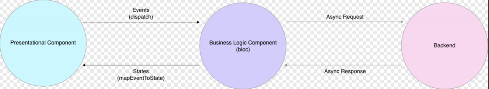

- [**OC知识点(I)**](./../iOS/Objective-C/知识点(I).md)
- [**Swift知识点(I)**](./../iOS/Swift/知识点(I).md)
- [**React知识点**](./../React/React知识点.md)


> <h2 id=''></h2>
- [**原生**](#原生)
	- [如何与iOS和Android通信](#如何与iOS和Android通信)
- [**类**](#类)
- [**关键字**](#关键字)
	- [mixin、extends、implement之间的关系?](#mixinextendsimplement之间的关系)
	- [mixin](#mixin)
		- [mixin怎么指定异常类型](#mixin怎么指定异常类型)
- [**Widget组件**](#Widget组件)
	- 状态
		- createState方法什么时候调用?state里为什么可以直接获取到widget对象?
	- [StatefulWidget生命周期](#StatefulWidget生命周期)
	- widget频繁更改创建是否会影响性能?复用和更新机制是怎么样的?
	- [widget有几种key](#widget有几种key)
		- [什么时候用key](#什么时候用key)
	- [什么是 Widgets、RenderObjects 和 Elements？](#什么是WidgetRenderObjects和Elements)
		- [1).Widget](#1_Widget)
		- [2).Element](#2_Element)
		- [3).RenderObject](#3_RenderObject)
		- [4).三者关系如何](#4_三者关系如何?)
		- widget和Element什么关系?是一一对应的吗?
	- [哪三棵树?](#哪三棵树?)
	- [Widget、State、Context的核心概念和是为了解决什么问题?](#WidgetStateContext的核心概念和是为了解决什么问题)
	- [简述StatelessWidget和StatefulWidget两种状态组件类](#简述StatelessWidget和StatefulWidget两种状态组件类)
	- [为什么Navigator可以实现无需上下文路由导航？](#为什么Navigator可以实现无需上下文路由导航)
	- [main()和runApp()函数在flutter的作用分别是什么？有什么关系吗？](#main和runApp函数在flutter的作用分别是什么有什么关系吗)
- [线程](#线程)
	- [Dart多任务如何并行的？](#Dart多任务如何并行的)
	- [Stream与Future是什么关系](#Stream与Future是什么关系)
		- [Stream](#Stream)
			- [Stream有哪两种订阅模式？分别是怎么调用的？](#Stream有哪两种订阅模式分别是怎么调用的)
		- [Future](#Future)
	- [Future和Isolate有什么区别](#Future和Isolate有什么区别)
		- [怎么理解Isolate？](#怎么理解Isolate)
		- [isolate是怎么进行通信和实例化的？](#isolate是怎么进行通信和实例化的)
		- [Future和Isolate有什么区别？](#Future和Isolate有什么区别)
		- [简述Flutter的线程管理模型](#简述Flutter的线程管理模型)
	- [await for 如何使用?](#awaitfor如何使用)
- [**数据**](#数据)
	- [使用哪几种流行的数据库软件包？](#使用哪几种流行的数据库软件包)
- [**底层**](#底层)
	- [Flutter是怎么完成组件渲染的](#Flutter是怎么完成组件渲染的)
	- [简单解释下FrameWork层和Engine层](#简单解释下FrameWork层和Engine层)
	- flutter绘制原理是什么?
	- [简述Flutter的绘制流程](#简述Flutter的绘制流程)
	- [热重载](#热重载)
	- [Provider原理解析](#Provider原理解析)
	- [Provider种类](#Provider种类)
- [**设计模式**](#设计模式)
	- [响应式编程的三元素](#响应式编程的三元素)
	- [Bloc和MVVM](#Bloc和MVVM)
		- [Bloc模式](#Bloc模式)
		- [MVVM模式](#MVVM模式)
	- [**库**](#库)
		- [flutter_bloc](#flutter_bloc)
			- [Bloc](#Bloc)
			- [BlocBuilder](#BlocBuilder)
			- [BlocProvider](#BlocProvider)
			- [BlocProviderTree](#BlocProviderTree)
		- [flutter_redux](#flutter_redux)
			- 	[flutter_redux几个类作用](#)
		- [FlutterBoost](#FlutterBoost)
- **参考资料**
	- **状态**
		- [状态管理 - 初探与总结](https://juejin.cn/post/6844903842992095240)
	- [flutter_dating_template](https://github.com/meetqy/flutter_dating_template)
	- **设计模式**
		- [Streams和BLoC](https://segmentfault.com/a/1190000016426215)
		- [Steams 和 BLoC 实践范例](https://juejin.cn/post/6844903759642886152)
		- [状态管理探索篇——BLoC(三)](https://juejin.cn/post/6844903689082109960)
		- [基于Bloc框架的封装](https://blog.csdn.net/lizubing1992/article/details/93061005)
		- [状态管理之BLoC的封装](https://juejin.cn/post/6844903710192041998)
		- [使用Provider实现MVVM状态管理架构](https://examplecode.cn/2020/05/09/flutter-provider-mvvm/)
	- **案例**
		- [使用 Flutter for web 构建了 100+ Widget 实时预览示例](https://juejin.cn/post/6844903918410039303)
		- [基于BLoC完整Flutter App项目](https://www.jianshu.com/p/be0107298bc5)
	- **常用库**
		- [BLoc库](https://pub.dev/packages/bloc)
		- [flutter_bloc: ^8.1.2](https://pub.flutter-io.cn/packages/flutter_bloc)
		- [权限管理库permission_handler](https://blog.csdn.net/huchengzhiqiang/article/details/91449640)


<br/>

***
<br/>
<br/>


> <h1 id='原生'>原生</h1>


<br/>

> <h2 id='如何与iOS和Android通信'>如何与iOS和Android通信</h2>


- **Flutter 通过 PlatformChannel 与原生进行交互，其中 PlatformChannel 分为三种：**

	- BasicMessageChannel：用于传递字符串和半结构化的信息。
	
	- MethodChannel：用于传递方法调用。Flutter主动调用Native的方法，并获取相应的返回值。
	
	- EventChannel：用于数据流（event streams）的通信。

<br/>


- **有三种 PlatformChannel 种类，适用于不同的场景：**

- MethodChannel:以方法的模式使用 PlatformChannel

- EventChannel: 以事件的模式使用 PlatformChannel

- BasicMessageChannel:可以在 BasicMessageChannel 上方便的进行自定义扩展，主要用于个性化的扩展。

<br/>
<br/>

> <h2 id=''></h2>

<br/>
<br/>

> <h2 id=''></h2>

<br/>
<br/>

> <h2 id=''></h2>

<br/>


<br/>

***
<br/>
<br/>


> <h1 id='类'>类</h1>


<br/>
<br/>


> <h2 id=''></h2>


<br/>

***
<br/>
<br/>


> <h1 id='关键字'>关键字</h1>


<br/>

> <h2 id='mixinextendsimplement之间的关系'>mixin、extends、implement之间的关系?</h2>


- 继承（关键字 extends）、混入 mixins （关键字 with）、接口实现（关键字 implements）。这三者可以同时存在，前后顺序是extends -> mixins -> implements。

- Flutter中的继承是单继承，子类重写超类的方法要加@Override，子类调用超类的方法要用super。

- 在Flutter中，Mixins是一种在多个类层次结构中复用类代码的方法。mixins的对象是类，mixins绝不是继承，也不是接口，而是一种全新的特性，可以mixins多个类，mixins的使用需要满足一定条件。

- 如果有一个类 A,你想让类B拥有A的API，但又不想拥有A里的实现，那么你就应该把A当做接口，类B implements 类A.


<br/>
<br/>


> <h2 id='mixin'>mixin</h2>


首先mixin是一个定义类的关键字。直译出来是混入，混合的意思 Dart为了支持多重继承，引入了mixin关键字，它最大的特殊处在于： mixin定义的类不能有构造方法，这样可以避免继承多个类而产生的父类构造方法冲突


<br/>

- **使用mixins的条件：**

	- mixins类只能继承自object
	- mixins类不能有构造函数
	- 一个类可以mixins多个mixins类
	- 可以mixins多个类，不破坏Flutter的单继承

<br/>
<br/>


> <h3 id='mixin怎么指定异常类型'>mixin 怎么指定异常类型?</h3>


on 一个类：

```
class A {
  void a(){
    print("a");
  }
}


mixin X on A{
  void x(){
    print("x");
  }
}


class mixinsX extends A with X{
}
```

on 的是一个接口： 得首先实现这个接口，然后再用mix

```
class A {
  void a(){
    print("a");
  }
}

mixin X on A{
  void x(){
    print("x");
  }
}

class implA implements A{
  @override
  void a() {}
}

class mixinsX2 extends implA with X{
}
```


<br/>
<br/>


> <h2 id=''></h2>


<br/>
<br/>


> <h2 id=''></h2>


<br/>
<br/>


> <h2 id=''></h2>


<br/>
<br/>


> <h2 id=''></h2>


<br/>
<br/>


> <h2 id=''></h2>


<br/>
<br/>


> <h2 id=''></h2>


<br/>
<br/>


> <h2 id=''></h2>


<br/>
<br/>


> <h2 id=''></h2>


<br/>

***
<br/>
<br/>


> <h1 id='状态'>状态</h1>


<br/>


<br/>
<br/>


> <h2 id=''></h2>


<br/>
<br/>


> <h2 id=''></h2>


<br/>
<br/>


> <h2 id=''></h2>


<br/>
<br/>


> <h2 id=''></h2>


<br/>
<br/>


> <h2 id=''></h2>


<br/>
<br/>


> <h2 id=''></h2>


<br/>

***
<br/>
<br/>


> <h1 id='Widget组件'>Widget组件</h1>


> <h2 id='StatefulWidget生命周期'>StatefulWidget生命周期</h2>


- initState()：Widget 初始化当前 State，在当前方法中是不能获取到 Context 的，如想获取，可以试试 Future.delayed()

- didChangeDependencies()：在 initState() 后调用， State对象依赖关系发生变化的时候也会调用。

- deactivate()：当 State 被暂时从视图树中移除时会调用这个方法，页面切换时也会调用该方法，和Android里的 onPause 差不多。

- dispose()：Widget 销毁时调用。

- didUpdateWidget：Widget 状态发生变化的时候调用。


<br/>
<br/>
<br/>


> <h2 id='widget有几种key'>widget有几种key</h2>


- **主要有2种类型的Key：**
	- GlobalKey（确保生成的Key在整个应用中唯一，是很昂贵的，允许element在树周围移动或变更父节点而不会丢失状态）
	- LocalKey(包含下面3种)
		- UniqueKey
		- ObjectKey
		- valueKey


&emsp; 在flutter中，每个widget都是被唯一标识的。这个唯一标识在build或rendering阶段由框架定义。该标识对应于可选的Key参数，如果省略，Flutter将会自动生成一个。


<br/>
<br/>

> <h3 id='什么时候用key'>什么时候用key</h3>


- **ValueKey**是先比较类型,然后比较其值,源码如下:

```
@override
  bool operator ==(Object other) {
    if (other.runtimeType != runtimeType)
      return false;
    return other is ValueKey<T>
        && other.value == value;
  }
```


例如: ValueKey如果您有一个 Todo List应用程序，它将会记录你需要完成的事情。我们假设每个 Todo事情都各不相同，而你想要对每个 Todo 进行滑动删除操作

```
return TodoItem(
    key: ValueKey("value1Name"),
    todo: todo,
    onDismissed: (direction){
        _removeTodo(context, todo);
    },
);
```


<br/>


- ObjectKey先比较类型，当类型不一致，判定为不是同一个对象.如果另外一个也是ObjectKey,则判断地址是否相同，只有地址相同才判定为同一个对象

```
@override
  bool operator ==(Object other) {
    if (other.runtimeType != runtimeType)
      return false;
    return other is ObjectKey
        && identical(other.value, value);
  }
```


例如: 如果你有一个生日应用，它可以记录某个人的生日，并用列表显示出来，同样的还是需要有一个滑动删除操作。我们知道人名可能会重复，这时候你无法保证给 Key 的值每次都会不同。但是，当人名和生日组合起来的 Object 将具有唯一性。这时候你需要使用 ObjectKey！官方显示比较类型，当类型不一致，判定为不是通过一个对象，如果另外一个也是ObjectKey,则判断地址是否相同，只有地址相同才判定为同一个对象。

```
@override
  bool operator ==(Object other) {
    if (other.runtimeType != runtimeType)
      return false;
    return other is ObjectKey
        && identical(other.value, value);
  }
```


<br/>

- 每次生成不同的值，当我们每次刷新都需要一个新的值，那么正是这个存在的意义。

我们每次刷新就生成一个新的 颜色，并且渐隐渐显效果。

```
AnimatedSwitcher(
  duration: Duration(milliseconds: 1000),
  child: Container(
    key: UniqueKey(),
    height: 100,
    width: 100,
    color: Colors.primaries[count % Colors.primaries.length],
  ),
)
```


如果组合的 Object 都无法满足唯一性的时候，你想要确保每一个 Key 都具有唯一性。那么，你可以使用UniqueKey。它将会通过该对象生成一个具有唯一性的 hash 码。不过这样做，每次 Widget 被构建时都会去重新生成一个新的 UniqueKey，失去了一致性。也就是说你的小部件还是会改变。（还不如不用😂）


<br/>

- PageStorageKey:当你有一个滑动列表，你通过某一个 Item 跳转到了一个新的页面，当你返回之前的列表页面时，你发现滑动的距离回到了顶部。这时候，给 Sliver 一个 PageStorageKey！它将能够保持 Sliver 的滚动状态。


<br/>

- GlobalKey:GlobalKey 能够跨 Widget 访问状态。 在这里我们有一个 Switcher 小部件，它可以通过 changeState 改变它的状态。


作为全局使用的key,当跨小部件我们通常可以使用GlobalKey来刷新其他小部件。

&emsp; GlobalObjectKey和ObjectKey是否相等的判定条件是一致的，GlobalObjectKey继承GlobalKey,通过GlobalKey<T extends State<StatefulWidget>>来指定继承state，并实现StatefulWidget接口的类，然后可以通过GlobalKey.currentState来获取当前state,然后调用state.setState((){})完成当前小部件标记为dirty，在下一帧刷新当前小部件。

```
class _ScreenState extends State<Screen> {
  final GlobalKey<SwitcherScreenState> key = GlobalKey<SwitcherScreenState>();

  @override
  Widget build(BuildContext context) {
    return Scaffold(
      body: SwitcherScreen(
        key: key,
      ),
      floatingActionButton: FloatingActionButton(onPressed: () {
        key.currentState.changeState();
      }),
    );
  }
}
```


<br/>
<br/>

> <h2 id='什么是WidgetRenderObjects和Elements'>什么是Widget、RenderObjects和Elements?</h2>

<br/>

> <h3 id='1_Widget'>1).Widget</h3>


&emsp; Widget会被inflate（填充）到Element，并由Element管理底层渲染树。Widget并不会直接管理状态及渲染,而是通过State这个对象来管理状态。

&emsp; Flutter创建Element的可见树，相对于Widget来说，是可变的，通常界面开发中，我们不用直接操作Element,而是由框架层实现内部逻辑。

&emsp; 比如一个UI视图树中，可能包含有多个TextWidget(Widget被使用多次)，但是放在内部视图树的视角，这些TextWidget都是填充到一个个独立的Element中。

&emsp; Element会持有renderObject和widget的实例。记住，Widget 只是一个配置，RenderObject 负责管理布局、绘制等操作。

<br/>

&emsp; 在第一次创建 Widget 的时候，会对应创建一个 Element， 然后将该元素插入树中。如果之后 Widget 发生了变化，则将其与旧的 Widget 进行比较，并且相应地更新 Element。重要的是，Element 不会被重建，只是更新而已。

&emsp; Widget 仅用于存储渲染所需要的信息。

&emsp; Widget是用户界面的一部分,并且是不可变的。

&emsp; 我们平时用 Widget使用声明式的形式写出来的界面，可以理解为 Widget 树，这是要介绍的第一棵树。


<br/>
<br/>

> <h3 id='2_Element'>2).Element</h3>


&emsp; Element 才是这颗巨大的控件树上的实体。

&emsp; Element是在树中特定位置Widget的实例。

&emsp; Widget 树是非常不稳定的，动不动就执行build方法，一旦调用 build 方法意味着这个 Widget 依赖的所有其他 Widget 都会重新创建，如果 Flutter 直接解析 Widget树，将其转化为 RenderObject 树来直接进行渲染，那么将会是一个非常消耗性能的过程，那对应的肯定有一个东西来消化这些变化中的不便，来做cache。

&emsp; 因此，这里就有另外一棵树 Element 树。Element 树这一层将 Widget 树的变化（类似 React 虚拟 DOM diff）做了抽象，可以只将真正需要修改的部分同步到真实的 RenderObject 树中，最大程度降低对真实渲染视图的修改，提高渲染效率，而不是销毁整个渲染视图树重建。


<br/>
<br/>


> <h3 id='3_RenderObject'>3).RenderObject</h3>

****

&emsp; RenderObject 负责管理布局、绘制等操作。

&emsp; RenderObject是渲染树中的一个对象，它的层次结构是渲染库的核心。

&emsp; Flutter 引擎需要把我们写的 Widget 树的信息都渲染到界面上，这样人眼才能看到，跟渲染有关的当然有一颗渲染树 RenderObject tree，这是第二颗树，渲染树节点叫做 RenderObject，这个节点里面处理布局、绘制相关的事情。这两个树的节点并不是一一对应的关系，有些 Widget是要显示的，有些 Widget ，比如那些继承自 StatelessWidget & StatefulWidget 的 Widget 只是将其他 Widget 做一个组合，这些 Widget 本身并不需要显示，因此在 RenderObject 树上并没有相对应的节点


<br/>

三棵树如下图所示:


<br/>
<br/>

 

> <h3 id='4_三者关系如何?'>4).三者关系如何?</h3>


<br/>
<br/>

> <h2 id='哪三棵树?'>哪三棵树?</h2>


- widget树;
- element树(不包含业务,只管绘制);
- render(渲染树)树(根据element树计算所需要显示的树)

&emsp; 把widget中绘制的部分給分离出来形成了element树.这个主要是在widget中的绘制方法 **Widget build(BuildContext context)**,业务相关的不用管它.


<br/>
<br/>

> <h2 id='WidgetStateContext的核心概念和是为了解决什么问题'>Widget、State、Context 的核心概念和是为了解决什么问题？</h2>


- Widget: 在Flutter中，几乎所有东西都是Widget。将一个Widget想象为一个可视化的组件（或与应用可视化方面交互的组件），当你需要构建与布局直接或间接相关的任何内容时，你正在使用Widget。

- Widget树: Widget以树结构进行组织。包含其他Widget的被称为父Widget(或widget容器)。包含在父widget中的widget被称为子Widget。

- Context: 仅仅是已创建的所有Widget树结构中的某个Widget的位置引用。简而言之，将context作为widget树的一部分，其中context所对应的widget被添加到此树中。**一个context只从属于一个widget**，它和widget一样是链接在一起的，并且会形成一个context树。

- State: 定义了StatefulWidget实例的行为，它包含了用于”交互/干预“Widget信息的行为和布局。应用于State的任何更改都会强制重建Widget。


<br/>
<br/>

> <h2 id=''></h2>


<br/>
<br/>

> <h2 id=''></h2>


<br/>
<br/>

> <h2 id=''></h2>


<br/>
<br/>

> <h2 id=''></h2>


<br/>
<br/>

> <h2 id=''></h2>


<br/>
<br/>

> <h2 id='简述StatelessWidget和StatefulWidget两种状态组件类'>简述StatelessWidget和StatefulWidget两种状态组件类？</h2>


**1.StatelessWidget**

&emsp; 一旦创建就不关心任何变化，在下次构建之前都不会改变。它们除了依赖于自身的配置信息（在父节点构建时提供）外不再依赖于任何其他信息。比如典型的Text、Row、Column、Container等，都是StatelessWidget。

&emsp; 它的生命周期相当简单：初始化、通过build()渲染。


<br/>
<br/>

**StatefulWidget**

&emsp; 在生命周期内，该类Widget所持有的数据可能会发生变化，这样的数据被称为State，这些拥有动态内部数据的Widget被称为StatefulWidget。比如复选框、Button等。State会与Context相关联，并且此关联是永久性的，State对象将永远不会改变其Context，即使可以在树结构周围移动，也仍将与该context相关联。

&emsp; 当state与context关联时，state被视为已挂载。StatefulWidget由两部分组成，在初始化时必须要在createState()时初始化一个与之相关的State对象。


<br/>
<br/>


> <h2 id='为什么Navigator可以实现无需上下文路由导航'>为什么Navigator可以实现无需上下文路由导航？</h2>

&emsp; Navigator是在Flutter中负责管理维护页面堆栈的导航器。MaterialApp在需要的时候，会自动为我们创建Navigator。

&emsp; Navigator.of(context)，会使用context来向上遍历Element树，找到MaterialApp提供的NavigatorState再调用其push/pop方法完成导航操作。

&emsp; 所以如果在MaterialApp的navigatorKey属性内设置好一个Key就可以直接使用这个Key来进行路由导航，无需上下文。


<br/>
<br/>


> <h2 id='main和runApp函数在flutter的作用分别是什么有什么关系吗'>main()和runApp()函数在flutter的作用分别是什么？有什么关系吗？</h2>


- main函数是类似于java语言的程序运行入口函数

- runApp函数是渲染根widget树的函数

&emsp; 一般情况下runApp函数会在main函数里执行


<br/>

***
<br/>
<br/>


> <h1 id='数据'>数据</h1>

<br/>

> <h2 id='使用哪几种流行的数据库软件包'>使用哪几种流行的数据库软件包？</h2>


Flutter中使用最普遍的数据库软件包如下：

- sqflite数据库：它允许访问和操作SQLite数据库。
- Firebase数据库：它将使你能够访问和操作云数据库。

<br/>
<br/>


> <h2 id=''></h2>


<br/>
<br/>


> <h2 id=''></h2>


<br/>

***
<br/>
<br/>


> <h1 id='线程'>线程</h1>


<br/>

> <h1 id='Dart多任务如何并行的'>Dart多任务如何并行的？</h1>


&emsp; Dart不存在多线程，那如何进行多任务并行？

&emsp; Dart当中提供了一个类似于新线程，但是不共享内存的独立运行的 worker - isolate。

&emsp; 在dart中，一个Isolate对象其实就是一个isolate执行环境的引用，一般来说我们都是通过当前的isolate去控制其他的isolate完成彼此之间的交互.

&emsp; 而当我们想要创建一个新的Isolate.可以使用 Isolate.spawn方法获取返回的一个新的isolate对象，两个isolate之间使用SendPort相互发送消息，而isolate中也存在了一个与之对应的ReceivePort接受消息用来处理，但是我们需要注意的是，ReceivePort和SendPort在每个isolate都有一对，只有同一个isolate中的ReceivePort才能接受到当前类的SendPort发送的消息并且处理。


<br/>


> <h2 id='Stream与Future是什么关系'>Stream与Future是什么关系</h2>


- 在 Flutter 中有两种处理异步操作的方式 Future 和 Stream，Future 用于处理单个异步操作，Stream 用来处理连续的异步操作。

- Stream 和 Feature 不同的地方是 Stream 可以接收多个异步结果，而Feature 只有一个。

- Stream 和 Future 是 Dart 异步处理的核心 API。Future 表示稍后获得的一个数据，所有异步的操作的返回值都用 Future来表示。但是Future只能表示一次异步获得的数据。而Stream表示多次异步获得的数据。比如界面上的按钮可能会被用户点击多次，所以按钮上的点击事件（onClick）就是一个Stream。简单地说，Future将返回一个值，而Stream将返回多次值。Dart中统一使用Stream处理异步事件流。Stream和一般的集合类似，都是一组数据，只不过一个是异步推送，一个是同步拉取。


<br/>
<br/>


> <h3 id='Stream'>Stream</h3>


- Stream 的创建可以使用Stream.fromFuture，也可以使用 StreamController 来创建和控制。

- 普通的 Stream只可以有一个订阅者，如果想要多订阅的话，要使用 asBroadcastStream()。


<br/>
<br/>

> <h4 id='Stream有哪两种订阅模式分别是怎么调用的'>Stream有哪两种订阅模式？分别是怎么调用的？</h4>


Stream有两种订阅模式：**单订阅(single) 和 多订阅（broadcast）**。


<br/>

&emsp; 单订阅就是只能有一个订阅者，而广播是可以有多个订阅者。这就有点类似于消息服务（Message Service）的处理模式。

&emsp; 单订阅类似于点对点，在订阅者出现之前会持有数据，在订阅者出现之后就才转交给它。而广播类似于发布订阅模式，可以同时有多个订阅者，当有数据时就会传递给所有的订阅者，而不管当前是否已有订阅者存在。

&emsp; Stream 默认处于单订阅模式，所以同一个 stream 上的 listen 和其它大多数方法只能调用一次，调用第二次就会报错。

&emsp; 但 Stream 可以通过 transform() 方法（返回另一个 Stream）进行连续调用。通过 Stream.asBroadcastStream() 可以将一个单订阅模式的 Stream 转换成一个多订阅模式的 Stream，isBroadcast 属性可以判断当前 Stream 所处的模式。


<br/>
<br/>


> <h3 id='Future'>Future</h3>

- **介绍:**
	- Dart 在单线程中是以消息循环机制来运行的，其中包含两个任务队列，一个是“微任务队列” microtask queue，另一个叫做“事件队列” event queue。
	
	- Future 默认情况下其实就是往「事件队列」里插入一个事件，当有空余时间的时候就去执行，当执行完毕后会回调 Future.then(v) 方法。
	
	- 而我们也可以通过使用 Future.microtask 方法来向 「微任务队列」中插入一个任务，这样就会提高他执行的效率。因为在 Dart 每一个 isolate 当中，执行优先级为 ： Main > MicroTask > EventQueue


<br/>
<br/>


> <h3 id=''></h3>


<br/>
<br/>


> <h3 id=''></h3>


<br/>
<br/>


> <h2 id='Future和Isolate有什么区别'>Future和Isolate有什么区别</h2>


- future是异步编程，调用本身立即返回，并在稍后的某个时候执行完成时再获得返回结果。在普通代码中可以使用await 等待一个异步调用结束。

- isolate是并发编程，Dartm有并发时的共享状态，所有Dart代码都在isolate中运行，包括最初的main()。
	
	- 每个isolate都有它自己的堆内存，意味着其中所有内存数据，包括全局数据，都仅对该isolate可见，它们之间的通信只能通过传递消息的机制完成，消息则通过端口(port)收发。
	
	- isolate只是一个概念，具体取决于如何实现，比如在Dart VM中一个isolate可能会是一个线程，在Web中可能会是一个Web Worker。

<br/>
<br/>


> <h3 id='怎么理解Isolate'>怎么理解Isolate？</h3>

&emsp; isolate是Dart对actor并发模式的实现。 

&emsp; isolate是有自己的内存和单线程控制的运行实体。

&emsp; isolate本身的意思是“隔离”，因为isolate之间的内存在逻辑上是隔离的。

&emsp; isolate中的代码是按顺序执行的，任何Dart程序的并发都是运行多个isolate的结果。

&emsp; 因为Dart没有共享内存的并发，没有竞争的可能性所以不需要锁，也就不用担心死锁的问题


<br/>
<br/>


> <h3 id='isolate是怎么进行通信和实例化的'>isolate是怎么进行通信和实例化的？</h3>


&emsp; isolate线程之间的通信主要通过port来进行，这个port消息传递过程是异步的。通过dart源码可以看出，实例化一个isolate的过程包括：

- 实例化isolate结构体;
- 在堆中分配线程内存;
- 配置port等过程;

<br/>


&emsp; 下面是一个isolate的例子，例子中新建了一个isolate，并且绑定了一个方法网络请求和数据解析处理，并通过port将处理好的数据返回给调用方。


```
loadData() async {
  // 通过spawn新建一个isolate，并绑定静态方法
  ReceivePort receivePort = ReceivePort();
  await Isolate.spawn(dataLoader, receivePort.sendPort);

  // 获取新的isolate监听port
  SendPort sendPort = await receivePort.first;
  //调用sendReceive自定义方法
  List dataList = await sendReceive(sendPort,
      'http://www.flutterj.com');
  print('dataList $dataList');
}

// isolate绑定方法
static dataLoader(SendPort sendPort) async {
  // 创建监听port，并将sendPort传给外界来调用
  ReceivePort receivePort = ReceivePort();
  sendPort.send(receivePort.sendPort);
// 监听外界调用
  await for (var msg in receivePort) {
    String requestURL = msg[0];
    SendPort callbackPort = msg[1];

    Client client = Client();
    Response response = await client.get(requestURL);
    List dataList = json.decode(response.body);
// 回调返回值给调用者
    callbackPort.send(dataList);
  }
}

// 创建自己的监听port，并且向新的isolate发送消息
Future sendReceive(SendPort sendPort, String url) {
  ReceivePort receivePort = ReceivePort();
  sendPort.send([url, receivePort.sendPort]);
// 接收到返回值， 返回给调用者
  return receivePort.first;
}
```


<br/>
<br/>


> <h3 id='Future和Isolate有什么区别'>Future和Isolate有什么区别？</h3>


- future是异步编程，调用本身立即返回，并在稍后的某个时候执行完成时再获得返回结果。在普通代码中可以使用await 等待一个异步调用结束。

- isolate是并发编程，Dartm有并发时的共享状态，所有Dart代码都在isolate中运行，包括最初的main()。

- 每个isolate都有它自己的堆内存，意味着其中所有内存数据，包括全局数据，都仅对该isolate可见，它们之间的通信只能通过传递消息的机制完成，消息则通过端口(port)收发。isolate只是一个概念，具体取决于如何实现，比如在Dart VM中一个isolate可能会是一个线程，在Web中可能会是一个Web Worker。


<br/>
<br/>


> <h3 id='简述Flutter的线程管理模型'>简述Flutter的线程管理模型</h3>


&emsp; 默认情况下，Flutter Engine层会创建一个Isolate，并且Dart代码默认就运行在这个主Isolate上。必要时可以使用spawnUri和spawn两种方式来创建新的Isolate，在Flutter中，新创建的Isolate由Flutter进行统一的管理。

&emsp; 事实上，Flutter Engine自己不创建和管理线程，Flutter Engine线程的创建和管理是Embeder负责的，Embeder指的是将引擎移植到平台的中间层代码，Flutter Engine层的架构示意图如下图所示:


&emsp; 在Flutter的架构中，Embeder提供四个Task Runner，分别是Platform Task Runner、UI Task Runner Thread、GPU Task Runner和IO Task Runner，每个Task Runner负责不同的任务，Flutter Engine不在乎Task Runner运行在哪个线程，但是它需要线程在整个生命周期里面保持稳定。


<br/>
<br/>


> <h3 id='awaitfor如何使用'>await for 如何使用?</h3>

await for是不断获取stream流中的数据，然后执行循环体中的操作。它一般用在直到stream什么时候完成，并且必须等待传递完成之后才能使用，不然就会一直阻塞。

```
Stream<String> stream = new Stream<String>.fromIterable(['不开心', '面试', '没', '过']);
main() async{
  print('上午被开水烫了脚');
  await for(String s in stream){
    print(s);
  }
  print('晚上还没吃饭');
}
```


<br/>
<br/>


> <h2 id=''></h2>


<br/>
<br/>


> <h3 id=''></h3>


<br/>
<br/>

> <h3 id=''></h3>


<br/>
<br/>


<br/>
<br/>


> <h2 id=''></h2>


<br/>
<br/>


> <h3 id=''></h3>


<br/>
<br/>


> <h2 id=''></h2>


<br/>
<br/>


> <h3 id=''></h3>


<br/>
<br/>


> <h2 id=''></h2>


<br/>
<br/>


> <h3 id=''></h3>


<br/>
<br/>


> <h2 id=''></h2>


<br/>
<br/>


> <h3 id=''></h3>


<br/>
<br/>


> <h2 id=''></h2>


<br/>
<br/>


> <h3 id=''></h3>


<br/>
<br/>


> <h2 id=''></h2>


<br/>
<br/>


> <h3 id=''></h3>


<br/>
<br/>


> <h2 id=''></h2>


<br/>
<br/>


> <h3 id=''></h3>


<br/>

***
<br/>
<br/>


> <h1 id='底层'>底层</h1>


<br/>


> <h2 id='Flutter是怎么完成组件渲染的'>Flutter是怎么完成组件渲染的</h2>

&emsp; 在计算机系统中，图像的显示需要CPU、GPU和显示器一起配合完成CPU负责图像数据计算，GPU负责图像数据渲染，而显示器则负责最终图像显示。CPU把计算好的、需要显示的内容交给GPU，由GPU完成渲染后放入帧缓冲区，随后视频控制器根据垂直同步信号以每秒60次的速度，从帧缓冲区读取帧数据交由显示器完成图像显示。操作系统在呈现图像时遵循了这种机制。

&emsp; 而Flutter作为跨平台开发框架也采用了这种底层方案，UI线程使用Dart语言来构建视图结构数据，这些数据会在GPU线程进行图层合成，随后交给图像渲染引擎Skia加工成GPU数据，而这些数据会通过OpenGL最终提供给GPU渲染。

&emsp; 可以看到Flutter用了计算机最基本的图像渲染技术，摒弃其他一些通道和过程，用最直接的方式完成了图形显示，自然性能也就得到了保障。


<br/>
<br/>

> <h2 id=''></h2>


<br/>
<br/>


> <h2 id='简单解释下FrameWork层和Engine层'>简单解释下FrameWork层和Engine层</h2>


- **FrameWork层**

	- Flutter的顶层是用drat编写的框架（SDK），它实现了一套基础库，包含Material（Android风格UI）和Cupertino（iOS风格）的UI界面，下面是通用的Widgets（组件），之后是一些动画、绘制、渲染、手势库等。这个纯 Dart实现的 SDK被封装为了一个叫作 dart:ui的 Dart库。我们在使用 Flutter写 App的时候，直接导入这个库即可使用组件等功能。


<br/>


- **Engine层**

	- Skia是Google的一个 2D的绘图引擎库，其前身是一个向量绘图软件，Chrome和 Android均采用 Skia作为绘图引擎。Skia提供了非常友好的 API，并且在图形转换、文字渲染、位图渲染方面都提供了友好、高效的表现。Skia是跨平台的，所以可以被嵌入到 Flutter的 iOS SDK中，而不用去研究 iOS闭源的 Core Graphics / Core Animation。Android自带了 Skia，所以 Flutter Android SDK要比 iOS SDK小很多。

	- 第二是Dart 运行时环境
	
	- 第三文本渲染布局引擎。


<br/>

- **总结:**
	
	- 由上图可知，Flutter框架自下而上分为Embedder、Engine和Framework三层;
	
	- Embedder是操作系统适配层，实现了渲染 Surface设置，线程设置，以及平台插件等平台相关特性的适配；
	
	- Engine层负责图形绘制、文字排版和提供Dart运行时，Engine层具有独立虚拟机，正是由于它的存在，Flutter程序才能运行在不同的平台上，实现跨平台运行；

	- Framework层则是使用Dart编写的一套基础视图库，包含了动画、图形绘制和手势识别等功能，是使用频率最高的一层


<br/>
<br/>


> <h2 id='简述Flutter的绘制流程'>简述Flutter的绘制流程</h2>

Flutter的绘制流程如下图所示:


&emsp; Flutter只关心向 GPU提供视图数据，GPU的 VSync信号同步到 UI线程，UI线程使用 Dart来构建抽象的视图结构，这份数据结构在 GPU线程进行图层合成，视图数据提供给 Skia引擎渲染为 GPU数据，这些数据通过 OpenGL或者 Vulkan提供给 GPU

<br/>
<br/>


> <h2 id='热重载'>热重载</h2>


&emsp; Flutter 的热重载是基于 JIT 编译模式的代码增量同步。由于 JIT 属于动态编译，能够将 Dart 代码编译成生成中间代码，让 Dart VM 在运行时解释执行，因此可以通过动态更新中间代码实现增量同步。

&emsp; 热重载的流程可以分为 5 步，包括：扫描工程改动、增量编译、推送更新、代码合并、Widget 重建。Flutter 在接收到代码变更后，并不会让 App 重新启动执行，而只会触发 Widget 树的重新绘制，因此可以保持改动前的状态，大大缩短了从代码修改到看到修改产生的变化之间所需要的时间。

&emsp; 另一方面，由于涉及到状态的保存与恢复，涉及状态兼容与状态初始化的场景，热重载是无法支持的，如改动前后 Widget 状态无法兼容、全局变量与静态属性的更改、main 方法里的更改、initState 方法里的更改、枚举和泛型的更改等。

&emsp; 可以发现，热重载提高了调试 UI 的效率，非常适合写界面样式这样需要反复查看修改效果的场景。但由于其状态保存的机制所限，热重载本身也有一些无法支持的边界。


<br/>
<br/>


> <h2 id='Provider原理解析'>Provider原理解析</h2>

&emsp; 打开源码，最先注意到的就是Provider类。 此Provider非标题中的Provider。此处的Provider 顾名思义，只是一个数据的提供者，他只是对InheritedWidget的一层封装，方便我们对数据的操作。

- 继承自InheritedProvider
- 需要指定一个泛型T
- 一个普通构造器和一个命名构造器
- 一个静态方法static T of<T>(BuildContext context, {bool listen = true})，返回指定泛型为T的对象


<br/>
<br/>


> <h2 id='Provider种类'>Provider种类</h2>

- **可以通过各种不同的provider来应对具体的需求:**

	- Provider 最基础的provider,它会获取一个值并将它暴露出来
	
	- ListenableProvider 用来暴露可监听的对象，该provider将会监听对象的改变以便及时更新组件状态
	
	- ChangeNotifierProvider ListerableProvider依托于ChangeNotifier的一个实现，它将会在需要的时候自动调用ChangeNotifier.dispose方法
	
	- ValueListenableProvider 监听一个可被监听的值，并且只暴露ValueListenable.value方法
	
	- StreamProvider 监听一个流，并且暴露出其最近发送的值
	
	- FutureProvider 接受一个Future作为参数，在这个Future完成的时候更新依赖


<br/>
<br/>


> <h2 id=''></h2>


<br/>
<br/>


> <h2 id=''></h2>


<br/>
<br/>


> <h2 id=''></h2>


<br/>
<br/>


> <h2 id=''></h2>


<br/>
<br/>


> <h2 id=''></h2>


<br/>
<br/>


> <h2 id=''></h2>


<br/>

***
<br/>
<br/>


> <h1 id='设计模式'>设计模式</h1>

<br/>

> <h2 id='响应式编程的三元素'>响应式编程的三元素</h2>

- **三元素**
	- StreamController：数据流管道
	- StreamSink：发出消息
	- Stream：收到消息


<br/>

- 首先在 StreamControlState 里实现 StreamController

- StreamSink 通过 _streamController.sink 获取;

- Stream 通过 _streamController.stream 获取


<br/>

&emsp; 然后就可以通过 _sink 发送消息，在 _stream 处接受消息，这里你肯定会比较迷惑，发送一个消息，为什么搞的这么麻烦？

&emsp; 这正是响应式编程的魅力所在，如果直接发送，那么就是同步的，如果要实现异步发送，按照正常的实现，就必须要写很多监听和回调，很容易陷入回调陷阱，而在响应式编程里，我们只需关心 _sink 和 _stream，在 _sink 里发送消息，在 _stream 处接受消息，不需要写额外的监听和回调.

&emsp; StreamController 会帮我们处理，而且在 StreamController 里也可以对接受到的数据处理后在发送。


<br/>
<br/>


> <h2 id='Bloc和MVVM'>Bloc和MVVM</h2>


> <h2 id='Bloc模式'>Bloc模式</h2>

**1.Bloc图**



BLoC模式由来自Google的Paolo Soares和Cong Hui设计，并在2018年DartConf期间（2018年1月23日至24日）首次展示。

<br/>

- **业务逻辑（Business Logic ）**

	- 转移到一个或几个BLoC，
	- 尽可能从表现层中删除。 换句话说，UI组件应该只关心UI事物而不关心业务
	- 依赖Streams独家使用输入（Sink）和输出（流）
	- 保持平台独立
	- 保持环境独立
	- BLoC模式最初被设想为允许独立于平台重用相同的代码：Web应用程序，移动应用程序，后端。
- Widgets通过Sinks向BLoC发送事件
- BLoC通过Stream通知Widgets，
- 由BLoC实现的业务逻辑不是他们关注的问题。


<br/>


下图是 BLoC 模式里的事件和状态流向图：


- Widget 向 BLoC 发送事件
- 事件会触发 BLoC 里的 sink
- 然后 Stream 会把 State 通知给 Widget


&emsp; 这里的 Event 是为了把 Widget 和具体的业务逻辑分离抽象出来的东西，State 就是 Widget 显示需要用到的数据，也是和业务逻辑分离的。

<br/>

**BLoC实现的业务逻辑层，具有以下的特点：**

- BLoC依赖响应式编程

- 有 Event 和 State


<br/>
<br/>

BLoC 实现了业务逻辑层和 UI 逻辑的分离，为此带来了巨大的好处：

- 可以用对 App 影响最小的方式修改业务逻辑
- 可以修改 UI，而不用担心影响业务逻辑
- 更加方便单元测试


<br/>


BLoC 模式的架构图，看到这里你觉得和某个模式很像，没错就是 MVVM

共有四层，从上到下分别是：
- UI Screen
- BLoC
- Repository
- Network Provider

Widget 对应的是 MVVM 里的 View，BLoC 对应的是 MVVM 里的 ViewModel，Repository 和 Network Provider 对应的是 MVVM 里的 Model。


<br/>

**简单Demo**

```
import 'dart:async';

import 'package:flutter/material.dart';

///Bloc + Stream
class BlocPage extends StatefulWidget {
  @override
  _BlocPageState createState() => _BlocPageState();
}

class _BlocPageState extends State<BlocPage> {
  final PageBloc _pageBloc = new PageBloc();

  @override
  void dispose() {
    _pageBloc.dispose();
    super.dispose();
  }

  @override
  Widget build(BuildContext context) {
    return Scaffold(
      appBar: AppBar(
        title: new Text("bloc"),
      ),
      body: Container(
        child: new StreamBuilder(
            initialData: 0,
            stream: _pageBloc.stream,
            builder: (context, snapShot) {
              return new Column(
                children: <Widget>[
                  new Expanded(
                      child: new Center(
                          child: new Text(snapShot.data.toString()))),
                  new Center(
                    child: new FlatButton(
                        onPressed: () {
                          _pageBloc.add();
                        },
                        color: Colors.blue,
                        child: new Text("+")),
                  ),
                  new Center(
                    child: new FlatButton(
                        onPressed: () {
                          _pageBloc.dec();
                        },
                        color: Colors.blue,
                        child: new Text("-")),
                  ),
                  new SizedBox(
                    height: 100,
                  )
                ],
              );
            }),
      ),
    );
  }
}


class PageBloc {
  int _count = 0;

  ///StreamController
  StreamController<int> _countController = StreamController<int>();

  ///对外提供入口
  StreamSink<int> get _countSink => _countController.sink;

  ///提供 stream StreamBuilder 订阅
  Stream<int> get stream => _countController.stream;

  void dispose() {
    _countController.close();
  }

  void add() {
    _count++;
    _countSink.add(_count);
  }

  void dec() {
    _count--;
    _countSink.add(_count);
  }
}

```


<br/>
<br/>


> <h3 id='MVVM模式'>MVVM模式</h3>


<br/>
<br/>


> <h2 id=''></h2>


<br/>
<br/>


> <h2 id=''></h2>


<br/>
<br/>


> <h2 id=''></h2>


<br/>
<br/>


> <h2 id=''></h2>


<br/>

***
<br/>
<br/>


> <h1 id='库'>库</h1>

<br/>


> <h2 id='flutter_bloc'>flutter_bloc</h2>

- **类分别是：**

	- Bloc
	- BlocBuilder
	- BlocProvider
	- BlocProviderTree
	- BlocListener
	- BlocListenerTree


<br/>
<br/>


> <h3 id='Bloc'>Bloc</h3>


&emsp; 可以看到 Bloc 类里包含了 Event、State，也有 sink、stream 响应式编程，不过 sink、stream 响应式编程已经被 flutter_bloc 框架实现，我们只要关心 Event 和 State 就行


<br/>
<br/>


> <h3 id='BlocBuilder'>BlocBuilder</h3>

&emsp; BlocBuilder 是一个 Widget，它的功能类似于前面讲的 StreamBuilder，但是使用起来更简单，BlocBuiler 监听 Bloc 的状态，当状态发生变化时，就重建 Widget，因此 BlocBuiler 有两个参数：Bloc 和 BlocWidgetBuilder


<br/>
<br/>


> <h3 id='BlocProvider'>BlocProvider</h3>

&emsp; BlocProvider 是一个 Widget，可以将 Bloc 类提供给它的子 Widget。BlocProvider 经常用来作为依赖注入的部件，以便将单个 Bloc 类的实例，在多个 Widget 里共享。


<br/>
<br/>


> <h3 id='BlocProviderTree'>BlocProviderTree</h3>

&emsp; BlocProviderTree 也是一个 Widget，前面讲的 BlocProvider 是把一个 Bloc 实例共享到多个 Widget 里，有时候一个 Widget 也需要用到多个 Bloc。


<br/>
<br/>


> <h3 id='BlocListener'>BlocListener</h3>

&emsp; BlocListener 是一个 Widget，有两个参数：Bloc 和 BlocWidgetListener，类似于 BlocBuilder，需要接收一个 Bloc 类作为参数，但也有不同的地方， BlocBuilder 里的 BlocWidgetBuilder 需要返回 Widget，而 BlocWidgetListener 不用返回 Widget，它的返回类型是 void，所以用来做一些其他操作，例如：弹对话框、弹 SnackBar、跳转到新的页面等。

<br/>
<br/>


> <h3 id='BlocListenerTree'>BlocListenerTree</h3>

&emsp; BlocListenerTree 是一个 Widget，用于将多个 BlockListener 合成一个 Widget。


<br/>
<br/>


> <h3 id=''></h3>


<br/>
<br/>


> <h3 id=''></h3>


<br/>
<br/>


> <h2 id='flutter_redux'>flutter_redux</h2>

**Redux 简介**

&emsp; Redux 是 JavaScript 状态容器，提供可预测化的状态管理


<br/>

- **当你的场景非常复杂，具有以下场景时：**

	- 某个组件的状态，需要共享
	- 某个状态需要在任何地方都可以拿到
	- 一个组件需要改变全局状态
	- 一个组件需要改变另一个组件的状态


<br/>

Redux 使用流程图:


在这张图中：

- 如果 View 受到点击，就会抛出一个 Action，Action 是用来描述发生了什么。

- Action 会首先被 Middleware 接收，Middleware 里会根据接收到的 Action 进行不同的处理，但 Middleware 里主要是用来处理一些耗时的操作，例如 API 的数据请求，所以在 Middleware 里的操作都是异步的。

- 在 Middleware 异步操作得到数据后，便会把 Action 和数据一起抛给 Reducer 处理，Reducer 是纯函数，作用是生成新的 State，所以在接收到 Action 和数据之后，Reducer 会根据不同的业务逻辑，对数据进行处理，生成一个新的 State，并抛给 Store。

- Store 是用来存取状态的，当 Store 接收到从 Reducer 传过来的最新状态后，便会用最新的状态去刷新 View。


<br/>


Action、Middleware、Reducer、Store 的角色和作用分别是：

- Action：Action 是一个简单的普通对象，用来描述发生了什么，也可以在 Action 中携带数据。

- Middleware：Middleware 是嵌到 Action 和 Reducer 之间的操作，用于处理耗时的操作，所以 Middleware 里都是异步操作，常用于数据请求。如果你的操作不耗时，就没必要使用 Middleware。

- Reducer：Reducer 是纯函数，用来描述应用如何更新状态，业务逻辑都在 Reducer 里，以此可以实现业务逻辑和 UI 逻辑的分离。

- Store 是用来存储和共享状态的，而且一个应用只有一个单一的 Store。


<br/>
<br/>


> <h3 id='flutter_redux几个类作用'>flutter_redux几个类作用</h3>

flutter_redux 非常强大，只要使用几个类，就可以让我们在 Flutter 中使用 Redux 来开发程序，这几个类是：

- Reducer

- Middleware

- Store

- StoreProvider

- StoreBuilder

- StoreConnector

- Reducer


<br/>


- **1). Reducer** 用于响应 Action，进行逻辑操作，然后生成新的 State。


- **2.)Middleware** 处于 Action 和 Reducer 之间，可以在 Reducer 之前拦截 Action。为什么要多这一层呢？因为发出 Action 的操作之后，有时候不能立马拿到想要的数据，需要去发请求获取，那么这里就不能写成同步的，所以需要 Middleware 层来处理异步操作，等结果取到之后在发送给 Reducer。

- **3.)Middleware** 除了做异步操作外，也可以在 Reducer 之前拦截 Action，做一个日志打印的功能。


- **4.)Store** 是用来存储和共享状态的
这里的泛型就代表着 Store 里要存储和共享的状态。


- **5.StoreProvider** 是一个 Widget，可以将指定的 Store 传递给它的子 Widget。


- **6).StoreBuilder** 也是一个 Widget，它要作为 StoreProvider 的子 Widget，可以从 StoreProvider 获取 Store 并将其传递给 StoreBuilder 里的 builder 方法用于创建 Widget。StoreBuilder 会自动订阅 Store，当 Store 发生变化时，就会自动重建 Widget。

	- 一般不使用 StoreBuilder 而是 StoreConnector，因为 StoreBuilder 会把整个 Store 传递给子 Widget，而 StoreConnector 提供了 converter 方法可以把 Store 处理成子 Widget 想要的数据类型，在传递给子 Widget，而不是整个 Store。


- **7).StoreConnector** 也是一个 Widget，它要作为 StoreProvider 的子 Widget，可以从 StoreProvider 获取 Store，并使用 converter 方法 将 Store 转化为子 Widget 想要的数据类型，然后传递给 builder 方法用于创建 Widget。StoreConnector 会自动订阅 Store，当 Store 发生变化时，就会自动重建 Widget。


- **8).StoreConnector** 有两个泛型，第一个泛型就是前面定义的全局状态，第二个泛型就是子 Widget 想要的数据类型，在计数器的例子里，第一个泛型就是 AppState，第二个泛型应该是 String，因为子 Widget 要显示当前的数字，所以关心的是当前的数字大小。


<br/>
<br/>


> <h3 id=''></h3>


<br/>
<br/>


> <h2 id='FlutterBoost'>FlutterBoost</h2>

- **FlutterBoost解决的混合开发过程中的几个痛点：**

	- 统一了native和flutter之间跳转方式
	- 提供与native一致的生命周期管理
	- 优化FlutterEngine的使用，减少内存消耗
	- 其他（比如黑屏闪屏的坑）


<br/>
<br/>


> <h3 id=''></h3>


<br/>
<br/>


> <h2 id=''></h2>

<br/>
<br/>


> <h3 id=''></h3>


<br/>
<br/>


> <h2 id=''></h2>

<br/>
<br/>


> <h3 id=''></h3>


<br/>
<br/>


> <h2 id=''></h2>


<br/>

***
<br/>
<br/>


> <h1 id=''></h1>


<br/>
<br/>


> <h2 id=''></h2>


<br/>

***
<br/>
<br/>


> <h1 id=''></h1>


<br/>
<br/>


> <h2 id=''></h2>


<br/>

***
<br/>
<br/>


> <h1 id=''></h1>


<br/>
<br/>


> <h2 id=''></h2>


<br/>

***
<br/>
<br/>


> <h1 id=''></h1>


<br/>
<br/>


> <h2 id=''></h2>


<br/>

***
<br/>
<br/>


> <h1 id=''></h1>


<br/>
<br/>


> <h2 id=''></h2>


<br/>

***
<br/>
<br/>


> <h1 id=''></h1>


<br/>
<br/>


> <h2 id=''></h2>


<br/>

***
<br/>
<br/>


> <h1 id=''></h1>


<br/>
<br/>


> <h2 id=''></h2>


<br/>

***
<br/>
<br/>


> <h1 id=''></h1>


<br/>
<br/>


> <h2 id=''></h2>


