> <h2 id=''></h2>
- [**环境配置**](#环境配置)
- [**介绍**](#介绍)
	- [优势](#优势)
	- [语法1](https://github.com/harleyGit/StudyNotes/blob/master/Flutter/类%5BI%5D.md)
	- [语法2](https://github.com/harleyGit/StudyNotes/blob/master/Flutter/类%5BII%5D.md)
	- [组件分类](#组件分类)
	- [生命周期](#生命周期)
	- [路由管理](#路由管理)
	- [状态管理](#状态管理)
	- [布局组件](#布局组件)
	- [滚动组件](#滚动组件)
	- [简单多线程](https://github.com/harleyGit/StudyNotes/blob/master/Flutter/多线程和异步任务(I).md)
	- [原生交互](#原生交互)
	- [模型数据](#模型数据)
- [**架构原理**](#架构原理)
	- [渲染三颗树](#渲染三颗树)
	- [底层概略](#底层概略)


<br/>

***
<br/>


> <h1 id='介绍'>介绍</h1>

<br/>

> <h2 id='优势'>**优势**</h2>
- 提高开发效率
	- 同一份代码开发iOS和Android，不过需要对其风格进行适配
		- Android风格： **Material Design**
		- iOS风格： **Cupertino**
	- 用更少的代码做更多的事情
- 轻松迭代
	- 在应用程序运行时更改代码并重新加载（通过热重载），这个需要重新刷新下就好了，就像网站刷新一样
	- 修复崩溃并继续从应用程序停止的地方进行调试


<br/>
<br/>

&emsp; 就像iOS的Swift提出的万物皆对象，在Flutter中提出的则是万物皆Widget(也就是组件)，Widget是界面的基本构建元素。

组合 > 集成

许多功能强大的Widget通常由许多更小的、单一用途widget组成，比如：Container在Flutter很常用（相当于**`HTML中的div标签`**）， 它也由多个子widget组成，这些子widget负责布局、绘制、定位和调整大小。具体来说，Container由 LimitedBox、 ConstrainedBox、 Align、 Padding、 DecoratedBox、 和Transform组成。


<br/>
<br/>


> <h2 id='组件分类'>组件分类</h2>

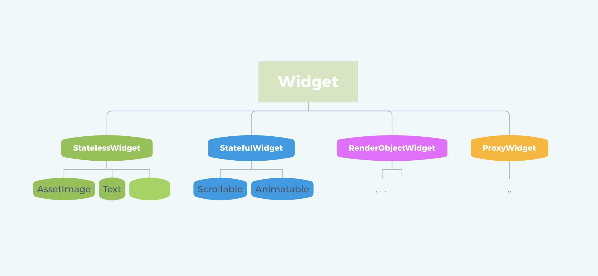

- **StatefulWidget:** 有状态组件，定义交互逻辑和业务数据，可以理解为具有动态可交互的内容界面，会根据数据的变化进行多次渲染。使用**`setState`**进行页面的类容的更新和刷新，这个和React一样。

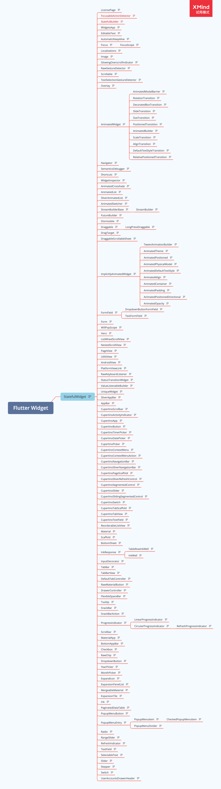


<br/>


- **StatelessWidget：** 无状态组件，外部传入的数据转化为界面展示的内容，只会渲染一次；


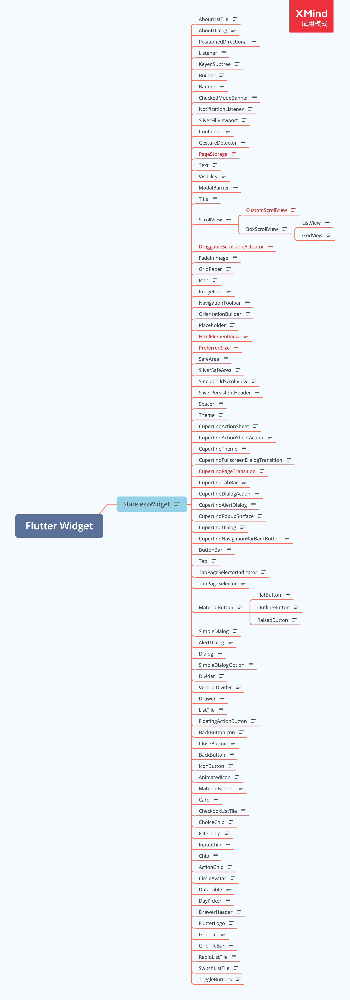

<br/>

- **RenderObjectWidget（渲染对象）：**是RenderObjectElement的配置信息，是个抽象类；
	
	- RenderObjectElement也是个抽象类，其包装了RenderObject，RenderObject为应用程序提供真正的渲染，其系统子类：
		
		- LeafRenderObjectElement：叶子渲染对象对应的元素，处理没有children的renderObject;
			
			- MultiChildRenderObjectWidget(父级组件)
				
				- Flex/Wrap/Flow/Stack  
		
		- SingleChildRenderObjectElement：处理只有单个child的renderObject;
			
			- SingleChildRenderObjectWidget (父级组件)
				
				- RawImage(Imaget)/ErrorWidget 
		
		- MultiChildRenderObjectElement： 处理有多个children的渲染对象;
			
			- SingleChildRenderObjectWidget (父级组件)
				
				- Offstage/SizedBox/Align/Padding

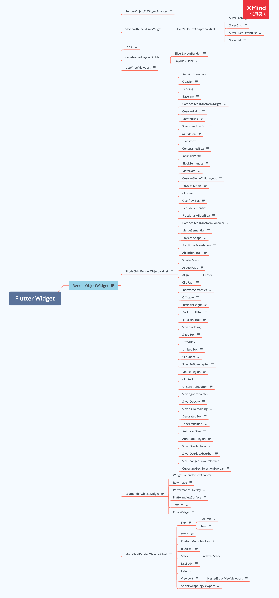


<br/>


- **ProxyWidget：** 提供一个提供子部件的部件，而不是构建新的部件；
	
	- [InheritedWidget](https://juejin.cn/post/6855129006707228680)：用于做数据共享，比如：`Theme/ThemeData, Text/DefaultTextStyle`等等都是通过InheritedWidget
    来实现的数据共享，并且Flutter中的状态管理框架也都是通过它实现的，例如最为知名其中之一的状态管理框架Provider。
    
    &emsp; 那么这个数据共享是什么意思呢？，如下面的Code：
    
    Main.dart文件
    
```
void main() {
  runApp(MyApp());
}

class MyApp extends StatelessWidget {

  @override
  Widget build(BuildContext context) {
    return MaterialApp(
      title: 'Flutter Demo',
      theme: ThemeData(
        primarySwatch: Colors.blue,
      ),
      home: InheritedWidgetTestRoute(),
    );
  }
}
```

<br/>

**InheritedWidgetTestRoute.dart文件**

```
class InheritedWidgetTestRoute extends StatefulWidget {
  @override
  _InheritedWidgetTestRouteState createState() =>
      new _InheritedWidgetTestRouteState();
}

class _InheritedWidgetTestRouteState extends State<InheritedWidgetTestRoute> {
  int count = 0;

  @override
  Widget build(BuildContext context) {
    return Scaffold(
      appBar: AppBar(
        title: Text("InheritedWidget"),
      ),
      body: Center(
        child: ShareDataWidget(
          //父widget
          data: count,
          child: Column(
            mainAxisAlignment: MainAxisAlignment.center,
            children: <Widget>[
              Padding(
                padding: const EdgeInsets.only(bottom: 20.0),
                //注意：如果不使用builder或者单独抽取成一个组件类，
                //而是像注释这样直接使用是错误的；
                //child: Text(ShareDataWidget.of(context).data.toString()),//错误用法，非子widget
                //用法1：
                // child: Builder(//子widget中依赖ShareDataWidget
                //   builder: (context) {
                //     return Text(ShareDataWidget.of(context).data.toString());
                //   },
                // ),

                //用法2：
                child: _TestWidget(),
              ),
              RaisedButton(
                child: Text("增加1"),
                //每点击一次，将count自增，然后重新build,ShareDataWidget的data将被更新
                onPressed: () => setState(() => ++count),
              )
            ],
          ),
        ),
      ),
    );
  }
}

class _TestWidget extends StatefulWidget {
  @override
  __TestWidgetState createState() => new __TestWidgetState();
}

class __TestWidgetState extends State<_TestWidget> {
  @override
  Widget build(BuildContext context) {
    //使用InheritedWidget中的共享数据
    return Text(ShareDataWidget.of(context).data.toString());
  }

  @override
  void didChangeDependencies() {
    super.didChangeDependencies();
    //父或祖先widget中的InheritedWidget改变(updateShouldNotify返回true)时会被调用。
    //如果build中没有依赖InheritedWidget，则此回调不会被调用。
    print("Dependencies change");
  }
}
```
    
<br/>

**ShareDataWidget.dart文件**

```
class ShareDataWidget extends InheritedWidget {
  ShareDataWidget({@required this.data, Widget child}) : super(child: child);

  //需要在子树中共享的数据，保存点击次数
  final int data;

  //定义一个便捷方法，方便子树中的widget获取共享数据
  static ShareDataWidget of(BuildContext context) {
    //dependOnInheritedWidgetOfExactType用法:https://juejin.cn/post/6855129006707228680
    return context.dependOnInheritedWidgetOfExactType<ShareDataWidget>();
  }

  //该回调决定当data发生变化时，是否通知子树中依赖data的Widget
  @override
  bool updateShouldNotify(ShareDataWidget old) {
    //如果返回true，则子树中依赖(build函数中有调用)本widget
    //的子widget的`state.didChangeDependencies`会被调用
    return old.data != data;
  }
}
```
    
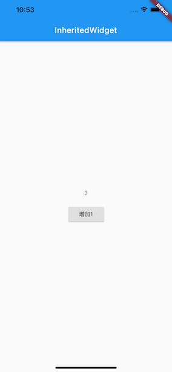
	 
<br/>

 - ParentDataWidget
    
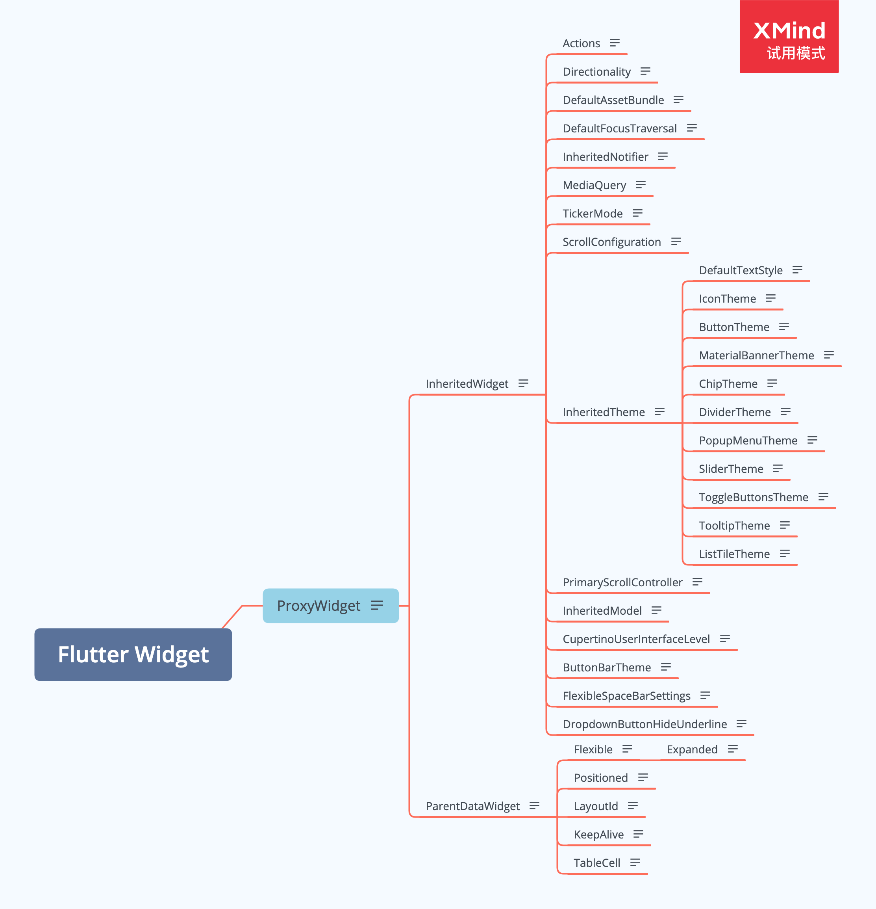

**Element提供渲染的方法，而Widget只是它的配置而已。**


<br/>
<br/>


> <h2 id='生命周期'>生命周期</h2>

- [**createState**](#createState)
- [**initState**](#initState)
- [**didChangeDependencies**](#didChangeDependencies)
- [**build**](#build)
- [**addPostFrameCallback**](#addPostFrameCallback)
- [**didUpdateWidget**](#didUpdateWidget)
- [**deactivate**](#deactivate)
- [**dispose**](#dispose)


<br/>
<br/>


上图是Flutter生命周期的示意图，其各个方法依次执行的分别是：

<br/>
<br/>

> <h3 id='createState'>createState</h3>

&emsp; createState 是 StatefulWidget 里创建 State 的方法，当要创建新的 StatefulWidget 的时候，会立即执行 createState，而且只执行一次，createState 必须要实现：

```
class MyScreen extends StatefulWidget {
@override
_MyScreenState createState() => _MyScreenState();
}
```


<br/>
<br/>

> <h3 id='initState'>initState</h3>


&emsp; 前面的 `createState` 是在创建 StatefulWidget 的时候会调用，initState 是 StatefulWidget 创建完后调用的第一个方法，而且只执行一次，类似于 **`Android 的 onCreate`**、**`iOS 的 viewDidLoad()`**，所以在这里 View 并没有渲染，但是这时 StatefulWidget 已经被加载到渲染树里了。

&emsp; 这时 StatefulWidget 的 mount 的值会变为 true，直到 dispose 调用的时候才会变为 false。可以在 initState 里做一些初始化的操作

&emsp; 在 override initState 的时候必须要调用 super.initState()：

```
@override
void initState() {
  super.initState();
  ...
}
```


<br/>
<br/>


> <h3 id='didChangeDependencies'>didChangeDependencies</h3>

&emsp; 当 StatefulWidget 第一次创建的时候，didChangeDependencies 方法会在 initState 方法之后立即调用，之后当 StatefulWidget 刷新的时候，就不会调用了，除非你的 StatefulWidget 依赖的 InheritedWidget 发生变化之后，didChangeDependencies 才会调用，所以 didChangeDependencies 有可能会被调用多次


<br/>
<br/>

> <h3 id='build'>build</h3>


&emsp; 在 StatefulWidget 第一次创建的时候，build 方法会在 didChangeDependencies 方法之后立即调用，另外一种会调用 build 方法的场景是，每当 UI 需要重新渲染的时候，build 都会被调用，所以 build 会被多次调用，然后 返回要渲染的 Widget。千万不要在 build 里做除了创建 Widget 之外的操作，因为这个会影响 UI 的渲染效率。


<br/>
<br/>


> <h3 id='addPostFrameCallback'>addPostFrameCallback</h3>


&emsp; addPostFrameCallback 是 StatefulWidge 渲染结束的回调，只会被调用一次，之后 StatefulWidget 需要刷新 UI 也不会被调用，addPostFrameCallback 的使用方法是在 initState 里添加回调：

```
import 'package:flutter/scheduler.dart';
@override
	void initState() {
	super.initState();
	SchedulerBinding.instance.addPostFrameCallback((_) => {
		
	});
}

```

&emsp； 渲染完成后，在这个方法里我们可以在[获取页面中Widget大小和位置](https://juejin.cn/post/6844903950257242119)，而且还可以进行网络接口请求


<br/>
<br/>


> <h3 id='didUpdateWidget'>didUpdateWidget</h3>


&emsp; `didUpdateWidget` 这个生命周期我们一般不会用到，只有在使用 key 对 Widget 进行复用的时候才会调用。

&emsp; 这个Key是Widget、Element和[SemanticsNode的](https://juejin.cn/post/6844904167085965326)标识符，只有当新的Widget的Key与当前Element中Widget的Key相同时，它才会被用来更新现有的Element。 Key在具有相同父级的Element之间必须是唯一的。

在案例枚举值**`KeyTest`**中可以看到。

而Widget的是否能够更新是根据它的一个源码方法：

```
static bool canUpdate(Widget oldWidget, Widget newWidget) {
return oldWidget.runtimeType == newWidget.runtimeType
    && oldWidget.key == newWidget.key;
}
```

&emsp; 来进行判断是否要更新，这里的`runtimeType`是其组件类型，而在上例中起类型都相同的，所以要根据其key的不同来进行判断。


&emsp; 这里有涉及到Flutter中的[3颗渲染树](#渲染三颗树)🌲，其分别是：**Widget Tree**、**Element Tree**、RenderObject Tree。

- Widget： Element的配置信息，与Element的关系可以是一对多，一份配置可以创造多个Element实例；

- Element：Widget 的实例化，内部持有Widget和RenderObject；

- RenderObject：负责渲染绘制。

类比下：
- Widget有点像是产品经理，负责规划产品、整理需求；
- Element则是UI设计师，根据原型整理出最终设计图；
- RenderObject就是我们程序开发者，负责具体的落地实现。


<br/>

> <h3 id='deactivate'>deactivate</h3>


&emsp; 当要将 State 对象从渲染树中移除的时候，就会调用 deactivate 生命周期，这标志着 StatefulWidget 将要销毁，但是有时候 State 不会被销毁，而是重新插入到渲染树种。


<br/>
<br/>


> <h3 id='dispose'>dispose</h3>

&emsp; 当 View 不需要再显示，从渲染树中移除的时候，State 就会永久的从渲染树中移除，就会调用 dispose 生命周期，这时候就可以在 dispose 里做一些取消监听、动画的操作，和 initState 是相反的


<br/>
<br/>


> <h2 id='路由管理'>路由管理</h3>


- **路由表**
&emsp; 要想使用命名路由，我们必须先提供并注册一个路由表（routing table），这样应用程序才知道哪个名字与哪个路由组件相对应。其实注册路由表就是给路由起名字，路由表的定义如下：

```
Map<String, WidgetBuilder> routes;
```

<br/>

- **注册路由表**

&emsp; 路由表的注册方式很简单，我们回到之前“计数器”的示例，然后在MyApp类的build方法中找到MaterialApp，添加routes属性，代码如下：

```
MaterialApp(
  title: 'Flutter Demo',
  theme: ThemeData(
    primarySwatch: Colors.blue,
  ),
  //注册路由表
  routes:{
   "new_page":(context) => NewRoute(),
    ... // 省略其它路由注册信息
  } ,
  home: MyHomePage(title: 'Flutter Demo Home Page'),
);
```


在使用时，我们可以直接使用起对应的**键**即可：

```
onPressed: () {
  Navigator.pushNamed(context, "new_page");
  //Navigator.push(context,
  //  MaterialPageRoute(builder: (context) {
  //  return NewRoute();
  //}));  
},

```

<br/>
<br/>


> <h2 id='状态管理'>状态管理</h3>

- **常见的状态管理方：**
	- Widget管理自己的状态。
	- Widget管理子Widget状态。
	- 混合管理（父Widget和子Widget都管理状态）。


<br/>

- **状态管理规则：**
	- 如果状态是用户数据，如复选框的选中状态、滑块的位置，则该状态最好由父Widget管理。
	- 如果状态是有关界面外观效果的，例如颜色、动画，那么状态最好由Widget本身来管理。
	- 如果某一个状态是不同Widget共享的则最好由它们共同的父Widget管理。


<br/>

**全局状态管理**

&emsp; 当应用中需要一些跨组件（包括跨路由）的状态需要同步时，上面几种状态管理很难胜任了。

&emsp; 比如，我们有一个设置页，里面可以设置应用的语言，我们为了让设置实时生效，我们期望在语言状态发生改变时，APP中依赖应用语言的组件能够重新build一下，但这些依赖应用语言的组件和设置页并不在一起，所以这种情况用上面的方法很难管理。

&emsp; 这时，正确的做法是通过一个全局状态管理器来处理这种相距较远的组件之间的通信。目前主要有两种办法：

- 实现一个全局的事件总线，将语言状态改变对应为一个事件，然后在APP中依赖应用语言的组件的initState 方法中订阅语言改变的事件。当用户在设置页切换语言后，我们发布语言改变事件，而订阅了此事件的组件就会收到通知，收到通知后调用setState(...)方法重新build一下自身即可。

- 使用一些专门用于状态管理的包，如Provider、Redux，读者可以在pub上查看其详细信息。


<br/>
<br/>


> <h2 id='布局组件'>布局组件</h3>

> 线性布局（Row和Column）

&emsp; 通过Row和Column来实现线性布局，类似于Android中的LinearLayout控件,CSS中的display中的Flex。在Flutter中Row和Column都继承自Flex

Rowd的参数配置：

```
Row({
  ...  
  //表示水平方向子组件的布局顺序(是从左往右还是从右往左)
  TextDirection textDirection,    
  //表示Row在主轴(水平)方向占用的空间，默认是MainAxisSize.max，表示尽可能多的占用水平方向的空间，此时无论子widgets实际占用多少水平空间
  MainAxisSize mainAxisSize = MainAxisSize.max, 
  //表示子组件在Row所占用的水平空间内对齐方式   
  MainAxisAlignment mainAxisAlignment = MainAxisAlignment.start,
  VerticalDirection verticalDirection = VerticalDirection.down,
  //其对应的交叉轴对齐方式  
  CrossAxisAlignment crossAxisAlignment = CrossAxisAlignment.center,
  List<Widget> children = const <Widget>[],
})
```


<br/>
<br/>


> 弹性布局（Flex）

Flutter中的弹性布局主要通过Flex和Expanded来配合实现.

```
return Column(
      children: <Widget>[
        //Flex的两个子widget按1：2来占据水平空间  
        Flex(
          direction: Axis.horizontal,
          children: <Widget>[
            Expanded(
              flex: 1,
              child: Container(
                height: 30.0,
                color: Colors.red,
              ),
            ),
            Expanded(
              flex: 2,
              child: Container(
                height: 30.0,
                color: Colors.green,
              ),
            ),
          ],
        ),
        Padding(
          padding: const EdgeInsets.only(top: 20.0),
          child: SizedBox(
            height: 100.0,
            //Flex的三个子widget，在垂直方向按2：1：1来占用100像素的空间  
            child: Flex(
              direction: Axis.vertical,
              children: <Widget>[
                Expanded(
                  flex: 2,
                  child: Container(
                    height: 30.0,
                    color: Colors.red,
                  ),
                ),
                Spacer(
                  flex: 1,
                ),
                Expanded(
                  flex: 1,
                  child: Container(
                    height: 30.0,
                    color: Colors.green,
                  ),
                ),
              ],
            ),
          ),
        ),
      ],
    );
  }
}
```

效果图：


<br/>
<br/>


> 层叠布局 Stack、Positioned


<br/>
<br/>

> 对齐与相对定位（Align）

Align 组件可以调整子组件的位置，并且可以根据子组件的宽高来确定自身的的宽高，定义如下：

```
Align({
  Key key,
  this.alignment = Alignment.center,
  this.widthFactor,
  this.heightFactor,
  Widget child,
})

```

- alignment : 需要一个AlignmentGeometry类型的值，表示子组件在父组件中的起始位置。AlignmentGeometry 是一个抽象类，它有两个常用的子类：Alignment和 FractionalOffset，我们将在下面的示例中详细介绍。

- widthFactor和heightFactor是用于确定Align 组件本身宽高的属性；它们是两个缩放因子，会分别乘以子元素的宽、高，最终的结果就是Align 组件的宽高。如果值为null，则组件的宽高将会占用尽可能多的空间。


<br/>

```
Container(
  height: 120.0,
  width: 120.0,
  color: Colors.blue[50],
  child: Align(
    alignment: Alignment.topRight,
    child: FlutterLogo(
      size: 60,
    ),
  ),
)
```


<br/>
<br/>


> <h2 id='滚动组件'>滚动组件</h3>


<br/>

> **GridView**

GridView可以构建一个二维网格列表，其默认构造函数定义如下：

```
GridView({
  Axis scrollDirection = Axis.vertical,
  bool reverse = false,
  ScrollController controller,
  bool primary,
  ScrollPhysics physics,
  bool shrinkWrap = false,
  EdgeInsetsGeometry padding,
  @required SliverGridDelegate gridDelegate, //控制子widget layout的委托
  bool addAutomaticKeepAlives = true,
  bool addRepaintBoundaries = true,
  double cacheExtent,
  List<Widget> children = const <Widget>[],
})
```


&emsp; SliverGridDelegate是一个抽象类，定义了GridView Layout相关接口，子类需要通过实现它们来实现具体的布局算法。Flutter中提供了两个SliverGridDelegate的子类SliverGridDelegateWithFixedCrossAxisCount和SliverGridDelegateWithMaxCrossAxisExtent.


<br/>

```
GridView(
  gridDelegate: SliverGridDelegateWithFixedCrossAxisCount(
      crossAxisCount: 3, //横轴三个子widget
      childAspectRatio: 1.0 //宽高比为1时，子widget
  ),
  children:<Widget>[
    Icon(Icons.ac_unit),
    Icon(Icons.airport_shuttle),
    Icon(Icons.all_inclusive),
    Icon(Icons.beach_access),
    Icon(Icons.cake),
    Icon(Icons.free_breakfast)
  ]
);
```

效果图：

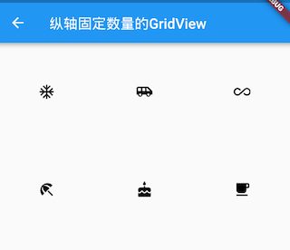


<br/>
<br/>

> **CustomScrollView**

**可滚动组件的Sliver版**

&emsp; Sliver有细片、薄片之意，在Flutter中，Sliver通常指可滚动组件子元素（就像一个个薄片一样）。

&emsp; 但是在CustomScrollView中，需要粘起来的可滚动组件就是CustomScrollView的Sliver了，如果直接将ListView、GridView作为CustomScrollView是不行的，因为它们本身是可滚动组件而并不是Sliver！因此，为了能让可滚动组件能和CustomScrollView配合使用，Flutter提供了一些可滚动组件的Sliver版，如SliverList、SliverGrid等。

&emsp; 实际上Sliver版的可滚动组件和非Sliver版的可滚动组件最大的区别就是前者不包含滚动模型（自身不能再滚动），而后者包含滚动模型 ，也正因如此，CustomScrollView才可以将多个Sliver"粘"在一起，这些Sliver共用CustomScrollView的Scrollable，所以最终才实现了统一的滑动效果。


```
import 'package:flutter/material.dart';

class CustomScrollViewTestRoute extends StatelessWidget {
  @override
  Widget build(BuildContext context) {
    //因为本路由没有使用Scaffold，为了让子级Widget(如Text)使用
    //Material Design 默认的样式风格,我们使用Material作为本路由的根。
    return Material(
      child: CustomScrollView(
        slivers: <Widget>[
          //AppBar，包含一个导航栏
          SliverAppBar(
            pinned: true,
            expandedHeight: 250.0,
            flexibleSpace: FlexibleSpaceBar(
              title: const Text('Demo'),
              background: Image.asset(
                "./images/avatar.png", fit: BoxFit.cover,),
            ),
          ),

          SliverPadding(
            padding: const EdgeInsets.all(8.0),
            sliver: new SliverGrid( //Grid
              gridDelegate: new SliverGridDelegateWithFixedCrossAxisCount(
                crossAxisCount: 2, //Grid按两列显示
                mainAxisSpacing: 10.0,
                crossAxisSpacing: 10.0,
                childAspectRatio: 4.0,
              ),
              delegate: new SliverChildBuilderDelegate(
                    (BuildContext context, int index) {
                  //创建子widget      
                  return new Container(
                    alignment: Alignment.center,
                    color: Colors.cyan[100 * (index % 9)],
                    child: new Text('grid item $index'),
                  );
                },
                childCount: 20,
              ),
            ),
          ),
          //List
          new SliverFixedExtentList(
            itemExtent: 50.0,
            delegate: new SliverChildBuilderDelegate(
                    (BuildContext context, int index) {
                  //创建列表项      
                  return new Container(
                    alignment: Alignment.center,
                    color: Colors.lightBlue[100 * (index % 9)],
                    child: new Text('list item $index'),
                  );
                },
                childCount: 50 //50个列表项
            ),
          ),
        ],
      ),
    );
  }
}
```

**分为三部分：**

- 头部SliverAppBar：SliverAppBar对应AppBar，两者不同之处在于SliverAppBar可以集成到CustomScrollView。SliverAppBar可以结合FlexibleSpaceBar实现Material Design中头部伸缩的模型，具体效果，读者可以运行该示例查看。
- 中间的SliverGrid：它用SliverPadding包裹以给SliverGrid添加补白。SliverGrid是一个两列，宽高比为4的网格，它有20个子组件。
- 底部SliverFixedExtentList：它是一个所有子元素高度都为50像素的列表。


<br/>
<br/>

> <h2 id='原生交互'>原生交互</h2>


<br/>

**平台通道支持的数据类型：**


<br/>

Flutter 通过 PlatformChannel 与原⽣进⾏交互，其中 PlatformChannel 分为三种：
- BasicMessageChannel：⽤于传递字符串和半结构化的信息。
- MethodChannel：⽤于传递⽅法调⽤。Flutter主动调⽤Native的⽅法，并获取
- 相应的返回值。
- EventChannel：⽤于数据流（event streams）的通信。


- **场景适用：**
	- MethodChannel:以⽅法的模式使⽤ 
	- PlatformChannel EventChannel: 以事件的模式
	- 使⽤ PlatformChannel BasicMessageChannel:可以在BasicMessageChannel ⽅便进⾏⾃定义扩展，主要⽤于个性化的扩展


<br/>

iOS代码：

```
//
//  ViewController.m
//  FlutterD
//
//  Created by 侯佳男 on 2018/10/30.
//  Copyright © 2018年 侯佳男. All rights reserved.
//

#import "ViewController.h"
#import "TargetViewController.h"
#import <Flutter/Flutter.h>

@interface ViewController ()

@end

@implementation ViewController

- (void)viewDidLoad {
    [super viewDidLoad];
    // Do any additional setup after loading the view, typically from a nib.
}


- (void)didReceiveMemoryWarning {
    [super didReceiveMemoryWarning];
    // Dispose of any resources that can be recreated.
}

- (void)pushFlutterViewController {
    FlutterViewController* flutterViewController = [[FlutterViewController alloc] initWithProject:nil nibName:nil bundle:nil];
    // 设置路由名字 跳转到不同的flutter界面
    /*flutter代码*/
    /*
    import 'dart:ui';
    
    void main() => runApp(_widgetForRoute(window.defaultRouteName));
    
    Widget _widgetForRoute(String route) {
        switch (route) {
            case 'myApp':
                return new MyApp();
            case 'home':
                return new HomePage();
            default:
                return Center(
                  child: Text('Unknown route: $route', textDirection: TextDirection.ltr),
            );
        }
    }
    */
    [flutterViewController setInitialRoute:@"myApp"];
    __weak __typeof(self) weakSelf = self;

    // 要与main.dart中一致
    NSString *channelName = @"com.pages.your/native_get";

    FlutterMethodChannel *messageChannel = [FlutterMethodChannel methodChannelWithName:channelName binaryMessenger:flutterViewController];

    [messageChannel setMethodCallHandler:^(FlutterMethodCall * _Nonnull call, FlutterResult  _Nonnull result) {
        // call.method 获取 flutter 给回到的方法名，要匹配到 channelName 对应的多个 发送方法名，一般需要判断区分
        // call.arguments 获取到 flutter 给到的参数，（比如跳转到另一个页面所需要参数）
        // result 是给flutter的回调， 该回调只能使用一次
        NSLog(@"method=%@ \narguments = %@", call.method, call.arguments);
        
        // method和WKWebView里面JS交互很像
        // flutter点击事件执行后在iOS跳转TargetViewController
        if ([call.method isEqualToString:@"iOSFlutter"]) {
            TargetViewController *vc = [[TargetViewController alloc] init];
            [self.navigationController pushViewController:vc animated:YES];
        }
        // flutter传参给iOS
        if ([call.method isEqualToString:@"iOSFlutter1"]) {
            NSDictionary *dic = call.arguments;
            NSLog(@"arguments = %@", dic);
            NSString *code = dic[@"code"];
            NSArray *data = dic[@"data"];
            NSLog(@"code = %@", code);
            NSLog(@"data = %@",data);
            NSLog(@"data 第一个元素%@",data[0]);
            NSLog(@"data 第一个元素类型%@",[data[0] class]);
        }
        // iOS给iOS返回值
        if ([call.method isEqualToString:@"iOSFlutter2"]) {
            if (result) {
                result(@"返回给flutter的内容");
            }
        }
    }];
    
    [self.navigationController pushViewController:flutterViewController animated:YES];
}
// 点击跳转到flutter界面
- (void)touchesBegan:(NSSet<UITouch *> *)touches withEvent:(UIEvent *)event {
    [self pushFlutterViewController];
}

@end

```


Flutter端：

```
import 'dart:ui' as ui; // 调用window拿到route判断跳转哪个界面
import 'package:flutter/material.dart';
import 'package:flutter/services.dart';
import 'package:flutter_module/HomePage.dart';


void main() => runApp(_widgetForRoute(ui.window.defaultRouteName));

// 根据iOS端传来的route跳转不同界面
Widget _widgetForRoute(String route) {
  switch (route) {
    case 'myApp':
      return new MyApp();
    case 'home':
      return new HomePage();
    default:
      return Center(
        child: Text('Unknown route: $route', textDirection: TextDirection.ltr),
      );
  }
}

class MyApp extends StatelessWidget {

  Widget _home(BuildContext context) {
    return new MyHomePage(title: 'Flutter Demo Home Page');
  }

  @override
  Widget build(BuildContext context) {
    return new MaterialApp(
      title: 'Flutter Demo',
      theme: new ThemeData(
        primarySwatch: Colors.blue,
      ),
      routes: <String, WidgetBuilder>{
        "/home":(BuildContext context) => new HomePage(),
      },
      home: _home(context),
    );
  }
}

class MyHomePage extends StatefulWidget {
  MyHomePage({Key key, this.title}) : super(key: key);

  final String title;

  @override
  _MyHomePageState createState() => new _MyHomePageState();
}

class _MyHomePageState extends State<MyHomePage> {

  // 创建一个给native的channel (类似iOS的通知）
  static const methodChannel = const MethodChannel('com.pages.your/native_get');

  
  _iOSPushToVC() async {
    await methodChannel.invokeMethod('iOSFlutter', '参数');
  }

  _iOSPushToVC1() async {
    Map<String, dynamic> map = {"code": "200", "data":[1,2,3]};
    await methodChannel.invokeMethod('iOSFlutter1', map);
  }

  _iOSPushToVC2() async {
    dynamic result;
    try {
      result = await methodChannel.invokeMethod('iOSFlutter2');
    } on PlatformException {
      result = "error";
    }
    if (result is String) {
      print(result);
      showModalBottomSheet(context: context, builder: (BuildContext context) {
        return new Container(
          child: new Center(
            child: new Text(result, style: new TextStyle(color: Colors.brown), textAlign: TextAlign.center,),
          ),
          height: 40.0,
        );
      });
    }
  }

  @override
  Widget build(BuildContext context) {
    return new Scaffold(
      body: new Center(
        child: new Column(
          mainAxisAlignment: MainAxisAlignment.center,
          children: <Widget>[
            new FlatButton(onPressed: () {
              _iOSPushToVC();
            }, child: new Text("跳转ios新界面，参数是字符串")),
            new FlatButton(onPressed: () {
              _iOSPushToVC1();
            }, child: new Text("传参，参数是map，看log")),
            new FlatButton(onPressed: () {
              _iOSPushToVC2();
            }, child: new Text("接收客户端相关内容")),
          ],
        ),
      ),
    );
  }
}


```


<br/>
<br/>


> <h2 id='模型数据'>模型数据</h2>

&emsp; 在[JSON to Dart](#https://javiercbk.github.io/json_to_dart/)中我们可以直接把网络请求的json数据在这里生成Model，如下：

```
{
    "firstName": "John",
    "lastName": "Smith",
    "sex": "male",
    "age": 25,
    "address": {
        "streetAddress": "21 2nd Street",
        "city": "New York",
        "state": "NY",
        "postalCode": "10021"
    },
    "phoneNumber": [
        {
            "type": "home",
            "number": "212 555-1234"
        },
        {
            "type": "fax",
            "number": "646 555-4567"
        }
    ]
}
```


<br/>

&emsp; 通过在 **[pub.dev](https://pub.dev)**我们可以搜索到相应的Flutter插件，比如：**provider**，这个就相当于iOS的 `pod search RXSwift`了。

&emsp; 将`provider: ^6.0.0`粘贴到项目中的pubspec.yaml的文件夹中，然后执行`flutter pub get`指令，下载对应插件到项目中。


<br/>

***
<br/>


> <h1 id='架构原理'>架构原理</h1>


<br/>

> <h2 id='渲染三颗树'>渲染三颗树</h2>

**介绍：** 

&emsp; 分别为Widget 树，Element 树和 RenderObject 树。当应用启动时 Flutter 会遍历并创建所有的 Widget 形成 Widget Tree。

&emsp; 同时与 Widget Tree 相对应，通过调用 Widget 上的 createElement() 方法创建每个 Element 对象，形成 Element Tree。

&emsp; 最后调用 Element 的 createRenderObject() 方法创建每个渲染对象，形成一个 Render Tree。 

&emsp; Element就是Widget在UI树具体位置的一个实例化对象，大多数Element只有唯一的renderObject，但还有一些Element会有多个子节点，如继承自RenderObjectElement的一些类，比如MultiChildRenderObjectElement。最终所有Element的RenderObject构成一棵树，我们称之为”Render Tree“即”渲染树“。

**总结一下：** 所以可以认为Flutter的UI系统包含三棵树：Widget树、Element树、渲染树。他们的依赖关系是：根据Widget树生成Element树，再依赖于Element树生成RenderObject 树。


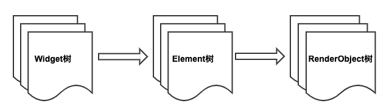


<br/>
<br/>

**为什么需要3颗树⁉️**


**使用三棵树的目的是尽可能复用 Element**

&emsp; 复用 Element 对性能非常重要，因为 Element 拥有两份关键数据：Stateful widget 的状态对象及底层的 RenderObject。当应用的结构很简单时，或许体现不出这种优势，一旦应用复杂起来，构成页面的元素越来越多，重新创建 3 棵树的代价是很高的，所以需要最小化更新操作。当 Flutter 能够复用 Element 时，用户界面的逻辑状态信息是不变的，并且可以重用之前计算的布局信息，避免遍历整棵树。


<br/>
<br/>

类比HTML中的DOM树，开始一个Flutter项目中的结构树，如下：


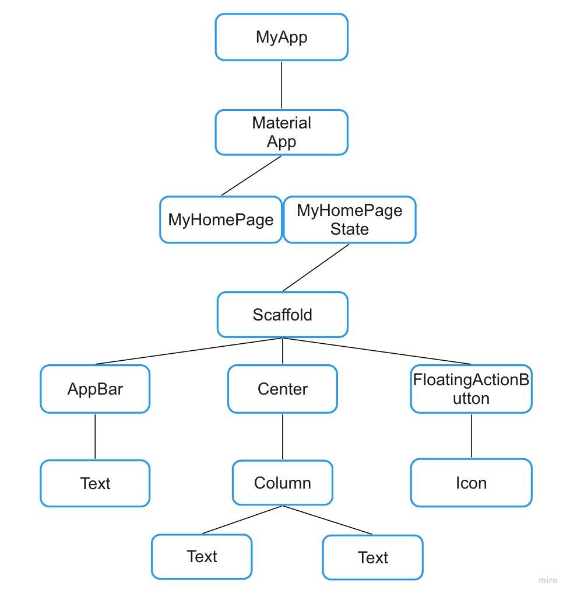


&emsp; 在这个结构树中，Text、FloatingActionButton等组件都属于Widget，它表示了我们在Dart代码中所写的控件的结构，由他们构成了Widget树。

<br/>

&emsp; Element其实是Widget的另一种抽象，我们项目中使用的像 Container、Text 等这类组件和其属性只不过是我们想要构建的组件的配置信息，当调用`build()`方法想要在屏幕上显示这些组件时，Flutter 会根据这些信息生成该 Widget 控件对应的 Element，相对的Element也会被放到相应的 Element 树当中。我们把 Widget 组件当作一个虚拟的组件树，而真正被渲染在屏幕上的其实是 Elememt 这棵树，它持有其对应 Widget 的引用，如果他对应的 Widget 发生改变，它就会被标记为 dirty Element，于是下一次更新视图时根据这个状态只更新被修改的内容，从而达到提升性能的效果。


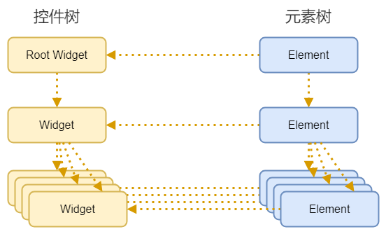


<br/>

&emsp; **`RenderObject`** 在 Flutter 当中做组件布局渲染的工作，其为了组件间的渲染搭配及布局约束也有对应的 RenderObject 树，我们也称之为渲染树。


<br/>
<br/>


> <h2 id='底层概略'>底层概略</h2>


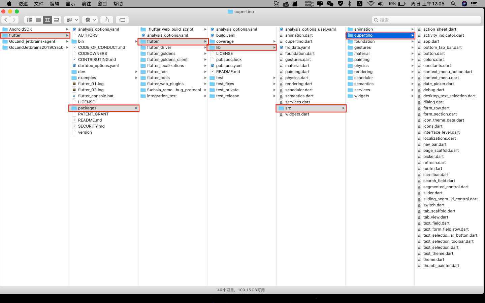
源码路径图


<br/>

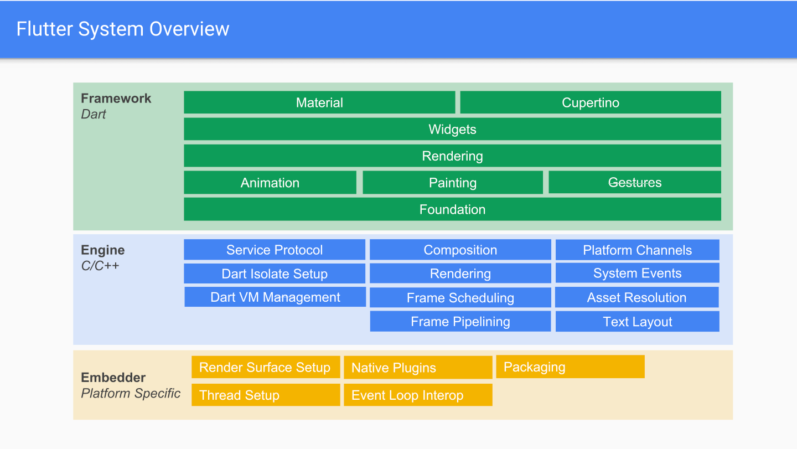
Flutter 整体结构图


<br/>
<br/>


> **Flutter框架结构**

- **Widget**
	- Widget的概念其实是Flutter开发过程中会接触到的一个比较核心的思想，Flutter官方文档中写的“Everything's a widget”，在整个开发过程中你可以把一切都看作一个组件，组件式的构建UI，响应UI

<br/>

- **Rendering**
	- Rendering是一个界面的渲染库，在Flutter中界面的渲染主要包括三个阶段：布局（Layout），绘制（Painting），合成（Composite）


<br/>

- **Animation**
	- Animation是一个动画相关类，可以通过这个类创建一些基础的动画，补间动画（Tween Animation），类似于Android中的ValueAnimator和iOS中的Core Animation

<br/>

- **Painting**
	- Painting封装了来自Engine层的绘制接口（下文将会提到）

<br/>

- **Gesture**
	- 处理手势动作和手势相关交互


<br/>

- **Foundation**
	- 底层框架，定义底层工具类和方法，提供其他层使用


<br/>
<br/>

> Flutter引擎（Engine）

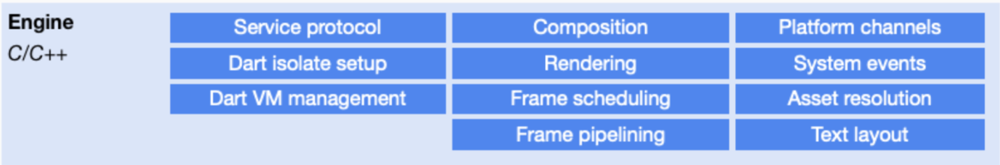
Flutter引擎


&emsp; Flutter Engine使用C++实现，主要包括三个部分：**Dart Runtime**, **Skia（Google开源图形库）**,**Text(文字排版引擎)**

**Skia**

&emsp; Skia是一个谷歌出品的开源二维图形库，提供常用的API，并且可以在多种软硬件平台上运行。谷歌Chrome浏览器、Chorme OS、Android、火狐浏览器、火狐操作系统及其他许多产品都使用它作为图形引擎
和其他跨平台方案不同Flutter没有使用原生的UI 和 绘制框架，以此来保证Flutter的高性能体验.


<br/>
<br/>

> 嵌入层（Embedder）

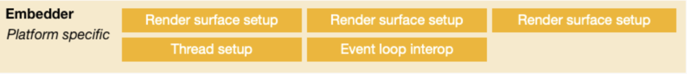
嵌入层（Embedder）


&emsp; 嵌入层的主要作用就是将Flutter嵌入到各个平台上去，其中主要负责的工作有：**surface渲染设置，线程的管理，原生插件管理，事件循环的交互**。

&emsp; 嵌入层位于整个框架的最底层说明了Flutter的平台相关层非常低，大部分的渲染操作在Flutter本身内部完成，各个平台（Android，iOS等）只需要提供一个画布，这就让Flutter本身有了很好的跨端一致性。


<br/>
<br/>

> **Flutter如何做到图形性能媲美原生**

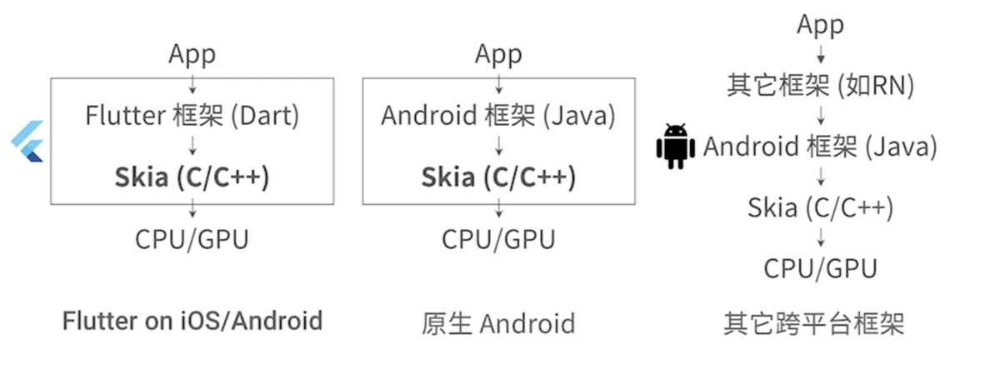


&emsp; 图形计算和绘制都是由相应的硬件来完成，而直接操作硬件的指令通常都会有操作系统屏蔽，应用开发者通常不会直接面对硬件，操作系统屏蔽了这些底层硬件操作后会提供一些封装后的API供操作系统之上的应用调用。

&emsp; **Android SDK** 正是封装了Android操作系统API，提供了一个“UI描述文件XML+Java操作DOM”的UI系统。

&emsp; **iOS的UIKit** 对View的抽象也是一样的，他们都将操作系统API抽象成一个基础对象（如用于2D图形绘制的Canvas），然后再定义一套规则来描述UI，如UI树结构，UI操作的单线程原则等。


&emsp; 而Flutter基于这个原理提供了一个Dart API，在底层通过skia这种跨平台的绘制库（内部会调用操作系统API）实现了一套代码跨多端。


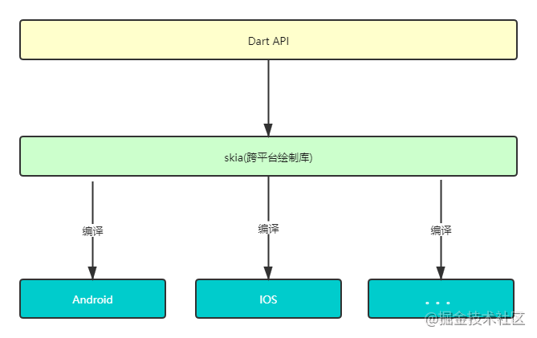

编译比较


<br/>

**原理理解：**

- 原生Android App
	- 绘图时首先调用原生Java代码
	- 调用绘图引擎Skia的C/C++代码
	- 生成CPU/GPU指令完成绘图

<br/>

- Flutter App
	- 首先调用Dart代码
	- 直接调用Skia绘图引擎C/C++代码
	- 生成CPU/GPU指令完成绘图

<br/>

- 	一般的跨平台框架（以RN为例）
	- 	调用框架代码（JS）
	- 	调用原生Java代码
	- 	调用绘图引擎Skia的C/C++代码
	- 	生成CPU/GPU指令完成绘图


<br/>
<br/>

**渲染图解**

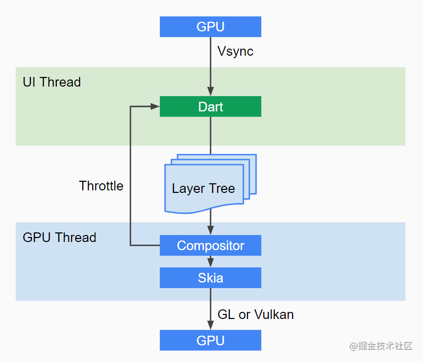

- GPU的 VSync 信号同步到 UI线程。
- UI线程使用 Dart来构建抽象的视图结构。
- 这份视图数据结构在 GPU 线程进行图层合成。
- 视图数据提供给 Skia 引擎渲染为 GPU 数据。
- 这些数据通过 OpenGL或者 Vulkan 提供给 GPU


**`总结：`** Flutter 并不关心显示器、视频控制器以及 GPU 具体工作，它只关心向 GPU 提供视图数据，在显示器会发出一个垂直同步信号（VSync），尽可能快地在两个 VSync 信号之间计算并合成视图数据，并且把数据提供给 GPU 。


<br/>

***
<br/>


> <h1 id=''></h1>


