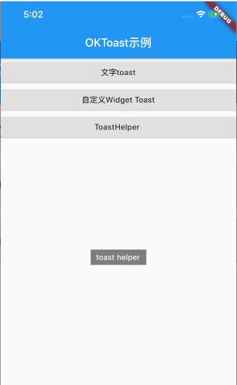

**[oktoast](https://www.kikt.top/posts/flutter/toast/oktoast/)的详细使用。**

```
import 'dart:async';
import 'package:flutter/material.dart';
import 'package:oktoast/oktoast.dart';
/**
 * OKToast的介绍: https://www.kikt.top/posts/flutter/toast/oktoast/
 * **/
void main() => runApp(new MyApp());

class MyApp extends StatelessWidget {
  // This widget is the root of your application.
  @override
  Widget build(BuildContext context) {
    return OKToast(
      dismissOtherOnShow: true,
      child: new MaterialApp(
        title: 'Flutter Demo',
        theme: new ThemeData(
          primarySwatch: Colors.blue,
        ),
        home: new MyHomePage(title: 'Flutter Demo Home Page'),
      ),
    );
  }
}

class MyHomePage extends StatefulWidget {
  MyHomePage({Key key, this.title}) : super(key: key);


  final String title;

  @override
  _MyHomePageState createState() => new _MyHomePageState();
}

class _MyHomePageState extends State<MyHomePage> {
  int _counter = 0;

  void _showToast() {
    showToast("msg");
  }

  @override
  Widget build(BuildContext context) {
    return Scaffold(
      appBar: AppBar(
        title: Text("OKToast示例"),
      ),
      body: ListView(
        children: <Widget>[
          RaisedButton(
            child: Text('文字toast'),
            onPressed: _showToast,
          ),
          RaisedButton(
            child: Text('自定义Widget Toast'),
            onPressed: _showCustomWidgetToast,
          ),
          RaisedButton(
            child: Text('ToastHelper '),
            onPressed: () => ToastHelper.showToast(context, "toast helper"),
          ),
        ],
      ),
    );
  }

  void _showCustomWidgetToast() {
    var w = Center(
      child: Container(
        padding: const EdgeInsets.all(5),
        color: Colors.black.withOpacity(0.7),
        child: Row(
          children: <Widget>[
            Icon(
              Icons.add,
              color: Colors.white,
            ),
            Text(
              '添加成功',
              style: TextStyle(color: Colors.white),
            ),
          ],
          mainAxisSize: MainAxisSize.min,
        ),
      ),
    );
    showToastWidget(w);
  }
}

class ToastHelper {
  static void showToast(BuildContext context, String text) {
    const style = TextStyle(color: Colors.white, fontSize: 14.0);

    Widget widget = Center(
      child: Material(
        child: Container(
          color: Colors.black.withOpacity(0.5),
          padding: const EdgeInsets.symmetric(vertical: 5.0, horizontal: 10.0),
          child: Text(
            text,
            style: style,
          ),
        ),
      ),
    );
    var entry = OverlayEntry(
      builder: (_) => widget,
    );

    Overlay.of(context).insert(entry);

    Timer(const Duration(seconds: 2), () {
      entry?.remove();
    });
  }
}

```

效果图：



