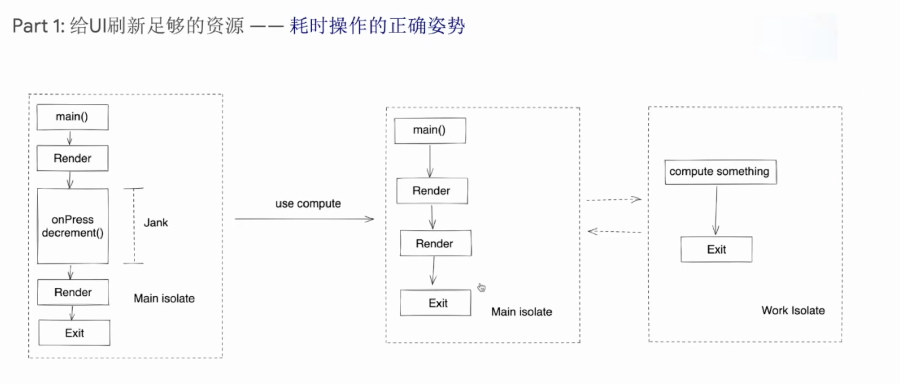
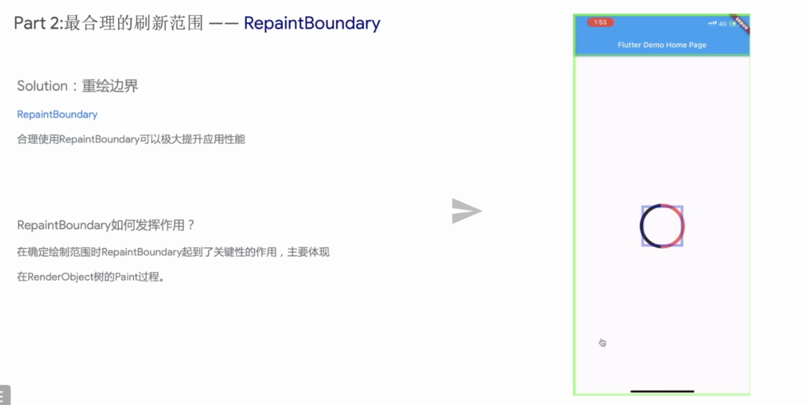
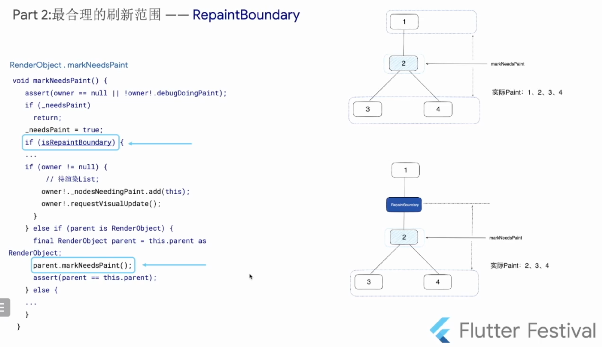
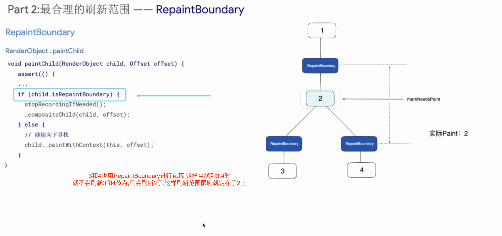
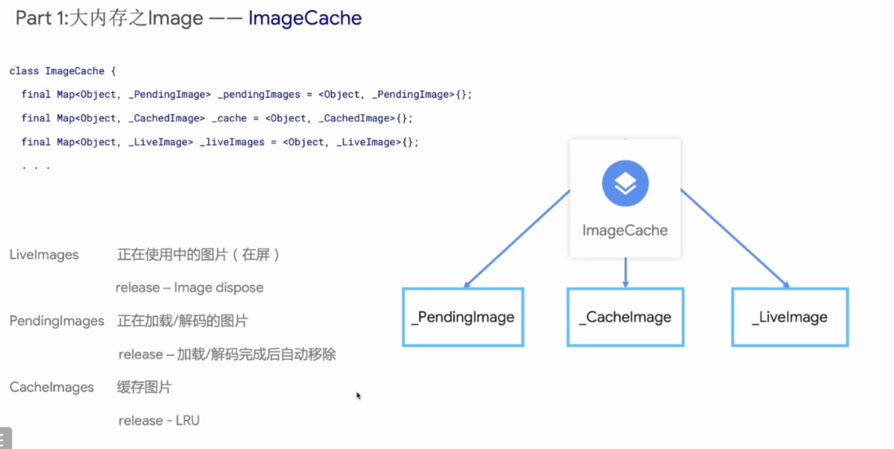
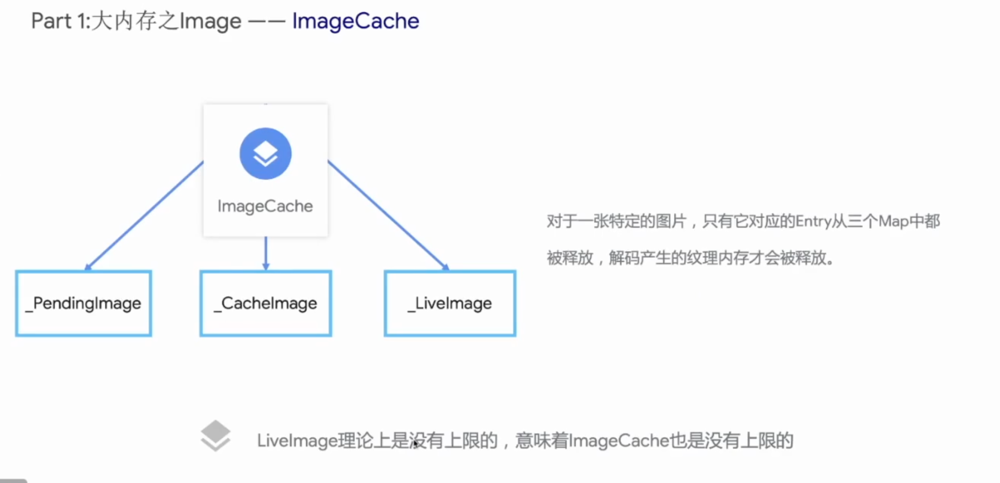
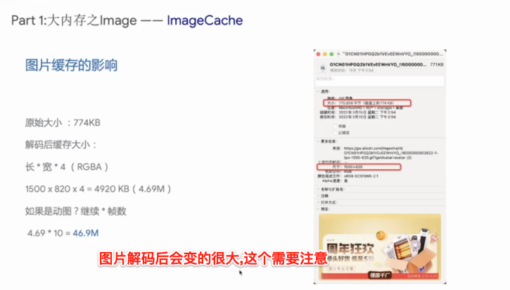
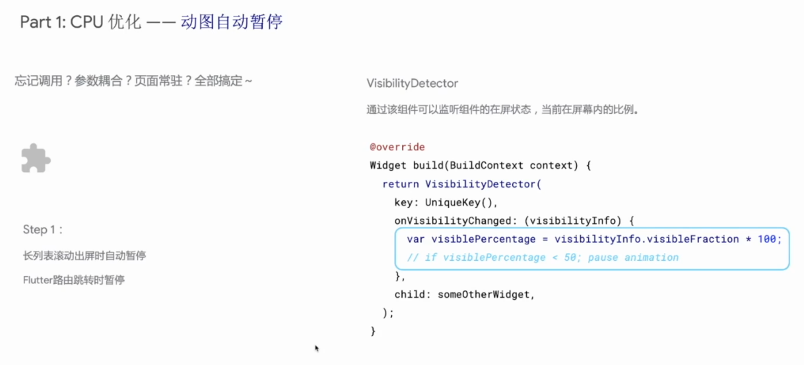

>
- [UI优化](#UI优化)
	- [耗时操作](#耗时操作)
	- [合理刷新范围](#合理刷新范围)
	- [内存图片优化](#内存图片优化)

 

***
  

> <h1 id='UI优化'>UI优化</h1>

  

> <h2 id='耗时操作'>耗时操作</h2>

对于一些耗时操作,我们可以放在compute中

  

> <h2 id='合理刷新范围'>合理刷新范围</h2>

对于一些小范围刷新,我们可以使用RepainBoundary进行把相关组件进行包装,但是这个不是所有的你都包一层,这样会影响性能的.

比如他的部分源码:

  

> <h2 id='内存图片优化'>内存图片优化</h2>

图片生成流程

 

3种图片存在的方式:

 

图片解码后的影响还是蛮大的:

 

对于动图,滚出屏幕后可以使其暂停播放:

 

图片内存峰值,对于请求的:

  

> <h2 id=''></h2>

  

> <h2 id=''></h2>

  

> <h2 id=''></h2>

  

> <h2 id=''></h2>

  

> <h2 id=''></h2>

