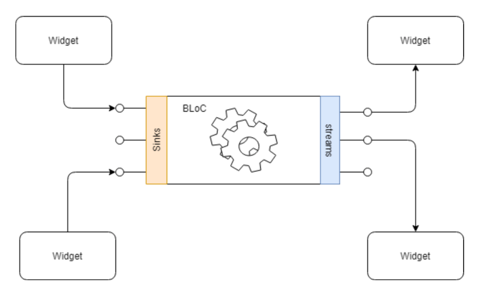

>
- [UI优化](#UI优化)
	- [耗时操作](#耗时操作)
		- [compute](#compute)
	- [合理刷新范围](#合理刷新范围)
	- [内存图片优化](#内存图片优化)
		- [滚出屏幕的动图暂停播放](#滚出屏幕的动图暂停播放)

<br/>

***
<br/><br/>

> <h1 id='UI优化'>UI优化</h1>


<br/><br/>

> <h2 id='耗时操作'>耗时操作</h2>


<br/><br/>

> <h2 id='compute'>compute</h2>


在Flutter中，compute是一个函数，用于在后台隔离的Isolate中执行计算密集型的任务，以避免阻塞主线程，保持应用程序的响应性。Isolates是Flutter中的并发执行单元，可以在独立的内存空间中运行，不与**主Isolate**共享内存。


<br/>

以下是使用compute函数的简单示例，假设有一个计算密集型的任务，比如计算阶乘：

```
import 'dart:async';
import 'dart:isolate';

// 计算阶乘的函数
int calculateFactorial(int n) {
  if (n == 0 || n == 1) {
    return 1;
  } else {
    return n * calculateFactorial(n - 1);
  }
}

// 入口函数，通过compute在后台Isolate中执行计算
Future<void> main() async {
  // 要计算阶乘的数
  int number = 5;

  // 使用compute函数在后台Isolate中执行计算
  int result = await compute(calculateFactorial, number);

  print('The factorial of $number is $result');
}
```

对于一些耗时操作,我们可以放在compute中


<br/><br/>

> <h2 id='合理刷新范围'>合理刷新范围</h2>

RepaintBoundary是一个小部件，用于隔离其子树的绘制，并将其绘制结果缓存起来。这可以帮助提高性能，因为只有在子树发生变化时，才会重新绘制。这对于包含复杂或频繁变化的子树的情况很有用，可以减少不必要的绘制操作。

这样我们可以使用RepainBoundary进行把相关组件进行包装,但是这个不是所有的你都包一层,这样会影响性能的.


比如他的部分源码:


<br/><br/>

**代码示例:**

```
import 'package:flutter/material.dart';

void main() {
  runApp(MyApp());
}

class MyApp extends StatelessWidget {
  @override
  Widget build(BuildContext context) {
    return MaterialApp(
      home: Scaffold(
        appBar: AppBar(
          title: Text('RepaintBoundary Example'),
        ),
        body: Center(
          child: Column(
            mainAxisAlignment: MainAxisAlignment.center,
            children: [
              RepaintBoundary(
                child: MyCustomWidget(),
              ),
              ElevatedButton(
                onPressed: () {
                  // 通过调用 MyCustomWidget 中的全局方法来触发重新绘制
                  MyCustomWidget.triggerRepaint();
                },
                child: Text('Trigger Repaint'),
              ),
            ],
          ),
        ),
      ),
    );
  }
}

class MyCustomWidget extends StatefulWidget {
  static void triggerRepaint() {
    // 在这里执行重新绘制的逻辑
    // 这可以是任何触发子树重新绘制的逻辑
    // 在这个例子中，我们通过调用 GlobalKey 来引用 MyCustomWidgetState
    _globalKey.currentState?.triggerRedraw();
  }

  @override
  MyCustomWidgetState createState() => MyCustomWidgetState();
}

class MyCustomWidgetState extends State<MyCustomWidget> {
  static MyCustomWidgetState? _globalKey;

  @override
  void initState() {
    super.initState();
    // 使用全局的 GlobalKey 来引用 MyCustomWidgetState
    if (_globalKey == null) {
      _globalKey = this;
    }
  }

  void triggerRedraw() {
    // 在这里执行重新绘制的逻辑
    // 这可以是任何触发重新绘制的逻辑
    setState(() {});
  }

  @override
  Widget build(BuildContext context) {
    return Container(
      width: 100,
      height: 100,
      color: Colors.blue,
      child: Center(
        child: Text('I can be redrawn!'),
      ),
    );
  }
}

```

在这个修正后的示例中，当点击按钮时，通过调用MyCustomWidget.triggerRepaint()方法来触发重新绘制，该方法内部实际上调用了_globalKey.currentState?.triggerRedraw()，进而触发MyCustomWidgetState中的triggerRedraw方法，达到重新绘制的效果。


<br/><br/>

> <h2 id='内存图片优化'>内存图片优化</h2>

图片生成流程


<br/>

3种图片存在的方式:


<br/>

图片解码后的影响还是蛮大的:


<br/><br/><br/>


> <h2 id='滚出屏幕的动图暂停播放'>滚出屏幕的动图暂停播放</h2>


VisibilityDetector并不是Flutter框架自带的组件，而是由社区提供的一个插件（package）。这个插件允许你检测一个小部件的可见性，以便在该小部件变得可见或不可见时执行特定的操作。

你可以在pubspec.yaml文件中添加依赖来使用visibility_detector插件：

```
dependencies:
  visibility_detector: ^0.2.0
```
然后运行 flutter pub get 来获取依赖。


<br/>


对于动图,滚出屏幕后可以使其暂停播放:


**代码示例:**

```
import 'package:flutter/material.dart';
import 'package:visibility_detector/visibility_detector.dart';

void main() {
  runApp(MyApp());
}

class MyApp extends StatelessWidget {
  @override
  Widget build(BuildContext context) {
    return MaterialApp(
      home: Scaffold(
        appBar: AppBar(
          title: Text('VisibilityDetector Example'),
        ),
        body: Center(
          child: VisibilityDetector(
            key: Key('unique_key'),
            onVisibilityChanged: (visibilityInfo) {
              print('Widget visibility changed: ${visibilityInfo.visibleFraction}');
            },
            child: Container(
              width: 200,
              height: 200,
              color: Colors.blue,
              child: Center(
                child: Text('I am visible!'),
              ),
            ),
          ),
        ),
      ),
    );
  }
}
```

在这个例子中，VisibilityDetector包装了一个Container，当这个Container在屏幕上可见或不可见时，onVisibilityChanged回调会被调用。你可以在这个回调中执行特定的操作，比如在部件可见时加载数据，或者在不可见时停止一些操作。


<br/><br/>

图片内存峰值,对于请求的:


<br/><br/>

> <h2 id=''></h2>


<br/><br/>

> <h2 id=''></h2>


<br/><br/>

> <h2 id=''></h2>


<br/><br/>

> <h2 id=''></h2>


<br/><br/>

> <h2 id=''></h2>





