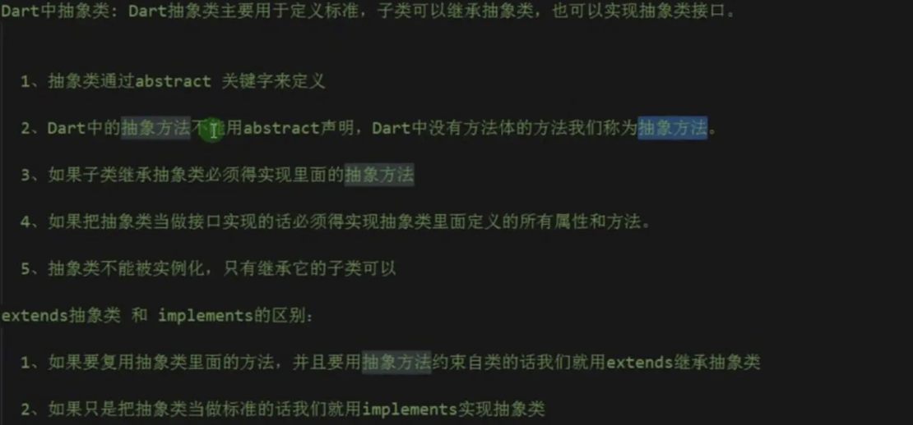
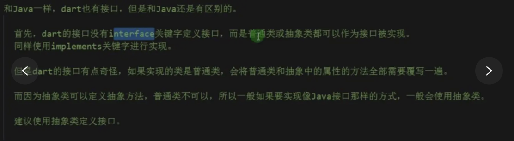
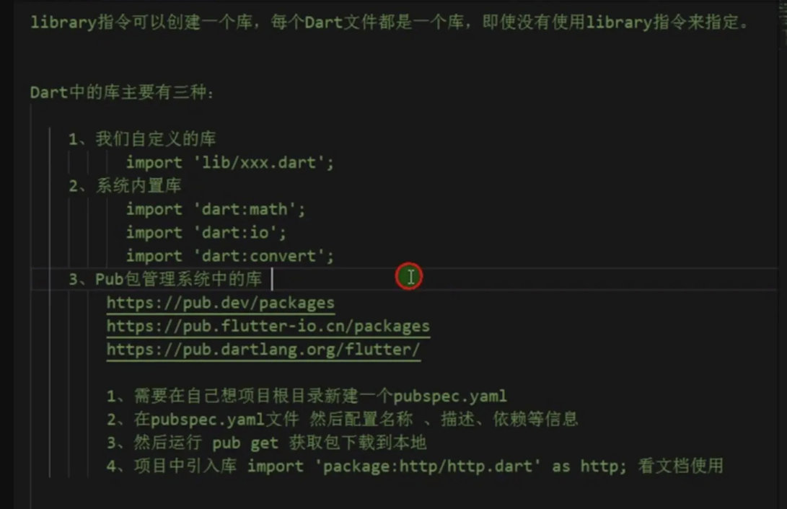
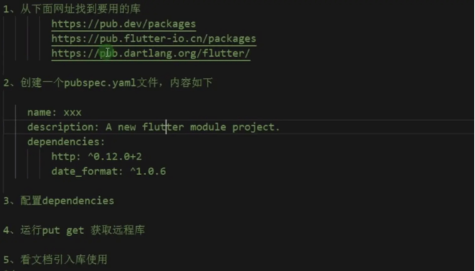

># <h2 id=''>[《Flutter实战·第二版》](https://book.flutterchina.club/)</h2>
- [**Dart基础**](#dart基础)
	- [空安全](#空安全)
- [**关键字**](#关键字)
	- [dynamic 和 Object](#dynamic和object)
	- [@required](#@required)
	- [mixin](#mixin)
	- [with](#with)
	- [final和const](#final和const)
- [**`类的方法`**](#类的方法)
	- [构造方法](#构造方法)
	- [get、 set方法](#getset方法)
	- [连缀书写](#连缀书写)
	- [类的继承构造方法](#类的继承构造方法)
	- [命名可选参数&可选参数](#命名可选参数&可选参数)
		- [命名可选参数](#命名可选参数)
		- [可选参数](#可选参数)
- [**`‌函数`**](#函数)
	- 	[匿名方法](#匿名方法)
	- [箭头函数](#箭头函数)
		- [条件表达式](#条件表达式)
	- [函数作为参数](#函数作为参数)
	- [有状态函数](#有状态函数)
	- 	[自执行方法](#自执行方法)
	- 	[闭包 ](#闭包) 
- [**抽象类**](#抽象类)
	- [接口类](#接口类)
- [**范型限制**](#范型限制)
- [**Mixins 功能**](#Mixins功能)
- [**异步和同步**](#异步和同步)
- [**范型限制**](#范型限制)
- **资料**
	- [Flutter编程语言(官方)](https://www.dartcn.com/guides/get-started)
	- [Dart 基础二：函数(ghroosk-掘金)](https://juejin.cn/post/6931340267324702733#heading-19)


<br/>


***
<br/><br/><br/><br/><br/>

> <h1 id='dart基础'>Dart基础</h1>


<br/><br/>

># <h2 id='空安全'>[空安全](https://juejin.cn/post/6958965184631144478#heading-2)</h2>


**基础使用**


- **1.非空类型和可空类型**

```
void main() {
  int a;
  a = null; // 提示错误，因为 int a 表示 a 不能为空
  print('a is $a.');
}
```

这段代码通过 int 声明了变量 a 是一个非空变量，在执行 a = null 的时候报错。可以修改为 int? 类型，允许 a 为空：

```
void main() {
  int? a; // 表示允许 a 为空
  a = null; 
  print('a is $a.');
}
```


<br/>

***
<br/><br/>

> <h1 id='关键字'>关键字</h1>


<br/><br/>

> <h2 id='dynamic和object'>dynamic 和 Object</h2>


Object 是 Dart 所有对象的根基类，也就是说在 Dart 中所有类型都是Object的子类(包括Function和Null)，所以任何类型的数据都可以赋值给Object声明的对象。 dynamic与Object声明的变量都可以赋值任意对象，且后期可以改变赋值的类型，这和 var 是不同的，如：

```
dynamic t;
Object x;
t = "hi world";
x = 'Hello Object';
//下面代码没有问题
t = 1000;
x = 1000;
```


dynamic与Object不同的是dynamic声明的对象编译器会提供所有可能的组合，而Object声明的对象只能使用 Object 的属性与方法, 否则编译器会报错，如:

```
dynamic a;
Object b = "";
main() {
	a = "";
	printLengths();
}   

printLengths() {
	// 正常
	print(a.length);
	// 报错 The getter 'length' is not defined for the class 'Object'
	print(b.length);
}
```

dynamic 的这个特点使得我们在使用它时需要格外注意，这很容易引入一个运行时错误，比如下面代码在编译时不会报错，而在运行时会报错：

```
print(a.xx); // a是字符串，没有"xx"属性，编译时不会报错，运行时会报错
```


<br/><br/>

> <h2 id='@required'>@required</h2>

使用 @required 注释表示参数是 required 性质的命名参数， 该方式可以在任何 Dart 代码中使用（不仅仅是Flutter）。


```
const Scrollbar({Key key, @required Widget child})
```

此时 Scrollbar 是一个构造函数， 当 child 参数缺少时，分析器会提示错误。


<br/><br/>


> <h2 id='mixin'>mixin</h2>

Dart 是不支持多继承的，但是它支持 mixin，简单来讲 mixin 可以 “组合” 多个类，我们通过一个例子来理解。

定义一个 Person 类，实现吃饭、说话、走路和写代码功能，同时定义一个 Dog 类，实现吃饭、和走路功能：

```
class Person {
  say() {
    print('say');
  }
}

mixin Eat {
  eat(String eat) {
    print('eat: $eat');
  }
}

mixin Walk {
  walk() {
    print('walk');
  }
}

mixin Code {
  code() {
    print('key');
  }
}

// 使用 mixin 的类
class Dog with Eat, Walk{
	void doSomething() {
    // 在这里使用 mixin 中定义的方法
    eat('Doing something...');
    walk();
  }
}

///Man 类继承自 Person 类。这意味着 Man 类会继承 Person 类中的所有成员（字段和方法）。
///
class Man extends Person with Eat, Walk, Code{}


///使用
void main() {
  // 创建一个 Dog 的实例
  var dogObject = Dog();

  // 调用 Dog 中的方法，这个方法实际上是 mixin 中定义的
  dogObject.doSomething();
}
```


&emsp; 我们定义了几个 mixin，然后通过 with 关键字将它们组合成不同的类。有一点需要注意：如果多个mixin 中有同名方法，with 时，会默认使用最后面的 mixin 的，mixin 方法中可以通过 super 关键字调用之前 mixin 或类中的方法。

注意：一个类可以使用多个 mixin，只需要用逗号分隔即可。使用 mixin 的一个主要好处是可以将代码重用和功能添加分离开，使得代码更加模块化和可维护。


<br/>
<br/>

**疑问:** 可以理解成Person类使用了 Eat、Walk 和 Code 三个 mixin，通过 with Eat, Walk, Code 的方式,然后Man类继承自Person类吗?

解答:在这段代码中，Person 类并没有使用 mixin，而是定义了一个普通的类。而 Man 类则继承自 Person 类，并通过 with Eat, Walk, Code 的方式引入了三个 mixin，即 Eat、Walk 和 Code。

所以，可以理解为：

- Person 类是一个普通的类，它定义了一个 say 方法。
- Man 类继承自 Person 类，因此拥有 say 方法，并且通过 with Eat, Walk, Code 引入了 Eat、Walk 和 Code 三个 mixin，从而获得了这三个 mixin 中定义的方法。

这样的设计允许你在不修改 Person 类的情况下，通过 mixin 的方式为 Man 类添加额外的功能。


<br/><br/>

> <h2 id='with'>with</h2>

- Mixins : 指能够将另一个或多个类的功能添加到您自己的类中，而无需继承这些类。
- implements : 将一个类作为接口使用

```
class A {
  void a() {
    print('fun a => by a');
  }
}

class B implements A {
  @override
  void a() {
    print('fun a => by b');
  }
}

class C {

  void a() {
    print('fun a => by c');
  }

  void c() {
    print('fun c => by c');
  }

  void s(){
    print('fun s => by c');
  }
}

class E {
  String e = 'eeee';

  void s(){
    print('fun s => by e');
  }
}


///表示类 D 继承自 A 类，
//并混入了 C 和 E 两个类的功能,这意味着 D 类除了继承自 A 类的方法外，还包含了 C 类和 E 类中的方法和字段。
class D extends A with C, E {
  void c() {
    print('fun c => by d');
  }
}

void main() {
  D d = new D();
  d.a();
  d.s();
  d.c();
}
```

**Log:**

```
fun a => by c
fun s => by e
fun c => by d
```

&emsp; 首先看B implements A，所以此时A相对于B来说就是一个接口，所以他要实现B中的方法。换句话说，Dart每个类都是接口

&emsp; 然后看D extends A with C ,D继承于A,由于单继承特性，这个时候D不能再使用extends关键字继承其他类，但是可以使用with关键字折叠其他类以实现代码重用。

<br/>

**疑问:d.a();为什么执行的是C类中的方法?**


&emsp; 在给定的代码中，D 类继承了 A 类并混入了 C 类，因此 D 类中的 a() 方法将覆盖来自 A 类的 a() 方法。然而，在 C 类中也有一个名为 a() 的方法。

&emsp; 当调用 d.a(); 时，由于 Dart 中混入（with 关键字）的特性，它遵循以下原则：

- 1. **Mixin** 的方法优先级高于继承的方法。 即使 D 类继承自 A 类，但由于混入了 C 类，C 类中的 a() 方法将覆盖 A 类中的同名方法。
- 2. **混入的顺序很重要。** 如果有多个混入，方法调用将按照混入的顺序进行查找。在这里，D 类首先混入了 C 类，然后混入了 E 类。

&emsp; 因此，在这段代码中，d.a(); 执行时打印的是 fun a => by c，因为 C 类中的 a() 方法覆盖了 A 类中的同名方法。


<br/><br/>


> <h2 id='final和const'>final和const</h2>

这2者没啥区别,有区别的是:
- const在编译时直接替换为常量值;
- final变量在第一次使用时被初始化

如果您从未打算更改一个变量，那么使用 final 或 const，不是var，也不是一个类型。 一个 final 变量只能被设置一次 。被final或者const修饰的变量，变量类型可以省略，如：

```
//可以省略String这个类型声明
final str = "hi world";
//final String str = "hi world"; 
const str1 = "hi world";
//const String str1 = "hi world";
```


<br/>

***
<br/>

&emsp; **`Dart`** 中所有的类都继承自 **`Object`** 类。[Flutter 中文官方文档](https://book.flutterchina.club/chapter14/flutter_app_startup.html)

<br/>

> <h1 id='类的方法'>类的方法</h1>


<br/>


> <h2 id='构造方法'>构造方法</h2>

```
class Person {
  String name;
  int age;

  //默认构造函数只能写一个
  Person(this.name, this.age);
  /*
    ///实例化之前做的操作，实例化列表
    //遇上面的实例化只能存在一个
    Person(): name = "李白", age = 28 {
    print("实例化之前的操作：name: ${this.name}, age: ${this.age}");
  }
  */

  //命名构造函数可以写多个
  Person.info(){
    print("这个是命名构造函数");
  }

  void printInfo() {
      print("姓名： ${this.name}\n,年龄：${this.name},${20+80}");
    }
}


///调用
void testCustomClass() {
    print("<-----------------------------构造方法：start------------------------------>");
    Person person = Person("荆轲", 27);
    person.printInfo();
    Person person1 = Person.info();
    print("<-----------------------------构造方法：end------------------------------>");

}
```
打印：

```
flutter: <-----------------------------构造方法：start------------------------------>
flutter: 姓名： 荆轲,
         年龄：荆轲,100
flutter: 这个是命名构造函数
flutter: <-----------------------------构造方法：end------------------------------>
```


<br/>
<br/>

> <h2 id='getset方法'>get、set方法</h2>

```
/// get 方法
get getInfo{
print("get 方法的书写格式, 要把()去掉，这是一个计算属性，一般是返回一个计算值");
print("姓名： ${this.name},\n         年龄：${this.name},${20+80}");
return 20 + 80;
}


/// set方法
set userName(name) {
print("set 方法: 设置 name");
this.name = name;
}


///调用get、set方法
print("<-----------------------------start------------------------------>");
person.userName = "嬴政";
var length = person.getInfo;
print("get 计算返回的长度是： ${length}\n\n");
print("<-----------------------------end------------------------------>");
```

打印：

```
flutter: <-----------------------------start------------------------------>
flutter: set 方法: 设置 name
flutter: get 方法的书写格式, 要把()去掉，这是一个计算属性，一般是返回一个计算值
flutter: 姓名： 嬴政,
         年龄：嬴政,100
flutter: get 计算返回的长度是： 100
flutter: <-----------------------------end------------------------------>
```


<br/>
<br/>

> <h2 id='连缀书写'>连缀书写</h2>

```
///连缀书写
print("<-----------------------------连缀书写：start------------------------------>");
Person person = Person("荆轲", 27);
person..name = "盘古"
      ..age = 30
      ..getInfo;
print("<-----------------------------连缀书写：end------------------------------>");
```

打印：

```
flutter: <-----------------------------连缀书写：start------------------------------>
flutter: get 方法的书写格式, 要把()去掉，这是一个计算属性，一般是返回一个计算值
flutter: 姓名： 盘古,
         年龄：盘古,100
flutter: <-----------------------------连缀书写：end------------------------------>
```


<br/>
<br/>

> <h2 id='类的继承构造方法'>类的继承构造方法</h2>


```
class Student extends Person {
  String sex;
  Student(String name, int age, String sex): super(name, age){
    this.sex = sex;
  }
  get getStudentInfo {
    print("学生信息：name：${this.name},  age：${this.age}, sex：${this.sex}");
  }
}

///调用
    print("<-------------------------------get 方法：start------------------------------->");
    Student student = Student("李白", 49, "中性");
    student.getInfo;
    print("<-------------------------------get 方法：start------------------------------->");
```
打印：

```
flutter: <-------------------------------get 方法：start------------------------------->
flutter: get 方法的书写格式, 要把()去掉，这是一个计算属性，一般是返回一个计算值
flutter: 姓名： 李白,
         年龄：李白,100
flutter: <-------------------------------get 方法：start------------------------------->
```


<br/>
<br/>


> <h2 id='命名可选参数&可选参数'>命名可选参数&可选参数</h2>

<br/>

> <h3 id='命名可选参数'>命名可选参数</h3>

由 **{}** 包装的参数是一个命名的可选参数。这是一个例子：

- **1.单个命名可选参数**

```
getHttpUrl(String server, String path, {int port: 80}) {
  // ...
}
```

<br/>


- **2.多个命名可选参数**

您可以使用或不使用第三个参数调用getHttpUrl。调用该函数时必须使用参数名称。

```
getHttpUrl('example.com', '/index.html', port: 8080); // port == 8080
getHttpUrl('example.com', '/index.html');             // port == 80
```

您可以为函数指定多个命名参数：


```
getHttpUrl(String server, String path, {int port: 80, int numRetries: 3}) {
  // ...
}
```

因为命名参数是以名称引用的，所以它们可以以不同于它们的声明的顺序使用。

```
getHttpUrl('example.com', '/index.html');
getHttpUrl('example.com', '/index.html', port: 8080);
getHttpUrl('example.com', '/index.html', port: 8080, numRetries: 5);
getHttpUrl('example.com', '/index.html', numRetries: 5, port: 8080);
getHttpUrl('example.com', '/index.html', numRetries: 5);
```


<br/>
<br/>


> <h3 id='可选参数'>可选参数</h3>


可选参数只能在任何必需的参数之后声明。

可选参数可以有一个默认值，当默认值在调用者没有指定值时使用。

由 **[]** 包装的参数是位置可选参数。这是一个例子：

- **1.一个可选参数**

```
getHttpUrl(String server, String path, [int port=80]) {
  // ...
}


//调用
getHttpUrl('example.com', '/index.html', 8080); // port == 8080
getHttpUrl('example.com', '/index.html');       // port == 80

```


<br/>


- **2.多个可选参数**

```
getHttpUrl(String server, String path, [int port=80, int numRetries=3]) {
  // ...
}
```

可选参数是位置，如果要指定numRetries，则不能省略端口。

```
getHttpUrl('example.com', '/index.html');
getHttpUrl('example.com', '/index.html', 8080);
getHttpUrl('example.com', '/index.html', 8080, 5);
```


<br/>

***
<br/>


> <h1 id='函数'>函数</h1>

<br/>

> <h2 id='匿名方法'>匿名方法</h2>


```
    ///匿名方法
    var fn = (){
      print("我是匿名方法");
    };
    fn();

    var printNum = (int n){
      print("匿名方法带参数：($n+100)");
    };
    printNum(100);
```
打印：

`flutter: 我是匿名方法`

`flutter: 匿名方法带参数：(100+100)`


<br/>
<br/>

> <h2 id='箭头函数'>箭头函数</h2>

```
    ///箭头函数
    List listStr = ["吕布", "貂蝉", "诸葛亮", "曹操", "司马懿"];
    List listNum = [1, 3, 5, 8, 9, 12, 14, 18];

    listStr.forEach((value){
      print("$value");
    });
    //箭头后只有一行代码
    listStr.forEach((value)=> print("---->> $value"));
    listStr.forEach((value)=>{
      print("++++++>> $value")
    });

    var newListNum2 = listNum.map((value) => value > 2 ? value * 3 : value);
    print(newListNum2);
```

打印：

```
flutter: 吕布
flutter: 貂蝉
flutter: 诸葛亮
flutter: 曹操
flutter: 司马懿
flutter: ---->> 吕布
flutter: ---->> 貂蝉
flutter: ---->> 诸葛亮
flutter: ---->> 曹操
flutter: ---->> 司马懿
flutter: ++++++>> 吕布
flutter: ++++++>> 貂蝉
flutter: ++++++>> 诸葛亮
flutter: ++++++>> 曹操
flutter: ++++++>> 司马懿
flutter: (1, 9, 15, 24, 27, 36, 42, 54)
```

<br/>

如果函数中只有一句表达式，可以使用箭头语法简写语法：

```
bool isNoble(int atomicNumber) => _nobleGases[atomicNumber] != null;
```

提示： **在箭头 (=>) 和分号 (；) 之间只能使用一个 表达式** ，不能是 语句 。 例如：不能使用 if 语句 ，但是可以是用 **条件表达式**，表达式及语句区别请查看开篇的重要概念.

<br/>

**提示:**

&emsp; 在Dart 中方法可以有两种类型的参数：**必需的（ required）** 和**可选的（optional）**， required 类型参数在参数最前面， 随后是 optional 类型参数。 命名的可选参数也可以标记为 “@ required” 。


<br/>
<br/>


> <h3 id='条件表达式'>条件表达式</h3>


Dart有两个运算符，有时可以替换 if-else 表达式， 让表达式更简洁：

```
condition ? expr1 : expr2
```

如果条件为 true, 执行 expr1 (并返回它的值)： 否则, 执行并返回 expr2 的值。

<br/>

```
expr1 ?? expr2
```
如果 expr1 是 non-null， 返回 expr1 的值； 否则, 执行并返回 expr2 的值。


<br/>

如果赋值是根据布尔值， 考虑使用 ?:。

```
var visibility = isPublic ? 'public' : 'private';
```


<br/>

如果赋值是基于判定是否为 null， 考虑使用 ??。

```
String playerName(String name) => name ?? 'Guest';
```


<br/><br/>

> <h2 id='函数作为参数'>函数作为参数</h2>


函数也是对象，并且有它的**类型 Function** ， 这也意味着函数可以被赋值给变量或者作为参数传递给其他函数。一个函数可以作为另一个函数的参数。 例如：

```
void printElement(int element) {
  print(element);
}
var list = [1, 2, 3];
// 将 printElement 函数作为参数传递。
list.forEach(printElement);
```


**代码解读:**

forEach 方法的签名是这样的：

```
void forEach(void f(E element))
```

&emsp; 这里，f 是一个接受单个参数的函数，参数类型为集合元素类型 E。当你调用 list.forEach(printElement) 时，printElement 函数就被传递给了 forEach 方法。

&emsp; forEach 内部实现了遍历集合的逻辑，对于每个元素，它会调用传递进来的函数 f，将当前元素作为参数传递给这个函数。

&emsp; 所以，虽然你在调用 forEach 的时候并没有显式传递参数，但 forEach 会在遍历集合时自动将每个元素作为参数传递给你提供的函数（在这里是 printElement 函数）。

<br/>
<br/>

在Java的回调函数中,如 View 的 onClickListener 需要定义一个接口，但在Dart中，我们可以直接指定一个回调方法给调用的方法，由调用的方法在合适的时机执行这个回调。

```
// 第一种调用者根本不确定 回调函数的返回值、参数是些什么
void setListener(Function listener){
    listener("Success");
}
// 第二种，返回值为void，参数为一个String的方法
void setListener(void listener(String result)){
    listener("Success");
}

//第三种：类型定义 将返回值为void，参数为一个String的方法定义为一个类型。
typedef void Listener(String result)；
  
void setListener(Listener listener){
  listener("Success");
}
```

同样的我们可以将一个函数赋值给一个变量，例如：

```
var loudify = (msg) => '!!! ${msg.toUpperCase()} !!!';
assert(loudify('hello') == '!!! HELLO !!!');
```

示例中使用了匿名函数。 

<br/><br/>

> <h2 id='有状态函数'>有状态函数</h2>

```
void main() {
  var numberPrinter = (){
    int num = 0;
    return (){
      for(int i = 0; i < 10; i++){
        num++;
      }
      print(num);
    };
  };
  
  var printNumber = numberPrinter();
  printNumber(); // 10
  printNumber(); // 20
}
```

上面这段代码同样执行了两次 printNumber();，然而我们却得到了不同的输出 10，20。是不是有点奇怪呢?

<br/>

但看上去似乎还是有些难以理解，让我们一层一层来看。

```
var numberPrinter = (){
    int num = 0;
    /// execute function
  };
```

首先我们定义了一个 Function 对象，然后把交给 numberPrinter 管理。在创建出来的这个 Function 的 Lexical scoping(词法作用域)中定义了一个 num 变量，并赋值为 0。

**注意：** 这时候该方法并不会立刻执行，而是等调用了 numberPrinter() 的时候才执行。所以这时候 num 是不存在的。


```
return (){
    for(int i = 0; i < 10; i++){
        num++;
    }
    print(num);
};
```

然后返回了一个 Function。这个 Function 能够拿到其父级 scope 中的 num ，并让其增加 10，然后打印 num 的值。


```
var printNumber = numberPrinter();
```


然后我们通过调用 numberPrinter()，创建了该 Function 对象，这就是一个 Closure！ 这个对象真正执行我们刚才定义的 numberPrinter，并且在它的内部的 scope 中就定义了一个 int 类型的 num。然后返回了一个方法给 printNumber。

实际上返回的 匿名 Function 又是另一个闭包了。


然后我们执行第一次 printNumber()，这时候将会获得闭包储存的 num 变量，执行下面的内容。

```
// num: 0
for(int i = 0; i < 10; i++){
    num++;
}
print(num);
```

最开始 printNumber 的 scope 中储存的 num 为 0，所以经过 10 次自增，num 的值为 10，最后 print 打印了 10。

而第二次执行 printNumber() 我们使用的还是同一个 numberPrinter 对象，这个对象在第一次执行完毕后，其 num 已经为 10，所以第二次执行后，是从 10 开始自增，那么最后 print 的结果自然就是 20 了。

在整个调用过程中，printNumber 作为一个 closure，它保存了内部 num 的状态，只要 printNumber 不被回收，那么其内部的所有对象都不会被 GC 掉。

所以我们也需要注意到闭包可能会造成内存泄漏，或带来内存压力问题。


<br/>
<br/>


> <h2 id='自执行方法'>自执行方法</h2>


```
     ///自执行方法
    ((int n){
      print("自执行方法: $n");
    })(12);
```
打印：

`flutter: 自执行方法: 12`


<br/>
<br/>

> <h2 id='闭包'>闭包</h2>


```
///闭包
fn1(){
  var a = 123;
  return(){
    print("闭包： $a");
  };
}

var b = fn1();//相当于把return内的函数赋值给了b
b();
b();
b();
```
打印：

```
flutter: 闭包： 123
flutter: 闭包： 123
flutter: 闭包： 123
```


<br/>

- **`闭包`**

```
 T getData<T>(T value){
    return value;
  }


    ///范型
    print(this.getData("范型：value"));
    print(this.getData(1212341));
    print(getData<String>("泛型 傻逼"));

```
打印：

```
flutter: 范型：value
flutter: 1212341
flutter: 泛型 傻逼
```


> <h1 id='抽象类'>抽象类</h1>


- **`抽象类介绍`**



<br/>

- `抽象类`


**使用 extends 关键字时:**
	
&emsp; 子类继承了抽象类的实现和接口，但并**不要求子类实现抽象类中的所有方法**。如果子类不实现抽象类中的所有抽象方法，那么子类也必须声明为抽象类。

<br/>

**使用 implements 关键字：**

&emsp; 当子类实现一个抽象类或者实现多个接口时，使用 implements 关键字。子类需要提供抽象类中定义的**所有方法的实现。**

```
abstract class Animal {

	int x; // 实例字段
	
	Animal();//构造函数
	
  //抽象方法子类必须实现
  eat();  

	void doAnotherThing();
	
  void animalBaseInfo() {
    print("抽象类的公共普通方法：动物的基本信息");
  }
} 


class Dog extends Animal {
  
  @override
  eat() {
    print("小狗🐶🐶🐶🐶🐶🐶在吃骨头");
  }

	///没有实现doAnotherThing() 方法
}


///调用
print("<-------------------------------抽象类：start------------------------------->");
Dog dog = Dog();
dog.eat();
dog.animalBaseInfo();
print("<-------------------------------抽象类：start------------------------------->");

```

打印：

```
flutter: <-------------------------------抽象类：start------------------------------->
flutter: 小狗🐶🐶🐶🐶🐶🐶在吃骨头
flutter: 抽象类的公共方法：动物的基本信息
flutter: <-------------------------------抽象类：start------------------------------->
```


<br/>
<br/>

**案例:**

extends: 若是表示继承的时候只能继承一个;

implements: 若是表示实现,可以实现多个接口;

```
abstract class AbstractClass {
  void doSomething();
}

abstract class AnotherInterface {
  void doAnotherThing();
}

class BaseClass {
  void commonMethod() {
    print('Common method in BaseClass');
  }
}

class SubClass extends BaseClass implements AbstractClass, AnotherInterface {
  @override
  void doSomething() {
    print('SubClass is doing something');
  }

  @override
  void doAnotherThing() {
    print('SubClass is doing another thing');
  }
}

void main() {
  var sub = SubClass();
  sub.commonMethod();      // 输出：Common method in BaseClass
  sub.doSomething();       // 输出：SubClass is doing something
  sub.doAnotherThing();    // 输出：SubClass is doing another thing
}
```


SubClass 继承了 BaseClass，并实现了 AbstractClass 和 AnotherInterface 这两个接口。这样的场景下，你会看到 extends 用于类的继承，而 implements 用于接口的实现，可以更清晰地区分两者的使用。


<br/>
<br/>


> <h2 id='接口类'>接口类</h12>

Java 和 Dart 的接口区别




- 接口不能包含实例字段： Dart 中的接口只能包含方法和常量字段，不能包含实例字段
- 接口不能有构造函数： Dart 中的接口不能包含构造函数。

<br/>

**`Code Demo`**

```
/// 接口定义
abstract class  DataBase {

  String url;

  ///当作借口 接口： 就是约定、规范
  void add();
  void delete();
  void update();
  void search();
  
  static const int constantValue = 42; // 常量字段
}


class  MySQL implements DataBase {

  @override
  String url;

  MySQL(this.url);
  
  @override
  void add() {
    // TODO: implement add
    print("MySql 的添加方法");
  }

  @override
  void delete() {
    // TODO: implement delete
    print("MySql 的删除方法");
  }

  @override
  void search() {
    // TODO: implement search
    print("MySql 的查找方法");
  }

  @override
  void update() {
    // TODO: implement update
    print("MySql 的修改方法");
  }

  
}


/// 调用
print("<-------------------------------接口：start------------------------------->");
var mysql = MySQL("url 地址");
mysql.add();
mysql.delete();
mysql.update();
mysql.search();

print("<-------------------------------接口：start------------------------------->");
```

打印：

```
flutter: <-------------------------------接口：start------------------------------->
flutter: MySql 的添加方法
flutter: MySql 的删除方法
flutter: MySql 的修改方法
flutter: MySql 的查找方法
flutter: <-------------------------------接口：start------------------------------->
```


<br/>

***
<br/>


># <h1 id='多态'>多态</h1>


**`多态介绍`**


```
abstract class Animal {
  //抽象方法必须实现
  eat();  

  void animalBaseInfo() {
    print("抽象类的公共普通方法：动物的基本信息");
  }

  // 默认实现run方法
  void run() {}
}  


class Dog extends Animal {
  
  @override
  eat() {
    print("小狗🐶🐶🐶🐶🐶🐶在吃骨头");
  }
  
  void run() {
    print("小狗🐶 在画梅花，在❄️地🩸！！！！！！");
  }
}

class Cat extends Animal {
  @override
  eat() {
    print("🐱 在抓🐭，😂");
  }

  void run() {
    print("🐱小猫 在蹦跑！！！！！！");
  }
}


/// 调用
print("<-------------------------------抽象类：start------------------------------->");
Dog dog = Dog();
dog.eat();
dog.animalBaseInfo();

Cat cat = Cat();
cat.eat();
cat.animalBaseInfo();

print("<-------------------------------抽象类：start------------------------------->");
```

打印：

```
flutter: <-------------------------------抽象类：start------------------------------->
flutter: 小狗🐶🐶🐶🐶🐶🐶在吃骨头
flutter: 抽象类的公共普通方法：动物的基本信息
flutter: 🐱 在抓🐭，😂
flutter: 抽象类的公共普通方法：动物的基本信息
flutter: <-------------------------------抽象类：start------------------------------->
```

或者如下，通过指针赋值进行调用：

```
///多态指针赋值
print("<-------------------------------抽象类：start------------------------------->");
Animal d = new Dog();
d.eat();

Animal c = new Cat();
c.run();
print("<-------------------------------抽象类：start------------------------------->");
```

打印：

```
flutter: <-------------------------------抽象类：start------------------------------->
flutter: 小狗🐶🐶🐶🐶🐶🐶在吃骨头
flutter: 🐱小猫 在蹦跑！！！！！！
flutter: <-------------------------------抽象类：start------------------------------->
```


<br/>

***
<br/>

># <h1 id='Mixins功能'>Mixins 功能</h1>


mixins 的功能介绍


```
class A {
  void printAInfo() {
    print("------>>: 打印A的信息");
  }
}

class B {
  void printBInfo() {
    print("++++>>>>>: 打印B的信息");
  }
}

class C with A, B {
  
}


/// 调用
print("<-------------------------------Minxins：start------------------------------->");
var c = new C();
c.printAInfo();
c.printBInfo();

print("<-------------------------------Minxins：start------------------------------->");
```

打印：

```
flutter: <-------------------------------Minxins：start------------------------------->
flutter: ------>>: 打印A的信息
flutter: ++++>>>>>: 打印B的信息
flutter: <-------------------------------Minxins：start------------------------------->
```


<br/>

***
<br/>


># <h1 id='异步和同步'>异步和同步</h1>


-  **`库的介绍`**

库的介绍




- **`async 和 await 关键字介绍`**

async 和 await 关键字介绍


```
class SimpleNetwork {
   testAsync() async {
    return "Hello Flutter!";
  }

  ///API 接口：http://news-at.zhihu.com/api/3/stories/latest
  ///_方法名，在一个类文件中是一个私有方法：_getDataFromZhihuAPI
  getDataFromZhihuAPI() async {
    //创建HttpClient对象
    var httpClient = new HttpClient();
    //创建url对象
    var url = new Uri.http('news-at.zhihu.com', '/api/3/stories/latest');
    //发起请求，等待请求(请求数据是一个异步，异步改为同步需要用到dart中的await关键字，但是awiat必须用到异步方法中，所以_getDataFromZhihuAPI中有async关键字)
    var request = await httpClient.getUrl(url);
    //关闭请求，等待响应
    var response = await request.close();
    //解码响应的内容
    return await response.transform(utf8.decoder).join();
  }
}


/// 调用
//注意： testCustomClass 方法中也要用async，与 await 是一一对应的
void testCustomClass() async {
    print("<-------------------------------Minxins：start------------------------------->");
    var c = new SimpleNetwork();
    var dataJson = await c.getDataFromZhihuAPI();
    print("请求数据是：${dataJson}");

    print("<-------------------------------Minxins：start------------------------------->");
 }

```

打印：

```
flutter: <-------------------------------Minxins：start------------------------------->
flutter: 请求数据是：{"date":"20200406","stories":[{"image_hue":"0x444444","title":"小事 · 精神分裂症患者眼中的世界是什么样的？","url":"https:\/\/daily.zhihu.com\/story\/9722439","hint":"VOL.1185","ga_prefix":"040622","images":["https:\/\/pic2.zhimg.com\/v2-ddaa2be2068324b52c55460e38ff4f21.jpg"],"type":0,"id":9722439},{"image_hue":"0x15181f","title":"你心中古装剧 Top1 是哪一部？","url":"https:\/\/daily.zhihu.com\/story\/9722449","hint":"包茅子 · 3 分钟阅读","ga_prefix":"040620","images":["https:\/\/pic2.zhimg.com\/v2-39046a4132a4fc7eb13fce41d11e1895.jpg"],"type":0,"id":9722449},{"image_hue":"0xb0867b","title":"有哪些高效看文献的方法？","url":"https:\/\/daily.zhihu.com\/story\/9722455","hint":"宝珠道人 · 3 分钟阅读","ga_prefix":"040616","images":["https:\/\/pic2.zhimg.com\/v2-5964966c2419e79532ff78fd715b4e61.jpg"],"type":0,"id":9722455},{"image_hue":"0xb38b7d","title":"美国现在的疫情发展到什么程度了？","url":"http<…>
flutter: <-------------------------------Minxins：start------------------------------->

```


<br/>

- **使用第三方库**



注意： 途中的 终端命令：put get 错误，应该是 **`flutter pub get`**。


<br/>

***
<br/>


># <h1 id='范型限制'>范型限制</h1>


```

/*
*  <T extends BaseStatefulWidget,K extends BaseBloc>: 限制传入的类型是 BaseStatefulWidget(或者是其子类) 和 BaseBloc(或者是其子类)
*
* TemplateBarState<T>： 表示继承自 TemplateBarState(或者是其子类)， <T> 表示限制传入的类型是 BaseStatefulWidget (或者是其子类)
*/
abstract class TemplateBlocBarState<T extends BaseStatefulWidget,
    K extends BaseBloc> extends TemplateBarState<T> {
  K kBloc;

  @override
  void initState() {
    super.initState();
    kBloc = absKBloc();
  }

  K absKBloc();
}


/* 
*  SettingPage 继承自：BaseStatefulWidget
*  UserBloc 继承自：AbsUserBloc， AbsUserBloc 继承自：BaseBloc
*/
class _SettingPageState extends TemplateBlocBarState<SettingPage, UserBloc> { 


}

```


