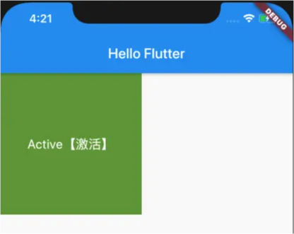
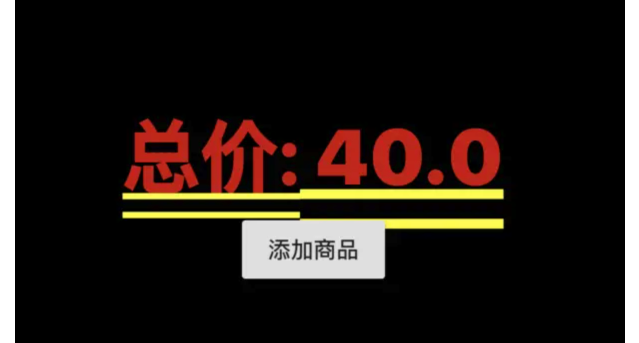
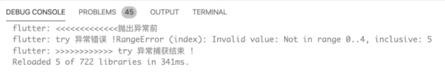
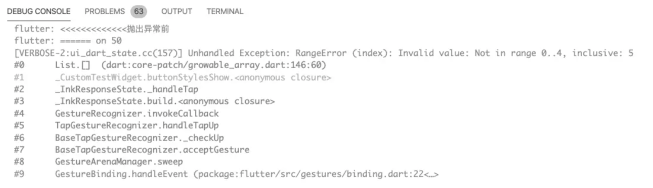
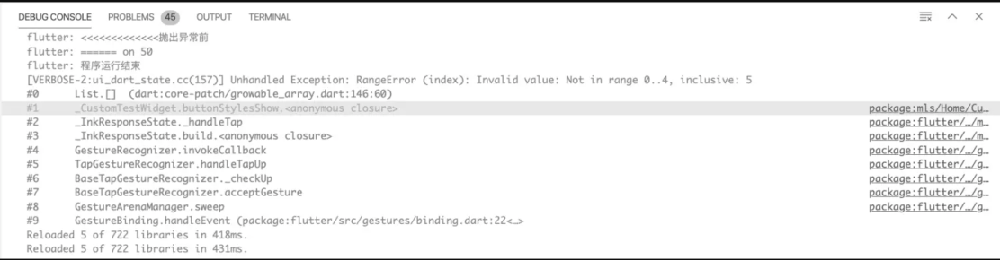

> <h2 id=''></h2>
- [**状态**](#状态)
	- [Provider](#Provider)
	- [Widget管理自身状态](#Widget管理自身状态)
	- [父Widget管理子Widget的状态](#父Widget管理子Widget的状态)
	- [跨组件状态共享](#跨组件状态共享)
		- [Builder](#builder)
- [系统方法调用顺序](#系统方法调用顺序)
	- [状态 setState方法调用](#状态setState方法调用)
	- [导航 Navigation](#导航Navigation)
- [**Stream**](#Stream)
	- [分类](#分类)
		- [StreamController](#StreamController)
		- [listen](#listen)
	- [单订阅](#单订阅)
	- [多订阅流](#多订阅流)
- [异常抛出](#异常抛出)
	- [Throw](#Throw)
	- [Catch](#Catch)
		- [关键字On](#关键字On)
	- [再次抛出异常rethrow](#再次抛出异常rethrow)
	- [Finally](#Finally)
- **资料**
	- [组件可选参数Key的见解](https://juejin.im/post/5ca2152f6fb9a05e1a7a9a26)
	- [深入浅出Key(Vadaski-掘金)](https://juejin.cn/post/6844903811870359559)
	- [Widget管理自身状态](https://juejin.cn/entry/6844903864852807694)


<br/>

***
<br/>


> <h1 id='状态'>状态</h1>

<br/>

>## <h2 id='Provider'>[Provider](https://juejin.cn/post/7067356022272163847)</h2>


&emsp; Flutter 实际上在一开始就为我们提供了一种状态管理方式，那就是 StatefulWidget。但是我们很快发现，它正是造成上述原因的罪魁祸首。

&emsp; 在 State 属于某一个特定的 Widget，在多个 Widget 之间进行交流的时候，虽然你可以使用 callback 解决，但是当嵌套足够深的话，我们会增加非常多的垃圾代码。

&emsp; 这时候，我们便迫切的需要一个架构来帮助我们理清这些关系，状态管理框架应运而生。


下载[Provider](https://pub.flutter-io.cn/packages/provider/install)插件.

```
dependencies:
  provider: ^4.3.2+2
```


<br/>
<br/>

> <h2 id='MultiProvider'>MultiProvider</h2>


使用嵌套的方式来组合多个 Provider,这时候我们就可以使用一个非常 sweet 的组件`MultiProvider`:

```
void main() {
  final counter = CounterModel();
  final textSize = 48;

  runApp(
    MultiProvider(
      providers: [
        Provider.value(value: textSize),
        ChangeNotifierProvider.value(value: counter)
      ],
      child: MyApp(),
    ),
  );
}

```


<br/>

***
<br/>


> <h1 id='Widget管理自身状态'>Widget管理自身状态</h1>


```
import 'package:flutter/cupertino.dart';
import 'package:flutter/material.dart';

///TapboxA 类
class TapboxA extends StatefulWidget {
  TapboxA({Key key}) : super(key: key);

  @override
  _TapboxAState createState() => new _TapboxAState();
  
}

class _TapboxAState extends State<TapboxA> {

  bool _active = false;
  void _handleTap() {
    setState(() {
      _active = !_active;
    });
  }

  @override
  Widget build(BuildContext context) {

    return new GestureDetector(
      onTap: _handleTap,
      child: new Container(
        child: new Center(
          child: new Text(
            _active ? 'Active' : 'No Active',
            style: new TextStyle(fontSize: 32.0, color: Colors.white),
          ),
        ),
        width: 200.0,
        height: 200.0,
        decoration: new BoxDecoration(
          color:_active ? Colors.lightGreen[700] : Colors.grey[600],
        ),
      ),
    );
  }
  
}
```

<br/>

**调用**

```

void main() {
  runApp(MyApp());
  // runApp(Text("hellosjglajgl"));
}

class MyApp extends StatelessWidget {
  @override
  Widget build(BuildContext context) {
    return MaterialApp(
      home:Scaffold(
        appBar: AppBar(
          title: Text('Hello Flutter'),
        ),
        body: TapboxA(),
      )
    );
  }
  
}
```

效果图：


点击灰色色块，进行变色。


<br/>
<br/>

> <h2 id='父Widget管理子Widget的状态'>父Widget管理子Widget的状态</h2>


```


///------------------------- ParentWidgetState 类 ----------------------------------
///父组件
class ParentWidgetState extends StatefulWidget {
  @override
  _ParentWidgetState createState()  => new _ParentWidgetState();
  
}

class _ParentWidgetState extends State<ParentWidgetState> {

  bool _active = false;

  ///回掉函数
  void _handleTapboxChaned(bool newValue){
    setState(() {
      //修改状态
      _active = newValue;
    });
  }

  @override
  Widget build(BuildContext context) {
    // TODO: implement build
    return new Container(
      child: new TapboxB (
        active: _active,
        //将_handleTapboxChaned函数赋值给TapboxB的onChanged
        onChanged: _handleTapboxChaned,
      ),
    );
  }
  
}

///------------------------- TapboxB ----------------------------------
///子组件
class TapboxB extends StatelessWidget {

  final bool active;
  ///定义接收父类回调函数的指针
  final ValueChanged<bool> onChanged;

  TapboxB({Key key, this.active: false, @required this.onChanged}) : super(key: key);

  void _handleTap() {
    onChanged(!active);
  }


  @override
  Widget build(BuildContext context) {

    return new GestureDetector(
      //调用回调函数传值
      onTap: _handleTap,
      child: new Container(
        child: new Center(
          child: new Text(
            active ? "Active【激活】" : "No Active【没激活】",
            style: new TextStyle(
              fontSize: 18.0,
              color: Colors.white,
            ),
          ),
        ),
        width: 200,
        height: 200,
        decoration: new BoxDecoration(
          color: active ? Colors.lightGreen[700] : Colors.grey[600],
        ),
      ),
    );
  }
  
}

```

<br/>

**调用**

```
void main() {
  runApp(MyApp());
  // runApp(Text("hellosjglajgl"));
}

class MyApp extends StatelessWidget {
  @override
  Widget build(BuildContext context) {
    return MaterialApp(
      home:Scaffold(
        appBar: AppBar(
          title: Text('Hello Flutter'),
        ),
        body: ParentWidgetState(),
      )
    );
  }
  
}
```

效果图：




<br/>
<br/>


> <h2 id='跨组件状态共享'>跨组件状态共享</h2>


```
import 'dart:collection';
import 'dart:typed_data';

import 'package:flutter/cupertino.dart';
import 'package:flutter/material.dart';

// 一个通用的InheritedWidget，保存任需要跨组件共享的状态
class InheritedProvider<T> extends InheritedWidget {
  //共享状态使用泛型
  final T data;  


  InheritedProvider({@required this.data, Widget child}) : super(child: child);
  
  @override
  //在此简单返回true，则每次更新都会调用其依赖的子孙节点didChangeDependencies
  bool updateShouldNotify(InheritedProvider<T> oldWidget) {
    return true;
  }
  
}


Type _typeOf<T>() => T;
class ChangeNotifierProvider<T extends ChangeNotifier> extends StatefulWidget {
  final Widget child;
  final T data;
    

  ChangeNotifierProvider({
    Key key,
    this.data,
    this.child,
  });

  //定义一个便捷方法，方便子树中的widget获取共享数据
  static T of<T> (BuildContext context) {
    final type = _typeOf<InheritedProvider<T>>();
    //final provider = context.inheritFromWidgetOfExactType(type) as InheritedProvider<T>;
    //final provider = context.dependOnInheritedWidgetOfExactType(aspect: type) as InheritedProvider<T>;
    final provider = context.dependOnInheritedWidgetOfExactType<InheritedProvider<T>>();
    print("商品的Model是：${(provider.data as CartModel).totalPrice}");
    return provider.data;
  }

  @override
  _ChangeNotifierProviderState<T> createState() {
    return _ChangeNotifierProviderState<T>();
  }
  
}

/*
* _ChangeNotifierProviderState 主要作用就是监听到共享状态（model）改变时重新构建Widget树
* 
*/
class _ChangeNotifierProviderState<T extends ChangeNotifier> extends State<ChangeNotifierProvider<T>> {
  
  ///如果数据发生变化（model类调用了notifyListeners），重新构建InheritedProvider
  //void update() => setState(() => {});
  void update() {
    //build方法会被执行
    setState(() => {});
  }
  

  @override
  void didUpdateWidget(ChangeNotifierProvider<T> oldWidget) {
    // 当Provider更新时，如果新旧数据不"=="，则解绑旧数据监听，同时添加新数据监听
    if (widget.data != oldWidget.data) {
      oldWidget.data.removeListener(update);
      widget.data.addListener(update);
    }
    super.didUpdateWidget(oldWidget);
  }

  @override
  void initState() {
    // 给model添加监听器
    widget.data.addListener(update);
    super.initState();
  }

  @override
  void dispose() {
    // 移除model的监听器
    widget.data.removeListener(update);
    super.dispose();
  }

  @override
  Widget build(BuildContext context) {
    return InheritedProvider<T>(
      data: widget.data,
      child: widget.child,
    );
  }
  
}


/*
* 定义一个Item类，用于表示商品信息 
*
*/
class Item {
  //商品单价
  double price;
  // 商品份数
  int count;

  Item(this.price, this.count);
}


/*
* 定义一个保存购物车内商品数据的CartModel类
* CartModel即要跨组件共享的model类
*/
class CartModel extends ChangeNotifier {
  //用于保存购物车中商品列表
  final List<Item> _items = [];
  ///禁止改变购物车里的商品信息
  UnmodifiableListView<Item> get items => UnmodifiableListView(_items);
  ///购物车中商品的总价
  double get totalPrice => _items.fold(0, (value, item) => value + item.count * item.price);


  //将 [item] 添加到购物车。这是唯一一种能从外部改变购物车的方法
  void add(Item item) {
    _items.add(item);
    //通知监听器（订阅者），重新构建InheritedProvider， 更新状态
    notifyListeners();
  }
}

/*
* 构建示例页面类：ProviderRoute
*
*/
class ProviderRoute extends StatefulWidget {
  @override
  _ProviderRouteState createState() => _ProviderRouteState();
  
}

class _ProviderRouteState extends State<ProviderRoute> {
  
  
  @override
  Widget build(BuildContext context) {

    return Center(
      child:ChangeNotifierProvider<CartModel>(
        data: CartModel(),
        child: Builder(builder: (context) {
          return Column(
            children:<Widget>[
              Text(""),
              Text(""),
              Text(""),
              Text(""),
              Builder(builder: (context) {
                var cart = ChangeNotifierProvider.of<CartModel>(context);
                return Text("总价: ${cart.totalPrice}");
              }),
              Builder(builder: (context) {
                //在后面优化部分会用到
                print("RaisedButton build");
                return RaisedButton(
                  child: Text("添加商品"),
                  onPressed: (){
                    ChangeNotifierProvider.of<CartModel>(context).add(Item(20.0, 1));
                  },
                );
              }),
            ],
          );
        }),
      ),
    );
  }
  
}
```

效果图：




<br/><br/>


> <h3 id='#builder'> Builder </h3>

介绍:调用闭包以获取其子小部件的小部件

基础用法：

```
Builder(
  builder: (BuildContext context){
    return Container();
  },
)
````
 
<br/>
<br/>
    
Builder中有一个builder，返回一个Widget即可，那和直接使用Container有什么区别吗？

答案肯定是有的，用处主要体现在context上。

- **1.使用场景一**

&emsp; 看下这个异常信息：Scaffold.of() called with a context that does not contain a Scaffold，这个异常学习Flutter的过程中会经常遇到，原因就是当前的context没有包含在Scaffold控件中，比如下面的写法就会出现此异常：

```
class HomePage extends StatelessWidget {
  @override
  Widget build(BuildContext context) {
    return Scaffold(
      appBar: AppBar(
        title: Text('老孟'),
      ),
      body: Center(
        child: RaisedButton(
          color: Colors.pink,
          textColor: Colors.white,
          onPressed: _displaySnackBar(context),
          child: Text('show SnackBar'),
        ),
      ),
    );
  }
}

_displaySnackBar(BuildContext context) {
  final snackBar = SnackBar(content: Text('老孟'));
  Scaffold.of(context).showSnackBar(snackBar);
}
```


<br/>
   
使用Build解决此问题：

```
Scaffold(
    appBar: AppBar(
        title: Text('老孟'),
    ),
    body: Builder(
        builder: (context) => 
            Center(
            child: RaisedButton(
            color: Colors.pink,
            textColor: Colors.white,
            onPressed: () => _displaySnackBar(context),
            child: Text('老孟'),
            ),
        ),
    ),
);
```
    
    
<br/>
<br/>


- **2.使用场景二**

自定义事件分发，代码如下：

```
NotificationListener<CustomNotification>(
  onNotification: (CustomNotification notification) {
    print('介绍事件——2：${notification.value}');
    return false;
  },
  child: Center(
    child: RaisedButton(
      child: Text('发送'),
      onPressed: () {
        CustomNotification('自定义事件').dispatch(context);
      },
    ),
  ),
)
```
    
    
<br/>
<br/>


此时点击按钮并不会分发事件，修改如下：

```
NotificationListener<CustomNotification>(
  onNotification: (CustomNotification notification) {
    print('介绍事件——2：${notification.value}');
    return false;
  },
  child: Center(
    child: Builder(
      builder: (context) {
        return RaisedButton(
          child: Text('发送'),
          onPressed: () {
            CustomNotification('自定义事件').dispatch(context);
          },
        );
      },
    ),
  ),
)
```
    
只需在RaisedButton外面包裹Builder即可，为什么会出现此问题？

&emsp; 因为没有Builder的context表示当前整个控件的context，其上并没有NotificationListener监听，而加上Builder后，context表示Builder控件，其上有NotificationListener监听


<br/>

***
<br/>
<br/>


> <h1 id='系统方法调用顺序'>系统方法调用顺序</h1>


<br/>


> <h2 id='状态setState方法调用'>状态 setState方法调用</h2>


- **触发组件的 build 方法**
	- 对子、父小部件的影响：
	- 子控件的build方法会被执行，如果key不同，则initState方法也会被执行；
	- 父控件不执行build和initState；


<br/>
<br/>

> <h2 id='导航Navigation'>导航 Navigation</h2>

- 弹框pop：
	- initState和build都不会被执行；

- 页面pop：
	- pop回来之后,build 方法会被执行；

- 页面push：
	- push的时候,build 方法会被执行；

- 列表滚动：
	- 列表新item的build和initState方法都会被执行；
	- 当列表所在页面setState的时候，如果item的key没变化，则item只执行build方法，如果item的key有变化则执行build和initState；


<br/>

***
<br/>
<br/>


> <h1 id='Stream'>Stream</h1>

<br/>

> <h2 id=' 分类'> 分类</h2>

-  **`Single-subscriptio`** :  单订阅流;
- **`broadcast`**:   广播式的流（可多订阅）;
- 如果一个流是单订阅模式 却想多次订阅，可以通过`asBroadcastStrea()`方法来修改。

&emsp;  单订阅流只能被订阅一次，重复订阅会报错， 直到设置listen 后才会发送。单订阅流通常用于流式数据块较大的连续数据，如文件I/O;

&emsp;  广播式的流可以订阅多次，在listen之前的数据会丢失。

<br/>

&emsp;  为了方操作 Stream ，官方提供了StreamController.

&emsp; 如下图所示，StreamSink来添加流(入口），同时提供 stream 属性用于对外的监听和变换。 

&emsp;  stream.listen的返回一个StreamSubscription，可以通过它的`pause(), resume(), cancel()`等方法来操作流的订阅。


<br/>
<br/>

> <h3 id='StreamController'>StreamController</h3>


```
// 创建一个单订阅流
StreamController controller = StreamController<String>(); 
// 创建一个广播式的订阅流
StreamController controller = StreamController.broadcast(); 
```


<br/>
<br/>

> <h3 id='listen'>listen</h3>

 **listen ：** 用来设置监听， 它的返回值是 StreamSubscribe。

-  **`StreamSubscribe`**
	- ` pause()` ： 暂停监听（是立即暂停），暂停后的事件流不会丢失，会在resume后一起回调;
	- `resume()`： 唤醒pause的流
	- `cancel()`： 取消


<br/>
<br/>


> <h2 id='单订阅'>单订阅</h2>


```
 ///定义一个Controller
  StreamController<List<String>> _dataController = StreamController<List<String>>();
  ///获取 StreamSink 做 add 入口
  StreamSink<List<String>> _dataSink = _dataController.sink;
  ///获取 Stream 用于监听
  Stream<List<String>> _dataStream =  _dataController.stream;
  ///事件订阅对象
  StreamSubscription _dataSubscription = _dataStream.listen((value){
    ///do change
    print('监听值为：${value}');
  });
  ///改变事件
  _dataSink.add(["first", "second", "three", "more"]);
```

打印：


`其他的`

<br/>

```
StreamController controller = StreamController<String>();
StreamSink sink = controller.sink;
Stream stream = controller.stream;

stream.transform(StreamTransformer<String, String>.fromHandlers(handleData: (String data, EventSink<String> sink) {
if (!data.contains('数据2')) {
  sink.add(data);
}
})).listen((event) {
print('接受到的数据是： ${event}');
});
sink.add('3秒后才设置监听。');
```

打印：

```
flutter: 接受到的数据是： 3秒后才设置监听。
```

<br/>

```
StreamController controller = StreamController<String>();
StreamSink sink = controller.sink;
Stream stream = controller.stream;


StreamSubscription subscription = controller.stream.transform(StreamTransformer<String, String>.fromHandlers(handleData: (String data, EventSink<String> sink){
print('transform');
if (!data.contains('数据3')) {
  sink.add(data);
}
})).listen((event) {
print('接受到的数据是： ${event}');
}); 
sink.add('我是一条新的消息');

```

打印：

```
flutter: 接受到的数据是： 我是一条新的消息
```


<br/>
<br/>


> <h2 id='多订阅流'>多订阅流</h2>


```
// 初始化一个int类型的广播Stream controller
final StreamController<int> ctrl = StreamController<int>.broadcast();

// 初始化一个监听，同时通过transform对数据进行简单处理
final StreamSubscription subscription = ctrl.stream
                      .where((value) => (value % 2 == 0))
                      .listen((value) => print('监听：$value'));

// 往Stream中添加数据
for(int i=1; i<11; i++){
ctrl.sink.add(i);
}

// StreamController用完后需要释放
ctrl.close();
```

打印：


<br/>

***
<br/>
<br/>

> <h1 id='异常抛出'>异常抛出</h1>


<br/>
<br/>


> <h2 id='Throw'>Throw</h2>

- 抛出一个已知异常

```
//执行
print('<<<<<<<<<<<<<抛出异常前');
//执行
throw new FormatException('抛出异常！！！');
//或者：  throw '抛出异常！！！';
//不执行
print('抛出异常前>>>>>>>>>>>>');
```

打印效果：


从打印结果来看，一旦发生异常后面的逻辑就不会执行了。


<br/>
<br/>


> <h2 id='Catch'>Catch</h2>

- 普通捕获

```
print('<<<<<<<<<<<<<抛出异常前');
var initArray = [10, 20, 30, 40, 50];
try {
  
  print('========= ${initArray[5]}');
  
} catch (e) {
  print('try 异常错误 !' + e.toString());
}
print('>>>>>>>>>>>> try 异常捕获结束 !');
           
```





&emsp;  用try 包含异常的代码，然后进行捕获。捕获后进行输出错误的代码提示，但是后面的代码依然执行。


<br/>
<br/>

> <h3 id='关键字On'>关键字On</h3>


<br/>
<br/>


```
print('<<<<<<<<<<<<<抛出异常前');
var initArray = [10, 20, 30, 40, 50];

try {
print('========= ${initArray[5]}');

} on RangeError {
print('====== on ${initArray[4]}');
} on FormatException {
print('FormatException');
} catch (e) {
print('try 异常错误提示 !' + e.toString());
}
print('>>>>>>>>>>>> try 异常捕获结束 !');
```


&emsp;  我们看到详细的错误信息没有打印，因为代码逻辑走到 on RangeError 分支，而输出的详细错误信息是作为默认异常处理才被执行的。


<br/>
<br/>


> <h3 id='再次抛出异常rethrow'>再次抛出异常rethrow</h3>


```
print('<<<<<<<<<<<<<抛出异常前');
var initArray = [10, 20, 30, 40, 50];

try {
  print('========= ${initArray[5]}');
  
} on RangeError {
  print('====== on ${initArray[4]}');
  rethrow;
} on FormatException {
  print('FormatException');
} catch (e) {
  print('try 异常错误提示 !' + e.toString());
}
print('>>>>>>>>>>>> try 异常捕获结束 !');

```

效果：




&emsp; 我们看到当我们使用了 rethrow 后，我们的代码并没有对后面的逻辑进行执行，尤其是 catch 中的捕获，仅仅是给出了错误的原因。


<br/>
<br/>


> <h2 id='Finally'>Finally</h2>


```
print('<<<<<<<<<<<<<抛出异常前');

var initArray = [10, 20, 30, 40, 50];

try {
  print('========= ${initArray[5]}');
  
} on RangeError {
  print('====== on ${initArray[4]}');
  rethrow;
} on FormatException {
  print('FormatException');
} catch (e) {
  print('try 异常错误提示 !' + e.toString());
} finally {
  print('程序运行结束');
}
print('>>>>>>>>>>>> try 异常捕获结束 !');
```




<br/>

***
<br/>
<br/>


> <h1 id=''></h1>


<br/>
<br/>


> <h2 id=''></h2>


