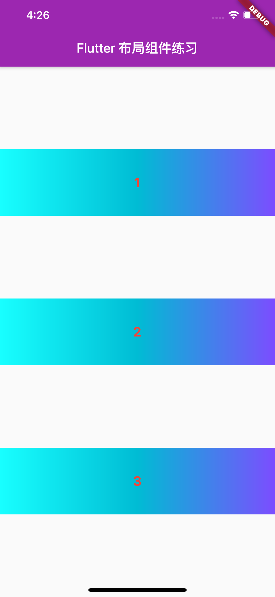

- **行、列布局**


<br/>

***
<br/>

>**`MainAxisAlignment（主轴）`**:  就是与当前控件方向一致的轴;
**`CrossAxisAlignment（交叉轴）`**:  就是与当前控件方向垂直的轴;


**`MyApp 类`**

```
import 'package:flutter/material.dart';

void main() => runApp(MyApp());

class MyApp extends StatelessWidget {
  @override
  Widget build(BuildContext context) {
    return MaterialApp(
      title: 'Flutter Demo',
      theme: ThemeData(
        primarySwatch: Colors.purple,
      ),
      home: MyHomePage(title: 'Flutter 布局组件练习'),
    );
  }
}

class MyHomePage extends StatefulWidget {
  MyHomePage({Key key, this.title}) : super(key: key);
  final String title;

  @override
  _MyHomePageState createState() => _MyHomePageState();
}

class _MyHomePageState extends State<MyHomePage> {
  int _counter = 0;

  void _incrementCounter() {
    setState(() {
      _counter++;
    });
  }


  @override
  Widget build(BuildContext context) {
    return Scaffold(
      appBar: AppBar(
        title: Text(widget.title),
      ),
      body:
          Center(
            //行布局调用
            child: ShadeSquare.testLayoutOfROw(),
            //···
           // ···
           //···
          ),
    );
  }
}
```


<br/>

**`渐变正方形 ShadeSquare 类`**

```
//渐变颜色正方形
class ShadeSquare extends StatelessWidget {
  String index;
  double squareSize = 100;

  ShadeSquare(String index) {
    this.index = index;
  }
    
  //行布局
  static Container testLayoutOfROw() {
    /*Container:
    * . 是一个结合了绘制（painting）、定位（positioning）以及尺寸（sizing）widget的widget
    * . 参考资料：https://www.jianshu.com/p/366b2446eaab
    * */
    return Container(
      width: double.infinity,//强制在宽度上撑满，不设置，则根据child和父节点两者一起布局
      height: 800,
      margin: EdgeInsets.all(20),
      /*decoration:
      * . 绘制在child后面的装饰
      * . 设置了decoration的话，就不能设置color属性，否则会报错，此时应该在decoration中进行颜色的设置
      * */
      decoration: BoxDecoration(
        border: Border.all(
          color: Colors.red,
          width: 6,
        ),
        color: Colors.white,//设置container背景色
        borderRadius: new BorderRadius.all(new Radius.circular(20.0)),
      ),
      child: Row(  //container中的内容widget
        /*MainAxisAlignment:  (主轴)就是与当前控件方向一致的轴
        * .start:  将子控件放在主轴的开始位置
        * .end:    将子控件放在主轴的开始位置
        * .center: 将子控件放在主轴的中间位置
        * .spaceBetween:  将主轴空白位置进行均分，排列子元素，手尾没有空隙
        * .spaceAround:   将主轴空白区域均分，使中间各个子控件间距相等，首尾子控件间距为中间子控件间距的一半
        * .spaceEvenly:   将主轴空白区域均分，使各个子控件间距相等
        */
        mainAxisAlignment: MainAxisAlignment.center,
        //crossAxisAlignment: 子组件在纵轴方向的对齐方式
        /*CrossAxisAlignment
          * Row（水平排列）控件中，CrossAxisAlignment的方向就是垂直的;
          * Column（垂直排列）控件中，CrossAxisAlignment的方向就是水平的;
          * .start:     将子控件放在交叉轴的起始位置
          * .end:       将子控件放在交叉轴的结束位置
          * .center:    将子控件放在交叉轴的中间位置
          * .stretch:   使子控件填满交叉轴
          * .baseline:  将子控件放在交叉轴的上，并且与基线相匹配（不常用）
          * */
        crossAxisAlignment: CrossAxisAlignment.start,
        children: <Widget>[
          ShadeSquare("1"),
          ShadeSquare("2"),
          ShadeSquare("3"),
        ],
      ),
    );
  }

  @override
  Widget build(BuildContext context) {

    return Container(
      width: squareSize,
      height: squareSize,
      alignment: Alignment.center,
      decoration: BoxDecoration(
        gradient: LinearGradient(
            colors: [Colors.cyanAccent, Colors.cyan, Colors.deepPurpleAccent]
        ),
      ),

      child: Text(
        index,
        style: TextStyle(
          color: Colors.red,
          fontSize: 20,
          fontWeight: FontWeight.bold,
        ),

      ),
    );
  }
}
```  
效果图：


<br/>

**`ShadeSquare 添加下述方法，并在 MyApp 类调用`**

```
  //列布局
  static Column testLayoutOfColumn() {
    return Column(
      /*CrossAxisAlignment: 子组件在纵轴方向的对齐方式
      * Row（水平排列）控件中，CrossAxisAlignment的方向就是垂直的;
      * Column（垂直排列）控件中，CrossAxisAlignment的方向就是水平的;
      * .start:     将子控件放在交叉轴的起始位置
      * .end:       将子控件放在交叉轴的结束位置
      * .center:    将子控件放在交叉轴的中间位置
      * .stretch:   使子控件填满交叉轴
      * .baseline:  将子控件放在交叉轴的上，并且与基线相匹配（不常用）
      * */
      crossAxisAlignment: CrossAxisAlignment.stretch,
      /*MainAxisAlignment:  (主轴)就是与当前控件方向一致的轴
      * .start:  将子控件放在主轴的开始位置
      * .end:    将子控件放在主轴的开始位置
      * .center: 将子控件放在主轴的中间位置
      * .spaceBetween:  将主轴空白位置进行均分，排列子元素，手尾没有空隙
      * .spaceAround:   将主轴空白区域均分，使中间各个子控件间距相等，首尾子控件间距为中间子控件间距的一半
      * .spaceEvenly:   将主轴空白区域均分，使各个子控件间距相等
      * */
      mainAxisAlignment: MainAxisAlignment.spaceEvenly,
      children: <Widget>[
        ShadeSquare("1"),
        ShadeSquare("2"),
        ShadeSquare("3"),
      ],
    );
  }
```

<br/>

效果图：
<br/>



<br/>

> **`textDirection`**:  就是用来控制水平方向的起始位置和排列方向;
**`verticalDirection`**:  就是用来控制垂直方向的起始位置和排列方向;


