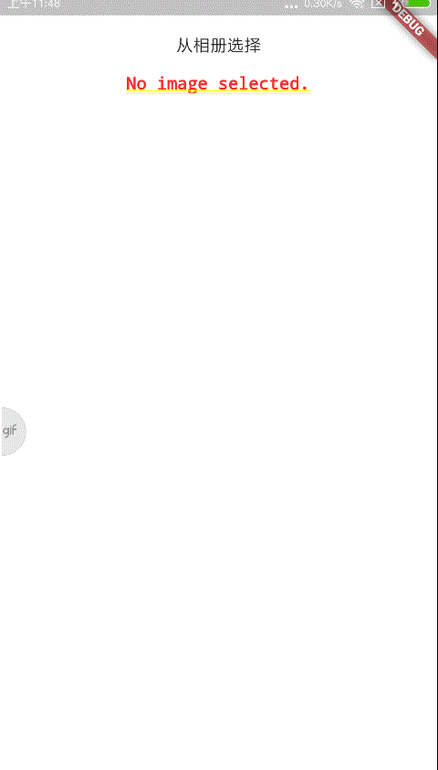

> <h2 id=''></h2>
- [**插件配置**](#插件配置)
- [**`FlutterToast弹框提示插件`**](#FlutterToast弹框提示插件)
- [**`image_picker图片选择`**](#image_picker图片选择)
- **参考资料**
	- [Flutter查看和下载插件的地方](https://pub.flutter-io.cn)
	- [数据计算精度插件](https://github.com/Sky24n/common_utils)
	- [App信息插件PackageInfo](https://www.bugcatt.com/archives/1634)
	- [刷新插件pull_to_refresh](https://juejin.cn/post/6844903944573943821)
	- [Flutter Candies 一桶天下(组件UI和Demo)](https://juejin.im/post/6844903986370183175#heading-29)
	- [【Flutter学习】页面跳转之SliverAppBar,CustomScrollView,NestedScrollView的使用](https://www.shuzhiduo.com/A/x9J2v8GZJ6/)


<br/>

***
<br/>


># 


> <h1 id='插件配置'>插件配置</h1>


<br/>

- 插件下载地址：

```
pub.dev
```

- 插件在终端更新命令：

```
flutter pub get
```


<br/>

***
<br/>


> <h1 id='FlutterToast弹框提示插件'>FlutterToast 弹框提示插件</h1>

[FlutterToast案例demo](https://juejin.im/post/6844904166389710855)


<br/>

***
<br/>


> <h1 id='image_picker图片选择'>image_picker 图片选择</h1>


```
class TakeDemo extends StatefulWidget {
  @override
  _TakeDemoState createState() => _TakeDemoState();
}

class _TakeDemoState extends State<TakeDemo> {
  File _image;

  @override
  Widget build(BuildContext context) {
    return Container(
      color: Colors.white,
      padding: EdgeInsets.only(top: 20),
      alignment: AlignmentDirectional.center,
      child: Column(
        children: <Widget>[
          FlatButton(
            onPressed: () {
              getImage();
            },
            child: Text('从相册选择'),
          ),
          Center(
            child: _image == null
                ? Text('No image selected.',style: TextStyle(fontSize: 14),)
                : Image.file(_image),
          ),
        ],
      ),
    );
  }

  Future getImage() async {
    //gallery相册，camera拍照
    var image = await ImagePicker.pickImage(source: ImageSource.gallery);

    setState(() {
      _image = image;
    });
  }
}
```


