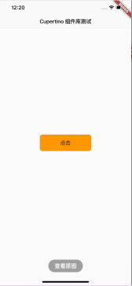

- [Widget](#Widget)
	- [简介](#简介)
- [**`StatelessWidget`**](#StatelessWidget)
	- [context属性](#context属性)
- [**`StatefulWidget`**](#StatefulWidget)
- [**`Flutter SDK自带组件库`**](#FlutterSDK自带组件库)
- [**`状态管理`**](#状态管理)
	- [InheritedWidget共享自增数据](#InheritedWidge共享自增数据t)
- [**`路由管理`**](#路由管理)
	- [路由导航](#路由导航)
- [行、列布局](#行、列布局)


<br/>

***
<br/>
<br/>


> <h1 id=''></h1>


<br/>
<br/>


> <h2 id=''></h2>


 


<br/>

***
<br/>

># <h1 id='StatelessWidget'>StatelessWidget</h1>

&emsp;  `StatelessWidget`用于不需要维护状态的场景，它通常在build方法中通过嵌套其它Widget来构建UI，在构建过程中会递归的构建其嵌套的Widget。

```
class Echo extends StatelessWidget {

  final String text;
  final Color backgroundColor;

  const Echo({
    Key key,
    @required this.text,
    this.backgroundColor: Colors.grey,
  }): super(key: key);  
//Key: 这个key属性类似于React/Vue中的key;
//主要的作用是决定是否在下一次build时复用旧的widget，决定的条件在canUpdate()方法中

  @override
  Widget build(BuildContext context) {
    return Center(
      child: Container(
        color: backgroundColor,
        child: Text(text),
      ),
    );
  }
}


//调用
Widget build(BuildContext context) {
  return MaterialApp(
    color: Colors.white,
    home: Echo(text: "welcome to 我的家", backgroundColor: Colors.white),
  );
}
```

&emsp;  widget的构造函数参数应使用命名参数，`命名参数中的必要参数要添加@required标注`，这样有利于静态代码分析器进行检查。

&emsp;  另外，`在继承widget时，第一个参数通常应该是Key`.另外，如果Widget需要接收子Widget，那么child或children参数通常应被放在参数列表的最后。同样是按照惯例，`Widget的属性应尽可能的被声明为final，防止被意外改变`。


<br/>

> <h2 id='context属性'>context属性</h2>


&emsp;  `build`方法有一个`context`参数，它是`BuildContext`类的一个实例，表示当前widget在widget树中的上下文，每一个widget都会对应一个context对象（因为每一个widget都是widget树上的一个节点）。实际上，context是当前widget在widget树中位置中执行”相关操作“的一个句柄，比如它提供了从当前widget开始向上遍历widget树以及按照widget类型查找父级widget的方法。

```

@override
Widget build(BuildContext context) {
  return Scaffold(
    appBar: AppBar(
      title: Text("Context 测0000000试"),
    ),
    body: Container(
      child: Builder(builder: (context) {
        Scaffold scaffold = context.findAncestorWidgetOfExactType();
        return (scaffold.appBar as AppBar).title;
      }),
    ),
  );
}
```


<br/>

***
<br/>

># <h1 id='StatefulWidget '>StatefulWidget </h1>


**方法:**
- `createState()` 用于创建和Stateful widget相关的状态，它在Stateful widget的生命周期中可能会被多次调用。例如，当一个Stateful widget同时插入到widget树的多个位置时，Flutter framework就会调用该方法为每一个位置生成一个独立的State实例，其实，本质上就是一个StatefulElement对应一个State实例。
> &emsp;  在说`“widget树”`时它可以指`widget结构树`，但由于`widget与Element有对应关系（一可能对多）`，在有些场景（Flutter的SDK文档中）也代指“UI树”的意思。而在`stateful widget`中，`State对象也和StatefulElement具有对应关系（一对一）`，所以在Flutter的SDK文档中，可以经常看到“从树中移除State对象”或“插入State对象到树中”这样的描述。其实，无论哪种描述，其意思都是在描述“一棵构成用户界面的节点元素的树”。


<br/>

- **`State `**

&emsp;  一个`StatefulWidget`类会对应一个`State类`，State表示与其对应的`StatefulWidget`要维护的状态，State中的保存的状态信息有：

- 在widget 构建时可以被同步读取。

- 在widget生命周期中可以被改变，当State被改变时，可以手动调用其 `setState()`方法通知Flutter framework状态发生改变，Flutter framework在收到消息后，会重新调用其build方法`重新构建widget树`，从而达到更新UI的目的。


<br/>

- State中有两个常用属性：
	- `widget`，它表示与该`State实例关联的widget实例`，由Flutter framework动态设置。`注意`，这种关联并非永久的，因为在应用生命周期中，UI树上的某一个节点的widget实例在重新构建时可能会变化，但State实例只会在第一次插入到树中时被创建，当在重新构建时，`如果widget被修改了，Flutter framework会动态设置State.widget为新的widget实例`。
	- `context`, `StatefulWidget`对应的`BuildContext`，作用同`StatelessWidget的BuildContext`。


<br/>

># <h1 id='FlutterSDK自带组件库'>Flutter SDK自带组件库</h1>

**基础组件**

- `import 'package:flutter/widgets.dart';`

&emsp;  `Flutter` 提供了一套丰富、强大的基础组件，在基础组件库之上`Flutter`又提供了一套`Material风格（Android默认的视觉风格）`和一套`Cupertino风格（iOS视觉风格）的组件库`。

<br/>

- **Material组件**
	- `import 'package:flutter/material.dart';`

&emsp;  `Material`组件，它可以帮助我们构建遵循Material Design设计规范的应用程序。Material应用程序以[`MaterialApp`](https://docs.flutter.io/flutter/material/MaterialApp-class.html) 组件开始， 该组件在应用程序的根部创建了一些必要的组件，比如`Theme`组件，它用于配置应用的主题。


<br/>

- **Cupertino组件**
	- `import 'package:flutter/cupertino.dart';`

&emsp;  `Cupertino风格的组件`，尽管目前还没有Material 组件那么丰富，但是它仍在不断的完善中。值得一提的是在Material 组件库中有一些组件可以根据实际运行平台来切换表现风格，比如MaterialPageRoute，在路由切换时，如果是Android系统，它将会使用Android系统默认的页面切换动画(从底向上)；如果是iOS系统，它会使用iOS系统默认的页面切换动画（从右向左）。


<br/>

`cupertinoTestRoute.dart 文件`

```
import 'package:flutter/cupertino.dart';

class cupertinoTestRoute extends StatelessWidget {

  @override
  Widget build(BuildContext context) {
    // TODO: implement build
    return CupertinoPageScaffold(
      navigationBar: CupertinoNavigationBar(
        middle: Text("Cupertino 组件库测试"),
      ),
      child: Center(
        child: CupertinoButton(
            color: CupertinoColors.activeOrange,
            child: Text("点击"),
            onPressed: () {}),
      ),
    );
  }
}

```


<br/>

**main.dart 文件**

```
//自定义类文件
import 'package:flutter_demo/customWidget/cupertinoWidget.dart';

//调用
Widget build(BuildContext context) {

  return MaterialApp(
    title: 'Flutter Demo',
    theme: ThemeData(
      primarySwatch: Colors.cyan,
    ),
    home: cupertinoTestRoute(),//初始化
  );
}

```

效果：




<br/>

***
<br/>

># <h1 id='状态管理'>状态管理</h1>

`stateWidgets.dart 文件`

```
import 'package:flutter/cupertino.dart';
import 'package:flutter/material.dart';

class TapboxA extends StatefulWidget {
  TapboxA({Key key}): super(key: key);

  @override
  _TapboxAState createState() => new _TapboxAState();
}

class _TapboxAState extends State<TapboxA> {
  bool _active = false;

  void _handleTap() {
    setState(() {
      _active = !_active;
    });
  }

  @override
  Widget build(BuildContext context) {
    // TODO: implement build
    return new GestureDetector(
      onTap: _handleTap,
      child: new Container(
        child: new Center(
          child: new Text(
            _active ? "激活了" : "未激活",
            style: new TextStyle(
              fontSize: 32.0,
              color: Colors.white
            ),
          ),
        ),
        width: 200.0,
        height: 200.0,
        decoration: new BoxDecoration(
          color: _active ? Colors.lightGreen[700] : Colors.grey[600],
        ),
      ),
    );
  }

}
```

`main.dart 文件`

```
Widget build(BuildContext context) {

  return MaterialApp(
    title: 'Flutter Demo',
    theme: ThemeData(
      primarySwatch: Colors.cyan,
    ),
    home: TapboxA(),
  );
}
}
```

效果：


<br/>
<br/>


> <h2 id='InheritedWidget共享自增数据'>InheritedWidget共享自增数据</h2>


&emsp; 官方说的一通看了以后有点不太了解，通过把代码敲了一通，然后打断点跑了一遍终于知道是咋回事了。

&emsp; 开发做多了，完全跟`iOS的设计模式单例`差不多在存储数据方面。但是在`单例上`又加了`通知`和`全局刷新整个app组件`，相当简单暴力。
好了，先看第一个代码Demo：

```
import 'package:flutter/cupertino.dart';
import 'package:flutter/material.dart';

class ShareDataWidget extends InheritedWidget {

  ///需要在子树中共享的数据，保存点击次数
  final int data;

  ShareDataWidget({
    @required this.data,
    Widget child
  }) : super(child: child);

  ///定义一个便捷方法，方便子树中的widget获取共享数据 
  static ShareDataWidget of(BuildContext context) {
    //return context.inheritFromWidgetOfExactType(ShareDataWidget);// 废弃了
    return context.dependOnInheritedWidgetOfExactType(aspect: ShareDataWidget);
  }

  ///该回调决定当data发生变化时，是否通知子树中依赖data的Widget
  @override
  bool updateShouldNotify(ShareDataWidget oldWidget) {
    // TODO: implement updateShouldNotify
    // 如果返回true，则子树中依赖(build函数中有调用)本widget
    // 的子widget的`state.didChangeDependencies`会被调用
    return oldWidget.data != data;
  }
  
}


/*
  * 实现一个子组件_TestWidget，在其build方法中引用ShareDataWidget中的数据。
  * 同时，在其didChangeDependencies() 回调中打印日志
*/
class  _TestWidget extends StatefulWidget {
  @override
  _TestWidgetState createState() => new _TestWidgetState();
  
}

class  _TestWidgetState extends State<_TestWidget> {
  
  @override
  Widget build(BuildContext context) {
    print("共享数据： ${ShareDataWidget.of(context).data.toString()}");
    //使用InheritedWidget中的共享数据，也就产生了依赖
    return Text(
      "依赖产生：" + ShareDataWidget.of(context)
                      .data
                      .toString()
                      
    );
  }


@override
  void didChangeDependencies() {
    // TODO: implement didChangeDependencies
    super.didChangeDependencies();
    //父或祖先widget中的InheritedWidget改变(updateShouldNotify返回true)时会被调用。
    //如果build中没有依赖InheritedWidget，则此回调不会被调用。
    print("Dependencies change【依赖发生了改变】");
  }
  
}


class  InheritedWidgetTestRoute extends StatefulWidget {

  @override
  _InheritedWidgetTestRouteState createState() => new _InheritedWidgetTestRouteState();
  
}

class  _InheritedWidgetTestRouteState extends State<InheritedWidgetTestRoute> {

  int count = 0;

  @override
  Widget build(BuildContext context) {

    return Center(
      child: ShareDataWidget(
        data: count,
        child: Column(
          mainAxisAlignment: MainAxisAlignment.center,
          children:<Widget>[
            Padding(padding: const EdgeInsets.only(bottom: 20.0),
            child: _TestWidget(),// 子widget中依赖ShareDataWidget
            ),
            RaisedButton(
              ////每点击一次，将count自增，然后重新build,ShareDataWidget的data将被更新
              onPressed: () => setState(() => ++count),
              child: Text("Increment"),
              )
          ]
        ),
        ),
    );
  }
}

```

<br/>

**调用**

```
void main() {
  runApp(MyApp());
  // runApp(Text("hellosjglajgl"));
}

class MyApp extends StatelessWidget {
  @override
  Widget build(BuildContext context) {
    return MaterialApp(
      home:Scaffold(
        appBar: AppBar(
          title: Text('Hello Flutter'),
        ),
        body: InheritedWidgetTestRoute(),
      )
    );
  }
  
}
```

运行效果：


&emsp;  感觉这个可以做app的用户信息展示，感觉很棒。

&emsp;  一般来说，子widget很少会重写`didChangeDependencies()`方法，因为在依赖改变后framework也都会调用build()方法。但是，如果你需要在依赖改变后执行一些昂贵的操作，比如网络请求，这时最好的方式就是在`didChangeDependencies()`方法中执行，这样可以避免每次build()都执行这些昂贵操作。


<br/>

***
<br/>


># <h1 id='路由管理'>路由管理</h1>


打开一个简单的路由Controller

```
//创建一个点击按钮
FlatButton(
  child: Text("打开新路由"),
  textColor: Colors.blue,
  onPressed: (){
    //导航到新路由
    Navigator.push(context, MaterialPageRoute(builder: (context) {
      return NewRoute();
    }));
  },
)


//路由controller
class NewRoute extends StatelessWidget {
  @override
  Widget build(BuildContext context) {
    //Scaffold 是 Material 库中提供的页面脚手架，
    //它提供了默认的导航栏、标题和包含主屏幕widget树（后同“组件树”或“部件树”）的body属性，组件树可以很复杂。
    return Scaffold(
      appBar: AppBar(
        title: Text("👋首页"),
      ),
      body: Center(
        child: Text("这是新的路由"),
      ),
    );
    
  }
}
```

效果图：

<br/>


&emsp; `MaterialPageRoute`继承自`PageRoute`类，`PageRoute`类是一个抽象类，表示占有整个屏幕空间的一个模态路由页面，它还定义了路由构建及切换时过渡动画的相关接口及属性。
&emsp; `MaterialPageRoute` 是`Material组件库提供的组件`，它可以针对不同平台，实现与平台页面切换动画风格一致的路由切换动画。

<br/>

&emsp; `MaterialPageRoute` 构造函数的各个参数的意义：

```
  MaterialPageRoute({
    WidgetBuilder builder,
    RouteSettings settings,
    bool maintainState = true,
    bool fullscreenDialog = false,
  })
```

- `builder` 是一个WidgetBuilder类型的回调函数，它的作用是构建路由页面的具体内容，返回值是一个widget。我们通常要实现此回调，返回新路由的实例。
- `settings` 包含路由的配置信息，如路由名称、是否初始路由（首页）。
- `maintainState`：默认情况下，当入栈一个新路由时，原来的路由仍然会被保存在内存中，如果想在路由没用的时候释放其所占用的所有资源，可以设置maintainState为false。
- `fullscreenDialog` 表示新的路由页面是否是一个全屏的模态对话框，在iOS中，如果fullscreenDialog为true，新页面将会从屏幕底部滑入（而不是水平方向）。


> <h2 id='路由导航'>路由导航</h2>

&emsp; [**MaterialApp**](https://docs.flutter.io/flutter/material/MaterialApp-class.html) 是我们app开发中常用的符合MaterialApp Design设计理念的入口Widget，从源码可以看出该widget的构造方法中有多个参数，但是基本上大多数参数是可以省略的。


```
MaterialApp({
  Key key,
  this.title = '', // 设备用于为用户识别应用程序的单行描述
  this.home, // 应用程序默认路由的小部件,用来定义当前应用打开的时候，所显示的界面
  this.color, // 在操作系统界面中应用程序使用的主色。
  this.theme, // 应用程序小部件使用的颜色。
  this.routes = const <String, WidgetBuilder>{}, // 应用程序的顶级路由表
  this.navigatorKey, // 在构建导航器时使用的键。
  this.initialRoute, // 如果构建了导航器，则显示的第一个路由的名称
  this.onGenerateRoute, // 应用程序导航到指定路由时使用的路由生成器回调
  this.onUnknownRoute, // 当 onGenerateRoute 无法生成路由(initialRoute除外)时调用
  this.navigatorObservers = const <NavigatorObserver>[], // 为该应用程序创建的导航器的观察者列表
  this.builder, // 用于在导航器上面插入小部件，但在由WidgetsApp小部件创建的其他小部件下面插入小部件，或用于完全替换导航器
  this.onGenerateTitle, // 如果非空，则调用此回调函数来生成应用程序的标题字符串，否则使用标题。
  this.locale, // 此应用程序本地化小部件的初始区域设置基于此值。
  this.localizationsDelegates, // 这个应用程序本地化小部件的委托。
  this.localeListResolutionCallback, // 这个回调负责在应用程序启动时以及用户更改设备的区域设置时选择应用程序的区域设置。
  this.localeResolutionCallback, // 
  this.supportedLocales = const <Locale>[Locale('en', 'US')], // 此应用程序已本地化的地区列表 
  this.debugShowMaterialGrid = false, // 打开绘制基线网格材质应用程序的网格纸覆盖
  this.showPerformanceOverlay = false, // 打开性能叠加
  this.checkerboardRasterCacheImages = false, // 打开栅格缓存图像的棋盘格
  this.checkerboardOffscreenLayers = false, // 打开渲染到屏幕外位图的图层的棋盘格
  this.showSemanticsDebugger = false, // 打开显示框架报告的可访问性信息的覆盖
  this.debugShowCheckedModeBanner = true, // 在选中模式下打开一个小的“DEBUG”横幅，表示应用程序处于选中模式
}) 
```


<br/>

**`main.dart `** Code

```
import 'package:flutter/material.dart';
import 'package:flutter_navigaiton/tool/tool.dart';

void main() => runApp(MyApp());

class MyApp extends StatelessWidget {

  @override
  Widget build(BuildContext context) {
    //MaterialApp 是我们app开发中常用的符合MaterialApp Design设计理念的入口Widget
    return MaterialApp(
      title: 'Flutter 路由导航', //设备用于为用户识别应用程序的单行描述
      theme: ThemeData( //// 应用程序小部件使用的颜色
        primarySwatch: Colors.blue,
      ),
      home: NamedRouter.initApp(),  // 应用程序默认路由的小部件,用来定义当前应用打开的时候，所显示的界面
    );
  }
}


class NamedRouter {
  static Map<String, WidgetBuilder> routes;
//初始化App
  static Widget initApp() {
    return MaterialApp(
      initialRoute: '/',
      routes: NamedRouter.initRoutes(),// 应用程序的顶级路由表
    );
  }

//初始化路由
  static initRoutes() {
    routes = {
      '/': (context) => FirstScreen(),
      '/second': (context) => SecondScreen(),
      '/toolWidget': (context) => toolWidget()
    };
    return routes;
  }


}

class FirstScreen extends StatelessWidget {
  @override
  Widget build(BuildContext context) {
    return Scaffold(
      appBar: AppBar(
        title: Text('First Screen'),
      ),
      body: Center(
        child: RaisedButton(
          child: Text('Launch screen'),
          onPressed: () {
            // Navigate to the second screen using a named route
            Navigator.pushNamed(context, '/second');
          },
        ),
      ),
    );
  }
}

class SecondScreen extends StatelessWidget {
  @override
  Widget build(BuildContext context) {
    return Scaffold(
      appBar: AppBar(
        title: Text("Second Screen"),
      ),
      body: Center(
        child: RaisedButton(
          onPressed: () {
            // Navigate back to the first screen by popping the current route
            // off the stack
            // Navigator.pop(context);
            Navigator.pushNamed(context, "/toolWidget");
          },
          child: Text('push to toolWidget 组件'),
        ),
      ),
    );
  }
}

```

<br/>

**tool.dart** Code

```
import 'package:flutter/cupertino.dart';
import 'package:flutter/material.dart';

class toolWidget extends StatelessWidget {
  @override
  Widget build(BuildContext context) {
    return Scaffold(
      appBar: AppBar(
        title: Text("toolWidget"),
      ),
      body: Center(
        child: RaisedButton(
          onPressed: () {
            // Navigate back to the first screen by popping the current route
            // off the stack
            Navigator.pop(context);
          },
          child: Text('Go back!'),
        ),
      ),
    );
  }
}

```


<br/>

效果：


<br/>
<br/>


***
<br/>

># <h1 id='行、列布局'>行、列布局</h1>

>**`MainAxisAlignment（主轴）`**:  就是与当前控件方向一致的轴;
**`CrossAxisAlignment（交叉轴）`**:  就是与当前控件方向垂直的轴;


**`MyApp 类`**

```
import 'package:flutter/material.dart';

void main() => runApp(MyApp());

class MyApp extends StatelessWidget {
  @override
  Widget build(BuildContext context) {
    return MaterialApp(
      title: 'Flutter Demo',
      theme: ThemeData(
        primarySwatch: Colors.purple,
      ),
      home: MyHomePage(title: 'Flutter 布局组件练习'),
    );
  }
}

class MyHomePage extends StatefulWidget {
  MyHomePage({Key key, this.title}) : super(key: key);
  final String title;

  @override
  _MyHomePageState createState() => _MyHomePageState();
}

class _MyHomePageState extends State<MyHomePage> {
  int _counter = 0;

  void _incrementCounter() {
    setState(() {
      _counter++;
    });
  }


  @override
  Widget build(BuildContext context) {
    return Scaffold(
      appBar: AppBar(
        title: Text(widget.title),
      ),
      body:
          Center(
            //行布局调用
            child: ShadeSquare.testLayoutOfROw(),
            //···
           // ···
           //···
          ),
    );
  }
}
```


<br/>

**`渐变正方形 ShadeSquare 类`**

```
//渐变颜色正方形
class ShadeSquare extends StatelessWidget {
  String index;
  double squareSize = 100;

  ShadeSquare(String index) {
    this.index = index;
  }
    
  //行布局
  static Container testLayoutOfROw() {
    /*Container:
    * . 是一个结合了绘制（painting）、定位（positioning）以及尺寸（sizing）widget的widget
    * . 参考资料：https://www.jianshu.com/p/366b2446eaab
    * */
    return Container(
      width: double.infinity,//强制在宽度上撑满，不设置，则根据child和父节点两者一起布局
      height: 800,
      margin: EdgeInsets.all(20),
      /*decoration:
      * . 绘制在child后面的装饰
      * . 设置了decoration的话，就不能设置color属性，否则会报错，此时应该在decoration中进行颜色的设置
      * */
      decoration: BoxDecoration(
        border: Border.all(
          color: Colors.red,
          width: 6,
        ),
        color: Colors.white,//设置container背景色
        borderRadius: new BorderRadius.all(new Radius.circular(20.0)),
      ),
      child: Row(  //container中的内容widget
        /*MainAxisAlignment:  (主轴)就是与当前控件方向一致的轴
        * .start:  将子控件放在主轴的开始位置
        * .end:    将子控件放在主轴的开始位置
        * .center: 将子控件放在主轴的中间位置
        * .spaceBetween:  将主轴空白位置进行均分，排列子元素，手尾没有空隙
        * .spaceAround:   将主轴空白区域均分，使中间各个子控件间距相等，首尾子控件间距为中间子控件间距的一半
        * .spaceEvenly:   将主轴空白区域均分，使各个子控件间距相等
        */
        mainAxisAlignment: MainAxisAlignment.center,
        //crossAxisAlignment: 子组件在纵轴方向的对齐方式
        /*CrossAxisAlignment
          * Row（水平排列）控件中，CrossAxisAlignment的方向就是垂直的;
          * Column（垂直排列）控件中，CrossAxisAlignment的方向就是水平的;
          * .start:     将子控件放在交叉轴的起始位置
          * .end:       将子控件放在交叉轴的结束位置
          * .center:    将子控件放在交叉轴的中间位置
          * .stretch:   使子控件填满交叉轴
          * .baseline:  将子控件放在交叉轴的上，并且与基线相匹配（不常用）
          * */
        crossAxisAlignment: CrossAxisAlignment.start,
        children: <Widget>[
          ShadeSquare("1"),
          ShadeSquare("2"),
          ShadeSquare("3"),
        ],
      ),
    );
  }

  @override
  Widget build(BuildContext context) {

    return Container(
      width: squareSize,
      height: squareSize,
      alignment: Alignment.center,
      decoration: BoxDecoration(
        gradient: LinearGradient(
            colors: [Colors.cyanAccent, Colors.cyan, Colors.deepPurpleAccent]
        ),
      ),

      child: Text(
        index,
        style: TextStyle(
          color: Colors.red,
          fontSize: 20,
          fontWeight: FontWeight.bold,
        ),

      ),
    );
  }
}
```  
效果图：


<br/>
<br/>

- **`textDirection`**:  就是用来控制水平方向的起始位置和排列方向;
- **`verticalDirection`**:  就是用来控制垂直方向的起始位置和排列方向;


**`ShadeSquare 添加下述方法，并在 MyApp 类调用`**

```
  //列布局
  static Column testLayoutOfColumn() {
    return Column(
      /*CrossAxisAlignment: 子组件在纵轴方向的对齐方式
      * Row（水平排列）控件中，CrossAxisAlignment的方向就是垂直的;
      * Column（垂直排列）控件中，CrossAxisAlignment的方向就是水平的;
      * .start:     将子控件放在交叉轴的起始位置
      * .end:       将子控件放在交叉轴的结束位置
      * .center:    将子控件放在交叉轴的中间位置
      * .stretch:   使子控件填满交叉轴
      * .baseline:  将子控件放在交叉轴的上，并且与基线相匹配（不常用）
      * */
      crossAxisAlignment: CrossAxisAlignment.stretch,
      /*MainAxisAlignment:  (主轴)就是与当前控件方向一致的轴
      * .start:  将子控件放在主轴的开始位置
      * .end:    将子控件放在主轴的开始位置
      * .center: 将子控件放在主轴的中间位置
      * .spaceBetween:  将主轴空白位置进行均分，排列子元素，手尾没有空隙
      * .spaceAround:   将主轴空白区域均分，使中间各个子控件间距相等，首尾子控件间距为中间子控件间距的一半
      * .spaceEvenly:   将主轴空白区域均分，使各个子控件间距相等
      * */
      mainAxisAlignment: MainAxisAlignment.spaceEvenly,
      children: <Widget>[
        ShadeSquare("1"),
        ShadeSquare("2"),
        ShadeSquare("3"),
      ],
    );
  }
```

<br/>

效果图：


<br/>


