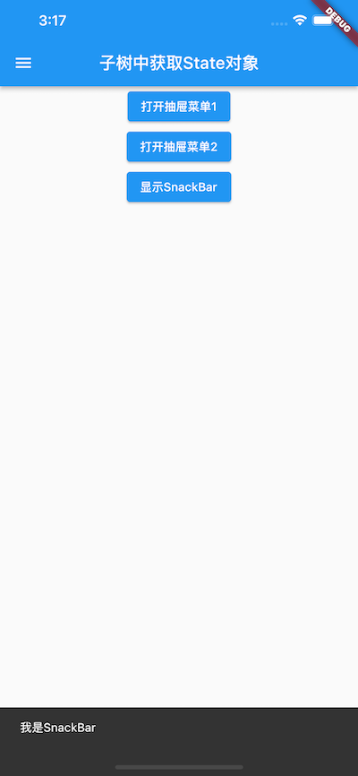

># <h2 id=''>[《Flutter实战·第二版》](https://book.flutterchina.club/)</h2>
- [**App生命周期**](#App生命周期)
	- [WidgetsBinding](#WidgetsBinding)
	- [WidgetsBindingObserver生命周期事件](#WidgetsBindingObserver生命周期事件)
- [**Widget 、Element、RenderObject三者联系**](#Widget、Element、RenderObject三者联系)
	- [角色分析](#角色分析)
	- [Element与Widget和renderObject的联系](#Element与Widget和renderObject的联系)
		- [context使用条件](#context使用条件)
- [**`StatelessWidget`**](#StatelessWidget)
	- [context属性](#context属性)
	- [StatelessWidget生命周期](#StatelessWidget生命周期)
- [**`StatefulWidget`**](#StatefulWidget)
	- [StatefulWidget生命周期](#StatefulWidget生命周期)
		- [createState ](#createState)
		- [initState](#initState)
		- [didChangeDependencies](#didChangeDependencies)
		- [build](#build)
		- [addPostFrameCallback](#addPostFrameCallback)
		- [didUpdateWidget](#didUpdateWidget)
		- [deactivate](#deactivate)
		- [dispose](#dispose)
- [**`Flutter SDK自带组件库`**](#FlutterSDK自带组件库)
- [**功能型组件**](#功能型组件)
	- [导航返回拦截（WillPopScope）](#导航返回拦截（WillPopScope）)
	- [InheritedWidget](#InheritedWidget)
		- [dependOnInheritedWidgetOfExactType方法](#dependOnInheritedWidgetOfExactType方法)
		- [findAncestorWidgetOfExactType方法](#findAncestorWidgetOfExactType方法)
		- [区别](#区别)
		- [widget之间的交互](#widget之间的交互)
	- [Provider](#Provider)
	- [Widget管理自身状态](#Widget管理自身状态)
	- [父Widget管理子Widget的状态](#父Widget管理子Widget的状态)
	- [跨组件状态共享](#跨组件状态共享)
		- [context获取widget树中state对象](#context获取widget树中state对象)
		- [Builder](#builder)
	- [findAncestorWidgetOfExactType方法](#findAncestorWidgetOfExactType方法)
	- [dependOnInheritedWidgetOfExactType方法](#dependOnInheritedWidgetOfExactType方法)
	- [区别](#区别)
	- [widget之间的交互](#widget之间的交互)
- [系统方法调用顺序](#系统方法调用顺序)
	- [状态 setState方法调用](#状态setState方法调用)
	- [导航 Navigation](#导航Navigation)
- [**`路由管理`**](#路由管理)
	- [路由导航](#路由导航)
- [**Stream**](#Stream)
	- [分类](#分类)
		- [StreamController](#StreamController)
		- [listen](#listen)
	- [单订阅](#单订阅)
	- [多订阅流](#多订阅流)
- [异常抛出](#异常抛出)
	- [Throw](#Throw)
	- [Catch](#Catch)
		- [关键字On](#关键字On)
	- [再次抛出异常rethrow](#再次抛出异常rethrow)
	- [Finally](#Finally)
- [**行、列布局**](#行、列布局)
- **资料**
	- [Flutter实战教程pdf](https://book.flutterchina.club/)
	- [核心概念详解：Widget、State、Context及InheritedWidget(泪已无痕-掘金)](https://juejin.cn/post/6844903784187953165#heading-24)
	- [异步编程：Future、Isolate 和事件循环(泪已无痕-掘金)](https://juejin.cn/post/6844903796334673933#heading-7)
	- [Flutter导航和路由教程示例](https://yiibai.com/flutter/flutter-navigation-and-routing.html)
	- [路由管理、资源管理](https://www.jianshu.com/p/257bc7e72709)
	- [创建自定义路由过渡动画](https://coldstone.fun/post/2019/12/10/flutter-route-transition/)
	- [进阶：路由、路由栈详解及案例分析](https://juejin.cn/post/6844903789816709128)
	- [组件可选参数Key的见解](https://juejin.im/post/5ca2152f6fb9a05e1a7a9a26)
	- [深入浅出Key(Vadaski-掘金)](https://juejin.cn/post/6844903811870359559)
	- [Widget管理自身状态](https://juejin.cn/entry/6844903864852807694)


<br/>

***
<br/><br/><br/>


> <h1 id='App生命周期'>App生命周期</h1>

[详解Flutter中各种Binding](https://blog.csdn.net/weixin_43740011/article/details/131344147)

<br/><br/><br/>

> <h2 id='WidgetsBinding'>WidgetsBinding</h2>


**简介**

`WidgetsBinding.instance.addObserver(this)` 是 Flutter 中用于向 Flutter 的核心框架注册一个生命周期观察者的方法。这句话出现在一个实现了 WidgetsBindingObserver 接口的类中，通常是自定义的 StatefulWidget 或 StatelessWidget 的子类。

通过调用 addObserver，该类将能够接收到 Flutter 框架特定生命周期事件的通知，从而能够在这些关键时刻执行相应的操作。


<br/>

**以下是对此语句的详细解释：**

- **WidgetsBinding:** WidgetsBinding 是 Flutter 框架中 Binding 类的一个实例，它是 Flutter 应用程序与 Flutter 引擎之间的桥梁。它负责管理应用程序的生命周期、事件循环、系统事件处理、渲染流程等关键任务。`WidgetsBinding.instance` 提供了对全局单例 WidgetsBinding 实例的访问。

- **addObserver:** addObserver 是 WidgetsBinding 类提供的一个方法，用于注册一个实现了 WidgetsBindingObserver 接口的对象。当应用程序进入特定的生命周期阶段或发生特定的系统事件时，WidgetsBinding 会通知已注册的观察者。

- **this:** 这里的 this 指向当前正在调用 addObserver 方法的类实例，该类必须实现了 WidgetsBindingObserver 接口。通过将 this 作为参数传递，意味着当前类将作为生命周期观察者注册到 WidgetsBinding 中。


<br/><br/><br/>


> <h2 id='WidgetsBindingObserver生命周期事件'>WidgetsBindingObserver生命周期事件</h2>


**WidgetsBindingObserver:** `WidgetsBindingObserver` 是一个接口，定义了一系列与 Flutter 应用生命周期相关的回调方法。当一个类实现了这个接口并注册为观察者后，它将有机会在以下生命周期事件发生时得到通知：

- **didChangeAppLifecycleState:** 当应用程序的生命周期状态（如：inactive、paused、resumed、detached）发生变化时调用。这对于管理应用程序在后台、前台之间切换时的资源、状态更新非常有用。

<br/>

- **didChangeMetrics:** 当窗口尺寸、屏幕方向等与窗口相关的度量信息发生变化时调用。这对于响应屏幕旋转、窗口缩放等场景下的布局调整非常关键。

<br/>

- **didHaveMemoryPressure:** 当系统内存压力增大时调用，提示观察者释放不必要的资源以减少内存占用。

<br/>

- **didChangePlatformBrightness:** 当设备的亮度模式（如：亮屏模式、暗屏模式）发生变化时调用，可用于调整界面主题以适应不同的亮度环境。

<br/>

- **didChangeLocales:** 当系统的语言区域设置发生变化时调用，可以用来更新界面语言或重新加载本地化资源。


<br/><br/>

- **使用场景:**

	- **资源管理：**根据应用程序的生命周期状态（如进入后台或恢复前台）释放或重新加载资源，如暂停网络请求、停止定时器、恢复动画等。
	
	- **UI 更新**：当窗口尺寸、屏幕方向变化时，重新计算布局或调整界面元素的显示方式。
	
	- **性能优化**：在内存压力增大时，清理缓存、释放非关键内存以避免应用被系统强制关闭。
	
	- **用户体验：** 响应系统亮度变化，调整界面主题以提供更好的夜间阅读体验；或在语言切换时更新界面文字以匹配用户偏好。


<br/><br/>


&emsp; 想要知道 Flutter App 的生命周期，例如 Flutter 是在前台还是在后台，就需要使用到 WidgetsBindingObserver 了，**使用如下Demo：**

State 的类 mix WidgetsBindingObserver：

```
class _MyHomePageState extends State<MyHomePage> with WidgetsBindingObserver {
    ...
}
```

<br/>

在 State 的 initState 里添加监听：

```
@override
  void initState(){
    super.initState();
    WidgetsBinding.instance.addObserver(this);
  }
  ```


<br/>

在 State 的 dispose 里移除监听：

```
  @override
  void dispose() {
    // TODO: implement dispose
    super.dispose();
    WidgetsBinding.instance.removeObserver(this);
  }
```


<br/>

在 State 里 override didChangeAppLifecycleState

```
@override
void didChangeAppLifecycleState(AppLifecycleState state) {
  super.didChangeAppLifecycleState(state);
  
  // 根据生命周期状态执行相应操作
  if (state == AppLifecycleState.paused) {
    // went to Background
  }
  if (state == AppLifecycleState.resumed) {
    // came back to Foreground
  }
}
```


<br/>

AppLifecycleState 就是 App 的生命周期，有：

- **resumed**
- **inactive**
- **paused**
- **suspending**


<br/>
<br/>


> <h2 id=''></h2>


 
 
 
 <br/>
<br/>


> <h3 id=''></h3>


<br/>

***
<br/><br/>


> <h1 id='Widget 、Element、RenderObject三者联系'>Widget 、Element、RenderObject三者联系</h1>


&emsp; Widget 这个角色是Flutter SDK 封装好的一些接口以便开发者便捷开发应用程序，实际绘制到手机屏幕上时是通过 RenderObject 这个角色来处理的，也就是 一个 Widget如Text要显示出来，要经历 Widget --> Element --> RenderObject 这三个阶段的转换。


<br/><br/>

> <h2 id='角色分析'>角色分析</h2>

&emsp; 在 Flutter 的 Engine 层向 Dart 层的暴露了 Canvas, PictureRecorder 等接口，利用这些接口可以绘制自己想要的图像，通过 Canvas, PictureRecorder 等接口来绘制图像，这操作有点复杂，不利于便捷开发，所以一般常使用 Widget。

&emsp; 如下代码 一个 线性布局 Column 中排列了两个 文本 Text ：

```
Widget buildColumnWidget(){
    return Column(children: [
      Text("张三"),
      Text("李四"),
    ],);
  }
```

实际项目中的显示效果如下图所示，为两个文本在竖直方向线性排列：


在这里构建了三个Widget，Column 与两个Text，它们的Widgets树形结构排列如下：


&emsp; Widget的构建相当于是构建一定的配置信息，或者说是 Widget 的组合构建，**相当于是将封装的一些特定的绘制指令进行组合**。

&emsp; 组合好的Widget在程序执行到build方法时，会**通过 createRenderObject 方法来创建对应的renderObject渲染对象**。

&emsp; 一个图像要绘制出来，首先要进行**测量计算（位置与大小）**，然后再根据测量计算的结果**进行排版（layout）**,最后再进行**绘制（Paint）**，这整一个操作过程是通过 renderObject对象来实现的，也就是说renderObject是最终真正的渲染对象。

<br/>

- **Element的由来:** `renderObject`对象第一步进行的计算数据的基础配制是在 Widget中构建的，所以需要从Widget中获取这些数据，renderObject对象的这一系列操作也需要一个载体，所以就有了 Element。

<br/>

- **Element树:** 每一个 Widget都包含者绘制图像的配置信息，每一个配置信息都需要对应的一个renderObject对象来实现操作，所以有Widgets树，就也有renderObjects树，widget与renderObject之间需要 Element来协调配合，所以也有了 Element树。


<br/>


如在上图 Widget树，当Column与Text被构建时，同时当前的 StatelessWidget或者是StatefulWidget中通过Widget.createElement方法来创建Element，框架层通过调用mount方法来将新创建的Element添加到**给定父级中给定槽点的树上**，所以对应着就构建了第二颗树如下图所示：


同时函数mount被调用的时候，框架层会调用`RenderObjectWidget.createRenderObject()`来实例化RenderObject，此时对应的第三颗树也就形成.


<br/><br/>

> <h2 id='Element与Widget和renderObject的联系'>Element与Widget和renderObject的联系</h2>


&emsp; Element 负责协调 Widget 与 renderObject，Element 同时持有 Widget 和 RenderObject，Element存放Widget上下文， Element 也就是我们在开发中通常使用到的 context，通过context 可以获取 Widget树中的信息，也可以获取对应的 renderObject中的信息。


<br/><br/>

> <h2 id=''>context使用条件</h2>

<br/>

&emsp; 我们在调用build时候的入参BuildContex其实返回的就是Element，在实际开发中，通常也会使用到 context，实际上context的返回也是element实例，如下:

```
BuildContext get context => _element;
```

所以在实际项目开发中，在StatefulWidget的initState方法中，是不可使用 context ,因为此时的StatefulWidget对应的Element（也就是BuildContext）才刚刚创建，还没有形成绑定关系，也没有与对应的RenderObject绑定起来,所以不能使用。

同理在 方法 dispose中，StatefulWidget 与 Element 、RenderObject已解绑，所以也不能使用。

只有在绑定期间才可使用，在绑定与解绑都会回调生命周期方法 didChangeDependencies，所以可以在didChangeDependencies这个方法中使用 context做一些相关的操作，代码如下：

```
@override
void didChangeDependencies() {
	super.didChangeDependencies();
	
	///是否是路由栈中的第一个页面
	bool isFirst = ModalRoute.of(context).isFirst;
	///当前手机屏幕上显示的是否是这个页面Widget
	bool isCurrent = ModalRoute.of(context).isCurrent;
	///当前Widget是否是活跃可用的
	///当调用 pop 或者是关闭当前Widget时 isActive 为false
	bool isActive = ModalRoute.of(context).isActive;
	
	if(isActive){
	  ///页面 活跃状态
	}else{
	  ///页面将要解绑
	}
}
```


<br/><br/>

所以在实际项目开发中，可以为每一个 Widget  绑定一个GlobalKey，通过 GlobalKey来获取对应的Element（BuildContext），然后通过Element来获取对应的RenderObject，从而获取这个Widget 在手机 屏幕上对应的位置与大小 信息，代码如下：


```
///第一步 创建 GlobalKey
GlobalKey globalKey = GlobalKey();

///第二步在 对应的Widget 引用 ，如这里的Text
Text('张三',key:globalKey);

///第三步 通过 globalKey 来获取 对应的Element（BuildContext） 
BuildContext stackContext = globalKey.currentContext;
///第四步 获取对应的 RenderObject
///RenderObject是抽象的，它的一些基础信息封装在子类RenderBox中
RenderBox renderBox = stackContext.findRenderObject();
///然后通过 RenderBox 来获取对应的Text在手机屏幕上显示的位置 与大小 信息
///相对于全局的位置
Offset offset = renderBox.localToGlobal(Offset.zero);
///获取指定的Widget的大小 信息
Size size = renderBox.paintBounds.size;
```


<br/>

***
<br/>

># <h1 id='StatelessWidget'>StatelessWidget</h1>

&emsp;  `StatelessWidget`用于不需要维护状态的场景，它通常在build方法中通过嵌套其它Widget来构建UI，在构建过程中会递归的构建其嵌套的Widget。

```
class Echo extends StatelessWidget {

  final String text;
  final Color backgroundColor;

  const Echo({
    Key key,
    @required this.text,
    this.backgroundColor: Colors.grey,
  }): super(key: key);  
//Key: 这个key属性类似于React/Vue中的key;
//主要的作用是决定是否在下一次build时复用旧的widget，决定的条件在canUpdate()方法中

  @override
  Widget build(BuildContext context) {
    return Center(
      child: Container(
        color: backgroundColor,
        child: Text(text),
      ),
    );
  }
}


//调用
Widget build(BuildContext context) {
  return MaterialApp(
    color: Colors.white,
    home: Echo(text: "welcome to 我的家", backgroundColor: Colors.white),
  );
}
```

&emsp;  widget的构造函数参数应使用命名参数，`命名参数中的必要参数要添加@required标注`，这样有利于静态代码分析器进行检查。

&emsp;  另外，`在继承widget时，第一个参数通常应该是Key`.另外，如果Widget需要接收子Widget，那么child或children参数通常应被放在参数列表的最后。同样是按照惯例，`Widget的属性应尽可能的被声明为final，防止被意外改变`。


<br/>

> <h2 id='context属性'>context属性</h2>


&emsp;  `build`方法有一个`context`参数，它是`BuildContext`类的一个实例，表示当前widget在widget树中的上下文，每一个widget都会对应一个context对象（因为每一个widget都是widget树上的一个节点）。

&emsp;  实际上，context是当前widget在widget树中位置中执行”相关操作“的一个句柄，比如它提供了从当前widget开始向上遍历widget树以及按照widget类型查找父级widget的方法。

```

@override
Widget build(BuildContext context) {
  return Scaffold(
    appBar: AppBar(
      title: Text("Context 测0000000试"),
    ),
    body: Container(
      child: Builder(builder: (context) {
	    //寻找InheritedWidget的子类，可以以O(1)的复杂度查找上级Widget
        Scaffold scaffold = context.findAncestorWidgetOfExactType();
        return (scaffold.appBar as AppBar).title;
      }),
    ),
  );
}
```


<br/>
<br/>


> <h2 id='StatelessWidget生命周期'>StatelessWidget生命周期</h2>


StatelessWidget 的生命周期只有一个，就是：`build`

<br/>


&emsp; build 是用来创建 Widget 的，但因为 build 在每次界面刷新的时候都会调用，所以不要在 build 里写业务逻辑，可以把业务逻辑写到你的 StatelessWidget 的构造函数里。

```
class TestWidget extends StatelessWidget{
  @override
  Widget build(BuildContext context) {
    // TODO: implement build
    print('StatelessWidget build');
    return Text('Test');
  }
}
```


<br/>

***
<br/>

># <h1 id='StatefulWidget '>StatefulWidget </h1>


**方法:**
- `createState()` 用于创建和Stateful widget相关的状态，它在Stateful widget的生命周期中可能会被多次调用。例如，当一个Stateful widget同时插入到widget树的多个位置时，Flutter framework就会调用该方法为每一个位置生成一个独立的State实例，其实，本质上就是一个StatefulElement对应一个State实例。
> &emsp;  在说`“widget树”`时它可以指`widget结构树`，但由于`widget与Element有对应关系（一可能对多）`，在有些场景（Flutter的SDK文档中）也代指“UI树”的意思。而在`stateful widget`中，`State对象也和StatefulElement具有对应关系（一对一）`，所以在Flutter的SDK文档中，可以经常看到“从树中移除State对象”或“插入State对象到树中”这样的描述。其实，无论哪种描述，其意思都是在描述“一棵构成用户界面的节点元素的树”。


<br/>

- **`State `**

&emsp;  一个`StatefulWidget`类会对应一个`State类`，State表示与其对应的`StatefulWidget`要维护的状态，State中的保存的状态信息有：

- 在widget 构建时可以被同步读取。

- 在widget生命周期中可以被改变，当State被改变时，可以手动调用其 `setState()`方法通知Flutter framework状态发生改变，Flutter framework在收到消息后，会重新调用其build方法`重新构建widget树`，从而达到更新UI的目的。


<br/>

- State中有两个常用属性：
	- `widget`，它表示与该`State实例关联的widget实例`，由Flutter framework动态设置。`注意`，这种关联并非永久的，因为在应用生命周期中，UI树上的某一个节点的widget实例在重新构建时可能会变化，但State实例只会在第一次插入到树中时被创建，当在重新构建时，`如果widget被修改了，Flutter framework会动态设置State.widget为新的widget实例`。
	- `context`, `StatefulWidget`对应的`BuildContext`，作用同`StatelessWidget的BuildContext`。


<br/>
<br/>


> <h2 id='StatefulWidget生命周期'>StatefulWidget生命周期</h2>


- 生命周期比较复杂，依次为：
	- **createState**
	- **initState**
	- **didChangeDependencies**
	- **build**
	- **addPostFrameCallback**
	- **didUpdateWidget**
	- **deactivate**
	- **dispose**


<br/>
<br/>


> <h3 id='createState'>createState</h3>

createState 是 StatefulWidget 里创建 State 的方法，当要创建新的 StatefulWidget 的时候，会立即执行 createState，而且只执行一次，createState 必须要实现：

```
class MyScreen extends StatefulWidget {
@override
_MyScreenState createState() => _MyScreenState();
}
```


<br/>
<br/>


> <h3 id='initState'>initState</h3>


前面的 createState 是在创建 StatefulWidget 的时候会调用，initState 是 StatefulWidget 创建完后调用的第一个方法，而且只执行一次，类似于 Android 的 onCreate、iOS 的 viewDidLoad()，所以在这里 View 并没有渲染，但是这时 StatefulWidget 已经被加载到渲染树里了。

这时 StatefulWidget 的 mount 的值会变为 true，直到 dispose 调用的时候才会变为 false。可以在 initState 里做一些初始化的操作

在 override initState 的时候必须要调用 super.initState()：

```
@override
void initState() {
  super.initState();
  ...
}
```


<br/>
<br/>


> <h3 id='didChangeDependencies'>didChangeDependencies</h3>


&emsp; 当 StatefulWidget 第一次创建的时候，didChangeDependencies 方法会在 initState 方法之后立即调用，之后当 StatefulWidget 刷新的时候，就不会调用了.

&emsp; 除非你的 StatefulWidget 依赖的 InheritedWidget 发生变化之后，didChangeDependencies 才会调用，所以 didChangeDependencies 有可能会被调用多次


<br/>
<br/>


> <h3 id='build'>build</h3>

&emsp; 在 StatefulWidget 第一次创建的时候，build 方法会在 didChangeDependencies 方法之后立即调用.

&emsp; 另外一种会调用 build 方法的场景是，每当 UI 需要重新渲染的时候，build 都会被调用，所以 build 会被多次调用，然后 返回要渲染的 Widget。千万不要在 build 里做除了创建 Widget 之外的操作，因为这个会影响 UI 的渲染效率。


<br/>
<br/>


> <h3 id='addPostFrameCallback'>addPostFrameCallback</h3>


&emsp； addPostFrameCallback 是 StatefulWidge 渲染结束的回调，只会被调用一次，之后 StatefulWidget 需要刷新 UI 也不会被调用，addPostFrameCallback 的使用方法是在 initState 里添加回调：

```
import 'package:flutter/scheduler.dart';
@override
void initState() {
	super.initState();
	SchedulerBinding.instance.addPostFrameCallback((_) => {
	
	});
}

```


&emsp； 渲染完成后，在这个方法里我们可以在[获取页面中Widget大小和位置](https://juejin.cn/post/6844903950257242119)，而且还可以进行网络接口请求


<br/>
<br/>


> <h3 id='didUpdateWidget'>didUpdateWidget</h3>


&emsp; didUpdateWidget 这个生命周期我们一般不会用到，只有在使用[key对 Widget进行复用](https://juejin.cn/post/6844904085007630349)的时候才会调用。

&emsp; 要注意的是Key是Widget、Element和SemanticsNode的标识符。 只有当新的Widget的Key与当前Element中Widget的Key相同时，它才会被用来更新现有的Element。 Key在具有相同父级的Element之间必须是唯一的。


<br/>
<br/>


> <h3 id='deactivate'>deactivate</h3>

&emsp; 当要将 State 对象从渲染树中移除的时候，就会调用 deactivate 生命周期，这标志着 StatefulWidget 将要销毁，但是有时候 State 不会被销毁，而是重新插入到渲染树种。


<br/>
<br/>


> <h3 id='dispose'>dispose</h3>


&emsp; 当 View 不需要再显示，从渲染树中移除的时候，State 就会永久的从渲染树中移除，就会调用 dispose 生命周期，这时候就可以在 dispose 里做一些取消监听、动画的操作，和 initState 是相反的


<br/>

># <h1 id='FlutterSDK自带组件库'>Flutter SDK自带组件库</h1>

**基础组件**

- `import 'package:flutter/widgets.dart';`

&emsp;  `Flutter` 提供了一套丰富、强大的基础组件，在基础组件库之上`Flutter`又提供了一套`Material风格（Android默认的视觉风格）`和一套`Cupertino风格（iOS视觉风格）的组件库`。

<br/>

- **Material组件**
	- `import 'package:flutter/material.dart';`

&emsp;  `Material`组件，它可以帮助我们构建遵循Material Design设计规范的应用程序。Material应用程序以[`MaterialApp`](https://docs.flutter.io/flutter/material/MaterialApp-class.html) 组件开始， 该组件在应用程序的根部创建了一些必要的组件，比如`Theme`组件，它用于配置应用的主题。


<br/>

- **Cupertino组件**
	- `import 'package:flutter/cupertino.dart';`

&emsp;  `Cupertino风格的组件`，尽管目前还没有Material 组件那么丰富，但是它仍在不断的完善中。值得一提的是在Material 组件库中有一些组件可以根据实际运行平台来切换表现风格，比如MaterialPageRoute，在路由切换时，如果是Android系统，它将会使用Android系统默认的页面切换动画(从底向上)；如果是iOS系统，它会使用iOS系统默认的页面切换动画（从右向左）。


<br/>

`cupertinoTestRoute.dart 文件`

```
import 'package:flutter/cupertino.dart';

class cupertinoTestRoute extends StatelessWidget {

  @override
  Widget build(BuildContext context) {
    // TODO: implement build
    return CupertinoPageScaffold(
      navigationBar: CupertinoNavigationBar(
        middle: Text("Cupertino 组件库测试"),
      ),
      child: Center(
        child: CupertinoButton(
            color: CupertinoColors.activeOrange,
            child: Text("点击"),
            onPressed: () {}),
      ),
    );
  }
}

```


<br/>

**main.dart 文件**

```
//自定义类文件
import 'package:flutter_demo/customWidget/cupertinoWidget.dart';

//调用
Widget build(BuildContext context) {

  return MaterialApp(
    title: 'Flutter Demo',
    theme: ThemeData(
      primarySwatch: Colors.cyan,
    ),
    home: cupertinoTestRoute(),//初始化
  );
}

```

效果：


<br/>

***
<br/><br/><br/>

># <h1 id='功能型组件'>功能型组件</h1>

<br/><br/><br/>

> <h2 id='导航返回拦截（WillPopScope）'>导航返回拦截（WillPopScope）</h2>


为了避免用户误触返回按钮而导致 App 退出，在很多 App 中都拦截了用户点击返回键的按钮，然后进行一些防误触判断，比如当用户在某一个时间段内点击两次时，才会认为用户是要退出（而非误触）。

Flutter中可以通过WillPopScope来实现返回按钮拦截;

<br/>

**main.dart文件**

```
void _pushToWillPopScopeTestPage() {
    Navigator.push(context,
        MaterialPageRoute(builder: (context) => WillPopScopeTestPage()));
  }
```

<br/>

**WillPopScopeTestPage.dart**

```
import 'package:flutter/material.dart';

class WillPopScopeTestPage extends StatefulWidget {
  @override
  _WillPopScopeTestPageState createState() => _WillPopScopeTestPageState();
}

class _WillPopScopeTestPageState extends State<WillPopScopeTestPage> {
  DateTime? _lastPressedAt; //上次点击时间

  Future<bool> _solveQuickClick() async {
    if (_lastPressedAt == null ||
        DateTime.now().difference(_lastPressedAt!) > Duration(seconds: 1)) {
      //两次点击间隔超过1秒则重新计时
      _lastPressedAt = DateTime.now();
      return false;
    }
    return true;
  }


  @override
  Widget build(BuildContext context) {
    return WillPopScope(
      child: Scaffold(
        appBar: AppBar(title: Text('My Page')),
        body: Center(
          child: Text('This is my page content.'),
        ),
      ),
      onWillPop: _solveQuickClick,
    );
  }
}

```

效果如下:


<br/><br/><br/><br/>


> <h2 id='InheritedWidget'>InheritedWidget</h2>

<br/>

**介绍:**


&emsp; InheritedWidget是 Flutter 中非常重要的一个功能型组件，它提供了一种在 widget 树中从上到下共享数据的方式，比如我们在应用的根 widget 中通过InheritedWidget共享了一个数据，那么我们便可以在任意子widget 中来获取该共享的数据！这个特性在一些需要在整个 widget 树中共享数据的场景中非常方便！如Flutter SDK中正是通过 InheritedWidget 来共享**应用主题（Theme）** 和 **Locale (当前语言环境)** 信息的。

> InheritedWidget和 React 中的 context 功能类似，和逐级传递数据相比，它们能实现组件跨级传递数据。InheritedWidget的在 widget 树中数据传递方向是**从上到下的**，这和通知Notification（将在下一章中介绍）的**传递方向正好相反**。


<br/>


- **InheritedWidget共享自增数据**
	- InheritedWidget 允许在 widget 树中有效地向下传播（和共享）信息。
	
	- InheritedWidget 是一个特殊的 Widget，它将作为另一个子树的父节点放置在 Widget 树中。该子树的所有 widget 都必须能够与该 InheritedWidget 暴露的数据进行交互。


<br/>


&emsp; 开发做多了，完全跟`iOS的设计模式单例`差不多在存储数据方面。但是在`单例上`又加了`通知`和`全局刷新整个app组件`，相当简单暴力。

好了，先看第一个代码Demo：

**ShareDataWidget组件**

```
import 'package:flutter/cupertino.dart';
import 'package:flutter/material.dart';

class ShareDataWidget extends InheritedWidget {

  ///需要在子树中共享的数据，保存点击次数
  final int data;

  ShareDataWidget({
    @required this.data,
    Widget child
  }) : super(child: child);

  /// 定义一个便捷方法，方便子树中的widget获取共享数据 
  /// 允许所有子 widget 通过包含的 context 获得最近的 MyInheritedWidget 实例（
  static ShareDataWidget of(BuildContext context) {
    
    //return context.inheritFromWidgetOfExactType(ShareDataWidget);// 废弃了
    
    return context.dependOnInheritedWidgetOfExactType(aspect: ShareDataWidget);
  }

  //重写 updateShouldNotify 方法用来告诉 InheritedWidget 如果对数据进行了修改，是否必须将通知传递给所有子 widget
  //该回调决定当data发生变化时，是否通知子树中依赖data的Widget重新build
  @override
  bool updateShouldNotify(ShareDataWidget oldWidget) {
    // TODO: implement updateShouldNotify
    // 如果返回true，则子树中依赖(build函数中有调用)本widget
    // 的子widget的`state.didChangeDependencies`会被调用
    return oldWidget.data != data;
  }
  
}
```


<br/><br/>

**_TestWidget组件**


 &emsp; 实现一个子组件_TestWidget，在其build方法中引用ShareDataWidget中的数据。
 
 &emsp; 同时，在其didChangeDependencies() 回调中打印日志

```
class  _TestWidget extends StatefulWidget {
  @override
  _TestWidgetState createState() => new _TestWidgetState();
  
}

class  _TestWidgetState extends State<_TestWidget> {
  
  @override
  Widget build(BuildContext context) {
    print("共享数据： ${ShareDataWidget.of(context).data.toString()}");
    
    //使用InheritedWidget中的共享数据，也就产生了依赖
    return Text(
      "依赖产生：" + ShareDataWidget.of(context)
                      .data
                      .toString()
                      
    );
  }


@override
  void didChangeDependencies() {
    // TODO: implement didChangeDependencies
    super.didChangeDependencies();
    
    //父或祖先widget中的InheritedWidget改变(updateShouldNotify返回true)时会被调用。
    //如果build中没有依赖InheritedWidget，则此回调不会被调用。
    print("Dependencies change【依赖发生了改变】");
  }
  
}
```


<br/><br/>


&emsp; 在之前介绍StatefulWidget时，我们提到State对象有一个didChangeDependencies回调，它会在“依赖”发生变化时被Flutter 框架调用。而这个“依赖”指的就是子 widget 是否使用了父 widget 中InheritedWidget的数据！

&emsp; 如果使用了，则代表子 widget 有依赖；如果没有使用则代表没有依赖。这种机制可以使子组件在所依赖的InheritedWidget变化时来更新自身！比如当主题、locale(语言)等发生变化时，依赖其的子 widget 的didChangeDependencies方法将会被调用。

&emsp; 最后，我们创建一个按钮，每点击一次，就将ShareDataWidget的值自增.

<br/>

&emsp; 但是读者要注意，如果_TestWidget的build方法中没有使用ShareDataWidget的数据，那么它的didChangeDependencies()将不会被调用，因为**它并没有依赖ShareDataWidget**(也就是变相地说,依赖还是没有依赖取决于有没有使用ShareDataWidget中的data数据)。


<br/><br/>

**InheritedWidgetTestRoute组件**

```
class  InheritedWidgetTestRoute extends StatefulWidget {

  @override
  _InheritedWidgetTestRouteState createState() => new _InheritedWidgetTestRouteState();
  
}

class  _InheritedWidgetTestRouteState extends State<InheritedWidgetTestRoute> {

  int count = 0;

  @override
  Widget build(BuildContext context) {

    return Center(
      //为了能够传播/共享某些数据，需要将 InheritedWidget子类ShareDataWidget放置在 widget 树的顶部
      //这解释了传递给 InheritedWidget 基础构造函数的 @required Widget child 参数
      child: ShareDataWidget(
        data: count,//这个改变
        child: Column(
          mainAxisAlignment: MainAxisAlignment.center,
          children:<Widget>[
            Padding(padding: const EdgeInsets.only(bottom: 20.0),
            child: _TestWidget(),// 子widget中依赖ShareDataWidget
            ),
            RaisedButton(
              ////每点击一次，将count自增，然后重新build,ShareDataWidget的data将被更新
              onPressed: () => setState(() => ++count),
              child: Text("Increment"),
              )
          ]
        ),
        ),
    );
  }
}

```

<br/>

**调用**

```
void main() {
  runApp(MyApp());
  // runApp(Text("hellosjglajgl"));
}

class MyApp extends StatelessWidget {
  @override
  Widget build(BuildContext context) {
    return MaterialApp(
      home:Scaffold(
        appBar: AppBar(
          title: Text('Hello Flutter'),
        ),
        body: InheritedWidgetTestRoute(),
      )
    );
  }
  
}
```

运行效果：


&emsp;  感觉这个可以做app的用户信息展示，感觉很棒。

&emsp;  一般来说，子widget很少会重写`didChangeDependencies()`方法，因为在依赖改变后framework也都会调用build()方法。但是，如果你需要在依赖改变后执行一些昂贵的操作，比如网络请求，这时最好的方式就是在`didChangeDependencies()`方法中执行，这样可以避免每次build()都执行这些昂贵操作。


如果层级嵌套的widget想共享同一份数据的话，便可通过调用ShareDataWidget.of(context).data 来实现获取共享数据，不用一层一层的传递数据了。


<br/><br/><br/>


> <h3 id='dependOnInheritedWidgetOfExactType方法'>dependOnInheritedWidgetOfExactType方法</h3>

&emsp; inheritFromWidgetOfExactType方法已经不再使用了，取而代之的是dependOnInheritedWidgetOfExactType。

- **dependOnInheritedWidgetOfExactType:**
	- 获取最近给定类型的Widget，该widget必须是InheritedWidget的子类(比如上文的ShareDataWidget类)，并向该widget注册传入的context;
	- 当该widget改变时，这个context会重新构建以便从该widget获得新的值;
	- 这就是child向InheritedWidget注册的方法。


<br/><br/>


> <h3 id='findAncestorWidgetOfExactType方法'>findAncestorWidgetOfExactType方法</h3>


- **findAncestorWidgetOfExactType:**
	- 功能与dependOnInheritedWidgetOfExactType一样，但是只会寻找InheritedWidget的子类，可以以O(1)的复杂度查找上级Widget;


<br/><br/><br/>


>### <h3 id='区别'>[区别](https://blog.csdn.net/hjjdehao/article/details/114985547)</h3>

当调用`findAncestorWidgetOfExactType`这个方法的时候，相应的子widget不会调用didChangeDependencies这个方法。为什么会这样呢？

&emsp; 原因在于dependOnInheritedWidgetOfExactType这个方法里面注册了InheritedWidget和其子widget注册了依赖关系。而findAncestorWidgetOfExactType没有。想看具体的话可以点进这两个方法的源码看看就知道了。


<br/><br/><br/>


> <h3 id='widget之间的交互'>widget之间的交互</h3>


为了说明交互方式，我们做以下假设：

‘Widget A’ 是一个将项目添加到购物车里的按钮；
‘Widget B’ 是一个显示购物车中商品数量的文本；
‘Widget C’ 位于 Widget B 旁边，是一个内置任意文本的文本；
我们希望 ‘Widget A’ 在按下时 ‘Widget B’ 能够自动在购物车中显示正确数量的项目，但我们不希望重建 ‘Widget C’

针对该场景，InheritedWidget 是唯一一个合适的 Widget 选项！


**代码**

```
class Item {
   String reference;

   Item(this.reference);
}

class _MyInherited extends InheritedWidget {
  _MyInherited({
    Key key,
    @required Widget child,
    @required this.data,
  }) : super(key: key, child: child);

  final MyInheritedWidgetState data;

  @override
  bool updateShouldNotify(_MyInherited oldWidget) {
    return true;
  }
}

class MyInheritedWidget extends StatefulWidget {
  MyInheritedWidget({
    Key key,
    this.child,
  }): super(key: key);

  final Widget child;

  @override
  MyInheritedWidgetState createState() => new MyInheritedWidgetState();

  static MyInheritedWidgetState of(BuildContext context){
    return (context.inheritFromWidgetOfExactType(_MyInherited) as _MyInherited).data;
  }
}

class MyInheritedWidgetState extends State<MyInheritedWidget>{
  /// List of Items
  List<Item> _items = <Item>[];

  /// Getter (number of items)
  int get itemsCount => _items.length;

  /// Helper method to add an Item
  void addItem(String reference){
    setState((){
      _items.add(new Item(reference));
    });
  }

  @override
  Widget build(BuildContext context){
    return new _MyInherited(
      data: this,
      child: widget.child,
    );
  }
}

class MyTree extends StatefulWidget {
  @override
  _MyTreeState createState() => new _MyTreeState();
}

class _MyTreeState extends State<MyTree> {
  @override
  Widget build(BuildContext context) {
    return new MyInheritedWidget(
      child: new Scaffold(
        appBar: new AppBar(
          title: new Text('Title'),
        ),
        body: new Column(
          children: <Widget>[
            new WidgetA(),
            new Container(
              child: new Row(
                children: <Widget>[
                  new Icon(Icons.shopping_cart),
                  new WidgetB(),
                  new WidgetC(),
                ],
              ),
            ),
          ],
        ),
      ),
    );
  }
}

class WidgetA extends StatelessWidget {
  @override
  Widget build(BuildContext context) {
    final MyInheritedWidgetState state = MyInheritedWidget.of(context);
    return new Container(
      child: new RaisedButton(
        child: new Text('Add Item'),
        onPressed: () {
          state.addItem('new item');
        },
      ),
    );
  }
}

class WidgetB extends StatelessWidget {
  @override
  Widget build(BuildContext context) {
    final MyInheritedWidgetState state = MyInheritedWidget.of(context);
    return new Text('${state.itemsCount}');
  }
}

class WidgetC extends StatelessWidget {
  @override
  Widget build(BuildContext context) {
    return new Text('I am Widget C');
  }
}
```


**说明**

- 在这个非常基本的例子中：

	- _MyInherited 是一个 **InheritedWidget**，每次我们通过 **‘Widget A’** 按钮添加一个项目时它都会重新创建
	
	- **MyInheritedWidget** 是一个 State 包含了项目列表的 Widget。可以通过 **static MyInheritedWidgetState of(BuildContext context)** 访问该 `State`
	
	- `MyInheritedWidgetState` 暴露了一个获取 `itemsCount` 的 `getter` 方法 和一个 `addItem` 方法，以便它们可以被 widget 使用，这是子 widget 树的一部分
	
	- 每次我们将项目添加到 State 时，`MyInheritedWidgetState` 都会重建
	
	- MyTree 类仅构建了一个 widget 树，并将 `MyInheritedWidget` 作为树的根节点
	
	- WidgetA 是一个简单的 `RaisedButton`，当按下它时，它将从最近的 `MyInheritedWidget` 实例中调用 addItem 方法
	
	- `WidgetB` 是一个简单的 `Text`，用来显示最近 级别 `MyInheritedWidget` 的项目数


<br/><br/>


**这一切是如何运作的呢？**

**为后续的通知注册 Widget**

&emsp; 当一个子 Widget 调用 MyInheritedWidget.of(context) 时，它传递自身的 context 并调用 MyInheritedWidget 的以下方法。

```
static MyInheritedWidgetState of(BuildContext context) {
    return (context.inheritFromWidgetOfExactType(_MyInherited) as _MyInherited).data;
}
```

&emsp; 在内部，除了简单地返回 MyInheritedWidgetState 实例外，它还订阅消费者 widget 以便用于通知更改。

<br/>

&emsp; 在幕后，对这个静态方法的简单调用实际上做了 2 件事：

- 消费者 widget 被自动添加到订阅者列表中，从而当对 InheritedWidget（这里是 _MyInherited）应用修改时，该 widget 能够重建

- _MyInherited widget（又名 MyInheritedWidgetState）中引用的数据将返回给消费者


<br/><br/>

**流程**

由于 ‘Widget A’ 和 ‘Widget B’ 都使用 InheritedWidget 进行了订阅，因此如果对 _MyInherited 应用了修改，那么当点击 Widget A 的 RaisedButton 时，操作流程如下（简化版本）：

- 调用 MyInheritedWidgetState 的 addItem 方法

- _MyInheritedWidgetState.addItem 方法将新项目添加到列表中

- 调用 setState() 以重建 MyInheritedWidget

- 通过列表中的新内容创建 _MyInherited 新的实例

- _MyInherited 记录通过参数（data）传递的新 State

- 作为 InheritedWidget，它会检查是否需要通知消费者（答案是 true）

- 遍历整个消费者列表（这里是 Widget A 和 Widget B）并请求它们重建

- 由于 Wiget C 不是消费者，因此不会重建。

至此它能够有效工作！


<br/>

然而，Widget A 和 Widget B 都被重建了，但由于 Wiget A 没有任何改变，因此它没有重建的必要。那么应该如何防止此种情况发生呢？


在继续访问 Inherited Widget 的同时阻止某些 Widget 重建
Widget A 同时被重建的原因是由于它访问 MyInheritedWidgetState 的方式。

如前所述，调用 context.inheritFromWidgetOfExactType() 方法实际上会自动将 Widget 订阅到消费者列表中。

避免自动订阅，同时仍然允许 Widget A 访问 MyInheritedWidgetState 的解决方案是通过以下方式改造 MyInheritedWidget 的静态方法：

```
static MyInheritedWidgetState of([BuildContext context, bool rebuild = true]){
    return (rebuild ? context.inheritFromWidgetOfExactType(_MyInherited) as _MyInherited
                    : context.ancestorWidgetOfExactType(_MyInherited) as _MyInherited).data;
}
```

通过添加一个 boolean 类型的额外参数……

如果 rebuild 参数为 true（默认值），我们使用普通方法（并且将 Widget 添加到订阅者列表中）

如果 rebuild 参数为 false，我们仍然可以访问数据，但不使用 InheritedWidget 的内部实现

因此，要完成此方案，我们还需要稍微修改一下 Widget A 的代码，如下所示（我们添加值为 false 的额外参数）：

```
class WidgetA extends StatelessWidget {
  @override
  Widget build(BuildContext context) {
    final MyInheritedWidgetState state = MyInheritedWidget.of(context, false);
    return new Container(
      child: new RaisedButton(
        child: new Text('Add Item'),
        onPressed: () {
          state.addItem('new item');
        },
      ),
    );
  }
}
```

就是这样，当我们按下 Widget A 时，它不会再重建了。


<br/><br/><br/>

>## <h2 id='Provider'>[Provider](https://juejin.cn/post/7067356022272163847)</h2>

**[Provider](https://book.flutterchina.club/chapter7/provider.html#_7-3-1-通过事件同步状态)是Flutter官方出的状态管理包**


&emsp; Flutter 实际上在一开始就为我们提供了一种状态管理方式，那就是 StatefulWidget。但是我们很快发现，它正是造成上述原因的罪魁祸首。

&emsp; 在 State 属于某一个特定的 Widget，在多个 Widget 之间进行交流的时候，虽然你可以使用 callback 解决，但是当嵌套足够深的话，我们会增加非常多的垃圾代码。

<br/><br/>


&emsp; 这时候，我们便迫切的需要一个架构来帮助我们理清这些关系，状态管理框架应运而生。

下载[Provider](https://pub.flutter-io.cn/packages/provider/install)插件.

```
dependencies:
  provider: ^4.3.2+2
```

<br/>

Flutter中的Provider库实际上是对InheritedWidget的一种封装和扩展，它利用了InheritedWidget的特性来进行高效的状态管理和数据共享。

<br/>

**InheritedWidget与Provider的联系：**

- InheritedWidget是Flutter框架内置的一个机制，允许将数据和逻辑在整个Widget树中向下传递，而无需逐级手动传递。当InheritedWidget内部的数据发生变更时，所有依赖它的子Widget都能够感知到变化并自动重建（调用build方法）。

<br/>

- Provider库构建在其之上，提供了一系列易于使用的Provider类，如ChangeNotifierProvider、ValueListenableProvider等，它们都是InheritedWidget的子类或者间接实现了InheritedWidget的工作机制。

<br/>

- 使用Provider时，开发者无需直接处理InheritedWidget复杂的更新逻辑和依赖追踪，而是通过创建数据模型（通常是继承自ChangeNotifier的类），并在Widget树中放置一个Provider来包裹这些模型实例。当模型的数据发生变化时，Provider会自动通知依赖它的Widget进行更新。


<br/><br/><br/>


> <h2 id='ChangeNotifier使用'>ChangeNotifier使用</h2>


使用ChangeNotifierProvider管理简单计数器状态的例子：

首先，定义一个状态模型类，继承自ChangeNotifier：

```
import 'package:flutter/foundation.dart';

class CounterModel extends ChangeNotifier {
  int _count = 0;

  int get count => _count;

  void increment() {
    _count++;
    notifyListeners(); // 数据变化时触发通知
  }
}
```

<br/>

然后，在应用程序的合适位置（例如MaterialApp的子项）设置Provider：

```
import 'package:flutter/material.dart';
import 'package:provider/provider.dart';

void main() {
  runApp(
    MaterialApp(
      home: ChangeNotifierProvider(
        create: (_) => CounterModel(), // 创建CounterModel实例
        child: HomePage(),
      ),
    ),
  );
}

class HomePage extends StatelessWidget {
  @override
  Widget build(BuildContext context) {
    return Scaffold(
      body: Center(
        child: Column(
          mainAxisAlignment: MainAxisAlignment.center,
          children: [
            Consumer<CounterModel>( // 使用Consumer来消费提供的数据
              builder: (context, counter, _) {
                return Text('Count: ${counter.count}');
              },
            ),
            RaisedButton(
              onPressed: () {
                Provider.of<CounterModel>(context, listen: false).increment(); // 不监听的情况下更新计数器
              },
              child: Text('Increment'),
            ),
          ],
        ),
      ),
    );
  }
}
```

**在这个例子中：**

- 我们创建了一个名为CounterModel的状态模型，它继承自ChangeNotifier并管理一个计数器的值。
- 在应用程序的根Widget层级，我们使用ChangeNotifierProvider包装HomePage，这样整个HomePage及其子Widget都可以访问到CounterModel实例。
- 在HomePage中，我们使用Consumer Widget来订阅CounterModel的变化，并在文本显示当前计数值。
- 当用户点击按钮时，我们通过Provider.of获取到上下文中的CounterModel实例并调用increment方法增加计数，由于ChangeNotifier会触发通知，所以依赖它的Consumer会自动重新构建，从而更新UI显示最新的计数。


<br/><br/><br/>

> <h2 id='MultiProvider'>MultiProvider</h2>


使用嵌套的方式来组合多个 Provider,这时候我们就可以使用一个非常 sweet 的组件`MultiProvider`:

```
void main() {
  final counter = CounterModel();
  final textSize = 48;

  runApp(
    MultiProvider(
      providers: [
        Provider.value(value: textSize),
        ChangeNotifierProvider.value(value: counter)
      ],
      child: MyApp(),
    ),
  );
}

```


<br/>

***
<br/><br/><br/>


> <h1 id='Widget管理自身状态'>Widget管理自身状态</h1>

```
import 'package:flutter/cupertino.dart';
import 'package:flutter/material.dart';

///TapboxA 类
class TapboxA extends StatefulWidget {
  TapboxA({Key key}) : super(key: key);

  @override
  _TapboxAState createState() => new _TapboxAState();
  
}

class _TapboxAState extends State<TapboxA> {

  bool _active = false;
  void _handleTap() {
    setState(() {
      _active = !_active;
    });
  }

  @override
  Widget build(BuildContext context) {

    return new GestureDetector(
      onTap: _handleTap,
      child: new Container(
        child: new Center(
          child: new Text(
            _active ? 'Active' : 'No Active',
            style: new TextStyle(fontSize: 32.0, color: Colors.white),
          ),
        ),
        width: 200.0,
        height: 200.0,
        decoration: new BoxDecoration(
          color:_active ? Colors.lightGreen[700] : Colors.grey[600],
        ),
      ),
    );
  }
  
}
```

<br/>

**调用**

```

void main() {
  runApp(MyApp());
  // runApp(Text("hellosjglajgl"));
}

class MyApp extends StatelessWidget {
  @override
  Widget build(BuildContext context) {
    return MaterialApp(
      home:Scaffold(
        appBar: AppBar(
          title: Text('Hello Flutter'),
        ),
        body: TapboxA(),
      )
    );
  }
  
}
```

效果图：


点击灰色色块，进行变色。


<br/>
<br/>

> <h2 id='父Widget管理子Widget的状态'>父Widget管理子Widget的状态</h2>


```


///------------------------- ParentWidgetState 类 ----------------------------------
///父组件
class ParentWidgetState extends StatefulWidget {
  @override
  _ParentWidgetState createState()  => new _ParentWidgetState();
  
}

class _ParentWidgetState extends State<ParentWidgetState> {

  bool _active = false;

  ///回掉函数
  void _handleTapboxChaned(bool newValue){
    setState(() {
      //修改状态
      _active = newValue;
    });
  }

  @override
  Widget build(BuildContext context) {
    // TODO: implement build
    return new Container(
      child: new TapboxB (
        active: _active,
        //将_handleTapboxChaned函数赋值给TapboxB的onChanged
        onChanged: _handleTapboxChaned,
      ),
    );
  }
  
}

///------------------------- TapboxB ----------------------------------
///子组件
class TapboxB extends StatelessWidget {

  final bool active;
  ///定义接收父类回调函数的指针
  final ValueChanged<bool> onChanged;

  TapboxB({Key key, this.active: false, @required this.onChanged}) : super(key: key);

  void _handleTap() {
    onChanged(!active);
  }


  @override
  Widget build(BuildContext context) {

    return new GestureDetector(
      //调用回调函数传值
      onTap: _handleTap,
      child: new Container(
        child: new Center(
          child: new Text(
            active ? "Active【激活】" : "No Active【没激活】",
            style: new TextStyle(
              fontSize: 18.0,
              color: Colors.white,
            ),
          ),
        ),
        width: 200,
        height: 200,
        decoration: new BoxDecoration(
          color: active ? Colors.lightGreen[700] : Colors.grey[600],
        ),
      ),
    );
  }
  
}

```

<br/>

**调用**

```
void main() {
  runApp(MyApp());
  // runApp(Text("hellosjglajgl"));
}

class MyApp extends StatelessWidget {
  @override
  Widget build(BuildContext context) {
    return MaterialApp(
      home:Scaffold(
        appBar: AppBar(
          title: Text('Hello Flutter'),
        ),
        body: ParentWidgetState(),
      )
    );
  }
  
}
```

效果图：


<br/><br/><br/>

> <h2 id='跨组件状态共享'>跨组件状态共享</h2>


```
import 'dart:collection';
import 'dart:typed_data';

import 'package:flutter/cupertino.dart';
import 'package:flutter/material.dart';

// 一个通用的InheritedWidget，保存任需要跨组件共享的状态
class InheritedProvider<T> extends InheritedWidget {
  //共享状态使用泛型
  final T data;  


  InheritedProvider({@required this.data, Widget child}) : super(child: child);
  
  @override
  //在此简单返回true，则每次更新都会调用其依赖的子孙节点didChangeDependencies
  bool updateShouldNotify(InheritedProvider<T> oldWidget) {
    return true;
  }
  
}


Type _typeOf<T>() => T;
class ChangeNotifierProvider<T extends ChangeNotifier> extends StatefulWidget {
  final Widget child;
  final T data;
    

  ChangeNotifierProvider({
    Key key,
    this.data,
    this.child,
  });

  //定义一个便捷方法，方便子树中的widget获取共享数据
  static T of<T> (BuildContext context) {
    final type = _typeOf<InheritedProvider<T>>();
    //final provider = context.inheritFromWidgetOfExactType(type) as InheritedProvider<T>;
    //final provider = context.dependOnInheritedWidgetOfExactType(aspect: type) as InheritedProvider<T>;
    final provider = context.dependOnInheritedWidgetOfExactType<InheritedProvider<T>>();
    print("商品的Model是：${(provider.data as CartModel).totalPrice}");
    return provider.data;
  }

  @override
  _ChangeNotifierProviderState<T> createState() {
    return _ChangeNotifierProviderState<T>();
  }
  
}

/*
* _ChangeNotifierProviderState 主要作用就是监听到共享状态（model）改变时重新构建Widget树
* 
*/
class _ChangeNotifierProviderState<T extends ChangeNotifier> extends State<ChangeNotifierProvider<T>> {
  
  ///如果数据发生变化（model类调用了notifyListeners），重新构建InheritedProvider
  //void update() => setState(() => {});
  void update() {
    //build方法会被执行
    setState(() => {});
  }
  

  @override
  void didUpdateWidget(ChangeNotifierProvider<T> oldWidget) {
    // 当Provider更新时，如果新旧数据不"=="，则解绑旧数据监听，同时添加新数据监听
    if (widget.data != oldWidget.data) {
      oldWidget.data.removeListener(update);
      widget.data.addListener(update);
    }
    super.didUpdateWidget(oldWidget);
  }

  @override
  void initState() {
    // 给model添加监听器
    widget.data.addListener(update);
    super.initState();
  }

  @override
  void dispose() {
    // 移除model的监听器
    widget.data.removeListener(update);
    super.dispose();
  }

  @override
  Widget build(BuildContext context) {
    return InheritedProvider<T>(
      data: widget.data,
      child: widget.child,
    );
  }
  
}


/*
* 定义一个Item类，用于表示商品信息 
*
*/
class Item {
  //商品单价
  double price;
  // 商品份数
  int count;

  Item(this.price, this.count);
}


/*
* 定义一个保存购物车内商品数据的CartModel类
* CartModel即要跨组件共享的model类
*/
class CartModel extends ChangeNotifier {
  //用于保存购物车中商品列表
  final List<Item> _items = [];
  ///禁止改变购物车里的商品信息
  UnmodifiableListView<Item> get items => UnmodifiableListView(_items);
  ///购物车中商品的总价
  double get totalPrice => _items.fold(0, (value, item) => value + item.count * item.price);


  //将 [item] 添加到购物车。这是唯一一种能从外部改变购物车的方法
  void add(Item item) {
    _items.add(item);
    //通知监听器（订阅者），重新构建InheritedProvider， 更新状态
    notifyListeners();
  }
}

/*
* 构建示例页面类：ProviderRoute
*
*/
class ProviderRoute extends StatefulWidget {
  @override
  _ProviderRouteState createState() => _ProviderRouteState();
  
}

class _ProviderRouteState extends State<ProviderRoute> {
  
  
  @override
  Widget build(BuildContext context) {

    return Center(
      child:ChangeNotifierProvider<CartModel>(
        data: CartModel(),
        child: Builder(builder: (context) {
          return Column(
            children:<Widget>[
              Text(""),
              Text(""),
              Text(""),
              Text(""),
              Builder(builder: (context) {
                var cart = ChangeNotifierProvider.of<CartModel>(context);
                return Text("总价: ${cart.totalPrice}");
              }),
              Builder(builder: (context) {
                //在后面优化部分会用到
                print("RaisedButton build");
                return RaisedButton(
                  child: Text("添加商品"),
                  onPressed: (){
                    ChangeNotifierProvider.of<CartModel>(context).add(Item(20.0, 1));
                  },
                );
              }),
            ],
          );
        }),
      ),
    );
  }
  
}
```

效果图：


<br/><br/>


> <h2 id='context获取widget树中state对象'>context获取widget树中state对象</h2>


**情景:**

&emsp; 由于 StatefulWidget 的具体逻辑都在其 State 中，所以很多时候，我们需要获取 StatefulWidget 对应的State 对象来调用一些方法，比如Scaffold组件对应的状态类ScaffoldState中就定义了打开 SnackBar（路由页底部提示条）的方法。我们有两种方法在子 widget 树中获取父级 StatefulWidget 的State 对象。

<br/>


- **1.通过Context获取**

&emsp; context对象有一个findAncestorStateOfType()方法，该方法可以从当前节点沿着 widget 树向上查找指定类型的 StatefulWidget 对应的 State 对象。下面是实现打开 SnackBar 的示例：

```
class GetStateObjectRoute extends StatefulWidget {
  const GetStateObjectRoute({Key? key}) : super(key: key);

  @override
  State<GetStateObjectRoute> createState() => _GetStateObjectRouteState();
}

class _GetStateObjectRouteState extends State<GetStateObjectRoute> {
  @override
  Widget build(BuildContext context) {
    return Scaffold(
      appBar: AppBar(
        title: Text("子树中获取State对象"),
      ),
      body: Center(
        child: Column(
          children: [
            Builder(builder: (context) {
              return ElevatedButton(
                onPressed: () {
                  // 查找父级最近的Scaffold对应的ScaffoldState对象
                  ScaffoldState _state = context.findAncestorStateOfType<ScaffoldState>()!;
                  // 打开抽屉菜单
                  _state.openDrawer();
                },
                child: Text('打开抽屉菜单1'),
              );
            }),
          ],
        ),
      ),
      drawer: Drawer(),
    );
  }
}
```


默认父状态组件提供of方法,表明其是默认提供的公共暴露出提供state对象的方法;

&emsp; 一般来说，如果 StatefulWidget 的状态是私有的（不应该向外部暴露），那么我们代码中就不应该去直接获取其 State 对象；

&emsp; 如果StatefulWidget的状态是希望暴露出的（通常还有一些组件的操作方法），我们则可以去直接获取其State对象。但是通过 context.findAncestorStateOfType 获取 StatefulWidget 的状态的方法是通用的，我们并不能在语法层面指定 StatefulWidget 的状态是否私有，所以在 Flutter 开发中便有了一个默认的约定：如果 StatefulWidget 的状态是希望暴露出的，应当在 StatefulWidget 中提供一个of 静态方法来获取其 State 对象，开发者便可直接通过该方法来获取；

&emsp; 如果 State不希望暴露，则不提供of方法。这个约定在 Flutter SDK 里随处可见。所以，上面示例中的Scaffold也提供了一个of方法，我们其实是可以直接调用它的：


```
Builder(builder: (context) {
  return ElevatedButton(
    onPressed: () {
      // 直接通过of静态方法来获取ScaffoldState
      ScaffoldState _state=Scaffold.of(context);
      // 打开抽屉菜单
      _state.openDrawer();
    },
    child: Text('打开抽屉菜单2'),
  );
}),
```


<br/>


又比如我们想显示 snack bar 的话可以通过下面代码调用：

```
Builder(builder: (context) {
  return ElevatedButton(
    onPressed: () {
      ScaffoldMessenger.of(context).showSnackBar(
        SnackBar(content: Text("我是SnackBar")),
      );
    },
    child: Text('显示SnackBar'),
  );
}),
```


上面示例运行后，点击”显示SnackBar“，效果如下图所示:





<br/>
<br/>


- **2.通过GlobalKey**

- Flutter还有一种通用的获取State对象的方法——通过GlobalKey来获取！ 步骤分两步：

	- 给目标StatefulWidget添加GlobalKey。

```
//定义一个globalKey, 由于GlobalKey要保持全局唯一性，我们使用静态变量存储
static GlobalKey<ScaffoldState> _globalKey= GlobalKey();
...
Scaffold(
    key: _globalKey , //设置key
    ...  
)
```


- 2.通过GlobalKey来获取State对象

```
_globalKey.currentState.openDrawer()
```

&emsp; GlobalKey 是 Flutter 提供的一种在整个 App 中引用 element 的机制。如果一个 widget 设置了GlobalKey，那么我们便可以通过globalKey.currentWidget获得该 widget 对象、globalKey.currentElement来获得 widget 对应的element对象，如果当前 widget 是StatefulWidget，则可以通过globalKey.currentState来获得该 widget 对应的state对象。

&emsp; **注意：**使用 GlobalKey 开销较大，如果有其他可选方案，应尽量避免使用它。另外，同一个 GlobalKey 在整个 widget 树中必须是唯一的，不能重复。


<br/><br/><br/><br/>


> <h3 id='builder'> Builder </h3>

介绍:调用闭包以获取其子小部件的小部件

基础用法：

```
Builder(
  builder: (BuildContext context){
    return Container();
  },
)
```
 
<br/><br/>
    
Builder中有一个builder，返回一个Widget即可，那和直接使用Container有什么区别吗？

答案肯定是有的，用处主要体现在context上。

- **1.使用场景一**

&emsp; 看下这个异常信息：Scaffold.of() called with a context that does not contain a Scaffold，这个异常学习Flutter的过程中会经常遇到，原因就是当前的context没有包含在Scaffold控件中，比如下面的写法就会出现此异常：

```
class HomePage extends StatelessWidget {
  @override
  Widget build(BuildContext context) {
    return Scaffold(
      appBar: AppBar(
        title: Text('老孟'),
      ),
      body: Center(
        child: RaisedButton(
          color: Colors.pink,
          textColor: Colors.white,
          onPressed: _displaySnackBar(context),
          child: Text('show SnackBar'),
        ),
      ),
    );
  }
}

_displaySnackBar(BuildContext context) {
  final snackBar = SnackBar(content: Text('老孟'));
  Scaffold.of(context).showSnackBar(snackBar);
}
```


<br/>
   
使用Build解决此问题：

```
Scaffold(
    appBar: AppBar(
        title: Text('老孟'),
    ),
    body: Builder(
        builder: (context) => 
            Center(
            child: RaisedButton(
            color: Colors.pink,
            textColor: Colors.white,
            onPressed: () => _displaySnackBar(context),
            child: Text('老孟'),
            ),
        ),
    ),
);
```
    
    
<br/><br/>


- **2.使用场景二**

自定义事件分发，代码如下：

```
NotificationListener<CustomNotification>(
  onNotification: (CustomNotification notification) {
    print('介绍事件——2：${notification.value}');
    return false;
  },
  child: Center(
    child: RaisedButton(
      child: Text('发送'),
      onPressed: () {
        CustomNotification('自定义事件').dispatch(context);
      },
    ),
  ),
)
```
    
    
<br/>
<br/>


此时点击按钮并不会分发事件，修改如下：

```
NotificationListener<CustomNotification>(
  onNotification: (CustomNotification notification) {
    print('介绍事件——2：${notification.value}');
    return false;
  },
  child: Center(
    child: Builder(
      builder: (context) {
        return RaisedButton(
          child: Text('发送'),
          onPressed: () {
            CustomNotification('自定义事件').dispatch(context);
          },
        );
      },
    ),
  ),
)
```
    
只需在RaisedButton外面包裹Builder即可，为什么会出现此问题？

&emsp; 因为没有Builder的context表示当前整个控件的context，其上并没有NotificationListener监听，而加上Builder后，context表示Builder控件，其上有NotificationListener监听


<br/>
<br/>

`stateWidgets.dart 文件`

```
import 'package:flutter/cupertino.dart';
import 'package:flutter/material.dart';

class TapboxA extends StatefulWidget {
  TapboxA({Key key}): super(key: key);

  @override
  _TapboxAState createState() => new _TapboxAState();
}

class _TapboxAState extends State<TapboxA> {
  bool _active = false;

  void _handleTap() {
    setState(() {
      _active = !_active;
    });
  }

  @override
  Widget build(BuildContext context) {
    // TODO: implement build
    return new GestureDetector(
      onTap: _handleTap,
      child: new Container(
        child: new Center(
          child: new Text(
            _active ? "激活了" : "未激活",
            style: new TextStyle(
              fontSize: 32.0,
              color: Colors.white
            ),
          ),
        ),
        width: 200.0,
        height: 200.0,
        decoration: new BoxDecoration(
          color: _active ? Colors.lightGreen[700] : Colors.grey[600],
        ),
      ),
    );
  }

}
```

`main.dart 文件`

```
Widget build(BuildContext context) {

  return MaterialApp(
    title: 'Flutter Demo',
    theme: ThemeData(
      primarySwatch: Colors.cyan,
    ),
    home: TapboxA(),
  );
}
}
```

效果：


<br/><br/>

***
<br/><br/>


> <h1 id='系统方法调用顺序'>系统方法调用顺序</h1>


<br/>


> <h2 id='状态setState方法调用'>状态 setState方法调用</h2>


- **触发组件的 build 方法**
	- 对子、父小部件的影响：
	- 子控件的build方法会被执行，如果key不同，则initState方法也会被执行；
	- 父控件不执行build和initState；


<br/>
<br/>

> <h2 id='导航Navigation'>导航 Navigation</h2>

- 弹框pop：
	- initState和build都不会被执行；

- 页面pop：
	- pop回来之后,build 方法会被执行；

- 页面push：
	- push的时候,build 方法会被执行；

- 列表滚动：
	- 列表新item的build和initState方法都会被执行；
	- 当列表所在页面setState的时候，如果item的key没变化，则item只执行build方法，如果item的key有变化则执行build和initState；


<br/>

***
<br/>


># <h1 id='路由管理'>路由管理</h1>


打开一个简单的路由Controller

```
//创建一个点击按钮
FlatButton(
  child: Text("打开新路由"),
  textColor: Colors.blue,
  onPressed: (){
    //导航到新路由
    Navigator.push(context, MaterialPageRoute(builder: (context) {
      return NewRoute();
    }));
  },
)


//路由controller
class NewRoute extends StatelessWidget {
  @override
  Widget build(BuildContext context) {
    //Scaffold 是 Material 库中提供的页面脚手架，
    //它提供了默认的导航栏、标题和包含主屏幕widget树（后同“组件树”或“部件树”）的body属性，组件树可以很复杂。
    return Scaffold(
      appBar: AppBar(
        title: Text("👋首页"),
      ),
      body: Center(
        child: Text("这是新的路由"),
      ),
    );
    
  }
}
```

效果图：

<br/>


&emsp; `MaterialPageRoute`继承自`PageRoute`类，`PageRoute`类是一个抽象类，表示占有整个屏幕空间的一个模态路由页面，它还定义了路由构建及切换时过渡动画的相关接口及属性。
&emsp; `MaterialPageRoute` 是`Material组件库提供的组件`，它可以针对不同平台，实现与平台页面切换动画风格一致的路由切换动画。

<br/>

&emsp; `MaterialPageRoute` 构造函数的各个参数的意义：

```
  MaterialPageRoute({
    WidgetBuilder builder,
    RouteSettings settings,
    bool maintainState = true,
    bool fullscreenDialog = false,
  })
```

- `builder` 是一个WidgetBuilder类型的回调函数，它的作用是构建路由页面的具体内容，返回值是一个widget。我们通常要实现此回调，返回新路由的实例。
- `settings` 包含路由的配置信息，如路由名称、是否初始路由（首页）。
- `maintainState`：默认情况下，当入栈一个新路由时，原来的路由仍然会被保存在内存中，如果想在路由没用的时候释放其所占用的所有资源，可以设置maintainState为false。
- `fullscreenDialog` 表示新的路由页面是否是一个全屏的模态对话框，在iOS中，如果fullscreenDialog为true，新页面将会从屏幕底部滑入（而不是水平方向）。


<br/>
<br/>
<br/>


> <h2 id='路由导航'>路由导航</h2>

&emsp; [**MaterialApp**](https://docs.flutter.io/flutter/material/MaterialApp-class.html) 是我们app开发中常用的符合MaterialApp Design设计理念的入口Widget，从源码可以看出该widget的构造方法中有多个参数，但是基本上大多数参数是可以省略的。


```
MaterialApp({
  Key key,
  this.title = '', // 设备用于为用户识别应用程序的单行描述
  this.home, // 应用程序默认路由的小部件,用来定义当前应用打开的时候，所显示的界面
  this.color, // 在操作系统界面中应用程序使用的主色。
  this.theme, // 应用程序小部件使用的颜色。
  this.routes = const <String, WidgetBuilder>{}, // 应用程序的顶级路由表
  this.navigatorKey, // 在构建导航器时使用的键。
  this.initialRoute, // 如果构建了导航器，则显示的第一个路由的名称
  this.onGenerateRoute, // 应用程序导航到指定路由时使用的路由生成器回调
  this.onUnknownRoute, // 当 onGenerateRoute 无法生成路由(initialRoute除外)时调用
  this.navigatorObservers = const <NavigatorObserver>[], // 为该应用程序创建的导航器的观察者列表
  this.builder, // 用于在导航器上面插入小部件，但在由WidgetsApp小部件创建的其他小部件下面插入小部件，或用于完全替换导航器
  this.onGenerateTitle, // 如果非空，则调用此回调函数来生成应用程序的标题字符串，否则使用标题。
  this.locale, // 此应用程序本地化小部件的初始区域设置基于此值。
  this.localizationsDelegates, // 这个应用程序本地化小部件的委托。
  this.localeListResolutionCallback, // 这个回调负责在应用程序启动时以及用户更改设备的区域设置时选择应用程序的区域设置。
  this.localeResolutionCallback, // 
  this.supportedLocales = const <Locale>[Locale('en', 'US')], // 此应用程序已本地化的地区列表 
  this.debugShowMaterialGrid = false, // 打开绘制基线网格材质应用程序的网格纸覆盖
  this.showPerformanceOverlay = false, // 打开性能叠加
  this.checkerboardRasterCacheImages = false, // 打开栅格缓存图像的棋盘格
  this.checkerboardOffscreenLayers = false, // 打开渲染到屏幕外位图的图层的棋盘格
  this.showSemanticsDebugger = false, // 打开显示框架报告的可访问性信息的覆盖
  this.debugShowCheckedModeBanner = true, // 在选中模式下打开一个小的“DEBUG”横幅，表示应用程序处于选中模式
}) 
```


<br/>

**`main.dart `** Code

```
import 'package:flutter/material.dart';
import 'package:flutter_navigaiton/tool/tool.dart';

void main() => runApp(MyApp());

class MyApp extends StatelessWidget {

  @override
  Widget build(BuildContext context) {
    //MaterialApp 是我们app开发中常用的符合MaterialApp Design设计理念的入口Widget
    return MaterialApp(
      title: 'Flutter 路由导航', //设备用于为用户识别应用程序的单行描述
      theme: ThemeData( //// 应用程序小部件使用的颜色
        primarySwatch: Colors.blue,
      ),
      home: NamedRouter.initApp(),  // 应用程序默认路由的小部件,用来定义当前应用打开的时候，所显示的界面
    );
  }
}


class NamedRouter {
  static Map<String, WidgetBuilder> routes;
//初始化App
  static Widget initApp() {
    return MaterialApp(
      initialRoute: '/',
      routes: NamedRouter.initRoutes(),// 应用程序的顶级路由表
    );
  }

//初始化路由
  static initRoutes() {
    routes = {
      '/': (context) => FirstScreen(),
      '/second': (context) => SecondScreen(),
      '/toolWidget': (context) => toolWidget()
    };
    return routes;
  }


}

class FirstScreen extends StatelessWidget {
  @override
  Widget build(BuildContext context) {
    return Scaffold(
      appBar: AppBar(
        title: Text('First Screen'),
      ),
      body: Center(
        child: RaisedButton(
          child: Text('Launch screen'),
          onPressed: () {
            // Navigate to the second screen using a named route
            Navigator.pushNamed(context, '/second');
          },
        ),
      ),
    );
  }
}

class SecondScreen extends StatelessWidget {
  @override
  Widget build(BuildContext context) {
    return Scaffold(
      appBar: AppBar(
        title: Text("Second Screen"),
      ),
      body: Center(
        child: RaisedButton(
          onPressed: () {
            // Navigate back to the first screen by popping the current route
            // off the stack
            // Navigator.pop(context);
            Navigator.pushNamed(context, "/toolWidget");
          },
          child: Text('push to toolWidget 组件'),
        ),
      ),
    );
  }
}

```

<br/>

**tool.dart** Code

```
import 'package:flutter/cupertino.dart';
import 'package:flutter/material.dart';

class toolWidget extends StatelessWidget {
  @override
  Widget build(BuildContext context) {
    return Scaffold(
      appBar: AppBar(
        title: Text("toolWidget"),
      ),
      body: Center(
        child: RaisedButton(
          onPressed: () {
            // Navigate back to the first screen by popping the current route
            // off the stack
            Navigator.pop(context);
          },
          child: Text('Go back!'),
        ),
      ),
    );
  }
}

```

<br/>

效果：


<br/>

***
<br/>
<br/>


> <h1 id='Stream'>Stream</h1>

<br/>

> <h2 id=' 分类'> 分类</h2>

-  **`Single-subscriptio`** :  单订阅流;
- **`broadcast`**:   广播式的流（可多订阅）;
- 如果一个流是单订阅模式 却想多次订阅，可以通过`asBroadcastStrea()`方法来修改。

&emsp;  单订阅流只能被订阅一次，重复订阅会报错， 直到设置listen 后才会发送。单订阅流通常用于流式数据块较大的连续数据，如文件I/O;

&emsp;  广播式的流可以订阅多次，在listen之前的数据会丢失。

<br/>

&emsp;  为了方操作 Stream ，官方提供了StreamController.

&emsp; 如下图所示，StreamSink来添加流(入口），同时提供 stream 属性用于对外的监听和变换。 

&emsp;  stream.listen的返回一个StreamSubscription，可以通过它的`pause(), resume(), cancel()`等方法来操作流的订阅。


<br/>
<br/>

> <h3 id='StreamController'>StreamController</h3>


```
// 创建一个单订阅流
StreamController controller = StreamController<String>(); 
// 创建一个广播式的订阅流
StreamController controller = StreamController.broadcast(); 
```


<br/>
<br/>

> <h3 id='listen'>listen</h3>

 **listen ：** 用来设置监听， 它的返回值是 StreamSubscribe。

-  **`StreamSubscribe`**
	- ` pause()` ： 暂停监听（是立即暂停），暂停后的事件流不会丢失，会在resume后一起回调;
	- `resume()`： 唤醒pause的流
	- `cancel()`： 取消


<br/>
<br/>


> <h2 id='单订阅'>单订阅</h2>


```
 ///定义一个Controller
  StreamController<List<String>> _dataController = StreamController<List<String>>();
  ///获取 StreamSink 做 add 入口
  StreamSink<List<String>> _dataSink = _dataController.sink;
  ///获取 Stream 用于监听
  Stream<List<String>> _dataStream =  _dataController.stream;
  ///事件订阅对象
  StreamSubscription _dataSubscription = _dataStream.listen((value){
    ///do change
    print('监听值为：${value}');
  });
  ///改变事件
  _dataSink.add(["first", "second", "three", "more"]);
```

打印：


`其他的`

<br/>

```
StreamController controller = StreamController<String>();
StreamSink sink = controller.sink;
Stream stream = controller.stream;

stream.transform(StreamTransformer<String, String>.fromHandlers(handleData: (String data, EventSink<String> sink) {
if (!data.contains('数据2')) {
  sink.add(data);
}
})).listen((event) {
print('接受到的数据是： ${event}');
});
sink.add('3秒后才设置监听。');
```

打印：

```
flutter: 接受到的数据是： 3秒后才设置监听。
```

<br/>

```
StreamController controller = StreamController<String>();
StreamSink sink = controller.sink;
Stream stream = controller.stream;


StreamSubscription subscription = controller.stream.transform(StreamTransformer<String, String>.fromHandlers(handleData: (String data, EventSink<String> sink){
print('transform');
if (!data.contains('数据3')) {
  sink.add(data);
}
})).listen((event) {
print('接受到的数据是： ${event}');
}); 
sink.add('我是一条新的消息');

```

打印：

```
flutter: 接受到的数据是： 我是一条新的消息
```


<br/>
<br/>


> <h2 id='多订阅流'>多订阅流</h2>


```
// 初始化一个int类型的广播Stream controller
final StreamController<int> ctrl = StreamController<int>.broadcast();

// 初始化一个监听，同时通过transform对数据进行简单处理
final StreamSubscription subscription = ctrl.stream
                      .where((value) => (value % 2 == 0))
                      .listen((value) => print('监听：$value'));

// 往Stream中添加数据
for(int i=1; i<11; i++){
ctrl.sink.add(i);
}

// StreamController用完后需要释放
ctrl.close();
```

打印：


<br/>

***
<br/>
<br/>

> <h1 id='异常抛出'>异常抛出</h1>


<br/>
<br/>


> <h2 id='Throw'>Throw</h2>

- 抛出一个已知异常

```
//执行
print('<<<<<<<<<<<<<抛出异常前');
//执行
throw new FormatException('抛出异常！！！');
//或者：  throw '抛出异常！！！';
//不执行
print('抛出异常前>>>>>>>>>>>>');
```

打印效果：


从打印结果来看，一旦发生异常后面的逻辑就不会执行了。


<br/>
<br/>


> <h2 id='Catch'>Catch</h2>

- 普通捕获

```
print('<<<<<<<<<<<<<抛出异常前');
var initArray = [10, 20, 30, 40, 50];
try {
  
  print('========= ${initArray[5]}');
  
} catch (e) {
  print('try 异常错误 !' + e.toString());
}
print('>>>>>>>>>>>> try 异常捕获结束 !');
           
```


&emsp;  用try 包含异常的代码，然后进行捕获。捕获后进行输出错误的代码提示，但是后面的代码依然执行。


<br/>
<br/>

> <h3 id='关键字On'>关键字On</h3>


<br/>
<br/>


```
print('<<<<<<<<<<<<<抛出异常前');
var initArray = [10, 20, 30, 40, 50];

try {
print('========= ${initArray[5]}');

} on RangeError {
print('====== on ${initArray[4]}');
} on FormatException {
print('FormatException');
} catch (e) {
print('try 异常错误提示 !' + e.toString());
}
print('>>>>>>>>>>>> try 异常捕获结束 !');
```


&emsp;  我们看到详细的错误信息没有打印，因为代码逻辑走到 on RangeError 分支，而输出的详细错误信息是作为默认异常处理才被执行的。


<br/>
<br/>


> <h3 id='再次抛出异常rethrow'>再次抛出异常rethrow</h3>


```
print('<<<<<<<<<<<<<抛出异常前');
var initArray = [10, 20, 30, 40, 50];

try {
  print('========= ${initArray[5]}');
  
} on RangeError {
  print('====== on ${initArray[4]}');
  rethrow;
} on FormatException {
  print('FormatException');
} catch (e) {
  print('try 异常错误提示 !' + e.toString());
}
print('>>>>>>>>>>>> try 异常捕获结束 !');

```

效果：


&emsp; 我们看到当我们使用了 rethrow 后，我们的代码并没有对后面的逻辑进行执行，尤其是 catch 中的捕获，仅仅是给出了错误的原因。


<br/>
<br/>


> <h2 id='Finally'>Finally</h2>


```
print('<<<<<<<<<<<<<抛出异常前');

var initArray = [10, 20, 30, 40, 50];

try {
  print('========= ${initArray[5]}');
  
} on RangeError {
  print('====== on ${initArray[4]}');
  rethrow;
} on FormatException {
  print('FormatException');
} catch (e) {
  print('try 异常错误提示 !' + e.toString());
} finally {
  print('程序运行结束');
}
print('>>>>>>>>>>>> try 异常捕获结束 !');
```


<br/>

***
<br/>
<br/>


> <h1 id=''></h1>


<br/>
<br/>


> <h2 id=''></h2>


<br/>
<br/>


***
<br/>

># <h1 id='行、列布局'>行、列布局</h1>

>**`MainAxisAlignment（主轴）`**:  就是与当前控件方向一致的轴;
**`CrossAxisAlignment（交叉轴）`**:  就是与当前控件方向垂直的轴;


**`MyApp 类`**

```
import 'package:flutter/material.dart';

void main() => runApp(MyApp());

class MyApp extends StatelessWidget {
  @override
  Widget build(BuildContext context) {
    return MaterialApp(
      title: 'Flutter Demo',
      theme: ThemeData(
        primarySwatch: Colors.purple,
      ),
      home: MyHomePage(title: 'Flutter 布局组件练习'),
    );
  }
}

class MyHomePage extends StatefulWidget {
  MyHomePage({Key key, this.title}) : super(key: key);
  final String title;

  @override
  _MyHomePageState createState() => _MyHomePageState();
}

class _MyHomePageState extends State<MyHomePage> {
  int _counter = 0;

  void _incrementCounter() {
    setState(() {
      _counter++;
    });
  }


  @override
  Widget build(BuildContext context) {
    return Scaffold(
      appBar: AppBar(
        title: Text(widget.title),
      ),
      body:
          Center(
            //行布局调用
            child: ShadeSquare.testLayoutOfROw(),
            //···
           // ···
           //···
          ),
    );
  }
}
```


<br/>

**`渐变正方形 ShadeSquare 类`**

```
//渐变颜色正方形
class ShadeSquare extends StatelessWidget {
  String index;
  double squareSize = 100;

  ShadeSquare(String index) {
    this.index = index;
  }
    
  //行布局
  static Container testLayoutOfROw() {
    /*Container:
    * . 是一个结合了绘制（painting）、定位（positioning）以及尺寸（sizing）widget的widget
    * . 参考资料：https://www.jianshu.com/p/366b2446eaab
    * */
    return Container(
      width: double.infinity,//强制在宽度上撑满，不设置，则根据child和父节点两者一起布局
      height: 800,
      margin: EdgeInsets.all(20),
      /*decoration:
      * . 绘制在child后面的装饰
      * . 设置了decoration的话，就不能设置color属性，否则会报错，此时应该在decoration中进行颜色的设置
      * */
      decoration: BoxDecoration(
        border: Border.all(
          color: Colors.red,
          width: 6,
        ),
        color: Colors.white,//设置container背景色
        borderRadius: new BorderRadius.all(new Radius.circular(20.0)),
      ),
      child: Row(  //container中的内容widget
        /*MainAxisAlignment:  (主轴)就是与当前控件方向一致的轴
        * .start:  将子控件放在主轴的开始位置
        * .end:    将子控件放在主轴的开始位置
        * .center: 将子控件放在主轴的中间位置
        * .spaceBetween:  将主轴空白位置进行均分，排列子元素，手尾没有空隙
        * .spaceAround:   将主轴空白区域均分，使中间各个子控件间距相等，首尾子控件间距为中间子控件间距的一半
        * .spaceEvenly:   将主轴空白区域均分，使各个子控件间距相等
        */
        mainAxisAlignment: MainAxisAlignment.center,
        //crossAxisAlignment: 子组件在纵轴方向的对齐方式
        /*CrossAxisAlignment
          * Row（水平排列）控件中，CrossAxisAlignment的方向就是垂直的;
          * Column（垂直排列）控件中，CrossAxisAlignment的方向就是水平的;
          * .start:     将子控件放在交叉轴的起始位置
          * .end:       将子控件放在交叉轴的结束位置
          * .center:    将子控件放在交叉轴的中间位置
          * .stretch:   使子控件填满交叉轴
          * .baseline:  将子控件放在交叉轴的上，并且与基线相匹配（不常用）
          * */
        crossAxisAlignment: CrossAxisAlignment.start,
        children: <Widget>[
          ShadeSquare("1"),
          ShadeSquare("2"),
          ShadeSquare("3"),
        ],
      ),
    );
  }

  @override
  Widget build(BuildContext context) {

    return Container(
      width: squareSize,
      height: squareSize,
      alignment: Alignment.center,
      decoration: BoxDecoration(
        gradient: LinearGradient(
            colors: [Colors.cyanAccent, Colors.cyan, Colors.deepPurpleAccent]
        ),
      ),

      child: Text(
        index,
        style: TextStyle(
          color: Colors.red,
          fontSize: 20,
          fontWeight: FontWeight.bold,
        ),

      ),
    );
  }
}
```  
效果图：


<br/>
<br/>

- **`textDirection`**:  就是用来控制水平方向的起始位置和排列方向;
- **`verticalDirection`**:  就是用来控制垂直方向的起始位置和排列方向;


**`ShadeSquare 添加下述方法，并在 MyApp 类调用`**

```
  //列布局
  static Column testLayoutOfColumn() {
    return Column(
      /*CrossAxisAlignment: 子组件在纵轴方向的对齐方式
      * Row（水平排列）控件中，CrossAxisAlignment的方向就是垂直的;
      * Column（垂直排列）控件中，CrossAxisAlignment的方向就是水平的;
      * .start:     将子控件放在交叉轴的起始位置
      * .end:       将子控件放在交叉轴的结束位置
      * .center:    将子控件放在交叉轴的中间位置
      * .stretch:   使子控件填满交叉轴
      * .baseline:  将子控件放在交叉轴的上，并且与基线相匹配（不常用）
      * */
      crossAxisAlignment: CrossAxisAlignment.stretch,
      /*MainAxisAlignment:  (主轴)就是与当前控件方向一致的轴
      * .start:  将子控件放在主轴的开始位置
      * .end:    将子控件放在主轴的开始位置
      * .center: 将子控件放在主轴的中间位置
      * .spaceBetween:  将主轴空白位置进行均分，排列子元素，手尾没有空隙
      * .spaceAround:   将主轴空白区域均分，使中间各个子控件间距相等，首尾子控件间距为中间子控件间距的一半
      * .spaceEvenly:   将主轴空白区域均分，使各个子控件间距相等
      * */
      mainAxisAlignment: MainAxisAlignment.spaceEvenly,
      children: <Widget>[
        ShadeSquare("1"),
        ShadeSquare("2"),
        ShadeSquare("3"),
      ],
    );
  }
```

<br/>

效果图：


