- [**iOS打包**](#iOS打包)
	- [iOS打包预前命令](#iOS打包预前命令)
	- [iOS真機打包運行](#iOS真機打包運行)
	- [iOS14问题处理](#iOS14问题处理)
- [**常用命令**](#常用命令)
	- [模拟器调试](#模拟器调试)
- [**前端环境配置**](#前端环境配置)
- [**VSCode的使用**](#VSCode的使用)
	- [快捷键使用](#快捷键使用)
	- [快捷键修改](#快捷键修改)
- [**iOS环境配置**](#iOS环境配置)
- [**安装Visual Studio Code**](#安装VisualStudioCode)
- [**Android的配置**](#Android的配置)
- **参考资料**
	- [**android 打包**](https://www.cnblogs.com/niceyoo/p/11046253.html)


<br/>

***
<br/>

> <h1 id='iOS打包'>iOS 打包</h1>


> <h2 id='iOS 打包预前命令'>iOS 打包预前命令</h2>

- Terminal 執行以下命令

```
// 清理 flutter 缓存
flutter clean

// 建立 iOS release模式的包
flutter build ios --release

// 成功後會產生
/build/ios/iphoneos/Runner.app
```


<br/>
<br/>

> <h2 id='iOS真機打包運行'>iOS真機打包運行</h2>

	
1.打開 Xcode 選擇ios資料夾；	

2.Runner>Generic iOS Device中的Runner選擇Edit Schene，选择打包的release(发布者)模式；
	

**点击 Edit Schene**

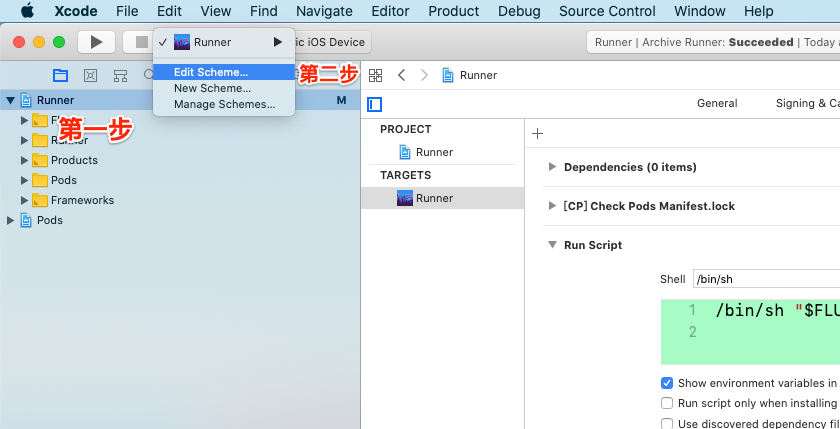

选择 release 模式


3.选择通用设备进行打包；

选择通用设备

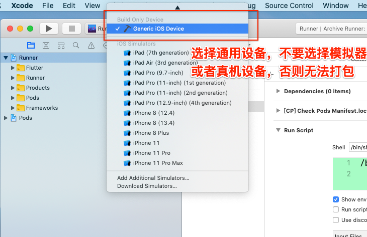


<br/>

4.Xcode 工具栏点击 Product，点击 Archive 进行打包

<br/>

开始打包

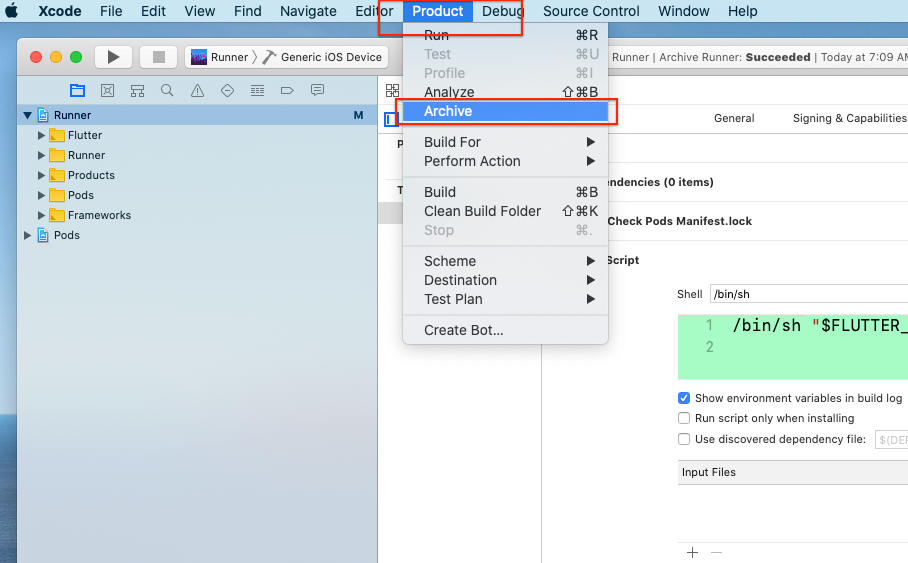


<br/>

5.接下来等待进度条完成，完成后选择刚打好的包，然后选择 Distribute App，接下来按照提示点击 next，就好了，然后将包导出到Mac 桌面。


<br/>
<br/>

> <h2 id='iOS14问题处理'>iOS14问题处理</h2>

- 	Flutter iOS14 Debug应用从桌面图标重新启动时闪退

```diff
+ 用Xcode12连接iOS设备调试安装应用
- 拔掉数据线
! 从桌面图标点击进入App必闪退
```

解决：`使用flutter的release模式 flutter run --release`


<br/>

***
<br/>

> <h1 id='android打包'>android打包</h1>


- **VSCode中打包**
	- 在终端输入：`flutter build app`,前提[**签名文件**](https://www.cnblogs.com/niceyoo/p/11046253.html)都准备好了


<br/>

***
<br/>

<h1 id='VSCode的使用'>VSCode的使用</h1>


> <h2 id='快捷键使用'>快捷键使用</h2>


-  进入类、方法、变量

按住` Command` 键 + 点击某个变量或者方法

-  返回或进入某个方法
- 进入：Command + option + ➡️
- 返回：Command + option + ⬅️

- 命令面板打开
    `Command + shift + P`


<br/>
<br/>

> <h2 id='快捷键修改'>快捷键修改</h2>


- 方法定义的进入和返回
	- 进入

    Windows：Ctrl + 鼠标左击跳到定义；
    
    Mac： Command + 鼠标点击；

	- 返回：

    Windows: Alt + ← ;或者 鼠标侧键
    
    Linux: Ctrl + Alt + - ;貌似数字键盘的减号没效果
    
    Mac: Ctrl + -
    
    终极奥义：VSCode左下角 “管理 / Manage” -> “键盘快捷方式 /     Keyboard Shortcuts” -> 搜索 “前进 / Go Forward 或 后退 / Go Back”

左右括号之间跳转：

```
ctrl + shift + 
```


<br/>
<br/>

- **解决Vscode Studio 打开新文件覆盖上一个窗口的问题**

Command+shift+P 打开偏好设置，如下图：


<br/>

***
<br/>

># iOS环境配置

**①配置镜像环境变量**

打开**`.bash_profile`** 文件配置镜像地址,`在终端输入：

```
 vim ~/.bash_profile
```

敲击键盘上的`A`键进入编辑模式，然后在其中输入环境变量如下：

```
export PUB_HOSTED_URL=https://pub.flutter-io.cn

export FLUTTER_STORAGE_BASE_URL=https://storage.flutter-io.cn

```
输入完成后，按`ESC`退出编辑模式，输入`:wq`返回至命令行,最后在命令行输入一下命令进行文本保存：

```
source ~/.bash_profile
```

**`注意：`** 此镜像为临时镜像，并不能保证一直可用，读者可以参考详情请参考 [Flutter 中文文档](https://flutterchina.club/setup-macos/) 以获得有关镜像服务器的最新动态。


<br/>
**②获取Flutter SDK**

`第一种：获取Flutter SDK的方法`

下载Flutter SDK可用安装包，下载页最新请到[GitHub 最新安装包](https://github.com/flutter/flutter/releases)
解压安装包到你想安装的目录，如：

```
$ cd /Users/harleyhuang/Documents/Gitee
$ unzip ~/Downloads/flutter_macos_v0.5.1-beta.zip
```

使用上述命令进行解压 `zip`的包时会报错，如下图：

无法进行解压

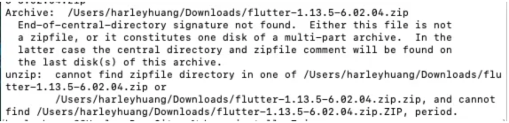

<br/>

&emsp; 这是由于该压缩文件由pkzip算法压缩而成，所以必须先安装p7zip包，用p7zip来解压，这里我用brew来安装p7zip的

```
 brew install p7zip
```
安装成功后运行以下命令就可以解压你想要解压的文件:

```
7za x xxxxx.zip 
```
然后下载Flutter SDK的按转包，进行解压到你想安装的目录中。

<br/>

`第二种：获取Flutter SDK的方法`

终端输入命令：

```
git clone -b beta https://github.com/flutter/flutter.git
```

这种方法需要在网络好的环境才能下载，否则会失败。在好的网络环境需要大概 

**`2小时`**。

添加flutter相关工具到path中：

```
export PATH=${PATH}:/Users/harleyhuang/flutter/bin
```

获取flutter SDK解压安装包后的地址,如下图：

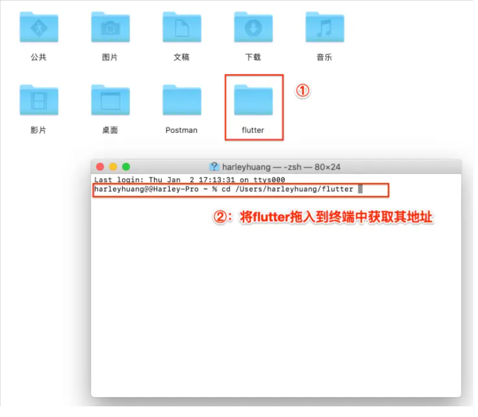


复制上述的地址，然后在终端打开`.bash_profile`文件，配置flutter环境变量如下：

```
export PATH=${PATH}:/Users/harleyhuang/flutter/bin
```

完成后的3个flutter环境变量如下：

```
export PUB_HOSTED_URL=https://pub.flutter-io.cn

export FLUTTER_STORAGE_BASE_URL=https://storage.flutter-io.cn

//export PATH=/Users/harleyhuang/flutter/bin:$PATH ，或者如下命令：
export PATH=${PATH}:/Users/harleyhuang/flutter/bin
```

Mac 完成配置的3个环境变量配置如下图：

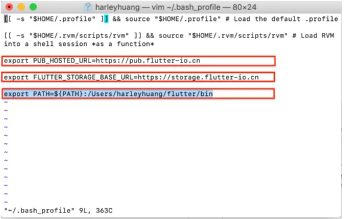


<br/>

完成后一定要输入以下命令，进行文件保存，否则再次使用flutter命令无法生效，需要输入：

```
source ~/.bash_profile
```

此时Flutter的环境变量配置也就完成，然后在终端进行检查是否配置成功，输入：

```
flutter doctor
```

然后终端显示：

```
harleyhuang@@Harley-Pro ~ % flutter doctor        
Doctor summary (to see all details, run flutter doctor -v):
[✓] Flutter (Channel unknown, v1.12.13+hotfix.5, on Mac OS X 10.15.2 19C57,
    locale zh-Hans-HK)
[✗] Android toolchain - develop for Android devices
    ✗ Unable to locate Android SDK.
      Install Android Studio from:
      https://developer.android.com/studio/index.html
      On first launch it will assist you in installing the Android SDK
      components.
      (or visit https://flutter.dev/setup/#android-setup for detailed
      instructions).
      If the Android SDK has been installed to a custom location, set
      ANDROID_HOME to that location.
      You may also want to add it to your PATH environment variable.

[✓] Xcode - develop for iOS and macOS (Xcode 11.3)
[!] Android Studio (not installed)
[✓] Connected device (2 available)

! Doctor found issues in 2 categories.
harleyhuang@@Harley-Pro ~ % 

```
这些显示可以通过**`Command + S `**输出终端的显示文件内容。

若输入后有反应与[官网检查](https://flutterchina.club/setup-macos/)差不多一致，则配置成功！

**`注意：`**当你退出终端时，然后再次打开终端输入 `flutter doctor`,终端会输出如下提示：

```
zsh: command not found: flutter
```    

只有当你在终端再次输入：`source ~/.bash_profile`后然后回车，这个`flutter doctor`才起作用，不报上述的提示。

**`原因分析：`**

&emsp;  字面意思是`相关命令没有没有找到`，其实就是`bash shell `以及`zsh shell` 是两种读取系统环境变量（使用flutter的前提是你肯定已经在bash的 .bash_profile 已经配置相关`flutter`的环境变量了，从而才能使用`flutter`命令）
&emsp; 然而在使用`zsh shell`的时候，你并没有把相关的环境变量的配置设置到 `.zshrc` 中(功能上类似bash 的.bash_profile)

<br/>


- **`解决办法：`**
	-  命令行终端输入 `open .zshrc` 回车；
	- 在打开的文件中输入**`source ~/.bash_profile`**,然后使用`command+s`组合键进行保存;
	- 在终端输入 **`source .zshrc`** 回车,这样就解决了。

&emsp; 这样再次退出终端，然后再次打开终端问题就解决了。

**zshrc 文件中添加 source ~/.bash_profile** 


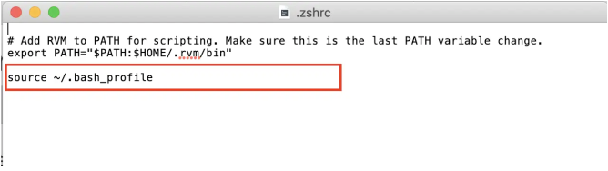


<br/>

***
<br/>
<br/>


> <h1 id='常用命令'>常用命令</h1>

```
//模拟器列表
$ flutter emulators

//启动模拟器,只有启动模拟器才可以运行模拟器
$ flutter emulators --launch <emulator id>

//启动安卓模拟器
$ flutter emulators --launch Nexus_5X_API_28
//例如未启动模拟器列表:
Nexus_5X_API_28     • Nexus 5X      • Google • Nexus 5X API 28
apple_ios_simulator • iOS Simulator • Apple

//运行所有模拟器
$ flutter run -d all


运行指定模拟器
$ flutter run -d <deviceId>
例如模拟器列表:
Android SDK built for x86 • emulator-5554             • android-x86 • Android 9 (API 28) (emulator)
xxx的 iPhone               • 00008020-001838491169002E • ios         • iOS 12.2

//运行安卓模拟器
$ flutter run -d emulator-5554

//运行IOS真机
$ flutter run -d 00008020-001838491169002E

//运行模拟器过程中命令
//热更新直接刷新
$ r

//热更新重启刷新
$ R

//退出运行模拟器
$ q

//创建一个新的Flutter项目
create

//显示相关安装工具的信息
doctor

//为当前项目运行Flutter驱动程序测试
drive

//在Fushia上进行热重载
fuchsia_reload

//在附加设备删除安装Flutter应用程序
install 

//显示用于运行Flutter应用程序的日志输出
logs

//在设备上运行Flutter应用程序
run

//从一个链接的设备截图
screenshot

//停止在附加设备上的Flutter应用程序
stop

//升级Flutter副本
upgrade
```


<br/>
<br/>


> <h2 id='模拟器调试'>模拟器调试</h2>

  在Visual Studio Code 中调出控制台，选择终端，使鼠标的焦点聚焦在终端上然后输入如下命令进行调试：

```
// 输入后进行热加载，也就是重新加载，修改后的东西重新同步到到模拟器上(相当于网页刷新，方便快捷)
r 

//显示网格，掌握布局情况
p

//切换android和iOS的模拟器预览模式
o

//退出调试预览模式
q
```

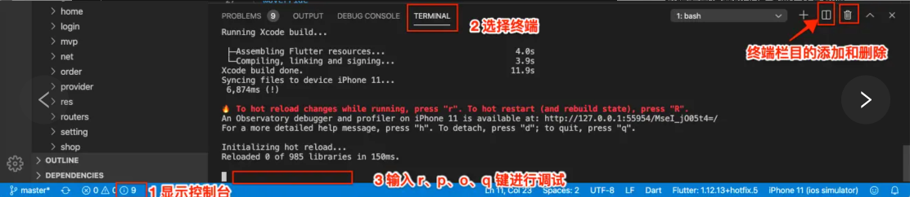


<br/>

调试

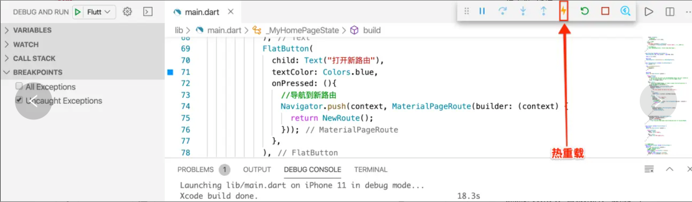


<br/>

***
<br/>
<br/>


> <h1 id='前端环境配置'>前端环境配置</h1>


- 下载Node.js

Node.js 的[安装包](https://nodejs.org/zh-tw/download/)下载；

- yarn 的安装；

```
sudo -s
npm install -g yarn react-native-cli
```

- Vue 的安装；

```
yarn global add @vue/cli
```

- 检测是否安装成功

`vue --version`

- 使用Vscode Studio 打开前端代码文件夹，在 `TERMINAL`中输入：

- `npm I` 进行依赖包的下载；

- 终端输入：

`vue ui` 打开vue的网站，然后选择文件夹来打开所选的项目；

- 在Vue的网站点击运行，开始运行项目


<br/>

***
<br/>

> <h1 id='安装VisualStudioCode'>安装Visual Studio Code</h1>


<br/>

&emsp; 根据大神提示，编码Flutter最好的工具是 **`Visual Studio Code`** 其次是**`Android Studio`** ，其下载地址是：[Visual Studio Code 安装包](https://code.visualstudio.com/docs/?dv=osx)

下载好后需要下载两个插件，分别是**`Dart`**和**`Flutter`**,如下图：

**`1⃣️Flutter 插件下载`**

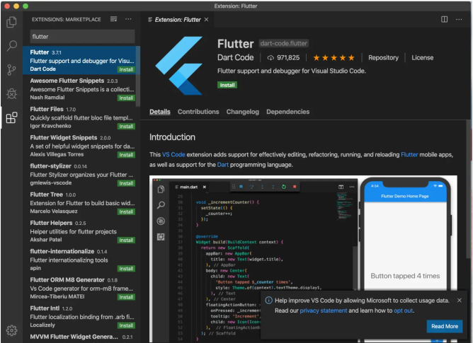

<br/>

**`2⃣️ Dart 插件下载`**


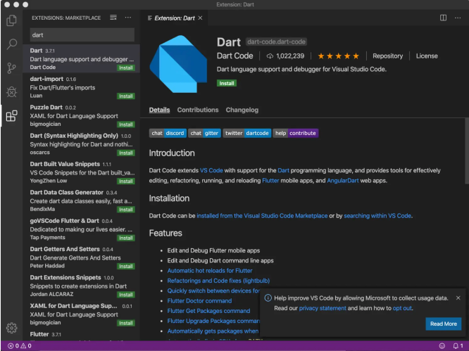


<br/>

**`3⃣️Android iOS Emulator插件下载`**

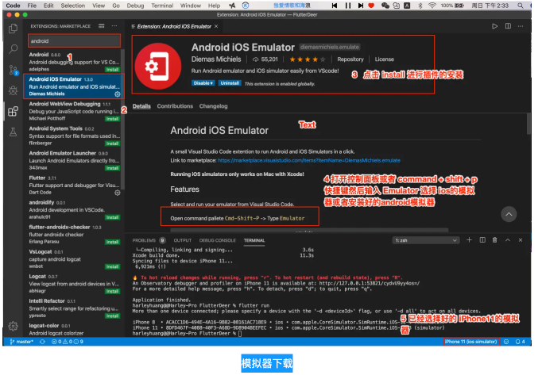


打开控制面板

按图中手动或者 command + shif + p组合键进行打开

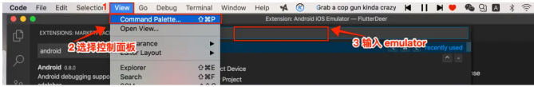


<br/>

下载好后，重启一下**`Visual Studio Code`** 就好了

<br/>

创建一个Flutter工程：**`Command + shift + P`**,如下图：

项目名称一律小写

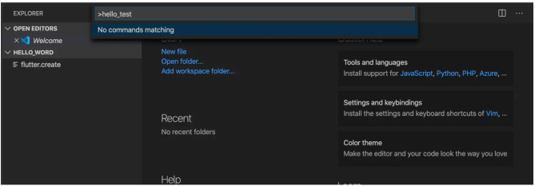


<br/>

**`Visual Studio Code`** 调出模拟器进行调试，如下图：

Debug 模式调试

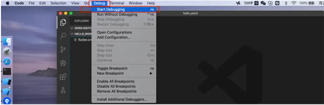


<br/>

***
<br/>

> <h1 id='Android的配置'>Android的配置</h1>


- **`1⃣️ 配置 JDK, 使用brew下载`**
- **`2⃣️ 下载 android sdk, 使用brew下载`**
- **3⃣️ 下载 Android Studio；**
- **4⃣️ Android 环境配置**
	- 打开 `.bash_profile` 文件
	- 终端输入：`open ~/.bash_profile`

```

#Android sdk配置
export ANDROID_HOME=/Users/harleyhuang/DevelopToolConfiguration/AndroidSDK
export PATH="${PATH}:${ANDROID_HOME}/tools:${ANDROID_HOME}/platform-tools"
export NO_PROXY=localhost,127.0.0.1

```

- **5⃣️ Java 环境配置**
	- 打开 `.bash_profile` 文件
	- 终端输入：`open ~/.bash_profile`

```
//查看Java虚拟机位置
$ /usr/libexec/java_home -V
 
Matching Java Virtual Machines (2):
    13.0.1, x86_64:	"Java SE 13.0.1"	/Library/Java/JavaVirtualMachines/jdk-13.0.1.jdk/Contents/Home
    13.0.1, x86_64:	"OpenJDK 13.0.1"	/Library/Java/JavaVirtualMachines/openjdk-13.0.1.jdk/Contents/Home

//Java虚拟机路径
/Library/Java/JavaVirtualMachines/jdk-13.0.1.jdk/Contents/Home

#JAVA 环境配置 
export JAVA_HOME=/Library/Java/JavaVirtualMachines/jdk-13.0.1.jdk/Contents/Home
export CLASSPAHT=.:$JAVA_HOME/lib/dt.jar:$JAVA_HOME/lib/tools.jar
export PATH=$JAVA_HOME/bin:$PATH:
```


