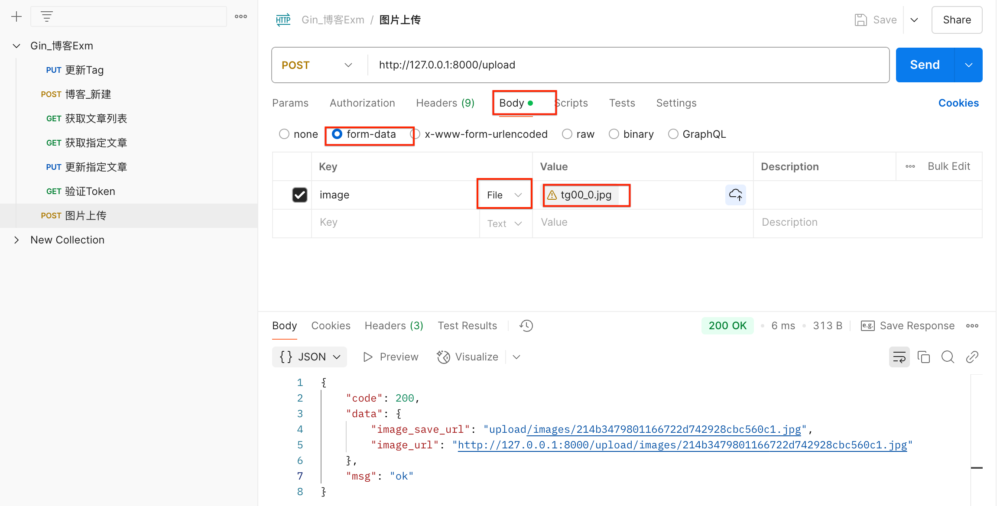

> <h4/>
- [Curl进行API测试](#Curl进行API测试) 
	- [发送GET请求](#发送GET请求) 
	- [发送POST请求](#发送POST请求) 
	- [添加请求头](#添加请求头) 
	- [发送带认证的请求](#发送带认证的请求) 
	- [下载文件](#下载文件) 
	- [跟随重定向](#跟随重定向) 
	- [显示响应头](#显示响应头) 
	- [保存响应到文件](#保存响应到文件) 
	- [显示请求&响应详情（调试API）](#显示请求&响应详情（调试API）)
	- [🌟`curl`高级用法](#🌟`curl`高级用法)
- [HTTPie进行API测试](#HTTPie进行API测试) 
- [Postman进行API测试](#Postman进行API测试) 
	- [图片上传测试](#图片上传测试)
- [VSCode插件API测试](#VSCode插件API测试)
- [压力测试工具](#压力测试工具)
	- 


<br/><br/><br/>

***
<br/>

> <h1 id="Curl进行API测试">Curl进行API测试</h1>

**📌 `curl` 是什么？**
`curl`（Client URL）是一个**命令行工具**，用于发送 HTTP 请求、下载文件、调试 API 等。支持多种协议，如 HTTP、HTTPS、FTP、SFTP 等。

<br/><br/>
> <h3 id="发送GET请求">发送GET请求</h3>

```bash
curl http://example.com
```
🔹 **默认使用 GET 方法**，相当于在浏览器里访问 `http://example.com`。

<br/>

**发送带 Token 的请求**

```sh
curl -X GET http://localhost:8080/api/protected \
     -H "Authorization: Bearer YOUR_ACCESS_TOKEN"
```

<br/><br/>
> <h3 id="发送POST请求">发送POST请求</h3>

```bash
curl -X POST http://example.com -d "username=admin&password=123456"
```
🔹 `-X POST` 指定 `POST` 方法，`-d` 发送表单数据。

<br/>

**发送 POST 请求（JSON 数据）**

```sh
curl -X POST http://localhost:8080/api/users \
     -H "Content-Type: application/json" \
     -d '{"name": "Alice", "email": "alice@example.com"}'
```
🔹 `-H` 设置请求头，`-d` 发送 JSON 数据。

<br/><br/>
> <h3 id="添加请求头">添加请求头</h3>

```bash
curl -H "Authorization: Bearer TOKEN" \
     -H "Accept: application/json" \
     http://example.com/api
```
🔹 `-H` 设置多个请求头，适用于 API 调试。


<br/><br/>
> <h3 id="发送带认证的请求">发送带认证的请求</h3>

```bash
curl -u username:password http://example.com/protected
```
🔹 `-u` 发送 **Basic Auth** 认证（用户名/密码）。

<br/><br/>
> <h3 id="下载文件">下载文件</h3>

```bash
curl -O http://example.com/file.zip
```
🔹 `-O` **保存文件**，文件名与远程一致。

```bash
curl -o myfile.zip http://example.com/file.zip
```
🔹 `-o` **自定义文件名**。

<br/><br/>
> <h3 id="跟随重定向">跟随重定向</h3>

```bash
curl -L http://example.com
```
🔹 `-L` **自动跟随 301/302 重定向**。

<br/><br/>
> <h3 id="显示响应头">显示响应头</h3>

```bash
curl -I http://example.com
```
🔹 `-I` **只显示响应头**（HEAD 请求）。

<br/><br/>
> <h3 id="保存响应到文件">保存响应到文件</h3>

```bash
curl http://example.com -o output.html
```
🔹 `-o` **将响应内容保存为 `output.html`**。


<br/>

***
<br/>

> <h3 id="显示请求&响应详情（调试API）">显示请求 & 响应详情（调试 API）</h3>


```bash
curl -v http://example.com
```
🔹 `-v` **显示详细的请求/响应信息**，用于调试。

```bash
curl -vvv http://example.com
```
🔹 `-vvv` **更详细的调试信息**。

---
<br/><br/>
> <h3 id="🌟`curl`高级用法">🌟 `curl` 高级用法</h3>

| 功能 | 命令 |
|------|------|
| **GET 请求** | `curl http://example.com` |
| **POST 请求** | `curl -X POST -d "name=John" http://example.com` |
| **发送 JSON** | `curl -X POST -H "Content-Type: application/json" -d '{"key":"value"}' http://example.com` |
| **下载文件** | `curl -O http://example.com/file.zip` |
| **认证请求** | `curl -u user:pass http://example.com` |
| **设置请求头** | `curl -H "Authorization: Bearer TOKEN" http://example.com` |
| **自动重定向** | `curl -L http://example.com` |
| **查看响应头** | `curl -I http://example.com` |
| **调试模式** | `curl -v http://example.com` |


<br/><br/><br/>
> <h2 id="HTTPie进行API测试">HTTPie进行API测试</h2>

`HTTPie` 是 `Curl` 的替代品，语法更直观，适用于 API 调试。

- **安装 HTTPie**

```sh
pip install httpie  # 需要 Python
```

<br/>

**示例 1：发送 GET 请求**

```sh
http GET http://localhost:8080/api/users
```

<br/>

**示例 2：发送 POST 请求（JSON 数据）**

```sh
http POST http://localhost:8080/api/users name="Alice" email="alice@example.com"
```

<br/>

**示例 3：发送带 Token 的请求**

```sh
http GET http://localhost:8080/api/protected "Authorization: Bearer YOUR_ACCESS_TOKEN"
```

<br/><br/><br/>
> <h2 id="Postman进行API测试">Postman进行API测试</h2>

Postman 是一个图形化 API 测试工具，适用于复杂的 API 交互、自动化测试、Mock API 等。

- **使用步骤**
	1. **安装 Postman**：从 [Postman 官网](https://www.postman.com/) 下载并安装。
	2. **创建请求**：
	   - 选择 **GET、POST、PUT、DELETE** 等方法。
	   - 填写 **URL**（如 `http://localhost:8080/api/users`）。
	   - 添加 **Headers**（如 `Content-Type: application/json`）。
	   - 若为 `POST` 或 `PUT`，在 **Body** 选项卡填入 JSON 数据。
	3. **点击“Send”** 发送请求并查看响应。

<br/><br/><br/>
> <h2 id="图片上传测试">图片上传测试</h2>



<br/><br/><br/>
> <h2 id="VSCode插件API测试">VSCode插件API测试</h2>

VSCode 提供多种 API 测试插件，常用的是 `REST Client` 插件。

- **安装 REST Client 插件**
	- 打开 VSCode，按 `Cmd + Shift + X`（Mac）或 `Ctrl + Shift + X`（Windows）。
	- 搜索 `REST Client` 并安装。

<br/>

- **创建 API 请求**

在 `.http` 或 `.rest` 文件中写入请求，例如：

```http
### 发送 GET 请求
GET http://localhost:8080/api/users

### 发送 POST 请求
POST http://localhost:8080/api/users
Content-Type: application/json

{
    "name": "Alice",
    "email": "alice@example.com"
}
```

<br/>

- **执行请求**
	1. 在 VSCode 打开 `.http` 文件。
	2. 在请求上方会出现 `Send Request` 按钮，点击即可运行并查看响应。


<br/><br/><br/>

***
<br/>

> <h1 id="压力测试工具">压力测试工具</h1>

后端开发中常用的压力测试工具有很多种，适用于不同的语言和场景。如果你使用 **Go 语言** 开发后端，以下是一些主流的压力测试工具推荐，以及在 Go 项目中的适配建议：

---

## 🔧 常见压力测试工具及推荐

| 工具名称              | 简介                    | 是否推荐用于 Go 后端    | 特点                  |
| ----------------- | --------------------- | --------------- | ------------------- |
| **wrk**           | 高性能 HTTP 压测工具（C 语言编写） | ✅ 强烈推荐          | 高性能、支持 Lua 脚本扩展、易集成 |
| **wrk2**          | `wrk` 的改进版，支持恒定请求率    | ✅ 推荐            | 更稳定控制请求速率           |
| **hey**           | 由 Go 编写的 HTTP 压力测试工具  | ✅ 非常适合 Go 项目    | 简单好用，单文件，易部署        |
| **vegeta**        | 高度模块化的 Go 编写的负载测试工具   | ✅ 推荐            | 可编程化负载，适合 CI 集成     |
| **Apache JMeter** | Java 写的 GUI 工具        | ✅ 可用            | 图形界面丰富，适合复杂测试场景     |
| **Gatling**       | Scala 写的模拟用户场景工具      | ⚠️ 对 Go 支持一般    | 强大但学习成本较高           |
| **Locust**        | Python 编写，适合行为脚本编写    | ⚠️ 除非团队熟 Python | 编写复杂场景方便，但性能较低      |

---

## ✅ 如果你是 Go 开发，推荐使用：

### 1. **hey**（推荐初学者和中小项目）

* 作者是 Go 社区知名人物（rakyll）。
* 易用命令行工具，执行简单：

  ```bash
  hey -n 10000 -c 100 http://localhost:8080/api
  ```
* 非常适合 CI/CD 中快速回归测试。

### 2. **vegeta**（推荐自动化/可编程场景）

* 支持复杂的攻击模式、报告生成：

  ```bash
  echo "GET http://localhost:8080/api" | vegeta attack -rate=100 -duration=30s | vegeta report
  ```
* 可输出 JSON、HTML 报告，易与 Go 工具链集成。

### 3. **wrk / wrk2**（高并发场景强烈推荐）

* wrk 是 **C 语言写的高性能工具**，非常适合压测高并发的 API。
* 示例：

  ```bash
  wrk -t4 -c100 -d30s http://localhost:8080/api
  ```

---

## 🎯 综合推荐

| 场景             | 工具                  |
| -------------- | ------------------- |
| 快速压测 / 单接口     | `hey`               |
| 可编程压测 / 自动化    | `vegeta`            |
| 极限并发性能压测       | `wrk` / `wrk2`      |
| GUI 操作 / 多步骤事务 | `JMeter` / `Locust` |


