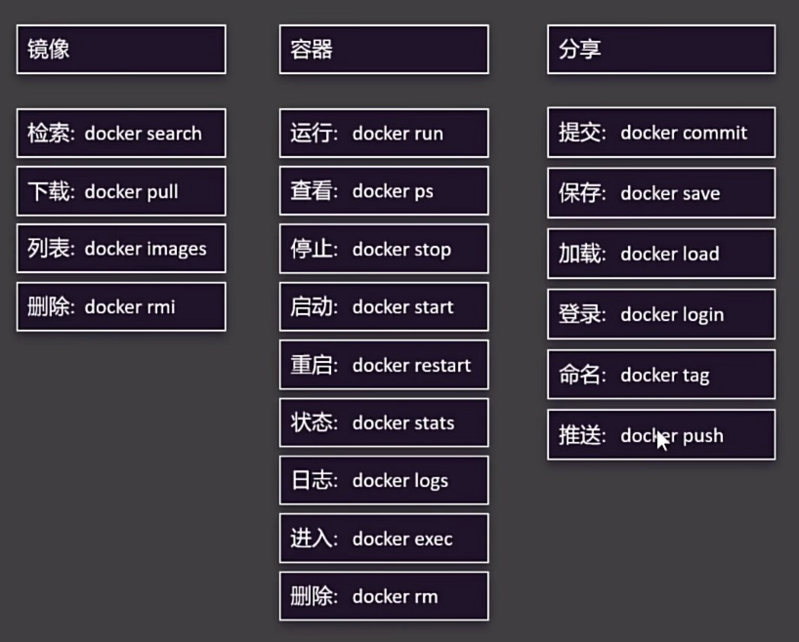
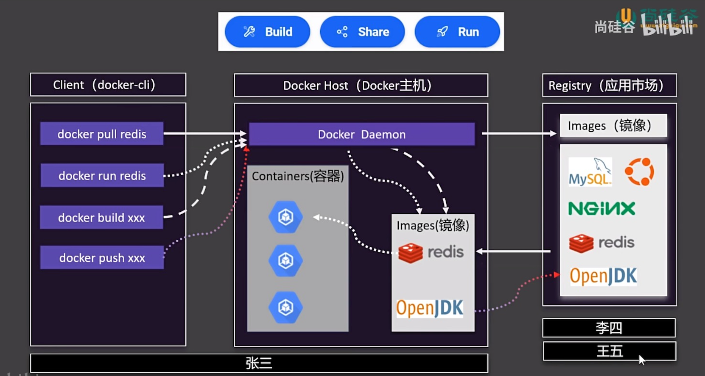
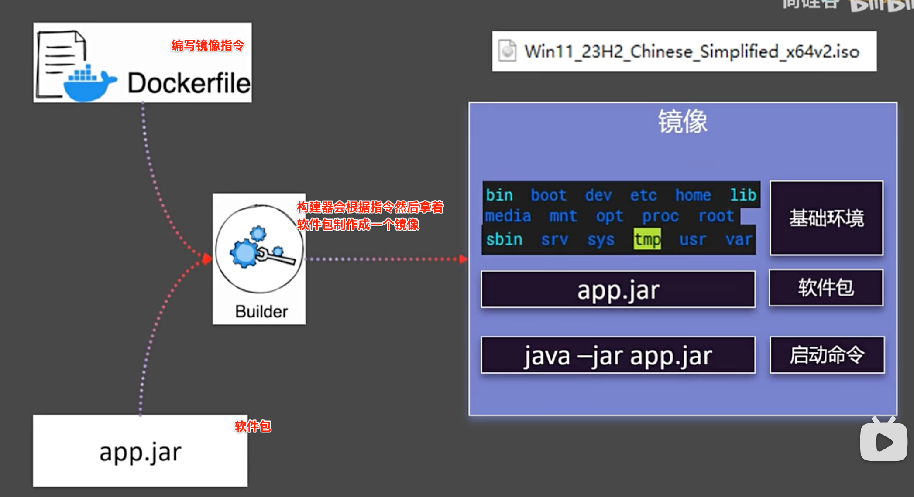
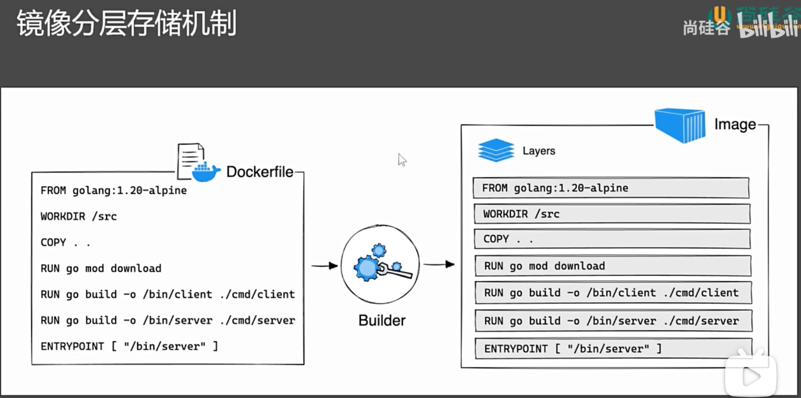
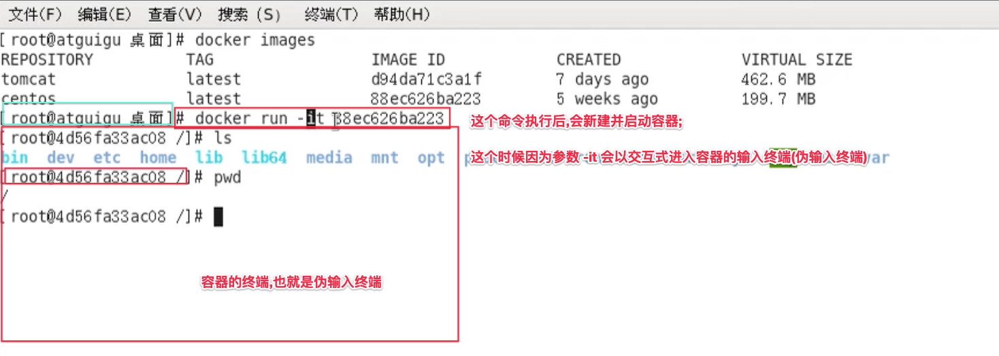
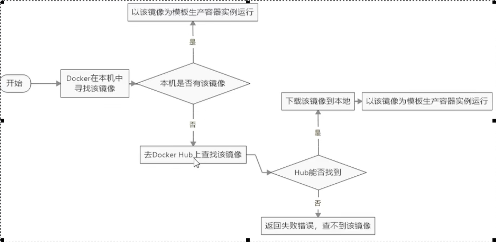
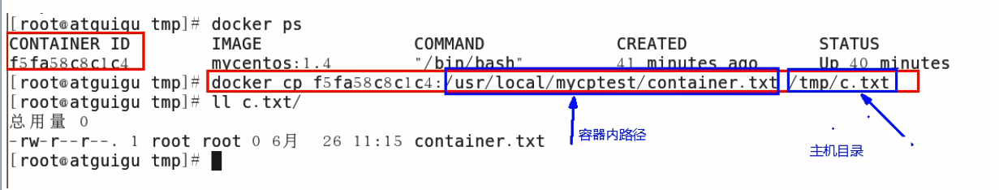
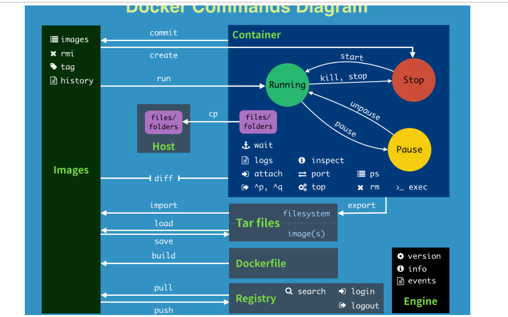
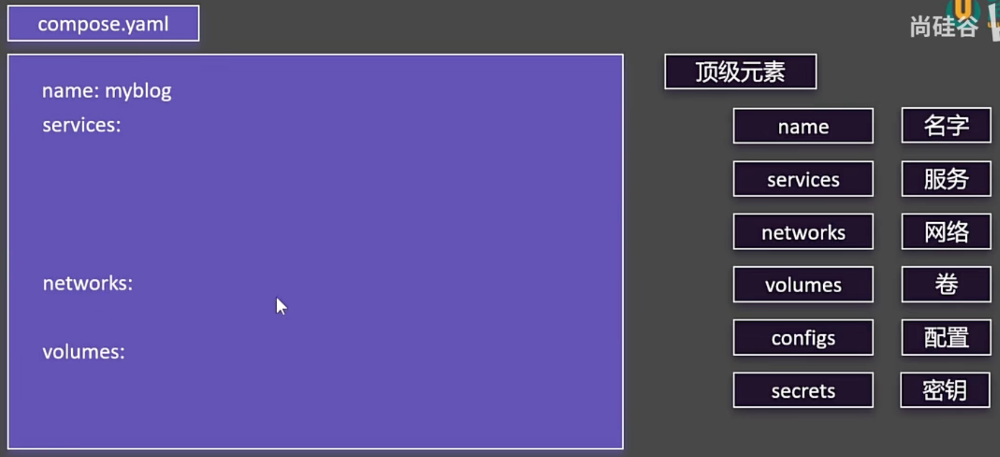

> <h1 ></h3>
- [**Docker介绍**](#Docker介绍)
- [docker大致命令介绍](#docker大致命令介绍)
- [Docker使用](#Docker使用)
- [加快镜像下载,配置国内镜像](#加快镜像下载,配置国内镜像)
- [自定义网络](#自定义网络)
- [**镜像**](#镜像)
	- [镜像常用命令](#镜像常用命令)
		- [检索镜像](#检索镜像) 
		- [拉取镜像](#拉取镜像) 
		- [构建镜像](#构建镜像) 
		- [列出本地所有镜像](#列出本地所有镜像) 
		- [返回指定镜像信息](#返回指定镜像信息) 
		- [显示镜像的构建历史](#显示镜像的构建历史) 
		- [列出所有“悬空”镜像](#列出所有“悬空”镜像)
		- [删除镜像](#删除镜像)
		- [镜像提交](#镜像提交)
		- [制作镜像](#制作镜像)
	- [`docker images`详解](#dockerimages详解)
	- [镜像分层存储](#镜像分层存储)
- [**容器**](#容器)
	- [容器命令](#容器命令)
		- [新建并启动容器](#新建并启动容器) 
		- [启动2个容器进行连接](#启动2个容器进行连接)
		- [列出当前所有正在运行的容器](#列出当前所有正在运行的容器) 
		- [查看哪些容器依赖该镜像](#查看哪些容器依赖该镜像)
		- [退出容器](#退出容器) 
		- [启动容器](#启动容器) 
		- [停止容器](#停止容器) 
		- [删除已停止的容器](#删除已停止的容器)
		- [启动守护式容器](#启动守护式容器) 
		- [查看容器日志](#查看容器日志) 
		- [查看容器内部信息](#查看容器内部信息)
	- [启动容器命令](#启动容器命令)
	- [Docker Compose批量管理容器](#DockerCompose批量管理容器)
	- [Docker启动mysql](#Docker启动mysql)
- [**数据卷**](#数据卷)
	- [案例Docker构建](#案例Docker构建)
		- [Golang + Mysql](#Golang+Mysql)
	- [自动CI/CD](#自动CI/CD)
- **资料**
	- [手把手教你基于Docker部署Go项目超简单](https://juejin.cn/post/7137592961855914015)
	- [Docker Compose-(go zero docs)](https://go-zero.dev/docs/tutorials/ops/docker/compose)
	- [Docker使用教程-博客园](https://www.cnblogs.com/jbtys/tag/docker/default.html?page=3)
	- [Docker部署Go+Mysql+Redis ](https://www.cnblogs.com/wylshkjj/p/16694290.html)
	- [Docker compose部署Golang服务](https://blog.csdn.net/John_rush/article/details/135737565)
	- [如何使用Docker部署Go Web应用](https://www.liwenzhou.com/posts/Go/deploy-in-docker/)
	- [Go服务部署-Docker部署](https://blog.yiqiesuifeng.cn/archives/274/)
	- [使用Docker部署Go项目](https://blog.csdn.net/qq_46079238/article/details/131456417)
	- [](https://www.yuque.com/li.xx/open/docker)
		- [](https://www.bilibili.com/video/BV1Ls411n7mx?spm_id_from=333.788.player.switch&vd_source=a7fe275f0ee54c4d2f691a823f8876b8&p=4)
		- [阿里云镜像](https://home.console.aliyun.com/home/dashboard/ProductAndService)
	- [Docker实战教程（docker教程天花板）](https://www.bilibili.com/video/BV1gr4y1U7CY?spm_id_from=333.788.videopod.episodes&vd_source=a7fe275f0ee54c4d2f691a823f8876b8&p=30)


<br/><br/><br/>

***
<br/>

># <h1 id="Docker介绍">[Docker介绍](https://yeasy.gitbook.io/docker_practice/install/mac)</h1>
[Docker各个版本下载包](https://gist.github.com/kupietools/2f9f085228d765da579f0f0702bec33c)

Docker 是一个**容器化**平台，主要用于**构建、打包、分发和运行**应用程序。它的核心作用是让应用程序及其依赖项一起封装在一个**轻量级、可移植的容器**中，从而确保应用能够在不同的环境（如开发、测试、生产）中一致运行。

<br/><br/>

我们接触Docker后,首先看到的是一个鲸鱼🐳驮着集装箱在蓝色大海里游,这个表示什么意思?
- **蓝色的大海----- 宿主机系统 MacOS系统**
- **鲸鱼🐳------ docker**
- **集装箱------ 容器示例 ..... from 来自我们的镜像模版**

<br/>

Docker容器有三大组件：镜像(Image)、容器(Container)和仓库(Repository)。要了解容器技术，[建议查看相关的文档](https://www.docker.com/)，这里仅进行简单的介绍。

- 镜像：一个特殊的文件系统，提供容器运行时的程序、库、配置等，属于静态数据。
- 容器：实质是进程，和宿主机上的进程有所不同，容器进程有属于自己独立的命名空间，有自己的root文件系统、网络配置等。
- 仓库：存储各种镜像文件。

<br/>

对后端开发人员而言，需要掌握如何操作镜像、容器和仓库。镜像是文件系统，也是一种资源，镜像的操作包括删除、构建、获取、查看等；容器是进程，容器的操作包括启动、停止、查看等；仓库是存储镜像的地方，仓库的操作包括推送、获取等。

&emsp; Docker容器采用C/S（客户端/服务器端）架构，要使用Docker，需要安装软件，启动Docker进程，之后可以对镜像、容器、仓库进行操作。后端开发用到的所有技术，比如Ubuntu系统、Nginx服务、MySQL、Go、PostgreSQL等都存在相应的镜像。有了Docker之后，再也不用费时费力地下载安装各种软件就可以使用所需的技术。比如需要使用PostgreSQL数据库，可以简单地执行下面的命令：

```
// 拉取远程镜像仓库中的postgres置于本地
docker pull postgres
// 启动容器
docker run --name some-postgres -e POSTGRES_PASSWORD=mysecretpassword -d postgres
// 查看容器
docker ps
// 进入容器
docker exec -it a5d42af1e361 bash
// 切换用户
su posgres
// 进入数据库
psql -h localhost
postgres@a5d42af1e361:/$ psql -h localhost
psql (11.4 (Debian 11.4-1.pgdg90+1))
Type "help" for help.
postgres=#
```

上面是以postgres为例的一些简单使用，事实上各种服务都可以使用Docker来操作它们，而无须在本地安装和进行繁杂的配置。以后开发者想学习任何服务，优先使用容器版本，即可快速上手。

获取到镜像之后，各种镜像的配置参数不同，如何使用它们呢？[可以查看DockerHub最大的镜像托管平台，网站上托管了许多官方和个人的镜像，查看相应的文档即可。](https://hub.docker.com/search?badges=official)

对个人开发者而言，构建自己的镜像无须从零开始，在官方的镜像基础上构建自己的镜像即可，这也是个人或者企业构建镜像的核心步骤。如何构建镜像呢？答案是编写Dockerfile，官方提供了一套语法规范，按照规范编写Dockerfile文件即可。

```
# 示例
# 基础镜像
FROM golang:1.13.4
# 维护者信息
LABEL maintainer="XieWei"
# 工作目录
WORKDIR /go/GopherBook/chapter11
# 暴露端口
EXPOSE 8888
# 设置环境变量
ENV GO111MODULE=on
# volume 目录
VOLUME [ "/go/GopherBook/chapter11/logs" ]
# 下载安装依赖
RUN apt-get update && apt-get install -q -y vim git openssh-client cron bash && apt-get clean;
# 复制文件
COPY . .
# 执行命令
RUN make install
RUN make prod
# 容器启动时执行命令
CMD [ "bash", "-c", "/go/GopherBook/chapter11/votes;" ]
```

为什么这样操作，构建镜像的目的是什么？

&emsp; 开发者构建Web服务，在本地开发时直接在本地启动服务即可，比如go web项目，执行go run命令启动服务。那么想要在远程服务器上部署这套代码，怎么启动服务呢？答案是构建镜像，启动镜像的同时启动服务，这样开发者只需要提供Dockerfile文件就可以构建镜像，在镜像的基础上再执行docker run命令启动容器，即可启动Web服务。这就是容器这么受欢迎的原因，一套代码多处部署，使用非常方便。

&emsp; 对于个人开发者，如果有自己私有的服务器，那么可以配合DaoCloud(https://www.daocloud.io/)搭建流水线，自动同步远端代码进行测试、构建等环节，自动构建镜像、部署容器。

***
<br/><br/><br/>
> <h2 id="docker大致命令介绍">docker大致命令介绍</h2>



***
<br/><br/><br/>
> <h2  id="Docker使用">Docker使用</h2>
我们以官方的教学镜像作为简单示例。启动Desktop后，在电脑的终端上运行如下命令：

```sh
docker run -d -p 80:80 docker/getting-started
```
该命令如果发现本地没有docker/getting-started镜像文件，会从官方的镜像仓库Docker Hub上拉取镜像并运行。

**-d:** 让容器进程以后台模式运行。

`-p 80:80`：把主机的80端口映射到容器里的80端口。

`docker/getting-started：`镜像名称。

启动后，打开一个浏览器，访问 `http://localhost/ `就可以看到已经run起来的应用程序的界面了。

<br/>

**Docker 的主要用途**

- **1.环境一致性**  
	- 解决“**在我电脑上可以跑**，但在服务器上有问题”的问题。  
	- 通过容器让应用及其依赖环境始终一致。

- **2.快速部署与扩展**  
	- 轻量级容器启动速度快，适合微服务架构。  
	- 可在本地开发，直接打包部署到云端或服务器。

***
<br/><br/><br/>
> <h3 id="加快镜像下载,配置国内镜像">加快镜像下载,配置国内镜像</h3>
我用的是MacPro,下载的桌面端.打开**docker.desktop**,然后点击设置,在**Docker Engine**中进行如下配置:

```json
{
  "builder": {
    "gc": {
      "defaultKeepStorage": "20GB",
      "enabled": true
    }
  },
  "experimental": false,
  "features": {
    "buildkit": true
  },
  "registry-mirrors": [
    "http://hub-mirror.c.163.com",
    "https://docker.mirrors.ustc.edu.cn",
    "https://cr.console.aliyun.com",
    "https://mirror.ccs.tencentyun.com"
  ]
}
```


<br/><br/><br/>
> <h2 id="自定义网络">自定义网络</h2>


- 因为每个容器都是隔离的，所以容器暴露的端口号可以是相同的，比如：app1的容器端口为80， app2的容器端口为80，是可以的
- 对于容器外面的机器ip端口必须是不同的，否则无法分辩是哪个，所以分别为：88、99端口；
- 对于docker0是docker自动分配的ip地址，而且有时还会变？还不容易记住，有没有自己定义的呢？
	- 有我们可以自己定义一个`mynet域名`，通过这个域名app1容器加上app的端口可以直接访问app2容器的数据和文件。当然docker0作为ip地址也是可以的。


<br/>

- **3.依赖管理**  
	- 解决不同项目需要不同依赖的问题，比如 Python2 和 Python3 共存。  
	- 容器内的环境彼此隔离，不会互相影响。

<br/>

-  **4.跨平台运行**  
	- 容器能在**Windows、macOS、Linux**上运行，解决不同平台的兼容性问题。  
	- 只需安装 Docker，就能运行相同的容器，无需额外配置环境。

<br/>

-  **5.版本管理**  
	- 通过 Docker **镜像**（Image）管理应用的不同版本，可以回滚、更新。  
	- 类似于 Git，Docker Hub 也可以存储和分发镜像。

<br/>

-  **6.微服务架构**  
	- 适合拆分大型应用，每个服务在独立容器中运行，互不影响。  
	- 通过 `docker-compose` 方便管理多个容器。


<br/><br/><br/>

***
<br/>

> <h1 id="镜像">镜像</h1>


Docker镜像(lmage)就是-一个只读的模板。镜像可以用来创建Docker容器，个镜像可以创建很多容器
- **镜像（Image）**：  
	- 类似于“模板”，包含应用及其环境的所有内容。  
	- 例如：`nginx:latest` 是官方提供的 Nginx 服务器镜像。

<br/>

容器与镜像的关系类似于面向对象编程中的对象与类.
| **Docker** | 面向对象 |
|:--|:--|
| 容器 | 对象 |
| 镜像 | 类 |

<br/><br/>

[**镜像资源:**](https://hub.docker.com/search)


 CentOS 8 停止维护后，官方推荐使用 CentOS Stream.CentOS 官方镜像不再托管在 **Docker Hub**而是托管[在Red Hat的quay.io上 CentOS](https://quay.io/repository/centos/centos?tab=info),拉取最新CentOS:

```sh
 ‌docker pull quay.io/centos/centos
```

<br/>



- **Docker肩负着：**
	- 构建（Build）： 打包构建
	- 分享（Share）：当开发完后，打出一个包给对方使用，不用写30多页的运行手册（手册里可能要写明要运行的各种配置和软件，否则无法运行）
	- 运行（Run）

- **Client： 客户端**
	- 主要是通过一些命令，对主机进行操作。比如： 
		- `docker pull redis`是把 redis从应用市场下载到Docker主机，形成镜像。
		- `docker  run redis`  是将镜像放入到主机中的容器中进行运行；
	- 你若是自己想在主机中运行，你也需要使用 docker build xxx 将应用进行打包，然后通过 docker push xxx 到应用市场中去

- **Docker Host（Docker主机）：**

- **Registry（应用市场）：**

***
<br/><br/><br/>
> <h2 id="镜像常用命令">镜像常用命令</h2>

<br/><br/>
> <h3 id="检索镜像">检索镜像</h3>

```sh
docker search [OPTIONS] 镜像名字
```

- 可选参数OPTIONS:
	- `--no-trun `显示完整的镜像描述;
	- `-s` 列出收藏数不小于指定值的镜像;
	- `--automated` 只列出 automated build类型的镜像

```sh
‌docker search image_name:tag(镜像名: tag号)

docker search -s 30 tomcat
```

<br/><br/>
> <h3 id="拉取镜像">拉取镜像</h3>

```sh
docker pull image_name(镜像名)
```

<br/><br/>
> <h3 id="构建镜像">构建镜像</h3>


```sh
‌docker build -t <image_name> <path> 
```

<br/>

```sh
docker build -t gin-blog-docker .
```

- **参数:**
	- `‌-t <image_name>：` 为构建的镜像指定一个名称（和可选的标签）。
	- `. (路径)：`作用：指定构建上下文的路径。构建上下文是指 Docker build 命令需要用来构建镜像的文件和目录。
		-  `. `表示当前目录（即你运行命令的目录），它告诉 Docker 从当前目录开始查找 Dockerfile 文件以及构建镜像所需要的其他资源 

<br/><br/>
> <h3 id="列出本地所有镜像">列出本地所有镜像</h3>

```sh
docker images [OPTIONS]
```

- **OPTIONS可选:**
	- `-a` 列出本地所有的镜像(含中间映射层); 
	- `-q` 只显示镜像ID; 
	- `--digests` 显示镜像的摘要信息;
	- `--no-trunc` 显示完整的镜像信息

<br/>
列出本地的所有镜像，包括镜像的名称、标签、ID、创建时间和大小等信息。

```sh
docker image ls
```

<br/>

```sh
docker images --digests
```

<br/><br/>
> <h3 id="返回指定镜像信息">返回指定镜像信息</h3>

```sh
docker inspect <image> 
```

返回指定镜像的详细元数据，内容较为详细，以 JSON 格式输出，适合查看镜像的配置、层次、环境变量等信息。 

<br/><br/>
> <h3 id="显示镜像的构建历史">显示镜像的构建历史</h3>

```sh
docker history <image>
```
显示镜像的构建历史，按层次列出镜像的每一层及其大小、命令和创建时间等。 

<br/><br/>
> <h3 id="列出所有“悬空”镜像">列出所有“悬空”镜像</h3>

```sh
docker images -f "dangling=true"  
```

列出所有“悬空”镜像（即没有标签且不被任何容器使用的镜像）。这些镜像通常是构建过程中产生的中间镜像。

<br/><br/>
> <h3 id="删除镜像">删除镜像</h3>

```sh
# <image_name_or_id>: 删除的镜像 ID 或镜像的名称（标签
# 有的镜像无法停止,是因为容器正在运行,你需要先停掉容器,然后再删除镜像
docker rmi <image_name_or_id>

‌docker image prune (删除未使用的镜像)

# 强制删除镜像:‌docker rmi -f 镜像ID
‌docker rmi -f ccc8e7cf9efa`
```

- **优化:** 删除镜像前先确认有哪些容器用了这个镜像:`‌docker ps -a --filter ancestor=ccc8e7cf9efa`
- 删除单个镜像: `docker rmi my_image`,比如: `docker rmi a1b2c3d4e5f6`

<br/>

**删除多个镜像:**

```sh
docker rm -f 镜像名1:TAG 镜像名2:TAG
```

<br/>  

**删除多个:** 

```sh
docker rmi -f ${docker images -qa} 
```


<br/><br/>
> <h3 id="镜像提交">镜像提交</h3>
`docker commit` 提交容器副本使之称为一个新的镜像.

```sh
docker commit -m="提交的描述信息" -a="作者" 容器ID 要创建的目标镜像名:[标签名]
```

<br/>

```
docker commit -a="huanggang" -m="del tomcat wihthout docs" d52569ces2355 yufei/tomcat02:1.2 
```

- **自己提交生成一个镜像:**
	- `-a`是作者名;
	- `-m`提交信息;
	- `‌yufei/tomcat02:1.2`是包名+`/`+镜像名+版本号


<br/><br/>
> <h3 id="制作镜像">制作镜像</h3>
制作镜像需要的指令、构建器、软件包，如下：



<br/>

**常见指令：**

| 常见指令 | 格式 | 作用 |
|:--|:--| :--|
| FROM | <p>`COPY <源路径>... <目标路径>` </p> <p> `COPY ["<源路径1>",... "<目标路径>"]`</p> | 指定镜像基础环境 |
| RUN | RUN <命令> | 用于执行命令行命令 |
| CMD |  | 容器启动命令或参数 |
| LABEL |  | 自定义标签 |
| EXPOSE | `EXPOSE <端口 1> [<端口 2>…]` | EXPOSE 指令是声明运行时容器提供服务端口，这只是一个声明，在运行时并不会因为这个声明应用就会开启这个端口的服务 |
| ENV |  | 环境变量 |
| ADD |  | 添加文件到镜像 |
| COPY |  | 复制文件到镜像 |
| ENTRYPOINT | exec 格式：`<ENTRYPOINT> "<CMD>"`  <br><br> shell 格式：`ENTRYPOINT [ "curl", "-s", "http://ip.cn"` ] | 容器固定启动命令 |
| VOLUME |  | 数据卷 |
| USER |  | 指定用户和用户组 |
| WORKDIR | WORKDIR <工作目录路径> ｜ 指定默认工作目录 |
| ARG |  | 指定构建参数 |

<br/><br/>

**Docker File文件如下：**

```dockerfile
// golang:latest 镜像为基础镜像，将工作目录设置为 $GOPATH/src/go-gin-example，并将当前上下文目录的内容复制到 $GOPATH/src/go-gin-example 中
//  拉取的是官方 golang 镜像，包含 Golang 的编译和运行环境，外加一堆 GCC、build 工具。相当齐全，所以镜像体积很大
FROM golang:latest 

ENV GOPROXY https://goproxy.cn,direct
// 使用 WORKDIR 指令可以来指定工作目录（或者称为当前目录），以后各层的当前目录就被改为指定的目录，如果目录不存在，WORKDIR 会帮你建立目录
WORKDIR $GOPATH/src/MLC_GO
copy . $GOPATH/src/MLC_GO
// go build 编译完毕后，将容器启动程序设置为 ./go-gin-example，也就是我们所编译的可执行文件
// 注意 go-gin-example 在 docker 容器里编译，并没有在宿主机现场编译
RUN go build .

EXPOSE 8000
ENTRYPOINT [ "./MLC_GO" ]
```


<br/><br/>
> <h3 id="dockerimages详解">docker images 详解</h3>

```sh
// 或者：docker image ls 
$ docker images

REPOSITORY               TAG       IMAGE ID       CREATED        SIZE
<none>                   <none>    c87a062484a3   20 hours ago   1.34GB
mysql                    latest    ccc8e7cf9efa   6 weeks ago    814MB
docker/getting-started   latest    289dc403af49   2 years ago    46.5MB
```

**参数说明：**                     

| 名称 | 说明 | 举例 |
|:--|:--|:--|
| REPOSITORY | 镜像的仓库名称（Repository），即镜像的 名称。 | ubuntu 表示官方的 Ubuntu 镜像 |
| TAG | 镜像的标签（Tag），用于标识镜像的版本。 | ubuntu:20.04 表示 Ubuntu 20.04 版本的镜像 <br/> 标签用于标识同一仓库下不同版本的镜像。默认情况下，如果没有指定标签，Docker 会使用 latest 标签 |
| IMAGE ID | 镜像的 唯一标识符，一个哈希值 | `a1b2c3d4e5f6` <br/> 说明：每个镜像都有一个唯一的 IMAGE ID，是由 Docker 在镜像构建时生成的一个哈希值。通常你不需要直接使用这个 ID，但它在某些操作（如删除镜像）时是有用的。 |
| CREATED | 镜像的 创建时间 | `3 days ago` <br/> Docker 会根据构建镜像时的时间戳来显示这个字段 |
| SIZE | 镜像的 大小 | 这是镜像文件的实际大小，表示镜像所占用的磁盘空间。这个大小包括镜像的所有层（层级存储结构）。不同版本的镜像可能会有不同的大小 |


<br/><br/><br/>
> <h3 id="镜像分层存储">镜像分层存储</h3>



镜像分层存储是为了解决磁盘存储压力。
<br/>

- **容器（Container）**：  
	- 由镜像运行而来的实例，是真正运行的应用。  
	- 例如：用 `docker run -d nginx` 启动一个 Nginx 容器。


<br/><br/><br/>

***
<br/>

> <h1 id="容器">容器</h1>
Docker利用容器(Container)独立运行的一个活一组应用.**容器是用镜像创建的运行实例.**

它可以被启动、开始、停止、删除.每个容器都是相互隔离的、保证安全的平台.

**`可以把容器看作是一个简易版的Linux环境(包括用户权限、进程空间、用户空间和网络空间等)和运行在其中的应用程序.`**

容器的定义和镜像几乎一摸一样,也是一堆层的统一视角,唯一区别在于容器的最上面那一层是可读可写的.


***
<br/><br/><br/>
> <h2 id="容器命令">容器命令</h2>
<br/>

> <h3 id="新建并启动容器">新建并启动容器 </h3>

```sh
docker run [OPTIONS] IMAGE [COMMAND][ARG...]
```
- ​**OPTIONS 说明** 
	- `--name="容器新名字"`:为容器指定一个名称;
	- `-d`:后台运行容器，并返回容器ID， 也即启动守护式容器;
	- `-i`:以交互模式运行容器，通常与-t同时使用;
	- `-t`:为容器重新分配一个伪输入终端，通常与-i同时使用;
	- `-P`:随机端口映射;
	- `-p`:指定端口映射，有以下四种格式
	- `ip`:hostPort:containerPort
	- `ip:`:containerPort
	- `hostPort`:containerPort

<br/>
**运行容器:**

```sh
‌docker run -itd --name mysql-test -p 3306:3306 -e MYSQL_ROOT_PASSWORD=hh109 mysql

# 后台启动tomcat
docker run -d -p 6666:8080 tomcat
```
- **命令解释:**
	- `docker run`:	启动一个新的容器（并基于指定镜像）
	- `‌-itd`: 
		- `-i`：interactive，保持容器的标准输入; 
		- （stdin）开启; 
	- `-t`：tty，分配一个伪终端（适合交互）; 
	- `-d`：detached，后台运行容器，不会卡在前台 
	- `--name`: mysql-test	给这个容器起个名字叫 mysql-test 
	- `-p 3306:3306`:	端口映射：本机3306 → 容器内部3306（MySQL 默认端口）
	- `-e MYSQL_ROOT_PASSWORD=hh109`:	设置 MySQL 的 root 用户密码为 hh109 
		- mysql	使用的镜像名是 mysql（默认是 Docker 官方 MySQL 镜像的最新版） |

<br/>

当启动容器的时候,可能会出现端口被占用的情况,**查看谁占用了 3306端口**:

```sh
‌lsof -i :3306
```

当时查看的时候发现是mysql占用了`3306`端口. 当启动tomcat容器的时候指定这个端口号,然后指定的容器端口号与之前相同,无法启动,这时需要查看,然后停掉不需要的端口号:

```sh
brew services stop mysql
```

<br/>

**下面需要注意下:**



<br/><br/>


**那么run(运行)的时候做了什么?**



<br/>

启动容器需要下面的3个条件如下：


<br/>

- **Docker Hub**：  
	- 官方提供的镜像仓库，可以下载和上传镜像。

<br/>

- **Docker Compose**：  
	- 用 `docker-compose.yml` 定义多个容器的运行方式，一键启动整个应用。

<br/><br/>

- **简单示例**

运行一个 Nginx 服务器：

```bash
docker run -d -p 8080:80 nginx
```
访问 `http://localhost:8080` 就能看到 Nginx 页面。

<br/><br/>
> <h3 id="启动2个容器进行连接">启动2个容器进行连接</h3>

```sh
‌docker run --name <container_name> --link <container_name>:<alias> -p <host_port>:<container_port> -d <image_name>
```

<br/>

```sh
docker run --name gin-blog-docker --link hhmysql:mysql -p 8000:8000 -d gin-blog-docker 
```

- **指令解释:**
- `docker run`：`用于运行一个新的容器实例 
- `--name gin-blog-docker `：为运行的容器指定一个自定义名称（在这个例子中是 gin-blog-docker）;
-  `--link hhmysql:mysql `：`将 hhmysql 容器连接到当前容器，并为它设置别名;
-  `mysql -p 8000:8000`：将容器内部的端口映射到宿主机的端口;
-  `-d`：让容器在后台运行（detached mode）;
-  `gin-blog-docker`： 指定要运行的 Docker 镜像


<br/><br/>
> <h3 id="列出当前所有正在运行的容器">列出当前所有**正在运行**的容器</h3>

```sh
docker ps [OPTIONS]
```

- **OPTIONS说明(常用) :**
	- `-a `:列出当前所有正在运行的容器+历史上运行过的
	- `-l`:显示最近创建的容器。
	- `-n`:显示最近n个创建的容器。
	- `-q` :静默模式，只显示容器编号。
	- `--no-trunc` :不截断输出。

<br/>

**查看所有容器（包括已停止的）：** 

```sh
docker ps -a

docker ps‌
```

<br/><br/>
> <h3 id="查看哪些容器依赖该镜像">查看哪些容器依赖该镜像</h3>

**列出所有使用该镜像的容器（无论是正在运行的还是已停止的）:**

```sh
‌docker ps -a --filter ancestor=c87a062484a3
```

<br/><br/>
> <h3 id="退出容器">退出容器</h3>
两种退出方式

```sh
​exit 容器停止退出

​ctrl+P+Q 容器不停止退出
```

<br/><br/>
> <h3 id="启动容器">启动容器</h3>

```sh
docker start 容器ID或容器签名
```

<br/>

**重启容器**

```sh
docker restart 容器ID或容器签名
```

<br/><br/>
> <h3 id="停止容器">停止容器</h3>

```sh
docker stop 容器ID或容器签名

‌docker stop 9493ee378e55
```

<br/>

**强制停止容器**

```sh
docker kill 容器ID或容器签名
```

<br/><br/>
> <h3 id="删除已停止的容器">删除已停止的容器</h3>

```sh
docker rm 镜像名

‌docker rm 9493ee378e55
```

<br/>

**强制删除容器:**

```sh
docker rm -f 容器ID

docker rm -f 9493ee378e55
```

<br/>

​**一次性删除多个容器**

```sh
docker rm -f $(docker ps -a -q)

docker ps -a -q | xargs docker rm
```

<br/>

**删除已停止的所有容器（谨慎使用）**

```sh
‌docker container prune
```

<br/><br/>
> <h3 id="启动守护式容器">启动守护式容器</h3>
**提问:** 我只想服务运行,不需要跟容器的伪终端进行交互怎么办?

**使用镜像centos:latest以后台模式启动一个容器**

```sh
docker run -d centos(容器名)
```

问题:然后`docker ps -a`进行查看,**会发现容器已经退出**

很重要的要说明的一点: **Docker容器后台运行,就必须有一个前台进程.**

容器运行的命令如果不是那些**一直挂起的命令** (比如运行top，tail) ，就是会自动退出的。

这个是**docker**的机制问题,比如你的web容器，我们以**nginx**为例，正常情况下,我们配置启动服务只需要启动响应的**service**即可。例如
`service nginx start`

但是,这样做,**nginx**为后台进程模式运行,就导致**docker**前台没有运行的应用,这样的容器后台启动后，会立即自杀因为他觉得他没事可做了.所以，最佳的解决方案是将你要运行的程序以前台进程的形式运行

<br/><br/>
> <h3 id="查看容器日志">查看容器日志</h3>

```sh
docker logs -f -t --tail 容器ID 

​-t 是加入时间戳

-f 跟随最新的日志打印

--tail 数字显示最后多少条
```

<br/><br/>
> <h3 id="查看容器内部信息">查看容器内部信息</h3>

**查看容器内的进程**

```sh
docker top 容器ID
```

<br/>

**查看容器内部细节**

```sh
docker inspect 容器ID
```

<br/>

**进入正在运行的容器并以命令行交互**

```sh
docker exec -it 容器ID bashShell
```


<br/>

**重新进入docker attach 容器ID**

上述两个区别

```sh
attach 直接进入容器启动命令的伪终端，不会启动新的进程

exec 是在容器中打开新的终端，并且可以启动新的进程,可以在宿主机中肢解返回结果

比如在宿主机中执行: docker exec -t 10b9a35858588 ls -l /tmp
```

<br/>

**从容器内拷贝文件到主机上**

```sh
docker cp 容器ID:容器内路径 目的主机路径

#在宿主机上: 比如将redis容器下的yun.log日志拷贝到主机的 root文件夹下
docker cp 10b9a888s0a1:/tmp/yum.log /root
```



<br/>

**Docker容器常用命令总结,如下图:**




***
<br/><br/><br/>
> <h2 id="DockerCompose批量管理容器">Docker Compose批量管理容器</h2>

在**`compose.yaml`**文件可以写入你需要启动的容器命令

关于compose.yaml文件的语法请看：[Compose file reference](https://docs.docker.com/reference/compose-file/) 

**compose.yaml文件的语法格式如下：**



**示例：**

```
name: myblog
services:
  mysql:
    container_name: mysql #容器名
    image: mysql:8.0 # 镜像
    ports: # 端口
      - "3306:3306"
    environment: # 环境变量
      - MYSQL_ROOT_PASSWORD=123456
      - MYSQL_DATABASE=wordpress
    volumes: # 挂载的卷
      - mysql-data:/var/lib/mysql
      - /app/myconf:/etc/mysql/conf.d
    restart: always #重启
    networks: # 网络
      - blog

  wordpress:
    image: wordpress
    ports:
      - "8080:80"
    environment:
      WORDPRESS_DB_HOST: mysql
      WORDPRESS_DB_USER: root
      WORDPRESS_DB_PASSWORD: 123456
      WORDPRESS_DB_NAME: wordpress
    volumes:
      - wordpress:/var/www/html
    restart: always
    networks:
      - blog
    depends_on: #依赖-启动顺序
      - mysql

volumes:
  mysql-data:
  wordpress:

networks:
  blog:
```


<br/><br/>
> <h2 id="Docker启动mysql">Docker启动mysql</h2>

使用 **Docker Compose** 来编排启动 **MySQL**，可以创建一个 `docker-compose.yml` 文件，定义 MySQL 容器及相关参数。

<br/>

- **1.创建 `docker-compose.yml` 文件**

在你的项目目录下，创建一个 `docker-compose.yml` 文件，并写入以下内容：

```yaml
version: '3.8'

services:
  mysql:
    image: mysql:8.0  # 指定 MySQL 版本
    container_name: my_mysql  # 容器名称
    restart: always  # 自动重启
    environment:
      MYSQL_ROOT_PASSWORD: root123  # 设置 root 用户密码
      MYSQL_DATABASE: test_db  # 创建的默认数据库
      MYSQL_USER: test_user  # 创建的默认用户
      MYSQL_PASSWORD: test_pass  # 用户的密码
    ports:
      - "3306:3306"  # 映射端口，宿主机的 3306 端口 -> 容器的 3306 端口
    volumes:
      - mysql_data:/var/lib/mysql  # 数据持久化
    networks:
      - my_network  # 连接到自定义网络

volumes:
  mysql_data:

networks:
  my_network:
```

<br/>

- **2.启动 MySQL 容器**

在 `docker-compose.yml` 文件所在的目录运行：

```sh
docker-compose up -d
```
`-d` 选项让 MySQL 在后台运行。


<br/>

- **3.检查 MySQL 容器状态**

```sh
docker ps
```

如果看到 `my_mysql` 容器在运行，说明 MySQL 启动成功。

<br/>

- **4.连接到 MySQL**
**方法 1：使用 `mysql` 命令行客户端**

```sh
mysql -h 127.0.0.1 -P 3306 -u test_user -p
```

输入 `test_pass` 进行登录。

<br/>

**方法2：进入 MySQL 容器内部**

```sh
docker exec -it my_mysql mysql -u root -p
```
输入 `root123` 进行登录。

<br/>

- **5.停止 MySQL 容器**

```sh
docker-compose down
```

如果想保留数据，加 `-v` 选项会清除数据卷：

```sh
docker-compose down -v
```

<br/>

- **6.修改配置（可选）**

如果需要修改 MySQL 的配置，可以创建一个 `my.cnf` 文件：

```ini
[mysqld]
max_connections = 500
sql_mode = "STRICT_TRANS_TABLES,NO_ENGINE_SUBSTITUTION"
```
然后在 `docker-compose.yml` 中挂载：

```yaml
    volumes:
      - mysql_data:/var/lib/mysql
      - ./my.cnf:/etc/mysql/conf.d/my.cnf  # 挂载自定义配置
```

**重启 MySQL 容器后生效**：

```sh
docker-compose restart
```

<br/>

- **总结**
	- 通过 `docker-compose.yml` 一键启动 MySQL。
	- 数据持久化，重启不会丢失。
	- 端口映射，可用 `mysql` 连接管理数据库。
	- 也可以自定义 MySQL 配置，提高性能。

🚀 这样，你的 **MySQL 容器** 就可以运行在 Docker 环境中了！


<br/><br/><br/>

***
<br/>

> <h1 id="数据卷">数据卷</h1>

**Mysql 挂载数据卷**

倘若不做任何干涉，在每次启动一个 Mysql 容器时，数据库都是空的。另外容器删除之后，数据就丢失了（还有各类意外情况），非常糟糕！
<br/>

**数据卷** 是被设计用来持久化数据的，它的生命周期独立于容器，Docker 不会在容器被删除后自动删除 数据卷，并且也不存在垃圾回收这样的机制来处理没有任何容器引用的 数据卷。如果需要在删除容器的同时移除数据卷。可以在删除容器的时候使用 docker rm -v 这个命令

数据卷 是一个可供一个或多个容器使用的特殊目录，它绕过 UFS，可以提供很多有用的特性：
- 数据卷 可以在容器之间共享和重用
- 对 数据卷 的修改会立马生效
- 对 数据卷 的更新，不会影响镜像
- 数据卷 默认会一直存在，即使容器被删除

> 注意：数据卷 的使用，类似于 Linux 下对目录或文件进行 mount，镜像中的被指定为挂载点的目录中的文件会隐藏掉，能显示看的是挂载的 数据卷。
<br/>

**如何挂载**

首先创建一个目录用于存放数据卷；示例目录 /data/docker-mysql，注意 --name 原本名称为 mysql 的容器，需要将其删除 docker rm

```sh
$ docker run --name mysql -p 3306:3306 -e MYSQL_ROOT_PASSWORD=rootroot -v /data/docker-mysql:/var/lib/mysql -d mysql
54611dbcd62eca33fb320f3f624c7941f15697d998f40b24ee535a1acf93ae72
```
创建成功，检查目录 /data/docker-mysql，下面多了不少数据库文件

**验证**

接下来交由你进行验证，目标是创建一些测试表和数据，然后删除当前容器，重新创建的容器，数据库数据也依然存在（当然了数据卷指向要一致）

<br/><br/><br/>
> <h2 id="案例Docker构建">案例Docker构建</h2>
- **项目根目录新建Dockerfile文件，如下：**

```docker
FROM golang:latest 

ENV GOPROXY https://goproxy.cn,direct
WORKDIR $GOPATH/src/MLC_GO
copy . $GOPATH/src/MLC_GO
RUN go build .

EXPOSE 8000
ENTRYPOINT [ "./MLC_GO" ]
```
***

<br/>

- **Docker 是否正在运行：**

```bash
docker info

// 表示没有开启
Server:
ERROR: Cannot connect to the Docker daemon at unix:///Users/ganghuang/.docker/run/docker.sock. Is the docker daemon running?
errors pretty printing info
```

**或者这样查看状态：**

检查 Docker 守护进程的状态，查看是否正在运行

```sh
ps aux | grep dockerd

ganghuang         2736   0.0  0.0 410226352   1328 s006  S+    7:39下午   0:00.00 grep dockerd
```
上面这样表示没有开启。

<br/>

若是安装的Docker桌面版，可以打开**Docker Desktop**，然后执行`docker info`,如下：

```
 docker info
Client:
 Version:    27.4.0
 Context:    desktop-linux
 Debug Mode: false
 Plugins:
  ........
  .....
  .
  
Server:
 Containers: 1
  Running: 1
  Paused: 0
  Stopped: 0
 Images: 1
 Server Version: 27.4.0
 ......
 ....
 .

WARNING: daemon is not using the default seccomp profile
```

***

<br/>

- **构建镜像**

项目根目录下执行如下命令：

```sh
docker build -t gen-practice-exmple .
```
该命令作用是创建/构建镜像，-t 指定名称为 `gen-practice-exmple`，`.` 构建内容为当前上下文目录

**构建后的输出：**

```sh
[+] Building 183.7s (10/10) FINISHED                                                                     docker:desktop-linux
 => [internal] load build definition from Dockerfile                                                                     0.0s
 => => transferring dockerfile: 204B                                                                                     0.0s
 => WARN: ConsistentInstructionCasing: Command 'copy' should match the case of the command majority (uppercase) (line 5  0.0s
 => [internal] load metadata for docker.io/library/golang:latest                                                         9.3s
 => [auth] library/golang:pull token for registry-1.docker.io                                                            0.0s
 => [internal] load .dockerignore                                                                                        0.0s
 => => transferring context: 2B                                                                                          0.0s
 => [internal] load build context                                                                                        0.3s
 => => transferring context: 42.05MB                                                                                     0.3s
 => [1/4] FROM docker.io/library/golang:latest@sha256:c5adecdb7b3f8c5ca3c88648a861882849cc8b02fed68ece31e25de88ad1341  163.0s
 => => resolve docker.io/library/golang:latest@sha256:c5adecdb7b3f8c5ca3c88648a861882849cc8b02fed68ece31e25de88ad13418   0.0s
 => => sha256:e5701e2b5d2b168acc741a9ff3fdb127561218f08a68ad5dcc08b3d94a22fc9e 23.60MB / 23.60MB                        18.5s
 ....
 ..
 .
 => [2/4] WORKDIR /go/src/MLC_GO                                                                                         0.2s
 => [3/4] COPY . /go/src/MLC_GO                                                                                          0.1s
 => [4/4] RUN go build .                                                                                                10.2s
 => exporting to image                                                                                                   0.8s
 => => exporting layers                                                                                                  0.8s
 => => writing image sha256:c87a062484a3e80c399600a4b6d131f85ff911ea4d29e6c88de3a1422face5d9                             0.0s
 => => naming to docker.io/library/gen-practice-exmple                                                                   0.0s

 2 warnings found (use docker --debug to expand):
 - ConsistentInstructionCasing: Command 'copy' should match the case of the command majority (uppercase) (line 5)
 - LegacyKeyValueFormat: "ENV key=value" should be used instead of legacy "ENV key value" format (line 3)
```
***

<br/>

- **验证镜像：**

查看所有的镜像，确定刚刚构建的 gin-blog-docker 镜像是否存在：

```sh
MLC_GO % docker images

REPOSITORY               TAG       IMAGE ID       CREATED              SIZE
gen-practice-exmple      latest    c87a062484a3   About a minute ago   1.34GB
docker/getting-started   latest    289dc403af49   2 years ago          46.5MB
```

***

<br/>

- **创建并运行一个新容器**
执行命令 `‌docker run -p 8000:8000 gen-practice-exmple`

```
$ docker run -p 8000:8000 gen-practice-exmple 

[GIN-debug] [WARNING] Running in "debug" mode. Switch to "release" mode in production.
 - using env:   export GIN_MODE=release
 - using code:  gin.SetMode(gin.ReleaseMode)

[GIN-debug] GET    /swagger/*any             --> github.com/swaggo/gin-swagger.CustomWrapHandler.func1 (3 handlers)
[GIN-debug] PUT    /api/v1/articles/:id      --> MLC_GO/TestNotes/PracticeGenExample/routers/api/v1.EditArticle (4 handlers)
[GIN-debug] DELETE /api/v1/articles/:id      --> MLC_GO/TestNotes/PracticeGenExample/routers/api/v1.DeleteArticle (4 handlers)
.....
..
.
```

本来应该是错的，因为我在本地安装了mysql工具，若是没有会出错的，控制台的输出了一条错误 
```
dial tcp 127.0.0.1:3306: connect: connection refused`
```

我们研判一下，发现是 Mysql 的问题，接下来第二项我们将解决这个问题。

<br/><br/><br/>
> <h2 id="MySQL镜像">MySQL镜像</h2>
- **拉取镜像**

从 Docker 的公共仓库 Dockerhub 下载 MySQL 镜像（国内建议配个镜像）

```sh
$ docker pull mysql

docker pull mysql
Using default tag: latest
latest: Pulling from library/mysql
903087d703a7: Pull complete 
9dcae24b624f: Pull complete 
.....
...
.
Digest: sha256:146682692a3aa409eae7b7dc6a30f637c6cb49b6ca901c2cd160becc81127d3b
Status: Downloaded newer image for mysql:latest
docker.io/library/mysql:latest 
```

- **细节：**
	- 默认行为：若不指定标签（如 :8.0），Docker 会拉取 latest 标签的镜像（通常是 MySQL 最新稳定版）。
	- 推荐实践：建议明确指定版本标签，例如 docker pull mysql:8.0，以确保环境一致性。
	- 镜像内容：该镜像包含预配置的 MySQL 服务，基于 Debian 或 Alpine 系统，开箱即用。

***

<br/>

- **创建并运行一个新容器**
创建并启动一个名为 hhmysql 的容器，基于 mysql 镜像，设置 root 密码并映射端口。

```sh
% docker run --name hhmysql -p 3307:3307 -e MYSQL_ROOT_PASSWORD=hh109 -d mysql  

fd769a56ea40b850508e9bd8a4778913552fa473ec73610704a4f6c0491e41e7
```

- **参数详解：**
	- `--name hhmysql`：
		- 为容器指定名称 hhmysql，便于后续管理（如启动/停止：docker start/stop hhmysql）。
	- `-p 3307:3307`：
		- 端口映射：将宿主机的 3307 端口映射到容器的 3307 端口。
		- 潜在问题：MySQL 容器默认监听 3306 端口，若未修改容器内 MySQL 配置，此处应改为 -p 3307:3306（宿主机端口:容器端口）。否则外部无法通过 3307 连接到 MySQL。
	- `-e MYSQL_ROOT_PASSWORD=hh109`：
		- 设置环境变量 MYSQL_ROOT_PASSWORD，用于配置 MySQL root 用户的密码为 hh109。
		- 必要性：此变量是 MySQL 官方镜像的必填项，否则容器启动失败。
	- `-d`：
		- 以“分离模式”（后台）运行容器，终端不阻塞，容器在后台运行。
	- `mysql`：
		- 指定使用的镜像名称。若本地不存在，会自动从 Docker Hub 拉取（等同于先执行 docker pull mysql）。

***

<br/>

- **潜在问题与改进建议**
- **1.端口映射错误**：
	- **问题**：容器内 MySQL 默认监听 `3306`，但命令中映射到容器的 `3307` 端口，导致连接失败。
	- **修复**：改为 `-p 3307:3306`，将宿主机 `3307` 映射到容器 `3306`。

- **2.数据持久化缺失**：
	- **风险**：容器删除后所有数据丢失。
	- **改进**：添加 `-v /宿主机/目录:/var/lib/mysql` 挂载数据卷，例如：

```bash
docker run --name hhmysql -p 3307:3306 -v ./mysql-data:/var/lib/mysql -e MYSQL_ROOT_PASSWORD=hh109 -d mysql
```

<br/>

**但是我在之前调用如下命令：**

```
docker run --name hhmysql_new -p 3306:3306 -v ./mysql-data:/var/lib/mysql -e MYSQL_ROOT_PASSWORD=hh109 -d mysql

3baa6d33158908166d53426ea201be4e2a73e69b67a0f7d9fab48d44fbf3cbf8
docker: Error response from daemon: Ports are not available: exposing port TCP 0.0.0.0:3306 -> 0.0.0.0:0: listen tcp 0.0.0.0:3306: bind: address already in use.
```

出现上述错误是因为**宿主机上的 3306 端口被哪个进程占用了。**，使用`lsof 命令`查看进程占用

```bash
sudo lsof -i :3306
```
输出示例：

```bash
Password:
COMMAND   PID   USER   FD   TYPE             DEVICE SIZE/OFF NODE NAME
mysqld  97088 _mysql   21u  IPv4 0x81130a27b612dde1      0t0  TCP localhost:mysql (LISTEN)
```
COMMAND: 进程名称（如 mysqld 是 MySQL 服务进程）。
PID: 进程 ID（示例中的 1234）。
USER: 运行该进程的用户（如 mysql）

<br/>

***

- **3.版本标签缺失**：
	- **风险**：`latest` 标签可能随版本更新引入不兼容变更。
	- **改进**：明确指定版本，如 `mysql:8.0`。

---

- **修正后的完整命令**

```bash
# 拉取指定版本的 MySQL 镜像
docker pull mysql:8.0

# 运行容器并正确配置
docker run --name hhmysql \
  -p 3307:3306 \
  -v ./mysql-data:/var/lib/mysql \
  -e MYSQL_ROOT_PASSWORD=hh109 \
  -d mysql:8.0
```

---

- **验证容器状态**

**1.查看运行中的容器**：

```bash
docker ps
```

<br/>

**2.查看容器日志**：

```bash
docker logs hhmysql
```

<br/>

**3.连接 MySQL**：

```bash
mysql -h 127.0.0.1 -P 3306 -u root -p

Enter password: 
Welcome to the MySQL monitor.  Commands end with ; or \g.
Your MySQL connection id is 19
Server version: 8.4.0 MySQL Community Server - GPL

Copyright (c) 2000, 2024, Oracle and/or its affiliates.

Oracle is a registered trademark of Oracle Corporation and/or its
affiliates. Other names may be trademarks of their respective
owners.

Type 'help;' or '\h' for help. Type '\c' to clear the current input statement.

mysql> 
```

<br/>

**若是错误端口，会出现如下提示：**

```
mysql -h 127.0.0.1 -P 3307 -u root -p
Enter password:  //（输入密码 `hh109` 即可登录。）

ERROR 2013 (HY000): Lost connection to MySQL server at 'reading initial communication packet', system error: 2
```

遇到 `ERROR 2013 (HY000): Lost connection to MySQL server` 错误通常与网络配置、MySQL 服务状态或权限问题相关。以下是详细排查步骤和解决方案：

- **3.1.确认 MySQL 容器状态**
**检查容器是否正常运行**

```bash
docker ps
```
- **预期结果**：应看到名为 `hhmysql` 的容器状态为 `Up`。
- **问题处理**：
  - 如果容器未运行，启动它：

```bash
docker start hhmysql_new
```
  
  - 如果容器启动失败，查看日志：
    
```bash
docker logs hhmysql_new
```

---

- **3.2.验证端口映射**
**确认容器端口映射正确**
运行以下命令检查容器的端口映射：

```bash
docker port hhmysql

3307/tcp -> 0.0.0.0:3307
```
- **预期结果**：输出类似 `3306/tcp -> 0.0.0.0:3307`，表示宿主机的 `3307` 端口映射到容器的 `3306` 端口。
- **常见错误**：
  - 错误映射为 `-p 3307:3307`（容器内 MySQL 实际监听 `3306`，需修正为 `-p 3307:3306`）。

若是`3307/tcp -> 0.0.0.0:3307 `表示当前容器的端口映射是 **宿主机的 3307 端口映射到 容器的 3307 端口**。但 MySQL 容器默认监听的端口是 3306（而非 3307），因此这种映射会导致无法通过宿主机 3307 端口连接到 MySQL 服务。

<br/>

**有问题了：**

在这之前我用的是：

```
docker run --name hhmysql -p 3307:3307 -e MYSQL_ROOT_PASSWORD=hh109 -d mysql  
```

<br/>
接着后面使用：docker ps

```
CONTAINER ID   IMAGE                 COMMAND                   CREATED        STATUS        PORTS                                         NAMES
fd769a56ea40   mysql                 "docker-entrypoint.s…"   3 hours ago    Up 3 hours    3306/tcp, 33060/tcp, 0.0.0.0:3307->3307/tcp   hhmysql
```

<br/>
连接mysql用的命令是下面的，居然成功了：

```
mysql -h 127.0.0.1 -P 3306 -u root -p
```

从`docker ps`命令看出：
- 错误点：0.0.0.0:3307->3307/tcp 表示将宿主机的 3307 端口映射到容器的 3307 端口。
- 核心问题：MySQL 容器默认在 3306 端口监听服务，而你的映射规则让宿主机 3307 端口映射到了容器内未使用的 3307 端口，导致连接失败。
---

**解决方案**
需要将宿主机的 `3307` 端口映射到容器内的 `3306` 端口（MySQL 默认端口）。

**3.2.1.停止并删除旧容器**

```bash
docker stop hhmysql && docker rm hhmysql
```

<br/>

**3.2.2.重新运行容器，修正端口映射**

```bash
docker run --name hhmysql \
  -p 3307:3306 \          # 关键修正：宿主机 3307 -> 容器 3306
  -e MYSQL_ROOT_PASSWORD=hh109 \
  -d mysql:8.0            # 建议明确指定版本（如 8.0）
```

<br/>

**3.2.3.验证新容器的端口映射**
运行 `docker ps`，预期输出应包含：

```bash
PORTS
0.0.0.0:3307->3306/tcp, 33060/tcp
```
这表示宿主机的 `3307` 端口已正确映射到容器的 `3306` 端口。

---

<br/>

**3.2.4.测试 MySQL 连接**

```bash
mysql -h 127.0.0.1 -P 3307 -u root -p
```
输入密码 `hh109`，应能成功登录。

---

- **为何会出现“3307->3307”的错误映射？**
	- **原因**：你在最初的 `docker run` 命令中使用了 `-p 3307:3307`，即宿主机的 `3307` 端口映射到容器的 `3307` 端口。
	- **MySQL 容器真相**：MySQL 镜像默认在容器内监听 `3306` 端口（而非 `3307`），因此必须将宿主端口映射到容器的 `3306` 端口。

---

**3.2.5附加建议**
**3.2.5.1数据持久化**
添加数据卷挂载以避免容器删除后数据丢失：
```bash
docker run --name hhmysql \
  -p 3307:3306 \
  -v ./mysql-data:/var/lib/mysql \  # 挂载数据卷
  -e MYSQL_ROOT_PASSWORD=hh109 \
  -d mysql:8.0
```

<br/>

**3.2.5.2.检查容器日志**
如果仍无法连接，查看容器日志定位问题：

```bash
docker logs hhmysql
```

**3.2.5.3.允许远程访问**
若需从其他机器连接，确保 MySQL 用户允许远程登录：
1. 进入容器：

```bash
docker exec -it hhmysql mysql -u root -p
```

<br/>

**3.2.5.4.执行 SQL：**

```sql
ALTER USER 'root'@'%' IDENTIFIED WITH mysql_native_password BY 'hh109';
FLUSH PRIVILEGES;
```

---

- **总结**
	- **核心修复**：将 `-p 3307:3306` 替换原有的错误映射 `-p 3307:3307`。
	- **验证标准**：通过 `docker ps` 检查端口映射是否为 `0.0.0.0:3307->3306/tcp`。
	- **数据安全**：始终挂载数据卷（`-v`）以持久化数据库文件。

执行上述步骤后，MySQL 服务应能通过宿主机 `3307` 端口正常访问。

---

<br/>

**4.检查宿主机端口监听**
**查看 3307 端口是否被监听**

```bash
# Linux/macOS(注意：macOS上若是没有安装，无法执行，也没有提示)
netstat -tuln | grep 3307

# Windows
netstat -ano | findstr :3307
```
- **预期结果**：显示 `0.0.0.0:3307` 或 `:::3307` 的监听状态。
- **问题处理**：
  - 若无输出，说明 Docker 未正确映射端口，需重新运行容器：

```bash
docker run --name hhmysql_new -p 3307:3306 -e MYSQL_ROOT_PASSWORD=hh109 -d mysql
```

<br/>

- **5.检查 MySQL 容器配置**
**确认 MySQL 绑定地址**
MySQL 默认可能只允许本地连接（`bind-address=127.0.0.1`），需修改为 `0.0.0.0` 以允许外部连接。

**5.1.进入容器**：

```bash
docker exec -it hhmysql_new bash
```

<br/>

**5.2.编辑 MySQL 配置文件**：

```bash
apt-get update && apt-get install vim -y  # 安装编辑器（若容器内无vim）
vim /etc/mysql/my.cnf
```

- 在 `[mysqld]` 部分添加：

```ini
bind-address = 0.0.0.0
```

<br/>

**5.3.重启 MySQL 服务**：

```bash
service mysql restart
```
- 或直接重启容器：

```bash
docker restart hhmysql_new
```

<br/><br/>
> <h3 id="Golang+Mysql">Golang + Mysql</h3>
**查看镜像**

```sh
// 或者：docker image ls 
$ docker images

REPOSITORY               TAG       IMAGE ID       CREATED        SIZE
<none>                   <none>    c87a062484a3   20 hours ago   1.34GB
mysql                    latest    ccc8e7cf9efa   6 weeks ago    814MB
docker/getting-started   latest    289dc403af49   2 years ago    46.5MB
```
---

<br/>

**删除镜像**

- 由于原本的镜像存在问题，我们需要删除它，此处有几种做法
	- 删除原本有问题的镜像，重新构建一个新镜像
	- 重新构建一个不同 name、tag 的新镜像

删除原本的有问题的镜像，-f 是强制删除及其关联状态

若不执行 -f，你需要执行 docker ps -a 查到所关联的容器，将其 rm 解除两者依赖关系

```
$ docker rmi -f gin-blog-docker

Untagged: gin-blog-docker:latest
Deleted: sha256:d8a109c7697c3c2d9b4de7dbb49669d10106902122817b6467a031706bc52ab4
Deleted: sha256:b65bd4076c65a3c24029ca4def3b3f37001ff7c9eca09e2590c4d29e1e23dce5
Deleted: sha256:7bfbeb301fea9d8912a4b7c43e4bb8b69bdc57f0b416b372bfb6510e476a7dee
Deleted: sha256:3b60960120cf619181c1762cdc1b8ce318b8c815e056659809252dd321bcb642
Deleted: sha256:56294f978c5dfcfa4afa8ad033fd76b755b7ecb5237c6829550741a4d2ce10bc
```

<br/>
但有时根据id删除会出现如下：

```
$ docker rmi -f c87a062484a3

Error response from daemon: conflict: unable to delete c87a062484a3 (cannot be forced) - image is being used by running container 9493ee378e55
```

这个错误提示表明你尝试删除的镜像（c87a062484a3）正在被一个运行中的容器（9493ee378e55）使用，因此无法删除。为了删除这个镜像，你需要先停止并删除依赖这个镜像的容器。

按照如下做：
**停止容器**

```sh
//docker ps -a 查看当前正在运行的容器
$ docker ps -a
CONTAINER ID   IMAGE                    COMMAND                   CREATED             STATUS                      PORTS                               NAMES
5ab1b65fff23   mysql                    "docker-entrypoint.s…"   About an hour ago   Up About an hour            33060/tcp, 0.0.0.0:3307->3306/tcp   hhmysql
3baa6d331589   mysql                    "docker-entrypoint.s…"   4 hours ago         Created                                                         hhmysql_new
2c1b704fc4d3   mysql                    "docker-entrypoint.s…"   4 hours ago         Created                                                         mysql
9493ee378e55   c87a062484a3             "./MLC_GO"                20 hours ago        Up 20 hours                 0.0.0.0:8000->8000/tcp              sharp_elgamal
c6898518e88a   docker/getting-started   "/docker-entrypoint.…"   10 days ago         Exited (255) 21 hours ago   0.0.0.0:80->80/tcp                  suspicious_rubin


// 找到容器 ID 9493ee378e55，然后使用以下命令停止该容器
$ docker stop 9493ee378e55
9493ee378e55

```

<br/>

**删除容器**
停止容器后，你可以删除该容器。使用以下命令删除容器：

```bash
$ docker rm 9493ee378e55
9493ee378e55
```

如果你希望在停止容器的同时删除它，可以使用以下命令：

```bash
$ docker rm -f 9493ee378e55
9493ee378e55
```

这将强制删除容器，即使它正在运行。
<br/>

**删除镜像**
现在，容器已经停止并删除，你就可以删除镜像了。使用之前的命令：

```bash
$ docker rmi c87a062484a3
Deleted: sha256:c87a062484a3e80c399600a4b6d131f85ff911ea4d29e6c88de3a1422face5d9
```

这时，镜像应该能够成功删除了。
***

<br/>

**如果有多个容器使用同一镜像**
如果你有多个容器使用同一镜像，你需要依次停止并删除这些容器，或者使用 `docker ps -a` 查看所有容器，包括已停止的容器，然后执行删除操作。
***

<br/>

**查看哪些容器依赖该镜像**
如果你不确定哪些容器正在使用该镜像，可以使用以下命令查看镜像被哪些容器使用：

```bash
docker ps -a --filter ancestor=c87a062484a3
```
***

<br/>

**重新构建镜像**

```
docker build -t gin-blog-docker .
```
***

<br/>

**创建并运行一个新容器**
**关联**
Q：我们需要将 Golang 容器和 Mysql 容器关联起来，那么我们需要怎么做呢？

A：增加命令 `--link mysql:mysql` 让 Golang 容器与 Mysql 容器互联；通过 `--link`，可以在容器内直接使用其关联的容器别名进行访问，而不通过 IP，但是`--link`只能解决单机容器间的关联，在分布式多机的情况下，需要通过别的方式进行连接。

```
// 查看容器
$ ps -a
CONTAINER ID   IMAGE                    COMMAND                   CREATED       STATUS                      PORTS                               NAMES
5ab1b65fff23   mysql                    "docker-entrypoint.s…"   2 hours ago   Up 2 hours                  33060/tcp, 0.0.0.0:3307->3306/tcp   hhmysql
c6898518e88a   docker/getting-started   "/docker-entrypoint.…"   11 days ago   Exited (255) 21 hours ago   0.0.0.0:80->80/tcp                  suspicious_rubin
```

```
// 注意：容器名是hhmysql，不是镜像名mysql
$ docker run --name gin-blog-docker --link hhmysql:mysql -p 8000:8000 -d gin-blog-docker
8ca5d0227adf1317edddf65fbb88dbdfb681c7d9132bf89b6e591f2dc66d74c6
```

命令 `docker run --name gin-blog-docker --link hhmysql:mysql -p 8000:8000 -d gin-blog-docker` 是用来启动 Docker 容器并运行你的应用的。下面是对该命令的详细解释：

- 这个命令会基于 `gin-blog-docker` 镜像启动一个新的容器，并将该容器命名为 `gin-blog-docker`。
- `--link hhmysql:mysql` 让该容器与运行中的 `hhmysql` 容器进行连接，并将 `hhmysql` 容器命名为 `mysql`，使得 `gin-blog-docker` 容器能够通过 `mysql` 访问数据库。
- `-p 8000:8000` 将容器的端口 8000 映射到宿主机的 8000 端口，允许你通过 `http://localhost:8000` 访问容器中的应用。
- `-d` 使容器在后台运行。

<br/>

**命令结构：**

```bash
docker run --name <container_name> --link <container_name>:<alias> -p <host_port>:<container_port> -d <image_name>
```

### 各个参数的解释：

1.**`docker run`**：
   - **作用**：用于运行一个新的容器实例。
   - **功能**：启动一个新的容器并根据提供的镜像创建一个容器。执行完命令后，容器将启动并可以开始工作。

2.**`--name gin-blog-docker`**：
   - **作用**：为运行的容器指定一个自定义名称（在这个例子中是 `gin-blog-docker`）。
   - **功能**：这个选项允许你为容器指定一个易于识别的名称，而不是 Docker 自动生成的容器 ID。这个名称可以用于后续的容器管理（如 `docker stop gin-blog-docker`）。

3.**`--link hhmysql:mysql`**：
   - **作用**：将 `hhmysql` 容器连接到当前容器，并为它设置别名 `mysql`。
   - **功能**：`--link` 允许当前容器（`gin-blog-docker`）与其他运行中的容器（这里是 `hhmysql`）进行通信。通过这个参数，当前容器可以使用别名 `mysql` 来访问 `hhmysql` 容器，Docker 会自动为 `gin-blog-docker` 容器配置好 `/etc/hosts` 文件，使得容器可以通过 `mysql` 作为主机名访问 MySQL 服务。  
   - **注意**：`--link` 选项已经被弃用（不推荐使用），可以考虑使用 Docker 网络来代替。

4.**`-p 8000:8000`**：
   - **作用**：将容器内部的端口映射到宿主机的端口。
   - **功能**：此参数将容器的端口 8000 映射到宿主机的端口 8000。这意味着，你可以通过访问宿主机的 `http://localhost:8000` 来访问运行在容器中的应用。

   - **格式**：`-p <host_port>:<container_port>`，这里的 `host_port` 是宿主机上的端口，而 `container_port` 是容器内的端口。

5.**`-d`**：
   - **作用**：让容器在后台运行（detached mode）。
   - **功能**：默认情况下，`docker run` 会在前台运行容器，显示容器的日志输出。如果加上 `-d` 参数，容器会在后台运行，命令行会返回容器 ID，而不会显示容器的日志。你可以通过 `docker logs <container_name>` 来查看后台运行容器的日志。

6.**`gin-blog-docker`**：
   - **作用**：指定要运行的 Docker 镜像。
   - **功能**：这里的 `gin-blog-docker` 是你要运行的镜像名称，Docker 会使用该镜像来创建并启动一个新的容器。

***

<br/>

**结果**
&emsp; 检查启动输出、接口测试、数据库内数据，均正常；我们的 Golang 容器和 hhmysql 容器成功关联运行，大功告成 :)

 

<br/><br/>
> <h2 id="自动CI/CD">自动CI/CD</h2>


开发人员编写完代码需要将代码构建成镜像，在服务器上拉取镜像，再启动容器即可。当然，生产环境的容器并不是单一的，容器相互之间有联系，进而构建复杂的系统架构。问题是每次更新代码后，有没有什么方法自动构建新的镜像、自动完成部署呢？自动构建新的镜像、部署新的镜像的整个过程称为CI（持续集成）/CD（持续部署）​。有一个很明显的优势是，开发人员只需要设置一次自动CI/CD流程，之后只要关注开发功能，完成业务代码后只需要提交新代码，自动CI/CD拉取新代码、构建新镜像、完成部署，就可以完成一次功能开发过程。

对个人开发者而言，GitHub是较大的代码托管平台，配合GitHub的代码，个人开发者的开源项目可以完成自动CI/CD流程。其中的典型代表就是TravisCI，当然还有更多的免费或者收费的持续集成、持续部署工具，具体细节可参考地址https://github.com/marketplace。

