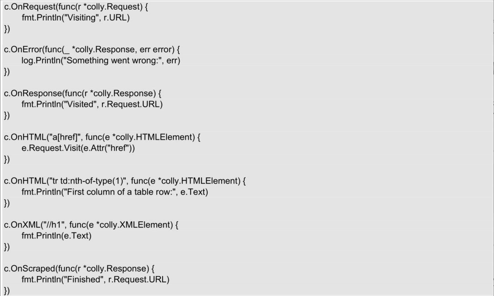
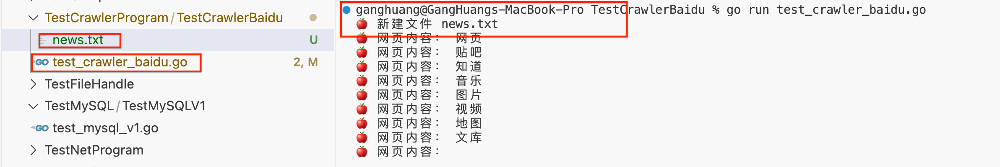
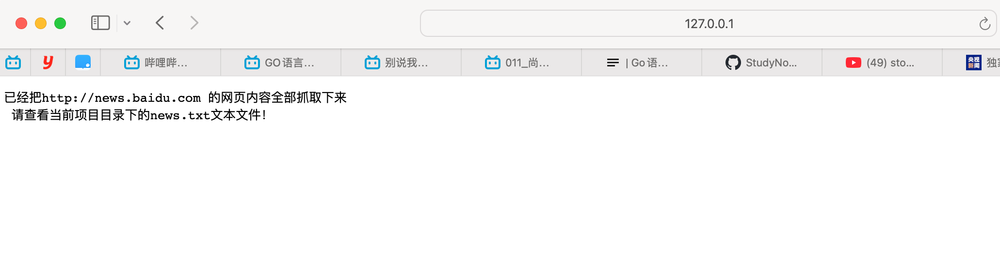
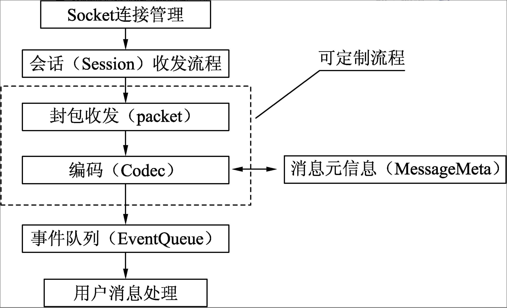

></h3>
- [**‌go-colly框架**](#go-colly框架)
	- [go-colly框架的特性](#go-colly框架的特性)
	- [go-colly框架使用](#go-colly框架使用)
	- [将抓取的网页内容存储在文件中](#将抓取的网页内容存储在文件中)
- [**‌gin框架**](#‌gin框架)
	- [把爬虫程序设置成Web服务](#把爬虫程序设置成Web服务)
- [**‌cellnet网络库**](#cellnet网络库)
- [**‌图表库——go-chart**](#图表库——go-chart)
- [**图表库go-echarts**](#图表库go-echarts)
- [**packr库处理模板引擎内的文件**](#packr库处理模板引擎内的文件)


<br/>

***
<br/><br/><br/>
> <h1 id="go-colly框架">go-colly框架</h1>

go-colly是使用Go语言实现的网络爬虫框架。go-colly以回调函数的形式提供了一组接口，通过这些接口能够实现任意类型的爬虫。开发者使用go-colly框架可以轻松地从Web页面中爬取结构化数据。

<br/>
**通过如下命令下载到项目中：**

```
cd cd /Users/ganghuang/HGFiles/GitHub/GoProject/MLC_GO
go get -u github.com/gocolly/colly/...
```


<br/><br/><br/>
> <h2 id="go-colly框架的特性">go-colly框架的特性</h2>
- **go-colly框架具有如下特性。**
	- 清晰的API。快速（单核>1k请求/s）​。
	- 管理每个域的请求延迟和最大并发性。
	- 自动cookie和会话处理。
	- 同步／异步／并行抓取。高速缓存。
	- 自动处理非Unicode的编码。
	- 支持Robots.txt定制Agent信息。
	- 定制抓取频次。


<br/><br/><br/>
> <h2 id="go-colly框架使用">go-colly框架使用</h2>

**导入框架**

```
import "github.com/gocolly/colly"
```

<br/>

&emsp; 使用go-colly框架的关键是创建Collector对象（即“收集器”​）​，该对象的作用是管理网络通信，并负责在收集任务运行时执行附加的回调函数。通过调用colly库中的NewCollector()函数，即可创建Collector对象。其语法格式如下。

```
colly.NewCollector()
```

<br/>




- **这些回调函数在收集任务运行时被有序调用，调用顺序如下。**
	- OnRequest()函数在请求发出前被调用。
	- OnError()函数在请求过程中发生错误时被调用。
	- OnResponse()函数在收到响应后被调用。
		- 如果响应消息的内容是HTML，则在OnResponse()函数执行完毕后调用OnHTML()函数。
		- 如果响应消息的内容是HTML或XML，则在OnHTML()函数执行完毕后调用OnXML()函数。
		- OnXML()函数执行完毕后调用OnScraped()函数。

<br/><br/>

运行程序后，程序根据http://news.baidu.com开始抓取页面结果。通过回调函数OnHTML()，能够分析页面中的新闻标题及其链接。代码如下:

```
package main

import (
	"fmt"

	"github.com/gocolly/colly"
)

func main() {
	// 根据http://news.baidu.com开始抓取页面结果
	testCrawlerBaidu()
}

/// 爬虫百度网页
func testCrawlerBaidu(){
	c := colly.NewCollector(
		// colly.AllowedDomains("news.baidu.com"),
		colly.UserAgent("Opera/9.80(Windows NT 6.1; U; zh-cn) Presto/2.9.168 Version/11.50"))
	// 发出请求时向 Collector 对象附加的回调函数
	c.OnRequest(func(r *colly.Request){
		// 设置请求头
		r.Headers.Set("Host", "baidu.com")
		r.Headers.Set("Connection", "keep-alive")
		r.Headers.Set("Accept", "*/*")
		r.Headers.Set("Origin", "")
		r.Headers.Set("Referer", "http://www.baidu.com")
		r.Headers.Set("Accept-Encoding", "gzip, deflate")
		r.Headers.Set("Accept-Language", "zh-CN, zh;q=0.9")
		fmt.Println("正在访问：", r.URL)
	})

	// 处理HTML中的文档标题
	c.OnHTML("title", func (e *colly.HTMLElement)  {
		fmt.Println("文档标题：", e.Text)
	})

	// 处理HTML中的文档内容
	c.OnHTML("body", func (e *colly.HTMLElement)  {
		e.ForEach(".hotnews a", func (i int, el *colly.HTMLElement)  {
			band := el.Attr("href")
			title := el.Text
			fmt.Printf("文档内容 %d: %s\n%s\n", i+1, title, band)
		})
	})

	// 获取收到的响应内容的数量
	c.OnResponse(func(r *colly.Response){
		fmt.Println("收到响应内容的数量： ", r.StatusCode)
	})
	
	// 限制 visit 的线程数， visit 可以同时运行多个
	c.Limit(&colly.LimitRule{
		Parallelism: 2,
	})

	c.Visit("http://news.baidu.com")
}
```

**Log:**

```
ganghuang@GangHuangs-MacBook-Pro TestCrawlerBaidu % go run test_crawler_baidu.go
正在访问： http://news.baidu.com
收到响应内容的数量：  200
文档标题： 百度新闻——海量中文资讯平台
文档内容 1: 习近平向全国各族人民致以新春祝福
https://content-static.cctvnews.cctv.com/snow-book/index.html?item_id=5200598709432592760&toc_style_id=feeds_default&track_id=34D9D8BD-D879-4708-BF3E-A8D868C6C660_759409923605&share_to=copy_url
文档内容 2: 习近平春节前夕赴辽宁看望慰问基层干部群众
https://news.cctv.com/2025/01/24/ARTI6hnAgPkfUOy7vO9AAjFB250124.shtml
文档内容 3: 总书记的关怀让我们感到幸福温暖
https://h.xinhuaxmt.com/vh512/share/12380734?newstype=1001&homeshow=1
文档内容 4: 转型升级 “智”造强企 传统钢企焕发青春
https://content-static.cctvnews.cctv.com/snow-book/index.html?item_id=16973667513549662031&toc_style_id=feeds_default&track_id=3C71E229-8F36-461A-8F0A-AAD40C7030ED_759408113589&share_to=copy_url
文档内容 5: 习近平辽宁行｜烟火气里年味浓——走进沈阳大东副食品商场
https://content-static.cctvnews.cctv.com/snow-book/index.html?item_id=1274157371348255293&toc_style_id=feeds_default&track_id=25D644CD-6C11-463A-921D-8BC0F1C6B019_759329323922&share_to=copy_url
文档内容 6: 向“新”发力 逐“质”而行
https://content-static.cctvnews.cctv.com/snow-book/index.html?item_id=16224630468348415654&toc_style_id=feeds_default&share_to=copy_url&track_id=24e45dbe-d36d-4e2a-82b5-1d3700f1f9a2
文档内容 7: 时政Vlog｜上联：年货置办中 下联：今日宜“大东” 横批：老香了
https://content-static.cctvnews.cctv.com/snow-book/index.html?item_id=95295998088496574&channelId=1119&toc_style_id=feeds_default&track_id=D9D2124E-0D13-4872-A820-380C0AF85403_759396097754&share_to=copy_url
文档内容 8: 延安苹果产业里的新质生产力（新春走基层）
https://www.peopleapp.com/column/30048094126-500006064834
文档内容 9: 新春走基层｜“隧道探险家”出海记
https://app.people.cn/h5/detail/normal/6157882818937856
文档内容 10: 大市场看中国年｜逛百年大集 寻乡愁记忆
https://www.cnr.cn/tj/tjtp/20250124/t20250124_527050755.shtml
```

<br/><br/>
> <h2 id="抓取指定连接的网页内容"> 抓取指定连接的网页内容 </h2>

控制台打印的抓取结果是爬虫程序通过限制域名、设置抓取深度、过滤URL后得到的。通过访问http://news.baidu.com发现该链接的网页内容很丰富，涉及方方面面的领域。那么，如何才能把http://news.baidu.com的网页内容全部抓取下来呢？代码如下。

```
// 访问指定网址
testCrawlerAppointWebpage("https://news.baidu.com")


/// 抓取指定连接的网页内容 urls: 指定链接
func testCrawlerAppointWebpage(urls string) {
	// 创建 Collector 对象
	c := colly.NewCollector()
	/* 
	* 是否抓取指定链接的网页内容
	* 初始设置为不抓取指定链接的网页内容
	 */
	visited := false
	// 使用 Collector 对象抓取 URL
	c.OnResponse(func (r *colly.Response)  {
		if !visited {
			visited = true
			r.Request.Visit("/get?q=2")
		}
	})

	// 对指定链接网页内容进行处理
	c.OnHTML("a[href]", func (e *colly.HTMLElement)  {
		href := e.Text	// 获取指定链接的网页内容
		fmt.Println("🍎 网页内容：",href)	// 打印指定链接的网页内容
	})
	c.Visit(urls)	//访问指定链接
}
```

**Log**

```
ganghuang@GangHuangs-MacBook-Pro TestCrawlerBaidu % go run test_crawler_baidu.go
🍎 网页内容： 网页
🍎 网页内容： 贴吧
🍎 网页内容： 知道
🍎 网页内容： 音乐
🍎 网页内容： 图片
🍎 网页内容： 视频
🍎 网页内容： 地图
🍎 网页内容： 文库
🍎 网页内容： 


🍎 网页内容： 帮助
🍎 网页内容： 首页
🍎 网页内容： 国内
🍎 网页内容： 国际
🍎 网页内容： 军事
🍎 网页内容： 财经
🍎 网页内容： 娱乐
🍎 网页内容： 体育
🍎 网页内容： 互联网
🍎 网页内容： 科技
🍎 网页内容： 游戏
🍎 网页内容： 女人
🍎 网页内容： 汽车
🍎 网页内容： 房产
🍎 网页内容： 首页
🍎 网页内容： 国内
🍎 网页内容： 国际
🍎 网页内容： 军事
🍎 网页内容： 财经
🍎 网页内容： 娱乐
🍎 网页内容： 体育
🍎 网页内容： 互联网
🍎 网页内容： 科技
🍎 网页内容： 游戏
🍎 网页内容： 女人
🍎 网页内容： 汽车
🍎 网页内容： 房产
🍎 网页内容： 


点击刷新，将会有未读推荐


🍎 网页内容： 热点要闻
🍎 网页内容： 
🍎 网页内容： 习近平向全国各族人民致以新春祝福
🍎 网页内容： 习近平春节前夕赴辽宁看望慰问基层干部群众
🍎 网页内容： 总书记的关怀让我们感到幸福温暖
🍎 网页内容： 转型升级 “智”造强企 传统钢企焕发青春
🍎 网页内容： 习近平辽宁行｜烟火气里年味浓——走进沈阳大东副食品商场
🍎 网页内容： 向“新”发力 逐“质”而行
🍎 网页内容： 时政Vlog｜上联：年货置办中 下联：今日宜“大东” 横批：老香了
🍎 网页内容： 延安苹果产业里的新质生产力（新春走基层）
🍎 网页内容： 新春走基层｜“隧道探险家”出海记
🍎 网页内容： 大市场看中国年｜逛百年大集 寻乡愁记忆
🍎 网页内容： 中经评论：1.4万亿斤！中国粮“藏”在哪？
🍎 网页内容： 共享中国发展机遇 美国企业持续看好中国市场
🍎 网页内容： 我在中国过大年｜当“非遗版”春节遇上非遗彝绣
🍎 网页内容： 香港点亮锦鲤醒狮彩灯迎新春
🍎 网页内容： 专题：京彩春节的N种打开方式
🍎 网页内容： 今日辟谣
🍎 网页内容： 北京网站辟谣平台
🍎 网页内容： 互联网联合辟谣平台
🍎 网页内容： 多地“禁改限”明确春节可燃放烟花爆竹
🍎 网页内容： 暴雪、寒潮、大雾三预警齐发！多地高速封闭，列车停运
🍎 网页内容： 传统习俗迎春节 来看这些地方的浓浓年味
🍎 网页内容： 铁路桥隧工孩子年前坐火车“看爸爸” 父亲在崖壁喊到飙泪
🍎 网页内容： 国家药监局药审中心回应个别品种数据重复：编辑错误导致
🍎 网页内容： 美国总统特朗普称将再次和朝鲜领导人取得联系
🍎 网页内容： 

点击刷新，将会有未读推荐

🍎 网页内容： 更多个性推荐新闻
🍎 网页内容： 


🍎 网页内容： 


🍎 网页内容： 
🍎 网页内容： 8
🍎 网页内容： 7
🍎 网页内容： 6
🍎 网页内容： 5
🍎 网页内容： 4
🍎 网页内容： 3
🍎 网页内容： 2
🍎 网页内容： 1
🍎 网页内容： 
🍎 网页内容： 
🍎 网页内容： 年的味道
🍎 网页内容： 飞天逐梦探苍穹
🍎 网页内容： 今冬以来最强雨雪来袭
🍎 网页内容： 午睡可以修复全身多个器官
🍎 网页内容： 老君山景区紧急闭园
🍎 网页内容： 医生说这6种病是衰老的表现
🍎 网页内容： 监控拍下火箭残骸掉落瞬间
🍎 网页内容： 河里钓起整箱现金?谣言
🍎 网页内容： 第一批外国网友已到中国“赶春运”
🍎 网页内容： 美拨款25亿美元应对洛杉矶山火
🍎 网页内容： 
🍎 网页内容： 
🍎 网页内容： 
🍎 网页内容： 辟谣
🍎 网页内容： 举报
🍎 网页内容： 二维码
🍎 网页内容： 收藏本站
🍎 网页内容： 搜索
🍎 网页内容： 用户反馈
🍎 网页内容： 
🍎 网页内容： Android版下载
🍎 网页内容： iPhone版下载
🍎 网页内容： 用户协议
🍎 网页内容： 隐私策略
🍎 网页内容： 企业推广
🍎 网页内容： 投诉中心
🍎 网页内容： 营业执照
🍎 网页内容： 《互联网新闻信息服务许可》编号：11220180008
🍎 网页内容： 《互联网宗教信息服务许可证》编号：京（2022）0000043
🍎 网页内容： 使用百度前必读
🍎 网页内容： 

🍎 网页内容： 

🍎 网页内容： 
```


<br/><br/>
> <h2 id="将抓取的网页内容存储在文件中">将抓取的网页内容存储在文件中</h2>

通过19.4节的操作已经把http://news.baidu.com的网页内容全部抓取下来，并把这些内容打印在控制台上。但是，如何才能把抓取下来的网页内容存储在文件中呢？代码如下。

```
// 存储爬虫文件
func testCrawlerAppointWebpageAndSaveTxt(urls string) {
	// 创建 Collector 对象
	c := colly.NewCollector()
	/* 
	* 是否抓取指定链接的网页内容
	* 初始设置为不抓取指定链接的网页内容
	 */
	visited := false
	// 使用 Collector 对象抓取 URL
	c.OnResponse(func (r *colly.Response)  {
		if !visited {
			visited = true
			r.Request.Visit("/get?q=2")
		}
	})

	// 文件的创建和持续写入
	filename := "news.txt"	// 文件名
	var f *os.File
	var fileErr error 
	if testCheckFileExist(filename) {	// 如果文件存在
		f, fileErr = os.OpenFile(filename, os.O_APPEND | os.O_WRONLY, 0666)	// 打开文件
		if fileErr != nil {
			fmt.Printf("❌ 打开文件 news.txt 失败：%v\n", fileErr)
		}
	} else {
		f,_ = os.Create(filename)	// 创建文件
		fmt.Println("🍎 新建文件 news.txt")

	}
	defer f.Close()	// 关闭文件
	write := bufio.NewWriter(f)
	defer write.Flush()

	// 对指定链接网页内容进行处理
	c.OnHTML("a[href]", func (e *colly.HTMLElement)  {
		href := e.Text	// 获取指定链接的网页内容
		write.WriteString("🍒 "+href+"\n")
		fmt.Println("🍎 网页内容：",href)	// 打印指定链接的网页内容
	})


	c.Visit(urls)	//访问指定链接
}
/* 检测文件是否存在
* fileName 文件名
 */
func testCheckFileExist(filename string) bool {
	var exist = true
	if _, err := os.Stat(filename); os.IsNotExist(err) {
		exist = false
	}
	return exist
}
```

效果图：



<br/>

***
<br/><br/><br/>
> <h1 id="‌gin框架">‌gin框架</h1>

获取gin框架的包：

```
go get github.com/gin-gonic/gin
```

<br/><br/><br/>
> <h2 id="把爬虫程序设置成Web服务">把爬虫程序设置成Web服务</h2>

把爬虫程序设置成Web服务。具体修改如下：运行修改后的爬虫程序，打开浏览器，访问“本机IP：端口”​；当在网页上看到提示信息（​“已经把http://news.baidu.com的网页内容全部抓取下来，请查看当前项目目录下的news.txt文件！”​）时，说明已经把http://news.baidu.com的网页内容全部抓取下来，并存储在当前项目目录下的news.txt文件中。

为了满足上述的修改要求，需要下载第三方包gin。如图19.8所示，下载gin包的步骤如下。

```
// 把爬虫程序设置成Web服务
func testCrawlerAppointWebpageAndSaveTxtV2() {
	// 初始化引擎
	engine := gin.Default()
	// 注册一个路由和处理函数
	engine.Any("/", WebRoot)
	// 绑定端口
	engine.Run(":9200")
}
// 处理路由函数
func WebRoot(context *gin.Context){
	// 调用 testCrawlerAppointWebpageAndSaveTxt()函数
	testCrawlerAppointWebpageAndSaveTxt("https://news.baidu.com")
	// 设置网页上的文本内容
	context.String(http.StatusOK, "已经把http://news.baidu.com 的网页内容全部抓取下来\n 请查看当前项目目录下的news.txt文本文件！")
}

// 存储爬虫文件
func testCrawlerAppointWebpageAndSaveTxt(urls string) {
	// 创建 Collector 对象
	c := colly.NewCollector()
	/* 
	* 是否抓取指定链接的网页内容
	* 初始设置为不抓取指定链接的网页内容
	 */
	visited := false
	// 使用 Collector 对象抓取 URL
	c.OnResponse(func (r *colly.Response)  {
		if !visited {
			visited = true
			r.Request.Visit("/get?q=2")
		}
	})

	// 文件的创建和持续写入
	filename := "news.txt"	// 文件名
	var f *os.File
	var fileErr error 
	if testCheckFileExist(filename) {	// 如果文件存在
		f, fileErr = os.OpenFile(filename, os.O_APPEND | os.O_WRONLY, 0666)	// 打开文件
		if fileErr != nil {
			fmt.Printf("❌ 打开文件 news.txt 失败：%v\n", fileErr)
		}
	} else {
		f,_ = os.Create(filename)	// 创建文件
		fmt.Println("🍎 新建文件 news.txt")

	}
	defer f.Close()	// 关闭文件
	write := bufio.NewWriter(f)
	defer write.Flush()

	// 对指定链接网页内容进行处理
	c.OnHTML("a[href]", func (e *colly.HTMLElement)  {
		href := e.Text	// 获取指定链接的网页内容
		write.WriteString("🍒 "+href+"\n")
		fmt.Println("🍎 网页内容：",href)	// 打印指定链接的网页内容
	})


	c.Visit(urls)	//访问指定链接
}
/* 检测文件是否存在
* fileName 文件名
 */
func testCheckFileExist(filename string) bool {
	var exist = true
	if _, err := os.Stat(filename); os.IsNotExist(err) {
		exist = false
	}
	return exist
}
```

**Log:**

```
ganghuang@GangHuangs-MacBook-Pro TestCrawlerBaidu % go run test_crawler_baidu.go
ganghuang@GangHuangs-MacBook-Pro TestCrawlerBaidu % go run test_crawler_baidu.go
[GIN-debug] [WARNING] Creating an Engine instance with the Logger and Recovery middleware already attached.

[GIN-debug] [WARNING] Running in "debug" mode. Switch to "release" mode in production.
 - using env:   export GIN_MODE=release
 - using code:  gin.SetMode(gin.ReleaseMode)

[GIN-debug] GET    /                         --> main.WebRoot (3 handlers)
[GIN-debug] POST   /                         --> main.WebRoot (3 handlers)
[GIN-debug] PUT    /                         --> main.WebRoot (3 handlers)
[GIN-debug] PATCH  /                         --> main.WebRoot (3 handlers)
[GIN-debug] HEAD   /                         --> main.WebRoot (3 handlers)
[GIN-debug] OPTIONS /                         --> main.WebRoot (3 handlers)
[GIN-debug] DELETE /                         --> main.WebRoot (3 handlers)
[GIN-debug] CONNECT /                         --> main.WebRoot (3 handlers)
[GIN-debug] TRACE  /                         --> main.WebRoot (3 handlers)
[GIN-debug] [WARNING] You trusted all proxies, this is NOT safe. We recommend you to set a value.
Please check https://pkg.go.dev/github.com/gin-gonic/gin#readme-don-t-trust-all-proxies for details.
[GIN-debug] Listening and serving HTTP on :9200
```

<br/>

此时，Mac系统弹出如图19.9所示的Mac安全警报。选中“公用网络”复选框，单击“允许访问”按钮。

打开默认浏览器（比如：Safari浏览器），访问“本机IP：端口”​（即127.0.0.1:9200）​，即可看到如图19.10所示的提示信息。这段程序在当前项目目录下生成news.txt文件。单击news.txt，即可看到抓取的网页内容，如图所示。



<br/>

***
<br/><br/><br/>
> <h1 id="cellnet网络库">cellnet网络库</h1>

cellnet的设计理念是：高性能、简单、方便、开箱即用，希望开发者能使用cellnet迅速开展业务开发，而无须为底层性能调优及架构扩展而担忧。

[cellnet网络库](https://github.com/davyxu/cellnet)多个版本的迭代，无论是作为初学者学习的范例，还是作为私用、商用项目的基础构建乃至核心技术层已经在业内广受了解及使用。

- **主要使用领域：**
	- 游戏服务器
	- 方便定制私有协议，快速构建逻辑服务器、网关服务器、服务器间互联互通、对接第三方SDK、转换编码协议等
	- ARM设备
	- 设备间网络通讯
	- 证券软件
	- 内部RPC

<br/><br/><br/>
> <h2 id="cellnet网络库的流程及架构">cellnet网络库的流程及架构</h2>

- cellnet的主要处理流程和组件由下面几个部分组成。
	- Socket连接管理：cellnet网络库使用连接器和接受器(Connector、Acceptor)管理Socket连接。
	- 会话(Session)：客户端和服务器连接使用会话(Session)处理收发包流程。收发包的流程将事件通过事件回调(cellnet.EventFunc)派发。
	-  包处理(packet)：cellnet中的packet包处理会话收发流程派发的事件，实现变长封包的解析、处理和收发。
	-  编码器：用户的封包使用编码器(Codec)负责原始封包的字节数组和用户消息间的转换。
	-  消息队列：可以将收到的消息按顺序排队并提供给用户进行处理。
	-  消息元信息(MessageMeta)：为所有的系统提供静态的消息扩展信息，如消息的ID、编码器、创建方法等。



<br/>

***
<br/><br/><br/>
> <h1 id="图表库——go-chart">图表库——go-chart</h1>

市面上有诸多的开源图表库，比如百度开源的ECharts、阿里开源的BizCharts、Chart.js、HighCharts、G2、D3、Google出品的Google Charts等，这些开源的库在兼容性、拓展性、支持图表的种类、交互等层面各有优缺点，具体的选择要结合具体的情况（比如开发者选择的技术栈、需要支持的图表种类等各方面）​。


参照之前的思想，本节将基于chart.js构建一个完整的图表库go-chart，支持折线图、柱状图、饼图、雷达图、散点图、气泡图等。

[完整代码地址](https://github.com/goecharts/go-chart)


<br/>

***
<br/><br/><br/>
># <h1 id="图表库go-echarts">[图表库go-echarts](https://github.com/go-echarts/go-echarts)</h1>

基于ECharts图表库逐步讲解如何构建图表，整体的核心思想是：

- 明确ECharts如何构建图表。
- 延伸到使用模板引擎加载动态数据的方式构建图表。
- 抽取公共的结构体，方便组合复用。
- 各图表类型对象实现定义的接口(Interface)。

当然，还有很多细节没有涉及，但是整体思想皆是如此，如果想基于ECharts构建更为丰富的图表类型，那么可以查看[go-echarts](https://github.com/go-echarts/go-echarts)，其中采用的思维方式是类似的，而实现的功能更加完善。


<br/>

***
<br/><br/><br/>
> <h1 id="packr库处理模板引擎内的文件">packr库处理模板引擎内的文件</h1>

packr库能够比较优雅地处理模板引擎内的文件。

**下载命令如下：**

```
go get -u github.com/gobuffalo/packr
```


