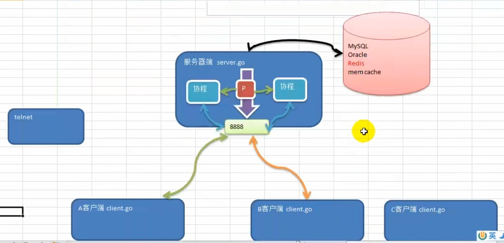
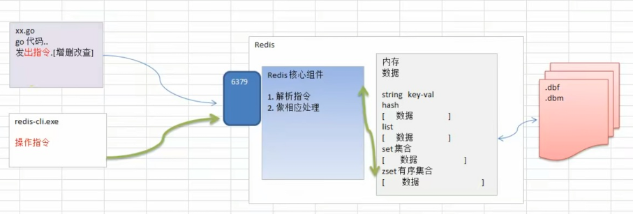

></h2>
- [**依赖包安装**](依赖包安装)
	- [依赖安装命令](#依赖安装命令)
- [**动手实现一个库**](#动手实现一个库)
	- [TravisCI](#TravisCI) 
	- [GitHub Actions](#GitHubActions) 
	- [DaoCloud](#DaoCloud)
- [**gRPC框架**](#gRPC框架)
- [**‌CLI（命令行界面）Cobra库**](#CLI（命令行界面）Cobra库)
- [**优雅重启服务库endless**](#优雅重启服务库endless)
- [**‌go-colly框架**](#go-colly框架)
	- [go-colly框架的特性](#go-colly框架的特性)
	- [go-colly框架使用](#go-colly框架使用)
	- [将抓取的网页内容存储在文件中](#将抓取的网页内容存储在文件中)
- [读写配置文件库viper](#读写配置文件库viper)
- [**`RESTful API设计模式`**](#RESTfulAPI设计模式)
	- [**‌`net/http`库**](#`net/http`库)
	- [**‌gin框架**](#‌gin框架)
	- [**‌cellnet网络库**](#cellnet网络库)
- [**‌认证和授权JWT**](#‌认证和授权JWT)
	- [JWT介绍](#JWT介绍)  
	- [`jwt-go`库](#`jwt-go`库)
	- [JWT认证中间件](#JWT认证中间件)
- [**数据验证库**](#数据验证库)
	- [`beego/validation框架`](#beego/validation框架)
		- [数据验证validation](#数据验证validation)
	- [`govalidator库`数据验证](#govalidator库数据验证)
- [**‌图表库——go-chart**](#图表库——go-chart)
- [**图表库go-echarts**](#图表库go-echarts)
- [**packr库处理模板引擎内的文件**](#packr库处理模板引擎内的文件)
- [**‌GJSON解析JSON数据**](#GJSON解析JSON数据)
- [**IrisWeb框架**](#IrisWeb框架)
	- [IrisWeb框架详解](#IrisWeb框架详解) 
	- [快速入门](#快速入门) 
	- [中间件](#中间件) 
	- [MVC模式](#MVC模式) 
	- [解析JSON请求](#解析JSON请求) 
	- [集成GORM](#集成GORM) 
	- [部署](#部署)
- [**数据库框架**](#数据库框架)
	- [Redis](#Redis)
	- [GORM和XORM详介](#GORM和XORM详介)
	- [Gorm框架](#Gorm框架)
	- [XORM使用](#XORM使用)
		- [XORM定义模型](#XORM定义模型) 
		- [XORM初始化数据库](#XORM初始化数据库) 
		- [XORM插入数据](#XORM插入数据) 
		- [XORM查询数据](#XORM查询数据)
			- [项目实践1-JOIN(select)](#项目实践1-JOIN(select))
			-  [项目实践2-where(select)](#项目实践2-where(select))
		- [XORM更新数据](#XORM更新数据) 
		- [XORM删除数据](#XORM删除数据)
	- [主要区别](#主要区别)
		- [什么时候选用？](#什么时候选用？)
	- [model序列化和继承](#model序列化和继承)
	- [Cron框架](#Cron框架)
- [**安全**](#安全)
	- [crypto库](#crypto库)
		- [crypto哈希](#crypto哈希)


<br/><br/><br/>

***
<br/>

> <h1 id="依赖包安装">依赖包安装</h1>

```sh
$ mkdir go-gin-example && cd go-gin-example

$ go env -w GO111MODULE=on

$ go env -w GOPROXY=https://goproxy.cn,direct

$ go mod init github.com/EDDYCJY/go-gin-example
go: creating new go.mod: module github.com/EDDYCJY/go-gin-example

$ ls
go.mod
```

- mkdir xxx && cd xxx：创建并切换到项目目录里去。
- go env -w GO111MODULE=on：打开 Go modules 开关（目前在 Go1.13 中默认值为 auto）。
- go env -w GOPROXY=...：设置 GOPROXY 代理，这里主要涉及到两个值，第一个是 https://goproxy.cn，它是由七牛云背书的一个强大稳定的 Go 模块代理，可以有效地解决你的外网问题；第二个是 direct，它是一个特殊的 fallback 选项，它的作用是用于指示 Go 在拉取模块时遇到错误会回源到模块版本的源地址去抓取（比如 GitHub 等）。
- go mod init [MODULE_PATH]：初始化 Go modules，它将会生成 go.mod 文件，需要注意的是 MODULE_PATH 填写的是模块引入路径，你可以根据自己的情况修改路径。

在执行了上述步骤后，初始化工作已完成，我们打开 go.mod 文件看看，如下：

```shell
module github.com/EDDYCJY/go-gin-example

go 1.13
```
默认的 go.mod 文件里主要是两块内容，一个是当前的模块路径和预期的 Go 语言版本。

<br/><br/><br/>
> <h2 id="依赖安装命令"> 依赖安装命令 </h2>

- **基础使用:**
	- (用 `go get` 拉取新的依赖)
		- 拉取最新的版本(优先择取 tag)：`go get golang.org/x/text@latest`
		- 拉取 master 分支的最新 commit：`go get golang.org/x/text@master`
		- 拉取 tag 为 v0.3.2 的 commit：`go get golang.org/x/text@v0.3.2`
		- 拉取 hash 为 342b231 的 commit，最终会被转换为 v0.3.2：`go get golang.org/x/text@342b2e`
		- 用 `go get -u` 更新现有的依赖
		- 用 `go mod download` 下载 go.mod 文件中指明的所有依赖
		- 用 `go mod tidy` 这个命令会清理 go.mod 并自动添加缺少的依赖。
		- 用 `go mod graph` 查看现有的依赖结构
		- 用 `go mod init` 生成 go.mod 文件 (Go 1.13 中唯一一个可以生成 go.mod 文件的子命令)
	- 用 `go mod edit` 编辑 go.mod 文件
	- 用 `go mod vendor` 导出现有的所有依赖 (事实上 Go modules 正在淡化 Vendor 的概念)
	- 用 `go mod verify` 校验一个模块是否被篡改过


<br/><br/>
><h3  id="go.sum文件">go.sum文件</h3>
- **go.sum** 文件详细罗列了当前项目直接或间接依赖的所有模块版本，并写明了那些模块版本的 SHA-256 哈希值以备 Go 在今后的操作中保证项目所依赖的那些模块版本不会被篡改。

<br/><br/>
><h3  id="go.mod文件">go.mod文件</h3>
go.mod 文件是启用了 Go modules 的项目所必须的最重要的文件，因为它描述了当前项目（也就是当前模块）的元信息，每一行都以一个动词开头，目前有以下 5 个动词:

- module：用于定义当前项目的模块路径。
- go：用于设置预期的 Go 版本。
- require：用于设置一个特定的模块版本。
- exclude：用于从使用中排除一个特定的模块版本。
- replace：用于将一个模块版本替换为另外一个模块版本。

你可能还会疑惑 indirect 是什么东西，indirect 的意思是传递依赖，也就是非直接依赖。


<br/><br/><br/>

***
<br/>

> <h1 id="动手实现一个库">动手实现一个库</h1>
- **Golang 源代码持续集成工具的用途和功能**

<br/>

- 这些工具主要用于**持续集成（CI）和持续交付/部署（CD）**，在开发过程中自动化以下任务：

	- **自动化构建**：检测代码更改后，自动编译和构建代码。
	- **自动化测试**：运行单元测试、集成测试，确保代码质量。
	- **代码质量检查**：执行代码静态分析（如 lint）以检测潜在问题。
	- **自动化部署**：在代码通过验证后，将其部署到生产或其他环境。
	- **团队协作**：在代码合并或提交后，快速获得构建和测试结果，提升开发效率。

<br/>

以下是 **TravisCI**、**GitHub Actions** 和 **DaoCloud** 的具体介绍和用途。

- **工具对比总结**

| 工具         | 特点                                      | 适用场景                          | 优势                          |
|--------------|------------------------------------------|-----------------------------------|-------------------------------|
| **TravisCI** | 经典 CI 服务，轻量级，开源项目友好         | 小型或中型项目的持续集成          | 配置简单，文档丰富            |
| **GitHub Actions** | 深度集成 GitHub，功能强大且灵活          | GitHub 托管的项目持续集成          | 社区资源丰富，强大的触发机制   |
| **DaoCloud** | 国内服务，支持容器化、云原生               | 国内项目，依赖 Docker 或 Kubernetes | 图形化界面，国内服务稳定       |

根据你的项目托管平台、需求和团队协作方式选择合适的工具：  
- **开源项目**：推荐 TravisCI 或 GitHub Actions。
- **国内私有项目**：推荐 DaoCloud。


<br/><br/><br/>
> <h2 id="TravisCI">TravisCI</h2>

- **用途**

TravisCI 是一款流行的持续集成服务，支持多个编程语言，包括 Go。主要用于 GitHub 仓库的持续集成。它会在代码推送或提交 Pull Request 时触发自动化流程。

<br/>

- **功能**
	- 自动化构建和测试。
	- 支持多种操作系统（Linux、macOS、Windows）。
	- 集成 Docker 支持复杂的构建环境。
	- 与 GitHub 深度集成，可在 PR 中显示测试状态。

<br/>

- **使用示例**
在项目中添加 `.travis.yml` 文件：

```yaml
language: go
go:
  - 1.19 # 指定 Go 版本
script:
  - go build -v ./...  # 编译项目
  - go test -v ./...   # 运行测试
```

<br/>

**用途场景**：
- 快速设置和运行持续集成。
- 检测 Go 项目中代码的构建和测试状态。


<br/><br/><br/>
> <h2 id="GitHubActions">GitHub Actions</h2>

- **用途**

GitHub Actions 是 GitHub 自带的 CI/CD 工具，专门为 GitHub 仓库设计。通过定义 **workflow** 文件，你可以自动化项目的整个开发周期，包括构建、测试、部署等。

<br/>
- **功能**
	- 使用 YAML 文件定义构建流程（`.github/workflows/*.yml`）。
	- 丰富的社区 Actions（复用其他开发者的任务模板）。
	- 支持事件触发（如 Push、PR 或 Schedule 定时任务）。
	- 提供多平台支持（Linux、Windows、macOS）。

<br/>

- **使用示例**

在项目中添加 `.github/workflows/ci.yml` 文件：

```yaml
name: Go CI
on:
  push:
    branches:
      - main
  pull_request:
    branches:
      - main
jobs:
  build:
    runs-on: ubuntu-latest
    steps:
      - uses: actions/checkout@v3
      - name: Set up Go
        uses: actions/setup-go@v4
        with:
          go-version: 1.19
      - name: Install dependencies
        run: go mod tidy
      - name: Build
        run: go build ./...
      - name: Test
        run: go test ./...
```

<br/>

- **用途场景**：
	- **开源项目**：适合 GitHub 托管的开源项目，社区用户可以快速贡献。
	- **团队协作**：在代码合并前确保代码质量。

<br/><br/><br/>
> <h2 id="DaoCloud">DaoCloud</h2>

- **用途**
DaoCloud 是中国开发者常用的一体化云原生工具平台，支持 CI/CD、容器化部署、DevOps 管理等功能。特别适合中国的开发者和企业使用。

<br/>

- **功能**
	- 图形化界面，操作简单易用。
	- 支持从源码构建、测试到 Docker 镜像生成的全流程。
	- 与国内代码托管平台（如 Gitee）深度集成。
	- 提供更快的国内镜像加速服务。

<br/>

- **使用示例**

通过图形化界面完成以下配置：
	1. 选择代码源（如 GitHub 或 Gitee）。
	2. 添加构建任务，例如运行以下命令：

```bash
go build ./...
go test ./...
docker build -t myapp .
```

3. 配置自动化部署到 Kubernetes 集群或其他环境。

- **用途场景**：
	- 国内项目的持续集成和交付。
	- 快速实现 CI/CD 和容器化交付。

<br/><br/><br/>

***
<br/>
># <h1 id="gRPC框架">[gRPC框架](./高性能gRPC框架.md)</h1>

RPC（远程过程调用）和 gRPC（基于 RPC 的现代框架）是两种用于 **内部 API 通信** 的方式，虽然它们有很多相似之处，但也有一些关键区别。  

---

## **1. RPC 作为内部 API 通信**
RPC（Remote Procedure Call，远程过程调用）是一种 **分布式计算通信方式**，允许一个程序调用远程服务器上的方法，就像调用本地方法一样。RPC 主要特点：
- **同步调用**，调用方等待远程方法执行完成后返回结果。
- **二进制或文本格式传输**，比如 JSON-RPC、XML-RPC、Thrift、gRPC、自定义 TCP 协议等。
- **需要序列化/反序列化数据**，不同 RPC 实现方式会使用不同的数据格式。

### **常见的 RPC 实现**
| **RPC 框架** | **传输协议** | **数据格式** | **适用场景** |
|-------------|------------|------------|--------------|
| JSON-RPC    | HTTP/TCP   | JSON       | 轻量级、简单系统 |
| XML-RPC     | HTTP       | XML        | 旧系统兼容 |
| Thrift      | TCP/HTTP   | 二进制/JSON | 高效跨语言 RPC |
| gRPC        | HTTP/2     | Protocol Buffers（protobuf） | 高性能、现代微服务 |

---

## **2. gRPC 作为内部通信**
gRPC 是 Google 开源的 **高性能 RPC 框架**，与传统 RPC 相比，它具有以下特点：
### ✅ **基于 HTTP/2**
- 多路复用，减少连接数，提高吞吐量。
- 头部压缩（HPACK），降低带宽消耗。

### ✅ **使用 Protocol Buffers（protobuf）作为数据格式**
- 高效的二进制序列化，减少带宽占用，解析速度比 JSON/XML 更快。
- 代码自动生成，减少手写 API 解析代码。

### ✅ **支持流式通信**
- **普通 RPC**：请求 → 响应（单次交互）。
- **服务器流式 RPC**：客户端请求，服务器持续返回数据（适合日志流、视频流）。
- **客户端流式 RPC**：客户端连续发送数据，服务器一次性响应（适合上传大文件）。
- **双向流式 RPC**：客户端和服务器都可以持续发送数据（适合实时聊天、语音通话）。

### ✅ **多语言支持**
- gRPC 官方支持 Golang、Python、Java、C++、Node.js 等。

---

## **3. RPC vs gRPC 区别**
| **对比项**       | **传统 RPC（JSON-RPC、Thrift）** | **gRPC** |
|-----------------|---------------------------------|---------|
| **通信协议**    | HTTP/TCP                        | **HTTP/2** |
| **数据格式**    | JSON/XML/Thrift 二进制         | **protobuf（二进制）** |
| **序列化速度**  | JSON/XML 较慢                   | **protobuf 更快** |
| **语言支持**    | 取决于框架，如 JSON-RPC 只支持部分语言 | **多语言支持（Go、Python、C++等）** |
| **流式支持**    | 仅支持请求-响应                 | **支持流式通信（单向/双向）** |
| **性能**        | 解析 JSON 较慢，占用带宽较大     | **二进制格式，解析快，低带宽占用** |
| **生态**        | 取决于具体 RPC 框架              | **Google 支持，社区活跃** |

---

## **4. 选择 RPC 还是 gRPC？**
### **什么时候用传统 RPC（如 JSON-RPC、Thrift）？**
✅ **适用于：**
- **轻量级项目**（不需要高性能通信，简单 HTTP JSON API 足够）
- **已有 JSON/XML API**（与前端交互，前端不支持 protobuf）
- **不支持 HTTP/2** 的环境（如老旧服务器）

❌ **不适用于：**
- 高吞吐、低延迟场景（JSON 解析慢，HTTP/1.1 开销大）
- 大规模微服务架构（协议设计较老，缺少流式支持）

---

### **什么时候用 gRPC？**
✅ **适用于：**
- **微服务架构**（跨语言、跨团队开发，自动生成代码）
- **高性能、低延迟通信**（protobuf 解析速度快，减少 CPU 占用）
- **需要流式通信**（如日志推送、WebSocket 替代方案）
- **Kubernetes、Service Mesh（Istio）等云原生环境**

❌ **不适用于：**
- 需要在浏览器直接访问（gRPC-Web 需要额外代理，如 Envoy）
- 需要兼容 RESTful API（JSON 友好）


<br/><br/><br/>

***
<br/>

> <h1 id="CLI（命令行界面）Cobra库">CLI（命令行界面）Cobra库</h1>
Cobra 是一个用于构建强大 CLI（命令行界面）

**Cobra 是什么？**
**Cobra** 是一个用于构建强大 CLI（命令行界面）应用的 Go 语言库。它可以帮助你**组织命令行程序的结构**，并且**支持子命令、自动生成帮助文档、flag（标志）、命令补全等功能**。

Cobra 由 **spf13**（Go 生态中著名的开发者）开发，广泛用于 Kubernetes、Hugo、Docker 等知名项目的 CLI 组件。

---

**为什么使用 Cobra？**
在 Go 中，我们可以用 `flag` 包来解析命令行参数，但如果程序有多个子命令（如 `git clone`、`git push`），使用 `flag` 会让代码变得复杂且难以维护。**Cobra 提供了一种优雅的方式来组织 CLI 结构**。

- **Cobra 的核心功能**
	- ✅ **支持嵌套子命令**（如 `kubectl get pods`）  
	- ✅ **自动生成 CLI 帮助文档**（`myapp help`）  
	- ✅ **支持 flag（标志）管理**（`myapp run --port=8080`）  
	- ✅ **支持 Bash/Zsh/Fish 终端自动补全**  
	- ✅ **与 Viper 库兼容，可用于解析配置文件**  

---

- **如何安装 Cobra**
在你的 Go 项目中执行：

```sh
go get -u github.com/spf13/cobra@latest
go get -u github.com/spf13/cobra/cobra@latest
```

如果想要用 Cobra 生成项目骨架：

```sh
go install github.com/spf13/cobra-cli@latest
```

然后使用：

```sh
cobra-cli init myapp
cd myapp
cobra-cli add server  # 添加一个子命令
cobra-cli add client
```
这会在 `cmd/` 目录下生成 `server.go` 和 `client.go`。

---

- **Cobra 代码示例**
	- **1. 创建 CLI 入口**
在 `main.go` 里：

```go
package main

import (
	"fmt"
	"os"
	"github.com/spf13/cobra"
)

func main() {
	var rootCmd = &cobra.Command{
		Use:   "myapp",
		Short: "MyApp 是一个示例 CLI",
		Run: func(cmd *cobra.Command, args []string) {
			fmt.Println("Hello from MyApp!")
		},
	}

	if err := rootCmd.Execute(); err != nil {
		fmt.Println(err)
		os.Exit(1)
	}
}
```
运行：

```sh
go run main.go
```
输出：

```sh
Hello from MyApp!
```

---

- **2. 添加子命令**
我们创建 `cmd/server.go` 作为 `server` 子命令：

```go
package cmd

import (
	"fmt"
	"github.com/spf13/cobra"
)

// 创建 server 命令
var serverCmd = &cobra.Command{
	Use:   "server",
	Short: "启动服务器",
	Run: func(cmd *cobra.Command, args []string) {
		fmt.Println("服务器启动中...")
	},
}

// 初始化并注册命令
func init() {
	rootCmd.AddCommand(serverCmd)
}
```

在 `main.go` 里引入：

```go
package main

import (
	"myapp/cmd"
)

func main() {
	cmd.Execute()
}
```
运行：

```sh
go run main.go server
```
输出：

```sh
服务器启动中...
```

---

## **总结**
Cobra 让 CLI 代码更加清晰、模块化，并且支持：
- **子命令管理**
- **自动补全**
- **Flag（选项参数）**
- **自动生成帮助文档**

**适用于：**
- `kubectl`、`docker`、`git` 这种**多子命令工具**
- **微服务项目的命令行管理工具**
- **任务脚本 & 自动化工具**

在你的项目中使用 Cobra，可以把 `cmd`（命令行处理）和 `server`（服务逻辑）解耦，保持代码结构清晰，方便扩展 🚀。

<br/><br/><br/>

***
<br/>

> <h1 id="优雅重启服务库endless">优雅重启服务库endless</h1>

在终端运行时其实启动了一个进程，下面是进程命令：

| **命令** | **信号** | **含义** |
|:--|:--|:--|
| Ctrl + c | SIGINT | 强制进程结束 |
| ctrl + z | SIGTSTP | 任务中断，进程挂起 |
| ctrl + \ | SIGQUIT | 进程结束 和 dump core |
| ctrl + d |  | EOF |
|  | SIGHUP	 | 终止收到该信号的进程。若程序中没有捕捉该信号，当收到该信号时，进程就会退出（常用于 重启、重新加载进程 |
|  |  |  |
|  |  |  |

因此在我们执行ctrl + c关闭gin服务端时，会强制进程结束，导致正在访问的用户等出现问题

常见的 kill -9 pid 会发送 SIGKILL 信号给进程，也是类似的结果

<br/><br/>

**信号**
本段中反复出现信号是什么呢？

信号是 Unix 、类 Unix 以及其他 POSIX 兼容的操作系统中进程间通讯的一种有限制的方式

它是一种异步的通知机制，用来提醒进程一个事件（硬件异常、程序执行异常、外部发出信号）已经发生。当一个信号发送给一个进程，操作系统中断了进程正常的控制流程。此时，任何非原子操作都将被中断。如果进程定义了信号的处理函数，那么它将被执行，否则就执行默认的处理函数

**所有信号**

```sh
% kill -l

kill -l
 1) SIGHUP   2) SIGINT   3) SIGQUIT  4) SIGILL   5) SIGTRAP
 6) SIGABRT  7) SIGBUS   8) SIGFPE   9) SIGKILL 10) SIGUSR1
11) SIGSEGV 12) SIGUSR2 13) SIGPIPE 14) SIGALRM 15) SIGTERM
16) SIGSTKFLT   17) SIGCHLD 18) SIGCONT 19) SIGSTOP 20) SIGTSTP
21) SIGTTIN 22) SIGTTOU 23) SIGURG  24) SIGXCPU 25) SIGXFSZ
26) SIGVTALRM   27) SIGPROF 28) SIGWINCH    29) SIGIO   30) SIGPWR
31) SIGSYS  34) SIGRTMIN    35) SIGRTMIN+1  36) SIGRTMIN+2  37) SIGRTMIN+3
38) SIGRTMIN+4  39) SIGRTMIN+5  40) SIGRTMIN+6  41) SIGRTMIN+7  42) SIGRTMIN+8
43) SIGRTMIN+9  44) SIGRTMIN+10 45) SIGRTMIN+11 46) SIGRTMIN+12 47) SIGRTMIN+13
48) SIGRTMIN+14 49) SIGRTMIN+15 50) SIGRTMAX-14 51) SIGRTMAX-13 52) SIGRTMAX-12
53) SIGRTMAX-11 54) SIGRTMAX-10 55) SIGRTMAX-9  56) SIGRTMAX-8  57) SIGRTMAX-7
58) SIGRTMAX-6  59) SIGRTMAX-5  60) SIGRTMAX-4  61) SIGRTMAX-3  62) SIGRTMAX-2
63) SIGRTMAX-1  64) SIGRTMAX
```

***

<br/><br/>

**怎样算优雅**
- **目的**
	- 不关闭现有连接（正在运行中的程序）
	- 新的进程启动并替代旧进程
	- 新的进程接管新的连接
	- 连接要随时响应用户的请求，当用户仍在请求旧进程时要保持连接，新用户应请求新进程，不可以出现拒绝请求的情况

**流程**
	- 1、替换可执行文件或修改配置文件
	- 2、发送信号量 SIGHUP
	- 3、拒绝新连接请求旧进程，但要保证已有连接正常
	- 4、启动新的子进程
	- 5、新的子进程开始 Accet
	- 6、系统将新的请求转交新的子进程
	- 7、旧进程处理完所有旧连接后正常结束


***

<br/><br/>

我们借助 fvbock/endless 来实现 Golang HTTP/HTTPS 服务重新启动的零停机

- endless server 监听以下几种信号量：
	- syscall.SIGHUP：触发 fork 子进程和重新启动
	- syscall.SIGUSR1/syscall.SIGTSTP：被监听，但不会触发任何动作
	- syscall.SIGUSR2：触发 hammerTime
	- syscall.SIGINT/syscall.SIGTERM：触发服务器关闭（会完成正在运行的请求）

endless 正正是依靠监听这些信号量，完成管控的一系列动作

**安装：**

```
go get -u github.com/fvbock/endless
```


<br/>

***
<br/><br/><br/>

> <h1 id="go-colly框架">go-colly框架</h1>

go-colly是使用Go语言实现的网络爬虫框架。go-colly以回调函数的形式提供了一组接口，通过这些接口能够实现任意类型的爬虫。开发者使用go-colly框架可以轻松地从Web页面中爬取结构化数据。

<br/>
**通过如下命令下载到项目中：**

```
cd cd /Users/ganghuang/HGFiles/GitHub/GoProject/MLC_GO
go get -u github.com/gocolly/colly/...
```

<br/><br/>
> <h2 id="go-colly框架的特性">go-colly框架的特性</h2>
- **go-colly框架具有如下特性。**
	- 清晰的API。快速（单核>1k请求/s）​。
	- 管理每个域的请求延迟和最大并发性。
	- 自动cookie和会话处理。
	- 同步／异步／并行抓取。高速缓存。
	- 自动处理非Unicode的编码。
	- 支持Robots.txt定制Agent信息。
	- 定制抓取频次。

<br/><br/><br/>
> <h2 id="go-colly框架使用">go-colly框架使用</h2>
**导入框架**

```go
import "github.com/gocolly/colly"
```
<br/>

&emsp; 使用go-colly框架的关键是创建Collector对象（即“收集器”​）​，该对象的作用是管理网络通信，并负责在收集任务运行时执行附加的回调函数。通过调用colly库中的NewCollector()函数，即可创建Collector对象。其语法格式如下。

```go
colly.NewCollector()
```
<br/>


- **这些回调函数在收集任务运行时被有序调用，调用顺序如下。**
	- OnRequest()函数在请求发出前被调用。
	- OnError()函数在请求过程中发生错误时被调用。
	- OnResponse()函数在收到响应后被调用。
		- 如果响应消息的内容是HTML，则在OnResponse()函数执行完毕后调用OnHTML()函数。
		- 如果响应消息的内容是HTML或XML，则在OnHTML()函数执行完毕后调用OnXML()函数。
		- OnXML()函数执行完毕后调用OnScraped()函数。

<br/><br/>
运行程序后，程序根据http://news.baidu.com开始抓取页面结果。通过回调函数OnHTML()，能够分析页面中的新闻标题及其链接。代码如下:

```go
package main

import (
	"fmt"

	"github.com/gocolly/colly"
)

func main() {
	// 根据http://news.baidu.com开始抓取页面结果
	testCrawlerBaidu()
}

/// 爬虫百度网页
func testCrawlerBaidu(){
	c := colly.NewCollector(
		// colly.AllowedDomains("news.baidu.com"),
		colly.UserAgent("Opera/9.80(Windows NT 6.1; U; zh-cn) Presto/2.9.168 Version/11.50"))
	// 发出请求时向 Collector 对象附加的回调函数
	c.OnRequest(func(r *colly.Request){
		// 设置请求头
		r.Headers.Set("Host", "baidu.com")
		r.Headers.Set("Connection", "keep-alive")
		r.Headers.Set("Accept", "*/*")
		r.Headers.Set("Origin", "")
		r.Headers.Set("Referer", "http://www.baidu.com")
		r.Headers.Set("Accept-Encoding", "gzip, deflate")
		r.Headers.Set("Accept-Language", "zh-CN, zh;q=0.9")
		fmt.Println("正在访问：", r.URL)
	})

	// 处理HTML中的文档标题
	c.OnHTML("title", func (e *colly.HTMLElement)  {
		fmt.Println("文档标题：", e.Text)
	})

	// 处理HTML中的文档内容
	c.OnHTML("body", func (e *colly.HTMLElement)  {
		e.ForEach(".hotnews a", func (i int, el *colly.HTMLElement)  {
			band := el.Attr("href")
			title := el.Text
			fmt.Printf("文档内容 %d: %s\n%s\n", i+1, title, band)
		})
	})

	// 获取收到的响应内容的数量
	c.OnResponse(func(r *colly.Response){
		fmt.Println("收到响应内容的数量： ", r.StatusCode)
	})
	
	// 限制 visit 的线程数， visit 可以同时运行多个
	c.Limit(&colly.LimitRule{
		Parallelism: 2,
	})

	c.Visit("http://news.baidu.com")
}
```

**Log:**

```sh
ganghuang@GangHuangs-MacBook-Pro TestCrawlerBaidu % go run test_crawler_baidu.go
正在访问： http://news.baidu.com
收到响应内容的数量：  200
文档标题： 百度新闻——海量中文资讯平台
文档内容 1: 习近平向全国各族人民致以新春祝福
https://content-static.cctvnews.cctv.com/snow-book/index.html?item_id=5200598709432592760&toc_style_id=feeds_default&track_id=34D9D8BD-D879-4708-BF3E-A8D868C6C660_759409923605&share_to=copy_url
文档内容 2: 习近平春节前夕赴辽宁看望慰问基层干部群众
https://news.cctv.com/2025/01/24/ARTI6hnAgPkfUOy7vO9AAjFB250124.shtml
文档内容 3: 总书记的关怀让我们感到幸福温暖
https://h.xinhuaxmt.com/vh512/share/12380734?newstype=1001&homeshow=1
文档内容 4: 转型升级 “智”造强企 传统钢企焕发青春
https://content-static.cctvnews.cctv.com/snow-book/index.html?item_id=16973667513549662031&toc_style_id=feeds_default&track_id=3C71E229-8F36-461A-8F0A-AAD40C7030ED_759408113589&share_to=copy_url
文档内容 5: 习近平辽宁行｜烟火气里年味浓——走进沈阳大东副食品商场
https://content-static.cctvnews.cctv.com/snow-book/index.html?item_id=1274157371348255293&toc_style_id=feeds_default&track_id=25D644CD-6C11-463A-921D-8BC0F1C6B019_759329323922&share_to=copy_url
文档内容 6: 向“新”发力 逐“质”而行
https://content-static.cctvnews.cctv.com/snow-book/index.html?item_id=16224630468348415654&toc_style_id=feeds_default&share_to=copy_url&track_id=24e45dbe-d36d-4e2a-82b5-1d3700f1f9a2
文档内容 7: 时政Vlog｜上联：年货置办中 下联：今日宜“大东” 横批：老香了
https://content-static.cctvnews.cctv.com/snow-book/index.html?item_id=95295998088496574&channelId=1119&toc_style_id=feeds_default&track_id=D9D2124E-0D13-4872-A820-380C0AF85403_759396097754&share_to=copy_url
文档内容 8: 延安苹果产业里的新质生产力（新春走基层）
https://www.peopleapp.com/column/30048094126-500006064834
文档内容 9: 新春走基层｜“隧道探险家”出海记
https://app.people.cn/h5/detail/normal/6157882818937856
文档内容 10: 大市场看中国年｜逛百年大集 寻乡愁记忆
https://www.cnr.cn/tj/tjtp/20250124/t20250124_527050755.shtml
```

<br/><br/>
> <h2 id="抓取指定连接的网页内容"> 抓取指定连接的网页内容 </h2>

控制台打印的抓取结果是爬虫程序通过限制域名、设置抓取深度、过滤URL后得到的。通过访问http://news.baidu.com发现该链接的网页内容很丰富，涉及方方面面的领域。那么，如何才能把http://news.baidu.com的网页内容全部抓取下来呢？代码如下。

```go
// 访问指定网址
testCrawlerAppointWebpage("https://news.baidu.com")


/// 抓取指定连接的网页内容 urls: 指定链接
func testCrawlerAppointWebpage(urls string) {
	// 创建 Collector 对象
	c := colly.NewCollector()
	/* 
	* 是否抓取指定链接的网页内容
	* 初始设置为不抓取指定链接的网页内容
	 */
	visited := false
	// 使用 Collector 对象抓取 URL
	c.OnResponse(func (r *colly.Response)  {
		if !visited {
			visited = true
			r.Request.Visit("/get?q=2")
		}
	})

	// 对指定链接网页内容进行处理
	c.OnHTML("a[href]", func (e *colly.HTMLElement)  {
		href := e.Text	// 获取指定链接的网页内容
		fmt.Println("🍎 网页内容：",href)	// 打印指定链接的网页内容
	})
	c.Visit(urls)	//访问指定链接
}
```

**Log**

```
ganghuang@GangHuangs-MacBook-Pro TestCrawlerBaidu % go run test_crawler_baidu.go
🍎 网页内容： 网页
🍎 网页内容： 贴吧
🍎 网页内容： 知道
🍎 网页内容： 音乐
🍎 网页内容： 图片
🍎 网页内容： 视频
🍎 网页内容： 地图
🍎 网页内容： 文库
🍎 网页内容： 


🍎 网页内容： 帮助
🍎 网页内容： 首页
🍎 网页内容： 国内
🍎 网页内容： 国际
🍎 网页内容： 军事
🍎 网页内容： 财经
🍎 网页内容： 娱乐
🍎 网页内容： 体育
🍎 网页内容： 互联网
🍎 网页内容： 科技
🍎 网页内容： 游戏
🍎 网页内容： 女人
🍎 网页内容： 汽车
🍎 网页内容： 房产
🍎 网页内容： 首页
🍎 网页内容： 国内
🍎 网页内容： 国际
🍎 网页内容： 军事
🍎 网页内容： 财经
🍎 网页内容： 娱乐
🍎 网页内容： 体育
🍎 网页内容： 互联网
🍎 网页内容： 科技
🍎 网页内容： 游戏
🍎 网页内容： 女人
🍎 网页内容： 汽车
🍎 网页内容： 房产
🍎 网页内容： 


点击刷新，将会有未读推荐


🍎 网页内容： 热点要闻
🍎 网页内容： 
🍎 网页内容： 习近平向全国各族人民致以新春祝福
🍎 网页内容： 习近平春节前夕赴辽宁看望慰问基层干部群众
🍎 网页内容： 总书记的关怀让我们感到幸福温暖
🍎 网页内容： 转型升级 “智”造强企 传统钢企焕发青春
🍎 网页内容： 习近平辽宁行｜烟火气里年味浓——走进沈阳大东副食品商场
🍎 网页内容： 向“新”发力 逐“质”而行
🍎 网页内容： 时政Vlog｜上联：年货置办中 下联：今日宜“大东” 横批：老香了
🍎 网页内容： 延安苹果产业里的新质生产力（新春走基层）
🍎 网页内容： 新春走基层｜“隧道探险家”出海记
🍎 网页内容： 大市场看中国年｜逛百年大集 寻乡愁记忆
🍎 网页内容： 中经评论：1.4万亿斤！中国粮“藏”在哪？
🍎 网页内容： 共享中国发展机遇 美国企业持续看好中国市场
🍎 网页内容： 我在中国过大年｜当“非遗版”春节遇上非遗彝绣
🍎 网页内容： 香港点亮锦鲤醒狮彩灯迎新春
🍎 网页内容： 专题：京彩春节的N种打开方式
🍎 网页内容： 今日辟谣
🍎 网页内容： 北京网站辟谣平台
🍎 网页内容： 互联网联合辟谣平台
🍎 网页内容： 多地“禁改限”明确春节可燃放烟花爆竹
🍎 网页内容： 暴雪、寒潮、大雾三预警齐发！多地高速封闭，列车停运
🍎 网页内容： 传统习俗迎春节 来看这些地方的浓浓年味
🍎 网页内容： 铁路桥隧工孩子年前坐火车“看爸爸” 父亲在崖壁喊到飙泪
🍎 网页内容： 国家药监局药审中心回应个别品种数据重复：编辑错误导致
🍎 网页内容： 美国总统特朗普称将再次和朝鲜领导人取得联系
🍎 网页内容： 

点击刷新，将会有未读推荐

🍎 网页内容： 更多个性推荐新闻
🍎 网页内容： 


🍎 网页内容： 


🍎 网页内容： 
🍎 网页内容： 8
🍎 网页内容： 7
🍎 网页内容： 6
🍎 网页内容： 5
🍎 网页内容： 4
🍎 网页内容： 3
🍎 网页内容： 2
🍎 网页内容： 1
🍎 网页内容： 
🍎 网页内容： 
🍎 网页内容： 年的味道
🍎 网页内容： 飞天逐梦探苍穹
🍎 网页内容： 今冬以来最强雨雪来袭
🍎 网页内容： 午睡可以修复全身多个器官
🍎 网页内容： 老君山景区紧急闭园
🍎 网页内容： 医生说这6种病是衰老的表现
🍎 网页内容： 监控拍下火箭残骸掉落瞬间
🍎 网页内容： 河里钓起整箱现金?谣言
🍎 网页内容： 第一批外国网友已到中国“赶春运”
🍎 网页内容： 美拨款25亿美元应对洛杉矶山火
🍎 网页内容： 
🍎 网页内容： 
🍎 网页内容： 
🍎 网页内容： 辟谣
🍎 网页内容： 举报
🍎 网页内容： 二维码
🍎 网页内容： 收藏本站
🍎 网页内容： 搜索
🍎 网页内容： 用户反馈
🍎 网页内容： 
🍎 网页内容： Android版下载
🍎 网页内容： iPhone版下载
🍎 网页内容： 用户协议
🍎 网页内容： 隐私策略
🍎 网页内容： 企业推广
🍎 网页内容： 投诉中心
🍎 网页内容： 营业执照
🍎 网页内容： 《互联网新闻信息服务许可》编号：11220180008
🍎 网页内容： 《互联网宗教信息服务许可证》编号：京（2022）0000043
🍎 网页内容： 使用百度前必读
🍎 网页内容： 

🍎 网页内容： 

🍎 网页内容： 
```


<br/><br/>
> <h2 id="将抓取的网页内容存储在文件中">将抓取的网页内容存储在文件中</h2>

通过19.4节的操作已经把http://news.baidu.com的网页内容全部抓取下来，并把这些内容打印在控制台上。但是，如何才能把抓取下来的网页内容存储在文件中呢？代码如下。

```
// 存储爬虫文件
func testCrawlerAppointWebpageAndSaveTxt(urls string) {
	// 创建 Collector 对象
	c := colly.NewCollector()
	/* 
	* 是否抓取指定链接的网页内容
	* 初始设置为不抓取指定链接的网页内容
	 */
	visited := false
	// 使用 Collector 对象抓取 URL
	c.OnResponse(func (r *colly.Response)  {
		if !visited {
			visited = true
			r.Request.Visit("/get?q=2")
		}
	})

	// 文件的创建和持续写入
	filename := "news.txt"	// 文件名
	var f *os.File
	var fileErr error 
	if testCheckFileExist(filename) {	// 如果文件存在
		f, fileErr = os.OpenFile(filename, os.O_APPEND | os.O_WRONLY, 0666)	// 打开文件
		if fileErr != nil {
			fmt.Printf("❌ 打开文件 news.txt 失败：%v\n", fileErr)
		}
	} else {
		f,_ = os.Create(filename)	// 创建文件
		fmt.Println("🍎 新建文件 news.txt")

	}
	defer f.Close()	// 关闭文件
	write := bufio.NewWriter(f)
	defer write.Flush()

	// 对指定链接网页内容进行处理
	c.OnHTML("a[href]", func (e *colly.HTMLElement)  {
		href := e.Text	// 获取指定链接的网页内容
		write.WriteString("🍒 "+href+"\n")
		fmt.Println("🍎 网页内容：",href)	// 打印指定链接的网页内容
	})


	c.Visit(urls)	//访问指定链接
}
/* 检测文件是否存在
* fileName 文件名
 */
func testCheckFileExist(filename string) bool {
	var exist = true
	if _, err := os.Stat(filename); os.IsNotExist(err) {
		exist = false
	}
	return exist
}
```

效果图：


<br/><br/><br/>

***
<br/>

> <h1 id="读写配置文件库viper">[读写配置文件库viper](https://github.com/spf13/viper)</h1>

读写配置文件库viper，目前是比较火的。

但是本系列选用 [go-ini/ini](https://github.com/go-ini/ini) ，它的 [中文文档](https://ini.unknwon.io/)。大家是必须需要要简单阅读它的文档，再接着完成后面的内容。


<br/><br/><br/>

***
<br/>

> <h1 id="‌RESTfulAPI设计模式">‌ RESTful API设计模式 </h1>
**什么是RESTful API？**

RESTful API（Representational State Transfer API）是一种基于 REST 架构风格的 Web API 设计方式。REST 由 Roy Fielding 在 2000 年的博士论文中提出，它是一种轻量级、无状态的架构风格，常用于 Web 服务开发。

在 RESTful API 设计中，所有资源（比如用户、订单、商品等）都通过 URL 进行访问，客户端使用 HTTP 方法（如 GET、POST、PUT、DELETE）对资源进行操作，并且返回的数据通常使用 JSON 格式。
<br/>

- **RESTful API 的核心概念**
- 1.**资源（Resource）**
REST 关注的是资源，每个资源都使用 **唯一的 URL** 进行标识。
- 例如：`https://api.example.com/users/123` 表示 ID 为 `123` 的用户资源。
<br/>

2.**HTTP 方法**
不同的 HTTP 方法表示对资源的不同操作：

| HTTP 方法 | 作用 | 说明 |
|-----------|------|------|
| `GET`     | 查询 | 获取资源数据 |
| `POST`    | 创建 | 新增资源 |
| `PUT`     | 更新 | 更新整个资源 |
| `PATCH`   | 更新 | 部分更新资源 |
| `DELETE`  | 删除 | 删除资源 |
<br/>

- 3.**无状态性（Stateless）**
	- 服务器不存储客户端的请求状态，每个请求都必须包含完成该请求所需的全部信息。
	- 这样可以减少服务器的开销，方便水平扩展。
<br/>

- 4.**数据格式**
	- RESTful API 主要使用 **JSON** 作为数据格式，易于解析和使用。
	- 例如：

```json
{
"id": 123,
"name": "Alice",
"email": "alice@example.com"
}
```
---

- **在 Golang 中实现 RESTful API**

- Golang 提供了多个 Web 框架来构建 RESTful API，常见的有：
	- `net/http`（标准库）
	- `gin`（高性能框架）
	- `echo`（轻量级框架）

***
<br/>

**RESTful API 的最佳实践**
1. **使用正确的 HTTP 方法**：
	- 查询数据用 `GET`
	- 创建数据用 `POST`
	- 更新数据用 `PUT/PATCH`
	- 删除数据用 `DELETE`

2. **保持 URL 语义清晰**：
	- `GET /users` 获取所有用户
	- `GET /users/{id}` 获取单个用户
	- `POST /users` 创建用户
	- `PUT /users/{id}` 更新用户
	- `DELETE /users/{id}` 删除用户

3. **使用 JSON 作为数据格式**
	- `Content-Type: application/json`

4. **返回合适的 HTTP 状态码**
	- `200 OK`：成功获取资源
	- `201 Created`：资源创建成功
	- `400 Bad Request`：请求格式错误
	- `404 Not Found`：资源不存在
	- `500 Internal Server Error`：服务器错误

5. **支持 CORS（跨域资源共享）**

```go
w.Header().Set("Access-Control-Allow-Origin", "*")
```

---

**总结**
- **RESTful API** 是基于 REST 架构风格的 Web API 设计方式，核心在于 **资源、HTTP 方法、无状态性、JSON 数据格式**。
- 在 **Golang** 中，可以使用 `net/http` 或 `Gin` 等框架来快速开发 RESTful API。
- 遵循 **RESTful API 设计最佳实践**，可以提高 API 的可维护性、可扩展性。

如果你想开发更完整的 RESTful API，可以尝试：
- **数据库存储（MySQL、PostgreSQL、MongoDB）**
- **身份验证（JWT、OAuth）**
- **API 文档（Swagger）**


<br/><br/><br/>

***
<br/>

> <h1 id="`net/http`库">`net/http`库</h1>

- **使用  `net/http`构建简单 RESTful API**

```go
package main

import (
	"encoding/json"
	"fmt"
	"net/http"
	"strconv"
)

type User struct {
	ID    int    `json:"id"`
	Name  string `json:"name"`
	Email string `json:"email"`
}

var users = []User{
	{ID: 1, Name: "Alice", Email: "alice@example.com"},
	{ID: 2, Name: "Bob", Email: "bob@example.com"},
}

// 获取所有用户
func getUsers(w http.ResponseWriter, r *http.Request) {
	w.Header().Set("Content-Type", "application/json")
	json.NewEncoder(w).Encode(users)
}

// 获取单个用户
func getUser(w http.ResponseWriter, r *http.Request) {
	idStr := r.URL.Query().Get("id")
	id, err := strconv.Atoi(idStr)
	if err != nil {
		http.Error(w, "Invalid user ID", http.StatusBadRequest)
		return
	}

	for _, user := range users {
		if user.ID == id {
			w.Header().Set("Content-Type", "application/json")
			json.NewEncoder(w).Encode(user)
			return
		}
	}
	http.Error(w, "User not found", http.StatusNotFound)
}

// 处理 API 请求
func handler() {
	http.HandleFunc("/users", getUsers)
	http.HandleFunc("/user", getUser)
	fmt.Println("Server started at :8080")
	http.ListenAndServe(":8080", nil)
}

func main() {
	handler()
}
```
- 运行后，访问：
  - `http://localhost:8080/users` 获取所有用户
  - `http://localhost:8080/user?id=1` 获取单个用户

---

<br/><br/><br/>

***
<br/>

> <h1 id="‌gin框架">‌[gin框架](./gin框架.md)</h1>

获取gin框架的包：

```
go get github.com/gin-gonic/gin
```


<br/><br/><br/>

***
<br/>

># <h1 id="cellnet网络库">[cellnet网络库](https://github.com/davyxu/cellnet)</h1>

cellnet的设计理念是：高性能、简单、方便、开箱即用，希望开发者能使用cellnet迅速开展业务开发，而无须为底层性能调优及架构扩展而担忧。

[cellnet网络库](https://github.com/davyxu/cellnet)多个版本的迭代，无论是作为初学者学习的范例，还是作为私用、商用项目的基础构建乃至核心技术层已经在业内广受了解及使用。

- **主要使用领域：**
	- 游戏服务器
	- 方便定制私有协议，快速构建逻辑服务器、网关服务器、服务器间互联互通、对接第三方SDK、转换编码协议等
	- ARM设备
	- 设备间网络通讯
	- 证券软件
	- 内部RPC

<br/><br/><br/>
> <h2 id="cellnet网络库的流程及架构">cellnet网络库的流程及架构</h2>

- cellnet的主要处理流程和组件由下面几个部分组成。
	- Socket连接管理：cellnet网络库使用连接器和接受器(Connector、Acceptor)管理Socket连接。
	- 会话(Session)：客户端和服务器连接使用会话(Session)处理收发包流程。收发包的流程将事件通过事件回调(cellnet.EventFunc)派发。
	-  包处理(packet)：cellnet中的packet包处理会话收发流程派发的事件，实现变长封包的解析、处理和收发。
	-  编码器：用户的封包使用编码器(Codec)负责原始封包的字节数组和用户消息间的转换。
	-  消息队列：可以将收到的消息按顺序排队并提供给用户进行处理。
	-  消息元信息(MessageMeta)：为所有的系统提供静态的消息扩展信息，如消息的ID、编码器、创建方法等。


<br/>

***
<br/><br/><br/>

> <h1 id="图表库——go-chart">图表库——go-chart</h1>

市面上有诸多的开源图表库，比如百度开源的ECharts、阿里开源的BizCharts、Chart.js、HighCharts、G2、D3、Google出品的Google Charts等，这些开源的库在兼容性、拓展性、支持图表的种类、交互等层面各有优缺点，具体的选择要结合具体的情况（比如开发者选择的技术栈、需要支持的图表种类等各方面）​。


参照之前的思想，本节将基于chart.js构建一个完整的图表库go-chart，支持折线图、柱状图、饼图、雷达图、散点图、气泡图等。

[完整代码地址](https://github.com/goecharts/go-chart)


<br/><br/><br/>

***
<br/>

> <h1 id="‌认证和授权JWT">‌认证和授权JWT</h1>
JWT (JSON Web Token) 是一种开放标准（RFC 7519），用于在客户端和服务器之间以一种安全的方式传递声明（信息）。它是基于 JSON 格式的，并且通常用于身份验证和授权场景。

<br/><br/><br/>
> <h2 id="JWT介绍">JWT介绍</h2>

**JWT（JSON Web Token）** 是一个包含 JSON 格式数据的安全令牌，它被广泛用于 Web 应用中的认证和授权流程。它由三部分组成：

1. **Header（头部）**：
   - 通常包含两部分：令牌类型（JWT）和签名算法（如 HMAC SHA256 或 RSA 等）。

示例：

```json
{
 "alg": "HS256",
 "typ": "JWT"
}
```

2. **Payload（负载）**：
   - 负载部分包含了声明（claims），声明通常是关于实体（通常是用户）和其他数据的元数据。JWT 可以包括三种类型的声明：
     - **Registered Claims**：预定义的声明，如 `sub`（主题，通常是用户ID）、`iat`（签发时间）等。
     - **Public Claims**：自定义声明，可以包含任何用户需要的信息。
     - **Private Claims**：由用户自定义的声明，通常用于在不同系统之间传递信息。

   示例：
```json
{
 "sub": "1234567890",
 "name": "John Doe",
 "iat": 1516239022
}
```

3. **Signature（签名）**：
   - 用于验证消息的完整性并确认发送方身份。签名是通过加密算法（如 HMAC SHA256）对 Header 和 Payload 进行加密生成的，并使用一个密钥。

生成签名的方式：

```plaintext
HMACSHA256(
 base64UrlEncode(header) + "." + base64UrlEncode(payload),
 secretKey
)
```

> **JWT 工作原理：**

1. **生成 JWT**：
   - 客户端发送请求，服务器验证用户身份（如用户名和密码）。验证成功后，服务器创建 JWT，将用户的基本信息（如 `user_id`、`role` 等）作为声明（claims）放入负载部分，并使用密钥对其进行签名。然后，JWT 返回给客户端。

2. **使用 JWT**：
   - 客户端将 JWT 保存在浏览器的 localStorage 或 cookies 中，在后续请求时，客户端将 JWT 作为 Authorization header 发送到服务器。

3. **验证 JWT**：
   - 服务器接收到 JWT 后，通过密钥验证 JWT 的签名，以确保 JWT 在传输过程中没有被篡改。如果签名有效，服务器就可以从 JWT 中提取出用户信息，并进行相关操作。

<br/>
> **为什么使用 JWT？**

1. **无状态认证**：JWT 允许将所有的身份验证信息包含在令牌中，这意味着服务器不需要存储任何关于用户会话的状态信息（无状态认证）。
   
2. **跨平台兼容**：JWT 是基于 JSON 格式的，因此它可以轻松地在不同的语言和平台之间传输。

3. **安全性**：JWT 支持加密和签名，能确保信息的安全性和完整性。

4. **灵活性**：JWT 允许存储自定义数据，且通过签名验证数据的有效性和来源。

<br/><br/><br/>
> <h2 id="`jwt-go`库">`jwt-go`库</h2>
在 Go 语言中，`jwt-go` 是一个流行的库，用于创建和验证 JWT。使用这个库，你可以轻松地实现身份验证和授权功能。

**安装 `jwt-go` 库：**

```bash
go get -u github.com/dgrijalva/jwt-go
```

<br/>

**创建 JWT 示例：**

```go
package main

import (
	"fmt"
	"time"
	"github.com/dgrijalva/jwt-go"
)

func GenerateJWT() (string, error) {
	// 创建一个密钥，用于签名
	secretKey := []byte("mySecretKey")

	// 创建一个新的 token 对象
	token := jwt.New(jwt.SigningMethodHS256)

	// 设置 token 的 Claims
	claims := token.Claims.(jwt.MapClaims)
	claims["sub"] = "1234567890"  // 例如，存储用户ID
	claims["name"] = "John Doe"    // 存储用户名
	claims["iat"] = time.Now().Unix() // 签发时间
	claims["exp"] = time.Now().Add(time.Hour * 24).Unix()  // 设置过期时间，24小时

	// 使用指定的密钥生成 token 字符串
	tokenString, err := token.SignedString(secretKey)
	if err != nil {
		return "", err
	}

	return tokenString, nil
}

func main() {
	// 生成 JWT
	tokenString, err := GenerateJWT()
	if err != nil {
		fmt.Println("Error generating token:", err)
		return
	}
	fmt.Println("Generated JWT:", tokenString)
}
```

<br/>

**验证 JWT 示例：**

```go
package main

import (
	"fmt"
	"github.com/dgrijalva/jwt-go"
	"time"
)

func ValidateJWT(tokenString string) (bool, error) {
	// 设置密钥，用于验证签名
	secretKey := []byte("mySecretKey")

	// 解析并验证 token
	token, err := jwt.Parse(tokenString, func(token *jwt.Token) (interface{}, error) {
		// 确保 token 的签名方法是正确的
		if _, ok := token.Method.(*jwt.SigningMethodHMAC); !ok {
			return nil, fmt.Errorf("unexpected signing method")
		}
		return secretKey, nil
	})

	// 检查解析过程中是否发生错误
	if err != nil {
		return false, err
	}

	// 检查 token 是否有效
	if claims, ok := token.Claims.(jwt.MapClaims); ok && token.Valid {
		// 你可以在这里检查 JWT 的 Claims 是否符合你的需求
		if exp, ok := claims["exp"].(float64); ok {
			// 检查 token 是否过期
			if int64(exp) < time.Now().Unix() {
				return false, fmt.Errorf("token has expired")
			}
		}
		return true, nil
	}
	return false, fmt.Errorf("invalid token")
}

func main() {
	// 假设你已经有一个生成的 token
	tokenString := "your_jwt_token_string_here"

	// 验证 JWT
	valid, err := ValidateJWT(tokenString)
	if err != nil {
		fmt.Println("Error validating token:", err)
		return
	}

	if valid {
		fmt.Println("JWT is valid.")
	} else {
		fmt.Println("JWT is invalid.")
	}
}
```

**总结：**
- **JWT** 是一种非常流行的身份验证和授权机制，适用于分布式系统、API 认证等场景。
- **jwt-go** 库是 Go 语言中常用的 JWT 库，用于生成和验证 JWT。
- 通过使用 JWT，可以在客户端和服务器之间传递安全的数据，并支持无状态认证。


<br/><br/><br/>
> <h2 id="JWT认证中间件">JWT认证中间件</h2>

```go
package main

import (
    "github.com/gin-gonic/gin"
    "github.com/dgrijalva/jwt-go"
    "net/http"
    "strings"
    "time"
)

// 自定义 JWT 结构体
type MyClaims struct {
    Username string `json:"username"`
    jwt.StandardClaims //是 jwt-go 提供的标准字段，比如 exp（过期时间）、iat（签发时间）、iss（签发者）等
}

// JWT 密钥
// 这是 JWT 签名的密钥，用来确保 Token 没有被篡改。
// 必须和签发 Token 时使用的密钥一致，否则解析会失败。
var jwtSecret = []byte("my_secret_key")

// JWT 中间件
func JWT() gin.HandlerFunc {
    return func(ctx *gin.Context) {
        var code int = http.StatusOK
        var msg string
        tokenStr := ctx.GetHeader("Authorization")

        if tokenStr == "" {
            code = http.StatusUnauthorized
            msg = "Token 为空"
        } else {
            tokenStr = strings.TrimPrefix(tokenStr, "Bearer ") // 移除 Bearer 前缀
            token, err := jwt.ParseWithClaims(tokenStr, &MyClaims{}, func(token *jwt.Token) (interface{}, error) {
                return jwtSecret, nil
            })

            if err != nil || !token.Valid {
                code = http.StatusUnauthorized
                msg = "Token 无效"
            } else {
                // 解析成功，获取 JWT 载荷
                if claims, ok := token.Claims.(*MyClaims); ok {
                    ctx.Set("username", claims.Username) // 存储用户名到上下文(claims.Username: 可以获取 JWT 中存储的 username)
                }
            }
        }

        if code != http.StatusOK {
            ctx.JSON(code, gin.H{"code": code, "message": msg})
            ctx.Abort() // 终止请求
            return
        }

        ctx.Next() // 继续处理请求
    }
}

// 启动 Gin 服务器
func main() {
    r := gin.Default()

    // 使用 JWT 中间件
    r.GET("/protected", JWT(), func(ctx *gin.Context) {
        username, _ := ctx.Get("username")
        ctx.JSON(http.StatusOK, gin.H{"message": "访问成功", "user": username})
    })

    r.Run(":8080") // 启动服务器
}
```
<br/>
**解析并认证JWT令牌**

```go
token, err := jwt.ParseWithClaims(tokenStr, &MyClaims{}, func(token *jwt.Token) (interface{}, error) {
    return jwtSecret, nil
})
```

- jwt.ParseWithClaims() 是 jwt-go 库中的函数，用于解析 JWT 令牌，并将其解码为指定的结构体 MyClaims。
- 参数
	- tokenStr：客户端传来的 JWT 令牌字符串（通常在 Authorization 头部）。
	- &MyClaims{}：自定义的 JWT 载荷（Claims）结构体，用于存储 Token 内的数据。
	- func(token *jwt.Token) (interface{}, error) { return jwtSecret, nil }：
	- 用于提供 JWT 签名密钥（jwtSecret）。
	- jwtSecret 是一个 []byte，用于验证 Token 是否被篡改。


<br/>
**返回签名密钥**

```go
func(token *jwt.Token) (interface{}, error) {
    return jwtSecret, nil
}
```

这个函数是 jwt.ParseWithClaims() 的回调函数，它的作用是：
- 提供用于验证 Token 的密钥。
- 确保 Token 不是伪造的，并且签名是正确的。

<br/>

**总结**
| 代码部分 | 作用 |
|----------|------------------------------------------------|
| `jwt.ParseWithClaims(tokenStr, &MyClaims{}, func...)` | 解析 JWT 令牌并验证签名 |
| `&MyClaims{}` | 解析 JWT 载荷（payload）到自定义结构体 |
| `func(token *jwt.Token) (interface{}, error) { return jwtSecret, nil }` | 提供 JWT 签名密钥，确保 Token 没有被篡改 |
| `token.Valid` | 如果 `true`，表示 Token 是有效的 |


<br/><br/><br/>

***
<br/>

> <h2 id="数据验证库">数据验证库</h2>

<br/>
> <h2 id="beego/validation框架">beego/validation框架</h2>

<br/>
> <h2 id="数据验证validation">数据验证validation</h2>

```
go get -u github.com/astaxie/beego/validation 
```


`github.com/astaxie/beego/validation` 是 **Beego 框架** 提供的 **数据验证**（validation）库，用于对结构体字段、表单数据等进行校验，类似于 `validator` 库。它可以帮助开发者进行输入数据的合法性检查，比如非空校验、长度限制、数值范围、正则表达式等。

---

**如何使用 `validation` 进行数据验证？**

**1. 安装 `validation`**

```sh
go get -u github.com/astaxie/beego/validation
```

**2. 基本示例**

```go
package main

import (
    "fmt"
    "github.com/astaxie/beego/validation"
)

// 定义一个 User 结构体
type User struct {
    Name  string `valid:"Required;MaxSize(10)"` // 必填，最大长度 10
    Age   int    `valid:"Range(1, 100)"`        // 年龄必须在 1 到 100 之间
    Email string `valid:"Email"`                // 必须是有效的 Email
}

func main() {
    user := User{Name: "", Age: 150, Email: "invalid-email"}

    valid := validation.Validation{}
    passed, err := valid.Valid(&user) // 对结构体进行验证
    if err != nil {
        fmt.Println("验证出错:", err)
        return
    }

    if !passed {
        for _, err := range valid.Errors {
            fmt.Println("错误字段:", err.Key, "错误信息:", err.Message)
        }
    } else {
        fmt.Println("所有字段验证通过！")
    }
}
```
**运行结果**

```
错误字段: Name 错误信息: can not be empty
错误字段: Age 错误信息: 1 <= 100
错误字段: Email 错误信息: must be a valid email address
```
- `Name` 不能为空
- `Age` 超出 `1-100` 的范围
- `Email` 格式不正确

---

**3. 直接对变量进行校验**

除了验证结构体，你也可以直接对变量进行单独验证：

```go
valid := validation.Validation{}

email := "not-an-email"
if v := valid.Email(email, "Email"); !v.Ok {
    fmt.Println(v.Error.Key, v.Error.Message) // 输出：Email must be a valid email address
}
```

---

**4. 自定义验证规则**

如果默认的校验规则不够用，你可以自定义验证逻辑：

```go
valid := validation.Validation{}
valid.CustomFunc(func(value interface{}) bool {
    str, ok := value.(string)
    return ok && len(str) > 5 // 长度必须大于 5
}).Message("长度必须大于5")

valid.Valid("abc") // 失败，因为长度不够
```

---

**5. 结合 `gin` 框架使用**
在 `gin` 里，你可以结合 `beego/validation` 来验证 HTTP 请求参数：

```go
package main

import (
    "github.com/gin-gonic/gin"
    "github.com/astaxie/beego/validation"
    "net/http"
)

type LoginForm struct {
    Username string `valid:"Required"`
    Password string `valid:"Required;MinSize(6)"`
}

func login(c *gin.Context) {
    var form LoginForm
    if err := c.ShouldBindJSON(&form); err != nil {
        c.JSON(http.StatusBadRequest, gin.H{"error": err.Error()})
        return
    }

    valid := validation.Validation{}
    if passed, _ := valid.Valid(&form); !passed {
        errors := make(map[string]string)
        for _, err := range valid.Errors {
            errors[err.Key] = err.Message
        }
        c.JSON(http.StatusBadRequest, gin.H{"errors": errors})
        return
    }

    c.JSON(http.StatusOK, gin.H{"message": "登录成功"})
}

func main() {
    r := gin.Default()
    r.POST("/login", login)
    r.Run(":8080")
}
```
- 这里的 `login` 处理函数会验证 `Username` 和 `Password`，如果不符合规则，就返回 `400 Bad Request`。

---

**6.常见的验证规则**

| 规则 | 作用 |
|------|------|
| `Required` | 不能为空 |
| `MinSize(n)` | 字符串长度至少为 `n` |
| `MaxSize(n)` | 字符串长度最多为 `n` |
| `Range(min, max)` | 数值在 `[min, max]` 之间 |
| `Email` | 必须是有效的邮箱格式 |
| `IP` | 必须是有效的 IP 地址 |
| `Mobile` | 必须是有效的手机号码 |
| `Alpha` | 只能包含字母 |
| `Numeric` | 只能包含数字 |
| `Match(pattern)` | 必须匹配正则表达式 |

---

- **7.`beego/validation` vs `go-playground/validator`**
Go 里面更常见的验证库是 [`go-playground/validator`](https://github.com/go-playground/validator)，相比 `beego/validation`：
	- `validator` **更流行**，且支持 **嵌套结构体** 和 **自定义标签**
	- `beego/validation` **更灵活**，可以单独对变量进行验证

如果你不使用 `beego` 框架，建议用 `go-playground/validator` 作为更现代的选择。

---

## **总结**
`github.com/astaxie/beego/validation` 是一个 **数据验证库**，用于校验 **结构体** 或 **变量**，常用于表单提交、API 参数校验等。它支持：
- **结构体字段校验**
- **直接对变量校验**
- **自定义校验规则**
- **与 `gin` 等 Web 框架配合使用**

但如果你不使用 `beego`，可以考虑 `go-playground/validator` 作为更现代的替代方案。


<br/><br/><br/>
> <h2 id="govalidator库数据验证">govalidator库数据验证</h2>

**代码解析**

```go
type auth struct {
    Username string `valid:"Required; MaxSize(50)"`
}
```

- `auth` 是一个结构体，表示**身份认证信息**。
- `Username` 字段：
	- **类型**：`string`（用户名）
	- **校验标签**：`valid:"Required; MaxSize(50)"`

---

- **1.`valid` 标签**
在 Go 语言中，`valid` 是 **第三方数据验证库** [**`govalidator`**](https://github.com/asaskevich/govalidator) 提供的标签，用于**自动校验结构体字段**。

这段代码的 `valid` 标签定义了**两个验证规则**：
1. **`Required`**：用户名是**必填字段**，不能为空。
2. **`MaxSize(50)`**：用户名**最大长度为 50 个字符**，不能超过。

---

- **2.如何使用 `govalidator` 验证 `auth` 结构体？**

**安装 `govalidator`**
如果尚未安装 `govalidator`，可以使用 `go get` 进行安装：

```sh
go get github.com/asaskevich/govalidator
```

---

**示例：验证 `auth` 结构体**

```go
package main

import (
    "fmt"
    "github.com/asaskevich/govalidator"
)

// 定义 auth 结构体
type auth struct {
    Username string `valid:"required, stringlength(1|50)"` // 这里用逗号分隔规则
}

func main() {
    a := auth{Username: "Alice"}

    // 进行验证
    _, err := govalidator.ValidateStruct(a)
    
    if err != nil {
        fmt.Println("验证失败:", err)
    } else {
        fmt.Println("验证成功:", a.Username)
    }
}
```

---

- **3.详细解读**
**🔹 `govalidator.ValidateStruct(a)`**
- **`ValidateStruct(a)`** 是 `govalidator` 提供的函数，用于**检查结构体是否符合 `valid` 标签的规则**。
- 如果 **验证失败**，会返回 `error`。
- 如果 **验证成功**，不会返回错误。

<br/>

**🔹 结构体校验规则**

| 规则 | 作用 |
|------|----------------------------|
| `required` | 字段**不能为空** |
| `stringlength(1|50)` | **字符串长度必须在 1 到 50 之间** |

---

**4. 测试不同情况**
**✅ 验证成功**

```go
a := auth{Username: "Alice"}  
_, err := govalidator.ValidateStruct(a) // ✅ 成功
```
**输出**

```
验证成功: Alice
```

---

**❌ 验证失败（用户名为空）**

```go
a := auth{Username: ""}  
_, err := govalidator.ValidateStruct(a)
```
**输出**

```
验证失败: Username: non zero value required
```
**原因**
- `required` 规则触发：`Username` 不能为空。

---

**❌ 验证失败（用户名太长）**

```go
a := auth{Username: "ThisIsAVeryLongUsernameThatExceedsFiftyCharacters12345"}  
_, err := govalidator.ValidateStruct(a)
```
**输出**

```
验证失败: Username: the length must be between 1 and 50
```
**原因**
- `MaxSize(50)` 规则触发：字符串长度超过 50。

---

**5.`valid` 标签的其他用法**
| 校验规则 | 说明 |
|----------|--------------------------------|
| `required` | 必填字段，不能为空 |
| `stringlength(1|50)` | 字符串长度限制 |
| `numeric` | 只能是数字 |
| `email` | 必须是合法的 Email |
| `url` | 必须是合法的 URL |
| `alphanum` | 只能包含字母和数字 |
| `matches(^[A-Za-z]+$)` | 必须匹配正则表达式 |
| `in(admin,user,guest)` | 只能是 `admin`、`user` 或 `guest` |

---

## **6. 改进版：添加 `Password` 字段**
可以扩展 `auth` 结构体，增加 **密码验证**：

```go
type auth struct {
    Username string `valid:"required, stringlength(1|50)"`
    Password string `valid:"required, stringlength(6|20)"`
}
```
- `Password` **必填**，长度**6-20**。

---

## **7. 总结**
✅ **`valid:"Required; MaxSize(50)"`** 是 `govalidator` 提供的**数据校验标签**。  
✅ **用于校验 `Username` 必填，且最大长度不能超过 50**。  
✅ **`govalidator.ValidateStruct(a)` 自动验证结构体字段是否符合规则**。  
✅ **可以扩展为 `Password`、`Email`、`URL` 等字段**。


<br/>

***
<br/><br/><br/>

># <h1 id="图表库go-echarts">[图表库go-echarts](https://github.com/go-echarts/go-echarts)</h1>

基于ECharts图表库逐步讲解如何构建图表，整体的核心思想是：

- 明确ECharts如何构建图表。
- 延伸到使用模板引擎加载动态数据的方式构建图表。
- 抽取公共的结构体，方便组合复用。
- 各图表类型对象实现定义的接口(Interface)。

当然，还有很多细节没有涉及，但是整体思想皆是如此，如果想基于ECharts构建更为丰富的图表类型，那么可以查看[go-echarts](https://github.com/go-echarts/go-echarts)，其中采用的思维方式是类似的，而实现的功能更加完善。


<br/>

***
<br/><br/><br/>

> <h1 id="packr库处理模板引擎内的文件">packr库处理模板引擎内的文件</h1>

packr库能够比较优雅地处理模板引擎内的文件。

**下载命令如下：**

```
go get -u github.com/gobuffalo/packr
```

<br/>

***
<br/><br/><br/>

> <h1 id="GJSON解析JSON数据">GJSON解析JSON数据</h1>

GJSON是一个更便捷的解析JSON数据的第三方库，支持链式操作，能让读者非常方便地获取任意数据。

**下载**

```
go get -u github.com/tidwall/gjson
```


<br/>

***
<br/><br/><br/>

> <h1 id="IrisWeb框架">Iris Web框架</h1>

<br/><br/><br/>
> <h2 id="IrisWeb框架详解">Iris Web框架详解</h2>

- **1.什么是 Iris？**

[Iris](https://www.iris-go.com/) 是 Go 语言中的一个高性能、功能丰富的 Web 框架，提供了强大的路由、MVC 支持、中间件机制和 WebSocket 处理能力。它是 Go 生态中**最快**的 Web 框架之一，并支持扩展性强的功能，如依赖注入、JWT 认证、多种模板引擎、数据库集成等。

<br/>

- **2.Iris 的特点**
	- **高性能**：Iris 号称是 **最快的 Go Web 框架**，比 `gin` 更快（官方 Benchmark 测试）。
	- **简洁易用**：API 设计清晰，代码风格简洁。
	- **MVC 设计模式**：支持 `Model-View-Controller` 架构，适用于大型项目。
	- **内置中间件**：支持 `JWT`、`CORS`、`日志`、`Gzip` 压缩等。
	- **支持 WebSocket**：轻松构建实时应用，如聊天室、推送服务等。
	- **多种视图引擎**：支持 HTML、Pug、Django、Markdown、React、Vue SSR 等。
	- **依赖注入**：支持 `DI（Dependency Injection）`，方便管理服务。

<br/>

- **3. 安装 Iris**

可以使用 `go get` 安装：

```sh
go get github.com/kataras/iris/v12
```

或者使用 `go mod`：

```sh
go mod init myproject
go get github.com/kataras/iris/v12
```

<br/><br/><br/>
> <h2 id="快速入门">快速入门</h2>

```go
package main

import (
	"fmt"
	"github.com/kataras/iris/v12"
)

func main() {
	app := iris.New()

	// 定义路由
	app.Get("/", func(ctx iris.Context) {
		ctx.WriteString("Hello, Iris!")
	})

	// 启动服务器
	err := app.Listen(":8080")
	if err != nil {
		fmt.Println("服务器启动失败:", err)
	}
}
```

**运行**

```sh
go run main.go
```

浏览器访问 `http://localhost:8080/`，可以看到：

```
Hello, Iris!
```

<br/><br/>
或者如下：

```
package main

import "github.com/kataras/iris/v12"

func main() {
	practiceIrisWebLibV0_get()
}

func practiceIrisWebLibV0_get() {
	// 默认服务引擎
	app := iris.Default()
	// 路由： /ping
	// 控制逻辑： 返回JSON格式内容
	app.Get("/ping", func (ctx iris.Context)  {
		ctx.JSON(iris.Map{
			"message": "pong",
		})
	})
	// listen and serve on http://0.0.0.0:8080
	app.Run(iris.Addr(":8080"))
}
```

控制台运行：

```
go run PLrisWebLibV0.go
[DBUG] 2025/02/02 12:02 Log level set to "debug"
[DBUG] 2025/02/02 12:02 Using <UUID4> to identify requests
[DBUG] 2025/02/02 12:02 API: 1 registered route (1 GET)
GET: /ping (./PLrisWebLibV0.go:23)

Iris Version: 12.2.11

Now listening on: 
> Network:  http://192.168.0.105:8080
> Local:    http://localhost:8080
Application started. Press CTRL+C to shut down.
```

在浏览器输入：

```
http://localhost:8080/ping
```

出现：

```
{"message":"pong"}
```


<br/><br/>

如何获取到路径中的参数？通过iris.Context。

```
// 默认服务引擎
app := iris.Default()
// 路由： /ping
// 控制逻辑： 返回JSON格式内容
app.Get("/ping", func (ctx iris.Context)  {
	// 其他的类型都提供了相应的方法
	ctx.Params().GetInt("id")
})
```


<br/><br/><br/>
> <h2 id="路由">路由</h2>

- **基本路由**

```go
app.Get("/hello", func(ctx iris.Context) {
	ctx.WriteString("Hello, World!")
})
```

**动态路由**

```go
app.Get("/user/{id:int}", func(ctx iris.Context) {
	id := ctx.Params().GetIntDefault("id", 0)
	ctx.WriteString(fmt.Sprintf("User ID: %d", id))
})
```

- 访问 `http://localhost:8080/user/123` 返回 `User ID: 123`

<br/><br/>

**通配符路由**

```go
app.Get("/files/{filepath:path}", func(ctx iris.Context) {
	filepath := ctx.Params().Get("filepath")
	ctx.WriteString("File path: " + filepath)
})
```

- 访问 `http://localhost:8080/files/images/photo.jpg` 返回 `File path: images/photo.jpg`

<br/><br/><br/>
> <h2 id="中间件">中间件</h2>

- **全局中间件**

```go
app.Use(func(ctx iris.Context) {
	ctx.Application().Logger().Infof("请求路径: %s", ctx.Path())
	ctx.Next()
})
```

<br/>

**局部中间件**

```go
app.Get("/admin", authMiddleware, func(ctx iris.Context) {
	ctx.WriteString("Welcome to Admin Panel")
})

func authMiddleware(ctx iris.Context) {
	token := ctx.GetHeader("Authorization")
	if token != "valid-token" {
		ctx.StatusCode(iris.StatusForbidden)
		ctx.WriteString("Unauthorized")
		return
	}
	ctx.Next()
}
```

- 访问 `http://localhost:8080/admin`，需要携带 `Authorization: valid-token` 头，否则返回 `Unauthorized`。

<br/><br/><br/>
> <h2 id="MVC模式">MVC 模式</h2>

Iris 支持 MVC 结构，让代码更清晰。

**创建 MVC 控制器**

```go
package main

import (
	"github.com/kataras/iris/v12"
)

type UserController struct{}

func (c *UserController) Get() string {
	return "Get All Users"
}

func (c *UserController) GetBy(id int) string {
	return fmt.Sprintf("User ID: %d", id)
}

func main() {
	app := iris.New()
	mvc.New(app.Party("/users")).Handle(new(UserController))
	app.Listen(":8080")
}
```

- 访问 `http://localhost:8080/users` 返回 `Get All Users`

- 访问 `http://localhost:8080/users/10` 返回 `User ID: 10`

<br/><br/><br/>
> <h2 id="解析JSON请求">解析JSON请求</h2>

```go
app.Post("/json", func(ctx iris.Context) {
	var user struct {
		Name  string `json:"name"`
		Email string `json:"email"`
	}

	if err := ctx.ReadJSON(&user); err != nil {
		ctx.StatusCode(iris.StatusBadRequest)
		ctx.WriteString("Invalid JSON")
		return
	}

	ctx.JSON(iris.Map{
		"message": "User Created",
		"user":    user,
	})
})
```
**测试**

```sh
curl -X POST "http://localhost:8080/json" \
     -H "Content-Type: application/json" \
     -d '{"name": "Alice", "email": "alice@example.com"}'
```

返回：

```json
{
    "message": "User Created",
    "user": {
        "name": "Alice",
        "email": "alice@example.com"
    }
}
```

<br/><br/><br/>
> <h2 id="集成GORM">集成 GORM</h2>

```go
package main

import (
	"fmt"
	"github.com/kataras/iris/v12"
	"gorm.io/driver/mysql"
	"gorm.io/gorm"
)

type User struct {
	ID    uint   `gorm:"primaryKey"`
	Name  string `json:"name"`
	Email string `json:"email"`
}

var db *gorm.DB

func main() {
	var err error
	dsn := "root:password@tcp(127.0.0.1:3306)/test_db?charset=utf8mb4&parseTime=True&loc=Local"
	db, err = gorm.Open(mysql.Open(dsn), &gorm.Config{})
	if err != nil {
		panic("数据库连接失败: " + err.Error())
	}

	db.AutoMigrate(&User{})

	app := iris.New()

	app.Post("/users", func(ctx iris.Context) {
		var user User
		if err := ctx.ReadJSON(&user); err != nil {
			ctx.StatusCode(iris.StatusBadRequest)
			return
		}
		db.Create(&user)
		ctx.JSON(user)
	})

	app.Get("/users", func(ctx iris.Context) {
		var users []User
		db.Find(&users)
		ctx.JSON(users)
	})

	app.Listen(":8080")
}
```

- `POST /users` 创建用户
- `GET /users` 获取所有用户

<br/><br/><br/>
> <h2 id="部署">部署</h2>

**编译**

```sh
go build -o app main.go
```

**使用 `systemd` 运行**

创建 `/etc/systemd/system/iris.service`：

```ini
[Unit]
Description=Iris Web Server
After=network.target

[Service]
ExecStart=/path/to/app
Restart=always
User=root

[Install]
WantedBy=multi-user.target
```
```sh
systemctl start iris
systemctl enable iris
```

<br/><br/>

### **总结**

| **功能** | **Iris 支持** |
|----------|--------------|
| 高性能 | ✅ |
| 路由 | ✅ |
| MVC | ✅ |
| WebSocket | ✅ |
| 中间件 | ✅ |
| 视图模板 | ✅ |
| 依赖注入 | ✅ |
| 数据库集成 | ✅ |

Iris 适用于高性能 Web 应用，是 `Gin` 的有力竞争者。如果你需要更强大的 MVC 结构，Iris 可能是更好的选择！🚀


<br/><br/><br/>

***
<br/>

> <h1 id="数据库框架">数据库框架</h1>

要使用好ORM，其核心还是掌握关系型数据库的原理、优化、索引等。受自身项目所限，读者使用基本的SQL功能就能完成任务，如果数据量大了，那么势必会遇到查询缓慢的问题；如果服务失联，那么势必会遇到数据丢失的问题。这些才是关系型数据库使用的核心，读者需要懂得索引的原理、索引的优化，才能设计更加健壮的模型，完成任务的同时使系统具备持续迭代的能力。

建议读者熟练掌握编程语言的同时多研究基础原理，这些原理的掌握才是读者应对繁复变化的核心竞争力。




****
<br/><br/><br/>

># <h1 id="Redis">[Redis](./数据库Redis.md)</h1>

Redis（Remote Dictionary Service，远程字典服务）是互联网领域使用广泛的存储中间件，以其高性能和丰富的客户端库在软件领域大放异彩。几乎所有的互联网应用都可以使用Redis，还是以百度热点事件排行榜为例，其后台就可以使用一个有序集合zset来实现，再按分数排名，分数高的热点事件排名靠前；再比如微博的点赞、转发、评论等计数的功能，都可以使用字符串类型的INCR自增功能。

- Redis核心的基本数据结构有5种：
	- 分别为string（字符串）​、list（列表）​、set（集合）​、hash（哈希）和zset（有序集合）​。
	- 熟练掌握这5种基本数据结构的使用至关重要。

Redis提供了一套操作这5种数据结构的命令，包含进行数据的新增、删除、更改、查询等操作。



使用Redis通常采用客户端/服务器端架构的模式，客户端可以连接本地的Redis服务，也可以连接远程的Redis服务，不过我们仍然推荐Redis以容器的形式运行。

<br/>

**下载：**

```
go get github.com/gomodule/redigo/redis
```

<br/><br/><br/>
> <h2 id="GORM和XORM详介">GORM和XORM详介</h2>

**GORM** 和 **XORM** 是 Go 语言中常用的 ORM（对象关系映射）框架，它们都用于操作数据库，但在设计理念、易用性、性能等方面有所不同。

***

- **1. GORM vs XORM 概览**

| 特性         | GORM | XORM |
|-------------|------|------|
| **活跃度** | 🔥 非常活跃（GitHub 49k+ Star） | 🚀 活跃（GitHub 8k+ Star） |
| **使用难度** | 🌟🌟🌟🌟（功能强大，但学习曲线较陡） | 🌟🌟🌟（API 设计更简洁，易上手） |
| **性能** | 🟡 相对较慢（功能丰富，反射较多） | 🟢 更快（基于代码生成优化，较少反射） |
| **数据库支持** | ✅ MySQL、PostgreSQL、SQLite、SQL Server 等 | ✅ 同样支持 MySQL、PostgreSQL、SQLite、SQL Server |
| **自动迁移** | ✅ 内置 `AutoMigrate`（适合快速开发） | ❌ 没有自动迁移 |
| **预加载** | ✅ `Preload()`、`Joins()` | ✅ `Join()` |
| **事务** | ✅ `Begin()`, `Commit()`, `Rollback()` | ✅ `Transaction()` |
| **软删除** | ✅ `gorm.DeletedAt` | ✅ `deleted` 方式 |
| **结构体标签** | `gorm:"column:id;primaryKey"` | `xorm:"'id' pk"` |
| **支持 JSON 结构** | ✅（通过 `json` 解析） | ✅（支持 `JSON` 字段存储） |


<br/><br/><br/>

***
<br/>

># <h1 id="Gorm框架">[Gorm框架](./gorm框架.md)</h1>


<br/><br/>
> <h3 id="XORM使用"> XORM使用</h4>

<br/><br/>
> <h3 id="XORM定义模型"> XORM定义模型</h3>

```go
type User struct {
    ID    int64  `xorm:"pk autoincr"` // 主键 & 自增
    Name  string `xorm:"varchar(100)"`
    Age   int
}
```

<br/><br/>
> <h3 id="XORM初始化数据库">XORM初始化数据库 </h3>

```go
engine, err := xorm.NewEngine("mysql", "root:password@tcp(127.0.0.1:3306)/test")
if err != nil {
    panic(err)
}

// 创建表
err = engine.Sync2(new(User))
```

<br/><br/>
> <h3 id="XORM插入数据"> XORM插入数据 </h3>

```go
user := User{Name: "Alice", Age: 25}
_, err := engine.Insert(&user)
```


<br/><br/>
> <h3 id="XORM查询数据"> XORM查询数据 </h3>

```go
var user User
_, err := engine.Where("name = ?", "Alice").Get(&user)
```

<br/>

**多条数据查询**

```go
var users []User
err := engine.Where("age > ?", 20).Find(&users)
```

<br/><br/>
> <h2 id="项目实践1-JOIN(select))"> 项目实践1-JOIN(select)) </h2>

```
func (engine *Engine) Join(joinOperator string, tablename interface{}, condition string, args ...interface{}) *Session {
	session := engine.NewSession()
	session.isAutoClose = true
	return session.Join(joinOperator, tablename, condition, args...)
}
```

**上述代码如何使用？详解**

<br/><br/>

- **📌 `Join` 方法详解**

这个 `Join` 方法属于 **`Engine` 结构体**，用于 **执行 SQL JOIN 语句**。它通常用于 ORM（对象关系映射）库，例如 `xorm`。

<br/>

- **🔹 代码解析**

```go
func (engine *Engine) Join(joinOperator string, tablename interface{}, condition string, args ...interface{}) *Session {
	session := engine.NewSession() // 创建一个新的数据库会话
	session.isAutoClose = true     // 设置会话自动关闭
	return session.Join(joinOperator, tablename, condition, args...) // 调用 Session 的 Join 方法
}
```

- **1️⃣ `engine.NewSession()`**
	- **创建一个新的数据库会话**，用于执行 SQL 语句。
	- `engine` 可能是 **ORM 的核心对象**，用于管理数据库连接。

<br/>

- **2️⃣ `session.isAutoClose = true`**
	- **自动关闭数据库会话**，防止连接泄漏。

<br/>

- **3️⃣ `session.Join(joinOperator, tablename, condition, args...)`**
	- **调用 `Session` 的 `Join` 方法**，用于执行 SQL `JOIN` 查询。
	- `joinOperator`：指定 JOIN 类型（如 `"INNER"`, `"LEFT"`, `"RIGHT"`）。
	- `tablename`：要 JOIN 的表名（可能是 `string` 或 `struct`）。
	- `condition`：JOIN 条件，例如 `"a.id = b.user_id"`。
	- `args...`：条件参数（可选）。

<br/>

- **🔹 来自 ORM 库**（一个 Go 语言的 ORM 库）。

在 `xorm` 中，`Join` 方法用于 **执行 SQL JOIN 语句**：

```go
func (session *Session) Join(joinOperator string, tablename interface{}, condition string, args ...interface{}) *Session
```

来自

📌 **示例：使用 `xorm` 执行 `JOIN`**

```go
engine := xorm.NewEngine("mysql", "user:password@/dbname")

var users []User
err := engine.Join("INNER", "order", "user.id = order.user_id").
              Where("user.age > ?", 18).
              Find(&users)

if err != nil {
    log.Fatal(err)
}
```
🔹 **相当于执行的 SQL**：

```sql
SELECT * FROM user
INNER JOIN order ON user.id = order.user_id
WHERE user.age > 18;
```

---

## **📌 作用**
1. **封装 `JOIN` 逻辑**，方便 ORM 进行关联查询。
2. **创建会话并自动关闭**，避免连接泄漏。
3. **用于 SQL 关联查询**（`INNER JOIN`、`LEFT JOIN`、`RIGHT JOIN` 等）。

---

## **📌 总结**
- 这个方法属于 **`xorm` 或类似 ORM 库**。
- 主要作用是 **执行 SQL JOIN 语句**，封装 `Session.Join()` 逻辑。
- **自动管理数据库会话**，防止连接泄漏。
- 适用于 **关联查询**（如 `user` 和 `order` 表的关联）。

🚀 **适合用在 ORM 查询时，简化 SQL JOIN 逻辑！**


<br/><br/>
> <h2 id="项目实践2-where(select)">项目实践2-where(select)</h2>

- **先看项目中的一段代码：**

**database_v1.go文件**

```
var BeeQuickDatabase *xorm.Engine
```

<br/>

**controller.go文件使用**

```go

var vipMember model_v1.VipMember

_, dbErr := database_v1.BeeQuickDatabase.Where("level_name = ?", strings.ToUpper("v0")).Get(&vipMember); dbErr != nil {
		return account, error_v1.ErrorV1{
			Code:    http.StatusBadRequest,
			Message: dbErr.Error(),
			Detail:  "会员等级未存在",
		}
	}
```

**`作用：`xorm ORM** 进行数据库查询，主要用于查询 vipMember 是否存在。

<br/>


- **🔹 代码解析**
	- **📌 `database_v1.go`**

```go
var BeeQuickDatabase *xorm.Engine
```
- 📌 **定义 `BeeQuickDatabase` 作为全局数据库引擎**
	- **`xorm.Engine`** 是 `xorm` ORM 的数据库连接对象。
	- 该变量在 **应用启动时** 进行初始化，并在其他文件中 **直接使用**。

<br/>

- **📌 `controller.go`**

```go
var vipMember model_v1.VipMember

_, dbErr := database_v1.BeeQuickDatabase.Where("level_name = ?", strings.ToUpper("v0")).Get(&vipMember)
if dbErr != nil {
    return account, error_v1.ErrorV1{
        Code:    http.StatusBadRequest,
        Message: dbErr.Error(),
        Detail:  "会员等级未存在",
    }
}
```

- **1️⃣ `database_v1.BeeQuickDatabase.Where("level_name = ?", strings.ToUpper("v0")).Get(&vipMember)`**
	- **查询 `vipMember` 是否存在**：
	  - **`Where("level_name = ?", strings.ToUpper("v0"))`**：查询 `level_name` 是否等于 `"V0"`（转大写）。
	  - **`Get(&vipMember)`**：
	    - **`vipMember` 结构体**会被填充查询结果。
	    - **返回 `true/false`**：如果查询到数据，则返回 `true`，否则返回 `false`。
	
- **2️⃣ `if dbErr != nil {}`**
	- **检查是否发生数据库错误**：
	  - `dbErr != nil` 表示 SQL 执行出错（例如数据库连接失败）。
	  - 返回 `error_v1.ErrorV1` 结构体，表示 **HTTP 400 错误（Bad Request）**。

<br/>

- **🔹 代码示例**
	- 📌 **完整的 `vipMember` 查询示例**

```go
type VipMember struct {
	base      `xorm:"extends"`
	LevelName string `xorm:"varchar(2) notnull unique 'level_name'" json:"level_name"`
	Start     int    `json:"start"`
	End       int    `json:"end"`
	Points    float64
	Comment   string `xorm:"varchar(128) notnull" json:"comment"`
	Period    int    `json:"period"`
	ToValue   int    `json:"to_value"`
}

var vipMember VipMember

// 查询 level_name 为 "V0" 的会员
_, dbErr := database_v1.BeeQuickDatabase.Where("level_name = ?", "V0").Get(&vipMember)

if dbErr != nil {
    fmt.Println("查询失败:", dbErr)
} else {
    fmt.Println("查询成功:", vipMember)
}
```

<br/>

- **📌 代码作用**
	1. **查询 `vipMember` 是否存在**（根据 `level_name`）。
	2. **检查数据库查询是否报错**（`dbErr`）。
	3. **如果出错，则返回 HTTP 400 + 错误信息**。

<br/>

- **📌 总结**
	- **`BeeQuickDatabase`** 是 `xorm.Engine`，用于数据库操作。
	- **`Where(...).Get(&vipMember)`** 查询 `level_name = "V0"` 的数据。
	- **如果查询出错**，返回 `error_v1.ErrorV1`，HTTP 状态码 `400`。
	- 适用于 **会员等级校验** 场景。 🚀


<br/><br/>
> <h2 id="源码Where方法使用">源码Where方法使用</h2>

在 `xorm` 库中，📌 `Where` 方法用于构建 **`SQL WHERE` 查询条件**。它通常与其他查询方法一起使用，以便在数据库中检索符合条件的数据。

```
func (engine *Engine) Where(query interface{}, args ...interface{}) *Session {
	session := engine.NewSession()
	session.isAutoClose = true
	return session.Where(query, args...)
}
```

<br/>

- **1️⃣ `engine.NewSession()`**
	- **`NewSession()`** 创建一个新的数据库会话。
	- 在 `xorm` 中，`Session` 对象代表与数据库的连接，用于执行 SQL 查询和事务。

- **2️⃣ `session.isAutoClose = true`**
	- 设置 `isAutoClose` 为 `true`，表示这个会话在使用完后会自动关闭，以避免数据库连接泄漏。

- **3️⃣ `session.Where(query, args...)`**
	- **调用 `session.Where` 方法**，用于构建 **`WHERE` 子句**。
	- **`query`**：是 `WHERE` 条件的字符串（如 `"age > ?"`），或者可以是带有条件字段的结构体。
	- **`args...`**：是查询条件的参数（如 `"30"`，代表查询大于 30 的记录）。

- **4️⃣ 返回值：** `*Session`
	- 返回一个 **`Session` 对象**，你可以继续调用 `Find`、`Get` 等方法进行查询。

<br/>

- **🔹 代码示例**
	- **查询大于某个年龄的会员**

```go
type Member struct {
    ID   int64  `xorm:"id"`
    Name string `xorm:"name"`
    Age  int    `xorm:"age"`
}

var members []Member

// 查询年龄大于 30 的会员
err := engine.Where("age > ?", 30).Find(&members)
if err != nil {
    log.Fatal(err)
}
fmt.Println(members)
```

📌 **相当于执行的 SQL**：

```sql
SELECT * FROM member WHERE age > 30;
```

<br/>

- **使用结构体进行查询**

```go
var member Member

// 根据 ID 查询会员
_, err := engine.Where("id = ?", 1).Get(&member)
if err != nil {
    log.Fatal(err)
}
fmt.Println(member)
```

---

- **🔹 作用**
	1. **构建 WHERE 查询条件**，用于数据库查询。
	2. **自动创建会话**，并确保在查询完成后关闭会话，避免连接泄漏。
	3. **支持参数化查询**，通过 `args...` 可以传递查询条件的值。
	4. **链式调用**，可以继续对 `Session` 对象进行进一步的查询或修改。

<br/>

- **🔹 总结**
	- `Where` 方法用于 **构建 SQL 查询中的 WHERE 条件**。
	- 通过 **`NewSession()` 创建会话**，并通过 `session.Where` 进行查询。
	- **自动关闭会话**，避免数据库连接泄漏。
	- **支持结构体和参数化查询**，简化 SQL 的构造过程。


<br/><br/>
> <h3 id="XORM更新数据">XORM更新数据</h3>

```go
user.Age = 30
_, err := engine.ID(user.ID).Update(&user)
```


<br/><br/>
> <h3 id="XORM删除数据">XORM删除数据</h3>

```go
_, err := engine.ID(user.ID).Delete(&user)
```


<br/><br/><br/>
> <h2 id="主要区别">主要区别</h2>

- **1.GORM 更加面向对象**
	- GORM 允许基于 **模型结构体** 自动迁移，使用 **链式调用**（如 `db.Model().Where().Update()`）。
	- 适合 DDD（领域驱动设计）和复杂查询。

- **2.XORM 更轻量**
	- XORM 使用 **函数式 API**，类似 SQL，写法直观，支持 **数据库反向生成结构体**。
	- 适合 **简单 CRUD**，适合 **高性能应用**。

- **3.性能**
	- **XORM** 的性能更好，因为它减少了 **反射** 和 **自动迁移** 带来的开销。
	- **GORM** 提供了更多特性，但牺牲了一定的性能（如 `AutoMigrate` 会影响数据库查询速度）。

<br/><br/><br/>
> <h2 id="什么时候选用？">什么时候选用？</h2>

| 使用场景 | 选择 GORM | 选择 XORM |
|----------|-----------|-----------|
| 需要复杂查询 | ✅ | 🚫 |
| 需要自动迁移 | ✅ | 🚫 |
| 追求极致性能 | 🚫 | ✅ |
| 快速开发 MVP | ✅ | ✅ |
| 适合新手 | 🚫（较多概念） | ✅（API 直观） |
| 需要 JSON 数据存储 | ✅ | ✅ |

---

### **. 总结**
- **GORM** 适合 **功能丰富** 的场景，比如 Web 框架（Gin、Fiber），尤其是需要 **自动迁移、事务管理、关联查询**。
- **XORM** 适合 **高性能、轻量级** 的场景，比如需要直接映射数据库查询，或者 Golang 微服务。

如果你是 **新手**，XORM 的上手难度低，但如果你需要 **复杂业务逻辑**，GORM 是更好的选择。🚀


<br/><br/><br/>
> <h2 id="model序列化和继承">model序列化和继承</h2>

**base_model.go文件如下：**

```type base struct {
	ID        uint      `xorm:"pk autoincr notnull 'id'" json:"id"`
	CreatedAt time.Time `xorm:"created" json:"created_at"`
	UpdatedAt time.Time `xorm:"updated" json:"updated_at"`
	DeletedAt time.Time `xorm:"deleted" json:"deleted_at"`
}
```

<br/>

**account_model.go文件中有如下代码：**

```
type Account struct {
	base     `xorm:"extends"`
	Phone    string    `xorm:"varchar(11) notnull unique 'phone'" json:"phone"`
	Password string    `xorm:"varchar(128)" json:"password"`
	Token    string    `xorm:"varchar(128) 'token'" json:"token"`
	Avatar   string    `xorm:"varchar(128) 'avatar'" json:"avatar"`
	Gender   string    `xorm:"varchar(1) 'gender'" json:"gender"`
	Birthday time.Time `json:"birthday"`

	Points      int       `json:"points"`
	VipMemberID uint      `xorm:"index"`
	VipMember   VipMember `xorm:"-"`
	VipTime     time.Time `json:"vip_time"`
}

type VipMember struct {
	base      `xorm:"extends"`
	LevelName string `xorm:"varchar(2) notnull unique 'level_name'" json:"level_name"`
	Start     int    `json:"start"`
	End       int    `json:"end"`
	Points    float64
	Comment   string `xorm:"varchar(128) notnull" json:"comment"`
	Period    int    `json:"period"`
	ToValue   int    `json:"to_value"`
}

type AccountGroupVip struct {
	Account   `xorm:"extends"`
	VipMember `xorm:"extends"`
}


func (AccountGroupVip) TableName() string {
	return "beeQuick_account"
}

func (a AccountGroupVip) SerializerForGroup() 

AccountSerializer {
	result := a.Account.Serializer()
	result.VipMember = a.VipMember.Serializer()
	return result
}
```

上述代码使用 **Go 语言** 结合 **XORM** ORM 库定义了数据库模型，其中 `base_model.go` 定义了基础模型，`account_model.go` 主要定义了账户相关的结构体。  

<br/>

- **1.`base_model.go` (基础模型)**

```go
type base struct {
	ID        uint      `xorm:"pk autoincr notnull 'id'" json:"id"`
	CreatedAt time.Time `xorm:"created" json:"created_at"`
	UpdatedAt time.Time `xorm:"updated" json:"updated_at"`
	DeletedAt time.Time `xorm:"deleted" json:"deleted_at"`
}
```
- **解析：**
	- `ID`：主键，自动递增，不允许为空 (`pk autoincr notnull`)，XORM 会将其映射到 `id` 列。
	- `CreatedAt`：记录创建时间 (`xorm:"created"`，XORM 会自动填充)。
	- `UpdatedAt`：记录更新时间 (`xorm:"updated"`，XORM 会在更新时自动填充)。
	- `DeletedAt`：记录删除时间 (`xorm:"deleted"`，用于软删除，即不会真正删除记录)。

<br/>

- **2.`account_model.go` 账户模型**
	- **2.1`Account` (用户账户)**

```go
type Account struct {
	base     `xorm:"extends"`
	Phone    string    `xorm:"varchar(11) notnull unique 'phone'" json:"phone"`
	Password string    `xorm:"varchar(128)" json:"password"`
	Token    string    `xorm:"varchar(128) 'token'" json:"token"`
	Avatar   string    `xorm:"varchar(128) 'avatar'" json:"avatar"`
	Gender   string    `xorm:"varchar(1) 'gender'" json:"gender"`
	Birthday time.Time `json:"birthday"`

	Points      int       `json:"points"`
	VipMemberID uint      `xorm:"index"`
	VipMember   VipMember `xorm:"-"`  // 仅在 Go 代码中存在，不映射到数据库
	VipTime     time.Time `json:"vip_time"`
}
```
- **解析：**
	- **继承 `base`**：
		  - 通过 `xorm:"extends"`，`Account` 结构体继承了 `base` 结构体中的字段，如 `ID`、`CreatedAt`、`UpdatedAt`、`DeletedAt`。
	- **账户信息字段**：
		  - `Phone`：手机号，`varchar(11)`，必须唯一。
		  - `Password`：密码，`varchar(128)`，存储加密后的密码。
		  - `Token`：认证 Token。
		  - `Avatar`：头像 URL。
		  - `Gender`：性别，`varchar(1)`，通常存储 `M`（男）或 `F`（女）。
		  - `Birthday`：生日，时间类型。
	- **会员信息字段**：
		  - `Points`：积分，`int`。
		  - `VipMemberID`：外键，指向 `VipMember` 的 `ID`，并创建索引 (`xorm:"index"`)。
		  - `VipMember`：会员等级信息，`xorm:"-"` 说明它不在数据库中，而是通过 `VipMemberID` 关联后填充。
		  - `VipTime`：VIP 到期时间。
	
<br/>

- **2.2`VipMember` (会员等级)**

```go
type VipMember struct {
	base      `xorm:"extends"`
	LevelName string  `xorm:"varchar(2) notnull unique 'level_name'" json:"level_name"`
	Start     int     `json:"start"`
	End       int     `json:"end"`
	Points    float64
	Comment   string  `xorm:"varchar(128) notnull" json:"comment"`
	Period    int     `json:"period"`
	ToValue   int     `json:"to_value"`
}
```
- **解析：**
	- **继承 `base`**：同样继承了 `ID`、`CreatedAt`、`UpdatedAt`、`DeletedAt`。
	- **会员等级字段**：
		  - `LevelName`：等级名称（如 `V1`、`V2`）。
		  - `Start`、`End`：该会员等级的积分区间，例如 `V1` 可能是 `[0, 100]`，`V2` 是 `[101, 500]`。
		  - `Points`：该等级默认积分加成（如消费 1 元增加的积分）。
		  - `Comment`：描述信息，如 "黄金会员"、"白金会员"。
		  - `Period`：会员有效期（单位：天）。
		  - `ToValue`：达到此值后自动升级下一级。

<br/>
- **2.3 `AccountGroupVip` (账户和会员的组合)**

```go
type AccountGroupVip struct {
	Account   `xorm:"extends"`
	VipMember `xorm:"extends"`
}
```

- **解析：**
	- 这个结构体**继承**了 `Account` 和 `VipMember`，它是一个虚拟结构体，方便查询时直接获取 `Account` 和 `VipMember` 的所有字段。
	- 适用于联合查询，例如：

```go
var results []AccountGroupVip
err := engine.Table("beeQuick_account").Find(&results)
```
  
这样，查询出的 `results` 既包含 `Account` 也包含 `VipMember` 相关信息。

<br/>

- **2.4`TableName()` 方法**

```go
func (AccountGroupVip) TableName() string {
	return "beeQuick_account"
}
```

- 这个方法告诉 XORM **表名不是 `account_group_vip`，而是 `beeQuick_account`**，避免自动生成不合适的表名。

<br/>

- **2.5`SerializerForGroup()` 方法**

```go
func (a AccountGroupVip) SerializerForGroup() AccountSerializer {
	result := a.Account.Serializer()
	result.VipMember = a.VipMember.Serializer()
	return result
}
```

- `SerializerForGroup()` 用于序列化 `AccountGroupVip`，其中：
	  - `a.Account.Serializer()` 处理 `Account` 结构的序列化。
	  - `a.VipMember.Serializer()` 处理 `VipMember` 结构的序列化。
	  - 返回 `AccountSerializer`（假设 `AccountSerializer` 是一个结构体，专门用于 API 响应）。

<br/>

- **总结**
	- **`base` 结构体** 提供通用的 ID 和时间戳字段，多个模型都可以继承它。
	- **`Account` 结构体** 代表用户账户，包括手机号、密码、Token、会员信息等。
	- **`VipMember` 结构体** 代表会员等级，包括等级名称、积分范围、特权等。
	- **`AccountGroupVip` 结构体** 是 `Account` 和 `VipMember` 的组合，适用于查询联合信息。
	- **`SerializerForGroup()`** 用于格式化查询结果，适用于 API 返回 JSON 数据。

<br/>

- **这个设计方式：**
	1. **提高了代码复用性**（通过 `xorm:"extends"` 继承 `base`）。
	2. **避免手动维护时间字段**（`xorm:"created"`、`xorm:"updated"` 自动填充）。
	3. **支持软删除**（`xorm:"deleted"`，不会真正删除数据）。
	4. **使用 `xorm:"-"` 让 `VipMember` 仅用于 Go 代码，不影响数据库结构**。
	5. **便于 JSON 序列化**，API 可以直接返回格式化的数据。

这样，你可以很方便地进行 CRUD 操作，例如：

```go
var account Account
engine.Where("phone = ?", "12345678901").Get(&account)
```


<br/><br/><br/>

***
<br/>

> <h1 id="Cron框架">[Cron框架](./Cron框架.md)</h1>

<br/>

***
<br/><br/><br/>
> <h1 id="安全">安全</h1>
> <h1 id="crypto库"> crypto库 </h1>

<br/><br/><br/>
> <h2 id="crypto哈希">crypto哈希</h2>

- **📌 `GenerateFromPassword` 方法详解**

这是 Go 语言中 `crypto` 库中的一个常用方法，通常用于 **密码的哈希加密**。在 Go 标准库中，它属于 `bcrypt` 密码加密算法的一部分。此方法的目的是通过一个密码和工作因子（`cost`）生成密码哈希。

<br/>
- **`GenerateFromPassword` 方法源码：**

```go
func GenerateFromPassword(password []byte, cost int) ([]byte, error) {
    p, err := newFromPassword(password, cost)
    if err != nil {
        return nil, err
    }
    return p.Hash(), nil
}
```

- **🔹 代码解析**

	- **1️⃣ `newFromPassword(password, cost)`**

		- **`newFromPassword`** 是一个辅助函数，它将密码和工作因子（`cost`）作为输入，生成一个加密的哈希结构。
		- **`password []byte`**：待加密的密码。
		- **`cost int`**：工作因子，它决定了加密过程的复杂度（即计算成本）。较大的 `cost` 值会导致更高的计算负担，从而提高安全性。通常，`cost` 的推荐值是 `10`，但可以根据需要调整。
		  - **`cost`** 决定了 bcrypt 哈希计算的时间复杂度。较高的 `cost` 会让加密更加耗时，从而在暴力破解时增加困难。

	- **2️⃣ `if err != nil { return nil, err }`**
		- **错误检查**：如果 `newFromPassword` 在生成哈希时发生了错误（例如，传递了无效的 `cost` 值），它会返回一个错误。此时方法会 **返回 `nil` 和错误**。

- **3️⃣ `return p.Hash(), nil`**
	- **`p.Hash()`**：`p` 是通过 `newFromPassword` 创建的哈希结构，`Hash()` 方法会返回最终生成的密码哈希。这个哈希将作为返回值传递出去。
	- **返回值**：生成的哈希和 `nil` 错误表示成功。

<br/>

- **🔹 主要功能**
	- **密码哈希生成**：该方法用于 **生成加密后的密码哈希**。生成的哈希通常用于存储在数据库中，以便在用户登录时对比。
	- **`cost` 控制复杂度**：`cost` 是一个重要的参数，它控制了 bcrypt 加密算法的 **计算开销**，从而影响加密的速度和安全性。较高的 `cost` 值增加了攻击者在进行暴力破解时所需的时间。

<br/>
- **🔹 代码示例**

假设我们在 Go 中使用此函数来加密用户密码并存储它：

```go
package main

import (
    "fmt"
    "golang.org/x/crypto/bcrypt"
    "log"
)

func GenerateFromPassword(password []byte, cost int) ([]byte, error) {
    p, err := newFromPassword(password, cost)
    if err != nil {
        return nil, err
    }
    return p.Hash(), nil
}

func main() {
    password := []byte("mySecretPassword")
    cost := 10 // 工作因子
    
    // 生成哈希
    hashedPassword, err := GenerateFromPassword(password, cost)
    if err != nil {
        log.Fatal("Error generating hash:", err)
    }
    
    fmt.Printf("Generated Hash: %s\n", hashedPassword)
    
    // 使用 bcrypt 对比密码（假设用户输入的密码是 "mySecretPassword"）
    err = bcrypt.CompareHashAndPassword(hashedPassword, password)
    if err != nil {
        fmt.Println("Password mismatch")
    } else {
        fmt.Println("Password matched")
    }
}
```

- **执行结果**：
	- 当用户第一次注册时，我们会通过 `GenerateFromPassword` 生成哈希密码，并将其存储。
	- 用户登录时，我们使用 `bcrypt.CompareHashAndPassword` 来比较用户输入的密码与存储的哈希密码是否匹配。


