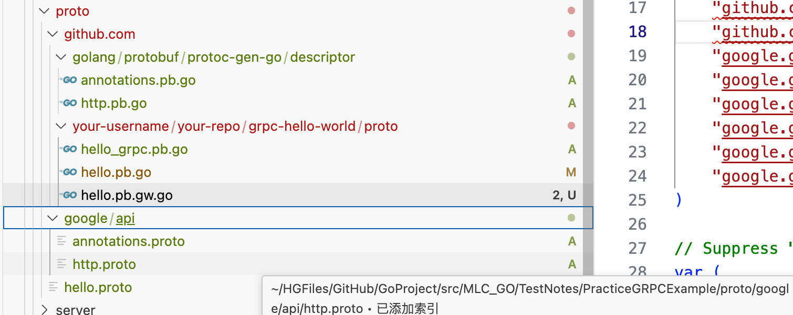

></h2>
- [**依赖包安装**](依赖包安装)
	- [依赖安装命令](#依赖安装命令)
- [**动手实现一个库**](#动手实现一个库)
	- [TravisCI](#TravisCI) 
	- [GitHub Actions](#GitHubActions) 
	- [DaoCloud](#DaoCloud)
- [**gRPC框架**](#gRPC框架)
	- [grpc环境配置](#grpc环境配置)
	- [protoc使用](#protoc使用)
	- [简单Demo流程](#简单Demo流程)
	- [proto编译成go代码](#proto编译成go代码)	
	- [命令行模块cmd](#命令行模块cmd)
- [**‌CLI（命令行界面）Cobra库**](#CLI（命令行界面）Cobra库)
- [**‌go-colly框架**](#go-colly框架)
	- [go-colly框架的特性](#go-colly框架的特性)
	- [go-colly框架使用](#go-colly框架使用)
	- [将抓取的网页内容存储在文件中](#将抓取的网页内容存储在文件中)
- [读写配置文件库viper](#读写配置文件库viper)
- [**`RESTful API设计模式`**](#RESTfulAPI设计模式)
	- [**‌`net/http`库**](#`net/http`库)
	- [**‌gin框架**](#‌gin框架)
		- [Gin构建 `RESTful API`](#Gin构建RESTfulAPI)
		- [把爬虫程序设置成Web服务](#把爬虫程序设置成Web服务)
- [**‌cellnet网络库**](#cellnet网络库)
- [**‌认证和授权JWT**](#‌认证和授权JWT)
	- [JWT介绍](#JWT介绍)  
	- [`jwt-go`库](#`jwt-go`库)
	- [JWT认证中间件](#JWT认证中间件)
- [**数据验证库**](#数据验证库)
	- [`beego/validation框架`](#beego/validation框架)
		- [数据验证validation](#数据验证validation)
	- [`govalidator库`数据验证](#govalidator库数据验证)
- [**‌图表库——go-chart**](#图表库——go-chart)
- [**图表库go-echarts**](#图表库go-echarts)
- [**packr库处理模板引擎内的文件**](#packr库处理模板引擎内的文件)
- [**‌GJSON解析JSON数据**](#GJSON解析JSON数据)
- [**IrisWeb框架**](#IrisWeb框架)
	- [IrisWeb框架详解](#IrisWeb框架详解) 
	- [快速入门](#快速入门) 
	- [中间件](#中间件) 
	- [MVC模式](#MVC模式) 
	- [解析JSON请求](#解析JSON请求) 
	- [集成GORM](#集成GORM) 
	- [部署](#部署)
- **数据库框架**
	- [Redis](#Redis)
	- [GORM和XORM详介](#GORM和XORM详介)
		- [GORM使用](#GORM使用)
			- [GORM定义模型](#GORM定义模型) 
			- [GORM初始化数据库](#GORM初始化数据库) 
			- [GORM插入数据](#GORM插入数据) 
			- [GORM查询数据](#GORM查询数据) 
			- [GORM更新数据](#GORM更新数据) 
			- [GORM删除数据](#GORM删除数据)
	- [XORM使用](#XORM使用)
		- [XORM定义模型](#XORM定义模型) 
		- [XORM初始化数据库](#XORM初始化数据库) 
		- [XORM插入数据](#XORM插入数据) 
		- [XORM查询数据](#XORM查询数据)
			- [项目实践1-JOIN(select)](#项目实践1-JOIN(select))
			-  [项目实践2-where(select)](#项目实践2-where(select))
		- [XORM更新数据](#XORM更新数据) 
		- [XORM删除数据](#XORM删除数据)
	- [主要区别](#主要区别)
		- [什么时候选用？](#什么时候选用？)
	- [model序列化和继承](#model序列化和继承)
- [**安全**](#安全)
	- [crypto库](#crypto库)
		- [crypto哈希](#crypto哈希)


<br/><br/><br/>

***
<br/>

> <h1 id="依赖包安装">依赖包安装</h1>

```
$ mkdir go-gin-example && cd go-gin-example

$ go env -w GO111MODULE=on

$ go env -w GOPROXY=https://goproxy.cn,direct

$ go mod init github.com/EDDYCJY/go-gin-example
go: creating new go.mod: module github.com/EDDYCJY/go-gin-example

$ ls
go.mod
```

- mkdir xxx && cd xxx：创建并切换到项目目录里去。
- go env -w GO111MODULE=on：打开 Go modules 开关（目前在 Go1.13 中默认值为 auto）。
- go env -w GOPROXY=...：设置 GOPROXY 代理，这里主要涉及到两个值，第一个是 https://goproxy.cn，它是由七牛云背书的一个强大稳定的 Go 模块代理，可以有效地解决你的外网问题；第二个是 direct，它是一个特殊的 fallback 选项，它的作用是用于指示 Go 在拉取模块时遇到错误会回源到模块版本的源地址去抓取（比如 GitHub 等）。
- go mod init [MODULE_PATH]：初始化 Go modules，它将会生成 go.mod 文件，需要注意的是 MODULE_PATH 填写的是模块引入路径，你可以根据自己的情况修改路径。

在执行了上述步骤后，初始化工作已完成，我们打开 go.mod 文件看看，如下：

```shell
module github.com/EDDYCJY/go-gin-example

go 1.13
```
默认的 go.mod 文件里主要是两块内容，一个是当前的模块路径和预期的 Go 语言版本。

<br/><br/><br/>
> <h2 id="依赖安装命令"> 依赖安装命令 </h2>

- **基础使用:**
	- (用 `go get` 拉取新的依赖)
		- 拉取最新的版本(优先择取 tag)：`go get golang.org/x/text@latest`
		- 拉取 master 分支的最新 commit：`go get golang.org/x/text@master`
		- 拉取 tag 为 v0.3.2 的 commit：`go get golang.org/x/text@v0.3.2`
		- 拉取 hash 为 342b231 的 commit，最终会被转换为 v0.3.2：`go get golang.org/x/text@342b2e`
		- 用 `go get -u` 更新现有的依赖
		- 用 `go mod download` 下载 go.mod 文件中指明的所有依赖
		- 用 `go mod tidy` 这个命令会清理 go.mod 并自动添加缺少的依赖。
		- 用 `go mod graph` 查看现有的依赖结构
		- 用 `go mod init` 生成 go.mod 文件 (Go 1.13 中唯一一个可以生成 go.mod 文件的子命令)
	- 用 `go mod edit` 编辑 go.mod 文件
	- 用 `go mod vendor` 导出现有的所有依赖 (事实上 Go modules 正在淡化 Vendor 的概念)
	- 用 `go mod verify` 校验一个模块是否被篡改过


<br/><br/>
><h3  id="go.sum文件">go.sum文件</h3>
- **go.sum** 文件详细罗列了当前项目直接或间接依赖的所有模块版本，并写明了那些模块版本的 SHA-256 哈希值以备 Go 在今后的操作中保证项目所依赖的那些模块版本不会被篡改。

<br/><br/>
><h3  id="go.mod文件">go.mod文件</h3>
go.mod 文件是启用了 Go modules 的项目所必须的最重要的文件，因为它描述了当前项目（也就是当前模块）的元信息，每一行都以一个动词开头，目前有以下 5 个动词:

- module：用于定义当前项目的模块路径。
- go：用于设置预期的 Go 版本。
- require：用于设置一个特定的模块版本。
- exclude：用于从使用中排除一个特定的模块版本。
- replace：用于将一个模块版本替换为另外一个模块版本。

你可能还会疑惑 indirect 是什么东西，indirect 的意思是传递依赖，也就是非直接依赖。


<br/>

***
<br/><br/><br/>

> <h1 id="动手实现一个库">动手实现一个库</h1>
- **Golang 源代码持续集成工具的用途和功能**

<br/>

- 这些工具主要用于**持续集成（CI）和持续交付/部署（CD）**，在开发过程中自动化以下任务：

	- **自动化构建**：检测代码更改后，自动编译和构建代码。
	- **自动化测试**：运行单元测试、集成测试，确保代码质量。
	- **代码质量检查**：执行代码静态分析（如 lint）以检测潜在问题。
	- **自动化部署**：在代码通过验证后，将其部署到生产或其他环境。
	- **团队协作**：在代码合并或提交后，快速获得构建和测试结果，提升开发效率。

<br/>

以下是 **TravisCI**、**GitHub Actions** 和 **DaoCloud** 的具体介绍和用途。


- **工具对比总结**

| 工具         | 特点                                      | 适用场景                          | 优势                          |
|--------------|------------------------------------------|-----------------------------------|-------------------------------|
| **TravisCI** | 经典 CI 服务，轻量级，开源项目友好         | 小型或中型项目的持续集成          | 配置简单，文档丰富            |
| **GitHub Actions** | 深度集成 GitHub，功能强大且灵活          | GitHub 托管的项目持续集成          | 社区资源丰富，强大的触发机制   |
| **DaoCloud** | 国内服务，支持容器化、云原生               | 国内项目，依赖 Docker 或 Kubernetes | 图形化界面，国内服务稳定       |

根据你的项目托管平台、需求和团队协作方式选择合适的工具：  
- **开源项目**：推荐 TravisCI 或 GitHub Actions。
- **国内私有项目**：推荐 DaoCloud。


<br/><br/><br/>

> <h2 id="TravisCI">TravisCI</h2>

- **用途**

TravisCI 是一款流行的持续集成服务，支持多个编程语言，包括 Go。主要用于 GitHub 仓库的持续集成。它会在代码推送或提交 Pull Request 时触发自动化流程。

<br/>

- **功能**
	- 自动化构建和测试。
	- 支持多种操作系统（Linux、macOS、Windows）。
	- 集成 Docker 支持复杂的构建环境。
	- 与 GitHub 深度集成，可在 PR 中显示测试状态。

<br/>

- **使用示例**
在项目中添加 `.travis.yml` 文件：

```yaml
language: go
go:
  - 1.19 # 指定 Go 版本
script:
  - go build -v ./...  # 编译项目
  - go test -v ./...   # 运行测试
```

<br/>

**用途场景**：
- 快速设置和运行持续集成。
- 检测 Go 项目中代码的构建和测试状态。


<br/><br/><br/>
> <h2 id="GitHubActions">GitHub Actions</h2>

- **用途**

GitHub Actions 是 GitHub 自带的 CI/CD 工具，专门为 GitHub 仓库设计。通过定义 **workflow** 文件，你可以自动化项目的整个开发周期，包括构建、测试、部署等。

<br/>
- **功能**
	- 使用 YAML 文件定义构建流程（`.github/workflows/*.yml`）。
	- 丰富的社区 Actions（复用其他开发者的任务模板）。
	- 支持事件触发（如 Push、PR 或 Schedule 定时任务）。
	- 提供多平台支持（Linux、Windows、macOS）。

<br/>

- **使用示例**

在项目中添加 `.github/workflows/ci.yml` 文件：

```yaml
name: Go CI
on:
  push:
    branches:
      - main
  pull_request:
    branches:
      - main
jobs:
  build:
    runs-on: ubuntu-latest
    steps:
      - uses: actions/checkout@v3
      - name: Set up Go
        uses: actions/setup-go@v4
        with:
          go-version: 1.19
      - name: Install dependencies
        run: go mod tidy
      - name: Build
        run: go build ./...
      - name: Test
        run: go test ./...
```

<br/>

- **用途场景**：
	- **开源项目**：适合 GitHub 托管的开源项目，社区用户可以快速贡献。
	- **团队协作**：在代码合并前确保代码质量。

<br/><br/><br/>
> <h2 id="DaoCloud">DaoCloud</h2>

- **用途**
DaoCloud 是中国开发者常用的一体化云原生工具平台，支持 CI/CD、容器化部署、DevOps 管理等功能。特别适合中国的开发者和企业使用。

<br/>

- **功能**
	- 图形化界面，操作简单易用。
	- 支持从源码构建、测试到 Docker 镜像生成的全流程。
	- 与国内代码托管平台（如 Gitee）深度集成。
	- 提供更快的国内镜像加速服务。

<br/>

- **使用示例**

通过图形化界面完成以下配置：
	1. 选择代码源（如 GitHub 或 Gitee）。
	2. 添加构建任务，例如运行以下命令：

```bash
go build ./...
go test ./...
docker build -t myapp .
```

3. 配置自动化部署到 Kubernetes 集群或其他环境。

- **用途场景**：
	- 国内项目的持续集成和交付。
	- 快速实现 CI/CD 和容器化交付。

<br/><br/><br/>

***
<br/>
> <h1 id="gRPC框架">gRPC框架</h1>

RPC（远程过程调用）和 gRPC（基于 RPC 的现代框架）是两种用于 **内部 API 通信** 的方式，虽然它们有很多相似之处，但也有一些关键区别。  

---

## **1. RPC 作为内部 API 通信**
RPC（Remote Procedure Call，远程过程调用）是一种 **分布式计算通信方式**，允许一个程序调用远程服务器上的方法，就像调用本地方法一样。RPC 主要特点：
- **同步调用**，调用方等待远程方法执行完成后返回结果。
- **二进制或文本格式传输**，比如 JSON-RPC、XML-RPC、Thrift、gRPC、自定义 TCP 协议等。
- **需要序列化/反序列化数据**，不同 RPC 实现方式会使用不同的数据格式。

### **常见的 RPC 实现**
| **RPC 框架** | **传输协议** | **数据格式** | **适用场景** |
|-------------|------------|------------|--------------|
| JSON-RPC    | HTTP/TCP   | JSON       | 轻量级、简单系统 |
| XML-RPC     | HTTP       | XML        | 旧系统兼容 |
| Thrift      | TCP/HTTP   | 二进制/JSON | 高效跨语言 RPC |
| gRPC        | HTTP/2     | Protocol Buffers（protobuf） | 高性能、现代微服务 |

---

## **2. gRPC 作为内部通信**
gRPC 是 Google 开源的 **高性能 RPC 框架**，与传统 RPC 相比，它具有以下特点：
### ✅ **基于 HTTP/2**
- 多路复用，减少连接数，提高吞吐量。
- 头部压缩（HPACK），降低带宽消耗。

### ✅ **使用 Protocol Buffers（protobuf）作为数据格式**
- 高效的二进制序列化，减少带宽占用，解析速度比 JSON/XML 更快。
- 代码自动生成，减少手写 API 解析代码。

### ✅ **支持流式通信**
- **普通 RPC**：请求 → 响应（单次交互）。
- **服务器流式 RPC**：客户端请求，服务器持续返回数据（适合日志流、视频流）。
- **客户端流式 RPC**：客户端连续发送数据，服务器一次性响应（适合上传大文件）。
- **双向流式 RPC**：客户端和服务器都可以持续发送数据（适合实时聊天、语音通话）。

### ✅ **多语言支持**
- gRPC 官方支持 Golang、Python、Java、C++、Node.js 等。

---

## **3. RPC vs gRPC 区别**
| **对比项**       | **传统 RPC（JSON-RPC、Thrift）** | **gRPC** |
|-----------------|---------------------------------|---------|
| **通信协议**    | HTTP/TCP                        | **HTTP/2** |
| **数据格式**    | JSON/XML/Thrift 二进制         | **protobuf（二进制）** |
| **序列化速度**  | JSON/XML 较慢                   | **protobuf 更快** |
| **语言支持**    | 取决于框架，如 JSON-RPC 只支持部分语言 | **多语言支持（Go、Python、C++等）** |
| **流式支持**    | 仅支持请求-响应                 | **支持流式通信（单向/双向）** |
| **性能**        | 解析 JSON 较慢，占用带宽较大     | **二进制格式，解析快，低带宽占用** |
| **生态**        | 取决于具体 RPC 框架              | **Google 支持，社区活跃** |

---

## **4. 选择 RPC 还是 gRPC？**
### **什么时候用传统 RPC（如 JSON-RPC、Thrift）？**
✅ **适用于：**
- **轻量级项目**（不需要高性能通信，简单 HTTP JSON API 足够）
- **已有 JSON/XML API**（与前端交互，前端不支持 protobuf）
- **不支持 HTTP/2** 的环境（如老旧服务器）

❌ **不适用于：**
- 高吞吐、低延迟场景（JSON 解析慢，HTTP/1.1 开销大）
- 大规模微服务架构（协议设计较老，缺少流式支持）

---

### **什么时候用 gRPC？**
✅ **适用于：**
- **微服务架构**（跨语言、跨团队开发，自动生成代码）
- **高性能、低延迟通信**（protobuf 解析速度快，减少 CPU 占用）
- **需要流式通信**（如日志推送、WebSocket 替代方案）
- **Kubernetes、Service Mesh（Istio）等云原生环境**

❌ **不适用于：**
- 需要在浏览器直接访问（gRPC-Web 需要额外代理，如 Envoy）
- 需要兼容 RESTful API（JSON 友好）

---

## **5. gRPC 在 Golang 内部 API 通信示例**
### **定义 gRPC 服务**
创建 `.proto` 文件：

```proto
syntax = "proto3";

package userpb;

service UserService {
  rpc GetUser (UserRequest) returns (UserResponse);
}

message UserRequest {
  int32 id = 1;
}

message UserResponse {
  int32 id = 1;
  string name = 2;
  string email = 3;
}
```

### **生成 Golang 代码**

```sh
protoc --go_out=. --go-grpc_out=. user.proto
```

### **实现 gRPC 服务器**

```go
package main

import (
	"context"
	"log"
	"net"

	pb "example.com/userpb"
	"google.golang.org/grpc"
)

type server struct {
	pb.UnimplementedUserServiceServer
}

func (s *server) GetUser(ctx context.Context, req *pb.UserRequest) (*pb.UserResponse, error) {
	return &pb.UserResponse{Id: req.Id, Name: "Alice", Email: "alice@example.com"}, nil
}

func main() {
	lis, err := net.Listen("tcp", ":50051")
	if err != nil {
		log.Fatalf("Failed to listen: %v", err)
	}
	s := grpc.NewServer()
	pb.RegisterUserServiceServer(s, &server{})

	log.Println("gRPC server listening on port 50051")
	s.Serve(lis)
}
```

### **gRPC 客户端**

```go
package main

import (
	"context"
	"fmt"
	"log"
	"time"

	pb "example.com/userpb"
	"google.golang.org/grpc"
)

func main() {
	conn, err := grpc.Dial("localhost:50051", grpc.WithInsecure())
	if err != nil {
		log.Fatalf("Failed to connect: %v", err)
	}
	defer conn.Close()

	client := pb.NewUserServiceClient(conn)

	ctx, cancel := context.WithTimeout(context.Background(), time.Second)
	defer cancel()

	res, err := client.GetUser(ctx, &pb.UserRequest{Id: 1})
	if err != nil {
		log.Fatalf("Could not get user: %v", err)
	}
	fmt.Printf("User: %v\n", res)
}
```

---

## **6. 总结**
| **选择** | **适用场景** |
|---------|------------|
| **RESTful API（HTTP+JSON）** | 前后端交互，兼容性强，浏览器友好 |
| **传统 RPC（JSON-RPC、Thrift）** | 轻量级 RPC，适合小规模内部服务 |
| **gRPC** | 高性能微服务，低延迟、流式通信，云原生架构 |

如果你的系统是**高吞吐量、跨语言、多微服务架构**，那么 **gRPC 是更好的选择**。如果只是简单的**内部 API 通信**，可以用 **JSON-RPC/Thrift** 代替。


<br/><br/><br/>
> <h2 id="grpc环境配置">grpc环境配置</h2>

**grpc安装**

```sh
go get -u google.golang.org/grpc
```

<br/><br/>

**Protoc Plugin(protobuf 插件)安装**

为了在 Golang 中使用 protobuf，你需要安装 Go 的 protobuf 插件。运行以下命令来安装

```sh
go install google.golang.org/protobuf/cmd/protoc-gen-go@latest

go install google.golang.org/grpc/cmd/protoc-gen-go-grpc@latest
```

<br/><br/>

**编译和安装 Protocol Buffers (protobuf)** 
protobuf 的安装过程。运行以下命令来安装 protobuf：

```
brew install protobuf
```

安装完成后，你可以通过以下命令验证 protobuf 是否安装成功：

```bash
protoc --version
```
如果安装成功，这将输出 protobuf 的版本号。
<br/>

**更新你的 PATH**

确保你的 $GOPATH/bin 或 $HOME/go/bin 在你的 PATH 中，这样你就可以直接使用 protoc-gen-go。你可以通过以下命令将其添加到你的 .bashrc 或 .zshrc 文件中：

```
bash
export PATH=$PATH:$(go env GOPATH)/bin
```
然后运行以下命令使更改生效：

```bash
source ~/.bashrc  # 或者 source ~/.zshrc
```

<br/>

**Grpc-gateway**
grpc-gateway是protoc的一个插件。它读取gRPC服务定义，并生成一个反向代理服务器，将RESTful JSON API转换为gRPC。此服务器是根据gRPC定义中的自定义选项生成的。

**安装：**

```sh
go install github.com/grpc-ecosystem/grpc-gateway/v2/protoc-gen-grpc-gateway@latest
```


<br/><br/><br/>
> <h2 id="protoc使用">protoc使用</h2>
- 我们按照惯例执行protoc --help（查看帮助文档），我们抽出几个常用的命令进行讲解：
	- 1、-IPATH, --proto_path=PATH：指定import搜索的目录，可指定多个，如果不指定则默认当前工作目录
	- 2、--go_out：生成golang源文件

<br/>

**参数**
若要将额外的参数传递给插件，可使用从输出目录中分离出来的逗号分隔的参数列表:

使用 Protocol Buffers 编译器（`protoc`）生成 Go 代码的命令，且支持 gRPC 服务。如下面的命令：

```sh
protoc --go_out=plugins=grpc,import_path=mypackage:. *.proto
```
- import_prefix=xxx：将指定前缀添加到所有import路径的开头
- import_path=foo/bar：如果文件没有声明go_package，则用作包。如果它包含斜杠，那么最右边的斜杠将被忽略。
- plugins=plugin1+plugin2：指定要加载的子插件列表（我们所下载的repo中唯一的插件是grpc）
- Mfoo/bar.proto=quux/shme： M参数，指定.proto文件编译后的包名（foo/bar.proto编译后为包名为quux/shme）

<br/>

***
### **各部分详解：**

1. **`protoc`**
   - 这是 Protocol Buffers 编译器的命令行工具，用来将 `.proto` 文件编译为指定语言（如 Go、Java、Python）的代码。

2. **`--go_out`**
   - `--go_out` 是指示 `protoc` 编译器生成 Go 语言代码的标志。
   - 通过这个选项，`protoc` 会将 `.proto` 文件编译为 Go 代码。

3. **`plugins=grpc`**
   - `plugins=grpc` 选项启用 gRPC 插件。gRPC 是一种高效的 RPC 框架，`protoc` 会生成用于 gRPC 服务的 Go 代码。
   - 使用此选项时，生成的 Go 代码会包括 gRPC 所需的客户端和服务器代码。
   
   **解释：**
   - gRPC 服务和客户端代码包含了与 Protocol Buffers 相关的 `Client` 和 `Server` 接口方法，这些方法用于服务的通信。
   
4. **`import_path=mypackage`**
   - `import_path` 选项指定 Go 代码中 `import` 的包路径。
   - 这表示生成的 Go 文件将在 `mypackage` 包下。例如，生成的文件将通过 `import "mypackage/yourfile"` 来引用。
   
   **注意：**
   - `mypackage` 应该是你希望在 Go 项目中使用的包名称。它通常是你项目的 Go 模块路径或目录路径。

5. **`:.`**
   - `.` 表示当前目录。这指定了生成的 Go 代码应该放置在当前目录下。
   - 所以，生成的 Go 文件将被输出到执行命令时所在的目录。

6. **`*.proto`**
   - `*.proto` 是你要编译的 `.proto` 文件的通配符。这个命令会匹配当前目录下的所有 `.proto` 文件，并将它们作为输入传递给 `protoc` 编译器。
   
### **总结**

- 这个命令会将当前目录下所有的 `.proto` 文件编译成 Go 代码，并且会生成包含 gRPC 客户端和服务器实现的代码。
- 生成的 Go 文件将被放置在当前目录中，并且这些文件会被包含在 `mypackage` 包中。

### **示例：**

假设你有一个 `hello.proto` 文件，如下所示：

```proto
syntax = "proto3";

package hello;

service Greeter {
    rpc SayHello (HelloRequest) returns (HelloReply);
}

message HelloRequest {
    string name = 1;
}

message HelloReply {
    string message = 1;
}
```

运行命令：

```bash
protoc --go_out=plugins=grpc,import_path=mypackage:. hello.proto
```

这会生成一个包含 gRPC 客户端和服务器代码的 Go 文件，类似于：

- `hello.pb.go`：包括与消息类型和 gRPC 服务相关的代码。
- `hello_grpc.pb.go`：包括 gRPC 相关的客户端和服务器代码。

这样，你就可以使用生成的 Go 代码来实现和调用 `Greeter` 服务。

### **常见问题：**
- **Go 插件未安装：**
  如果你遇到 `protoc-gen-go: program not found or is not executable` 错误，意味着你没有安装 Go 的插件。
  安装命令：
  ```bash
  go get google.golang.org/protobuf/cmd/protoc-gen-go
  ```

- **gRPC 插件未安装：**
  如果没有安装 gRPC 插件，可以通过以下命令安装：
  ```bash
  go get google.golang.org/grpc/cmd/protoc-gen-go-grpc
  ```
  
<br/>
**Grpc支持**
如果proto文件指定了RPC服务，protoc-gen-go可以生成与grpc相兼容的代码，我们仅需要将plugins=grpc参数传递给--go_out，就可以达到这个目的

```
protoc --go_out=plugins=grpc:. *.proto
```

<br/><br/><br/>
> <h2 id="简单Demo流程">简单Demo流程</h2>

**初始化目录**

```sh
grpc-hello-world/
├── certs
├── client
├── cmd
├── pkg
├── proto
│   ├── google
│   │   └── api
└── server
```
- certs：证书凭证
- client：客户端
- cmd：命令行
- pkg：第三方公共模块
- proto：protobuf的一些相关文件（含.proto、pb.go、.pb.gw.go)，google/api中用于存放annotations.proto、http.proto
- server：服务端

<br/><br/>

**制作证书**
在服务端支持Rpc和Restful Api，需要用到TLS，因此我们要先制作证书

进入certs目录，生成TLS所需的公钥密钥文件

**私钥**

```sh
openssl genrsa -out server.key 2048

openssl ecparam -genkey -name secp384r1 -out server.key
```

- openssl genrsa：生成RSA私钥，命令的最后一个参数，将指定生成密钥的位数，如果没有指定，默认512
- openssl ecparam：生成ECC私钥，命令为椭圆曲线密钥参数生成及操作，本文中ECC曲线选择的是secp384r1

**自签名公钥**

```
openssl req -new -x509 -sha256 -key server.key -out server.pem -days 3650
```

openssl req：生成自签名证书，-new指生成证书请求、-sha256指使用sha256加密、-key指定私钥文件、-x509指输出证书、-days 3650为有效期，此后则输入证书拥有者信息

**填写信息**

```sh
Country Name (2 letter code) [AU]:ShangHai
String too long, must be at most 2 bytes long
Country Name (2 letter code) [AU]:CN
State or Province Name (full name) [Some-State]:ShangHai
Locality Name (eg, city) []:ShangaHai
Organization Name (eg, company) [Internet Widgits Pty Ltd]:HuangGang
Organizational Unit Name (eg, section) []:HuangGang.dev.use 
Common Name (e.g. server FQDN or YOUR name) []:HuangGang_personalCertificate       
Email Address []:harleysor@qq.com 
```

<br/>

**或者你也可以这样做：**

是的，你可以 **不创建 `openssl.cnf` 文件**，直接在命令行执行 `openssl` 命令来生成 **带 `SAN`（Subject Alternative Name）** 的证书。

 **🚀 直接执行 OpenSSL 命令**

```sh
openssl req -x509 -nodes -newkey rsa:4096 -keyout server.key -out server.pem -days 365 \
-subj "/C=CN/ST=ShangHai/L=ShangHai/O=HuangGang/OU=HuangGang.dev.use/CN=dev" \
-addext "subjectAltName = DNS:dev, DNS:localhost, IP:127.0.0.1"
```
---

### **🛠 参数解析**
1. **`-x509`**  → 生成自签名证书  
2. **`-nodes`**  → 不加密私钥（无需密码）  
3. **`-newkey rsa:4096`**  → 生成 4096-bit RSA 私钥  
4. **`-keyout server.key`**  → 生成私钥 `server.key`  
5. **`-out server.pem`**  → 生成证书 `server.pem`  
6. **`-days 365`**  → 证书有效期 365 天  
7. **`-subj`**  → 直接在命令行设置证书信息（避免交互输入）  
8. **`-addext "subjectAltName = DNS:dev, DNS:localhost, IP:127.0.0.1"`**  
   - 添加 `SAN`，支持：
     - `DNS:dev`
     - `DNS:localhost`
     - `IP:127.0.0.1`

---

### **✅ 这样你不需要 `openssl.cnf`，就能直接生成带 `SAN` 的证书！**  
然后，你可以在 **Go gRPC 客户端** 中这样使用：

```go
creds, err := credentials.NewClientTLSFromFile("server.pem", "dev")
```
确保 `"dev"` 这个名称 **和 `SAN` 里的 `DNS:dev` 匹配**，这样 TLS 验证就不会失败了！ 🚀

这里的 "dev" 需要匹配服务器证书的 CN 或 SAN，否则会导致 tls: failed to verify certificate 错误。

✅ 检查服务器证书的 CN 和 SAN：

```sh
openssl x509 -in ../certs/server.pem -text -noout | grep -E 'Subject:|DNS:'
```
如果输出类似：

```pgsql
Subject: CN = myserver.local
X509v3 Subject Alternative Name:
    DNS:myserver.local, IP Address:127.0.0.1
```

<br/>

**server.pem证书信息：**

```
openssl x509 -in ../certs/server.pem -text -noout | grep -E 'Subject:|DNS:'
  
// 我自己证书信息
Subject: C=CN, ST=ShangHai, L=ShangaHai, O=HuangGang, OU=HuangGang.dev.use, CN=HuangGang_personalCertificate, emailAddress=harleysor@qq.com
```

<br/>

**client_server.pem证书信息：**

```
openssl x509 -in ../certs/client_server.pem -text -noout | grep -E 'Subject:|DNS:'

Subject: C=CN, ST=ShangHai, L=ShangHai, O=HuangGang, OU=HuangGang.dev.use, CN=dev
        DNS:dev, DNS:localhost, IP Address:127.0.0.1
```


说明 证书的 CN 或 SAN 不是 dev，你应该修改 client.go：

```go
creds, err := credentials.NewClientTLSFromFile("../certs/server.pem", "myserver.local")
```
或者：

```go
creds, err := credentials.NewClientTLSFromFile("../certs/server.pem", "")
（"" 表示不检查证书的 CN/SAN，仅校验证书是否可信）
```

<br/><br/>
> <h3 id="proto">proto</h3>
**annotations.proto文件：**

```proto
annotations.proto文件如下代码

syntax = "proto3";

package google.api;
option go_package = "github.com/golang/protobuf/protoc-gen-go/descriptor;descriptor";


import "google/api/http.proto";
import "google/protobuf/descriptor.proto";

option java_multiple_files = true;
option java_outer_classname = "AnnotationsProto";
option java_package = "com.google.api";

extend google.protobuf.MethodOptions {
  // See `HttpRule`.
  HttpRule http = 72295728;
}
```

这段 Protobuf (`annotations.proto`) 代码定义了一个 **protobuf 扩展 (extension)**，用于给 gRPC 方法添加 HTTP 绑定，使得 gRPC 方法可以通过 RESTful API 进行访问。下面是详细解析：

---

### **1. Protobuf 版本**

```proto
syntax = "proto3";
```
这表示该文件使用的是 **Protocol Buffers v3 (proto3) 语法**，是目前 Google 推荐的版本。

---

### **2. `package google.api;`**

```proto
package google.api;
```
- 这表示该 `proto` 文件属于 `google.api` 这个命名空间。
- 避免不同 `proto` 文件的消息类型（message）和服务（service）冲突。

---

### **3. 依赖的 `proto` 文件**

```proto
import "google/api/http.proto";
import "google/protobuf/descriptor.proto";
```
- `google/api/http.proto`
  - 该文件定义了 **`HttpRule`**，用于描述 gRPC 方法如何映射到 HTTP 路由（REST API）。
  - `HttpRule` 允许将 gRPC 方法绑定到 `GET`、`POST` 等 HTTP 方法，使得 gRPC 服务器可以作为 RESTful API 访问。

- `google/protobuf/descriptor.proto`
  - 该文件定义了 **protobuf 反射 (reflection) 和扩展机制**，允许我们扩展 protobuf 自带的功能，例如：
    - 扩展 `MethodOptions`，给 RPC 方法增加额外的元信息（metadata）。

---

### **4. Java 相关的 `option` 选项**

```proto
option java_multiple_files = true;
option java_outer_classname = "AnnotationsProto";
option java_package = "com.google.api";
```
- `java_multiple_files = true;`
  - 生成 Java 代码时，**每个 `message` 和 `service` 都会生成独立的 Java 类**，而不是全部嵌套在一个类中。
  - 这样可以提高 Java 代码的可读性和管理性。

- `java_outer_classname = "AnnotationsProto";`
  - 如果 `java_multiple_files = false`，则所有定义的 `message` 和 `service` 会嵌套在 `AnnotationsProto` 这个外部类中。
  - 但这里 `java_multiple_files = true`，所以这个 `option` 影响不大。

- `java_package = "com.google.api";`
  - 生成的 Java 代码会放在 `com.google.api` 这个 Java 包下。

---

### **5. `extend google.protobuf.MethodOptions` 扩展 `MethodOptions`**

```proto
extend google.protobuf.MethodOptions {
  // See `HttpRule`.
  HttpRule http = 72295728;
}
```
这一部分是 **protobuf 的扩展 (extension) 机制**，用于给 gRPC 方法的 `MethodOptions` 添加 `http` 选项，使得 gRPC 方法可以通过 HTTP 访问：

- `extend google.protobuf.MethodOptions`：
  - `MethodOptions` 是 **protobuf 自带的 RPC 方法元数据**，用于存储 gRPC 方法的额外信息。
  - `extend` 关键字允许我们**扩展** `MethodOptions`，增加新的字段。

- `HttpRule http = 72295728;`
  - 这里定义了一个 `HttpRule` 类型的 `http` 字段，并且它的**唯一标识符**为 `72295728`。
  - 这个字段的作用是：**允许 gRPC 方法映射到 HTTP 端点（REST API）**。

---

### **6. 这个扩展的作用**
这个 `extend` 语句的作用是**允许在 gRPC 方法上定义 HTTP 规则**，以支持 HTTP/REST 访问。

#### **使用示例**
在其他 `.proto` 文件中，我们可以这样使用：

```proto
import "google/api/annotations.proto";
import "google/api/http.proto";

service MyService {
  rpc GetUserInfo (UserRequest) returns (UserResponse) {
    option (google.api.http) = {
      get: "/v1/user/{id}"
    };
  }
}
```
- `option (google.api.http) = { get: "/v1/user/{id}" }`
  - 这个 `option` 使用了 `annotations.proto` 定义的 `http` 扩展。
  - 使得 `GetUserInfo` 这个 gRPC 方法可以通过 **HTTP `GET /v1/user/{id}`** 访问。

**等效于 REST API：**

```http
GET /v1/user/123
```
会被转换为 gRPC 调用：

```proto
rpc GetUserInfo(UserRequest) returns (UserResponse);
```

---

### **7. `72295728` 这个数字的意义**
在 `protobuf` 里，每个字段都需要一个唯一的 **标识符 (Tag Number)**，如：

```proto
string name = 1;
int32 age = 2;
```
- 这里 `name` 的 Tag 是 `1`，`age` 的 Tag 是 `2`。

在 `extend google.protobuf.MethodOptions` 里：

```proto
HttpRule http = 72295728;
```
- `72295728` 是 **扩展字段的 Tag Number**，用于唯一标识 `http` 这个扩展字段。
- Google 选择了一个**高位数字**，避免与 Protobuf 内部字段冲突。
- 该编号在 Google API 设计指南里是固定的，不要随意更改。

---

### **8. `HttpRule` 作用**
`HttpRule`（在 `google/api/http.proto` 中定义）用于指定 gRPC 方法和 HTTP 请求之间的映射关系：

```proto
message HttpRule {
  string get = 1;
  string post = 2;
  string put = 3;
  string delete = 4;
  ...
}
```
因此，在 `.proto` 里，我们可以这样使用：

```proto
rpc CreateUser (UserRequest) returns (UserResponse) {
  option (google.api.http) = {
    post: "/v1/users"
    body: "*"
  };
}
```
这意味着：
- `CreateUser` 方法可以通过 **HTTP `POST /v1/users`** 访问。
- `body: "*"` 表示请求的 body 作为 gRPC 方法的参数。

---

### **总结**
1. **`extend google.protobuf.MethodOptions`** 是 Protobuf 的扩展机制，允许为 gRPC 方法添加自定义的 **HTTP 绑定选项**。
2. `HttpRule` 允许 gRPC 方法支持 RESTful API 调用，使得 gRPC 方法可以通过 HTTP（`GET`、`POST`、`PUT`、`DELETE`）访问。
3. `option (google.api.http)` 语法用于在 `.proto` 文件中启用 HTTP 绑定。
4. `72295728` 是 Google 预留的 **唯一标识符 (Tag Number)**，表示 `http` 这个扩展字段。
5. 在 **Google API 设计规范** 里，`annotations.proto` 主要用于 `gRPC-Gateway`，使 gRPC 方法可以通过 REST 访问。

---

### **实战意义**
- **如果你使用 gRPC**，但想让客户端用 REST API 访问，你可以使用 `google.api.http` 选项。
- **如果你在写 Protobuf API**，但希望支持 `gRPC-Gateway`，`annotations.proto` 是必不可少的。

---

这个 `annotations.proto` 是 Google API 设计中的关键部分，使得 **gRPC 和 REST API 可以无缝结合**，在 Google Cloud 和其他微服务架构中广泛使用。

<br/><br/>

**http.proto文件：**

```proto
syntax = "proto3";

package google.api;
option go_package = "github.com/golang/protobuf/protoc-gen-go/descriptor;descriptor";

option cc_enable_arenas = true;
option java_multiple_files = true;
option java_outer_classname = "HttpProto";
option java_package = "com.google.api";

message HttpRule {
  // Selects methods to which this rule applies.
  //
  // Refer to [selector][google.api.DocumentationRule.selector] for syntax details.
  string selector = 1;

  // Determines the URL pattern is matched by this rules. This pattern can be
  // used with any of the {get|put|post|delete|patch} methods. A custom method
  // can be defined using the 'custom' field.
  oneof pattern {
    // Used for listing and getting information about resources.
    string get = 2;

    // Used for updating a resource.
    string put = 3;

    // Used for creating a resource.
    string post = 4;

    // Used for deleting a resource.
    string delete = 5;

    // Used for updating a resource.
    string patch = 6;

    // Custom pattern is used for defining custom verbs.
    CustomHttpPattern custom = 8;
  }

  // The name of the request field whose value is mapped to the HTTP body, or
  // `*` for mapping all fields not captured by the path pattern to the HTTP
  // body. NOTE: the referred field must not be a repeated field.
  string body = 7;

  // Additional HTTP bindings for the selector. Nested bindings must
  // not contain an `additional_bindings` field themselves (that is,
  // the nesting may only be one level deep).
  repeated HttpRule additional_bindings = 11;
}

// A custom pattern is used for defining custom HTTP verb.
message CustomHttpPattern {
  // The name of this custom HTTP verb.
  string kind = 1;

  // The path matched by this custom verb.
  string path = 2;
}
```

`http.proto` 主要定义了 **gRPC 方法与 HTTP API 之间的映射规则**，核心是 `HttpRule` 这个消息（message），它允许我们把 gRPC 方法映射到 RESTful API，如 `GET`、`POST`、`PUT` 等 HTTP 方法。  

---

## **1. 头部选项 (`option`)**

```proto
option cc_enable_arenas = true;
option java_multiple_files = true;
option java_outer_classname = "HttpProto";
option java_package = "com.google.api";
```
这些选项用于控制代码生成：

- `cc_enable_arenas = true;`
  - **C++ 相关优化**，启用 **Arena Allocation** 机制，提高对象的内存管理效率，减少内存分配和回收的开销。

- `java_multiple_files = true;`
  - 生成的 Java 代码会为 `HttpRule`、`CustomHttpPattern` 等每个 message 单独创建一个 `.java` 文件，而不是全部嵌套在 `HttpProto` 这个类里。

- `java_outer_classname = "HttpProto";`
  - 设定 Java 代码的外部类名为 `HttpProto`（如果 `java_multiple_files = false`）。

- `java_package = "com.google.api";`
  - 生成的 Java 代码放在 `com.google.api` 这个 Java 包下。

---

## **2. `HttpRule` 结构**

```proto
message HttpRule {
  string selector = 1;

  oneof pattern {
    string get = 2;
    string put = 3;
    string post = 4;
    string delete = 5;
    string patch = 6;
    CustomHttpPattern custom = 8;
  }

  string body = 7;

  repeated HttpRule additional_bindings = 11;
}
```
`HttpRule` 主要用于**将 gRPC 方法映射到 HTTP 端点**，它包含以下字段：

### **(1) `selector`**

```proto
string selector = 1;
```
- `selector` 指定要应用 HTTP 规则的 **gRPC 方法**，其值是 `package.service/method` 形式。
- 例如：

```proto
selector = "my.package.MyService.GetUserInfo";
```

### **(2) `pattern` (HTTP 方法绑定)**

```proto
oneof pattern {
  string get = 2;
  string put = 3;
  string post = 4;
  string delete = 5;
  string patch = 6;
  CustomHttpPattern custom = 8;
}
```
- 这是 **`oneof` 字段**，即**同一时间只能选其中一个**。
- 允许 gRPC 方法映射到标准 HTTP 方法：
  - `get = 2;`  → HTTP `GET` 请求
  - `put = 3;`  → HTTP `PUT` 请求
  - `post = 4;` → HTTP `POST` 请求
  - `delete = 5;` → HTTP `DELETE` 请求
  - `patch = 6;` → HTTP `PATCH` 请求
  - `custom = 8;` → **自定义 HTTP 方法**（如 `OPTIONS`）

#### **示例**

```proto
rpc GetUser (GetUserRequest) returns (User) {
  option (google.api.http) = {
    get: "/v1/user/{id}"
  };
}
```
这里的 `get: "/v1/user/{id}"` 表示：
- gRPC 方法 `GetUser` 可以通过 HTTP `GET /v1/user/123` 访问，并将 `{id}` 绑定到 `GetUserRequest` 参数。

---

### **(3) `body` (HTTP 请求体绑定)**

```proto
string body = 7;
```
- 指定哪个请求字段映射到 HTTP `body` 中。
- 特殊值：
  - `"*"` → **全部字段** 作为 `body`
  - `""`（空字符串）→ **不映射 `body`**，参数需通过 URL 查询参数传递。

#### **示例**

```proto
rpc CreateUser (CreateUserRequest) returns (User) {
  option (google.api.http) = {
    post: "/v1/users"
    body: "*"
  };
}
```
等效于 REST API：

```http
POST /v1/users
Content-Type: application/json

{
  "name": "Alice",
  "age": 25
}
```
- `body: "*"` 让整个 `CreateUserRequest` 作为 HTTP `body` 传递。

如果 `body: "user"`：

```proto
message CreateUserRequest {
  User user = 1;
}
```
则 HTTP `body` 变成：

```json
{
  "user": {
    "name": "Alice",
    "age": 25
  }
}
```

---

### **(4) `additional_bindings` (额外的 HTTP 规则)**

```proto
repeated HttpRule additional_bindings = 11;
```
- 允许一个 gRPC 方法有 **多个 HTTP 绑定**（比如既支持 `GET` 也支持 `POST`）。
- 但**不能嵌套多层**（即 `additional_bindings` 不能再包含 `additional_bindings`）。

#### **示例**

```proto
rpc GetUser (GetUserRequest) returns (User) {
  option (google.api.http) = {
    get: "/v1/user/{id}"
    additional_bindings {
      post: "/v1/user"
      body: "*"
    }
  };
}
```
等效于：
- `GET /v1/user/123` → 通过 URL 查询参数传递 `id`
- `POST /v1/user` + `body: "*"` → 通过 `body` 传递 `id`

---

## **3. `CustomHttpPattern` 结构**

```proto
message CustomHttpPattern {
  string kind = 1;
  string path = 2;
}
```
- 允许使用自定义的 HTTP 方法（如 `OPTIONS`、`HEAD`）。
- `kind`：自定义 HTTP 方法的名称，如 `OPTIONS`。
- `path`：HTTP 端点。

#### **示例**

```proto
rpc CustomOptions (Empty) returns (Empty) {
  option (google.api.http) = {
    custom {
      kind: "OPTIONS"
      path: "/v1/custom"
    }
  };
}
```
等效于：

```http
OPTIONS /v1/custom
```

---

## **总结**
1. **`HttpRule` 作用**
   - 允许 gRPC 方法映射到 HTTP API，使 gRPC 可通过 RESTful API 访问。
   - `get`、`post`、`put`、`delete`、`patch` 定义 HTTP 方法绑定。
   - `body` 决定请求参数是否放入 `body`（默认放 URL 查询参数）。
   - `additional_bindings` 允许一个 gRPC 方法支持多种 HTTP 映射。
   - `custom` 允许定义自定义 HTTP 方法（如 `OPTIONS`）。

2. **示例**

```proto
rpc CreateUser (CreateUserRequest) returns (User) {
 option (google.api.http) = {
   post: "/v1/users"
   body: "*"
 };
}
```
   - gRPC 方法 `CreateUser` → `POST /v1/users`
   - `body: "*"` 表示整个请求体作为 HTTP `body`。

3. **与 `annotations.proto` 结合**
   - `annotations.proto` 通过 `extend MethodOptions` **把 `HttpRule` 绑定到 gRPC 方法**。
   - 让 `gRPC-Gateway` **自动转发** RESTful API 调用到 gRPC 服务。

---

这就是 `http.proto` 的核心，它是 `gRPC-Gateway` 和 Google Cloud API 的关键组件，使 gRPC 既能支持高效的 RPC，又能兼容 RESTful API 🚀

<br/><br/>
> <h3 id="proto编译成go代码">proto编译成go代码</h3>

```sh
# 编译google.api
# 首先cd到proto目录
ganghuang@GangHuangs-MacBook-Pro proto% cd MLC_GO/TestNotes/PracticeGRPCExample/proto 
protoc -I . \
--go_out=Mgoogle/api/http.proto=github.com/golang/protobuf/protoc-gen-go/descriptor:. \
--go-grpc_out=Mgoogle/api/http.proto=github.com/golang/protobuf/protoc-gen-go/descriptor:. \
google/api/*.proto

# 编译hello_http.proto为hello_http.pb.proto
ganghuang@GangHuangs-MacBook-Pro proto % protoc -I . \
--go_out=Mgoogle/api/annotations.proto=grpc-hello-world/proto/google/api,\
Mhello.proto=github.com/your-username/your-repo/grpc-hello-world/proto:. \
--go-grpc_out=Mgoogle/api/annotations.proto=grpc-hello-world/proto/google/api,\
Mhello.proto=github.com/your-username/your-repo/grpc-hello-world/proto:. \
./hello.proto

# 编译hello_http.proto为hello_http.pb.gw.proto
protoc -I . -I ./third_party/googleapis \
--grpc-gateway_out=logtostderr=true,\
Mhello.proto=github.com/your-username/your-repo/grpc-hello-world/proto,\
Mgoogle/api/annotations.proto=github.com/grpc-ecosystem/grpc-gateway/third_party/googleapis/google/api:. \
./hello.proto
```
执行完毕后将生成hello.pb.go和hello.gw.pb.go，分别针对grpc和grpc-gateway的功能支持




<br/><br/>
> <h3 id="命令行模块cmd">命令行模块cmd</h3>

这一小节我们编写命令行模块，为什么要独立出来呢，是为了将cmd和server两者解耦，避免混淆在一起。

- 我们采用 [Cobra](#CLI（命令行界面）Cobra库) 来完成这项功能，Cobra既是创建强大的现代CLI应用程序的库，也是生成应用程序和命令文件的程序。提供了以下功能：
	- 简易的子命令行模式
	- 完全兼容posix的命令行模式(包括短和长版本)
	- 嵌套的子命令
	- 全局、本地和级联flags
	- 使用Cobra很容易的生成应用程序和命令，使用cobra create appname和cobra add cmdname
	- 智能提示
	- 自动生成commands和flags的帮助信息
	- 自动生成详细的help信息-h，--help等等
	- 自动生成的bash自动完成功能
	- 为应用程序自动生成手册
	- 命令别名
	- 定义您自己的帮助、用法等的灵活性。
	- 可选与viper紧密集成的apps


<br/><br/><br/>

***
<br/>

> <h1 id="CLI（命令行界面）Cobra库">CLI（命令行界面）Cobra库</h1>
Cobra 是一个用于构建强大 CLI（命令行界面）

**Cobra 是什么？**
**Cobra** 是一个用于构建强大 CLI（命令行界面）应用的 Go 语言库。它可以帮助你**组织命令行程序的结构**，并且**支持子命令、自动生成帮助文档、flag（标志）、命令补全等功能**。

Cobra 由 **spf13**（Go 生态中著名的开发者）开发，广泛用于 Kubernetes、Hugo、Docker 等知名项目的 CLI 组件。

---

**为什么使用 Cobra？**
在 Go 中，我们可以用 `flag` 包来解析命令行参数，但如果程序有多个子命令（如 `git clone`、`git push`），使用 `flag` 会让代码变得复杂且难以维护。**Cobra 提供了一种优雅的方式来组织 CLI 结构**。

- **Cobra 的核心功能**
	- ✅ **支持嵌套子命令**（如 `kubectl get pods`）  
	- ✅ **自动生成 CLI 帮助文档**（`myapp help`）  
	- ✅ **支持 flag（标志）管理**（`myapp run --port=8080`）  
	- ✅ **支持 Bash/Zsh/Fish 终端自动补全**  
	- ✅ **与 Viper 库兼容，可用于解析配置文件**  

---

- **如何安装 Cobra**
在你的 Go 项目中执行：

```sh
go get -u github.com/spf13/cobra@latest
go get -u github.com/spf13/cobra/cobra@latest
```

如果想要用 Cobra 生成项目骨架：

```sh
go install github.com/spf13/cobra-cli@latest
```

然后使用：

```sh
cobra-cli init myapp
cd myapp
cobra-cli add server  # 添加一个子命令
cobra-cli add client
```
这会在 `cmd/` 目录下生成 `server.go` 和 `client.go`。

---

- **Cobra 代码示例**
	- **1. 创建 CLI 入口**
在 `main.go` 里：

```go
package main

import (
	"fmt"
	"os"
	"github.com/spf13/cobra"
)

func main() {
	var rootCmd = &cobra.Command{
		Use:   "myapp",
		Short: "MyApp 是一个示例 CLI",
		Run: func(cmd *cobra.Command, args []string) {
			fmt.Println("Hello from MyApp!")
		},
	}

	if err := rootCmd.Execute(); err != nil {
		fmt.Println(err)
		os.Exit(1)
	}
}
```
运行：

```sh
go run main.go
```
输出：

```sh
Hello from MyApp!
```

---

- **2. 添加子命令**
我们创建 `cmd/server.go` 作为 `server` 子命令：

```go
package cmd

import (
	"fmt"
	"github.com/spf13/cobra"
)

// 创建 server 命令
var serverCmd = &cobra.Command{
	Use:   "server",
	Short: "启动服务器",
	Run: func(cmd *cobra.Command, args []string) {
		fmt.Println("服务器启动中...")
	},
}

// 初始化并注册命令
func init() {
	rootCmd.AddCommand(serverCmd)
}
```

在 `main.go` 里引入：

```go
package main

import (
	"myapp/cmd"
)

func main() {
	cmd.Execute()
}
```
运行：

```sh
go run main.go server
```
输出：

```sh
服务器启动中...
```

---

## **总结**
Cobra 让 CLI 代码更加清晰、模块化，并且支持：
- **子命令管理**
- **自动补全**
- **Flag（选项参数）**
- **自动生成帮助文档**

**适用于：**
- `kubectl`、`docker`、`git` 这种**多子命令工具**
- **微服务项目的命令行管理工具**
- **任务脚本 & 自动化工具**

在你的项目中使用 Cobra，可以把 `cmd`（命令行处理）和 `server`（服务逻辑）解耦，保持代码结构清晰，方便扩展 🚀。


<br/>

***
<br/><br/><br/>

> <h1 id="go-colly框架">go-colly框架</h1>

go-colly是使用Go语言实现的网络爬虫框架。go-colly以回调函数的形式提供了一组接口，通过这些接口能够实现任意类型的爬虫。开发者使用go-colly框架可以轻松地从Web页面中爬取结构化数据。

<br/>
**通过如下命令下载到项目中：**

```
cd cd /Users/ganghuang/HGFiles/GitHub/GoProject/MLC_GO
go get -u github.com/gocolly/colly/...
```

<br/><br/>
> <h2 id="go-colly框架的特性">go-colly框架的特性</h2>
- **go-colly框架具有如下特性。**
	- 清晰的API。快速（单核>1k请求/s）​。
	- 管理每个域的请求延迟和最大并发性。
	- 自动cookie和会话处理。
	- 同步／异步／并行抓取。高速缓存。
	- 自动处理非Unicode的编码。
	- 支持Robots.txt定制Agent信息。
	- 定制抓取频次。

<br/><br/><br/>
> <h2 id="go-colly框架使用">go-colly框架使用</h2>
**导入框架**

```go
import "github.com/gocolly/colly"
```
<br/>

&emsp; 使用go-colly框架的关键是创建Collector对象（即“收集器”​）​，该对象的作用是管理网络通信，并负责在收集任务运行时执行附加的回调函数。通过调用colly库中的NewCollector()函数，即可创建Collector对象。其语法格式如下。

```go
colly.NewCollector()
```
<br/>


- **这些回调函数在收集任务运行时被有序调用，调用顺序如下。**
	- OnRequest()函数在请求发出前被调用。
	- OnError()函数在请求过程中发生错误时被调用。
	- OnResponse()函数在收到响应后被调用。
		- 如果响应消息的内容是HTML，则在OnResponse()函数执行完毕后调用OnHTML()函数。
		- 如果响应消息的内容是HTML或XML，则在OnHTML()函数执行完毕后调用OnXML()函数。
		- OnXML()函数执行完毕后调用OnScraped()函数。

<br/><br/>
运行程序后，程序根据http://news.baidu.com开始抓取页面结果。通过回调函数OnHTML()，能够分析页面中的新闻标题及其链接。代码如下:

```go
package main

import (
	"fmt"

	"github.com/gocolly/colly"
)

func main() {
	// 根据http://news.baidu.com开始抓取页面结果
	testCrawlerBaidu()
}

/// 爬虫百度网页
func testCrawlerBaidu(){
	c := colly.NewCollector(
		// colly.AllowedDomains("news.baidu.com"),
		colly.UserAgent("Opera/9.80(Windows NT 6.1; U; zh-cn) Presto/2.9.168 Version/11.50"))
	// 发出请求时向 Collector 对象附加的回调函数
	c.OnRequest(func(r *colly.Request){
		// 设置请求头
		r.Headers.Set("Host", "baidu.com")
		r.Headers.Set("Connection", "keep-alive")
		r.Headers.Set("Accept", "*/*")
		r.Headers.Set("Origin", "")
		r.Headers.Set("Referer", "http://www.baidu.com")
		r.Headers.Set("Accept-Encoding", "gzip, deflate")
		r.Headers.Set("Accept-Language", "zh-CN, zh;q=0.9")
		fmt.Println("正在访问：", r.URL)
	})

	// 处理HTML中的文档标题
	c.OnHTML("title", func (e *colly.HTMLElement)  {
		fmt.Println("文档标题：", e.Text)
	})

	// 处理HTML中的文档内容
	c.OnHTML("body", func (e *colly.HTMLElement)  {
		e.ForEach(".hotnews a", func (i int, el *colly.HTMLElement)  {
			band := el.Attr("href")
			title := el.Text
			fmt.Printf("文档内容 %d: %s\n%s\n", i+1, title, band)
		})
	})

	// 获取收到的响应内容的数量
	c.OnResponse(func(r *colly.Response){
		fmt.Println("收到响应内容的数量： ", r.StatusCode)
	})
	
	// 限制 visit 的线程数， visit 可以同时运行多个
	c.Limit(&colly.LimitRule{
		Parallelism: 2,
	})

	c.Visit("http://news.baidu.com")
}
```

**Log:**

```sh
ganghuang@GangHuangs-MacBook-Pro TestCrawlerBaidu % go run test_crawler_baidu.go
正在访问： http://news.baidu.com
收到响应内容的数量：  200
文档标题： 百度新闻——海量中文资讯平台
文档内容 1: 习近平向全国各族人民致以新春祝福
https://content-static.cctvnews.cctv.com/snow-book/index.html?item_id=5200598709432592760&toc_style_id=feeds_default&track_id=34D9D8BD-D879-4708-BF3E-A8D868C6C660_759409923605&share_to=copy_url
文档内容 2: 习近平春节前夕赴辽宁看望慰问基层干部群众
https://news.cctv.com/2025/01/24/ARTI6hnAgPkfUOy7vO9AAjFB250124.shtml
文档内容 3: 总书记的关怀让我们感到幸福温暖
https://h.xinhuaxmt.com/vh512/share/12380734?newstype=1001&homeshow=1
文档内容 4: 转型升级 “智”造强企 传统钢企焕发青春
https://content-static.cctvnews.cctv.com/snow-book/index.html?item_id=16973667513549662031&toc_style_id=feeds_default&track_id=3C71E229-8F36-461A-8F0A-AAD40C7030ED_759408113589&share_to=copy_url
文档内容 5: 习近平辽宁行｜烟火气里年味浓——走进沈阳大东副食品商场
https://content-static.cctvnews.cctv.com/snow-book/index.html?item_id=1274157371348255293&toc_style_id=feeds_default&track_id=25D644CD-6C11-463A-921D-8BC0F1C6B019_759329323922&share_to=copy_url
文档内容 6: 向“新”发力 逐“质”而行
https://content-static.cctvnews.cctv.com/snow-book/index.html?item_id=16224630468348415654&toc_style_id=feeds_default&share_to=copy_url&track_id=24e45dbe-d36d-4e2a-82b5-1d3700f1f9a2
文档内容 7: 时政Vlog｜上联：年货置办中 下联：今日宜“大东” 横批：老香了
https://content-static.cctvnews.cctv.com/snow-book/index.html?item_id=95295998088496574&channelId=1119&toc_style_id=feeds_default&track_id=D9D2124E-0D13-4872-A820-380C0AF85403_759396097754&share_to=copy_url
文档内容 8: 延安苹果产业里的新质生产力（新春走基层）
https://www.peopleapp.com/column/30048094126-500006064834
文档内容 9: 新春走基层｜“隧道探险家”出海记
https://app.people.cn/h5/detail/normal/6157882818937856
文档内容 10: 大市场看中国年｜逛百年大集 寻乡愁记忆
https://www.cnr.cn/tj/tjtp/20250124/t20250124_527050755.shtml
```

<br/><br/>
> <h2 id="抓取指定连接的网页内容"> 抓取指定连接的网页内容 </h2>

控制台打印的抓取结果是爬虫程序通过限制域名、设置抓取深度、过滤URL后得到的。通过访问http://news.baidu.com发现该链接的网页内容很丰富，涉及方方面面的领域。那么，如何才能把http://news.baidu.com的网页内容全部抓取下来呢？代码如下。

```go
// 访问指定网址
testCrawlerAppointWebpage("https://news.baidu.com")


/// 抓取指定连接的网页内容 urls: 指定链接
func testCrawlerAppointWebpage(urls string) {
	// 创建 Collector 对象
	c := colly.NewCollector()
	/* 
	* 是否抓取指定链接的网页内容
	* 初始设置为不抓取指定链接的网页内容
	 */
	visited := false
	// 使用 Collector 对象抓取 URL
	c.OnResponse(func (r *colly.Response)  {
		if !visited {
			visited = true
			r.Request.Visit("/get?q=2")
		}
	})

	// 对指定链接网页内容进行处理
	c.OnHTML("a[href]", func (e *colly.HTMLElement)  {
		href := e.Text	// 获取指定链接的网页内容
		fmt.Println("🍎 网页内容：",href)	// 打印指定链接的网页内容
	})
	c.Visit(urls)	//访问指定链接
}
```

**Log**

```
ganghuang@GangHuangs-MacBook-Pro TestCrawlerBaidu % go run test_crawler_baidu.go
🍎 网页内容： 网页
🍎 网页内容： 贴吧
🍎 网页内容： 知道
🍎 网页内容： 音乐
🍎 网页内容： 图片
🍎 网页内容： 视频
🍎 网页内容： 地图
🍎 网页内容： 文库
🍎 网页内容： 


🍎 网页内容： 帮助
🍎 网页内容： 首页
🍎 网页内容： 国内
🍎 网页内容： 国际
🍎 网页内容： 军事
🍎 网页内容： 财经
🍎 网页内容： 娱乐
🍎 网页内容： 体育
🍎 网页内容： 互联网
🍎 网页内容： 科技
🍎 网页内容： 游戏
🍎 网页内容： 女人
🍎 网页内容： 汽车
🍎 网页内容： 房产
🍎 网页内容： 首页
🍎 网页内容： 国内
🍎 网页内容： 国际
🍎 网页内容： 军事
🍎 网页内容： 财经
🍎 网页内容： 娱乐
🍎 网页内容： 体育
🍎 网页内容： 互联网
🍎 网页内容： 科技
🍎 网页内容： 游戏
🍎 网页内容： 女人
🍎 网页内容： 汽车
🍎 网页内容： 房产
🍎 网页内容： 


点击刷新，将会有未读推荐


🍎 网页内容： 热点要闻
🍎 网页内容： 
🍎 网页内容： 习近平向全国各族人民致以新春祝福
🍎 网页内容： 习近平春节前夕赴辽宁看望慰问基层干部群众
🍎 网页内容： 总书记的关怀让我们感到幸福温暖
🍎 网页内容： 转型升级 “智”造强企 传统钢企焕发青春
🍎 网页内容： 习近平辽宁行｜烟火气里年味浓——走进沈阳大东副食品商场
🍎 网页内容： 向“新”发力 逐“质”而行
🍎 网页内容： 时政Vlog｜上联：年货置办中 下联：今日宜“大东” 横批：老香了
🍎 网页内容： 延安苹果产业里的新质生产力（新春走基层）
🍎 网页内容： 新春走基层｜“隧道探险家”出海记
🍎 网页内容： 大市场看中国年｜逛百年大集 寻乡愁记忆
🍎 网页内容： 中经评论：1.4万亿斤！中国粮“藏”在哪？
🍎 网页内容： 共享中国发展机遇 美国企业持续看好中国市场
🍎 网页内容： 我在中国过大年｜当“非遗版”春节遇上非遗彝绣
🍎 网页内容： 香港点亮锦鲤醒狮彩灯迎新春
🍎 网页内容： 专题：京彩春节的N种打开方式
🍎 网页内容： 今日辟谣
🍎 网页内容： 北京网站辟谣平台
🍎 网页内容： 互联网联合辟谣平台
🍎 网页内容： 多地“禁改限”明确春节可燃放烟花爆竹
🍎 网页内容： 暴雪、寒潮、大雾三预警齐发！多地高速封闭，列车停运
🍎 网页内容： 传统习俗迎春节 来看这些地方的浓浓年味
🍎 网页内容： 铁路桥隧工孩子年前坐火车“看爸爸” 父亲在崖壁喊到飙泪
🍎 网页内容： 国家药监局药审中心回应个别品种数据重复：编辑错误导致
🍎 网页内容： 美国总统特朗普称将再次和朝鲜领导人取得联系
🍎 网页内容： 

点击刷新，将会有未读推荐

🍎 网页内容： 更多个性推荐新闻
🍎 网页内容： 


🍎 网页内容： 


🍎 网页内容： 
🍎 网页内容： 8
🍎 网页内容： 7
🍎 网页内容： 6
🍎 网页内容： 5
🍎 网页内容： 4
🍎 网页内容： 3
🍎 网页内容： 2
🍎 网页内容： 1
🍎 网页内容： 
🍎 网页内容： 
🍎 网页内容： 年的味道
🍎 网页内容： 飞天逐梦探苍穹
🍎 网页内容： 今冬以来最强雨雪来袭
🍎 网页内容： 午睡可以修复全身多个器官
🍎 网页内容： 老君山景区紧急闭园
🍎 网页内容： 医生说这6种病是衰老的表现
🍎 网页内容： 监控拍下火箭残骸掉落瞬间
🍎 网页内容： 河里钓起整箱现金?谣言
🍎 网页内容： 第一批外国网友已到中国“赶春运”
🍎 网页内容： 美拨款25亿美元应对洛杉矶山火
🍎 网页内容： 
🍎 网页内容： 
🍎 网页内容： 
🍎 网页内容： 辟谣
🍎 网页内容： 举报
🍎 网页内容： 二维码
🍎 网页内容： 收藏本站
🍎 网页内容： 搜索
🍎 网页内容： 用户反馈
🍎 网页内容： 
🍎 网页内容： Android版下载
🍎 网页内容： iPhone版下载
🍎 网页内容： 用户协议
🍎 网页内容： 隐私策略
🍎 网页内容： 企业推广
🍎 网页内容： 投诉中心
🍎 网页内容： 营业执照
🍎 网页内容： 《互联网新闻信息服务许可》编号：11220180008
🍎 网页内容： 《互联网宗教信息服务许可证》编号：京（2022）0000043
🍎 网页内容： 使用百度前必读
🍎 网页内容： 

🍎 网页内容： 

🍎 网页内容： 
```


<br/><br/>
> <h2 id="将抓取的网页内容存储在文件中">将抓取的网页内容存储在文件中</h2>

通过19.4节的操作已经把http://news.baidu.com的网页内容全部抓取下来，并把这些内容打印在控制台上。但是，如何才能把抓取下来的网页内容存储在文件中呢？代码如下。

```
// 存储爬虫文件
func testCrawlerAppointWebpageAndSaveTxt(urls string) {
	// 创建 Collector 对象
	c := colly.NewCollector()
	/* 
	* 是否抓取指定链接的网页内容
	* 初始设置为不抓取指定链接的网页内容
	 */
	visited := false
	// 使用 Collector 对象抓取 URL
	c.OnResponse(func (r *colly.Response)  {
		if !visited {
			visited = true
			r.Request.Visit("/get?q=2")
		}
	})

	// 文件的创建和持续写入
	filename := "news.txt"	// 文件名
	var f *os.File
	var fileErr error 
	if testCheckFileExist(filename) {	// 如果文件存在
		f, fileErr = os.OpenFile(filename, os.O_APPEND | os.O_WRONLY, 0666)	// 打开文件
		if fileErr != nil {
			fmt.Printf("❌ 打开文件 news.txt 失败：%v\n", fileErr)
		}
	} else {
		f,_ = os.Create(filename)	// 创建文件
		fmt.Println("🍎 新建文件 news.txt")

	}
	defer f.Close()	// 关闭文件
	write := bufio.NewWriter(f)
	defer write.Flush()

	// 对指定链接网页内容进行处理
	c.OnHTML("a[href]", func (e *colly.HTMLElement)  {
		href := e.Text	// 获取指定链接的网页内容
		write.WriteString("🍒 "+href+"\n")
		fmt.Println("🍎 网页内容：",href)	// 打印指定链接的网页内容
	})


	c.Visit(urls)	//访问指定链接
}
/* 检测文件是否存在
* fileName 文件名
 */
func testCheckFileExist(filename string) bool {
	var exist = true
	if _, err := os.Stat(filename); os.IsNotExist(err) {
		exist = false
	}
	return exist
}
```

效果图：


<br/><br/><br/>

***
<br/>

> <h1 id="读写配置文件库viper">[读写配置文件库viper](https://github.com/spf13/viper)</h1>

读写配置文件库viper，目前是比较火的。

但是本系列选用 [go-ini/ini](https://github.com/go-ini/ini) ，它的 [中文文档](https://ini.unknwon.io/)。大家是必须需要要简单阅读它的文档，再接着完成后面的内容。


<br/><br/><br/>

***
<br/>

> <h1 id="‌RESTfulAPI设计模式">‌ RESTful API设计模式 </h1>
**什么是RESTful API？**

RESTful API（Representational State Transfer API）是一种基于 REST 架构风格的 Web API 设计方式。REST 由 Roy Fielding 在 2000 年的博士论文中提出，它是一种轻量级、无状态的架构风格，常用于 Web 服务开发。

在 RESTful API 设计中，所有资源（比如用户、订单、商品等）都通过 URL 进行访问，客户端使用 HTTP 方法（如 GET、POST、PUT、DELETE）对资源进行操作，并且返回的数据通常使用 JSON 格式。
<br/>

- **RESTful API 的核心概念**
- 1.**资源（Resource）**
REST 关注的是资源，每个资源都使用 **唯一的 URL** 进行标识。
- 例如：`https://api.example.com/users/123` 表示 ID 为 `123` 的用户资源。
<br/>

2.**HTTP 方法**
不同的 HTTP 方法表示对资源的不同操作：

| HTTP 方法 | 作用 | 说明 |
|-----------|------|------|
| `GET`     | 查询 | 获取资源数据 |
| `POST`    | 创建 | 新增资源 |
| `PUT`     | 更新 | 更新整个资源 |
| `PATCH`   | 更新 | 部分更新资源 |
| `DELETE`  | 删除 | 删除资源 |
<br/>

- 3.**无状态性（Stateless）**
	- 服务器不存储客户端的请求状态，每个请求都必须包含完成该请求所需的全部信息。
	- 这样可以减少服务器的开销，方便水平扩展。
<br/>

- 4.**数据格式**
	- RESTful API 主要使用 **JSON** 作为数据格式，易于解析和使用。
	- 例如：

```json
{
"id": 123,
"name": "Alice",
"email": "alice@example.com"
}
```
---

- **在 Golang 中实现 RESTful API**

- Golang 提供了多个 Web 框架来构建 RESTful API，常见的有：
	- `net/http`（标准库）
	- `gin`（高性能框架）
	- `echo`（轻量级框架）

***
<br/>

**RESTful API 的最佳实践**
1. **使用正确的 HTTP 方法**：
	- 查询数据用 `GET`
	- 创建数据用 `POST`
	- 更新数据用 `PUT/PATCH`
	- 删除数据用 `DELETE`

2. **保持 URL 语义清晰**：
	- `GET /users` 获取所有用户
	- `GET /users/{id}` 获取单个用户
	- `POST /users` 创建用户
	- `PUT /users/{id}` 更新用户
	- `DELETE /users/{id}` 删除用户

3. **使用 JSON 作为数据格式**
	- `Content-Type: application/json`

4. **返回合适的 HTTP 状态码**
	- `200 OK`：成功获取资源
	- `201 Created`：资源创建成功
	- `400 Bad Request`：请求格式错误
	- `404 Not Found`：资源不存在
	- `500 Internal Server Error`：服务器错误

5. **支持 CORS（跨域资源共享）**

```go
w.Header().Set("Access-Control-Allow-Origin", "*")
```

---

**总结**
- **RESTful API** 是基于 REST 架构风格的 Web API 设计方式，核心在于 **资源、HTTP 方法、无状态性、JSON 数据格式**。
- 在 **Golang** 中，可以使用 `net/http` 或 `Gin` 等框架来快速开发 RESTful API。
- 遵循 **RESTful API 设计最佳实践**，可以提高 API 的可维护性、可扩展性。

如果你想开发更完整的 RESTful API，可以尝试：
- **数据库存储（MySQL、PostgreSQL、MongoDB）**
- **身份验证（JWT、OAuth）**
- **API 文档（Swagger）**


<br/><br/><br/>

***
<br/>

> <h1 id="`net/http`库">`net/http`库</h1>

- **使用  `net/http`构建简单 RESTful API**

```go
package main

import (
	"encoding/json"
	"fmt"
	"net/http"
	"strconv"
)

type User struct {
	ID    int    `json:"id"`
	Name  string `json:"name"`
	Email string `json:"email"`
}

var users = []User{
	{ID: 1, Name: "Alice", Email: "alice@example.com"},
	{ID: 2, Name: "Bob", Email: "bob@example.com"},
}

// 获取所有用户
func getUsers(w http.ResponseWriter, r *http.Request) {
	w.Header().Set("Content-Type", "application/json")
	json.NewEncoder(w).Encode(users)
}

// 获取单个用户
func getUser(w http.ResponseWriter, r *http.Request) {
	idStr := r.URL.Query().Get("id")
	id, err := strconv.Atoi(idStr)
	if err != nil {
		http.Error(w, "Invalid user ID", http.StatusBadRequest)
		return
	}

	for _, user := range users {
		if user.ID == id {
			w.Header().Set("Content-Type", "application/json")
			json.NewEncoder(w).Encode(user)
			return
		}
	}
	http.Error(w, "User not found", http.StatusNotFound)
}

// 处理 API 请求
func handler() {
	http.HandleFunc("/users", getUsers)
	http.HandleFunc("/user", getUser)
	fmt.Println("Server started at :8080")
	http.ListenAndServe(":8080", nil)
}

func main() {
	handler()
}
```
- 运行后，访问：
  - `http://localhost:8080/users` 获取所有用户
  - `http://localhost:8080/user?id=1` 获取单个用户

---

<br/><br/><br/>

***
<br/>

> <h1 id="‌gin框架">‌gin框架</h1>

获取gin框架的包：

```
go get github.com/gin-gonic/gin
```
<br/>

<br/><br/><br/>
> <h2 id="Gin构建 RESTfulAPI">Gin构建 RESTful API</h2>

- **使用 `Gin` 构建 RESTful API**
相比 `net/http`，`Gin` 更简洁高效：

```go
package main

import (
	"net/http"
	"strconv"

	"github.com/gin-gonic/gin"
)

type User struct {
	ID    int    `json:"id"`
	Name  string `json:"name"`
	Email string `json:"email"`
}

var users = []User{
	{ID: 1, Name: "Alice", Email: "alice@example.com"},
	{ID: 2, Name: "Bob", Email: "bob@example.com"},
}

func main() {
	r := gin.Default()

	// 获取所有用户
	r.GET("/users", func(c *gin.Context) {
		c.JSON(http.StatusOK, users)
	})

	// 获取单个用户
	r.GET("/users/:id", func(c *gin.Context) {
		id, err := strconv.Atoi(c.Param("id"))
		if err != nil {
			c.JSON(http.StatusBadRequest, gin.H{"error": "Invalid user ID"})
			return
		}

		for _, user := range users {
			if user.ID == id {
				c.JSON(http.StatusOK, user)
				return
			}
		}
		c.JSON(http.StatusNotFound, gin.H{"error": "User not found"})
	})

	r.Run(":8080")
}
```
- 运行后，访问：
  - `GET http://localhost:8080/users`
  - `GET http://localhost:8080/users/1`


<br/><br/><br/>
> <h2 id="把爬虫程序设置成Web服务">把爬虫程序设置成Web服务</h2>

把爬虫程序设置成Web服务。具体修改如下：运行修改后的爬虫程序，打开浏览器，访问“本机IP：端口”​；当在网页上看到提示信息（​“已经把http://news.baidu.com的网页内容全部抓取下来，请查看当前项目目录下的news.txt文件！”​）时，说明已经把http://news.baidu.com的网页内容全部抓取下来，并存储在当前项目目录下的news.txt文件中。

为了满足上述的修改要求，需要下载第三方包gin。如图19.8所示，下载gin包的步骤如下。

```
// 把爬虫程序设置成Web服务
func testCrawlerAppointWebpageAndSaveTxtV2() {
	// 初始化引擎
	engine := gin.Default()
	// 注册一个路由和处理函数
	engine.Any("/", WebRoot)
	// 绑定端口
	engine.Run(":9200")
}
// 处理路由函数
func WebRoot(context *gin.Context){
	// 调用 testCrawlerAppointWebpageAndSaveTxt()函数
	testCrawlerAppointWebpageAndSaveTxt("https://news.baidu.com")
	// 设置网页上的文本内容
	context.String(http.StatusOK, "已经把http://news.baidu.com 的网页内容全部抓取下来\n 请查看当前项目目录下的news.txt文本文件！")
}

// 存储爬虫文件
func testCrawlerAppointWebpageAndSaveTxt(urls string) {
	// 创建 Collector 对象
	c := colly.NewCollector()
	/* 
	* 是否抓取指定链接的网页内容
	* 初始设置为不抓取指定链接的网页内容
	 */
	visited := false
	// 使用 Collector 对象抓取 URL
	c.OnResponse(func (r *colly.Response)  {
		if !visited {
			visited = true
			r.Request.Visit("/get?q=2")
		}
	})

	// 文件的创建和持续写入
	filename := "news.txt"	// 文件名
	var f *os.File
	var fileErr error 
	if testCheckFileExist(filename) {	// 如果文件存在
		f, fileErr = os.OpenFile(filename, os.O_APPEND | os.O_WRONLY, 0666)	// 打开文件
		if fileErr != nil {
			fmt.Printf("❌ 打开文件 news.txt 失败：%v\n", fileErr)
		}
	} else {
		f,_ = os.Create(filename)	// 创建文件
		fmt.Println("🍎 新建文件 news.txt")

	}
	defer f.Close()	// 关闭文件
	write := bufio.NewWriter(f)
	defer write.Flush()

	// 对指定链接网页内容进行处理
	c.OnHTML("a[href]", func (e *colly.HTMLElement)  {
		href := e.Text	// 获取指定链接的网页内容
		write.WriteString("🍒 "+href+"\n")
		fmt.Println("🍎 网页内容：",href)	// 打印指定链接的网页内容
	})


	c.Visit(urls)	//访问指定链接
}
/* 检测文件是否存在
* fileName 文件名
 */
func testCheckFileExist(filename string) bool {
	var exist = true
	if _, err := os.Stat(filename); os.IsNotExist(err) {
		exist = false
	}
	return exist
}
```

**Log:**

```
ganghuang@GangHuangs-MacBook-Pro TestCrawlerBaidu % go run test_crawler_baidu.go
ganghuang@GangHuangs-MacBook-Pro TestCrawlerBaidu % go run test_crawler_baidu.go
[GIN-debug] [WARNING] Creating an Engine instance with the Logger and Recovery middleware already attached.

[GIN-debug] [WARNING] Running in "debug" mode. Switch to "release" mode in production.
 - using env:   export GIN_MODE=release
 - using code:  gin.SetMode(gin.ReleaseMode)

[GIN-debug] GET    /                         --> main.WebRoot (3 handlers)
[GIN-debug] POST   /                         --> main.WebRoot (3 handlers)
[GIN-debug] PUT    /                         --> main.WebRoot (3 handlers)
[GIN-debug] PATCH  /                         --> main.WebRoot (3 handlers)
[GIN-debug] HEAD   /                         --> main.WebRoot (3 handlers)
[GIN-debug] OPTIONS /                         --> main.WebRoot (3 handlers)
[GIN-debug] DELETE /                         --> main.WebRoot (3 handlers)
[GIN-debug] CONNECT /                         --> main.WebRoot (3 handlers)
[GIN-debug] TRACE  /                         --> main.WebRoot (3 handlers)
[GIN-debug] [WARNING] You trusted all proxies, this is NOT safe. We recommend you to set a value.
Please check https://pkg.go.dev/github.com/gin-gonic/gin#readme-don-t-trust-all-proxies for details.
[GIN-debug] Listening and serving HTTP on :9200
```

<br/>

此时，Mac系统弹出如图19.9所示的Mac安全警报。选中“公用网络”复选框，单击“允许访问”按钮。

打开默认浏览器（比如：Safari浏览器），访问“本机IP：端口”​（即127.0.0.1:9200）​，即可看到如图19.10所示的提示信息。这段程序在当前项目目录下生成news.txt文件。单击news.txt，即可看到抓取的网页内容，如图所示。


<br/>

***
<br/><br/><br/>

># <h1 id="cellnet网络库">[cellnet网络库](https://github.com/davyxu/cellnet)</h1>

cellnet的设计理念是：高性能、简单、方便、开箱即用，希望开发者能使用cellnet迅速开展业务开发，而无须为底层性能调优及架构扩展而担忧。

[cellnet网络库](https://github.com/davyxu/cellnet)多个版本的迭代，无论是作为初学者学习的范例，还是作为私用、商用项目的基础构建乃至核心技术层已经在业内广受了解及使用。

- **主要使用领域：**
	- 游戏服务器
	- 方便定制私有协议，快速构建逻辑服务器、网关服务器、服务器间互联互通、对接第三方SDK、转换编码协议等
	- ARM设备
	- 设备间网络通讯
	- 证券软件
	- 内部RPC

<br/><br/><br/>
> <h2 id="cellnet网络库的流程及架构">cellnet网络库的流程及架构</h2>

- cellnet的主要处理流程和组件由下面几个部分组成。
	- Socket连接管理：cellnet网络库使用连接器和接受器(Connector、Acceptor)管理Socket连接。
	- 会话(Session)：客户端和服务器连接使用会话(Session)处理收发包流程。收发包的流程将事件通过事件回调(cellnet.EventFunc)派发。
	-  包处理(packet)：cellnet中的packet包处理会话收发流程派发的事件，实现变长封包的解析、处理和收发。
	-  编码器：用户的封包使用编码器(Codec)负责原始封包的字节数组和用户消息间的转换。
	-  消息队列：可以将收到的消息按顺序排队并提供给用户进行处理。
	-  消息元信息(MessageMeta)：为所有的系统提供静态的消息扩展信息，如消息的ID、编码器、创建方法等。


<br/>

***
<br/><br/><br/>

> <h1 id="图表库——go-chart">图表库——go-chart</h1>

市面上有诸多的开源图表库，比如百度开源的ECharts、阿里开源的BizCharts、Chart.js、HighCharts、G2、D3、Google出品的Google Charts等，这些开源的库在兼容性、拓展性、支持图表的种类、交互等层面各有优缺点，具体的选择要结合具体的情况（比如开发者选择的技术栈、需要支持的图表种类等各方面）​。


参照之前的思想，本节将基于chart.js构建一个完整的图表库go-chart，支持折线图、柱状图、饼图、雷达图、散点图、气泡图等。

[完整代码地址](https://github.com/goecharts/go-chart)


<br/><br/><br/>

***
<br/>

> <h1 id="‌认证和授权JWT">‌认证和授权JWT</h1>
JWT (JSON Web Token) 是一种开放标准（RFC 7519），用于在客户端和服务器之间以一种安全的方式传递声明（信息）。它是基于 JSON 格式的，并且通常用于身份验证和授权场景。

<br/><br/><br/>
> <h2 id="JWT介绍">JWT介绍</h2>

**JWT（JSON Web Token）** 是一个包含 JSON 格式数据的安全令牌，它被广泛用于 Web 应用中的认证和授权流程。它由三部分组成：

1. **Header（头部）**：
   - 通常包含两部分：令牌类型（JWT）和签名算法（如 HMAC SHA256 或 RSA 等）。

示例：

```json
{
 "alg": "HS256",
 "typ": "JWT"
}
```

2. **Payload（负载）**：
   - 负载部分包含了声明（claims），声明通常是关于实体（通常是用户）和其他数据的元数据。JWT 可以包括三种类型的声明：
     - **Registered Claims**：预定义的声明，如 `sub`（主题，通常是用户ID）、`iat`（签发时间）等。
     - **Public Claims**：自定义声明，可以包含任何用户需要的信息。
     - **Private Claims**：由用户自定义的声明，通常用于在不同系统之间传递信息。

   示例：
```json
{
 "sub": "1234567890",
 "name": "John Doe",
 "iat": 1516239022
}
```

3. **Signature（签名）**：
   - 用于验证消息的完整性并确认发送方身份。签名是通过加密算法（如 HMAC SHA256）对 Header 和 Payload 进行加密生成的，并使用一个密钥。

生成签名的方式：

```plaintext
HMACSHA256(
 base64UrlEncode(header) + "." + base64UrlEncode(payload),
 secretKey
)
```

> **JWT 工作原理：**

1. **生成 JWT**：
   - 客户端发送请求，服务器验证用户身份（如用户名和密码）。验证成功后，服务器创建 JWT，将用户的基本信息（如 `user_id`、`role` 等）作为声明（claims）放入负载部分，并使用密钥对其进行签名。然后，JWT 返回给客户端。

2. **使用 JWT**：
   - 客户端将 JWT 保存在浏览器的 localStorage 或 cookies 中，在后续请求时，客户端将 JWT 作为 Authorization header 发送到服务器。

3. **验证 JWT**：
   - 服务器接收到 JWT 后，通过密钥验证 JWT 的签名，以确保 JWT 在传输过程中没有被篡改。如果签名有效，服务器就可以从 JWT 中提取出用户信息，并进行相关操作。

<br/>
> **为什么使用 JWT？**

1. **无状态认证**：JWT 允许将所有的身份验证信息包含在令牌中，这意味着服务器不需要存储任何关于用户会话的状态信息（无状态认证）。
   
2. **跨平台兼容**：JWT 是基于 JSON 格式的，因此它可以轻松地在不同的语言和平台之间传输。

3. **安全性**：JWT 支持加密和签名，能确保信息的安全性和完整性。

4. **灵活性**：JWT 允许存储自定义数据，且通过签名验证数据的有效性和来源。

<br/><br/><br/>
> <h2 id="`jwt-go`库">`jwt-go`库</h2>
在 Go 语言中，`jwt-go` 是一个流行的库，用于创建和验证 JWT。使用这个库，你可以轻松地实现身份验证和授权功能。

**安装 `jwt-go` 库：**

```bash
go get -u github.com/dgrijalva/jwt-go
```

<br/>

**创建 JWT 示例：**

```go
package main

import (
	"fmt"
	"time"
	"github.com/dgrijalva/jwt-go"
)

func GenerateJWT() (string, error) {
	// 创建一个密钥，用于签名
	secretKey := []byte("mySecretKey")

	// 创建一个新的 token 对象
	token := jwt.New(jwt.SigningMethodHS256)

	// 设置 token 的 Claims
	claims := token.Claims.(jwt.MapClaims)
	claims["sub"] = "1234567890"  // 例如，存储用户ID
	claims["name"] = "John Doe"    // 存储用户名
	claims["iat"] = time.Now().Unix() // 签发时间
	claims["exp"] = time.Now().Add(time.Hour * 24).Unix()  // 设置过期时间，24小时

	// 使用指定的密钥生成 token 字符串
	tokenString, err := token.SignedString(secretKey)
	if err != nil {
		return "", err
	}

	return tokenString, nil
}

func main() {
	// 生成 JWT
	tokenString, err := GenerateJWT()
	if err != nil {
		fmt.Println("Error generating token:", err)
		return
	}
	fmt.Println("Generated JWT:", tokenString)
}
```

<br/>

**验证 JWT 示例：**

```go
package main

import (
	"fmt"
	"github.com/dgrijalva/jwt-go"
	"time"
)

func ValidateJWT(tokenString string) (bool, error) {
	// 设置密钥，用于验证签名
	secretKey := []byte("mySecretKey")

	// 解析并验证 token
	token, err := jwt.Parse(tokenString, func(token *jwt.Token) (interface{}, error) {
		// 确保 token 的签名方法是正确的
		if _, ok := token.Method.(*jwt.SigningMethodHMAC); !ok {
			return nil, fmt.Errorf("unexpected signing method")
		}
		return secretKey, nil
	})

	// 检查解析过程中是否发生错误
	if err != nil {
		return false, err
	}

	// 检查 token 是否有效
	if claims, ok := token.Claims.(jwt.MapClaims); ok && token.Valid {
		// 你可以在这里检查 JWT 的 Claims 是否符合你的需求
		if exp, ok := claims["exp"].(float64); ok {
			// 检查 token 是否过期
			if int64(exp) < time.Now().Unix() {
				return false, fmt.Errorf("token has expired")
			}
		}
		return true, nil
	}
	return false, fmt.Errorf("invalid token")
}

func main() {
	// 假设你已经有一个生成的 token
	tokenString := "your_jwt_token_string_here"

	// 验证 JWT
	valid, err := ValidateJWT(tokenString)
	if err != nil {
		fmt.Println("Error validating token:", err)
		return
	}

	if valid {
		fmt.Println("JWT is valid.")
	} else {
		fmt.Println("JWT is invalid.")
	}
}
```

**总结：**
- **JWT** 是一种非常流行的身份验证和授权机制，适用于分布式系统、API 认证等场景。
- **jwt-go** 库是 Go 语言中常用的 JWT 库，用于生成和验证 JWT。
- 通过使用 JWT，可以在客户端和服务器之间传递安全的数据，并支持无状态认证。


<br/><br/><br/>
> <h2 id="JWT认证中间件">JWT认证中间件</h2>

```go
package main

import (
    "github.com/gin-gonic/gin"
    "github.com/dgrijalva/jwt-go"
    "net/http"
    "strings"
    "time"
)

// 自定义 JWT 结构体
type MyClaims struct {
    Username string `json:"username"`
    jwt.StandardClaims //是 jwt-go 提供的标准字段，比如 exp（过期时间）、iat（签发时间）、iss（签发者）等
}

// JWT 密钥
// 这是 JWT 签名的密钥，用来确保 Token 没有被篡改。
// 必须和签发 Token 时使用的密钥一致，否则解析会失败。
var jwtSecret = []byte("my_secret_key")

// JWT 中间件
func JWT() gin.HandlerFunc {
    return func(ctx *gin.Context) {
        var code int = http.StatusOK
        var msg string
        tokenStr := ctx.GetHeader("Authorization")

        if tokenStr == "" {
            code = http.StatusUnauthorized
            msg = "Token 为空"
        } else {
            tokenStr = strings.TrimPrefix(tokenStr, "Bearer ") // 移除 Bearer 前缀
            token, err := jwt.ParseWithClaims(tokenStr, &MyClaims{}, func(token *jwt.Token) (interface{}, error) {
                return jwtSecret, nil
            })

            if err != nil || !token.Valid {
                code = http.StatusUnauthorized
                msg = "Token 无效"
            } else {
                // 解析成功，获取 JWT 载荷
                if claims, ok := token.Claims.(*MyClaims); ok {
                    ctx.Set("username", claims.Username) // 存储用户名到上下文(claims.Username: 可以获取 JWT 中存储的 username)
                }
            }
        }

        if code != http.StatusOK {
            ctx.JSON(code, gin.H{"code": code, "message": msg})
            ctx.Abort() // 终止请求
            return
        }

        ctx.Next() // 继续处理请求
    }
}

// 启动 Gin 服务器
func main() {
    r := gin.Default()

    // 使用 JWT 中间件
    r.GET("/protected", JWT(), func(ctx *gin.Context) {
        username, _ := ctx.Get("username")
        ctx.JSON(http.StatusOK, gin.H{"message": "访问成功", "user": username})
    })

    r.Run(":8080") // 启动服务器
}
```
<br/>
**解析并认证JWT令牌**

```go
token, err := jwt.ParseWithClaims(tokenStr, &MyClaims{}, func(token *jwt.Token) (interface{}, error) {
    return jwtSecret, nil
})
```

- jwt.ParseWithClaims() 是 jwt-go 库中的函数，用于解析 JWT 令牌，并将其解码为指定的结构体 MyClaims。
- 参数
	- tokenStr：客户端传来的 JWT 令牌字符串（通常在 Authorization 头部）。
	- &MyClaims{}：自定义的 JWT 载荷（Claims）结构体，用于存储 Token 内的数据。
	- func(token *jwt.Token) (interface{}, error) { return jwtSecret, nil }：
	- 用于提供 JWT 签名密钥（jwtSecret）。
	- jwtSecret 是一个 []byte，用于验证 Token 是否被篡改。


<br/>
**返回签名密钥**

```go
func(token *jwt.Token) (interface{}, error) {
    return jwtSecret, nil
}
```

这个函数是 jwt.ParseWithClaims() 的回调函数，它的作用是：
- 提供用于验证 Token 的密钥。
- 确保 Token 不是伪造的，并且签名是正确的。

<br/>

**总结**
| 代码部分 | 作用 |
|----------|------------------------------------------------|
| `jwt.ParseWithClaims(tokenStr, &MyClaims{}, func...)` | 解析 JWT 令牌并验证签名 |
| `&MyClaims{}` | 解析 JWT 载荷（payload）到自定义结构体 |
| `func(token *jwt.Token) (interface{}, error) { return jwtSecret, nil }` | 提供 JWT 签名密钥，确保 Token 没有被篡改 |
| `token.Valid` | 如果 `true`，表示 Token 是有效的 |


<br/><br/><br/>

***
<br/>

> <h2 id="数据验证库">数据验证库</h2>

<br/>
> <h2 id="beego/validation框架">beego/validation框架</h2>

<br/>
> <h2 id="数据验证validation">数据验证validation</h2>

```
go get -u github.com/astaxie/beego/validation 
```


`github.com/astaxie/beego/validation` 是 **Beego 框架** 提供的 **数据验证**（validation）库，用于对结构体字段、表单数据等进行校验，类似于 `validator` 库。它可以帮助开发者进行输入数据的合法性检查，比如非空校验、长度限制、数值范围、正则表达式等。

---

**如何使用 `validation` 进行数据验证？**

**1. 安装 `validation`**

```sh
go get -u github.com/astaxie/beego/validation
```

**2. 基本示例**

```go
package main

import (
    "fmt"
    "github.com/astaxie/beego/validation"
)

// 定义一个 User 结构体
type User struct {
    Name  string `valid:"Required;MaxSize(10)"` // 必填，最大长度 10
    Age   int    `valid:"Range(1, 100)"`        // 年龄必须在 1 到 100 之间
    Email string `valid:"Email"`                // 必须是有效的 Email
}

func main() {
    user := User{Name: "", Age: 150, Email: "invalid-email"}

    valid := validation.Validation{}
    passed, err := valid.Valid(&user) // 对结构体进行验证
    if err != nil {
        fmt.Println("验证出错:", err)
        return
    }

    if !passed {
        for _, err := range valid.Errors {
            fmt.Println("错误字段:", err.Key, "错误信息:", err.Message)
        }
    } else {
        fmt.Println("所有字段验证通过！")
    }
}
```
**运行结果**

```
错误字段: Name 错误信息: can not be empty
错误字段: Age 错误信息: 1 <= 100
错误字段: Email 错误信息: must be a valid email address
```
- `Name` 不能为空
- `Age` 超出 `1-100` 的范围
- `Email` 格式不正确

---

**3. 直接对变量进行校验**

除了验证结构体，你也可以直接对变量进行单独验证：

```go
valid := validation.Validation{}

email := "not-an-email"
if v := valid.Email(email, "Email"); !v.Ok {
    fmt.Println(v.Error.Key, v.Error.Message) // 输出：Email must be a valid email address
}
```

---

**4. 自定义验证规则**

如果默认的校验规则不够用，你可以自定义验证逻辑：

```go
valid := validation.Validation{}
valid.CustomFunc(func(value interface{}) bool {
    str, ok := value.(string)
    return ok && len(str) > 5 // 长度必须大于 5
}).Message("长度必须大于5")

valid.Valid("abc") // 失败，因为长度不够
```

---

**5. 结合 `gin` 框架使用**
在 `gin` 里，你可以结合 `beego/validation` 来验证 HTTP 请求参数：

```go
package main

import (
    "github.com/gin-gonic/gin"
    "github.com/astaxie/beego/validation"
    "net/http"
)

type LoginForm struct {
    Username string `valid:"Required"`
    Password string `valid:"Required;MinSize(6)"`
}

func login(c *gin.Context) {
    var form LoginForm
    if err := c.ShouldBindJSON(&form); err != nil {
        c.JSON(http.StatusBadRequest, gin.H{"error": err.Error()})
        return
    }

    valid := validation.Validation{}
    if passed, _ := valid.Valid(&form); !passed {
        errors := make(map[string]string)
        for _, err := range valid.Errors {
            errors[err.Key] = err.Message
        }
        c.JSON(http.StatusBadRequest, gin.H{"errors": errors})
        return
    }

    c.JSON(http.StatusOK, gin.H{"message": "登录成功"})
}

func main() {
    r := gin.Default()
    r.POST("/login", login)
    r.Run(":8080")
}
```
- 这里的 `login` 处理函数会验证 `Username` 和 `Password`，如果不符合规则，就返回 `400 Bad Request`。

---

**6.常见的验证规则**

| 规则 | 作用 |
|------|------|
| `Required` | 不能为空 |
| `MinSize(n)` | 字符串长度至少为 `n` |
| `MaxSize(n)` | 字符串长度最多为 `n` |
| `Range(min, max)` | 数值在 `[min, max]` 之间 |
| `Email` | 必须是有效的邮箱格式 |
| `IP` | 必须是有效的 IP 地址 |
| `Mobile` | 必须是有效的手机号码 |
| `Alpha` | 只能包含字母 |
| `Numeric` | 只能包含数字 |
| `Match(pattern)` | 必须匹配正则表达式 |

---

- **7.`beego/validation` vs `go-playground/validator`**
Go 里面更常见的验证库是 [`go-playground/validator`](https://github.com/go-playground/validator)，相比 `beego/validation`：
	- `validator` **更流行**，且支持 **嵌套结构体** 和 **自定义标签**
	- `beego/validation` **更灵活**，可以单独对变量进行验证

如果你不使用 `beego` 框架，建议用 `go-playground/validator` 作为更现代的选择。

---

## **总结**
`github.com/astaxie/beego/validation` 是一个 **数据验证库**，用于校验 **结构体** 或 **变量**，常用于表单提交、API 参数校验等。它支持：
- **结构体字段校验**
- **直接对变量校验**
- **自定义校验规则**
- **与 `gin` 等 Web 框架配合使用**

但如果你不使用 `beego`，可以考虑 `go-playground/validator` 作为更现代的替代方案。


<br/><br/><br/>
> <h2 id="govalidator库数据验证">govalidator库数据验证</h2>

**代码解析**

```go
type auth struct {
    Username string `valid:"Required; MaxSize(50)"`
}
```

- `auth` 是一个结构体，表示**身份认证信息**。
- `Username` 字段：
	- **类型**：`string`（用户名）
	- **校验标签**：`valid:"Required; MaxSize(50)"`

---

- **1.`valid` 标签**
在 Go 语言中，`valid` 是 **第三方数据验证库** [**`govalidator`**](https://github.com/asaskevich/govalidator) 提供的标签，用于**自动校验结构体字段**。

这段代码的 `valid` 标签定义了**两个验证规则**：
1. **`Required`**：用户名是**必填字段**，不能为空。
2. **`MaxSize(50)`**：用户名**最大长度为 50 个字符**，不能超过。

---

- **2.如何使用 `govalidator` 验证 `auth` 结构体？**

**安装 `govalidator`**
如果尚未安装 `govalidator`，可以使用 `go get` 进行安装：

```sh
go get github.com/asaskevich/govalidator
```

---

**示例：验证 `auth` 结构体**

```go
package main

import (
    "fmt"
    "github.com/asaskevich/govalidator"
)

// 定义 auth 结构体
type auth struct {
    Username string `valid:"required, stringlength(1|50)"` // 这里用逗号分隔规则
}

func main() {
    a := auth{Username: "Alice"}

    // 进行验证
    _, err := govalidator.ValidateStruct(a)
    
    if err != nil {
        fmt.Println("验证失败:", err)
    } else {
        fmt.Println("验证成功:", a.Username)
    }
}
```

---

- **3.详细解读**
**🔹 `govalidator.ValidateStruct(a)`**
- **`ValidateStruct(a)`** 是 `govalidator` 提供的函数，用于**检查结构体是否符合 `valid` 标签的规则**。
- 如果 **验证失败**，会返回 `error`。
- 如果 **验证成功**，不会返回错误。

<br/>

**🔹 结构体校验规则**

| 规则 | 作用 |
|------|----------------------------|
| `required` | 字段**不能为空** |
| `stringlength(1|50)` | **字符串长度必须在 1 到 50 之间** |

---

**4. 测试不同情况**
**✅ 验证成功**

```go
a := auth{Username: "Alice"}  
_, err := govalidator.ValidateStruct(a) // ✅ 成功
```
**输出**

```
验证成功: Alice
```

---

**❌ 验证失败（用户名为空）**

```go
a := auth{Username: ""}  
_, err := govalidator.ValidateStruct(a)
```
**输出**

```
验证失败: Username: non zero value required
```
**原因**
- `required` 规则触发：`Username` 不能为空。

---

**❌ 验证失败（用户名太长）**

```go
a := auth{Username: "ThisIsAVeryLongUsernameThatExceedsFiftyCharacters12345"}  
_, err := govalidator.ValidateStruct(a)
```
**输出**

```
验证失败: Username: the length must be between 1 and 50
```
**原因**
- `MaxSize(50)` 规则触发：字符串长度超过 50。

---

**5.`valid` 标签的其他用法**
| 校验规则 | 说明 |
|----------|--------------------------------|
| `required` | 必填字段，不能为空 |
| `stringlength(1|50)` | 字符串长度限制 |
| `numeric` | 只能是数字 |
| `email` | 必须是合法的 Email |
| `url` | 必须是合法的 URL |
| `alphanum` | 只能包含字母和数字 |
| `matches(^[A-Za-z]+$)` | 必须匹配正则表达式 |
| `in(admin,user,guest)` | 只能是 `admin`、`user` 或 `guest` |

---

## **6. 改进版：添加 `Password` 字段**
可以扩展 `auth` 结构体，增加 **密码验证**：

```go
type auth struct {
    Username string `valid:"required, stringlength(1|50)"`
    Password string `valid:"required, stringlength(6|20)"`
}
```
- `Password` **必填**，长度**6-20**。

---

## **7. 总结**
✅ **`valid:"Required; MaxSize(50)"`** 是 `govalidator` 提供的**数据校验标签**。  
✅ **用于校验 `Username` 必填，且最大长度不能超过 50**。  
✅ **`govalidator.ValidateStruct(a)` 自动验证结构体字段是否符合规则**。  
✅ **可以扩展为 `Password`、`Email`、`URL` 等字段**。


<br/>

***
<br/><br/><br/>

># <h1 id="图表库go-echarts">[图表库go-echarts](https://github.com/go-echarts/go-echarts)</h1>

基于ECharts图表库逐步讲解如何构建图表，整体的核心思想是：

- 明确ECharts如何构建图表。
- 延伸到使用模板引擎加载动态数据的方式构建图表。
- 抽取公共的结构体，方便组合复用。
- 各图表类型对象实现定义的接口(Interface)。

当然，还有很多细节没有涉及，但是整体思想皆是如此，如果想基于ECharts构建更为丰富的图表类型，那么可以查看[go-echarts](https://github.com/go-echarts/go-echarts)，其中采用的思维方式是类似的，而实现的功能更加完善。


<br/>

***
<br/><br/><br/>

> <h1 id="packr库处理模板引擎内的文件">packr库处理模板引擎内的文件</h1>

packr库能够比较优雅地处理模板引擎内的文件。

**下载命令如下：**

```
go get -u github.com/gobuffalo/packr
```

<br/>

***
<br/><br/><br/>

> <h1 id="GJSON解析JSON数据">GJSON解析JSON数据</h1>

GJSON是一个更便捷的解析JSON数据的第三方库，支持链式操作，能让读者非常方便地获取任意数据。

**下载**

```
go get -u github.com/tidwall/gjson
```


<br/>

***
<br/><br/><br/>

> <h1 id="IrisWeb框架">Iris Web框架</h1>

<br/><br/><br/>
> <h2 id="IrisWeb框架详解">Iris Web框架详解</h2>

- **1.什么是 Iris？**

[Iris](https://www.iris-go.com/) 是 Go 语言中的一个高性能、功能丰富的 Web 框架，提供了强大的路由、MVC 支持、中间件机制和 WebSocket 处理能力。它是 Go 生态中**最快**的 Web 框架之一，并支持扩展性强的功能，如依赖注入、JWT 认证、多种模板引擎、数据库集成等。

<br/>

- **2.Iris 的特点**
	- **高性能**：Iris 号称是 **最快的 Go Web 框架**，比 `gin` 更快（官方 Benchmark 测试）。
	- **简洁易用**：API 设计清晰，代码风格简洁。
	- **MVC 设计模式**：支持 `Model-View-Controller` 架构，适用于大型项目。
	- **内置中间件**：支持 `JWT`、`CORS`、`日志`、`Gzip` 压缩等。
	- **支持 WebSocket**：轻松构建实时应用，如聊天室、推送服务等。
	- **多种视图引擎**：支持 HTML、Pug、Django、Markdown、React、Vue SSR 等。
	- **依赖注入**：支持 `DI（Dependency Injection）`，方便管理服务。

<br/>

- **3. 安装 Iris**

可以使用 `go get` 安装：

```sh
go get github.com/kataras/iris/v12
```

或者使用 `go mod`：

```sh
go mod init myproject
go get github.com/kataras/iris/v12
```

<br/><br/><br/>
> <h2 id="快速入门">快速入门</h2>

```go
package main

import (
	"fmt"
	"github.com/kataras/iris/v12"
)

func main() {
	app := iris.New()

	// 定义路由
	app.Get("/", func(ctx iris.Context) {
		ctx.WriteString("Hello, Iris!")
	})

	// 启动服务器
	err := app.Listen(":8080")
	if err != nil {
		fmt.Println("服务器启动失败:", err)
	}
}
```

**运行**

```sh
go run main.go
```

浏览器访问 `http://localhost:8080/`，可以看到：

```
Hello, Iris!
```

<br/><br/>
或者如下：

```
package main

import "github.com/kataras/iris/v12"

func main() {
	practiceIrisWebLibV0_get()
}

func practiceIrisWebLibV0_get() {
	// 默认服务引擎
	app := iris.Default()
	// 路由： /ping
	// 控制逻辑： 返回JSON格式内容
	app.Get("/ping", func (ctx iris.Context)  {
		ctx.JSON(iris.Map{
			"message": "pong",
		})
	})
	// listen and serve on http://0.0.0.0:8080
	app.Run(iris.Addr(":8080"))
}
```

控制台运行：

```
go run PLrisWebLibV0.go
[DBUG] 2025/02/02 12:02 Log level set to "debug"
[DBUG] 2025/02/02 12:02 Using <UUID4> to identify requests
[DBUG] 2025/02/02 12:02 API: 1 registered route (1 GET)
GET: /ping (./PLrisWebLibV0.go:23)

Iris Version: 12.2.11

Now listening on: 
> Network:  http://192.168.0.105:8080
> Local:    http://localhost:8080
Application started. Press CTRL+C to shut down.
```

在浏览器输入：

```
http://localhost:8080/ping
```

出现：

```
{"message":"pong"}
```


<br/><br/>

如何获取到路径中的参数？通过iris.Context。

```
// 默认服务引擎
app := iris.Default()
// 路由： /ping
// 控制逻辑： 返回JSON格式内容
app.Get("/ping", func (ctx iris.Context)  {
	// 其他的类型都提供了相应的方法
	ctx.Params().GetInt("id")
})
```


<br/><br/><br/>
> <h2 id="路由">路由</h2>

- **基本路由**

```go
app.Get("/hello", func(ctx iris.Context) {
	ctx.WriteString("Hello, World!")
})
```

**动态路由**

```go
app.Get("/user/{id:int}", func(ctx iris.Context) {
	id := ctx.Params().GetIntDefault("id", 0)
	ctx.WriteString(fmt.Sprintf("User ID: %d", id))
})
```

- 访问 `http://localhost:8080/user/123` 返回 `User ID: 123`

<br/><br/>

**通配符路由**

```go
app.Get("/files/{filepath:path}", func(ctx iris.Context) {
	filepath := ctx.Params().Get("filepath")
	ctx.WriteString("File path: " + filepath)
})
```

- 访问 `http://localhost:8080/files/images/photo.jpg` 返回 `File path: images/photo.jpg`

<br/><br/><br/>
> <h2 id="中间件">中间件</h2>

- **全局中间件**

```go
app.Use(func(ctx iris.Context) {
	ctx.Application().Logger().Infof("请求路径: %s", ctx.Path())
	ctx.Next()
})
```

<br/>

**局部中间件**

```go
app.Get("/admin", authMiddleware, func(ctx iris.Context) {
	ctx.WriteString("Welcome to Admin Panel")
})

func authMiddleware(ctx iris.Context) {
	token := ctx.GetHeader("Authorization")
	if token != "valid-token" {
		ctx.StatusCode(iris.StatusForbidden)
		ctx.WriteString("Unauthorized")
		return
	}
	ctx.Next()
}
```

- 访问 `http://localhost:8080/admin`，需要携带 `Authorization: valid-token` 头，否则返回 `Unauthorized`。

<br/><br/><br/>
> <h2 id="MVC模式">MVC 模式</h2>

Iris 支持 MVC 结构，让代码更清晰。

**创建 MVC 控制器**

```go
package main

import (
	"github.com/kataras/iris/v12"
)

type UserController struct{}

func (c *UserController) Get() string {
	return "Get All Users"
}

func (c *UserController) GetBy(id int) string {
	return fmt.Sprintf("User ID: %d", id)
}

func main() {
	app := iris.New()
	mvc.New(app.Party("/users")).Handle(new(UserController))
	app.Listen(":8080")
}
```

- 访问 `http://localhost:8080/users` 返回 `Get All Users`

- 访问 `http://localhost:8080/users/10` 返回 `User ID: 10`

<br/><br/><br/>
> <h2 id="解析JSON请求">解析JSON请求</h2>

```go
app.Post("/json", func(ctx iris.Context) {
	var user struct {
		Name  string `json:"name"`
		Email string `json:"email"`
	}

	if err := ctx.ReadJSON(&user); err != nil {
		ctx.StatusCode(iris.StatusBadRequest)
		ctx.WriteString("Invalid JSON")
		return
	}

	ctx.JSON(iris.Map{
		"message": "User Created",
		"user":    user,
	})
})
```
**测试**

```sh
curl -X POST "http://localhost:8080/json" \
     -H "Content-Type: application/json" \
     -d '{"name": "Alice", "email": "alice@example.com"}'
```

返回：

```json
{
    "message": "User Created",
    "user": {
        "name": "Alice",
        "email": "alice@example.com"
    }
}
```

<br/><br/><br/>
> <h2 id="集成GORM">集成 GORM</h2>

```go
package main

import (
	"fmt"
	"github.com/kataras/iris/v12"
	"gorm.io/driver/mysql"
	"gorm.io/gorm"
)

type User struct {
	ID    uint   `gorm:"primaryKey"`
	Name  string `json:"name"`
	Email string `json:"email"`
}

var db *gorm.DB

func main() {
	var err error
	dsn := "root:password@tcp(127.0.0.1:3306)/test_db?charset=utf8mb4&parseTime=True&loc=Local"
	db, err = gorm.Open(mysql.Open(dsn), &gorm.Config{})
	if err != nil {
		panic("数据库连接失败: " + err.Error())
	}

	db.AutoMigrate(&User{})

	app := iris.New()

	app.Post("/users", func(ctx iris.Context) {
		var user User
		if err := ctx.ReadJSON(&user); err != nil {
			ctx.StatusCode(iris.StatusBadRequest)
			return
		}
		db.Create(&user)
		ctx.JSON(user)
	})

	app.Get("/users", func(ctx iris.Context) {
		var users []User
		db.Find(&users)
		ctx.JSON(users)
	})

	app.Listen(":8080")
}
```

- `POST /users` 创建用户
- `GET /users` 获取所有用户

<br/><br/><br/>
> <h2 id="部署">部署</h2>

**编译**

```sh
go build -o app main.go
```

**使用 `systemd` 运行**

创建 `/etc/systemd/system/iris.service`：

```ini
[Unit]
Description=Iris Web Server
After=network.target

[Service]
ExecStart=/path/to/app
Restart=always
User=root

[Install]
WantedBy=multi-user.target
```
```sh
systemctl start iris
systemctl enable iris
```

<br/><br/>

### **总结**

| **功能** | **Iris 支持** |
|----------|--------------|
| 高性能 | ✅ |
| 路由 | ✅ |
| MVC | ✅ |
| WebSocket | ✅ |
| 中间件 | ✅ |
| 视图模板 | ✅ |
| 依赖注入 | ✅ |
| 数据库集成 | ✅ |

Iris 适用于高性能 Web 应用，是 `Gin` 的有力竞争者。如果你需要更强大的 MVC 结构，Iris 可能是更好的选择！🚀


<br/>

***
<br/><br/><br/>

> <h1 id=""></h1>

要使用好ORM，其核心还是掌握关系型数据库的原理、优化、索引等。受自身项目所限，读者使用基本的SQL功能就能完成任务，如果数据量大了，那么势必会遇到查询缓慢的问题；如果服务失联，那么势必会遇到数据丢失的问题。这些才是关系型数据库使用的核心，读者需要懂得索引的原理、索引的优化，才能设计更加健壮的模型，完成任务的同时使系统具备持续迭代的能力。

建议读者熟练掌握编程语言的同时多研究基础原理，这些原理的掌握才是读者应对繁复变化的核心竞争力。

> <h1 id="Redis">Redis</h1>

Redis（Remote Dictionary Service，远程字典服务）是互联网领域使用广泛的存储中间件，以其高性能和丰富的客户端库在软件领域大放异彩。几乎所有的互联网应用都可以使用Redis，还是以百度热点事件排行榜为例，其后台就可以使用一个有序集合zset来实现，再按分数排名，分数高的热点事件排名靠前；再比如微博的点赞、转发、评论等计数的功能，都可以使用字符串类型的INCR自增功能。

- Redis核心的基本数据结构有5种：
	- 分别为string（字符串）​、list（列表）​、set（集合）​、hash（哈希）和zset（有序集合）​。
	- 熟练掌握这5种基本数据结构的使用至关重要。

Redis提供了一套操作这5种数据结构的命令，包含进行数据的新增、删除、更改、查询等操作。

使用Redis通常采用客户端/服务器端架构的模式，客户端可以连接本地的Redis服务，也可以连接远程的Redis服务，不过我们仍然推荐Redis以容器的形式运行。

<br/>

**下载：**

```
go get github.com/gomodule/redigo/redis
```

<br/><br/><br/>
> <h2 id="GORM和XORM详介">GORM和XORM详介</h2>

**GORM** 和 **XORM** 是 Go 语言中常用的 ORM（对象关系映射）框架，它们都用于操作数据库，但在设计理念、易用性、性能等方面有所不同。

***

- **1. GORM vs XORM 概览**

| 特性         | GORM | XORM |
|-------------|------|------|
| **活跃度** | 🔥 非常活跃（GitHub 49k+ Star） | 🚀 活跃（GitHub 8k+ Star） |
| **使用难度** | 🌟🌟🌟🌟（功能强大，但学习曲线较陡） | 🌟🌟🌟（API 设计更简洁，易上手） |
| **性能** | 🟡 相对较慢（功能丰富，反射较多） | 🟢 更快（基于代码生成优化，较少反射） |
| **数据库支持** | ✅ MySQL、PostgreSQL、SQLite、SQL Server 等 | ✅ 同样支持 MySQL、PostgreSQL、SQLite、SQL Server |
| **自动迁移** | ✅ 内置 `AutoMigrate`（适合快速开发） | ❌ 没有自动迁移 |
| **预加载** | ✅ `Preload()`、`Joins()` | ✅ `Join()` |
| **事务** | ✅ `Begin()`, `Commit()`, `Rollback()` | ✅ `Transaction()` |
| **软删除** | ✅ `gorm.DeletedAt` | ✅ `deleted` 方式 |
| **结构体标签** | `gorm:"column:id;primaryKey"` | `xorm:"'id' pk"` |
| **支持 JSON 结构** | ✅（通过 `json` 解析） | ✅（支持 `JSON` 字段存储） |


<br/><br/>
> <h3 id="GORM使用">GORM使用</h4>

<br/><br/>
> <h3 id="GORM定义模型"> GORM定义模型</h3>

```go
type User struct {
    gorm.Model  // 提供 ID、CreatedAt、UpdatedAt、DeletedAt
    Name  string `gorm:"size:100"`
    Age   int
}
```

<br/><br/>
> <h3 id="GORM初始化数据库"> GORM 初始化数据库 </h3>

```go
db, err := gorm.Open(mysql.Open("root:password@tcp(127.0.0.1:3306)/test"), &gorm.Config{})
if err != nil {
    panic(err)
}

// 自动迁移
db.AutoMigrate(&User{})
```

<br/><br/>
> <h3 id="GORM插入数据"> GORM插入数据 </h3>

```go
user := User{Name: "Alice", Age: 25}
db.Create(&user)
```


<br/><br/>
> <h3 id="GORM查询数据"> GORM查询数据 </h3>

```go
var user User
db.First(&user, "name = ?", "Alice")
```

<br/>

**多条查询**

```go
var users []User
db.Where("age > ?", 20).Find(&users)
```

<br/><br/>
> <h3 id="GORM更新数据">GORM更新数据</h3>

```go
db.Model(&user).Update("age", 30)
```

<br/><br/>
> <h3 id="GORM删除数据">GORM删除数据</h3>

```go
db.Delete(&user)
```


<br/><br/>
> <h3 id="XORM使用"> XORM使用</h4>

<br/><br/>
> <h3 id="XORM定义模型"> XORM定义模型</h3>

```go
type User struct {
    ID    int64  `xorm:"pk autoincr"` // 主键 & 自增
    Name  string `xorm:"varchar(100)"`
    Age   int
}
```

<br/><br/>
> <h3 id="XORM初始化数据库">XORM初始化数据库 </h3>

```go
engine, err := xorm.NewEngine("mysql", "root:password@tcp(127.0.0.1:3306)/test")
if err != nil {
    panic(err)
}

// 创建表
err = engine.Sync2(new(User))
```

<br/><br/>
> <h3 id="XORM插入数据"> XORM插入数据 </h3>

```go
user := User{Name: "Alice", Age: 25}
_, err := engine.Insert(&user)
```


<br/><br/>
> <h3 id="XORM查询数据"> XORM查询数据 </h3>

```go
var user User
_, err := engine.Where("name = ?", "Alice").Get(&user)
```

<br/>

**多条数据查询**

```go
var users []User
err := engine.Where("age > ?", 20).Find(&users)
```

<br/><br/>
> <h2 id="项目实践1-JOIN(select))"> 项目实践1-JOIN(select)) </h2>

```
func (engine *Engine) Join(joinOperator string, tablename interface{}, condition string, args ...interface{}) *Session {
	session := engine.NewSession()
	session.isAutoClose = true
	return session.Join(joinOperator, tablename, condition, args...)
}
```

**上述代码如何使用？详解**

<br/><br/>

- **📌 `Join` 方法详解**

这个 `Join` 方法属于 **`Engine` 结构体**，用于 **执行 SQL JOIN 语句**。它通常用于 ORM（对象关系映射）库，例如 `xorm`。

<br/>

- **🔹 代码解析**

```go
func (engine *Engine) Join(joinOperator string, tablename interface{}, condition string, args ...interface{}) *Session {
	session := engine.NewSession() // 创建一个新的数据库会话
	session.isAutoClose = true     // 设置会话自动关闭
	return session.Join(joinOperator, tablename, condition, args...) // 调用 Session 的 Join 方法
}
```

- **1️⃣ `engine.NewSession()`**
	- **创建一个新的数据库会话**，用于执行 SQL 语句。
	- `engine` 可能是 **ORM 的核心对象**，用于管理数据库连接。

<br/>

- **2️⃣ `session.isAutoClose = true`**
	- **自动关闭数据库会话**，防止连接泄漏。

<br/>

- **3️⃣ `session.Join(joinOperator, tablename, condition, args...)`**
	- **调用 `Session` 的 `Join` 方法**，用于执行 SQL `JOIN` 查询。
	- `joinOperator`：指定 JOIN 类型（如 `"INNER"`, `"LEFT"`, `"RIGHT"`）。
	- `tablename`：要 JOIN 的表名（可能是 `string` 或 `struct`）。
	- `condition`：JOIN 条件，例如 `"a.id = b.user_id"`。
	- `args...`：条件参数（可选）。

<br/>

- **🔹 来自 ORM 库**（一个 Go 语言的 ORM 库）。

在 `xorm` 中，`Join` 方法用于 **执行 SQL JOIN 语句**：

```go
func (session *Session) Join(joinOperator string, tablename interface{}, condition string, args ...interface{}) *Session
```

来自

📌 **示例：使用 `xorm` 执行 `JOIN`**

```go
engine := xorm.NewEngine("mysql", "user:password@/dbname")

var users []User
err := engine.Join("INNER", "order", "user.id = order.user_id").
              Where("user.age > ?", 18).
              Find(&users)

if err != nil {
    log.Fatal(err)
}
```
🔹 **相当于执行的 SQL**：

```sql
SELECT * FROM user
INNER JOIN order ON user.id = order.user_id
WHERE user.age > 18;
```

---

## **📌 作用**
1. **封装 `JOIN` 逻辑**，方便 ORM 进行关联查询。
2. **创建会话并自动关闭**，避免连接泄漏。
3. **用于 SQL 关联查询**（`INNER JOIN`、`LEFT JOIN`、`RIGHT JOIN` 等）。

---

## **📌 总结**
- 这个方法属于 **`xorm` 或类似 ORM 库**。
- 主要作用是 **执行 SQL JOIN 语句**，封装 `Session.Join()` 逻辑。
- **自动管理数据库会话**，防止连接泄漏。
- 适用于 **关联查询**（如 `user` 和 `order` 表的关联）。

🚀 **适合用在 ORM 查询时，简化 SQL JOIN 逻辑！**


<br/><br/>
> <h2 id="项目实践2-where(select)">项目实践2-where(select)</h2>

- **先看项目中的一段代码：**

**database_v1.go文件**

```
var BeeQuickDatabase *xorm.Engine
```

<br/>

**controller.go文件使用**

```go

var vipMember model_v1.VipMember

_, dbErr := database_v1.BeeQuickDatabase.Where("level_name = ?", strings.ToUpper("v0")).Get(&vipMember); dbErr != nil {
		return account, error_v1.ErrorV1{
			Code:    http.StatusBadRequest,
			Message: dbErr.Error(),
			Detail:  "会员等级未存在",
		}
	}
```

**`作用：`xorm ORM** 进行数据库查询，主要用于查询 vipMember 是否存在。

<br/>


- **🔹 代码解析**
	- **📌 `database_v1.go`**

```go
var BeeQuickDatabase *xorm.Engine
```
- 📌 **定义 `BeeQuickDatabase` 作为全局数据库引擎**
	- **`xorm.Engine`** 是 `xorm` ORM 的数据库连接对象。
	- 该变量在 **应用启动时** 进行初始化，并在其他文件中 **直接使用**。

<br/>

- **📌 `controller.go`**

```go
var vipMember model_v1.VipMember

_, dbErr := database_v1.BeeQuickDatabase.Where("level_name = ?", strings.ToUpper("v0")).Get(&vipMember)
if dbErr != nil {
    return account, error_v1.ErrorV1{
        Code:    http.StatusBadRequest,
        Message: dbErr.Error(),
        Detail:  "会员等级未存在",
    }
}
```

- **1️⃣ `database_v1.BeeQuickDatabase.Where("level_name = ?", strings.ToUpper("v0")).Get(&vipMember)`**
	- **查询 `vipMember` 是否存在**：
	  - **`Where("level_name = ?", strings.ToUpper("v0"))`**：查询 `level_name` 是否等于 `"V0"`（转大写）。
	  - **`Get(&vipMember)`**：
	    - **`vipMember` 结构体**会被填充查询结果。
	    - **返回 `true/false`**：如果查询到数据，则返回 `true`，否则返回 `false`。
	
- **2️⃣ `if dbErr != nil {}`**
	- **检查是否发生数据库错误**：
	  - `dbErr != nil` 表示 SQL 执行出错（例如数据库连接失败）。
	  - 返回 `error_v1.ErrorV1` 结构体，表示 **HTTP 400 错误（Bad Request）**。

<br/>

- **🔹 代码示例**
	- 📌 **完整的 `vipMember` 查询示例**

```go
type VipMember struct {
	base      `xorm:"extends"`
	LevelName string `xorm:"varchar(2) notnull unique 'level_name'" json:"level_name"`
	Start     int    `json:"start"`
	End       int    `json:"end"`
	Points    float64
	Comment   string `xorm:"varchar(128) notnull" json:"comment"`
	Period    int    `json:"period"`
	ToValue   int    `json:"to_value"`
}

var vipMember VipMember

// 查询 level_name 为 "V0" 的会员
_, dbErr := database_v1.BeeQuickDatabase.Where("level_name = ?", "V0").Get(&vipMember)

if dbErr != nil {
    fmt.Println("查询失败:", dbErr)
} else {
    fmt.Println("查询成功:", vipMember)
}
```

<br/>

- **📌 代码作用**
	1. **查询 `vipMember` 是否存在**（根据 `level_name`）。
	2. **检查数据库查询是否报错**（`dbErr`）。
	3. **如果出错，则返回 HTTP 400 + 错误信息**。

<br/>

- **📌 总结**
	- **`BeeQuickDatabase`** 是 `xorm.Engine`，用于数据库操作。
	- **`Where(...).Get(&vipMember)`** 查询 `level_name = "V0"` 的数据。
	- **如果查询出错**，返回 `error_v1.ErrorV1`，HTTP 状态码 `400`。
	- 适用于 **会员等级校验** 场景。 🚀


<br/><br/>
> <h2 id="源码Where方法使用">源码Where方法使用</h2>

在 `xorm` 库中，📌 `Where` 方法用于构建 **`SQL WHERE` 查询条件**。它通常与其他查询方法一起使用，以便在数据库中检索符合条件的数据。

```
func (engine *Engine) Where(query interface{}, args ...interface{}) *Session {
	session := engine.NewSession()
	session.isAutoClose = true
	return session.Where(query, args...)
}
```

<br/>

- **1️⃣ `engine.NewSession()`**
	- **`NewSession()`** 创建一个新的数据库会话。
	- 在 `xorm` 中，`Session` 对象代表与数据库的连接，用于执行 SQL 查询和事务。

- **2️⃣ `session.isAutoClose = true`**
	- 设置 `isAutoClose` 为 `true`，表示这个会话在使用完后会自动关闭，以避免数据库连接泄漏。

- **3️⃣ `session.Where(query, args...)`**
	- **调用 `session.Where` 方法**，用于构建 **`WHERE` 子句**。
	- **`query`**：是 `WHERE` 条件的字符串（如 `"age > ?"`），或者可以是带有条件字段的结构体。
	- **`args...`**：是查询条件的参数（如 `"30"`，代表查询大于 30 的记录）。

- **4️⃣ 返回值：** `*Session`
	- 返回一个 **`Session` 对象**，你可以继续调用 `Find`、`Get` 等方法进行查询。

<br/>

- **🔹 代码示例**
	- **查询大于某个年龄的会员**

```go
type Member struct {
    ID   int64  `xorm:"id"`
    Name string `xorm:"name"`
    Age  int    `xorm:"age"`
}

var members []Member

// 查询年龄大于 30 的会员
err := engine.Where("age > ?", 30).Find(&members)
if err != nil {
    log.Fatal(err)
}
fmt.Println(members)
```

📌 **相当于执行的 SQL**：

```sql
SELECT * FROM member WHERE age > 30;
```

<br/>

- **使用结构体进行查询**

```go
var member Member

// 根据 ID 查询会员
_, err := engine.Where("id = ?", 1).Get(&member)
if err != nil {
    log.Fatal(err)
}
fmt.Println(member)
```

---

- **🔹 作用**
	1. **构建 WHERE 查询条件**，用于数据库查询。
	2. **自动创建会话**，并确保在查询完成后关闭会话，避免连接泄漏。
	3. **支持参数化查询**，通过 `args...` 可以传递查询条件的值。
	4. **链式调用**，可以继续对 `Session` 对象进行进一步的查询或修改。

<br/>

- **🔹 总结**
	- `Where` 方法用于 **构建 SQL 查询中的 WHERE 条件**。
	- 通过 **`NewSession()` 创建会话**，并通过 `session.Where` 进行查询。
	- **自动关闭会话**，避免数据库连接泄漏。
	- **支持结构体和参数化查询**，简化 SQL 的构造过程。


<br/><br/>
> <h3 id="XORM更新数据">XORM更新数据</h3>

```go
user.Age = 30
_, err := engine.ID(user.ID).Update(&user)
```


<br/><br/>
> <h3 id="XORM删除数据">XORM删除数据</h3>

```go
_, err := engine.ID(user.ID).Delete(&user)
```


<br/><br/><br/>
> <h2 id="主要区别">主要区别</h2>

- **1.GORM 更加面向对象**
	- GORM 允许基于 **模型结构体** 自动迁移，使用 **链式调用**（如 `db.Model().Where().Update()`）。
	- 适合 DDD（领域驱动设计）和复杂查询。

- **2.XORM 更轻量**
	- XORM 使用 **函数式 API**，类似 SQL，写法直观，支持 **数据库反向生成结构体**。
	- 适合 **简单 CRUD**，适合 **高性能应用**。

- **3.性能**
	- **XORM** 的性能更好，因为它减少了 **反射** 和 **自动迁移** 带来的开销。
	- **GORM** 提供了更多特性，但牺牲了一定的性能（如 `AutoMigrate` 会影响数据库查询速度）。

<br/><br/><br/>
> <h2 id="什么时候选用？">什么时候选用？</h2>

| 使用场景 | 选择 GORM | 选择 XORM |
|----------|-----------|-----------|
| 需要复杂查询 | ✅ | 🚫 |
| 需要自动迁移 | ✅ | 🚫 |
| 追求极致性能 | 🚫 | ✅ |
| 快速开发 MVP | ✅ | ✅ |
| 适合新手 | 🚫（较多概念） | ✅（API 直观） |
| 需要 JSON 数据存储 | ✅ | ✅ |

---

### **. 总结**
- **GORM** 适合 **功能丰富** 的场景，比如 Web 框架（Gin、Fiber），尤其是需要 **自动迁移、事务管理、关联查询**。
- **XORM** 适合 **高性能、轻量级** 的场景，比如需要直接映射数据库查询，或者 Golang 微服务。

如果你是 **新手**，XORM 的上手难度低，但如果你需要 **复杂业务逻辑**，GORM 是更好的选择。🚀


<br/><br/><br/>
> <h2 id="model序列化和继承">model序列化和继承</h2>

**base_model.go文件如下：**

```type base struct {
	ID        uint      `xorm:"pk autoincr notnull 'id'" json:"id"`
	CreatedAt time.Time `xorm:"created" json:"created_at"`
	UpdatedAt time.Time `xorm:"updated" json:"updated_at"`
	DeletedAt time.Time `xorm:"deleted" json:"deleted_at"`
}
```

<br/>

**account_model.go文件中有如下代码：**

```
type Account struct {
	base     `xorm:"extends"`
	Phone    string    `xorm:"varchar(11) notnull unique 'phone'" json:"phone"`
	Password string    `xorm:"varchar(128)" json:"password"`
	Token    string    `xorm:"varchar(128) 'token'" json:"token"`
	Avatar   string    `xorm:"varchar(128) 'avatar'" json:"avatar"`
	Gender   string    `xorm:"varchar(1) 'gender'" json:"gender"`
	Birthday time.Time `json:"birthday"`

	Points      int       `json:"points"`
	VipMemberID uint      `xorm:"index"`
	VipMember   VipMember `xorm:"-"`
	VipTime     time.Time `json:"vip_time"`
}

type VipMember struct {
	base      `xorm:"extends"`
	LevelName string `xorm:"varchar(2) notnull unique 'level_name'" json:"level_name"`
	Start     int    `json:"start"`
	End       int    `json:"end"`
	Points    float64
	Comment   string `xorm:"varchar(128) notnull" json:"comment"`
	Period    int    `json:"period"`
	ToValue   int    `json:"to_value"`
}

type AccountGroupVip struct {
	Account   `xorm:"extends"`
	VipMember `xorm:"extends"`
}


func (AccountGroupVip) TableName() string {
	return "beeQuick_account"
}

func (a AccountGroupVip) SerializerForGroup() 

AccountSerializer {
	result := a.Account.Serializer()
	result.VipMember = a.VipMember.Serializer()
	return result
}
```

上述代码使用 **Go 语言** 结合 **XORM** ORM 库定义了数据库模型，其中 `base_model.go` 定义了基础模型，`account_model.go` 主要定义了账户相关的结构体。  

<br/>

- **1.`base_model.go` (基础模型)**

```go
type base struct {
	ID        uint      `xorm:"pk autoincr notnull 'id'" json:"id"`
	CreatedAt time.Time `xorm:"created" json:"created_at"`
	UpdatedAt time.Time `xorm:"updated" json:"updated_at"`
	DeletedAt time.Time `xorm:"deleted" json:"deleted_at"`
}
```
- **解析：**
	- `ID`：主键，自动递增，不允许为空 (`pk autoincr notnull`)，XORM 会将其映射到 `id` 列。
	- `CreatedAt`：记录创建时间 (`xorm:"created"`，XORM 会自动填充)。
	- `UpdatedAt`：记录更新时间 (`xorm:"updated"`，XORM 会在更新时自动填充)。
	- `DeletedAt`：记录删除时间 (`xorm:"deleted"`，用于软删除，即不会真正删除记录)。

<br/>

- **2.`account_model.go` 账户模型**
	- **2.1`Account` (用户账户)**

```go
type Account struct {
	base     `xorm:"extends"`
	Phone    string    `xorm:"varchar(11) notnull unique 'phone'" json:"phone"`
	Password string    `xorm:"varchar(128)" json:"password"`
	Token    string    `xorm:"varchar(128) 'token'" json:"token"`
	Avatar   string    `xorm:"varchar(128) 'avatar'" json:"avatar"`
	Gender   string    `xorm:"varchar(1) 'gender'" json:"gender"`
	Birthday time.Time `json:"birthday"`

	Points      int       `json:"points"`
	VipMemberID uint      `xorm:"index"`
	VipMember   VipMember `xorm:"-"`  // 仅在 Go 代码中存在，不映射到数据库
	VipTime     time.Time `json:"vip_time"`
}
```
- **解析：**
	- **继承 `base`**：
		  - 通过 `xorm:"extends"`，`Account` 结构体继承了 `base` 结构体中的字段，如 `ID`、`CreatedAt`、`UpdatedAt`、`DeletedAt`。
	- **账户信息字段**：
		  - `Phone`：手机号，`varchar(11)`，必须唯一。
		  - `Password`：密码，`varchar(128)`，存储加密后的密码。
		  - `Token`：认证 Token。
		  - `Avatar`：头像 URL。
		  - `Gender`：性别，`varchar(1)`，通常存储 `M`（男）或 `F`（女）。
		  - `Birthday`：生日，时间类型。
	- **会员信息字段**：
		  - `Points`：积分，`int`。
		  - `VipMemberID`：外键，指向 `VipMember` 的 `ID`，并创建索引 (`xorm:"index"`)。
		  - `VipMember`：会员等级信息，`xorm:"-"` 说明它不在数据库中，而是通过 `VipMemberID` 关联后填充。
		  - `VipTime`：VIP 到期时间。
	
<br/>

- **2.2`VipMember` (会员等级)**

```go
type VipMember struct {
	base      `xorm:"extends"`
	LevelName string  `xorm:"varchar(2) notnull unique 'level_name'" json:"level_name"`
	Start     int     `json:"start"`
	End       int     `json:"end"`
	Points    float64
	Comment   string  `xorm:"varchar(128) notnull" json:"comment"`
	Period    int     `json:"period"`
	ToValue   int     `json:"to_value"`
}
```
- **解析：**
	- **继承 `base`**：同样继承了 `ID`、`CreatedAt`、`UpdatedAt`、`DeletedAt`。
	- **会员等级字段**：
		  - `LevelName`：等级名称（如 `V1`、`V2`）。
		  - `Start`、`End`：该会员等级的积分区间，例如 `V1` 可能是 `[0, 100]`，`V2` 是 `[101, 500]`。
		  - `Points`：该等级默认积分加成（如消费 1 元增加的积分）。
		  - `Comment`：描述信息，如 "黄金会员"、"白金会员"。
		  - `Period`：会员有效期（单位：天）。
		  - `ToValue`：达到此值后自动升级下一级。

<br/>
- **2.3 `AccountGroupVip` (账户和会员的组合)**

```go
type AccountGroupVip struct {
	Account   `xorm:"extends"`
	VipMember `xorm:"extends"`
}
```

- **解析：**
	- 这个结构体**继承**了 `Account` 和 `VipMember`，它是一个虚拟结构体，方便查询时直接获取 `Account` 和 `VipMember` 的所有字段。
	- 适用于联合查询，例如：

```go
var results []AccountGroupVip
err := engine.Table("beeQuick_account").Find(&results)
```
  
这样，查询出的 `results` 既包含 `Account` 也包含 `VipMember` 相关信息。

<br/>

- **2.4`TableName()` 方法**

```go
func (AccountGroupVip) TableName() string {
	return "beeQuick_account"
}
```

- 这个方法告诉 XORM **表名不是 `account_group_vip`，而是 `beeQuick_account`**，避免自动生成不合适的表名。

<br/>

- **2.5`SerializerForGroup()` 方法**

```go
func (a AccountGroupVip) SerializerForGroup() AccountSerializer {
	result := a.Account.Serializer()
	result.VipMember = a.VipMember.Serializer()
	return result
}
```

- `SerializerForGroup()` 用于序列化 `AccountGroupVip`，其中：
	  - `a.Account.Serializer()` 处理 `Account` 结构的序列化。
	  - `a.VipMember.Serializer()` 处理 `VipMember` 结构的序列化。
	  - 返回 `AccountSerializer`（假设 `AccountSerializer` 是一个结构体，专门用于 API 响应）。

<br/>

- **总结**
	- **`base` 结构体** 提供通用的 ID 和时间戳字段，多个模型都可以继承它。
	- **`Account` 结构体** 代表用户账户，包括手机号、密码、Token、会员信息等。
	- **`VipMember` 结构体** 代表会员等级，包括等级名称、积分范围、特权等。
	- **`AccountGroupVip` 结构体** 是 `Account` 和 `VipMember` 的组合，适用于查询联合信息。
	- **`SerializerForGroup()`** 用于格式化查询结果，适用于 API 返回 JSON 数据。

<br/>

- **这个设计方式：**
	1. **提高了代码复用性**（通过 `xorm:"extends"` 继承 `base`）。
	2. **避免手动维护时间字段**（`xorm:"created"`、`xorm:"updated"` 自动填充）。
	3. **支持软删除**（`xorm:"deleted"`，不会真正删除数据）。
	4. **使用 `xorm:"-"` 让 `VipMember` 仅用于 Go 代码，不影响数据库结构**。
	5. **便于 JSON 序列化**，API 可以直接返回格式化的数据。

这样，你可以很方便地进行 CRUD 操作，例如：

```go
var account Account
engine.Where("phone = ?", "12345678901").Get(&account)
```


<br/>

***
<br/><br/><br/>

> <h1 id="crypto库"> crypto库 </h1>

<br/><br/><br/>
> <h2 id="crypto哈希">crypto哈希</h2>

- **📌 `GenerateFromPassword` 方法详解**

这是 Go 语言中 `crypto` 库中的一个常用方法，通常用于 **密码的哈希加密**。在 Go 标准库中，它属于 `bcrypt` 密码加密算法的一部分。此方法的目的是通过一个密码和工作因子（`cost`）生成密码哈希。

<br/>
- **`GenerateFromPassword` 方法源码：**

```go
func GenerateFromPassword(password []byte, cost int) ([]byte, error) {
    p, err := newFromPassword(password, cost)
    if err != nil {
        return nil, err
    }
    return p.Hash(), nil
}
```

- **🔹 代码解析**

	- **1️⃣ `newFromPassword(password, cost)`**

		- **`newFromPassword`** 是一个辅助函数，它将密码和工作因子（`cost`）作为输入，生成一个加密的哈希结构。
		- **`password []byte`**：待加密的密码。
		- **`cost int`**：工作因子，它决定了加密过程的复杂度（即计算成本）。较大的 `cost` 值会导致更高的计算负担，从而提高安全性。通常，`cost` 的推荐值是 `10`，但可以根据需要调整。
		  - **`cost`** 决定了 bcrypt 哈希计算的时间复杂度。较高的 `cost` 会让加密更加耗时，从而在暴力破解时增加困难。

	- **2️⃣ `if err != nil { return nil, err }`**
		- **错误检查**：如果 `newFromPassword` 在生成哈希时发生了错误（例如，传递了无效的 `cost` 值），它会返回一个错误。此时方法会 **返回 `nil` 和错误**。

- **3️⃣ `return p.Hash(), nil`**
	- **`p.Hash()`**：`p` 是通过 `newFromPassword` 创建的哈希结构，`Hash()` 方法会返回最终生成的密码哈希。这个哈希将作为返回值传递出去。
	- **返回值**：生成的哈希和 `nil` 错误表示成功。

<br/>

- **🔹 主要功能**
	- **密码哈希生成**：该方法用于 **生成加密后的密码哈希**。生成的哈希通常用于存储在数据库中，以便在用户登录时对比。
	- **`cost` 控制复杂度**：`cost` 是一个重要的参数，它控制了 bcrypt 加密算法的 **计算开销**，从而影响加密的速度和安全性。较高的 `cost` 值增加了攻击者在进行暴力破解时所需的时间。

<br/>
- **🔹 代码示例**

假设我们在 Go 中使用此函数来加密用户密码并存储它：

```go
package main

import (
    "fmt"
    "golang.org/x/crypto/bcrypt"
    "log"
)

func GenerateFromPassword(password []byte, cost int) ([]byte, error) {
    p, err := newFromPassword(password, cost)
    if err != nil {
        return nil, err
    }
    return p.Hash(), nil
}

func main() {
    password := []byte("mySecretPassword")
    cost := 10 // 工作因子
    
    // 生成哈希
    hashedPassword, err := GenerateFromPassword(password, cost)
    if err != nil {
        log.Fatal("Error generating hash:", err)
    }
    
    fmt.Printf("Generated Hash: %s\n", hashedPassword)
    
    // 使用 bcrypt 对比密码（假设用户输入的密码是 "mySecretPassword"）
    err = bcrypt.CompareHashAndPassword(hashedPassword, password)
    if err != nil {
        fmt.Println("Password mismatch")
    } else {
        fmt.Println("Password matched")
    }
}
```

- **执行结果**：
	- 当用户第一次注册时，我们会通过 `GenerateFromPassword` 生成哈希密码，并将其存储。
	- 用户登录时，我们使用 `bcrypt.CompareHashAndPassword` 来比较用户输入的密码与存储的哈希密码是否匹配。


