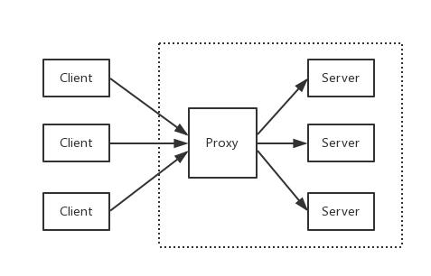

> <h3/>
- [Nginx入门介绍](#Nginx入门介绍)
- [基本使用](#基本使用)
	- [常用命令](#常用命令)
- [部署](#部署)
	- [反向代理](#反向代理)


<br/><br/><br/>

***
<br/>

> <h1 id="Nginx入门介绍">Nginx入门介绍</h1>
**是什么?**
Nginx 是一个 Web Server，可以用作反向代理、负载均衡、邮件代理、TCP / UDP、HTTP 服务器等等，它拥有很多吸引人的特性，例如：
- 以较低的内存占用率处理 10,000 多个并发连接（每 10k 非活动 HTTP 保持活动连接约 2.5 MB ）
- 静态服务器（处理静态文件）
- 正向、反向代理
- 负载均衡
- 通过 OpenSSL 对 TLS / SSL 与 SNI 和 OCSP 支持
- FastCGI、SCGI、uWSGI 的支持
- WebSockets、HTTP/1.1 的支持
- Nginx + Lua

<br/><br/><br/>

***
<br/>

> <h1 id="基本使用">基本使用</h1>
**安装**

```sh
brew install nginx
```

使用 Homebrew 安装, 默认会使用 /usr/local/etc/nginx/nginx.conf 作为配置文件

```sh
/usr/local/etc/nginx/nginx.conf
```

默认Nginx配置:

```nginx
worker_processes  1;

events {
    worker_connections  1024;
}

http {
    include       mime.types;
    default_type  application/octet-stream;

    sendfile        on;
    keepalive_timeout  65;
    
    #Nginx测试监听80端口配置
    server {
        listen       80;
        server_name  localhost;

        location / {
            root   html;
            index  index.html index.htm;
        }
    }
}
```

然后进行如下测试:

```sh
curl -I http://localhost:8080

HTTP/1.1 200 OK
Server: nginx/1.27.4
Date: Sat, 15 Mar 2025 05:37:15 GMT
Content-Type: text/html
Content-Length: 615
Last-Modified: Wed, 05 Feb 2025 11:21:42 GMT
Connection: keep-alive
ETag: "67a349c6-267"
Accept-Ranges: bytes

ganghuang@GangHuangs-MacBook-Pro ~ % curl -I http://localhost
HTTP/1.1 200 OK
Server: nginx/1.27.4
Date: Sat, 15 Mar 2025 05:37:41 GMT
Content-Type: text/html
Content-Length: 615
Last-Modified: Wed, 05 Feb 2025 11:21:42 GMT
Connection: keep-alive
ETag: "67a349c6-267"
Accept-Ranges: bytes
```

<br/><br/>
> <h3 id="常用命令">常用命令</h3>
**常用命令:**

| 用法 | 命令 | 描述 |
|:--|:--|:--|
| 显示 Nginx 版本信息、编译器和配置参数的信息 | nginx -V |  |
| 显示 Nginx 版本信息 | nginx -v |  |
| 启动 Nginx | nginx |  |
| Nginx 在 Mac 开机时自动启动 | brew services start nginx |   |
| 如果想要在 Mac 上停止 | brew services stop nginx |  |
| 验证 Nginx 是否运行 | curl -I http://localhost | 返回 HTTP/1.1 200 OK，说明 Nginx 已成功运行。 |
| 停止 Nginx | nginx -s stop |  |
| 重启 Nginx(重新加载配置文件) | nginx -s reload |  |
| 平滑停止 Nginx 服务 | nginx -s quit |  |
|  |  |  |
|  |  |  |
| 测试 Nginx 配置是否正确 | nginx -t  | nginx: the configuration file /opt/homebrew/etc/nginx/nginx.conf syntax is ok <br/><br/>  nginx: configuration file /opt/homebrew/etc/nginx/nginx.conf test is successful |
| 重新加载 Nginx 配置 | nginx -s reload |  |
| 停止 Nginx | nginx -s stop |  |
| 重新启动 Nginx（Homebrew 安装） | brew services restart nginx |  |
| 卸载 Nginx | brew uninstall nginx |  |
| 如果是手动安装的，需要删除 /usr/local/nginx 目录 | sudo rm -rf /usr/local/nginx |  |
|  |  |  |
|  |  |  |
|  |  |  |


<br/><br/>

**涉及配置**
- 1、 proxy_pass：配置反向代理的路径。需要注意的是如果 proxy_pass 的 url 最后为 /，则表示绝对路径。否则（不含变量下）表示相对路径，所有的路径都会被代理过去
- 2、 upstream：配置负载均衡，upstream 默认是以轮询的方式进行负载，另外还支持四种模式，分别是：
	- （1）weight：权重，指定轮询的概率，weight 与访问概率成正比
	- （2）ip_hash：按照访问 IP 的 hash 结果值分配
	- （3）fair：按后端服务器响应时间进行分配，响应时间越短优先级别越高
	- （4）url_hash：按照访问 URL 的 hash 结果值分配


<br/><br/><br/>

***
<br/>

> <h1 id="部署">部署</h1>
需要对 nginx.conf 进行配置，如果你不知道对应的配置文件是哪个，可执行 `nginx -t` 看一下

```sh
% nginx -t
nginx: the configuration file /opt/homebrew/etc/nginx/nginx.conf syntax is ok
nginx: configuration file /opt/homebrew/etc/nginx/nginx.conf test is successful
```


<br/><br/><br/>
> <h2 id="反向代理">反向代理</h2>
反向代理是指以代理服务器来接受网络上的连接请求，然后将请求转发给内部网络上的服务器，并将从服务器上得到的结果返回给请求连接的客户端，此时代理服务器对外就表现为一个反向代理服务器。



<br/>

**配置 hosts**
由于需要用本机作为演示，因此先把映射配上去，打开 /etc/hosts，增加内容：

```sh
127.0.0.1       api.blog.com
```

确保 hosts 文件中已正确绑定：在终端执行 

```sh
ping api.blog.com

PING api.blog.com (127.0.0.1): 56 data bytes
64 bytes from 127.0.0.1: icmp_seq=0 ttl=64 time=0.099 ms
```

<br/>

**配置 nginx.conf**

打开 nginx 的配置文件 nginx.conf（我的是 /opt/homebrew/etc/nginx/nginx.conf），我们做了如下事情：

增加 server 片段的内容，设置 server_name 为 api.blog.com 并且监听 8081 端口，将所有路径转发到 http://127.0.0.1:8000/ 下:

```nginx
worker_processes  1;

events {
    worker_connections  1024;
}


http {
    include       mime.types;
    default_type  application/octet-stream;

    sendfile        on;
    keepalive_timeout  65;
    
    # MLC_GO反向代理配置
    server {
        listen       8081;
        server_name  api.blog.com;

        location / {
            proxy_pass http://127.0.0.1:8000;
        }
    }
}
```

<br/>

**验证**

启动 go-gin-example

回到 go-gin-example 的项目下，执行 make，再运行` ./MLC_GO`

<br/>

**重启Nginx**

```sh
nginx -t

// 刷新配置
nginx -s reload
```

效果如下:


**注意:** 当时因为打开了VPN导致一直无法成功,当时当我在Chrome时是可以的,我联想到把VPN代理关掉,发现是可以请求的,否则一直报错 **502**.

<br/><br/>

**负载均衡**

负载均衡，英文名称为 Load Balance（常称 LB），其意思就是分摊到多个操作单元上进行执行（来自百科）

你能从运维口中经常听见，XXX 负载怎么突然那么高。 那么它到底是什么呢？

其背后一般有多台 server，系统会根据配置的策略（例如 Nginx 有提供四种选择）来进行动态调整，尽可能的达到各节点均衡，从而提高系统整体的吞吐量和快速响应

<br/>

**如何演示**

前提条件为多个后端服务，那么势必需要多个 go-gin-example，为了演示我们可以启动多个端口，达到模拟的效果

为了便于演示，分别在启动前将 conf/app.ini 的应用端口修改为 8001 和 8002（也可以做成传入参数的模式），达到启动 2 个监听 8001 和 8002 的后端服务

<br/>

**配置 nginx.conf**

回到 nginx.conf 的老地方，增加负载均衡所需的配置。新增 upstream 节点，设置其对应的 2 个后端服务，最后修改了 proxy_pass 指向（格式为 http:// + upstream 的节点名称）

```sh
% nginx -t
nginx: the configuration file /opt/homebrew/etc/nginx/nginx.conf syntax is ok
nginx: configuration file /opt/homebrew/etc/nginx/nginx.conf test is successful
ganghuang@GangHuangs-MacBook-Pro ~ % nginx -s reload
```

<br/>

**验证**

再重复访问 `http://api.blog.com:8081/auth?username={USER_NAME}}&password={PASSWORD}`，多访问几次便于查看效果

目前 Nginx 没有进行特殊配置，那么它是轮询策略，而 go-gin-example 默认开着 debug 模式，看看请求 log 就明白了.


