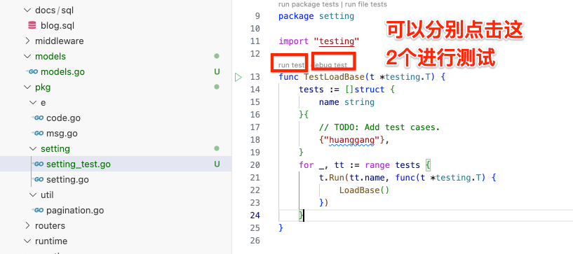
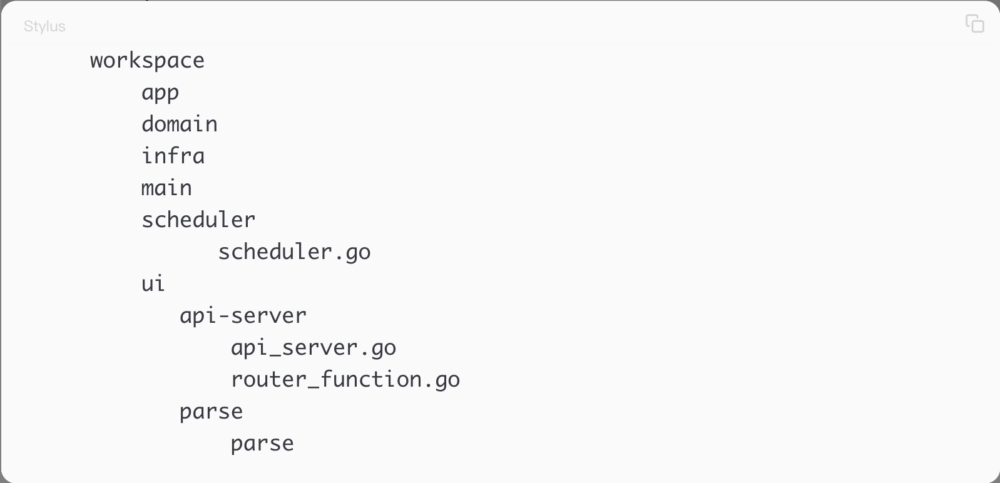
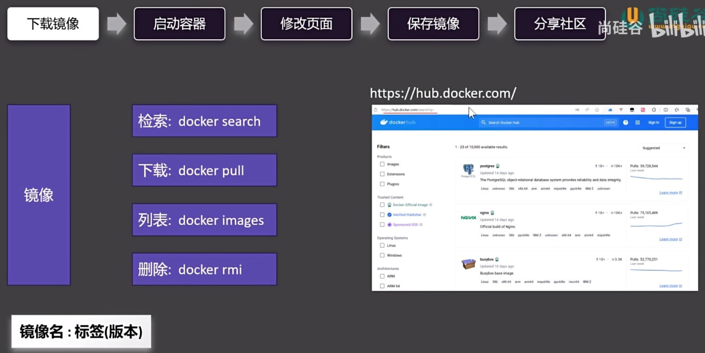
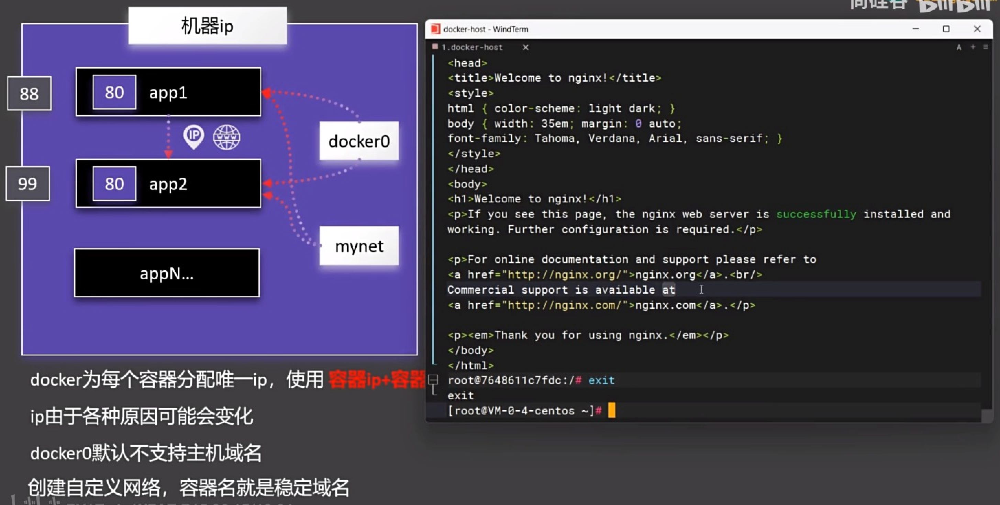
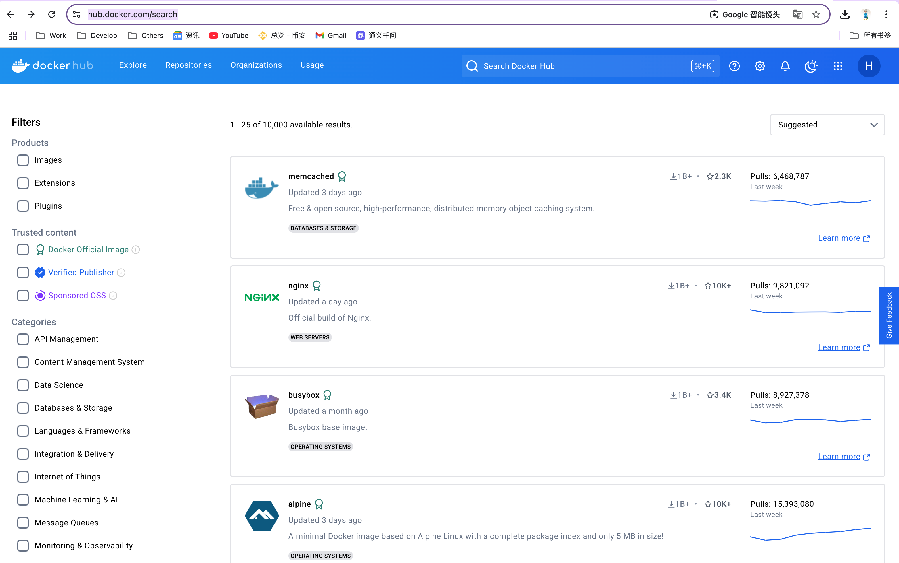
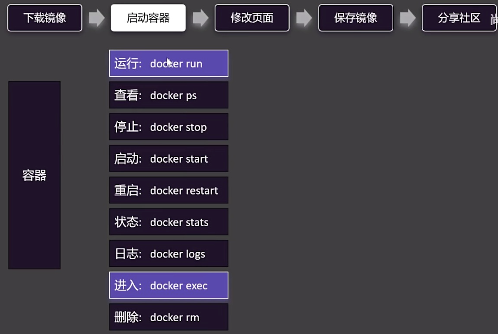
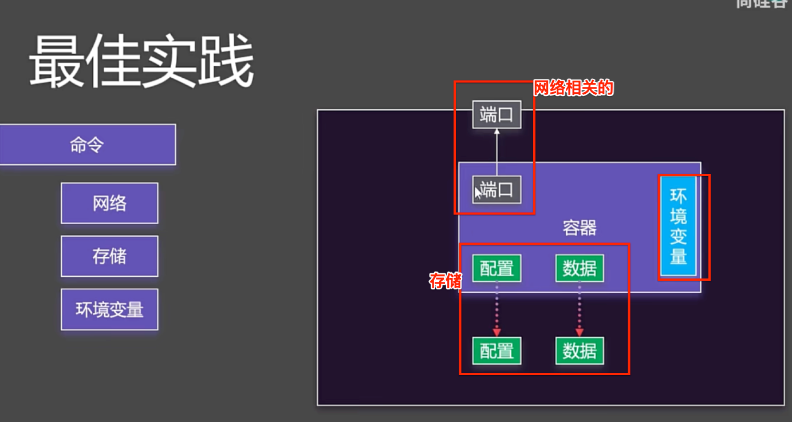

> <h2 id=''></h2>
- [**调试**](#调试)
	- [单元测试](#单元测试)
	- [压力测试（性能测试）](#压力测试)
	- [Delve调试](#Delve调试)
		- [图形界面调试](#图形界面调试)
		- [调试正在运行的程序](#调试正在运行的程序)
		- [dlv的案例1](#dlv的案例1)
- [**API测试工具**](#API测试工具)
	- [Curl进行API测试](#Curl进行API测试) 
		- [发送GET请求](#发送GET请求) 
		- [发送POST请求](#发送POST请求) 
		- [添加请求头](#添加请求头) 
		- [发送带认证的请求](#发送带认证的请求) 
		- [下载文件](#下载文件) 
		- [跟随重定向](#跟随重定向) 
		- [显示响应头](#显示响应头) 
		- [保存响应到文件](#保存响应到文件) 
		- [显示请求&响应详情（调试API）](#显示请求&响应详情（调试API）)
		- [🌟`curl`高级用法](#🌟`curl`高级用法)
	- [HTTPie进行API测试](#HTTPie进行API测试) 
	- [Postman进行API测试](#Postman进行API测试) 
	- [VSCode插件API测试](#VSCode插件API测试)
- [**项目组织结构**](#项目组织结构)
	- [领域驱动的方式](#领域驱动的方式)
	- [业务驱动的方式](#业务驱动的方式)
	- [模型设计](#模型设计)
- [**代码管理托管**](#代码管理托管)
	- [git忽略文件模版](#git忽略文件模版)
		- [chatgpt忽略模版](#chatgpt忽略模版)
		- [deepseek忽略模版](#deepseek忽略模版)
- [**Makefile构建项目**](#Makefile构建项目)
	- [语法规范](#语法规范)
	- [Go项目的命令](#Go项目的命令)
	- [makefile文件](#makefile文件)
		- [变量定义部分](#变量定义部分)
		- [链接参数（LDFLAGS）](#链接参数（LDFLAGS）) 
		- [构建目标](#构建目标) 
		- [运行](#运行)
- [**区分生产、开发、测试环境**](#区分生产、开发、测试环境)
	- [使用配置文件ymal](#使用配置文件ymal) 
	- [使用`.env`文件](#使用`.env`文件) 
	- [buildtags编译时区分环境](#buildtags编译时区分环境) 
	- [使用命令行参数](#使用命令行参数) 
	- [总结](#总结)
- [**容器化平台**](#容器化平台)
	- [容器化部署](#容器化部署)
	- [Docker](#Docker)
		- [介绍](#介绍)
			- [Docker使用](#Docker使用)
		- [镜像](#镜像)
			- [制作镜像](#制作镜像)
			- [镜像分层存储](#镜像分层存储)
			- [镜像分层存储](#镜像分层存储)
		- [docker大致命令介绍](#docker大致命令介绍)
		- [自定义网络](#自定义网络)
		- [启动容器命令](#启动容器命令)
		- [Docker Compose批量管理容器](#DockerCompose批量管理容器)
		- [Docker启动mysql](#Docker启动mysql)
		- [自动CI/CD](#自动CI/CD)
- [**面向接口编程**](#面向接口编程)
	- [搜索引擎的基本使用](#搜索引擎的基本使用)
	- [客户端go-elasticsearch的使用](#客户端go-elasticsearch的使用) 
	- [面向接口编程](#面向接口编程)
- [**Go学习路径**](#Go学习路径)
	- [内置库](#内置库)
		- [访问官方文档](#访问官方文档) 
		- [内置库版本管理](#内置库版本管理) 
		- [命令行工具开发](#命令行工具开发) 
		- [Web开发框架推荐](#Web开发框架推荐)
	- [系统工程](#系统工程)
		- [迭代开发/测试](#迭代开发/测试)  
		- [持续集成(CI)](#持续集成(CI)) 
		- [持续部署(CD)](#持续部署(CD)) 
		- [多组件部署](#多组件部署)
		- [监控运维](#监控运维)
- [**项目语法**](#项目语法)
	- [BeekQuickProject陌生语法](#BeekQuickProject陌生语法)
		- [参数验证](#参数验证)
		- [自定义结构体认证](#自定义结构体认证)
		- [记录请求日志](#记录请求日志)
		- [model使用XORM库序列化](#model使用XORM库序列化)
		- [chapter11项目组织结构](#chapter11项目组织结构)
	- [**MLC_GO中的PracticeGenExample**](#MLC_GO中的PracticeGenExample)
		- [`map[string]interface{}`用法](#`map[string]interface{}`用法)
	- [**DeepSeek本地Mac电脑部署**](#DeepSeek本地Mac电脑部署)
- **优秀资源**
	- [盘点 GitHub 那些标星超过 20 K 的 Golang 优质开源项目](https://blog.csdn.net/yuzhou_1shu/article/details/127066562)
	- [Go实战项目（简书-Leo丶Dicaprio）](https://www.jianshu.com/u/151e4eccc2e2)
	- [煎鱼大佬的技术博客-Go学习之路（可以照着代码敲试一试）](https://eddycjy.com/tags/go/)
		- [「连载一」Go 介绍与环境安装](https://eddycjy.com/posts/go/gin/2018-02-10-install/)
	- [go-tutorial(各种学习链接包含Docker学习，搜索docker即可)](https://github.com/jincheng9/go-tutorial?tab=readme-ov-file)
	- [Go 的 Web 教程(源码)](https://go-mega.bonfy.im)
	- [人言兑博客](https://blog.axiaoxin.com/categories/)
		- [Golang Web开发：实现注册、登录与密码验证—bcrypt加密与存储详解](https://blog.axiaoxin.com/post/golang-web-dev-pwd-bcrypt/)
	- [golang实战-（一系列教程-源码）丶吃鱼的猫（博客园）](https://www.cnblogs.com/eatfishcat/p/15953162.html)
	- [客户端制作教程（github-其他博客含有爬虫demo可以学习下）](https://github.com/GopherCoder/gitcli/tree/master)


<br/><br/><br/>

***
<br/>

> <h1 id="调试">调试</h1>
><h2  id="单元测试">单元测试</h2>
- **选中调试代码如下：**

在`setting.go`文件中，选中如下代码：

```
func LoadBase() {
	RunMode = Cfg.Section("").Key("RUN_MODE").MustString("debug")
}
```

<br/>

- **生成测试代码**

在Mac点击`fn+F1组合键`打开VSCode控制面板，输入`test`，选中如下图：


然后第一次会生成一个setting_test.go文件（单元测试文件是以 *_test.go结尾的文件），并生成如下代码：

```

package setting

import "testing"

func TestLoadBase(t *testing.T) {
	tests := []struct {
		name string
	}{
		// TODO: Add test cases.
		// 这个测试需要自己写的
		{"huanggang"},
	}
	for _, tt := range tests {
		t.Run(tt.name, func(t *testing.T) {
			LoadBase()
		})
	}
}
```



<br/><br/>
你也可以如下运行：

```
// cd 到指定单元测试文件夹下
cd '/Users/ganghuang/HGFiles/GitHub/GoProject/src/MLC_GO/TestNotes
/PracticeGenExample/pkg/setting'

// 运行
go test
 
 
PASS
ok      MLC_GO/TestNotes/PracticeGenExample/pkg/setting 0.599s

// 或者获取详细信息
go test -v
=== RUN   TestLoadBase
=== RUN   TestLoadBase/huanggang
--- PASS: TestLoadBase (0.00s)
    --- PASS: TestLoadBase/huanggang (0.00s)
PASS
ok      MLC_GO/TestNotes/PracticeGenExample/pkg/setting 0.378s
```


<br/><br/><br/>
> <h2 id="压力测试">压力测试</h2>

基准测试或者压力测试的方法必须以Benchmark方法开头，并且只有参数，参数类型是` *testing.B`

```
func BencahmarkAdd(t *testing.B) {

}
```

`go test `命令自动执行 `cd 文件路径 `下的所有基准测试，并且打印耗时。

若是想测试某个包下的所有压力测试(基准测试)，可以用如下命令：

```
go test -bench .
```

若是执行某一个压力测试方法，可以如下：

```shell
// BenachAdd 为要测试的方法明
go test -bench BenachAdd
```


<br/><br/><br/>

># <h2 id="Delve调试">[Delve调试](https://blog.csdn.net/love666666shen/article/details/88887086)</h2>
- **安装**

```
go install github.com/go-delve/delve/cmd/dlv@latest

// 确认是否安装好
ganghuang@GangHuangs-MacBook-Pro MLC_GO % which dlv
/Users/ganghuang/HGFiles/GitHub/GoProject/bin/dlv
```

<br/>

- delve使用：
	- dlv命令， dlv debug 包的路径或源代码路径；
	- Dlv会编译我们的程序，然后进入调试界面；
	- 使用VSCode进行调试，图形界面的使用；

在项目的main.go文件下，又如下代码：

```
package main

import (
	"net/http"

	"github.com/gin-gonic/gin"
)


func init() {

}

func main() {
	dlvTest()
}

func dlvTest(){
	router := gin.Default()

	router.GET("/welcome", HelloHandler)
	router.Run(":8000")
}
func HelloHandler(c *gin.Context) {
	firstName := c.DefaultQuery("firstname", "Guest")
	lastName := c.Query("lastname")
	c.String(http.StatusOK, "Hello %s %s", firstName, lastName)
}
```

**A终端窗口命令：**

```
go run main.go


[GIN-debug] [WARNING] Creating an Engine instance with the Logger and Recovery middleware already attached.

[GIN-debug] [WARNING] Running in "debug" mode. Switch to "release" mode in production.
 - using env:   export GIN_MODE=release
 - using code:  gin.SetMode(gin.ReleaseMode)

[GIN-debug] GET    /welcome                  --> main.HelloHandler (3 handlers)
[GIN-debug] [WARNING] You trusted all proxies, this is NOT safe. We recommend you to set a value.
Please check https://pkg.go.dev/github.com/gin-gonic/gin#readme-don-t-trust-all-proxies for details.
[GIN-debug] Listening and serving HTTP on :8000
```

另打开一个**B终端窗口：**

```shell
curl http://localhost:8000/welcom\?firstName\=海贼王🐦<200d>🔥\&lastName\=组合梁

// 在A窗口出现：
[GIN] 2025/02/25 - 14:03:48 | 404 |         416ns |             ::1 | GET      "/welcom?firstName=海贼王🐦\u200d🔥&lastName=组合梁"
贼王🐦\u200d🔥&lastname=组合梁"


ganghuang@GangHuangs-MacBook-Pro MLC_GO % curl http://localhost:8000/welcom\?firstname\=XiongYing\&lastname\=LiBai

// 出现
[GIN] 2025/02/25 - 14:05:56 | 404 |         875ns |             ::1 | GET      "/welcom?firstname=XiongYing&lastname=LiBai"

```

<br/>

**然后使用B终端窗口使用dlv调试**,使用**dlv调试，需要把main.go运行起来**

```shell
// 进入调试
dlv debug main.go
Type 'help' for list of commands.

// 或者cd xxx(main.go)所在文件夹下
dlv debug
```
<br/>
- **‌ b 设置断点**

```shell
// b 设置断点， HelloHandler 是函数
(dlv) b HelloHandler

// 比如在main.go下有一个dlvTest2()函数，想给dlvTest2()断点，可以这样做：
b main.dlvTest2
```
<br/>

- **c 表示continue，执行到断点位置**

```shell
c

[GIN-debug] [WARNING] Creating an Engine instance with the Logger and Recovery middleware already attached.

[GIN-debug] [WARNING] Running in "debug" mode. Switch to "release" mode in production.
 - using env:   export GIN_MODE=release
 - using code:  gin.SetMode(gin.ReleaseMode)

[GIN-debug] GET    /welcome                  --> main.HelloHandler (3 handlers)
[GIN-debug] [WARNING] You trusted all proxies, this is NOT safe. We recommend you to set a value.
Please check https://pkg.go.dev/github.com/gin-gonic/gin#readme-don-t-trust-all-proxies for details.
[GIN-debug] Listening and serving HTTP on :8000
[GIN-debug] [ERROR] listen tcp :8000: bind: address already in use
Process 49979 has exited with status 0
```

<br/>

- **发出请求**

```shell
curl http://localhost:8000/welcom\?firstname\=海贼王🐦<200d>🔥\&lastname\=组合梁
```

<br/>
- n 下一步

```
n
```

<br/>
- 打印变量

```
p firstname
```

<br/>
- 进入函数内部

```
// s step 下一步，进入下一个函数
s
```

<br/>
- 跳出内部函数

```
// stepout 跳出内部函数
stepout
```

<br/>
- 重新执行调试
	- r

<br/>
- 结束
	- exit

<br/><br/>
> <h2 id="dlv的案例1">dlv的案例1</h2>
在PracticeGo工程文件夹下：

```
dlv debug main.go
```

我想在当前文件夹下 `./server/server.go` 中的 `server.go` 中Run()方法打断点如何做？

**在 server.go 中设置断点**

在 Delve 启动之后，你可以通过 Delve 的命令行界面设置断点。假设你想在 server.go 文件中的 Run() 方法上打断点，你可以使用以下命令：

```bash
break ./server/server.go:line_number

//如：
break ./server/server.go:20
```

替换 line_number 为 Run() 方法所在的实际行号。

<br/>

**通过函数名称设置断点**
另外，如果你知道 Run() 方法的具体函数签名，你也可以通过函数名称来设置断点：

```bash
break server.Run
```

<br/><br/>
> <h3  id="图形界面调试">图形界面调试</h3>

- 打断点
- 点击`运行和调试`

即可开启图形界面调试了，调用的还是dlv进行调试的


<br/><br/>
> <h3  id="调试正在运行的程序">调试正在运行的程序</h3>

- **线程调试，dlv命令：**

```
dlv attach 进程ID
```

<br/>

```shell
cd xxxx（main.go所在路径）

// 线程所在id
ps aux|grep dlv                 
ganghuang        17642   0.0  0.0 410208944   1232 s007  S+    4:01下午   0:00.00 grep dlv
```

但是上述不是dlv的所在的线程ID，不对，不知道怎么回事！！

若是启动了，则用：

```
dlv attach 进程ID

b main.go：11（行数）
```


<br/>

***
<br/><br/><br/>

> <h1 id="API测试工具">API测试工具</h1>

在 Go 语言开发过程中，使用 API 测试工具（如 Curl、HTTPie、Postman 和 VSCode 插件）可以帮助调试和验证 API 是否正常工作。

<br/>

- **3者总结对比**

| 工具 | 适用场景 |  优势  |  缺点 |
|------|---------|-------|-------|
| Curl | 命令行测试 API | 轻量级、通用 | 语法较复杂 |
| HTTPie | 命令行测试 API | 语法更简洁、可读性更好 | 需额外安装 |
| Postman | GUI 测试 API | 适合团队协作、支持环境变量、自动化 | 需要 GUI、较占资源 |
| VSCode REST Client | 代码编辑器内测试 API | 无需离开 VSCode，便于记录请求 | 需要插件，功能比 Postman 少 |

<br/>

- 如果你是**命令行爱好者**，推荐使用 `Curl` 或 `HTTPie`。  
- 如果你喜欢**可视化操作**，`Postman` 是最佳选择。  
- 如果你希望**在 VSCode 直接测试 API**，`REST Client` 插件是个不错的选择。

<br/><br/><br/>
> <h2 id="Curl进行API测试">Curl进行API测试</h2>

**📌 `curl` 是什么？**
`curl`（Client URL）是一个**命令行工具**，用于发送 HTTP 请求、下载文件、调试 API 等。支持多种协议，如 HTTP、HTTPS、FTP、SFTP 等。

<br/><br/>
> <h3 id="发送GET请求">发送GET请求</h3>

```bash
curl http://example.com
```
🔹 **默认使用 GET 方法**，相当于在浏览器里访问 `http://example.com`。

<br/>

**发送带 Token 的请求**

```sh
curl -X GET http://localhost:8080/api/protected \
     -H "Authorization: Bearer YOUR_ACCESS_TOKEN"
```

<br/><br/>
> <h3 id="发送POST请求">发送POST请求</h3>

```bash
curl -X POST http://example.com -d "username=admin&password=123456"
```
🔹 `-X POST` 指定 `POST` 方法，`-d` 发送表单数据。

<br/>

**发送 POST 请求（JSON 数据）**

```sh
curl -X POST http://localhost:8080/api/users \
     -H "Content-Type: application/json" \
     -d '{"name": "Alice", "email": "alice@example.com"}'
```
🔹 `-H` 设置请求头，`-d` 发送 JSON 数据。

<br/><br/>
> <h3 id="添加请求头">添加请求头</h3>

```bash
curl -H "Authorization: Bearer TOKEN" \
     -H "Accept: application/json" \
     http://example.com/api
```
🔹 `-H` 设置多个请求头，适用于 API 调试。


<br/><br/>
> <h3 id="发送带认证的请求">发送带认证的请求</h3>

```bash
curl -u username:password http://example.com/protected
```
🔹 `-u` 发送 **Basic Auth** 认证（用户名/密码）。

<br/><br/>
> <h3 id="下载文件">下载文件</h3>

```bash
curl -O http://example.com/file.zip
```
🔹 `-O` **保存文件**，文件名与远程一致。

```bash
curl -o myfile.zip http://example.com/file.zip
```
🔹 `-o` **自定义文件名**。

<br/><br/>
> <h3 id="跟随重定向">跟随重定向</h3>

```bash
curl -L http://example.com
```
🔹 `-L` **自动跟随 301/302 重定向**。

<br/><br/>
> <h3 id="显示响应头">显示响应头</h3>

```bash
curl -I http://example.com
```
🔹 `-I` **只显示响应头**（HEAD 请求）。

<br/><br/>
> <h3 id="保存响应到文件">保存响应到文件</h3>

```bash
curl http://example.com -o output.html
```
🔹 `-o` **将响应内容保存为 `output.html`**。


<br/>

***
<br/>

> <h3 id="显示请求&响应详情（调试API）">显示请求 & 响应详情（调试 API）</h3>


```bash
curl -v http://example.com
```
🔹 `-v` **显示详细的请求/响应信息**，用于调试。

```bash
curl -vvv http://example.com
```
🔹 `-vvv` **更详细的调试信息**。

---
<br/><br/>
> <h3 id="🌟`curl`高级用法">🌟 `curl` 高级用法</h3>

| 功能 | 命令 |
|------|------|
| **GET 请求** | `curl http://example.com` |
| **POST 请求** | `curl -X POST -d "name=John" http://example.com` |
| **发送 JSON** | `curl -X POST -H "Content-Type: application/json" -d '{"key":"value"}' http://example.com` |
| **下载文件** | `curl -O http://example.com/file.zip` |
| **认证请求** | `curl -u user:pass http://example.com` |
| **设置请求头** | `curl -H "Authorization: Bearer TOKEN" http://example.com` |
| **自动重定向** | `curl -L http://example.com` |
| **查看响应头** | `curl -I http://example.com` |
| **调试模式** | `curl -v http://example.com` |


<br/><br/><br/>
> <h2 id="HTTPie进行API测试">HTTPie进行API测试</h2>

`HTTPie` 是 `Curl` 的替代品，语法更直观，适用于 API 调试。

- **安装 HTTPie**

```sh
pip install httpie  # 需要 Python
```

<br/>

**示例 1：发送 GET 请求**

```sh
http GET http://localhost:8080/api/users
```

<br/>

**示例 2：发送 POST 请求（JSON 数据）**

```sh
http POST http://localhost:8080/api/users name="Alice" email="alice@example.com"
```

<br/>

**示例 3：发送带 Token 的请求**

```sh
http GET http://localhost:8080/api/protected "Authorization: Bearer YOUR_ACCESS_TOKEN"
```

<br/><br/><br/>
> <h2 id="Postman进行API测试">Postman进行API测试</h2>

Postman 是一个图形化 API 测试工具，适用于复杂的 API 交互、自动化测试、Mock API 等。

- **使用步骤**
	1. **安装 Postman**：从 [Postman 官网](https://www.postman.com/) 下载并安装。
	2. **创建请求**：
	   - 选择 **GET、POST、PUT、DELETE** 等方法。
	   - 填写 **URL**（如 `http://localhost:8080/api/users`）。
	   - 添加 **Headers**（如 `Content-Type: application/json`）。
	   - 若为 `POST` 或 `PUT`，在 **Body** 选项卡填入 JSON 数据。
	3. **点击“Send”** 发送请求并查看响应。

<br/><br/><br/>
> <h2 id="VSCode插件API测试">VSCode插件API测试</h2>

VSCode 提供多种 API 测试插件，常用的是 `REST Client` 插件。

- **安装 REST Client 插件**
	- 打开 VSCode，按 `Cmd + Shift + X`（Mac）或 `Ctrl + Shift + X`（Windows）。
	- 搜索 `REST Client` 并安装。

<br/>

- **创建 API 请求**

在 `.http` 或 `.rest` 文件中写入请求，例如：

```http
### 发送 GET 请求
GET http://localhost:8080/api/users

### 发送 POST 请求
POST http://localhost:8080/api/users
Content-Type: application/json

{
    "name": "Alice",
    "email": "alice@example.com"
}
```

<br/>

- **执行请求**
	1. 在 VSCode 打开 `.http` 文件。
	2. 在请求上方会出现 `Send Request` 按钮，点击即可运行并查看响应。


<br/>

***
<br/><br/><br/>
- <h1 id="项目组织结构">项目组织结构</h1>

<br/><br/><br/>
> <h2 id="领域驱动的方式">领域驱动的方式</h2>

领域驱动讲究的是将项目整体按照领域驱动的方式进行组织。

- **领域驱动设计主要包括以下4部分：**
	- 应用层(Application)。
	- 基础设施层(Infrastructure)。
	- 领域层(Domain)。
	- 用户界面层(UserInterface)。

<br/>

- (1)应用层主要完成的任务是为程序提供任务处理，即调用抽象之后的应用。
- (2)基础设施层主要是与业务不相关的代码块的集合，比如字符串操作、数值运算、文件操作等。
- (3)领域层领域层是领域驱动设计的核心，首先需要根据项目抽象出领域内的相关概念，再在领域内相关概念的基础上完成资源的操作。
- (4)用户界面层负责向用户展现信息，并且会解析用户行为，即常说的展现层。以设计一个RESTful API风格的项目为例，领域驱动设计的项目组织的结构大概如下：



<br/><br/><br/>
> <h2 id="业务驱动的方式">业务驱动的方式</h2>

在日常开发过程中，编写API的业务需求应该很多，特别是选择Web方面的工作。Web框架一般采用标准的MVC架构，即Model（模型层）​、View（视图层）​、Controller（控制层）​。


<br/>


下面这种风格的项目组织适合绝大多数Web层面的项目开发。

- cmd：命令行功能集合(命令行工具，包括数据库中数据表的创建、迁移、数据导入等)。
- configs：项目的配置文件集合(项目的配置文件，包括数据库的配置文件等)。
- deployments：构建Docker镜像等文件集合(容器相关的文件)。 
- docs：文档集合。
- initializers：初始化文件集合。
- logs：存储项目日志文件集合。
- pkg：项目辅助功能，比如中间件、插件等(项目的使用库)。
- scripts：脚本文件集合。
- src：项目的核心文件，核心的处理环节(项目的核心逻辑)。
- tools：项目辅助工具。
- vendor：第三方库文件集合。
- main.go：项目函数入口(项目主入口)。
- Makefile：项目构建命令集合(项目构建，提供简易的命令（类UNIX操作系统的支持）​)。
- model：模型文件;
- account：产品实体的抽象;
- assistance.go：辅助函数;
- controller.go：控制器的核心处理;
- param.go：请求参数;
- router.go：路由;

<br/><br/>

<br/><br/><br/>
> <h2 id="模型设计">模型设计</h2>

模型设计的重点在于数据表的设计，数据表的设计包括两个方面：表名的设计、表中字段及字段类型的设计。模型是对实体的抽象，意味着设计数据表的结构首先需要明确实体是什么。如何知道这些实体？从设计图、需求文档中了解。

表名的设计要统一规范：**`数据库+实体的形式，比如beeQuick_account。`**


<br/>

***
<br/><br/><br/>

> <h1 id="代码管理托管">代码管理托管</h1>

- GitLab：支持无限公有、私有项目，其网址为[https://about.gitlab.com/](https://about.gitlab.com/)。

- BitBucket：免费支持5个开发成员的团队创建无限私有代码托管库，其网址为[https://bitbucket.org/](https://bitbucket.org/)。

- 开源中国：网址为[http://git.oschina.net/](http://git.oschina.net/)。

- coding.net：网址为[https://coding.net/home.html](https://coding.net/home.html)。

- 码云：网址为[https://gitee.com/](https://gitee.com/)。


<br/><br/>

在日常开发过程中，如何使用Git进行开发？

- 维护主分支master。

- 维护开发分支dev。

维护三个分支：master分支负责线上稳定运行；新功能在dev分支上维护；开发人员各自维护自己的开发分支，待开发完成后，合入测试分支，待测试人员测试通过后，将开发人员的开发分支合入master分支。

在日常开发过程中，需要不断地开发新功能，建议分支命名具有一定的规范性，提供一些命名规范。

- 功能开发：`operator_feat_date`，即`开发者——功能开发——开发日期`。
- 修复功能：`operator_fix_date`，即`开发者——修复功能——修复日期`。


<br/><br/><br/>
> <h2 id="git忽略文件模版">git忽略文件模版</h2>

<br/><br/>
> <h3  id="chatgpt忽略模版">chatgpt忽略模版</h3>

**Golang 项目 `.gitignore`（适用于 macOS）**

```gitignore
# 1. Go 编译文件
*.exe
*.exe~
*.dll
*.so
*.dylib
*.test
*.out
*.a

# 2. Go Modules 相关
vendor/
go.sum

# 3. 编译缓存（Go 编译时生成的缓存）
*.o
*.a
*.lo
*.la
*.lai
*.rej
*.gox
*.swp
*.swo
*.gcda
*.gcno
*.cover
*.cov
*.prof
*.pb.go
*.pb.gw.go

# 4. MacOS 特有文件
.DS_Store
._*
.Spotlight-V100
.Trashes
.DS_Store?
.AppleDouble
.LSOverride
Icon?
__MACOSX/

# 5. VS Code / JetBrains / Goland 编辑器相关
.vscode/
.idea/
*.iml
*.sublime-workspace
*.sublime-project

# 6. GoLand / JetBrains
/.idea/
/*.iml
/out/
/gen/
/coverage/
*.bak

# 7. Debug 相关
debug/
profile.out

# 8. 日志 / 临时文件
*.log
*.tmp
*.swp
*.swo
*.bak

# 9. Go Workspaces（适用于 Go 1.18+）
go.work
go.work.sum
```

---

### **解释**
1. **Go 编译文件**：忽略 Go 生成的二进制文件，如 `*.exe`、`*.so`、`*.test` 等。
2. **Go Modules 相关**：忽略 `vendor/` 和 `go.sum`，一般建议 `go.mod` 提交，但 `go.sum` 视情况可忽略。
3. **编译缓存**：Go 运行测试和构建时会生成 `*.o`、`*.a` 等临时文件，需要忽略。
4. **macOS 特有文件**：macOS 会自动生成 `.DS_Store`、`._*` 和 `__MACOSX/` 等不必要的文件，这些文件可以忽略。
5. **编辑器相关**：VS Code (`.vscode/`)、JetBrains/Goland (`.idea/`) 以及其他编辑器的缓存文件，避免污染仓库。
6. **Debug 相关**：Golang 调试时可能会生成 `debug/` 或 `profile.out`，这些一般无需提交。
7. **日志和临时文件**：忽略 `*.log`、`*.tmp` 以及 `*.bak` 之类的文件，避免上传无用的日志。
8. **Go Workspaces（适用于 Go 1.18+）**：如果使用 Go 1.18+ 的 workspace，`go.work` 和 `go.work.sum` 可能会出现，可根据需求忽略。

<br/><br/>
> <h3  id="deepseek忽略模版">deepseek忽略模版</h3>
**Golang 项目 `.gitignore` 模板**

```gitignore
# 忽略编译生成的可执行文件
*.exe
*.exe~
*.dll
*.so
*.dylib

# 忽略测试二进制文件
*.test

# 忽略输出目录
/bin/
/pkg/

# 忽略依赖目录
/vendor/

# 忽略 Go 模块的依赖缓存
/go.mod
/go.sum

# 忽略 IDE 配置文件
.idea/
.vscode/
*.swp
*.swo

# 忽略 macOS 特有的文件
.DS_Store
._*

# 忽略日志文件
*.log

# 忽略环境变量文件
.env
.env.local

# 忽略用户特定的文件
*.user
*.suo

# 忽略临时文件
*.tmp
*.temp

# 忽略构建缓存
/.cache/
/.build/

# 忽略覆盖率文件
*.out

# 忽略 Go 工作区文件
go.work
go.work.sum
```

### 详细说明

1. **编译生成的可执行文件**：
   - `*.exe`, `*.exe~`, `*.dll`, `*.so`, `*.dylib`：这些是不同平台下的可执行文件和共享库文件。在 macOS 上，`.dylib` 是动态库文件，通常不需要纳入版本控制。

2. **测试二进制文件**：
   - `*.test`：Go 测试生成的可执行文件，通常不需要纳入版本控制。

3. **输出目录**：
   - `/bin/` 和 `/pkg/`：这些目录通常用于存放编译后的二进制文件和包文件，应该忽略。

4. **依赖目录**：
   - `/vendor/`：如果你使用 `go mod` 管理依赖，`/vendor/` 目录通常不需要纳入版本控制。

5. **Go 模块的依赖缓存**：
   - `go.mod` 和 `go.sum`：这些文件是 Go 模块管理的核心文件，通常需要纳入版本控制，但如果你使用 `go mod vendor`，则可能需要忽略 `/vendor/` 目录。

6. **IDE 配置文件**：
   - `.idea/` 和 `.vscode/`：这些是 JetBrains IDE 和 Visual Studio Code 的配置文件，通常是用户特定的，不需要纳入版本控制。
   - `*.swp` 和 `*.swo`：这些是 Vim 编辑器的临时文件，应该忽略。

7. **macOS 特有的文件**：
   - `.DS_Store`：macOS 系统生成的文件夹元数据文件，通常不需要纳入版本控制。
   - `._*`：macOS 生成的隐藏文件，通常不需要纳入版本控制。

8. **日志文件**：
   - `*.log`：日志文件通常不需要纳入版本控制。

9. **环境变量文件**：
   - `.env` 和 `.env.local`：这些文件通常包含敏感信息，如 API 密钥等，不应该纳入版本控制。

10. **用户特定的文件**：
    - `*.user` 和 `*.suo`：这些是 Visual Studio 用户特定的文件，通常不需要纳入版本控制。

11. **临时文件**：
    - `*.tmp` 和 `*.temp`：临时文件通常不需要纳入版本控制。

12. **构建缓存**：
    - `/.cache/` 和 `/.build/`：这些目录通常用于存放构建缓存，应该忽略。

13. **覆盖率文件**：
    - `*.out`：Go 测试生成的覆盖率文件，通常不需要纳入版本控制。

14. **Go 工作区文件**：
    - `go.work` 和 `go.work.sum`：这些文件是 Go 1.18 引入的工作区管理文件，通常不需要纳入版本控制。

### 总结

这个 `.gitignore` 模板适用于大多数 Golang 项目，并且特别考虑了 macOS 系统的特性。你可以根据项目的具体需求进行调整和扩展。


<br/>

***
<br/><br/><br/>

> <h1 id="Makefile构建项目">Makefile构建项目</h1>

Make是常用的构建工具，Makefile是一个文本文件，遵循一套语法规范，可用来对复杂项目的构建、编译等流程定义一系列规则和指定执行的命令，类似于Shell脚本。通过Makefile文件的定义，最后执行make command便可执行相应的命令。

<br/><br/><br/>
> <h2 id="语法规范">语法规范</h2>

Make的语法规范如下：

```
<target> : <prerequisites>
[tab]  <commands>
```

-  target：命令。
-  prerequisites：前置条件，即执行target命令的前提条件。
-  [tab]​：每个命令之前必须有一个Tab键，当然可以自定义其他的符号。
-  commands：具体的执行命令。

Makefile文件就是由这样一套语法规则构成的，使用的命令是：`make <target>`。还支持一些其他的语法规范，整体使用起来和Shell脚本非常像。


(1)注释：

```
# 注释
```

(2)变量

```
BINARY=go
```

(3)命令

```
<target>: <prerequisites>
[tab]  @<commands>
```

<br/><br/>

**示例**

```
PROJECT=go
default:
     go env
version:
     go version
noecho:
     @go version
.PHONY: default version noecho
```

<br/>

在Makefile所在目录下执行命令：make不带参数时，默认执行第一个命令。

```
make
>>
go env
GOARCH="amd64"
GOBIN="/Users/xiewei/go/bin"
GOCACHE="/Users/xiewei/Library/Caches/go-build"
GOEXE=""
GOFLAGS=""
GOHOSTARCH="amd64"
GOHOSTOS="darwin"
GOOS="darwin"
...
```


<br/>

 make version实质是执行go version。
 
```
// 命令
make version
// 显示结果
go version  // 回显具体执行的命令语句
go version go1.12.7 darwin/amd64 // 执行命令的结果
```

<br/>

make noecho实质是执行go version，不显示具体的命令。

```
// 命令
make noecho
// 显示结果
go version go1.12.7 darwin/amd64
```

- .PHONY表示伪目标，内置的字段一般前置命令是所有的命令。

<br/><br/><br/>
> <h2 id="Go项目的命令">Go项目的命令</h2>

在GitHub上的许多开源项目中都有Makefile文件的身影，用于项目编译、构建，配合自动化流水线，可以完成一整套的持续集成、持续部署操作。针对Go项目，开发者应该提供哪些命令来操作项目呢？在终端下输入Go命令，可以查看Go支持的命令。

- 比较重要且常用的是：
	- 测试。
	- 编译。
	- 静态检查。
	- 运行。
	- 安装下载库。
	- 格式化代码。

<br/>

所以，一个适用于Go项目的Makefile文件也应该支持这些操作，具体可根据项目的实际需求而定，当然也可以自定义命令来完成相应的操作。

- make default：编译。
- make install：下载安装。
- make vet：静态检查。
- make fmt：格式化代码。
- make clean：移除编译的文件。

<br/>

比如下面这个示例：

```
BINARY="votes"
VERSION=1.0.0
BUILD='date +%FT%T%z'
PACKAGES=`go list ./... | grep -v /vendor/`
VETPACKAGES=`go list ./... | grep -v /vendor/ | grep -v /examples/`
GOFILES=`find . -name "*.go" -type f -not -path "./vendor/*"`
default:
 @go build -o ${BINARY} -tags=jsoniter
list:
 @echo ${PACKAGES}
 @echo ${VETPACKAGES}
 @echo ${GOFILES}
fmt:
 @gofmt -s -w ${GOFILES}
fmt-check:
 @diff=$$(gofmt -s -d $(GOFILES)); \
 if [ -n "$$diff" ]; then \
     echo "Please run 'make fmt' and commit the result:"; \
     echo "$${diff}"; \
     exit 1; \
 fi;
install:
 @govendor sync -v
test:
 @go test -cpu=1,2,4 -v -tags integration ./...
vet:
 @go vet $(VETPACKAGES)
docker:
 @docker build . -t wuxiaoxiaoshen/votes:latest -f chapter11/deployments/Dockerfile
clean:
 @if [[ -f ${BINARY} ]] ; then rm ${BINARY} ; fi
.PHONY: default fmt fmt-check install test vet docker clean
```

Makefile文件不但方便开发人员在本地编译、构建项目，而且可以配合自动化流水线，从而完成更多的前置任务。


<br/><br/><br/>
> <h2 id="">makefile文件</h2>

**Makefile文件**

```
BINARY=BeeQuick

VERSION=1.0.0

BUILD=`date +%FT%T%z`

LDFLAGS=-ldflags "-X main.Env=production -s -w"

DEV_LDFLAGS=-ldflags "-X main.Env=dev"

TEST_LDFLAGS=-ldflags "-X main.Env=test"

default:
	go build -o ${BINARY} -v ${DEV_LDFLAGS} -tags=jsoniter

production:
	go build -o ${BINARY} -v ${LDFLAGS} -tags=jsoniter

dev:
	go build -o ${BINARY} -v ${DEV_LDFLAGS} -tags=jsoniter

test:
	go build -o ${BINARY} -v ${TEST_LDFLAGS} -tags=jsoniter

run:
	go run -v ${DEV_LDFLAGS} -tags=jsoniter main.go

.PHONY: default production dev test run
```


这段 `Makefile` 用于编译和运行 Go 代码，并根据不同的环境（开发、测试、生产）使用不同的编译参数。下面是对代码的详细解析：

<br/><br/>
> <h2 id="变量定义部分">变量定义部分</h2>

指定编译后生成的二进制文件名称为 `BeeQuick`。

```makefile
BINARY=BeeQuick
```

<br/>

设定应用程序的版本号为 `1.0.0`。

```makefile
VERSION=1.0.0
```

<br/>

- 获取当前时间作为 `BUILD` 变量的值，格式为 `YYYY-MM-DDTHH:MM:SS+时区`（符合 ISO 8601 格式）。
- 但这里 `BUILD` 变量没有被使用。

```makefile
BUILD=`date +%FT%T%z`
```


<br/><br/>
> <h2 id="链接参数（LDFLAGS）">链接参数（LDFLAGS）</h2>

- `-ldflags` 传递链接参数：
  - `-X main.Env=production`：将 `main.Env` 变量的值设置为 `"production"`。
  - `-s -w`：
    - `-s`：去掉符号表，减少二进制文件体积。
    - `-w`：去掉调试信息，进一步压缩体积。

```makefile
LDFLAGS=-ldflags "-X main.Env=production -s -w"
```


<br/>

- `-X main.Env=dev`：在开发环境下，`main.Env` 变量的值为 `"dev"`。

```makefile
DEV_LDFLAGS=-ldflags "-X main.Env=dev"
```

<br/>

- `-X main.Env=test`：在测试环境下，`main.Env` 变量的值为 `"test"`。

```makefile
TEST_LDFLAGS=-ldflags "-X main.Env=test"
```

<br/><br/>
> <h2 id="构建目标">构建目标</h2>

1.**默认构建 (`default`)**

```makefile
default:
	go build -o ${BINARY} -v ${DEV_LDFLAGS} -tags=jsoniter
```

- `go build`：编译 Go 代码。
- `-o ${BINARY}`：输出二进制文件到 `BeeQuick`。
- `-v`：显示编译过程中导入的包。
- `${DEV_LDFLAGS}`：使用 `dev` 环境的 `ldflags`，即 `-X main.Env=dev`。
- `-tags=jsoniter`：使用 `jsoniter` 作为 JSON 解析库（需要在代码中 `// +build jsoniter` 或 `//go:build jsoniter`）。

<br/>

- 2.**生产环境构建 (`production`)**

```makefile
production:
	go build -o ${BINARY} -v ${LDFLAGS} -tags=jsoniter
```
- 和 `default` 类似，但使用 `LDFLAGS`（即 `main.Env=production`）。

<br/>

- 3.**开发环境构建 (`dev`)**

```makefile
dev:
	go build -o ${BINARY} -v ${DEV_LDFLAGS} -tags=jsoniter
```

- 与 `default` 目标一致，也是开发环境构建。

<br/>

- 4.**测试环境构建 (`test`)**

```makefile
test:
	go build -o ${BINARY} -v ${TEST_LDFLAGS} -tags=jsoniter
```
- 使用 `TEST_LDFLAGS`，即 `main.Env=test`。

<br/><br/>
> <h2 id="">运行</h2>

- **运行目标**

```makefile
run:
	go run -v ${DEV_LDFLAGS} -tags=jsoniter main.go
```
- `go run`：编译并运行 `main.go`。
- `-v`：显示编译过程。
- `${DEV_LDFLAGS}`：使用开发环境（`main.Env=dev`）。
- `-tags=jsoniter`：使用 `jsoniter` 作为 JSON 解析库。

<br/>

- **伪目标 (`.PHONY`)**

```makefile
.PHONY: default production dev test run
```

- `.PHONY` 声明这些目标是伪目标，即使目录中存在同名文件，也不会把它们当作文件来执行，而是始终执行 Makefile 中的规则。

<br/><br/>


### **总结**
1. **支持不同环境的编译**：
   - `production`：生产环境（优化二进制大小）。
   - `dev`：开发环境。
   - `test`：测试环境。

2. **支持 JSON 库切换**
   - 通过 `-tags=jsoniter` 让代码可以选择 `jsoniter` 作为 JSON 解析库。

3. **提供 `run` 直接运行 Go 代码**
   - `run` 目标适用于开发阶段，避免每次手动执行 `go build` + `./BeeQuick`。

---

这个 `Makefile` 让 Go 代码的构建和运行更加高效，方便在不同环境中快速切换。🚀


<br/>

***
<br/><br/><br/>

> <h1 id="区分生产、开发、测试环境">区分生产、开发、测试环境</h1>

在 Go 语言中，常见的做法是根据不同的 **环境（开发、测试、生产）** 连接不同的数据库。你可以使用 **配置文件、环境变量、命令行参数** 或 **Go 内置的 `build tags`** 方式来管理不同的数据库连接信息。


<br/><br/><br/>
> <h2 id="使用配置文件ymal">使用配置文件ymal</h2>
我在项目中遇到了config.ymal如下配置：

```
production:
   mysql:
     db: beequick_production
     user: root
     password: admin123
   postgres:
     db: beequick_production
     user: root
     password: admin123
dev:
   mysql:
     db: beequick_dev
     user: root
     password: admin123
   postgres:
     db: beequick_production
     user: root
     password: admin123
test:
   mysql:
     db: beequick_test
     user: root
     password: admin123
   postgres:
     db: beequick_production
     user: root
     password: admin123
```

<br/><br/>

**ymal适用于：** 项目中环境较多，方便管理。

- **1️⃣ 创建 `config.yaml`**

```yaml
database:
  development:
    driver: "mysql"
    dsn: "dev_user:dev_pass@tcp(localhost:3306)/dev_db?charset=utf8mb4&parseTime=True&loc=Local"

  testing:
    driver: "sqlite3"
    dsn: "file::memory:?cache=shared"

  production:
    driver: "mysql"
    dsn: "prod_user:prod_pass@tcp(192.168.1.1:3306)/prod_db?charset=utf8mb4&parseTime=True&loc=Local"
```

<br/>

- **2️⃣ 读取配置文件**

使用 `go-yaml` 解析配置：

```go
package main

import (
	"fmt"
	"log"
	"os"

	"gopkg.in/yaml.v3"
	"gorm.io/driver/mysql"
	"gorm.io/driver/sqlite"
	"gorm.io/gorm"
)

type Config struct {
	Database map[string]struct {
		Driver string `yaml:"driver"`
		DSN    string `yaml:"dsn"`
	} `yaml:"database"`
}

func loadConfig() (*Config, error) {
	file, err := os.ReadFile("config.yaml")
	if err != nil {
		return nil, err
	}
	var config Config
	err = yaml.Unmarshal(file, &config)
	return &config, err
}

func main() {
	config, err := loadConfig()
	if err != nil {
		log.Fatal("读取配置文件失败:", err)
	}

	env := os.Getenv("GO_ENV") // 读取环境变量
	if env == "" {
		env = "development" // 默认开发环境
	}

	dbConfig, exists := config.Database[env]
	if !exists {
		log.Fatal("未找到对应的数据库配置:", env)
	}

	var db *gorm.DB
	switch dbConfig.Driver {
	case "mysql":
		db, err = gorm.Open(mysql.Open(dbConfig.DSN), &gorm.Config{})
	case "sqlite3":
		db, err = gorm.Open(sqlite.Open(dbConfig.DSN), &gorm.Config{})
	default:
		log.Fatal("不支持的数据库驱动:", dbConfig.Driver)
	}

	if err != nil {
		log.Fatal("数据库连接失败:", err)
	}

	fmt.Println("数据库连接成功！")
}
```

<br/>

- **3️⃣ 运行**
- **开发环境**

```sh
GO_ENV=development go run main.go
```

<br/>

- **测试环境**

```sh
GO_ENV=testing go run main.go
```

<br/>

- **生产环境**

```sh
GO_ENV=production go run main.go
```

<br/><br/><br/>

> <h2 id="使用`.env`文件">使用 `.env` 文件</h2>

**适用于：** 需要简单地管理环境变量。

- **1️⃣ 创建 `.env`**

```
GO_ENV=development
DB_DRIVER=mysql
DB_DSN=dev_user:dev_pass@tcp(localhost:3306)/dev_db?charset=utf8mb4&parseTime=True&loc=Local
```

<br/>

- **2️⃣ 读取 `.env` 文件**

使用 `github.com/joho/godotenv`：

```go
package main

import (
	"fmt"
	"log"
	"os"

	"github.com/joho/godotenv"
	"gorm.io/driver/mysql"
	"gorm.io/gorm"
)

func main() {
	err := godotenv.Load()
	if err != nil {
		log.Fatal("加载 .env 文件失败")
	}

	dbDriver := os.Getenv("DB_DRIVER")
	dbDSN := os.Getenv("DB_DSN")

	var db *gorm.DB
	switch dbDriver {
	case "mysql":
		db, err = gorm.Open(mysql.Open(dbDSN), &gorm.Config{})
	default:
		log.Fatal("不支持的数据库驱动:", dbDriver)
	}

	if err != nil {
		log.Fatal("数据库连接失败:", err)
	}

	fmt.Println("数据库连接成功！")
}
```

<br/>

- **3️⃣ 运行**

```sh
GO_ENV=production go run main.go
```

<br/><br/><br/>
> <h2 id="buildtags编译时区分环境">build tags`（编译时区分环境）</h2>

**适用于：** 不想在运行时切换，而是在编译时决定。

- **1️⃣ 创建 `db_dev.go`**

```go
//go:build dev
package config

import (
	"fmt"
	"gorm.io/driver/mysql"
	"gorm.io/gorm"
)

func ConnectDB() (*gorm.DB, error) {
	dsn := "dev_user:dev_pass@tcp(localhost:3306)/dev_db?charset=utf8mb4&parseTime=True&loc=Local"
	db, err := gorm.Open(mysql.Open(dsn), &gorm.Config{})
	if err != nil {
		return nil, err
	}
	fmt.Println("连接开发环境数据库")
	return db, nil
}
```

<br/>

- **2️⃣ 创建 `db_prod.go`**

```go
//go:build prod
package config

import (
	"fmt"
	"gorm.io/driver/mysql"
	"gorm.io/gorm"
)

func ConnectDB() (*gorm.DB, error) {
	dsn := "prod_user:prod_pass@tcp(192.168.1.1:3306)/prod_db?charset=utf8mb4&parseTime=True&loc=Local"
	db, err := gorm.Open(mysql.Open(dsn), &gorm.Config{})
	if err != nil {
		return nil, err
	}
	fmt.Println("连接生产环境数据库")
	return db, nil
}
```

<br/>

- **3️⃣ 运行**

- **开发环境**

```sh
go run -tags=dev main.go
```

<br/>

- **生产环境**

```sh
go run -tags=prod main.go
```

<br/><br/><br/>
> <h2 id="使用命令行参数">使用命令行参数</h2>

**适用于：** 需要在运行时手动指定环境。

```go
package main

import (
	"flag"
	"fmt"
	"log"

	"gorm.io/driver/mysql"
	"gorm.io/gorm"
)

var env string

func init() {
	flag.StringVar(&env, "env", "development", "选择运行环境")
}

func main() {
	flag.Parse() // 解析命令行参数

	var dsn string
	switch env {
	case "development":
		dsn = "dev_user:dev_pass@tcp(localhost:3306)/dev_db?charset=utf8mb4&parseTime=True&loc=Local"
	case "production":
		dsn = "prod_user:prod_pass@tcp(192.168.1.1:3306)/prod_db?charset=utf8mb4&parseTime=True&loc=Local"
	default:
		log.Fatal("未知环境:", env)
	}

	db, err := gorm.Open(mysql.Open(dsn), &gorm.Config{})
	if err != nil {
		log.Fatal("数据库连接失败:", err)
	}

	fmt.Println("连接成功，环境:", env)
}
```

<br/>

- **运行**

- **开发环境**

```sh
go run main.go -env=development
```

<br/>

**生产环境**

```sh
go run main.go -env=production
```


<br/><br/>
> <h2 id="总结">总结</h2>

| 方式 | 适用场景 | 优点 | 缺点 |
|------|--------|------|------|
| **配置文件（YAML）** | 复杂项目、团队开发 | 易维护、可扩展 | 需要解析 YAML |
| **`.env` 文件** | 轻量级环境管理 | 适合小项目 | 可能暴露环境变量 |
| **`build tags`** | 编译时确定环境 | 运行时无额外消耗 | 需要编译不同版本 |
| **命令行参数** | 需要灵活选择环境 | 方便调试 | 需要手动输入参数 |

如果是 **中大型项目**，推荐 **配置文件（YAML）+ 环境变量** 方式，灵活且易于维护。🚀


<br/><br/><br/>

***
<br/>

> <h1 id="容器化平台">容器化平台</h1>

我们可以看下[尚硅谷老师的课件**Docker - 快速通关 （3h）**](https://www.yuque.com/leifengyang/sutong/au0lv3sv3eldsmn8)看下Docker的相关配置，学习一下！相关视频请看这里：[尚硅谷3小时速通Docker教程，雷神带练docker部署到实战！](https://www.bilibili.com/video/BV1Zn4y1X7AZ/?spm_id_from=333.1387.favlist.content.click&vd_source=a7fe275f0ee54c4d2f691a823f8876b8)

**进阶路线：**


<br/><br/>

**容器的演变：**


- 最开始是左边的传统部署，但是有一个问题：当面临不同操作系统的时候，怎么办？
	- **这就有了中间的虚拟机部署了！**

- 然后开始中间的虚拟机部署，但是针对不同的应用我们需要开启多个虚拟机，能不能把虚拟机给整合下呢？
	- 这就有了容器运行时，可以大大节约资源了（我这可能理解不对，后面需要更新下）。


<br/>

**检索镜像**



<br/><br/><br/>
> <h2 id="容器化部署">容器化部署</h2>

- 容器是一种新型的虚拟化方式，与传统的虚拟机方式相比具有诸多的优势：
	- 部署方便。
	- 轻量级。
	- 相同的运行环境。
	- 持续交付，持续部署。

&emsp; 在容器化技术未出现之前，Web服务的部署方式较为传统，比如将代码复制到服务器上，再安装相关的依赖并启动服务。传统的方式较为烦琐。容器技术的诞生使得部署更为简便，只需要构建相应的镜像，启动镜像的同时运行相应的代码，然后启动服务即可。

<br/><br/><br/>
># <h2 id="Docker">[Docker](https://yeasy.gitbook.io/docker_practice/install/mac)</h2>

Docker容器有三大组件：镜像(Image)、容器(Container)和仓库(Repository)。要了解容器技术，[建议查看相关的文档](https://www.docker.com/)，这里仅进行简单的介绍。

- 镜像：一个特殊的文件系统，提供容器运行时的程序、库、配置等，属于静态数据。
- 容器：实质是进程，和宿主机上的进程有所不同，容器进程有属于自己独立的命名空间，有自己的root文件系统、网络配置等。
- 仓库：存储各种镜像文件。

<br/>

对后端开发人员而言，需要掌握如何操作镜像、容器和仓库。镜像是文件系统，也是一种资源，镜像的操作包括删除、构建、获取、查看等；容器是进程，容器的操作包括启动、停止、查看等；仓库是存储镜像的地方，仓库的操作包括推送、获取等。

&emsp; Docker容器采用C/S（客户端/服务器端）架构，要使用Docker，需要安装软件，启动Docker进程，之后可以对镜像、容器、仓库进行操作。后端开发用到的所有技术，比如Ubuntu系统、Nginx服务、MySQL、Go、PostgreSQL等都存在相应的镜像。有了Docker之后，再也不用费时费力地下载安装各种软件就可以使用所需的技术。比如需要使用PostgreSQL数据库，可以简单地执行下面的命令：

```
// 拉取远程镜像仓库中的postgres置于本地
docker pull postgres
// 启动容器
docker run --name some-postgres -e POSTGRES_PASSWORD=mysecretpassword -d postgres
// 查看容器
docker ps
// 进入容器
docker exec -it a5d42af1e361 bash
// 切换用户
su posgres
// 进入数据库
psql -h localhost
postgres@a5d42af1e361:/$ psql -h localhost
psql (11.4 (Debian 11.4-1.pgdg90+1))
Type "help" for help.
postgres=#
```

上面是以postgres为例的一些简单使用，事实上各种服务都可以使用Docker来操作它们，而无须在本地安装和进行繁杂的配置。以后开发者想学习任何服务，优先使用容器版本，即可快速上手。

获取到镜像之后，各种镜像的配置参数不同，如何使用它们呢？[可以查看DockerHub最大的镜像托管平台，网站上托管了许多官方和个人的镜像，查看相应的文档即可。](https://hub.docker.com/search?badges=official)

对个人开发者而言，构建自己的镜像无须从零开始，在官方的镜像基础上构建自己的镜像即可，这也是个人或者企业构建镜像的核心步骤。如何构建镜像呢？答案是编写Dockerfile，官方提供了一套语法规范，按照规范编写Dockerfile文件即可。

```
# 示例
# 基础镜像
FROM golang:1.13.4
# 维护者信息
LABEL maintainer="XieWei"
# 工作目录
WORKDIR /go/GopherBook/chapter11
# 暴露端口
EXPOSE 8888
# 设置环境变量
ENV GO111MODULE=on
# volume 目录
VOLUME [ "/go/GopherBook/chapter11/logs" ]
# 下载安装依赖
RUN apt-get update && apt-get install -q -y vim git openssh-client cron bash && apt-get clean;
# 复制文件
COPY . .
# 执行命令
RUN make install
RUN make prod
# 容器启动时执行命令
CMD [ "bash", "-c", "/go/GopherBook/chapter11/votes;" ]
```

为什么这样操作，构建镜像的目的是什么？

&emsp; 开发者构建Web服务，在本地开发时直接在本地启动服务即可，比如go web项目，执行go run命令启动服务。那么想要在远程服务器上部署这套代码，怎么启动服务呢？答案是构建镜像，启动镜像的同时启动服务，这样开发者只需要提供Dockerfile文件就可以构建镜像，在镜像的基础上再执行docker run命令启动容器，即可启动Web服务。这就是容器这么受欢迎的原因，一套代码多处部署，使用非常方便。

&emsp; 对于个人开发者，如果有自己私有的服务器，那么可以配合DaoCloud(https://www.daocloud.io/)搭建流水线，自动同步远端代码进行测试、构建等环节，自动构建镜像、部署容器。

<br/><br/>
> <h2 id="介绍">介绍</h2>
Docker 是一个**容器化**平台，主要用于**构建、打包、分发和运行**应用程序。它的核心作用是让应用程序及其依赖项一起封装在一个**轻量级、可移植的容器**中，从而确保应用能够在不同的环境（如开发、测试、生产）中一致运行。

<br/><br/>
> <h3 id="docker大致命令介绍">docker大致命令介绍</h3>


<br/><br/>
> <h3  id="Docker使用">Docker使用</h3>
我们以官方的教学镜像作为简单示例。启动Desktop后，在电脑的终端上运行如下命令：

```sh
docker run -d -p 80:80 docker/getting-started
```
该命令如果发现本地没有docker/getting-started镜像文件，会从官方的镜像仓库Docker Hub上拉取镜像并运行。

**-d:** 让容器进程以后台模式运行。

`-p 80:80`：把主机的80端口映射到容器里的80端口。

`docker/getting-started：`镜像名称。

启动后，打开一个浏览器，访问 `http://localhost/ `就可以看到已经run起来的应用程序的界面了。

<br/>

**Docker 的主要用途**

- **1.环境一致性**  
	- 解决“**在我电脑上可以跑**，但在服务器上有问题”的问题。  
	- 通过容器让应用及其依赖环境始终一致。

- **2.快速部署与扩展**  
	- 轻量级容器启动速度快，适合微服务架构。  
	- 可在本地开发，直接打包部署到云端或服务器。

<br/><br/><br/>
> <h2 id="自定义网络">自定义网络</h2>



- 因为每个容器都是隔离的，所以容器暴露的端口号可以是相同的，比如：app1的容器端口为80， app2的容器端口为80，是可以的
- 对于容器外面的机器ip端口必须是不同的，否则无法分辩是哪个，所以分别为：88、99端口；
- 对于docker0是docker自动分配的ip地址，而且有时还会变？还不容易记住，有没有自己定义的呢？
	- 有我们可以自己定义一个`mynet域名`，通过这个域名app1容器加上app的端口可以直接访问app2容器的数据和文件。当然docker0作为ip地址也是可以的。


<br/>

- **3.依赖管理**  
	- 解决不同项目需要不同依赖的问题，比如 Python2 和 Python3 共存。  
	- 容器内的环境彼此隔离，不会互相影响。

<br/>

-  **4.跨平台运行**  
	- 容器能在**Windows、macOS、Linux**上运行，解决不同平台的兼容性问题。  
	- 只需安装 Docker，就能运行相同的容器，无需额外配置环境。

<br/>

-  **5.版本管理**  
	- 通过 Docker **镜像**（Image）管理应用的不同版本，可以回滚、更新。  
	- 类似于 Git，Docker Hub 也可以存储和分发镜像。

<br/>

-  **6.微服务架构**  
	- 适合拆分大型应用，每个服务在独立容器中运行，互不影响。  
	- 通过 `docker-compose` 方便管理多个容器。

<br/><br/>

- **核心概念**

<br/><br/><br/>
> <h2 id="镜像">镜像</h2>
- **镜像（Image）**：  
	- 类似于“模板”，包含应用及其环境的所有内容。  
	- 例如：`nginx:latest` 是官方提供的 Nginx 服务器镜像。

<br/>

[**镜像资源:**](https://hub.docker.com/search)


<br/>


- **Docker肩负着：**
	- 构建（Build）： 打包构建
	- 分享（Share）：当开发完后，打出一个包给对方使用，不用写30多页的运行手册（手册里可能要写明要运行的各种配置和软件，否则无法运行）
	- 运行（Run）

- **Client： 客户端**
	- 主要是通过一些命令，对主机进行操作。比如： 
		- `docker pull redis`是把 redis从应用市场下载到Docker主机，形成镜像。
		- `docker  run redis`  是将镜像放入到主机中的容器中进行运行；
	- 你若是自己想在主机中运行，你也需要使用 docker build xxx 将应用进行打包，然后通过 docker push xxx 到应用市场中去

- **Docker Host（Docker主机）：**

- **Registry（应用市场）：**


<br/><br/>
> <h3 id="制作镜像">制作镜像</h3>

制作镜像需要的指令、构建器、软件包，如下：


<br/>

**常见指令：**

| 常见指令 | 格式 | 作用 |
|:--|:--| :--|
| FROM | <p>`COPY <源路径>... <目标路径>` </p> <p> `COPY ["<源路径1>",... "<目标路径>"]`</p> | 指定镜像基础环境 |
| RUN | RUN <命令> | 用于执行命令行命令 |
| CMD |  | 容器启动命令或参数 |
| LABEL |  | 自定义标签 |
| EXPOSE | `EXPOSE <端口 1> [<端口 2>…]` | EXPOSE 指令是声明运行时容器提供服务端口，这只是一个声明，在运行时并不会因为这个声明应用就会开启这个端口的服务 |
| ENV |  | 环境变量 |
| ADD |  | 添加文件到镜像 |
| COPY |  | 复制文件到镜像 |
| ENTRYPOINT | exec 格式：`<ENTRYPOINT> "<CMD>"`  <br><br> shell 格式：`ENTRYPOINT [ "curl", "-s", "http://ip.cn"` ] | 容器固定启动命令 |
| VOLUME |  | 数据卷 |
| USER |  | 指定用户和用户组 |
| WORKDIR | WORKDIR <工作目录路径> ｜ 指定默认工作目录 |
| ARG |  | 指定构建参数 |

**Docker File文件如下：**

```dockerfile
// golang:latest 镜像为基础镜像，将工作目录设置为 $GOPATH/src/go-gin-example，并将当前上下文目录的内容复制到 $GOPATH/src/go-gin-example 中
FROM golang:latest 

ENV GOPROXY https://goproxy.cn,direct
// 使用 WORKDIR 指令可以来指定工作目录（或者称为当前目录），以后各层的当前目录就被改为指定的目录，如果目录不存在，WORKDIR 会帮你建立目录
WORKDIR $GOPATH/src/MLC_GO
copy . $GOPATH/src/MLC_GO
// go build 编译完毕后，将容器启动程序设置为 ./go-gin-example，也就是我们所编译的可执行文件
// 注意 go-gin-example 在 docker 容器里编译，并没有在宿主机现场编译
RUN go build .

EXPOSE 8000
ENTRYPOINT [ "./MLC_GO" ]
```


<br/><br/>
> <h3 id="镜像分层存储">镜像分层存储</h3>


镜像分层存储是为了解决磁盘存储压力。

<br/>

- **容器（Container）**：  
	- 由镜像运行而来的实例，是真正运行的应用。  
	- 例如：用 `docker run -d nginx` 启动一个 Nginx 容器。

<br/><br/>
> <h3 id="启动容器命令">启动容器命令</h3>


<br/>
启动容器需要下面的3个条件如下：



<br/>

- **Docker Hub**：  
	- 官方提供的镜像仓库，可以下载和上传镜像。

<br/>

- **Docker Compose**：  
	- 用 `docker-compose.yml` 定义多个容器的运行方式，一键启动整个应用。

<br/><br/>

- **简单示例**

运行一个 Nginx 服务器：

```bash
docker run -d -p 8080:80 nginx
```
访问 `http://localhost:8080` 就能看到 Nginx 页面。

<br/><br/><br/>
> <h2 id="DockerCompose批量管理容器">Docker Compose批量管理容器</h2>

在**`compose.yaml`**文件可以写入你需要启动的容器命令

关于compose.yaml文件的语法请看：[Compose file reference](https://docs.docker.com/reference/compose-file/) 

**compose.yaml文件的语法格式如下：**


**示例：**

```
name: myblog
services:
  mysql:
    container_name: mysql #容器名
    image: mysql:8.0 # 镜像
    ports: # 端口
      - "3306:3306"
    environment: # 环境变量
      - MYSQL_ROOT_PASSWORD=123456
      - MYSQL_DATABASE=wordpress
    volumes: # 挂载的卷
      - mysql-data:/var/lib/mysql
      - /app/myconf:/etc/mysql/conf.d
    restart: always #重启
    networks: # 网络
      - blog

  wordpress:
    image: wordpress
    ports:
      - "8080:80"
    environment:
      WORDPRESS_DB_HOST: mysql
      WORDPRESS_DB_USER: root
      WORDPRESS_DB_PASSWORD: 123456
      WORDPRESS_DB_NAME: wordpress
    volumes:
      - wordpress:/var/www/html
    restart: always
    networks:
      - blog
    depends_on: #依赖-启动顺序
      - mysql

volumes:
  mysql-data:
  wordpress:

networks:
  blog:
```


<br/><br/>
> <h2 id="Docker启动mysql">Docker启动mysql</h2>

使用 **Docker Compose** 来编排启动 **MySQL**，可以创建一个 `docker-compose.yml` 文件，定义 MySQL 容器及相关参数。

<br/>

- **1.创建 `docker-compose.yml` 文件**

在你的项目目录下，创建一个 `docker-compose.yml` 文件，并写入以下内容：

```yaml
version: '3.8'

services:
  mysql:
    image: mysql:8.0  # 指定 MySQL 版本
    container_name: my_mysql  # 容器名称
    restart: always  # 自动重启
    environment:
      MYSQL_ROOT_PASSWORD: root123  # 设置 root 用户密码
      MYSQL_DATABASE: test_db  # 创建的默认数据库
      MYSQL_USER: test_user  # 创建的默认用户
      MYSQL_PASSWORD: test_pass  # 用户的密码
    ports:
      - "3306:3306"  # 映射端口，宿主机的 3306 端口 -> 容器的 3306 端口
    volumes:
      - mysql_data:/var/lib/mysql  # 数据持久化
    networks:
      - my_network  # 连接到自定义网络

volumes:
  mysql_data:

networks:
  my_network:
```

<br/>

- **2.启动 MySQL 容器**

在 `docker-compose.yml` 文件所在的目录运行：

```sh
docker-compose up -d
```
`-d` 选项让 MySQL 在后台运行。

<br/>

- **3.检查 MySQL 容器状态**

```sh
docker ps
```

如果看到 `my_mysql` 容器在运行，说明 MySQL 启动成功。

<br/>

- **4. 连接到 MySQL**

**方法 1：使用 `mysql` 命令行客户端**

```sh
mysql -h 127.0.0.1 -P 3306 -u test_user -p
```

输入 `test_pass` 进行登录。

<br/>

**方法 2：进入 MySQL 容器内部**

```sh
docker exec -it my_mysql mysql -u root -p
```
输入 `root123` 进行登录。

<br/>

- **5. 停止 MySQL 容器**

```sh
docker-compose down
```

如果想保留数据，加 `-v` 选项会清除数据卷：

```sh
docker-compose down -v
```

<br/>

- **6. 修改配置（可选）**

如果需要修改 MySQL 的配置，可以创建一个 `my.cnf` 文件：

```ini
[mysqld]
max_connections = 500
sql_mode = "STRICT_TRANS_TABLES,NO_ENGINE_SUBSTITUTION"
```
然后在 `docker-compose.yml` 中挂载：

```yaml
    volumes:
      - mysql_data:/var/lib/mysql
      - ./my.cnf:/etc/mysql/conf.d/my.cnf  # 挂载自定义配置
```

**重启 MySQL 容器后生效**：

```sh
docker-compose restart
```

<br/>

- **总结**
	- 通过 `docker-compose.yml` 一键启动 MySQL。
	- 数据持久化，重启不会丢失。
	- 端口映射，可用 `mysql` 连接管理数据库。
	- 也可以自定义 MySQL 配置，提高性能。

🚀 这样，你的 **MySQL 容器** 就可以运行在 Docker 环境中了！
 

<br/><br/>
> <h2 id="自动CI/CD">自动CI/CD</h2>


开发人员编写完代码需要将代码构建成镜像，在服务器上拉取镜像，再启动容器即可。当然，生产环境的容器并不是单一的，容器相互之间有联系，进而构建复杂的系统架构。问题是每次更新代码后，有没有什么方法自动构建新的镜像、自动完成部署呢？自动构建新的镜像、部署新的镜像的整个过程称为CI（持续集成）/CD（持续部署）​。有一个很明显的优势是，开发人员只需要设置一次自动CI/CD流程，之后只要关注开发功能，完成业务代码后只需要提交新代码，自动CI/CD拉取新代码、构建新镜像、完成部署，就可以完成一次功能开发过程。

对个人开发者而言，GitHub是较大的代码托管平台，配合GitHub的代码，个人开发者的开源项目可以完成自动CI/CD流程。其中的典型代表就是TravisCI，当然还有更多的免费或者收费的持续集成、持续部署工具，具体细节可参考地址https://github.com/marketplace。


<br/>

***
<br/><br/><br/>

> <h1 id="面向接口编程">面向接口编程</h1>


**开源：**

&emsp; 开发者如果不聚焦在自身的领域、自身的问题，那么可能会陷入茫茫的开源软件内而迷失了自己。比如:

- 如果读者遇到的问题与搜索相关，那么可能要关注的是**ElasticSearch**之类搜索相关的开源项目；
- 如果读者遇到的问题是容器集群化部署，那么可能要关注的是**Kubernetes**之类容器编排部署相关的开源项目；
- 如果读者遇到的是消息队列相关的问题，那么可能要关注的是**Kafka**、**RocketMQ**等消息队列相关的开源项目。

<br/><br/>
> <h2 id="搜索引擎的基本使用">搜索引擎的基本使用</h2>

ElasticSearch是一个基于Lucene的搜索服务器，是一个分布式多用户的全文搜索引擎，基于RESTful Web API接口，它是一种流行的企业级搜索引擎。典型的ElasticSearch使用场景有电商商品搜索、日志搜索等，各大互联网公司都选择其作为搜索引擎，比如GitHub中的代码搜索就是基于ElasticSearch实现的。下面介绍ElasticSearch的使用。


<br/><br/>
> <h2 id="客户端go-elasticsearch的使用">客户端go-elasticsearch的使用</h2>
前文提到ElasticSearch提供了非常多的RESTful API操作搜索引擎，客户端需要做的事主要是封装RESTful API。面对数以百计的RESTful API接口，读者难道不好奇官方是如何组织与设计的吗？作为普通开发者能从中学习到什么设计模式，比如如何组织项目、划分工作、应对版本升级带来的不确定性。

带着这个问题，我们想从中学习到：如何开发优雅的客户端工具，优雅地封装RESTful API。

想了解其设计思想，首先要学习其基本的操作，如何学习其基本的操作呢？较好的方式是从其官方文档中学习，[go-elasticsearch库项目地址](https://github.com/elastic/go-elasticsearch)。


<br/><br/>
> <h2 id="面向接口编程">面向接口编程</h2>

Go语言中实现面向对象的思想主要靠的是结构体。面向对象包含三大特性：封装、继承与多态。不过Go语言中没有继承的概念，转而推荐使用组合的形式来实现继承的特性。面向对象中大量使用继承会出现层级过深的问题，而组合的形式能够很好地避免这个问题，这也是Go语言中极力推崇的面向对象的思维方式。在编程中提升代码质量、提升代码通用性的一个主要设计原则是面向接口编程。

什么是接口？简单地说是一堆方法的集合，描述的是接口具备的能力，而不管其如何实现。具体的实现依靠的是相应自定义的结构体来实现其描述的方法，是一种比较抽象的描述。

看上去比较晦涩，使用编程语言实现的示例如下：

```
package main
import (
 "fmt"
 "log"
)
// 定义接口：关键字 interface，是方法的集合
type Gopher interface {
 Go(string) string
}
// 定义具体用于实现的结构体
type JobGo struct {
}
// 结构体绑定Go方法：参数、返回值和接口中定义的完全一致
func (J JobGo) Go(v string) string {
 return fmt.Sprintf("实现了 Gopher Interface")
}
func ExampleWithGopher(v Gopher, value string) {
 log.Println(v.Go(value))
}
// 定义接口：方法的集合
type Pythoneer interface {
 Python(string) string
}
// 定义具体用于实现接口的结构体
type JobPython struct {
}
// 结构体绑定 Pyhton 方法：参数、返回值和接口中定义的完全一致
func (J JobPython) Python(v string) string {
 return fmt.Sprintf("实现了 Pythoneer Interface")
}
func ExampleWithPythoneer(v Pythoneer, value string) {
 log.Println(v.Python(value))
}
func main() {
 var g JobGo
 ExampleWithGopher(g, "JobGo")
 var p JobPython
 ExampleWithPythoneer(p, "JobPython")
}


>>
2019/12/20 18:38:40 实现了 Gopher Interface
2019/12/20 18:38:40 实现了 Pythoneer Interface
```


<br/>
接口是一堆方法的集合，描述的是这个接口具备什么能力。具体由对应的结构体来实现，只需要结构体绑定的方法的参数、返回值与接口中定义的完全一致即可，事实上同一个结构体可以实现多个接口。

```
package main
import (
 "fmt"
 "log"
)
type Gopher interface {
 Go(string) string
}
type Pythoneer interface {
 Python(string) string
}
type JobGo struct {
}
func (J JobGo) Go(v string) string {
 return fmt.Sprintf("实现了 Gopher Interface")
}
func (J JobGo) Python(v string) string {
 return fmt.Sprintf("同样实现了 Pythoneer Interface")
}
func ExampleWithGopher(v Gopher, value string) {
 log.Println(v.Go(value))
}
func ExampleWithPythoneer(v Pythoneer, value string) {
 log.Println(v.Python(value))
}
func main() {
 var g JobGo
 ExampleWithGopher(g, "JobGo")
 ExampleWithPythoneer(g, "JobGo")
}


>>
2019/12/20 18:45:43 实现了 Gopher Interface
2019/12/20 18:45:43 同样实现了 Pythoneer Interface
```

<br/>

什么是组合？简单地说，将对应的接口或者结构体作为另一个接口或者结构体的属性。描述起来有点晦涩，查看具体示例：

```
package main
import (
 "fmt"
 "log"
)
type Gopher interface {
 Go(string) string
}
type Pythoneer interface {
 Python(string) string
}
type JobGo struct {
}
func (J JobGo) Go(v string) string {
 return fmt.Sprintf("实现了 Gopher Interface")
}
func (J JobGo) Python(v string) string {
 return fmt.Sprintf("同样实现了 Pythoneer Interface")
}
type JobPython struct {
}
func (J JobPython) Python(v string) string {
 return fmt.Sprintf("实现了 Pythoneer Interface")
}
type AwesomeDeveloper struct {
 JobGo
 JobPython
}
func (A AwesomeDeveloper) Go(v string) string {
 return fmt.Sprintf("实现了面向对象的多态特性")
}
func (A AwesomeDeveloper) Python(v string) string {
 return fmt.Sprintf("实现了面向对象的多态特性")
}
func ExampleWithGopher(v Gopher, value string) {
 log.Println(v.Go(value))
}
func ExampleWithPythoneer(v Pythoneer, value string) {
 log.Println(v.Python(value))
}
func main() {
 var awesome AwesomeDeveloper
 ExampleWithGopher(awesome, "AwesomeDeveloper")
 ExampleWithPythoneer(awesome, "AwesomeDeveloper")
}


>>
2019/12/20 18:51:06 实现了面向对象的多态特性
2019/12/20 18:51:06 实现了面向对象的多态特性
```

JobGo和JobPython两个结构体作为AwesomeDeveloper结构体的匿名成员，自动具备Go和Python方法，同时AwesomeDeveloper自己具备Go和Python方法，因此“继承”的方法被覆盖。这也是为什么结果输出为AwesomeDeveloper方法本身的输出结果。

<br/>

为什么要说明这些？面向接口编程有什么好处？

越抽象的设计使用面向接口的编程思想越能提高代码的灵活性，应对多变的需求，抽象是提高代码扩展性、可维护性的重要手段。

读者可能会有疑问：是先编写Interface描述能力，还是先编写具体的结构体，再抽取出Interface的方法？

当然是先描述Interface的方法，再使用具体的结构体去实现。Interface本身是用来抽象组织代码的，而不是从具体的代码中抽取出来再进行描述，后者本末倒置了。

有部分读者会产生疑问：是否需要为每个具体实现的结构体定义相应的Interface？

还是回到Interface本身的能力上来，Interface是用来抽象描述能力的，如果实现的结构体不会经常变动，而且只有一种实现方式，那么使用具体的结构体实现即可。如果有多种可能的实现方式，那么优先定义Interface。举一个例子，编写一个抓取多个平台数据的软件，比如网站甲、网站乙等，多个网站数据的具体解析、获取数据方法不一样，但是能力几乎一致，如获取网页源代码、解析数据、清洗、持久化存储。像这类问题，当然优先定义Interface描述其能力。

```
type Parser interface {
 Fetch(url string) *http.Response
 Clean(response *http.Response) *http.Response
 IntoDB(client interface{}) bool
}
```


<br/>

***
<br/><br/><br/>

> <h1 id="Go学习路径">Go学习路径</h1>

<br/>
> <h2 id="内置库">内置库</h2>

内置库是使用较为频繁的库，里面的诸多编程思想和实现都值得读者反复研究、认真琢磨。无数优秀的第三方库都是基于内置库完成的。

<br/><br/>
> <h3 id="访问官方文档">访问官方文档</h3>

- 访问官方文档的方式有两种：
	- 第一，访问地址https://golang.org/pkg/；
	- 第二，使用godoc命令本地访问。在Golang 1.13版本中godoc命令被移除了，读者需要自行安装。

```
go get golang.org/x/tools/cmd/godoc
godoc --http=:8080
```
在浏览器中输入地址http://localhost:8080即可访问本地文档。

<br/><br/>
&emsp; **阅读内置库其实是一项非常繁重的“工程”​，`读者最好从自身的问题场景出发，针对性地研究其用法`，比如Web开发经常用到net/http库，这时就可以阅读其源代码，针对性地解决自身的问题。**


<br/><br/>
> <h3 id="内置库版本管理">内置库版本管理</h3>

- **下载三方库**

```
go get 库地址

go get github.com/spf13/cobra
```

此时会自动编辑go.mod、go.sum文件，保持依赖关系和对应的版本。

```
module github.com/wuxiaoxiaoshen/chapter14/project
go 1.13
require github.com/spf13/cobra v0.0.5
```
Go Module的原理就是依赖这两个文件进行版本管理。

Go Module的原理就是依赖这两个文件进行版本管理。

如果克隆别人的开源代码，如何下载相应的依赖库呢？

```go
go mod download
```

真实的库下载在$GOPATH/pkg/mod目录下。

<br/>

这个命令指的是项目中引入了不需要的库时，可以执行该命令进行移除操作。

```
go mod tidy
```

Go Module的亮点不仅仅在于提供简单的版本管理，还提供了以下功能：
- 使用Replace替换包。
- 语义化版本管理。
- 解决依赖库冲突的问题。
- 自动查找包依赖。


&emsp; 通常来说，使用go mod init、go mod tidy、go mod download这几个命令就能覆盖绝大多数应用场景。


<br/><br/>
> <h3 id="命令行工具开发">命令行工具开发</h3>


建议阅读一些优秀的命令行工具，借鉴其组织方式，比如Docker、Kubectl这类对开发非常友好的命令行工具。

当然，这进一步需要具备阅读源代码的能力。对于命令行界面的开发，个人推荐这两个库：

- [cobra](https://github.com/spf13/cobra)
- [urfave/cli](https://github.com/urfave/cli)


<br/><br/>
> <h2 id="Web开发框架推荐">Web开发框架推荐</h2>

Web开发是Go应用的一个领域，框架能够提高开发的速度，但是归根结底，读者还需要掌握一套自己组织的Web开发的整体思路。

- **Web开发框架推荐使用：**
	- [iris](https://github.com/kataras/iris)
	- [gin](https://github.com/gin-gonic/gin)
	- [echo](https://github.com/labstack/echo)


<br/><br/><br/>
> <h2 id="系统工程">系统工程</h2>

<br/><br/>
> <h3 id="迭代开发/测试">迭代开发/测试</h3>

开发者根据需求进行项目开发。项目开发完全是由开发者决定的，由于开发过程中对用户不可见，因此开发者接收到的反馈意见就会比较少。开发者需要合理地组织自己的项目结构，如果没有思路，就借鉴别人优秀的项目组织结构。开发过程中也需要及时地编写单元测试，验证自身代码的正确性，测试是维护代码正确性非常重要的方法。

针对真实的产品，产品上线前往往有测试人员进行功能测试，这一步非常重要，可以进一步验证产品逻辑的正确性。鼓励读者编写程序后开源出来，接受更多用户的使用，及时迭代修复功能。

在开发过程中通常需要与其他组件交互，比如持久化存储MySQL、缓存Redis、搜索ElasticSearch、消息队列Kafka等。

<br/><br/>
> <h3 id="持续集成(CI)"> 持续集成(CI)</h3>

针对Go项目，一般来说持续集成触发的动作有代码规范(go vet)、代码规整化(go fmt)、单元测试(go test)、镜像编译(docker build)等。

如果自己没有什么思路，那么可以参考一些开源的思路：

```
Awesome-actions: https://github.com/sdras/awesome-actions
```


<br/><br/>
> <h3 id="持续部署(CD)"> 持续部署(CD) </h3>

读者需要积极拥抱容器思维，将自己编写的服务容器化，即使用Docker构建镜像，好处是可以维护开发环境的一致性，跨平台部署非常方便。

阅读开源项目，经常会看到项目内托管的Dockerfile文件，这些文件的作用就是构建镜像的具体执行命令：

```
Docker: https://www.docker.com/
```

<br/><br/>
> <h3 id="多组件部署">多组件部署</h3>
应用或者服务容器化之后，如何部署呢？单节点部署其实很简单，在服务器上启动对应的容器即可，如果是多组件，那么可以使用docker-compose编排组件进行部署；如果是多节点部署组件服务，那么比较流行的做法是使用Kubernetes，幸运的是Docker、Kubernetes、Etcd等组件都是使用Docker编写的，在容器、编排领域经常需要使用Go开发，所以云计算也是Go的一个非常重要的应用领域。Kubernetes是多组件、多节点部署的流行方案，遇到这种场景可以选择这种方式编排部署容器。鉴于篇幅有限，这里不涉及Kubernetes领域的知识。

<br/><br/>
> <h3 id="监控运维"> 监控运维 </h3>
Prometheus是近年来比较火的开源监控框架。Prometheus灵活性高，模块间比较解耦，比如告警模块、代理模块等都可以选择性配置。服务器端和客户端都是“开箱即用”的，不需要进行安装。

Prometheus的界面看起来非常简单，我们还需要Grafana这个非常强大且常用的监控展示框架。这两种框架配合使用对运维监控效果非常好，建议读者遇到监控运维场景选择这种方案。

- [Prometheus](https://prometheus.io/)
- [Grafana](https://grafana.com/)


<br/>

***
<br/><br/><br/>

> <h1 id="项目语法">项目语法</h1>
<br/>

> <h1 id="BeekQuickProject陌生语法">BeekQuickProject陌生语法</h1>
<br/>
> <h2 id="参数验证">参数验证</h2>
    
```
param.Valid().Struct(param) 详解
```

**解析如下：**

这段代码通常出现在 Go 语言的 **参数验证** 场景中，可能涉及 `github.com/go-playground/validator/v10` 这个流行的 Go 结构体验证库。

<br/>

- **1️⃣ `param.Valid()`**
	- `Valid()` 可能是 `param` 结构体的一个方法，返回一个 **验证器实例**。
	- 具体的 `Valid()` 实现取决于 `param` 的类型。
	- **常见情况**：如果 `param` 是自定义的结构体，那么 `Valid()` 可能是它的方法，返回一个 **validator 实例**，例如：

```go
func (p *Param) Valid() *validator.Validate {
  return validator.New()  // 创建新的验证器
}
```

这样，在 `param.Valid()` 之后，就得到了一个`validator.Validate` 对象。

<br/>

- **2️⃣ `.Struct(param)`**
	- `Struct(param)` 是 `go-playground/validator` 提供的方法，用于 **验证结构体参数** 是否符合定义的标签（tags）。
	- 它的作用是检查 `param` 这个结构体的字段，确保符合定义的规则。

- **示例**：

```go
type User struct {
  Name  string `validate:"required"`   // Name 字段不能为空
  Age   int    `validate:"gte=18"`     // Age 必须 >= 18
  Email string `validate:"required,email"`  // 必须是合法的 email
}

func main() {
  validate := validator.New()
  user := User{Name: "Tom", Age: 17, Email: "invalid-email"}

  err := validate.Struct(user)
  if err != nil {
      fmt.Println("Validation failed:", err)
  }
}
```

- `validate.Struct(user)` 会检查 `user` 结构体：
	- `Name` 不能为空（✅ 符合）
	- `Age` 必须 ≥18（❌ 不符合）
	- `Email` 必须是合法的 email（❌ 不符合）

<br/>

- 所以这段代码会输出：

```
Validation failed: Key: 'User.Age' Error:Field validation for 'Age' failed on the 'gte' tag
Key: 'User.Email' Error:Field validation for 'Email' failed on the 'email' tag
```

<br/>

- **综合示例**

结合 `param.Valid().Struct(param)` 可能的用法，我们假设 `Valid()` 是 `Param` 结构体的一个方法：

```go
package main

import (
    "fmt"
    "github.com/go-playground/validator/v10"
)

// 定义结构体
type Param struct {
    Name  string `validate:"required"`
    Age   int    `validate:"gte=18"`
}

// 在 Param 结构体中实现 Valid 方法
func (p *Param) Valid() *validator.Validate {
    return validator.New()
}

func main() {
    param := Param{Name: "", Age: 16} // Name 为空，Age 小于 18
    validate := param.Valid()

    err := validate.Struct(param)
    if err != nil {
        fmt.Println("参数验证失败:", err)
    }
}
```
- **`param.Valid()`** 返回 `validator.New()`
- **`validate.Struct(param)`** 执行结构体字段验证
- **输出结果**：

```
参数验证失败: Key: 'Param.Name' Error:Field validation for 'Name' failed on the 'required' tag
Key: 'Param.Age' Error:Field validation for 'Age' failed on the 'gte' tag
```

<br/>

- **总结`param.Valid().Struct(param)` 的作用：**
	1. **`Valid()` 返回一个 `validator` 实例**。
	2. **`Struct(param)` 执行结构体字段校验**，检查是否符合 `validate` 标签规则。
	3. **适用于 API 参数验证、表单校验等**，防止非法输入。

<br/>

- **可能的变体**

如果 `Valid()` 不是返回 `validator.New()`，而是封装了通用验证逻辑，比如：

```go
func (p *Param) Valid() error {
    return validator.New().Struct(p)
}
```
那么代码就可以简化为：

```go
if err := param.Valid(); err != nil {
    fmt.Println("参数验证失败:", err)
}
```
这样更加简洁，避免每次都调用 `.Struct(param)`。

<br/><br/><br/>
> <h2 id="自定义结构体认证">自定义结构体验证</h2>

**`validate.RegisterStructValidation(registerValidation, RegisterParam{})` 详解**

这行代码通常用于**自定义结构体验证代码拆解**

```go
validate.RegisterStructValidation(registerValidation, RegisterParam{})
```

<br/>

- **1️⃣ `validate.RegisterStructValidation(fn, structType{})`**
	- 作用：**注册** 自定义结构体验证函数 `fn`，用于检查 `structType{}` 结构体的额外规则。
	- `fn` 必须是一个 **符合特定签名** 的函数，例如：

```go
func(registerValidationStruct validator.StructLevel)
```

- **`structType{}`** 是要验证的结构体的示例，表明 `fn` 适用于这种类型的结构体。

<br/>

- **2️⃣ `registerValidation`（自定义验证函数）**

在 `registerValidation` 里，我们可以定义 **额外的结构体级别验证逻辑**，超出普通 `validate` 标签的范围。

**示例**

```go
package main

import (
    "fmt"
    "github.com/go-playground/validator/v10"
)

// 定义要验证的结构体
type RegisterParam struct {
    Password        string `validate:"required"`
    ConfirmPassword string `validate:"required"`
}

// 自定义结构体验证：检查密码和确认密码是否一致
func registerValidation(sl validator.StructLevel) {
    param := sl.Current().Interface().(RegisterParam) // 获取当前结构体实例

    if param.Password != param.ConfirmPassword {
        sl.ReportError(param.ConfirmPassword, "ConfirmPassword", "ConfirmPassword", "match", "Password")
    }
}

func main() {
    validate := validator.New()
    
    // 注册结构体级别的验证
    validate.RegisterStructValidation(registerValidation, RegisterParam{})

    // 测试数据
    param := RegisterParam{
        Password:        "123456",
        ConfirmPassword: "654321", // 不匹配
    }

    err := validate.Struct(param)
    if err != nil {
        fmt.Println("验证失败:", err)
    } else {
        fmt.Println("验证通过")
    }
}
```

 **运行结果**

```
验证失败: Key: 'RegisterParam.ConfirmPassword' Error:Field validation for 'ConfirmPassword' failed on the 'match' tag
```

> **解释**：
> - `registerValidation` 先获取 `RegisterParam` 结构体实例。
> - 检查 `Password` 和 `ConfirmPassword` 是否相等。
> - 如果不匹配，调用 `sl.ReportError()` 报告错误，最终 `validate.Struct(param)` 失败。

<br/>

- **📌 `validate.RegisterStructValidation(fn, structType{})` 适用场景**
	1. **无法使用 `validate` 标签表达的复杂验证**
	   - 例如：**密码匹配**、**日期前后关系检查**、**多字段依赖** 等。
	   
	2. **需要访问整个结构体数据进行逻辑判断**
   - 比如 **`startDate` 必须早于 `endDate`**：
 
 ```go
 type Event struct {
     StartDate time.Time `validate:"required"`
     EndDate   time.Time `validate:"required"`
 }

 func eventValidation(sl validator.StructLevel) {
     event := sl.Current().Interface().(Event)
     if event.StartDate.After(event.EndDate) {
         sl.ReportError(event.EndDate, "EndDate", "EndDate", "after", "StartDate")
     }
 }
 ```

<br/>

3. **跨字段比较**
   - 例如，**某个字段不能和另一个字段相等**：
 
 ```go
 type User struct {
     Username string `validate:"required"`
     Email    string `validate:"required,email"`
 }

 func userValidation(sl validator.StructLevel) {
     user := sl.Current().Interface().(User)
     if user.Username == user.Email {
         sl.ReportError(user.Email, "Email", "Email", "notEqual", "Username")
     }
 }
 ```

<br/>

- **总结**
	- `validate.RegisterStructValidation(fn, structType{})` **注册结构体级别验证**，用于 **复杂逻辑**（跨字段检查）。
	- `fn` 必须是 `func(sl validator.StructLevel)`，可以用 `sl.ReportError()` 标记错误。
	- 适用于 **密码匹配、时间范围、依赖字段验证等** 高级场景。

🚀 **这样可以增强 `go-playground/validator` 的能力，使参数验证更灵活、更强大！**

<br/><br/><br/>
> <h2 id="记录请求日志"> 📌记录请求日志</h2>

```
func LoggerForProject(c iris.Context) {
	c.Application().Logger().Debugf("Path: %s | IP: %s | Time: %s",
		c.Path(), c.RemoteAddr(), time.Now().Format("2006-01-02 15:04:05"))
	c.Next()
}
```

- **`LoggerForProject(c iris.Context)` 详解**
这个函数是一个 **Iris 中间件（Middleware）**，用于 **记录请求日志**，包括：
	- **请求路径（Path）**
	- **客户端 IP 地址（IP）**
	- **当前时间（Time）**

<br/>

- **🔹 1️⃣ `c.Application().Logger().Debugf(...)`**
> **获取 Iris Logger 并打印日志**

- `c.Application()`  
  获取当前 **Iris 应用实例**（`*iris.Application`）。

- `.Logger()`  
  获取 **日志管理器**（Iris 内置 `Logger`）。

- `.Debugf(format, args...)`  
  **格式化** 并 **以 Debug 级别输出** 日志，日志格式：

```
Path: /ping | IP: 192.168.1.1 | Time: 2025-02-02 12:34:56
```

- **📌 具体参数**
	- `c.Path()`  
	  **获取请求路径**，例如：`/ping`
	- `c.RemoteAddr()`  
	  **获取客户端 IP 地址**，例如：`192.168.1.1`
	- `time.Now().Format("2006-01-02 15:04:05")`  
	  **获取当前时间**，格式化为 `YYYY-MM-DD HH:MM:SS`

<br/>

- **🔹 2️⃣ `c.Next()`**
> **继续执行下一个中间件或最终的处理函数**

	- 在 Iris **中间件执行链** 中，`c.Next()` 允许 **下一个中间件或业务逻辑继续执行**。
	- 如果不调用 `c.Next()`，请求可能会被拦截，不会进入 **后续的路由处理逻辑**。

<br/>

- **📌 使用示例**

**🔹 1️⃣ 在 Iris 服务器中使用 `LoggerForProject`**

```go
package main

import (
	"time"
	"github.com/kataras/iris/v12"
)

func LoggerForProject(c iris.Context) {
	c.Application().Logger().Debugf("Path: %s | IP: %s | Time: %s",
		c.Path(), c.RemoteAddr(), time.Now().Format("2006-01-02 15:04:05"))
	c.Next() // 继续执行下一个处理器
}

func main() {
	app := iris.New()

	// 绑定全局日志中间件
	app.Use(LoggerForProject)

	app.Get("/ping", func(ctx iris.Context) {
		ctx.JSON(iris.Map{"message": "pong"})
	})

	app.Listen(":8080")
}
```

<br/>

- **📌 运行效果**

**启动服务器**

```shell
[DBUG] 2025/02/02 12:34 Log level set to "debug"
```

<br/>

- **客户端请求**

```shell
curl http://localhost:8080/ping
```

<br/>

- **终端日志输出**

```shell
[DBUG] 2025/02/02 12:34 Path: /ping | IP: 127.0.0.1 | Time: 2025-02-02 12:34:56
```

<br/>

- **📌 适用场景**
	1. **记录 API 访问日志**  
	   - 记录 **访问路径、IP、时间**，方便排查问题。
	   
	2. **请求监控 & 调试**  
	   - 在 Debug 模式下，检查 **哪些 API 被调用**，是否有异常访问。
	
	3. **可以扩展功能**（添加到数据库 / 记录到日志文件）  

```go
func LoggerForProject(c iris.Context) {
logEntry := fmt.Sprintf("Path: %s | IP: %s | Time: %s",
   c.Path(), c.RemoteAddr(), time.Now().Format("2006-01-02 15:04:05"))

// 写入文件
_ = os.WriteFile("request.log", []byte(logEntry+"\n"), 0644)

c.Next()
}
```

<br/>

## **📌 总结**
- `LoggerForProject` 是 **Iris 中间件**，用于 **日志记录**。
- 记录 **请求路径、IP、时间**，并使用 **Debug 级别日志输出**。
- `c.Next()` **确保下一个处理器可以继续执行**，否则可能会中断请求。
- **适用于 API 日志记录、调试 & 请求监控**，也可以扩展到日志文件或数据库。

🚀 **这样可以帮助你跟踪 API 访问情况，提高调试和监控能力！**


<br/><br/><br/>
> <h2 id="model使用XORM库序列化">[model使用XORM库序列化](./GoLang常用框架.md#model序列化和继承)</h2>


<br/><br/><br/>
> <h2 id="chapter11项目组织结构"> chapter11项目组织结构 </h2>


```
     ├── cmd
     │   └── root_cmd.go
     ├── deployments
     │   └── keep
     ├── docs
     │   └── keep
     ├── logs
     │   └── keep
     ├── main.go
     ├── pkg
     │   ├── database
     │   │   └── database.go
     │   ├── error
     │   │   └── error.go
     │   ├── log
     │   │   └── log.go
     │   └── middleware
     │       ├── auth.go
     │       ├── cors.go
     │       └── logger.go
     ├── scripts
     │   └── run.sh
     └── web
         ├── make_request
         │   └── request.go
         ├── make_response
         │   └── response.go
         ├── model
         │   ├── vote_gorm.go
         │   └── vote_xorm.go
         └── vote
             ├── assistance.go
             ├── controller.go
             ├── param.go
             └── router.go
```

- **✪ Makefile**
	- 用于一组命令的执行，自动化管理和编译项目，有一套语法规范，类似于Shell脚本。

- **✪ cmd**
	- 主要的功能是提供命令行工具，项目中有时需要提供命令行的方式迁移数据表结构，或者导入一些外部的数据，命令行的方式非常适合完成这种工作。推荐库为github.com/spf13/cobra。
	
	- **✪ configs**
		- 项目配置文件，主要是一些环境变量或者数据配置信息。
		
	- **✪ deployments**
		- 镜像构建文件，Web开发非常适合使用容器对其进行部署，主要使用的技术是Docker。
	- **✪ docs**
		- 主要提供项目的API文档，推荐的方式是Swagger。
	
	- **✪ logs**
		- 主要提供项目的日志记录，持久化的日志存储目录，日志对实际的项目开发非常重要，无论是报错日志、归档日志等。对于Web开发，持久化的日志一般是一些关键的信息点，方便开发人员遇到问题并及时排除问题。
	
	- **✪ main.go**
		- 函数主入口。
	
	- **✪ pkg**
		- 项目的库文件，包括数据库连接、中间件、自定义错误类型、日志级别等，以便在项目中使用。
	
	- **✪ scripts**
		- 主要提供一些脚本，项目中经常会使用一些Shell脚本完成某些自动化功能。
	
	- **✪ web**

<br/>

**业务逻辑开发的核心内容，主要是完成4个任务：**

```
└── vote
 ├── assistance.go
 ├── controller.go
 ├── param.go
 └── router.go
```

每个资源包含一个文件夹，主要完成对该资源的操作，比如投票信息的资源。

- assistance.go：业务代码辅助函数，主要是一些和业务无关的函数。当然，如果是整个项目都需要的辅助函数，那么可以将其抽取出来，与pkg同一层级，供项目共同使用。

- controller.go：完成资源的操作，即路由对应的控制器。

- param.go：参数处理，对应资源操作需要的参数，包括参数字段的定义和有效性的检验。

- router.go：主要提供路由和控制器的对应关系。

<br/>

整体项目组织的思维导图如图11-2所示


参考[**工程原地址**](https://github.com/golang-standards/project-layout)


<br/><br/><br/>

***
<br/>

> <h1 id="MLC_GO中的PracticeGenExample">MLC_GO中的PracticeGenExample</h1>

<br/><br/>
> <h2 id="`map[string]interface{}`用法">map[string]interface{}用法</h2>

```
router := gin.Default()
	// 创建不同的 HTTP 方法绑定到Handlers中，也支持 POST、PUT、DELETE、PATCH、OPTIONS、HEAD 等常用的 Restful 方法
	// 当访问服务器上的 /test 路由时，会调用这个匿名函数处理请求
	// gin.Context：Context是gin中的上下文，它允许我们在中间件之间传递变量、管理流、验证 JSON 请求、响应 JSON 请求等，在gin中包含大量Context的方法，例如我们常用的DefaultQuery、Query、DefaultPostForm、PostForm等等
	router.GET("/test", func(ctx *gin.Context) {
		// gin.H{…}：就是一个map[string]interface{}
		ctx.JSON(200, gin.H{
			"message": "test",
		})
	})
```

gin.H 是 Gin 提供的一个快捷方式，它就是一个 `map[string]interface{}`，用来构造响应的 JSON 数据。在这个例子中，响应的数据是一个包含 "message": "test" 键值对的 JSON 对象。

**问题：** `map[string]interface{}` 是什么类型？

在 Go 语言中，`map[string]interface{}` 是一种非常常用的数据结构，它表示一个键为字符串类型，值为 `interface{}` 类型的映射。我们来详细解释一下它的含义和用法。

### 1. `map` 类型
Go 的 `map` 是一种哈希表（HashMap）实现的数据结构，用来存储一组键值对（key-value pair）。它是无序的，可以通过键来快速访问相应的值。

#### 语法：

```go
map[KeyType]ValueType
```
其中：
- `KeyType`：表示键的类型，可以是任何可以比较的类型（如字符串、数字等）。
- `ValueType`：表示值的类型。

### 2. `string` 作为键
在 `map[string]interface{}` 中，`string` 是键的类型。也就是说，映射的键是字符串类型的。

### 3. `interface{}` 作为值
在 Go 语言中，`interface{}` 是一个空的接口类型，**它可以代表任何类型的数据**。空接口（`interface{}`）不包含任何方法，因此在 Go 中，任何类型都实现了空接口。

#### `interface{}` 的含义：
- `interface{}` 是 Go 中的“万能类型”，它可以用来表示任何类型的值。
- 由于 `interface{}` 是空接口，它可以接收任何类型的数据，这使得它在需要通用数据容器时非常有用。

### 4. `map[string]interface{}` 具体含义
`map[string]interface{}` 是一种可以存储任何类型值的映射，其中键是字符串类型，值是空接口类型。因此，`map[string]interface{}` 实际上是一个可以存储各种类型值的字典，键是字符串类型，而值可以是任何类型的数据。

#### 举个例子：

```go
m := map[string]interface{}{
    "name":    "Alice",
    "age":     30,
    "isAdmin": true,
    "address": map[string]string{"city": "New York", "state": "NY"},
}

fmt.Println(m)
```

输出：
```
map[address:map[city:New York state:NY] age:30 isAdmin:true name:Alice]
```

### 总结：
- `map[string]interface{}` 是 Go 中的一种常见的数据结构，表示一个以字符串为键，值可以是任何类型的映射。
- 它允许我们将不同类型的值存储在同一个 `map` 中，这对于处理动态数据（如 API 返回的 JSON）非常有用。
- 在 Gin 中，`map[string]interface{}` 被用来快速构造 JSON 响应，因为 JSON 可以包含多种类型的数据。


<br/><br/><br/>

***
<br/>

> <h1 id="DeepSeek本地Mac电脑部署">DeepSeek本地Mac电脑部署</h1>


在个人Mac电脑上训练模型或使用DeepSeek官方模型，需要根据硬件条件和需求选择合适的方式。以下是分场景的详细方案：

---

### **一、Mac本地训练模型的可行性方案**
#### **硬件限制说明**
- **算力**：M2 Ultra芯片（最高配置）FP32算力约27 TFLOPS，远低于单块A100（312 TFLOPS）
- **内存**：最高192GB Unified Memory，但训练70亿参数模型需至少24GB显存
- **存储**：建议2TB SSD（训练数据+模型权重）

#### **推荐场景**
1. **微调小模型（<7B参数）**
2. **领域适配（Domain Adaptation）**
3. **轻量级实验（Prompt Engineering）**

---

### **二、本地训练实践指南**
#### **1. 环境配置**
```bash
# 安装核心工具链
brew install cmake protobuf rust
conda create -n ml python=3.10
conda activate ml

# 安装Apple专用框架（针对M系列芯片优化）
pip install mlx  # Apple官方机器学习库
```

#### **2. 模型选择与优化**
| 模型类型       | 推荐模型         | 内存占用  | 训练速度（M2 Max） |
|----------------|------------------|-----------|-------------------|
| 文本生成       | Phi-2 (2.7B)     | 10GB      | 12 tokens/sec     |
| 代码生成       | StarCoder (3B)   | 14GB      | 8 tokens/sec      |
| 对话模型       | Alpaca (7B)      | 24GB      | 3 tokens/sec      |

#### **3. 量化训练示例（使用MLX）**
```python
import mlx.core as mx
from mlx.utils import tree_map

# 加载预训练模型
model, tokenizer = mx.models.load("mistral-7b-v0.1")

# 4-bit量化
def quantize_weights(weights):
    return mx.quantize(weights, bits=4, group_size=64)

quantized_model = tree_map(quantize_weights, model)

# 微调配置
optimizer = mx.optimizers.AdamW(learning_rate=1e-5)
loss_fn = mx.losses.cross_entropy

# 训练循环
for batch in dataset:
    inputs = tokenizer(batch["text"], return_tensors="np")
    inputs = {k: mx.array(v) for k, v in inputs.items()}
    
    with mx.train.GradientTape() as tape:
        outputs = quantized_model(**inputs)
        loss = loss_fn(outputs.logits, inputs["labels"])
    
    gradients = tape.gradient(loss, quantized_model.trainable_parameters())
    optimizer.apply_gradients(zip(gradients, quantized_model.trainable_parameters()))
```

#### **4. 内存优化技巧**
1. **梯度检查点（Gradient Checkpointing）**
   ```python
   mx.enable_gradient_checkpointing()  # 减少30%内存占用
   ```
2. **混合精度训练**
   ```python
   mx.set_default_dtype(mx.float16)  # FP16模式
   ```
3. **数据分片**
   ```python
   sharded_data = mx.split(dataset, num_shards=4)  # 分4个数据片段
   ```

---

### **三、使用DeepSeek官方模型的方案**
#### **1. API调用（推荐方式）**
```python
import requests

API_KEY = "your_api_key_here"
headers = {"Authorization": f"Bearer {API_KEY}"}

def deepseek_query(prompt):
    payload = {
        "model": "deepseek-chat",
        "messages": [{"role": "user", "content": prompt}],
        "temperature": 0.7
    }
    response = requests.post(
        "https://api.deepseek.com/v1/chat/completions",
        json=payload,
        headers=headers
    )
    return response.json()["choices"][0]["message"]["content"]

# 示例调用
print(deepseek_query("如何用Python实现快速排序？"))
```

#### **2. 本地部署（若提供下载）**
```bash
# 假设官方提供Hugging Face格式模型
git lfs install
git clone https://huggingface.co/deepseek-ai/deepseek-7b-base

# 使用vLLM加速推理
from vllm import LLM, SamplingParams

llm = LLM(model="deepseek-7b-base")
prompts = ["AI的未来发展方向是"]
sampling_params = SamplingParams(temperature=0.8, max_tokens=200)

outputs = llm.generate(prompts, sampling_params)
print(outputs[0].outputs[0].text)
```

---

### **四、方案对比决策表**
| 评估维度       | Mac本地训练                  | DeepSeek API               | 本地部署官方模型         |
|----------------|-----------------------------|---------------------------|-------------------------|
| 硬件要求       | M1/M2芯片+16GB+内存          | 任何能联网设备            | 需至少24GB内存          |
| 成本           | 电费+时间成本                | $0.002/1k tokens         | 免费（若模型开源）      |
| 数据隐私       | 完全本地处理                 | 需上传数据到服务器        | 本地处理                |
| 自定义能力     | 可任意修改模型结构           | 仅能调整prompt            | 有限微调                |
| 典型延迟       | 200-500ms（推理）           | 300-800ms                | 100-300ms              |
| 适用场景       | 敏感数据/定制需求            | 快速验证/通用问题         | 平衡隐私与性能          |

---

### **五、分步操作建议**
1. **快速验证阶段**
   - 使用DeepSeek API在5分钟内验证想法
   ```python
   # 快速测试代码
   print(deepseek_query("用三句话解释量子计算"))
   ```

2. **原型开发阶段**
   - 本地微调小模型（如Phi-2）
   ```bash
   python finetune.py --model=microsoft/phi-2 --dataset=my_data.json
   ```

3. **生产部署阶段**
   - 若需本地化，购买Mac Studio（M2 Ultra+192GB内存）
   - 使用MLX框架优化推理速度
   ```python
   compiled_model = mx.compile(model)  # 编译加速
   ```

4. **持续学习路径**
   ```mermaid
   graph LR
   A[Mac基础训练] --> B[Colab GPU进阶]
   B --> C[租赁云服务器]
   C --> D[分布式训练]
   ```

---

根据你的具体需求（数据敏感性、预算、响应时间要求），可以选择最适合的方案。如需进一步优化Mac端训练性能，可以参考[Apple MLX最佳实践指南](https://github.com/ml-explore/mlx-examples)。


