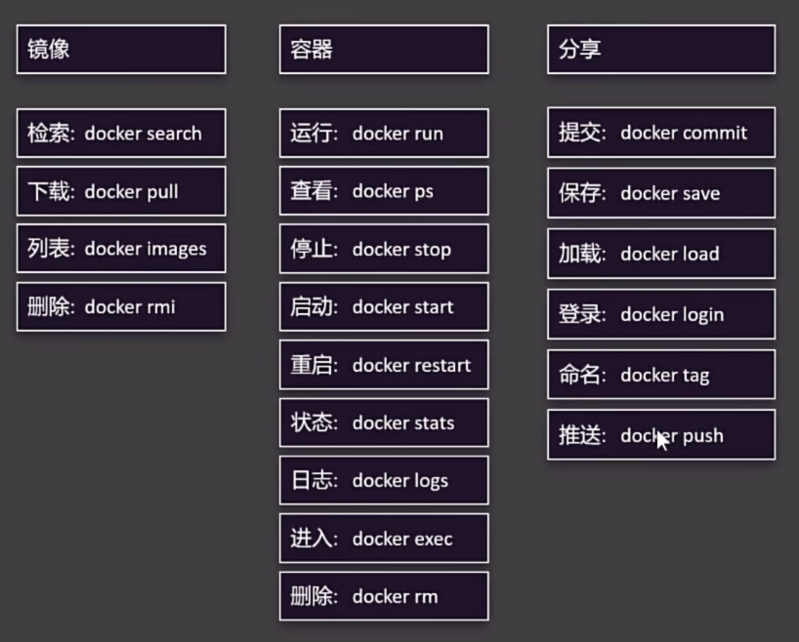
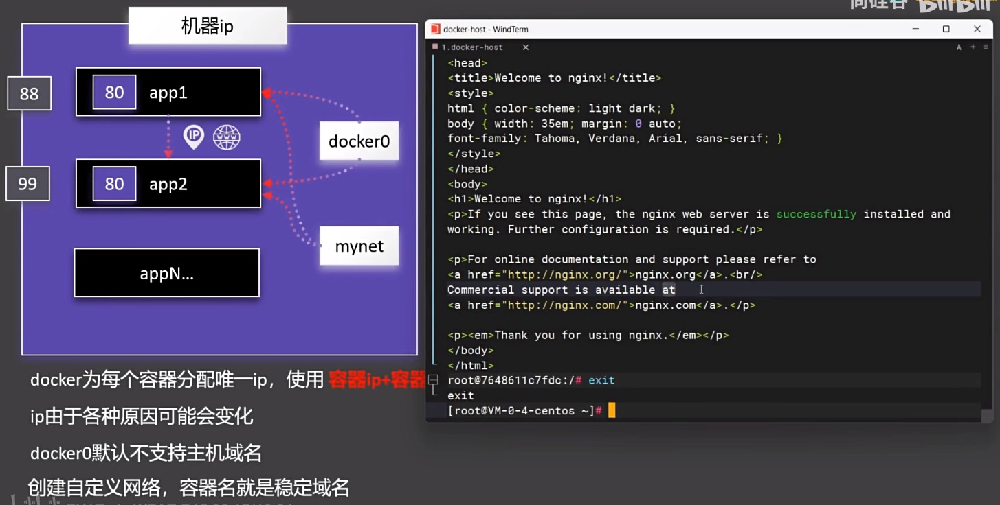
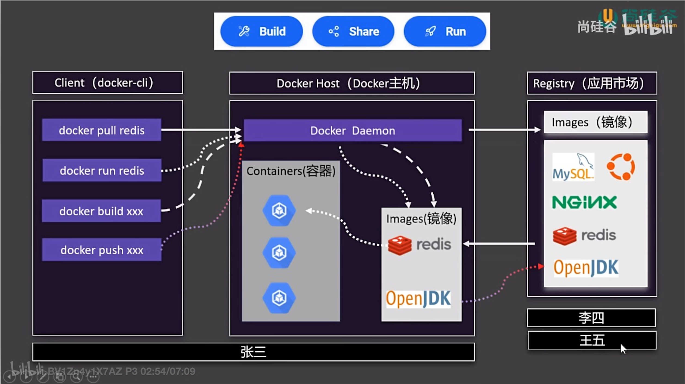
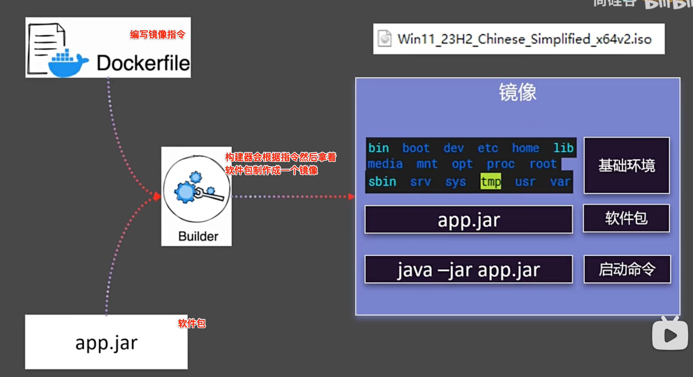
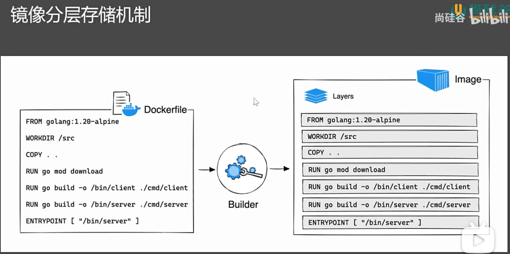
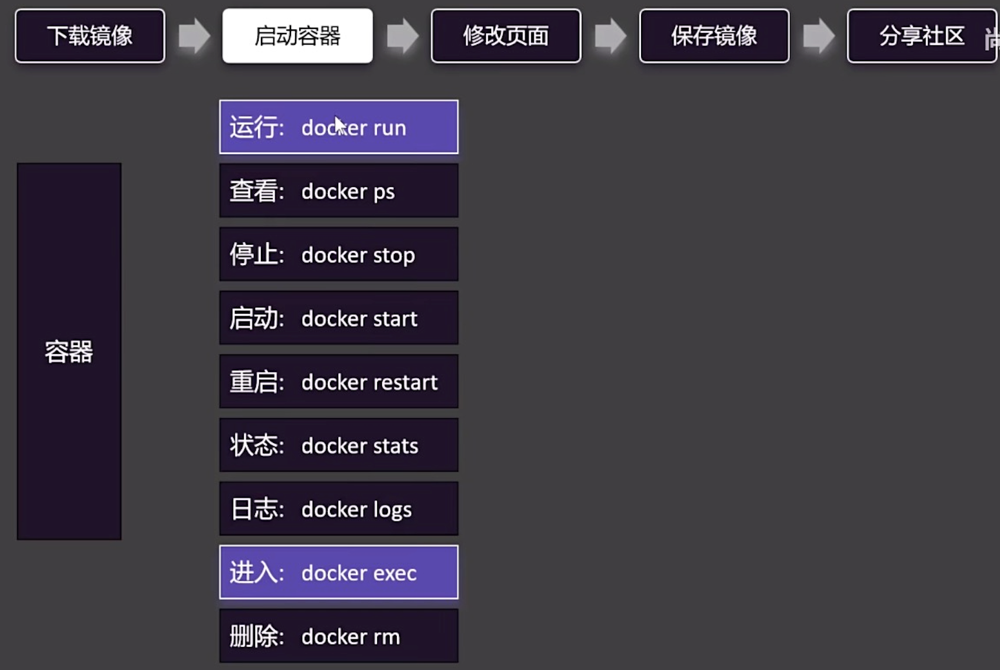
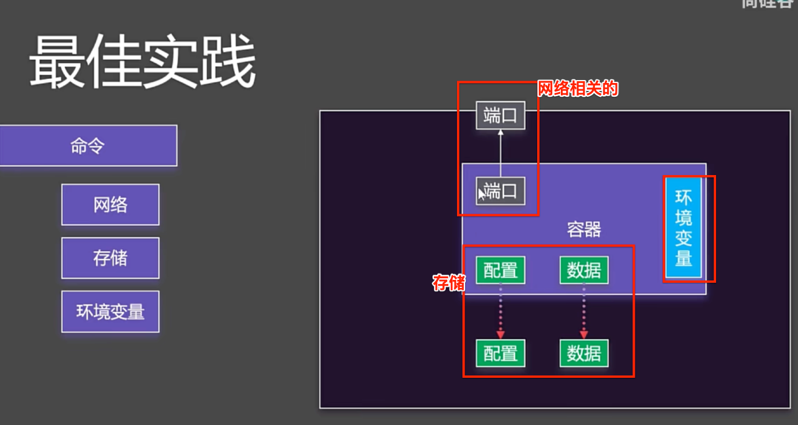
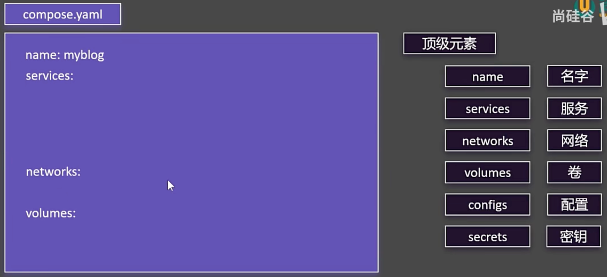

> <h5/>
- [Docker](#Docker)
	- [介绍](#介绍)
		- [Docker使用](#Docker使用)
	- [镜像](#镜像)
		- [制作镜像](#制作镜像)
		- [镜像分层存储](#镜像分层存储)
		- [镜像分层存储](#镜像分层存储)
	- [docker大致命令介绍](#docker大致命令介绍)
	- [自定义网络](#自定义网络)
	- [启动容器命令](#启动容器命令)
	- [Docker Compose批量管理容器](#DockerCompose批量管理容器)
	- [Docker启动mysql](#Docker启动mysql)
	- [案例Docker构建](#案例Docker构建)
	- [自动CI/CD](#自动CI/CD)


<br/><br/><br/>

***
<br/>

># <hb2 id="Docker">[Docker](https://yeasy.gitbook.io/docker_practice/install/mac)</h2>

Docker容器有三大组件：镜像(Image)、容器(Container)和仓库(Repository)。要了解容器技术，[建议查看相关的文档](https://www.docker.com/)，这里仅进行简单的介绍。

- 镜像：一个特殊的文件系统，提供容器运行时的程序、库、配置等，属于静态数据。
- 容器：实质是进程，和宿主机上的进程有所不同，容器进程有属于自己独立的命名空间，有自己的root文件系统、网络配置等。
- 仓库：存储各种镜像文件。

<br/>

对后端开发人员而言，需要掌握如何操作镜像、容器和仓库。镜像是文件系统，也是一种资源，镜像的操作包括删除、构建、获取、查看等；容器是进程，容器的操作包括启动、停止、查看等；仓库是存储镜像的地方，仓库的操作包括推送、获取等。

&emsp; Docker容器采用C/S（客户端/服务器端）架构，要使用Docker，需要安装软件，启动Docker进程，之后可以对镜像、容器、仓库进行操作。后端开发用到的所有技术，比如Ubuntu系统、Nginx服务、MySQL、Go、PostgreSQL等都存在相应的镜像。有了Docker之后，再也不用费时费力地下载安装各种软件就可以使用所需的技术。比如需要使用PostgreSQL数据库，可以简单地执行下面的命令：

```
// 拉取远程镜像仓库中的postgres置于本地
docker pull postgres
// 启动容器
docker run --name some-postgres -e POSTGRES_PASSWORD=mysecretpassword -d postgres
// 查看容器
docker ps
// 进入容器
docker exec -it a5d42af1e361 bash
// 切换用户
su posgres
// 进入数据库
psql -h localhost
postgres@a5d42af1e361:/$ psql -h localhost
psql (11.4 (Debian 11.4-1.pgdg90+1))
Type "help" for help.
postgres=#
```

上面是以postgres为例的一些简单使用，事实上各种服务都可以使用Docker来操作它们，而无须在本地安装和进行繁杂的配置。以后开发者想学习任何服务，优先使用容器版本，即可快速上手。

获取到镜像之后，各种镜像的配置参数不同，如何使用它们呢？[可以查看DockerHub最大的镜像托管平台，网站上托管了许多官方和个人的镜像，查看相应的文档即可。](https://hub.docker.com/search?badges=official)

对个人开发者而言，构建自己的镜像无须从零开始，在官方的镜像基础上构建自己的镜像即可，这也是个人或者企业构建镜像的核心步骤。如何构建镜像呢？答案是编写Dockerfile，官方提供了一套语法规范，按照规范编写Dockerfile文件即可。

```
# 示例
# 基础镜像
FROM golang:1.13.4
# 维护者信息
LABEL maintainer="XieWei"
# 工作目录
WORKDIR /go/GopherBook/chapter11
# 暴露端口
EXPOSE 8888
# 设置环境变量
ENV GO111MODULE=on
# volume 目录
VOLUME [ "/go/GopherBook/chapter11/logs" ]
# 下载安装依赖
RUN apt-get update && apt-get install -q -y vim git openssh-client cron bash && apt-get clean;
# 复制文件
COPY . .
# 执行命令
RUN make install
RUN make prod
# 容器启动时执行命令
CMD [ "bash", "-c", "/go/GopherBook/chapter11/votes;" ]
```

为什么这样操作，构建镜像的目的是什么？

&emsp; 开发者构建Web服务，在本地开发时直接在本地启动服务即可，比如go web项目，执行go run命令启动服务。那么想要在远程服务器上部署这套代码，怎么启动服务呢？答案是构建镜像，启动镜像的同时启动服务，这样开发者只需要提供Dockerfile文件就可以构建镜像，在镜像的基础上再执行docker run命令启动容器，即可启动Web服务。这就是容器这么受欢迎的原因，一套代码多处部署，使用非常方便。

&emsp; 对于个人开发者，如果有自己私有的服务器，那么可以配合DaoCloud(https://www.daocloud.io/)搭建流水线，自动同步远端代码进行测试、构建等环节，自动构建镜像、部署容器。

<br/><br/>
> <h2 id="介绍">介绍</h2>
Docker 是一个**容器化**平台，主要用于**构建、打包、分发和运行**应用程序。它的核心作用是让应用程序及其依赖项一起封装在一个**轻量级、可移植的容器**中，从而确保应用能够在不同的环境（如开发、测试、生产）中一致运行。

<br/><br/>
> <h3 id="docker大致命令介绍">docker大致命令介绍</h3>



<br/><br/>
> <h3  id="Docker使用">Docker使用</h3>
我们以官方的教学镜像作为简单示例。启动Desktop后，在电脑的终端上运行如下命令：

```sh
docker run -d -p 80:80 docker/getting-started
```
该命令如果发现本地没有docker/getting-started镜像文件，会从官方的镜像仓库Docker Hub上拉取镜像并运行。

**-d:** 让容器进程以后台模式运行。

`-p 80:80`：把主机的80端口映射到容器里的80端口。

`docker/getting-started：`镜像名称。

启动后，打开一个浏览器，访问 `http://localhost/ `就可以看到已经run起来的应用程序的界面了。

<br/>

**Docker 的主要用途**

- **1.环境一致性**  
	- 解决“**在我电脑上可以跑**，但在服务器上有问题”的问题。  
	- 通过容器让应用及其依赖环境始终一致。

- **2.快速部署与扩展**  
	- 轻量级容器启动速度快，适合微服务架构。  
	- 可在本地开发，直接打包部署到云端或服务器。

<br/><br/><br/>
> <h2 id="自定义网络">自定义网络</h2>



- 因为每个容器都是隔离的，所以容器暴露的端口号可以是相同的，比如：app1的容器端口为80， app2的容器端口为80，是可以的
- 对于容器外面的机器ip端口必须是不同的，否则无法分辩是哪个，所以分别为：88、99端口；
- 对于docker0是docker自动分配的ip地址，而且有时还会变？还不容易记住，有没有自己定义的呢？
	- 有我们可以自己定义一个`mynet域名`，通过这个域名app1容器加上app的端口可以直接访问app2容器的数据和文件。当然docker0作为ip地址也是可以的。


<br/>

- **3.依赖管理**  
	- 解决不同项目需要不同依赖的问题，比如 Python2 和 Python3 共存。  
	- 容器内的环境彼此隔离，不会互相影响。

<br/>

-  **4.跨平台运行**  
	- 容器能在**Windows、macOS、Linux**上运行，解决不同平台的兼容性问题。  
	- 只需安装 Docker，就能运行相同的容器，无需额外配置环境。

<br/>

-  **5.版本管理**  
	- 通过 Docker **镜像**（Image）管理应用的不同版本，可以回滚、更新。  
	- 类似于 Git，Docker Hub 也可以存储和分发镜像。

<br/>

-  **6.微服务架构**  
	- 适合拆分大型应用，每个服务在独立容器中运行，互不影响。  
	- 通过 `docker-compose` 方便管理多个容器。

<br/><br/>

- **核心概念**

<br/><br/><br/>
> <h2 id="镜像">镜像</h2>
- **镜像（Image）**：  
	- 类似于“模板”，包含应用及其环境的所有内容。  
	- 例如：`nginx:latest` 是官方提供的 Nginx 服务器镜像。

<br/>

[**镜像资源:**](https://hub.docker.com/search)


<br/>



- **Docker肩负着：**
	- 构建（Build）： 打包构建
	- 分享（Share）：当开发完后，打出一个包给对方使用，不用写30多页的运行手册（手册里可能要写明要运行的各种配置和软件，否则无法运行）
	- 运行（Run）

- **Client： 客户端**
	- 主要是通过一些命令，对主机进行操作。比如： 
		- `docker pull redis`是把 redis从应用市场下载到Docker主机，形成镜像。
		- `docker  run redis`  是将镜像放入到主机中的容器中进行运行；
	- 你若是自己想在主机中运行，你也需要使用 docker build xxx 将应用进行打包，然后通过 docker push xxx 到应用市场中去

- **Docker Host（Docker主机）：**

- **Registry（应用市场）：**


<br/><br/>
> <h3 id="制作镜像">制作镜像</h3>

制作镜像需要的指令、构建器、软件包，如下：



<br/>

**常见指令：**

| 常见指令 | 格式 | 作用 |
|:--|:--| :--|
| FROM | <p>`COPY <源路径>... <目标路径>` </p> <p> `COPY ["<源路径1>",... "<目标路径>"]`</p> | 指定镜像基础环境 |
| RUN | RUN <命令> | 用于执行命令行命令 |
| CMD |  | 容器启动命令或参数 |
| LABEL |  | 自定义标签 |
| EXPOSE | `EXPOSE <端口 1> [<端口 2>…]` | EXPOSE 指令是声明运行时容器提供服务端口，这只是一个声明，在运行时并不会因为这个声明应用就会开启这个端口的服务 |
| ENV |  | 环境变量 |
| ADD |  | 添加文件到镜像 |
| COPY |  | 复制文件到镜像 |
| ENTRYPOINT | exec 格式：`<ENTRYPOINT> "<CMD>"`  <br><br> shell 格式：`ENTRYPOINT [ "curl", "-s", "http://ip.cn"` ] | 容器固定启动命令 |
| VOLUME |  | 数据卷 |
| USER |  | 指定用户和用户组 |
| WORKDIR | WORKDIR <工作目录路径> ｜ 指定默认工作目录 |
| ARG |  | 指定构建参数 |

**Docker File文件如下：**

```dockerfile
// golang:latest 镜像为基础镜像，将工作目录设置为 $GOPATH/src/go-gin-example，并将当前上下文目录的内容复制到 $GOPATH/src/go-gin-example 中
FROM golang:latest 

ENV GOPROXY https://goproxy.cn,direct
// 使用 WORKDIR 指令可以来指定工作目录（或者称为当前目录），以后各层的当前目录就被改为指定的目录，如果目录不存在，WORKDIR 会帮你建立目录
WORKDIR $GOPATH/src/MLC_GO
copy . $GOPATH/src/MLC_GO
// go build 编译完毕后，将容器启动程序设置为 ./go-gin-example，也就是我们所编译的可执行文件
// 注意 go-gin-example 在 docker 容器里编译，并没有在宿主机现场编译
RUN go build .

EXPOSE 8000
ENTRYPOINT [ "./MLC_GO" ]
```


<br/><br/>
> <h3 id="镜像分层存储">镜像分层存储</h3>



镜像分层存储是为了解决磁盘存储压力。

<br/>

- **容器（Container）**：  
	- 由镜像运行而来的实例，是真正运行的应用。  
	- 例如：用 `docker run -d nginx` 启动一个 Nginx 容器。

<br/><br/>
> <h3 id="启动容器命令">启动容器命令</h3>


<br/>
启动容器需要下面的3个条件如下：



<br/>

- **Docker Hub**：  
	- 官方提供的镜像仓库，可以下载和上传镜像。

<br/>

- **Docker Compose**：  
	- 用 `docker-compose.yml` 定义多个容器的运行方式，一键启动整个应用。

<br/><br/>

- **简单示例**

运行一个 Nginx 服务器：

```bash
docker run -d -p 8080:80 nginx
```
访问 `http://localhost:8080` 就能看到 Nginx 页面。

<br/><br/><br/>
> <h2 id="DockerCompose批量管理容器">Docker Compose批量管理容器</h2>

在**`compose.yaml`**文件可以写入你需要启动的容器命令

关于compose.yaml文件的语法请看：[Compose file reference](https://docs.docker.com/reference/compose-file/) 

**compose.yaml文件的语法格式如下：**



**示例：**

```
name: myblog
services:
  mysql:
    container_name: mysql #容器名
    image: mysql:8.0 # 镜像
    ports: # 端口
      - "3306:3306"
    environment: # 环境变量
      - MYSQL_ROOT_PASSWORD=123456
      - MYSQL_DATABASE=wordpress
    volumes: # 挂载的卷
      - mysql-data:/var/lib/mysql
      - /app/myconf:/etc/mysql/conf.d
    restart: always #重启
    networks: # 网络
      - blog

  wordpress:
    image: wordpress
    ports:
      - "8080:80"
    environment:
      WORDPRESS_DB_HOST: mysql
      WORDPRESS_DB_USER: root
      WORDPRESS_DB_PASSWORD: 123456
      WORDPRESS_DB_NAME: wordpress
    volumes:
      - wordpress:/var/www/html
    restart: always
    networks:
      - blog
    depends_on: #依赖-启动顺序
      - mysql

volumes:
  mysql-data:
  wordpress:

networks:
  blog:
```


<br/><br/>
> <h2 id="Docker启动mysql">Docker启动mysql</h2>

使用 **Docker Compose** 来编排启动 **MySQL**，可以创建一个 `docker-compose.yml` 文件，定义 MySQL 容器及相关参数。

<br/>

- **1.创建 `docker-compose.yml` 文件**

在你的项目目录下，创建一个 `docker-compose.yml` 文件，并写入以下内容：

```yaml
version: '3.8'

services:
  mysql:
    image: mysql:8.0  # 指定 MySQL 版本
    container_name: my_mysql  # 容器名称
    restart: always  # 自动重启
    environment:
      MYSQL_ROOT_PASSWORD: root123  # 设置 root 用户密码
      MYSQL_DATABASE: test_db  # 创建的默认数据库
      MYSQL_USER: test_user  # 创建的默认用户
      MYSQL_PASSWORD: test_pass  # 用户的密码
    ports:
      - "3306:3306"  # 映射端口，宿主机的 3306 端口 -> 容器的 3306 端口
    volumes:
      - mysql_data:/var/lib/mysql  # 数据持久化
    networks:
      - my_network  # 连接到自定义网络

volumes:
  mysql_data:

networks:
  my_network:
```

<br/>

- **2.启动 MySQL 容器**

在 `docker-compose.yml` 文件所在的目录运行：

```sh
docker-compose up -d
```
`-d` 选项让 MySQL 在后台运行。

<br/>

- **3.检查 MySQL 容器状态**

```sh
docker ps
```

如果看到 `my_mysql` 容器在运行，说明 MySQL 启动成功。

<br/>

- **4. 连接到 MySQL**

**方法 1：使用 `mysql` 命令行客户端**

```sh
mysql -h 127.0.0.1 -P 3306 -u test_user -p
```

输入 `test_pass` 进行登录。

<br/>

**方法 2：进入 MySQL 容器内部**

```sh
docker exec -it my_mysql mysql -u root -p
```
输入 `root123` 进行登录。

<br/>

- **5. 停止 MySQL 容器**

```sh
docker-compose down
```

如果想保留数据，加 `-v` 选项会清除数据卷：

```sh
docker-compose down -v
```

<br/>

- **6. 修改配置（可选）**

如果需要修改 MySQL 的配置，可以创建一个 `my.cnf` 文件：

```ini
[mysqld]
max_connections = 500
sql_mode = "STRICT_TRANS_TABLES,NO_ENGINE_SUBSTITUTION"
```
然后在 `docker-compose.yml` 中挂载：

```yaml
    volumes:
      - mysql_data:/var/lib/mysql
      - ./my.cnf:/etc/mysql/conf.d/my.cnf  # 挂载自定义配置
```

**重启 MySQL 容器后生效**：

```sh
docker-compose restart
```

<br/>

- **总结**
	- 通过 `docker-compose.yml` 一键启动 MySQL。
	- 数据持久化，重启不会丢失。
	- 端口映射，可用 `mysql` 连接管理数据库。
	- 也可以自定义 MySQL 配置，提高性能。

🚀 这样，你的 **MySQL 容器** 就可以运行在 Docker 环境中了！


<br/><br/><br/>
> <h2 id="案例Docker构建">案例Docker构建</h2>
- **项目根目录新建Dockerfile文件，如下：**

```docker
FROM golang:latest 

ENV GOPROXY https://goproxy.cn,direct
WORKDIR $GOPATH/src/MLC_GO
copy . $GOPATH/src/MLC_GO
RUN go build .

EXPOSE 8000
ENTRYPOINT [ "./MLC_GO" ]
```

***

<br/>

- **Docker 是否正在运行：**

```bash
docker info

// 表示没有开启
Server:
ERROR: Cannot connect to the Docker daemon at unix:///Users/ganghuang/.docker/run/docker.sock. Is the docker daemon running?
errors pretty printing info
```

**或者这样查看状态：**

检查 Docker 守护进程的状态，查看是否正在运行

```sh
ps aux | grep dockerd

ganghuang         2736   0.0  0.0 410226352   1328 s006  S+    7:39下午   0:00.00 grep dockerd
```
上面这样表示没有开启。

<br/>

若是安装的Docker桌面版，可以打开**Docker Desktop**，然后执行`docker info`,如下：

```
 docker info
Client:
 Version:    27.4.0
 Context:    desktop-linux
 Debug Mode: false
 Plugins:
  ........
  .....
  .
  
Server:
 Containers: 1
  Running: 1
  Paused: 0
  Stopped: 0
 Images: 1
 Server Version: 27.4.0
 ......
 ....
 .

WARNING: daemon is not using the default seccomp profile
```

***

<br/>

- **构建镜像**

项目根目录下执行如下命令：

```sh
docker build -t gen-practice-exmple .
```
该命令作用是创建/构建镜像，-t 指定名称为 `gen-practice-exmple`，`.` 构建内容为当前上下文目录

**构建后的输出：**

```sh
[+] Building 183.7s (10/10) FINISHED                                                                     docker:desktop-linux
 => [internal] load build definition from Dockerfile                                                                     0.0s
 => => transferring dockerfile: 204B                                                                                     0.0s
 => WARN: ConsistentInstructionCasing: Command 'copy' should match the case of the command majority (uppercase) (line 5  0.0s
 => [internal] load metadata for docker.io/library/golang:latest                                                         9.3s
 => [auth] library/golang:pull token for registry-1.docker.io                                                            0.0s
 => [internal] load .dockerignore                                                                                        0.0s
 => => transferring context: 2B                                                                                          0.0s
 => [internal] load build context                                                                                        0.3s
 => => transferring context: 42.05MB                                                                                     0.3s
 => [1/4] FROM docker.io/library/golang:latest@sha256:c5adecdb7b3f8c5ca3c88648a861882849cc8b02fed68ece31e25de88ad1341  163.0s
 => => resolve docker.io/library/golang:latest@sha256:c5adecdb7b3f8c5ca3c88648a861882849cc8b02fed68ece31e25de88ad13418   0.0s
 => => sha256:e5701e2b5d2b168acc741a9ff3fdb127561218f08a68ad5dcc08b3d94a22fc9e 23.60MB / 23.60MB                        18.5s
 => => sha256:31d7468eece796ba37139bc942f068fc99cb7503eb828f59370c3421cca7d528 64.35MB / 64.35MB                        70.2s
 => => sha256:fcac9ac2c01ddb5ea125d3d57e536bc890bd8d74a773b73cc9bf858630dfbd12 2.32kB / 2.32kB                           0.0s
 => => sha256:52daf8b0f06f2fdaeb7dec4b92086a6e762488b98364a36c7abb3737d5423d3a 48.31MB / 48.31MB                        38.2s
 => => sha256:c5adecdb7b3f8c5ca3c88648a861882849cc8b02fed68ece31e25de88ad13418 10.06kB / 10.06kB                         0.0s
 => => sha256:88de62925c535c1a9006f31ea2adccc609e7c6ce90f84f4fb326376d287f67ce 2.82kB / 2.82kB                           0.0s
 => => sha256:5401acdbd47da62354605cdc39280e128c1fda32c0830d209bca96e7352c65f9 86.38MB / 86.38MB                       114.7s
 => => extracting sha256:52daf8b0f06f2fdaeb7dec4b92086a6e762488b98364a36c7abb3737d5423d3a                                1.5s
 => => sha256:57f2b93ee17017a4673f1a381ec312f22e8e9c0cee491adc746b10d3d5f200b7 75.18MB / 75.18MB                       159.1s
 => => extracting sha256:e5701e2b5d2b168acc741a9ff3fdb127561218f08a68ad5dcc08b3d94a22fc9e                                0.4s
 => => extracting sha256:31d7468eece796ba37139bc942f068fc99cb7503eb828f59370c3421cca7d528                                1.7s
 => => sha256:5307ec346c8f5c8f1cd4b4e7eb7909cfdd1526254d752a6aad28ce8c34d04335 127B / 127B                              72.4s
 => => sha256:4f4fb700ef54461cfa02571ae0db9a0dc1e0cdb5577484a6d75e68dc38e8acc1 32B / 32B                                73.6s
 => => extracting sha256:5401acdbd47da62354605cdc39280e128c1fda32c0830d209bca96e7352c65f9                                1.6s
 => => extracting sha256:57f2b93ee17017a4673f1a381ec312f22e8e9c0cee491adc746b10d3d5f200b7                                3.6s
 => => extracting sha256:5307ec346c8f5c8f1cd4b4e7eb7909cfdd1526254d752a6aad28ce8c34d04335                                0.0s
 => => extracting sha256:4f4fb700ef54461cfa02571ae0db9a0dc1e0cdb5577484a6d75e68dc38e8acc1                                0.0s
 => [2/4] WORKDIR /go/src/MLC_GO                                                                                         0.2s
 => [3/4] COPY . /go/src/MLC_GO                                                                                          0.1s
 => [4/4] RUN go build .                                                                                                10.2s
 => exporting to image                                                                                                   0.8s
 => => exporting layers                                                                                                  0.8s
 => => writing image sha256:c87a062484a3e80c399600a4b6d131f85ff911ea4d29e6c88de3a1422face5d9                             0.0s
 => => naming to docker.io/library/gen-practice-exmple                                                                   0.0s

 2 warnings found (use docker --debug to expand):
 - ConsistentInstructionCasing: Command 'copy' should match the case of the command majority (uppercase) (line 5)
 - LegacyKeyValueFormat: "ENV key=value" should be used instead of legacy "ENV key value" format (line 3)
```

***

<br/>

- **验证镜像：**

查看所有的镜像，确定刚刚构建的 gin-blog-docker 镜像是否存在：

```sh
MLC_GO % docker images

REPOSITORY               TAG       IMAGE ID       CREATED              SIZE
gen-practice-exmple      latest    c87a062484a3   About a minute ago   1.34GB
docker/getting-started   latest    289dc403af49   2 years ago          46.5MB
```

***

<br/>

- **创建并运行一个新容器**
执行命令 `‌docker run -p 8000:8000 gen-practice-exmple`

```
$ docker run -p 8000:8000 gen-practice-exmple 

[GIN-debug] [WARNING] Running in "debug" mode. Switch to "release" mode in production.
 - using env:   export GIN_MODE=release
 - using code:  gin.SetMode(gin.ReleaseMode)

[GIN-debug] GET    /swagger/*any             --> github.com/swaggo/gin-swagger.CustomWrapHandler.func1 (3 handlers)
[GIN-debug] GET    /auth                     --> MLC_GO/TestNotes/PracticeGenExample/routers/api.GetAuth (3 handlers)
[GIN-debug] GET    /api/v1/tags              --> MLC_GO/TestNotes/PracticeGenExample/routers/api/v1.GetTags (4 handlers)
[GIN-debug] POST   /api/v1/tags              --> MLC_GO/TestNotes/PracticeGenExample/routers/api/v1.AddTag (4 handlers)
[GIN-debug] PUT    /api/v1/tags/:id          --> MLC_GO/TestNotes/PracticeGenExample/routers/api/v1.EditTag (4 handlers)
[GIN-debug] DELETE /api/v1/tags/:id          --> MLC_GO/TestNotes/PracticeGenExample/routers/api/v1.DeleteTag (4 handlers)
[GIN-debug] GET    /api/v1/articles          --> MLC_GO/TestNotes/PracticeGenExample/routers/api/v1.GetArticles (4 handlers)
[GIN-debug] GET    /api/v1/articles/:id      --> MLC_GO/TestNotes/PracticeGenExample/routers/api/v1.GetArticle (4 handlers)
[GIN-debug] POST   /api/v1/articles          --> MLC_GO/TestNotes/PracticeGenExample/routers/api/v1.AddArticle (4 handlers)
[GIN-debug] PUT    /api/v1/articles/:id      --> MLC_GO/TestNotes/PracticeGenExample/routers/api/v1.EditArticle (4 handlers)
[GIN-debug] DELETE /api/v1/articles/:id      --> MLC_GO/TestNotes/PracticeGenExample/routers/api/v1.DeleteArticle (4 handlers)

```

本来应该是错的，因为我在本地安装了mysql工具，若是没有会出错的，控制台的输出了一条错误 
```
dial tcp 127.0.0.1:3306: connect: connection refused`
```

我们研判一下，发现是 Mysql 的问题，接下来第二项我们将解决这个问题。

<br/><br/><br/>
> <h2 id="MySQL镜像">MySQL镜像</h2>
- **拉取镜像**

从 Docker 的公共仓库 Dockerhub 下载 MySQL 镜像（国内建议配个镜像）

```sh
$ docker pull mysql

Using default tag: latest
latest: Pulling from library/mysql
903087d703a7: Pulling fs layer 
9dcae24b624f: Download complete 
d1014e296527: Downloading [====>                                              ]  82.45kB/913.5kB
5dd6251984b1: Waiting 
e176816781e5: Waiting 
2adf46058f45: Waiting 
c5d32318ef6d: Waiting 
bcba864ffae7: Waiting 
666d78c46a16: Waiting 
5645ac95474c: Waiting 
```

***

<br/>

- **创建并运行一个新容器**
运行 Mysql 容器，并设置执行成功后返回容器 ID

```
$ docker pull mysql

Using default tag: latest
latest: Pulling from library/mysql
903087d703a7: Pull complete 
9dcae24b624f: Pull complete 
d1014e296527: Pull complete 
5dd6251984b1: Pull complete 
e176816781e5: Pull complete 
2adf46058f45: Pull complete 
c5d32318ef6d: Pull complete 
bcba864ffae7: Pull complete 
666d78c46a16: Pull complete 
5645ac95474c: Pull complete 
Digest: sha256:146682692a3aa409eae7b7dc6a30f637c6cb49b6ca901c2cd160becc81127d3b
Status: Downloaded newer image for mysql:latest
docker.io/library/mysql:latest
```


 

<br/><br/>
> <h2 id="自动CI/CD">自动CI/CD</h2>


开发人员编写完代码需要将代码构建成镜像，在服务器上拉取镜像，再启动容器即可。当然，生产环境的容器并不是单一的，容器相互之间有联系，进而构建复杂的系统架构。问题是每次更新代码后，有没有什么方法自动构建新的镜像、自动完成部署呢？自动构建新的镜像、部署新的镜像的整个过程称为CI（持续集成）/CD（持续部署）​。有一个很明显的优势是，开发人员只需要设置一次自动CI/CD流程，之后只要关注开发功能，完成业务代码后只需要提交新代码，自动CI/CD拉取新代码、构建新镜像、完成部署，就可以完成一次功能开发过程。

对个人开发者而言，GitHub是较大的代码托管平台，配合GitHub的代码，个人开发者的开源项目可以完成自动CI/CD流程。其中的典型代表就是TravisCI，当然还有更多的免费或者收费的持续集成、持续部署工具，具体细节可参考地址https://github.com/marketplace。

