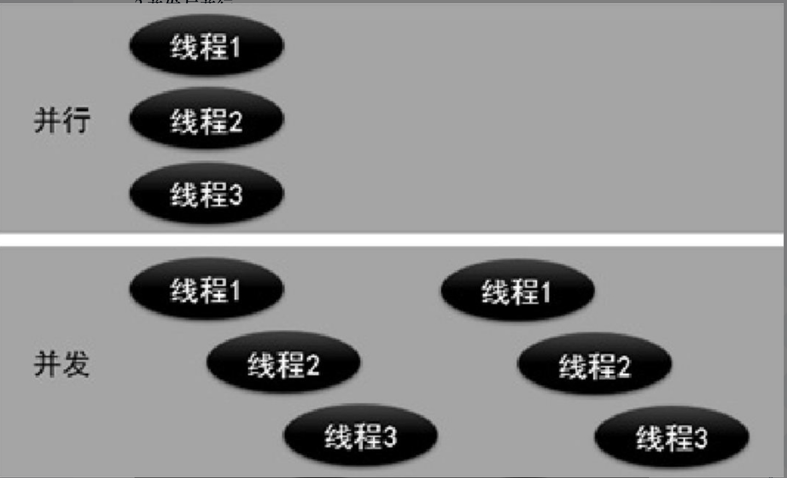

> <h4/>
- [**‌并发编程**](#并发编程)
	- [进程、线程与协程进程](#进程、线程与协程进程)
	- [goroutine](#goroutine)
		- [为普通函数创建goroutine](#为普通函数创建goroutine)
		- [匿名函数创建goroutine](#匿名函数创建goroutine)
		- [类似栅栏的线程隔离](类似栅栏的线程隔离)
	- [channel（通道）](#channel（通道）)
		- [通道的声明和创建](#通道的声明和创建)
		- [通道发送数据](#通道发送数据) 
		- [通道接收数据](#通道接收数据)
		- [单向通道](#单向通道) 
		- [带缓冲的通道](#带缓冲的通道)
		- [指针类型通道](#指针类型通道)
		- [select防止通道阻塞](#select防止通道阻塞)
		- [select使用场景](#select使用场景)
	- [轻量级线程](#轻量级线程)
	- [线程锁](#线程锁)
		- [互斥锁](#互斥锁)
		- [读写互斥锁](#读写互斥锁)
		- [等待组](#等待组)
		- [原子读写](#原子读写)
			- [goroutine并发读写流程图](#goroutine并发读写流程图)
	- [sync包学习](#sync包学习)
		- [Once 执行一次](#Once执行一次)
	

<br/><br/><br/>

***
<br/>

> <h1 id="并发编程">并发编程</h1>

并发是指在同一时间内执行多个任务。并发编程包括多线程编程、多进程编程及分布式程序等。本章讲解并发编程中的多线程编程。Go语言支持并发的特性，并且通过goroutine完成。goroutine类似于线程，是由Go语言运行时(runtime)调度和管理的。Go程序能够将goroutine中的任务合理地分配给每个CPU。


<br/>

Socket的收发包分配一个线程。开发人员需要在线程数量和CPU数量间建立一个对应关系，以保证每个任务能及时地被分配到CPU上进行处理，同时避免多个任务频繁地在线程间切换执行而损失效率。


<br/><br/><br/>
> <h2 id="进程、线程与协程进程">进程、线程与协程进程</h2>
进程、线程与协程进程是计算机系统进行资源分配和调度的基本单位，是操作系统结构的基础。

线程是CPU独立调度和分派的基本单位。它被包含在进程之中，是进程中的实际运作单位。一个进程中可以并发多个线程，每条线程并行执行不同的任务。

与线程类似，协程与协程之间相对独立，每个协程都有自己的上下文；由当前协程切换到其他协程的过程是由当前协程进行控制并实现的。

<br/>

- **并发与并行**

- 并行：同时执行；多个CPU同时执行多个线程。
- 并发：穿插执行；一个CPU在不同时间段执行不同的线程，也就是说多个线程轮流穿插执行。

为了方便理解，使用如图11.1所示的示意图展示并行与并发的区别。




&emsp; 并发编程是指让一个CPU在某个时间段内执行一个含有多个线程的程序，这些线程被这个CPU轮流穿插执行。并发编程的优势在于当一个CPU执行含有多个线程的程序时，另一个线程不必等待当前线程被执行完毕后再被执行，进而提高使用CPU的效率。


<br/><br/><br/>
> <h2 id="goroutine">goroutine</h2>
在Go语言中，goroutine不仅是轻量级线程，而且是用户级线程。用户级线程是指由用户控制代码的执行流程，不需要操作系统进行调度和分派。也就是说，Go程序智能地将goroutine中的任务合理分配给每个CPU。

Go语言不仅有goroutine，还有用于调度goroutine的、对接系统级线程的调度器。调度器主要负责统筹调配Go语言并发编程模型（即GPM模型）中的3个主要元素，它们分别是G（goroutine的缩写）​、P（processor的缩写）和M（machine的缩写）​。

其中，M指的是系统级线程；P指的是能够使若干个G在恰当的时机与M对接，并得以运行的中介。

Go程序在启动时，从main包的main()函数开始，为main()函数创建一个默认的goroutine。下面讲解两种创建goroutine方法：一种是为普通函数创建goroutine；另一种是为匿名函数创建goroutine。

<br/>

&emsp; 虽然，线程池为逻辑编写者提供了线程分配的抽象机制。但是，如果面对随时随地可能发生的并发和线程处理需求，线程池就不是非常直观和方便了。能否有一种机制：使用者分配足够多的任务，系统能自动帮助使用者把任务分配到CPU上，让这些任务尽量并发运作。这种机制在Go语言中被称为goroutine。

&emsp; goroutine的概念类似于线程，但goroutine由Go程序运行时的调度和管理。Go程序会智能地将goroutine中的任务合理地分配给每个CPU。


<br/><br/><br/>
> <h2 id="为普通函数创建goroutine">为普通函数创建goroutine</h2>

```
go 函数名称(prameter)
```

参数说明如下。

**parameter：参数列表。**


<br/>

**‌演示当创建goroutine时，如何为被调用函数设置参数:**

```go
package concurrent_program_practice

import (
	"MLC_GO/TestNotes/GenPracticeExample/pkg/logging"
	"time"
)

func getOff(names []string) {
	for i, name := range names {
		logging.DebugInfo("第",i+1,"位乘客", name, "正在下车")
		// 延时一秒
		time.Sleep(1 * time.Second)
	}
}


// goroutine被调用函数设置参数
func BaseConcurrentProgram_v1 () {
	// 乘客姓名切片
	var offNames = [6]string{"David", "Levon", "Steven", "James", "Tom", "Jack"}
	// 执行并发程序
	go getOff(offNames[:])
	var onNames = [6]string{"张三", "李四", "万物", "糟熘", "周期", "礼拜"}

	for i, name := range onNames {
		logging.DebugInfo("第",i+1,"位乘客", name, "正在上车")
		time.Sleep(1 * time.Second)
	}
}
```


<br/><br/>
> <h3 id="匿名函数创建goroutine">匿名函数创建goroutine</h3>

使用go关键字还可以为匿名函数创建goroutine。

注意，go关键字的后面须包含两个内容：一个是定义的匿名函数；另一个是匿名函数的调用参数。使用go关键字为匿名函数创建goroutine的语法格式如下。

```go
go func(parameter) {
	func field
}(para)
```

- func: Go语言的关键字，用于定义匿名函数。
- parameter：参数列表。
- func field：匿名函数的实现代码。
- para：匿名函数被调用时所需设置的参数。


***
<br/><br/><br/>
> <h2 id="类似栅栏的线程隔离">类似栅栏的线程隔离</h2>

**`sync.WaitGroup`**

Go 里标准库有个 **`sync.WaitGroup`**，它的作用是：

* 等待一组 goroutine 全部完成后，再继续往下执行。
* 通常用来做 **并发控制和同步**。

用法一般是：

```go
var wg sync.WaitGroup

wg.Add(1) // 计数器 +1
go func() {
    defer wg.Done() // 计数器 -1
    fmt.Println("工作完成")
}()

wg.Wait() // 阻塞，直到计数器为 0
```

效果：主 goroutine 会等子 goroutine 全部结束才继续。

<br/>


有 **`util.WaitGroupWrapper`**

在一些项目（比如 NSQ、etcd 等）里，作者会写一个 **封装**，让 `WaitGroup` 用起来更方便。

大概长这样（简化版）：

```go
package util

import "sync"

type WaitGroupWrapper struct {
    sync.WaitGroup
}

// Run 可以直接起一个 goroutine，并自动管理 WaitGroup
func (w *WaitGroupWrapper) Run(fn func()) {
    w.Add(1)
    go func() {
        defer w.Done()
        fn()
    }()
}
```

<br/>

这样用起来就很顺手了：

```go
var wg util.WaitGroupWrapper

wg.Run(func() {
    fmt.Println("任务1")
})

wg.Run(func() {
    fmt.Println("任务2")
})

wg.Wait() // 等待所有任务执行完
fmt.Println("全部完成")
```


<br/><br/><br/>
> <h2 id="channel（通道）">channel（通道）</h2>

**直白点：** `通道（channnel）`就是为了解决在携程中数据的安全性，之前使用锁是可以解决的，但是不够优雅不够好，使用起来比较麻烦。

<br/>

通道是Go语言在两个或多个goroutine之间的一种通信方式。通道可以让一个goroutine给另一个goroutine发送消息。当需要在goroutine之间共享一个数据资源时，通道是确保同步交换数据资源的方法。goroutine与通道的关系如图11.2所示。


多个goroutine为了争抢数据资源，势必会降低执行效率。为了保证执行效率不降低，goroutine之间通过通道进行通信，确保同一时刻只有一个goroutine访问通道，并执行发送和接收数据的操作。

通道就像队列一样，遵循“先入先出”的规则，保证发送和接收数据的顺序。


<br/><br/><br/>
> <h2 id="通道的声明和创建">通道的声明和创建</h2>
**声明**

```go
var name chan type
```

- **参数说明如下。**
	- var: Go语言关键字，用于声明变量。
	- name：通道的名称。
	- chan: Go语言关键字，通道类型。
	- type：在通道内部传输的数据的类型。为了创建通道，需要使用make()函数。创建通道的语法格式如下。

<br/>

**为了创建通道，需要使用make()函数。创建通道的语法格式如下:**

```go
name := make(chan type)
```

- **参数说明如下**。
	- name：通道的名称。
	- make: make()函数，用于创建通道。
	- chan: Go语言关键字，通道类型。
	- type：在通道内部传输的数据的类型。在实际开发中，可以先声明通道，再创建通道。

```go
var chel chan string

chel = make(chan string)
```
<br/>

**或者**

```
1 := make(chan int)            // 创建一个整型类型的通道

ch2 := make(chan interface{})  // 创建一个空接口类型的通道，可以存放任意格式

type Equip struct{ /＊ 一些字段 ＊/ }

ch2 := make(chan ＊Equip)         // 创建Equip指针类型的通道，可以存放＊Equip
```

<br/><br/><br/>
> <h2 id="通道发送数据">通道发送数据</h2>

通道的发送使用特殊的操作符“<-”，将数据通过通道发送的格式为：

- **`通道变量 <- 值`**
	- ● 通道变量：通过make创建好的通道实例。
	- ● 值：可以是变量、常量、表达式或者函数返回值等。值的类型必须与ch通道的元素类型一致。


```go
name <- value
```
- name：已经创建的通道的名称。
- value：值，可以是变量、常量、表达式或函数返回值等；值的类型必须与在通道内部传输的数据的类型保持一致。

<br/>

```go
// 创建一个空接口通道
ch := make(chan interface{})

// 将0放入通道中
ch <-0

// 将hello字符串放入通道中
ch <- "hello"
```

<br/>

**或者**

```go
//创建传输任意类型数据的通道
chel := make(chan interface{})
//使用通道发送数字711
chel <- 711
//使用通道发送字符串hello world
chel <- "hello"
```


<br/><br/><br/>
> <h2 id="通道接收数据">通道接收数据</h2>

- **使用通道接收和发送数据具有以下特性:**
	- 如果没有接收通道传输的数据，那么发送数据操作将被持续阻塞。
	- 如果接收了通道传输的数据，但尚未执行发送数据操作，那么接收数据操作将被持续阻塞。
	- 通道一次只能传输一个数据。

<br/>

使用通道接收数据也要使用特殊的操作符"**<-**",通道接收数据有4种写法：

**1).阻塞接受数据(发送数据操作将被持续阻塞，直到通道传输的数据被接收)：将接收变量作为“<-”操作符的左值**

```go
data := <-name
```

- data：变量名。
- name：通道的名称。

<br/>

**2). 非阻塞接收数据(通道传输的数据被接收且不会发送阻塞)**

```go
data, ok = <-name
```
- ok：表示通道传输的数据是否被接收。

&emsp; data：表示接收到的数据。未接收到数据时，data为通道类型的零值。

● ok：表示是否接收到数据。非阻塞的通道接收方法可能造成高的CPU占用，因此使用非常少。如果需要实现接收超时检测，可以配合select和计时器channel进行。

<br/>

**3). 发送数据操作被持续阻塞，直到接收通道传输的数据，但是接收到的数据会被忽略**

```
<-ch
```

执行该语句时将会发生阻塞，直到接收到数据，但接收到的数据会被忽略。这个方式实际上只是通过通道在goroutine间阻塞收发实现并发同步。

<br/>

**4).循环接收**

通道的数据接收可以借用for range语句进行多个元素的接收操作。

```
for data := range ch {

}
```


通道ch是可以进行遍历的，遍历的结果就是接收到的数据。数据类型就是通道的数据类型。通过for遍历获得的变量只有一个，即上面例子中的data。

<br/><br/><br/>
> <h2 id="单向通道">单向通道</h2>

声明格式:

只能发送的通道类型为chan<-，只能接收的通道类型为<-chan: 

```
// 只能发送通道
var 通道实例 chan <- 元素类型                      

// 只能接收通道
var 通道实例 <-chan 元素类型                      
```

● 元素类型：通道包含的元素类型。

● 通道实例：声明的通道变量。


```
// 声明一个只能发送的通道类型，并赋值为ch
ch := make(chan int)
var chSendOnly chan<- int = ch

//声明一个只能接收的通道类型，并赋值为ch
var chRecvOnly <-chan int = ch
```

<br/><br/><br/>
> <h2 id="带缓冲的通道">带缓冲的通道</h2>

&emsp; 在无缓冲通道的基础上，为通道增加一个有限大小的存储空间形成带缓冲通道。带缓冲通道在发送时无需等待接收方接收即可完成发送过程，并且不会发生阻塞，只有当存储空间满时才会发生阻塞。同理，如果缓冲通道中有数据，接收时将不会发生阻塞，直到通道中没有数据可读时，通道将会再度阻塞。

&emsp; **提示：** 无缓冲通道保证收发过程同步。无缓冲收发过程类似于快递员给你电话让你下楼取快递，整个递交快递的过程是同步发生的，你和快递员不见不散。但这样做快递员就必须等待所有人下楼完成操作后才能完成所有投递工作。如果快递员将快递放入快递柜中，并通知用户来取，快递员和用户就成了异步收发过程，效率可以有明显的提升。带缓冲的通道就是这样的一个“快递柜”。

<br/>

有缓冲的通道是指在接收数据前能够存储一个或多个值的通道。创建有缓冲的通道的语法格式如下:

- **`通道实例 := make(chan通道类型, 缓冲大小)`**
	- ● 通道类型：和无缓冲通道用法一致，影响通道发送和接收的数据类型。
	- ● 缓冲大小：决定通道最多可以保存的元素数量。
	- ● 通道实例：被创建出的通道实例。

```go
name := make(chan type, num)
```

- name：通道的名称。
- make: make()函数，用于创建通道。
- chan: Go语言关键字，通道类型。
- type：在通道内部传输的数据的类型。
- num：通道内部存储的数据的数量上限。

可以把有缓冲的通道看作是一个元素队列，使用有缓冲的通道执行发送数据的操作就是在元素队列的尾部插入元素，而接收数据的操作则是从元素队列的头部移除一个元素。

如果有缓冲的通道存储数据的数量达到上限，那么执行发送数据操作的goroutine将被持续阻塞，直到执行接收数据操作的goroutine接收有缓冲的通道传输的数据。

如果有缓冲的通道存储数据的数量为零，那么执行接收数据操作的goroutine将被持续阻塞，直到执行发送数据操作的goroutine使用有缓冲的通道发送数据。

在使用有缓冲的通道完成发送与接收数据的操作时，不强制要求执行发送数据操作的goroutine和执行接收数据操作的goroutine同时准备就绪。


***
<br/><br/><br/>
> <h2 id="指针类型通道">指针类型通道</h2>

```go
type Message struct {
    ID   int
    Body string
}


// 在另一个结构体中有这么个变量，如：
regionLocalMsgChan       chan *Message
```

**提问：** `chan Message`什么意思？ 一个通道吗？

`chan *Message` 在 Go 里就是一个 通道（channel），里面传递的是 *Message 类型（也就是 Message 结构体的指针）。

***
<br/>

**1️⃣ 语法拆解**

```go
type Message struct {
    ID   int
    Body string
}

var ch chan *Message
```

* `chan`：声明一个通道。
* `*Message`：通道里存放的元素类型是 “指向 `Message` 的指针”。

所以 `ch` 是一个「装 `*Message` 的通道」。

<br/>

 **2️⃣ 通道的作用**

Go 的 channel 是 **协程（goroutine）之间通信** 的工具，保证并发安全。
一个 goroutine 往里 `send`，另一个 goroutine 从里 `receive`。

<br/> 

**3️⃣ 使用示例**

```go
package main

import (
	"fmt"
	"time"
)

type Message struct {
	ID   int
	Body string
}

func main() {
	// 创建一个通道，容量是 2
	ch := make(chan *Message, 2)

	// 启动一个 goroutine 生产消息
	go func() {
		for i := 1; i <= 3; i++ {
			m := &Message{ID: i, Body: fmt.Sprintf("msg-%d", i)}
			fmt.Println("send:", m)
			ch <- m // 把 *Message 发送到通道
			time.Sleep(300 * time.Millisecond)
		}
		close(ch) // 发送完毕后关闭通道
	}()

	// 主 goroutine 消费消息
	for msg := range ch {
		fmt.Println("recv:", msg.ID, msg.Body)
	}
}
```

<br/>

**运行输出示例：**

```
send: &{1 msg-1}
recv: 1 msg-1
send: &{2 msg-2}
recv: 2 msg-2
send: &{3 msg-3}
recv: 3 msg-3
```

<br/>

**4️⃣ 总结**

* `chan *Message` → **通道类型**，传递 `*Message`。
* 通过 `<-` 操作符收发：
	* `ch <- m` ：发送数据。
	* `x := <-ch` ：接收数据。
* 适合在多个 goroutine 之间安全地传递结构体实例。


***
<br/><br/><br/>
> <h2 id="select防止通道阻塞">select防止通道阻塞</h2>

> **作用：**
>`select` 在 Go 里就是 **“通道的多路复用器”** —— 它的出现，主要是为了解决 **当有多个 channel（或 `default` 分支）需要同时监听时，怎么优雅地等待并处理就绪的那个**。

***
<br/>

**假设没有 `select` 会怎样？，比如我们有两个 channel：**

```go
ch1 := make(chan string)
ch2 := make(chan string)
```

<br/>

如果只用 `<-` 去接收：

```go
msg1 := <-ch1   // 这里会阻塞，直到 ch1 有数据
msg2 := <-ch2   // 只有 msg1 收到后，才会去等 ch2
```

👉 这样写只能顺序等待某一个 channel，不能**同时**等待多个。

<br/>

2️⃣ `select` 的作用

`select` 可以 **同时监听多个 channel 的发送/接收操作**，只要其中任何一个准备好了，就会立即执行对应的分支。

```go
select {
case v1 := <-ch1:
    fmt.Println("got from ch1:", v1)
case v2 := <-ch2:
    fmt.Println("got from ch2:", v2)
default:
    fmt.Println("no data yet")
}
```

* 如果 `ch1` 有数据，进入第一个分支。
* 如果 `ch2` 有数据，进入第二个分支。
* 如果都没有数据，而且有 `default`，就走 `default`，不会阻塞。

<br/>

**3️⃣ `select` 还能处理超时**

搭配 `time.After` 可以优雅地做超时控制：

```go
select {
case msg := <-ch:
    fmt.Println("got:", msg)
case <-time.After(2 * time.Second):
    fmt.Println("timeout!")
}
```

💡 等待 `ch` 最多 2 秒，超时就执行另一个分支，而不是永远卡住。

<br/>

**完整示例**

```go
package main

import (
	"fmt"
	"time"
)

func main() {
	ch1 := make(chan string)
	ch2 := make(chan string)

	// ch1: 每 0.5 秒发送一条消息，总共 5 条后关闭
	go func() {
		for i := 1; i <= 5; i++ {
			ch1 <- fmt.Sprintf("ch1 message %d", i)
			time.Sleep(500 * time.Millisecond)
		}
		close(ch1)
	}()

	// ch2: 1 秒后发送一条消息并关闭
	go func() {
		time.Sleep(1 * time.Second)
		ch2 <- "from ch2"
		close(ch2)
	}()

	// 同时监听两个通道 + 超时
	for {
		select {
		case m1, ok := <-ch1:
			if ok {
				fmt.Println("got:", m1)
			} else {
				fmt.Println("ch1 closed")
				ch1 = nil // 防止 select 一直选到已关闭的通道
			}

		case m2, ok := <-ch2:
			if ok {
				fmt.Println("got:", m2)
			} else {
				fmt.Println("ch2 closed")
				ch2 = nil
			}

		case <-time.After(700 * time.Millisecond):
			fmt.Println("timeout waiting")
		}

		// 两个通道都关了就退出
		if ch1 == nil && ch2 == nil {
			fmt.Println("all channels done.")
			break
		}
	}
}
```

输出大致是：

```sh
got: ch1 message 1
got: ch1 message 2
got: ch1 message 3
got: from ch2
got: ch1 message 4
got: ch1 message 5
ch1 closed
ch2 closed
all channels done.
```

> 因为 time.After(700ms)，如果某次发送间隔超过 0.7s，还可能输出 timeout waiting。

- **关键点**
	- ch1 循环发送 5 条后 close(ch1)。
	- ch2 只发 1 条后 close(ch2)。
	- 关闭后把对应变量设为 nil，避免 select 继续命中已关闭通道。
	- 最后当 ch1 和 ch2 都为 nil 时退出循环。

<br/>

> **提问：**针对`v, ok := <-ch`中的 **`ok`**是什么时候给的？每次写入都有吗？
* `v` 是通道里读出来的值
* `ok` 是一个布尔值，用来告诉你“这次读取是否成功”

具体规则👇

| 通道状态                | 代码表现                         |
| ------------------- | ---------------------------- |
| **通道还开着**，里面有数据     | `v` = 数据，`ok` = `true`       |
| **通道关了**，但缓冲里还有剩余数据 | `v` = 剩余数据，`ok` = `true`     |
| **通道关了**，并且缓冲区空了    | `v` = 对应类型的零值，`ok` = `false` |

> 所以 `ok` 只有在 **通道已经被 close 且里面没有值** 时，才会是 `false`。
> 每次 `<-ch` 都会返回一次 `ok`，告诉你“这次拿出来的是有效值还是说明通道已关”。

<br/>

看你前面的例子：

```go
case m1, ok := <-ch1:
    if ok {
        fmt.Println("got:", m1)
    } else {
        fmt.Println("ch1 closed")
        ch1 = nil
    }
```

* 当 goroutine 向 `ch1` 写入数据时，`ok` 每次都是 `true`。
* 当 `close(ch1)` 执行并且缓冲区消费完后，再读就会返回：
	* `m1` = `""`（因为通道里是 `string` 类型，零值是空字符串）
	* `ok` = `false` → 说明通道彻底关闭，没有后续数据了。

**所以总结：**

> `ok` 是每次 `<-` 操作都会返回的“状态标志”。
> 只有 **通道关闭 + 没有数据** 时，它才为 `false`，其它情况下都为 `true`。


<br/><br/>

**提问：** `time.After(700 * time.Millisecond)` 是一个通道吗？没有看到创建通道？

 **`time.After(700 * time.Millisecond)`** 其实**不是你手动写的某个通道**，而是 Go 标准库 `time` 包里提供的一个**函数**：

```go
func After(d Duration) <-chan Time
```

**它会：**

- 1.创建一个 **只读通道**（`<-chan time.Time`）
- 2.启动一个定时器，等 `d` 时间（这里是 700 ms）后，把**当前时间** `time.Time` 发送到这个通道里
- 3.发送一次后，这个通道就“完成”了（不再发新值，但不会显式 close）

所以这句：

```go
case <-time.After(700 * time.Millisecond):
    fmt.Println("timeout waiting")
```

意思是：

> “如果在 700ms 内没从 `ch1` / `ch2` 读到数据，就从 `time.After` 返回的那个通道里接收一个值，触发超时逻辑。”

<br/>

**补充几点：**

* `time.After` 每次调用都会新建一个定时器和一个独立通道，所以要在 `select` 里每次都写一遍。
* 如果你要**重复触发**，最好用 `time.NewTicker` 或 `time.Tick`，它们会定期发送值，而 `After` 只会发送一次。
* `time.After` 返回的通道并不会显式 `close`，所以没有 `ok` 之类的检查，直接 `<-` 就行（定时到达后只会发一次）。


***
<br/><br/>

**`select` 的核心用途：**

- 1.**同时等待多个 channel**，谁先就绪就先处理谁。
- 2.配合 `default` 分支实现非阻塞收发。
- 3.配合 `time.After` / `context.Done()` 实现超时或取消。

**简单记：**

> 有多个通道操作要等，但只想处理“先到的那一个”时，就用 `select`。


***
<br/><br/><br/>
> <h2 id="select使用场景">select使用场景</h2>

 **`select {}` 是一个阻塞结构，通常用于：**

<br/>

**场景 1：等待多个 channel 的事件发生（常见）**

```go
select {
case msg := <-ch1:
	fmt.Println("收到 ch1 的消息:", msg)
case <-ch2:
	fmt.Println("ch2 有事件发生")
}
```

> `select` 会等待**其中一个 case 的 channel 有事件发生**。多个 case 可随机选一个执行。

<br/>

 **场景 2：监听 `context.Context` 的取消信号（你提到的最典型用法）**

```go
ctx, cancel := context.WithCancel(context.Background())

go func() {
	select {
	case <-ctx.Done():
		fmt.Println("✅ 收到取消信号:", ctx.Err())
	}
}()

time.Sleep(2 * time.Second)
cancel() // 发出取消信号
```

<br/>

 输出：

```
✅ 收到取消信号: context canceled
```

这里 `select { case <-ctx.Done(): ... }` 表示：**等待 context 被取消（cancel）**，然后执行后面的逻辑。

<br/>

**场景 3：`select {}` 空结构体（永远阻塞主线程）**

```go
func main() {
	go func() {
		fmt.Println("🚀 goroutine 启动")
	}()

	select {}
}
```

* `select {}` 是**永远阻塞**的（因为没有 case），可以用来让主程序“挂起”，等待 goroutine 自行运行。
* 类似 `for {}` 死循环，但更优雅（不会占 CPU）

<br/>


🧪 最实用例子：配合 `context` 优雅关闭

```go
package main

import (
	"context"
	"fmt"
	"time"
)

func main() {
	ctx, cancel := context.WithCancel(context.Background())

	go func() {
		select {
		case <-ctx.Done():
			fmt.Println("✅ 任务结束，收到取消信号:", ctx.Err())
		}
	}()

	time.Sleep(2 * time.Second)
	fmt.Println("⛔ 主程序调用 cancel()")
	cancel()

	time.Sleep(1 * time.Second) // 等 goroutine 打印
}
```

**log：**

```sh
2025/07/28 21:09:49 🔥 [⛔ 手动取消任务]
2025/07/28 21:09:49 🔥 ✅ 收到取消信号:%!(EXTRA *errors.errorString=context canceled)
```

<br/><br/>

**给出一个 goroutine + `select` + `context.WithCancel()`**，模拟一个服务：

<br/> 

**🎯 示例目标：**

* 主程序启动多个 goroutine（模拟任务处理器）
* 每个任务协程监听自己的消息 channel
* 主程序等待 5 秒后，调用 `cancel()`，所有 goroutine 都能感知取消信号，然后退出
* 使用 `select` 来监听 **多路通道** 和退出信号

<br/>


```go
package main

import (
	"context"
	"fmt"
	"time"
)

func startWorker(ctx context.Context, id int, jobs <-chan string) {
	for {
		select {
		case <-ctx.Done():
			fmt.Printf("🛑 Worker %d 接收到退出信号，退出中...\n", id)
			return
		case job := <-jobs:
			fmt.Printf("👷 Worker %d 开始处理任务：%s\n", id, job)
			time.Sleep(1 * time.Second) // 模拟处理耗时
			fmt.Printf("✅ Worker %d 完成任务：%s\n", id, job)
		}
	}
}

func main() {
	ctx, cancel := context.WithCancel(context.Background())

	// 创建三个任务通道
	jobChan1 := make(chan string)
	jobChan2 := make(chan string)

	// 启动两个 worker
	go startWorker(ctx, 1, jobChan1)
	go startWorker(ctx, 2, jobChan2)

	// 发送任务
	go func() {
		for i := 1; i <= 5; i++ {
			jobChan1 <- fmt.Sprintf("任务A-%d", i)
			jobChan2 <- fmt.Sprintf("任务B-%d", i)
			time.Sleep(500 * time.Millisecond)
		}
	}()

	// 主程序等待 5 秒后 cancel
	time.Sleep(5 * time.Second)
	fmt.Println("⛔ 主程序调用 cancel()，通知所有 worker 停止工作")
	cancel()

	// 给协程一些时间完成打印
	time.Sleep(2 * time.Second)
	fmt.Println("🎉 所有任务完成，主程序退出")
}
```

<br/>

**示例输出（部分）：**

```
👷 Worker 1 开始处理任务：任务A-1
👷 Worker 2 开始处理任务：任务B-1
✅ Worker 1 完成任务：任务A-1
✅ Worker 2 完成任务：任务B-1
...
⛔ 主程序调用 cancel()，通知所有 worker 停止工作
🛑 Worker 1 接收到退出信号，退出中...
🛑 Worker 2 接收到退出信号，退出中...
🎉 所有任务完成，主程序退出
```

<br/>

 **总结本例用法亮点：**

| 技术点                  | 用法目的                |
| -------------------- | ------------------- |
| `go func()`          | 启动并发任务（goroutine）   |
| `context.WithCancel` | 可控制的协程生命周期控制        |
| `select {}`          | 同时监听多个通道（任务 / 退出信号） |
| `<-ctx.Done()`       | 协程监听取消信号，优雅退出       |
| `<-jobChan`          | 任务监听通道，处理具体任务       |


<br/><br/><br/>
> <h2 id='轻量级线程'>轻量级线程</h2>

`runtime.GOMAXPROCS(逻辑CPU数量)`

逻辑CPU数量可以有如下几种数值：

● <1：不修改任何数值。

● =1：单核心执行。

● >1：多核并发执行。

`runtime.NumCPU()`： 查询CPU数量


<br/> <br/> <br/>
> <h2 id='线程锁'>线程锁</h1>
<br/>

- **静态检测**

```go
/**
 * @description: 序列号生成器
 */

var (
	// 序列号
	seq int64
)

func testLock1() {
	//生成10个并发序列号
	for i := 0; i < 10; i++ {
		go GenID()
	}
	fmt.Println(GenID())
}
func GenID() int64 {
	// 尝试原子的增加序列号
	// 使用原子操作函数atomic.Add Int64()对seq()函数加1操作。
	// 不过这里故意没有使用atomic.Add Int64()的返回值作为Gen ID()函数的返回值，因此会造成一个竞态问题
	atomic.AddInt64(&seq, 1)
	return seq
}

```

在运行程序时，为运行参数加入“-race”参数，开启运行时（runtime）对竞态问题的分析，命令如下：`go run -race main.go`


根据报错信息是`atomic.AddInt64(&seq, 1)`有竞态问题，根据atomic.AddInt64()的参数声明，这个函数会将修改后的值以返回值方式传出。修改后如下：

```go
func GenID() int64 {
	// 尝试原子的增加序列号
	return atomic.AddInt64(&seq, 1)
}

```

执行命令后输出：

```
go run -race main.go
<=============== 🍎 🍎 🍎 ===============> 

10


<=============== 🍑 🍑 🍑 ===============> %  
```

本例中只是对变量进行增减操作，虽然可以使用互斥锁（sync.Mutex）解决竞态问题，但是对性能消耗较大。

<br/><br/>
> <h3 id='互斥锁'>互斥锁</h3>
&emsp; **`（sync.Mutex）`** 保证同时只有一个goroutine可以访问共享资源互斥锁是一种常用的控制共享资源访问的方法。


<br/><br/>
> <h3 id='读写互斥锁'>读写互斥锁</h3>
&emsp; **`（sync.RWMutex）`**在读比写多的环境下比互斥锁更高效

&emsp;在读多写少的环境中，可以优先使用读写互斥锁，sync包中的RWMutex提供了读写互斥锁的封装。


<br/><br/>
> <h3 id='等待组'>等待组</h3>
&emsp; **（sync.Wait Group）** 保证在并发环境中完成指定数量的任务

&emsp; 除了可以使用通道（channel）和互斥锁进行两个并发程序间的同步外，还可以使用等待组进行多个任务的同步。


&emsp; 等待组内部拥有一个计数器，计数器的值可以通过方法调用实现计数器的增加和减少。当我们添加了N个并发任务进行工作时，就将等待组的计数器值增加N。每个任务完成时，这个值减1。同时，在另外一个goroutine中等待这个等待组的计数器值为0时，表示所有任务已经完成。


***
<br/><br/><br/>
> <h2 id="原子读写">原子读写</h2>


**1.`atomic.Value` 是什么？**

Go 标准库 `sync/atomic` 里有个结构体 [`atomic.Value`](https://pkg.go.dev/sync/atomic#Value)，它是一个 **并发安全的容器**，用来存储和读取某个值。

特点：

* **读写操作是原子的**（不会读到一半的数据，也不会数据竞争）。
* 可以安全地在多个 goroutine 中同时调用 `Load` 和 `Store`。
* 存储的值必须是**同一类型**（Go 运行时会在第一次 `Store` 后固定类型，后续 `Store` 必须相同类型）。

典型用途：

* 配置热更新（写一次，多处读）。
* 保存状态/快照（避免加锁读写）。
* 跨 goroutine 共享只读数据。

<br/>

**2.代码里的 `lookupPeers`**

```go
lookupPeers atomic.Value
```

这是某个结构体（比如 `NSQD`）里的一个字段。它用来存储 `lookupPeer` 的数组，`lookupPeer` 代表和 **nsqlookupd 节点** 的连接。

即：`lookupPeers` 保存了当前所有已知的 lookup 节点连接列表。

<br/>

**3.`lookupPeers.Store([]*lookupPeer{})`**

这行代码的作用是：

* 把一个 **空的 `lookupPeer` 切片** 存到 `lookupPeers` 里。
* 这是初始化，保证后续 `Load` 时不会拿到 `nil`。

后续逻辑中，当有新的 lookup 节点连接上时，代码会做类似：

```go
peers := lookupPeers.Load().([]*lookupPeer) // 读出当前切片
newPeers := append(peers, newPeer)          // 加入新节点
lookupPeers.Store(newPeers)                 // 原子替换
```

这样就能保证：

* 写入是原子的（一次替换整块切片）。
* 读取时永远拿到的是一个“快照”（不可变切片）。
* 多个 goroutine 并发访问时，不会数据竞争。

<br/>

**4.为什么不用 `sync.Mutex`？**

假如用普通切片 `[]*lookupPeer`，就要用锁保护：

```go
mu.Lock()
peers = append(peers, newPeer)
mu.Unlock()
```

读的时候也要加 `mu.RLock()`。

而用 `atomic.Value`：

* **写的时候**，创建一个新切片并 `Store`（整个替换）。
* **读的时候**，直接 `Load`（无锁，且 O(1)）。

这样能极大提高并发读性能，特别适合 **读多写少** 的场景。

<br/>

**✅ 总结**

* `atomic.Value` = 一个并发安全的“值容器”。
* `lookupPeers` 是一个成员变量，用来保存 `[]*lookupPeer`（lookup 节点连接列表）。
* `Store([]*lookupPeer{})` 的意义是初始化为一个 **空切片**，避免后续 `Load` 返回 `nil`。
* 后续操作里，新增/删除节点时会整体替换切片，读的时候就能拿到最新快照。


***
<br/><br/><br/>
> <h2 id="goroutine并发读写流程图"> goroutine并发读写流程图</h2>

**下面是一个 `goroutine` 并发` Load / Store` 的原子性（**`atomic.Value` + `lookupPeers`**）读写流程图，能够避免锁竞争**


<br/> 

**lookupPeers (atomic.Value) 读写流程**

假设 `lookupPeers` 存的是 `[]*lookupPeer`，多个 goroutine 同时读写。

```
           ┌───────────────────────────────────────────┐
           │                 主结构体 NSQD             │
           │                                           │
           │  lookupPeers: atomic.Value                │
           │     └─> 存储 []*lookupPeer （快照）       │
           └───────────────────────────────────────────┘
                              │
                  ┌───────────┴───────────┐
                  │                       │
              Goroutine A             Goroutine B
             （读取列表）             （写入新列表）
```

<br/> 

 **写入流程（Store）**

```
Goroutine B:
  1. peers := lookupPeers.Load().([]*lookupPeer)
         （取当前快照，例如 [peer1, peer2]）

  2. newPeers := append(peers, newPeer)
         （创建新切片，例如 [peer1, peer2, peer3]）

  3. lookupPeers.Store(newPeers)
         （一次性替换快照）
```

* 这个写入是 **原子的**，不会和读取交错导致“读到半拉数据”。
* 旧切片依然安全存在（因为没有 goroutine 会再改它）。

<br/> 

 **读取流程（Load）**

```
Goroutine A:
  1. peers := lookupPeers.Load().([]*lookupPeer)

  2. 使用 peers（比如遍历、建立连接）
```

* 读取时拿到的是某一时刻的 **快照**。
* 即使 B 正在写入，A 依然拿到一份完整切片，不会出错。

<br/> 

 **多个读写同时进行**

```
时间线 →
┌─────────────────────────────┐
│ Goroutine A 读 [peer1, peer2]   │
│ Goroutine B 写 [peer1, peer2, peer3] │
│ Goroutine C 读 [peer1, peer2, peer3] │
└─────────────────────────────┘
```

* A 读到的是 **旧版本**（写之前的快照）。
* B 写入时生成 **新切片** 并原子替换。
* C 随后读到的是 **新版本**。
* 不会出现一半是旧数据、一半是新数据的情况。

<br/> 

 **总结（对比加锁方式）**

* **加锁方式**：每次读/写都要 `mu.Lock()/mu.RLock()`，性能瓶颈在读多写少的场景明显。
* **atomic.Value**：

  * 写：整体替换新切片（写少，开销可接受）。
  * 读：无锁，O(1)，高并发下性能更好。
  * 特别适合 NSQ 这种 **“lookupPeers 写少、读多”** 的集群状态管理。

<br/><br/>

下面是一个 **小实验 demo**（几十行 Go 代码），演示多个 goroutine 同时读写 `lookupPeers`，并对比用 `sync.RWMutex` 和 `atomic.Value` 的性能差异。


```go
package main

import (
	"fmt"
	"sync"
	"sync/atomic"
	"time"
)

type lookupPeer struct {
	id int
}

func withRWMutex() {
	var mu sync.RWMutex
	peers := []*lookupPeer{}

	// 写协程
	go func() {
		for i := 0; i < 5; i++ {
			mu.Lock()
			peers = append(peers, &lookupPeer{id: i})
			mu.Unlock()
			time.Sleep(200 * time.Millisecond)
		}
	}()

	// 读协程
	for j := 0; j < 5; j++ {
		go func(id int) {
			for {
				mu.RLock()
				snapshot := peers
				if len(snapshot) > 0 {
					fmt.Printf("[RWMutex][Reader %d] peers: %v\n", id, ids(snapshot))
				}
				mu.RUnlock()
				time.Sleep(100 * time.Millisecond)
			}
		}(j)
	}
}

func withAtomicValue() {
	var peers atomic.Value
	peers.Store([]*lookupPeer{}) // 初始化

	// 写协程
	go func() {
		for i := 0; i < 5; i++ {
			oldPeers := peers.Load().([]*lookupPeer)
			newPeers := append(oldPeers, &lookupPeer{id: i})
			peers.Store(newPeers) // 一次性替换
			time.Sleep(200 * time.Millisecond)
		}
	}()

	// 读协程
	for j := 0; j < 5; j++ {
		go func(id int) {
			for {
				snapshot := peers.Load().([]*lookupPeer)
				if len(snapshot) > 0 {
					fmt.Printf("[Atomic][Reader %d] peers: %v\n", id, ids(snapshot))
				}
				time.Sleep(100 * time.Millisecond)
			}
		}(j)
	}
}

func ids(peers []*lookupPeer) []int {
	res := make([]int, len(peers))
	for i, p := range peers {
		res[i] = p.id
	}
	return res
}

func main() {
	fmt.Println("==== RWMutex Demo ====")
	withRWMutex()
	time.Sleep(2 * time.Second)

	fmt.Println("\n==== Atomic Demo ====")
	withAtomicValue()
	time.Sleep(2 * time.Second)
}
```

<br/>

 **运行结果示例**

运行后你会看到两段输出：

**1.使用 RWMutex**

```
==== RWMutex Demo ====
[RWMutex][Reader 0] peers: [0]
[RWMutex][Reader 2] peers: [0,1]
[RWMutex][Reader 3] peers: [0,1,2]
...
```

<br/>

**2.使用 Atomic**

```
==== Atomic Demo ====
[Atomic][Reader 1] peers: [0]
[Atomic][Reader 4] peers: [0,1]
[Atomic][Reader 2] peers: [0,1,2]
...
```

<br/>

**对比结论**

* **RWMutex**：每次读写都要加锁解锁，读多时可能产生锁竞争。
* **atomic.Value**：读是 **无锁** 的，性能更高，写是整体替换，不会影响读。
* 适合 NSQ 这种 **“写少读多”** 的场景。


<br/><br/><br/>

***
<br/>

> <h1 id="sync包学习">sync包学习</h1>
[](https://www.cnblogs.com/rickiyang/p/11074167.html)
<br/>

> <h1 id="Once 执行一次">Once 执行一次</h1>
Once 的作用是多次调用但只执行一次，Once 只有一个方法，Once.Do()，向 Do 传入一个函数，这个函数在第一次执行 Once.Do() 的时候会被调用，以后再执行 Once.Do() 将没有任何动作，即使传入了其它的函数，也不会被执行，如果要执行其它函数，需要重新创建一个 Once 对象。

```go
package main

import (
	"fmt"
	"sync"
)


func main() {
	var once sync.Once
	onceBody := func() {
		fmt.Println("我只会出现一次")
	}
	done := make(chan bool)
	for i := 0; i < 3; i++ {
		go func() {
			once.Do(onceBody)
			done <- true
		}()
	}
	for i := 0; i < 3; i++ {
		<-done
	}
}

```
