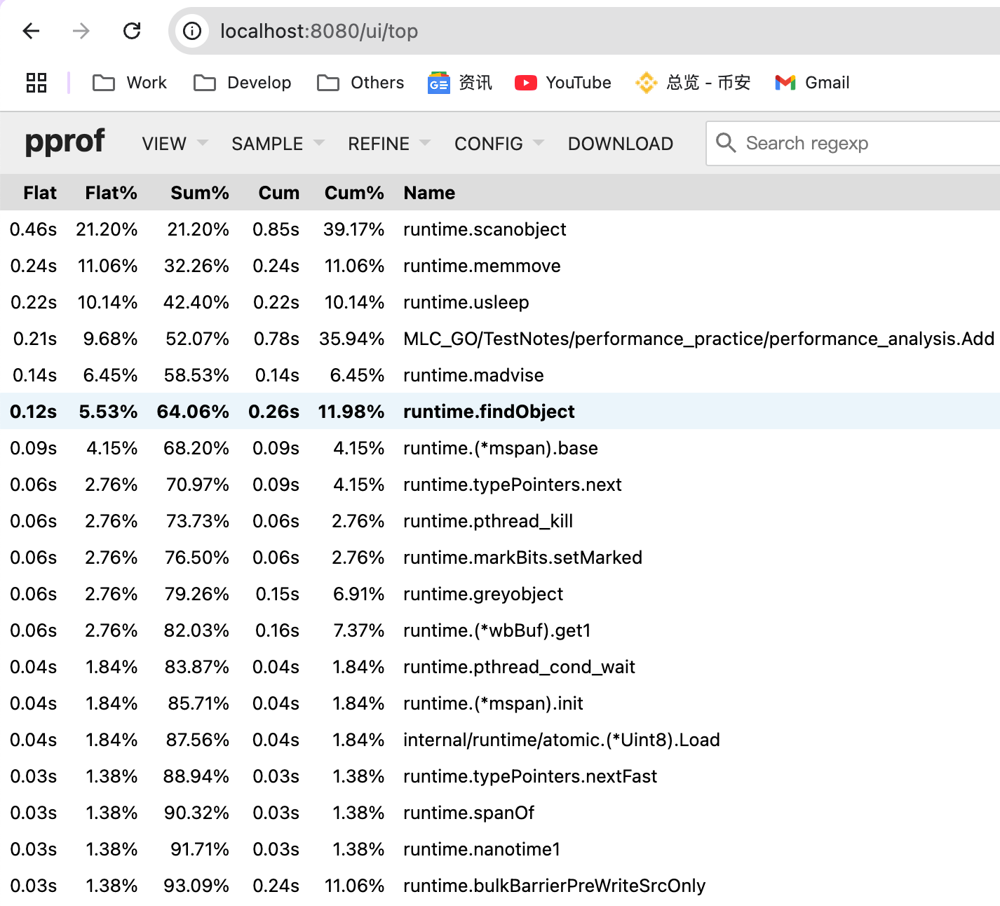
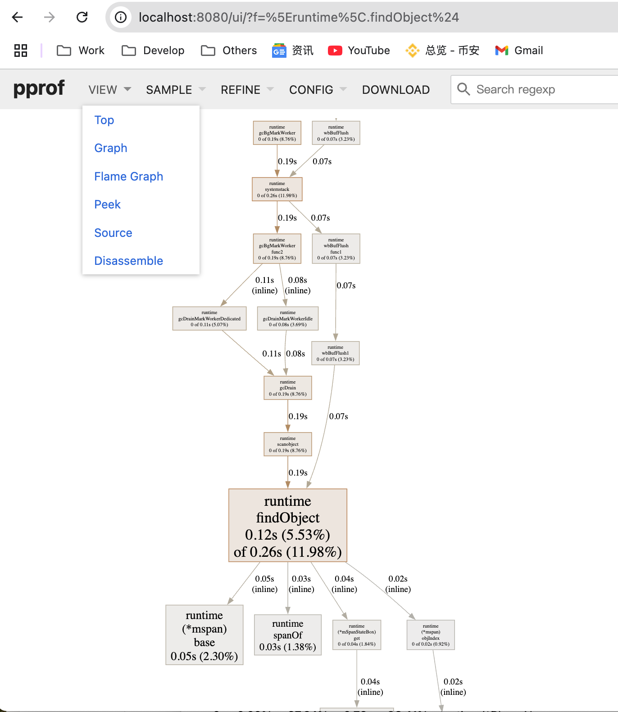
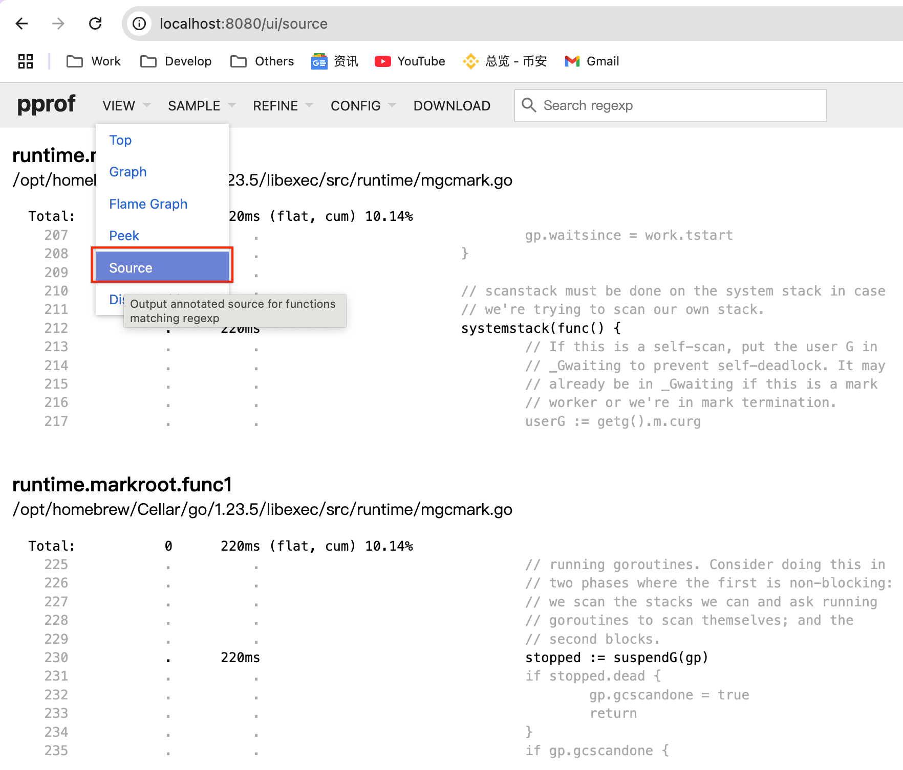
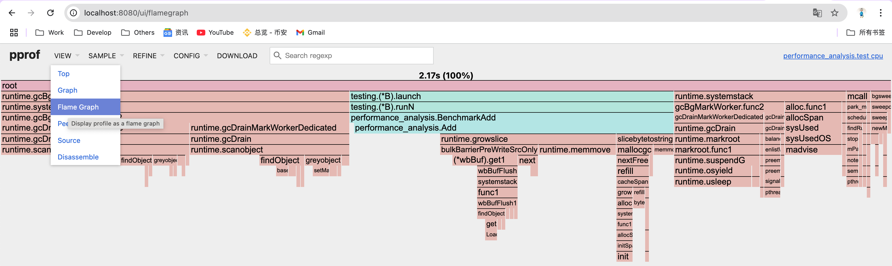

> <h3/>
- [PProf](#PProf)
	- [终端交互式检测](#终端交互式检测)
		- [升级PProf可视化界面](#升级PProf可视化界面)
			- [graphviz工具安装](#graphviz工具安装)
			- [查看 PProf 可视化界面](#查看PProf可视化界面)
			- [PProf 火焰图](#PProf火焰图)


<br/><br/><br/>


***
<br/>

> <h1 id="PProf">PProf</h1>
写了几吨代码，实现了几百个接口。功能测试也通过了，终于成功的部署上线了

结果，性能不佳，怎么办？😭

<br/>

想要进行性能优化，首先瞩目在 Go 自身提供的工具链来作为分析依据，本文将带你学习、使用 Go 后花园，涉及如下：
- runtime/pprof：采集程序（非 Server）的运行数据进行分析
- net/http/pprof：采集 HTTP Server 的运行时数据进行分析

<br/>

**是什么?**
pprof 是用于可视化和分析性能分析数据的工具

pprof 以 profile.proto 读取分析样本的集合，并生成报告以可视化并帮助分析数据（支持文本和图形报告）

profile.proto 是一个 Protocol Buffer v3 的描述文件，它描述了一组 callstack 和 symbolization 信息， 作用是表示统计分析的一组采样的调用栈，是很常见的 stacktrace 配置文件格式

<br/>

**支持什么使用模式**
- Report generation：报告生成
- Interactive terminal use：交互式终端使用
- Web interface：Web 界面

<br/>

**可以做什么**
- CPU Profiling：CPU 分析，按照一定的频率采集所监听的应用程序 CPU（含寄存器）的使用情况，可确定应用程序在主动消耗 CPU 周期时花费时间的位置
- Memory Profiling：内存分析，在应用程序进行堆分配时记录堆栈跟踪，用于监视当前和历史内存使用情况，以及检查内存泄漏
- Block Profiling：阻塞分析，记录 goroutine 阻塞等待同步（包括定时器通道）的位置
- Mutex Profiling：互斥锁分析，报告互斥锁的竞争情况

<br/><br/><br/>
> <h2 id="终端交互式检测">终端交互式检测</h2>


**编写简单Demo**

```sh
performance_practice
│   ├── performance_analysis
│   │   └── performance_analysis_practice_v1.go
│   └── performance_analysis_main.go
```

**performance_analysis_practice_v1.go文件**

```go
package performance_analysis

var datas []string

func Add(str string) string {
	data := []byte(str)
	sData := string(data)
	datas = append(datas, sData)

	return sData
}
```

<br/>

**performance_analysis_main.go文件:**

```
package performance_practice

import (
	performance_analysis_package "MLC_GO/TestNotes/performance_practice/performance_analysis"
	"log"
	"net/http"
	_ "net/http/pprof"
)

// 性能剖析 PProf测试例子
func Performance_analysis_practice_v1_test() {
	go func() {
		for {
			//https://github.com/harleyGit/StudyNotes/tree/master
			log.Println(performance_analysis_package.Add("https://github.com/harleyGit/StudyNotes/tree/master"))
		}
	}()

	http.ListenAndServe("0.0.0.0:6060", nil)
}
```

<br/>

**入口main.go文件**

```go
performance_practice_package "MLC_GO/TestNotes/performance_practice"

func main() {
	performance_practice_package.Performance_analysis_practice_v1_test()
}
```

运行文件:

```sh
go run main.go
```

<br/><br/>

**方法1️⃣: 通过Web界面:** 

```sh
http://127.0.0.1:6060/debug/pprof/
```


这个页面中有许多子页面，咱们继续深究下去，看看可以得到什么？

- cpu（CPU Profiling）: $HOST/debug/pprof/profile，默认进行 30s 的 CPU Profiling，得到一个分析用的 profile 文件
- block（Block Profiling）：$HOST/debug/pprof/block，查看导致阻塞同步的堆栈跟踪
- goroutine：$HOST/debug/pprof/goroutine，查看当前所有运行的 goroutines 堆栈跟踪
- heap（Memory Profiling）: $HOST/debug/pprof/heap，查看活动对象的内存分配情况
- mutex（Mutex Profiling）：$HOST/debug/pprof/mutex，查看导致互斥锁的竞争持有者的堆栈跟踪
- threadcreate：$HOST/debug/pprof/threadcreate，查看创建新 OS 线程的堆栈跟踪

<br/><br/>

**方法2️⃣: 通过交互式终端使用:** 

```sh
% go tool pprof http://localhost:6060/debug/pprof/profile\?seconds\=60
```
执行该命令后，需等待 60 秒（可调整 seconds 的值），pprof 会进行 CPU Profiling。结束后将默认进入 pprof 的交互式命令模式，可以对分析的结果进行查看或导出。具体可执行 pprof help 查看命令说明

**效果:**

```
Fetching profile over HTTP from http://localhost:6060/debug/pprof/profile?seconds=60
Saved profile in /Users/ganghuang/pprof/pprof.main.samples.cpu.001.pb.gz
File: main
Type: cpu
Time: Mar 15, 2025 at 4:57pm (CST)
Duration: 60.18s, Total samples = 26.80s (44.53%)
Entering interactive mode (type "help" for commands, "o" for options)

# 查看10条
(pprof) top10 
Showing nodes accounting for 26.06s, 97.24% of 26.80s total
Dropped 95 nodes (cum <= 0.13s)
Showing top 10 nodes out of 42
      flat  flat%   sum%        cum   cum%
    24.62s 91.87% 91.87%     24.68s 92.09%  syscall.syscall
     0.78s  2.91% 94.78%      0.78s  2.91%  runtime.pthread_cond_wait
     0.21s  0.78% 95.56%      0.21s  0.78%  runtime.memmove
     0.15s  0.56% 96.12%      0.15s  0.56%  runtime.pthread_cond_signal
     0.14s  0.52% 96.64%      0.14s  0.52%  runtime.madvise
     0.10s  0.37% 97.01%      0.24s   0.9%  runtime.scanobject
     0.03s  0.11% 97.13%      0.32s  1.19%  MLC_GO/TestNotes/performance_practice/performance_analysis.Add
     0.01s 0.037% 97.16%     24.93s 93.02%  log.(*Logger).output
     0.01s 0.037% 97.20%      0.15s  0.56%  runtime.slicebytetostring
     0.01s 0.037% 97.24%     24.69s 92.13%  syscall.write

(pprof) 
```

- flat：给定函数上运行耗时
- flat%：同上的 CPU 运行耗时总比例
- sum%：给定函数累积使用 CPU 总比例
- cum：当前函数加上它之上的调用运行总耗时
- cum%：同上的 CPU 运行耗时总比例

最后一列为函数名称，在大多数的情况下，我们可以通过这五列得出一个应用程序的运行情况，加以优化 🤔

<br/>

**命令:**

```sh
% go tool pprof http://localhost:6060/debug/pprof/heap
```

``` sh
Fetching profile over HTTP from http://localhost:6060/debug/pprof/heap
Saved profile in /Users/ganghuang/pprof/pprof.main.alloc_objects.alloc_space.inuse_objects.inuse_space.001.pb.gz
File: main
Type: inuse_space
Time: Mar 15, 2025 at 4:57pm (CST)
Entering interactive mode (type "help" for commands, "o" for options)
(pprof) top
Showing nodes accounting for 335.02MB, 99.70% of 336.02MB total
Dropped 9 nodes (cum <= 1.68MB)
Showing top 10 nodes out of 12
      flat  flat%   sum%        cum   cum%
  325.90MB 96.99% 96.99%   325.90MB 96.99%  MLC_GO/TestNotes/performance_practice/performance_analysis.Add (inline)
    7.40MB  2.20% 99.19%     7.40MB  2.20%  golang.org/x/net/webdav.(*memFile).Write
    1.72MB  0.51% 99.70%     1.72MB  0.51%  runtime/pprof.StartCPUProfile
         0     0% 99.70%   325.90MB 96.99%  MLC_GO/TestNotes/performance_practice.Performance_analysis_practice_v1_test.func1
         0     0% 99.70%     1.72MB  0.51%  net/http.(*ServeMux).ServeHTTP
         0     0% 99.70%     1.72MB  0.51%  net/http.(*conn).serve
         0     0% 99.70%     1.72MB  0.51%  net/http.HandlerFunc.ServeHTTP
         0     0% 99.70%     1.72MB  0.51%  net/http.serverHandler.ServeHTTP
         0     0% 99.70%     1.72MB  0.51%  net/http/pprof.Profile
         0     0% 99.70%     8.40MB  2.50%  runtime.doInit
(pprof) 
```

- inuse_space：分析应用程序的常驻内存占用情况

- alloc_objects：分析应用程序的内存临时分配情况

<br/>

**还有如下命令:**

```sh
go tool pprof http://localhost:6060/debug/pprof/block
```

```sh
go tool pprof http://localhost:6060/debug/pprof/mutex
```


<br/><br/>
> <h3 id="升级PProf可视化界面">升级PProf可视化界面</h3>

编写测试用例:

**performance_analysis_practice_v1_test.go文件**

```go
package performance_analysis

import "testing"

const url = "https://github.com/harleyGit/StudyNotes/tree/master"

func TestAdd(t *testing.T) {
	s := Add(url)
	if s == "" {
		t.Errorf("Test.Add error!")
	}
}

func BenchmarkAdd(b *testing.B) {
	for i := 0; i < b.N; i++ {
		Add(url)
	}
}
```

**运行测试用例:**

```sh
# cd 到测试文件所在文件夹下
cd '/Users/ganghuang/HGFiles/GitHub/GoProject/src/MLC_GO/TestNote
s/performance_practice/performance_analysis'

# 执行测试用例
ganghuang@GangHuangs-MacBook-Pro performance_analysis % go test -bench=. -cpuprofile=cpu.prof
goos: darwin
goarch: arm64
pkg: MLC_GO/TestNotes/performance_practice/performance_analysis
cpu: Apple M2 Pro
BenchmarkAdd-10         26229364                38.65 ns/op
PASS
ok      MLC_GO/TestNotes/performance_practice/performance_analysis      2.250s
```

在当前文件夹下会生成 **cpu.prof** 文件.

<br/>

**启动PProf 可视化界面**
方法1️⃣:

```sh
% go test -bench=. -cpuprofile=cpu.prof
```

<br/>

方法2️⃣：

```sh
$ go tool pprof cpu.prof
$ (pprof) web
```

但是上述会在网页出现提示: `‌Could not execute dot; may need to install graphviz.`

上述提示你没有安装 graphviz 工具,这个时候你需要安装下.

<br/><br/>
> <h3 id="graphviz工具安装">graphviz工具安装</h3>
**1.MacOS（使用 Homebrew）**

```sh
brew install graphviz
```
---

- **2.验证 Graphviz 是否安装成功**
执行：

```sh
dot -V
```
如果输出类似：

```sh
dot - graphviz version 2.x.x
```
说明安装成功。

---

- **3.检查 Graphviz 是否在系统 PATH 中**
如果 `dot -V` 找不到命令，可能是 `dot` 没有加入系统的 **PATH** 变量。

**MacOS/Linux**
执行：

```sh
echo $PATH
which dot
```
如果 `which dot` 没有找到路径，可以手动添加：

```sh
export PATH="/usr/local/bin:$PATH"
```

---

- **4.重新启动终端或开发工具**
安装或修改 `PATH` 后，需要**重启终端**或**重启 IDE（如 VS Code、PyCharm）**才能生效。

---

- **5.测试 Graphviz**
创建一个测试文件 `test.dot`：

```
digraph G {
  A -> B;
  B -> C;
  C -> A;
}
```
然后运行：

```sh
dot -Tpng test.dot -o test.png
```
如果 `test.png` 生成成功，说明 Graphviz 可以正常使用。

<br/><br/>

> <h3 id="查看PProf可视化界面">查看 PProf 可视化界面</h3>

- **1.Top**




<br/><br/>

- **2.Graph**



框越大，线越粗代表它占用的时间越大哦

<br/><br/>

- **3.Peek**


<br/><br/>

- **4.Source**




<br/><br/>

- **5.Flame Graph**




通过 PProf 的可视化界面，我们能够更方便、更直观的看到 Go 应用程序的调用链、使用情况等，并且在 View 菜单栏中，还支持如上多种方式的切换

你想想，在烦恼不知道什么问题的时候，能用这些辅助工具来检测问题，是不是瞬间效率翻倍了呢 👌


<br/><br/>
> <h3 id="PProf火焰图">PProf 火焰图</h3>

另一种可视化数据的方法是火焰图，需手动安装原生 PProf 工具：


（1） 安装 PProf

```sh
$ go get -u github.com/google/pprof
```

（2） 启动 PProf 可视化界面:

```sh
$ pprof -http=:8080 cpu.prof
```

（3） 查看 PProf 可视化界面

打开 PProf 的可视化界面时，你会明显发现比官方工具链的 PProf 精致一些，并且多了 Flame Graph（火焰图）

它就是本次的目标之一，它的最大优点是动态的。调用顺序由上到下（A -> B -> C -> D），每一块代表一个函数，越大代表占用 CPU 的时间更长。同时它也支持点击块深入进行分析！

**总结**

在本节，粗略地介绍了 Go 的性能利器 PProf。在特定的场景中，PProf 给定位、剖析问题带了极大的帮助

希望本文对你有所帮助，另外建议能够自己实际操作一遍，最好是可以深入琢磨一下，内含大量的用法、知识点 🤓


