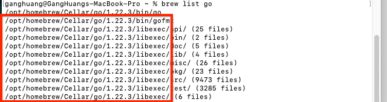
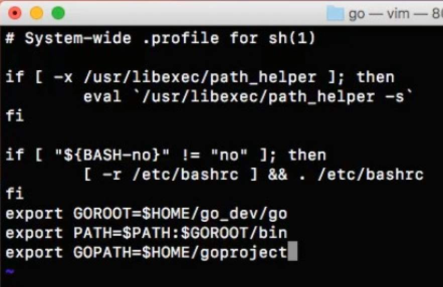
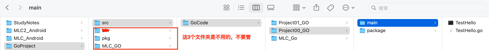
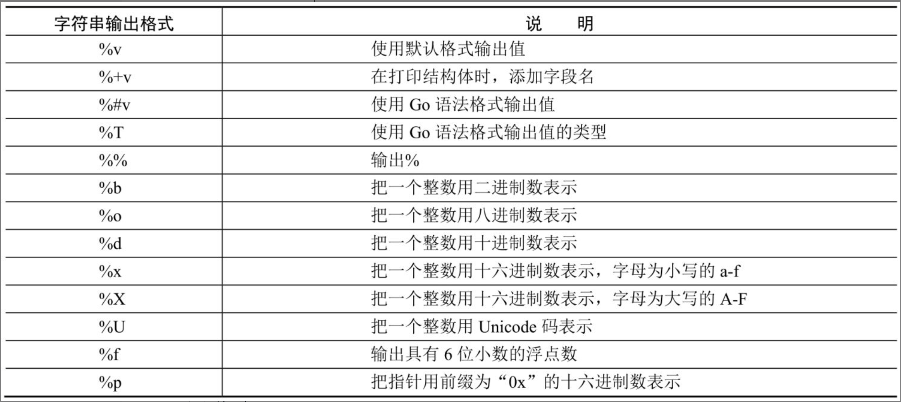
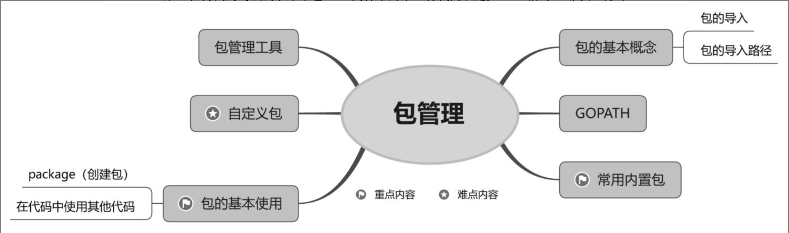
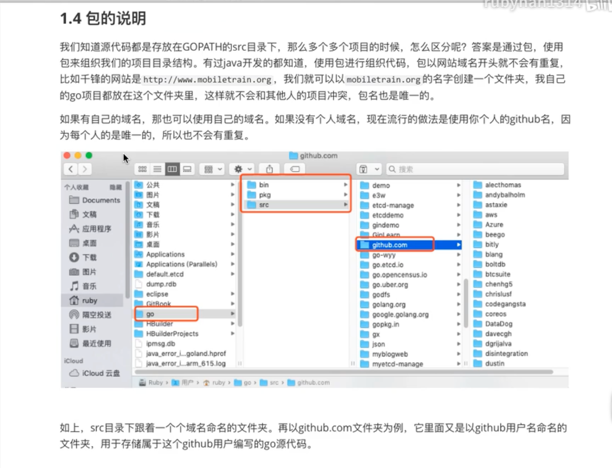
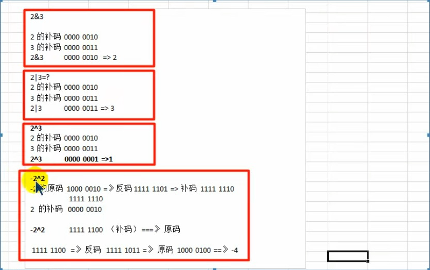

># <h0 id=''>[GoLang官网](https://go.dev/)</h2>
># <h1 id="Go中文API文档">[Go中文API文档](https://studygolang.com/pkgdoc)</h1>
- [**安装配置**](#安装配置)
	- [GOROOT环境变量路径下各个文件的意义](#GOROOT环境变量路径下各个文件的意义)
- [**项目初创建**](#项目初创建)
	- [创建项目目录](#创建项目目录)
	- [2种方式运行](#2种方式运行)
	- [不需要GOPATH支持的方式](#不需要GOPATH支持的方式)
		- [Golang中GOPATH分为全局GOPATH和项目GOPATH是怎么做的？怎么区分的？](#Golang中GOPATH分为全局GOPATH和项目GOPATH是怎么做的？怎么区分的？)
- [**常用命令**](#常用命令)
	- [go build和go install区别](#gobuild和goinstall区别)
	- [go install的原理](#goinstall的原理)
	- [go get的原理](#goget的原理)
- [**命令行工具**](#命令行工具)
	- [命令行工具-DockerDocker](#命令行工具-DockerDocker)
	- [命令行的几种方式](#命令行的几种方式)
		- [内置的OS库](#内置的OS库) 
		- [解决直接点击编译后的文件，无法交互](#解决直接点击编译后的文件，无法交互)
- [**命名规范**](#命名规范)
- [**打印占位符**](#打印占位符)
	- [`fmt.Print/fmt.Println`](#`fmt.Print`/`fmt.Println`)
	-  [`fmt.Printf`](#`fmt.Printf`)	
	-  [`log.Print`/`log.Println`/`log.Printf`](#`log.Print`/`log.Println`/`log.Printf`)
	-  [fmt.Sprintf格式化字符串](#fmt.Sprintf格式化字符串)
- [**工作目录的相对路径**](#工作目录的相对路径)
	- [go相对路径](#go相对路径)
- [**‌基本语法与使用**](#基本语法与使用)
	- [**变量**](#变量)
		- [多个变量的声明和推导](#多个变量的声明和推导)
		- [bool值字段有无判断](#bool值字段有无判断)
		- [短变量](#短变量)
		- [字符类型](#字符类型)
		- [枚举常量](#枚举常量)
			- [连续常量值关键字iota](#连续常量值关键字iota)
	- [**指针**](#指针)
	- [**类型别名**](#类型别名)
	- [**容器：存储和组织数据的方式**](#容器：存储和组织数据的方式)
		- [数组](#数组)
		- [切片](#切片)
			- [切片内存底层原理](#切片内存底层原理)
			- [切片改变数组元素解决](#切片改变数组元素解决)
		- [Map(容器)](#Map(容器))
			- [`map[string]interface{}`的意思](#`map[string]interface{}`的意思)
		- [列表list](#列表list)
	- [**流程控制**](#流程控制)
		- [for循环](#for循环) 
- [**函数**](#函数)
	- [声明函数](#声明函数)
	- [匿名函数](#匿名函数)
	- [函数类型实现接口](#函数类型实现接口)
	- [闭包](#闭包)
		- [函数变量+闭包](#函数变量+闭包)
	- [普通函数的指针类型、指类型参数区别](#普通函数的指针类型、指类型参数区别)
	- [可变参数](#可变参数)
		- [`NewService(opts ...Option)`可变参数](#`NewService_opts`可变参数)
	- [延迟执行语句def](#延迟执行语句def)
- [**结构体**](#结构体)
	- [结构体实例化](#结构体实例化)
	- [初始化结构体的成员变量](#初始化结构体的成员变量)
	- [构造函数](#构造函数)
	- [结构体内存](#结构体内存)
	- [方法](#方法)
		- [Go语言的结构体方法 ](#Go语言的结构体方法)
		- [方法和函数的区别](#方法和函数的区别)
		- [接收器——方法作用的目标](#接收器)
		- [指针类型的接收器](#指针类型的接收器)
		- [非指针类型的接收器](#非指针类型的接收器)
		- [指针类型和非指针类型调用方法Demo](#指针类型和非指针类型调用方法Demo)
		- [使用事件系统实现事件的响应和处理](#使用事件系统实现事件的响应和处理)
	- [类型内嵌和结构体内嵌](#类型内嵌和结构体内嵌)
- [**接口**](#接口)
- [**错误处理**](#错误处理)
	- [处理运行时发生的错误](#处理运行时发生的错误)
		- [自定义错误](#自定义错误)
	- [宕机（panic）——程序终止运行](#宕机程序终止运行)
	- [宕机恢复（recover）](#宕机恢复recover)
	- [断言和panic、recover关系](#断言和panic、recover关系)
- [**‌并发编程**](#并发编程)
- [**包管理**](#包管理) 
	- [GOPATH](#GOPATH) 
	- [包的基本使用](#包的基本使用) 
	- [package规则如下](#package规则如下) 
	- [导出标识符——让外部访问包的类型和值](#导出标识符——让外部访问包的类型和值)
	- [自定义包](#自定义包) 
	- [包管理工具](#包管理工具)
- [**‌标准库**](#标准库)
	- [读写基本的库函数](#读写基本的库函数) 
	- [日志](#日志) 
	- [JSON的编码和解码](#JSON的编码和解码)
- [**‌编译与测试工具**](#编译与测试工具)
	- [go build命令](#gobuild命令) 
	- [go clean命令](#goclean命令) 
	- [go run命令](#gorun命令) 
	- [go fmt命令](#gofmt命令) 
	- [go install命令](#goinstall命令) 
	- [go get命令](#goget命令) 
	- [go pprof命令](#gopprof命令)
	- [解析终端命令行参数](#解析终端命令行参数)
		- [flag.Parse()函数使用](#flag.Parse()函数使用)
- [**反射**](#反射)
	- [反射概述](#反射概述)
	- [类型（Type）与种类（Kind）](#类型（Type）与种类（Kind）)
	- [反射值的修改](#反射值的修改) 
	- [反射的类型与种类](#反射的类型与种类)
	- [Go语言结构体标签](#Go语言结构体标签)
	- [反射解析命令行参数](#反射解析命令行参数)
- [**MySQL数据库编程**](#MySQL数据库编程)
- [**文件处理**](#文件处理)
	- [文本文件的写入、追加、读取操作](#文本文件的写入、追加、读取操作)  
	- [二进制文件的写入、读取操作](#二进制文件的写入、读取操作)	
		- [gob格式](#gob格式) 
		- [自定义二进制格式](#自定义二进制格式)
		- [时时写入数据到磁盘](#时时写入数据到磁盘)
	- [路径](#路径)
		- [拼接](#拼接)
	- [JSON文件的写入、读取操作](#JSON文件的写入、读取操作) 
	- [yaml、mapstructure、json解析总结](#yaml、mapstructure、json解析总结)
	- [文件锁操作](#文件锁操作)
- [**网络编程**](#网络编程)
- [**计算机进制运算**](#计算机进制运算)
	- [原码、反码、补码](#原码、反码、补码)
	- [位运算符和移位运算符](#位运算符和移位运算符)
	- [**编写测试**](#编写测试)
		- [单元测试](#单元测试) 
		- [基本使用](#基本使用)
- [**Web服务**](#Web服务)
	- [设计RESTful API](#设计RESTfulAPI)
		- [RESTful简介](#RESTful简介)
		- [Web请求信息简介](#Web请求信息简介)
		- [资源的访问操作](#资源的访问操作)
		- [路由设计](#路由设计)
		- [中间件](#中间件)
		- [响应信息](#响应信息)
		- [项目组织架构](#项目组织架构)
- [**项目实践**](#项目实践)
	- [爬虫程序](#爬虫程序)
	- [模版引擎-加载渲染html](#模版引擎-加载渲染html)
- [**知识拓展**](#知识拓展)
	- [裸机和租用服务器系统辨识分类](#裸机和租用服务器系统辨识分类)
		- [阿里云和腾讯云安转的是什么系统](#阿里云和腾讯云安转的是什么系统)
- **资料**
	- [**GoLang官网资料【中文API文档】**](https://studygolang.com/pkgdoc)
	- [**Go语言中文文档(框架、demo很丰富)**](https://www.topgoer.com/)
	- [GO指南](https://tour.go-zh.org/list)
	- [GoLang中文网](https://studygolang.com/pkgdoc)
	- [Go语言资料集合](https://github.com/LearnGolang/LearnGolang/tree/master/01-Golang资源/01-中文书籍)
	- [Go开发者路线图](https://github.com/darius-khll/golang-developer-roadmap/blob/master/i18n/zh-CN/ReadMe-zh-CN.md)
	- [Go语言学习【rickiyang很值得看，都是干货】](https://www.cnblogs.com/rickiyang/category/1487722.html)
	- [《Go学习路线图》让你少走弯路，Let's Go ！持续更新中...](https://juejin.cn/post/7119123646471208968)
	- **iBooks**
		- [《Go语言项目开发上手指南》- 代码示例](https://github.com/XieWeiXie/GopherBook)
		- [Go语言圣经-iBook（王飞介绍）](https://docs.hacknode.org/gopl-zh/index.html)
		- [Go学习路线-王飞介绍](https://mp.weixin.qq.com/s/o1KxHuHyr32F7pQyKNLedw)
	- [命名规则](https://www.cnblogs.com/rickiyang/p/11074174.html)


<br/>

***
<br/><br/><br/>

> <h1 id='安装配置'>安装配置</h1>

- **安装**

直接使用brew install go安装go

```
brew install go
```

<br/>

- **查看安装目录**

如果不知道是安装到了哪个目录可以通过如下查看：

```sh
//可以查看go的安装目录
brew list go
```



上面画红色圈的就是Go的安装路径，也就是下面需要把这个Go的安装路径赋值给GOROOT配置变量。


<br/>

- **设置环境变量**

查看当前shell是zsh还是bash, 如果是bash选择编辑~/.bash_profile文件，如果是zsh选择编辑~/.zshrc 文件

```sh
 dscl . -read /Users/$USER UserShell
```

根据上面的命令输出结果选择该编辑的配置文件。需要设置`GOROOT, GOPATH, PATH`三个环境变量。

```sh
//指定SDK的安装路径
export GOROOT=/usr/local/Cellar/go/1.16.5/libexec

//待加SDK的bin目录,$HOME指的是用户目录，比如huangGang用户目录
export GOPATH=$HOME/go 

//工作目录，我们GO项目路径
export PATH=$GOROOT/bin:$GOPATH/bin:$PATH
```

GOROOT路径是go的安装路径，一般是`/usr/local/go`或者 `/opt/homebrew/Cellar/go/1.22.3/libexec`

<br/>

看**尚学堂**教程是如下配置：



<br/><br/>

我的电脑配置如下：

```sh
#Go配置(https://blog.csdn.net/weixin_41850404/article/details/121682332, https://juejin.cn/post/7304959484828041227)

export GOROOT=/opt/homebrew/Cellar/go/1.22.3/libexec #Go源代码安装目录(homebrew安装:brew info go)
export GOPATH=$HOME/HGFiles/GitHub/GoProject	#项目程序目录
export GOBIN=$GOPATH/bin	#Go执行目录(Go程序编译后生成的可执行文件存放目录)
export PATH=$GOROOT/bin:$GOBIN:$PATH	#将go可执行文件加入PATH中，使GO命令与我们编写的GO应用可以全局调用,$PATH表示引入之前的路径
#auto（默认值）​，当项目在GOPATH/src目录之外，并且项目根目录中有go.mod文件时，开启gomodule
export GO111MODULE=auto
export GOPROXY=https://goproxy.cn,direct

#Go配置End
```

<br/><br/>
GOROOT下的部分文件用处：

```sh
src 目录包含Go的源文件，它们被组织成包（每个目录都对应一个包），
pkg 目录包含包对象，
bin 目录包含可执行命令。
```

<br/>

- **GOPATH：**
	- 日常开发的根目录； 
	- 是以后打算把包存放的路径，可以随便写一个自己想写的路径(GOPATH是工作目录)。 

将$GOPATH/bin加入 $PATH 变量，这样在终端的任何路径都能使用go包的bin目录下面的工具，不需要进入到bin目录或者指定目录，比较方便。

<br/>

**生效环境变量**

```sh
source ~/.bash_profile　　# 如果是bash
source ~/.zshrc　　# 如果是zsh
```

<br/><br/><br/>
> <h2 id="GOROOT环境变量路径下各个文件的意义">GOROOT环境变量路径下各个文件的意义</h2>


```sh
% tree -L 3 go
go
└── 1.23.5
    ├── INSTALL_RECEIPT.json
    ├── LICENSE
    ├── README.md
    ├── bin
    │   ├── go -> ../libexec/bin/go
    │   └── gofmt -> ../libexec/bin/gofmt
    ├── libexec
    │   ├── CONTRIBUTING.md
    │   ├── PATENTS
    │   ├── SECURITY.md
    │   ├── VERSION
    │   ├── api
    │   ├── bin
    │   ├── codereview.cfg
    │   ├── doc
    │   ├── go.env
    │   ├── lib
    │   ├── misc
    │   ├── pkg
    │   ├── src
    │   └── test
    └── sbom.spdx.json
```

- api：用于存放依照 Go 版本顺序的 API 增量列表文件。这里所说的 API 包含公开的变量、常量、函数等。这些 API 增量列表文件用于 Go 语言 API 检查
- bin：用于存放主要的标准命令文件（可执行文件），包含go、godoc、gofmt
- blog：用于存放官方博客中的所有文章
- doc：用于存放标准库的 HTML 格式的程序文档。我们可以通过godoc命令启动一个 Web 程序展示这些文档
- lib：用于存放一些特殊的库文件
- misc：用于存放一些辅助类的说明和工具
- pkg：用于存放安装Go标准库后的所有归档文件（以.a结尾的文件）。注意，你会发现其中有名称为linux_amd64的文件夹，我们称为平台相关目录。这类文件夹的名称由对应的操作系统和计算架构的名称组合而成。通过go install命令，Go程序会被编译成平台相关的归档文件存放到其中
- src：用于存放 Go自身、Go 标准工具以及标准库的所有源码文件
- test：存放用来测试和验证Go本身的所有相关文件


<br/>

***
<br/><br/><br/>

> <h1 id="项目初创建">项目初创建</h1>

我Mac电脑配置的环境变量如下：

```sh
export GOROOT=/opt/homebrew/Cellar/go/1.22.3/libexec #Go源代码安装目录(homebrew安装:brew info go- 俗称Go根目录)
export GOPATH=$HOME/HGFiles/GitHub/GoProject	#项目程序目录
export GOBIN=$GOPATH/bin	#Go执行目录(Go程序编译后生成的可执行文件存放目录)
export PATH=$PATH:$GOROOT/bin	#将go可执行文件加入PATH中，使GO命令与我们编写的GO应用可以全局调用,$PATH表示引入之前的路径
```

对于这种方式，开发者可以在任意目录下创建子目录作为项目程序的目录，使用的第三方库会下载至$GOPATH/pkg/mod目录下。

```sh
cd /Users/ganghuang/HGFiles/GitHub/GoProject

mkdir MLC_GO
```

此时只需要在go-anything目录下执行go mod init命令即可

```sh
go mod init
```

自动创建go.mod、go.sum作为版本管理的文件。要使用第三方库，只需执行go get命令，它会自动更改go.mod、go.sum文件，推荐使用这种方式作为项目程序的版本管理方式。

如下图：


<br/><br/><br/>
> <h2 id="">GOPATH文件夹下src、bin、pkg文件夹作用</h2>

- **Go的工作区目录结构有bin、pkg、src三个（在GOPATH目录下）：**

	- bin：生成的可执行文件（编译后的可执行程序的存储目录。）
	- pkg：编译后生成的，包的目标文件；（编译时生成的对象文件。）
	- src：里面的每一个子目录，就是一个包，包内是Go的源码文件（库文件。）

&emsp; 这些都是Go设计者的约定，只需按照这样的方式组织目录结构即可。GOPATH环境变量生效时个人项目可以在src目录下创建新目录，第三方库存放在src的github.com目录下。

<br/><br/>

**可以具体了解下pkg、bin文件夹的文件作用吗?**

- **1.`bin`（Binary）**
	- **用途**：存放 Go 编译生成的**可执行文件**（二进制程序）。
	- **细节**：
		- 当运行 `go install` 或 `go get` 安装一个 **main 包**（含 `main` 函数的程序）时，生成的可执行文件会保存到这里。
		- 例如：安装 `golangci-lint` 后，它的二进制文件会出现在 `$GOPATH/bin/golangci-lint`。
		- 可以将 `$GOPATH/bin` 添加到系统 `PATH` 环境变量中，方便直接运行这些工具。

<br/>

- **2.`pkg`（Package）**
	- **用途**：存放 Go 编译生成的**静态库文件**（`.a` 文件），用于加速后续编译。
	- **细节**：
		- 当编译**非 main 包**（库或依赖）时，Go 会将编译后的中间结果（`.a` 文件）缓存到 `pkg` 目录。
		- 例如：标准库 `fmt` 编译后的文件会存放在 `$GOPATH/pkg/<OS_ARCH>/fmt.a`。
		- 这些 `.a` 文件是平台相关的，目录结构包含操作系统和架构（如 `linux_amd64`）。

pkg 目录下存放的是 Go 编译后的包文件（.a 文件，即静态库文件）。编译前（源码）和编译后（.a 文件）的核心区别在于：源码是人类可读的代码，而 .a 文件是机器优化后的二进制中间产物。

---		
<br/>

- **示例流程**
1.**编译可执行程序**：

```bash
go install github.com/user/project/cmd/tool  # 生成 $GOPATH/bin/tool
```

<br/>

2.**编译依赖包**：

```bash
go install github.com/user/project/pkg/lib   # 生成 $GOPATH/pkg/<OS_ARCH>/github.com/user/project/pkg/lib.a
```

---
<br/>

- **Go Modules 的差异**
	- 使用 Go Modules（`go.mod`）后，依赖会存储在 `$GOPATH/pkg/mod` 目录，且项目不再强制要求放在 `$GOPATH/src` 下。
	- 但 `bin` 和 `pkg` 的作用在传统 `GOPATH` 模式下依然有效。


<br/><br/><br/>
> <h2 id="创建项目目录">创建项目目录</h2>

开始创建如下文件目录：



在Project00_Go中建立main和package文件夹，在mian中创建TestHell.go文件，然后编码如下：


<br/><br/><br/>
> <h2 id="2种方式运行">2种方式运行</h2>
Golang执行流程：


<br/>
两者区别：


<br/>

- **第一种：先编译在运行**

```sh
cd /Users/ganghuang/HGFiles/GitHub/GoProject/src/GoCode/Project00_GO/main

go build TestHell.go
```

会生成一个 TestHell文件，如上图。

接着：

```sh
TestHello
```

会打印：

```sh
hello world
```

一般发布的时候是这么做的

<br/><br/>

**第二种：**

```sh
cd /Users/ganghuang/HGFiles/GitHub/GoProject/src/GoCode/Project00_GO/main

go run TestHell.go
```

会打印：

```sh
hello world
```

<br/><br/><br/>
> <h2 id="不需要GOPATH支持的方式">不需要GOPATH支持的方式</h2>

Go版本1.11以上支持设置GOROOT环境变量，在任意目录下创建项目程序即可。

<br/>

安装Go语言开发系统后，内置的命令行工具常用的命令如下：

```sh
go build：将程序编译成可执行文件。
go run：将程序先编译成可执行文件，再运行程序。
go fmt：格式化代码，比如换行、缩进等。
go test：运行测试的命令。
go get：下载第三方库的常用命令。
go version：查看当前操作系统中安装的Go语言系统的版本信息。
go env：查看当前操作系统和Go语言相关的环境变量的值。
```


<br/><br/>
> <h3 id="Golang中GOPATH分为全局GOPATH和项目GOPATH是怎么做的？怎么区分的？">Golang中GOPATH分为全局GOPATH和项目GOPATH是怎么做的？怎么区分的？</h3>

在 Golang 中，`GOPATH` 定义了存储 Go 项目的工作区目录。对于全局 `GOPATH` 和项目 `GOPATH`，它们的配置和使用可以通过环境变量和模块化工作区进行区分。

<br/>

**1. 全局 `GOPATH`**
全局 `GOPATH` 是整个系统或用户范围内的一个工作区，适用于存储和共享多个项目的依赖包和代码。

- **配置**
	- 默认值：`$HOME/go`（Windows 上为 `%USERPROFILE%\go`）。
	- 可以通过设置环境变量 `GOPATH` 来自定义全局工作区路径：

```bash
export GOPATH=/path/to/your/global/gopath
```

- 常用目录结构：

```
GOPATH/
├── bin/      # 可执行文件
├── pkg/      # 已编译的包文件
└── src/      # 源代码
```

- **使用**
	- 使用全局 `GOPATH` 时，所有依赖包会下载到 `GOPATH/pkg` 中。
	- 在早期版本的 Go 中（<1.11），开发必须在 `GOPATH/src` 内完成。
	- 常用于全局工具或库，例如：

```bash
go install github.com/some/tool
# 安装的工具会放在 $GOPATH/bin 中
```

<br/><br/>

**2. 项目 `GOPATH`**

项目 `GOPATH` 是为单个项目创建的独立工作区，通常配合 Go 模块（`go mod`）使用。在 Go 1.11+ 中，启用了 Go 模块后，项目可以独立管理依赖，而无需依赖全局 `GOPATH`。

<br/>

- **配置**
	- 每个项目使用自己的模块工作区，`go.mod` 文件定义了项目的依赖。
	- 无需手动设置 `GOPATH`，`go mod` 会自动管理依赖。
	- 典型项目结构：

```sh
my_project/
├── go.mod    # 模块依赖管理文件
├── go.sum    # 依赖校验文件
└── main.go   # 主程序文件
```

<br/>

- **使用**

1. 启用模块：

```bash
go mod init example.com/my_project
```

2. 添加依赖：

```bash
go get some/package
```

- 依赖会下载到 `$GOPATH/pkg/mod`（模块缓存）。

3. 构建项目：

```bash
go build
```

<br/>

**3. 全局与项目 `GOPATH` 的区分**

- **工作方式的差异**

| 特性                 | 全局 `GOPATH`                       | 项目 `GOPATH`（Go 模块）          |
|----------------------|-------------------------------------|-----------------------------------|
| 配置                 | 通过环境变量 `GOPATH` 设置           | 自动配置（使用 `go.mod`）         |
| 依赖管理             | 所有项目共用 `GOPATH/pkg`           | 独立依赖管理（模块缓存）           |
| 目录限制             | 必须在 `GOPATH/src` 内开发          | 任意目录开发，无需放在 `GOPATH`   |
| 适用场景             | 老项目或系统级工具                  | 新项目，特别是多模块项目          |

<br/>

**4. 如何切换使用**

 **全局 `GOPATH` 开发**
1. 设置全局 `GOPATH`：

```bash
export GOPATH=/path/to/global/gopath
```

2. 开发代码放置在 `$GOPATH/src` 中：

```
$GOPATH/src/github.com/user/project
```

3. 使用 `go build` 或 `go install`。

<br/>

- **项目 `GOPATH`（Go 模块）开发**
1. 启用 Go 模块支持（推荐）：

```bash
export GO111MODULE=on
```

2. 创建项目并初始化模块：

```bash
mkdir my_project && cd my_project
go mod init example.com/my_project
```

3. 开发代码并使用模块独立管理依赖。

<br/><br/>

- **5. 如何查看当前使用的 `GOPATH` 和模块状态**

1. 查看当前 `GOPATH`：

```bash
go env GOPATH
```

2. 查看模块模式是否启用：

```bash
go env GO111MODULE
```

- 如果输出为 `on`，则启用了模块模式，优先使用项目 `GOPATH`。
- 如果为 `auto`，则根据项目是否存在 `go.mod` 自动切换模式。

<br/><br/>

- **6. 推荐实践**
	- **新项目**：优先使用 Go 模块（`go.mod`），更灵活，适合现代开发。
	- **老项目或工具开发**：可以继续使用全局 `GOPATH`，但建议逐步迁移到模块化管理。

通过以上方式，可以轻松区分和使用全局 `GOPATH` 和项目 `GOPATH`！

<br/>

***
<br/><br/><br/>

> <h1 id='常用命令'>常用命令</h1>

[GO入门](https://blog.csdn.net/weixin_45440484/article/details/131692655)

```sh
go build : 编译源代码包和依赖
go run : 编译并运行 GO程序
//go run xxx/hello.go //运行

go get : 下载并安装指定的包和依赖
go install : 编译并安装指定的包和依赖
go fmt : 格式化源码包中的代码
go help：了解更多
```

<br/><br/><br/>
> <h2 id="gobuild和goinstall区别">go build和go install区别</h2>


在 Go 语言中，使用 go run 命令运行程序时，会先将代码编译成一个临时可执行文件，然后执行该文件，执行完成后自动删除临时文件。这些临时文件默认存放在 系统的临时目录 中。

**临时文件位置**

默认路径：

```bash
/var/folders/xx/yyyyyyyyy/T/
```
- xx 和 yyyyyyyyy 是由系统生成的随机字符串（如 /var/folders/3k/5zq_1nss5sg2t1m7y7k5v6vm0000gn/T/）。
- 临时文件名通常以 go-build 开头，例如：

```bash
/var/folders/xx/yyyyyyyyy/T/go-build123456789
```

**终端查找：**

```sh
find /var/folders -name "go-build*" 2>/dev/null
```

或者Go查找：

```go
package main

import (
    "fmt"
    "os"
)

func main() {
    fmt.Println("临时目录:", os.TempDir())
}
```

- **注意事项：**
	- 临时文件自动删除：
		- 正常情况下，go run 执行完成后会自动删除临时文件。仅当程序崩溃或被强制终止时，临时文件可能残留。
	- 权限问题：
		- macOS 系统保护机制可能限制对 /var/folders 的直接访问，建议通过 os.TempDir() 或终端命令查找。

<br/><br/><br/>
> <h2 id="goinstall的原理">go install的原理</h2>


> <h2 id="goget的原理">go get的原理</h2>


<br/><br/><br/>

***
<br/>

> <h1 id="命令行工具">命令行工具</h1>
<br/>

> <h2 id="命令行工具-DockerDocker">命令行工具-DockerDocker</h2>

[**docker部署go项目|docker项目部署精讲-B站Video**](https://www.bilibili.com/video/BV1HH4y1W7H4/?spm_id_from=333.337.search-card.all.click&vd_source=a7fe275f0ee54c4d2f691a823f8876b8)

Docker是一个容器化平台，用于打包、分发和运行应用程序。让开发者可以将开发的应用以及相关的依赖移植到容器内。容器可以在任意服务器上进行部署，而后启动应用，可以大大减少依赖，精简开发流程，绝大多数互联网公司都拥抱容器技术，Docker本身也是使用Go开发的，最终成为Go编程领域的一个明星级产品。

<br/><br/>

**Go 语言与 Docker 的关系**

- Docker 是用 Go 编写的
	- Docker 的核心组件（如 Docker Daemon）使用 Go 语言开发，得益于 Go 的高效并发和跨平台特性。

- Go 应用的容器化优势
	- 静态编译：Go 程序编译为单一静态二进制文件，无需依赖外部运行时（如 JVM、Python 解释器），可直接运行于最小化镜像（如 scratch 或 alpine）。
	- 轻量级镜像：Go 的静态编译特性使最终镜像体积极小（通常仅 10-20 MB）。
	- 高效部署：容器化后的 Go 应用启动快、资源占用低，适合云原生场景。


<br/><br/><br/>
> <h2 id="命令行的几种方式">命令行的几种方式</h2>
<br/>

> <h2 id="内置的OS库">内置的OS库</h2>

内置的os库提供与操作系统功能相关的函数(API)，它提供了对文件(os.Mkdir)或者路径(os.Getwd)的相关操作、读取环境变量(os.GetEnv)等操作。os库也可以用来保管命令行参数(os.Args)。

使用内置的os库来打造命令行工具，本质上就是读取命令行参数，对函数进行封装操作。

需要注意的是，os.Args是一个列表，它的第一个参数（索引值为0）是文件名（命令名）​，所以用户在命令行中输入的参数是从命令行中索引值为1的位置开始的。

```go
package main

import (
	"fmt"
	"html/template"
	"os"
)

type userInfoOS struct {
	File string `json: "file"`
	Name string `json: "name"`
	Email string `json:"email"`
	Company string `json:"company"`
}

func main(){
	practiceCmdOs()
}

func (u *userInfoOS) practiceTemplate() {
	t := template.New("New Template for book")
	t, _ = t.Parse(`
	An example of os cli.
	Show User Information by template:
		File Name: {{.File}}
		Name: {{.Name}}
		Email: {{.Email}}
		Company: {{.Company}}
	Use "user help <topic>" for more information about that topic.
	`)
	t.Execute(os.Stdout, u)
}

func practiceCmdOs() {
	args := os.Args
	if len(args) != 4 {
		fmt.Println("you need add name, email, company field")
		return
	}
	var oneUserInfoOS userInfoOS
	oneUserInfoOS.File= os.Args[0]
	oneUserInfoOS.Name= os.Args[1]
	oneUserInfoOS.Email = os.Args[2]
	oneUserInfoOS.Company = os.Args[3]
	
	oneUserInfoOS.practiceTemplate()
}
```

输入下面指令进行编译：

```sh
ganghuang@GangHuangs-MacBook-Pro PracticeCommandLine % go build -o oscli practice_command_line_os.go
```

生成了一个 **oscli** 文件如下：


<br/>

输入如下指令显示：

```bash
ganghuang@GangHuangs-MacBook-Pro PracticeCommandLine % ./oscli 黄🍎  harley2025.1.27@feifei.com 上海  

        An example of os cli.
        Show User Information by template:
                File Name: ./oscli
                Name: 黄🍎
                Email: harley2025.1.27@feifei.com
                Company: 上海
        Use "user help <topic>" for more information about that topic.
        %  
```

模板引擎的原理是构建静态数据和一些变量组成的模板，使用过程中渲染数据，这样可以复用静态代码。

- {{}}表示的是渲染时需要替换的字段。
- {{.}}表示当前对象{{.FieldName}}表示当前对象的FieldName字段。
- 模板引擎还支持遍历、循环、条件判断、模板函数等功能。

<br/><br/>
> <h2 id="解决直接点击编译后的文件，无法交互">解决直接点击编译后的文件，无法交互</h2>

方法 1：创建一个 .command 文件

打开文本编辑器，创建一个文件（例如 run_userApp.command）。

在文件中写入以下内容：

```
#!/bin/bash
/Users/ganghuang/HGFiles/GitHub/GoProject/MLC_GO/TestNotes/PracticeCommandLine/oscli 黄🎾 ff@qq。com 徐晓顺利将阿圭罗交流
```

保存文件并赋予可执行权限：

```sh
chmod +x run_userApp.command
```

双击该文件即可在终端中运行。

```sh
ganghuang@GangHuangs-MacBook-Pro ~ % /Users/ganghuang/Desktop/run_userApp.command ; exit;

	An example of os cli.
	Show User Information by template:
		File Name: /Users/ganghuang/HGFiles/GitHub/GoProject/MLC_GO/TestNotes/PracticeCommandLine/oscli
		Name: 黄🎾
		Email: ff@qq。com
		Company: 徐晓顺利将阿圭罗交流
	Use "user help <topic>" for more information about that topic.
	
Saving session...
...copying shared history...
...saving history...truncating history files...
...completed.

[进程已完成]
```

<br/>
方法 2：创建一个图形界面工具
如果需要更友好的用户交互，可以使用 Go 的 fyne 或其他 GUI 框架构建一个简单的图形界面程序。

<br/><br/><br/>

***
<br/>

> <h1 id="命名规范">命名规范</h1>


<br/><br/><br/>

***
<br/>

># <h1 id="打印占位符">[打印占位符](https://studygolang.com/pkgdoc)</h1>

```go
%v	值的默认格式表示
%+v	类似%v，但输出结构体时会添加字段名
%#v	值的Go语法表示
%T	值的类型的Go语法表示
%%	百分号
```

<br/>
bool值

```go
%t	单词true或false
```

<br/>
整数：

```go
%b	表示为二进制
%c	该值对应的unicode码值
%d	表示为十进制
%o	表示为八进制
%q	该值对应的单引号括起来的go语法字符字面值，必要时会采用安全的转义表示
%x	表示为十六进制，使用a-f
%X	表示为十六进制，使用A-F
%U	表示为Unicode格式：U+1234，等价于"U+%04X"
```

<br/>
浮点数与复数的两个组分：

```go
%b	无小数部分、二进制指数的科学计数法，如-123456p-78；参见strconv.FormatFloat
%e	科学计数法，如-1234.456e+78
%E	科学计数法，如-1234.456E+78
%f	有小数部分但无指数部分，如123.456
%F	等价于%f
%g	根据实际情况采用%e或%f格式（以获得更简洁、准确的输出）
%G	根据实际情况采用%E或%F格式（以获得更简洁、准确的输出）
```

<br/>
字符串和[]byte：

```go
%s	直接输出字符串或者[]byte
%q	该值对应的双引号括起来的go语法字符串字面值，必要时会采用安全的转义表示
%x	每个字节用两字符十六进制数表示（使用a-f）
%X	每个字节用两字符十六进制数表示（使用A-F）
```

<br/>
指针：

```go
%p	表示为十六进制，并加上前导的0x    
```
没有%u。整数如果是无符号类型自然输出也是无符号的。类似的，也没有必要指定操作数的尺寸（int8，int64）。

<br/>

宽度通过一个紧跟在百分号后面的十进制数指定，如果未指定宽度，则表示值时除必需之外不作填充。精度通过（可选的）宽度后跟点号后跟的十进制数指定。如果未指定精度，会使用默认精度；如果点号后没有跟数字，表示精度为0。举例如下：

```go
%f:    默认宽度，默认精度
%9f    宽度9，默认精度
%.2f   默认宽度，精度2
%9.2f  宽度9，精度2
%9.f   宽度9，精度0
```


在 Go 语言中，有三种主要的打印函数，分别是：
- 1.`fmt.Print` / `fmt.Println`
- 2.`fmt.Printf`
- 3.`log.Print` / `log.Println` / `log.Printf`


**如何选择？**
| **用途**        | **推荐使用**       |
|---------------|----------------|
| 简单输出     | `fmt.Print` / `fmt.Println` |
| 需要格式化输出 | `fmt.Printf` |
| 记录日志     | `log.Println` / `log.Printf` |

如果是调试或正式的日志记录，建议使用 `log` 包，支持日志级别管理（如 `log.SetFlags`、`log.SetOutput`），更适合生产环境。

<br/><br/><br/>

> <h2 id="`fmt.Print`/`fmt.Println`">fmt.Print / fmt.Println</h2>
- `fmt.Print(args...)`：直接输出，不会自动添加空格或换行。
- `fmt.Println(args...)`：自动在参数之间添加空格，并在末尾添加换行符。

- **示例：**

```go
fmt.Print("Hello", "World")  // 输出：HelloWorld
fmt.Println("Hello", "World") // 输出：Hello World（自动加空格，并换行）
```

**适用场景：**  
用于简单的终端输出，调试或日志信息。

<br/>

- **携带参数**

`fmt.Print` 和 `fmt.Println` 都可以接受多个参数，并且可以是不同类型的变量。它们的参数可以是字符串、整数、浮点数、布尔值等，甚至可以混合使用。  

```go
package main

import "fmt"

func main() {
    name := "Alice"
    age := 25
    height := 1.68

    fmt.Print("Name: ", name, ", Age: ", age, ", Height: ", height, "\n")
    // 输出: Name: Alice, Age: 25, Height: 1.68

    fmt.Println("Name:", name, "Age:", age, "Height:", height)
    // 输出: Name: Alice Age: 25 Height: 1.68（自动加空格并换行）
}
```

<br/><br/><br/>
> <h2 id="`fmt.Printf`">fmt.Printf</h2>

- `fmt.Printf(format, args...)`：使用格式化占位符（如 `%d`, `%s`, `%v`）输出内容，**不会自动换行**。

- **示例：**

```go
name := "Alice"
age := 25
fmt.Printf("Name: %s, Age: %d\n", name, age) 
// 输出：Name: Alice, Age: 25
```

**适用场景：**  
需要格式化输出，比如打印结构体、数字、日期等。

<br/><br/><br/>

> <h2 id="`log.Print`/`log.Println`/`log.Printf`">log.Print / log.Println / log.Printf</h2> 
- `log.Print(args...)`：类似 `fmt.Print`，但带有时间戳。
- `log.Println(args...)`：类似 `fmt.Println`，但带有时间戳。
- `log.Printf(format, args...)`：类似 `fmt.Printf`，但带有时间戳。

- 示例：

```go
log.Println("This is a log message")
// 输出：2025/03/02 15:04:05 This is a log message

log.Printf("Error: %s", "File not found")
// 输出：2025/03/02 15:04:05 Error: File not found
```

**适用场景：**  
用于日志记录，调试时可用于区分一般输出和日志信息。


***
<br/><br/><br/>
> <h2 id="fmt.Sprintf格式化字符串">fmt.Sprintf格式化字符串</h2>
 
 `fmt.Sprintf("%v", v)` 是 Go 语言中格式化字符串的标准方法之一，含义如下：

<br/>

```go
fmt.Sprintf("%v", v)
```

表示：

* 将变量 `v` **格式化为字符串**。
* 使用 `%v` 格式动词，它的意思是：**使用默认格式输出变量的值**。
* 返回这个字符串，而不是打印出来（`Sprintf` 中的 `S` 是 "String" 的意思）。

<br/>

```go
v := 123
s := fmt.Sprintf("%v", v)
fmt.Println(s) // 输出: "123"
```

<br/>

```go
v := true
s := fmt.Sprintf("%v", v)
fmt.Println(s) // 输出: "true"
```

<br/>

```go
v := map[string]int{"a": 1}
s := fmt.Sprintf("%v", v)
fmt.Println(s) // 输出: "map[a:1]"
```

<br/>

 类似的方式还有：

* `fmt.Sprintf("%T", v)` → 输出类型名，比如 `"int"`、`"bool"`
* `fmt.Sprintf("%#v", v)` → 输出 Go 语法形式，比如 `map[string]int{"a": 1}`

<br/>

| 表达式                | 作用                |
| ------------------ | ----------------- |
| `fmt.Sprintf(...)` | 返回格式化后的字符串        |
| `%v`               | 默认格式（最常用，适合大多数情况） |
| `%#v`              | 更详细，带类型信息的格式      |
| `%T`               | 打印类型              |


<br/><br/><br/>

***
<br/>

> <h1 id="工作目录的相对路径">工作目录的相对路径</h1>

[Go 的相对路径问题](https://eddycjy.com/posts/go/talk/2018-03-13-golang-relatively-path/)

在 Go 中使用 `os.ReadFile("example.txt")` 读取文件时，**相对路径是相对于程序的** **当前工作目录**（Current Working Directory, CWD），而 **不是** 相对于 `.go` 源文件的位置。

---

## **如何确定当前工作目录？**
你可以在代码里打印出当前工作目录，检查 `os.ReadFile` 读取文件的相对路径是否正确：

```go
package main

import (
	"fmt"
	"os"
)

func main() {
	// 获取当前工作目录
	dir, err := os.Getwd()
	if err != nil {
		fmt.Println("Error getting working directory:", err)
		return
	}
	fmt.Println("Current Working Directory:", dir)

	// 读取文件
	data, err := os.ReadFile("example.txt")
	if err != nil {
		fmt.Println("Error reading file:", err)
		return
	}
	fmt.Println(string(data))
}
```

**示例输出（如果你从 `/home/user/project` 运行程序）：**

```
Current Working Directory: /home/user/project
Error reading file: open example.txt: no such file or directory
```
说明 `os.ReadFile("example.txt")` 实际上是在 **`/home/user/project/example.txt`** 这个路径下查找文件。

---

## **当前工作目录受什么影响？**
- **如果你在命令行直接运行 `go run`，当前工作目录就是你运行命令的目录**

```sh
cd /home/user/project
go run main.go  # os.ReadFile 读取的是 /home/user/project/example.txt
```
  
- **如果你用 `go build` 生成可执行文件，运行时当前目录仍然是你执行的目录**

```sh
go build -o myapp
./myapp  # os.ReadFile 读取的是 /home/user/project/example.txt
```
  
- **如果你在 VS Code 或 Goland 运行，工作目录可能是项目根目录，但可以手动调整**
  - VS Code 默认工作目录是 `launch.json` 配置的 `"cwd"`
  - Goland 默认工作目录是 Run/Debug 配置中的 `"Working Directory"`

---

## **如何确保正确读取文件？**
如果你希望**文件路径始终基于 `main.go` 所在目录**（而不是当前工作目录），可以这样写：

```go
import (
	"path/filepath"
	"os"
)

func main() {
	// 获取当前文件的绝对路径
	exePath, _ := os.Executable()
	dir := filepath.Dir(exePath)

	// 计算文件路径
	filePath := filepath.Join(dir, "example.txt")

	// 读取文件
	data, err := os.ReadFile(filePath)
	if err != nil {
		panic(err)
	}
	println(string(data))
}
```
这样，不管你从哪个目录运行程序，它都会去 `main.go` 所在目录找 `example.txt`。

---

## **总结**
- **默认情况下，`os.ReadFile("example.txt")` 读取的是当前工作目录（`os.Getwd()` 返回的路径）下的文件**。
- **当前工作目录 ≠ `main.go` 所在目录**，除非你在 `main.go` 所在目录运行程序。
- **如果想要始终相对于代码文件的位置读取文件**，可以用 `os.Executable()` 获取程序的实际运行路径，并计算文件路径。


<br/><br/><br/>
> <h2 id="go相对路径">go相对路径</h2>


在`‌PracticeGRPCExample`文件下运行`main.go`文件，如下所示路径:

```sh
ganghuang@GangHuangs-MacBook-Pro PracticeGRPCExample % go run main.go server
2025/03/03 23:41:37 🔥 [1--------在 Go 中使用 os.ReadFile("example.txt") 读取文件时，相对路径是相对于程序的 当前工作目录，当前工作目录路径: /Users/ganghuang/HGFiles/GitHub/GoProject/src/MLC_GO/TestNotes/PracticeGRPCExample]
```
<br/><br/>

在`‌PracticeGRPCExample`文件下运行**`client.go`**文件，如下所示路径:


从这可以看出路径是相对于运行文件的。


<br/><br/><br/>

***
<br/>

> <h1 id='基本语法与使用'>基本语法与使用</h1>


> <h1 id="变量">变量</h1>

<br/><br/>
> <h2 id="多个变量的声明和推导">多个变量的声明和推导</h2>

```go
var name type
```

- var:关键字声明变量。

- name：变量名。

- type：变量的类型。
<br/>

```go
func testVariable00(){//测试变量

    fmt.Println("\n<===================测试变量===================>")

    //省略var， := 左边的变量不应该是自己声明过的，否则会导致编译出错
    name00 := "你好啊 我创建了一个变量1111222"
	fmt.Println(name00)

    //第一种方式：一次性声明多个变量
    var n1, n2, n3 int
    fmt.Println("\nn1=", n1, "n2=", n2, "n3=", n3)

    //第2种方式：一次性声明多个变量
    var n4, name, n5 = 100, "Tom", 888
    fmt.Println("\nn4=", n4, "name=", name, "n5=", n5)

    //第3种方式：一次性声明多个变量,使用类型推倒
    n6, name01, n7 := 100, "Tom🍎", 888
    fmt.Println("\nn6=", n6, "name01=", name01, "n7=", n7)

    fmt.Println("\nglobalVar00=", globalVar00, "globalVar01=", globalVar01, "globalVar02=", globalVar02)


}
```

打印：

```sh
<===================测试变量===================>
你好啊 我创建了一个变量1111222

n1= 0 n2= 0 n3= 0

n4= 100 name= Tom n5= 888

n6= 100 name01= Tom🍎 n7= 888

globalVar00= 100 globalVar01= 200 globalVar02= 全局变量V300
```

<br/><br/><br/>
> <h2 id="bool值字段有无判断">bool值字段有无判断</h2>

```go
func testVariable01(){
    type Info struct {
        Name string `json:"name"`
        Age int `json:"name"`
        Number int `json:"number"`
    }
    var info Info
    info.Name = "李雪飞"
    info.Age = 20
    info.Number = 100

    var typeInfo reflect.Type
    typeInfo = reflect.TypeOf(info)
    if _, ok := typeInfo.FieldByName("Name"); ok {
       fmt.Println("BOOL值测试--含有字段Name：",ok )
    }else{
        fmt.Println("BOOL值测试--不含有字段Name：",ok )
    }
}
```

打印：

```
BOOL值测试--含有字段Name： true
```

<br/><br/>
> <h2 id='短变量'>短变量</h2>

```go
// 短变量声明并初始化
func lowVar() {
	fmt.Printf("\n\n <=============== 🍎 🍎 🍎 ===============> \n\n")

	// Go语言的推导声明写法，编译器会自动根据右值类型推断出左值的对应类型
	// 注意：由于使用了“:=”，而不是赋值的“=”，因此推导声明写法的左值变量必须是没有定义过的变量。若定义过，将会发生编译错误。
	hp := 10

	// 注意：在多个短变量声明和赋值中，至少有一个新声明的变量出现在左值中，即便其他变量名可能是重复声明的，编译器也不会报错
	conn, err := net.Dial("tcp", "127.0.0.1: 8080")
	conn2, err := net.Dial("tcp", "127.0.0.1: 8080")

	fmt.Printf("hp: %d, conn: %s, err: %s, conn2: %s", hp, conn, err, conn2)

}
```

打印：

```
<=============== 🍎 🍎 🍎 ===============> 

hp: 10, conn: %!s(<nil>), err: dial tcp 127.0.0.1:8080: connect: connection refused, conn2: %!s(<nil>)

```

<br/><br/><br/>
> <h2 id="复数类型">复数类型</h2>
在计算机语言中，复数是由两个浮点数组成的。其中，一个浮点数表示实部；另一个浮点数表示虚部。Go语言提供两种复数类型，即complex64和complex128。其中，complex128类型是声明复数时的默认类型。声明复数的语法格式如下。

```go
var name complex128 = complex(x, y)
```

参数说明如下：

- name：变量名。
- complex128：复数类型。
- complex()：用于为复数赋值的内置函数。
- x: float64类型的实部。
- y: float64类型的虚部。

<br/><br/><br/>

> <h2 id="字符类型">字符类型</h2>

字符类型。Go语言中有两种字符类型，即byte类型和rune类型。其中，byte类型同义于uint8类型，表示的是ASCII码的一个字符；rune类型同义于int32类型，表示的是Unicode码的一个字符。

```go
func testStr(){
	str := "张三 Hello"
	str1 := str[0:2]
	
	//当字符串包含中文时，需要先将字符串显式转换成rune数组，再传入len()函数。
	srn := []rune(str)
	str2 := srn[0:2]

	fmt.Println("str1 = ", string(str1), "\nstr2 =", string(str2))
}
```

打印：

```sh
str1 =  � 
str2 = 张三
```

<br/><br/>

**ASCII码和Unicode码的区别是什么?**

ASCII 和 Unicode 是两种不同的字符编码标准，主要区别在于**字符集的范围**和**存储方式**。

---

- **1️⃣ ASCII 码**
	- 🔹 **全称**：American Standard Code for Information Interchange（美国信息交换标准代码）  
	- 🔹 **字符范围**：主要用于**英文**和**控制字符**  
	- 🔹 **编码长度**：
		- **标准 ASCII（7 位）**：128 个字符（0 ~ 127）
		- **扩展 ASCII（8 位）**：256 个字符（0 ~ 255）
	- 🔹 **存储大小**：**1 个字节（8 bit）**  
	- 🔹 **示例**：
		- `'A'` → **65**（0x41）
		- `'a'` → **97**（0x61）
		- `'0'` → **48**（0x30）

✅ **适用场景**：适用于**只包含英文字符**的环境，如早期计算机系统、文件编码、通信协议等。  
❌ **局限性**：**无法表示中文、日文、韩文等非拉丁字符**。

---

- **2️⃣ Unicode 码**
	- 🔹 **全称**：Universal Character Set（统一字符集）  
	- 🔹 **字符范围**：**全球所有语言字符**（包括 ASCII、中文、日文、韩文、特殊符号、表情符号等）  
	- 🔹 **编码方式**：
		- **UTF-8**（变长编码，1~4 字节）
		- **UTF-16**（变长编码，2 或 4 字节）
		- **UTF-32**（固定 4 字节）
	- 🔹**示例**：
		- `'A'` 在 **ASCII 和 Unicode** 中都是 **U+0041**
		- `'你'` 在 Unicode 中是 **U+4F60**
		- `'😊'` 在 Unicode 中是 **U+1F60A**

✅ **适用场景**：全球化应用、支持多语言的文本存储、互联网协议（如 HTML、XML、JSON）  
❌ **局限性**：比 ASCII **占用更多存储空间**（如 UTF-16、UTF-32）

---

- **📌 总结**
| 特性      | ASCII | Unicode |
|-----------|-------|---------|
| **字符集** | 仅支持英语 | 支持所有语言 |
| **编码长度** | 7/8 位（1 字节） | 8/16/32 位（变长） |
| **适用范围** | 英文文本、早期计算机 | 全球化、多语言应用 |
| **存储大小** | 小（1 字节/字符） | 大（1~4 字节/字符） |

🔹 **ASCII** 是 **Unicode** 的子集（Unicode 的前 128 个字符和 ASCII 完全相同）。  
🔹 现代计算机**几乎都使用 Unicode（特别是 UTF-8）**，因为它兼容 ASCII 并支持所有语言。


<br/><br/><br/>
> <h2 id="格式化输出">格式化输出</h2>

常用的字符串输出格式及其说明



```go
func testFormatLog() { //格式化输出
	pi := 3.141592653589793
	value1 := fmt.Sprintf("%v", pi)
	fmt.Println("value1 =", value1)

	value2 := fmt.Sprintf("%f", pi)
	fmt.Println("value2 =", value2)

	fmt.Printf("\n直接打印 value1 =%v", pi)
	fmt.Printf("\n直接打印 value2 =%f", pi)

}
```

打印：

```
alue1 = 3.141592653589793
value2 = 3.141593

直接打印 value1 =3.141592653589793
直接打印 value2 =3.141593
```


Sprintf()函数只负责格式化数据，不负责输出格式化后的结果。也就是说，先用Sprintf()函数按照指定的输出格式对数据执行格式化操作；再把格式化后的、字符串类型的结果赋值给一个变量；最后使用Println()函数输出这个变量，即格式化后的结果。

那么，在Go语言中，有没有一个函数可以直接输出格式化的、字符串类型的结果呢？答案是肯定的，即Printf()函数。


<br/><br/>
> <h3 id="枚举常量">枚举常量</h3>


```go
type Kind uint

const (
    Invalid Kind = iota
    Bool
    Int
    // ...
    Struct
    UnsafePointer
)
```

定义了一个名为 `Kind` 的自定义类型和它的几个枚举值，通常用于 **类型反射（reflect）** 中，用来表示变量的具体“种类”。

<br/>

```go
type Kind uint
```

定义了一个新的类型 `Kind`，底层是 `uint`（无符号整型）。这个 `Kind` 不是 Go 内建的类型，而是你自定义的。

<br/>

```go
const (
    Invalid Kind = iota        // 0
    Bool                       // 1
    Int                        // 2
    Struct                     // 3
    UnsafePointer              // 4
)
```

这段定义了五个常量，它们的类型都是 `Kind`，并且使用了 `iota` 自动递增赋值：

| 名称              | 值（Kind） | 含义       |
| --------------- | ------- | -------- |
| `Invalid`       | 0       | 非法/未定义类型 |
| `Bool`          | 1       | 布尔类型     |
| `Int`           | 2       | 整型       |
| `Struct`        | 3       | 结构体类型    |
| `UnsafePointer` | 4       | 非安全指针类型  |


<br/>

**提问：** 为什么说它们的类型都是 `Kind`，我看都是Bool、Int等啊？


比如：

```go
Bool         // 1
Int          // 2
Struct       // 3
```

虽然看起来像是 `bool` 或 `int` 这样的内置类型，但实际上它们只是常量的**名字**而已，它们的**类型是 `Kind`**，不是 `bool` 或 `int`。

<br/>

在 Go 中，如果你在 `const` 块中指定了第一个常量的类型（`Invalid Kind = iota`），那么后续的常量即使没有显式写出类型，也会**自动继承**它的类型。

所以实际上，相当于：

```go
const (
    Invalid Kind = 0
    Bool    Kind = 1
    Int     Kind = 2
    Struct  Kind = 3
    UnsafePointer Kind = 4
)
```

这些常量都拥有类型 `Kind`，只是它们的名字叫做 `Bool`、`Int`、`Struct`，名字可以和语言内置的类型名字重复，不冲突。

<br/>

 **🧠 名字 vs 类型**

| 名字       | 实际值 | 类型     |
| -------- | --- | ------ |
| `Bool`   | `1` | `Kind` |
| `Int`    | `2` | `Kind` |
| `Struct` | `3` | `Kind` |

<br/>

 ✅ 示例验证

```go
fmt.Printf("Type: %T, Value: %v\n", Bool, Bool)
// 输出：Type: main.Kind, Value: 1
```

这里就可以看到它虽然叫 `Bool`，但其实是 `Kind` 类型，值为 1。

<br/>


 **🚀 总结**

你看到的是变量“名字”叫 `Bool`、`Int`，但它们是类型为 `Kind` 的常量，这种做法是实现“枚举”的一种经典方式。名称像 `Int`、`Bool` 看起来像内置类型，是为了“语义清晰”，但它们本质是 `Kind` 类型的常量，值是数字（通过 `iota` 自动生成）。


***
<br/><br/>

 **使用场景示例**

这种类型经常用于类型判断，比如实现一个函数，判断传入的类型属于哪种：

```go
func DescribeKind(k Kind) string {
	switch k {
	case Invalid:
		return "Invalid"
	case Bool:
		return "Boolean"
	case Int:
		return "Integer"
	case Struct:
		return "Struct"
	case UnsafePointer:
		return "Unsafe Pointer"
	default:
		return "Unknown"
	}
}
```

调用：

```go
fmt.Println(DescribeKind(Int)) // Output: Integer
```

<br/> 

**✅ 总结**

* `Kind` 是一个 `uint` 类型的别名，用作“枚举”。
* `iota` 使得每个常量自动赋值为递增整数（0, 1, 2...）。
* 常用于自定义类型系统、反射、表达式解析等领域。

<br/>


如果你是参考 Go 的标准库 reflect 包，它也有类似的定义：

```go
type Kind uint

const (
    Invalid Kind = iota
    Bool
    Int
    // ...
    Struct
    UnsafePointer
)
```

这个 `Kind` 就是 `reflect.Value.Kind()` 的返回类型，用于表示一个变量的实际类型。你这个代码风格正是模拟了这种机制。需要我演示 `reflect.Kind` 的实际用途也可以告诉我。


<br/><br/>
> <h3 id="连续常量值关键字iota">连续常量值关键字iota</h3>

 `iota`用于生成**连续常量值**的一个关键字，通常配合 `const` 使用，非常适合定义枚举类型。你贴出的这段代码：

```go
const (
	TLSNotRequired = iota
	TLSRequiredExceptHTTP
	TLSRequired
)
```

<br/>

**它的作用：**

`iota` 在 `const` 块中从 0 开始，每换一行，自动加 1。因此上述定义等价于：

```go
const (
	TLSNotRequired        = 0
	TLSRequiredExceptHTTP = 1
	TLSRequired           = 2
)
```

<br/>

 **它的用途：**

这种方式常用于定义具有枚举语义的常量，例如：

* 日志级别：`LogDebug`, `LogInfo`, `LogWarn`, `LogError`
* 网络协议：`ProtoTCP`, `ProtoUDP`
* 权限设置：`Read`, `Write`, `Execute`
* NSQ 中 TLS 的配置要求（你贴的例子）

<br/>

**为什么使用 `iota` 而不是直接赋值？**

* **简洁**：避免手动写数字
* **自动递增**：容易维护，插入或删除时不需要改后面的值
* **可读性强**：和 `enum` 的语义一致

<br/>

**延伸：可以用 `iota` 进行位运算**

```go
const (
	Read = 1 << iota // 1 << 0 == 1
	Write            // 1 << 1 == 2
	Execute          // 1 << 2 == 4
)
```

这种方式常用于定义位掩码（bitmask），组合权限值。


<br/>

**比如：**


```go
package main

import (
	"fmt"
)

// 定义 TLS 策略枚举
const (
	TLSNotRequired = iota
	TLSRequiredExceptHTTP
	TLSRequired
)

// 模拟一个配置结构体
type ServerConfig struct {
	TLSMode int
}

// 启动服务时根据 TLSMode 进行判断
func startServer(cfg ServerConfig, isHTTP bool) {
	switch cfg.TLSMode {
	case TLSNotRequired:
		fmt.Println("🔓 TLS 不需要，所有协议都使用明文")
	case TLSRequiredExceptHTTP:
		if isHTTP {
			fmt.Println("⚠️ HTTP 不启用 TLS，其他协议启用")
		} else {
			fmt.Println("🔒 启用 TLS（非 HTTP 协议）")
		}
	case TLSRequired:
		fmt.Println("🔒 所有协议都必须启用 TLS")
	default:
		fmt.Println("❌ 无效的 TLS 设置")
	}
}

func main() {
	// 示例 1：完全不启用 TLS
	cfg1 := ServerConfig{TLSMode: TLSNotRequired}
	startServer(cfg1, true)

	// 示例 2：只 HTTP 不用 TLS，其他协议要用
	cfg2 := ServerConfig{TLSMode: TLSRequiredExceptHTTP}
	startServer(cfg2, false)

	// 示例 3：强制所有协议都用 TLS
	cfg3 := ServerConfig{TLSMode: TLSRequired}
	startServer(cfg3, true)
}
```

log：

```sh
🔓 TLS 不需要，所有协议都使用明文
🔒 启用 TLS（非 HTTP 协议）
🔒 所有协议都必须启用 TLS
```


<br/><br/>
> <h2 id='指针'>指针</h2>

&emsp; 当对某个变量执行“取地址”操作时，要使用&字符，进而获取指向这个变量的内存地址的指针变量；也就是说，指针变量的值是这个变量的内存地址。

&emsp; 当对某个指针变量执行“取值”操作时，要使用*字符，进而获取这个指针变量指向的变量的值。

<br/>

> **说明** 
> Go语言把&字符称作取地址操作符；把*字符称作取值操作符。取地址操作符和取值操作符是一对互补操作符。

<br/>

数据类型分类:


```go
// 从指针获取指针指向的值
func pointTest1() {
	fmt.Printf("\n\n <=============== 🍎 🍎 🍎 ===============> \n\n")

	var house string = "🏠房屋 366——26-404"

	ptr := &house

	fmt.Printf("ptr type: %T\n", ptr)
	fmt.Printf("address: %p\n", ptr)

	value := *ptr

	fmt.Printf("value type: %T\n", value)
	fmt.Printf("value: %s\n", value)
}
```

打印：

```go
<=============== 🍎 🍎 🍎 ===============> 

ptr type: *string
address: 0x14000098550
value type: string
value: 🏠房屋 366——26-404
```

<br/>
指针地址的交换：变量值的交换Demo

```go
// 函数的交换
func chargeValue() {
	fmt.Printf("\n\n <=============== 🍎 🍎 🍎 ===============> \n\n")

	// 准备两个变量，赋值1和2
	x, y := 1, 2
	// 交换变量值
	swap(&x, &y)

	fmt.Println(x, y)

}

func swap(a, b *int) {
	// 取a指针的值，赋给临时变量
	t := *a

	// 取b指针的值，赋给a指针指向的变量
	// 注意，此时“*a”的意思不是取a指针的值，而是“a指向的变量”
	*a = *b
	// 将a指针的值赋给b指针指向的变量
	*b = t
}
```

打印：

```
<=============== 🍎 🍎 🍎 ===============> 

2 1
```

总结：

&emsp; `“ * ”`操作符作为右值时，意义是取指针的值；作为左值时，也就是放在赋值操作符的左边时，表示a指向的变量。其实归纳起来，“*”操作符的根本意义就是操作指针指向的变量。当操作在右值时，就是取指向变量的值；当操作在左值时，就是将值设置给指向的变量


<br/>

```go
// 使用指针变量获取命令行的输入信息
func point_flag() {
	// 定义命令行参数
	/*
	* 3个参数分别如下：
	* 参数名称：在给应用输入参数时，使用这个名称
	* 参数值的默认值：与flag所使用的函数创建变量类型对应，String对应字符串、Int对应整型、Bool对应布尔型等
	* 参数说明：使用-help时，会出现在说明中
	 */
	var mode = flag.String("mode", "🍊 🍊", "process mode")

	// 解析命令行参数
	flag.Parse()

	fmt.Println(*mode)
}


func main() {
	//fmt.Println("🍎 welcome to Go Lang! 🍎 ")

	point_flag()
}
```

这个函数main.go的文件中，在终端执行：

```sh
$  go run  ./main.go --mode=🍎 fast

// 或
$ go run  ./main.go 

```

分别打印为：

```
🍎fast

// 或
🍊 🍊
```


<br/><br/>
> <h2 id='类型别名'>类型别名</h2>
Go1.9版本之前内建内型定义：

```go
type byte unit8

type rune int32
```

<br/>

Go 1.9版本之后变为

```go
type byte = unit8

type rune = int32
```

&emsp; 这个修改就是配合类型别名而进行的修改.

```go
type Type Alias = type
```

&emsp; 类型别名规定：Type Alias只是Type的别名，本质上Type Alias与Type是同一个类型。


<br/><br/><br/>

***
<br/>

> <h1 id='容器：存储和组织数据的方式'>容器：存储和组织数据的方式</h1>
**介绍：**

&emsp; 变量在一定程度上能满足函数及代码要求。如果编写一些复杂算法、结构和逻辑，就需要更复杂的类型来实现。这类复杂类型一般情况下具有各种形式的存储和处理数据的功能，将它们称为“容器”。

<br/><br/>
> <h2 id='数组'>数组</h2>
**声明：**

```go
var array_name [SIZE]array_type
```
- **参数说明如下。**
	- array_name：数组变量名。
	- SIZE：数组的长度，即数组中的元素个数。
	- array_type：数组中元素的类型。

```go
var value [7]int
fmt.Println("已声明的数组的长度 =", len(value))
```

**数组初始化：**

```go
var value = [7]int{1, 3, 5, 7, 9, 11, 13}

// 使用“...”代替上述示例中初始化数组value时指定的数组长度
var value = [...]int{1, 3, 5, 7, 9, 11, 13}
```

<br/>
初始化和遍历

```go
// 初始化数组
func init_array() {
	fmt.Printf("\n\n <=============== 🍎 🍎 🍎 ===============> \n\n")
	//使用“...”代替上述示例中初始化数组value时指定的数组长度。代码如下
	var member = [...]string{"曹可馨", "是个", "放屁精🐳", "曹智宸", "是个", "调皮鬼😝", "李亚", "是个", "小螃蟹🦀️"}

	for k, v := range member {
		fmt.Println(k, v)

	}

}
```
打印：

```
 <=============== 🍎 🍎 🍎 ===============> 

0 曹可馨
1 是个
2 放屁精🐳
3 曹智宸
4 是个
5 调皮鬼😝
6 李亚
7 是个
8 小螃蟹🦀️
```

<br/><br/>
> <h2 id='切片'>切片</h2>
&emsp; Go语言切片的内部结构包含地址、大小和容量。切片一般用于快速地操作一块数据集合。如果将数据集合比作切糕的话，切片就是你要的“那一块”。切的过程包含从哪里开始（这个就是切片的地址）及切多大（这个就是切片的大小）。容量可以理解为装切片的口袋大小.


<br/>

- **切片和数组区别**
	- 切片（Slice）
		- 语法是 []T（无固定长度），例如 []int、[]string。
		- 切片是动态长度的、基于数组的抽象，支持自动扩容和子切片操作。
- 数组（Array）
	- 语法是 [N]T（有固定长度），例如 [3]int、[5]string。
	- 数组长度在编译时确定，不可变。

**声明：**

```go
var slice_name []slice_type
```
- **参数说明如下**
	- slice_name：切片变量名。
	- slice_type：切片中元素的类型

<br/>

**初始化：**

```go
slice := []int{2,5,8}	//等价于 var slice = []int{2, 5, 8}
```


```go
make([]Type, size, cap)

// 使用“短变量声明”的语法格式和make()函数初始化元素是int类型的切片slice，并且为这个切片分配5个int类型的元素。创建一个长度为 5 的整型切片
slice := make([]int, 5)
fmt.Println(slice)  // 输出: [0 0 0 0 0]

// 在上述示例的基础上，设置切片的容量为10
slice := make([]int, 5, 10)
fmt.Println("切片内容:", slice)        // 切片内容: [0 0 0 0 0]
fmt.Println("切片长度:", len(slice))   // 切片长度: 5
fmt.Println("切片容量:", cap(slice))   // 切片容量: 10
```

- **参数说明如下**
	- Type：切片的元素类型。
	- size：为切片分配多少个指定类型的元素，即切片的长度。
	- cap：切片的容量，可以省略。cap的值不影响size的值，只是提前分配内存空间。

<br/>

**空切片**

```go
var numbers []int
```

<br/>


```go
slice [起始索引: 终止索引]
```

```go
// 切片
func section_test() {
	fmt.Printf("\n\n <=============== 🍎 🍎 🍎 ===============> \n\n")

	var a = [4]int{10, 20, 30, 40}
	fmt.Println(a, "\n", a[1:3])
}
```
打印：

```sh
<=============== 🍎 🍎 🍎 ===============> 

[10 20 30 40] 
[20 30]
```

<br/>

**更简单Demo**

```go
arr := [3]int{123, 456, 789}  // 数组

var s = []int{123, 456, 789} //切片
sr := [0:2] //切片
fmt.Println("sr = ", sr) //sr = [123 456]
```


从数组或切片生成新的切片拥有如下特性。

● 取出的元素数量为：起始索引 - 终止索引;

● 取出元素不包含结束位置对应的索引，切片最后一个元素使用slice[len(slice)]获取;

● 当缺省开始位置时，表示从连续区域开头到结束位置;

● 当缺省结束位置时，表示从开始位置到整个连续区域末尾;

● 两者同时缺省时，与切片本身等效;

● 两者同时为0时，等效于空切片，一般用于切片复位;

● 根据索引位置取切片slice元素值时，取值范围是（0～len(slice)-1），超界会报运行时错误。生成切片时，结束位置可以填写len(slice)但不会报错。

<br/><br/>
> <h3 id="切片内存底层原理"> 切片内存底层原理 </h3>


从上图可以发现，其实切片底层实际上是一个结构体，包含：**首地址、长度、容量3部分**。并且切片还是一个引用类型，当改变切片其中一个元素的时候，其原数组的值也会改变。

相应的是当改变数组中属于切片的元素值的时候，切片中的元素值也会改变。

 <br/><br/>
 > <h3 id="切片改变数组元素解决">切片改变数组元素解决</h3>
在 Go 中，切片（slice）是基于数组的引用类型。当你改变切片中的元素时，底层的数组也会相应地发生变化，因为它们共享相同的底层数组。

如果你希望避免这种情况，并在切片修改时不影响底层数组，可以通过以下几种方法进行优化：

- 1.**创建切片的副本**
通过创建切片的副本，你可以在副本上进行操作，而不会影响底层数组。可以使用 `copy` 函数来复制切片的内容到一个新的切片中。

示例：

```go
package main

import "fmt"

func main() {
    // 原始数组和切片
    arr := []int{1, 2, 3, 4, 5}
    slice := arr[:3]

    // 创建副本
    copySlice := append([]int(nil), slice...) // 或者可以使用 copy(copySlice, slice)

    // 修改副本
    copySlice[0] = 100

    fmt.Println("原始数组:", arr)       // [1 2 3 4 5]
    fmt.Println("原始切片:", slice)      // [1 2 3]
    fmt.Println("修改后的副本切片:", copySlice) // [100 2 3]
}
```
在这个例子中，`copySlice` 是 `slice` 的副本，因此修改 `copySlice` 不会影响 `arr` 和 `slice`。

### 2. **使用 `append` 创建新切片**
当你用 `append` 修改切片时，Go 会自动扩展切片，若底层数组无法容纳更多元素，会创建一个新的数组，因此不再共享原始数组。

```go
package main

import "fmt"

func main() {
    arr := []int{1, 2, 3, 4, 5}
    slice := arr[:3]

    // 使用 append 创建新切片
    newSlice := append([]int{}, slice...)

    // 修改新切片
    newSlice[0] = 100

    fmt.Println("原始数组:", arr)    // [1 2 3 4 5]
    fmt.Println("原始切片:", slice)   // [1 2 3]
    fmt.Println("修改后的新切片:", newSlice) // [100 2 3]
}
```

### 3. **手动拷贝底层数组**
如果切片的容量较大，频繁创建副本可能导致性能问题。这时，你可以手动创建一个新的底层数组，并将其赋值给切片。

```go
package main

import "fmt"

func main() {
    arr := []int{1, 2, 3, 4, 5}
    slice := arr[:3]

    // 手动拷贝到新切片
    newSlice := make([]int, len(slice))
    copy(newSlice, slice)

    // 修改新切片
    newSlice[0] = 100

    fmt.Println("原始数组:", arr)    // [1 2 3 4 5]
    fmt.Println("原始切片:", slice)   // [1 2 3]
    fmt.Println("修改后的新切片:", newSlice) // [100 2 3]
}
```

这些方法可以确保你在修改切片时不会影响原始的底层数组。选择哪种方法取决于你的需求，尤其是对性能的考虑。

<br/><br/>
> <h2 id="Map(容器)">Map(容器)</h2>
&emsp; Go语言中map的定义是这样的：

```
map[Key Type]Value Type
```
● Key Type为键类型;

● Value Type是键对应的值类型;

一个map里，符合Key Type和Value Type的映射总是成对出现。

```
// map是一个内部实现的类型，使用时，需要手动使用make创建
scene := make(map[string]int)
	scene["route"] = 66
	fmt.Println(scene["route"])
	v := scene["route2"]

	fmt.Println(v)

	m := map[string]string{
		"W": "forward",
		"A": "left",
		"D": "right",
		"S": "backward",
	}

	// 切片的遍历
	for k, v := range m {
		fmt.Println(k, v)
	}
```

打印：

```
66
0
W forward
A left
D right
S backward

```


<br/><br/>
> <h3 id="`map[string]interface{}`的意思"> `map[string]interface{}`的意思 </h3>

`map[string]interface{}` 是一个键为字符串类型，值为空接口的 `map`。这意味着这个 `map` 的键是字符串类型，而值可以是任何类型。

- **示例：**

```go
m := map[string]interface{}{
    "age":     30,               // 值是整数
    "name":    "Alice",           // 值是字符串
    "isAdmin": true,              // 值是布尔类型
    "data":   []int{1, 2, 3},    // 值是切片
}

// 访问值
fmt.Println(m["age"])     // 输出: 30
fmt.Println(m["name"])    // 输出: Alice
fmt.Println(m["isAdmin"]) // 输出: true
fmt.Println(m["data"])    // 输出: [1 2 3]
```

**什么时候使用 `map[string]interface{}`？**

- `map[string]interface{}` 在以下场景中非常有用：
	- **处理动态类型数据**：当你需要存储不同类型的数据时，可以使用 `map[string]interface{}`，因为空接口可以容纳任何类型的值。
	- **JSON 解析**：当解析 JSON 数据时，`map[string]interface{}` 非常常见，因为 JSON 的键通常是字符串，而值可以是多种类型（如数字、字符串、布尔值、数组、对象等）。
	- **通用结构**：如果你有一个需要存储任意字段类型的结构体或数据字典，可以使用 `map[string]interface{}` 来表示。

- **例子：处理 JSON 数据**

```go
import "encoding/json"

func main() {
    // JSON 字符串
    jsonStr := `{"name": "Alice", "age": 30, "isAdmin": true}`

    // 声明一个 map 用于解析 JSON 数据
    var data map[string]interface{}

    // 解析 JSON 数据到 map 中
    err := json.Unmarshal([]byte(jsonStr), &data)
    if err != nil {
        fmt.Println(err)
        return
    }

    // 访问解析后的数据
    fmt.Println(data["name"])    // 输出: Alice
    fmt.Println(data["age"])     // 输出: 30
    fmt.Println(data["isAdmin"]) // 输出: true
}
```

在这个例子中，JSON 字符串被解析成了 `map[string]interface{}`，其中值的类型根据原始 JSON 数据的类型自动推断。

<br/><br/>
> <h3 id="判断map的值是否存在">判断map的值是否存在</h3>

```go
type config map[string]interface{}

if v, exists := cfg["tls_required"]; exists {
	var t tlsRequiredOption
	err := t.Set(fmt.Sprintf("%v", v))
	if err == nil {
		// 设置成功后可以继续使用 t
	}
}
```

<br/>

 **`type config map[string]interface{}`**

定义一个类型别名 `config`，其实就是 `map[string]interface{}`。
这通常用于保存从配置文件（如 JSON、YAML）中解析出来的任意键值对数据。

<br/> 

**`if v, exists := cfg["tls_required"]; exists {`**

从 `cfg`（类型为 `config`）中查找 key 为 `"tls_required"` 的值。

* `v` 是找到的值。
* `exists` 是布尔值，表示该 key 是否存在。
* 若存在，就进入 `if` 块。


<br/><br/>
> <h2 id='列表list'>列表list</h2>
&emsp; 在Go语言中，将列表使用container/list包来实现，内部的实现原理是双链表。列表能够高效地进行任意位置的元素插入和删除操作。

&emsp; list的初始化有两种方法：New和声明。两种方法的初始化效果都是一致的。

通过声明初始化list:

```go
var 变量名list.List
```

<br/>
通过container/list包的New方法初始化list

```go
变量名 := list.New()
```

<br/>

**列表的添加、删除、遍历**

```go
// 导入
import (
	"container/list"
)


// 列表删除
func list_delete() {
	fmt.Printf("\n\n <=============== 🍎 🍎 🍎 ===============> \n\n")

	l := list.New()

	// 尾部添加
	l.PushBack("canon")
	// 头部添加
	l.PushFront(67)
	// 尾部添加后保存元素句柄
	element := l.PushBack("fist")
	// 在fist之后添加high
	l.InsertAfter("high", element)
	// 在fist之前添加noon
	l.InsertBefore("noon", element)
	// 使用
	l.Remove(element)

	for i := l.Front(); i != nil; i = i.Next() {
		fmt.Println(i.Value)
	}
}
```

打印：

```sh

 <=============== 🍎 🍎 🍎 ===============> 

67
canon
noon
high
```


<br/><br/><br/>

***
<br/>

> <h1 id='流程控制'>流程控制</h1>
> <h2 id='for循环'>for循环</h2>
**九九乘法表**

```
// 九九乘法表：
func multiplication_table() {

	fmt.Printf("\n\n <=============== 🍎 🍎 🍎 ===============> \n\n")

	// 遍历，决定处理第几行
	for y := 1; y <= 9; y++ {
		// 遍历，决定这一行有多少列
		for x := 1; x <= y; x++ {
			fmt.Printf("%d＊%d=%d ", x, y, x*y)
		}
		// 手动生成回车
		fmt.Println()
	}
}


```

打印：

```
<=============== 🍎 🍎 🍎 ===============> 

1＊1=1 
1＊2=2 2＊2=4 
1＊3=3 2＊3=6 3＊3=9 
1＊4=4 2＊4=8 3＊4=12 4＊4=16 
1＊5=5 2＊5=10 3＊5=15 4＊5=20 5＊5=25 
1＊6=6 2＊6=12 3＊6=18 4＊6=24 5＊6=30 6＊6=36 
1＊7=7 2＊7=14 3＊7=21 4＊7=28 5＊7=35 6＊7=42 7＊7=49 
1＊8=8 2＊8=16 3＊8=24 4＊8=32 5＊8=40 6＊8=48 7＊8=56 8＊8=64 
1＊9=9 2＊9=18 3＊9=27 4＊9=36 5＊9=45 6＊9=54 7＊9=63 8＊9=72 9＊9=81 

```


<br/><br/><br/>

***
<br/>

> <h1 id='函数'>函数</h1>


<br/>

> <h2 id='声明函数'>声明函数</h2>
变量名的返回值

&emsp; 命名的返回值变量的默认值为类型的默认值，即数值为0，字符串为空字符串，布尔为false、指针为nil等。

```go
func 函数名(参数列表) (返回参数列表) {
	函数体
}
```
&emsp; 下面代码中的函数拥有两个整型返回值，函数声明时将返回值命名为a和b，因此可以在函数体中直接对函数返回值进行赋值。在命名的返回值方式的函数体中，在函数结束前需要显式地使用return语句进行返回，代码如下：

```go
func named Ret Values() (a, b int) {
	a = 1
	b = 2
	
	return
}

// 等同于如下
func named Ret Values() (a, b int) {
	a = 1
	
	return a, 2
}


func typed Two Values() (int, int) {
	return 1, 2
}

a, b = typed Two Values()
fmt.println(a,b) // 打印：1 2
```

<br/>

> 函数参数传递测试

&emsp; **`注意：`Go语言中传入和返回参数在调用和返回时都使用值传递，这里需要注意的是指针、切片和map等引用型对象指向的内容在参数传递中不会发生复制，而是将指针进行复制，类似于创建一次引用**

```go
// 用于测试值传递效果的结构体
type Data struct {
	// 测试切片在参数传递中的效果
	complax []int
	
	instance InnerData
	// 实例分配的inner Data
	ptr *InnerData
	// 将ptr声明为Inner Data的指针类型
}

// 代表各种结构体字段
type InnerData struct {
	a int
}

func passByValue(inFunc Data) Data {
	// 输出参数的成员情况
	// 使用格式化的“%+v”动词输出in变量的详细结构，以便观察Data结构在传递前后的内部数值的变化情况
	fmt.Printf("in Func value: %+v\n", inFunc)
	// 打印inFunc的指针，在计算机中，拥有相同地址且类型相同的变量，表示的是同一块内存区域
	fmt.Printf("in Func ptr: %p\n", &inFunc)
	return inFunc
}

// 值传递的测试函数
func paramTranslate() {
	fmt.Printf("\n\n <=============== 🍎 🍎 🍎 ===============> \n\n")

	in := Data{
		//切片
		complax: []int{1, 2, 3},
		// 结构体
		instance: InnerData{
			5,
		},
		// 指针
		ptr: &InnerData{1},
	}
	// 输入结构的成员情况
	fmt.Printf("in value: %+v\n", in)
	// 输入结构的指针地址
	fmt.Printf("in ptr: %p\n", &in)
	// 传入结构体，返回同类型的结构体
	out := passByValue(in)
	// 输出结构的成员情况
	fmt.Printf("out value: %+v\n", out)
	// 输出结构的指针地址
	fmt.Printf("out ptr: %p\n", &out)
}


// 调用
paramTranslate()
```
打印：

```sh
<=============== 🍎 🍎 🍎 ===============> 

in value: {complax:[1 2 3] instance:{a:5} ptr:0x140000182c0}
in ptr: 0x1400007a570

in Func value: {complax:[1 2 3] instance:{a:5} ptr:0x140000182c0}
in Func ptr: 0x1400007a600

out value: {complax:[1 2 3] instance:{a:5} ptr:0x140000182c0}
out ptr: 0x1400007a5d0
```

**从运行结果中发现：**

● 所有的Data结构的指针地址发生了变化，意味着所有的结构都是一块新的内存，无论是将Data结构传入函数内部，还是通过函数返回值传回Data都会发生复制行为。

● 所有的Data结构中的成员值都没有发生变化，原样传递，意味着所有参数都是值传递。

● Data结构的ptr成员在传递过程中保持一致，表示指针在函数参数值传递中传递的只是指针值，不会复制指针指向的部分。


<br/><br/>
> <h2 id='匿名函数'>匿名函数</h2>
格式：

```go
func(参数列表)(返回参数列表) {
	函数体
}
```

<br/>

**‌1). 在定义时调用匿名函数**

```go
func testAnonymousFunction() {
	fmt.Printf("\n\n <=============== 🍎 🍎 🍎 ===============> \n\n")

	func(data int) {
		fmt.Println("hello", data)
	}(100) //表示对匿名函数进行调用，传递参数为100

}
```
打印：

```sh
<=============== 🍎 🍎 🍎 ===============> 

hello 100
```

<br/>

**2). 匿名函数赋值给变量**

```go
fmt.Printf("\n\n <=============== 🍎 🍎 🍎 ===============> \n\n")

// 将匿名函数体保存到f()
f := func(data int) {
	fmt.Println("hello", data)
}
// 使用f()调用
f(100)

```
打印：

```sh
<=============== 🍎 🍎 🍎 ===============> 

hello 100

```

<br/>

**3). 匿名函数用作回调函数**

```go
//遍历切片的每个元素，通过给定函数进行元素访问
// f声明一个匿名函数
func visit(list []int, f func(int)) {
	for _, v := range list {
		f(v)
	}
}

/**
 * @description: 匿名函数
 * @param {*}
 * @return {*}
 */
func testAnonymousFunction() {
	fmt.Printf("\n\n <=============== 🍎 🍎 🍎 ===============> \n\n")

	// 使用匿名函数打印切片内容18
	visit([]int{1, 2, 3, 4}, func(v int) {// 匿名函数的实现
		fmt.Println(v)
	})

	func(data int) {
		fmt.Println("hello", data)
	}(100)
}

```

打印：

```sh
<=============== 🍎 🍎 🍎 ===============> 

1
2
3
4
```


<br/>

**4).匿名函数的封装**

```go
/**
 * @description: 匿名函数封装
 * @param {*}
 * @return {*}
 */
func testAnnoymousFunction1() {
	// 定义命令行skillParam，从命令行输入—skill可以将空格后的字符串传入skill Param指针变量
	var skillParam = flag.String("skill", "", "skill to perform")

	// 解析命令行参数，解析完成后，skillParam指针变量将指向命令行传入的值
	flag.Parse()

	// 定义一个从字符串映射到func()的map，然后填充这个map
	var skill = map[string]func(){
		"fire": func() {
			fmt.Println("chicken fire")
		},
		"run": func() {
			fmt.Println("soldier run")
		},
		"fly": func() {
			fmt.Println("angel fly")
		}}

	// skillParam是一个*string类型的指针变量，使用*skill Param获取到命令行传过来的值，并在map中查找对应命令行参数指定的字符串的函数
	if f, ok := skill[*skillParam]; ok {
		f()
	} else {
		fmt.Println("skill not found")
	}
}
```

终端命令执行如下，打印：

```sh
$ go run main.go
skill not found
$ go run main.go --skill=fly
angel fly
$ go run main.go --skill=run
soldier run

```

<br/><br/>
> <h2 id='函数类型实现接口'>函数类型实现接口</h2>
**1). 结构体实现接口**

```go
// 调用器接口
// 这个接口需要实现Call()方法，调用时会传入一个interface{}类型的变量，这种类型的变量表示任意类型的值
type Invoker interface {
	// 需要实现一个Call()方法
	Call(interface{})
}

type Struct struct{}
// Call()为结构体的方法，该方法的功能是打印from struct和传入的interface{}类型的值
func (s *Struct) Call(p interface{}) {
	fmt.Println("from struct", p)
}

/**
 * @description: 函数实现接口
 * @param {*}
 * @return {*}
 */
func testFuncImplInterface() {
	fmt.Printf("\n\n<=============== 🍎 🍎 🍎 ===============> \n\n")

	// 声明接口变量
	var invoker Invoker
	// 实例化结构体
	s := new(Struct)
	// 将实例化的结构体赋值到接口
	invoker = s
	// 使用接口调用实例化结构体的方法Struct.Call
	invoker.Call("🍎 hello 函数实现接口")
}


// 调用
testFuncImplInterface()
fmt.Printf("\n<=============== 🍎 🍎 🍎 ===============> \n\n")
```

打印：

```sh
<=============== 🍎 🍎 🍎 ===============> 

from struct 🍎 hello 函数实现接口

<=============== 🍎 🍎 🍎 ===============> 
```

<br/>

**2). 函数体实现接口**

```go
// 调用器接口
type Invoker interface {
	// 需要实现一个Call()方法
	Call(interface{})
}

//函数定义为类型
type FuncCaller func(interface{})

// 实现Invoker的Call
func (f FuncCaller) Call(p interface{}) {
	// 调用f()函数本体
	f(p)
}

/**
 * @description: 函数实现接口
 * @param {*}
 * @return {*}
 */
func testFuncImplInterface1() {
	fmt.Printf("<=============== 🍎 🍎 🍎 ===============> \n\n")

	// 声明接口变量
	var invoker Invoker
	// 将匿名函数转为Func Caller类型，再赋值给接口
	invoker = FuncCaller(func(v interface{}) {
		fmt.Println("from function", v)
	})
	// 使用接口调用Func Caller.Call，内部会调用函数本体
	invoker.Call("🍓 函数接口 hello")
}


// 调用
testFuncImplInterface1()
fmt.Printf("\n<=============== 🍑 🍑 🍑 ===============> ")
```

打印：

```
<=============== 🍎 🍎 🍎 ===============> 

from function 🍓 函数接口 hello

<=============== 🍑 🍑 🍑 ===============> 
```


<br/><br/>
> <h2 id='闭包'>闭包</h2>

&emsp; 一个函数类型就像结构体一样，可以被实例化。函数本身不存储任何信息，只有与引用环境结合后形成的闭包才具有“记忆性”。函数是编译期静态的概念，而闭包是运行期动态的概念。

&emsp; 闭包对环境中变量的引用过程，也可以被称为“捕获”，在C++ 11标准中，捕获有两种类型：引用和复制，可以改变引用的原值叫做“引用捕获”，捕获的过程值被复制到闭包中使用叫做“复制捕获”。

&emsp; C++与C#中为闭包创建了一个类，而被捕获的变量在编译时放到类中的成员中，闭包在访问被捕获的变量时，实际上访问的是闭包隐藏类的成员。


<br/>

> 1). 闭包的记忆效应

&emsp；被捕获到闭包中的变量让闭包本身拥有了记忆效应，闭包中的逻辑可以修改闭包捕获的变量，变量会跟随闭包生命期一直存在，闭包本身就如同变量一样拥有了记忆效应。

```go
/**
 * @description: 闭包的记忆效应
 * @param {*}
 * @return {*}
 */
func testClosure1_1() {
	fmt.Printf("<=============== 🍎 🍎 🍎 ===============> \n\n")

	// 创建一个累加器，初始值为1，
	// 返回的accumulator是类型为func() int的函数变量。
	accumulator := testClosure1(1)
	// 调用accumulator()时，开始执行func() int{}匿名函数逻辑，直到返回类加值
	fmt.Println(accumulator())
	fmt.Println(accumulator())
	// 打印累加器的函数地址
	fmt.Printf("%p\n", accumulator)
	// 创建一个累加器，初始值为
	accumulator2 := testClosure1(10)
	// 累加1并打印
	fmt.Println(accumulator2())
	// 打印累加器的函数地址
	fmt.Printf("%p\n", accumulator2)

}

/**
 * @description: 累加器生成函数，这个函数输出一个初始值，调用时返回一个为初始值创建的闭包函数
 * @param {*}
 * @return {*}
 */
func testClosure1(value int) func() int {

	// 返回一个闭包函数，每次返回会创建一个新的函数实例
	return func() int {
		// 对引用的testClosure1参数变量进行累加，
		// 注意value不是要返回的匿名函数定义的，但是被这个匿名函数引用，所以形成闭包。
		value++
		// 返回一个累加值
		return value
	}
}


// 调用 
testClosure1_1()
fmt.Printf("\n<=============== 🍑 🍑 🍑 ===============> ")

```

打印：

```sh
<=============== 🍎 🍎 🍎 ===============> 

2
3
0x102780690
11
0x102780690

<=============== 🍑 🍑 🍑 ===============> 
```


***
<br/><br/><br/>
> <h2 id="函数变量+闭包">函数变量+闭包</h2>

```go
type options struct {
	ctx context.Context
	timeout time.Duration
	maxRetries int
}
type RedisOption func(*options)

func WithContext(ctx context.Context) RedisOption {
	return func(o *options) {
		o.ctx = ctx
	}
}

func NewRedisServiceV2(opts ...RedisOption) *RedisService {
	
	// 设置默认值
	options := &options{
		ctx: context.Background(),
		timeout: 5 * time.Second,
		maxRetries: 3,
	}
	// 应用传入选项
	for _, opt := range opts {
		opt(options)
	}
	return &Service{
		ctx: o.ctx,
	}
}
```

上述代码涉及到**函数变量**和**闭包**，具体解析，请看：

- `type Option func(*options)` 到底是：
	- **这不是“普通函数变量”，**而是：
	- 一个“函数类型的类型别名”，用于实现 *Functional Options Pattern（函数式配置模式）***。
	- 等价于：

```go
// 定义了一种类型，叫 Option
// 这个类型的“本质”是一个函数
// 这个函数：接收 *options，没有返回值
type Option = func(*options)   // 注意：这里只是语义等价，不是语法
```

也就是说：

* `Option` **是一个类型**
* 这个类型的值 **必须是一个函数**
* 这个函数的职责：**修改 options 结构体**

---
<br/>


* `Option` 是 **函数类型**
* `WithContext(...)` 返回的是 **一个符合该函数类型的函数值**

```go
var opt Option
opt = WithContext(context.Background())
```

这里的 `opt`：

* 是一个变量
* 存的是一个 **函数**
* 这个函数可以对 `*options` 做修改

<br/> 

- **`return func(o *options) { o.ctx = ctx }` 是在干什么？**

> **这里返回的不是“结果”，而是“一个动作（配置行为）”**

---
<br/>

**逐步执行流程：**

我们假设你有这样一个构造函数：

```go
func NewService(opts ...Option) *Service {
    o := &options{
        ctx:        context.Background(),
        timeout:    5 * time.Second,
        maxRetries: 3,
    }

    for _, opt := range opts {
        opt(o)   // 👈 关键
    }

    return &Service{
        ctx: o.ctx,
    }
}
```

<br/>

**调用：**

```go
svc := NewService(
    WithContext(ctx),
)
```
<br/> 

**`WithContext(ctx)` 到底返回了什么？**

```go
func WithContext(ctx context.Context) Option {
    return func(o *options) {
        o.ctx = ctx
    }
}
```

- **执行 `WithContext(ctx)` 时：**
	* `ctx` 被**捕获（closure / 闭包）**
	* 返回一个 **匿名函数**
	* 这个函数内部：
	  * 知道 `ctx` 是多少
	  * 但 **还没有执行**

返回值本质是：

```go
func(o *options) {
    o.ctx = ctx   // ctx 已经被“记住”
}
```

> ⚠️ 此时 `options` 还没出现
> 只是定义了“等会儿怎么改它”

<br/>

**什么时候这个函数真正调用？**，是在这里：

```go
for _, opt := range opts {
    opt(o)
}
```

**执行顺序：**

1. `opt` 是 `func(*options)`
2. 调用 `opt(o)`
3. 实际执行：

```go
o.ctx = ctx
```

于是：

* 默认的 `context.Background()` 被覆盖
* 配置完成

---
<br/>

** 疑问⁉️：** 为什么不直接传 `ctx`，要绕这么一圈？

这是**设计层面的核心价值**。

**如果你不用 Option，会变成：**

```go
func NewService(
    ctx context.Context,
    timeout time.Duration,
    maxRetries int,
) *Service
```

问题：

* 参数一多，构造函数就**爆炸**
* 调用时：

```go
NewService(ctx, 0, 0)
```

可读性极差，也不安全。

---
<br/> 

**Functional Options 的三大价值**

- 1️⃣ **参数可选**

```go
NewService()
NewService(WithContext(ctx))
NewService(WithTimeout(3*time.Second))
```

<br/> 

- **2️⃣ 调用语义极清晰**

```go
NewService(
    WithContext(ctx),
    WithTimeout(3*time.Second),
    WithMaxRetries(5),
)
```

> 调用即文档

<br/> 

- **3️⃣ 配置解耦、可扩展**

以后加一个配置：

```go
func WithLogger(l Logger) Option
```

* 不改构造函数签名
* 不影响旧代码

---
<br/> 

**理解你现在的代码**

```go
return func(o *options) {
    o.ctx = ctx
}
```

等价于在说：

> **“我现在不改 options，
> 但我给你一个‘如何修改 options 的方案’，
> 你什么时候需要，再执行我。”**

---
<br/> 

**一个极简类比（帮助直觉理解）**

**普通方式（立即执行）**

```go
o.ctx = ctx
```

<br/> 

**Option 模式（延迟执行）**

```go
setCtx := func(o *options) {
    o.ctx = ctx
}
// 以后某个时刻：
setCtx(o)
```

<br/> 

**总结（重点）**

* `type Option func(*options)`
  * 定义的是 **函数类型**
  * 用于承载“配置行为”

* `WithContext(...)`

  * 返回的是 **一个闭包函数**
  * 捕获了 `ctx`
  * 等待被调用来修改 `options`

* 这是 Go 中**非常主流、非常工程化**的设计模式
  （标准库、etcd、grpc、zap、redis-go 都在用）
   


***
<br/><br/><br/>
> <h2 id="普通函数的指针类型、指类型参数区别">普通函数的指针类型、指类型参数区别</h2>

```go
// 函数
// 对于普通函数，接受者为值类型时，不能将指针类型的数据直接传递，反之亦然

type Person struct {
	Name string
}

func test01(p Person) {
	fmt.Println(p.name)
}

func test02(p *Person) {
	// 实际go在其中作了优化，应该是(*p).name
	fmt.Println(p.name)
}

func main() {
	p := Person("Tom")
	test01(p)
	test02(&p)
}
```


<br/><br/>
> <h2 id='可变参数'>可变参数</h2>

&emsp; Go语言支持可变参数特性，函数声明和调用时没有固定数量的参数，同时也提供了一套方法进行可变参数的多级传递。

```go
函数名(固定参数列表, v … T)（返回参数列表）{

	函数体
	
}
```

**特性如下：**

● 可变参数一般被放置在函数列表的末尾，前面是固定参数列表，当没有固定参数时，所有变量就将是可变参数;

● v为可变参数变量，类型为[]T，也就是拥有多个T元素的T类型切片，v和T之间由“...”即3个点组成;

● T为可变参数的类型，当T为interface{}时，传入的可以是任意类型。


参数值打印：

```go
/**
 * @description: 可变参数
 * @param {*}
 * @return {*}
 */
func testVariableParameters(slist ...string) {
	fmt.Printf("<=============== 🍎 🍎 🍎 ===============> \n\n")

	// 定义一个字节缓冲，快速地连接字符串
	var b bytes.Buffer
	// 遍历可变参数列表slist，类型为[]string
	for _, s := range slist {
		// 将遍历出的字符串连续写入字节数组
		b.WriteString(s)
	}
	// 将连接好的字节数组转换为字符串并输出
	fmt.Printf(b.String())

}


// 调用
testVariableParameters("hammer", " mom", " and", " hawk")
```

打印：

```sh
<=============== 🍎 🍎 🍎 ===============> 

hammer mom and hawk

<=============== 🍑 🍑 🍑 ===============> 
```


<br/><br/>
> <h3 id="`NewService_opts`可变参数">NewService(opts ...Option)可变参数</h3></h3>

```go
type options struct {
	ctx context.Context
	timeout time.Duration
	maxRetries int
}
type RedisOption func(*options)

func NewService(opts ...Option)
```

中的：

```go
opts ...Option
```

**语法层面是什么意思？** 这是 Go 的「可变参数（variadic parameter）」

等价于：

> **调用时可以传 0 个、1 个或多个 `Option`**

在函数体内部：

```go
opts 的类型是：[]Option
```

也就是说：

```go
opts ...Option   // 形态
opts []Option    // 实际类型
```

<br/>

**合法的调用方式**

```go
NewService()
NewService(opt1)
NewService(opt1, opt2, opt3)
```

---
<br/>

 **`Option` 又是什么？**


```go
type Option func(*options)
```

所以：

```go
opts ...Option
```

**完整翻译为一句人话就是：**

> 这个函数可以接收**任意多个“配置函数”**

---

- **`opts ...Option`** 
	* 它是一个“配置指令列表”
	* NewService 会依次执行这些指令来修改默认配置**

---
<br/>

**真实执行流程（重点）**

- **1️⃣ 构造函数定义**

```go
func NewService(opts ...Option) *Service {
    o := &options{
        ctx:        context.Background(),
        timeout:    5 * time.Second,
        maxRetries: 3,
    }

    for _, opt := range opts {
        opt(o)
    }

    return &Service{
        ctx: o.ctx,
    }
}
```

<br/>

-  **2️⃣ 调用方代码**

```go
svc := NewService(
    WithContext(ctx),
    WithTimeout(3*time.Second),
)
```

<br/>

- **3️⃣ 真实发生的事情（逐步）**

**第一步：创建默认配置**

```go
o := &options{
    ctx:     context.Background(),
    timeout: 5 * time.Second,
}
```

<br/>

**第二步：`opts` 实际内容**

```go
opts = []Option{
    func(o *options) { o.ctx = ctx },
    func(o *options) { o.timeout = 3*time.Second },
}
```

注意：

* **这里不是值**
* 是两个“如何修改 options 的函数”

<br/>

 **第三步：依次执行配置函数**

```go
for _, opt := range opts {
    opt(o)
}
```

执行后效果等价于：

```go
o.ctx = ctx
o.timeout = 3 * time.Second
```

---
<br/>

**为什么不直接写成参数？**

**❌ 传统写法的问题**

```go
func NewService(
    ctx context.Context,
    timeout time.Duration,
    maxRetries int,
) *Service
```

调用时：

```go
NewService(ctx, 0, 0)
```

问题：

* 参数多了就灾难
* 顺序不能错
* 不知道 `0` 是不是有效值
* 以后加参数是 **破坏性修改**

---
<br/>


**`opts ...Option` 的设计价值（工程级）**

**1️⃣ 参数完全可选**

```go
NewService()
NewService(WithContext(ctx))
```

<br/>

 **2️⃣ 调用即文档**

```go
NewService(
    WithContext(ctx),
    WithTimeout(2*time.Second),
    WithMaxRetries(5),
)
```

一眼就知道在干嘛。

<br/>

**3️⃣ 顺序可控（高级特性）**

```go
NewService(
    WithTimeout(5*time.Second),
    WithTimeout(1*time.Second),
)
```

最后一个生效 —— 这在某些场景非常有用。

<br/>

**4️⃣ 构造函数永不膨胀**

你可以无限加：

```go
func WithLogger(...)
func WithTracer(...)
func WithRedis(...)
```

**但 `NewService` 的签名永远不变**

---
<br/>

**一个非常直观的类比**

**想象你在点奶茶**

```text
一杯基础奶茶（默认配置）
+ 加冰
+ 少糖
+ 加珍珠
```

代码就是：

```go
NewService(
    WithIce(),
    WithLessSugar(),
    WithPearl(),
)
```

而：

```go
opts ...Option
```

就是 **“所有加料的清单”**

---
<br/>

**和之前 Redis / Context 设计的关系**

你之前写的：

```go
Get(key string, ctx ...context.Context)
```

这是 **“临时覆盖”**

而：

```go
NewService(opts ...Option)
```

是 **“构造期配置”**

两者组合起来，就是：

* Service 级默认配置
* 调用级临时配置

这是非常成熟的工程模型。

---
<br/>

**总结（你只需要记住这几句）**

* `opts ...Option`
	* 是 **可变参数**
  * 内部是 `[]Option`


* `Option`
  * 是 **修改配置的函数类型**


* `opts` 的作用
  * 收集所有“配置动作”
  * 构造函数里统一执行


<br/><br/>
> <h2 id='延迟执行语句def'>延迟执行语句def</h2>

**使用场景：**

&emsp; 处理业务或逻辑中涉及成对的操作是一件比较烦琐的事情，比如打开和关闭文件、接收请求和回复请求、加锁和解锁等。在这些操作中，最容易忽略的就是在每个函数退出处正确地释放和关闭资源。

&emsp; defer语句正好是在函数退出时执行的语句，所以使用defer能非常方便地处理资源释放问题。


```
func testDef() {
	fmt.Printf("<=============== 🍎 🍎 🍎 ===============> \n\n")

	filename := "/Users/harleyhuang/Documents/GitHub/Go/GoDemo/main.go"

	f, err := os.Open(filename)
	if err != nil {
		return
	}
	// 延迟调用Close，此时Close不会被调用
	defer f.Close()
	info, err := f.Stat()
	if err != nil {
		// defer机制触发，调用Close关闭文件
		return
	}
	size := info.Size()
	// defer机制触发，调用Close关闭文件
	fmt.Println("文件size：", size)
}


testDef()
fmt.Printf("\n\n<=============== 🍑 🍑 🍑 ===============> ")
```


打印：

```
<=============== 🍎 🍎 🍎 ===============> 

文件size： 11276


<=============== 🍑 🍑 🍑 ===============> 
```


<br/><br/><br/>

***
<br/>

> <h1 id='结构体'>结构体</h1>

&emsp; 在Go语言中，数组和切片可以存储同一类型的数据，而在结构体中可以为不同成员定义不同的数据类型。结构体成员也称为元素或字段，它有以下两个特性。

&emsp; 成员有自己的类型和值，可以是任意数据类型。

&emsp; 成员名必须唯一。

<br/>

&emsp; Go语言中的类型可以被实例化，使用new或“&”构造的类型实例的类型是类型的指针。

**提示：** Go语言中没有“类”的概念，也不支持“类”的继承等面向对象的概念。

&emsp; Go语言的结构体与“类”都是复合结构体，但Go语言中结构体的内嵌配合接口比面向对象具有更高的扩展性和灵活性。

&emsp; Go语言不仅认为结构体能拥有方法，且每种自定义类型也可以拥有自己的方法。

<br/>

> <h2 id='结构体实例化'>结构体实例化</h2>

&emsp; Go语言的关键字type可以将各种基本类型定义为自定义类型，基本类型包括整型、字符串、布尔等。

格式如下：

```go
Type 类型名 struct {
	字段1 字段1类型
	字段2 字段2类型
	
	····
}

```

<br/>

&emsp; 结构体的定义只是一种内存布局的描述，只有当结构体实例化时，才会真正地分配内存。因此必须在定义结构体并实例化后才能使用结构体的字段。

&emsp;实例化就是根据结构体定义的格式创建一份与格式一致的内存区域，结构体实例与实例间的内存是完全独立的。

**实例化格式：**

```
var ins T
```

● T为结构体类型。

● ins为结构体的实例。

在创建一个结构体变量后，如果没有给字段赋值，都对应一个零值（默认值），规则如下：
- 布尔类型为false， 数值为0，字符串是””.
- 数组类型的默认值和他的元素类型相关，比如`score[3]int` 则为`[0, 0, 0]`;
- 指针 *slice，和map的零值都是nil，即还没有分配空间。


***
<br/><br/>

> 创建指针类型的结构体

&emsp; Go语言中，还可以使用new关键字对类型（包括结构体、整型、浮点数、字符串等）进行实例化，结构体在实例化后会形成指针类型的结构体。

使用new的格式如下：

```go
ins := new(T)
```

● T为类型，可以是结构体、整型、字符串等。

● ins：T类型被实例化后保存到ins变量中，ins的类型为*T，属于指针。


```go
type Player struct{
    Name string
    Health Point int
    Magic Point int
}
tank := new(Player)
tank.Name = "Canon"
tank.Health Point = 300
```

经过new实例化的结构体实例在成员赋值上与基本实例化的写法一致。

提示：在C/C++语言中，使用new实例化类型后，访问其成员变量时必须使用“->”操作符。

> 在Go语言中，访问结构体指针的成员变量时可以继续使用“.”。这是因为Go语言为了方便开发者访问结构体指针的成员变量，使用了语法糖（Syntactic sugar）技术，将ins.Name形式转换为(*ins).Name。

<br/>

> 取结构体的地址实例化

在Go语言中，对结构体进行“&”取地址操作时，视为对该类型进行一次new的实例化操作。取地址格式如下：

```go
ins := &T{}
```

● T表示结构体类型。

● ins为结构体的实例，类型为*T，是指针类型。

```
type Command struct {
	Name    string // 指令名称
	Var     *int   // 指令绑定的变量
	Comment string // 指令的解释
}

/**
 * @description: 取地址结构体实例化
 * @param {string} name
 * @param {*int} varref
 * @param {string} comment 描述
 * @return {*}
 */
func testStruct(name string, varref *int, comment string) *Command {
	return &Command{
		Name:    name,
		Var:     varref,
		Comment: comment}
}


// 调用
var version int = 1
	cmd := testStruct(
		"version",
		&version,
		"show version",
	)
fmt.Println("取地址结构体 cmd：", cmd)
	
```


调用：

```
<=============== 🍎 🍎 🍎 ===============> 

取地址结构体 cmd： &{version 0x14000018288 show version}


<=============== 🍑 🍑 🍑 ===============> 
```

<br/>

**键值对填充结构体**

```go
01 type People struct {

02        name  string

03        child ＊People

04   }

05

06   relation := &People{

07       name: "爷爷",

08        child: &People{

09            name: "爸爸",

10              child: &People{

11                 name: "我",

12              },

13        },

14   }
```

●  第6行，relation由People类型取地址后，形成类型为*People的实例。

● 第8行，child在初始化时，需要*People类型的值。使用取地址初始化一个People。


&emsp; **结构体成员中只能包含结构体的指针类型，包含非指针类型会引起编译错误。**


<br/><br/>
> <h2 id='构造函数'>构造函数</h2>

Go语言的类型或结构体没有构造函数的功能。结构体的初始化过程可以使用函数封装实现。

> **带有父子关系的结构体的构造和初始化——模拟父级构造调用**

```go
type Cat struct {
	Color string
	Name  string
}
type BlackCat struct {
	// 嵌入Cat，类似于派生
	// BlackCat拥有Cat的所有成员，实例化后可以自由访问Cat的所有成员
	Cat
}

// “构造基类”
func NewCat(name string) *Cat {
	return &Cat{
		Name: name,
	}
}

// “构造子类”
func NewBlackCat(color string) *BlackCat {
	// 实例化BlackCat结构，此时Cat也同时被实例化
	cat := &BlackCat{}
	// 填充BlackCat中嵌入的Cat颜色属性。BlackCat没有任何成员，所有的成员都来自于Cat
	cat.Color = color
	return cat
}


```


&emsp; Cat结构体类似于面向对象中的“基类”。BlackCat嵌入Cat结构体，类似于面向对象中的“派生”。实例化时，Black Cat中的Cat也会一并被实例化。

&emsp; 总之，Go语言中没有提供构造函数相关的特殊机制，用户根据自己的需求，将参数使用函数传递到结构体构造参数中即可完成构造函数的任务。

***
<br/><br/><br/>
> <h2 id="结构体内存">结构体内存</h2>


<br/><br/>
> <h2 id='方法'>方法</h2>

&emsp; Go语言中的方法（Method）是一种作用于特定类型变量的函数。`这种特定类型变量叫做接收器（Receiver）`。

&emsp; 如果将特定类型理解为结构体或“类”时，`接收器的概念就类似于其他语言中的this或者self`。

&emsp; 在Go语言中，接收器的类型可以是任何类型，不仅仅是结构体，任何类型都可以拥有方法。

&emsp; **提示：**在面向对象的语言中，类拥有的方法一般被理解为类可以做的事情。在Go语言中“方法”的概念与其他语言一致，只是**Go语言建立的“接收器”强调方法的作用对象是接收器，也就是类实例，而函数没有作用对象**。

<br/>

> **面向过程实现方法**

&emsp; 面向过程中没有“方法”概念，只能通过结构体和函数，由使用者使用函数参数和调用关系来形成接近“方法”的概念

```go
type Bag struct {
	// 整型切片类型的items的成员
	items []int
}

// 将一个物品放入背包的过程
func Insert(b *Bag, itemid int) {
	b.items = append(b.items, itemid)
}


// 调用
bag := new(Bag)
Insert(bag, 1001)

```

<br/><br/>

> <h3 id='Go语言的结构体方法'>**Go语言的结构体方法**</h3>

&emsp;传统面向对象语言的方法是定义在类中，而结构体的方法是定义在结构体之外的。通过将结构体和结构体方法分离，Go语言的代码更加灵活。

&emsp;和函数一样，结构体方法也使用func关键字定义。结构体方法和函数的最大区别是结构体方法需要在func关键字和方法名之间使用小括号声明一个变量作为方法的接收者。根据变量的类型，结构体的方法分为两种形式：值接收者方法和指针接收者方法

```go
func (变量 结构体名称) 方法名([参数1, 参数2, ....]){
	方法体
	return
}
```

<br/>

```go
type Bag struct {
	// 整型切片类型的items的成员
	items []int
}

// 将一个物品放入背包的过程
// (b*Bag)表示接收器，即Insert作用的对象实例
func (b *Bag) Insert(itemid int) {
	b.items = append(b.items, itemid)
}


// 调用
bag := new(Bag)
bag.Insert(1001)
```

***
<br/><br/>
> <h3 id="方法和函数的区别">方法和函数的区别</h3>

- **调用方式不一样：**
	- 函数调用方式： 函数名（实参列表）
	- 方法的调用方式： 变量.方法名（实参列表）

- 对于普通函数，接受者可以为值类型，不能将指针类型的数据直接传递，反之亦然。
- 对于方法（如：struct方法），接受者为值类型时，可以直接用指针类型的变量调用方法，反过来同样也可以。

```go

type Person struct {
	Name string
}


func (p Person) test03 {
	p.name = "jack"
	fmt.Println("test03() =", p.name) // jack
}

func (p *Person) test04 {
	p.name = "mary"
	fmt.Println("test04() =", p.name) // mary
}


fun main() {
	p := Person{"Tom"}
	
	p.test03()
	fmt.Println("main() p.name =", p.name) // tom
	
	(&p).test03() //从形式上是传入的是地址，但是本质仍然是值拷贝
	fmt.Println("main() p.name =", p.name) // tom
	
	
	(&p).test04() 
	fmt.Println("main() p.name =", p.name) // mary
	p.test04() // 等价(&p).test04,从形式上是传入值类型，但是本质仍然是地址拷贝
}

```

<br/><br/>

> <h3 id='接收器'>接收器——方法作用的目标</h3>

```go
func (接收器变量 接收器类型) 方法名(参数列表) (返回参数) {

	函数体

}
```


● 接收器变量：接收器中的参数变量名在命名时，官方建议使用接收器类型名的第一个小写字母，而不是self、this之类的命名。例如，Socket类型的接收器变量应该命名为s，Connector类型的接收器变量应该命名为c等。

● 接收器类型：接收器类型和参数类似，可以是指针类型和非指针类型。

● 方法名、参数列表、返回参数：格式与函数定义一致。接收器根据接收器的类型可

以分为指针接收器、非指针接收器。两种接收器在使用时会产生不同的效果。根据效果的不同，两种接收器会被用于不同性能和功能要求的代码中。

<br/><br/>
> <h4 id='指针类型的接收器'>指针类型的接收器</h4>
&emsp; 指针类型的接收器由一个结构体的指针组成，更接近于面向对象中的this或者self。

&emsp; 由于指针的特性，调用方法时，修改接收器指针的任意成员变量，在方法结束后，修改都是有效的。

```go
// 定义属性结构
type Property struct {
	value int // 属性值
}

// 设置属性值
func (p *Property) SetValue(v int) {
	// 修改p的成员变量
	// 设置属性值方法的接收器类型为指针。因此可以修改成员值，即便退出方法，也有效
	p.value = v
}

// 取属性值
func (p *Property) Value() int {
	return p.value
}

func main() {
	// 实例化属性
	p := new(Property)
	// 设置值
	p.SetValue(100)
	// 打印值
	mt.Println(p.Value())
}
```


<br/><br/>
> <h4 id='非指针类型的接收器'>非指针类型的接收器</h4>
&emsp; 当方法作用于非指针接收器时，Go语言会在代码运行时**将接收器的值复制一份**。`在非指针接收器的方法中可以获取接收器的成员值，但修改后无效。`

&emsp; 点（Point）使用结构体描述时，为点添加Add()方法，这个方法不能修改Point的成员X、Y变量，而是在计算后返回新的Point对象。Point属于小内存对象，在函数返回值的复制过程中可以极大地提高代码运行效率


<br/><br/>
> <h3 id="指针类型和非指针类型调用方法Demo">指针类型和非指针类型调用方法Demo</h3>

如下它分别实现值接收者和指针接收者的方法，然后演示如何在一个结构体值（p1）和结构体指针（p2）上调用这些方法，同时说明 Go 如何自动取地址和解引用：

```go
package main

import "fmt"

// 定义一个结构体 profile
type profile struct {
    name     string
    interest []string
}

// 值接收者方法：不会修改原有数据
func (p profile) PrintName() {
    fmt.Println("Name:", p.name)
}

// 指针接收者方法：可以修改结构体的内容
func (p *profile) ChangeName(newName string) {
    p.name = newName
}

func main() {
    // p1 为结构体值
    p1 := profile{name: "Tony", interest: []string{"运动", "旅游", "看电影"}}
    // p2 为结构体指针
    p2 := &profile{name: "Tony", interest: []string{"运动", "旅游", "看电影"}}

    // 对于 p1（值类型）：
    // 1. 调用值接收者方法，直接调用
    p1.PrintName() // 输出: Name: Tony
    // 2. 调用指针接收者方法时，Go 会自动将 p1 的地址传递过去
    p1.ChangeName("Tom")
    p1.PrintName() // 输出: Name: Tom

    // 对于 p2（指针类型）：
    // 1. 调用值接收者方法时，Go 会自动解引用
    p2.PrintName() // 输出: Name: Tony (p2.name 此时还是 Tony)
    // 2. 调用指针接收者方法，直接调用
    p2.ChangeName("Jerry")
    p2.PrintName() // 输出: Name: Jerry
}
```
<br/>

```go
p1 := profile{name: "Tony", interest: []string{"运动", "旅游", "看电影"}}
```
- **1.p1 是一个结构体值（value）：**
	- **类型**：`profile`
	- **存储方式**：直接存储结构体的数据，通常在栈上分配。
	- **复制语义**：如果将 p1 赋值给另一个变量，会复制整个结构体的内容，修改副本不会影响原变量。
	- **方法调用**：如果结构体的方法接受值接收者，可以直接调用；如果**方法使用指针接收者**，Go 语言会自动将 p1 的地址传递给该方法（自动取地址）。
		- **值接收者方法 `PrintName()`**
			- 方法签名为 `func (p profile) PrintName()`，即使用值接收者。
			- 调用此方法不会修改 `profile` 实例的内容，仅仅打印出 `name`。

<br/>

```go
p2 := &profile{name: "Tony", interest: []string{"运动", "旅游", "看电影"}}
```
- **2.p2 是一个结构体指针（pointer）：**
   - **类型**：`*profile`
   - **存储方式**：p2 是一个指针，指向存储在内存中（通常也在栈上分配指针，但实际结构体可能会在堆上分配）的结构体实例。
   - **引用语义**：赋值 p2 给另一个指针变量只是复制指针，两个指针都指向同一个结构体实例，修改其中一个会影响到另一份数据。
   - **方法调用**：调用方法时直接使用 p2 即可，不需要自动取地址，因为它本身就是一个指针。
	   - **指针接收者方法 `ChangeName(newName string)`**  
		   - 方法签名为 `func (p *profile) ChangeName(newName string)`，使用指针接收者。
		   - 调用此方法会修改 `profile` 实例的 `name` 字段。

<br/><br/>

- **3.调用方式：**
	- 对于 `p1`（结构体值）：  
		- 调用 `p1.PrintName()` 直接使用值调用。  
		- 调用 `p1.ChangeName("Tom")` 时，虽然方法签名要求的是指针类型，但 Go 会自动取地址，等效于 `(&p1).ChangeName("Tom")`。
   
	- 对于 `p2`（结构体指针）：  
	 - 调用 `p2.PrintName()` 时，虽然方法是值接收者，但 Go 会自动解引用指针来调用该方法。  
	 - 调用 `p2.ChangeName("Jerry")` 直接调用指针方法。


<br/>

> <h4 id='使用事件系统实现事件的响应和处理'>使用事件系统实现事件的响应和处理</h4>

&emsp; Go语言可以将类型的方法与普通函数视为一个概念，从而简化方法和函数混合作为回调类型时的复杂性。这个特性和C#中的代理（delegate）类似，调用者无须关心谁来支持调用，系统会自动处理是否调用普通函数或类型的方法。

<br/>

> **方法和函数的统一调用**

观察一个结构体的方法（class.Do）的参数和一个普通函数（funcDo）的参数完全一致，也就是方法与函数的**签名一致**。然后使用与它们签名一致的函数变量（delegate）分别赋值方法与函数，接着调用它们，观察实际效果。

```go
//声明一个结构体
type class struct{}

// 给结构体添加Do()方法
func (c *class) Do(v int) {
	fmt.Println("call method do:", v)
}

// 普通函数的Do()方法
func funcDo(v int) {
	fmt.Println("call function do:", v)
}

/**
 * @description:方法和函数的统一调用
 */
func testFuncMethod() {
	// 声明一个函数回调
	var delegate func(int)
	// 创建结构体实例
	c := new(class)
	// 将回调设为c的Do方法
	delegate = c.Do
	// 调用
	delegate(100)
	// 将回调设为普通函数
	delegate = funcDo
	// 调用3
	delegate(100)
}


// 调用
testFuncMethod()
```

打印：

```
<=============== 🍎 🍎 🍎 ===============> 

call method do: 100
call function do: 100

<=============== 🍑 🍑 🍑 ===============> 
```


结论：无论是普通函数还是结构体的方法，只要它们的签名一致，与它们签名一致的函数变量就可以保存普通函数或是结构体方法。


<br/>

> <h4 id='使用事件系统实现事件的响应和处理'>使用事件系统实现事件的响应和处理</h4>

&emsp; Go语言可以将类型的方法与普通函数视为一个概念，从而简化方法和函数混合作为回调类型时的复杂性。这个特性和C#中的代理（delegate）类似，调用者无须关心谁来支持调用，系统会自动处理是否调用普通函数或类型的方法。


```
// 实例化一个通过字符串映射函数切片的map
// 创建一个map实例，这个map通过事件名（string）关联回调列表（[]func(interface{}），
// 同一个事件名称可能存在多个事件回调，因此使用回调列表保存。回调的函数声明为func(interface{})
var eventByName = make(map[string][]func(interface{}))

/**事件注册
 * @description: 注册事件，提供事件名和回调函数
 */
func RegisterEvent(name string, callback func(interface{})) {
	// 通过名字查找事件列表
	list := eventByName[name]
	// 在列表切片中添加函数
	// 为同一个事件名称在已经注册的事件回调的列表中再添加一个回调函数
	list = append(list, callback)
	// 保存修改的事件列表切片
	eventByName[name] = list
}

/**事件调用
 * @description:调用事件
 */
func CallEvent(name string, param interface{}) {
	// 通过名字找到事件列表
	list := eventByName[name]
	// 遍历这个事件的所有回调
	for _, callback := range list {
		// 传入参数调用回调
		callback(param)
	}
}

/**使用事件系统
 * @description:
 */
// 声明角色的结构体
type Actor struct{}

// 为角色添加一个事件处理函数
// 拥有param参数，类型为interface{}，与事件系统的函数（func(interface{})）签名一致
func (a *Actor) OnEvent(param interface{}) {
	fmt.Println("actor event:", param)
}

// 全局事件
func GlobalEvent(param interface{}) {
	fmt.Println("global event:", param)
}
func testFuncMethod1() {
	// 实例化一个角色
	a := new(Actor)
	// 注册名为On Skill的回调
	RegisterEvent("On Skill", a.OnEvent) // 再次在OnSkill上注册全局事件
	RegisterEvent("On Skill", GlobalEvent)
	// 调用事件，所有注册的同名函数都会被调用
	CallEvent("On Skill", 100)
}


// 调用
testFuncMethod1()
```

打印：

```
<=============== 🍎 🍎 🍎 ===============> 

actor event: 100
global event: 100


<=============== 🍑 🍑 🍑 ===============> 
```


<br/>

> <h3 id='类型内嵌和结构体内嵌'>类型内嵌和结构体内嵌</h3>

&emsp; 结构体允许其成员字段在声明时没有字段名而只有类型，这种形式的字段被称为**类型内嵌或匿名字段**

&emsp; 结构体实例化后，如果匿名的字段类型为结构体，那么可以直接访问匿名结构体里的所有成员，这种方式被称为**结构体内嵌**。


<br/>

> <h4 id='类型内嵌和结构体内嵌'>类型内嵌和结构体内嵌</h4>


> **‌声明结构体内嵌**

```
type BasicColor struct {
	R, G, B float32
}
type Color struct {
	// 结构体内嵌
	BasicColor
	Alpha float32
}

/**
 * @description: 声明结构体内嵌
 */
func testStruct1() {
	// 实例化一个完整颜色结构体
	var c Color
	c.R = 1
	c.G = 1
	c.B = 0
	c.Alpha = 1
	fmt.Printf("%+v", c)
}


testStruct1()
```

打印：

```
<=============== 🍎 🍎 🍎 ===============> 

{BasicColor:{R:1 G:1 B:0} Alpha:1}

<=============== 🍑 🍑 🍑 ===============> 
```

<br/>

> **结构内嵌特性**

&emsp; 嵌入结构体的成员，可以通过外部结构体的实例直接访问。如果结构体有多层嵌入结构体，结构体实例访问任意一级的嵌入结构体成员时都只用给出字段名，而无须像传统结构体字段一样，通过一层层的结构体字段访问到最终的字段。例如，ins.a.b.c的访问可以简化为ins.c。


<br/>

> **使用组合思想描述对象特性**

```go
// 可飞行的
type Flying struct{}

func (f *Flying) Fly() {
	fmt.Println("can fly")
}

// 可行走的
type Walkable struct{}

func (f *Walkable) Walk() {
	fmt.Println("can calk")
}

// 人类
type Human struct {
	Walkable
	// 人类能行走
}

// 鸟类
type Bird struct {
	Walkable
	// 鸟类能行走
	Flying
	// 鸟类能飞行
}

func testStruct2() {
	// 实例化鸟类
	b := new(Bird)
	fmt.Println("Bird: ")
	b.Fly()
	b.Walk()
	// 实例化人类
	h := new(Human)
	fmt.Println("Human: ")
	h.Walk()
}

```

打印：

```go
<=============== 🍎 🍎 🍎 ===============> 

Bird: 
can fly
can calk
Human: 
can calk
```


<br/>


> 初始化内嵌匿名结构体

```go
// 车轮
type Wheel struct {
	Size int
}

// 车
type Car struct {
	Wheel
	// 引擎
	Engine struct {
		Power int    // 功率
		Type  string // 类型
	}
}

func testStruct3() {
	c := Car{
		// 初始化轮子（初始化结构体内嵌）
		Wheel: Wheel{
			Size: 18,
		},
		// 初始化引擎（初始化内嵌匿名结构体）
		// 需要对Car的Engine字段进行初始化，由于Engine字段的类型并没有被单独定义，因此在初始化其字段时需要先填写struct{…}声明其类型
		Engine: struct {
			Power int
			Type  string
		}{
			// 开始填充这个匿名结构体的数据，按“键：值”格式填充
			Type:  "1.4T",
			Power: 143,
		},
	}
	fmt.Printf("%+v\n", c)
}


testStruct3()
```

打印：

```
<=============== 🍎 🍎 🍎 ===============> 

{Wheel:{Size:18} Engine:{Power:143 Type:1.4T}}


<=============== 🍑 🍑 🍑 ===============> 
```


<br/><br/><br/>

***
<br/>

># <h1 id='接口'>[接口](./go接口.md)</h1>


<br/><br/><br/>

***
<br/>

> <h1 id="错误处理">错误处理</h1>
<br/>

> <h2 id='处理运行时发生的错误'>处理运行时发生的错误</h2>

**Go语言的错误处理思想及设计包含以下特征：**

&emsp; ● 一个可能造成错误的函数，需要返回值中返回一个错误接口（error）。如果调用是成功的，错误接口将返回nil，否则返回错误。

&emsp; ● 在函数调用后需要检查错误，如果发生错误，进行必要的错误处理。


&emsp; Go语言希望开发者将错误处理视为正常开发必须实现的环节，正确地处理每一个可能发生错误的函数。同时，Go语言使用返回值返回错误的机制，也能大幅降低编译器、运行时处理错误的复杂度，让开发者真正地掌握错误的处理。

<br/>

> **错误接口的定义格式**

```go
type error interface {

    Error() string

}
```

&emsp; 所有符合Error() string格式的方法，都能实现错误接口。

&emsp; Error()方法返回错误的具体描述，使用者可以通过这个字符串知道发生了什么错误。


<br/>

> **自定义一个错误**

在Go语言中，使用errors包进行错误的定义，格式如下：

```
var err = errors.New("this is an error")
```

&emsp; 错误字符串由于相对固定，一般在包作用域声明，应尽量减少在使用时直接使用errors.New返回。

```go
// 错误字符串
type errorString struct {
	s string
}

// 返回发生何种错误
// 实现error接口的Error()方法，该方法返回成员中的错误描述
func (e *errorString) Error() string {
	return e.s
}

/**
 * @description: c错误
 * @param {*}
 * @return {*}
 */
func testError(text string) {
	fmt.Printf("<=============== 🍎 🍎 🍎 ===============> \n\n")
	fmt.Print(&errorString{text})
}


// 调用
testError("💣 ❌ 错误测试")
fmt.Printf("\n\n<=============== 🍑 🍑 🍑 ===============> ")
```

打印：

```
<=============== 🍎 🍎 🍎 ===============> 

💣 ❌ 错误测试

<=============== 🍑 🍑 🍑 ===============> 
```


<br/>

**代码中定义错误：**

```go
/**
 * @description:除法错误测试
 * @param {*}
 * @return {*}
 */
// 定义除数为0的错误
var errDivisionByZero = errors.New("division by zero")

func testError1(dividend, divisor int) (int, error) {
	fmt.Printf("<=============== 🍎 🍎 🍎 ===============> \n\n")

	// 判断除数为0的情况并返回
	if divisor == 0 {

		return 0, errDivisionByZero
	}
	// 正常计算，打印空错误
	return dividend / divisor, nil

}


// 调用
fmt.Println(testError1(1, 0))
fmt.Printf("\n\n<=============== 🍑 🍑 🍑 ===============> ")
```

打印：

```
<=============== 🍎 🍎 🍎 ===============> 

0 division by zero


<=============== 🍑 🍑 🍑 ===============> 

```


<br/><br/><br/>
> <h2 id="自定义错误">**自定义错误**</h2>
&emsp; 自定义错误，这种错误包含两个内容：文件名和行号。解析错误的结构还实现了error接口的Error()方法，返回错误描述时，就需要将文件名和行号返回。

```go
// 声明一个解析错误
type ParseError struct {
	Filename string // 文件名
	Line     int    // 行号
}

// 实现error接口，返回错误描述
func (e *ParseError) Error() string {
	return fmt.Sprintf("%s:%d", e.Filename, e.Line)
}

/**
 * @description: 自定义Error
 * @param {*}
 * @return {*}
 */
func testError2() {
	var e error
	// 创建一个错误实例，包含文件名和行号
	e = &ParseError{"main.go", 1}

	// 通过error接口查看错误描述
	fmt.Println(e.Error())

	// 根据错误接口的具体类型，获取详细的错误信息
	switch detail := e.(type) {
	case *ParseError: // 这是一个解析错误
		fmt.Printf("Filename: %s Line: %d\n", detail.Filename, detail.Line)
	default: // 其他类型的错误
		fmt.Println("other error")
	}
}


// 调用
	testError2()


```

打印：

```
<=============== 🍎 🍎 🍎 ===============> 

main.go:1
Filename: main.go Line: 1


<=============== 🍑 🍑 🍑 ===============> 
```

<br/><br/>
> <h2 id='宕机程序终止运行'>宕机（panic）——程序终止运行</h2>

**panic()的声明如下**：

```
func panic(v interface{})
```

&emsp; 参数可以是任意类型，后文将提到的recover参数会接收从panic()中发出的内容。


```
func testPanic() {
	defer fmt.Println("💣 宕机后要做的事情1 ")
	defer fmt.Println("❌ 宕机后要做的事情2 ")

	panic("宕机")
}


// 调用
testPanic()
```

打印：

```
<=============== 🍎 🍎 🍎 ===============> 

❌ 宕机后要做的事情2 
💣 宕机后要做的事情1 
panic: 宕机

goroutine 1 [running]:
main.testPanic()
	/Users/harleyhuang/Documents/GitHub/Go/GoDemo/main.go:56 +0x148
main.main()
	/Users/harleyhuang/Documents/GitHub/Go/GoDemo/main.go:47 +0x40

```

&emsp; 宕机前，defer语句会优先被执行，由于第7行的defer后执行，因此会在宕机前，这个defer会优先处理，随后才是第6行的defer对应的语句。这个特性可以用来在宕机发生前进行宕机信息处理。


<br/><br/>
> <h2 id='宕机恢复recover'>宕机恢复（recover）</h2>

&emsp; 无论是代码运行错误由Runtime层抛出的panic崩溃，还是主动触发的panic崩溃，都可以配合defer和recover实现错误捕捉和恢复，让代码在发生崩溃后允许继续运行。

**提示：**

&emsp; 在其他语言里，宕机往往以异常的形式存在。底层抛出异常，上层逻辑通过try/catch机制捕获异常，没有被捕获的严重异常会导致宕机，捕获的异常可以被忽略，让代码继续运行。Go没有异常系统，其使用panic触发宕机类似于其他语言的抛出异常，那么recover的宕机恢复机制就对应try/catch机制。


```go
// 崩溃时需要传递的上下文信息
type panicContext struct {
	function string // 所在函数
}

// 保护方式允许一个函数
func ProtectRun(entry func()) {
	// 使用defer将闭包延迟执行，当panic触发崩溃时，ProtectRun()函数将结束运行，此时defer后的闭包将会发生调用
	defer func() {
		// 发生宕机时，获取panic传递的上下文并打印
		// recover()获取到panic传入的参数
		err := recover()
		switch err.(type) {
		case runtime.Error: // 如果错误是有Runtime层抛出的运行时错误，如空指针访问、除数为0等情况，打印运行时错误
			fmt.Println("runtime error:", err)
		default: // 非运行时错误
			fmt.Println("error:", err)
		}
	}()
	entry()
}

/**
 * @description: 宕机处理
 * @param {*}
 * @return {*}
 */
func testPanic1() {
	fmt.Println("运行前")
	// 允许一段手动触发的错误
	ProtectRun(func() {
		fmt.Println("手动宕机前")
		// 使用panic传递上下文
		// 使用panic手动触发一个错误，并将一个结构体附带信息传递过去，此时，recover就会获取到这个结构体信息，并打印出来
		panic(&panicContext{
			"手动触发panic",
		})
		fmt.Println("手动宕机后")
	})
	// 故意造成空指针访问错误
	ProtectRun(func() {
		fmt.Println("赋值宕机前")
		var a *int
		// 模拟代码中空指针赋值造成的错误，此时会由Runtime层抛出错误，被ProtectRun()函数的recover()函数捕获到
		*a = 1
		fmt.Println("赋值宕机后")
	})
	fmt.Println("运行后")
}


// 调用	
testPanic1()

```

打印：

```sh
<=============== 🍎 🍎 🍎 ===============> 

运行前
手动宕机前
error: &{手动触发panic}
赋值宕机前

```

<br/>

> **panic和recover的关系**
**panic和defer的组合有如下几个特性。**

&emsp; ● 有panic没recover，程序宕机。

&emsp; ● 有panic也有recover捕获，程序不会宕机。执行完对应的defer后，从宕机点退出当前函数后继续执行。

&emsp;  提示：虽然panic/recover能模拟其他语言的异常机制，但并不建议代表编写普通函数也经常性使用这种特性。

在panic触发的defer函数内，可以继续调用panic，进一步将错误外抛直到程序整体崩溃。

如果想在捕获错误时设置当前函数的返回值，可以对返回值使用命名返回值方式直接进行设置。


***
<br/>

**总结提问：**

-  **1.`defer` 是什么？**

* Go 里的 `defer` 语句用来**延迟执行**一个函数，直到它所在的函数返回时才执行（不管是正常返回还是因为 `panic` 提前中止）。
* 常见用途：关闭文件、解锁、清理资源等。

```go
func demoDefer() {
    fmt.Println("A")
    defer fmt.Println("B") // 延迟执行
    fmt.Println("C")
}
```

<br/>

运行结果：

```
A
C
B
```

注意：即使中间 `panic`，`defer` 也会执行。

<br/>

- 2.**`panic` 和 `recover`**

* `panic`：触发一个运行时错误，导致函数立刻中止，并从当前调用栈向外传播。
* `recover`：只能在 `defer` 的函数里调用，用来**捕获 panic**，让程序恢复继续运行。

<br/>

- **3.示例：不使用 `recover`（程序崩溃）**

```go
package main

import "fmt"

func main() {
    fmt.Println("start")

    panic("something went wrong") // 程序崩溃

    fmt.Println("end") // 不会执行
}
```

运行结果：

```
start
panic: something went wrong

goroutine 1 [running]:
main.main()
    /.../main.go:8 +0x...
exit status 2
```

<br/>

- **4.示例：使用 `defer + recover`（优雅处理错误）**

```go
package main

import "fmt"

func safeFunction() {
    defer func() {
        if r := recover(); r != nil {
            fmt.Println("Recovered from panic:", r)
        }
    }()

    fmt.Println("doing something risky...")
    panic("bad thing happened") // 本来会崩溃
    fmt.Println("this will not run")
}

func main() {
    fmt.Println("start")
    safeFunction()
    fmt.Println("end") // 程序还能继续运行
}
```

<br/>

运行结果：

```
start
doing something risky...
Recovered from panic: bad thing happened
end
```


<br/>

🔑 **总结**

* `defer`：保证某些代码在函数退出时执行（无论正常退出还是 panic）。
* `recover`：拦截 panic，让程序恢复运行，避免整个程序崩溃。


***
<br/><br/><br/>
> <h2 id="断言和panic、recover关系">断言和panic、recover关系</h2>

```go
type Item struct { 
	Value interface{} 
	Priority int64 
	Index int 
} 

item *pqueue.Item 
id := item.Value.(*Message).ID
```

`‌.(*Message).ID`表示断言，然后取它的`ID`值。

***
<br/><br/>


```go
id := item.Value.(*Message).ID
```

逐层拆开解释：

- 1.**`item` 的类型**
   你贴的定义是：

```go
type Item struct {
   Value    interface{}
   Priority int64
   Index    int
}
```

所以 `item` 是 `*pqueue.Item` 类型，也就是一个 `Item` 的指针。
它里面有一个字段：`Value interface{}` —— 任意类型的值。

<br/>

- 2.**`item.Value`**
   因为 `Value` 是 `interface{}`，在运行时可以存放任意东西。
   在 NSQ 的实现里，`Value` 存放的其实是一个 `*Message` 对象。

<br/>

- 3.**`item.Value.(*Message)`**
   这里用了 **类型断言**。

	* `item.Value.(*Message)` 表示告诉 Go：
	 「我知道 `item.Value` 里面装的实际类型就是 `*Message`，请把它还原成 `*Message`」。
	* 如果类型断言不对（里面不是 `*Message`），运行时会 panic。

<br/>

- 4.**`.ID`**
   断言之后就是一个 `*Message`，自然可以访问它的字段 `ID`。
   所以最终得到的就是这个消息对象的 ID。

<br/> 

`item.Value.(*Message).ID` 的含义就是 ——
从优先队列里的 `Item` 取出它存放的值（一个 `*Message`），再获取这条消息的 ID。

<br/>

更直观点可以如下：

```go
msg := item.Value.(*Message) // 类型断言，把 interface{} 转成 *Message
id := msg.ID                 // 取出 Message 的 ID
```

<br/><br/>

**提问：还有上述提到过`panic`，它会导致程序崩溃吗？**

在 Go 里，`panic` 的行为相当于 **抛出一个运行时错误**。具体效果是：

- 1.**当前函数会立刻中止**，并开始执行调用栈上的 `defer`。
- 2.**沿调用栈向上传播**，逐层退出函数，依次执行它们的 `defer`。
- 3.如果一直传播到程序的最顶层（`main` 函数）而没有被 `recover` 捕获，那么整个程序会 **直接崩溃退出**，并打印出：
	* `panic` 的信息（比如 `"interface conversion: interface {} is *OtherType, not *Message"`）
	* 调用栈（`stack trace`）

<br/>

```go
package main

import "fmt"

type Message struct {
    ID string
}

func main() {
    var v interface{} = "hello" // 实际上是 string
    msg := v.(*Message)         // ❌ 错误的类型断言，会 panic
    fmt.Println(msg.ID)
}
```

<br/>

**运行结果：**

```
panic: interface conversion: interface {} is string, not *main.Message

goroutine 1 [running]:
main.main()
    /.../main.go:10 +0x...
exit status 2
```

<br/>

**关键点：**

* 如果你不做 `recover`，panic 会导致整个 Go 程序崩溃。
* 如果你希望 **安全断言**，可以用带返回值的写法：

  ```go
  msg, ok := item.Value.(*Message)
  if !ok {
      // 类型不对，做一些容错处理
      return
  }
  id := msg.ID
  ```

这样就不会 panic。


<br/><br/><br/>

***
<br/>

># <h1 id="go并发编程">[并发编程](./go并发编程.md)</h1>


<br/><br/><br/>

***
<br/>

> <h1 id="包管理">包管理</h1>



<br/>

**包的说明：**



<br/>

- **包的基本概念**

&emsp; Go语言的包借鉴目录树的组织形式，包的名称通常是其源文件所在目录的名称。Go语言虽然没有强制要求包名和其源文件所在目录的名称同名，但建议使用这种方式命名。

&emsp; 包可以被定义在很深的目录中。虽然在定义包时不包括目录路径，但在引用包时一般要通过全路径引用。例如，在`GoDemos/src/com/mr/`下定义一个包dao。在包dao的源码中只声明为package dao，而不声明为`package com/mr/dao`；但在导入dao包时，要使用路径，即import "com/mr/dao"。

- **包的习惯用法：**
	- 包名一般小写，使用简短且有意义的名称。
	- 包名一般与所在的目录同名，也可以不同，包名中不能包含“-”等特殊符号。
	- 包一般使用域名作为目录名称，这样能保证包名的唯一性。
	- main包是应用程序的入口包，当编译源码没有main包时，将无法编译输出可执行文件。

<br/>

&emsp; 一个文件夹下的所有源码文件只能属于同一个包，同样，属于同一个包的源码文件不能放在多个文件夹下。


<br/><br/>

&emsp; Go语言的源码复用建立在包（package）基础之上。Go语言的入口main()函数所在的包（package）叫main，main包想要引用别的代码，必须同样以包的方式进行引用，本章内容将详细讲解如何导出包的内容及如何导入其他包。

&emsp; 引入包的概念,用于组织程序结构,GO语言的一个文件都要归属于一个包,而不能单独存在.

&emsp; Go语言的包与文件夹一一对应，所有与包相关的操作，必须依赖于工作目录（GOPATH）。


<br/>

查看环境变量配置信息： **go env**


<br/><br/>
> <h2 id='GOPATH'>GOPATH</h2>

**GOPATHGOPATH**是Go语言中使用的环境变量，它使用绝对路径提供项目的工作目录。工作目录是一个工程开发的相对参考目录，例如，在为公司编写服务器代码时，你的工位包含的桌面、计算机及椅子就是工作区。工作区的概念与工作目录的概念是类似的。如果不使用工作目录的概念，则在多人开发时，每个人有一套自己的目录结构，读取配置文件的位置不统一，输出的二进制运行文件也不统一，这将导致开发标准不统一，影响开发效率。GOPATH适合处理大量Go语言源码、多个包组合而成的复杂工程。

在安装了Go开发包的操作系统中，可以使用命令行查看Go开发包的环境变量配置信息，在这些配置信息里可以查看当前GOPATH路径设置的情况。在命令行中运行`go env`后，将提示以下信息。

```go
GO111MODULE='on'
GOARCH='arm64'
GOBIN='/Users/ganghuang/HGFiles/GitHub/GoProject/bin'
GOCACHE='/Users/ganghuang/Library/Caches/go-build'
GOENV='/Users/ganghuang/Library/Application Support/go/env'
GOEXE=''
GOEXPERIMENT=''
GOFLAGS=''
GOHOSTARCH='arm64'
GOHOSTOS='darwin'
GOINSECURE=''
GOMODCACHE='/Users/ganghuang/HGFiles/GitHub/GoProject/pkg/mod'
GONOPROXY=''
GONOSUMDB=''
GOOS='darwin'
GOPATH='/Users/ganghuang/HGFiles/GitHub/GoProject'
GOPRIVATE=''
GOPROXY='https://goproxy.io'
GOROOT='/opt/homebrew/Cellar/go/1.22.3/libexec'
GOSUMDB='sum.golang.org'
GOTMPDIR=''
GOTOOLCHAIN='auto'
GOTOOLDIR='/opt/homebrew/Cellar/go/1.22.3/libexec/pkg/tool/darwin_arm64'
GOVCS=''
GOVERSION='go1.22.3'
GCCGO='gccgo'
AR='ar'
CC='cc'
CXX='c++'
CGO_ENABLED='1'
GOMOD='/dev/null'
GOWORK=''
CGO_CFLAGS='-O2 -g'
CGO_CPPFLAGS=''
CGO_CXXFLAGS='-O2 -g'
CGO_FFLAGS='-O2 -g'
CGO_LDFLAGS='-O2 -g'
PKG_CONFIG='pkg-config'
GOGCCFLAGS='-fPIC -arch arm64 -pthread -fno-caret-diagnostics -Qunused-arguments -fmessage-length=0 -ffile-prefix-map=/var/folders/2z/dxhnl1vd6jzdg_70q_2h00bh0000gn/T/go-build4105577581=/tmp/go-build -gno-record-gcc-switches -fno-common'
ganghuang@GangHuangs-MacBook-Pro ~ % 
```

```go
上述内容的说明如下。

第1行，执行goenv指令，输出当前Go开发包的环境变量。

第2行，GOARCH表示目标处理器架构。

第3行，GOBIN表示编译器和链接器的安装位置。

第7行，GOOS表示目标操作系统。

第8行，GOPATH表示当前工作目录。

第10行，GOROOT表示Go开发包的安装目录。
```


<br/><br/><br/>
> <h2 id="包的基本使用">包的基本使用</h2>

- **包的特性如下**

	- 一个目录下的同级文件归属一个包。

	- 包名可以与其目录不同名。

<br/>

当修改源文件时，必须重新编译该源文件对应的包和所有依赖该包的其他包。即使是从头构建，Go语言编译器的编译速度也明显快于其他编译语言。Go语言编译速度较快主要得益于3个语言特性。

所有导入的包必须在每个文件的开头显式声明，编译器不必通过读取和分析整个源文件判断包的依赖关系。

禁止包的环状依赖，因为没有循环依赖，包的依赖关系形成一个有向无环图，每个包都可以被独立编译，而且很可能被并发编译。

编译后包的目标文件不仅记录包本身的导出信息，目标文件同时还记录包的依赖关系。因此，在编译包时，编译器只需要读取每个直接导入包的目标文件，而不需要遍历所有依赖文件。

<br/><br/><br/>
> <h2 id="package规则如下">package规则如下</h2>

包要求在同一个目录下的所有文件的第一行添加如下代码，以标记该文件归属的包：

package包名包的特性如下：

● 一个目录下的同级文件归属一个包；

● 包名可以与其目录不同名；

● 包名为main的包为应用程序的入口包，编译源码没有main包时，将无法编译输出可执行的文件。

<br/><br/><br/>
> <h2 id="导出标识符——让外部访问包的类型和值">导出标识符——让外部访问包的类型和值</h2>

&emsp; 如果想在一个包里引用另外一个包里的标识符（如类型、变量、常量等）时，必须首先将被引用的标识符导出，将要导出的标识符的首字母大写就可以让引用者可以访问这些标识符了。

下面的代码中包含一系列未导出标识符，它们的首字母都为小写，这些标识符可以在包内自由使用，但是包外无法访问它们，代码如下：

```
package my-pig

var myVar = 100

const myConst = "hello"

type myStruct struct {


}

```

将myConst和myStruct大写，导出这些标识符，如下：

```
package mypkg

var myVar = 100

const MyConst = "hello"

type MyStruct struct {

	// 包外可以访问的字段
	Exported Field int



	// 仅限包内访问的字段
	private Field int
    
}
```


<br/><br/><br/>
> <h2 id="自定义包">自定义包</h2>

自定义包要放在GOPATH的src目录下（也可以是src目录下的某个子目录）​，而且两个不同的包不能放在同一目录下，以免引起编译错误。

一个包中可以有任意多个文件，文件名也没有任何规定（但后缀名必须是.go）​，这里假设包名就是.go的文件名，如果一个包有多个.go文件，则其中有一个.go文件的文件名要和包名相同。
下面通过示例演示如何创建名为demo的自定义包，并在main包中使用自定义包demo中的方法。

首先，在GOPATH下的src目录中新建demo文件夹，并在demo文件夹下创建demo.go文件，代码如下。

```
package demo

import(
	"fmt"
)

func PrintStr() {
	fmt.Println("hello, go")
}
```

然后，在GOPATH下的src目录中新建main文件夹，并在main文件夹下创建mian.go文件，代码如下。

```
package main

import(
	"demo"
)

func main() {
	demo.PrintStr()
}
```

<br/>

**情况一：** 我是在src目录下新建的一个项目目录，如下：


<br/><br/>

**情况二：** 还有一种情况是我的项目不是在src文件夹下创建的的项目根目录，而是在其他文件夹下，当然这个是用到配置

```
export GO111MODULE=auto
```

如下图：


包在项目中的导入配置路径如下：


<br/><br/><br/>

> <h2 id="包管理工具">包管理工具</h2>

Go语言依赖的所有第三方库都放在GOPATH目录下，这就导致同一个库只能保存一个版本的代码。如果不同项目依赖同一个第三方库的不同版本，应该怎么解决呢？

gomodule是Go语言从1.11版本之后官方推出的版本管理工具，并且从Go1.13版本开始，gomodule成为Go语言默认的依赖管理工具。

Module是相关Go包的集合，是源代码交换和版本控制的单元。Go语言命令直接支持使用Module，包括记录和解析对其他模块的依赖性，Module替换旧的基于GOPATH的方法指定使用哪些源文件。

<br/> 

- **Module的使用步骤如下。**
	- (1)把golang升级到1.11版本以上。
	- (2)设置GO111MODULE。

<br/> 

在Go语言1.12版本之前启用gomodule工具时，要设置环境变量GO111MODULE。不过在Go语言1.13及以后的版本则不必设置环境变量，可以通过GO111MODULE开启或关闭gomodule工具。

`GO111MODULE=off`禁用gomodule，编译时从GOPATH和vendor文件夹中查找包。

`GO111MODULE=on`启用gomodule，编译时忽略GOPATH和vendor文件夹，只根据go.mod下载依赖。
`GO111MODULE=auto（默认值）`​，当项目在GOPATH/src目录之外，并且项目根目录中有go.mod文件时，开启gomodule。


<br/>

***
<br/><br/><br/>

> <h1 id="标准库">标准库</h1>


<br/>

<br/><br/><br/>

> <h2 id="读写基本的库函数">读写基本的库函数</h2>


```
package main

import (
	"fmt"
	"os"
)

// 创建文件
func createFile() {
	f, err := os.Create("test02.txt")
	if err != nil {
		fmt.Printf("err: %v\n", err)
	} else {
		fmt.Printf("f: %v\n", f)
	}
}

// 重命名文件
func renameFile() {
	err := os.Rename("test.txt", "test01.txt")
	if err != nil {
		fmt.Printf("err: %v\n", err)
	}
}

// 写文件
func writeFile() {
	s := "hello wrold"
	os.WriteFile("test03.txt", []byte(s), os.ModePerm)
}

func main() {
	createFile()
	renameFile()
	writeFile()
}
```

<br/><br/><br/>

> <h2 id="日志">日志</h2>

| 函数系列 | 说明 |
|:--|:--|
| print | 单纯打印日志 |
| panic | 打印日志， 抛出panic异常 |
| fatal | 打印日志，强制结束程序 |

```
package main

import(
	"fmt"
	"log"
)

func main() {
	defer fmt.Println("发生了 panic 错误！")
	log.Print("my log")
	log.Printf("my log %d", 404)
	
	name := "David"
	age := 26
	log.Println(name, ":", age)
	log.Panic("致命错误！")
}
```

打印：

```
go run test_lib_log.go
2025/01/17 13:36:05 my log
2025/01/17 13:36:05 my log 404
2025/01/17 13:36:05 David : 26
2025/01/17 13:36:05 致命错误！
发生了 panic 错误！
panic: 致命错误！

goroutine 1 [running]:
log.Panic({0x140000c5e68?, 0x0?, 0x2?})
        /opt/homebrew/Cellar/go/1.22.3/libexec/src/log/log.go:432 +0x60
main.main()
        /Users/ganghuang/HGFiles/GitHub/GoProject/MLC_GO/TestNotes/TestStandardLibs/TestLog/test_lib_log.go:24 +0x1ec
exit status 2
ganghuang@GangHuangs-MacBook-Pro TestLog % 
```


<br/><br/><br/>

> <h2 id="JSON的编码和解码">JSON的编码和解码</h2>

Go语言的encoding/json库用于JSON解码和编码。解码JSON是指把JSON字符串转换为结构体(struct)；编码JSON与解码JSON相反是指把结构体(struct)转换为JSON字符串。

<br/>

- **json字符串转化为结构体：**

```
func Unmarshal(data []byte, v interface{}) error
```

<br/>

```
package main

import(
	"encoding/json"
	"fmt"
)

type Person struct {
	Name string
	Age int
	Sex string
}

func Unmarshal() {
	b1 := []byte(`{"Name":"David", "Age": 26, "Sex": "Male"}`)
	var m Person
	json.Unmarshal(b1, &m)
	fmt.Printf("m: %v\n", m)
}

func main() {
	Unmarshal()
}
```

打印：

```
go run test_json.go
m: {David 26 Male}
```

<br/>

- **结构体转换成json字符串：**

```
func Marshal(v interface{})([] byte, error)
```

```
package main

import(
	"encoding/json"
	"fmt"
)

type Person struct {
	Name string
	Age int
	Sex string
}

// 结构体转换成字符串
func Marshal() {
	p := Person{
		Name: "Lisa滤镜",
		Age: 34,
		Sex: "Male",
	}
	b,_ := json.Marshal(p)
	fmt.Printf("b: %v\n", string(b))
}

func main() {
	Marshal()
}
```

打印：

```
b: {"Name":"Lisa滤镜","Age":34,"Sex":"Male"}
```


<br/>

***
<br/><br/><br/>

> <h1 id="编译与测试工具">编译与测试工具</h1>


Go语言的工具链非常丰富，从获取源码、编译、文档、测试、性能分析，到源码格式化、源码提示、重构工具等应有尽有。在Go语言中，可以使用测试框架编写单元测试，使用统一的命令行即可测试及输出测试报告。本章讲解Go语言中的几个主要编译与测试工具的命令，分别是`go build、go clean、go run、go fmt、go install、go get、gogenerate、go test和go pprof`等。


<br/><br/><br/>

> <h2 id="gobuild命令">go build命令</h2>


Go语言中使用go build命令编译代码。go build命令有很多种编译方法，例如，无参数编译、文件列表编译、指定包编译等，使用这些编译方法都可以输出可执行文件。

| 附加参数 | 说明 |
|:--|:--|
| -o | 指定编译后生成的文件 |
| -v | 编译时显示包名 |
| -p n | 开启并发编译，默认情况下该值为CPU逻辑核数 |
| -a | 强制重新构建 |
|  |  |
|  |  |
|  |  |

使用go build命令编译`TestDemo`文件夹中的main.go文件。

打开`TestDemo文件夹`后，可以看到多了一个main文件。也就是说，使用go build命令成功编译main.go文件后，将生成main文件。如下图：


<br/><br/><br/>

> <h2 id="goclean命令">go clean命令</h2>

在Go语言中，可以使用go clean命令移除当前源码包和关联源码包里面编译生成的文件。go clean命令还有一些附加参数如表14.2所示。


| 附加参数 | 说明 |
|:--|:--|
| -i | 清除可关联的安装包和可执行文件 |
|  |  |
|  |  |
|  |  |


<br/><br/><br/>

> <h2 id="gorun命令">go run命令</h2>

go run命令可以编译源码直接执行源码的main()函数，并且不在当前目录留下可执行文件。下面演示go run命令的使用方法。如图14.7所示，在Demo文件夹中只有一个main.go文件。

<br/><br/><br/>

> <h2 id="gofmt命令">go fmt命令</h2>


&emsp; Go语言的开发团队制定了统一的官方代码风格，并且推出gofmt命令帮助开发者格式化代码，使之呈现统一的风格。

&emsp; go fmt命令优先读取标准输入，如果传入的是文件路径，则格式化这个文件；如果传入的是一个目录，则格式化这个目录中所有.go文件；如果不传参数，则格式化当前目录下的所有.go文件。

&emsp; go fmt命令默认不执行简化代码操作，而是使用-s参数开启简化代码功能，具体如下。


| 附加参数 | 说明 |
|:--|:--|
| -l |   |
|  |  |
|  |  |
|  |  |

<br/><br/><br/>

> <h2 id="goinstall命令">go install命令</h2>


&emsp; go install命令的功能与go build命令类似，并且附加参数绝大多数都可以与go build命令通用。

&emsp; go install命令只是将编译的中间文件放在GOPATH的pkg目录下，并将编译结果放在GOPATH的bin目录中。

- go install命令在内部分成两步操作：
	- 第一步是生成结果文件（可执行文件或者.a包）​，
	- 第二步把编译好的结果移到$GOPATH/pkg或$GOPATH/bin。

&emsp; go install命令编译过程的规律如下。

&emsp; go install命令是建立在GOPATH上的，无法在独立的目录里使用go install命令。

&emsp; GOPATH下的bin目录放置的是使用go install命令生成的可执行文件，可执行文件的名称来自编译时的包名。

&emsp; go install命令输出目录始终为GOPATH下的bin目录，无法使用-o附加参数进行自定义。

&emsp; GOPATH下的pkg目录放置的是编译期间的中间文件

<br/><br/><br/>

> <h2 id="goget命令">go get命令</h2>


&emsp; `go get`命令可以借助代码管理工具远程拉取或更新代码包及其依赖包，并自动完成编译和安装。整个过程就像安装App一样简单。

&emsp; go get命令可以动态获取远程代码包，目前支持的有`BitBucket、GitHub、Google Code和Launchpad`。在使用go get命令前，需要安装与远程包匹配的代码管理工具，如Git、SVN、HG等，参数中需要提供一个包名。

- go get命令在内部分成两步操作：
	- 第一步是下载源码包，
	- 第二步是执行go install命令。下载源码包的go工具自动根据不同的域名调用不同的源码工具，对应关系如下。

```
BitBucket(Mercurial Git)
GitHub(Git)
Google Code Project Hosting(Git, Mercurial, Subversion)
Launchpad(Bazaar)
```

为了让go get命令正常工作，必须安装合适的源码管理工具，并把这些命令加入PATH中。go get命令还支持自定义域名的功能。


<br/><br/><br/>

> <h2 id="gopprof命令">go pprof命令</h2>

&emsp; `go pprof`命令Go语言工具链中的`go pprof`命令可以帮助开发者快速分析及定位各种性能问题，如CPU消耗、内存分配及阻塞分析等。

&emsp; 性能分析首先需要把runtime.pprof包嵌入待分析程序的入口和结束处。runtime.pprof包在运行时对程序进行每秒100次采样，最少采样1秒。然后，输出生成的数据供开发者写入文件或其他媒介并进行分析。

&emsp; go pprof工具链配合Graphviz图形化工具可以将runtime.pprof包生成的数据转换为PDF格式，以图片的方式展示程序的性能分析结果。

- **说明:** 
	- Graphviz是通过文本描述生成图形的工具包。描述文本的语言叫作DOT(graphdescription language)。在www.graphviz.org网站可以获取最新的Graphviz安装包。

&emsp; runtime.pprof提供运行时分析的基础驱动，但是这套接口使用起来不是很方便。其中有两个原因：一个是输出数据使用io.Writer接口，虽然扩展性很强，但是对于实际使用不够方便，不支持写入文件；另一个是默认配置项较为复杂。

&emsp; 为此，很多第三方包基于系统包runtime.pprof进行便利性封装，让整个测试过程更为方便。


***
<br/><br/><br/>
> <h2 id="解析终端命令行参数">解析终端命令行参数</h2>

若是直接在终端输入命令，比如：

```sh
go run main.go --version --port=8081
```

但是我通过VSCode的 **‌ ▶️“运行和调试”**进行运行的，那如何传递参数呢？

打开 `.vscode/launch.json` 文件，如果你还没有这个文件，可以点击左侧的 → 选择“创建一个 `launch.json` 文件”

```json
{
  "version": "0.2.0",
  "configurations": [
    {
      "name": "Launch Go Program",
      "type": "go",
      "request": "launch",
      "mode": "auto",     // 或 "debug"
      "program": "${workspaceFolder}/main.go",
      "args": ["--version=true", "--port=8081"], 
    }
  ]
}
```

<br/>

 **保存并点击“运行和调试”按钮（F5）**

这时候你的 Go 程序就会像这样被运行：

```bash
go run main.go --version --port=8081
```

<br/>

**读取输入参数解析：**

```go
/* 命令行参数解析 */
func (this *NSQPracticeV1) NSQPraCMDParse() {

	// 创健一个参数解析器
	flagSet := flag.NewFlagSet("HuangGang_CMD1009", flag.ExitOnError)

	//定义参数
	version := flagSet.Bool("version", false, "print version string")
	port := flagSet.Int("port", 8080, "set port")

	logHG.DebugInfo("当前命令行参数：", os.Args)

	// 正确跳过 os.Args[0]，只解析你想传的参数。
	// 解析传入的命令行参数
	flagSet.Parse(os.Args[1:])

	// 使用参数值
	if *version {//因为在lauch.json设置为false，所以不打印
		logHG.DebugInfo("版本显示：",*version,"MLC_GO version V1.0.0.0")
		//os.Exit(0)
	}

	logHG.DebugInfo("启动端口：", *port)
}
```

因为我在运行时，需要先通过`fmt.Scanf(&key)`输入数字，比如：**6**，然后再执行`‌func (this *NSQPracticeV1) NSQPraCMDParse() {}`这个函数，这时候只需要再回车【`Enter`】健即可，如下打印结果：

```sh
2025/07/25 11:51:21 🔥 [当前命令行参数： [/Users/ganghuang/HGFiles/GitHub/GoProject/src/MLC_GO/__debug_bin728366815 --version=true --port=8081]]
2025/07/25 11:51:21 🔥 [版本显示： true MLC_GO version V1.0.0.0]
2025/07/25 11:51:21 🔥 [启动端口： 8081]
```


<br/><br/>
> <h3 id="flag.Parse()函数使用">flag.Parse()函数使用</h3>


`flag.Parse()` 是 Go 标准库 `flag` 包中最关键的一步，用于 **解析命令行参数**。它的作用是： **会把程序启动时输入的命令行参数解析并赋值给你之前用 `flag.String()` 等定义的变量。**

<br/>

```go
var port = flag.Int("port", 8080, "服务端口")
var debug = flag.Bool("debug", false, "开启调试模式")
```

这些代码只是**注册了命令行参数**，但是并不会去解析传入的实际值，比如你从命令行传入：

```bash
./app --port=9999 --debug=true
```

<br/>

 **⚠️ 如果你没调用 `flag.Parse()`，那么这些参数是不会生效的，程序永远使用默认值：**

```go
fmt.Println(*port)  // 8080，而不是9999
fmt.Println(*debug) // false，而不是true
```

<br/> 

**✅ 调用 `flag.Parse()` 后：**

```go
func main() {
    flag.Parse()

    fmt.Println("端口:", *port)   // 输出 9999
    fmt.Println("调试模式:", *debug) // 输出 true
}
```

它才会根据 `os.Args` 的内容，把对应值填进去。

<br/> 

**📌 flag.Parse() 常配合使用流程**

```go
var name = flag.String("name", "default", "用户名")

func main() {
    flag.Parse() // 必须要加！

    fmt.Println("Hello,", *name)
}
```

<br/>

运行方式：

```bash
go run main.go --name=Harley
```

输出：

```bash
Hello, Harley
```

<br/> 


**🔍 总结作用：**

| 功能             | 说明                             |
| -------------- | ------------------------------ |
| 命令行参数解析        | 将 `--key=value` 形式的参数转换并绑定到变量  |
| 类型转换           | 自动将 string 转为 int、bool、float 等 |
| 自动处理默认值        | 无参数时使用 `flag.X()` 定义时的默认值      |
| 提供 `--help` 支持 | 默认支持 `-h` 或 `--help` 打印所有参数说明  |


<br/>

***
<br/><br/><br/>

> <h1 id="反射">反射</h1>

&emsp; 反射是指在程序运行期间访问和修改程序自身的能力。支持反射的语言可以在程序编译期间将变量的字段名称、类型信息、结构体信息等整合到可执行文件中，并提供接口，使程序在运行期间访问和修改这些信息。本章讲解Go程序在运行期间如何实现反射。本章的知识架构及重难点如下。


<br/>

&emsp; 反射是指在程序运行期对程序本身进行访问和修改的能力。程序在编译时，变量被转换为内存地址，变量名不会被编译器写入到可执行部分。在运行程序时，程序无法获取自身的信息。支持反射的语言可以在程序编译期将变量的反射信息，如字段名称、类型信息、结构体信息等整合到可执行文件中，并给程序提供接口访问反射信息，这样就可以在程序运行期获取类型的反射信息，并且有能力修改它们。


&emsp; Go程序的反射系统无法获取到一个可执行文件空间中或者是一个包中的所有类型信息，需要配合使用标准库中对应的词法、语法解析器和抽象语法树（AST）对源码进行扫描后获得这些信息。

<br/><br/><br/>
> <h2 id="反射概述">反射概述</h2>

&emsp; Go程序虽然在编译期间不知晓某些变量的数据类型，但在运行期间支持更新和检查这些变量的值、调用这些变量的函数等操作。在Go语言中，这种机制称为反射。

&emsp; Go语言的reflect包可以用于访问和修改反射对象的信息。在reflect包中，有两种基本反射类型，即`*reflect.rtype`（表示变量类型的反射类型）和`reflect.Value`（表示变量值的反射类型）​。reflect包中的`reflect.TypeOf()和reflect.ValueOf()`函数用于获取变量类型和变量值的反射类型。

- **说明**
	- Go语言把`reflect.TypeOf()和reflect.ValueOf()`两个函数返回的对象称作反射对象。

<br/><br/><br/>
> <h2 id="类型（Type）与种类（Kind）">类型（Type）与种类（Kind）</h2>

&emsp; 在使用反射时，需要首先理解类型（Type）和种类（Kind）的区别。编程中，使用最多的是类型，但在反射中，当需要区分一个大品种的类型时，就会用到种类（Kind）。例如，需要统一判断类型中的指针时，使用种类（Kind）信息就较为方便。

- **类型：** 指的是系统原生数据类型，如int、string、bool、float32等类型，以及使用type关键字定义的类型，这些类型的名称就是其类型本身的名称。例如使用type A struct{}定义结构体时，A就是struct{}的类型。

- **种类（Kind）** 指的是对象归属的品种，在reflect包中有如下定义：

```
type Kind uint
const (    
	Invalid Kind = iota          // 非法类型    
	Bool                            // 布尔型    
	Int                              // 有符号整型    
	Int8                            // 有符号8位整型    
	Int16                           // 有符号16位整型    
	Int32                           // 有符号32位整型    
	Int64                           // 有符号64位整型    
	Uint                            // 无符号整型    
	Uint8                           // 无符号8位整型    
	Uint16                          // 无符号16位整型    
	Uint32                          // 无符号32位整型    
	Uint64                          // 无符号64位整型    
	Uintptr                         // 指针    
	Float32                         // 单精度浮点数    
	Float64                         // 双精度浮点数    
	Complex64                      // 64位复数类型    
	Complex128                     // 128位复数类型    
	Array                           // 数组    
	Chan                            // 通道    
	Func                            // 函数    
	Interface                      // 接口    
	Map                              // 映射    
	Ptr                              // 指针    
	Slice                           // 切片    
	String                          // 字符串    
	Struct                          // 结构体    
	Unsafe Pointer                 // 底层指针
)
```

<br/><br/><br/>

> <h2 id="反射值的修改">反射值的修改</h2>

```
package main

import(
	"fmt"
	"reflect"
)

func main() {
	var f float64 = 3.1415926
	valueF := reflect.ValueOf(&f).Elem()	// 获取指针指向的反射对象的值
	// 打印反射对象valueF 是否具有 “可写性”
	fmt.Println("反射对象 valueF 是否具有 “可写性”：", valueF.CanSet())
	fmt.Println("反射对象 valueF 的初始值：", valueF) // 打印反射对象 valueF 的初始值
	valueF.SetFloat(3.14)	// 把反射对象的值修改为3.14
	fmt.Println("反射对象 valueF 的初始值被修改为：", valueF) // 打印反射对象 valueF 的修改后的值
}
```

打印：

```
go run test_reflect_v0.go

反射对象 valueF 是否具有 “可写性”： true
反射对象 valueF 的初始值： 3.1415926
反射对象 valueF 的初始值被修改为： 3.14
```


<br/><br/><br/>

> <h2 id="反射的类型与种类">反射的类型与种类</h2>

&emsp; 在使用反射时，需要理解类型和种类的区别。在开发过程中，使用最多的是类型；但在反射中，当需要区分一个大品种的类型时就要用到种类。

&emsp; 在Go语言中，类型是指系统原生数据类型，如int、string、bool、float32等类型，以及使用type关键字定义的类型，这些类型的名称就是其类型本身的名称。例如，通过typeBook struct{}定义一个结构体后，Book就是这个结构体的类型。种类则是指对象归属的品种

```
/// 反射的类型与种类
package main

import(
	"fmt"
	"reflect"
)

type myint int

type Book struct {	// 定义新类型Book， 其数据类型是struct
	BookName string
}

func main() {
	var i int = 711 // 定义 int 类型的变量i
	typel := reflect.TypeOf(i)	// 创建变量i地反射对象
	// 打印反射对象typel的类型和种类
	fmt.Println("反射对象typel的类型：", typel.Name())
	fmt.Println("反射对象typel的种类：", typel.Kind())
	fmt.Println()

	var mi myint = 44	// 定义 myint 类型的变量mi
	typeMI := reflect.TypeOf(mi)	// 创建变量mi的反射对象
	// 打印反射对象 typeMI 的类型和种类
	fmt.Println("反射对象 typeMI 的类型：", typeMI.Name())
	fmt.Println("反射对象 typeMI 的种类：", typeMI.Kind())
	fmt.Println()

	book := Book{BookName: " GOlang 语言从入门到精通" } // 定义Book类型的变量book
	typeBook := reflect.TypeOf(book)	// 创建变量book的反射对象
	// 打印反射对象 typeBook 的类型和种类
	fmt.Println("反射对象 typeBook 的类型：", typeBook.Name())
	fmt.Println("反射对象 typeBook 的种类：", typeBook.Kind())
}
```

打印：

```
go run test_reflect_v1.go
反射对象typel的类型： int
反射对象typel的种类： int

反射对象 typeMI 的类型： myint
反射对象 typeMI 的种类： int

反射对象 typeBook 的类型： Book
反射对象 typeBook 的种类： struct
```

<br/><br/><br/>

> <h2 id="Go语言结构体标签">Go语言结构体标签</h2>


```
/// 结构体标签的获取
package main

import(
	"fmt"
	"reflect"
)

type Book struct {	// 定义新类型Book， 其数据类型是struct
	BookName string `json: "name"`
	BookPrice float64 `json: "price"`
}

func main() {
	book := reflect.TypeOf(Book{})	// 创建结构体Book{} 的反射对象
	nm,_ := book.FieldByName("BookName")	//获取字段BookName的信息
	fmt.Println("字段BookNam的信息： \n", nm)
	fmt.Println()

	tag := nm.Tag	// 获取与字段BookName对应结构体标签
	fmt.Println("与字段BookName对应的结构体标签： \n", tag)
	value,_ := tag.Lookup("json")	//获取与字段 BookName对应的结构体标签中的键值对
	fmt.Println("与字段 BookName 对应的结构体标签中的键值对：\n key: json, value: ", value)
}
```

打印：

```
 % go run test_struct_tag.go
字段BookNam的信息： 
 {BookName  string json: "name" 0 [0] false}

与字段BookName对应的结构体标签： 
 json: "name"
与字段 BookName 对应的结构体标签中的键值对：
 key: json, value:  
```


***
<br/><br/><br/>
> <h2 id="反射解析命令行参数">反射解析命令行参数</h2>

这里我不是通过命令行进行参数解析，当然也是可以的。我这里是通过VSCode中左上角 **【运行和调试】**跑起来的，`launch.json`参数定义如下：

```json
...
..
.

"args": [
	"--version=true",
	"--port=8081",
	"--data-path=/data/nsq",
	"--log-level=debug",
	"--tcp-port=4150",
	"--verbose"
], // 命令行参数

...
..
.
```

<br/>

```go
// 定义的结构体进行接收命令行的参数
type NSQDOptions struct {
	Version  bool   `flag:"version" desc:"显示版本号"`
	Port     int    `flag:"port" desc:"HTTP 服务监听端口"`
	DataPath string `flag:"data-path" desc:"数据文件路径"`
	LogLevel string `flag:"log-level" desc:"日志等级"`
	TCPPort  int    `flag:"tcp-port" desc:"TCP 监听端口"`
	Verbose  bool   `flag:"verbose" desc:"是否输出详细日志"`
}


func bindFlags(options interface{}, flagSet *flag.FlagSet) {

	/* reflect.ValueOf(options).Elem()
		options 是一个结构体指针，比如 &NSQDOptions{}
		reflect.ValueOf(options) 得到的是 *NSQDOptions 的 Value
		.Elem() 取得指针指向的值，也就是结构体本身 MyOptions。
	*/
	val := reflect.ValueOf(options)
	logHG.DebugFInfo("val值为：%+v", val) 
	//2025/07/27 14:12:28 🔥 val值为：&{Version:false Port:0 DataPath: LogLevel: TCPPort:0 Verbose:false}
	
	logHG.DebugFInfo("val值为：%v, 反射类型为：%T", val, val) 
	//2025/07/27 14:13:54 🔥 val类型为：&{false 0   0 false}, 反射类型为：reflect.Value

	valType := reflect.TypeOf(options)
	logHG.DebugFInfo("val的类型为：%v, 反射类型为：%T", valType, valType) 
	//2025/07/27 15:56:15 🔥 val的类型为：*nsq_practice_v1.NSQDOptions, 反射类型为：*reflect.rtype


	if val.Kind() != reflect.Ptr || val.Elem().Kind() != reflect.Struct {
		panic("options 必须是一个指向结构体的指针")
	}
	// .Elem() 取得指针指向的值，也就是结构体本身 NSQDOptions
	val = val.Elem()
	// 获取结构体类型（reflect.Type），用于访问字段元信息
	typ := val.Type()
	logHG.DebugFInfo("结构体本身：%+v 结构体类型：%+v", val, typ)
	// 🔥 结构体本身：{Version:false Port:0 DataPath: LogLevel: TCPPort:0 Verbose:false} 结构体类型：nsq_practice_v1.NSQDOptions
	// 记录合法的 flag 名称集合
	knownFlags := make(map[string]bool)

	// NumField() 获取字段数量
	for i := 0; i < typ.NumField(); i++ {
		// 得到每个字段的 reflect.StructField，包括字段名、tag、类型等。
		field := typ.Field(i)
		fieldVal := val.Field(i)
		logHG.DebugFInfo("field: %+v, fieldVal: %+v", field, fieldVal)
		// 比如结构体Port字段： 🔥 field: {Name:Port PkgPath: Type:int Tag:flag:"port" desc:"HTTP 服务监听端口" Offset:8 Index:[1] Anonymous:false}, fieldVal: 0
		/*
			// 示例：设置字段值（v 是提前准备好的值）
			fieldVal := val.FieldByName(field.Name)

			val.FieldByName(...) 获取具体字段的值（reflect.Value）
			field.Name: 字段名
			.Addr() 获取该字段的指针，以便后面可以修改它。
		*/
		_ = val.FieldByName(field.Name).Addr()
		logHG.DebugFInfo("val.FieldByName(field.Name): %+v, field.Name: %+v", val.FieldByName(field.Name), field.Name)
		//🔥 val.FieldByName(field.Name): false, field.Name: Version
		
		// 跳过非导出字段（如小写字母开头）
		if !fieldVal.CanSet() {
			continue
		}

		// 获取 flag 名称（必须）
		flagName := field.Tag.Get("flag")
		logHG.DebugFInfo("flagName: %+v", flagName) //🔥 flagName: version
		if flagName == "" {
			continue // 如果没有 tag 就跳过
		}
		// 可选：获取帮助信息
		desc := field.Tag.Get("desc")// desc 标签显示
		knownFlags["-"+flagName] = true // 记录合法 flag

		// 绑定不同类型的参数
		switch fieldVal.Kind() {
		case reflect.String:
			/*
				flagSet.StringVar()	将字段的地址和 flag 名字绑定起来
				fieldVal.Addr().Interface().(*string) 将字段指针强转为对应类型，供 flagSet 使用
			*/
			flagSet.StringVar(fieldVal.Addr().Interface().(*string), flagName, fieldVal.String(), desc)
		case reflect.Int:
			flagSet.IntVar(fieldVal.Addr().Interface().(*int), flagName, int(fieldVal.Int()), desc)
		case reflect.Bool:
			flagSet.BoolVar(fieldVal.Addr().Interface().(*bool), flagName, fieldVal.Bool(), desc)
		default:
			fmt.Fprintf(os.Stderr, "不支持 flag 类型：%s\n", fieldVal.Kind())
		}
	}

	// 过滤合法参数
	validArgs := filterKnownArgs(os.Args[1:], knownFlags)
	logHG.DebugFInfo("解析参数：%+v, \nknownFlags: %+v, \n有效参数：%+v", os.Args[1:], knownFlags, validArgs)
	//🔥 解析参数：[--version=true --port=8081 --data-path=/data/nsq --log-level=debug --tcp-port=4150 --verbose], knownFlags: map[-data-path:true -log-level:true -port:true -tcp-port:true -verbose:true -version:true], 有效参数：[]
	
	// 解析过滤后的参数
	_ = flagSet.Parse(validArgs)
}


// 过滤未定义的 flag 参数
func filterKnownArgs(args []string, known map[string]bool) []string {

	result := []string{}
	for i := 0; i < len(args); i++ {
		arg := args[i]
		// 如果是合法 flag 或其参数（不以 - 开头），就保留
		if strings.HasPrefix(arg, "-") {
			eqIndex := strings.Index(arg, "=")
			flagName := arg
			if eqIndex > 0 {
				flagName = arg[:eqIndex]
			}

			if known[flagName] {
				result = append(result, arg)
				// 如果没有 '=', 下一个是值，也要保留
				if eqIndex < 0 && i+1 < len(args) && !strings.HasPrefix(args[i+1], "-") {
					i++
					result = append(result, args[i])
				}
			}
		}
	}
	return result
}
```

<br/>

**调用：**

```go
func PT_NSQReflect00() {

	opts := &NSQDOptions{}

	// 自定义 FlagSet，避免未知参数导致退出
	// 或者直接定义 fs := flag.CommandLine,不能避免未知参数会导致退出
	fs := flag.NewFlagSet(os.Args[0], flag.ContinueOnError)
	// 使用默认的 flag.CommandLine
	bindFlags(opts, fs)

	// 解析命令行参数
	// flag.Parse()
	// 你可以忽略 fs.Parse 错误来避免调试器注入的参数导致退出
	fs.Parse(os.Args[1:])

	logHG.DebugFInfo("配置结果:\n%+v\n", opts, "Port:", (*opts).Port)
}
```

***
<br/><br/>

**下面这段代码啥意思？**

```go
flagSet.StringVar(fieldVal.Addr().Interface().(*string), flagName, fieldVal.String(), desc)
```

这是在用标准库 `flag` 来绑定结构体字段到命令行参数。你可能处在一个 `for` 循环中，遍历结构体字段，用反射把字段绑定为命令行参数。我们先拆成几部分解释：

<br/>

```go
flagSet.StringVar(ptr, name, defaultValue, usage)
```

是标准库中的方法，用于注册一个 `string` 类型的 flag，比如：

```go
var myName string
flag.StringVar(&myName, "name", "default", "your name")
```

相当于你命令行传入 `--name=Tony`，`myName` 就会变成 `"Tony"`。

<br/>

**拆解你的语句：**

```go
flagSet.StringVar(
    fieldVal.Addr().Interface().(*string), // 目标变量的地址（string类型）
    flagName,                              // 参数名称，如 "log-level"
    fieldVal.String(),                     // 默认值，当前结构体字段的值
    desc                                   // 描述
)
```

<br/> 

**🔹 `fieldVal` 是什么？**

这是反射出来的结构体字段值：

```go
fieldVal := reflect.ValueOf(options).Elem().Field(i)
```

如果你的结构体是：

```go
type NSQDOptions struct {
    LogLevel string
}
```

那么 `fieldVal` 对应的就是 `LogLevel` 字段的值（反射方式访问）。

<br/> 

**🔹 `fieldVal.Addr()` 是这个字段的地址（仍是反射类型）**

用 `.Addr()` 是因为 `flag.StringVar()` 需要 **传变量地址**，它会把命令行参数解析后的值写进去。


<br/>

 **🔹 `fieldVal.Addr().Interface()` 将反射的地址变为接口类型**

```go
Interface() interface{}
```

这一步是将反射的值变成真正的 Go 值（类型是 `interface{}`）。

<br/>

 **`(*string)` 是类型断言，把 interface{} 转为 \*string**

因为这是一个 `string` 字段，所以断言成 `*string`，以满足 `StringVar` 的要求。

<br/>

 **`fieldVal.String()` 获取默认值（string）**

`reflect.Value.String()` 会返回这个字段的当前值（前提是它是字符串），作为 flag 的默认值。

<br/>

 **`desc` 是参数说明**

这个通常来自 struct tag，例如：

```go
LogLevel string `flag:"log-level" desc:"日志等级"`
```

你可以从 tag 中读取：

```go
desc := structField.Tag.Get("desc")
```

<br/>

 **✅ 最终效果**

你这样写的目的就是自动把结构体中的字段，用反射一一绑定为命令行参数，例如：

```go
type NSQDOptions struct {
    LogLevel string `flag:"log-level" desc:"日志等级"`
    Port     string `flag:"port" desc:"监听端口"`
}
```

然后在 `bindFlags(&opts, flagSet)` 中反射出每个字段：

```go
fieldVal.Addr().Interface().(*string) // -> &opts.LogLevel
fieldVal.String()                     // -> 默认值
flagName                              // -> 来自 struct tag
```

最终完成自动注册命令行参数的功能，类似：

```go
flag.StringVar(&opts.LogLevel, "log-level", "info", "日志等级")
flag.StringVar(&opts.Port, "port", "8080", "监听端口")
```

<br/> 

**🧪 建议打印调试验证**

可以打印出来验证：

```go
fmt.Printf("绑定 flag: --%s (默认=%s)\n", flagName, fieldVal.String())
```


<br/>

***
<br/><br/><br/>

># <h1 id="MySQL数据库编程">[MySQL数据库编程](./数据库SQL库.md)</h1>


<br/>

***
<br/><br/><br/>

> <h1 id="文件处理">文件处理</h1>

文件处理是指使用Go语言操作文件。那么，操作文件包含哪些内容呢？在通常情况下，操作文件主要有这几个动作：创建文件，打开文件，读取文件，写入文件，关闭文件，删除文件，移动文件，清空文件，重命名文件，文件的压缩／解压缩，改变文件权限等。


<br/><br/><br/>


> <h2 id="文本文件的写入、追加、读取操作">文本文件的写入、追加、读取操作</h2>

Go语言的os包用于执行文本文件的写入、追加、读取操作。在os包中，包含OpenFile()函数，其语法格式如下

```
OpenFile(name string, flat int, perm FileMode) (file *File, err error)
```

- **参数说明如下**。
	- name：文件的文件名。
	- flag：文件的处理参数，数据类型为int类型。

下面列举几个在程序开发过程中常用的文件处理参数(flag)，如表17.1所示


<br/>

```
// 创建文件并写入
func testCreateFileAndWrite() {
	// 打开文件
	// 0666 表示当前文件没有特殊权限， 任何用户都可以对其执行写入、读取操作
	file, err := os.OpenFile("poetry.txt", os.O_WRONLY|os.O_CREATE, 0666)
	if err != nil {
		fmt.Println("打开文件失败", err)
	}

	defer file.Close()

	// 使用带缓存的Writer
	write := bufio.NewWriter(file)
	write.WriteString("青海白云暗雪山，")
	write.WriteString("孤城遥望玉门关。")
	write.WriteString("黄沙百战穿金甲，")
	write.WriteString("不破楼兰终不还。")

	// 将缓存的数据写入文件
	write.Flush()

	fmt.Println("诗句以ing写入文件， 请查看")
}
```

打印：

```
ganghuang@GangHuangs-MacBook-Pro TestFileHandle % go run test_file_handleV0.go
诗句以ing写入文件， 请查看
```


<br/><br/><br/>

> <h2 id="二进制文件的写入、读取操作">二进制文件的写入、读取操作</h2>

Go语言的二进制格式是一个自描述的二进制序列。从其内部表示来看，Go语言的二进制格式由一个0块或更多块的序列组成，其中每块都包含一个字节数，一个由0个或多个typeId-typeSpecification对（即“类型对”​）组成的序列，以及一个typeId-value对（即“值对”​）​。

如果typeId-value对的typeId是预先定义好的（如bool、int和string等）​，则这些typeId-typeSpecification对可以省略。否则就要用类型对描述一个自定义类型（如一个自定义的结构体）​。类型对和值对之间的typeId没有区别。


<br/><br/>
> <h2 id="gob格式">gob格式</h2>

Go语言中的encoding/gob包也提供了与encoding/json包一样的编码、解码功能。通常而言，如果对文件的可读性没有要求，gob格式是Go语言中文件存储和网络传输最方便的格式。

```
package main

import (
	"encoding/gob"
	"fmt"
	"os"
)


func main() {
	testBinaryWrite()
}

// 二进制文件并写入
func testBinaryWrite() {
	info := "黄沙百战穿金甲，不破楼兰终不还。"
	file, err := os.Create("output.gob")
	if err != nil {
		fmt.Println("创建文件失败", err.Error())
	}
	defer file.Close()

	encoder := gob.NewEncoder(file)
	err = encoder.Encode(info)
	if err != nil {
		fmt.Println("编码错误", err.Error())
	}else {
		fmt.Println("编码成功")
	}
}
```

log：

```
ganghuang@GangHuangs-MacBook-Pro TestBinaryReadAndWrite % go run test_binary_rw.go
编码成功
```


<br/><br/>
> <h2 id="自定义二进制格式">自定义二进制格式</h2>

Go语言的encoding/gob包非常易用，并且使用时所需代码量也非常少，但有时仍需要创建自定义的二进制格式。自定义的二进制格式的数据表示可以更紧凑，并且读写速度非常快。

在开发过程中，以Go语言gob格式的读写通常比自定义二进制格式快很多，而且创建的文件也不大。但是，当必须使用gob.GobEncoder和gob.GobDecoder接口处理一些不可被gob格式编码的数据时，需要自定义二进制格式。

```
type Website struct {
	Url int32
}
// 自定义二进制写入
func testCustomBinaryWrite() {
	file, err := os.Create("output.bin")
	for i := 1; i <= 10; i++ {
		info := Website{ int32(i) }
		if err != nil {
			fmt.Println("文件创建失败", err.Error())
			return
		}

		defer file.Close()

		var bin_buf bytes.Buffer
		binary.Write(&bin_buf, binary.LittleEndian, info)
		b := bin_buf.Bytes()
		_,err = file.Write(b)
		if err != nil {
			fmt.Println("编码失败", err.Error())
			return
		}
	}
	fmt.Println("编码成功")
}
```

**log:**

```
ganghuang@GangHuangs-MacBook-Pro TestBinaryReadAndWrite % go run test_binary_rw.go
编码成功
```


***
<br/><br/><br/>
> <h2 id="时时写入数据到磁盘">时时写入数据到磁盘</h2>

```go
f, err := os.OpenFile(fn, os.O_WRONLY|os.O_CREATE|os.O_TRUNC, 0600)
if err != nil {
	return err
}

_, err = f.Write(data)
if err == nil {
	err = f.Sync()
}
// `Close()`：释放资源，必须调用（推荐用 `defer f.Close()`）。
f.Close()
return err
```


---
<br/>

**1️⃣ `os.OpenFile`**

```go
f, err := os.OpenFile(fn, os.O_WRONLY|os.O_CREATE|os.O_TRUNC, 0600)
```

* 打开（或新建）一个文件 `fn`。
* `os.O_WRONLY`：只写模式。
* `os.O_CREATE`：如果不存在就创建。
* `os.O_TRUNC`：如果文件已存在，先清空内容。
* `0600`：文件权限（owner 读写，其他人无权限）。

<br/>

**2️⃣ `f.Write(data)`**

把数据写进 **操作系统的文件缓冲区**。
此时数据**可能还没真正写到磁盘**，操作系统会自己决定什么时候刷盘。

<br/>

**3️⃣ `f.Sync()`**

```go
err = f.Sync()
```

* 强制把内核缓冲区里属于这个文件的修改写入磁盘（刷盘）。
* 这样即使程序崩溃/断电，文件内容也能尽量保持一致。
* 如果不调用 `Sync()`，操作系统也会在一段时间后自动写盘，但时机不确定。

💡 常用于写入 **配置文件、日志、数据库文件** 这类对数据持久性要求高的场景。

<br/>

**4️⃣ `f.Close()`**

关闭文件，释放操作系统资源（文件描述符）。
不关闭文件会导致：

* 资源泄漏（文件描述符数量有限）。
* 对某些系统，数据可能还在缓冲区里，没完全写入磁盘。

> 关闭文件时也会自动把剩余数据刷新到磁盘，但 **最好手动 `Sync()` 确保写入成功后再关**。


***
<br/><br/><br/>
> <h2 id="路径">路径</h2>

<br/><br/>
> <h3 id="拼接">拼接</h3>
`os.Getwd()` 是 Go 标准库 `os` 包中提供的一个函数，用来获取 **当前工作目录（Current Working Directory）**。

<br/> 

`os.Getwd()` 的作用：

```go
cwd, err := os.Getwd()
```

* 返回值：

  * `cwd` 是一个字符串，表示当前的**工作目录**路径
  * `err` 是可能发生的错误

<br/>

 **❓“当前工作目录”指的是什么？**

它是程序**运行时所在的目录**，而不是源码文件所在的目录。

<br/>

**假设你有如下目录结构：**

```
/Users/ganghuang/HGFiles/GitHub/GoProject/src/MLC_GO
  ├── main.go
```

你在终端中这样运行程序：

```bash
cd /Users/ganghuang/HGFiles/GitHub/GoProject/src/MLC_GO
go run main.go
```

此时 `os.Getwd()` 返回的是：

```
/Users/ganghuang/HGFiles/GitHub/GoProject/src/MLC_GO
```

不管 `main.go` 实际在什么路径，**只要你是在那个目录运行程序，`os.Getwd()` 就返回那个目录**。

<br/>

* **构造相对路径，例如：读取当前目录下的配置文件：**

  ```go
  configPath := filepath.Join(cwd, "TestNotes/unfamiliar_grammar_practice/nsq_project_practice", "NSQ_README.md")
	logHG.DebugFInfo("路径为：%+v", configPath)
	
	打印： 路径为：/Users/ganghuang/HGFiles/GitHub/GoProject/src/MLC_GO/TestNotes/unfamiliar_grammar_practice/nsq_project_practice/NSQ_README.md
  ```
* 日志初始化时打印当前目录，方便调试部署路径问题。
* 在 NSQ 中，它常用来组合默认的数据路径，如 `dataPath := cwd + "/data"`

<br/>

**`filepath.Join(...) `**是什么？

这是 Go 标准库 path/filepath 提供的函数，作用是：

将多个路径片段拼接成一个符合当前操作系统规则的完整路径。

它会自动添加正确的路径分隔符（/ 或 \）并规范化路径。


<br/>

| 场景        | 推荐方式                                             |
| --------- | ------------------------------------------------ |
| 拼接路径      | ✅ 用 `filepath.Join(...)`                         |
| 获取文件扩展名   | ✅ 用 `filepath.Ext(path)`                         |
| 获取父目录或文件名 | ✅ 用 `filepath.Dir(path)` / `filepath.Base(path)` |


<br/><br/>
> <h2 id="JSON文件的写入、读取操作"> JSON文件的写入、读取操作 </h2>

```
/// 二进制文件的读写
package main

import (
	"encoding/json"
	"fmt"
	"os"
)

type PersonInfo struct{
	Name string
	Age int
	Sex string
}

func main() {
	// json写入
	testJsonWrite()
	// json文件读取
	testJsonRead()
}

func testJsonRead() {
	// 创建文件
	filePtr, err := os.Open("info.json")
	if err != nil {
		fmt.Println("文件打开失败！[Err: %s]", err.Error())
		return
	}
	defer filePtr.Close()

	var info []PersonInfo
	// 创建json解码器
	decoder := json.NewDecoder(filePtr)
	err = decoder.Decode(&info)
	if err != nil {
		fmt.Println("解码失败", err.Error())
	}else {
		fmt.Println("解码成功")
		fmt.Println(info)
	}
}


func testJsonWrite() {
	info := []PersonInfo{{"Dave", 29, "Male"}, {"Leon", 32, "Male"}}

	// 创建文件
	filePtr, err := os.Create("info.json")
	if err != nil {
		fmt.Println("文件创建失败！", err.Error())
		return
	}
	defer filePtr.Close()

	// 创建json编码器
	encoder := json.NewEncoder(filePtr)

	err = encoder.Encode(info)
	if err != nil {
		fmt.Println("编码错误", err.Error())
	}else {
		fmt.Println("编码成功")
	}
}
```

**log**

```
ganghuang@GangHuangs-MacBook-Pro TestJsonRW % go run test_json_rw.go
编码成功
解码成功
[{Dave 29 Male} {Leon 32 Male}]
```


<br/><br/><br/>
> <h2 id="yaml、mapstructure、json解析总结">yaml、mapstructure、json解析总结</h2>

**📍 结构体定义**

```go
type Server struct {
	Zap    Zap    `mapstructure:"zap" json:"zap" yaml:"zap"`
	System System `mapstructure:"system" json:"system" yaml:"system"`
	Mysql  Mysql  `mapstructure:"mysql" json:"mysql" yaml:"mysql"`
}

type System struct {
	Env    string `mapstructure:"env" json:"env" yaml:"env"`
	Addr   int    `mapstructure:"addr" json:"addr" yaml:"addr"`
	DbType string `mapstructure:"db-type" json:"dbType" yaml:"db-type"`
}
```

---

**📌 结构体标签作用解析**
- **1️⃣ `mapstructure:"xxx"`**
	- **用于 `viper` 解析配置文件**（YAML/JSON 等）到 Go 结构体时，进行字段匹配。
	- **作用：** 指定 `viper.Unmarshal()` 解析时，如何映射配置文件的键值。

**示例：**

```yaml
system:
  env: "production"
  addr: 8080
  db-type: "mysql"
```
✔ `viper.Unmarshal(&config.GVA_CONFIG)` 时：
- `env` → `System.Env`
- `addr` → `System.Addr`
- `db-type` → `System.DbType`

---

- **2️⃣ `json:"xxx"`**
	- **用于 JSON 序列化和反序列化（`json.Marshal()` 和 `json.Unmarshal()`）。**
	- **作用：** 当 `json.Marshal(config.GVA_CONFIG)` 时，指定字段对应的 JSON key。

**示例：**

```go
jsonData, _ := json.Marshal(config.GVA_CONFIG)
fmt.Println(string(jsonData))
```
**输出：**

```json
{
  "system": {
    "env": "production",
    "addr": 8080,
    "dbType": "mysql"
  }
}
```
✔ 这里 `dbType`（`json:"dbType"`）**JSON key 变成了驼峰式**，即 `db-type` → `dbType`。

---

- **3️⃣ `yaml:"xxx"`**
	- **用于 YAML 解析（`yaml.Unmarshal()` 和 `yaml.Marshal()`）。**
	- **作用：** 指定结构体字段在 YAML 格式中的映射。

**示例：**

```go
yamlData, _ := yaml.Marshal(config.GVA_CONFIG)
fmt.Println(string(yamlData))
```
**输出：**

```yaml
system:
  env: production
  addr: 8080
  db-type: mysql
```
✔ `yaml:"db-type"` **确保 YAML 文件中的 key 是 `db-type`**，而不是 `dbType`。

---

## **📌 结构体标签的对比**
| 标签类型          | 作用领域                 | 示例映射 |
|------------------|----------------------|--------|
| `mapstructure`  | **Viper 解析 YAML/JSON** | `db-type → DbType` |
| `json`          | **JSON 解析/生成**      | `dbType → dbType` |
| `yaml`          | **YAML 解析/生成**      | `db-type → db-type` |

---

## **📌 总结**
- **`mapstructure`**：用于 `viper` 解析 YAML/JSON 配置文件。
- **`json`**：用于 `json.Marshal()` 生成 JSON 数据。
- **`yaml`**：用于 `yaml.Marshal()` 生成 YAML 数据。
- 这些标签**不会相互影响**，但可以共存，保证代码在不同场景（配置解析、API 传输等）中都能正确映射字段。


<br/><br/><br/>
> <h2 id="文件锁操作">文件锁操作</h2>

当多个进程同时操作同一文件时，很容易导致文件中的数据混乱。这时要采用一些技术平衡这些冲突，文件锁(flock)就是这些技术之一。

flock属于建议性锁，不具备强制性。一个进程使用flock将文件锁住，另一个进程可以直接操作已锁住的文件，修改文件中的数据。这是因为flock只是检测文件是否被加锁，即使一个文件已经加锁，但另一个进程仍要写入数据，内核也不会阻止这个进程的写入操作。这就是建议性锁的内核处理策略。

<br/>

- **flock主要有3种操作类型**。
	- LOCK_SH：共享锁，多个进程可以使用同一把锁，常被用作读共享锁。
	- LOCK_EX：排他锁，同时只允许一个进程使用，常被用作写锁。
	- LOCK_UN：释放锁。

对于flock，最常见的例子就是使用Nginx。进程运行后把当前PID写入文件，如果文件已经存在，即前一个进程还没有退出，那么Nginx就不会重新启动，所以flock还可以检测进程是否存在。


```
package main

import (
	"fmt"
	"os"
	"sync"
	"syscall"
	"time"
)

// 文件锁
type FileLock struct {
	dir string
	f *os.File
}

func main() {
	test_file_path,_ := os.Getwd()
	locked_file := test_file_path

	wg := sync.WaitGroup{}

	for i := 0; i < 10; i++ {
		wg.Add(1)
		go func (num int)  {
			flock := new(locked_file)
			err := flock.Lock()
			if err != nil {
				wg.Done()
				fmt.Println(err.Error())
				return
			}
			fmt.Printf("output: %d\n", num)
			wg.Done()
		}(i)
	}
	wg.Wait()
	time.Sleep(2*time.Second)
}

func new(dir string) *FileLock {
	return &FileLock{
		dir: dir,
	}
}

// 加锁
func (l *FileLock) Lock() error {
	f, err := os.Open(l.dir)
	if err != nil {
		return err
	}
	l.f = f
	err = syscall.Flock(int(f.Fd()), syscall.LOCK_EX|syscall.LOCK_NB)
	if err != nil {
		return fmt.Errorf("cannot flock directory %s-%s", l.dir, err)
	}
	return nil
}

// 释放锁
func (l *FileLock) unlock() error {
	defer l.f.Close()
	return syscall.Flock(int(l.f.Fd()), syscall.LOCK_UN)
}
```

**log:**

```
ganghuang@GangHuangs-MacBook-Pro TestFileLock % go run test_file_lock.go
output: 9
cannot flock directory /Users/ganghuang/HGFiles/GitHub/GoProject/MLC_GO/TestNotes/TestFileHandle/TestFileLock-resource temporarily unavailable
cannot flock directory /Users/ganghuang/HGFiles/GitHub/GoProject/MLC_GO/TestNotes/TestFileHandle/TestFileLock-resource temporarily unavailable
cannot flock directory /Users/ganghuang/HGFiles/GitHub/GoProject/MLC_GO/TestNotes/TestFileHandle/TestFileLock-resource temporarily unavailable
cannot flock directory /Users/ganghuang/HGFiles/GitHub/GoProject/MLC_GO/TestNotes/TestFileHandle/TestFileLock-resource temporarily unavailable
cannot flock directory /Users/ganghuang/HGFiles/GitHub/GoProject/MLC_GO/TestNotes/TestFileHandle/TestFileLock-resource temporarily unavailable
cannot flock directory /Users/ganghuang/HGFiles/GitHub/GoProject/MLC_GO/TestNotes/TestFileHandle/TestFileLock-resource temporarily unavailable
cannot flock directory /Users/ganghuang/HGFiles/GitHub/GoProject/MLC_GO/TestNotes/TestFileHandle/TestFileLock-resource temporarily unavailable
cannot flock directory /Users/ganghuang/HGFiles/GitHub/GoProject/MLC_GO/TestNotes/TestFileHandle/TestFileLock-resource temporarily unavailable
cannot flock directory /Users/ganghuang/HGFiles/GitHub/GoProject/MLC_GO/TestNotes/TestFileHandle/TestFileLock-resource temporarily unavailable
```


<br/>

***
<br/><br/><br/>

># <h1 id="网络编程">[网络编程](./网络编程.md)</h1>


<br/>

***

<br/><br/><br/>

> <h1 id="计算机进制运算">计算机进制运算</h1>

<br/><br/><br/>

<h2 id="原码、反码、补码">原码、反码、补码</h2>


<br/><br/><br/>

> <h2 id="位运算符和移位运算符">位运算符和移位运算符</h2>





<br/>

***
<br/><br/><br/>

> <h1 id="编写测试">编写测试</h1>

在软件领域有一个重要的编程方法是TDD（Test-Driven Development，测试驱动开发）​，它强调的就是先编写测试，再对代码进行设计和重构。

软件测试是指在指定的条件下操作程序，验证、发现程序的错误。

对于后端工程师来说，我们需要掌握一个重要的测试方面的技能——单元测试。这对及时验证自己编码的正确性非常有帮助，在后续的项目中经常会用到单元测试。

<br/><br/><br/>
> <h2 id="单元测试">单元测试</h2>

单元测试是指对软件的最小单位进行正确性的检验工作。最小单元就是单个程序、函数和过程等，在面向对象的编程语言中，就是函数或者结构体的方法，这里统一称为“函数”​。

- **单元测试的步骤如下：**
	- (1)指定输入。
	- (2)调用函数得出输出。
	- (3)判断输出和预期输出之间的关系。


<br/><br/><br/>
> <h2 id="基本使用">基本使用</h2>

在TestNormalTest文件夹下，新建2个文件夹分别是：`‌test_hello_test.go`和`‌test_normal_test.go`。

<br/>

**test_hello_test.go代码如下：**

```
package testnormaltest

func HelloTest() string {
	return "🎾 Hello World"
}
```


<br/>

test_normal_test.go代码如下：

```
package testnormaltest

import "testing"

func TestHello(t *testing.T){
	result := HelloTest()
	want := "Hello World"
	if result == want {
		t.Logf("🍭 Hello() = %v, want %v", result, want)
	}else {
		t.Errorf("🍭 Hello() = %v, want %v", result, want)
	}
}
```

<br/>

**cd到项目所在文件夹下，如：**

```
cd /Users/ganghuang/HGFiles/GitHub/GoProject/MLC_GO
```

<br/>

一般我们直接在项目中进行如下操作，表示运行项目中所有的测试文件：

```
ganghuang@GangHuangs-MacBook-Pro MLC_GO % go test -v ./...
?       MLC_GO/TestNotes        [no test files]
# MLC_GO/TestNotes/TestBaseV2
....
...
..
=== RUN   TestHello
    test_normal_test.go:17: Hello() = Hello World, want Hello World
--- PASS: TestHello (0.00s)
PASS
ok      MLC_GO/TestNotes/TestPrepareTest/TestNormalTest 0.456s
FAIL
```

<br/>
另外，若想查看具体的测试代码覆盖情况，可以如下操作：

```
go tool cover -html=cover.out -o coverage.html
cover: open cover.out: no such file or directory
```

这个错误是因为运行 `go tool cover -html=cover.out -o coverage.html` 时，文件 `cover.out` 并不存在或路径错误。

以下是解决方法的步骤：

---

- 1. **确保已经生成 `cover.out` 文件**

要生成 `cover.out` 文件，首先需要在运行测试时指定覆盖率输出文件，例如：

```bash
go test ./... -coverprofile=cover.out
```

解释：

- `go test ./...`：运行当前模块下的所有包的测试。
- `-coverprofile=cover.out`：指定将覆盖率信息输出到 `cover.out` 文件。

如果测试执行成功，会在当前目录生成一个名为 `cover.out` 的文件。

---

- 2. **检查文件是否生成成功**

运行以下命令检查 `cover.out` 文件是否存在：

```bash
ls cover.out
```

如果文件不存在：
- 确保运行测试的命令正确。
- 检查测试代码是否有问题（如没有测试函数）。

---

- 3. **运行 `go tool cover` 生成 HTML**
如果 `cover.out` 文件已经生成，可以继续运行以下命令生成 HTML：

```bash
go tool cover -html=cover.out -o coverage.html
```


完成后，可以通过浏览器打开 `coverage.html` 文件查看覆盖率报告。

---

- 4. **覆盖率文件路径问题**
如果 `cover.out` 文件生成在其他目录中，可以提供完整路径，例如：

```bash
go tool cover -html=/path/to/cover.out -o coverage.html
```

---

- 5. **清理环境**
如果之前运行的命令中断或有缓存文件，清理测试环境后重新生成：

```bash
go clean -testcache
go test ./... -coverprofile=cover.out
```

---

- 6. **常见问题**
	- **未写任何测试代码**：确保有 `*_test.go` 文件，并且文件中包含正确的测试函数（例如以 `Test` 开头的函数）。
	- **路径问题**：确保 `cover.out` 文件路径和命令执行路径一致。
	- **模块未初始化**：如果是新项目，确保已运行 `go mod init <module_name>` 初始化模块。

完成以上步骤后，应该可以成功生成 HTML 覆盖率报告。


<br/>

***
<br/><br/><br/>

> <h1 id="Web服务">Web服务</h1>

<br/><br/><br/>
> <h2 id="设计RESTfulAPI">设计RESTful API</h2>

<br/><br/>
> <h2 id="RESTful简介">RESTful简介</h2>

&emsp; 符合REST（Representational State Transfer，表述性状态转移）设计规则的架构称为RESTful架构。该设计原则实际上是指使用URL来定位网络资源，使用HTTP请求描述操作的Web服务规范，而满足这些约束条件和原则的应用程序就是符合RESTful设计规则的应用程序。

&emsp; 资源表示的是网络上的一个实体，比如GitHub资源有仓库、用户、代码等，所以RESTful API是对这些资源的操作，比如删除、查看、修改、增加等。不同的操作需要使用不同的方法，比如DELETE、GET、PUT、POST等。资源以不同的形式展现出来，比如纯文本(text/plain)、HTML、XML、JSON、String等格式。

&emsp; 在设计前后端分离的开发模式的过程中经常使用RESTful设计架构。后端开发人员负责开发出资源操作的API，前端人员提供交互、展示等的API完成对资源的操作。RESTful API是前后端之间的桥梁。

&emsp; RESTful API有一定的设计规范。这些设计规范的内容与HTTP协议的内容高度重合。

- 设计资源的访问操作。
- 设计路由，即资源的唯一访问地址URL。
- 设计状态码。
- 设计资源的响应格式。

<br/><br/><br/>
> <h2 id="Web请求信息简介"> Web请求信息简介 </h2>

- **服务器响应的信息包含如下部分：**
	- 状态行：协议版本、状态码。
	- 消息标头。
	- 空行。
	- 正文。


上文示例：服务器端采用HTTP/1.1版本进行响应，状态码是200，响应标头信息包括Content-Type、Set-Cookie、Date、Content-Length，响应正文包括JSON字符串。

<br/>

HTTP协议标准提供了多种请求方法，主要包括GET、POST、PUT、PATCH、DELETE、HEAD、OPTIONS、CONNECT、TRACE等。

<br/>

- 各个请求方法对应的作用如下：
	- GET：获取指定资源。
	- POST：在服务器上创建新资源，需要传入请求参数。
	- PUT/PATCH：在服务器上更新资源，需要传入请求参数。
	- DELETE：在服务器上删除指定资源。
	- HEAD：只获取请求的标头信息(仅查询标头信息)。
	- OPTIONS：查看服务器的性能( 查询服务器支持的方法)。
	- CONNECT：将连接改为管道方式的代理服务器。
	- TRACE：回显服务器收到的请求，主要用于测试或诊断。

<br/>

- **HTTP协议标准提供了由3位十进制数组成的状态码，常见的如下：**
	- 200：请求成功。
	- 307：重定向。
	- 404：请求资源有误。
	- 504：服务器连接有误。

<br/>

- **状态码还有很多，开发人员需要了解它们的分类：**
	- 1XX：接收到请求。
	- 2XX：请求正确。
	- 3XX：重定向。
	- 4XX：客户端错误。
	- 5XX：服务端错误。

<br/>

对于开发人员而言，构建Web服务的核心是设计请求操作、路由、响应信息、状态码等信息。


<br/><br/><br/>
> <h2 id="资源的访问操作">资源的访问操作</h2>

&emsp; 跨域是如何实现的？一般都是靠服务器端对HTTP标头信息设置允许跨域，达到跨域的目的。

&emsp; 简单来说，Web端向服务器端发起一个OPTIONS操作的请求，服务器端将支持的请求方法和一些标头信息返回给Web端，允许跨域之后，再真正地发起网络请求来操作资源。

```
// 经常在请求标头信息中有这么一个字段，用于表示本域，要在页面内请求其他网址就需要跨域
origin: https://www.google.com
```

这些设置大概如下：

```
Access-Control-Allow-Headers: Origin, Content-Length, Content-Type, Authorization
Access-Control-Allow-Mehods: GET, POST, PUT, HEAD, OPTIONS, DELETE, PATH
Access-Control-Allow-Origin: *
Access-Control-Max-Age: 43200
```

Access-Control-Allow-Origin：表示允许的域名设置。

服务器端有时需要在响应的标头信息中自定义设置某些值。

```
X-RateLimit-Limit: 5000
X-RateLimit-Remaining: 4998
```

<br/><br/><br/>
> <h2 id="路由设计">路由设计</h2>

网络上都是通过URL（Uniform Resource Locator，统一资源定位符）唯一定位到指定服务器上的资源。路由对应的是操作服务器上的资源，所以RESTful风格的路由设计一律抽象出资源的实体（选择对应资源的名词）​。

具体来说，比如设计一个投票系统，如何设计路由？

这就需要抽象出投票的资源实体，定义为vote。

<br/>

发起一个投票：

```
POST /v1/api/vote
```

<br/>

获取所有投票信息:

```
GET /v1/api/votes
```

<br/>

获取单个投票信息，{vote_id}表示路径参数中的变量：

```
GET /v1/api/vote/{vote_id}
```

<br/>

更新一个投票信息：

```
PATH /v1/api/vote/{vote_id}
```

<br/>

删除一个投票信息：

```
DELETE /v1/api/vote/{vote_id}
```

<br/>

设计这些路由的原则是清晰、简洁，让使用者看到路由就明确对服务器上的资源做出哪些操作。

另外，需求是不断变更的，随着时间的推移，某些功能可能被废弃、某些功能又被添加，为了考虑兼容和升级需求，一般会在路由中增加版本信息。

```
/v1/api/*
```

当然，也有选择在响应的标头信息中显示版本信息。

```
X-GitHub-Media-Type: gitHub.v3
```


<br/><br/>
> <h2 id="中间件">中间件</h2>

&emsp; 在Web开发过程中，经常需要在请求和响应之间嵌入一些操作（比如日志、认证等）​，执行这些操作的函数称为中间件。中间件是“可插拔式的”​，无须改变原有的业务逻辑，不影响具体业务的实现。Web开发过程中各个框架都提供了一些默认的中间件，主要的分类有：

- 日志中间件。
- 认证中间件。
- 恢复重启中间件。
- 跨域中间件。

- 根据中间件所处位置的不同又可把中间件划分为不同的级别：
	- RootLevel：请求前处理的一些中间件。
	- GroupLevel：可以使用分组中间件对一组资源统一操作。
	- RouteLevel：对单个路由进行操作。

上述3个级别的中间件作用范围依次减小。中间件的开发非常简单，但在Web开发过程中必不可少，内置的net/http库提供了一些默认的中间件。


<br/><br/>
> <h2 id="响应信息">响应信息</h2>

对于前后端分离的开发模式，前端通过API接口调用服务器端的资源，后端负责开发RESTful API风格的API接口。数据的交换格式一般选择JSON格式。

- 之前的章节已经讨论过响应信息，最好包含两个信息特征：
	- 状态码。
	- 具体的信息。

运行正确时，响应信息的格式如下：

```
{
	"code": 200,
	"data": "message……….."
}
```

发生错误时，响应信息的格式如下：

```
{
	"code": 400,
	"error": "error message. . .  . ."
}
```

<br/><br/>
># <h2 id="项目组织架构">[项目组织架构](./实战进阶.md#chapter11项目组织结构)</h2>


<br/>

***
<br/><br/><br/>

> <h1 id="项目实践">项目实践</h1>

<br/><br/><br/>
> <h2 id="爬虫程序">爬虫程序</h2>

- **爬虫的应用**

&emsp; 使用网络浏览器访问网络内容的用户；另一个就是网络浏览器。网络爬虫不仅模仿用户输入某个网站的网络地址，并试图访问该网站上的内容，还模仿网络浏览器根据给定的网络地址下载、分析、筛选、统计和存储指定的网络内容。

所谓网络内容指的是HTML页面、图片文件、音频／视频数据流等。本章的知识架构及重难点如下。


<br/><br/>

- **需求分析**

爬虫程序既可以爬取指定链接的所有网页内容，又可以通过限制域名、设置抓取深度、过滤URL等抓取指定链接的网页内容。为了把抓取下来的网页内容存储在计算机中，要把它们存储在文件中。此外，还可以把爬虫程序设置成Web服务：运行爬虫程序，打开浏览器，访问“本机IP：端口”​。当在网页上看到某些提示信息时，爬虫程序即可把指定链接的网页内容抓取下来，并存储在当前项目目录下的文本文件中。

<br/><br/>

- **爬虫功能结构**


<br/><br/>

- **‌ 业务流程**


<br/><br/>

[go-colly框架](./GoLang常用框架/#go-colly框架)是比较常用于爬虫的一款go语言框架，下面我们通过如下命令下载到项目中：

```
cd cd /Users/ganghuang/HGFiles/GitHub/GoProject/MLC_GO
go get -u github.com/gocolly/colly/...
```

<br/><br/>

<br/><br/><br/>
> <h2 id="模版引擎-加载渲染html">模版引擎-加载渲染html</h2>

- **模板引擎分为两个主要的部分：**
	- (1)静态数据，即不会更改的内容。
	- (2)动态数据，即随着运行状态可以变更的内容。

模板引擎一般用于前端的页面开发。模板引擎的基本使用流程如下：

<br/>

模版文件内容：

```
 <html>
    <body>
        <div class="{{.Class}}"></div>
        <h1>{{.Title}}</h1>
        <p>{{.Content}}</p>
    </body>
 </html>
```
模板文件内的变量使用{{}}来表示，还支持条件判断、变量、管道等方法

<br/><br/>

```
package main

import (
	"html/template"
	"log"
	"os"
)

type Detail struct {
	Class string
	Title string
	Content string
}

func main() {
	// 原生HTML模版测试
	testOriginalHTMLTemplate()
}

// 原生HTML模版测试
func testOriginalHTMLTemplate() {
	pwd, _ := os.Getwd()
	t, err := template.ParseFiles(pwd + "/index0.html")
	if err != nil {
		log.Println(err)
		return
	}

	var detail Detail
	detail = Detail{
		Class: "test-class",
		Title: "test-title",
		Content: "test-content",
	}

	err = t.Execute(os.Stdout, &detail)
	if err != nil {
		log.Println(err)
		return
	}
}
```

**log:**

```
ganghuang@GangHuangs-MacBook-Pro TestTemplateEngine % go run test_template_engine.go

 <html>
    <body>
        <div class="test-class"></div>
        <h1>test-title</h1>
        <p>test-content</p>
    </body>
 </html>
```

将动态数据加载到模板文件中，结合上节图表的使用给我们的启发是在构建图表时需要将动态数据加载在script标签内，这时的操作完全可以使用模板引擎达到目的。

在使用模板引擎时，一般是采用加载模板文件的形式，即调用template.ParseFiles方法，这时文件的路径不好处理，使用相对路径换一个目录执行就可能会变，而使用绝对路径又不方便将来进行拓展。


推荐使用：[packr库](./GoLang常用框架.md#packr库处理模板引擎内的文件)能够比较优雅地处理模板引擎内的文件。


<br/><br/>
> <h3 id="网页的基本组成">网页的基本组成</h3>

使用[HTTPie](./../Tools/Mac.md#HTTPie-Web服务友好交互工具) （这是一个HTTP的命令行客户端，目标是让客户端和Web服务之间的交互尽可能的人性化）​。

HTTPie的官方网址为https://httpie.org/。在终端执行如下命令：

```
http -I https://golang.org
```


<br/><br/><br/>
> <h2 id="在浏览器中打开查看">在浏览器中打开查看</h2>

要在浏览器中打开并查看 Go 应用程序生成的网页，可以按照以下步骤操作：

---

- **步骤 1：启动 Go 应用程序**

确保你的 Go 代码正在运行一个 HTTP 服务器。例如：

```go
package main

import (
	"html/template"
	"net/http"
)

type Detail struct {
	Title string
}

func handler(w http.ResponseWriter, r *http.Request) {
	data := Detail{Title: "My Page Title"}
	tmpl, err := template.ParseFiles("index0.html")
	if err != nil {
		http.Error(w, err.Error(), http.StatusInternalServerError)
		return
	}
	err = tmpl.Execute(w, &data)
	if err != nil {
		http.Error(w, err.Error(), http.StatusInternalServerError)
	}
}

func main() {
	http.HandleFunc("/", handler)
	http.ListenAndServe(":8080", nil) // 在本地启动服务，端口号为 8080
}
```

运行程序后，Go 会在本地开启一个 HTTP 服务器，默认监听 `http://localhost:8080`。

<br/>

- **步骤 2：打开浏览器**
	- 打开你喜欢的浏览器（例如 Chrome、Firefox、Edge 等）。
	- 在地址栏中输入 `http://localhost:8080`，然后按回车键。

<br/>

- **步骤 3：查看页面**

浏览器会向 Go 的 HTTP 服务器发送请求，服务器返回生成的 HTML 页面，浏览器将显示结果。

<br/>

- **步骤 4：调试与日志**

	- 如果浏览器中没有正确显示页面，可能有以下原因：
		- **端口被占用**：检查是否有其他程序占用端口 `8080`，可以尝试更换端口，例如 `:9090`。
		- **模板文件未找到**：确保 `index0.html` 文件路径正确，并与代码中的路径匹配。
		- **服务未启动**：检查终端日志，确认 Go 程序已成功运行。

<br/>

- **补充：自定义端口**

如果想更换端口，可以修改代码中 `ListenAndServe` 的端口号，例如：

```go
http.ListenAndServe(":9090", nil) // 改为 9090
```

然后在浏览器中访问 `http://localhost:9090`。

<br/>

- **通过外网访问**

如果需要让其他设备（如手机或其他电脑）访问：

1. 找到本机的局域网 IP 地址，例如 `192.168.1.100`。

2. 修改 `ListenAndServe` 代码，绑定到本机的 IP 地址：

```go
http.ListenAndServe("192.168.1.100:8080", nil)
```

3. 在其他设备的浏览器中访问 `http://192.168.1.100:8080`。

<br/> 
完成这些步骤后，你的 Go 应用程序生成的页面应该可以在浏览器中正确打开。

<br/><br/><br/>

***
<br/>

> <h1 id="知识拓展">知识拓展</h1>
> <h2 id="裸机和租用服务器系统辨识分类">裸机和租用服务器系统辨识分类</h2>


一般来说，新购或租用的服务器可能有以下几种情况：  

- **1.云服务器（阿里云、腾讯云、AWS 等）**
	- **通常可自选操作系统**，提供多种 **Linux / Windows 选项**。  
	- 常见预装系统：
	  - **Linux**: Ubuntu, CentOS (7/Stream), Debian, Rocky Linux, AlmaLinux 等。
	  - **Windows Server**: 2019、2022 版等。

💡 **如何查看系统版本？**
```bash
# Linux (适用于 Ubuntu / CentOS / Debian)
cat /etc/os-release

# Windows
systeminfo | findstr /B /C:"OS Name" /C:"OS Version"
```

---

- **2.物理服务器（裸机服务器）**
	- 可能是 **无系统（裸机）**，需要手动安装操作系统。  
	- **预装系统**（若供应商已安装）：
	  - **Linux 发行版**（CentOS、Ubuntu Server、RHEL、Debian 等）。
	  - **Windows Server**（用于企业 IT 需求）。
	  - **ESXi / Proxmox**（用于虚拟化管理）。

- 💡**如何确认服务器是否有系统？**
	- **无系统（裸机）**：开机后 **提示 No bootable device**，需要安装系统。
	- **已有系统**：
	  - Linux：尝试 `ssh root@服务器IP`
	  - Windows：尝试远程桌面 `mstsc`

---

- **3.个人或公司购买的服务器**
	- 若是全新设备，可能：
	  - **未安装任何操作系统**，需要 **U 盘引导安装** Linux/Windows。
	  - **厂商预装系统**（如 HPE、Dell 服务器可能有 Linux/Windows 预装）。

💡 **如何安装系统？**
1. **U 盘引导**：下载 Linux ISO（Ubuntu/CentOS），制作 U 盘安装盘。
2. **PXE 网络安装**：企业环境下可以用 PXE 远程安装系统。
3. **iDRAC / iLO**（戴尔 / 惠普服务器的远程管理）支持远程装机。

---

- **结论**
	- 如果是云服务器，通常会预装 **Linux/Windows**，你可以选择系统。  
如果是裸机服务器，可能是 **无系统**，需要自行安装。


<br/><br/>
><h3  id="阿里云和腾讯云安转的是什么系统">阿里云和腾讯云安转的是什么系统</h3>
- **阿里云 & 腾讯云 服务器默认安装的系统**
阿里云（Alibaba Cloud）和腾讯云（Tencent Cloud）都提供 **多种操作系统选择**，通常默认安装的是 **Linux 发行版**，但用户可以在购买时选择具体的系统。  

---

- **1️⃣ 阿里云默认系统**
	- **阿里云 ECS（云服务器）** 默认安装 **Alibaba Cloud Linux**，但用户可以手动选择其他系统：

- **Linux 选项**
  - **Alibaba Cloud Linux**（阿里自研）
  - CentOS 7 / 8（CentOS 8 已停止维护）
  - Rocky Linux / AlmaLinux（CentOS 替代品）
  - Ubuntu 18.04 / 20.04 / 22.04
  - Debian 10 / 11
  - OpenSUSE、SUSE Linux Enterprise Server（SLES）
  - Red Hat Enterprise Linux（RHEL，需要付费授权）

- **Windows 选项**
  - Windows Server 2016 / 2019 / 2022（支持远程桌面）

💡 **阿里云默认安装的系统**
- 早期默认是 **CentOS 7**
- 现在推荐 **Alibaba Cloud Linux**（基于 RHEL 优化）

**如何查看阿里云服务器的系统版本？**

```bash
cat /etc/os-release
```

---

- **2️⃣ 腾讯云默认系统**

**腾讯云 CVM（云服务器）** 默认安装 **TencentOS Server**（基于 CentOS 优化），但也支持其他系统：

- **Linux 选项**
  - **TencentOS Server**（腾讯自研，基于 RHEL 优化）
  - CentOS 7 / 8（CentOS 8 停止维护）
  - Ubuntu 18.04 / 20.04 / 22.04
  - Debian 10 / 11
  - Rocky Linux / AlmaLinux
  - SUSE Linux Enterprise Server（SLES）
  - Red Hat Enterprise Linux（RHEL，需要授权）

- **Windows 选项**
  - Windows Server 2016 / 2019 / 2022（支持远程桌面）

💡 **腾讯云默认安装的系统**
- 早期默认是 **CentOS 7**
- 现在推荐 **TencentOS Server**

**如何查看腾讯云服务器的系统版本？**
```bash
cat /etc/os-release
```

---

- **3️⃣ 阿里云 vs 腾讯云：默认系统对比**

| **云平台**   | **默认 Linux 系统**       | **可选系统** |
|-------------|------------------|-----------|
| **阿里云**  | Alibaba Cloud Linux | CentOS, Ubuntu, Debian, RHEL, Windows 等 |
| **腾讯云**  | TencentOS Server    | CentOS, Ubuntu, Debian, RHEL, Windows 等 |

👉 **结论**：
- **如果你不指定系统**，阿里云默认安装 **Alibaba Cloud Linux**，腾讯云默认安装 **TencentOS Server**。
- **如果你需要 CentOS/Ubuntu**，可以在创建服务器时手动选择。
- **如果你需要 Windows Server**，需要选择 **Windows 版本**（通常收费比 Linux 高）。


