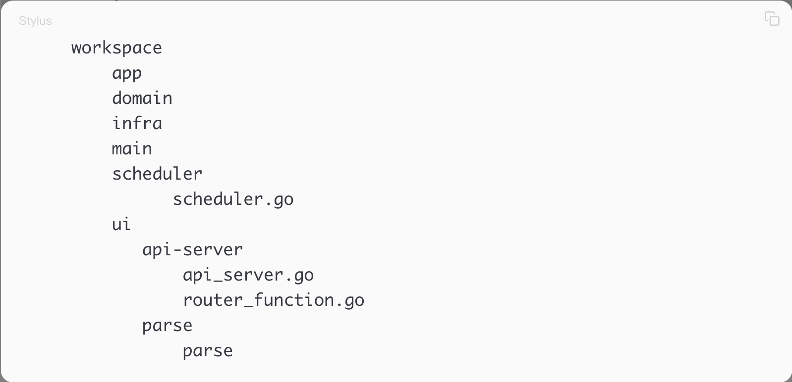

> <h2 id=''></h2>
- [**项目组织结构**](#项目组织结构)

 

***
   
- <h1 id="项目组织结构">项目组织结构</h1>
	- [领域驱动的方式](#领域驱动的方式)
	- [业务驱动的方式](#业务驱动的方式)

   
> <h2 id="领域驱动的方式">领域驱动的方式</h2>

领域驱动讲究的是将项目整体按照领域驱动的方式进行组织。

- **领域驱动设计主要包括以下4部分：**
	- 应用层(Application)。· 基础设施层(Infrastructure)。
	- 领域层(Domain)。
	- 用户界面层(UserInterface)。

 

- (1)应用层主要完成的任务是为程序提供任务处理，即调用抽象之后的应用。
- (2)基础设施层主要是与业务不相关的代码块的集合，比如字符串操作、数值运算、文件操作等。
- (3)领域层领域层是领域驱动设计的核心，首先需要根据项目抽象出领域内的相关概念，再在领域内相关概念的基础上完成资源的操作。
- (4)用户界面层负责向用户展现信息，并且会解析用户行为，即常说的展现层。以设计一个RESTful API风格的项目为例，领域驱动设计的项目组织的结构大概如下：

   
> <h2 id="业务驱动的方式">业务驱动的方式</h2>

在日常开发过程中，编写API的业务需求应该很多，特别是选择Web方面的工作。

下面这种风格的项目组织适合绝大多数Web层面的项目开发。

- cmd：命令行功能集合。
- configs：项目的配置文件集合。
- deployments：构建Docker镜像等文件集合。 
- docs：文档集合。
- initializers：初始化文件集合。
- logs：存储项目日志文件集合。
- pkg：项目辅助功能，比如中间件、插件等。
- scripts：脚本文件集合。
- src：项目的核心文件，核心的处理环节。
- tools：项目辅助工具。
- vendor：第三方库文件集合。
- main.go：项目函数入口。
- Makefile：项目构建命令集合。

