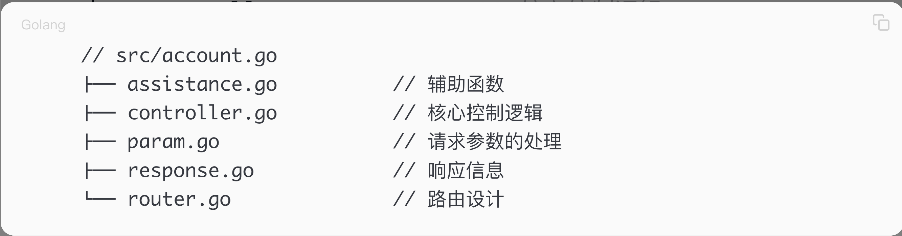

> <h2 id=''></h2>
- [**API测试工具**](#API测试工具)
	- [Curl进行API测试](#Curl进行API测试) 
	- [HTTPie进行API测试](#HTTPie进行API测试) 
	- [Postman进行API测试](#Postman进行API测试) 
	- [VSCode插件API测试](#VSCode插件API测试)
- [**项目组织结构**](#项目组织结构)
	- [领域驱动的方式](#领域驱动的方式)
	- [业务驱动的方式](#业务驱动的方式)
- [**Makefile构建项目**](#Makefile构建项目)
	- [makefile文件](#makefile文件)
		- [变量定义部分](#变量定义部分)
		- [链接参数（LDFLAGS）](#链接参数（LDFLAGS）) 
		- [构建目标](#构建目标) 
		- [运行](#运行)
- [**区分生产、开发、测试环境**](#区分生产、开发、测试环境)
	- [使用配置文件ymal](#使用配置文件ymal) 
	- [使用`.env`文件](#使用`.env`文件) 
	- [buildtags编译时区分环境](#buildtags编译时区分环境) 
	- [使用命令行参数](#使用命令行参数) 
	- [总结](#总结)
- [**容器化平台**](#容器化平台)
	- [Docker](#Docker)
		- [介绍](#介绍)
		- [Docker启动mysql](#Docker启动mysql)
- [**项目语法**](#项目语法)
	- [BeekQuickProject陌生语法](#BeekQuickProject陌生语法)
		- [参数验证](#参数验证)
		- [自定义结构体认证](#自定义结构体认证)
		- [记录请求日志](#记录请求日志)
		- [model使用XORM库序列化](model使用XORM库序列化)


<br/>

***
<br/><br/><br/>
> <h1 id="API测试工具">API测试工具</h1>

在 Go 语言开发过程中，使用 API 测试工具（如 Curl、HTTPie、Postman 和 VSCode 插件）可以帮助调试和验证 API 是否正常工作。

<br/>
- **3者总结对比**

| 工具 | 适用场景 |  优势  |  缺点 |
|------|---------|-------|-------|
| Curl | 命令行测试 API | 轻量级、通用 | 语法较复杂 |
| HTTPie | 命令行测试 API | 语法更简洁、可读性更好 | 需额外安装 |
| Postman | GUI 测试 API | 适合团队协作、支持环境变量、自动化 | 需要 GUI、较占资源 |
| VSCode REST Client | 代码编辑器内测试 API | 无需离开 VSCode，便于记录请求 | 需要插件，功能比 Postman 少 |

<br/>

- 如果你是**命令行爱好者**，推荐使用 `Curl` 或 `HTTPie`。  
- 如果你喜欢**可视化操作**，`Postman` 是最佳选择。  
- 如果你希望**在 VSCode 直接测试 API**，`REST Client` 插件是个不错的选择。

<br/><br/><br/>
> <h2 id="Curl进行API测试">Curl进行API测试</h2>

`Curl` 是一个命令行工具，可用于发送 HTTP 请求，适用于快速测试 API 请求和响应。

**示例 1：发送 GET 请求**

```sh
curl -X GET http://localhost:8080/api/users
```

<br/>

**示例 2：发送 POST 请求（JSON 数据）**

```sh
curl -X POST http://localhost:8080/api/users \
     -H "Content-Type: application/json" \
     -d '{"name": "Alice", "email": "alice@example.com"}'
```

<br/>

**示例 3：发送带 Token 的请求**

```sh
curl -X GET http://localhost:8080/api/protected \
     -H "Authorization: Bearer YOUR_ACCESS_TOKEN"
```

<br/><br/><br/>
> <h2 id="HTTPie进行API测试">HTTPie进行API测试</h2>

`HTTPie` 是 `Curl` 的替代品，语法更直观，适用于 API 调试。

- **安装 HTTPie**

```sh
pip install httpie  # 需要 Python
```

<br/>

**示例 1：发送 GET 请求**

```sh
http GET http://localhost:8080/api/users
```

<br/>

**示例 2：发送 POST 请求（JSON 数据）**

```sh
http POST http://localhost:8080/api/users name="Alice" email="alice@example.com"
```

<br/>

**示例 3：发送带 Token 的请求**

```sh
http GET http://localhost:8080/api/protected "Authorization: Bearer YOUR_ACCESS_TOKEN"
```

<br/><br/><br/>
> <h2 id="Postman进行API测试">Postman进行API测试</h2>

Postman 是一个图形化 API 测试工具，适用于复杂的 API 交互、自动化测试、Mock API 等。

- **使用步骤**
	1. **安装 Postman**：从 [Postman 官网](https://www.postman.com/) 下载并安装。
	2. **创建请求**：
	   - 选择 **GET、POST、PUT、DELETE** 等方法。
	   - 填写 **URL**（如 `http://localhost:8080/api/users`）。
	   - 添加 **Headers**（如 `Content-Type: application/json`）。
	   - 若为 `POST` 或 `PUT`，在 **Body** 选项卡填入 JSON 数据。
	3. **点击“Send”** 发送请求并查看响应。

<br/><br/><br/>
> <h2 id="VSCode插件API测试">VSCode插件API测试</h2>

VSCode 提供多种 API 测试插件，常用的是 `REST Client` 插件。

- **安装 REST Client 插件**
	- 打开 VSCode，按 `Cmd + Shift + X`（Mac）或 `Ctrl + Shift + X`（Windows）。
	- 搜索 `REST Client` 并安装。

<br/>

- **创建 API 请求**

在 `.http` 或 `.rest` 文件中写入请求，例如：

```http
### 发送 GET 请求
GET http://localhost:8080/api/users

### 发送 POST 请求
POST http://localhost:8080/api/users
Content-Type: application/json

{
    "name": "Alice",
    "email": "alice@example.com"
}
```

<br/>

- **执行请求**
	1. 在 VSCode 打开 `.http` 文件。
	2. 在请求上方会出现 `Send Request` 按钮，点击即可运行并查看响应。


<br/>

***
<br/><br/><br/>
- <h1 id="项目组织结构">项目组织结构</h1>

<br/><br/><br/>
> <h2 id="领域驱动的方式">领域驱动的方式</h2>

领域驱动讲究的是将项目整体按照领域驱动的方式进行组织。

- **领域驱动设计主要包括以下4部分：**
	- 应用层(Application)。
	- 基础设施层(Infrastructure)。
	- 领域层(Domain)。
	- 用户界面层(UserInterface)。

<br/>

- (1)应用层主要完成的任务是为程序提供任务处理，即调用抽象之后的应用。
- (2)基础设施层主要是与业务不相关的代码块的集合，比如字符串操作、数值运算、文件操作等。
- (3)领域层领域层是领域驱动设计的核心，首先需要根据项目抽象出领域内的相关概念，再在领域内相关概念的基础上完成资源的操作。
- (4)用户界面层负责向用户展现信息，并且会解析用户行为，即常说的展现层。以设计一个RESTful API风格的项目为例，领域驱动设计的项目组织的结构大概如下：


<br/><br/><br/>
> <h2 id="业务驱动的方式">业务驱动的方式</h2>

在日常开发过程中，编写API的业务需求应该很多，特别是选择Web方面的工作。Web框架一般采用标准的MVC架构，即Model（模型层）​、View（视图层）​、Controller（控制层）​。


<br/>




下面这种风格的项目组织适合绝大多数Web层面的项目开发。

- cmd：命令行功能集合(命令行工具，包括数据库中数据表的创建、迁移、数据导入等)。
- configs：项目的配置文件集合(项目的配置文件，包括数据库的配置文件等)。
- deployments：构建Docker镜像等文件集合(容器相关的文件)。 
- docs：文档集合。
- initializers：初始化文件集合。
- logs：存储项目日志文件集合。
- pkg：项目辅助功能，比如中间件、插件等(项目的使用库)。
- scripts：脚本文件集合。
- src：项目的核心文件，核心的处理环节(项目的核心逻辑)。
- tools：项目辅助工具。
- vendor：第三方库文件集合。
- main.go：项目函数入口(项目主入口)。
- Makefile：项目构建命令集合(项目构建，提供简易的命令（类UNIX操作系统的支持）​)。
- model：模型文件;
- account：产品实体的抽象;
- assistance.go：辅助函数;
- controller.go：控制器的核心处理;
- param.go：请求参数;
- router.go：路由;

<br/><br/>

<br/><br/><br/>
> <h2 id="模型设计">模型设计</h2>

模型设计的重点在于数据表的设计，数据表的设计包括两个方面：表名的设计、表中字段及字段类型的设计。模型是对实体的抽象，意味着设计数据表的结构首先需要明确实体是什么。如何知道这些实体？从设计图、需求文档中了解。

表名的设计要统一规范：**`数据库+实体的形式，比如beeQuick_account。`**


<br/>

***
<br/><br/><br/>
> <h1 id="Makefile构建项目">Makefile构建项目</h1>

<br/><br/><br/>
> <h2 id="">makefile文件</h2>

**Makefile文件**

```
BINARY=BeeQuick

VERSION=1.0.0

BUILD=`date +%FT%T%z`

LDFLAGS=-ldflags "-X main.Env=production -s -w"

DEV_LDFLAGS=-ldflags "-X main.Env=dev"

TEST_LDFLAGS=-ldflags "-X main.Env=test"

default:
	go build -o ${BINARY} -v ${DEV_LDFLAGS} -tags=jsoniter

production:
	go build -o ${BINARY} -v ${LDFLAGS} -tags=jsoniter

dev:
	go build -o ${BINARY} -v ${DEV_LDFLAGS} -tags=jsoniter

test:
	go build -o ${BINARY} -v ${TEST_LDFLAGS} -tags=jsoniter

run:
	go run -v ${DEV_LDFLAGS} -tags=jsoniter main.go

.PHONY: default production dev test run
```


这段 `Makefile` 用于编译和运行 Go 代码，并根据不同的环境（开发、测试、生产）使用不同的编译参数。下面是对代码的详细解析：

<br/><br/>
> <h2 id="变量定义部分">变量定义部分</h2>

指定编译后生成的二进制文件名称为 `BeeQuick`。

```makefile
BINARY=BeeQuick
```

<br/>

设定应用程序的版本号为 `1.0.0`。

```makefile
VERSION=1.0.0
```

<br/>

- 获取当前时间作为 `BUILD` 变量的值，格式为 `YYYY-MM-DDTHH:MM:SS+时区`（符合 ISO 8601 格式）。
- 但这里 `BUILD` 变量没有被使用。

```makefile
BUILD=`date +%FT%T%z`
```


<br/><br/>
> <h2 id="链接参数（LDFLAGS）">链接参数（LDFLAGS）</h2>

- `-ldflags` 传递链接参数：
  - `-X main.Env=production`：将 `main.Env` 变量的值设置为 `"production"`。
  - `-s -w`：
    - `-s`：去掉符号表，减少二进制文件体积。
    - `-w`：去掉调试信息，进一步压缩体积。

```makefile
LDFLAGS=-ldflags "-X main.Env=production -s -w"
```


<br/>

- `-X main.Env=dev`：在开发环境下，`main.Env` 变量的值为 `"dev"`。

```makefile
DEV_LDFLAGS=-ldflags "-X main.Env=dev"
```

<br/>

- `-X main.Env=test`：在测试环境下，`main.Env` 变量的值为 `"test"`。

```makefile
TEST_LDFLAGS=-ldflags "-X main.Env=test"
```

<br/><br/>
> <h2 id="构建目标">构建目标</h2>

1.**默认构建 (`default`)**

```makefile
default:
	go build -o ${BINARY} -v ${DEV_LDFLAGS} -tags=jsoniter
```

- `go build`：编译 Go 代码。
- `-o ${BINARY}`：输出二进制文件到 `BeeQuick`。
- `-v`：显示编译过程中导入的包。
- `${DEV_LDFLAGS}`：使用 `dev` 环境的 `ldflags`，即 `-X main.Env=dev`。
- `-tags=jsoniter`：使用 `jsoniter` 作为 JSON 解析库（需要在代码中 `// +build jsoniter` 或 `//go:build jsoniter`）。

<br/>

- 2.**生产环境构建 (`production`)**

```makefile
production:
	go build -o ${BINARY} -v ${LDFLAGS} -tags=jsoniter
```
- 和 `default` 类似，但使用 `LDFLAGS`（即 `main.Env=production`）。

<br/>

- 3.**开发环境构建 (`dev`)**

```makefile
dev:
	go build -o ${BINARY} -v ${DEV_LDFLAGS} -tags=jsoniter
```

- 与 `default` 目标一致，也是开发环境构建。

<br/>

- 4.**测试环境构建 (`test`)**

```makefile
test:
	go build -o ${BINARY} -v ${TEST_LDFLAGS} -tags=jsoniter
```
- 使用 `TEST_LDFLAGS`，即 `main.Env=test`。

<br/><br/>
> <h2 id="">运行</h2>

- **运行目标**

```makefile
run:
	go run -v ${DEV_LDFLAGS} -tags=jsoniter main.go
```
- `go run`：编译并运行 `main.go`。
- `-v`：显示编译过程。
- `${DEV_LDFLAGS}`：使用开发环境（`main.Env=dev`）。
- `-tags=jsoniter`：使用 `jsoniter` 作为 JSON 解析库。

<br/>

- **伪目标 (`.PHONY`)**

```makefile
.PHONY: default production dev test run
```

- `.PHONY` 声明这些目标是伪目标，即使目录中存在同名文件，也不会把它们当作文件来执行，而是始终执行 Makefile 中的规则。

<br/><br/>


### **总结**
1. **支持不同环境的编译**：
   - `production`：生产环境（优化二进制大小）。
   - `dev`：开发环境。
   - `test`：测试环境。

2. **支持 JSON 库切换**
   - 通过 `-tags=jsoniter` 让代码可以选择 `jsoniter` 作为 JSON 解析库。

3. **提供 `run` 直接运行 Go 代码**
   - `run` 目标适用于开发阶段，避免每次手动执行 `go build` + `./BeeQuick`。

---

这个 `Makefile` 让 Go 代码的构建和运行更加高效，方便在不同环境中快速切换。🚀


<br/>

***
<br/><br/><br/>
> <h1 id="区分生产、开发、测试环境">区分生产、开发、测试环境</h1>

在 Go 语言中，常见的做法是根据不同的 **环境（开发、测试、生产）** 连接不同的数据库。你可以使用 **配置文件、环境变量、命令行参数** 或 **Go 内置的 `build tags`** 方式来管理不同的数据库连接信息。


<br/><br/><br/>
> <h2 id="使用配置文件ymal">使用配置文件ymal</h2>
我在项目中遇到了config.ymal如下配置：

```
production:
   mysql:
     db: beequick_production
     user: root
     password: admin123
   postgres:
     db: beequick_production
     user: root
     password: admin123
dev:
   mysql:
     db: beequick_dev
     user: root
     password: admin123
   postgres:
     db: beequick_production
     user: root
     password: admin123
test:
   mysql:
     db: beequick_test
     user: root
     password: admin123
   postgres:
     db: beequick_production
     user: root
     password: admin123
```

<br/><br/>

**ymal适用于：** 项目中环境较多，方便管理。

- **1️⃣ 创建 `config.yaml`**

```yaml
database:
  development:
    driver: "mysql"
    dsn: "dev_user:dev_pass@tcp(localhost:3306)/dev_db?charset=utf8mb4&parseTime=True&loc=Local"

  testing:
    driver: "sqlite3"
    dsn: "file::memory:?cache=shared"

  production:
    driver: "mysql"
    dsn: "prod_user:prod_pass@tcp(192.168.1.1:3306)/prod_db?charset=utf8mb4&parseTime=True&loc=Local"
```

<br/>

- **2️⃣ 读取配置文件**

使用 `go-yaml` 解析配置：

```go
package main

import (
	"fmt"
	"log"
	"os"

	"gopkg.in/yaml.v3"
	"gorm.io/driver/mysql"
	"gorm.io/driver/sqlite"
	"gorm.io/gorm"
)

type Config struct {
	Database map[string]struct {
		Driver string `yaml:"driver"`
		DSN    string `yaml:"dsn"`
	} `yaml:"database"`
}

func loadConfig() (*Config, error) {
	file, err := os.ReadFile("config.yaml")
	if err != nil {
		return nil, err
	}
	var config Config
	err = yaml.Unmarshal(file, &config)
	return &config, err
}

func main() {
	config, err := loadConfig()
	if err != nil {
		log.Fatal("读取配置文件失败:", err)
	}

	env := os.Getenv("GO_ENV") // 读取环境变量
	if env == "" {
		env = "development" // 默认开发环境
	}

	dbConfig, exists := config.Database[env]
	if !exists {
		log.Fatal("未找到对应的数据库配置:", env)
	}

	var db *gorm.DB
	switch dbConfig.Driver {
	case "mysql":
		db, err = gorm.Open(mysql.Open(dbConfig.DSN), &gorm.Config{})
	case "sqlite3":
		db, err = gorm.Open(sqlite.Open(dbConfig.DSN), &gorm.Config{})
	default:
		log.Fatal("不支持的数据库驱动:", dbConfig.Driver)
	}

	if err != nil {
		log.Fatal("数据库连接失败:", err)
	}

	fmt.Println("数据库连接成功！")
}
```

<br/>

- **3️⃣ 运行**
- **开发环境**

```sh
GO_ENV=development go run main.go
```

<br/>
- **测试环境**

```sh
GO_ENV=testing go run main.go
```

<br/>

- **生产环境**

```sh
GO_ENV=production go run main.go
```

<br/><br/><br/>

> <h2 id="使用`.env`文件">使用 `.env` 文件</h2>

**适用于：** 需要简单地管理环境变量。

- **1️⃣ 创建 `.env`**

```
GO_ENV=development
DB_DRIVER=mysql
DB_DSN=dev_user:dev_pass@tcp(localhost:3306)/dev_db?charset=utf8mb4&parseTime=True&loc=Local
```

<br/>

- **2️⃣ 读取 `.env` 文件**

使用 `github.com/joho/godotenv`：

```go
package main

import (
	"fmt"
	"log"
	"os"

	"github.com/joho/godotenv"
	"gorm.io/driver/mysql"
	"gorm.io/gorm"
)

func main() {
	err := godotenv.Load()
	if err != nil {
		log.Fatal("加载 .env 文件失败")
	}

	dbDriver := os.Getenv("DB_DRIVER")
	dbDSN := os.Getenv("DB_DSN")

	var db *gorm.DB
	switch dbDriver {
	case "mysql":
		db, err = gorm.Open(mysql.Open(dbDSN), &gorm.Config{})
	default:
		log.Fatal("不支持的数据库驱动:", dbDriver)
	}

	if err != nil {
		log.Fatal("数据库连接失败:", err)
	}

	fmt.Println("数据库连接成功！")
}
```

<br/>

- **3️⃣ 运行**

```sh
GO_ENV=production go run main.go
```

<br/><br/><br/>
> <h2 id="buildtags编译时区分环境">build tags`（编译时区分环境）</h2>

**适用于：** 不想在运行时切换，而是在编译时决定。

- **1️⃣ 创建 `db_dev.go`**

```go
//go:build dev
package config

import (
	"fmt"
	"gorm.io/driver/mysql"
	"gorm.io/gorm"
)

func ConnectDB() (*gorm.DB, error) {
	dsn := "dev_user:dev_pass@tcp(localhost:3306)/dev_db?charset=utf8mb4&parseTime=True&loc=Local"
	db, err := gorm.Open(mysql.Open(dsn), &gorm.Config{})
	if err != nil {
		return nil, err
	}
	fmt.Println("连接开发环境数据库")
	return db, nil
}
```

<br/>

- **2️⃣ 创建 `db_prod.go`**

```go
//go:build prod
package config

import (
	"fmt"
	"gorm.io/driver/mysql"
	"gorm.io/gorm"
)

func ConnectDB() (*gorm.DB, error) {
	dsn := "prod_user:prod_pass@tcp(192.168.1.1:3306)/prod_db?charset=utf8mb4&parseTime=True&loc=Local"
	db, err := gorm.Open(mysql.Open(dsn), &gorm.Config{})
	if err != nil {
		return nil, err
	}
	fmt.Println("连接生产环境数据库")
	return db, nil
}
```

<br/>

- **3️⃣ 运行**

- **开发环境**

```sh
go run -tags=dev main.go
```

<br/>

- **生产环境**

```sh
go run -tags=prod main.go
```

<br/><br/><br/>
> <h2 id="使用命令行参数">使用命令行参数</h2>

**适用于：** 需要在运行时手动指定环境。

```go
package main

import (
	"flag"
	"fmt"
	"log"

	"gorm.io/driver/mysql"
	"gorm.io/gorm"
)

var env string

func init() {
	flag.StringVar(&env, "env", "development", "选择运行环境")
}

func main() {
	flag.Parse() // 解析命令行参数

	var dsn string
	switch env {
	case "development":
		dsn = "dev_user:dev_pass@tcp(localhost:3306)/dev_db?charset=utf8mb4&parseTime=True&loc=Local"
	case "production":
		dsn = "prod_user:prod_pass@tcp(192.168.1.1:3306)/prod_db?charset=utf8mb4&parseTime=True&loc=Local"
	default:
		log.Fatal("未知环境:", env)
	}

	db, err := gorm.Open(mysql.Open(dsn), &gorm.Config{})
	if err != nil {
		log.Fatal("数据库连接失败:", err)
	}

	fmt.Println("连接成功，环境:", env)
}
```

<br/>

- **运行**

- **开发环境**

```sh
go run main.go -env=development
```

<br/>

**生产环境**

```sh
go run main.go -env=production
```


<br/><br/>> <h2 id="总结">总结</h2>

| 方式 | 适用场景 | 优点 | 缺点 |
|------|--------|------|------|
| **配置文件（YAML）** | 复杂项目、团队开发 | 易维护、可扩展 | 需要解析 YAML |
| **`.env` 文件** | 轻量级环境管理 | 适合小项目 | 可能暴露环境变量 |
| **`build tags`** | 编译时确定环境 | 运行时无额外消耗 | 需要编译不同版本 |
| **命令行参数** | 需要灵活选择环境 | 方便调试 | 需要手动输入参数 |

如果是 **中大型项目**，推荐 **配置文件（YAML）+ 环境变量** 方式，灵活且易于维护。🚀


<br/>

***
<br/><br/><br/>
> <h1 id="容器化平台">容器化平台</h1>

<br/><br/><br/>
> <h2 id="Docker">Docker</h2>

<br/><br/>
> <h2 id="介绍">介绍</h2>

Docker 是一个**容器化**平台，主要用于**构建、打包、分发和运行**应用程序。它的核心作用是让应用程序及其依赖项一起封装在一个**轻量级、可移植的容器**中，从而确保应用能够在不同的环境（如开发、测试、生产）中一致运行。

<br/>

- **Docker 的主要用途**

<br/>

- **1.环境一致性**  
	- 解决“**在我电脑上可以跑**，但在服务器上有问题”的问题。  
	- 通过容器让应用及其依赖环境始终一致。

<br/>

- **2.快速部署与扩展**  
	- 轻量级容器启动速度快，适合微服务架构。  
	- 可在本地开发，直接打包部署到云端或服务器。

<br/>

- **3.依赖管理**  
	- 解决不同项目需要不同依赖的问题，比如 Python2 和 Python3 共存。  
	- 容器内的环境彼此隔离，不会互相影响。

<br/>

-  **4.跨平台运行**  
	- 容器能在**Windows、macOS、Linux**上运行，解决不同平台的兼容性问题。  
	- 只需安装 Docker，就能运行相同的容器，无需额外配置环境。

<br/>

-  **5.版本管理**  
	- 通过 Docker **镜像**（Image）管理应用的不同版本，可以回滚、更新。  
	- 类似于 Git，Docker Hub 也可以存储和分发镜像。

<br/>

-  **6.微服务架构**  
	- 适合拆分大型应用，每个服务在独立容器中运行，互不影响。  
	- 通过 `docker-compose` 方便管理多个容器。

<br/><br/>
- **核心概念**

<br/>

- **镜像（Image）**：  
	- 类似于“模板”，包含应用及其环境的所有内容。  
	- 例如：`nginx:latest` 是官方提供的 Nginx 服务器镜像。

<br/>

- **容器（Container）**：  
	- 由镜像运行而来的实例，是真正运行的应用。  
	- 例如：用 `docker run -d nginx` 启动一个 Nginx 容器。

<br/>

- **Docker Hub**：  
	- 官方提供的镜像仓库，可以下载和上传镜像。

<br/>

- **Docker Compose**：  
	- 用 `docker-compose.yml` 定义多个容器的运行方式，一键启动整个应用。

<br/><br/>

- **简单示例**

运行一个 Nginx 服务器：

```bash
docker run -d -p 8080:80 nginx
```
访问 `http://localhost:8080` 就能看到 Nginx 页面。

<br/><br/>
> <h2 id="Docker启动mysql">Docker启动mysql</h2>

使用 **Docker Compose** 来编排启动 **MySQL**，可以创建一个 `docker-compose.yml` 文件，定义 MySQL 容器及相关参数。

<br/>

- **1. 创建 `docker-compose.yml` 文件**

在你的项目目录下，创建一个 `docker-compose.yml` 文件，并写入以下内容：

```yaml
version: '3.8'

services:
  mysql:
    image: mysql:8.0  # 指定 MySQL 版本
    container_name: my_mysql  # 容器名称
    restart: always  # 自动重启
    environment:
      MYSQL_ROOT_PASSWORD: root123  # 设置 root 用户密码
      MYSQL_DATABASE: test_db  # 创建的默认数据库
      MYSQL_USER: test_user  # 创建的默认用户
      MYSQL_PASSWORD: test_pass  # 用户的密码
    ports:
      - "3306:3306"  # 映射端口，宿主机的 3306 端口 -> 容器的 3306 端口
    volumes:
      - mysql_data:/var/lib/mysql  # 数据持久化
    networks:
      - my_network  # 连接到自定义网络

volumes:
  mysql_data:

networks:
  my_network:
```

<br/>

- **2. 启动 MySQL 容器**

在 `docker-compose.yml` 文件所在的目录运行：

```sh
docker-compose up -d
```
`-d` 选项让 MySQL 在后台运行。

<br/>

- **3. 检查 MySQL 容器状态**

```sh
docker ps
```

如果看到 `my_mysql` 容器在运行，说明 MySQL 启动成功。

<br/>

- **4. 连接到 MySQL**

**方法 1：使用 `mysql` 命令行客户端**

```sh
mysql -h 127.0.0.1 -P 3306 -u test_user -p
```

输入 `test_pass` 进行登录。

<br/>

**方法 2：进入 MySQL 容器内部**

```sh
docker exec -it my_mysql mysql -u root -p
```
输入 `root123` 进行登录。

<br/>

- **5. 停止 MySQL 容器**

```sh
docker-compose down
```

如果想保留数据，加 `-v` 选项会清除数据卷：

```sh
docker-compose down -v
```

<br/>

- **6. 修改配置（可选）**

如果需要修改 MySQL 的配置，可以创建一个 `my.cnf` 文件：

```ini
[mysqld]
max_connections = 500
sql_mode = "STRICT_TRANS_TABLES,NO_ENGINE_SUBSTITUTION"
```
然后在 `docker-compose.yml` 中挂载：

```yaml
    volumes:
      - mysql_data:/var/lib/mysql
      - ./my.cnf:/etc/mysql/conf.d/my.cnf  # 挂载自定义配置
```

**重启 MySQL 容器后生效**：

```sh
docker-compose restart
```

<br/>

- **总结**
	- 通过 `docker-compose.yml` 一键启动 MySQL。
	- 数据持久化，重启不会丢失。
	- 端口映射，可用 `mysql` 连接管理数据库。
	- 也可以自定义 MySQL 配置，提高性能。

🚀 这样，你的 **MySQL 容器** 就可以运行在 Docker 环境中了！


<br/>

***
<br/><br/><br/>
> <h1 id="项目语法">项目语法</h1>

<br/><br/><br/>
> <h1 id="BeekQuickProject陌生语法">BeekQuickProject陌生语法</h1>


<br/><br/><br/>
> <h2 id="参数验证">参数验证</h2>
    
```
param.Valid().Struct(param) 详解
```

**解析如下：**

这段代码通常出现在 Go 语言的 **参数验证** 场景中，可能涉及 `github.com/go-playground/validator/v10` 这个流行的 Go 结构体验证库。

<br/>

- **1️⃣ `param.Valid()`**
	- `Valid()` 可能是 `param` 结构体的一个方法，返回一个 **验证器实例**。
	- 具体的 `Valid()` 实现取决于 `param` 的类型。
	- **常见情况**：如果 `param` 是自定义的结构体，那么 `Valid()` 可能是它的方法，返回一个 **validator 实例**，例如：

```go
func (p *Param) Valid() *validator.Validate {
  return validator.New()  // 创建新的验证器
}
```

这样，在 `param.Valid()` 之后，就得到了一个`validator.Validate` 对象。

<br/>

- **2️⃣ `.Struct(param)`**
	- `Struct(param)` 是 `go-playground/validator` 提供的方法，用于 **验证结构体参数** 是否符合定义的标签（tags）。
	- 它的作用是检查 `param` 这个结构体的字段，确保符合定义的规则。

- **示例**：

```go
type User struct {
  Name  string `validate:"required"`   // Name 字段不能为空
  Age   int    `validate:"gte=18"`     // Age 必须 >= 18
  Email string `validate:"required,email"`  // 必须是合法的 email
}

func main() {
  validate := validator.New()
  user := User{Name: "Tom", Age: 17, Email: "invalid-email"}

  err := validate.Struct(user)
  if err != nil {
      fmt.Println("Validation failed:", err)
  }
}
```

- `validate.Struct(user)` 会检查 `user` 结构体：
	- `Name` 不能为空（✅ 符合）
	- `Age` 必须 ≥18（❌ 不符合）
	- `Email` 必须是合法的 email（❌ 不符合）

<br/>

- 所以这段代码会输出：

```
Validation failed: Key: 'User.Age' Error:Field validation for 'Age' failed on the 'gte' tag
Key: 'User.Email' Error:Field validation for 'Email' failed on the 'email' tag
```

<br/>

- **综合示例**

结合 `param.Valid().Struct(param)` 可能的用法，我们假设 `Valid()` 是 `Param` 结构体的一个方法：

```go
package main

import (
    "fmt"
    "github.com/go-playground/validator/v10"
)

// 定义结构体
type Param struct {
    Name  string `validate:"required"`
    Age   int    `validate:"gte=18"`
}

// 在 Param 结构体中实现 Valid 方法
func (p *Param) Valid() *validator.Validate {
    return validator.New()
}

func main() {
    param := Param{Name: "", Age: 16} // Name 为空，Age 小于 18
    validate := param.Valid()

    err := validate.Struct(param)
    if err != nil {
        fmt.Println("参数验证失败:", err)
    }
}
```
- **`param.Valid()`** 返回 `validator.New()`
- **`validate.Struct(param)`** 执行结构体字段验证
- **输出结果**：

```
参数验证失败: Key: 'Param.Name' Error:Field validation for 'Name' failed on the 'required' tag
Key: 'Param.Age' Error:Field validation for 'Age' failed on the 'gte' tag
```

<br/>

- **总结`param.Valid().Struct(param)` 的作用：**
	1. **`Valid()` 返回一个 `validator` 实例**。
	2. **`Struct(param)` 执行结构体字段校验**，检查是否符合 `validate` 标签规则。
	3. **适用于 API 参数验证、表单校验等**，防止非法输入。

<br/>

- **可能的变体**

如果 `Valid()` 不是返回 `validator.New()`，而是封装了通用验证逻辑，比如：

```go
func (p *Param) Valid() error {
    return validator.New().Struct(p)
}
```
那么代码就可以简化为：

```go
if err := param.Valid(); err != nil {
    fmt.Println("参数验证失败:", err)
}
```
这样更加简洁，避免每次都调用 `.Struct(param)`。

<br/><br/><br/>
> <h2 id="自定义结构体认证">自定义结构体验证</h2>

**`validate.RegisterStructValidation(registerValidation, RegisterParam{})` 详解**

这行代码通常用于**自定义结构体验证代码拆解**

```go
validate.RegisterStructValidation(registerValidation, RegisterParam{})
```

<br/>

- **1️⃣ `validate.RegisterStructValidation(fn, structType{})`**
	- 作用：**注册** 自定义结构体验证函数 `fn`，用于检查 `structType{}` 结构体的额外规则。
	- `fn` 必须是一个 **符合特定签名** 的函数，例如：

```go
func(registerValidationStruct validator.StructLevel)
```

- **`structType{}`** 是要验证的结构体的示例，表明 `fn` 适用于这种类型的结构体。

<br/>

- **2️⃣ `registerValidation`（自定义验证函数）**

在 `registerValidation` 里，我们可以定义 **额外的结构体级别验证逻辑**，超出普通 `validate` 标签的范围。

**示例**

```go
package main

import (
    "fmt"
    "github.com/go-playground/validator/v10"
)

// 定义要验证的结构体
type RegisterParam struct {
    Password        string `validate:"required"`
    ConfirmPassword string `validate:"required"`
}

// 自定义结构体验证：检查密码和确认密码是否一致
func registerValidation(sl validator.StructLevel) {
    param := sl.Current().Interface().(RegisterParam) // 获取当前结构体实例

    if param.Password != param.ConfirmPassword {
        sl.ReportError(param.ConfirmPassword, "ConfirmPassword", "ConfirmPassword", "match", "Password")
    }
}

func main() {
    validate := validator.New()
    
    // 注册结构体级别的验证
    validate.RegisterStructValidation(registerValidation, RegisterParam{})

    // 测试数据
    param := RegisterParam{
        Password:        "123456",
        ConfirmPassword: "654321", // 不匹配
    }

    err := validate.Struct(param)
    if err != nil {
        fmt.Println("验证失败:", err)
    } else {
        fmt.Println("验证通过")
    }
}
```

 **运行结果**

```
验证失败: Key: 'RegisterParam.ConfirmPassword' Error:Field validation for 'ConfirmPassword' failed on the 'match' tag
```

> **解释**：
> - `registerValidation` 先获取 `RegisterParam` 结构体实例。
> - 检查 `Password` 和 `ConfirmPassword` 是否相等。
> - 如果不匹配，调用 `sl.ReportError()` 报告错误，最终 `validate.Struct(param)` 失败。

<br/>

- **📌 `validate.RegisterStructValidation(fn, structType{})` 适用场景**
	1. **无法使用 `validate` 标签表达的复杂验证**
	   - 例如：**密码匹配**、**日期前后关系检查**、**多字段依赖** 等。
	   
	2. **需要访问整个结构体数据进行逻辑判断**
   - 比如 **`startDate` 必须早于 `endDate`**：
 
 ```go
 type Event struct {
     StartDate time.Time `validate:"required"`
     EndDate   time.Time `validate:"required"`
 }

 func eventValidation(sl validator.StructLevel) {
     event := sl.Current().Interface().(Event)
     if event.StartDate.After(event.EndDate) {
         sl.ReportError(event.EndDate, "EndDate", "EndDate", "after", "StartDate")
     }
 }
 ```

<br/>

3. **跨字段比较**
   - 例如，**某个字段不能和另一个字段相等**：
 
 ```go
 type User struct {
     Username string `validate:"required"`
     Email    string `validate:"required,email"`
 }

 func userValidation(sl validator.StructLevel) {
     user := sl.Current().Interface().(User)
     if user.Username == user.Email {
         sl.ReportError(user.Email, "Email", "Email", "notEqual", "Username")
     }
 }
 ```

<br/>

- **总结**
	- `validate.RegisterStructValidation(fn, structType{})` **注册结构体级别验证**，用于 **复杂逻辑**（跨字段检查）。
	- `fn` 必须是 `func(sl validator.StructLevel)`，可以用 `sl.ReportError()` 标记错误。
	- 适用于 **密码匹配、时间范围、依赖字段验证等** 高级场景。

🚀 **这样可以增强 `go-playground/validator` 的能力，使参数验证更灵活、更强大！**

<br/><br/><br/>
> <h2 id="记录请求日志"> 📌记录请求日志</h2>

```
func LoggerForProject(c iris.Context) {
	c.Application().Logger().Debugf("Path: %s | IP: %s | Time: %s",
		c.Path(), c.RemoteAddr(), time.Now().Format("2006-01-02 15:04:05"))
	c.Next()
}
```

- **`LoggerForProject(c iris.Context)` 详解**
这个函数是一个 **Iris 中间件（Middleware）**，用于 **记录请求日志**，包括：
	- **请求路径（Path）**
	- **客户端 IP 地址（IP）**
	- **当前时间（Time）**

<br/>

- **🔹 1️⃣ `c.Application().Logger().Debugf(...)`**
> **获取 Iris Logger 并打印日志**

- `c.Application()`  
  获取当前 **Iris 应用实例**（`*iris.Application`）。

- `.Logger()`  
  获取 **日志管理器**（Iris 内置 `Logger`）。

- `.Debugf(format, args...)`  
  **格式化** 并 **以 Debug 级别输出** 日志，日志格式：

```
Path: /ping | IP: 192.168.1.1 | Time: 2025-02-02 12:34:56
```

- **📌 具体参数**
	- `c.Path()`  
	  **获取请求路径**，例如：`/ping`
	- `c.RemoteAddr()`  
	  **获取客户端 IP 地址**，例如：`192.168.1.1`
	- `time.Now().Format("2006-01-02 15:04:05")`  
	  **获取当前时间**，格式化为 `YYYY-MM-DD HH:MM:SS`

<br/>

- **🔹 2️⃣ `c.Next()`**
> **继续执行下一个中间件或最终的处理函数**

	- 在 Iris **中间件执行链** 中，`c.Next()` 允许 **下一个中间件或业务逻辑继续执行**。
	- 如果不调用 `c.Next()`，请求可能会被拦截，不会进入 **后续的路由处理逻辑**。

<br/>

- **📌 使用示例**

**🔹 1️⃣ 在 Iris 服务器中使用 `LoggerForProject`**

```go
package main

import (
	"time"
	"github.com/kataras/iris/v12"
)

func LoggerForProject(c iris.Context) {
	c.Application().Logger().Debugf("Path: %s | IP: %s | Time: %s",
		c.Path(), c.RemoteAddr(), time.Now().Format("2006-01-02 15:04:05"))
	c.Next() // 继续执行下一个处理器
}

func main() {
	app := iris.New()

	// 绑定全局日志中间件
	app.Use(LoggerForProject)

	app.Get("/ping", func(ctx iris.Context) {
		ctx.JSON(iris.Map{"message": "pong"})
	})

	app.Listen(":8080")
}
```

<br/>

- **📌 运行效果**

**启动服务器**

```shell
[DBUG] 2025/02/02 12:34 Log level set to "debug"
```

<br/>

- **客户端请求**

```shell
curl http://localhost:8080/ping
```

<br/>

- **终端日志输出**

```shell
[DBUG] 2025/02/02 12:34 Path: /ping | IP: 127.0.0.1 | Time: 2025-02-02 12:34:56
```

<br/>

- **📌 适用场景**
	1. **记录 API 访问日志**  
	   - 记录 **访问路径、IP、时间**，方便排查问题。
	   
	2. **请求监控 & 调试**  
	   - 在 Debug 模式下，检查 **哪些 API 被调用**，是否有异常访问。
	
	3. **可以扩展功能**（添加到数据库 / 记录到日志文件）  

```go
func LoggerForProject(c iris.Context) {
logEntry := fmt.Sprintf("Path: %s | IP: %s | Time: %s",
   c.Path(), c.RemoteAddr(), time.Now().Format("2006-01-02 15:04:05"))

// 写入文件
_ = os.WriteFile("request.log", []byte(logEntry+"\n"), 0644)

c.Next()
}
```

<br/>

## **📌 总结**
- `LoggerForProject` 是 **Iris 中间件**，用于 **日志记录**。
- 记录 **请求路径、IP、时间**，并使用 **Debug 级别日志输出**。
- `c.Next()` **确保下一个处理器可以继续执行**，否则可能会中断请求。
- **适用于 API 日志记录、调试 & 请求监控**，也可以扩展到日志文件或数据库。

🚀 **这样可以帮助你跟踪 API 访问情况，提高调试和监控能力！**


<br/><br/><br/>
> <h2 id="model使用XORM库序列化">[model使用XORM库序列化](./GoLang常用框架.md#model序列化和继承)</h2>


