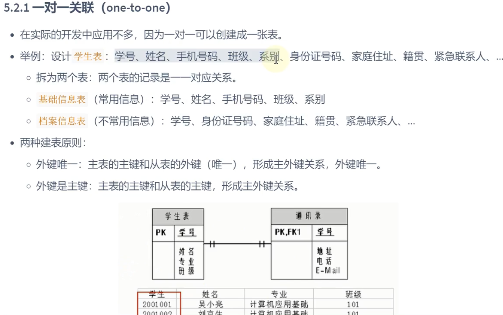
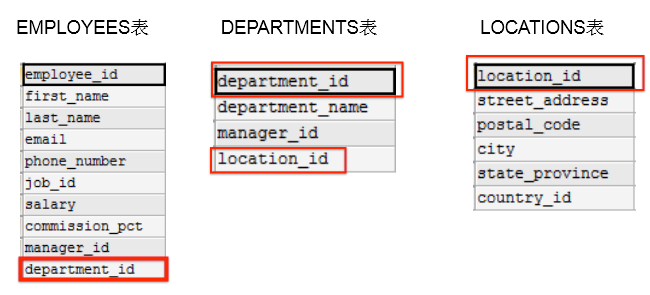
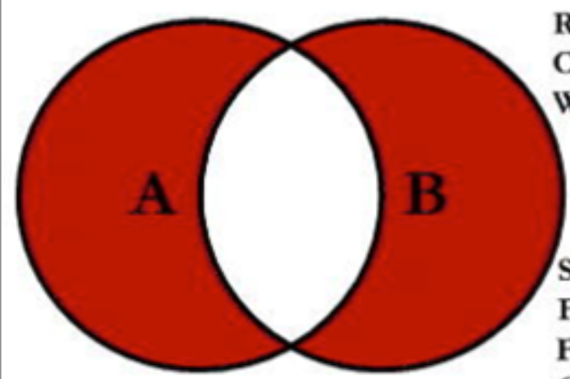

> <h1 id=""></h1>
- [**目录结构**](#目录结构)
- [**特殊的NULL运算**](#特殊的NULL运算)
- [**创建employees表**](#创建employees表)
- [**employees表批量插入数据**](#employees表批量插入数据)
- [**查employees表**](#查employees表)
- [**运算符**](#运算符)
	- [<=>安全等于](#安全等于)
	- [IN和WHERE使用](#IN和WHERE使用)
	- [XOR异或](#XOR异或)
- [**employees表排序和分页**](#employees表排序和分页)
	- [employees二级排序](#employees二级排序)
	- [分页limit](#分页limit)
- [**多表查询**](#多表查询)
	- [多表条件查询](#多表条件查询) 
	- [自连接](#自连接) 
	- [内连接vs外连接](#内连接vs外连接) 
	- [UNION的使用](#UNION的使用)
	- [SQL99语法新特性](#SQL99语法新特性)
		- [自然连接](#自然连接)
		- [USING连接](#USING连接)
	- [连接inner join综合](#连接innerjoin综合)
		- [建表、插入表](#建表、插入表)
		- [数据类型约束讲解](#数据类型约束讲解)
- [**mysql管理 ‌**](#mysql管理)
	- [基本命令行](#基本命令行)
	- [终端单行修改sql语句](#终端单行修改sql语句)
	- [终端多行修改sql语句](#终端多行修改sql语句)
- [**基本信息**](#基本信息)
	- [查看创建表信息](#查看创建表信息)
	- [查看表编码](#查看表编码)
- [**关系模型**](#关系模型)
	- [主键](#主键)
	- [外键](./数据库SQL(III).md#外键约束foreignkey)
	- [索引](./数据库SQL(VI).md#索引的创建与设计)
- [**数据库**](#数据库) 
	- [数据类型](#数据类型)
		- [整数类型适用场景](#整数类型适用场景) 
		- [浮点数和定点数](#浮点数和定点数) 
		- [时间中的DATETIME和TIMESTAMP](#时间中的DATETIME和TIMESTAMP) 
		- [CHAR和VACHAR使用场景](#CHAR和VACHAR使用场景)
		- [TEXT使用场景](#TEXT使用场景)
		- [ENUM类型](#ENUM类型)
		- [类型使用小建议](#类型使用小建议)
	- [常用数据类型介绍](#常用数据类型介绍)
	- [创建数据库](#创建数据库) 
	- [使用数据库](#使用数据库) 
	- [修改数据库](#修改数据库)
- [创建表](#创建表)
- [拷贝表](#拷贝表)
- [修改表](#修改表)
	- [追加一个列](#追加一个列) 
	- [修改一个列](#修改一个列) 
	- [重命名一个列](#重命名一个列) 
	- [删除一个列](#删除一个列)
- [重命名表](#重命名表)
- [删除表](#删除表)
- [清空表](#清空表)
	- [TRUNCATE TABLE和DELETE FROM比较](#TRUNCATE_TABLE和DELETE_FROM比较)
- [内容拓展](#内容拓展)
- [**插入数据**](#插入数据)
	- [为表的指定字段插入数据](#为表的指定字段插入数据) 
	- [同时插入多条记录](#同时插入多条记录) 
	- [将查询结果插入到表中](#将查询结果插入到表中)
- [**更新数据**](#更新数据)
- [**删除数据**](#删除数据)
- [MySQL8新特性：计算列](#MySQL8新特性：计算列)
- **资料**
	- 关于分表分库、主从复制可以看下Mycat的SQL中间件
	- [学习数据库](https://github.com/lliuql/learn_db/blob/master/mysql/learn_mysql/01_mysql架构/mysql架构.md)
	- [《面试笔记》——MySQL终结篇（30问与答）-- 已上线阿里](https://mp.weixin.qq.com/s?__biz=MzkxMjE5NzUxNQ==&mid=2247483876&idx=1&sn=3ba83e9184f850c49a0b98e6e49513b3&chksm=c111d300f6665a16af6199d869d715186e969df0a9c207b0c216b91ed299f5f006cdea188a4b&token=1231184118&lang=zh_CN#rd)
	- [廖雪峰SQL教程-(可以执行sql语句查看结果)](https://liaoxuefeng.com/books/sql/relational/foreign-key/index.html)
	- [SQL-菜鸟教程](https://www.runoob.com/sql/sql-tutorial.html)


<br/><br/><br/>

***
<br/>

> <h1 id="目录结构">目录结构</h1>

| MySQL目录结构 | 说明 |
|:--|:--|
| bin目录 | 所有MySQL可执行文件,如:mysql |
| MySQLInstanceConfig | 数据库的配置向导,在安装时出现的内容 |
| data目录 | 系统数据库所在目录 |
| my.ini配置文件| MySQL主要配置文件 |
| /MySQL/MySQL Server8.0/data | 用户创建数据库所在目录 |

<br/>

DB: database,看作是数据库文件.(类似于:.doc、.txt、.mp3...)
DBMS: 数据库管理系统.(类似于word工具, wps工具等)

<br/>

**非关系型数据库:**

| 类型 | 代表数据库 |
|:--|:--|
| 键值型数据 | Redis |
| 文档型数据库 | MongoDB | 
| 搜索引擎数据库 | ES、Solr | 
| 列式数据库 | HBase | 
| 图形数据库 | InfoGrid(用于聊天) | 
|  |  | 

<br/>

- DDL数据定义语言: CREATE、ALTER 、DROP 、 RENAME、TRUNCATE
- DML数据操作语言: INSERT、DELETE 、UPDATE 、SELETE
- DCL数据控制语言: COMMIT 、ROLLBACK、SAVEPOINT、GRANT、REVOKE


<br/><br/><br/>

***
<br/>

> <h1 id="特殊的NULL运算">特殊的NULL运算</h1>

空值参与运算
空值:null
null不等同于0, '', "null"?

空值参与运算:结果一定为空.


<br/><br/><br/>

***
<br/>

> <h1 id="创建employees表">创建employees表</h1>

**创建employees员工表:**

```sql
CREATE TABLE `employees` (
  `employee_id` INT NOT NULL DEFAULT 0,
  `first_name` VARCHAR(20),
  `last_name` VARCHAR(25) NOT NULL,
  `email` VARCHAR(25) NOT NULL,
  `phone_number` VARCHAR(20),
  `hire_date` DATE NOT NULL,
  `job_id` VARCHAR(10) NOT NULL,
  `salary` DECIMAL(8,2) DEFAULT NULL,
  `commission_pct` DECIMAL(5,2),
  `manager_id` INT,
  `department_id` INT,
  PRIMARY KEY (`employee_id`),
  UNIQUE KEY `idx_email` (`email`),
  KEY `idx_manager_id` (`manager_id`),
  KEY `idx_department_id` (`department_id`),
  KEY `idx_job_id` (`job_id`)
);
```

- 添加 PRIMARY KEY (employee_id)
- manager_id、department_id、job_id 添加 MUL（普通索引）
- ✅ email 设为 唯一索引（UNI）
- ✅ 所有字段（除 employee_id、last_name、email、phone_number、hire_date等）默认 NULL
- ✅ DEFAULT NULL 显式声明（尽管大多数情况下 NULL 默认行为不变）

<br/>

**展示employees表结构**

显示表中字段的详细信息

```
mysql> desc employees;
+----------------+--------------+------+-----+---------+-------+
| Field          | Type         | Null | Key | Default | Extra |
+----------------+--------------+------+-----+---------+-------+
| employee_id    | int          | NO   | PRI | 0       |       |
| first_name     | varchar(20)  | YES  |     | NULL    |       |
| last_name      | varchar(25)  | NO   |     | NULL    |       |
| email          | varchar(25)  | NO   | UNI | NULL    |       |
| phone_number   | varchar(20)  | YES  |     | NULL    |       |
| hire_date      | date         | NO   |     | NULL    |       |
| job_id         | varchar(10)  | NO   | MUL | NULL    |       |
| salary         | decimal(8,2) | YES  |     | NULL    |       |
| commission_pct | decimal(5,2) | YES  |     | NULL    |       |
| manager_id     | int          | YES  | MUL | NULL    |       |
| department_id  | int          | YES  | MUL | NULL    |       |
+----------------+--------------+------+-----+---------+-------+
```


<br/><br/><br/>
> <h2 id="employees表批量插入数据">employees表批量插入数据</h2>

```sql
INSERT INTO employees (employee_id, first_name, last_name, email, phone_number, hire_date, job_id, salary, commission_pct, manager_id, department_id) VALUES
(1, 'Deborah Mendoza', 'Deborah Mendoza', 'mendodebo618@outlook.com', '80-6927-0560', '2020-08-20', 'C916Zxmp1T', 554.71, 870.82, 548, 433),
(2, '蒋子异', 'Jiang Ziyi', 'ziyijiang@outlook.com', '213-841-2863', '2018-12-02', 'xJJxHzV7ps', 75.50, 49.07, 357, 78),
(3, '樊玲玲', 'Fan Ling Ling', 'llf@gmail.com', '718-713-7276', '2009-07-01', 'Q7vmbrrubi', 266.16, 781.87, 707, 283),
(4, '杜頴璇', '杜頴璇', 'to1116@hotmail.com', '10-6298-1704', '2009-09-11', 'mcGy2zyS8V', 144.88, 234.24, 293, 870),
(5, 'Yip Wai Man', '葉慧敏', 'yip3@hotmail.com', '760-567-4104', '2001-10-01', 'XuaHjJzfCs', 547.61, 141.33, 563, 227),
(6, 'Nakagawa Nanami', '中川七海', 'nanami1@gmail.com', '212-749-3438', '2007-03-14', 'pCWr6ZCmBT', 327.37, 539.46, 12, 482);

```


<br/><br/><br/>

***
<br/>

> <h1 id="查employees表">查employees表</h1>

**查看数据:**

```sql
 select * from employees;
+-------------+----------------------+----------------------+---------------------------+----------------+------------+------------+--------+----------------+------------+---------------+
| employee_id | first_name           | last_name            | email                     | phone_number   | hire_date  | job_id     | salary | commission_pct | manager_id | department_id |
+-------------+----------------------+----------------------+---------------------------+----------------+------------+------------+--------+----------------+------------+---------------+
|           1 | Deborah Mendoza      | Deborah Mendoza      | mendodebo618@outlook.com  | 80-6927-0560   | 2020-08-20 | C916Zxmp1T | 554.71 |         870.82 |        548 |           433 |
|           2 | 蒋子异               | Jiang Ziyi           | ziyijiang@outlook.com     | 213-841-2863   | 2018-12-02 | xJJxHzV7ps |  75.50 |          49.07 |        357 |            78 |
|           3 | 樊玲玲               | Fan Ling Ling        | llf@gmail.com             | 718-713-7276   | 2009-07-01 | Q7vmbrrubi | 266.16 |         781.87 |        707 |           283 |
|           4 | 杜頴璇               | 杜頴璇               | to1116@hotmail.com        | 10-6298-1704   | 2009-09-11 | mcGy2zyS8V | 144.88 |         234.24 |        293 |           870 |
|           5 | Yip Wai Man          | 葉慧敏               | yip3@hotmail.com          | 760-567-4104   | 2001-10-01 | XuaHjJzfCs | 547.61 |         141.33 |        563 |           227 |
|           6 | Nakagawa Nanami      | 中川七海             | nanami1@gmail.com         | 212-749-3438   | 2007-03-14 | pCWr6ZCmBT | 327.37 |         539.46 |         12 |           482 |
|           7 | 吴岚                 | Wu Lan               | lanwu7@outlook.com        | 80-1327-7272   | 2016-06-09 | Ovr0Lq5z2e | 485.87 |          89.86 |        837 |           598 |
|           8 | Fang Zhennan         | 方震南               | fang1130@outlook.com      | 7607 612395    | 2014-10-10 | pgVk4erTsh | 898.13 |         596.49 |        910 |           822 |
|           9 | Pak Ting Fung        | 白霆鋒               | paktingfung6@yahoo.com    | 3-2065-0436    | 2006-04-24 | RCUpcXAyM7 | 211.20 |         941.01 |        826 |           564 |
|          10 | Tang Jialun          | Tang Jialun          | jialta9@gmail.com         | 312-480-3272   | 2025-03-17 | QQb9ZasU2X | 895.55 |         656.24 |        256 |           546 |
```

<br/>

```sql
mysql> SELECT employee_id, salary AS "月工资(salar别名)", salary *(1+IFNULL(commission_pct,0))* 12 "年工资", commission_pct FROM employees;
+-------------+------------------------+---------------+----------------+
| employee_id | 月工资(salar别名)      | 年工资        | commission_pct |
+-------------+------------------------+---------------+----------------+
|           1 |                 554.71 |  5803287.2664 |         870.82 |
|           2 |                  75.50 |    45363.4200 |          49.07 |
|           3 |                 266.16 |  2500424.1504 |         781.87 |
|           4 |                 144.88 |   408978.8544 |         234.24 |
|           5 |                 547.61 |   935295.9756 |         141.33 |
|           6 |                 327.37 |  2123164.6824 |         539.46 |
|           7 |                 485.87 |   529753.7784 |          89.86 |
|           8 |                 898.13 |  6439484.3244 |         596.49 |
|           9 |                 211.20 |  2387430.1440 |         941.01 |
|          10 |                 895.55 |  
```

- **`salary *(1+IFNULL(commission_pct,0))* 12 `**: 表示用**薪水**和**‌ commission_pct** 作计算,作为新的查询列值;
	- **IFNULL(commission_pct,0):** 表示employees表中的commission_pct字段若是为空通过`IFNULL()`函数指认为0,防止为**NULL**.


<br/>

**查询常熟: "?尚硅谷", 1234**

```sql
mysql> SELECT "?尚硅谷", 1234, employee_id, last_name FROM employees;
+------------+------+-------------+----------------------+
| ?尚硅谷    | 1234 | employee_id | last_name            |
+------------+------+-------------+----------------------+
| ?尚硅谷    | 1234 |           1 | Deborah Mendoza      |
| ?尚硅谷    | 1234 |           2 | Jiang Ziyi           |
| ?尚硅谷    | 1234 |           3 | Fan Ling Ling        |
| ?尚硅谷    | 1234 |           4 | 杜頴璇               |
| ?尚硅谷    | 1234 |           5 | 葉慧敏               |
| ?尚硅谷    | 1234 |           6 | 中川七海             |
| ?尚硅谷    | 1234 |           7 | Wu Lan               |
| ?尚硅谷    | 1234 |           8 | 方震南               |
| ?尚硅谷    | 1234 |           9 | 白霆鋒               |
```

在`employees`表中没有`?尚硅谷`、`‌1234`但是我们可以通过常量对其进行默认设值.

<br/>

**根据条件查询:**

**条件放在FROM关键字后面.**

```sql
mysql> SELECT "?尚硅谷", 1234, employee_id, last_name FROM employees where last_name = 'Jiang Ziyi';
+------------+------+-------------+------------+
| ?尚硅谷    | 1234 | employee_id | last_name  |
+------------+------+-------------+------------+
| ?尚硅谷    | 1234 |           2 | Jiang Ziyi |
+------------+------+-------------+------------+
1 row in set (0.01 sec)
```


<br/><br/><br/>

***
<br/>

> <h1 id="运算符">运算符</h1>

**DUAL是伪表**

在sql中, + 表示加法运算,并不是表示连接.

```sql
mysql> SELECT 100, 100+0, 1000-2 FROM DUAL;
+-----+-------+--------+
| 100 | 100+0 | 1000-2 |
+-----+-------+--------+
| 100 |   100 |    998 |
+-----+-------+--------+
1 row in set (0.00 sec)
```

<br/>

```sql
# a看作0来处理
mysql> SELECT 100, 100+'a', 1000-5 FROM DUAL;
+-----+---------+--------+
| 100 | 100+'a' | 1000-5 |
+-----+---------+--------+
| 100 |     100 |    995 |
+-----+---------+--------+
1 row in set, 1 warning (0.00 sec)
```

<br/>

```sql
# 与NULL作运算还是NULL
mysql> SELECT 100, 100+'a', 1000-5 , 100 + NULL FROM DUAL;
+-----+---------+--------+------------+
| 100 | 100+'a' | 1000-5 | 100 + NULL |
+-----+---------+--------+------------+
| 100 |     100 |    995 |       NULL |
+-----+---------+--------+------------+
1 row in set, 1 warning (0.00 sec)
```

<br/>

```sql
# 取模运算 
mysql> SELECT 12 % 3 AS "取模运算", 12 % 5, 12 MOD -5 FROM DUAL;
+--------------+--------+-----------+
| 取模运算     | 12 % 5 | 12 MOD -5 |
+--------------+--------+-----------+
|            0 |      2 |         2 |
+--------------+--------+-----------+
```

<br/>

两边都是字符串的话,则按照ANSI的比较规则进行比较.

```‌sql
mysql> SELECT 'a' = 'a', 'ab' = 'ab', 'a' = 'b' FROM DUAL;
+-----------+-------------+-----------+
| 'a' = 'a' | 'ab' = 'ab' | 'a' = 'b' |
+-----------+-------------+-----------+
|         1 |           1 |         0 |
+-----------+-------------+-----------+
1 row in set (0.00 sec)
```

<br/>

**只要有null参与判断,结果就为null**

```sql
mysql> SELECT 1 = NULL, NULL = NULL FROM DUAL;
+----------+-------------+
| 1 = NULL | NULL = NULL |
+----------+-------------+
|     NULL |        NULL |
+----------+-------------+
1 row in set (0.00 sec)
```


```sql
SELECT last_name, salary, commission_pct
FROM employees
WHERE  ISNULL(commission_pct);

Empty set (0.00 sec)
```

<br/>

**NULL、ISNULL、IS NOT NULL** 查询区别:

```sql
# commission_pct 不为空的结果
SELECT salary, commission_pct
FROM employees
WHERE  NOT commission_pct <=> NULL;

+--------+----------------+
| salary | commission_pct |
+--------+----------------+
| 554.71 |         870.82 |
|  75.50 |          49.07 |
| 266.16 |         781.87 |
| 144.88 |         234.24 |
```

<br/>

**此时执行,不会有任何结果.**

```sql
SELECT last_name, salary, commission_pct FROM employees WHERE commission_pct = NULL;
```

<br/><br/>
> <h3 id="安全等于"> <=>安全等于 </h3>

**<=>: 安全等于.记忆技巧: 为NULL而生.**

```sql
mysql> SELECT 1 <=> 2, 1 <=> '1', 1 <=> 'a', 0 <=>  'a' FROM DUAL;
+---------+-----------+-----------+------------+
| 1 <=> 2 | 1 <=> '1' | 1 <=> 'a' | 0 <=>  'a' |
+---------+-----------+-----------+------------+
|       0 |         1 |         0 |          1 |
+---------+-----------+-----------+------------+
1 row in set, 2 warnings (0.00 sec)
```

<br/>

```sql
SELECT last_name, salary, commission_pct
FROM employees
WHERE commission_pct <=> NULL;

Empty set (0.00 sec)
```

因为 commission_pct 的字段值没有为NULL的所以查询不到数据.

<br/><br/>
> <h3 id="IN和WHERE使用">IN和WHERE使用</h3>

**IN和WHERE使用:**

```sql
SELECT last_name, salary, department_id 
FROM employees
WHERE department_id = 10 or department_id = 20 or department_id = 30;
//等同于如下:WHERE department_id IN(10, 20, 30)

+--------------+--------+---------------+
| last_name    | salary | department_id |
+--------------+--------+---------------+
| Tan Xiaoming | 127.11 |            30 |
+--------------+--------+---------------+
1 row in set (0.00 sec)
```

<br/><br/>
> <h3 id="XOR异或">XOR异或</h3>

```sql
SELECT last_name, salary, department_id 
FROM employees
WHERE department_id = 50 XOR salary > 600

+----------------------+--------+---------------+
| last_name            | salary | department_id |
+----------------------+--------+---------------+
| 方震南               | 898.13 |           822 |
| Tang Jialun          | 895.55 |           546 |
| 毛麗欣               | 876.48 |           210 |
| 菊地陸               | 951.72 |           932 |
| Billy Cole           | 873.28 |           133 |
| 藤田明菜             | 625.72 |           769 |
| Chow Lai Yan         | 716.48 |           987 |
| Gu Xiuying           | 840.20 |           744 |
| 宮崎詩乃             | 816.52 |           500 |
```

`department_id = 50 XOR salary > 600`:
- 情况一: department_id = 50 但是 salary <= 600;
- 情况二: department_id != 50 但是 salary > 600;

xor表示2种情况满足一个即可.

<br/>

**运算符的优先级:**


***
<br/><br/><br/>
> <h2 id="employees表排序和分页">employees表排序和分页</h2>
**默认排序是按照先后添加的顺序进行排序的.**
<br/>

使用 GROUP BY进行排序
- 升序:ASC
- 降序:DESC

**ORDER BY若是后面没有指明,默认是升序排列.**

```sql
SELECT employee_id, last_name, salary 
FROM employees
ORDER BY salary DESC;

+-------------+----------------------+--------+
| employee_id | last_name            | salary |
+-------------+----------------------+--------+
|          93 | Shannon Torres       | 997.42 |
|          91 | 大野悠人             | 994.69 |
|          78 | 严云熙               | 989.71 |
|         108 | 渡辺聖子             | 968.77 |
|          43 | 岡本健太             | 962.12 |
|          35 | Tina Carter          | 961.96 |
|          72 | Tse Tsz Ching        | 959.99 |
|          20 | 菊地陸               | 951.72 |
|          67 | Matsumoto Kaito      | 933.77 |
|         121 | 孔詩涵               | 922.72 |
|          50 | 顧小慧               | 919.50 |
|          69 | Judith Woods         | 913.95 |
|           8 | 方震南               | 898.13 |
```

<br/><br/>

**注意: 列的别名只能在order by中使用,不能在where中使用.**

**ORDER BY在列别名中使用:**

```sql
SELECT employee_id, last_name, salary *12 AS 年薪
FROM employees
-- ORDER BY salary DESC
ORDER BY salary

+-------------+----------------------+------------+
| employee_id | last_name            | 年薪 |
+-------------+----------------------+------------+
|          39 | Harada Misaki        |      55.32 |
|          16 | 青木拓哉             |     222.24 |
|          29 | Marcus Soto          |     532.08 |
|          79 | Feng Lan             |     574.08 |
|          22 | Glenn Herrera        |     616.44 |
|          15 | Lu Xiuying           |     645.36 |
|         105 | Peng Zhennan         |     679.08 |
|          68 | Lok Lai Yan          |     732.48 |
|           2 | Jiang Ziyi           |     906.00 |
|         115 | 今井悠人             |    1059.00 |
```

<br/><br/>

**where和order by**结合使用,但是注意:where和from是紧贴在一块使用的.

```sql
SELECT department_id, employee_id, last_name, salary 
FROM employees
WHERE department_id IN (30, 40, 60)
ORDER BY department_id DESC

+---------------+-------------+--------------+--------+
| department_id | employee_id | last_name    | salary |
+---------------+-------------+--------------+--------+
|            30 |          13 | Tan Xiaoming | 127.11 |
+---------------+-------------+--------------+--------+
```

- 查询步骤:先是select
- 然后:where条件
- 然后: order by

<br/><br/>
> <h3 id="employees二级排序"> employees二级排序</h3>

**二级排序:显示员工信息,按照department_id降序排列、salary升序排列**

```sql
SELECT employee_id, salary, department_id
FROM employees
ORDER BY department_id DESC, salary ASC;

+-------------+--------+---------------+
| employee_id | salary | department_id |
+-------------+--------+---------------+
|          63 | 327.40 |           987 |
|          26 | 716.48 |           987 |
|          70 | 894.46 |           971 |
|          64 | 424.76 |           953 |
|          59 | 547.69 |           938 |
|          83 | 344.89 |           935 |
|          20 | 951.72 |           932 |
|          42 | 455.37 |           931 |
```

<br/><br/>
> <h3 id="分页limit">分页limit</h2>
分页: 使用limit进行数据分页显示

**LIMIT 位置偏移量, 条目数**

**`公式:LIMIT(pageNo -1) * pageSize, pageSize`** 

```sql
# 每页显示20条数据,此时显示第一页
SELECT employee_id, last_name
FROM employees
LIMIT 0, 20

+-------------+-----------------+
| employee_id | last_name       |
+-------------+-----------------+
|           1 | Deborah Mendoza |
|           2 | Jiang Ziyi      |
|           3 | Fan Ling Ling   |
|           4 | 杜頴璇          |
|           5 | 葉慧敏          |
|           6 | 中川七海        |
|           7 | Wu Lan          |
|           8 | 方震南          |
|           9 | 白霆鋒          |
|          10 | Tang Jialun     |
|          11 | Jia Jialun      |
|          12 | 邵曉彤          |
|          13 | Tan Xiaoming    |
|          14 | 魏云熙          |
|          15 | Lu Xiuying      |
|          16 | 青木拓哉        |
|          17 | Tam Ling Ling   |
|          18 | 江明詩          |
|          19 | 毛麗欣          |
|          20 | 菊地陸          |
+-------------+-----------------+
20 rows in set (0.00 sec)
```

<br/><br/>

**提示:** 在MySQL8.0新特性: `LIMIT ... OFFSET ...`

**where、order by、limit结合使用:**

```sql
SELECT employee_id, last_name, salary
FROM employees
WHERE salary > 300
ORDER BY salary DESC
LIMIT 0, 10
# 结构LIMIT 10 = LIMIT 0, 10. 也可以 LIMIT 10

+-------------+-----------------+--------+
| employee_id | last_name       | salary |
+-------------+-----------------+--------+
|          93 | Shannon Torres  | 997.42 |
|          91 | 大野悠人        | 994.69 |
|          78 | 严云熙          | 989.71 |
|         108 | 渡辺聖子        | 968.77 |
|          43 | 岡本健太        | 962.12 |
|          35 | Tina Carter     | 961.96 |
|          72 | Tse Tsz Ching   | 959.99 |
|          20 | 菊地陸          | 951.72 |
|          67 | Matsumoto Kaito | 933.77 |
|         121 | 孔詩涵          | 922.72 |
+-------------+-----------------+--------+
10 rows in set (0.00 sec)
```

<br/><br/><br/>
> <h2 id="多表查询">多表查询</h2>

**表的3种关系:一对一、一对多、多对多**

 


<br/>

**注意：**

我们要`控制连接表的数量`。多表连接就相当于嵌套 for 循环一样，非常消耗资源，会让 SQL 查询性能下降得很严重，因此不要连接不必要的表。在许多 DBMS 中，也都会有最大连接表的限制。

> 【强制】超过三个表禁止 join。需要 join 的字段，数据类型保持绝对一致；多表关联查询时， 保证被关联的字段需要有索引

<br/><br/>

**部门表departments创建:**

```sql
CREATE TABLE `departments` (
    `department_id` INT NOT NULL DEFAULT 0,
    `department_name` VARCHAR(40) NOT NULL,
    `manager_id` INT,
    `location_id` INT,
    PRIMARY KEY (`department_id`),
    KEY `idx_manager_id` (`manager_id`),  -- 手动创建索引（可省略）
    KEY `idx_location_id` (`location_id`), -- 手动创建索引（可省略）
    CONSTRAINT `fk_manager` FOREIGN KEY (`manager_id`) REFERENCES `employees` (`employee_id`) ON DELETE SET NULL,
    CONSTRAINT `fk_location` FOREIGN KEY (`location_id`) REFERENCES `locations` (`location_id`) ON DELETE SET NULL
);
```

- **解释：**
	- `KEY idx_manager_id (manager_id), KEY idx_location_id (location_id)`: MySQL 在添加外键时会自动创建索引，因此手动创建索引可以省略。

	- `FOREIGN KEY (manager_id) REFERENCES employees(employee_id)`: 让 manager_id 关联 employees 表的 employee_id。

	- `FOREIGN KEY (location_id) REFERENCES locations(location_id)`: 让 location_id 关联 locations 表的 location_id。

	- `ON DELETE SET NULL`: 当关联的记录被删除时，将 manager_id 或 location_id 设为 NULL（可改为 CASCADE 级联删除）


<br/>

**位置表locations创建:**

```sql
CREATE TABLE `locations` (
    `location_id` INT NOT NULL DEFAULT 0,
    `street_address` VARCHAR(60),
    `postal_code` VARCHAR(20),
    `city` VARCHAR(40),
    `state_province` VARCHAR(30),  
    `country_id` CHAR(4),  
    PRIMARY KEY (`location_id`),
    KEY `idx_country_id` (`country_id`),  -- MySQL 在创建外键时会自动创建索引
    CONSTRAINT `fk_country` FOREIGN KEY (`country_id`) REFERENCES `countries` (`country_id`) ON DELETE SET NULL
);
```

- **解释**
	- `KEY idx_country_id (country_id)`: 手动创建索引（如果外键存在，这一步可省略）。

	- `FOREIGN KEY (country_id) REFERENCES countries(country_id)`: 让 country_id 关联 countries 表，这样它自动变成 MUL 类型。




<br/>

**城市表countries创建:**

```sql
CREATE TABLE `countries` (
    `country_id` CHAR(4) NOT NULL,
    `country_name` VARCHAR(50),
    PRIMARY KEY (`country_id`)
);
```

<br/>

查询雇员id和部门:

- **出现错误**
	- employees: 107条
	- departments: 27条
	- 107*27= 2889,每个部门与每个人都匹配,出现错误(出现了笛卡尔积错误).

```sql
SELECT employee_id, department_name
FROM employees, departments;
# 或者等价于: FROM employees CROSS JOIN departments;


+-------------+--------------------+
| employee_id | department_name    |
+-------------+--------------------+
|          13 | 溫俊宇             |
|         115 | 溫俊宇             |
|          35 | 溫俊宇             |
|         104 | 溫俊宇             |
|          39 | 溫俊宇             |
|         107 | 溫俊宇             |
|          79 | 溫俊宇             |
|          55 | 溫俊宇             |
|          57 | 溫俊宇             |
|          78 | 溫俊宇             |
|          30 | Yu Jiehong         |
|          59 | Yu Jiehong         |
|          77 | Yu Jiehong         |
|          18 | Yu Jiehong         |
|          80 | Yu Jiehong         |
|          56 | Yu Jiehong         |
|          85 | Yu Jiehong         |
|           6 | Yu Jiehong         |
|          36 | Yu Jiehong         |
|          13 | 梅梓軒             |
|         115 | 梅梓軒             |
|          35 | 梅梓軒             |
|         104 | 梅梓軒             |
|          39 | 梅梓軒             |
|         107 | 梅梓軒             |
|          79 | 梅梓軒             |
|          55 | 梅梓軒             |
|          57 | 梅梓軒             |
|          85 | Tan Shihan         |
|           6 | Tan Shihan         |
|          36 | Tan Shihan         |
+-------------+--------------------+
2889 rows in set (0.02 sec)
```
**`CROSS JOIN`:** 交叉连接;

**错误原因:缺少连接的条件**

**修正后:**

```sql
SELECT employee_id, department_name
FROM employees, departments
-- 2个表连接条件
WHERE employees.`department_id` = departments.department_id;

+-------------+------------------------+
| employee_id | department_name        |
+-------------+------------------------+
|          57 | 工程部                 |
|          81 | 研究及開發部           |
|          43 | Accounting & Finance   |
|          13 | 法律部                 |
|          71 | 服務支援部             |
|          47 | Research & Development |
|          39 | 服务支持部             |
|          84 | 生產部                 |
|         102 | 研究及開發部           |
|           2 | 市場部                 |
|          58 | Custom Service Support |
|          36 | 市場部                 |
|          56 | 市場部                 |
|          68 | 工程部                 |
|         112 | Accounting & Finance   |
|          65 | 采购部                 |
+-------------+------------------------+
16 rows in set (0.00 sec)
```

<br/><br/>
> <h3 id="多表条件查询">多表条件查询</h3>
从sql优化的角度,建议多表查询是,每个字段前都表名其所在的表.

```sql
SELECT employees.employee_id, employees.last_name, 
       employees.department_id, departments.department_id,
       departments.location_id
FROM   employees, departments
WHERE  employees.department_id = departments.department_id;

-- 给表起别名,当然 AS可以省略
-- 一旦使用别名,select、where必须使用表的别名否则会报错.
SELECT emp.employee_id, emp.last_name, 
       emp.department_id, dept.department_id,
       dept.location_id
FROM   employees AS emp, departments as dept
WHERE  emp.department_id = dept.department_id;

+-------------+----------------+---------------+---------------+-------------+
| employee_id | last_name      | department_id | department_id | location_id |
+-------------+----------------+---------------+---------------+-------------+
|           2 | Jiang Ziyi     |            78 |            78 |          31 |
|          13 | Tan Xiaoming   |            30 |            30 |         191 |
|          36 | 萧子韬         |           100 |           100 |         107 |
|          39 | Harada Misaki  |            45 |            45 |          60 |
|          43 | 岡本健太       |            28 |            28 |          62 |
|          47 | Yeung Wai Man  |            43 |            43 |          30 |
|          56 | Jia Jialun     |           100 |           100 |         107 |
|          57 | 金子蒼士       |             1 |             1 |          76 |
|          58 | 佐藤結翔       |            95 |            95 |         196 |
|          65 | 李霆鋒         |           119 |           119 |         130 |
|          68 | Lok Lai Yan    |           103 |           103 |         189 |
|          71 | 松田陽菜       |            37 |            37 |          49 |
|          81 | Yamashita Mai  |            11 |            11 |          39 |
|          84 | 崔震南         |            46 |            46 |          78 |
|         102 | 苏嘉伦         |            77 |            77 |           3 |
|         112 | Sugiyama Momoe |           107 |           107 |         136 |
+-------------+----------------+---------------+---------------+-------------+
16 rows in set (0.00 sec)
```

<br/><br/>
> <h3 id="多表查询分类">多表查询分类</h3>

**分类1：等值连接 vs 非等值连接**

***
<br/><br/>

**分类2:自连接 vs 非自连接**


<br/><br/>
> <h3 id="自连接">自连接</h3>
**自连接: 相当于又对自己拷贝了一份连接了.**


**提问: 查询employees表，返回“Xxx works for Xxx”**

```sql
SELECT worker.employee_id, worker.last_name, manager.employee_id, manager.last_name
FROM   employees worker, employees manager
WHERE  worker.manager_id = manager.employee_id ;

+-------------+-----------------+-------------+-----------------+
| employee_id | last_name       | employee_id | last_name       |
+-------------+-----------------+-------------+-----------------+
|           6 | 中川七海        |          12 | 邵曉彤          |
|          14 | 魏云熙          |          67 | Matsumoto Kaito |
|          18 | 江明詩          |          43 | 岡本健太        |
|          30 | 宮崎詩乃        |          55 | 方安琪          |
|          33 | Jiang Shihan    |         118 | Yu Jialun       |
|          40 | Takeuchi Yuito  |          56 | Jia Jialun      |
|          51 | 長谷川一輝      |         112 | Sugiyama Momoe  |
|          56 | Jia Jialun      |          33 | Jiang Shihan    |
|          58 | 佐藤結翔        |          96 | Lu Lan          |
|          59 | 梁榮發          |          52 | 郭慧琳          |
|          68 | Lok Lai Yan     |          74 | Qian Yunxi      |
|          77 | Feng Xiuying    |          46 | 關慧敏          |
|          80 | Fukuda Yuna     |          39 | Harada Misaki   |
|          84 | 崔震南          |          73 | Hui Wing Fat    |
|          85 | 黎永權          |          24 | Billy Cole      |
+-------------+-----------------+-------------+-----------------+
15 rows in set (0.00 sec)
```

***
<br/><br/>
> <h3 id="内连接vs外连接">内连接vs外连接</h3>

**分类3:内连接 vs 外连接**

<br/>

**内链接:** 合并具有同一列的两个以上的表的行, **结果集中不包含一个表与另一个表不匹配的行(只包含匹配条件的,不包含不匹配条件的)**

```sql
SELECT employee_id, department_name
FROM employees e, departments d
-- 2个表连接条件
WHERE e.`department_id` = d.department_id;

+-------------+------------------------+
| employee_id | department_name        |
+-------------+------------------------+
|          57 | 工程部                 |
|          81 | 研究及開發部           |
|          43 | Accounting & Finance   |
|          13 | 法律部                 |
|          71 | 服務支援部             |
|          47 | Research & Development |
|          39 | 服务支持部             |
|          84 | 生產部                 |
|         102 | 研究及開發部           |
|           2 | 市場部                 |
|          58 | Custom Service Support |
|          36 | 市場部                 |
|          56 | 市場部                 |
|          68 | 工程部                 |
|         112 | Accounting & Finance   |
|          65 | 采购部                 |
+-------------+------------------------+
16 rows in set (0.00 sec)
```

<br/>

**SQL99语法实现内连接:**

```sql
SELECT last_name, department_name
FROM employees e JOIN departments d
ON e.department_id = d.department_id;

+----------------+------------------------+
| last_name      | department_name        |
+----------------+------------------------+
| Jiang Ziyi     | 市場部                 |
| Tan Xiaoming   | 法律部                 |
| 萧子韬         | 市場部                 |
| Harada Misaki  | 服务支持部             |
| 岡本健太       | Accounting & Finance   |
| Yeung Wai Man  | Research & Development |
| Jia Jialun     | 市場部                 |
| 金子蒼士       | 工程部                 |
| 佐藤結翔       | Custom Service Support |
| 李霆鋒         | 采购部                 |
| Lok Lai Yan    | 工程部                 |
| 松田陽菜       | 服務支援部             |
| Yamashita Mai  | 研究及開發部           |
| 崔震南         | 生產部                 |
| 苏嘉伦         | 研究及開發部           |
| Sugiyama Momoe | Accounting & Finance   |
+----------------+------------------------+
16 rows in set (0.00 sec)
```

<br/>

在上面的基础上多加一个查询字段**city**:

```sql
SELECT last_name, department_name, city
FROM employees e JOIN departments d
ON e.department_id = d.department_id

JOIN locations l
ON d.location_id = l.location_id;

-- 加一个表,表示跟谁有关系

+----------------+------------------------+-------------+
| last_name      | department_name        | city        |
+----------------+------------------------+-------------+
| Jiang Ziyi     | 市場部                 | Tokyo       |
| Tan Xiaoming   | 法律部                 | Nagoya      |
| 萧子韬         | 市場部                 | Sapporo     |
| Harada Misaki  | 服务支持部             | Shenzhen    |
| 岡本健太       | Accounting & Finance   | Nagoya      |
| Yeung Wai Man  | Research & Development | Beijing     |
| Jia Jialun     | 市場部                 | Sapporo     |
| 金子蒼士       | 工程部                 | Leicester   |
| 佐藤結翔       | Custom Service Support | Manchester  |
| 李霆鋒         | 采购部                 | Dongguan    |
| Lok Lai Yan    | 工程部                 | Osaka       |
| 松田陽菜       | 服務支援部             | Los Angeles |
| Yamashita Mai  | 研究及開發部           | Shanghai    |
| 崔震南         | 生產部                 | Columbus    |
| 苏嘉伦         | 研究及開發部           | 东莞        |
| Sugiyama Momoe | Accounting & Finance   | Los Angeles |
```

`FROM employees e JOIN departments d`实际省略了,完整的是:`‌FROM employees e INNER JOIN departments d`

<br/><br/>

**外连接:** 两个表在连接过程中除了返回满足连接条件的行以外**还返回左（或右）表中不满足条件的行** **，这种连接称为左（或右） 外连接**。没有匹配的行时, 结果表中相应的列为空(NULL)。


- **外连接分类:**
	- 左外连接: **A+C**
		- 两个表中在连接过程中除了返回满足连接条件的行以外,还返回左表中不满足条件的行,这种连接称为左外连接.
	- 右外连接: **C+B**
		- 两个表中在连接过程中除了返回满足连接条件的行以外,还返回右表中不满足条件的行,这种连接称为右外连接.
	- 满外连接:  **A+C+B‌**
		- 两个表中在连接过程中除了返回满足连接条件的行以外,还返回左表中不满足条件的行,这种连接称为左外连接.

<br/><br/>

**1.左外连接(LEFT OUTER JOIN)语法：**

```mysql
#实现查询结果是A
SELECT 字段列表
FROM A表 LEFT JOIN B表
ON 关联条件
WHERE 等其他子句;
```

- 举例：查询所有员工的last_name、department_name信息

```mysql
-- SQL99语法加入了JOIN...ON语法
SELECT e.last_name, e.department_id, d.department_name
FROM   employees e
LEFT OUTER JOIN departments d
ON (e.department_id = d.department_id);

+----------------------+---------------+------------------------+
| last_name            | department_id | department_name        |
+----------------------+---------------+------------------------+
| Deborah Mendoza      |           433 | NULL                   |
| Jiang Ziyi           |            78 | 市場部                 |
| 白霆鋒               |           564 | NULL                   |
| Tang Jialun          |           546 | NULL                   |
| Jia Jialun           |           708 | NULL                   |
| 邵曉彤               |           539 | NULL                   |
| Tan Xiaoming         |            30 | 法律部                 |
| 魏云熙               |           597 | NULL                   |
| Lu Xiuying           |           680 | NULL                   |
| 青木拓哉             |           899 | NULL                   |
| Tam Ling Ling        |           388 | NULL                   |
| 宮崎詩乃             |           500 | NULL                   |
| Liang Zhennan        |           446 | NULL                   |
| Anne Torres          |           557 | NULL                   |
| Jiang Shihan         |           443 | NULL                   |
| 程震南               |           503 | NULL                   |
| Tina Carter          |           379 | NULL                   |
| 萧子韬               |           100 | 市場部                 |
| 郝秀英               |           535 | NULL                   |
| 斎藤聖子             |           283 | NULL                   |
| Harada Misaki        |            45 | 服务支持部             |
| Takeuchi Yuito       |           278 | NULL                   |
| Au Ching Wan         |           931 | NULL                   |
| 岡本健太             |            28 | Accounting & Finance   |
...
..
.
| Yu Jialun            |           355 | NULL                   |
| 長谷川翼             |           799 | NULL                   |
| 大塚大輔             |           388 | NULL                   |
| 孔詩涵               |           619 | NULL                   |
+----------------------+---------------+------------------------+
120 rows in set (0.00 sec)
```

<br/>

**右外连接(RIGHT OUTER JOIN)语法：**

```mysql
#实现查询结果是B
SELECT 字段列表
FROM A表 RIGHT JOIN B表
ON 关联条件
WHERE 等其他子句;
```

- 举例：

```mysql
SELECT e.last_name, e.department_id, d.department_name
FROM   employees e
RIGHT OUTER JOIN departments d
ON    (e.department_id = d.department_id) ;

+----------------------+---------------+------------------------+
| last_name            | department_id | department_name        |
+----------------------+---------------+------------------------+
| Deborah Mendoza      |           433 | NULL                   |
| Jiang Ziyi           |            78 | 市場部                 |
| Fan Ling Ling        |           283 | NULL                   |
| 杜頴璇               |           870 | NULL                   |
| 葉慧敏               |           227 | NULL                   |
| 中川七海             |           482 | NULL                   |
| Wu Lan               |           598 | NULL                   |
| 方震南               |           822 | NULL                   |
| 白霆鋒               |           564 | NULL                   |
···
··
·
| NULL           |          NULL | 採購部                 |
| NULL           |          NULL | 外销部                 |
| NULL           |          NULL | Marketing              |
| NULL           |          NULL | 研究及开发部           |
| NULL           |          NULL | 信息技术支持部         |
| 李霆鋒         |           119 | 采购部                 |
+----------------+---------------+------------------------+
120 rows in set (0.00 sec)
```

<br/><br/>

**左中图:**


```sql
SELECT employee_id, department_name
FROM   employees e  LEFT JOIN departments d
ON e.department_id = d.department_id
WHERE d.department_id IS NULL;

+-------------+-----------------+
| employee_id | department_name |
+-------------+-----------------+
|          54 | NULL            |
|          24 | NULL            |
|         108 | NULL            |
|         101 | NULL            |
|         100 | NULL            |
...
..
.
|          59 | NULL            |
|          64 | NULL            |
|          70 | NULL            |
|          26 | NULL            |
|          63 | NULL            |
+-------------+-----------------+
104 rows in set (0.00 sec)
```

<br/><br/>

**右中图:**


```sql
SELECT employee_id, department_name
FROM   employees e  RIGHT JOIN departments d
ON e.department_id = d.department_id
WHERE e.department_id IS NULL;

+-------------+-----------------+
| employee_id | department_name |
+-------------+-----------------+
|          54 | NULL            |
|          24 | NULL            |
|         108 | NULL            |
|         101 | NULL            |
|         100 | NULL            |
...
..
.
|        NULL | 工程部                 |
|        NULL | 採購部                 |
|        NULL | 外销部                 |
|        NULL | Marketing              |
|        NULL | 研究及开发部           |
|        NULL | 信息技术支持部         |
+-------------+------------------------+
104 rows in set (0.00 sec)
```

<br/><br/>


**满外连接(FULL OUTER JOIN)**

- 满外连接的结果 = 左右表匹配的数据 + 左表没有匹配到的数据 + 右表没有匹配到的数据。
- SQL99是支持满外连接的。使用FULL JOIN 或 **FULL OUTER JOIN来实现**。
- 需要注意的是，MySQL不支持FULL JOIN，但是可以用 LEFT JOIN **UNION** RIGHT join代替。

```sql
MySQL 不支持 FULL OUTER JOIN，所以会报 ERROR 1064 (42000)

SELECT e.last_name, e.department_id, d.department_name
FROM   employees e 
FULL OUTER JOIN departments d
ON e.department_id = d.department_id;

ERROR 1064 (42000): You have an error in your SQL syntax; check the manual that corresponds to your MySQL server version for the right syntax to use near 'FULL OUTER JOIN departments d
ON e.department_id = d.department_id' at line 3
```

**那该如何解决呢?**

使用**UNION关键字**进行解决

<br/><br/>
> <h3 id="UNION的使用">UNION的使用</h3>
**合并查询结果**

利用UNION关键字，可以给出多条SELECT语句，并将它们的结果组合成单个结果集。合并时，两个表对应的列数和数据类型必须相同，并且相互对应。各个SELECT语句之间使用UNION或UNION ALL关键字分隔。

语法格式：

```mysql
SELECT column,... FROM table1
UNION [ALL]
SELECT column,... FROM table2
```

> 注意：执行UNION ALL语句时所需要的资源比UNION语句少。如果明确知道合并数据后的结果数据不存在重复数据，或者不需要去除重复的数据，则尽量使用UNION ALL语句，以提高数据查询的效率。


***
<br/>

**UNION解决满连接方法:**

**方式一:** `左外连接 UNION ALL 右中图`

```sql
-- 满外连接
-- 左外连接
SELECT employee_id, department_name
FROM   employees e LEFT OUTER JOIN departments d
ON (e.department_id = d.department_id)
UNION ALL
-- 右中图的连接
SELECT employee_id, department_name
FROM   employees e RIGHT JOIN departments d
ON (e.department_id = d.department_id)
WHERE e.department_id IS NULL;


+-------------+------------------------+
| employee_id | department_name        |
+-------------+------------------------+
|        NULL | 採購部                 |
|        NULL | 工程部                 |
|        NULL | 会计及金融部           |
|        NULL | 服务支持部             |
|        NULL | 工程部                 |
|        NULL | Marketing              |
|        NULL | 生产部                 |
...
..
.
|        NULL | 工程部                 |
|        NULL | 产品质量部             |
|        NULL | Legal Department       |
|        NULL | 工程部                 |
|        NULL | 採購部                 |
|        NULL | 外销部                 |
|        NULL | Marketing              |
|        NULL | 研究及开发部           |
|        NULL | 信息技术支持部         |
+-------------+------------------------+
224 rows in set (0.00 sec)
```

<br/>

**方法二:左中图 UNION ALL  右上图**

```sql
-- 满外连接2.0
-- 左中图
SELECT employee_id, department_name
FROM   employees e LEFT OUTER JOIN departments d
ON (e.department_id = d.department_id)
WHERE d.department_id IS NULL
UNION ALL
-- 右上图的连接
SELECT employee_id, department_name
FROM   employees e RIGHT JOIN departments d
ON (e.department_id = d.department_id)


+-------------+------------------------+
| employee_id | department_name        |
+-------------+------------------------+
|          54 | NULL                   |
|          24 | NULL                   |
|         108 | NULL                   |
|         101 | NULL                   |
|         100 | NULL                   |
|          69 | NULL                   |
|          95 | NULL                   |
|          28 | NULL                   |
...
..
.
|        NULL | 工程部                 |
|        NULL | 採購部                 |
|        NULL | 外销部                 |
|        NULL | Marketing              |
|        NULL | 研究及开发部           |
|        NULL | 信息技术支持部         |
|          65 | 采购部                 |
+-------------+------------------------+
224 rows in set (0.01 sec)
```

<br/><br/>



**右下图: 左中图 UNION ALL 右上图**

```sql
-- 右下图: 左中图 UNION ALL 右上图
SELECT employee_id, department_name
FROM   employees e LEFT OUTER JOIN departments d
ON (e.department_id = d.department_id)
WHERE d.department_id IS NULL
UNION ALL
SELECT employee_id, department_name
FROM   employees e RIGHT JOIN departments d
ON (e.department_id = d.department_id)
WHERE e.department_id IS NULL;


+-------------+------------------------+
| employee_id | department_name        |
+-------------+------------------------+
|          54 | NULL                   |
|          24 | NULL                   |
|         108 | NULL                   |
|         101 | NULL                   |
|         100 | NULL                   |
|          69 | NULL                   |
|        NULL | Legal Department       |
...
..
.
|        NULL | 工程部                 |
|        NULL | 採購部                 |
|        NULL | 外销部                 |
|        NULL | Marketing              |
|        NULL | 研究及开发部           |
|        NULL | 信息技术支持部         |
+-------------+------------------------+
208 rows in set (0.00 sec)
```

***
<br/><br/><br/>
> <h2 id="SQL99语法新特性">SQL99语法新特性</h2>

<br/><br/>
> <h3 id="自然连接">自然连接</h3>

SQL99 在 SQL92 的基础上提供了一些特殊语法，比如 `NATURAL JOIN` 用来表示自然连接。我们可以把自然连接理解为 SQL92 中的等值连接。它会帮你自动查询两张连接表中`所有相同的字段`，然后进行`等值连接`。

在SQL92标准中：

```mysql
SELECT employee_id,last_name,department_name
FROM employees e JOIN departments d
ON e.`department_id` = d.`department_id`
AND e.`manager_id` = d.`manager_id`;
```

在 SQL99 中你可以写成(缺点: 简单但是不够灵活)：

```mysql
SELECT employee_id,last_name,department_name
FROM employees e NATURAL JOIN departments d;
```

<br/><br/>
> <h3 id="USING连接">USING连接</h3>
当我们进行连接的时候，SQL99还支持使用 USING 指定数据表里的`同名字段`进行等值连接。但是只能配合JOIN一起使用。比如：

```mysql
SELECT employee_id,last_name,department_name
FROM employees e JOIN departments d
USING (department_id);
```

你能看出与自然连接 NATURAL JOIN 不同的是，USING 指定了具体的相同的字段名称，你需要在 USING 的括号 () 中填入要指定的同名字段。同时使用 `JOIN...USING` 可以简化 JOIN ON 的等值连接。它与下面的 SQL 查询结果是相同的：

```mysql
SELECT employee_id,last_name,department_name
FROM employees e ,departments d
WHERE e.department_id = d.department_id;
-- USING进行了替换
```


<br/><br/><br/>

># <h2 id="连接innerjoin综合">[连接inner join综合](https://www.runoob.com/sql/sql-join-inner.html)</h2>

```sql
SELECT a.* 
FROM test_articles a 
JOIN test_article_tags at ON a.id = at.article_model_id 
JOIN test_tags t ON at.tag_model_id = t.id 
WHERE t.tag = 'Golang' 
LIMIT 20 OFFSET 0;
```
让我们逐步解析这个包含多表关联的SQL查询，结合示例数据表说明每个环节的作用：

<br/><br/>
> <h3 id="建表、插入表">建表、插入表</h3>

- **1.数据表结构说明**
假设我们有3个数据表：test_articles（文章表）、tags（标签表）、article_tags（文章-标签关系表）.
<br/>

**创建 articles（文章表）:**

```sql
CREATE TABLE test_articles (
    id INT PRIMARY KEY AUTO_INCREMENT,  -- 自增 ID
    title VARCHAR(255) NOT NULL,        -- 文章标题
    content TEXT NOT NULL,              -- 文章内容
    created_at TIMESTAMP DEFAULT CURRENT_TIMESTAMP, -- 创建时间
    updated_at TIMESTAMP DEFAULT CURRENT_TIMESTAMP ON UPDATE CURRENT_TIMESTAMP -- 更新时间
);
```

<br/><br/>
> <h3 id="数据类型约束讲解">数据类型约束讲解</h3>

**1️⃣数据类型约束详解:**

```sql
created_at TIMESTAMP DEFAULT CURRENT_TIMESTAMP
```

**作用：**
- 自动记录数据创建时间
当向表中插入新记录时，如果未显式指定 created_at 的值，数据库会自动将当前时间戳（服务器时间）存入该字段

- **关键特性：**
	- 仅触发一次：只在数据插入时自动填充
	- 不可修改：除非手动更新该字段值
	- 典型用途：数据创建时间的审计追踪

<br/>

**2️⃣数据类型约束详解:**

```sql
updated_at TIMESTAMP DEFAULT 0 ON UPDATE CURRENT_TIMESTAMP
```


- **作用：**
	- 初始默认值：DEFAULT 0
		- 插入数据时若未指定值，会存入 0000-00-00 00:00:00（零日期值）
	- 自动更新时间：ON UPDATE CURRENT_TIMESTAMP
		- 当记录发生任何更新时，自动将当前时间戳写入该字段
<br/>

**插入数据:**

```sql
mysql> INSERT INTO test_articles (title, content) VALUES 
    -> ('Golang 入门指南', '学习 Go 语言基础'),
    -> ('深入理解数据库索引', '讲解数据库索引原理'),
    -> ('分布式系统设计', '分布式架构核心概念');
Query OK, 3 rows affected (0.01 sec)
Records: 3  Duplicates: 0  Warnings: 0
```

**查看数据:**

```sql
mysql> select * from test_articles;

+----+-----------------------------+-----------------------------+---------------------+---------------------+
| id | title                       | content                     | created_at          | updated_at          |
+----+-----------------------------+-----------------------------+---------------------+---------------------+
|  1 | Golang 入门指南             | 学习 Go 语言基础            | 2025-03-24 12:09:49 | 2025-03-24 12:09:49 |
|  2 | 深入理解数据库索引          | 讲解数据库索引原理          | 2025-03-24 12:09:49 | 2025-03-24 12:09:49 |
|  3 | 分布式系统设计              | 分布式架构核心概念          | 2025-03-24 12:09:49 | 2025-03-24 12:09:49 |
+----+-----------------------------+-----------------------------+---------------------+---------------------+
3 rows in set (0.00 sec)
```

<br/><br/>

**创建 tags（标签表）**

```sql
CREATE TABLE test_tags (
    id INT PRIMARY KEY AUTO_INCREMENT,  -- 自增 ID
    tag VARCHAR(100) UNIQUE NOT NULL    -- 标签名称（唯一）
);
```

<br/>

**插入数据:**

```
INSERT INTO test_tags (tag) VALUES 
('Golang'), 
('数据库'), 
('分布式系统');
```

<br/>

**查看:**

```
mysql> select * from test_tags;
+----+-----------------+
| id | tag             |
+----+-----------------+
|  1 | Golang          |
|  3 | 分布式系统      |
|  2 | 数据库          |
+----+-----------------+
3 rows in set (0.00 sec)
```

<br/><br/>

**‌ 创建 article_tags（文章-标签关系表）**

```sql
CREATE TABLE test_article_tags (
    id INT PRIMARY KEY AUTO_INCREMENT,  -- 关系 ID
    article_model_id INT NOT NULL,      -- 文章 ID（外键）
    tag_model_id INT NOT NULL,          -- 标签 ID（外键）
    FOREIGN KEY (article_model_id) REFERENCES test_articles(id) ON DELETE CASCADE,
    FOREIGN KEY (tag_model_id) REFERENCES test_tags(id) ON DELETE CASCADE,
    UNIQUE (article_model_id, tag_model_id) -- 确保文章和标签的关系不重复
);
```

<br/>

**插入数据:**

```sql
INSERT INTO test_article_tags (article_model_id, tag_model_id) VALUES 
(1, 1), -- 文章 1 关联 "Golang"
(2, 2), -- 文章 2 关联 "数据库"
(3, 3), -- 文章 3 关联 "分布式系统"
(1, 2); -- 文章 1 也关联 "数据库"
```

**查看:**

```
select * from test_article_tags;

+----+------------------+--------------+
| id | article_model_id | tag_model_id |
+----+------------------+--------------+
|  1 |                1 |            1 |
|  4 |                1 |            2 |
|  2 |                2 |            2 |
|  3 |                3 |            3 |
+----+------------------+--------------+
4 rows in set (0.00 sec)
```

***
<br/><br/>

**🔹第一步：先执行 JOIN article_tags**

```sql
SELECT a.*
FROM test_articles a
JOIN test_article_tags at ON a.id = at.article_model_id;
```
<br/>

**查询结果**

```
+----+-----------------------------+-----------------------------+---------------------+---------------------+
| id | title                       | content                     | created_at          | updated_at          |
+----+-----------------------------+-----------------------------+---------------------+---------------------+
|  1 | Golang 入门指南             | 学习 Go 语言基础            | 2025-03-24 12:09:49 | 2025-03-24 12:09:49 |
|  1 | Golang 入门指南             | 学习 Go 语言基础            | 2025-03-24 12:09:49 | 2025-03-24 12:09:49 |
|  2 | 深入理解数据库索引          | 讲解数据库索引原理          | 2025-03-24 12:09:49 | 2025-03-24 12:09:49 |
|  3 | 分布式系统设计              | 分布式架构核心概念          | 2025-03-24 12:09:49 | 2025-03-24 12:09:49 |
+----+-----------------------------+-----------------------------+---------------------+---------------------+
4 rows in set (0.01 sec)
```

📌 **解析**
- `JOIN test_article_tags` 让 **文章表 (`test_articles`) 和 `test_article_tags`（文章-标签关系表）** 连接起来。
- 每篇文章可能匹配多个标签，所以 `文章 1` 出现了两次（因为它有两个标签）。


<br/>

**SQL语句逐句解析:**

```sql
SELECT a.*
```
- **作用**：选取文章表所有字段
- **示例结果**：将返回id、title、content三个字段
- **注意**：使用`a.*`而非`*`可避免字段歧义

<br/>

```sql
FROM test_articles a
```
- **作用**：指定主查询表并设置别名
- **别名机制**：`test_articles a`等价于`test_articles AS a`
- **后续引用**：所有test_articles字段通过`a.column`访问

<br/>

```sql
JOIN test_article_tags at ON a.id = at.article_model_id
```
- **连接类型**：INNER JOIN（默认）
- **连接逻辑**：通过桥梁表建立文章与标签的关联

***
<br/><br/>

**🔹第一步：再 JOIN tags 过滤指定标签**

```
SELECT a.*
FROM test_articles a
JOIN test_article_tags at ON a.id = at.article_model_id
JOIN test_tags t ON at.tag_model_id = t.id
WHERE t.tag = 'Golang';

+----+---------------------+------------------------+---------------------+---------------------+
| id | title               | content                | created_at          | updated_at          |
+----+---------------------+------------------------+---------------------+---------------------+
|  1 | Golang 入门指南     | 学习 Go 语言基础       | 2025-03-24 12:09:49 | 2025-03-24 12:09:49 |
+----+---------------------+------------------------+---------------------+---------------------+
1 row in set (0.00 sec)
```

📌 **解析**
- 通过 **`JOIN tags`**，我们把 `test_article_tags` 表中的 `tag_model_id` 和 `test_tags` 表的 `id` 进行匹配，获取标签名称。
- 通过 **`WHERE t.tag = 'Golang'`**，我们筛选出了 **只带有 `Golang` 标签的文章**。

---
<br/><br/>

**🔹第三步：加上 `LIMIT` 进行分页**

```sql
SELECT a.*
FROM test_articles a
JOIN test_article_tags at ON a.id = at.article_model_id
JOIN test_tags t ON at.tag_model_id = t.id
WHERE t.tag = 'Golang'
LIMIT 20 OFFSET 0;

+----+---------------------+------------------------+---------------------+---------------------+
| id | title               | content                | created_at          | updated_at          |
+----+---------------------+------------------------+---------------------+---------------------+
|  1 | Golang 入门指南     | 学习 Go 语言基础       | 2025-03-24 12:09:49 | 2025-03-24 12:09:49 |
+----+---------------------+------------------------+---------------------+---------------------+
1 row in set (0.01 sec)
```

📌 **解析**
- `LIMIT 20 OFFSET 0` 让我们 **只获取前 20 条数据**，而不会返回所有匹配结果。
- **分页逻辑**
  - `OFFSET 0`：从第 0 条开始取数据（默认）。
  - `LIMIT 20`：最多取 20 条数据。


<br/><br/><br/>

***
<br/>

> <h1 id="mysql管理">mysql管理</h1>
<br/>

> <h2 id="基本命令行">基本命令行</h2>

| **命令行** | 作用 | 效果 |
|:--|:--| :--|
| sudo /usr/local/mysql/support-files/mysql.server start <br/> <br/>// 若是配置了环境变量后可以: <br/> sudo mysql.server start | **‌ 启动 MySQL 服务** | Starting MySQL <br/>SUCCESS!  |
| sudo mysql.server stop | **关闭 MySQL 服务** |  |
| sudo restart | **重启 MySQL 服务** |  |
| sudo mysql.server status | 检查 MySQL 服务状态 | SUCCESS! MySQL running (99253) |
| sudo mysql -u root -p | 进入mysql指令环境(否则无法通过sql语句在终端操作数据库) |  |
| show databases | 列出 MySQL 数据库管理系统的数据库列表 |  |
| use db_test(数据库名); | USE 数据库名 |  |
| show tables; | 显示指定数据库的所有表，使用该命令前需要使用 use 命令来选择要操作的数据库 |  |
| exit; <br/><br/> quit; | 退出 mysql> 命令提示窗口可以使用 exit 命令 |  |
| ALTER TABLE old_table_name RENAME TO new_table_name; | 修改表名old_table_name为new_table_name | |
|  |  |  |
|  |  |  |

<br/><br/>

**要想在终端通过Shell命令操作数据库,你需要进入sql的指令环境如下:**

```sh
mysql -u root -p;                      
Enter password: 

Welcome to the MySQL monitor.  Commands end with ; or \g.
Your MySQL connection id is 26
Server version: 8.4.0 MySQL Community Server - GPL

Copyright (c) 2000, 2024, Oracle and/or its affiliates.

Oracle is a registered trademark of Oracle Corporation and/or its
affiliates. Other names may be trademarks of their respective
owners.

Type 'help;' or '\h' for help. Type '\c' to clear the current input statement.
```

<br/>

**查看数据库版本:**

```sh
SELECT VERSION();
+-----------+
| VERSION() |
+-----------+
| 8.4.0     |
+-----------+
1 row in set (0.00 sec)
```

<br/>

**列出 MySQL 数据库管理系统的数据库列表**

```sh
mysql> show databases;

+--------------------+
| Database           |
+--------------------+
| db_test            |
| information_schema |
| mysql              |
| performance_schema |
| sys                |
+--------------------+
5 rows in set (0.01 sec)
```

<br/>

**使用db_test数据库**

```sh
use db_test;

Reading table information for completion of table and column names
You can turn off this feature to get a quicker startup with -A

Database changed
```

<br/>

**展示db_test数据库下的所有的数据表:**

```sh
mysql> show tables;

+-------------------+
| Tables_in_db_test |
+-------------------+
| blog_article      |
| blog_auth         |
| blog_tag          |
| sp_douban_movie   |
| user              |
+-------------------+
5 rows in set (0.01 sec)
```

<br/>

**显示user数据表的属性，属性类型，主键信息 ，是否为 NULL，默认值等其他信息。**

```sh
show columns from user;

+-------+--------------+------+-----+---------+-------+
| Field | Type         | Null | Key | Default | Extra |
+-------+--------------+------+-----+---------+-------+
| id    | int          | NO   | PRI | NULL    |       |
| name  | varchar(191) | YES  |     | NULL    |       |
| age   | int          | YES  |     | NULL    |       |
| sex   | tinyint      | YES  |     | NULL    |       |
| phone | varchar(191) | YES  |     | NULL    |       |
+-------+--------------+------+-----+---------+-------+
5 rows in set (0.01 sec)
```

<br/>

**输出db_test数据库管理系统的性能及统计信息**

```sh
show table status from db_test;

mysql> show table status from db_test;
+-----------------+--------+---------+------------+------+----------------+-------------+-----------------+--------------+-----------+----------------+---------------------+---------------------+------------+--------------------+----------+----------------+--------------------+
| Name            | Engine | Version | Row_format | Rows | Avg_row_length | Data_length | Max_data_length | Index_length | Data_free | Auto_increment | Create_time         | Update_time         | Check_time | Collation          | Checksum | Create_options | Comment            |
+-----------------+--------+---------+------------+------+----------------+-------------+-----------------+--------------+-----------+----------------+---------------------+---------------------+------------+--------------------+----------+----------------+--------------------+
| blog_article    | InnoDB |      10 | Dynamic    |    0 |              0 |       16384 |               0 |            0 |         0 |              1 | 2025-03-19 18:17:07 | NULL                | NULL       | utf8mb3_general_ci |     NULL |                | 文章管理           |
| blog_auth       | InnoDB |      10 | Dynamic    |    1 |          16384 |       16384 |               0 |            0 |         0 |              2 | 2025-03-19 18:17:07 | 2025-03-19 18:17:07 | NULL       | utf8mb3_general_ci |     NULL |                |                    |
| blog_tag        | InnoDB |      10 | Dynamic    |    0 |              0 |       16384 |               0 |            0 |         0 |              1 | 2025-03-19 18:17:07 | NULL                | NULL       | utf8mb3_general_ci |     NULL |                | 文章标签管理       |
| gorm_user       | InnoDB |      10 | Dynamic    |    4 |           4096 |       16384 |               0 |            0 |         0 |              5 | 2025-03-19 19:00:18 | 2025-03-20 20:06:38 | NULL       | utf8mb4_0900_ai_ci |     NULL |                |                    |
| sp_douban_movie | InnoDB |      10 | Dynamic    |    0 |              0 |       16384 |               0 |            0 |         0 |              1 | 2025-03-05 14:21:56 | NULL                | NULL       | utf8mb4_0900_ai_ci |     NULL |                |                    |
| user            | InnoDB |      10 | Dynamic    |    1 |          16384 |       16384 |               0 |            0 |         0 |           NULL | 2025-03-19 16:25:25 | NULL                | NULL       | utf8mb4_0900_ai_ci |     NULL |                |                    |
+-----------------+--------+---------+------------+------+----------------+-------------+-----------------+--------------+-----------+----------------+---------------------+---------------------+------------+--------------------+----------+----------------+--------------------+
6 rows in set (0.01 sec)
```

<br/><br/><br/>
> <h2 id="终端单行修改sql语句">终端单行修改sql语句</h2>

| 功能 | Windows/Linux 快捷键	| Mac 等效操作| 
| :-- | :-- | :--|  
| 删除前字符| 	Backspace | 	Delete 键| 
| 删除后字符	| Delete 或 Ctrl+D	| Fn + Delete | 
| 跳行首/行尾	| Ctrl+A/Ctrl+E	| 同 Ctrl+A/Ctrl+E ✅ | 
| 删除到单词开头	| Ctrl+W	| Ctrl+W ✅ | 
| 删除到行尾	| Ctrl+K	| Ctrl+K ✅ | 


导入现有数据表、表的数据:
方式一: source 文件的路径名

```
source ./atdb/qq.sql;
```

方式二: 基于线有的图像化sql工具,选择工具-》执行sql脚本-〉选中xx.sql即可.


<br/><br/><br/>

***
<br/>

> <h1 id="基本信息">基本信息</h1>

**创建数据库：**

```sql
create database HGDatabase;
Query OK, 1 row affected (0.02 sec)

 show databases;
+--------------------+
| Database           |
+--------------------+
| HGDatabase         |
| information_schema |
| mysql              |
| performance_schema |
| sys                |
+--------------------+
5 rows in set (0.00 sec)
```

<br/>

**创建 employees 表**

```sql
 create table employees(id int, name varchar(15));
Query OK, 0 rows affected (0.10 sec)

mysql> show tables;
+----------------------+
| Tables_in_hgdatabase |
+----------------------+
| employees            |
+----------------------+
1 row in set (0.00 sec)
```

<br/>

**插入数据：**

```sql
insert into employees values(1001, 'Tom');

insert into employees values(1002, 'shtart');

insert into employees values(1003, '李白');

```

***
<br/><br/>
> <h3 id="查看创建表信息">查看创建表信息</h3>
**展示创建表employees信息：**

```sql
show create table employees;
+-----------+----------------------------------------------------------------------------------------------------------------------------------------------------------+
| Table     | Create Table                                                                                                                                             |
+-----------+----------------------------------------------------------------------------------------------------------------------------------------------------------+
| employees | CREATE TABLE `employees` (
  `id` int DEFAULT NULL,
  `name` varchar(15) DEFAULT NULL
) ENGINE=InnoDB DEFAULT CHARSET=utf8mb4 COLLATE=utf8mb4_0900_ai_ci |
+-----------+----------------------------------------------------------------------------------------------------------------------------------------------------------+
1 row in set (0.01 sec)
```

`CHARSET=utf8mb4 COLLATE=utf8mb4_0900_ai_ci：` 表示表的编码，若不是utf8可能无法插入中文数据，要注意。

***
<br/><br/>
> <h3 id="查看表编码">查看表编码</h3>
**查看编码指令：**

```sql
mysql> show variables like 'character_%'
    -> ;
+--------------------------+--------------------------------------------------------+
| Variable_name            | Value                                                  |
+--------------------------+--------------------------------------------------------+
| character_set_client     | utf8mb4                                                |
| character_set_connection | utf8mb4                                                |
| character_set_database   | utf8mb4                                                |
| character_set_filesystem | binary                                                 |
| character_set_results    | utf8mb4                                                |
| character_set_server     | utf8mb4                                                |
| character_set_system     | utf8                                                   |
| character_sets_dir       | /usr/local/Cellar/mysql/8.0.23_1/share/mysql/charsets/ |
+--------------------------+--------------------------------------------------------+
8 rows in set (0.05 sec)
```


<br/><br/><br/>
> <h2 id="终端多行修改sql语句">终端多行修改sql语句</h2>

```sh
mysql> CREATE TABLE test_teacher00 (
    -> id_num INT PRIMARY KEY AUTO_INCREMENT,
    -> age INT NOT NULL,
    -> 
```

在 macOS 终端的 `mysql` 命令行中，无法直接用鼠标或快捷键在 SQL 语句内部自由移动光标并修改已输入的内容。但可以采取以下方法解决：  

- **方法 1：使用 Ctrl + C 取消当前输入**  
因为 `mysql>` 提示符显示 `->` 说明当前 SQL 语句没有结束，仍在等待输入。这时，你可以按 **`Ctrl + C`** 终止当前输入，重新开始输入正确的 SQL 语句。

<br/>

- **方法 2：使用 `\c` 取消当前输入**  
如果已经输入了一部分 SQL 但未执行，可以输入 `\c` 然后按回车，取消当前 SQL 语句，之后重新输入：  

```sql
mysql> \c
```
然后重新正确输入 `CREATE TABLE` 语句。

<br/>

**方法 3：使用 `edit` 命令（推荐）**
如果你的 MySQL 支持 `edit` 命令，你可以在输入 SQL 语句时输入：

```sql
mysql> \e
```
这会打开默认的文本编辑器（通常是 `vi` 或 `nano`），你可以在其中编辑 SQL 语句，编辑完成后保存退出，MySQL 会自动执行修改后的 SQL 语句。
<br/>

**vim退出方法:**
- 按 I 键是进入编辑模式
- 按 Esc 退出编辑模式;
	- 输入 :wq 然后按 Enter 进行保存并退出;
	- 强制退出不保存，可以使用 :q!

<br/>

- **方法 4：使用 `source` 方式执行 SQL 文件**  
如果 SQL 语句较长，可以使用文本编辑器（如 `vim` 或 `nano`）编辑 SQL 文件，然后在 MySQL 终端执行：

```sql
mysql> source /path/to/sqlfile.sql;
```
这样可以更方便地编辑和修改 SQL 语句。


<br/><br/><br/>

***
<br/>

> <h1 id="关系模型">关系模型</h1>
<br/>

> <h2 id="主键">主键</h2>
在关系数据库中，一张表中的每一行数据被称为一条记录。一条记录就是由多个字段组成的。例如，students表的两行记录：

| id	| class_id	| name	| gender | 	score | 
|:--|:--|:--|:--|:--|
| 1	| 1	| 小明	| M	| 90 | 
| 2	| 1	| 小红	| F	| 95 | 

每一条记录都包含若干定义好的字段。同一个表的所有记录都有相同的字段定义。

对于关系表，有个很重要的约束，就是任意两条记录不能重复。不能重复不是指两条记录不完全相同，而是指能够通过某个字段唯一区分出不同的记录，这个字段被称为主键。


<br/><br/><br/>

***
<br/>

> <h1 id="数据库">数据库</h1>
<br/>

> <h2 id="数据类型">数据类型</h2>

| 类型             | 类型举例                                                     |
| ---------------- | ------------------------------------------------------------ |
| 整数类型         | TINYINT、SMALLINT、MEDIUMINT、**INT(或INTEGER)**、BIGINT     |
| 浮点类型         | FLOAT、DOUBLE                                                |
| 定点数类型       | **DECIMAL**                                                  |
| 位类型           | BIT                                                          |
| 日期时间类型     | YEAR、TIME、**DATE**、DATETIME、TIMESTAMP                    |
| 文本字符串类型   | CHAR、**VARCHAR**、TINYTEXT、TEXT、MEDIUMTEXT、LONGTEXT      |
| 枚举类型         | ENUM                                                         |
| 集合类型         | SET                                                          |
| 二进制字符串类型 | BINARY、VARBINARY、TINYBLOB、BLOB、MEDIUMBLOB、LONGBLOB      |
| JSON类型         | JSON对象、JSON数组                                           |
| 空间数据类型     | 单值：GEOMETRY、POINT、LINESTRING、POLYGON；<br/>集合：MULTIPOINT、MULTILINESTRING、MULTIPOLYGON、GEOMETRYCOLLECTION |

<br/><br/>
> <h3 id="整数类型适用场景">整数类型适用场景</h3>


| **整数类型** | **字节** | 有符号数取值范围                         | 无符号数取值范围       |
| ------------ | -------- | ---------------------------------------- | ---------------------- |
| TINYINT      | 1        | -128~127                                 | 0~255                  |
| SMALLINT     | 2        | -32768~32767                             | 0~65535                |
| MEDIUMINT    | 3        | -8388608~8388607                         | 0~16777215             |
| INT、INTEGER | 4        | -2147483648~2147483647                   | 0~4294967295           |
| BIGINT       | 8        | -9223372036854775808~9223372036854775807 | 0~18446744073709551615 |

<br/>

| 类型 | 场景 |
|:--|:--|
| `TINYINT`： | 一般用于枚举数据，比如系统设定取值范围很小且固定的场景。 |
| `SMALLINT`： | 可以用于较小范围的统计数据，比如统计工厂的固定资产库存数量等。 |
| `MEDIUMINT`： | 用于较大整数的计算，比如车站每日的客流量等。 |
| `INT、INTEGER`： | 取值范围足够大，一般情况下不用考虑超限问题，用得最多。比如商品编号。 |
| `BIGINT`： | 只有当你处理特别巨大的整数时才会用到。比如双十一的交易量、大型门户网站点击量、证券公司衍生产品持仓等。 |

<br/><br/>
> <h3 id="浮点数和定点数">浮点数和定点数</h3>


 | 数据类型                 | 字节数  | 含义               |
  | ------------------------ | ------- | ------------------ |
  | DECIMAL(M,D),DEC,NUMERIC | M+2字节 | 有效范围由M和D决定 |
  
  使用 DECIMAL(M,D) 的方式表示高精度小数。其中，M被称为精度，D被称为标度。0<=M<=65，0<=D<=30，D<M。例如，定义DECIMAL（5,2）的类型，表示该列取值范围是-999.99~999.99。
  
  <br/>

- **浮点数 vs 定点数场景:**
	- 浮点数相对于定点数的优点是在长度一定的情况下，浮点类型取值范围大，但是不精准，适用于需要取值范围大，又可以容忍微小误差的科学计算场景（比如计算化学、分子建模、流体动力学等）
	- 定点数类型取值范围相对小，但是精准，没有误差，适合于对精度要求极高的场景 （比如涉及金额计算的场景）

**开发中经验**
> “由于 DECIMAL 数据类型的精准性，在我们的项目中，除了极少数（比如商品编号）用到整数类型外，其他的数值都用的是 DECIMAL，原因就是这个项目所处的零售行业，要求精准，一分钱也不能差。 ” ——来自某项目经理

<br/><br/>

<br/><br/>
> <h3 id="">时间中的DATETIME和TIMESTAMP</h3>

| 类型      | 名称     | 字节 | 日期格式            | 最小值                  | 最大值                 |
| --------- | -------- | ---- | ------------------- | ----------------------- | ---------------------- |
| YEAR      | 年       | 1    | YYYY或YY            | 1901                    | 2155                   |
| TIME      | 时间     | 3    | HH:MM:SS            | -838:59:59              | 838:59:59              |
| DATE      | 日期     | 3    | YYYY-MM-DD          | 1000-01-01              | 9999-12-03             |
| DATETIME  | 日期时间 | 8    | YYYY-MM-DD HH:MM:SS | 1000-01-01 00:00:00     | 9999-12-31 23:59:59    |
| TIMESTAMP | 日期时间 | 4    | YYYY-MM-DD HH:MM:SS | 1970-01-01 00:00:00 UTC | 2038-01-19 03:14:07UTC |

<br/>

- **注意时间:**
	- 存储数据的时候需要对当前时间所在的时区进行转换，查询数据的时候再将时间转换回当前的时区。因此，使用TIMESTAMP存储的同一个时间值，在不同的时区查询时会显示不同的时间。

```mysql
  CREATE TABLE temp_time(
  d1 DATETIME,
  d2 TIMESTAMP
  );
  ```

  ```mysql
  INSERT INTO temp_time VALUES('2021-9-2 14:45:52','2021-9-2 14:45:52');
  
  INSERT INTO temp_time VALUES(NOW(),NOW());
  ```

  ```mysql
  mysql> SELECT * FROM temp_time;
  +---------------------+---------------------+
  | d1                  | d2                  |
  +---------------------+---------------------+
  | 2021-09-02 14:45:52 | 2021-09-02 14:45:52 |
  | 2021-11-03 17:38:17 | 2021-11-03 17:38:17 |
  +---------------------+---------------------+
  2 rows in set (0.00 sec)
  ```

  ```mysql
  #修改当前的时区
  SET time_zone = '+9:00';
  ```

  ```mysql
  mysql> SELECT * FROM temp_time;
  +---------------------+---------------------+
  | d1                  | d2                  |
  +---------------------+---------------------+
  | 2021-09-02 14:45:52 | 2021-09-02 15:45:52 |
  | 2021-11-03 17:38:17 | 2021-11-03 18:38:17 |
  +---------------------+---------------------+
  2 rows in set (0.00 sec)
  ```
  
  <br/>
  
**`开发中经验`**

用得最多的日期时间类型，就是 `DATETIME`。虽然 MySQL 也支持 YEAR（年）、 TIME（时间）、DATE（日期），以及 TIMESTAMP 类型，但是在实际项目中，尽量用 DATETIME 类型。因为这个数据类型包括了完整的日期和时间信息，取值范围也最大，使用起来比较方便。毕竟，如果日期时间信息分散在好几个字段，很不容易记，而且查询的时候，SQL 语句也会更加复杂。 

此外，一般存注册时间、商品发布时间等，不建议使用DATETIME存储，而是使用`时间戳`(使用long进行存储)，因为DATETIME虽然直观，但不便于计算。

```mysql
mysql> SELECT UNIX_TIMESTAMP();
+------------------+
| UNIX_TIMESTAMP() |
+------------------+
|       1635932762 |
+------------------+
1 row in set (0.00 sec)
```


<br/><br/>
> <h3 id="CHAR和VACHAR使用场景">CHAR和VACHAR使用场景</h3>


每个汉字占3个字节,从Mysql5.0以后VARCHAR后面括号内的数字表示占用多少个字符,比如: VARCHAR(5),汉字可以5个字符.

但是实际上VARCHAR(65535)并不能存65535个字符,而是(65535/3)个字符(这个也是不准确的,因为varchar列有隐藏其他配置需要占用数据,底层有描述,它们大概在3个字节).

**2种极限情况:**

```sql
-- 有空标识符
CREATE TABLE varchar_size_demo(
	c VARCHAR(65532) # 65532 + 2个字节的变长字段长度 + 1 NULL值标识符号
)


-- 无空标识符
CREATE TABLE varchar_size_demo1(
	c VARCHAR(65533) # 65532 + 2个字节的变长字段长度
)
```

但是上述创建表是可以的,但是真要存储这么多也是不可以的.在底层的InnoDB中每页的大小是**16KB**,`16*1024 = 16384字节`,但是VARCHAR(M)类型最多可以存储65535个字节.出现一个页无法存储这么多数据,这种现象称为**行溢出**. 

<br/>

**哪些情况使用 CHAR 或 VARCHAR 更好**

| 类型       | 特点     | 空间上       | 时间上 | 适用场景             |
| ---------- | -------- | ------------ | ------ | -------------------- |
| CHAR(M)    | 固定长度 | 浪费存储空间 | 效率高 | 存储不大，速度要求高 |
| VARCHAR(M) | 可变长度 | 节省存储空间 | 效率低 | 非CHAR的情况         |

情况1：存储很短的信息。比如门牌号码101，201……这样很短的信息应该用char，因为varchar还要占个byte用于存储信息长度，本来打算节约存储的，结果得不偿失。

情况2：固定长度的。比如使用uuid作为主键，那用char应该更合适。因为他固定长度，varchar动态根据长度的特性就消失了，而且还要占个长度信息。

情况3：十分频繁改变的column。因为varchar每次存储都要有额外的计算，得到长度等工作，如果一个非常频繁改变的，那就要有很多的精力用于计算，而这些对于char来说是不需要的。

情况4：具体存储引擎中的情况：

- `MyISAM` 数据存储引擎和数据列：MyISAM数据表，最好使用固定长度(CHAR)的数据列代替可变长度(VARCHAR)的数据列。这样使得整个表静态化，从而使`数据检索更快`，用空间换时间。

- `MEMORY` 存储引擎和数据列：MEMORY数据表目前都使用固定长度的数据行存储，因此无论使用CHAR或VARCHAR列都没有关系，两者都是作为CHAR类型处理的。
- `InnoDB`存储引擎，建议使用VARCHAR类型。因为对于InnoDB数据表，内部的行存储格式并没有区分固定长度和可变长度列（所有数据行都使用指向数据列值的头指针），而且**主要影响性能的因素是数据行使用的存储总量**，由于char平均占用的空间多于varchar，所以除了简短并且固定长度的，其他考虑varchar。这样节省空间，对磁盘I/O和数据存储总量比较好。

<br/><br/>
> <h3 id="TEXT使用场景">TEXT使用场景</h3>
每种TEXT类型保存的数据长度和所占用的存储空间不同，如下：

| 文本字符串类型 | 特点               | 长度 | 长度范围                         | 占用的存储空间 |
| -------------- | ------------------ | ---- | -------------------------------- | -------------- |
| TINYTEXT       | 小文本、可变长度   | L    | 0 <= L <= 255                    | L + 2 个字节   |
| TEXT           | 文本、可变长度     | L    | 0 <= L <= 65535                  | L + 2 个字节   |
| MEDIUMTEXT     | 中等文本、可变长度 | L    | 0 <= L <= 16777215               | L + 3 个字节   |
| LONGTEXT       | 大文本、可变长度   | L    | 0 <= L<= 4294967295（相当于4GB） | L + 4 个字节   |

**由于实际存储的长度不确定，MySQL 不允许 TEXT 类型的字段做主键**。遇到这种情况，你只能采用 CHAR(M)，或者 VARCHAR(M)。

<br/>

- **开发中经验**：
	- TEXT文本类型，可以存比较大的文本段，搜索速度稍慢，因此如果不是特别大的内容，建议使用CHAR，VARCHAR来代替。
	- 还有TEXT类型不用加默认值，加了也没用。而且text和blob类型的数据删除后容易导致“空洞”，使得文件碎片比较多，所以频繁使用的表不建议包含TEXT类型字段，建议单独分出去，单独用一个表。


<br/><br/>
> <h3 id="ENUM类型">ENUM类型</h3>
ENUM类型也叫作枚举类型，ENUM类型的取值范围需要在定义字段时进行指定。设置字段值时，ENUM类型只允许从成员中选取单个值，不能一次选取多个值。

其所需要的存储空间由定义ENUM类型时指定的成员个数决定。

| 文本字符串类型 | 长度 | 长度范围        | 占用的存储空间 |
| -------------- | ---- | --------------- | -------------- |
| ENUM           | L    | 1 <= L <= 65535 | 1或2个字节     |

- 当ENUM类型包含1～255个成员时，需要1个字节的存储空间；

- 当ENUM类型包含256～65535个成员时，需要2个字节的存储空间。
- ENUM类型的成员个数的上限为65535个。

举例：

创建表如下：

```mysql
CREATE TABLE test_enum(
season ENUM('春','夏','秋','冬','unknow')
);
```

添加数据：

```mysql
INSERT INTO test_enum
VALUES('春'),('秋');

# 忽略大小写
INSERT INTO test_enum
VALUES('UNKNOW');

# 允许按照角标的方式获取指定索引位置的枚举值
INSERT INTO test_enum
VALUES('1'),(3);

# Data truncated for column 'season' at row 1
INSERT INTO test_enum
VALUES('ab');

# 当ENUM类型的字段没有声明为NOT NULL时，插入NULL也是有效的
INSERT INTO test_enum
VALUES(NULL);
```


<br/><br/>
> <h3 id="类型使用小建议">类型使用小建议</h3>
**阿里巴巴《Java开发手册》之MySQL数据库：**

- 任何字段如果为非负数，必须是 UNSIGNED
- 【`强制`】小数类型为 DECIMAL，禁止使用 FLOAT 和 DOUBLE。 
  - 说明：在存储的时候，FLOAT 和 DOUBLE 都存在精度损失的问题，很可能在比较值的时候，得到不正确的结果。如果存储的数据范围超过 DECIMAL 的范围，建议将数据拆成整数和小数并分开存储。
- 【`强制`】如果存储的字符串长度几乎相等，使用 CHAR 定长字符串类型。 
- 【`强制`】VARCHAR 是可变长字符串，不预先分配存储空间，长度不要超过 5000。如果存储长度大于此值，定义字段类型为 TEXT，独立出来一张表，用主键来对应，避免影响其它字段索引效率。


***
<br/><br/><br/>
> <h2 id="常用数据类型介绍">常用数据类型介绍</h2>
**开发中经验：**

TEXT文本类型，可以存比较大的文本段，搜索速度稍慢，因此如果不是特别大的内容，建议使用CHAR，VARCHAR来代替。还有TEXT类型不用加默认值，加了也没用。而且text和blob类型的数据删除后容易导致“空洞”，使得文件碎片比较多，所以频繁使用的表不建议包含TEXT类型字段，建议单独分出去，单独用一个表。


其中，常用的几类类型介绍如下：

| 数据类型      | 描述                                                         |
| ------------- | ------------------------------------------------------------ |
| INT           | 从-2^31到2^31-1的整型数据。存储大小为 4个字节                |
| CHAR(size)    | 定长字符数据。若未指定，默认为1个字符，最大长度255           |
| VARCHAR(size) | 可变长字符数据，根据字符串实际长度保存，**必须指定长度**     |
| FLOAT(M,D)    | 单精度，占用4个字节，M=整数位+小数位，D=小数位。 D<=M<=255,0<=D<=30，默认M+D<=6 |
| DOUBLE(M,D)   | 双精度，占用8个字节，D<=M<=255,0<=D<=30，默认M+D<=15         |
| DECIMAL(M,D)  | 高精度小数，占用M+2个字节，D<=M<=65，0<=D<=30，最大取值范围与DOUBLE相同。 |
| DATE          | 日期型数据，格式'YYYY-MM-DD'                                 |
| BLOB          | 二进制形式的长文本数据，最大可达4G                           |
| TEXT          | 长文本数据，最大可达4G                                       |

***
<br/><br/><br/>
> <h2 id="创建数据库">创建数据库</h2>

- 方式1：创建数据库

```mysql
CREATE DATABASE 数据库名; 
```

<br/>

- 方式2：创建数据库并指定字符集

```mysql
CREATE DATABASE 数据库名 CHARACTER SET 字符集;
```

<br/>

- 方式3：判断数据库是否已经存在，不存在则创建数据库（`推荐`）

```mysql
CREATE DATABASE IF NOT EXISTS 数据库名; 
```

如果MySQL中已经存在相关的数据库，则忽略创建语句，不再创建数据库。

> 注意：DATABASE 不能改名。一些可视化工具可以改名，它是建新库，把所有表复制到新库，再删旧库完成的。


***
<br/><br/><br/>
> <h2 id="使用数据库">使用数据库</h2>

- 查看当前连接中的数据有哪些

```mysql
SHOW DATABASES; #有一个S，代表多个数据库
```

<br/>

- 查看当前正在使用的数据库

```mysql
SELECT DATABASE();  #使用的一个 mysql 中的全局函数
```

<br/>

- 查看指定库下所有的表

```mysql
SHOW TABLES FROM 数据库名;
```

<br/>

- 查看数据库的创建信息

```mysql
SHOW CREATE DATABASE 数据库名;
或者：
SHOW CREATE DATABASE 数据库名\G
```

<br/>

- 使用/切换数据库

```mysql
USE 数据库名;
```

> 注意：要操作表格和数据之前必须先说明是对哪个数据库进行操作，否则就要对所有对象加上“数据库名.”。

***
<br/><br/><br/>
> <h2 id="修改数据库">修改数据库</h2>

- 更改数据库字符集

```mysql
ALTER DATABASE 数据库名 CHARACTER SET 字符集;  #比如：gbk、utf8等
```

<br/><br/>

**删除数据库**

- 方式1：删除指定的数据库

```mysql
DROP DATABASE 数据库名;
```

- 方式2：删除指定的数据库（`推荐`）

```mysql
DROP DATABASE IF EXISTS 数据库名;
```


<br/><br/><br/>

***
<br/>

> <h1 id="创建表">创建表</h1>

- **必须具备：**
  - CREATE TABLE权限
  - 存储空间
- **语法格式：**

```mysql
CREATE TABLE [IF NOT EXISTS] 表名(
	字段1, 数据类型 [约束条件] [默认值],
	字段2, 数据类型 [约束条件] [默认值],
	字段3, 数据类型 [约束条件] [默认值],
	……
	[表约束条件]
);
```

> 加上了IF NOT EXISTS关键字，则表示：如果当前数据库中不存在要创建的数据表，则创建数据表；如果当前数据库中已经存在要创建的数据表，则忽略建表语句，不再创建数据表。

- **必须指定：**
  - 表名
  - 列名(或字段名)，数据类型，**长度**
- **可选指定：**
  - 约束条件
  - 默认值
- 创建表举例1：

```mysql
-- 创建表
CREATE TABLE emp (
  -- int类型
  emp_id INT,
  -- 最多保存20个中英文字符
  emp_name VARCHAR(20),
  -- 总位数不超过15位
  salary DOUBLE,
  -- 日期类型
  birthday DATE
);
```

```mysql
DESC emp;

+----------+-------------+------+-----+---------+-------+
| Field    | Type        | Null | Key | Default | Extra |
+----------+-------------+------+-----+---------+-------+
| emp_id   | int         | YES  |     | NULL    |       |
| emp_name | varchar(20) | YES  |     | NULL    |       |
| salary   | double      | YES  |     | NULL    |       |
| birthday | date        | YES  |     | NULL    |       |
+----------+-------------+------+-----+---------+-------+
4 rows in set (0.01 sec)
```

<br/>

MySQL在执行建表语句时，将id字段的类型设置为int(11)，这里的11实际上是int类型指定的显示宽度，默认的显示宽度为11。也可以在创建数据表的时候指定数据的显示宽度。

- 创建表举例2：

```mysql
CREATE TABLE dept(
    -- int类型，自增
	deptno INT(2) AUTO_INCREMENT,
	dname VARCHAR(14),
	loc VARCHAR(13),
    -- 主键
    PRIMARY KEY (deptno)
);
```

<br/>

```mysql
DESCRIBE dept;

+--------+-------------+------+-----+---------+----------------+
| Field  | Type        | Null | Key | Default | Extra          |
+--------+-------------+------+-----+---------+----------------+
| deptno | int         | NO   | PRI | NULL    | auto_increment |
| dname  | varchar(14) | YES  |     | NULL    |                |
| loc    | varchar(13) | YES  |     | NULL    |                |
+--------+-------------+------+-----+---------+----------------+
3 rows in set (0.01 sec)
```

> 在MySQL 8.x版本中，不再推荐为INT类型指定显示长度，并在未来的版本中可能去掉这样的语法。

<br/><br/>
> <h3 id="拷贝表">拷贝表</h3>

**创建方式2**

- 使用 AS subquery 选项，**将创建表和插入数据结合起来**

- 指定的列和子查询中的列要一一对应

- 通过列名和默认值定义列

```mysql
-- 基于现有的表employees创建表(相当于给employees拷贝了一个表,里面填充了数据了)
CREATE TABLE emp1 AS SELECT * FROM employees;

+-------------+----------------------+----------------------+---------------------------+----------------+------------+------------+--------+----------------+------------+---------------+
| employee_id | first_name           | last_name            | email                     | phone_number   | hire_date  | job_id     | salary | commission_pct | manager_id | department_id |
+-------------+----------------------+----------------------+---------------------------+----------------+------------+------------+--------+----------------+------------+---------------+
|           1 | Deborah Mendoza      | Deborah Mendoza      | mendodebo618@outlook.com  | 80-6927-0560   | 2020-08-20 | C916Zxmp1T | 554.71 |         870.82 |        548 |           433 |
|           2 | 蒋子异               | Jiang Ziyi           | ziyijiang@outlook.com     | 213-841-2863   | 2018-12-02 | xJJxHzV7ps |  75.50 |          49.07 |        357 |            78 |
```


```
CREATE TABLE emp2 AS SELECT * FROM employees WHERE 1=2; -- 创建的emp2是空表(1永远不能等于2)
``` 

<br/>

```mysql
CREATE TABLE dept80
AS 
SELECT  employee_id, last_name, salary*12 ANNSAL, hire_date
FROM    employees
WHERE   department_id = 80;
```

```mysql
DESCRIBE dept80;

+-------------+---------------+------+-----+---------+-------+
| Field       | Type          | Null | Key | Default | Extra |
+-------------+---------------+------+-----+---------+-------+
| employee_id | int           | NO   |     | 0       |       |
| last_name   | varchar(25)   | NO   |     | NULL    |       |
| ANNSAL      | decimal(10,2) | YES  |     | NULL    |       |
| hire_date   | date          | NO   |     | NULL    |       |
+-------------+---------------+------+-----+---------+-------+
4 rows in set (0.00 sec)
```

<br/><br/>

**查看数据表结构**

在MySQL中创建好数据表之后，可以查看数据表的结构。MySQL支持使用`DESCRIBE/DESC`语句查看数据表结构，也支持使用`SHOW CREATE TABLE`语句查看数据表结构。

语法格式如下：

```mysql
SHOW CREATE TABLE 表名\G
```

使用SHOW CREATE TABLE语句不仅可以查看表创建时的详细语句，还可以查看存储引擎和字符编码。

**显示表结构:**

```sql
show create table dept;
+-------+---------------------------------------------------------------------------------------------------------------------------------------------------------------------------------------------------------------------------------+
| Table | Create Table                                                                                                                                                                                                                    |
+-------+---------------------------------------------------------------------------------------------------------------------------------------------------------------------------------------------------------------------------------+
| dept  | CREATE TABLE `dept` (
  `deptno` int NOT NULL AUTO_INCREMENT,
  `dname` varchar(14) DEFAULT NULL,
  `loc` varchar(13) DEFAULT NULL,
  PRIMARY KEY (`deptno`)
) ENGINE=InnoDB DEFAULT CHARSET=utf8mb4 COLLATE=utf8mb4_0900_ai_ci |
+-------+---------------------------------------------------------------------------------------------------------------------------------------------------------------------------------------------------------------------------------+
1 row in set (0.00 sec)
```

**ENGINE=InnoDB:** 使用的存储引擎;
**‌CHARSET=utf8mb4**: 一个字符4个字节;


***
<br/><br/><br/>
> <h2 id="修改表">修改表</h2>
修改表指的是修改数据库中已经存在的数据表的结构。

**使用 ALTER TABLE 语句可以实现：**
- 向已有的表中添加列
- 修改现有表中的列
- 删除现有表中的列
- 重命名现有表中的列


<br/><br/>
> <h3 id="追加一个列">追加一个列</h3>

```mysql
ALTER TABLE 表名 ADD 【COLUMN】 字段名 字段类型 【FIRST|AFTER 字段名】;
```

举例：

```mysql
ALTER TABLE dept80 
ADD job_id varchar(15);

desc dept80;
+-------------+---------------+------+-----+---------+-------+
| Field       | Type          | Null | Key | Default | Extra |
+-------------+---------------+------+-----+---------+-------+
| employee_id | int           | NO   |     | 0       |       |
| last_name   | varchar(25)   | NO   |     | NULL    |       |
| ANNSAL      | decimal(10,2) | YES  |     | NULL    |       |
| hire_date   | date          | NO   |     | NULL    |       |
| job_id      | varchar(15)   | YES  |     | NULL    |       |
+-------------+---------------+------+-----+---------+-------+
```


<br/>

```sql
ALTER TABLE dept80 
ADD age Int FIRST;

+-------------+---------------+------+-----+---------+-------+
| Field       | Type          | Null | Key | Default | Extra |
+-------------+---------------+------+-----+---------+-------+
| age         | int           | YES  |     | NULL    |       |
| employee_id | int           | NO   |     | 0       |       |
| last_name   | varchar(25)   | NO   |     | NULL    |       |
| ANNSAL      | decimal(10,2) | YES  |     | NULL    |       |
| hire_date   | date          | NO   |     | NULL    |       |
| job_id      | varchar(15)   | YES  |     | NULL    |       |
+-------------+---------------+------+-----+---------+-------+
6 rows in set (0.01 sec)
```
通过**FIRST**,age放在第一位.


<br/>

**将 email 放在列字段 后面:**

```
ALTER TABLE dept80 
ADD email VARCHAR(45) AFTER hire_date;

 desc dept80;
+-------------+---------------+------+-----+---------+-------+
| Field       | Type          | Null | Key | Default | Extra |
+-------------+---------------+------+-----+---------+-------+
| age         | int           | YES  |     | NULL    |       |
| employee_id | int           | NO   |     | 0       |       |
| last_name   | varchar(25)   | NO   |     | NULL    |       |
| ANNSAL      | decimal(10,2) | YES  |     | NULL    |       |
| hire_date   | date          | NO   |     | NULL    |       |
| email       | varchar(45)   | YES  |     | NULL    |       |
| job_id      | varchar(15)   | YES  |     | NULL    |       |
+-------------+---------------+------+-----+---------+-------+
```

<br/><br/>
> <h3 id="修改一个列">修改一个列</h3>

- 可以修改列的数据类型，长度、默认值和位置

- 修改字段数据类型、长度、默认值、位置的语法格式如下：

```mysql
ALTER TABLE 表名 MODIFY 【COLUMN】 字段名1 字段类型 【DEFAULT 默认值】【FIRST|AFTER 字段名2】;
```

- 举例：

```mysql
ALTER TABLE	dept80
MODIFY last_name VARCHAR(30);
```

<br/>

**修改长度增加默认值:**

```mysql
ALTER TABLE	dept80
MODIFY salary double(9,2) default 1000;
```


- 对默认值的修改只影响今后对表的修改
- 此外，还可以通过此种方式修改列的约束。这里暂先不讲。

<br/><br/>
> <h3 id="重命名一个列">重命名一个列</h3>

使用 CHANGE old_column  new_column  dataType子句重命名列。语法格式如下：

```mysql
ALTER TABLE 表名 CHANGE 【column】 列名 新列名 新数据类型;
```

举例：

```mysql
ALTER TABLE  dept80
CHANGE department_name dept_name varchar(15); 
```

<br/><br/>
> <h3 id="删除一个列">删除一个列</h3>

删除表中某个字段的语法格式如下：

```mysql
ALTER TABLE 表名 DROP 【COLUMN】字段名
```

举例：

```mysql
ALTER TABLE  dept80
DROP COLUMN  job_id; 
```

***
<br/><br/><br/>
> <h2 id="重命名表">重命名表</h2>

- 方式一：使用RENAME

```mysql
RENAME TABLE emp
TO myemp;
```

- 方式二：

```mysql
ALTER table dept
RENAME [TO] detail_dept;  -- [TO]可以省略
```

- 必须是对象的拥有者

***
<br/><br/><br/>
> <h2 id="删除表">删除表</h2>

- 在MySQL中，当一张数据表`没有与其他任何数据表形成关联关系`时，可以将当前数据表直接删除。

- 数据和结构都被删除
- 所有正在运行的相关事务被提交
- 所有相关索引被删除
- 语法格式：

```mysql
DROP TABLE [IF EXISTS] 数据表1 [, 数据表2, …, 数据表n];
```

`IF EXISTS`的含义为：如果当前数据库中存在相应的数据表，则删除数据表；如果当前数据库中不存在相应的数据表，则忽略删除语句，不再执行删除数据表的操作。

- 举例：

```mysql
DROP TABLE dept80;
```

- DROP TABLE 语句不能回滚


***
<br/><br/><br/>
> <h2 id="清空表">清空表</h2>

- TRUNCATE TABLE语句：
  - 删除表中所有的数据
  - 释放表的存储空间
  - 表结构还是存在的;

- 举例：

```mysql
TRUNCATE TABLE detail_dept;
```

- TRUNCATE语句**不能回滚**，而使用 DELETE 语句删除数据，可以回滚

- 对比：

```mysql
SET autocommit = FALSE;
  
DELETE FROM emp2; 
#TRUNCATE TABLE emp2;
  
SELECT * FROM emp2;
  
ROLLBACK;
  
SELECT * FROM emp2;
```


<br/><br/>
> <h3 id="TRUNCATE_TABLE和DELETE_FROM比较">TRUNCATE TABLE 和 DELETE FROM比较</h3>


- **TRUNCATE TABLE 和 DELETE FROM比较:**
	- 相同点:都可以实现对表中所有数据的删除,同时保流表结构;
	- 不同点:
		- TRUNCATE TABLE: 一旦执行此操作,表数据全部清除.同时,数据是不可以回滚的.
		- DELETE FROM: 一旦执行此操作,表数据可以全部清除(不带WHERE).同时数据是可以回滚的.


<br/>

- **DDL 和 DML说明:**
	- 1️⃣:DDL的操作一旦执行,就不可回滚.指令`SET autocommit = FALSE`对DDL操作失效;
	- 2️⃣:DML的操作默认情况,一旦执行,也是不可以回滚的.但是,如果在执行DML之前,执行了`SET autocommit = FALSE`,则执行的DML操作就可以实现回滚了.

**DELETE FROM演示**

```sql
#1)
COMMIT;
#2)
SELECT *
FROM myemp3;
#3)
SET autocommit = FALSE;
#4)
DELETE FROM myemp3;
#5)
SELECT *
FROM myemp3
#6)
ROLLBACK;
#7)
SELECT *
FROM myemp3
```


<br/>

**TRUNCATE TABLE演示**

```sql
#1)
COMMIT;
#2)
SELECT *
FROM myemp3;
#3)
SET autocommit = FALSE;
#4)
TRUNCATE TABLE myemp3;
#5)
SELECT *
FROM myemp3
#6)
ROLLBACK;
#7)
SELECT *
FROM myemp3
```


<br/>

> 阿里开发规范：
>
> 【参考】TRUNCATE TABLE(自带commit) 比 DELETE(一边删一边备份) 速度快，且使用的系统和事务日志资源少，但 TRUNCATE 无事务且不触发 TRIGGER，有可能造成事故，故不建议在开发代码中使用此语句。 
>
> 说明：TRUNCATE TABLE 在功能上与不带 WHERE 子句的 DELETE 语句相同。


***
<br/><br/><br/>
> <h2 id="内容拓展">内容拓展</h2>

### 拓展1：阿里巴巴《Java开发手册》之MySQL字段命名

- 【`强制`】表名、字段名必须使用小写字母或数字，禁止出现数字开头，禁止两个下划线中间只出现数字。数据库字段名的修改代价很大，因为无法进行预发布，所以字段名称需要慎重考虑。
  - 正例：aliyun_admin，rdc_config，level3_name 
  - 反例：AliyunAdmin，rdcConfig，level_3_name

- 【`强制`】禁用保留字，如 desc、range、match、delayed 等，请参考 MySQL 官方保留字。

- 【`强制`】表必备三字段：id, gmt_create, gmt_modified。 

  - 说明：其中 id 必为主键，类型为BIGINT UNSIGNED、单表时自增、步长为 1。gmt_create, gmt_modified 的类型均为 DATETIME 类型，前者现在时表示主动式创建，后者过去分词表示被动式更新

- 【`推荐`】表的命名最好是遵循 “业务名称_表的作用”。 

  - 正例：alipay_task 、 force_project、 trade_config

- 【`推荐`】库名与应用名称尽量一致。

- 【参考】合适的字符存储长度，不但节约数据库表空间、节约索引存储，更重要的是提升检索速度。 

  - 正例：无符号值可以避免误存负数，且扩大了表示范围。


### 拓展2：如何理解清空表、删除表等操作需谨慎？！

`表删除`操作将把表的定义和表中的数据一起删除，并且MySQL在执行删除操作时，不会有任何的确认信息提示，因此执行删除操时应当慎重。在删除表前，最好对表中的数据进行`备份`，这样当操作失误时可以对数据进行恢复，以免造成无法挽回的后果。

同样的，在使用 `ALTER TABLE` 进行表的基本修改操作时，在执行操作过程之前，也应该确保对数据进行完整的`备份`，因为数据库的改变是`无法撤销`的，如果添加了一个不需要的字段，可以将其删除；相同的，如果删除了一个需要的列，该列下面的所有数据都将会丢失。

### 拓展3：MySQL8新特性—DDL的原子化

在MySQL 8.0版本中，InnoDB表的DDL支持事务完整性，即`DDL操作要么成功要么回滚`。DDL操作回滚日志写入到data dictionary数据字典表mysql.innodb_ddl_log（该表是隐藏的表，通过show tables无法看到）中，用于回滚操作。通过设置参数，可将DDL操作日志打印输出到MySQL错误日志中。

分别在MySQL 5.7版本和MySQL 8.0版本中创建数据库和数据表，结果如下：

```mysql
CREATE DATABASE mytest;

USE mytest;

CREATE TABLE book1(
book_id INT ,
book_name VARCHAR(255)
);

SHOW TABLES;
```

（1）在MySQL 5.7版本中，测试步骤如下：
删除数据表book1和数据表book2，结果如下：

```mysql
mysql> DROP TABLE book1,book2;
ERROR 1051 (42S02): Unknown table 'mytest.book2'
```

再次查询数据库中的数据表名称，结果如下：

```mysql
mysql> SHOW TABLES;
Empty set (0.00 sec)
```

从结果可以看出，虽然删除操作时报错了，但是仍然删除了数据表book1。

（2）在MySQL 8.0版本中，测试步骤如下：
删除数据表book1和数据表book2，结果如下：

```mysql
mysql> DROP TABLE book1,book2;
ERROR 1051 (42S02): Unknown table 'mytest.book2'
```

再次查询数据库中的数据表名称，结果如下：

```mysql
mysql> show tables;
+------------------+
| Tables_in_mytest |
+------------------+
| book1            |
+------------------+
1 row in set (0.00 sec)
```

从结果可以看出，数据表book1并没有被删除。


<br/><br/><br/>

***
<br/>

> <h1 id="插入数据">插入数据</h1>

**创建一个表emp1:**

```sql
CREATE TABLE IF NOT EXISTS emp1(
	id INT,
	name VARCHAR(25),
	hire_date DATE,
	salary DOUBLE(10, 2)
);

desc emp1;
+-----------+--------------+------+-----+---------+-------+
| Field     | Type         | Null | Key | Default | Extra |
+-----------+--------------+------+-----+---------+-------+
| id        | int          | YES  |     | NULL    |       |
| name      | varchar(25)  | YES  |     | NULL    |       |
| hire_date | date         | YES  |     | NULL    |       |
| salary    | double(10,2) | YES  |     | NULL    |       |
+-----------+--------------+------+-----+---------+-------+
4 rows in set (0.00 sec)
```

<br/>

**按顺序插入一条数据:**

```sql
INSERT INTO emp1
VALUES (70, 'Tom', '2025-12-21', 3400);

Query OK, 1 row affected (0.00 sec)

mysql> select * from emp1;
+------+------+------------+---------+
| id   | name | hire_date  | salary  |
+------+------+------------+---------+
|   70 | Tom  | 2025-12-21 | 3400.00 |
+------+------+------------+---------+
1 row in set (0.00 sec)
```

<br/><br/>
> <h3 id="为表的指定字段插入数据">为表的指定字段插入数据</h3>

```mysql
INSERT INTO 表名(column1 [, column2, …, columnn]) 
VALUES (value1 [,value2, …, valuen]);
```

为表的指定字段插入数据，就是在INSERT语句中只向部分字段中插入值，而其他字段的值为表定义时的默认值。

在 INSERT 子句中随意列出列名，但是一旦列出，VALUES中要插入的value1,....valuen需要与column1,...columnn列一一对应。如果类型不同，将无法插入，并且MySQL会产生错误。

举例：

```mysql
INSERT INTO emp1(id, hire_date, salary, `name`)
VALUES (2, '2024-09-08', 4000, "Jerry");

Query OK, 1 row affected (0.00 sec)

mysql> select * from emp1;
+------+-------+------------+---------+
| id   | name  | hire_date  | salary  |
+------+-------+------------+---------+
|   70 | Tom   | 2025-12-21 | 3400.00 |
|    2 | Jerry | 2024-09-08 | 4000.00 |
+------+-------+------------+---------+
2 rows in set (0.00 sec)
```


<br/><br/>
> <h3 id="同时插入多条记录">同时插入多条记录</h3>
INSERT语句可以同时向数据表中插入多条记录，插入时指定多个值列表，每个值列表之间用逗号分隔开，基本语法格式如下：

```mysql
INSERT INTO table_name 
VALUES 
(value1 [,value2, …, valuen]),
(value1 [,value2, …, valuen]),
……
(value1 [,value2, …, valuen]);
```

或者

```mysql
INSERT INTO table_name(column1 [, column2, …, columnn]) 
VALUES 
(value1 [,value2, …, valuen]),
(value1 [,value2, …, valuen]),
……
(value1 [,value2, …, valuen]);
```

举例：

```mysql
mysql> INSERT INTO emp1(id, name, salary)
VALUES
(4, 'Jim', 5000),
(5, '张俊杰', 5500);
    
Query OK, 2 rows affected (0.00 sec)
Records: 2  Duplicates: 0  Warnings: 0

mysql> select * from emp1;
+------+-----------+------------+---------+
| id   | name      | hire_date  | salary  |
+------+-----------+------------+---------+
|   70 | Tom       | 2025-12-21 | 3400.00 |
|    2 | Jerry     | 2024-09-08 | 4000.00 |
|    4 | Jim       | NULL       | 5000.00 |
|    5 | 张俊杰    | NULL       | 5500.00 |
+------+-----------+------------+---------+
4 rows in set (0.00 sec)
```

使用INSERT同时插入多条记录时，MySQL会返回一些在执行单行插入时没有的额外信息，这些信息的含义如下：
●　Records：表明插入的记录条数。
●　Duplicates：表明插入时被忽略的记录，原因可能是这些记录包含了重复的主键值。
●　Warnings：表明有问题的数据值，例如发生数据类型转换。

> 一个同时插入多行记录的INSERT语句等同于多个单行插入的INSERT语句，但是多行的INSERT语句在处理过程中`效率更高`。因为MySQL执行单条INSERT语句插入多行数据比使用多条INSERT语句快，所以在插入多条记录时最好选择使用单条INSERT语句的方式插入。

**小结：**

- `VALUES`也可以写成`VALUE`，但是VALUES是标准写法。


- 字符和日期型数据应包含在单引号中。

***
<br/><br/><br/>
> <h2 id="将查询结果插入到表中">将查询结果插入到表中</h2>
INSERT还可以将SELECT语句查询的结果插入到表中，此时不需要把每一条记录的值一个一个输入，只需要使用一条INSERT语句和一条SELECT语句组成的组合语句即可快速地从一个或多个表中向一个表中插入多行。

基本语法格式如下：

```mysql
INSERT INTO 目标表名
(tar_column1 [, tar_column2, …, tar_columnn])
SELECT
(src_column1 [, src_column2, …, src_columnn])
FROM 源表名
[WHERE condition]
```

- 在 INSERT 语句中加入子查询。 
- **不必书写** **VALUES** **子句。** 
- 子查询中的值列表应与 INSERT 子句中的列名对应。

举例：

```sql
INSERT INTO emp1(id, name, salary, hire_date) 
SELECT employee_id, last_name, salary, hire_date 
FROM employees
WHERE employee_id = 121;

Query OK, 1 row affected (0.00 sec)
Records: 1  Duplicates: 0  Warnings: 0

mysql> select * from emp1;
+------+-----------+------------+---------+
| id   | name      | hire_date  | salary  |
+------+-----------+------------+---------+
|   70 | Tom       | 2025-12-21 | 3400.00 |
|    2 | Jerry     | 2024-09-08 | 4000.00 |
|    4 | Jim       | NULL       | 5000.00 |
|    5 | 张俊杰    | NULL       | 5500.00 |
|  121 | 孔詩涵    | 2022-04-02 |  922.72 |
+------+-----------+------------+---------+
5 rows in set (0.00 sec)
```


<br/><br/><br/>

***
<br/>

> <h1 id="更新数据">更新数据</h1>
- 使用 UPDATE 语句更新数据。语法如下：

```
UPDATE table_name
SET column1=value1, column2=value2, … , column=valuen
[WHERE condition]
```

- 可以一次更新**多条**数据。

- 如果需要回滚数据，需要保证在DML前，进行设置：**SET AUTOCOMMIT = FALSE;**

***

- 使用 **WHERE** 子句指定需要更新的数据。

```sql
UPDATE emp1
SET    hire_date = CURDATE()
WHERE  id = 5;

Query OK, 1 row affected (0.01 sec)
Rows matched: 1  Changed: 1  Warnings: 0

mysql> select * from emp1;
+------+-----------+------------+---------+
| id   | name      | hire_date  | salary  |
+------+-----------+------------+---------+
|   70 | Tom       | 2025-12-21 | 3400.00 |
|    2 | Jerry     | 2024-09-08 | 4000.00 |
|    4 | Jim       | NULL       | 5000.00 |
|    5 | 张俊杰    | 2025-03-31 | 5500.00 |
|  121 | 孔詩涵    | 2022-04-02 |  922.72 |
+------+-----------+------------+---------+
5 rows in set (0.00 sec)
```

- 如果省略 WHERE 子句，则表中的所有数据都将被更新。

```sql
UPDATE 	copy_emp
SET    	department_id = 110;
```

- **更新中的数据完整性错误**

```sql
UPDATE emp1
SET    id = 55
WHERE  id = 110;

Query OK, 0 rows affected (0.00 sec)
Rows matched: 0  Changed: 0  Warnings: 0
```

> 说明：不存在 55 id

<br/><br/><br/>

***
<br/>

> <h1 id="删除数据">删除数据</h1>

- 使用 DELETE 语句从表中删除数据

```mysql
DELETE FROM table_name [WHERE <condition>];
```

table_name指定要执行删除操作的表；“[WHERE <condition>]”为可选参数，指定删除条件，如果没有WHERE子句，DELETE语句将删除表中的所有记录。

- 使用 WHERE 子句删除指定的记录。

```sql
DELETE FROM departments
WHERE  department_name = 'Finance';
```

- 如果省略 WHERE 子句，则表中的全部数据将被删除

```sql
DELETE FROM  copy_emp;
```

- **删除中的数据完整性错误**

```sql
DELETE FROM departments
WHERE       department_id = 60;
```

> 说明：You cannot delete a row that contains a primary key that is used as a foreign key in another table.

<br/>

**小结:** DML操作默认情况下,执行完成以后都会自动提交数据.

如果希望执行完成以后不自动提交数据,则需要使用 `SET autocommit = FALSE`


<br/><br/><br/>

***
<br/>

> <h1 id="MySQL8新特性：计算列">MySQL8新特性：计算列</h1>
什么叫计算列呢？简单来说就是某一列的值是通过别的列计算得来的。例如，a列值为1、b列值为2，c列不需要手动插入，定义a+b的结果为c的值，那么c就是计算列，是通过别的列计算得来的。

在MySQL 8.0中，CREATE TABLE 和 ALTER TABLE 中都支持增加计算列。下面以CREATE TABLE为例进行讲解。

举例：定义数据表tb1，然后定义字段id、字段a、字段b和字段c，其中字段c为计算列，用于计算a+b的值。
首先创建测试表tb1，语句如下：

```mysql
CREATE TABLE tb1(
id INT,
a INT,
b INT,
c INT GENERATED ALWAYS AS (a + b) VIRTUAL
);
```

插入演示数据，语句如下：

```mysql
INSERT INTO tb1(a,b) VALUES (100,200);
```

查询数据表tb1中的数据，结果如下：

```mysql
mysql> SELECT * FROM tb1;
+------+------+------+------+
| id   | a    | b    | c    |
+------+------+------+------+
| NULL |  100 |  200 |  300 |
+------+------+------+------+
1 row in set (0.00 sec)
```

更新数据中的数据，语句如下：

```mysql
mysql> UPDATE tb1 SET a = 500;
Query OK, 0 rows affected (0.00 sec)
Rows matched: 1  Changed: 0  Warnings: 0
```

## 5. 综合案例

```mysql
# 1、创建数据库test01_library

# 2、创建表 books，表结构如下：
```

| 字段名  | 字段说明 | 数据类型     |
| ------- | -------- | ------------ |
| id      | 书编号   | INT          |
| name    | 书名     | VARCHAR(50)  |
| authors | 作者     | VARCHAR(100) |
| price   | 价格     | FLOAT        |
| pubdate | 出版日期 | YEAR         |
| note    | 说明     | VARCHAR(100) |
| num     | 库存     | INT          |

```mysql
# 3、向books表中插入记录

# 1）不指定字段名称，插入第一条记录
# 2）指定所有字段名称，插入第二记录
# 3）同时插入多条记录（剩下的所有记录）
```

| id   | name          | authors         | price | pubdate | note     | num  |
| ---- | ------------- | --------------- | ----- | ------- | -------- | ---- |
| 1    | Tal of AAA    | Dickes          | 23    | 1995    | novel    | 11   |
| 2    | EmmaT         | Jane lura       | 35    | 1993    | joke     | 22   |
| 3    | Story of Jane | Jane Tim        | 40    | 2001    | novel    | 0    |
| 4    | Lovey Day     | George Byron    | 20    | 2005    | novel    | 30   |
| 5    | Old land      | Honore Blade    | 30    | 2010    | law      | 0    |
| 6    | The Battle    | Upton Sara      | 30    | 1999    | medicine | 40   |
| 7    | Rose Hood     | Richard haggard | 28    | 2008    | cartoon  | 28   |

```mysql
# 4、将小说类型(novel)的书的价格都增加5。

# 5、将名称为EmmaT的书的价格改为40，并将说明改为drama。

# 6、删除库存为0的记录。
```

```mysql
# 7、统计书名中包含a字母的书

# 8、统计书名中包含a字母的书的数量和库存总量

# 9、找出“novel”类型的书，按照价格降序排列

# 10、查询图书信息，按照库存量降序排列，如果库存量相同的按照note升序排列

# 11、按照note分类统计书的数量

# 12、按照note分类统计书的库存量，显示库存量超过30本的

# 13、查询所有图书，每页显示5本，显示第二页

# 14、按照note分类统计书的库存量，显示库存量最多的

# 15、查询书名达到10个字符的书，不包括里面的空格

# 16、查询书名和类型，其中note值为novel显示小说，law显示法律，medicine显示医药，cartoon显示卡通，joke显示笑话

# 17、查询书名、库存，其中num值超过30本的，显示滞销，大于0并低于10的，显示畅销，为0的显示需要无货

# 18、统计每一种note的库存量，并合计总量

# 19、统计每一种note的数量，并合计总量

# 20、统计库存量前三名的图书

# 21、找出最早出版的一本书

# 22、找出novel中价格最高的一本书

# 23、找出书名中字数最多的一本书，不含空格
```

答案：

```mysql
#1、创建数据库test01_library
CREATE DATABASE IF NOT EXISTS test01_library CHARACTER SET 'utf8';

#指定使用哪个数据库
USE test01_library;

#2、创建表 books
CREATE TABLE books(
	id INT,
	name VARCHAR(50),
	`authors` VARCHAR(100) ,
	price FLOAT,
	pubdate YEAR ,
	note VARCHAR(100),
	num INT
);

#3、向books表中插入记录
# 1）不指定字段名称，插入第一条记录
INSERT INTO books 
VALUES(1,'Tal of AAA','Dickes',23,1995,'novel',11);
# 2）指定所有字段名称，插入第二记录
INSERT INTO books (id,name,`authors`,price,pubdate,note,num)
VALUES(2,'EmmaT','Jane lura',35,1993,'Joke',22);
# 3）同时插入多条记录（剩下的所有记录）
INSERT INTO books (id,name,`authors`,price,pubdate,note,num) VALUES
(3,'Story of Jane','Jane Tim',40,2001,'novel',0),
(4,'Lovey Day','George Byron',20,2005,'novel',30),
(5,'Old land','Honore Blade',30,2010,'Law',0),
(6,'The Battle','Upton Sara',30,1999,'medicine',40),
(7,'Rose Hood','Richard haggard',28,2008,'cartoon',28);

# 4、将小说类型(novel)的书的价格都增加5。
UPDATE books SET price=price+5 WHERE note = 'novel';

# 5、将名称为EmmaT的书的价格改为40，并将说明改为drama。
UPDATE books SET price=40,note='drama' WHERE name='EmmaT';

# 6、删除库存为0的记录。
DELETE FROM books WHERE num=0;
```

```mysql
# 7、统计书名中包含a字母的书
SELECT * FROM books WHERE name LIKE '%a%';

# 8、统计书名中包含a字母的书的数量和库存总量
SELECT COUNT(*),SUM(num) FROM books WHERE name LIKE '%a%';

# 9、找出“novel”类型的书，按照价格降序排列
SELECT * FROM books WHERE note = 'novel' ORDER BY price DESC;

# 10、查询图书信息，按照库存量降序排列，如果库存量相同的按照note升序排列
SELECT * FROM books ORDER BY num DESC,note ASC;

# 11、按照note分类统计书的数量
SELECT note,COUNT(*) FROM books GROUP BY note;

# 12、按照note分类统计书的库存量，显示库存量超过30本的
SELECT note,SUM(num) FROM books GROUP BY note HAVING SUM(num)>30;

# 13、查询所有图书，每页显示5本，显示第二页
SELECT * FROM books LIMIT 5,5;

# 14、按照note分类统计书的库存量，显示库存量最多的
SELECT note,SUM(num) sum_num FROM books GROUP BY note ORDER BY sum_num DESC LIMIT 0,1;

# 15、查询书名达到10个字符的书，不包括里面的空格
SELECT * FROM books WHERE CHAR_LENGTH(REPLACE(name,' ',''))>=10;

/*
16、查询书名和类型，
 其中note值为 novel显示小说，law显示法律，medicine显示医药，cartoon显示卡通，joke显示笑话
*/
SELECT name AS "书名" ,note, CASE note 
 WHEN 'novel' THEN '小说'
 WHEN 'law' THEN '法律'
 WHEN 'medicine' THEN '医药'
 WHEN 'cartoon' THEN '卡通'
 WHEN 'joke' THEN '笑话'
 END AS "类型"
FROM books;


# 17、查询书名、库存，其中num值超过30本的，显示滞销，大于0并低于10的，显示畅销，为0的显示需要无货
SELECT name,num,CASE 
  WHEN num>30 THEN '滞销'
  WHEN num>0 AND num<10 THEN '畅销'
  WHEN num=0 THEN '无货'
  ELSE '正常'
  END AS "库存状态"
FROM books;

# 18、统计每一种note的库存量，并合计总量
SELECT IFNULL(note,'合计总库存量') AS note,SUM(num) FROM books GROUP BY note WITH ROLLUP;

# 19、统计每一种note的数量，并合计总量
SELECT IFNULL(note,'合计总数') AS note,COUNT(*) FROM books GROUP BY note WITH ROLLUP;

# 20、统计库存量前三名的图书
SELECT * FROM books ORDER BY num DESC LIMIT 0,3;

# 21、找出最早出版的一本书
SELECT * FROM books ORDER BY pubdate ASC LIMIT 0,1;

# 22、找出novel中价格最高的一本书
SELECT * FROM books WHERE note = 'novel' ORDER BY price DESC LIMIT 0,1;

# 23、找出书名中字数最多的一本书，不含空格
SELECT * FROM books ORDER BY CHAR_LENGTH(REPLACE(name,' ','')) DESC LIMIT 0,1;
```


