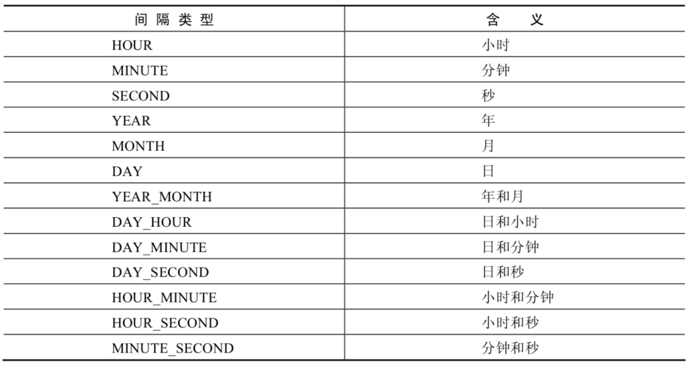

> <h1 id=""></h1>
- [**函数**](#函数)
	- [单行函数](#单行函数)
		- [数值函数](#数值函数)
		- [基本函数](#基本函数) 
		- [进制间的转换](#进制间的转换) 
		- [字符串函数](#字符串函数) 
		- [流程控制函数](#流程控制函数) 
		- [加密与解密函数](#加密与解密函数) 
		- [MySQL信息函数](#MySQL信息函数)
		- [其他函数](#其他函数)
	- [聚合函数](#聚合函数)
		- [AVG、SUM、MAX、MIN函数使用](#AVG、SUM、MAX、MIN函数使用)   
		- [count(*)，count(1)，count(列名)的区别](#count(*)，count(1)，count(列名)的区别) 
		- [GROUPBY](#GROUPBY)
		- [HAVING(用来过滤数据的)](#HAVING(用来过滤数据的))
		- [WHERE和HAVING的对比](#WHERE和HAVING的对比)
- [**SELECT的执行过程**](#SELECT的执行过程)
	- [SELECT执行顺序](#SELECT执行顺序) 
	- [SQL的执行原理](#SQL的执行原理)


<br/><br/><br/>

***
<br/>

> <h1 id="函数">函数</h1>

**MySQL的内置函数及分类**

MySQL提供了丰富的内置函数，这些函数使得数据的维护与管理更加方便，能够更好地提供数据的分析与统计功能，在一定程度上提高了开发人员进行数据分析与统计的效率。

MySQL提供的内置函数从实现的功能角度可以分为数值函数、字符串函数、日期和时间函数、流程控制函数、加密与解密函数、获取MySQL信息函数、聚合函数等。这里，我将这些丰富的内置函数再分为两类：单行函数、聚合函数（或分组函数）。

两种SQL函数:


***
<br/><br/><br/>
> <h2 id="单行函数">单行函数</h2>

- **单行函数**
	- 操作数据对象
	- 接受参数返回一个结果
	- **只对一行进行变换**
	- **每行返回一个结果**
	- 可以嵌套
	- 参数可以是一列或一个值

<br/><br/>
> <h3 id="数值函数">数值函数</h3>
<br/>

> <h3 id="基本函数">基本函数</h3>

| 函数                | 用法                                                         |
| ------------------- | ------------------------------------------------------------ |
| ABS(x)              | 返回x的绝对值                                                |
| SIGN(X)             | 返回X的符号。正数返回1，负数返回-1，0返回0                   |
| PI()                | 返回圆周率的值                                               |
| CEIL(x)，CEILING(x) | 返回大于或等于某个值的最小整数                               |
| FLOOR(x)            | 返回小于或等于某个值的最大整数                               |
| LEAST(e1,e2,e3…)    | 返回列表中的最小值                                           |
| GREATEST(e1,e2,e3…) | 返回列表中的最大值                                           |
| MOD(x,y)            | 返回X除以Y后的余数                                           |
| RAND()              | 返回0~1的随机值                                              |
| RAND(x)             | 返回0~1的随机值，其中x的值用作种子值，相同的X值会产生相同的随机数 |
| ROUND(x)            | 返回一个对x的值进行四舍五入后，最接近于X的整数               |
| ROUND(x,y)          | 返回一个对x的值进行四舍五入后最接近X的值，并保留到小数点后面Y位 |
| TRUNCATE(x,y)       | 返回数字x截断为y位小数的结果                                 |
| SQRT(x)             | 返回x的平方根。当X的值为负数时，返回NULL                     |


<br/>

```sql
SELECT ABS(-123),ABS(32),SIGN(-23),SIGN(43),PI(),CEIL(32.32),CEILING(-43.23),FLOOR(32.32),
FLOOR(-43.23),MOD(12,5)
FROM DUAL;

+-----------+---------+-----------+----------+----------+-------------+-----------------+--------------+---------------+-----------+
| ABS(-123) | ABS(32) | SIGN(-23) | SIGN(43) | PI()     | CEIL(32.32) | CEILING(-43.23) | FLOOR(32.32) | FLOOR(-43.23) | MOD(12,5) |
+-----------+---------+-----------+----------+----------+-------------+-----------------+--------------+---------------+-----------+
|       123 |      32 |        -1 |        1 | 3.141593 |          33 |             -43 |           32 |           -44 |         2 |
+-----------+---------+-----------+----------+----------+-------------+-----------------+--------------+---------------+-----------+
1 row in set (0.00 sec)
```

<br/>

**RAND函数(截断操作):**

```sql
SELECT RAND(),RAND(),RAND(10),RAND(10),RAND(-1),RAND(-1)
FROM DUAL;

+---------------------+--------------------+--------------------+--------------------+--------------------+--------------------+
| RAND()              | RAND()             | RAND(10)           | RAND(10)           | RAND(-1)           | RAND(-1)           |
+---------------------+--------------------+--------------------+--------------------+--------------------+--------------------+
| 0.48349161863652207 | 0.7989548312490385 | 0.6570515219653505 | 0.6570515219653505 | 0.9050373219931845 | 0.9050373219931845 |
+---------------------+--------------------+--------------------+--------------------+--------------------+--------------------+
1 row in set (0.00 sec)
```

<br/>

**ROUND函数:**

```sql
SELECT ROUND(12.33),ROUND(12.343,2),ROUND(12.324,-1),TRUNCATE(12.66,1),TRUNCATE(12.66,-1)
FROM DUAL;


+--------------+-----------------+------------------+-------------------+--------------------+
| ROUND(12.33) | ROUND(12.343,2) | ROUND(12.324,-1) | TRUNCATE(12.66,1) | TRUNCATE(12.66,-1) |
+--------------+-----------------+------------------+-------------------+--------------------+
|           12 |           12.34 |               10 |              12.6 |                 10 |
+--------------+-----------------+------------------+-------------------+--------------------+
```

- `TRUNCATE(12.66,-1)`: 看12的2不足5进行了舍去变成了10.

<br/><br/>

> <h3 id="进制间的转换">进制间的转换</h3>

| 函数          | 用法                     |
| ------------- | ------------------------ |
| BIN(x)        | 返回x的二进制编码        |
| HEX(x)        | 返回x的十六进制编码      |
| OCT(x)        | 返回x的八进制编码        |
| CONV(x,f1,f2) | 返回f1进制数变成f2进制数 |

```mysql
SELECT BIN(10),HEX(10),OCT(10),CONV(10,2,8) FROM DUAL;
 

+---------+---------+---------+--------------+
| BIN(10) | HEX(10) | OCT(10) | CONV(10,2,8) |
+---------+---------+---------+--------------+
| 1010    | A       | 12      | 2            |
+---------+---------+---------+--------------+
1 row in set (0.00 sec)
```

<br/><br/>

> <h3 id="字符串函数">字符串函数</h3>

| 函数                              | 用法                                                         |
| --------------------------------- | ------------------------------------------------------------ |
| ASCII(S)                          | 返回字符串S中的第一个字符的ASCII码值                         |
| CHAR_LENGTH(s)                    | 返回字符串s的字符数。作用与CHARACTER_LENGTH(s)相同           |
| LENGTH(s)                         | 返回字符串s的字节数，和字符集有关                            |
| CONCAT(s1,s2,......,sn)           | 连接s1,s2,......,sn为一个字符串                              |
| CONCAT_WS(x, s1,s2,......,sn)     | 同CONCAT(s1,s2,...)函数，但是每个字符串之间要加上x           |
| INSERT(str, idx, len, replacestr) | 将字符串str从第idx位置开始，len个字符长的子串替换为字符串replacestr |
| REPLACE(str, a, b)                | 用字符串b替换字符串str中所有出现的字符串a                    |
| UPPER(s) 或 UCASE(s)              | 将字符串s的所有字母转成大写字母                              |
| LOWER(s)  或LCASE(s)              | 将字符串s的所有字母转成小写字母                              |
| LEFT(str,n)                       | 返回字符串str最左边的n个字符                                 |
| RIGHT(str,n)                      | 返回字符串str最右边的n个字符                                 |
| LPAD(str, len, pad)               | 用字符串pad对str最左边进行填充，直到str的长度为len个字符     |
| RPAD(str ,len, pad)               | 用字符串pad对str最右边进行填充，直到str的长度为len个字符     |
| LTRIM(s)                          | 去掉字符串s左侧的空格                                        |
| RTRIM(s)                          | 去掉字符串s右侧的空格                                        |
| TRIM(s)                           | 去掉字符串s开始与结尾的空格                                  |
| TRIM(s1 FROM s)                   | 去掉字符串s开始与结尾的s1                                    |
| TRIM(LEADING s1 FROM s)           | 去掉字符串s开始处的s1                                        |
| TRIM(TRAILING s1 FROM s)          | 去掉字符串s结尾处的s1                                        |
| REPEAT(str, n)                    | 返回str重复n次的结果                                         |
| SPACE(n)                          | 返回n个空格                                                  |
| STRCMP(s1,s2)                     | 比较字符串s1,s2的ASCII码值的大小                             |
| SUBSTR(s,index,len)               | 返回从字符串s的index位置其len个字符，作用与SUBSTRING(s,n,len)、MID(s,n,len)相同 |
| LOCATE(substr,str)                | 返回字符串substr在字符串str中首次出现的位置，作用于POSITION(substr IN str)、INSTR(str,substr)相同。未找到，返回0 |
| ELT(m,s1,s2,…,sn)                 | 返回指定位置的字符串，如果m=1，则返回s1，如果m=2，则返回s2，如果m=n，则返回sn |
| FIELD(s,s1,s2,…,sn)               | 返回字符串s在字符串列表中第一次出现的位置                    |
| FIND_IN_SET(s1,s2)                | 返回字符串s1在字符串s2中出现的位置。其中，字符串s2是一个以逗号分隔的字符串 |
| REVERSE(s)                        | 返回s反转后的字符串                                          |
| NULLIF(value1,value2)             | 比较两个字符串，如果value1与value2相等，则返回NULL，否则返回value1 |

```sql
SELECT FIELD('mm','hello','msm','amma'),FIND_IN_SET('mm','hello,mm,amma')
FROM DUAL;

+----------------------------------+-----------------------------------+
| FIELD('mm','hello','msm','amma') | FIND_IN_SET('mm','hello,mm,amma') |
+----------------------------------+-----------------------------------+
|                                0 |                                 2 |
+----------------------------------+-----------------------------------+
1 row in set (0.00 sec)
```

<br/>

```sql
SELECT NULLIF('mysql','mysql'),NULLIF('mysql', '');

+-------------------------+---------------------+
| NULLIF('mysql','mysql') | NULLIF('mysql', '') |
+-------------------------+---------------------+
| NULL                    | mysql               |
+-------------------------+---------------------+
```


<br/><br/>
> <h3 id="日期和时间函数">日期和时间函数</h3>
**获取日期、时间**

| 函数                                                         | 用法                           |
| ------------------------------------------------------------ | ------------------------------ |
| **CURDATE()** ，CURRENT_DATE()                               | 返回当前日期，只包含年、月、日 |
| **CURTIME()** ， CURRENT_TIME()                              | 返回当前时间，只包含时、分、秒 |
| **NOW()** / SYSDATE() / CURRENT_TIMESTAMP() / LOCALTIME() / LOCALTIMESTAMP() | 返回当前系统日期和时间         |
| UTC_DATE()                                                   | 返回UTC（世界标准时间）日期    |
| UTC_TIME()                                                   | 返回UTC（世界标准时间）时间    |

举例：

```mysql
SELECT CURDATE(),CURTIME(),NOW(),SYSDATE()+0,UTC_DATE(),UTC_DATE()+0,UTC_TIME(),UTC_TIME()+0
FROM DUAL;

+------------+-----------+---------------------+----------------+------------+--------------+------------+--------------+
| CURDATE()  | CURTIME() | NOW()               | SYSDATE()+0    | UTC_DATE() | UTC_DATE()+0 | UTC_TIME() | UTC_TIME()+0 |
+------------+-----------+---------------------+----------------+------------+--------------+------------+--------------+
| 2025-03-29 | 14:14:18  | 2025-03-29 14:14:18 | 20250329141418 | 2025-03-29 |     20250329 | 06:14:18   |        61418 |
+------------+-----------+---------------------+----------------+------------+--------------+------------+--------------+
1 row in set (0.00 sec)
```

<br/>

### 4.2 日期与时间戳的转换

| 函数                     | 用法                                                         |
| ------------------------ | ------------------------------------------------------------ |
| UNIX_TIMESTAMP()         | 以UNIX时间戳的形式返回当前时间。SELECT UNIX_TIMESTAMP() ->1634348884 |
| UNIX_TIMESTAMP(date)     | 将时间date以UNIX时间戳的形式返回。                           |
| FROM_UNIXTIME(timestamp) | 将UNIX时间戳的时间转换为普通格式的时间                       |

举例：

```mysql
mysql> SELECT UNIX_TIMESTAMP(now());
+-----------------------+
| UNIX_TIMESTAMP(now()) |
+-----------------------+
|            1576380910 |
+-----------------------+
1 row in set (0.01 sec)

mysql> SELECT UNIX_TIMESTAMP(CURDATE());
+---------------------------+
| UNIX_TIMESTAMP(CURDATE()) |
+---------------------------+
|                1576339200 |
+---------------------------+
1 row in set (0.00 sec)

mysql> SELECT UNIX_TIMESTAMP(CURTIME());
+---------------------------+
| UNIX_TIMESTAMP(CURTIME()) |
+---------------------------+
|                1576380969 |
+---------------------------+
1 row in set (0.00 sec)

mysql> SELECT UNIX_TIMESTAMP('2011-11-11 11:11:11')
+---------------------------------------+
| UNIX_TIMESTAMP('2011-11-11 11:11:11') |
+---------------------------------------+
|                            1320981071 |
+---------------------------------------+
1 row in set (0.00 sec)
```

```mysql
mysql> SELECT FROM_UNIXTIME(1576380910);
+---------------------------+
| FROM_UNIXTIME(1576380910) |
+---------------------------+
| 2019-12-15 11:35:10       |
+---------------------------+
1 row in set (0.00 sec)
```

<br/>

### 4.3 获取月份、星期、星期数、天数等函数

| 函数                                     | 用法                                            |
| ---------------------------------------- | ----------------------------------------------- |
| YEAR(date) / MONTH(date) / DAY(date)     | 返回具体的日期值                                |
| HOUR(time) / MINUTE(time) / SECOND(time) | 返回具体的时间值                                |
| MONTHNAME(date)                          | 返回月份：January，...                          |
| DAYNAME(date)                            | 返回星期几：MONDAY，TUESDAY.....SUNDAY          |
| WEEKDAY(date)                            | 返回周几，注意，周1是0，周2是1，。。。周日是6   |
| QUARTER(date)                            | 返回日期对应的季度，范围为1～4                  |
| WEEK(date) ， WEEKOFYEAR(date)           | 返回一年中的第几周                              |
| DAYOFYEAR(date)                          | 返回日期是一年中的第几天                        |
| DAYOFMONTH(date)                         | 返回日期位于所在月份的第几天                    |
| DAYOFWEEK(date)                          | 返回周几，注意：周日是1，周一是2，。。。周六是7 |

举例：

```mysql
SELECT YEAR(CURDATE()),MONTH(CURDATE()),DAY(CURDATE()),
HOUR(CURTIME()),MINUTE(NOW()),SECOND(SYSDATE())
FROM DUAL;

+-----------------+------------------+----------------+-----------------+---------------+-------------------+
| YEAR(CURDATE()) | MONTH(CURDATE()) | DAY(CURDATE()) | HOUR(CURTIME()) | MINUTE(NOW()) | SECOND(SYSDATE()) |
+-----------------+------------------+----------------+-----------------+---------------+-------------------+
|            2025 |                3 |             29 |              14 |            14 |                58 |
+-----------------+------------------+----------------+-----------------+---------------+-------------------+
1 row in set (0.00 sec)
```

<br/>

```mysql
SELECT MONTHNAME('2021-10-26'),DAYNAME('2021-10-26'),WEEKDAY('2021-10-26'),
QUARTER(CURDATE()),WEEK(CURDATE()),DAYOFYEAR(NOW()),
DAYOFMONTH(NOW()),DAYOFWEEK(NOW())
FROM DUAL;

+-------------------------+-----------------------+-----------------------+--------------------+-----------------+------------------+-------------------+------------------+
| MONTHNAME('2021-10-26') | DAYNAME('2021-10-26') | WEEKDAY('2021-10-26') | QUARTER(CURDATE()) | WEEK(CURDATE()) | DAYOFYEAR(NOW()) | DAYOFMONTH(NOW()) | DAYOFWEEK(NOW()) |
+-------------------------+-----------------------+-----------------------+--------------------+-----------------+------------------+-------------------+------------------+
| October                 | Tuesday               |                     1 |                  1 |              12 |               88 |                29 |                7 |
+-------------------------+-----------------------+-----------------------+--------------------+-----------------+------------------+-------------------+------------------+
1 row in set (0.00 sec)
```

<br/>

### 4.4 日期的操作函数

| 函数                    | 用法                                       |
| ----------------------- | ------------------------------------------ |
| EXTRACT(type FROM date) | 返回指定日期中特定的部分，type指定返回的值 |

EXTRACT(type FROM date)函数中type的取值与含义：


```mysql
SELECT EXTRACT(MINUTE FROM NOW()),EXTRACT( WEEK FROM NOW()),
EXTRACT( QUARTER FROM NOW()),EXTRACT( MINUTE_SECOND FROM NOW())
FROM DUAL;

+----------------------------+---------------------------+------------------------------+------------------------------------+
| EXTRACT(MINUTE FROM NOW()) | EXTRACT( WEEK FROM NOW()) | EXTRACT( QUARTER FROM NOW()) | EXTRACT( MINUTE_SECOND FROM NOW()) |
+----------------------------+---------------------------+------------------------------+------------------------------------+
|                         17 |                        12 |                            1 |                               1744 |
+----------------------------+---------------------------+------------------------------+------------------------------------+
```

<br/>

### 4.5 时间和秒钟转换的函数

| 函数                 | 用法                                                         |
| -------------------- | ------------------------------------------------------------ |
| TIME_TO_SEC(time)    | 将 time 转化为秒并返回结果值。转化的公式为：`小时*3600+分钟*60+秒` |
| SEC_TO_TIME(seconds) | 将 seconds 描述转化为包含小时、分钟和秒的时间                |

举例：

```mysql
mysql> SELECT TIME_TO_SEC(NOW());
+--------------------+
| TIME_TO_SEC(NOW()) |
+--------------------+
|               78774 |
+--------------------+
1 row in set (0.00 sec)
```

```mysql
mysql> SELECT SEC_TO_TIME(78774);
+--------------------+
| SEC_TO_TIME(78774) |
+--------------------+
| 21:52:54            |
+--------------------+
1 row in set (0.12 sec)
```

### 4.6 计算日期和时间的函数

**第1组：**

| 函数                                                         | 用法                                           |
| ------------------------------------------------------------ | ---------------------------------------------- |
| DATE_ADD(datetime, INTERVAL  expr type)，ADDDATE(date,INTERVAL expr type) | 返回与给定日期时间相差INTERVAL时间段的日期时间 |
| DATE_SUB(date,INTERVAL expr type)，SUBDATE(date,INTERVAL expr type) | 返回与date相差INTERVAL时间间隔的日期           |

上述函数中type的取值：



举例：

```mysql
SELECT DATE_ADD(NOW(), INTERVAL 1 DAY) AS col1,DATE_ADD('2021-10-21 23:32:12',INTERVAL 1 SECOND) AS col2,
ADDDATE('2021-10-21 23:32:12',INTERVAL 1 SECOND) AS col3,
DATE_ADD('2021-10-21 23:32:12',INTERVAL '1_1' MINUTE_SECOND) AS col4,
DATE_ADD(NOW(), INTERVAL -1 YEAR) AS col5, #可以是负数
DATE_ADD(NOW(), INTERVAL '1_1' YEAR_MONTH) AS col6 #需要单引号
FROM DUAL;


+---------------------+---------------------+---------------------+---------------------+---------------------+---------------------+
| col1                | col2                | col3                | col4                | col5                | col6                |
+---------------------+---------------------+---------------------+---------------------+---------------------+---------------------+
| 2025-03-30 14:19:36 | 2021-10-21 23:32:13 | 2021-10-21 23:32:13 | 2021-10-21 23:33:13 | 2024-03-29 14:19:36 | 2026-04-29 14:19:36 |
+---------------------+---------------------+---------------------+---------------------+---------------------+---------------------+
1 row in set (0.00 sec)
```

<br/>

```mysql
SELECT DATE_SUB('2021-01-21',INTERVAL 31 DAY) AS col1,
SUBDATE('2021-01-21',INTERVAL 31 DAY) AS col2,
DATE_SUB('2021-01-21 02:01:01',INTERVAL '1 1' DAY_HOUR) AS col3
FROM DUAL;

+------------+------------+---------------------+
| col1       | col2       | col3                |
+------------+------------+---------------------+
| 2020-12-21 | 2020-12-21 | 2021-01-20 01:01:01 |
+------------+------------+---------------------+
1 row in set (0.00 sec)
```

**第2组：**

| 函数                         | 用法                                                         |
| ---------------------------- | ------------------------------------------------------------ |
| ADDTIME(time1,time2)         | 返回time1加上time2的时间。当time2为一个数字时，代表的是`秒`，可以为负数 |
| SUBTIME(time1,time2)         | 返回time1减去time2后的时间。当time2为一个数字时，代表的是`秒`，可以为负数 |
| DATEDIFF(date1,date2)        | 返回date1 - date2的日期间隔天数                              |
| TIMEDIFF(time1, time2)       | 返回time1 - time2的时间间隔                                  |
| FROM_DAYS(N)                 | 返回从0000年1月1日起，N天以后的日期                          |
| TO_DAYS(date)                | 返回日期date距离0000年1月1日的天数                           |
| LAST_DAY(date)               | 返回date所在月份的最后一天的日期                             |
| MAKEDATE(year,n)             | 针对给定年份与所在年份中的天数返回一个日期                   |
| MAKETIME(hour,minute,second) | 将给定的小时、分钟和秒组合成时间并返回                       |
| PERIOD_ADD(time,n)           | 返回time加上n后的时间                                        |

举例：

```mysql
SELECT ADDTIME(NOW(),20),SUBTIME(NOW(),30),SUBTIME(NOW(),'1:1:3'),DATEDIFF(NOW(),'2021-10-01'),
TIMEDIFF(NOW(),'2021-10-25 22:10:10'),FROM_DAYS(366),TO_DAYS('0000-12-25'),
LAST_DAY(NOW()),MAKEDATE(YEAR(NOW()),12),MAKETIME(10,21,23),PERIOD_ADD(20200101010101,10)
FROM DUAL;

+---------------------+---------------------+------------------------+------------------------------+---------------------------------------+----------------+-----------------------+-----------------+--------------------------+--------------------+-------------------------------+
| ADDTIME(NOW(),20)   | SUBTIME(NOW(),30)   | SUBTIME(NOW(),'1:1:3') | DATEDIFF(NOW(),'2021-10-01') | TIMEDIFF(NOW(),'2021-10-25 22:10:10') | FROM_DAYS(366) | TO_DAYS('0000-12-25') | LAST_DAY(NOW()) | MAKEDATE(YEAR(NOW()),12) | MAKETIME(10,21,23) | PERIOD_ADD(20200101010101,10) |
+---------------------+---------------------+------------------------+------------------------------+---------------------------------------+----------------+-----------------------+-----------------+--------------------------+--------------------+-------------------------------+
| 2025-03-29 14:20:44 | 2025-03-29 14:19:54 | 2025-03-29 13:19:21    |                         1275 | 838:59:59                             | 0001-01-01     |                   359 | 2025-03-31      | 2025-01-12               | 10:21:23           |                20200101010111 |
+---------------------+---------------------+------------------------+------------------------------+---------------------------------------+----------------+-----------------------+-----------------+--------------------------+--------------------+-------------------------------+
1 row in set, 1 warning (0.01 sec)
```

<br/>

```mysql
mysql> SELECT ADDTIME(NOW(), 50);
+---------------------+
| ADDTIME(NOW(), 50)  |
+---------------------+
| 2019-12-15 22:17:47 |
+---------------------+
1 row in set (0.00 sec)

mysql> SELECT ADDTIME(NOW(), '1:1:1');
+-------------------------+
| ADDTIME(NOW(), '1:1:1') |
+-------------------------+
| 2019-12-15 23:18:46     |
+-------------------------+
1 row in set (0.00 sec)
```

```mysql
mysql> SELECT SUBTIME(NOW(), '1:1:1');
+-------------------------+
| SUBTIME(NOW(), '1:1:1') |
+-------------------------+
| 2019-12-15 21:23:50     |
+-------------------------+
1 row in set (0.00 sec)

mysql> SELECT SUBTIME(NOW(), '-1:-1:-1'); 
+----------------------------+
| SUBTIME(NOW(), '-1:-1:-1') |
+----------------------------+
| 2019-12-15 22:25:11        |
+----------------------------+
1 row in set, 1 warning (0.00 sec)
```

```mysql
mysql> SELECT FROM_DAYS(366);
+----------------+
| FROM_DAYS(366) |
+----------------+
| 0001-01-01     |
+----------------+
1 row in set (0.00 sec)
```

```mysql
mysql> SELECT MAKEDATE(2020,1);
+------------------+
| MAKEDATE(2020,1) |
+------------------+
| 2020-01-01       |
+------------------+
1 row in set (0.00 sec)

mysql> SELECT MAKEDATE(2020,32);
+-------------------+
| MAKEDATE(2020,32) |
+-------------------+
| 2020-02-01        |
+-------------------+
1 row in set (0.00 sec)
```

```mysql
mysql> SELECT MAKETIME(1,1,1);
+-----------------+
| MAKETIME(1,1,1) |
+-----------------+
| 01:01:01        |
+-----------------+
1 row in set (0.00 sec)
```

```mysql
mysql> SELECT PERIOD_ADD(20200101010101,1);
+------------------------------+
| PERIOD_ADD(20200101010101,1) |
+------------------------------+
|               20200101010102 |
+------------------------------+
1 row in set (0.00 sec)
```

```mysql
mysql> SELECT TO_DAYS(NOW());
+----------------+
| TO_DAYS(NOW()) |
+----------------+
|          737773 |
+----------------+
1 row in set (0.00 sec)
```

举例：查询 7 天内的新增用户数有多少？

```mysql
SELECT COUNT(*) as num FROM new_user WHERE TO_DAYS(NOW())-TO_DAYS(regist_time)<=7
```

### 4.7 日期的格式化与解析

| 函数                              | 用法                                       |
| --------------------------------- | ------------------------------------------ |
| DATE_FORMAT(date,fmt)             | 按照字符串fmt格式化日期date值              |
| TIME_FORMAT(time,fmt)             | 按照字符串fmt格式化时间time值              |
| GET_FORMAT(date_type,format_type) | 返回日期字符串的显示格式                   |
| STR_TO_DATE(str, fmt)             | 按照字符串fmt对str进行解析，解析为一个日期 |

上述`非GET_FORMAT`函数中fmt参数常用的格式符：

| 格式符 | 说明                                                        | 格式符 | 说明                                                        |
| ------ | ----------------------------------------------------------- | ------ | ----------------------------------------------------------- |
| %Y     | 4位数字表示年份                                             | %y     | 表示两位数字表示年份                                        |
| %M     | 月名表示月份（January,....）                                | %m     | 两位数字表示月份（01,02,03。。。）                          |
| %b     | 缩写的月名（Jan.，Feb.，....）                              | %c     | 数字表示月份（1,2,3,...）                                   |
| %D     | 英文后缀表示月中的天数（1st,2nd,3rd,...）                   | %d     | 两位数字表示月中的天数(01,02...)                            |
| %e     | 数字形式表示月中的天数（1,2,3,4,5.....）                    |        |                                                             |
| %H     | 两位数字表示小数，24小时制（01,02..）                       | %h和%I | 两位数字表示小时，12小时制（01,02..）                       |
| %k     | 数字形式的小时，24小时制(1,2,3)                             | %l     | 数字形式表示小时，12小时制（1,2,3,4....）                   |
| %i     | 两位数字表示分钟（00,01,02）                                | %S和%s | 两位数字表示秒(00,01,02...)                                 |
| %W     | 一周中的星期名称（Sunday...）                               | %a     | 一周中的星期缩写（Sun.，Mon.,Tues.，..）                    |
| %w     | 以数字表示周中的天数(0=Sunday,1=Monday....)                 |        |                                                             |
| %j     | 以3位数字表示年中的天数(001,002...)                         | %U     | 以数字表示年中的第几周，（1,2,3。。）其中Sunday为周中第一天 |
| %u     | 以数字表示年中的第几周，（1,2,3。。）其中Monday为周中第一天 |        |                                                             |
| %T     | 24小时制                                                    | %r     | 12小时制                                                    |
| %p     | AM或PM                                                      | %%     | 表示%                                                       |

GET_FORMAT函数中date_type和format_type参数取值如下：


举例：

```mysql
mysql> SELECT DATE_FORMAT(NOW(), '%H:%i:%s');
+--------------------------------+
| DATE_FORMAT(NOW(), '%H:%i:%s') |
+--------------------------------+
| 22:57:34                        |
+--------------------------------+
1 row in set (0.00 sec)
```

```mysql
SELECT STR_TO_DATE('09/01/2009','%m/%d/%Y')
FROM DUAL;

+--------------------------------------+
| STR_TO_DATE('09/01/2009','%m/%d/%Y') |
+--------------------------------------+
| 2009-09-01                           |
+--------------------------------------+
1 row in set (0.00 sec)
```

<br/>

```
SELECT STR_TO_DATE('20140422154706','%Y%m%d%H%i%s')
FROM DUAL;

+----------------------------------------------+
| STR_TO_DATE('20140422154706','%Y%m%d%H%i%s') |
+----------------------------------------------+
| 2014-04-22 15:47:06                          |
+----------------------------------------------+
1 row in set (0.00 sec)

```

<br/>

```
SELECT STR_TO_DATE('2014-04-22 15:47:06','%Y-%m-%d %H:%i:%s')
FROM DUAL;

+--------------------------------------------------------+
| STR_TO_DATE('2014-04-22 15:47:06','%Y-%m-%d %H:%i:%s') |
+--------------------------------------------------------+
| 2014-04-22 15:47:06                                    |
+--------------------------------------------------------+
1 row in set (0.00 sec)
```

<br/>

```mysql
mysql> SELECT GET_FORMAT(DATE, 'USA');
+-------------------------+
| GET_FORMAT(DATE, 'USA') |
+-------------------------+
| %m.%d.%Y                |
+-------------------------+
1 row in set (0.00 sec)

SELECT DATE_FORMAT(NOW(),GET_FORMAT(DATE,'USA')),
FROM DUAL;
```

```mysql
mysql> SELECT STR_TO_DATE('2020-01-01 00:00:00','%Y-%m-%d'); 
+-----------------------------------------------+
| STR_TO_DATE('2020-01-01 00:00:00','%Y-%m-%d') |
+-----------------------------------------------+
| 2020-01-01                                    |
+-----------------------------------------------+
1 row in set, 1 warning (0.00 sec)
```

***
<br/><br/>
> <h3 id="流程控制函数">流程控制函数</h3>
流程处理函数可以根据不同的条件，执行不同的处理流程，可以在SQL语句中实现不同的条件选择。MySQL中的流程处理函数主要包括IF()、IFNULL()和CASE()函数。

| 函数                                                         | 用法                                            |
| ------------------------------------------------------------ | ----------------------------------------------- |
| IF(value,value1,value2)                                      | 如果value的值为TRUE，返回value1，否则返回value2 |
| IFNULL(value1, value2)                                       | 如果value1不为NULL，返回value1，否则返回value2  |
| CASE WHEN 条件1 THEN 结果1 WHEN 条件2 THEN 结果2 .... [ELSE resultn] END | 相当于Java的if...else if...else...              |
| CASE  expr WHEN 常量值1 THEN 值1 WHEN 常量值1 THEN 值1 .... [ELSE 值n] END | 相当于Java的switch...case...                    |

```mysql
SELECT IF(1 > 0,'正确','错误')    
->正确
```

如:

```
SELECT last_name, salary, IF(salary >= 500,"高工资","低工资")  "details"
FROM employees;

+----------------------+--------+-----------+
| last_name            | salary | details   |
+----------------------+--------+-----------+
| Deborah Mendoza      | 554.71 | 高工资    |
| Jiang Ziyi           |  75.50 | 低工资    |
| Fan Ling Ling        | 266.16 | 低工资    |
| 杜頴璇               | 144.88 | 低工资    |
| 葉慧敏               | 547.61 | 高工资    |
| 中川七海             | 327.37 | 低工资    |
| Wu Lan               | 485.87 | 低工资    |
| 方震南               | 898.13 | 高工资    |
```

<br/>

```mysql
SELECT IFNULL(null,'Hello Word')
->Hello Word

SELECT last_name, commission_pct, IFNULL(commission_pct > 700, 0)  "details"
FROM employees;

+----------------------+----------------+---------+
| last_name            | commission_pct | details |
+----------------------+----------------+---------+
| Deborah Mendoza      |         870.82 |       1 |
| Jiang Ziyi           |          49.07 |       0 |
| Fan Ling Ling        |         781.87 |       1 |
| 杜頴璇               |         234.24 |       0 |
| 葉慧敏               |         141.33 |       0 |
```

<br/>

```mysql
SELECT CASE 
　　WHEN 1 > 0
　　THEN '1 > 0'
　　WHEN 2 > 0
　　THEN '2 > 0'
　　ELSE '3 > 0'
　　END
->1 > 0
```

<br/>

```mysql
SELECT CASE 1 
　　WHEN 1 THEN '我是1'
　　WHEN 2 THEN '我是2'
ELSE '你是谁'
```

```mysql
SELECT employee_id,salary, CASE WHEN salary>=800 THEN '高薪' 
				  WHEN salary>=600 THEN '潜力股'  
				  WHEN salary>=300 THEN '屌丝' 
				  ELSE '草根' END  "描述"
FROM employees; 

+-------------+--------+-----------+
| employee_id | salary | 描述      |
+-------------+--------+-----------+
|           1 | 554.71 | 屌丝      |
|           2 |  75.50 | 草根      |
|           3 | 266.16 | 草根      |
|           4 | 144.88 | 草根      |
|           5 | 547.61 | 屌丝      |
|           6 | 327.37 | 屌丝      |
|           7 | 485.87 | 屌丝      |
|           8 | 898.13 | 高薪      |
|           9 | 211.20 | 草根      |
...
..
.
|         119 | 453.35 | 屌丝      |
|         120 | 583.98 | 屌丝      |
|         121 | 922.72 | 高薪      |
+-------------+--------+-----------+
120 rows in set (0.00 sec)
120 rows in set (0.00 sec)
```

<br/>

```mysql
SELECT oid,`status`, CASE `status` WHEN 1 THEN '未付款' 
								   WHEN 2 THEN '已付款' 
								   WHEN 3 THEN '已发货'  
								   WHEN 4 THEN '确认收货'  
								   ELSE '无效订单' END 
FROM t_order;
```

```mysql
mysql> SELECT CASE WHEN 1 > 0 THEN 'yes' WHEN 1 <= 0 THEN 'no' ELSE 'unknown' END;
+---------------------------------------------------------------------+
| CASE WHEN 1 > 0 THEN 'yes' WHEN 1 <= 0 THEN 'no' ELSE 'unknown' END |
+---------------------------------------------------------------------+
| yes                                                                  |
+---------------------------------------------------------------------+
1 row in set (0.00 sec)

mysql> SELECT CASE WHEN 1 < 0 THEN 'yes' WHEN 1 = 0 THEN 'no' ELSE 'unknown' END;  
+--------------------------------------------------------------------+
| CASE WHEN 1 < 0 THEN 'yes' WHEN 1 = 0 THEN 'no' ELSE 'unknown' END |
+--------------------------------------------------------------------+
| unknown                                                             |
+--------------------------------------------------------------------+
1 row in set (0.00 sec)
```

```mysql
mysql> SELECT CASE 1 WHEN 0 THEN 0 WHEN 1 THEN 1 ELSE -1 END;
+------------------------------------------------+
| CASE 1 WHEN 0 THEN 0 WHEN 1 THEN 1 ELSE -1 END |
+------------------------------------------------+
|                                               1 |
+------------------------------------------------+
1 row in set (0.00 sec)

mysql> SELECT CASE -1 WHEN 0 THEN 0 WHEN 1 THEN 1 ELSE -1 END;
+-------------------------------------------------+
| CASE -1 WHEN 0 THEN 0 WHEN 1 THEN 1 ELSE -1 END |
+-------------------------------------------------+
|                                               -1 |
+-------------------------------------------------+
1 row in set (0.00 sec)
```

```mysql
SELECT employee_id,12 * salary * (1 + IFNULL(commission_pct,0))
FROM employees;
```

```mysql
SELECT last_name, job_id, salary,
       CASE job_id WHEN 'IT_PROG'  THEN  1.10*salary
                   WHEN 'ST_CLERK' THEN  1.15*salary
                   WHEN 'SA_REP'   THEN  1.20*salary
       			   ELSE      salary END     "REVISED_SALARY"
FROM   employees;
```

<br/><br/>
> <h3 id="加密与解密函数">加密与解密函数</h3>
加密与解密函数主要用于对数据库中的数据进行加密和解密处理，以防止数据被他人窃取。这些函数在保证数据库安全时非常有用。

| 函数                        | 用法                                                         |
| --------------------------- | ------------------------------------------------------------ |
| PASSWORD(str)               | 返回字符串str的加密版本，41位长的字符串。加密结果`不可逆`，常用于用户的密码加密 |
| MD5(str)                    | 返回字符串str的md5加密后的值，也是一种加密方式。若参数为NULL，则会返回NULL |
| SHA(str)                    | 从原明文密码str计算并返回加密后的密码字符串，当参数为NULL时，返回NULL。`SHA加密算法比MD5更加安全`。 |
| ENCODE(value,password_seed) | 返回使用password_seed作为加密密码加密value                   |
| DECODE(value,password_seed) | 返回使用password_seed作为加密密码解密value                   |

可以看到，ENCODE(value,password_seed)函数与DECODE(value,password_seed)函数互为反函数。

举例：

```mysql
mysql> SELECT PASSWORD('mysql'), PASSWORD(NULL);
+-------------------------------------------+----------------+
| PASSWORD('mysql')                         | PASSWORD(NULL) |
+-------------------------------------------+----------------+
| *E74858DB86EBA20BC33D0AECAE8A8108C56B17FA |                |
+-------------------------------------------+----------------+
1 row in set, 1 warning (0.00 sec)
```

<br/>

```mysql
SELECT md5('123'), SHA('Tom123');
+----------------------------------+------------------------------------------+
| md5('123')                       | SHA('Tom123')                            |
+----------------------------------+------------------------------------------+
| 202cb962ac59075b964b07152d234b70 | c7c506980abc31cc390a2438c90861d0f1216d50 |
+----------------------------------+------------------------------------------+
1 row in set (0.00 sec)
```

<br/>

```mysql
mysql> SELECT ENCODE('mysql', 'mysql');
+--------------------------+
| ENCODE('mysql', 'mysql') |
+--------------------------+
| íg　¼　ìÉ                  |
+--------------------------+
1 row in set, 1 warning (0.01 sec)
```

<br/>

```mysql
mysql> SELECT DECODE(ENCODE('mysql','mysql'),'mysql');
+-----------------------------------------+
| DECODE(ENCODE('mysql','mysql'),'mysql') |
+-----------------------------------------+
| mysql                                   |
+-----------------------------------------+
1 row in set, 2 warnings (0.00 sec)
```


<br/><br/>
> <h3 id="MySQL信息函数">MySQL信息函数</h3>
MySQL中内置了一些可以查询MySQL信息的函数，这些函数主要用于帮助数据库开发或运维人员更好地对数据库进行维护工作。

| 函数                                                  | 用法                                                     |
| ----------------------------------------------------- | -------------------------------------------------------- |
| VERSION()                                             | 返回当前MySQL的版本号                                    |
| CONNECTION_ID()                                       | 返回当前MySQL服务器的连接数                              |
| DATABASE()，SCHEMA()                                  | 返回MySQL命令行当前所在的数据库                          |
| USER()，CURRENT_USER()、SYSTEM_USER()，SESSION_USER() | 返回当前连接MySQL的用户名，返回结果格式为“主机名@用户名” |
| CHARSET(value)                                        | 返回字符串value自变量的字符集                            |
| COLLATION(value)                                      | 返回字符串value的比较规则                                |

举例：

```mysql
mysql>  SELECT DATABASE(), USER(), CURRENT_USER(), SYSTEM_USER(),SESSION_USER(), CHARSET('ABC'), COLLATION('ABC');
+------------+----------------+----------------+----------------+----------------+----------------+--------------------+
| DATABASE() | USER()         | CURRENT_USER() | SYSTEM_USER()  | SESSION_USER() | CHARSET('ABC') | COLLATION('ABC')   |
+------------+----------------+----------------+----------------+----------------+----------------+--------------------+
| db_test    | root@localhost | root@localhost | root@localhost | root@localhost | utf8mb4        | utf8mb4_0900_ai_ci |
+------------+----------------+----------------+----------------+----------------+----------------+--------------------+
1 row in set (0.00 sec)
```

<br/><br/>
> <h3 id="其他函数">其他函数</h3>
MySQL中有些函数无法对其进行具体的分类，但是这些函数在MySQL的开发和运维过程中也是不容忽视的。

| 函数                           | 用法                                                         |
| ------------------------------ | ------------------------------------------------------------ |
| FORMAT(value,n)                | 返回对数字value进行格式化后的结果数据。n表示`四舍五入`后保留到小数点后n位 |
| CONV(value,from,to)            | 将value的值进行不同进制之间的转换                            |
| INET_ATON(ipvalue)             | 将以点分隔的IP地址转化为一个数字                             |
| INET_NTOA(value)               | 将数字形式的IP地址转化为以点分隔的IP地址                     |
| BENCHMARK(n,expr)              | 将表达式expr重复执行n次。用于测试MySQL处理expr表达式所耗费的时间 |
| CONVERT(value USING char_code) | 将value所使用的字符编码修改为char_code                       |

举例：

```mysql
# 如果n的值小于或者等于0，则只保留整数部分
mysql> SELECT FORMAT(123.123, 2), FORMAT(123.523, 0), FORMAT(123.123, -2), CONV(16, 10, 2), CONV(8888,10,16), CONV(NULL, 10, 2), INET_ATON('192.168.1.100'), INET_NTOA(3232235876), BENCHMARK(1, MD5('mysql')), BENCHMARK(1000000, MD5('mysql')), CHARSET('mysql'), CHARSET(CONVERT('mysql' USING 'utf8'));
+--------------------+--------------------+---------------------+-----------------+------------------+-------------------+----------------------------+-----------------------+----------------------------+----------------------------------+------------------+----------------------------------------+
| FORMAT(123.123, 2) | FORMAT(123.523, 0) | FORMAT(123.123, -2) | CONV(16, 10, 2) | CONV(8888,10,16) | CONV(NULL, 10, 2) | INET_ATON('192.168.1.100') | INET_NTOA(3232235876) | BENCHMARK(1, MD5('mysql')) | BENCHMARK(1000000, MD5('mysql')) | CHARSET('mysql') | CHARSET(CONVERT('mysql' USING 'utf8')) |
+--------------------+--------------------+---------------------+-----------------+------------------+-------------------+----------------------------+-----------------------+----------------------------+----------------------------------+------------------+----------------------------------------+
| 123.12             | 124                | 123                 | 10000           | 22B8             | NULL              |                 3232235876 | 192.168.1.100         |                          0 |                                0 | utf8mb4          | utf8mb3                                |
+--------------------+--------------------+---------------------+-----------------+------------------+-------------------+----------------------------+-----------------------+----------------------------+----------------------------------+------------------+----------------------------------------+
```

- 以 **“192.168.1.100”** 为例，计算方式为192乘以256的3次方，加上168乘以256的2次方，加上1乘以256，再加上100。

***
<br/><br/><br/>
> <h2 id="聚合函数">聚合函数</h2>
实际上 SQL 函数还有一类，叫做聚合（或聚集、分组）函数，它是对一组数据进行汇总的函数，输入的是一组数据的集合，输出的是单个值。

**什么是聚合函数**

聚合函数作用于一组数据，并对一组数据返回一个值。


- **聚合函数类型**
  - **AVG()** 
  - **SUM()**
  - **MAX()** 
  - **MIN()** 
  - **COUNT()**

- 聚合函数语法


- 聚合函数不能嵌套调用。比如不能出现类似“AVG(SUM(字段名称))”形式的调用。

<br/><br/>
> <h3 id="AVG、SUM、MAX、MIN函数使用">AVG、SUM、MAX、MIN函数使用</h3>

**公式:AVG = SUM / COUNT**

**注意:** SUM函数不会统计NULL值的数的,COUNT(列名)也不会统计NULL值的列名的.

```mysql
SELECT AVG(salary) AS '平均工资', SUM(salary) AS '总和', MAX(salary) AS '薪水最大值', MIN(salary) AS '薪水最小值'
FROM employees;

+--------------+----------+-----------------+-----------------+
| 平均工资     | 总和     | 薪水最大值      | 薪水最小值      |
+--------------+----------+-----------------+-----------------+
|   479.945333 | 57593.44 |          997.42 |            4.61 |
+--------------+----------+-----------------+-----------------+
1 row in set (0.00 sec)
```

<br/>

**COUNT**

计算指定字段在查询结构中出现的个数.
**注意: 计算指定字段出现个数时,NULL值不包含在内的.**

计算有多少条记录:
- 方式一: COUNT(*);
- 方式2️⃣: COUNT(1);
- 方式3️⃣: COUNT(具体字段) : 不一定对,因为它空值没有包含在内.

```mysql
SELECT COUNT(employee_id), COUNT(salary), COUNT("12")
FROM employees;

+--------------------+---------------+-------------+
| COUNT(employee_id) | COUNT(salary) | COUNT("12") |
+--------------------+---------------+-------------+
|                120 |           120 |         120 |
+--------------------+---------------+-------------+
1 row in set (0.00 sec)
```


<br/><br/>
> <h3 id="count(*)，count(1)，count(列名)的区别">count(*)，count(1)，count(列名)的区别</h3>

- **问题：用count(*)，count(1)，count(列名)谁好呢?**

  其实，对于MyISAM引擎的表是没有区别的。这种引擎内部有一计数器在维护着行数。

  Innodb引擎的表用count(*),count(1)直接读行数，复杂度是O(n)，因为innodb真的要去数一遍。但好于具体的count(列名)。
  
  <br/>
  
- **问题：能不能使用count(列名)替换count(*)?**

  不要使用 count(列名)来替代 `count(*)`，`count(*)`是 SQL92 定义的标准统计行数的语法，跟数据库无关，跟 NULL 和非 NULL 无关。 

  说明：count(*)会统计值为 NULL 的行，而 count(列名)不会统计此列为 NULL 值的行。
  
  <br/><br/>
  > <h3 id="GROUPBY">GROUP BY</h3>
  


**可以使用GROUP BY子句将表中的数据分成若干组**

```sql
SELECT column, group_function(column)
FROM table
[WHERE	condition]
[GROUP BY	group_by_expression]
[ORDER BY	column];
```

> **明确：WHERE一定放在FROM后面**

**在SELECT列表中所有未包含在组函数中的列都应该包含在 GROUP BY子句中**

```sql
-- 查询各个部门的平均工资,按照部门id来分组
SELECT   department_id, AVG(salary)
FROM     employees
GROUP BY department_id ;

+---------------+-------------+
| department_id | AVG(salary) |
+---------------+-------------+
|             1 |  679.640000 |
|            11 |  300.410000 |
|            28 |  962.120000 |
|           935 |  344.890000 |
...
..
.
|           938 |  547.690000 |
|           953 |  424.760000 |
|           971 |  894.460000 |
|           987 |  521.940000 |
+---------------+-------------+
107 rows in set (0.00 sec)
```

<br/>

包含在 GROUP BY 子句中的列不必包含在SELECT 列表中(没有了department_id列,只有AVG(salary)列)

```sql
SELECT   AVG(salary)
FROM     employees
GROUP BY department_id;

+-------------+
| AVG(salary) |
+-------------+
|  679.640000 |
|  300.410000 |
|  962.120000 |
|  127.110000 |
|  221.540000 |
...
..
.
|  547.690000 |
|  424.760000 |
|  894.460000 |
|  521.940000 |
+-------------+
```

<br/><br/>

### 2.2 使用多个列分组


```sql
-- 查询各个department_id, job_id 的平均工资
-- 先按department_id分组,然后再按照job_id进行分组

SELECT   department_id dept_id, job_id, SUM(salary)
FROM     employees
GROUP BY department_id, job_id ;


+---------+------------+-------------+
| dept_id | job_id     | SUM(salary) |
+---------+------------+-------------+
|     433 | C916Zxmp1T |      554.71 |
|      78 | xJJxHzV7ps |       75.50 |
|     283 | Q7vmbrrubi |      266.16 |
|     870 | mcGy2zyS8V |      144.88 |
|     227 | XuaHjJzfCs |      547.61 |
|     482 | pCWr6ZCmBT |      327.37 |
|     598 | Ovr0Lq5z2e |      485.87 |
...
..
.
|     355 | DjjowNeoj2 |      164.25 |
|     799 | b7lz8jemaU |      453.35 |
|     388 | jdgnbah4Y9 |      583.98 |
|     619 | qstlxHCzTt |      922.72 |
+---------+------------+-------------+
120 rows in set (0.00 sec)
```

<br/>

**错误案例:**

```sql
SELECT department_id, job_id, AVG(salary)
FROM employees
GROUP BY department_id;


ERROR 1055 (42000): Expression #2 of SELECT list is not in GROUP BY clause and contains nonaggregated column 'db_test.employees.job_id' which is not functionally dependent on columns in GROUP BY clause; this is incompatible with sql_mode=only_full_group_by
```

在之前的老版本是不会报错的,会显示符合”条件“的数据.但是你要知道了,**一个部门department_id不可能对应一个job_id**,但是它出现了那就说明筛选的是错误的.

- **结论:** 
	- SELECT中出现的非组函数的字段必须声明在GROPOUP BY中.
	- 反之,GROUP BY中声明的字段可以不出现在SELECT中.
	- GROUP BY声明在FROM后面、WHERE后面,ORDER BY前面、LIMIT前面.


<br/><br/>

### 2.3 GROUP BY中使用WITH ROLLUP

使用`WITH ROLLUP`关键字之后，在所有查询出的分组记录之后增加一条记录，该记录计算查询出的所有记录的总和，即统计记录数量。

```mysql
SELECT department_id,AVG(salary)
FROM employees
WHERE department_id > 80
GROUP BY department_id WITH ROLLUP;

+---------------+-------------+
| department_id | AVG(salary) |
+---------------+-------------+
|            95 |  729.090000 |
|           100 |  488.390000 |
|           103 |   61.040000 |
...
..
.
|           971 |  894.460000 |
|           987 |  521.940000 |
|          NULL |  487.592000 |
+---------------+-------------+
98 rows in set (0.00 sec)
```

如下面的:

```
|          NULL |  487.592000 |
+---------------+-------------+
```
计算的是 `‌ 487.592000`,它是上面的平均工资的再平均值.

> **注意：**
>
> 当使用ROLLUP时，不能同时使用ORDER BY子句进行结果排序，即ROLLUP和ORDER BY是互相排斥的。


***
<br/><br/><br/>
> <h2 id="HAVING(用来过滤数据的)">HAVING(用来过滤数据的)</h2>
**基本使用**


**过滤分组：HAVING子句**

1. 行已经被分组。
2. 使用了聚合函数。
3. 满足HAVING 子句中条件的分组将被显示。
4. HAVING 不能单独使用，必须要跟 GROUP BY 一起使用,放在GROUP BY的后面使用。
5. 开发中HAVING可以单独使用,但是没有必要,意义不大.
6. 开发中HAVING使用的前提是SQL中使用了GROUP BY.


```sql
-- 查询各个部门中最高工资比900高的部门信息
SELECT   department_id, MAX(salary)
FROM     employees
GROUP BY department_id
HAVING   MAX(salary)>900;

+---------------+-------------+
| department_id | MAX(salary) |
+---------------+-------------+
|            28 |      962.12 |
|           133 |      968.77 |
|           170 |      913.95 |
|           379 |      961.96 |
|           435 |      989.71 |
|           600 |      994.69 |
|           619 |      922.72 |
|           695 |      959.99 |
|           744 |      919.50 |
|           787 |      997.42 |
|           869 |      933.77 |
|           932 |      951.72 |
+---------------+-------------+
12 rows in set (0.00 sec)
```


<br/>

- **非法使用聚合函数 ： 不能在 WHERE 子句中使用聚合函数。必须使用HAVING来替换WHERE.否则报错** 如下：

```sql
SELECT   department_id, AVG(salary)
FROM     employees
WHERE    AVG(salary) > 800
GROUP BY department_id;

ERROR 1111 (HY000): Invalid use of group function
```

正确的为:

```sql
SELECT   department_id, AVG(salary)
FROM     employees
WHERE    AVG(salary) > 800
GROUP BY department_id
HAVING AVG(salary) > 800

+---------------+-------------+
| department_id | AVG(salary) |
+---------------+-------------+
|            28 |  962.120000 |
|           133 |  921.025000 |
|           170 |  913.950000 |
|           210 |  876.480000 |
|           273 |  810.800000 |
|           298 |  845.170000 |
|           379 |  961.960000 |
|           435 |  989.710000 |
|           500 |  816.520000 |
|           546 |  895.550000 |
|           600 |  994.690000 |
|           619 |  922.720000 |
|           695 |  959.990000 |
|           744 |  879.850000 |
|           749 |  866.070000 |
|           822 |  898.130000 |
|           932 |  951.720000 |
|           971 |  894.460000 |
+---------------+-------------+
18 rows in set (0.00 sec)
```


<br/><br/>
> <h3 id="WHERE和HAVING的对比">WHERE和HAVING的对比</h3>

- **结论:**
	- 从适用范围来讲,HAVING范围更广;
	- 从过滤条件来看, 若是过滤条件中没有聚合函数,WHERE的执行效率要高于HAVING,原因如下:

**区别1：WHERE 可以直接使用表中的字段作为筛选条件，但不能使用分组中的计算函数作为筛选条件；HAVING 必须要与 GROUP BY 配合使用，可以把分组计算的函数和分组字段作为筛选条件。** 

这决定了，在需要对数据进行分组统计的时候，HAVING 可以完成 WHERE 不能完成的任务。这是因为，在查询语法结构中，WHERE 在 GROUP BY 之前，所以无法对分组结果进行筛选。HAVING 在 GROUP BY 之后，可以使用分组字段和分组中的计算函数，对分组的结果集进行筛选，这个功能是 WHERE 无法完成的。另外，WHERE排除的记录不再包括在分组中。

**区别2：如果需要通过连接从关联表中获取需要的数据，WHERE 是先筛选后连接，而 HAVING 是先连接后筛选。** 这一点，就决定了在关联查询中，WHERE 比 HAVING 更高效。因为 WHERE 可以先筛选，用一个筛选后的较小数据集和关联表进行连接，这样占用的资源比较少，执行效率也比较高。HAVING 则需要先把结果集准备好，也就是用未被筛选的数据集进行关联，然后对这个大的数据集进行筛选，这样占用的资源就比较多，执行效率也较低。 

小结如下：

|        | 优点                         | 缺点                                   |
| ------ | ---------------------------- | -------------------------------------- |
| WHERE  | 先筛选数据再关联，执行效率高 | 不能使用分组中的计算函数进行筛选       |
| HAVING | 可以使用分组中的计算函数     | 在最后的结果集中进行筛选，执行效率较低 |

**开发中的选择：**

WHERE 和 HAVING 也不是互相排斥的，我们可以在一个查询里面同时使用 WHERE 和 HAVING。包含分组统计函数的条件用 HAVING，普通条件用 WHERE。这样，我们就既利用了 WHERE 条件的高效快速，又发挥了 HAVING 可以使用包含分组统计函数的查询条件的优点。当数据量特别大的时候，运行效率会有很大的差别。


<br/><br/><br/>

***
<br/>
> <h1 id="SELECT的执行过程">SELECT的执行过程</h1>
**查询的结构**

```mysql
#方式1(sql92)：
SELECT ...,....,...
FROM ...,...,....
WHERE 多表的连接条件
AND 不包含组函数(聚合函数)的过滤条件
GROUP BY ...,...
HAVING 包含组函数(聚合函数)的过滤条件
ORDER BY ... ASC/DESC
LIMIT ...,...

#方式2(sql99)：
SELECT ...,....,...(存在聚合函数)
FROM ... JOIN ... 
ON 多表的连接条件
JOIN ...
ON ...
WHERE 不包含组函数(聚合函数)的过滤条件
AND/OR 不包含组函数(聚合函数)的过滤条件
GROUP BY ...,...
HAVING 包含组函数的过滤条件
ORDER BY ... ASC/DESC
LIMIT ...,...

#其中：
#（1）from：从哪些表中筛选
#（2）on：关联多表查询时，去除笛卡尔积
#（3）where：从表中筛选的条件
#（4）group by：分组依据
#（5）having：在统计结果中再次筛选
#（6）order by：排序
#（7）limit：分页
```

***
<br/><br/><br/>
> <h2 id="SELECT执行顺序">SELECT执行顺序</h2>

你需要记住 SELECT 查询时的两个顺序：

**1. 关键字的顺序是不能颠倒的：**

```
SELECT ... FROM ... WHERE ... GROUP BY ... HAVING ... ORDER BY ... LIMIT...
```

**2.SELECT 语句的执行顺序**（在 MySQL 和 Oracle 中，SELECT 执行顺序基本相同）：

```
FROM -> WHERE -> GROUP BY -> HAVING -> SELECT 的字段 -> DISTINCT -> ORDER BY -> LIMIT
```


比如你写了一个 SQL 语句，那么它的关键字顺序和执行顺序是下面这样的：

```mysql
SELECT DISTINCT player_id, player_name, count(*) as num # 顺序 5
FROM player JOIN team ON player.team_id = team.team_id # 顺序 1
WHERE height > 1.80 # 顺序 2
GROUP BY player.team_id # 顺序 3
HAVING num > 2 # 顺序 4
ORDER BY num DESC # 顺序 6
LIMIT 2 # 顺序 7
```

在 SELECT 语句执行这些步骤的时候，每个步骤都会产生一个`虚拟表`，然后将这个虚拟表传入下一个步骤中作为输入。需要注意的是，这些步骤隐含在 SQL 的执行过程中，对于我们来说是不可见的。

***
<br/><br/><br/>
> <h2 id="SQL的执行原理">SQL的执行原理</h2>


SELECT 是先执行 FROM 这一步的。在这个阶段，如果是多张表联查，还会经历下面的几个步骤：

1. 首先先通过 CROSS JOIN 求笛卡尔积，相当于得到虚拟表 vt（virtual table）1-1；
2. 通过 ON 进行筛选，在虚拟表 vt1-1 的基础上进行筛选，得到虚拟表 vt1-2；
3. 添加外部行。如果我们使用的是左连接、右链接或者全连接，就会涉及到外部行，也就是在虚拟表 vt1-2 的基础上增加外部行，得到虚拟表 vt1-3。

当然如果我们操作的是两张以上的表，还会重复上面的步骤，直到所有表都被处理完为止。这个过程得到是我们的原始数据。

当我们拿到了查询数据表的原始数据，也就是最终的虚拟表 `vt1`，就可以在此基础上再进行 `WHERE 阶段`。在这个阶段中，会根据 vt1 表的结果进行筛选过滤，得到虚拟表 `vt2`。

然后进入第三步和第四步，也就是 `GROUP 和 HAVING 阶段`。在这个阶段中，实际上是在虚拟表 vt2 的基础上进行分组和分组过滤，得到中间的虚拟表 `vt3` 和 `vt4`。

当我们完成了条件筛选部分之后，就可以筛选表中提取的字段，也就是进入到 `SELECT 和 DISTINCT 阶段`。

首先在 SELECT 阶段会提取想要的字段，然后在 DISTINCT 阶段过滤掉重复的行，分别得到中间的虚拟表 `vt5-1` 和 `vt5-2`。

当我们提取了想要的字段数据之后，就可以按照指定的字段进行排序，也就是 `ORDER BY 阶段`，得到虚拟表 `vt6`。

最后在 vt6 的基础上，取出指定行的记录，也就是 `LIMIT 阶段`，得到最终的结果，对应的是虚拟表 `vt7`。

当然我们在写 SELECT 语句的时候，不一定存在所有的关键字，相应的阶段就会省略。

同时因为 SQL 是一门类似英语的结构化查询语言，所以我们在写 SELECT 语句的时候，还要注意相应的关键字顺序，**所谓底层运行的原理，就是我们刚才讲到的执行顺序。**


```mysql


```

```mysql


```

```mysql

```


<br/>

```mysql

```

<br/>

```mysql

```

<br/>

```mysql

```

<br/>

```sql

```

<br/>

```sql

```

<br/>

```sql

```

<br/>

```sql

```

<br/>

```sql

```

<br/>

```sql

```

<br/>

```sql

```

<br/>

```sql

```

<br/>

```sql

```

<br/>

```sql

```

<br/>

```sql

```

<br/>

```sql

```

<br/>

```sql

```

<br/>

```sql

```

<br/>

```sql

```

<br/>

```sql

```

<br/>

```sql

```

<br/>

```sql

```

<br/>

```sql

```

<br/>

```sql

```

<br/>

```sql

```

<br/>

```sql

```

<br/>

```sql

```

<br/>

```sql

```

<br/>

```sql

```

<br/>

```sql

```

<br/>

```sql

```

<br/>

```sql

```

<br/>

```sql

```

<br/>

```sql

```

<br/>

```sql

```

<br/>

```sql

```

<br/>

```sql

```

<br/>

```sql

```

<br/>

```sql

```

<br/>

```sql

```

<br/>

```sql

```

<br/>

```sql

```

<br/>

```sql

```

<br/>

```sql

```

<br/>

```sql

```

<br/>

```sql

```

