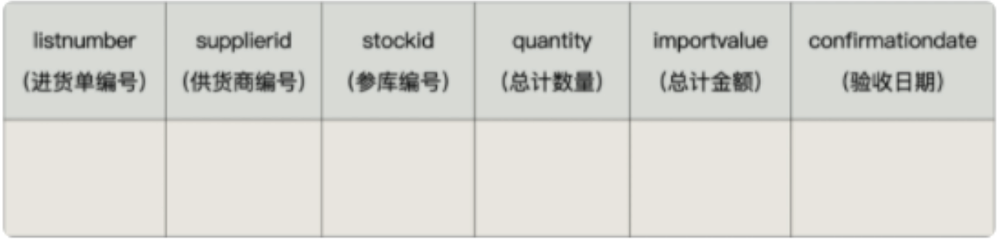
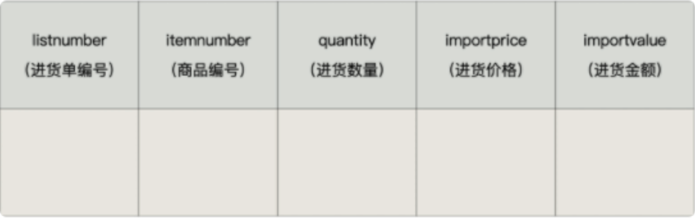
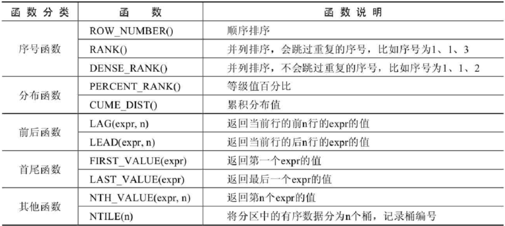
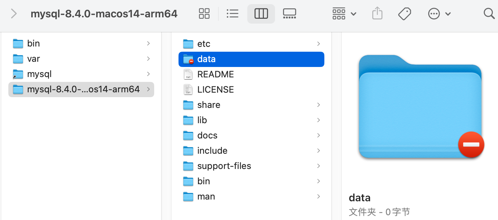

> <h1 id=""></h1>
- [**存储过程与函数**](#存储过程与函数)
	- [分类](#分类)
	- [存储过程举例](#存储过程举例) 
	- [调用过程](#调用过程)
- [**触发器**](#触发器)
	- [添加触发器](#添加触发器)
	- [查看、删除触发器](#查看、删除触发器)
	- [触发器的优缺点](#触发器的优缺点)
		- [优点](#优点) 
		- [缺点](#缺点)
- [**‌窗口函数**](#窗口函数)
	- [窗口函数分类](#窗口函数分类)
		- [语法结构](#语法结构) 
		- [分类讲解](#分类讲解) 
		- [序号函数ROW_NUMBER()](#序号函数ROW_NUMBER()) 
		- [RANK()函数](#RANK()函数)
- [mysql支持的字符集](#mysql支持的字符集)
- [**MySQL数据目录**](#MySQL数据目录)
	- [查看默认的数据库](#查看默认的数据库) 
	- [数据库在文件系统中的表示](#数据库在文件系统中的表示) 
	- [InnoDB存储引擎模式](#InnoDB存储引擎模式) 
	- [总结](#总结) 
	- [视图在文件系统中的表示](#视图在文件系统中的表示)
- [**用户管理与权限**](#用户管理与权限)

<br/><br/><br/>

***
<br/>
> <h1 id="存储过程与函数">存储过程与函数</h1>
MySQL从5.0版本开始支持存储过程和函数。存储过程和函数能够将复杂的SQL逻辑封装在一起，应用程序无须关注存储过程和函数内部复杂的SQL逻辑，而只需要简单地调用存储过程和函数即可。

<br/>

**含义**：存储过程的英文是 `Stored Procedure`。它的思想很简单，就是一组经过`预先编译`的 SQL 语句的封装。

**执行过程：** 存储过程预先存储在 MySQL 服务器上，需要执行的时候，客户端只需要向服务器端发出调用存储过程的命令，服务器端就可以把预先存储好的这一系列 SQL 语句全部执行。

<br/>

- **好处**：
	- 1、简化操作，提高了sql语句的重用性，减少了开发程序员的压力
	- 2、减少操作过程中的失误，提高效率
	- 3、减少网络传输量（客户端不需要把所有的 SQL 语句通过网络发给服务器）
	- 4、减少了 SQL 语句暴露在网上的风险，也提高了数据查询的安全性

<br/>

**和视图、函数的对比**：

它和视图有着同样的优点，清晰、安全，还可以减少网络传输量。不过它和视图不同，视图是`虚拟表`，通常不对底层数据表直接操作，而存储过程是程序化的 SQL，可以`直接操作底层数据表`，相比于面向集合的操作方式，能够实现一些更复杂的数据处理。

一旦存储过程被创建出来，使用它就像使用函数一样简单，我们直接通过调用存储过程名即可。相较于函数，存储过程是`没有返回值`的。

***
<br/><br/><br/>
> <h2 id="分类">分类</h2>
存储过程的参数类型可以是IN、OUT和INOUT。根据这点分类如下：

- 1、没有参数（无参数无返回）
- 2、仅仅带 IN 类型（有参数无返回）
- 3、仅仅带 OUT 类型（无参数有返回）
- 4、既带 IN 又带 OUT（有参数有返回）
- 5、带 INOUT（有参数有返回）

注意：IN、OUT、INOUT 都可以在一个存储过程中带多个。

<br/>

**语法:**

```sql
CREATE PROCEDURE 存储过程名(IN|OUT|INOUT 参数名 参数类型,...)
[characteristics ...]
BEGIN
	存储过程体

END
```

**说明:**

**1、参数前面的符号的意思**

- `IN`：当前参数为输入参数，也就是表示入参；

  存储过程只是读取这个参数的值。如果没有定义参数种类，`默认就是 IN`，表示输入参数。

- `OUT`：当前参数为输出参数，也就是表示出参；

  执行完成之后，调用这个存储过程的客户端或者应用程序就可以读取这个参数返回的值了。

- `INOUT`：当前参数既可以为输入参数，也可以为输出参数。

<br/>

**2、形参类型可以是 MySQL数据库中的任意类型。**

**3、`characteristics` 表示创建存储过程时指定的对存储过程的约束条件，其取值信息如下：**

```mysql
LANGUAGE SQL
| [NOT] DETERMINISTIC
| { CONTAINS SQL | NO SQL | READS SQL DATA | MODIFIES SQL DATA }
| SQL SECURITY { DEFINER | INVOKER }
| COMMENT 'string'
```

- `LANGUAGE SQL`：说明存储过程执行体是由SQL语句组成的，当前系统支持的语言为SQL。
- `[NOT] DETERMINISTIC`：指明存储过程执行的结果是否确定。DETERMINISTIC表示结果是确定的。每次执行存储过程时，相同的输入会得到相同的输出。NOT DETERMINISTIC表示结果是不确定的，相同的输入可能得到不同的输出。如果没有指定任意一个值，默认为NOT DETERMINISTIC。
- `{ CONTAINS SQL | NO SQL | READS SQL DATA | MODIFIES SQL DATA }`：指明子程序使用SQL语句的限制。
  - CONTAINS SQL表示当前存储过程的子程序包含SQL语句，但是并不包含读写数据的SQL语句；
  - NO SQL表示当前存储过程的子程序中不包含任何SQL语句；
  - READS SQL DATA表示当前存储过程的子程序中包含读数据的SQL语句；
  - MODIFIES SQL DATA表示当前存储过程的子程序中包含写数据的SQL语句。
  - 默认情况下，系统会指定为CONTAINS SQL。
- `SQL SECURITY { DEFINER | INVOKER }`：执行当前存储过程的权限，即指明哪些用户能够执行当前存储过程。
  - `DEFINER`表示只有当前存储过程的创建者或者定义者才能执行当前存储过程；
  - `INVOKER`表示拥有当前存储过程的访问权限的用户能够执行当前存储过程。
  - 如果没有设置相关的值，则MySQL默认指定值为DEFINER。
- `COMMENT 'string'`：注释信息，可以用来描述存储过程。

<br/>

**4、存储过程体中可以有多条 SQL 语句，如果仅仅一条SQL 语句，则可以省略 BEGIN 和 END**

***
<br/><br/>

存储过程体中可以有多条 SQL 语句，如果仅仅一条SQL 语句，则可以省略 BEGIN 和 END

编写存储过程并不是一件简单的事情，可能存储过程中需要复杂的 SQL 语句。

```mysql
1. BEGIN…END：BEGIN…END 中间包含了多个语句，每个语句都以（;）号为结束符。
2. DECLARE：DECLARE 用来声明变量，使用的位置在于 BEGIN…END 语句中间，而且需要在其他语句使用之前进行变量的声明。
3. SET：赋值语句，用于对变量进行赋值。
4. SELECT… INTO：把从数据表中查询的结果存放到变量中，也就是为变量赋值。
```

<br/>

**需要设置新的结束标记**

```mysql
DELIMITER 新的结束标记
```

因为MySQL默认的语句结束符号为分号‘;’。为了避免与存储过程中SQL语句结束符相冲突，需要使用DELIMITER改变存储过程的结束符。

比如：“DELIMITER //”语句的作用是将MySQL的结束符设置为//，并以“END //”结束存储过程。存储过程定义完毕之后再使用“DELIMITER ;”恢复默认结束符。DELIMITER也可以指定其他符号作为结束符。

当使用DELIMITER命令时，应该避免使用反斜杠（‘\’）字符，因为反斜线是MySQL的转义字符。

<br/>

**示例:**

```sql
DELIMITER $

CREATE PROCEDURE 存储过程名(IN|OUT|INOUT 参数名  参数类型,...)
[characteristics ...]
BEGIN
	sql语句1;
	sql语句2;

END $
```

***
<br/><br/><br/>
> <h2 id="存储过程举例">存储过程举例</h2>
**举例1：** 创建存储过程:

**select_all_data()**，查看 emps 表的所有数据

```sql
DELIMITER $

CREATE PROCEDURE select_all_data()
BEGIN
	SELECT * FROM emps;
	
END $

DELIMITER ;
```

<br/>

**举例2：创建存储过程**

`avg_employee_salary()，`返回所有员工的平均工资

```sql
DELIMITER //

CREATE PROCEDURE avg_employee_salary ()
BEGIN
	SELECT AVG(salary) AS avg_salary FROM emps;
END //

DELIMITER ;
```

<br/>

**举例3：创建**存储过程

`show_max_salary()`，用来查看“emps”表的最高薪资值。

```sql
CREATE PROCEDURE show_max_salary()
	LANGUAGE SQL
	NOT DETERMINISTIC
	CONTAINS SQL
	SQL SECURITY DEFINER
	COMMENT '查看最高薪资'
	BEGIN
		SELECT MAX(salary) FROM emps;
	END //

DELIMITER ;
```

<br/>

**举例4：** 创建存储过程show_min_salary()，查看“emps”表的最低薪资值。并将最低薪资通过OUT参数“ms”输出

```sql
DELIMITER //

CREATE PROCEDURE show_min_salary(OUT ms DOUBLE)
	BEGIN
		SELECT MIN(salary) INTO ms FROM emps;
	END //

DELIMITER ;
```

<br/>

**举例5：** 创建存储过程`show_someone_salary()`，查看“emps”表的某个员工的薪资，并用IN参数empname输入员工姓名。

```sql
CREATE PROCEDURE show_someone_salary(IN empname VARCHAR(20))
	BEGIN
		SELECT salary FROM emps WHERE ename = empname;
	END //

DELIMITER ;
```

<br/>

**举例6**：创建存储过程show_someone_salary2()，查看“emps”表的某个员工的薪资，并用IN参数empname输入员工姓名，用OUT参数empsalary输出员工薪资。

```sql
DELIMITER //

CREATE PROCEDURE show_someone_salary2(IN empname VARCHAR(20),OUT empsalary DOUBLE)
	BEGIN
		SELECT salary INTO empsalary FROM emps WHERE ename = empname;
	END //

DELIMITER ;
```

<br/>

**举例7：** 创建存储过程show_mgr_name()，查询某个员工领导的姓名，并用INOUT参数“empname”输入员工姓名，输出领导的姓名。

```sql
DELIMITER //

CREATE PROCEDURE show_mgr_name(INOUT empname VARCHAR(20))
	BEGIN
		SELECT ename INTO empname FROM emps
		WHERE eid = (SELECT MID FROM emps WHERE ename=empname);
	END //

DELIMITER ;
```

<br/><br/>
> <h3 id="调用过程">调用过程</h3>

**调用格式**

存储过程有多种调用方法。存储过程必须使用CALL语句调用，并且存储过程和数据库相关，如果要执行其他数据库中的存储过程，需要指定数据库名称，例如CALL dbname.procname。

```mysql
CALL 存储过程名(实参列表)
```

<br/>

**格式：**

1、调用in模式的参数：

```mysql
CALL sp1('值');
```

<br/>

2、调用out模式的参数：

```sql
SET @name;
CALL sp1(@name);
SELECT @name;
```

<br/>
3、调用inout模式的参数：

```sql
SET @name=值;
CALL sp1(@name);
SELECT @name;
```

<br/>

**举例1：**

```sql
DELIMITER //

CREATE PROCEDURE CountProc(IN sid INT,OUT num INT)
BEGIN
	SELECT COUNT(*) INTO num FROM fruits 
	WHERE s_id = sid;
END //

DELIMITER ;
```

<br/>

调用存储过程：

```sql
mysql> CALL CountProc (101, @num);
Query OK, 1 row affected (0.00 sec)
```

<br/>

查看返回结果：

```sql
mysql> SELECT @num;
```
该存储过程返回了指定 s_id=101 的水果商提供的水果种类，返回值存储在num变量中，使用SELECT查看，返回结果为3。

<br/>

**举例2：** 创建存储过程，实现累加运算，计算 1+2+…+n 等于多少。具体的代码如下：

```sql
DELIMITER //
CREATE PROCEDURE `add_num`(IN n INT)
BEGIN
       DECLARE i INT;
       DECLARE sum INT;
       
       SET i = 1;
       SET sum = 0;
       WHILE i <= n DO
              SET sum = sum + i;
              SET i = i +1;
       END WHILE;
       SELECT sum;
END //
DELIMITER ;
```

如果你用的是 Navicat 工具，那么在编写存储过程的时候，Navicat 会自动设置 DELIMITER 为其他符号，我们不需要再进行 DELIMITER 的操作。

直接使用 `CALL add_num(50);`即可。这里我传入的参数为 50，也就是统计 1+2+…+50 的积累之和。

***
<br/><br/><br/>
> <h2 id="如何调试">如何调试</h2>

在 MySQL 中，存储过程不像普通的编程语言（比如 VC++、Java 等）那样有专门的集成开发环境。因此，你可以通过 SELECT 语句，把程序执行的中间结果查询出来，来调试一个 SQL 语句的正确性。调试成功之后，把 SELECT 语句后移到下一个 SQL 语句之后，再调试下一个 SQL 语句。这样`逐步推进`，就可以完成对存储过程中所有操作的调试了。当然，你也可以把存储过程中的 SQL 语句复制出来，逐段单独调试。


<br/><br/><br/>

***
<br/>

> <h1 id="触发器">触发器</h1>

**引子:** 在实际开发中，我们经常会遇到这样的情况：有 2 个或者多个相互关联的表，如商品信息和库存信息分别存放在 2 个不同的数据表中，我们在添加一条新商品记录的时候，为了保证数据的完整性，必须同时在库存表中添加一条库存记录。

这样一来，我们就必须把这两个关联的操作步骤写到程序里面，而且要用事务包裹起来，确保这两个操作成为一个原子操作，要么全部执行，要么全部不执行。要是遇到特殊情况，可能还需要对数据进行手动维护，这样就很容易忘记其中的一步，导致数据缺失。

这个时候，咱们可以使用触发器。**你可以创建一个触发器，让商品信息数据的插入操作自动触发库存数据的插入操作。**这样一来，就不用担心因为忘记添加库存数据而导致的数据缺失了。

<br/>

**概述:** 

触发器是由事件来触发某个操作，这些事件包括INSERT、UPDATE、DELETE事件。所谓事件就是指用户的动作或者触发某项行为。如果定义了触发程序，当数据库执行这些语句时候，就相当于事件发生了，就会自动激发触发器执行相应的操作。

当对数据表中的数据执行插入、更新和删除操作，需要自动执行一些数据库逻辑时，可以使用触发器来实现。

<br/>

**触发器语法:**

```sql
CREATE TRIGGER 触发器名称 
{BEFORE|AFTER} {INSERT|UPDATE|DELETE} ON 表名 
FOR EACH ROW 
触发器执行的语句块;
```

**说明：**

- `表名`：表示触发器监控的对象。
- `BEFORE|AFTER`：表示触发的时间。BEFORE 表示在事件之前触发；AFTER 表示在事件之后触发。
- `INSERT|UPDATE|DELETE`：表示触发的事件。
  - INSERT 表示插入记录时触发；
  - UPDATE 表示更新记录时触发；
  - DELETE 表示删除记录时触发。

- `触发器执行的语句块`：可以是单条SQL语句，也可以是由BEGIN…END结构组成的复合语句块。

***
<br/><br/><br/>
> <h2 id="添加触发器">添加触发器</h2>


**举例1：**

1、创建数据表：

```mysql
CREATE TABLE test_trigger (
id INT PRIMARY KEY AUTO_INCREMENT,
t_note VARCHAR(30)
);


CREATE TABLE test_trigger_log (
id INT PRIMARY KEY AUTO_INCREMENT,
t_log VARCHAR(30)
);
```

<br/>
2、创建触发器：创建名称为before_insert的触发器，向test_trigger数据表插入数据之前，向test_trigger_log数据表中插入before_insert的日志信息。

```mysql
DELIMITER //

CREATE TRIGGER before_insert
BEFORE INSERT ON test_trigger 
FOR EACH ROW
BEGIN
	INSERT INTO test_trigger_log (t_log)
	VALUES('before_insert');

END //

DELIMITER ;
```

<br/>
3、向test_trigger数据表中插入数据

```mysql
INSERT INTO test_trigger (t_note) VALUES ('测试 BEFORE INSERT 触发器');
```

<br/>
4、查看test_trigger_log数据表中的数据

```mysql
mysql> SELECT * FROM test_trigger_log;
+----+---------------+
| id | t_log         |
+----+---------------+
|  1 | before_insert |
+----+---------------+
1 row in set (0.00 sec)
```

<br/><br/>

**举例2：**

1、创建名称为after_insert的触发器，向test_trigger数据表插入数据之后，向test_trigger_log数据表中插入after_insert的日志信息。

```mysql
DELIMITER //

CREATE TRIGGER after_insert
AFTER INSERT ON test_trigger
FOR EACH ROW
BEGIN
	INSERT INTO test_trigger_log (t_log)
	VALUES('after_insert');
END //

DELIMITER ;
```

<br/>
2、向test_trigger数据表中插入数据。

```mysql
INSERT INTO test_trigger (t_note) VALUES ('测试 AFTER INSERT 触发器');
```

<br/>
3、查看test_trigger_log数据表中的数据

```mysql
mysql> SELECT * FROM test_trigger_log;
+----+---------------+
| id | t_log         |
+----+---------------+
|  1 | before_insert |
|  2 | before_insert |
|  3 | after_insert  |
+----+---------------+
3 rows in set (0.00 sec)
```

<br/><br/>

**举例3：** 定义触发器“salary_check_trigger”，基于员工表“employees”的INSERT事件，在INSERT之前检查将要添加的新员工薪资是否大于他领导的薪资，如果大于领导薪资，则报sqlstate_value为'HY000'的错误，从而使得添加失败。

```mysql
DELIMITER //

CREATE TRIGGER salary_check_trigger
BEFORE INSERT ON employees FOR EACH ROW
BEGIN
-- 添加的那条数据就是NEW,删除的数据是OLD
-- 声明mgrsalary变量,将查询到的值,放入到这个变量中
	DECLARE mgrsalary DOUBLE; 
	SELECT salary INTO mgrsalary FROM employees WHERE employee_id = NEW.manager_id;

-- 添加成功,依然触发了触发器
	IF NEW.salary > mgrsalary THEN
		SIGNAL SQLSTATE 'HY000' SET MESSAGE_TEXT = '薪资高于领导薪资错误';
	END IF;
END //

DELIMITER ;
```
上面触发器声明过程中的NEW关键字代表INSERT添加语句的新记录。
<br/>

没有触发触发器,插入数据成功!

```sql
INSERT INTO employees(employee_id, last_name, email, hire_date, job_id, salary, manager_id)
VALUES(300, "陈平安", "chenPingAn@gmail.com", CURDATE(), "XuaHjJzfCs", 260, 293);

|         300 | NULL                 | 陈平安               | chenPingAn@gmail.com      | NULL           | 2025-04-02 | XuaHjJzfCs |  260.00 |           NULL |        293 |          NULL |
```

<br/>

**触发了触发器,没有插入数据:**

```sql
INSERT INTO employees(employee_id, last_name, email, hire_date, job_id, salary, manager_id)
VALUES(303, "阮秀1", "ruanXiu1@gmail.com", CURDATE(), "Q7vmbrrubi", 3100, 3);

ERROR 1644 (HY000): 薪资高于领导薪资错误
```

***
<br/><br/><br/>
> <h2 id="查看、删除触发器">查看、删除触发器</h2>
查看触发器是查看数据库中已经存在的触发器的定义、状态和语法信息等。

<br/>

方式1：查看当前数据库的所有触发器的定义

```mysql
SHOW TRIGGERS\G

*************************** 1. row ***************************
             Trigger: salary_check_trigger
               Event: INSERT
               Table: employees
           Statement: BEGIN
-- 添加的那条数据就是NEW,删除的数据是OLD
-- 声明mgrsalary变量,将查询到的值,放入到这个变量中
	DECLARE mgrsalary DOUBLE; 
	SELECT salary INTO mgrsalary FROM employees WHERE employee_id = NEW.manager_id;

	IF NEW.salary > mgrsalary THEN
		SIGNAL SQLSTATE 'HY000' SET MESSAGE_TEXT = '薪资高于领导薪资错误';
	END IF;
END
              Timing: BEFORE
             Created: 2025-04-02 15:21:16.50
            sql_mode: ONLY_FULL_GROUP_BY,STRICT_TRANS_TABLES,NO_ZERO_IN_DATE,NO_ZERO_DATE,ERROR_FOR_DIVISION_BY_ZERO,NO_ENGINE_SUBSTITUTION
             Definer: root@localhost
character_set_client: utf8mb4
collation_connection: utf8mb4_0900_ai_ci
  Database Collation: utf8mb4_0900_ai_ci
*************************** 2. row ***************************
             Trigger: before_insert
               Event: INSERT
               Table: test_trigger
           Statement: BEGIN
		INSERT INTO test_trigger_log(t_log)
		VALUES("before_insert ....");
END
              Timing: BEFORE
             Created: 2025-04-02 15:09:28.89
            sql_mode: ONLY_FULL_GROUP_BY,STRICT_TRANS_TABLES,NO_ZERO_IN_DATE,NO_ZERO_DATE,ERROR_FOR_DIVISION_BY_ZERO,NO_ENGINE_SUBSTITUTION
             Definer: root@localhost
character_set_client: utf8mb4
collation_connection: utf8mb4_0900_ai_ci
  Database Collation: utf8mb4_0900_ai_ci
2 rows in set (0.00 sec)

ERROR: 
No query specified
```

<br/>

方式2：查看当前数据库中某个触发器的定义

```mysql
SHOW CREATE TRIGGER 触发器名
```

如:

```sql
SHOW CREATE TRIGGER salary_check_trigger;
+----------------------+-----------------------------------------------------------------------------------------------------------------------+-----------------------------------------------------------------------------------------------------------------------------------------------------------------------------------------------------------------------------------------------------------------------------------------------------------------------------------------------------------------------------------------------------------------------------------------------------------------------------------------+----------------------+----------------------+--------------------+------------------------+
| Trigger              | sql_mode                                                                                                              | SQL Original Statement                                                                                                                                                                                                                                                                                                                                                                                                                                                                  | character_set_client | collation_connection | Database Collation | Created                |
+----------------------+-----------------------------------------------------------------------------------------------------------------------+-----------------------------------------------------------------------------------------------------------------------------------------------------------------------------------------------------------------------------------------------------------------------------------------------------------------------------------------------------------------------------------------------------------------------------------------------------------------------------------------+----------------------+----------------------+--------------------+------------------------+
| salary_check_trigger | ONLY_FULL_GROUP_BY,STRICT_TRANS_TABLES,NO_ZERO_IN_DATE,NO_ZERO_DATE,ERROR_FOR_DIVISION_BY_ZERO,NO_ENGINE_SUBSTITUTION | CREATE DEFINER=`root`@`localhost` TRIGGER `salary_check_trigger` BEFORE INSERT ON `employees` FOR EACH ROW BEGIN
-- 添加的那条数据就是NEW,删除的数据是OLD
-- 声明mgrsalary变量,将查询到的值,放入到这个变量中
	DECLARE mgrsalary DOUBLE; 
	SELECT salary INTO mgrsalary FROM employees WHERE employee_id = NEW.manager_id;

	IF NEW.salary > mgrsalary THEN
		SIGNAL SQLSTATE 'HY000' SET MESSAGE_TEXT = '薪资高于领导薪资错误';
	END IF;
END                                            | utf8mb4              | utf8mb4_0900_ai_ci   | utf8mb4_0900_ai_ci | 2025-04-02 15:21:16.50 |
+----------------------+-----------------------------------------------------------------------------------------------------------------------+-----------------------------------------------------------------------------------------------------------------------------------------------------------------------------------------------------------------------------------------------------------------------------------------------------------------------------------------------------------------------------------------------------------------------------------------------------------------------------------------+----------------------+----------------------+--------------------+------------------------+
1 row in set (0.00 sec)
```

<br/>

方式3：从系统库information_schema的TRIGGERS表中查询“salary_check_trigger”触发器的信息。

```mysql
SELECT * FROM information_schema.TRIGGERS;
```

<br/><br/>

**删除触发器**

触发器也是数据库对象，删除触发器也用DROP语句，语法格式如下：

```sql
DROP TRIGGER  IF EXISTS 触发器名称;
```

***
<br/><br/><br/>
> <h2 id="触发器的优缺点">触发器的优缺点</h2>
<br/>

> <h3 id="优点">优点</h3>

**1、触发器可以确保数据的完整性**。

假设我们用`进货单头表`（demo.importhead）来保存进货单的总体信息，包括进货单编号、供货商编号、仓库编号、总计进货数量、总计进货金额和验收日期。




用`进货单明细表`（demo.importdetails）来保存进货商品的明细，包括进货单编号、商品编号、进货数量、进货价格和进货金额。



每当我们录入、删除和修改一条进货单明细数据的时候，进货单明细表里的数据就会发生变动。这个时候，在进货单头表中的总计数量和总计金额就必须重新计算，否则，进货单头表中的总计数量和总计金额就不等于进货单明细表中数量合计和金额合计了，这就是数据不一致。

为了解决这个问题，我们就可以使用触发器，**规定每当进货单明细表有数据插入、修改和删除的操作时，自动触发 2 步操作：**

1）重新计算进货单明细表中的数量合计和金额合计；

2）用第一步中计算出来的值更新进货单头表中的合计数量与合计金额。

这样一来，进货单头表中的合计数量与合计金额的值，就始终与进货单明细表中计算出来的合计数量与合计金额的值相同，数据就是一致的，不会互相矛盾。

<br/>

**2、触发器可以帮助我们记录操作日志。**

利用触发器，可以具体记录什么时间发生了什么。比如，记录修改会员储值金额的触发器，就是一个很好的例子。这对我们还原操作执行时的具体场景，更好地定位问题原因很有帮助。

<br/>

**3、触发器还可以用在操作数据前，对数据进行合法性检查。**

比如，超市进货的时候，需要库管录入进货价格。但是，人为操作很容易犯错误，比如说在录入数量的时候，把条形码扫进去了；录入金额的时候，看串了行，录入的价格远超售价，导致账面上的巨亏……这些都可以通过触发器，在实际插入或者更新操作之前，对相应的数据进行检查，及时提示错误，防止错误数据进入系统。

<br/><br/>
> <h3 id="缺点">缺点</h3>
**1、触发器最大的一个问题就是可读性差。**

因为触发器存储在数据库中，并且由事件驱动，这就意味着触发器有可能`不受应用层的控制`。这对系统维护是非常有挑战的。

比如，创建触发器用于修改会员储值操作。如果触发器中的操作出了问题，会导致会员储值金额更新失败。我用下面的代码演示一下：

```mysql
mysql> update demo.membermaster set memberdeposit=20 where memberid = 2;
ERROR 1054 (42S22): Unknown column 'aa' in 'field list'
```

结果显示，系统提示错误，字段“aa”不存在。

这是因为，触发器中的数据插入操作多了一个字段，系统提示错误。可是，如果你不了解这个触发器，很可能会认为是更新语句本身的问题，或者是会员信息表的结构出了问题。说不定你还会给会员信息表添加一个叫“aa”的字段，试图解决这个问题，结果只能是白费力。

<br/>

**2、相关数据的变更，可能会导致触发器出错。**

特别是数据表结构的变更，都可能会导致触发器出错，进而影响数据操作的正常运行。这些都会由于触发器本身的隐蔽性，影响到应用中错误原因排查的效率。

<br/><br/>

**注意点**

&emsp; 注意，如果在子表中定义了外键约束，并且外键指定了ON UPDATE/DELETE CASCADE/SET NULL子句，此时修改父表被引用的键值或删除父表被引用的记录行时，也会引起子表的修改和删除操作，此时基于子表的UPDATE和DELETE语句定义的触发器并不会被激活。

&emsp; 例如：基于子表员工表（t_employee）的DELETE语句定义了触发器t1，而子表的部门编号（did）字段定义了外键约束引用了父表部门表（t_department）的主键列部门编号（did），并且该外键加了“ON DELETE SET NULL”子句，那么如果此时删除父表部门表（t_department）在子表员工表（t_employee）有匹配记录的部门记录时，会引起子表员工表（t_employee）匹配记录的部门编号（did）修改为NULL，但是此时不会激活触发器t1。只有直接对子表员工表（t_employee）执行DELETE语句时才会激活触发器t1。

<br/><br/><br/>

***
<br/>
> <h1 id="窗口函数">窗口函数</h1>

```sql
CREATE TABLE sales(
	id INT PRIMARY KEY AUTO_INCREMENT,
	city VARCHAR(15),
	county VARCHAR(15),
	sales_value DECIMAL
);

INSERT INTO sales(city,county,sales_value)
VALUES
('北京','海淀',10.00),
('北京','朝阳',20.00),
('上海','黄埔',30.00),
('上海','长宁',10.00);
```

<br/>

**需求：** 现在计算这个网站在每个城市的销售总额、在全国的销售总额、每个区的销售额占所在城市销售额中的比率，以及占总销售额中的比率。

**如果用分组和聚合函数，就需要分好几步来计算。**

第一步，计算总销售金额，并存入临时表 a：

```mysql
CREATE TEMPORARY TABLE a       -- 创建临时表
SELECT SUM(sales_value) AS sales_value -- 计算总计金额
FROM sales;
```
<br/>
查看一下临时表 a ：

```mysql
mysql> SELECT * FROM a;
+-------------+
| sales_value |
+-------------+
|          70 |
+-------------+
1 row in set (0.00 sec)
```
<br/>
第二步，计算每个城市的销售总额并存入临时表 b：

```mysql
CREATE TEMPORARY TABLE b    -- 创建临时表
SELECT city,SUM(sales_value) AS sales_value  -- 计算城市销售合计
FROM sales
GROUP BY city;
```
<br/>
查看临时表 b ：

```mysql
mysql> SELECT * FROM b;
+------+-------------+
| city | sales_value |
+------+-------------+
| 北京 |          30 |
| 上海 |          40 |
+------+-------------+
2 rows in set (0.00 sec)
```
<br/>

第三步，计算各区的销售占所在城市的总计金额的比例，和占全部销售总计金额的比例。我们可以通过下面的连接查询获得需要的结果：

```mysql
SELECT s.city AS 城市,s.county AS 区,s.sales_value AS 区销售额,
b.sales_value AS 市销售额,s.sales_value/b.sales_value AS 市比率,
a.sales_value AS 总销售额,s.sales_value/a.sales_value AS 总比率
FROM sales s
JOIN b ON (s.city=b.city) -- 连接市统计结果临时表
JOIN a                   -- 连接总计金额临时表
ORDER BY s.city,s.county;

+--------+--------+--------------+--------------+-----------+--------------+-----------+
| 城市   | 区     | 区销售额     | 市销售额     | 市比率    | 总销售额     | 总比率    |
+--------+--------+--------------+--------------+-----------+--------------+-----------+
| 上海   | 长宁   |           10 |           40 |    0.2500 |           70 |    0.1429 |
| 上海   | 黄埔   |           30 |           40 |    0.7500 |           70 |    0.4286 |
| 北京   | 朝阳   |           20 |           30 |    0.6667 |           70 |    0.2857 |
| 北京   | 海淀   |           10 |           30 |    0.3333 |           70 |    0.1429 |
+--------+--------+--------------+--------------+-----------+--------------+-----------+
4 rows in set (0.00 sec)
```
结果显示：市销售金额、市销售占比、总销售金额、总销售占比都计算出来了
<br/><br/>

**采用窗口函数来做:**

```sql
SELECT city AS 城市,county AS 区,sales_value AS 区销售额,
SUM(sales_value) OVER(PARTITION BY city) AS 市销售额,  -- 计算市销售额
sales_value/SUM(sales_value) OVER(PARTITION BY city) AS 市比率,
SUM(sales_value) OVER() AS 总销售额,   -- 计算总销售额
sales_value/SUM(sales_value) OVER() AS 总比率
FROM sales
ORDER BY city,county;

+--------+--------+--------------+--------------+-----------+--------------+-----------+
| 城市   | 区     | 区销售额     | 市销售额     | 市比率    | 总销售额     | 总比率    |
+--------+--------+--------------+--------------+-----------+--------------+-----------+
| 上海   | 长宁   |           10 |           40 |    0.2500 |           70 |    0.1429 |
| 上海   | 黄埔   |           30 |           40 |    0.7500 |           70 |    0.4286 |
| 北京   | 朝阳   |           20 |           30 |    0.6667 |           70 |    0.2857 |
| 北京   | 海淀   |           10 |           30 |    0.3333 |           70 |    0.1429 |
+--------+--------+--------------+--------------+-----------+--------------+-----------+
```
结果显示，我们得到了与上面那种查询同样的结果。

使用窗口函数，只用了一步就完成了查询。而且，由于没有用到临时表，执行的效率也更高了。很显然，**在这种需要用到分组统计的结果对每一条记录进行计算的场景下，使用窗口函数更好**。


***
<br/><br/><br/>
> <h2 id="窗口函数分类">窗口函数分类</h2>
MySQL从8.0版本开始支持窗口函数。窗口函数的作用类似于在查询中对数据进行分组，不同的是，分组操作会把分组的结果聚合成一条记录，而窗口函数是将结果置于每一条数据记录中。

窗口函数可以分为`静态窗口函数`和`动态窗口函数`。

- 静态窗口函数的窗口大小是固定的，不会因为记录的不同而不同；
- 动态窗口函数的窗口大小会随着记录的不同而变化。

<br/>

窗口函数总体上可以分为序号函数、分布函数、前后函数、首尾函数和其他函数，如下表：



<br/><br/>
> <h3 id="语法结构">语法结构</h3>
窗口函数的语法结构是：

```mysql
函数 OVER（[PARTITION BY 字段名 ORDER BY 字段名 ASC|DESC]）
```

或者是：

```mysql
函数 OVER 窗口名 … WINDOW 窗口名 AS （[PARTITION BY 字段名 ORDER BY 字段名 ASC|DESC]）
```

- OVER 关键字指定函数窗口的范围。
  - 如果省略后面括号中的内容，则窗口会包含满足WHERE条件的所有记录，窗口函数会基于所有满足WHERE条件的记录进行计算。
  - 如果OVER关键字后面的括号不为空，则可以使用如下语法设置窗口。
- 窗口名：为窗口设置一个别名，用来标识窗口。
- PARTITION BY子句：指定窗口函数按照哪些字段进行分组。分组后，窗口函数可以在每个分组中分别执行。
- ORDER BY子句：指定窗口函数按照哪些字段进行排序。执行排序操作使窗口函数按照排序后的数据记录的顺序进行编号。
- FRAME子句：为分区中的某个子集定义规则，可以用来作为滑动窗口使用。

<br/><br/>
> <h3 id="分类讲解">分类讲解</h3>

**创建表：**

```mysql
CREATE TABLE goods(
	id INT PRIMARY KEY AUTO_INCREMENT,
	category_id INT,
	category VARCHAR(15),
	NAME VARCHAR(30),
	price DECIMAL(10,2),
	stock INT,
	upper_time DATETIME
);
```

<br/>

**插入数据:**

```sql
INSERT INTO goods(category_id,category,NAME,price,stock,upper_time)
VALUES
(1, '女装/女士精品', 'T恤', 39.90, 1000, '2020-11-10 00:00:00'),
(1, '女装/女士精品', '连衣裙', 79.90, 2500, '2020-11-10 00:00:00'),
(1, '女装/女士精品', '卫衣', 89.90, 1500, '2020-11-10 00:00:00'),
(1, '女装/女士精品', '牛仔裤', 89.90, 3500, '2020-11-10 00:00:00'),
(1, '女装/女士精品', '百褶裙', 29.90, 500, '2020-11-10 00:00:00'),
(1, '女装/女士精品', '呢绒外套', 399.90, 1200, '2020-11-10 00:00:00'),
(2, '户外运动', '自行车', 399.90, 1000, '2020-11-10 00:00:00'),
(2, '户外运动', '山地自行车', 1399.90, 2500, '2020-11-10 00:00:00'),
(2, '户外运动', '登山杖', 59.90, 1500, '2020-11-10 00:00:00'),
(2, '户外运动', '骑行装备', 399.90, 3500, '2020-11-10 00:00:00'),
(2, '户外运动', '运动外套', 799.90, 500, '2020-11-10 00:00:00'),
(2, '户外运动', '滑板', 499.90, 1200, '2020-11-10 00:00:00');

SELECT * FROM goods;

+----+-------------+---------------------+-----------------+---------+-------+---------------------+
| id | category_id | category            | NAME            | price   | stock | upper_time          |
+----+-------------+---------------------+-----------------+---------+-------+---------------------+
|  1 |           1 | 女装/女士精品       | T恤             |   39.90 |  1000 | 2020-11-10 00:00:00 |
|  2 |           1 | 女装/女士精品       | 连衣裙          |   79.90 |  2500 | 2020-11-10 00:00:00 |
|  3 |           1 | 女装/女士精品       | 卫衣            |   89.90 |  1500 | 2020-11-10 00:00:00 |
|  4 |           1 | 女装/女士精品       | 牛仔裤          |   89.90 |  3500 | 2020-11-10 00:00:00 |
|  5 |           1 | 女装/女士精品       | 百褶裙          |   29.90 |   500 | 2020-11-10 00:00:00 |
|  6 |           1 | 女装/女士精品       | 呢绒外套        |  399.90 |  1200 | 2020-11-10 00:00:00 |
|  7 |           2 | 户外运动            | 自行车          |  399.90 |  1000 | 2020-11-10 00:00:00 |
|  8 |           2 | 户外运动            | 山地自行车      | 1399.90 |  2500 | 2020-11-10 00:00:00 |
|  9 |           2 | 户外运动            | 登山杖          |   59.90 |  1500 | 2020-11-10 00:00:00 |
| 10 |           2 | 户外运动            | 骑行装备        |  399.90 |  3500 | 2020-11-10 00:00:00 |
| 11 |           2 | 户外运动            | 运动外套        |  799.90 |   500 | 2020-11-10 00:00:00 |
| 12 |           2 | 户外运动            | 滑板            |  499.90 |  1200 | 2020-11-10 00:00:00 |
+----+-------------+---------------------+-----------------+---------+-------+---------------------+
12 rows in set (0.00 sec)
```

<br/><br/>
> <h3 id="序号函数ROW_NUMBER()">序号函数ROW_NUMBER()</h3>

ROW_NUMBER()函数能够对数据中的序号进行顺序显示。

**举例：查询 goods 数据表中每个商品分类下价格降序排列的各个商品信息。**

```mysql
SELECT ROW_NUMBER() OVER(PARTITION BY category_id ORDER BY price DESC) AS row_num,
id, category_id, category, NAME, price, stock
FROM goods;


+---------+----+-------------+---------------------+-----------------+---------+-------+
| row_num | id | category_id | category            | NAME            | price   | stock |
+---------+----+-------------+---------------------+-----------------+---------+-------+
|       1 |  6 |           1 | 女装/女士精品       | 呢绒外套        |  399.90 |  1200 |
|       2 |  3 |           1 | 女装/女士精品       | 卫衣            |   89.90 |  1500 |
|       3 |  4 |           1 | 女装/女士精品       | 牛仔裤          |   89.90 |  3500 |
|       4 |  2 |           1 | 女装/女士精品       | 连衣裙          |   79.90 |  2500 |
|       5 |  1 |           1 | 女装/女士精品       | T恤             |   39.90 |  1000 |
|       6 |  5 |           1 | 女装/女士精品       | 百褶裙          |   29.90 |   500 |
|       1 |  8 |           2 | 户外运动            | 山地自行车      | 1399.90 |  2500 |
|       2 | 11 |           2 | 户外运动            | 运动外套        |  799.90 |   500 |
|       3 | 12 |           2 | 户外运动            | 滑板            |  499.90 |  1200 |
|       4 |  7 |           2 | 户外运动            | 自行车          |  399.90 |  1000 |
|       5 | 10 |           2 | 户外运动            | 骑行装备        |  399.90 |  3500 |
|       6 |  9 |           2 | 户外运动            | 登山杖          |   59.90 |  1500 |
+---------+----+-------------+---------------------+-----------------+---------+-------+
12 rows in set (0.00 sec)
```

<br/>

举例：查询 goods 数据表中每个商品分类下价格最高的3种商品信息。

```mysql
SELECT *
FROM (
			SELECT ROW_NUMBER() OVER(PARTITION BY category_id ORDER BY price DESC) AS row_num,
			id, category_id, category, NAME, price, stock
			FROM goods) t
WHERE row_num <= 3;


+---------+----+-------------+---------------------+-----------------+---------+-------+
| row_num | id | category_id | category            | NAME            | price   | stock |
+---------+----+-------------+---------------------+-----------------+---------+-------+
|       1 |  6 |           1 | 女装/女士精品       | 呢绒外套        |  399.90 |  1200 |
|       2 |  3 |           1 | 女装/女士精品       | 卫衣            |   89.90 |  1500 |
|       3 |  4 |           1 | 女装/女士精品       | 牛仔裤          |   89.90 |  3500 |
|       1 |  8 |           2 | 户外运动            | 山地自行车      | 1399.90 |  2500 |
|       2 | 11 |           2 | 户外运动            | 运动外套        |  799.90 |   500 |
|       3 | 12 |           2 | 户外运动            | 滑板            |  499.90 |  1200 |
+---------+----+-------------+---------------------+-----------------+---------+-------+
6 rows in set (0.00 sec)
```

在名称为“女装/女士精品”的商品类别中，有两款商品的价格为89.90元，分别是卫衣和牛仔裤。两款商品的序号都应该为2，而不是一个为2，另一个为3。此时，可以使用RANK()函数和DENSE_RANK()函数解决。

<br/><br/>
> <h3 id="RANK()函数">RANK()函数</h3>
使用RANK()函数能够对序号进行并列排序，并且会跳过重复的序号，比如序号为1、1、3。

举例：使用RANK()函数获取 goods 数据表中各类别的价格从高到低排序的各商品信息。

```sql
SELECT RANK() OVER(PARTITION BY category_id ORDER BY price DESC) AS row_num,
id, category_id, category, NAME, price, stock
FROM goods;


+---------+----+-------------+---------------+------------+---------+-------+
| row_num | id | category_id | category      | NAME       | price   | stock |
+---------+----+-------------+---------------+------------+---------+-------+
|       1 |  6 |           1 | 女装/女士精品   | 呢绒外套    |  399.90 |  1200 |
|       2 |  3 |           1 | 女装/女士精品   | 卫衣        |   89.90 |  1500 |
|       2 |  4 |           1 | 女装/女士精品   | 牛仔裤      |   89.90 |  3500 |
|       4 |  2 |           1 | 女装/女士精品   | 连衣裙      |   79.90 |  2500 |
|       5 |  1 |           1 | 女装/女士精品   | T恤         |   39.90 |  1000 |
|       6 |  5 |           1 | 女装/女士精品   | 百褶裙      |   29.90 |   500 |
|       1 |  8 |           2 | 户外运动       | 山地自行车   | 1399.90 |  2500 |
|       2 | 11 |           2 | 户外运动       | 运动外套     |  799.90 |   500 |
|       3 | 12 |           2 | 户外运动       | 滑板        |  499.90 |  1200 |
|       4 |  7 |           2 | 户外运动       | 自行车      |  399.90 |  1000 |
|       4 | 10 |           2 | 户外运动       | 骑行装备    |  399.90 |  3500 |
|       6 |  9 |           2 | 户外运动       | 登山杖      |   59.90 |  1500 |
+---------+----+-------------+---------------+------------+---------+-------+
12 rows in set (0.00 sec)
```

<br/>

举例：使用RANK()函数获取 goods 数据表中类别为“女装/女士精品”的价格最高的4款商品信息。

```mysql
SELECT *
FROM(
		SELECT RANK() OVER(PARTITION BY category_id ORDER BY price DESC) AS row_num,
		id, category_id, category, NAME, price, stock
		FROM goods) t
WHERE category_id = 1 AND row_num <= 4;


+---------+----+-------------+---------------+----------+--------+-------+
| row_num | id | category_id | category      | NAME     | price  | stock |
+---------+----+-------------+---------------+----------+--------+-------+
|       1 |  6 |           1 | 女装/女士精品   | 呢绒外套  | 399.90 |  1200 |
|       2 |  3 |           1 | 女装/女士精品   | 卫衣      |  89.90 |  1500 |
|       2 |  4 |           1 | 女装/女士精品   | 牛仔裤    |  89.90 |  3500 |
|       4 |  2 |           1 | 女装/女士精品   | 连衣裙    |  79.90 |  2500 |
+---------+----+-------------+---------------+----------+--------+-------+
4 rows in set (0.00 sec)
```

可以看到，使用RANK()函数得出的序号为1、2、2、4，相同价格的商品序号相同，后面的商品序号是不连续的，跳过了重复的序号。


<br/><br/>
> <h3 id="mysql支持的字符集">mysql支持的字符集</h3>

```sql
show character set;

+----------+---------------------------------+---------------------+--------+
| Charset  | Description                     | Default collation   | Maxlen |
+----------+---------------------------------+---------------------+--------+
| armscii8 | ARMSCII-8 Armenian              | armscii8_general_ci |      1 |
| ascii    | US ASCII                        | ascii_general_ci    |      1 |
| big5     | Big5 Traditional Chinese        | big5_chinese_ci     |      2 |
| binary   | Binary pseudo charset           | binary              |      1 |
| cp1250   | Windows Central European        | cp1250_general_ci   |      1 |
| cp1251   | Windows Cyrillic                | cp1251_general_ci   |      1 |
| cp1256   | Windows Arabic                  | cp1256_general_ci   |      1 |
| cp1257   | Windows Baltic                  | cp1257_general_ci   |      1 |
| cp850    | DOS West European               | cp850_general_ci    |      1 |
| cp852    | DOS Central European            | cp852_general_ci    |      1 |
| cp866    | DOS Russian                     | cp866_general_ci    |      1 |
| cp932    | SJIS for Windows Japanese       | cp932_japanese_ci   |      2 |
| dec8     | DEC West European               | dec8_swedish_ci     |      1 |
| eucjpms  | UJIS for Windows Japanese       | eucjpms_japanese_ci |      3 |
| euckr    | EUC-KR Korean                   | euckr_korean_ci     |      2 |
| gb18030  | China National Standard GB18030 | gb18030_chinese_ci  |      4 |
| gb2312   | GB2312 Simplified Chinese       | gb2312_chinese_ci   |      2 |
| gbk      | GBK Simplified Chinese          | gbk_chinese_ci      |      2 |
| geostd8  | GEOSTD8 Georgian                | geostd8_general_ci  |      1 |
| greek    | ISO 8859-7 Greek                | greek_general_ci    |      1 |
| hebrew   | ISO 8859-8 Hebrew               | hebrew_general_ci   |      1 |
| hp8      | HP West European                | hp8_english_ci      |      1 |
| keybcs2  | DOS Kamenicky Czech-Slovak      | keybcs2_general_ci  |      1 |
| koi8r    | KOI8-R Relcom Russian           | koi8r_general_ci    |      1 |
| koi8u    | KOI8-U Ukrainian                | koi8u_general_ci    |      1 |
| latin1   | cp1252 West European            | latin1_swedish_ci   |      1 |
| latin2   | ISO 8859-2 Central European     | latin2_general_ci   |      1 |
| latin5   | ISO 8859-9 Turkish              | latin5_turkish_ci   |      1 |
| latin7   | ISO 8859-13 Baltic              | latin7_general_ci   |      1 |
| macce    | Mac Central European            | macce_general_ci    |      1 |
| macroman | Mac West European               | macroman_general_ci |      1 |
| sjis     | Shift-JIS Japanese              | sjis_japanese_ci    |      2 |
| swe7     | 7bit Swedish                    | swe7_swedish_ci     |      1 |
| tis620   | TIS620 Thai                     | tis620_thai_ci      |      1 |
| ucs2     | UCS-2 Unicode                   | ucs2_general_ci     |      2 |
| ujis     | EUC-JP Japanese                 | ujis_japanese_ci    |      3 |
| utf16    | UTF-16 Unicode                  | utf16_general_ci    |      4 |
| utf16le  | UTF-16LE Unicode                | utf16le_general_ci  |      4 |
| utf32    | UTF-32 Unicode                  | utf32_general_ci    |      4 |
| utf8mb3  | UTF-8 Unicode                   | utf8mb3_general_ci  |      3 |
| utf8mb4  | UTF-8 Unicode                   | utf8mb4_0900_ai_ci  |      4 |
+----------+---------------------------------+---------------------+--------+
41 rows in set (0.00 sec)
```


<br/><br/><br/>

***
<br/>

> <h1 id="MySQL数据目录">MySQL数据目录</h1>

**MySQL8的主要目录结构**

```shell
find / -name mysql
```

<br/>

数据库文件的存放路径

**MySQL数据库文件的存放路径：/var/lib/mysql**

`数据目录`对应系统变量`datadir`

```mysql
show variables like 'datadir';
+---------------+-----------------+
| Variable_name | Value           |
+---------------+-----------------+
| datadir       | /var/lib/mysql/ |
+---------------+-----------------+
```

<br/>

**配置文件目录**

**配置文件目录：/usr/share/mysql-8.0（命令及配置文件），/etc/mysql（如my.cnf）**

<br/>

**数据库和文件系统的关系:**

`文件系统`是操作系统用来管理磁盘的结构

**InnoDB**、**MyISAM**等存储引擎将`表存储在文件系统上`，负责数据的读取和写入.


***
<br/><br/><br/>
> <h2 id="查看默认的数据库">查看默认的数据库</h2>

```sql
SHOW DATABASES;
```

- **有4个数据库是属于MySQL自带的系统数据库:**

- **`mysql`**
	- MySQL系统自带的核心数据库，它存储了MySQL的用户账户和权限信息，一些存储过程、事件的定义信息，一些运行过程中产生的日志信息，一些帮助信息以及时区信息等。

	- **`information_schema`**
	-   MySQL系统自带的数据库，这个数据库保存着MySQL服务器`维护的所有其他数据库的信息`，比如有哪些表、哪些视图、哪些触发器、哪些列、哪些索引。这些信息并不是真实的用户数据，而是一些描述性信息，有时候也称之为`元数据`。在系统数据库`information_schema`中提供了一些以`innodb_sys`开头的表，用于表示内部系统表。

- **`performance_schema`**
	- MySQL 系统自带的数据库，这个数据库里主要保存MySQL服务器运行过程中的一些状态信息，可以用来`监控 MySQL 服务的各类性能指标`。包括统计最近执行了哪些语句，在执行过程的每个阶段都花费了多长时间，内存的使用情况等信息。
  
  
- **`sys`**
	- MySQL 系统自带的数据库，这个数据库主要是通过`视图`的形式把`information_schema`和
  `performance_schema`结合起来，帮助系统管理员和开发人员监控 MySQL 的技术性能。
  
  <br/><br/>
  > <h3 id="数据库在文件系统中的表示">数据库在文件系统中的表示</h3>
每个数据库都对应着数据目录下的一个子目录，或者说一个文件夹。

- 当使用`CREATE DATABASE 语句`新建数据库时。MySQL会做两件事:

	* 在数据目录下创建一个和数据库同名的子目录
	* 在与该数据库同名的子目录下创建一个名为`db.opt`的文件（仅限MySQL5.7及之前的版本），这个文件中包含了`该数据库的各种属性`，比如该数据库的字符集和比较规则

>除了`information_schema` 系统数据库外，其他的数据库在数据目录下都有对应的子目录。

<br/><br/>
> <h3 id="表在文件系统中的表示">表在文件系统中的表示</h3>

- 数据是以`记录的形式`插入到表中，每个表的信息可以分为两种:
	* 表的结构的定义
	* 表中的数据

`表结构`就是该表的名称，表里面有多少列，每个列的数据类型，约束条件和索引，使用的字符集和比较规则等信息，这些信息都体现在了建表语句中。

<br/><br/>
> <h3 id="InnoDB存储引擎模式">InnoDB存储引擎模式</h3>



因为Mac权限的原因,需要管理员通过命令才能打开,如下:

```sh
sudo ls /System/Volumes/Data/usr/local/mysql-8.4.0-macos14-arm64/data


ca-key.pem
ca.pem
client-cert.pem
client-key.pem
db_test
ib_buffer_pool
ibdata1
ibtmp1
mysql
mysql.ibd
mysql_upgrade_history
mysqld.local.err
performance_schema
private_key.pem
public_key.pem
server-cert.pem
server-key.pem
sys
undo_001
undo_002
```


- **1) 表结构**

为了保存表结构，`InnoDB`在`数据目录`下对应的数据库子目录下创建了一个专门用于`描述表结构的文件`

`表名.frm` form表单

`.frm文件`的格式在不同的平台上都是相同的。这个后缀名为.frm是以二进制格式存储的，直接打开是乱码的。

> MySQL8.0中不再单独提供`表名.frm`，而是合并在`表名.ibd`文件中。

<br/>

- **2) 表中数据和索引**

InnoDB是以页为基本单位来管理存储空间的

为了更好的管理页，InnoDB提出了一个`表空间`或者`文件空间`（英文名：`table space` 或者`file space`）的概念，表空间是一个抽象概念，它可以对应文件系统上一个或多个真实文件（不同表空间对应的文件数可能不同）。每一个`表空间`可以被划分为多个`页`，我们的表数据就存放在某个`表空间`下的某些页里。

<br/>

**表空间的类型**

**① 系统表空间（system tablespace）**

默认情况下，InnoDB会在数据目录下创建一个名为`ibdata1`、大小为`12M`的`自拓展`文件，这个文件就是对应的`系统表空间`在文件系统上的表示。

```properties
# 修改系统表空间文件名、文件数量、初始大小
[server]
innodb_data_file_path=data1:512M;data2:512M:autoextend
```

这样在MySQL启动之后，就会创建这两个512M大小的文件作为系统表空间，其中的`autoextend`表示这两个文件如果不够用会自动拓展`data2`文件的大小

在`一个MySQL服务器中，系统表空间只有一份`。从MySQL5.5.7到MySQL5.6.6之间的各个版本中，**表中的数据都会被默认存储到这个系统表空间中。**

<br/>

**② 独立表空间(file-per-table tablespace)** 

在MySQL5.6.6以及之后的版本中，InnoDB并不会默认的把各个表的数据存储到系统表空间中，而是为`每一个表建立一个独立表空间`，即创建了多少个表，就有多少个独立表空间。使用`独立表空间`来存储表数据的话，会在该表所属数据库对应的子目录下创建一个表示该独立表空间的文件，文件名和表名相同，文件后缀`.ibd` 

`表名.ibd` InnoDB Data

**比如:de_test数据库下的表:**

```sh
sudo ls /System/Volumes/Data/usr/local/mysql-8.4.0-macos14-arm64/data/db_test

blog_article.ibd	departments.ibd		employees.ibd		locations.ibd		test_article_tags.ibd	test_trigger_log.ibd
blog_auth.ibd		dept1.ibd		emps.ibd		sales.ibd		test_articles.ibd	user.ibd
blog_tag.ibd		depts.ibd		goods.ibd		sp_douban_movie.ibd	test_tags.ibd
countries.ibd		emp1.ibd		gorm_user.ibd		test1.ibd		test_trigger.ibd
```

<br/>

**③ 系统表空间与独立表空间的设置**

我们可以自己指定使用`系统表空间`还是`独立表空间`来存储数据，这个功能由启动参数`innodb_file_per_table`控制

```properties
[server] 
innodb_file_per_table=0 # 0：代表使用系统表空间； 1：代表使用独立表空间
```

默认情况

```mysql
mysql> show variables like 'innodb_file_per_table';
+-----------------------+-------+
| Variable_name         | Value |
+-----------------------+-------+
| innodb_file_per_table | ON    |
+-----------------------+-------+
```

`innodb_file_per_table`参数的修改只对新建的表起作用，对于已经分配了表空间的表不起作用。

<br/>
修改表所属的表空间

```mysql
#把已经存在系统表空间中的表转移到独立表空间
ALTER TABLE 表名 TABLESPACE [=] innodb_file_per_tables;
#把已经存在独立表空间中的表转移到系统表空间
ALTER TABLE 表名 TABLESPACE [=] innodb_system;
#其中等于号=可以省略
```

<br./>

**④ 其他类型的表空间**

随着MySQL的发展，除了上述两种老牌表空间之外，现在还新提出了一些不同类型的表空间，比如通用表空间（general tablespace）、临时表空间（temporary tablespace）等。

<br/>

- **3）.frm文件**

`.frm文件`在MySQL8中不存在，Oracle 官方将frm文件的信息以及更多的信息统称为序列化字典信息（Serialized Dictionary Information，SDI），并将SDI写在ibd文件内部。

Oracle提供了一个应用程序**ibd2sdi**，可以从IBD文件中提取SDI信息。

<br/>

**查看表结构**

到存储ibd文件的目录下，执行以下命令

命令执行后，ibd2sdi会将ibd文件里存储的表结构以json的格式保存在txt文件中

```shell
ibd2sdi --dump-file=student.txt student.ibd
more student.txt
```

<br/><br/>
> <h3 id="总结">总结</h3>

- **1）InnoDB**
	- 表结构 .frm mysql8.0不存在，合并到.ibd文件中
	- 表数据和索引
		- 系统表空间 ibdata1
		- 独立表空间 .ibd
	- db.opt 数据库相关信息，比如字符集和比较规则 mysql8.0不存在

<br/>

- **2）MyISAM**
	- 表结构
		- MySQL5.7 .frm
		- MySQL8.0 .sdi
	- 表数据信息 .MYD
	- 表数据索引 .MYI

<br/><br/>
> <h3 id="视图在文件系统中的表示">视图在文件系统中的表示</h3>
`视图`是`虚拟的表`，不存储真实的数据，只存储结构。

和表一样，描述视图结构的文件也会被存储到所属数据库对应的子目录下，只存储一个`视图名.frm `文件。

<br/><br/>
> <h3 id="其他的文件">其他的文件</h3>
为了更好的运行程序，除了用户自己存储的数据以外，`数据目录`下还包括一些额外的文件

* **服务器进程文件**

  每运行一个MySQL服务器程序，都意味着启动一个进程。MySQL服务器会把自己的进程ID写入到一个文件中。

* **服务器日志文件**

  查询日志、错误日志、二进制日志、redo日志等

* **默认/自动生成的SSL和RSA证书和密钥文件**

  主要是为了客户端和服务端安全通信而创建的一些文件。