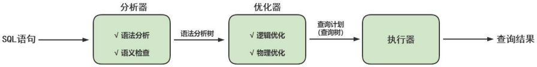

> <h1 id=""></h1>
- [**‌用户管理与权限**](#用户管理与权限)
	- [用户管理](#用户管理) 
	- [登录MySQL服务器](#登录MySQL服务器) 
	- [创建用户](#创建用户) 
	- [修改用户](#修改用户) 
	- [删除用户](#删除用户) 
	- [查看创建用户的语句](#查看创建用户的语句) 
	- [设置当前用户密码](#设置当前用户密码) 
	- [修改其它用户密码](#修改其它用户密码) 
	- [MySQL8密码管理](#MySQL8密码管理) 
		- [密码重用策略](#密码重用策略)
- [**逻辑架构**](#逻辑架构)
	- [服务器处理客户端请求](#服务器处理客户端请求) 
	- [客户端Connectors](#客户端Connectors)  
	- [连接层](#连接层)
	- [引擎层](#引擎层)
	- [存储层](#存储层)
	- [SQL执行流程](#SQL执行流程) 
		- [查询缓存](#查询缓存)
		- [解析器](#解析器) 
		- [优化器](#优化器) 
		- [执行器](#执行器)
		- [sql语句执行流程](#sql语句执行流程)
	- [数据库缓冲池(bufferpool)](#数据库缓冲池(bufferpool))
	- [缓冲池vs查询缓存](#缓冲池vs查询缓存) 
	- [缓冲池如何读取数据](#缓冲池如何读取数据) 
	- [查看/设置缓冲池的大小](#查看/设置缓冲池的大小)


<br/><br/><br/>

***
<br/>

> <h1 id="用户管理与权限">用户管理与权限</h1>
<br/>

***
<br/><br/><br/>
> <h2 id="用户管理">用户管理</h2>
MySQL用户可以分为`普通用户`和 `root 用户`。root用户是超级管理员，拥有所有权限，包括创建用户、删除用户和修改用户的密码等管理权限；普通用户只拥有被授予的各种权限。

**MySQL提供了许多语句用来管理用户账号**，这些语句可以用来管理包括登录和退出MySQL服务器、创建用户、删除用户、密码管理和权限管理等内容。

**MySQL数据库的安全性需要通过账号管理来保证。**

***
<br/><br/><br/>
> <h2 id="登录MySQL服务器">登录MySQL服务器</h2>
启动MySQL服务后，可以通过mysql命令来登录MySQL服务器，命令如下：

```shell
mysql –h hostname|hostIP –P port –u username –p DatabaseName –e "SQL语句"
```

- `-h参数`后面接主机名或者主机IP，hostname为主机名，hostIP为主机IP。 
- `-P参数`后面接MySQL服务的端口，通过该参数连接到指定的端口。MySQL服务的默认端口是3306，不使用该参数时自动连接到3306端口，port为连接的端口号。
- `-u参数`后面接用户名，username为用户名。
- `-p参数`会提示输入密码。
- `DatabaseName参数`指明登录到哪一个数据库中。如果没有该参数，就会直接登录到MySQL数据库中，然后可以使用USE命令来选择数据库。
- `-e参数`后面可以直接加SQL语句。登录MySQL服务器以后即可执行这个SQL语句，然后退出MySQL服务器。

```shell
mysql -uroot -p -hlocalhost -P3306 mysql -e "select host,user from user"
```

***
<br/><br/><br/>
> <h2 id="创建用户">创建用户</h2>
在MySQL数据库中，官方推荐使用 `CREATE USER` 语句创建新用户。MySQL8版本移除了PASSWORD加密方法，因
此不再推荐使用INSERT语句直接操作MySQL中的user表来增加用户。

使用CREATE USER语句来创建新用户时，**必须拥有CREATE USER权限**。每添加一个用户，CREATE USER 语句会在MySQL.user 表中添加一条新记录，但是**新创建的账户没有任何权限**。如果添加的账户已经存在，CREATE USER 语句就会返回一个错误。

<b>创建用户语句</b>

```mysql
CREATE USER 用户名 [IDENTIFIED BY '密码'][,用户名 [IDENTIFIED BY '密码']];
```

* 用户名参数表示新建用户的账户，由`用户（User）`和`主机名（Host）`构成；
* "[ ]"表示可选，也就是说，可以指定用户登录时需要密码验证，也可以不指定密码验证，这样用户可以直接登录。不过，不指定密码的方式不安全，不推荐使用。如果指定密码值，这里需要使用IDENTIFIED BY指定明文密码值。
* CREATE USER语句可以同时创建多个用户

举例：

```mysql
CREATE USER 'zhang3' @'localhost' IDENTIFIED BY '123123'; # 默认host是 %

CREATE USER 'kangshifu'@'localhost' IDENTIFIED BY '123456';
select host,user from user

create user 'zhang3' identified by 'abc123';
```

**查看用户:**

```sql
select host,user from user;

+-----------+------------------+
| host      | user             |
+-----------+------------------+
| %         | zhang3           |
| localhost | kangshifu        |
| localhost | mysql.infoschema |
| localhost | mysql.session    |
| localhost | mysql.sys        |
| localhost | root             |
| localhost | zhang3           |
+-----------+------------------+
7 rows in set (0.00 sec)
```

**host字段下%:** 表示支持用户在任何方式下ip地址的连接. 
**user表主键:** 是host、user联合起来组成的复合键;

<br/>

使用刚才创建的zhang3进行登录,如下:

```sh
mysql -u zhang3 -p 

Enter password:123123

-- 或者
mysql -u zhang3 -p123123

mysql: [Warning] Using a password on the command line interface can be insecure.
```

<br/>

**查看现在所在的数据库:**

```sql
show databases;

+--------------------+
| Database           |
+--------------------+
| information_schema |
| performance_schema |
+--------------------+
2 rows in set (0.00 sec)
```

<br/>

```sql
show grants;

+--------------------------------------------+
| Grants for zhang3@localhost                |
+--------------------------------------------+
| GRANT USAGE ON *.* TO `zhang3`@`localhost` |
+--------------------------------------------+
1 row in set (0.00 sec)
```

***
<br/><br/><br/>
> <h2 id="修改用户">修改用户</h2>

```mysql
UPDATE mysql.user SET USER='li4' WHERE USER='wang5' and host = '%'; 

FLUSH PRIVILEGES;
```

> 当host字段设置为局域网IP段时，本机访问本机上的mysql，也需要-h指定本机的IP

> 不能省略，省略为localhost，会导致无法访问

***
<br/><br/><br/>
> <h2 id="删除用户">删除用户</h2>

**方式1：使用DROP方式删除（推荐）**

使用DROP USER语句来删除用户时，必须用于DROP USER权限。DROP USER语句的基本语法形式如下：

```mysql
DROP USER user[,user]…;
```

其中，user参数是需要删除的用户，由用户的用户名（User）和主机名（Host）组成。DROP USER语句可以同时删除多个用户，各用户之间用逗号隔开。

<br/>

举例：

```mysql
DROP USER li4 ; # 默认删除host为%的用户
DROP USER 'kangshifu'@'localhost';
```

<br/><br/>

**方式2：使用DELETE方式删除（不推荐，有残留信息）**

```mysql
DELETE FROM mysql.user WHERE Host='hostname' AND User='username';
FLUSH PRIVILEGES;
```

>注意：不推荐通过DELETE方式进行删除，**系统会有残留信息保留**。而drop user命令会删除用户以及对应的权限，执行命令后mysql.user表和mysql.db表的相应记录都消失了。

<br/><br/>
> <h2 id="查看创建用户的语句
">查看创建用户的语句
</h2>

```mysql
SHOW create user <username>;
```

<br/><br/>
> <h3 id="设置当前用户密码
">设置当前用户密码</h3>

**使用ALTER USER命令来修改当前用户密码**

```mysql
ALTER USER USER() IDENTIFIED BY 'new_password';
```

**使用SET语句来修改当前用户密码**

该语句会自动将密码加密后再赋值给当前用户。

```mysql
SET PASSWORD='new_password';
```

***
<br/><br/><br/>
> <h2 id="修改其它用户密码">修改其它用户密码</h2>

**使用ALTER语句来修改普通用户的密码**

```mysql
ALTER USER user [IDENTIFIED BY '新密码'] 
[,user[IDENTIFIED BY '新密码']]…;
```

user参数由用户名和主机名组成

**使用SET命令来修改普通用户的密码**

```mysql
SET PASSWORD FOR 'username'@'hostname'='new_password';
```

**使用UPDATE语句修改普通用户的密码（不推荐）**

```mysql
UPDATE MySQL.user SET authentication_string=PASSWORD("123456")
WHERE User = "username" AND Host = "hostname";
```

> 由于MySQL8中已经移除了PASSWORD()函数，因此不再使用UPDATE语句直接操作用户表修改密码。

***
<br/><br/><br/>

> <h2 id="MySQL8密码管理">MySQL8密码管理</h2>
MySQL中记录使用过的历史密码，目前包含如下密码管理功能：
- （1）密码过期：要求定期修改密码。
- （2）密码重用限制：不允许使用旧密码。
- （3）密码强度评估：要求使用高强度的密码。（第1章已讲）

> 提示
> MySQL 密码管理功能只针对使用基于 MySQL 授权插件的账号，这些插件有 mysql_native_password、sha256_password 和 caching_sha2_password。

<br/><br/>

**MySQL8密码管理**

在MySQL中，数据库管理员可以`手动设置`账号密码过期，也可以建立一个`自动`密码过期策略。

过期策略可以是`全局的`，也可以为`每个账号`设置单独的过期策略。

<br/>

**1）手动设置立马过期**

```mysql
ALTER USER <user> PASSWORD EXPIRE;
# 举例
ALTER USER 'kangshifu'@'localhost' PASSWORD EXPIRE;
```

该语句将用户 kangshifu 的密码设置为过期，kangshifu 用户仍然可以登录进入数据库，但无法进行查询。密码过期后，只有重新设置了新密码，才能正常使用。

```mysql
mysql> show databases;
ERROR 1820 (HY000): You must reset your password using ALTER USER statement before executing this statement.
```

<br/>

**2）设置全局过期策略**

如果密码使用的时间大于允许的时间，服务器会自动设置为过期，不需要手动设置。
MySQL 使用 default_password_lifetime 系统变量建立全局密码过期策略。

- 它的默认值是 0，表示禁用自动密码过期。
- 它允许的值是正整数 N，表示允许的密码生存期。密码必须 每隔 N 天 进行修改。

<b>方式一：使用SQL语句更改该变量的值并持久化</b>

```mysql
SET PERSIST default_password_lifetime = 180; # 建立全局策略，设置密码每隔180天过期
```

<br/>

<b>方式二：配置文件my.cnf中进行维护</b>

```properties
[mysqld]
default_password_lifetime=180 #建立全局策略，设置密码每隔180天过期
```

<br/>

**3）单独设置指定用户过期策略**

每个账号既可延用全局密码过期策略，也可单独设置策略。在`CREATE USER` 和`ALTER USER` 语句上加
入`PASSWORD EXPIRE` 选项可实现单独设置策略。下面是一些语句示例

```mysql
#设置kangshifu账号密码每90天过期：
CREATE USER 'kangshifu'@'localhost' PASSWORD EXPIRE INTERVAL 90 DAY;
ALTER USER 'kangshifu'@'localhost' PASSWORD EXPIRE INTERVAL 90 DAY;

#设置密码永不过期：
CREATE USER 'kangshifu'@'localhost' PASSWORD EXPIRE NEVER;
ALTER USER 'kangshifu'@'localhost' PASSWORD EXPIRE NEVER;

#延用全局密码过期策略：
CREATE USER 'kangshifu'@'localhost' PASSWORD EXPIRE DEFAULT;
ALTER USER 'kangshifu'@'localhost' PASSWORD EXPIRE DEFAULT;
```

<br/><br/>
> <h3 id="密码重用策略">密码重用策略</h3>
MySQL限制使用已用过的密码。重用策略基于`密码更改的数量`和`使用的时间`。重用策略可以是`全局`的，也可以为每个账号设置`单独的策略`。

* 账号的历史密码包含过去该账号所使用的密码。MySQL基于以下规则来限制密码重用：

* * 如果账号的密码限制基于密码更改的数量，那么新密码不能从最近限制的密码数量中选择。例如，如果密码更改的最小值为3，那么新密码不能与最近3个密码中任何一个相同。

* * 如果账号密码限制基于时间，那么新密码不能从规定时间内选择。例如，如果密码重用周期为60天，那么新密码不能从最近60天内使用的密码中选择。

* MySQL使用password_history和password_reuse_interval系统变量设置密码重用策略。

* * `password_history`：规定密码重用的数量
  * `password_reuse_interval`：规定密码重用的周期

**1）设置全局密码重用策略**

<b>方式一：使用SQL</b>

```mysql
SET PERSIST password_history = 6; #设置不能选择最近使用过的6个密码
SET PERSIST password_reuse_interval = 365; #设置不能选择最近一年内的密码
```

<br/>

<b>方式二：my.cnf配置文件</b>

```properties
[mysqld]
password_history=6
password_reuse_interval=365
```

<br/>

**2）单独设置指定用户密码重用策略**

```mysql
# 不能使用最近5个密码：
CREATE USER 'kangshifu'@'localhost' PASSWORD HISTORY 5;
ALTER USER 'kangshifu'@'localhost' PASSWORD HISTORY 5;

# 不能使用最近365天内的密码：
CREATE USER 'kangshifu'@'localhost' PASSWORD REUSE INTERVAL 365 DAY;
ALTER USER 'kangshifu'@'localhost' PASSWORD REUSE INTERVAL 365 DAY;

# 既不能使用最近5个密码，也不能使用365天内的密码
CREATE USER 'kangshifu'@'localhost'
PASSWORD HISTORY 5
PASSWORD REUSE INTERVAL 365 DAY;

ALTER USER 'kangshifu'@'localhost'
PASSWORD HISTORY 5
PASSWORD REUSE INTERVAL 365 DAY;
```

```mysql
# 延用全局策略
CREATE USER 'kangshifu'@'localhost'
PASSWORD HISTORY DEFAULT
PASSWORD REUSE INTERVAL DEFAULT;

ALTER USER 'kangshifu'@'localhost'
PASSWORD HISTORY DEFAULT
PASSWORD REUSE INTERVAL DEFAULT;
```


## 2. 权限管理

### 2.1 权限列表

```mysql
show privileges;
```

- `CREATE和DROP权限`，可以创建新的数据库和表，或删除（移掉）已有的数据库和表。如果将MySQL数据库中的DROP权限授予某用户，用户就可以删除MySQL访问权限保存的数据库。
- `SELECT、INSERT、UPDATE和DELETE权限`允许在一个数据库现有的表上实施操作。
- `SELECT权限`只有在它们真正从一个表中检索行时才被用到。
- `INDEX权限`允许创建或删除索引，INDEX适用于已有的表。如果具有某个表的CREATE权限，就可以在CREATE TABLE语句中包括索引定义。
- `ALTER权限`可以使用ALTER TABLE来更改表的结构和重新命名表。
- `CREATE ROUTINE权限`用来创建保存的程序（函数和程序），`ALTER ROUTINE权限`用来更改和删除保存的程序，`EXECUTE权限`用来执行保存的程序。
- `GRANT权限`允许授权给其他用户，可用于数据库、表和保存的程序。
- `FILE权限`使用户可以使用LOAD DATA INFILE和SELECT ... INTO OUTFILE语句读或写服务器上的文件，任何被授予FILE权限的用户都能读或写MySQL服务器上的任何文件（说明用户可以读任何数据库目录下的文件，因为服务器可以访问这些文件）。

**MySQL的权限分布**

| 权限分布 | 可能的设置权限                                               |
| -------- | ------------------------------------------------------------ |
| 表权限   | 'Select'，'Insert'，'Update','Delete','Create','Drop',<br>'Grant'，'References'，'Index','Alter' |
| 列权限   | 'Select'，'Insert'，'Update','References'                    |
| 过程权限 | 'Execute','Alter Routine','Grant'                            |

### 2.2 授予权限的原则

权限控制主要是出于安全因素，因此需要遵循以下几个`经验原则`：

* 只授予能`满足需要的最小权限`，防止用户干坏事。比如用户只是需要查询，那就只给select权限就可以了，不要给用户赋予update、insert或者delete权限。

* 创建用户的时候`限制用户的登录主机`，一般是限制成指定IP或者内网IP段。

* 为每个用户`设置满足密码复杂度的密码`。 

* `定期清理不需要的用户`，回收权限或者删除用户。

### 2.3 授予权限

给用户授权的方式有2种，分别是通过把`角色赋予用户给用户授权`和`直接给用户授权`。用户是数据库的使用者，我们可以通过给用户授予访问数据库中资源的权限，来控制使用者对数据库的访问，消除安全隐患。

```mysql
GRANT 权限1,权限2,…权限n ON 数据库名称.表名称 TO 用户名@用户地址 [IDENTIFIED BY '密码口令'];
```

- 该权限如果发现没有该用户，则会直接新建一个用户。
- 使用GRANT重复给用户添加权限，`权限叠加`
- 如果需要赋予包括GRANT的权限，需要添加参数`WITH GRANT OPTIN`，表示该用户可以将自己拥有的权限授权给别人。
- 给li4用户用本地命令行方式，授予atguigudb这个库下的所有表的插删改查的权限。

    ```mysql
    GRANT SELECT,INSERT,DELETE,UPDATE ON atguigudb.* TO li4@localhost;
    ```

* 授予通过网络方式登录的joe用户 ，对所有库所有表的全部权限，密码设为123。

    ```mysql
    GRANT ALL PRIVILEGES ON *.* TO joe@'%' IDENTIFIED BY '123';
    ```

    **注意这里的ALL PRIVILEGES唯独不包括grant的权限**

>我们在开发应用的时候，经常会遇到一种需求，就是要根据用户的不同，对数据进行横向和纵向的分组。
>
>* 所谓横向的分组，就是指用户可以接触到的数据的范围，比如可以看到哪些表的数据；
>* 所谓纵向的分组，就是指用户对接触到的数据能访问到什么程度，比如能看、能改，甚至是删除。

### 2.4 查看权限

- 查看当前用户权限

```mysql
SHOW GRANTS; 
# 或 
SHOW GRANTS FOR CURRENT_USER; 
# 或 
SHOW GRANTS FOR CURRENT_USER();
```

- 查看某用户的全局权限

```mysql
SHOW GRANTS FOR 'user'@'主机地址';
```

### 2.5 收回权限

MySQL中使用`REVOKE`语句取消用户的某些权限。使用REVOKE收回权限之后，用户账户的记录将从db、host、tables_priv和columns_priv表中删除，但是用户账户记录仍然在user表中保存（删除user表中的账户记录使用DROP USER语句）

**注意：在将用户账户从user表删除之前，应该收回相应用户的所有权限。**

- 收回权限命令

```mysql
REVOKE 权限1,权限2,…权限n ON 数据库名称.表名称 FROM 用户名@用户地址;
```

- 举例

```mysql
#收回全库全表的所有权限 
REVOKE ALL PRIVILEGES ON *.* FROM joe@'%';

#收回mysql库下的所有表的插删改查权限 
REVOKE SELECT,INSERT,UPDATE,DELETE ON mysql.* FROM joe@localhost;
```

- 注意：`须用户重新登录后才能生效`

## 3. 权限表

MySQL服务器通过`权限表`来**控制用户对数据库的访问**，权限表存放在`mysql数据库`中。MySQL数据库系统会根据这些权限表的内容为每个用户赋予相应的权限。这些权限表中最重要的是`user表`、`db表`。除此之外，还有`table_priv`表、`column_priv`表和`proc_priv`表等。**在MySQL启动时，服务器将这些数据库表中权限信息的内容读入内存**。

| 权限表名                              | 权限表介绍                     |
| ------------------------------------- | ------------------------------ |
| `user`                                | 存储用户账户信息及全局权限。   |
| `db`                                  | 存储数据库级别的权限。         |
| `tables_priv`                         | 存储表级别的权限。             |
| `columns_priv`                        | 存储列级别的权限。             |
| `procs_priv`                          | 存储存储过程和函数级别的权限。 |
| `proxies_priv`                        | 存储代理用户权限。             |
| roles_mapping<br>`role_edges` 8.0版本 | 存储用户和角色之间的映射关系。 |
| global_grants                         | 动态全局授权                   |
| default_roles                         | 账户连接并认证后默认授予的角色 |


### 3.1 user表

user表是MySQL中最重要的一个权限表， `记录用户账号和权限信息`，mysql8.0.25有51个字段。

```mysql
use mysql;
show create table user;

#查看字段
DESC mysql.user;

#查看用户, 以列的方式显示数据
SELECT * FROM mysql.user \G;

#查询特定字段
SELECT host,user,authentication_string,select_priv,insert_priv,drop_priv FROM mysql.user;
```


| Field                    | Type                              | Default                 |
| ------------------------ | --------------------------------- | ----------------------- |
| Host                     | char(255)                         | ''                      |
| User                     | char(32)                          | ''                      |
| Select_priv              | enum('N','Y')                     | 'N'                     |
| Insert_priv              | enum('N','Y')                     | 'N'                     |
| Update_priv              | enum('N','Y')                     | 'N'                     |
| Delete_priv              | enum('N','Y')                     | 'N'                     |
| Create_priv              | enum('N','Y')                     | 'N'                     |
| Drop_priv                | enum('N','Y')                     | 'N'                     |
| Reload_priv              | enum('N','Y')                     | 'N'                     |
| Shutdown_priv            | enum('N','Y')                     | 'N'                     |
| Process_priv             | enum('N','Y')                     | 'N'                     |
| File_priv                | enum('N','Y')                     | 'N'                     |
| Grant_priv               | enum('N','Y')                     | 'N'                     |
| References_priv          | enum('N','Y')                     | 'N'                     |
| Index_priv               | enum('N','Y')                     | 'N'                     |
| Alter_priv               | enum('N','Y')                     | 'N'                     |
| Show_db_priv             | enum('N','Y')                     | 'N'                     |
| Super_priv               | enum('N','Y')                     | 'N'                     |
| Create_tmp_table_priv    | enum('N','Y')                     | 'N'                     |
| Lock_tables_priv         | enum('N','Y')                     | 'N'                     |
| Execute_priv             | enum('N','Y')                     | 'N'                     |
| Repl_slave_priv          | enum('N','Y')                     | 'N'                     |
| Repl_client_priv         | enum('N','Y')                     | 'N'                     |
| Create_view_priv         | enum('N','Y')                     | 'N'                     |
| Show_view_priv           | enum('N','Y')                     | 'N'                     |
| Create_routine_priv      | enum('N','Y')                     | 'N'                     |
| Alter_routine_priv       | enum('N','Y')                     | 'N'                     |
| Create_user_priv         | enum('N','Y')                     | 'N'                     |
| Event_priv               | enum('N','Y')                     | 'N'                     |
| Trigger_priv             | enum('N','Y')                     | 'N'                     |
| Create_tablespace_priv   | enum('N','Y')                     | 'N'                     |
| ssl_type                 | enum('','ANY','X509','SPECIFIED') | ''                      |
| ssl_cipher               | blob                              |                         |
| x509_issuer              | blob                              |                         |
| x509_subject             | blob                              |                         |
| max_questions            | int unsigned                      | 0                       |
| max_updates              | int unsigned                      | 0                       |
| max_connections          | int unsigned                      | 0                       |
| max_user_connections     | int unsigned                      | 0                       |
| plugin                   | char(64)                          | 'caching_sha2_password' |
| authentication_string    | text                              |                         |
| password_expired         | enum('N','Y')                     | 'N'                     |
| password_last_changed    | timestamp                         | NULL                    |
| password_lifetime        | smallint unsigned                 | NULL                    |
| account_locked           | enum('N','Y')                     | 'N'                     |
| Create_role_priv         | enum('N','Y')                     | 'N'                     |
| Drop_role_priv           | enum('N','Y')                     | 'N'                     |
| Password_reuse_history   | smallint unsigned                 | NULL                    |
| Password_reuse_time      | smallint unsigned                 | NULL                    |
| Password_require_current | enum('N','Y')                     | NULL                    |
| User_attributes          | json                              | NULL                    |

这些字段可以分为4类，分别是范围列（用户列）、权限列、安全列和资源控制列

#### 1）范围列（用户列）

* host：表示连接类型
  * `%` 表示所有远程通过TCP方式的连接
  * `IP地址`通过指定IP地址进行的TCP方式的连接
  * `机器名`通过指定网络中的机器名进行的TCP方式的连接
  * `::1`IPv6的本地ip地址，等同于IPv4的 127.0.0.1
  * `localhost` 本地方式通过命令行方式的连接 ，比如mysql -u xxx -p xxx 方式的连接
* user：表示用户名，同一用户通过不同方式链接的权限是不一样的
* password：密码
* * 所有密码串通过 password(明文字符串) 生成的密文字符串。MySQL 8.0 在用户管理方面增加了角色管理，默认的密码加密方式也做了调整，由之前的 `SHA1` 改为了 `SHA2` ，不可逆 。同时加上 MySQL5.7 的禁用用户和用户过期的功能，MySQL 在用户管理方面的功能和安全性都较之前版本大大的增强了。
  * mysql 5.7 及之后版本的密码保存到 `authentication_string` 字段中不再使用password 字
    段。

#### 2）权限列

* Grant_priv字段 表示是否拥有GRANT权限

* Shutdown_priv字段 表示是否拥有停止MySQL服务的权限

* Super_priv字段 表示是否拥有超级权限

* Execute_priv字段 表示是否拥有EXECUTE权限。拥有EXECUTE权限，可以执行存储过程和函数。

* Select_priv,Insert_priv等 为该用户所拥有的权限。


#### 3）安全列

安全列只有6个字段，其中两个是ssl相关的（ssl_type、ssl_cipher），用于`加密`；两个是x509相关的（x509_issuer、x509_subject），用于`标识用户`；另外两个Plugin字段用于`验证用户身份`的插件，该字段不能为空。如果该字段为空，服务器就使用内建授权验证机制验证用户身份。


#### 4）资源控制列

资源控制列的字段用来`限制用户使用的资源`，包含4个字段，分别为：

`max_questions` 用户每小时允许执行的查询操作次数

`max_updates` 用户每小时允许执行的更新操作次数

`max_connections` 用户每小时允许执行的连接操作次数

`max_user_connections` 用户允许同时建立的连接次数


### 3.2 db表

针对具体某个数据库的权限

使用DESCRIBE查看db表的基本结构

```mysql
DESCRIBE mysql.db;
```

| Field                 | Type          | Default |
| --------------------- | ------------- | ------- |
| Host                  | char(255)     |         |
| Db                    | char(64)      |         |
| User                  | char(32)      |         |
| Select_priv           | enum('N','Y') | N       |
| Insert_priv           | enum('N','Y') | N       |
| Update_priv           | enum('N','Y') | N       |
| Delete_priv           | enum('N','Y') | N       |
| Create_priv           | enum('N','Y') | N       |
| Drop_priv             | enum('N','Y') | N       |
| Grant_priv            | enum('N','Y') | N       |
| References_priv       | enum('N','Y') | N       |
| Index_priv            | enum('N','Y') | N       |
| Alter_priv            | enum('N','Y') | N       |
| Create_tmp_table_priv | enum('N','Y') | N       |
| Lock_tables_priv      | enum('N','Y') | N       |
| Create_view_priv      | enum('N','Y') | N       |
| Show_view_priv        | enum('N','Y') | N       |
| Create_routine_priv   | enum('N','Y') | N       |
| Alter_routine_priv    | enum('N','Y') | N       |
| Execute_priv          | enum('N','Y') | N       |
| Event_priv            | enum('N','Y') | N       |
| Trigger_priv          | enum('N','Y') | N       |

**1）用户列**

用户列db表用户列有3个字段，分别是Host、User、Db。这3个字段分别表示主机名、用户名和数据库名。表示从某个主机连接某个用户对某个数据库的操作权限，这3个字段的组合构成了db表的主键。

**2）权限列**

Create_routine_priv和Alter_routine_priv这两个字段决定用户是否具有创建和修改存储过程的权限。

### 3.3 tables_priv表和columns_priv表

tables_priv表用来`对表设置操作权限`

columns_priv表用来对表的`某一列设置权限`。

```mysql
desc mysql.tables_priv;
desc mysql.columns_priv;
```

| Field       | Type                                                         |
| ----------- | ------------------------------------------------------------ |
| Host        | char(255)                                                    |
| Db          | char(64)                                                     |
| User        | char(32)                                                     |
| Table_name  | char(64)                                                     |
| Grantor     | varchar(288)                                                 |
| Timestamp   | timestamp                                                    |
| Table_priv  | set('Select','Insert','Update','Delete','Create','Drop',<br/>'Grant','References','Index','Alter','Create View',<br/>'Show view','Trigger') |
| Column_priv | set('Select','Insert','Update','References')                 |

tables_priv表有8个字段，分别是Host、Db、User、Table_name、Grantor、Timestamp、Table_priv和Column_priv，各个字段说明如下：

- **四个主键** `Host`: 主机名  `Db`: 数据库名  `User`: 用户名  `Table_name`: 表名  
- `Grantor`: 修改该记录的用户  
- `Timestamp`: 修改该记录的时间  
- `Table_priv`: 对象的操作权限，包括 Select、Insert、Update、Delete、Create、Drop、Grant、References、Index 和 Alter  
- `Column_priv`: 对表中的列的操作权限，包括 Select、Insert、Update 和 References


### 3.4 procs_priv表

procs_priv表`存储过程和存储函数设置操作权限`

```mysql
desc mysql.procs_priv;
```

| Field        | Type                                   | Null | Key  | Default           |
| ------------ | -------------------------------------- | ---- | ---- | ----------------- |
| Host         | char(60)                               | NO   | PRI  |                   |
| Db           | char(64)                               | NO   | PRI  |                   |
| User         | char(32)                               | NO   | PRI  |                   |
| Routine_name | char(64)                               | NO   | PRI  |                   |
| Routine_type | enum('FUNCTION','PROCEDURE')           | NO   | PRI  | NULL              |
| Grantor      | char(93)                               | NO   | MUL  |                   |
| Proc_priv    | set('Execute','Alter Routine','Grant') | NO   |      |                   |
| Timestamp    | timestamp                              | NO   |      | CURRENT_TIMESTAMP |


## 4. 访问控制权限

当MySQL允许一个用户执行各种操作时，它将首先核实该用户向MySQL服务器发送的连接请求，然后确认用户的操作请求是否被允许。这个过程称为MySQL中的`访问控制过程`。MySQL的访问控制分为两个阶段：`连接核实阶段`和`请求核实阶段`。

### 4.1 连接核实阶段

当用户试图连接MySQL服务器时，服务器基于用户的身份以及用户是否能提供正确的密码验证身份来确定接受或者拒绝连接。即客户端用户会在连接请求中提供用户名、主机地址、用户密码，MySQL服务器接收到用户请求后，会**使用user表中的host、user和authentication_string这3个字段匹配客户端提供信息。**

服务器只有在user表记录的Host和User字段匹配客户端主机名和用户名，并且提供正确的密码时才接受连接。**如果连接核实没有通过，服务器就完全拒绝访问；否则，服务器接受连接，然后进入阶段2等待用户请求。**

### 4.2 请求核实阶段

一旦建立了连接，服务器就进入了访问控制的阶段2，也就是请求核实阶段。对此连接上进来的每个请求，服务器检查该请求要执行什么操作、是否有足够的权限来执行它，这正是需要授权表中的权限列发挥作用的地方。这些权限可以来自user、db、table_priv和column_priv表。

确认权限时，MySQL首先`检查user表`，如果指定的权限没有在user表中被授予，那么MySQL就会继续`检查db表`，db表是下一安全层级，其中的权限限定于数据库层级，在该层级的SELECT权限允许用户查看指定数据库的所有表中的数据；如果在该层级没有找到限定的权限，则MySQL继续`检查tables_priv表`以及`columns_priv表`，如果所有权限表都检查完毕，但还是没有找到允许的权限操作，MySQL将`返回错误信息`，用户请求的操作不能执行，操作失败。

>提示： MySQL通过向下层级的顺序（从user表到columns_priv表）检查权限表，但并不是所有的权限都要执行该过程。例如，一个用户登录到MySQL服务器之后只执行对MySQL的管理操作，此时只涉及管理权限，因此MySQL只检查user表。另外，如果请求的权限操作不被允许，MySQL也不会继续检查下一层级的表。

## 5. 角色管理

角色是在MySQL8.0引入的新功能，在MySQL中，**角色是权限的集合**，可以为角色添加或移除权限，用户可以被赋予角色，同时也被授予角色包含的权限。对角色进行操作需要较高的权限。并且像用户账户一样，角色可以拥有授予和撤销的权限。

引入角色的目的是`方便管理拥有相同权限的用户`。恰当的权限设定，可以确保数据的安全性。

### 5.1 创建角色

```mysql
CREATE ROLE 'role_name'[@'host_name'] [,'role_name'[@'host_name']]...
```

角色名称的命名规则和用户名类似。如果`host_name省略，默认为%`，`role_name不可省略`，不可为空。

### 5.2 给角色赋予权限

创建角色后，默认这个角色是没有任何权限的，需要给角色授权

```mysql
GRANT privileges ON db_name.table_name TO 'role_name'[@'host_name'];
```

上述语句中privileges代表权限的名称，多个权限以逗号隔开。可使用SHOW语句查询权限名称

```mysql
SHOW PRIVILEGES\G
```

### 5.3 查看角色的权限

```mysql
SHOW GRANTS FOR 'role_name';
```

只要创建了一个角色，系统就会自动给一个`USAGE`权限，意思是`连接登录数据库的权限`。

### 5.4 回收角色的权限

```mysql
REVOKE privileges ON db_name.table_name FROM 'rolename';
```

### 5.5 删除角色

```mysql
DROP ROLE role [,role2]...
```

注意，`如果删除了角色，那么用户也就失去了通过这个角色所获得的所有权限`。

### 5.6 给用户赋予角色

角色创建并授权后，要赋给用户并处于`激活状态`才能发挥作用。

```mysql
GRANT role [,role2,...] TO user [,user2,...];
```

**查询当前已激活的角色**

```mysql
SELECT CURRENT_ROLE();
```

### 5.7 激活角色

**方式1：使用set default role 命令激活角色**

```mysql
SET DEFAULT ROLE ALL TO 'kangshifu'@'localhost';
```

> 注意：用户需要退出重新登录，才能看到被赋予的角色。

**方式2：将activate_all_roles_on_login设置为ON**

```mysql
SET GLOBAL activate_all_roles_on_login=ON;
show variables like 'activate_all_roles_on_login';
```

这条 SQL 语句的意思是，对`所有角色永久激活`。

**当前用户在当前会话，激活某角色**

```mysql
SET ROLE 'manager';
SET ROLE DEFAULT;
# 禁用所有角色
SET ROLE NONE;
```

### 5.8 撤销用户的角色

```mysql
REVOKE role FROM user;
```

> 被修改的用户退出重新登录后，生效

### 5.9 设置强制角色(mandatory role)

强制角色是给每个创建账户的默认角色，不需要手动设置。强制角色无法被`REVOKE`或者`DROP`

方式1：服务启动前设置

```ini
[mysqld] 
mandatory_roles='role1,role2@localhost,r3@%.atguigu.com'
```

方式2：运行时设置

```mysql
SET PERSIST mandatory_roles = 'role1,role2@localhost,r3@%.example.com'; #系统重启后仍然有效
SET GLOBAL mandatory_roles = 'role1,role2@localhost,r3@%.example.com'; #系统重启后失效
```


<br/><br/><br/>

***
<br/>

> <h1 id="逻辑架构">逻辑架构</h1>
<br/>

> <h2 id="服务器处理客户端请求">服务器处理客户端请求</h2>


<br/>

**mysql服务器架构:**


***
<br/><br/><br/>
> <h2 id="客户端Connectors"> 客户端Connectors </h2>
Connectors，指的是不同语言中与SQL的交互。MySQL首先是一个网络程序，在TCP之上定义了自己的应用层协议。所以要使用MySQL,我们可以编写代码，跟MySQL Server`建立TCP连接`，之后按照其定义好的协议进行交互。

或者比较方便的办法是调用SDK,比如Native C API、JDBC、PHP等各语言MySQL Connector,或者通过ODBC。**通过SDK来访问MySQL,本质上还是在TCP连接上通过MySQL协议跟MySQL进行交互。**

***
<br/><br/><br/>
> <h2 id="连接层">连接层</h2>
**连接管理**的职责是**负责认证、管理连接、获取权限信息**。

系统（客户端）访问`MySQL`服务器前，做的第一件事就是建立`TCP`连接。

经过三次握手建立连接成功后，`MySQL`服务器对`TCP`传输过来的账号密码做身份认证、权限获取。

- **用户名或密码不对**，会收到一个`Access denied for user`错误，客户端程序结束执行
- **用户名密码认证通过**，会从权限表查出账号拥有的权限与连接关联，之后的权限判断逻辑，都将依赖于此时读到的权限


<br/>

<b>TCP连接池</b>

多个系统都可以和MySQL服务器建立连接，每个系统建立的连接不止一个。所以，为了解决TCP无限创建与TCP频繁创建销毁带来的资源耗尽、性能下降问题。MySQL服务器里有专门的`TCP连接池`限制连接数采用`长连接模式`复用TCP连接，来解决上述问题。

<br/>

**线程池**

`TCP`连接收到请求后，必须要分配给一个线程专门与这个客户端的交互。所以还会有个线程池，去走后面的流程。每一个连接从线程池中获取线程，省去了创建和销毁线程的开销。

***
<br/><br/><br/>
> <h2 id="引擎层">引擎层</h2>
插件式存储引擎层（ Storage Engines）**真正的负责了MySQL中数据的存储和提取，对物理服务器级别维护的底层数据执行操作**，服务层通过API与存储引擎进行通信。

`插件式的存储引擎`架构将查询处理和其它的系统任务以及数据的存储提取相分离。这种架构可以根据业务的需求和实际需要选择合适的存储引擎。同时开源的MySQL还允许`开发人员设置自己的存储引擎`。

`MySQL 8.0.25` 默认支持的存储引擎如下

```mysql
show engines;

Connection id:    27
Current database: mysql

+--------------------+---------+----------------------------------------------------------------+--------------+------+------------+
| Engine             | Support | Comment                                                        | Transactions | XA   | Savepoints |
+--------------------+---------+----------------------------------------------------------------+--------------+------+------------+
| ndbcluster         | NO      | Clustered, fault-tolerant tables                               | NULL         | NULL | NULL       |
| CSV                | YES     | CSV storage engine                                             | NO           | NO   | NO         |
| ARCHIVE            | YES     | Archive storage engine                                         | NO           | NO   | NO         |
| BLACKHOLE          | YES     | /dev/null storage engine (anything you write to it disappears) | NO           | NO   | NO         |
| ndbinfo            | NO      | MySQL Cluster system information storage engine                | NULL         | NULL | NULL       |
| MRG_MYISAM         | YES     | Collection of identical MyISAM tables                          | NO           | NO   | NO         |
| FEDERATED          | NO      | Federated MySQL storage engine                                 | NULL         | NULL | NULL       |
| MyISAM             | YES     | MyISAM storage engine                                          | NO           | NO   | NO         |
| PERFORMANCE_SCHEMA | YES     | Performance Schema                                             | NO           | NO   | NO         |
| InnoDB             | DEFAULT | Supports transactions, row-level locking, and foreign keys     | YES          | YES  | YES        |
| MEMORY             | YES     | Hash based, stored in memory, useful for temporary tables      | NO           | NO   | NO         |
+--------------------+---------+----------------------------------------------------------------+--------------+------+------------+
11 rows in set (0.02 sec)
```


***
<br/><br/><br/>
> <h2 id="存储层">存储层</h2>
所有的数据，数据库、表的定义，表的每一行的内容，索引，都是存在`文件系统`上，以`文件`的方式存在的，并完成与存储引擎的交互。当然有些存储引擎比如InnoDB，也支持不使用文件系统直接管理裸设备，但现代文件系统的实现使得这样做没有必要了。在文件系统之下，可以使用本地磁盘，可以使用DAS、NAS、SAN等各种存储系统。


***
<br/><br/><br/>
> <h2 id="SQL执行流程"> SQL执行流程 </h2> 


<br/><br/>
> <h3 id="查询缓存">查询缓存</h3>
Server如果在查询缓存中发现了这条SQL语句，就会直接将结果返回给客户端；如果没有，就进入到解析器阶段。需要说明的是，因为查询缓存往往效率不高，所以在MySQL8.0之后就抛弃了这个功能。

MySQL拿到一个查询请求后，会先到查询缓存看看，之前是不是执行过这条语句。之前执行过的语句及其结果可能会以key-value对的形式，被直接缓存在内存中。key是查询的语句，value是查询的结果。如果查询能够直接在这个缓存中找到key,那么这个value就会被直接返回给服务层


第二层架构主要完成大多数的核心服务功能，如SQL接口，并完成`缓存的查询`，SQL的分析和优化及部分内置函数的执行。所有跨存储引擎的功能也在这一层实现，如过程、函数等。

在该层，服务器会`解析查询`并创建相应的内部`解析树`，并对其完成相应的`优化`：如确定查询表的顺序，是否利用索引等，最后生成相应的执行操作。

如果是SELECT语句，服务器还会`查询内部的缓存`。如果缓存空间足够大，这样在解决大量读操作的环境中能够很好的提升系统的性能。

| 组件名                            | 解释                                                         |
| --------------------------------- | ------------------------------------------------------------ |
| `Management Services & Utilities` | 系统管理和控制工具                                           |
| `SQL Interface`                   | SQL 接口。接受用户的 SQL 命令，并且返回用户需要查询的结果。比如 select from 就是调用 SQL Interface。 |
| `Parser`                          | SQL 解析器。SQL 命令传递到解析器的时候会被解析器验证和解析。 |
| `Optimizer`                       | SQL 查询优化器。SQL 语句在查询之前会使用查询优化器对查询进行优化，比如有 where 条件时，优化器来决定先投影还是先过滤。 |
| `Cache & Buffer`                  | SQL 查询缓存。如果查询缓存有命中的查询结果，查询语句就可以直接去查询缓存中取数据。这个缓存机制是由一系列小缓存组成的。比如表缓存，记录缓存，key 缓存，权限缓存等。 |

<br/>

- **SQL Interface: SQL接口**
  - 接收用户的SQL命令，并且返回用户需要查询的结果。比如SELECT ... FROM就是调用SQL Interface 
  - MySQL支持DML（数据操作语言）、DDL（数据定义语言）、存储过程、视图、触发器、自定义函数等多种SQL语言接口

<br/>

- **Parser:** **解析器**
  - 在解析器中对SQL语句进行语法分析、语义分析。将SQL语句分解成数据结构，并将这个结构传递到后续步骤，以后SQL语句的传递和处理就是基于这个结构的。如果在分解构成中遇到错误，那么就说明这个SQL语句是不合理的。
  - 在SQL命令传递到解析器的时候会被解析器验证和解析，并为其创建`语法树`，并根据数据字典丰富查询语法树，会`验证该客户端是否具有执行该查询的权限`。创建好语法树后，MySQL还会对SQL查询进行语法上的优化，进行查询重写。

<br/>

- **Optimizer:** **查询优化器**
  - SQL语句在语法解析之后、查询之前会使用查询优化器确定SQL语句的执行路径，生成一个`执行计划`。
  - 这个执行计划表明应该`使用哪些索引`进行查询（全表检索还是使用索引检索），表之间的连接顺序如何，最后会按照执行计划中的步骤调用存储引擎提供的方法来真正的执行查询，并将查询结果返回给用户。
  - 它使用“`选取-投影-连接`”策略进行查询。例如：

```mysql
SELECT id,name FROM student WHERE gender = '女';
```

  这个SELECT查询先根据WHERE语句进行`选取`，而不是将表全部查询出来以后再进行gender过滤。 这个SELECT查询先根据id和name进行属性`投影`，而不是将属性全部取出以后再进行过滤，将这两个查询条件`连接`起来生成最终查询结果。

<br/>

- **Caches & Buffers： 查询缓存组件**
  - MySQL内部维持着一些Cache和Buffer，比如Query Cache用来缓存一条SELECT语句的执行结果，如果能够在其中找到对应的查询结客户端。如果语句不在查询缓存中，就会继续后面的执行阶段。`执行完成后，执行结果会被存入查询缓存中`。所以，如果查询命中缓存，MySQL不需要执行后面的复杂操作，就可以直接返回结果，这个效率会很高。

但是大多数情况下,缓存查询就是鸡肋,它的命令率很低,比如:
同一个查询语句,只是在语句中加入一个空格,就会认为不同.若是改变其查询条件,就更不行了.

它只适合,改动比较小的静态查询和基本不怎么改变的查询才可以.这里就不多说了.


<br/><br/>
> <h3 id="解析器">解析器</h3> 

**在解析器中对SQL语句进行语法分析、语义分析。**

如果没有命中查询缓存，就要开始真正执行语句了。首先，MySQL需要知道你要做什么，因此需要对SQL语句做解析。SQL语句的分析分为词法分析与语法分析。

分析器先做`词法分析`。你输入的是由多个字符串和空格组成的一条SQL语句，MySQL需要识别出里面的字符串分别是什么，代表什么。 

MySQL 从你输入的"select"这个关键字识别出来，这是一个查询语句。它也要把字符串“T”识别成“表名 T”，把字符串“ID”识别成“列 ID”。

接着，要做“`语法分析`”。根据词法分析的结果，语法分析器（比如：Bison）会根据语法规则，判断你输入的这个 SQL 语句是否`满足 MySQL 语法`。

如果语句不对，就会收到“You have an error in your SQL syntax”的错误提醒。

如果SQL语句正确，则会生成一个语法树


下图是SQL词法分析的步骤过程


至此解析器的工作任务也基本圆满了。接下来进入到优化器。

<br/><br/>
> <h3 id="优化器">优化器</h3>

<b>优化器的作用</b>

在优化器中会确定SQL语句的执行路径，比如是根据`全表检索`，还是根据`索引检索`等。

经过了解析器，MySQL就知道你要做什么了。在开始执行之前，还要先经过优化器的处理。**一条查询可以有很多种执行方式，最后都返回相同的结果。优化器的作用就是找到这其中最好的执行计划。**

比如：优化器是在表里面有多个索引的时候，决定使用哪个索引；或者在一个语句有多表关联（join)的时候，决定各个表的连接顺序，还有表达式简化、子查询转为连接、外连接转为内连接等。

举例：如下语句是执行两个表的join:

```mysql
select * from test1 join test2 using(ID)
where test1.name='zhangsan'and test2.name='mysql高级课程';
```

```
方案1：可以先从表test1里面取出name=’zhangwei’的记录的ID值，再根据ID值关联到表test2,再判断test2里面name的值是否等于’mysql高级课程’。

方案2：可以先从表test2里面取出name=’mysq1高级课程’的记录的ID值，再根据ID值关联到test1,再判断test1里面name的值是否等于zhangwei。

这两种执行方法的逻辑结果是一样的，但是执行的效率会有不同，而优化器的作用就是决定选择使用哪一个方案。优化器阶段后，这个语句的执行方案就确定下来了，然后进入执行器阶段。

如果你还有一些疑问，比如优化器是怎么选择索引的，有没有可能选择错等。后面讲到索引我们再谈
```

<b>逻辑查询优化和物理查询优化</b>

在查询优化器中，可以分为`逻辑查询优化`阶段和`物理查询优化`阶段。

逻辑查询优化就是通过改变SQL语句的内容来使得SQL查询更高效，同时为物理查询优化提供更多的候选执行计划。通常采用的方式是对SQL语句进行`等价变换`，对查询进行`重写`，而查询重写的数学基础就是关系代数。对条件表达式进行等价谓词重写、条件简化，对视图进行重写，对子查询进行优化，对连接语义进行了外连接消除、嵌套连接消除等。

物理查询优化是基于关系代数进行的查询重写，而关系代数的每一步都对应着物理计算，这些物理计算往往存在多种算法，因此需要计算各种物理路径的代价，从中选择代价最小的作为执行计划。在这个阶段里，对于单表和多表连接的操作，需要高效地`使用索引`，提升查询效率。

<br/><br/>
> <h3 id="执行器">执行器</h3> 

在执行之前需要判断该用户是否`具备权限`。如果没有，就会返回权限错误。如果具备权限，就执行 SQL查询并返回结果。在MySQL8.0以下的版本，如果设置了查询缓存，这时会将查询结果进行缓存。

如果有权限，就打开表继续执行。打开表的时候，执行器就会根据表的引擎定义，调用存储引擎`API`对表进行的读写。存储引擎`API`只是抽象接口，下面还有个**存储引擎层**，具体实现还是要看表选择的存储引擎。

```mysql
select * from test where id=1;
```

比如：表 test 中，ID 字段没有索引，那么执行器的执行流程是这样的：

```
调用 InnoDB 引擎接口取这个表的第一行，判断 ID 值是不是1，如果不是则跳过，如果是则将这行存在结果集中；
调用引擎接口取“下一行”，重复相同的判断逻辑，直到取到这个表的最后一行。
执行器将上述遍历过程中所有满足条件的行组成的记录集作为结果集返回给客户端。
```

***
<br/><br/><br/>
> <h2 id="sql语句执行流程">sql语句执行流程</h2>
SQL语句在MySQL中的流程是：`SQL语句→查询缓存→解析器→优化器→执行器`。



***
<br/><br/><br/>
> <h2 id="数据库缓冲池(bufferpool)">数据库缓冲池(buffer pool)</h2>
`InnoDB`存储引擎是以页为单位来管理存储空间的，增删改查操作其实本质上都是在访问页面（包括读页面、写页面、创建新页面等操作）。而磁盘I/O需要消耗的时间很多，而在内存中进行操作，效率则会高很多，为了能让数据表或者索引中的数据随时被我们所用，DBMS会申请`占用内存来作为数据缓冲池`，在真正访问页面之前，需要把在磁盘上的页缓存到内存中的`Buffer Pool`之后才可以访问。

这样做的好处是可以让磁盘活动最小化，从而`减少与磁盘直接进行I/O的时间`。这种策略对提升 SQL 语句的查询性能来说至关重要。如果索引的数据在缓冲池里，那么访问的成本就会降低很多。

<br/><br/>
> <h3 id="缓冲池vs查询缓存">缓冲池vs查询缓存</h3>

**1）缓冲池（Buffer Pool）**

在InnoDB存储引擎中有一部分数据会放到内存中，缓冲池则占了这部分内存的大部分，它用来存储各种数据的缓存

InnoDB缓冲池包括了数据页、索引页、插入缓存、锁信息、自适应Hash和数据字典信息等。

<b>缓存池的重要性：</b>

对于使用`InnoDB`作为存储引擎的表来说，不管是用于存储用户数据的索引（包括聚簇索引和二级索引），还是各种系统数据，都是以`页`的形式存放在`表空间`中的，而所谓的表空间只不过是InnoDB对文件系统上一个或几个实际文件的抽象，也就是说我们的数据说到底还是存储在磁盘上的。但是各位也都知道，磁盘的速度慢的跟乌龟一样，怎么能配得上`“快如风，疾如电"的CPU`呢？这里，缓冲池可以帮助我们消除CPU和磁盘之间的`鸿沟`。所以InnoDB存储引擎在处理客户端的请求时，当需要访问某个页的数据时，就会把`完整的页的数据全部加载到内存`中，也就是说即使我们只需要访问一个页的一条记录，那也需要先把整个页的数据加载到内存中。将整个页加载到内存中后就可以进行读写访问了，在进行完读写访问之后并不着急把该页对应的内存空间释放掉，而是将其`缓存`起来，这样将来有请求再次访问该页面时，就可以`省去磁盘IO的开销`了。

<b>缓存原则：</b>

“`位置 * 频次`”这个原则，对I/O访问效率进行优化。

首先，位置决定效率，提供缓冲池就是为了在内存中可以直接访问数据。

其次，频次决定优先级顺序。因为缓冲池的大小是有限的，比如磁盘有 200G，但是内存只有 16G，缓冲池大小只有 1G，就无法将所有数据都加载到缓冲池里，这时就涉及到优先级顺序，会`优先对使用频次高的热数据进行加载`。

<b>缓冲池的预读特性:</b>

缓冲池的作用就是提升 I/O 效率，而我们进行读取数据的时候存在一个“局部性原理”，也就是说我们使用了一些数据，**大概率还会使用它周围的一些数据**，因此采用“预读”的机制提前加载，可以减少未来可能的磁盘 I/O 操作。

**2）查询缓存**

查询缓存是提前把`查询结果缓存`起来，这样下次不需要执行就可以直接拿到结果。需要说明的是，在MySQL中的查询缓存，不是缓存查询计划，而是查询对应的结果。因为命中条件苛刻，而且只要数据表发生变化，查询缓存就会效，因此命中率低。

缓冲池服务于数据库整体的/O操作，它们的共同点都是通过缓存的机制来提升效率。

<br/><br/>
> <h3 id="缓冲池如何读取数据">缓冲池如何读取数据</h3>


缓冲池管理器会尽量将经常使用的数据保存起来，在数据库进行页面读操作的时候，首先会判断该页面是否在缓冲池中，如果存在就直接读取，如果不存在，就会通过内存或磁盘将页面存放到缓冲池中再进行读取。

缓存在数据库中的结构和作用如下图所示：


**如果我们执行SQL语句的时候更新了缓存池中的数据，那么这些数据会马上同步到磁盘上吗？**

实际上，当我们对数据库中的记录进行修改的时候，首先会修改缓冲池中页里面的记录信息，然后数据库会`以一定的频率刷新`到磁盘中。注意并不是每次发生更新操作，都会立即进行磁盘回写。缓冲池会采用一种叫做 `checkpoint 的机制` 将数据回写到磁盘上，这样做的好处就是提升了数据库的整体性能。

比如，当`缓冲池不够用`时，需要释放掉一些不常用的页，此时就可以强行采用checkpoint的方式，将不常用的脏页回写到磁盘上，然后再从缓存池中将这些页释放掉。这里的脏页 (dirty page) 指的是缓冲池中被修改过的页，与磁盘上的数据页不一致。

<br/><br/>
> <h3 id="查看/设置缓冲池的大小">查看/设置缓冲池的大小</h3>
Mysql MyISAM存储引擎只缓存索引，不缓存数据，对应的键缓存参数为`key_buffer_size`

InnoDB存储引擎，可以通过查看`innodb_buffer_pool_size`变量来查看缓冲池的大小。

<b>查看缓冲池的大小</b>

```mysql
show variables like 'innodb_buffer_pool_size';
+-------------------------+-----------+
| Variable_name           | Value     |
+-------------------------+-----------+
| innodb_buffer_pool_size | 134217728 |
+-------------------------+-----------+
```

此时InnoDB的缓冲池大小是`134217728/1024/1024=128MB`

<b>设置缓冲池的大小</b>

```mysql
set global innodb_buffer_pool_size = 268435456;
```

或者

```ini
[server] 
innodb_buffer_pool_size = 268435456
```

<br/>

**‌ 多个Buffer Pool实例**

Buffer Pool本质是 InnoDB 向操作系统申请的一块`连续的内存空间`，在多线程环境下，访问Buffer Pool中的数据都需要`加锁`处理。在Buffer Pool特别大而且多线程并发访问特别高的情况下，单一的Buffer Pool可能会影响请求的处理速度。所以在Buffer Pool特别大的时候，可以把它们`拆分成若干个小的Buffer Pool`，每个Buffer Pool都称为一个`实例`，它们都是独立的，独立的去申请内存空间，独立的管理各种链表。所以在多线程并发访问时并不会相互影响，从而提高并发处理能力。

可以在服务器启动的时候通过设置`innodb_buffer_pool_instances`的值来修改Buffer Pool实例的个数

```ini
[server] 
innodb_buffer_pool_instances = 2
```

表明创建2个 `Buffer Pool` 实例

<br/>

查看缓冲池的个数

```mysql
show variables like 'innodb_buffer_pool_instances';
```

每个`Buffer Pool`实例实际占内存空间

```
innodb_buffer_pool_size/innodb_buffer_pool_instances
```

总共的大小除以实例的个数，结果就是每个`Buffer Pool`实例占用的大小。

<br/>

不过也不是说 Buffer Pool 实例创建的越多越好，分别`管理各个Buffer Pool也是需要性能开销的`，InnDB规定：当innodb_buffer_pool_size的值小于1G的时候设置多个实例是无效的，InnoDB会默认把innodb_buffer_pool_instances的值修改为1。建议在 Buffer Pool 大于等于1G的时候设置多个Buffer Pool实例。

<br/>

**引申问题**

Buffer Pool是MySQL内存结构中十分核心的一个组成，可以先把它想象成一个黑盒子

**黑盒下的更新数据流程**

查询数据的时候，会先去Buffer Pool中查询。如果Buffer Pool中不存在，存储引擎会先将数据从磁盘加载到Buffer Pool中，然后将数据返回给客户端；同理，当我们更新某个数据的时候，如果这个数据不存在于 Buffer Pool，同样会先数据加载进来，然后修改内存的数据。被修改的数据会在之后统一刷入磁盘。


这个过程看似没啥问题，实则是有问题的。假设我们修改Buffer Pool中的数据成功，但是还没来得及将数据刷入磁盘MySQL就挂了怎么办？按照上图的逻辑，此时更新之后的数据只存在于Buffer Pool中，如果此时MySQL宕机了，这部分数据将会永久地丢失；

再者，更新到一半突然发生错误了，想要回滚到更新之前的版本，该怎么办？连数据持久化的保证、事务回滚都做不到还谈什么崩溃恢复？

答案：**Redo Log** & **Undo Log**


<br/>

```sql

```

<br/>

```sql

```

<br/>

```sql

```

<br/>

```sql

```

