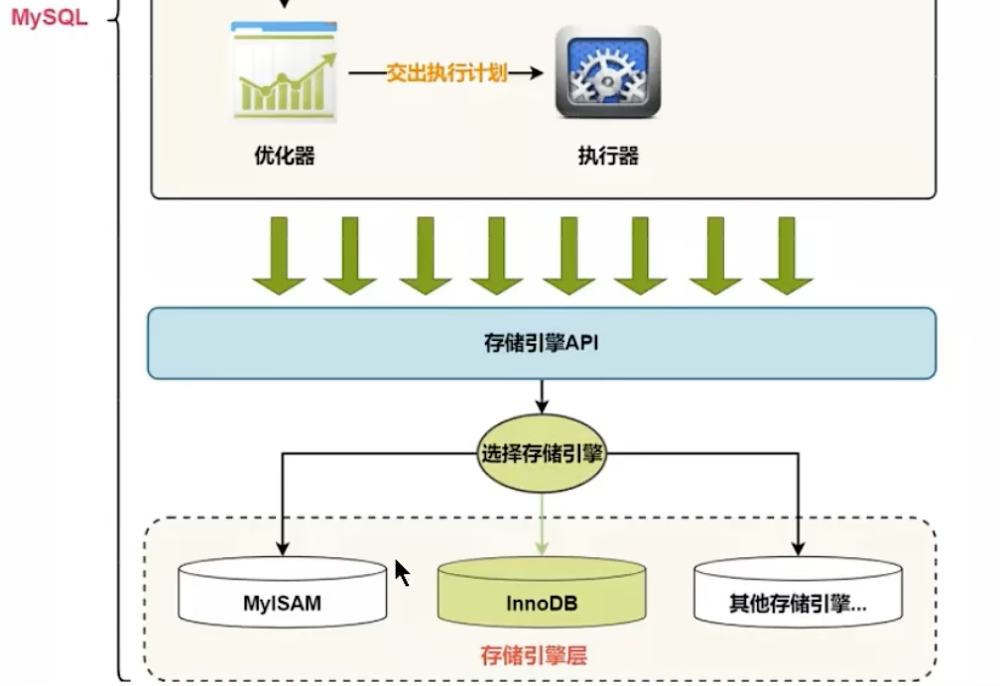

> <h1 id=""></h1>
- [**索引数据结构**](#索引数据结构)
	- [聚簇索引](#聚簇索引)
	- [二级索引(辅助索引、非聚簇索引)](#二级索引(辅助索引、非聚簇索引))
	- [联合索引](#联合索引)


<br/><br/><br/>

***
<br/>

> <h1 id="索引数据结构">索引数据结构</h1>
**表的行格式**

`行格式`指的是存储在表中的每一行数据的物理存储格式

```mysql
CREATE TABLE index_demo(
    c1 INT,
    c2 INT,
    c3 CHAR(1),
    PRIMARY KEY(c1)
) ROW_FORMAT = Compact;
```

这个新建的`index_demo`表中有2个INT类型的列，1个CHAR(1)类型的列，而且我们规定了**`c1列为主键`**，这个表使用`Compact`行格式来实际存储记录的。这里我们简化了index_demo表的行格式示意图：


- `record_type`：记录头信息的一项属性，表示记录的类型，**`0`表示普通记录、`1`表示目录项记录、`2`表示最小记录、`3`表示最大记录。**
- `next_record`：记录头信息的一项属性，表示下一条地址相对于本条记录的地址偏移量，我们用箭头来表明下一条记录是谁。
- `各个列的值`：这里只记录在`index_demo`表中的三个列，分别是`c1`、`c2`和`c3`。 
- `其他信息`：除了上述3种信息以外的所有信息，包括其他隐藏列的值以及记录的额外信息。

<br/>

将记录格式示意图的其他信息项暂时去掉并把它竖起来的效果就是这样：


***
<br/><br/><br/>
> <h2 id="聚簇索引">聚簇索引</h2>

最终生成的这个数据结构，它的名称是B+树。


叶子结点,比如**页10**其中**黄色的放入的是主键**,它们放入的是一条记录,即:索引即数据,所以查找比较快.

在InnoDB数据引擎中,数据、索引是放在一块的,这点和MyISAM引擎不太一样,它们是分开放的.

<br/>


一个B+树的节点其实可以分成好多层，规定最下边的那层，也就是存放我们用户记录的那层为第0层，之后依次往上加。之前我们做了一个非常极端的假设：存放用户记录的页最多存放3条记录，存放目录项记录的页最多存放4条记录。其实真实环境中一个页存放的记录数量是非常大的，假设所有存放用户记录的叶子节点代表的数据页可以存放100条用户记录，所有存放目录项记录的内节点代表的数据页可以存放1000条目录项记录，那么：

如果B+树只有1层，也就是只有1个用于存放用户记录的节点，最多能存放100条记录。
如果B+树有2层，最多能存放1000×100=10,0000条记录。
如果B+树有3层，最多能存放1000×1000×100=1,0000,0000条记录。
如果B+树有4层，最多能存放1000×1000×1000×100=1000,0000,0000条记录。相当多的记录！！！
你的表里能存放100000000000条记录吗？所以一般情况下，我们用到的B+树都不会超过4层，那我们通过主键值去查找某条记录最多只需要做4个页面内的查找（查找3个目录项页和一个用户记录页），又因为在每个页面内有所谓的Page Directory（页目录），所以在页面内也可以通过二分法实现快速定位记录。

<br/>

**聚簇索引**不仅是一种索引类型，也是**一种数据存储方式**（所有的用户记录都存储在了叶子结点），也就是所谓的`索引即数据，数据即索引(因为它的索引,直接对应一条数据,找到了索引,也就找到了数据)`。

> 聚簇索引中的“聚簇”指的是索引中存储数据行的方式。
>
> 索引键和实际数据行存储在同一个结构中，这种结构称为聚簇

<br/>

**特点：**

<b>1）使用记录主键值的大小进行记录和页的排序</b>，这包括三个方面的含义：

- `页内`的记录是按照主键的大小顺序排成一个`单向链表`。

- 各个存放`用户记录的页`也是根据页中用户记录的主键大小顺序排成一个`双向链表`。
- 存放`目录项记录的页`分为不同的层次，在同一层次中的页也是根据页中目录项记录的主键大小顺序排成一个`双向链表`。 

<b>2）B+树的`叶子节点`存储的是完整的用户记录。</b>

  所谓完整的用户记录，就是指这个记录中存储了所有列的值（包括隐藏列）。

我们把具有这两种特性的B+树称为聚簇索引，所有完整的用户记录都存放在这个`聚簇索引`的叶子节点处。这种聚簇索引并不需要我们在MySQL语句中显式的使用`INDEX`语句去创建，`InnoDB`存储引擎会`自动`的为我们创建聚簇索引。

<br/>

**优点：**

- `数据访问更快`，因为聚簇索引将索引和数据保存在同一个B+树中，因此从聚簇索引中获取数据比非聚簇索引更快
- 聚簇索引对于主键的`排序查找`和`范围查找`速度非常快
- 按照聚簇索引排列顺序，查询显示一定范围数据的时候，由于数据都是紧密相连，数据库不用从多个数据块中提取数据，所以`节省了大量的io操作`。

<br/>

**缺点：**

- `插入速度严重依赖于插入顺序`，按照主键的顺序插入是最快的方式，否则将会出现页分裂，严重影响性能。因此，对于InnoDB表，我们一般都会定义一个**自增ID列为主键**
- `更新主键的代价很高`，因为将会导致被更新的行移动。因此，对于InnoDB表，我们一般定义**主键为不可更新**
- `二级索引访问需要两次索引查找`，第一次找到主键值，第二次根据主键值找到行数据

<br/>

**限制：**

* 对于MySQL数据库，目前只有InnoDB数据引擎支持聚簇索引，而MyISAM并不支持聚簇索引。
* 由于数据物理存储排序方式只能有一种，所以每个MySQL的`表只能有一个聚簇索引`。一般情况下就是该表的主键。
* 如果没有定义主键，Innodb会选择`非空的唯一索引`代替。如果没有这样的索引，Innodb会隐式的定义一个主键
  来作为聚簇索引。
* 为了充分利用聚簇索引的聚簇的特性，所以innodb表的主键列尽量`选用有序的顺序id`，而不建议用无序的id,
  比如UUID, MD5, HASH, 字符串列作为主键无法保证数据的顺序增长。


***
<br/><br/><br/>
> <h2 id="二级索引(辅助索引、非聚簇索引)">二级索引(辅助索引、非聚簇索引)</h2>

因为每个MySQL的**`表只能有一个聚簇索引`**，一般情况下就是该表的主键

* 以表中的非主键列或者列组合建立的索引即为`二级索引`

  当非主键列作为查询或者连表、排序等操作的条件时，为了提高效率，就可以以非主键列建立二级索引

* 二级索引不存储完整的行数据，只包含索引列及主键信息

  因为每建立一颗B+树都把所有的用户记录再拷贝一遍，太浪费存储空间了。

* 因为数据和索引分开存储，所以二级索引属于**非聚簇索引**

<br/>

* **概念：回表** 根据二级索引的B+树只能确定要查找记录的主键值，如果想查找到完整的用户记录的话，仍然需要到`聚簇索引`中再查一遍，这个过程称为`回表`。查询一条完整的用户记录需要使用到`2`棵B+树！

* **二级索引的目录项**，包含主键值，索引列，页号，**从而保证目录项的唯一性**

  因为二级索引列的值是可以重复的，而主键是唯一的。
  
<br/>




- **如上图:** 
	- 在子节点中,黄色是主键,蓝色对应的是二级索引,这个要分清;
	- 蓝色可能相同,但是对应的主键不同;
		- 比如: 找**c2:4**的数据,我们通过二分法先找到**页44**下的`(2, 42)`记录,因为**c2:4**的`4比2大,比9小`,要知道`(2, 42)`存放的**2是其记录中最小的**;
			- 然后通过`(2, 42)`找到页记录**页42**,我们可以发现比**c2:4**中的**4**`小于和等于`的有**`‌(2,4)、(4,35)`**才符合,这个是为什么呢?
				- 因为**`‌(2,4)、(4,35)`**的记录中, **(2,4)** 后面的数据记录可能有**4**,因为它的最小值是**2, 它是递增的**. 而**‌(4,35)** 包含了**4**,它肯定有了.
				- 通过查找,我们在其子节点中找到了.
		- 比如: **`select  from index_demo where c2 = 4`** 这个SQL语句中, `*`表示`c1, c2, c3`的数据,从其子节点中,我们可以可以找到**`c2, c1(c1是主键)`**,但是**c3怎么查找呢?**
			- 这就谈到了**回表**这个概念了,我们在其**🍃叶子结点(4,1)、(4,4)、(4,10)** 找到主键**`4、10、1`**,然后通过**聚簇索引**找到**c3**数据.这个过程就是**回表.**

***
<br/><br/><br/>
> <h2 id="联合索引">联合索引</h2>


`联合索引`同时以多个列的大小作为排序规则，也就是同时以多个列建立索引

例如B+树按照`c2和c3列`的大小进行排序，这个包含两层含义：

- 先把各个记录和页按照c2列进行排序。

- 在记录的c2列相同的情况下，采用c3列进行排序

以c2和c3列的大小为排序规则建立的B+树称为`联合索引`

联合索引可以是聚簇索引也可以是非聚簇索引，当联合索引包含主键列时，就会建立聚簇索引


<br/>

```sql

```

<br/>

```sql

```

<br/>

```sql

```

<br/>

```sql

```

