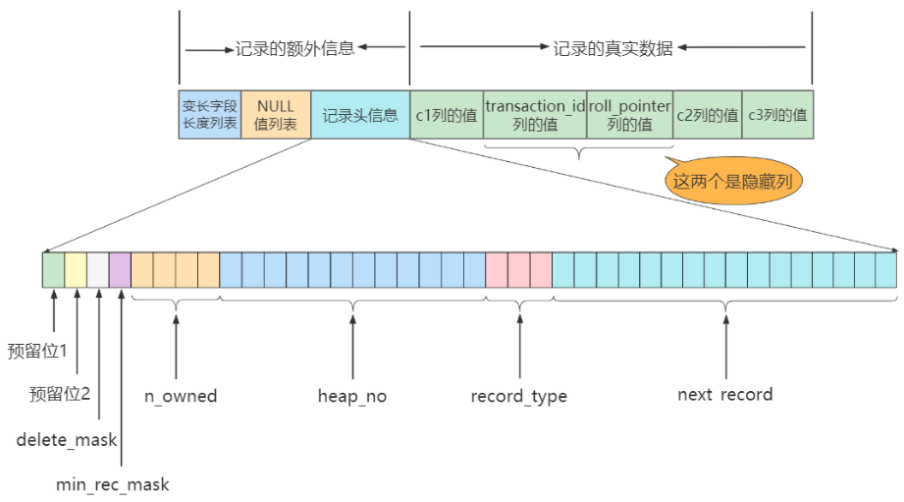

> <h1 id=""></h1>
- [**索引数据结构**](#索引数据结构)
	- [聚簇索引(InnoDB用的)](#聚簇索引)
	- [二级索引(辅助索引、非聚簇索引)](#二级索引(辅助索引、非聚簇索引))
	- [联合索引](#联合索引)
	- [InnoDB需要知道的注意事项](#InnoDB需要知道的注意事项)
		- [InnoDB根页面位置万年不动](#InnoDB根页面位置万年不动)
		- [InnoDB内节点中目录项记录的唯一性](#InnoDB内节点中目录项记录的唯一性)
		- [InnoDB一个页面最少可以存储2条记录](#InnoDB一个页面最少可以存储2条记录)
	- [MyISAM索引的原理](#MyISAM索引的原理)
	- [MyISAM与InnoDB对比](#MyISAM与InnoDB对比)
	- [B+树和其他数据结构查找比较](#B+树和其他数据结构查找比较)
		- [为了减少IO，索引树会一次性加载吗？](#为了减少IO，索引树会一次性加载吗？)	
		- [B+树的存储能力如何？为何说一般查找行记录，最多只需1~3次磁盘IO	](#B+树的存储能力如何？为何说一般查找行记录，最多只需1~3次磁盘IO)
		- [为什么说B+树比B-树更适合实际应用中操作系统的文件索引和数据库索引？](#为什么说B+树比B-树更适合实际应用中操作系统的文件索引和数据库索引？) 
		- [Hash索引与B+树索引是在建索引的时候手动指定的吗？](#Hash索引与B+树索引是在建索引的时候手动指定的吗？)
- [**InnoDB数据存储结构**](#InnoDB数据存储结构)
	- [页的大小](#页的大小) 
	- [页的上层结构](#页的上层结构) 
	- [行溢出](#行溢出) 
	- [COMPACT行格式](#COMPACT行格式)
		- [变长字段长度列表](#变长字段长度列表)  [NULL值列表（NULL bitmap） ](#NULL值列表（NULLbitmap）)
		- [记录头信息（5字节）](#记录头信息（5字节）) 
		- [记录的真实数据](#记录的真实数据)
	- [**‌索引的创建与设计**](#**‌索引的创建与设计**)
		- [索引的分类](#索引的分类)
			- [普通索引](#普通索引) 
			- [唯一性索引](#唯一性索引) 
			- [主键索引](#主键索引) 
			- [单列索引](#单列索引) 
			- [多列（组合、联合）索引](#多列（组合、联合）索引) 
			- [全文索引](#全文索引)
			- [空间索引](#空间索引)
		- [创建表的时候创建索引](#创建表的时候创建索引)
			- [隐式的创建索引](#隐式的创建索引)
			- [显式创建索引](#显式创建索引)
				- [创建普通索引](#创建普通索引) 
					- [查看索引](#查看索引) 
					- [性能分析工具:EXPLAIN](#性能分析工具:EXPLAIN)
				- [创建唯一索引](#创建唯一索引)
				- [主键索引](#主键索引) 
				- [创建单列索引](#创建单列索引) 
				- [创建组合索引](#创建组合索引) 
				- [创建全文索引](#创建全文索引) 
				- [创建空间索引](#创建空间索引)
			- [在已经存在的表上创建索引](#在已经存在的表上创建索引) 
			- [删除索引](#删除索引)
		- [**哪些情况适合创建索引**](#哪些情况适合创建索引)
			- [字段的数值有唯一性的限制](#字段的数值有唯一性的限制)  
			- [频繁作为WHERE查询条件的字段](#频繁作为WHERE查询条件的字段) 
			- [经常GROUP_BY和ORDER_BY的列](#经常GROUP_BY和ORDER_BY的列) 
			- [UPDATE、DELETE的WHERE条件列](#UPDATE、DELETE的WHERE条件列) 
			- [DISTINCT字段需要创建索引](#DISTINCT字段需要创建索引) 
			- [多表JOIN连接操作时，创建索引注意事项](#多表JOIN连接操作时，创建索引注意事项) 
			- [使用列的类型小的创建索引](#使用列的类型小的创建索引)
			- [使用字符串前缀创建索引 ](#使用字符串前缀创建索引 )
			- [区分度高(散列性高)的列适合作为索引](#区分度高(散列性高)的列适合作为索引)
			- [使用最频繁的列放到联合索引的左侧](#使用最频繁的列放到联合索引的左侧)
			- [在多个字段都要创建索引的情况下，联合索引优于单值索引](#在多个字段都要创建索引的情况下，联合索引优于单值索引)
		- [限制索引的数目](#限制索引的数目)	
		- [哪些情况不适合创建索引](#哪些情况不适合创建索引)
			- [在where中使用不到的字段，不要设置索引](#在where中使用不到的字段，不要设置索引) 
			- [数据量小的表最好不要使用索引](#数据量小的表最好不要使用索引) 
			- [有大量重复数据的列上不要建立索引](#有大量重复数据的列上不要建立索引) 
			- [避免对经常更新的表创建过多的索引](#避免对经常更新的表创建过多的索引) 
			- [不建议用无序的值作为索引](#不建议用无序的值作为索引) 
			- [删除不再使用或者很少使用的索引](#删除不再使用或者很少使用的索引)
- [**性能分析工具**](#性能分析工具)
	- [优化步骤](#优化步骤) 
	- [查看系统性能参数](#查看系统性能参数) 
	- [日常开发性能注意点](#日常开发性能注意点)
	- [EXPLAIN工具使用](#EXPLAIN工具使用)
		- [基本语法](#基本语法)
			- [type（重点）](#type（重点）)
			- [rows（重点）](#rows（重点）)
			- [Extra重点](#Extra重点)
	- [EXPLAIN四种输出格式](#EXPLAIN四种输出格式)
		- [传统格式](#传统格式) 
		- [JSON格式](#JSON格式) 
		- [TREE格式](#TREE格式) 
		- [可视化输出](#可视化输出) 
	- [SHOW WARNINGS的使用](#SHOWWARNINGS的使用) 
	- [分析优化器执行计划：trace	](#分析优化器执行计划：trace	)
	- [MySQL监控分析视图-sys schema](#MySQL监控分析视图-sysschema)
		- [索引情况](#索引情况) 
		- [表相关](#表相关) 
		- [语句相关](#语句相关) 
		- [IO相关](#IO相关) 
		- [Innodb相关](#Innodb相关)


<br/><br/><br/>

***
<br/>

> <h1 id="索引数据结构">索引数据结构</h1>
**表的行格式**

`行格式`指的是存储在表中的每一行数据的物理存储格式

```mysql
CREATE TABLE index_demo(
    c1 INT,
    c2 INT,
    c3 CHAR(1),
    PRIMARY KEY(c1)
) ROW_FORMAT = Compact;
```

这个新建的`index_demo`表中有2个INT类型的列，1个CHAR(1)类型的列，而且我们规定了 **`c1列为主键`**，这个表使用`Compact`行格式来实际存储记录的。这里我们简化了index_demo表的行格式示意图：


- `record_type`：记录头信息的一项属性，表示记录的类型，**`0`表示普通记录、`1`表示目录项记录、`2`表示最小记录、`3`表示最大记录。**
- `next_record`：记录头信息的一项属性，表示下一条地址相对于本条记录的地址偏移量，我们用箭头来表明下一条记录是谁。
- `各个列的值`：这里只记录在`index_demo`表中的三个列，分别是`c1`、`c2`和`c3`。 
- `其他信息`：除了上述3种信息以外的所有信息，包括其他隐藏列的值以及记录的额外信息。

<br/>

将记录格式示意图的其他信息项暂时去掉并把它竖起来的效果就是这样：


***
<br/><br/><br/>
> <h2 id="聚簇索引">聚簇索引</h2>

最终生成的这个数据结构，它的名称是B+树。


叶子结点,比如**页10**其中**黄色的放入的是主键**,它们放入的是一条记录,即:索引即数据,所以查找比较快.

在InnoDB数据引擎中,数据、索引是放在一块的,这点和MyISAM引擎不太一样,它们是分开放的.

<br/>


一个B+树的节点其实可以分成好多层，规定最下边的那层，也就是存放我们用户记录的那层为第0层，之后依次往上加。之前我们做了一个非常极端的假设：存放用户记录的页最多存放3条记录，存放目录项记录的页最多存放4条记录。其实真实环境中一个页存放的记录数量是非常大的，假设所有存放用户记录的叶子节点代表的数据页可以存放100条用户记录，所有存放目录项记录的内节点代表的数据页可以存放1000条目录项记录，那么：

- 如果B+树只有1层，也就是只有1个用于存放用户记录的节点，最多能存放100条记录。
- 如果B+树有2层，最多能存放1000×100=10,0000条记录。
- 如果B+树有3层，最多能存放1000×1000×100=1,0000,0000条记录。
- 如果B+树有4层，最多能存放1000×1000×1000×100=1000,0000,0000条记录。相当多的记录！！！

你的表里能存放100000000000条记录吗？所以一般情况下，我们用到的B+树都不会超过4层，那我们通过主键值去查找某条记录最多只需要做4个页面内的查找（查找3个目录项页和一个用户记录页），又因为在每个页面内有所谓的Page Directory（页目录），所以在页面内也可以通过二分法实现快速定位记录。

<br/>

**聚簇索引**不仅是一种索引类型，也是**一种数据存储方式**（所有的用户记录都存储在了叶子结点），也就是所谓的`索引即数据，数据即索引(因为它的索引,直接对应一条数据,找到了索引,也就找到了数据)`。

> 聚簇索引中的“聚簇”指的是索引中存储数据行的方式。
>
> 索引键和实际数据行存储在同一个结构中，这种结构称为聚簇

<br/>

**特点：**

<b>1）使用记录主键值的大小进行记录和页的排序</b>，这包括三个方面的含义：

- `页内`的记录是按照主键的大小顺序排成一个`单向链表`。

- 各个存放`用户记录的页`也是根据页中用户记录的主键大小顺序排成一个`双向链表`。
- 存放`目录项记录的页`分为不同的层次，在同一层次中的页也是根据页中目录项记录的主键大小顺序排成一个`双向链表`。 

<b>2）B+树的`叶子节点`存储的是完整的用户记录。</b>

  所谓完整的用户记录，就是指这个记录中存储了所有列的值（包括隐藏列）。

我们把具有这两种特性的B+树称为聚簇索引，所有完整的用户记录都存放在这个`聚簇索引`的叶子节点处。这种聚簇索引并不需要我们在MySQL语句中显式的使用`INDEX`语句去创建，`InnoDB`存储引擎会`自动`的为我们创建聚簇索引。

<br/>

**优点：**

- `数据访问更快`，因为聚簇索引将索引和数据保存在同一个B+树中，因此从聚簇索引中获取数据比非聚簇索引更快
- 聚簇索引对于主键的`排序查找`和`范围查找`速度非常快
- 按照聚簇索引排列顺序，查询显示一定范围数据的时候，由于数据都是紧密相连，数据库不用从多个数据块中提取数据，所以`节省了大量的io操作`。

<br/>

**缺点：**

- `插入速度严重依赖于插入顺序`，按照主键的顺序插入是最快的方式，否则将会出现页分裂，严重影响性能。因此，对于InnoDB表，我们一般都会定义一个**自增ID列为主键**
- `更新主键的代价很高`，因为将会导致被更新的行移动。因此，对于InnoDB表，我们一般定义**主键为不可更新**
- `二级索引访问需要两次索引查找`，第一次找到主键值，第二次根据主键值找到行数据

<br/>

**限制：**

* 对于MySQL数据库，目前只有InnoDB数据引擎支持聚簇索引，而MyISAM并不支持聚簇索引。
* 由于数据物理存储排序方式只能有一种，所以每个MySQL的`表只能有一个聚簇索引`。一般情况下就是该表的主键。
* 如果没有定义主键，Innodb会选择`非空的唯一索引`代替。如果没有这样的索引，Innodb会隐式的定义一个主键
  来作为聚簇索引。
* 为了充分利用聚簇索引的聚簇的特性，所以innodb表的主键列尽量`选用有序的顺序id`，而不建议用无序的id,
  比如UUID, MD5, HASH, 字符串列作为主键无法保证数据的顺序增长。


***
<br/><br/><br/>
> <h2 id="二级索引(辅助索引、非聚簇索引)">二级索引(辅助索引、非聚簇索引)</h2>

因为每个MySQL的 **`表只能有一个聚簇索引`**，一般情况下就是该表的主键

* 以表中的非主键列或者列组合建立的索引即为`二级索引`

  当非主键列作为查询或者连表、排序等操作的条件时，为了提高效率，就可以以非主键列建立二级索引

* 二级索引不存储完整的行数据，只包含索引列及主键信息

  因为每建立一颗B+树都把所有的用户记录再拷贝一遍，太浪费存储空间了。

* 因为数据和索引分开存储，所以二级索引属于**非聚簇索引**

<br/>

* **概念：回表** 根据二级索引的B+树只能确定要查找记录的主键值，如果想查找到完整的用户记录的话，仍然需要到`聚簇索引`中再查一遍，这个过程称为`回表`。查询一条完整的用户记录需要使用到`2`棵B+树！

* **二级索引的目录项**，包含主键值，索引列，页号，**从而保证目录项的唯一性**

  因为二级索引列的值是可以重复的，而主键是唯一的。
  
<br/><br/>


- **如上图:** 
	- 在子节点中,黄色是主键,蓝色对应的是二级索引,这个要分清;
	- 蓝色可能相同,但是对应的主键不同;
		- 比如: 找**c2:4**的数据,我们通过二分法先找到**页44**下的`(2, 42)`记录,因为**c2:4**的`4比2大,比9小`,要知道`(2, 42)`存放的**2是其记录中最小的**;
			- 然后通过`(2, 42)`找到页记录**页42**,我们可以发现比**c2:4**中的**4**`小于和等于`的有**`‌(2,4)、(4,35)`**才符合,这个是为什么呢?
				- 因为**`‌(2,4)、(4,35)`**的记录中, **(2,4)** 后面的数据记录可能有**4**,因为它的最小值是**2, 它是递增的**. 而**‌(4,35)** 包含了**4**,它肯定有了.
				- 通过查找,我们在其子节点中找到了.
		- 比如: **`select  from index_demo where c2 = 4`** 这个SQL语句中, `*`表示`c1, c2, c3`的数据,从其子节点中,我们可以可以找到**`c2, c1(c1是主键)`**,但是**c3怎么查找呢?**
			- 这就谈到了**回表**这个概念了,我们在其**🍃叶子结点(4,1)、(4,4)、(4,10)** 找到主键**`4、10、1`**,然后通过**聚簇索引**找到**c3**数据.这个过程就是**回表.**

<br/><br/>
> <h3 id="为什么需要一次回表操作?">为什么需要一次回表操作?</h3>

若是把完整的用户记录放到叶子结点是可以不用回表.但是**太占内存空间了**.相当于每建立一棵B+树都需要把所有的用户记录再拷贝一遍,太浪费存储空间了.

回表好处: 按照这种**非主键列**建立的B+树需要一次回表操作才可以定位到完整的用户记录,所以这种B+树也被称为**二级索引**,或者**辅助索引**.由于我们使用的是c2列的大小作为B+树的排序规则,所以我们也称这个B+树是为c2列建立的索引.


***
<br/><br/><br/>
> <h2 id="联合索引">联合索引</h2>
`联合索引`同时以多个列的大小作为排序规则，也就是同时以多个列建立索引

- 例如B+树按照`c2和c3列`的大小进行排序，这个包含两层含义：
	- 先把各个记录和页按照c2列进行排序。
	- 在记录的c2列相同的情况下，采用c3列进行排序

以c2和c3列的大小为排序规则建立的B+树称为`联合索引`

联合索引可以是聚簇索引也可以是非聚簇索引，当联合索引包含主键列时，就会建立聚簇索引

<br/>


- **如图所示:**
	- 每条目录记录都是由c2、c3、页号3个部分组成,每条记录先按照c2列的值进行排序,如果记录的c2列值相同,则按照c3列的值进行排序;
	- 每条叶子🍃结点都是由**c2 (蓝色)、c3(紫色)、c1主键(橙黄色)[c2、c3组成联合索引]** 组成;


***
<br/><br/><br/>
> <h2 id="InnoDB需要知道的注意事项">**InnoDB根页面位置万年不动</h2>**
<br/>

> <h3 id="InnoDB根页面位置万年不动">InnoDB根页面位置万年不动</h3>

- **实际上B+树的形成过程：**
	- 每当为某个表创建一个B+树索引（聚簇索引不是人为创建的，默认就有）的时候，都会为这个索引创建一个`根节点`页面。最开始表中没有数据的时候，每个B+树索引对应的`根节点`中既没有用户记录，也没有目录项记录。
	- 随后向表中插入用户记录时，先把用户记录存储到这个`根节点`中。
	- 当根节点中的可用`空间用完时`继续插入记录，此时会将根节点中的所有记录复制到一个新分配的页，比如`页a`中，然后对这个新页进行`页分裂`的操作，得到另一个新页，比如`页b`。这时新插入的记录根据键值（也就是聚簇索引中的主键值，二级索引中对应的索引列的值）的大小就会被分配到`页a`或者`页b`中，而`根节点`便升级为存储目录项记录的页。

这个过程特别注意的是：一个B+树索引的根节点自诞生之日起，便不会再移动。这样只要我们对某个表建立一个索引，那么它的根节点的页号便会被记录到某个地方，然后凡是`InnoDB`存储引擎需要用到这个索引的时候，都会从那个固定的地方取出根节点的页号，从而来访问这个索引。

<br/><br/>
> <h3 id="InnoDB内节点中目录项记录的唯一性">InnoDB内节点中目录项记录的唯一性</h3>

我们知道B+树索引的内节点中目录项记录的内容是`索引列+页号`的搭配，但是这个搭配对于二级索引来说有点不严谨。还拿`index_demo`表为例，假设这个表中的数据是这样的：

| c1   | c2   | c3   |
| ---- | ---- | ---- |
| 1    | 1    | 'u'  |
| 3    | 1    | 'd'  |
| 5    | 1    | 'y'  |
| 7    | 1    | 'a'  |

如果二级索引中目录项的内容只是`索引号+页号`的搭配的话，那么为`c2`列建立索引后的B+树应该长这样：


<br/>

如果我们想要新插入一行记录，其中`c1`、`c2`、`c3`的值分别是：`9`、`1`、`c`，那么在修改这个为c2列建立的二级索引对应的B+树时便碰到了个大问题：由于`页3`中存储的目录项记录是由`c2列+页号`的值构成的，`页3`中的两条目录项记录对应的c2列的值都是`1`，那么我们这条新插入的记录到底应该放在`页4`中，还是应该放在`页5`中啊？答案是：对不起，懵了。

为了让新插入记录能找到自己在哪个页里，我们需要**保证在B+树的同一层内节点的目录项记录除页号这个字段以外是唯一的。**所以对于二级索引的内节点的目录项记录的内容实际上是由三个部分构成的：

- 索引列的值
- 主键值
- 页号

也就是我们把`主键值`也添加到二级索引内节点中的目录项记录了，这样就能保证B+树每一层节点中各条目录项记录除页号这个字段外是唯一的，所以我们为c2列建立二级索引后的示意图实际上应该是这样子的：


这样我们再插入记录`(9, 1, 'c')`时，由于`页3`中存储的目录项记录是由`c2列+主键+页号`的值构成的，可以先把新记录的`c2`列的值和`页3`中各目录项记录的`c2`列的值作比较，如果`c2`列的值相同的话，可以接着比较主键值，因为B+树同一层中不同目录项记录的`c2列+主键`的值肯定是不一样的，所以最后肯定能定位唯一的一条目录项记录，在本例中最后确定新记录应该被插入到`页5`中。


<br/><br/>
> <h3 id="InnoDB一个页面最少可以存储2条记录">InnoDB一个页面最少可以存储2条记录</h3>

一个B+树只需要很少的层级就可以轻松存储数亿条记录，查询速度相当不错！这是因为B+树本质上就是一个大的多层级目录，每经过一个目录时都会过滤掉许多无效的子目录，直到最后访问的存储真实数据的目录。那如果一个大的目录中只存放一个子目录是个啥效果呢？那就是目录层非常多，而且最后的那个存放真实数据的目录中存放一条记录。费了半天劲只能存放一条真实的用户记录？所以InnoDB的一个数据页至少可以存放两条记录


***
<br/><br/><br/>
> <h2 id="MyISAM索引的原理">MyISAM索引的原理</h2>
- MyISAM引擎文件结构:
	- xxx_387.sdi: 存储表的数据结构;
	- xxx.MYD: 存储表数据;
	- xxx.MYI: 存储表索引

InnoDB中索引即数据，也就是聚簇索引的那棵B+树的叶子节点包含所有完整的用户记录，而MyISAM的索引方案虽然也使用树形结构，但是却将`索引和数据分开存储`：

- 将表中的记录`按照记录的插入顺序`单独存储在一个文件中，称之为`数据文件`。这个文件并不划分为若干个数据页，有多少记录就往这个文件中塞多少记录。由于在插入数据的时候并**没有刻意按照主键大小排序**，所以并不能在这些数据上使用二分法进行查找。
- 使用`MyISAM`存储引擎的表会把索引信息另外存储到一个称为`索引文件`的另一个文件中。MyISAM会单独为表的主键创建一个索引，索引的叶子节点中存储的不是完整的用户记录，而是**主键值 + 数据记录地址**的组合。


这里表一共有三列，假设我们以Col1为主键，上图是一个MyISAM表的主索引（Primary key）示意。可以看出
**MyISAM的索引文件仅仅保存数据记录的地址**。在MyISAM中，主键索引和二级索引（Secondary key）在结构上没有任何区别，只是主键索引要求key是唯一的，而二级索引的key可以重复。如果我们在Col2上建立一个二级索
引，则此索引的结构如下图所示：


***
<br/><br/><br/>
> <h2 id="MyISAM与InnoDB对比">MyISAM与InnoDB对比</h2>
**MyISAM的索引方式都是“非聚簇”的，与InnoDB包含1个聚簇索引是不同的。**

**小结两种引擎中索引的区别：**

① 在InnoDB存储引擎中，我们只需要根据主键值对`聚簇索引`进行一次查找就能找到对应的记录，而在`MyISAM`中却需要进行一次`回表`操作，意味着MyISAM中建立的索引相当于全部都是`二级索引`。 

② InnoDB的数据文件本身就是索引文件，而MyISAM索引文件和数据文件是`分离的`，索引文件仅保存数据记录的地址。

③ InnoDB的非聚簇索引data域存储相应记录**`主键的值`**，而MyISAM索引记录的是**`地址`**。换句话说，InnoDB的所有非聚簇索引都引用主键作为data域。

④ MyISAM的回表操作是十分`快速`的，**因为是拿着地址偏移量直接到文件中取数据的，反观InnoDB是通过获取主键之后再去聚簇索引里找记录**，虽然说也不慢，但还是比不上直接用地址去访问。

⑤ InnoDB要求表`必须有主键`（`MyISAM可以没有`）。如果没有显式指定，则MySQL系统会自动选择一个可以非空且唯一标识数据记录的列作为主键。如果不存在这种列，则MySQL自动为InnoDB表生成一个隐含字段作为主键，这个字段长度为6个字节，类型为长整型。

<br/><br/>

**小结：**

了解不同存储引擎的索引实现方式对于正确使用和优化索引都非常有帮助。比如：

举例1：知道了InnoDB的索引实现后，就很容易明白`为什么不建议使用过长的字段作为主键`，因为所有二级索引都
引用主键索引，过长的主键索引会令二级索引变得过大。数据页大小固定，数据项越大，单页存储的记录数越少，B+数的层级越多。

举例2：用非单调的字段作为主键在InnoDB中不是个好主意，因为InnoDB数据文件本身是一棵B+Tree，非单调的
主键会造成在插入新记录时，数据文件为了维持B+Tree的特性而频繁的分裂调整，十分低效，而`使用自增字段作
为主键则是一个很好的选择`。


***
<br/><br/><br/>
> <h2 id="B+树和其他数据结构查找比较">B+树和其他数据结构查找比较</h2>

<br/><br/>
> <h3 id="为了减少IO，索引树会一次性加载吗？">为了减少IO，索引树会一次性加载吗？</h3>

- 1、数据库索引是存储在磁盘上的，如果数据量很大，必然导致索引的大小也会很大，超过几个G。

- 2、当我们利用索引查询时候，是不可能将全部几个G的索引都加载进内存的，我们能做的只能是：逐一加载每一个磁盘页，因为磁盘页对应着索引树的节点。

<br/><br/>
> <h3 id="B+树的存储能力如何？为何说一般查找行记录，最多只需1~3次磁盘IO">B+树的存储能力如何？为何说一般查找行记录，最多只需1~3次磁盘IO</h3>

- InnoDB存储引擎中页的大小为16KB，一般表的主键类型为INT(占用4个字节)或BIGINT(占用8个字节)，指针类型也一般为4或8个字节，也就是说一个页（B+Tree中的一个节点）中大概存储16KB/(8B+8B)=1K个键值，因为是估算，为了方便计算，这里的K取值为10^3。也就是说一个深度为3的B+Tree索引可以维护10^3 * 10^3 * 10^3 = 10亿条记录。（这里假定一个数据页也存储10^3条行记录数据了）

- 实际情况中每个节点可能不能填充满，因此在数据库中，`B+Tree的高度一般都在2~4层`。MySQL的InnoDB存储引擎在设计时是将根节点常驻内存的，也就是说查找某一键值的行记录时最多只需要1~3次磁盘I/O操作

<br/><br/>
> <h3 id="为什么说B+树比B-树更适合实际应用中操作系统的文件索引和数据库索引？">为什么说B+树比B-树更适合实际应用中操作系统的文件索引和数据库索引？</h3>

- 1.B+树的磁盘读写代价更低
	- B+树的内部结点并没有指向关键字具体信息的指针。因此其内部结点相对于B树更小。如果把所有同一内部结点的关键字存放在同一盘块中，那么盘块所能容纳的关键字数量也越多。一次性读入内存中的需要查找的关键字也就越多。相对来说IO读写次数也就降低了。

- 2、B+树的查询效率更加稳定
	- 由于非终结点并不是最终指向文件内容的节点，而只是叶子结点中关键字的索引。所有任何关键字的查找必须走一条从根结点到叶子结点的路。所有关键字查询的路径长度相同，导致每一个数据的查询效率相当。

<br/><br/>
> <h3 id="Hash索引与B+树索引的区别">Hash索引与B+树索引的区别</h3>
- 1、Hash索引`不能进行范围查询`，而B+树可以。这是因为Hash索引指向的数据是无序的，而B+树的叶子节点是个有序的链表。

- 2、Hash索引`不支持联合索引的最左侧原则`（即联合索引的部分索引无法使用），而B+树可以。对于联合索引来说，Hash索引在计算Hash值的时候是将索引键合并后再一起计算Hash值，所以不会针对每个索引单独计算Hash值。因此如果用到联合索引的一个或者几个索引时，联合索引无法被利用。

- 3、Hash索引`不支持 ORDER BY 排序`，因为Hash索引指向的数据是无序的，因此无法起到排序优化的作用，而B+树索引数据是有序的，可以起到对该字段ORDER BY排序优化的作用。同理，我们也无法用Hash索引进行`模糊查询`，而B+树使用LIKE进行模糊查询的时候，LIKE后面后模糊查询（比如%结尾）的话就可以起到优化作用。

- 4、`InnoDB不支持哈希索引`

<br/><br/>
> <h3 id="Hash索引与B+树索引是在建索引的时候手动指定的吗？">Hash 索引与 B+ 树索引是在建索引的时候手动指定的吗？</h3>

针对InnoDB和MyISAM存储引擎，都会默认采用B+树索引，而非使用Hash索引。InnoDB提供的自适应Hash是不需要手动指定的。如果是Memory/Heap和NDB存储引擎，则可以选择使用Hash索引。


<br/><br/><br/>

***
<br/>

> <h1 id="InnoDB数据存储结构">InnoDB数据存储结构</h1>
<br/>

> <h2 id="页的大小">页的大小</h2>

不同的数据库管理系统（简称DBMS）的页大小不同。比如在MySQL的InnoDB存储引擎中，默认页的大小是 `16KB`，可以通过下面的命令来进行查看：

```mysql
show variables like '%innodb_page_size%';
+------------------+-------+
| Variable_name    | Value |
+------------------+-------+
| innodb_page_size | 16384 |
+------------------+-------+
```

SQL Server中页的大小为`8KB`，而在Oracle中用术语"`块`"（Block）来表示"页"，Oracle支持的块大小为2KB, 4KB, 8KB, 16KB, 32KB和64KB。


***
<br/><br/><br/>
> <h2 id="页的上层结构">页的上层结构</h2>
另外在数据库中，还存在着区（Extent）、段（Segment）和表空间（Tablespace）的概念。

行、页、区、段、表空间的关系如下图所示：


区（Extent）是比页大一级的存储结构，在InnoDB存储引擎中，一个区会分配`64个连续的页`。因为InnoDB中的页大小默认是16KB，所以一个区的大小是64*16KB=`1MB`。

段（Segment）由一个或多个区组成，区在文件系统是一个连续分配的空间（在InnoDB中是连续的64个页），不过在段中不要求区与区之间是相邻的。`段是数据库中的分配单位，不同类型的数据库对象以不同的段形式存在。`当我们创建数据表、索引的时候，就会相应创建对应的段，比如创建一张表时会创建一个表段，创建一个索引时会创建一个索引段。

表空间（Tablespace）是一个逻辑容器，表空间存储的对象是段，在一个表空间中可以有一个或多个段，但是一个段只能属于一个表空间。数据库由一个或多个表空间组成，表空间从管理上可以划分为`系统表空间`、`用户表空间`、`撤销表空间`、`临时表空间`等。


***
<br/><br/><br/>
> <h2 id="COMPACT行格式">COMPACT行格式</h2>
在MySQL 5.1版本中，默认设置为Compact行格式。一条完整的记录其实可以被分为`记录的额外信息`和`记录的真实数据`两大部分。


<br/><br/>
> <h3 id="变长字段长度列表">变长字段长度列表</h3>
MySQL支持一些变长的数据类型，比如VARCHAR(M)、VARBINARY(M)、TEXT类型，BLOB类型，这些数据类型修饰列称为`变长字段`，变长字段中存储多少字节的数据不是固定的，所以我们在存储真实数据的时候需要顺便把这些数据占用的字节数也存起来。`在Compact行格式中，把所有变长字段的真实数据占用的字节长度都存放在记录的开头部位，从而形成一个变长字段长度列表。`

>  注意：这里面存储的变长长度和字段顺序是反过来的。比如两个varchar字段在表结构的顺序是a(10)，b(15)。那么在变长字段长度列表中存储的长度顺序就是15，10，是反过来的。

<b>举例</b>

```mysql
CREATE TABLE record_test_table (
	col1 VARCHAR(8),
	col2 VARCHAR(8) NOT NULL,
	col3 CHAR(8),
	col4 VARCHAR(8)
) CHARSET=ascii ROW_FORMAT=COMPACT;
```

以record_test_table表中的第一条记录举例：因为record_test_table表的col1、col2、col4列都是VARCHAR(8)类型的，所以这三个列的值的长度都需要保存在记录开头处，注意record_test_table表中的各个列都使用的是ascii字符集（每个字符只需要1个字节来进行编码）。

| 列名 | 存储内容 | 内容长度（十进制表示） | 内容长度（十六进制表示） |
| ---- | -------- | ---------------------- | ------------------------ |
| col1 | zhangsan | 8                      | 0x08                     |
| col2 | lisi     | 4                      | 0x04                     |
| col4 | songhk   | 6                      | 0x06                     |

又因为这些长度值需要按照列的逆序存放，所以最后变长字段长度列表的字节串用十六进制表示的效果就是（各个字节之间实际上没有空格，用空格隔开只是方便理解）：
06 04 08 

把这个字节串组成的变长字段长度列表填入上边的示意图中的效果就是：


<br/><br/>
> <h3 id="NULL值列表（NULLbitmap）">NULL值列表（NULL bitmap）</h3>
Compact行格式会把可以为NULL的列统一管理起来，存在一个标记为NULL值列表中。如果表中没有允许存储 NULL 的列，则 NULL值列表也不存在了。

**为什么定义NULL值列表？**

之所以要存储NULL是因为数据都是需要对齐的，如果`没有标注出来NULL值的位置`，就有可能在查询数据的时候`出现混乱`。如果使用`一个特定的符号`放到相应的数据位表示空置的话，虽然能达到效果，但是这样很浪费空间，所以直接就在行数据得头部开辟出一块空间专门用来记录该行数据哪些是非空数据，哪些是空数据，格式如下：

* 二进制位的值为1时，代表该列的值为NULL。

* 二进制位的值为0时，代表该列的值不为NULL。

> 注意：同样顺序也是反过来存放的

<b>例如：</b>

字段 a、b、c，其中a是主键，在某一行中存储的数依次是 a=1、b=null、c=2。那么Compact行格式中的NULL值列表中存储：01。第一个0表示c不为null，第二个1表示b是null。这里之所以没有a是因为数据库会自动跳过主键，因为主键肯定是非NULL且唯一的，在NULL值列表的数据中就会自动跳过主键。

<b>举例:以上面record_test_table表为例</b>

```mysql
INSERT INTO record_test_table(col1, col2, col3, col4) 
VALUES
('zhangsan', 'lisi', 'wangwu', 'songhk'), 
('tong', 'chen', NULL, NULL);
```


<br/><br/>
> <h3 id="记录头信息（5字节）">记录头信息（5字节）</h3>


```mysql
CREATE TABLE page_demo(
    c1 INT,
    c2 INT,
    c3 VARCHAR(10000),
    PRIMARY KEY (c1)
) CHARSET=ascii ROW_FORMAT=Compact;
```

```mysql
INSERT INTO page_demo 
VALUES
(1, 100, 'song'), (2, 200, 'tong'), 
(3, 300, 'zhan'), (4, 400, 'lisi');
```




| 名称            | 大小（单位：bit） | 描述                                                         |
| --------------- | ----------------- | ------------------------------------------------------------ |
| `预留位1`       | 1                 | 没有使用                                                     |
| `预留位2`       | 1                 | 没有使用                                                     |
| `delete_mask`   | 1                 | 标记该记录是否被删除                                         |
| `mini_rec_mask` | 1                 | B+树的每层非叶子节点中的最小记录都会添加该标记               |
| `n_owned`       | 4                 | 表示当前记录拥有的记录数                                     |
| `heap_no`       | 13                | 表示当前记录在记录堆的位置信息                               |
| `record_type`   | 3                 | 表示当前记录的类型，`0`表示普通记录，`1`表示B+树非叶子节点记录，`2`表示最小记录，`3`表示最大记录 |
| `next_record`   | 16                | 表示下一条记录的相对位置                                     |

- `delete_mask`：这个属性标记着当前记录是否被删除，占用1个二进制位。
  - 值为0：代表记录并没有被删除
  - 值为1：代表记录被删除掉了

> **被删除的记录为什么还在页中存储呢？**
> 你以为它删除了，可它还在真实的磁盘上。这些被删除的记录之所以不立即从磁盘上移除，是因为移除它们之后其他的记录在磁盘上需要`重新排列，导致性能消耗`。所以只是打一个删除标记而已，所有被删除掉的记录都会组成一个所谓的`垃圾链表`，在这个链表中的记录占用的空间称之为`可重用空间`，之后如果有新记录插入到表中的话，可能把这些被删除的记录占用的存储空间覆盖掉。

- `min_rec_mask`：B+树的每层非叶子节点中的最小记录都会添加该标记，min_rec_mask值为1。我们自己插入的四条记录的min_rec_mask值都是0，意味着它们都不是B+树的非叶子节点中的最小记录。
- `record_type`：这个属性表示当前记录的类型，一共有4种类型的记录：
  - 0：表示普通记录
  - 1：表示B+树非叶节点记录
  - 2：表示最小记录
  - 3：表示最大记录
- `heap_no`：这个属性表示当前记录在本页中的位置。

> **heap_no值为0和1的记录**
> MySQL会自动给每个页里加了两个记录，由于这两个记录并不是我们自己插入的，所以有时候也称为`伪记录`或者`虚拟记录`。这两个伪记录一个代表`最小记录`，一个代表`最大记录`。最小记录和最大记录的heap_no值分别是0和1，也就是说它们的位置最靠前

- `n_owned`：页目录中每个组中最后一条记录的头信息中会存储该组一共有多少条记录，作为n_owned字段

- `next_record`：记录头信息里该属性非常重要，它表示从当前记录的真实数据到下一条记录的真实数据的`地址偏移量`。

比如：第一条记录的next_record值为32，意味着从第一条记录的真实数据的地址处向后找32个字节便是下一条记录的真实数据。<b>注意，下一条记录指得并不是按照我们插入顺序的下一条记录，而是按照主键值由小到大的顺序的下一条记录。</b>而且规定Infimum记录（也就是最小记录）的下一条记录就是本页中主键值最小的用户记录，而本页中主键值最大的用户记录的下一条记录就是 Supremum记录（也就是最大记录）。

下图用箭头代替偏移量表示next_record。


<b>删除操作</b>

从表中删除掉一条记录，这个链表也是会跟着变化：

```mysql
DELETE FROM page_demo WHERE c1 = 2;
```


从图中可以看出来，删除第2条记录前后主要发生了这些变化：
- 第2条记录并没有从存储空间中移除，而是把该条记录的delete_mask值设置为1。
- 第2条记录的next_record值变为了0，意味着该记录没有下一条记录了。
- 第1条记录的next_record指向了第3条记录。
- 最大记录的n_owned值从5变成了4。

<b>添加操作</b>

主键值为2的记录被我们删掉了，但是存储空间却没有回收，如果我们再次把这条记录插入到表中，会发生什么事呢？

```mysql
INSERT INTO page_demo VALUES(2, 200, 'tong');
```


直接复用了原来被删除记录的存储空间。

> 说明：
> 当数据页中存在多条被删除掉的记录时，这些记录的next_record属性将会把这些被删除掉的记录组成一个垃圾链表，以备之后重用这部分存储空间。


<br/><br/>
> <h3 id="记录的真实数据">记录的真实数据</h3>
记录的真实数据除了我们自己定义的列的数据以外，还会有三个隐藏列：

| 列名           | 是否必须 | 占用空间 | 描述                   |
| -------------- | -------- | -------- | ---------------------- |
| row_id         | 否       | 6字节    | 行ID，唯一标识一条记录 |
| transaction_id | 是       | 6字节    | 事务ID                 |
| roll_pointer   | 是       | 7字节    | 回滚指针               |

实际上这几个列的真正名称其实是：`DB_ROW_ID`、`DB_TRX_ID`、`DB_ROLL_PTR`。

一个表没有手动定义主键，则会选取一个Unique键作为主键，如果连Unique键都没有定义的话，则会为表默认添加一个名为row_id的隐藏列作为主键。所以row_id是在没有自定义主键以及Unique键的情况下才会存在的。


***
<br/><br/><br/>
> <h2 id="行溢出">行溢出</h2>
我们可以知道一个页的大小一般是16KB，也就是16384字节，而一个VARCHAR(M)类型的列就最多可以存储65533个字节，这样就可能出现一个页存放不了一条记录，这种现象称为`行溢出`

在Compact和Reduntant行格式中，对于占用存储空间非常大的列，在记录的真实数据处只会存储该列的一部分数据，把剩余的数据分散存储在几个其他的页中进行`分页存储`，然后记录的真实数据处用20个字节存储指向这些页的地址（当然这20个字节中还包括这些分散在其他页面中的数据的占用的字节数），从而可以找到剩余数据所在的页。这称为`页的扩展`。


在MySQL 8.0中，默认行格式就是Dynamic，Dynamic、Compressed行格式和Compact行格式挺像，只不过在处理行溢出数据时有分歧

- Compressed和Dynamic两种记录格式对于存放在BLOB中的数据采用了完全的行溢出的方式。在数据页中只存放20个字节的指针（溢出页的地址），实际的数据都存放在Off Page（溢出页）中。
- Compact和Redundant两种格式会在记录的真实数据处存储一部分数据（存放768个前缀字节）。

Compressed行记录格式的另一个功能就是，存储在其中的行数据会以zlib的算法进行压缩，因此对于BLOB、TEXT、VARCHAR这类大长度类型的数据能够进行非常有效的存储。

<br/><br/><br/>

***
<br/>
> <h1 id="索引的创建与设计">‌索引的创建与设计</h1>
<br/>

> <h2 id="索引的分类">索引的分类</h2>
MySQL的索引包括普通索引、唯一性索引、全文索引、单列索引、多列索引和空间索引等。

- 从`功能逻辑`上说，索引主要有4种，分别是普通索引、唯一索引、主键索引、全文索引。
- 按照`物理实现方式`，索引可以分为2种：聚簇索引和非聚簇索引。
- 按照`作用字段个数`进行划分，分成单列索引和联合索引。

<br/><br/>
> <h3 id="普通索引">普通索引</h3>
在创建普通索引时，不附加任何可限制条件，只是用于提高查询效率。这类索引可以创建在`任何数据类型`中，其值是否唯一和非空，要由字段本身的完整性约束条件决定。建立索引以后，可以通过索引进行查询。例如，在表student 的字段name上建立一个普通索引，查询记录时就可以根据该索引进行查询。

<br/><br/>
> <h3 id="唯一性索引">唯一性索引</h3>
使用`UNIQUE参数`可以设置索引为唯一性索引。在创建唯一性索引时，限制该索引的值必须是唯一的，但允许有空值。在一张数据表里`可以有多个`唯一索引。

例如，在表student的字段email中创建唯一性索引，那么字段email的值就必须是唯一的。通过唯一性索引，可以更快速地确定某条记录。

<br/><br/>
> <h3 id="主键索引">主键索引</h3>
主键索引就是一种`特殊的唯一性索引`，在唯一索引的基础上增加了不为空的约束，也就是`NOT NULL+UNIQUE`，一张表里`最多只有一个`主键索引。

`Why？`这是由主键索引的物理实现方式决定的，因为数据存储在文件中只能按照一种顺序进行存储。

<br/><br/>
> <h3 id="单列索引">单列索引</h3>
在表中的单个字段上创建索引。单列索引只根据该字段进行索引。单列索引可以是普通索引，也可以是唯一性索引, 还可以是全文索引。只要保证该索引只对应一个字段即可。一个表可以`有多个`单列索引。

<br/><br/>
> <h3 id="多列（组合、联合）索引">多列（组合、联合）索引</h3>
多列索引是在表的`多个字段组合`上创建一个索引。该索引指向创建时对应的多个字段，可以通过这几个字段进行查询，但是只有查询条件中使用了这些字段中的第一个字段时才会被使用。

例如，在表中的字段id、name和gender上建立一个多列索引`idx_id_name_gender`，只有在查询条件中使用了字段id时该索引才会被使用。使用组合索引时遵循`最左前缀集合`。

<br/><br/>
> <h3 id="全文索引">全文索引</h3>
全文索引（也称全文检索）是目前`搜索引擎`使用的一种关键技术。它能够利用`分词技术`等多种算法智能分析出文本文字中关键词的频率和重要性，然后按照一定的算法规则智能地筛选出我们想要的搜索结果。全文索引非常适合大型数据集，对于小的数据集，它的用处比较小。

使用参数`FULLTEXT`可以设置索引为全文索引。在定义索引的列上支持值的全文查找，允许在这些索引列中插入重复值和空值。全文索引只能创建在`CHAR`、`VARCHAR`或`TEXT`类型及其系列类型的字段上，**查询数据量较大的字符串类型的字段时，使用全文索引可以提高查询速度。**

例如，表student的字段information是TEXT类型，该字段包含了很多文字信息。在字段information上建立全文索引后，可以提高查询字段information的速度

全文索引典型的有两种类型：自然语言的全文索引和布尔全文索引

自然语言搜索引擎将计算每一个文档对象和查询的相关度。这里，相关度是基于匹配的关键词的个数，以及关键词在文档中出现的次数。**在整个索引中出现次数越少的词语，匹配时的相关度就越高。**相反，非常常见的单词将不会被搜索，如果一个词语在超过50％的记录中都出现了，那么自然语言的搜索将不会搜索这类词语。

MySQL数据库从3.23.23版开始支持全文索引，但在MySQL5.6.4以前`只有MyISAM支持`，5.6.4版本以后`InnoDB 才支持`全文索引。但是官方版本不支持`中文分词`，需要第三方分词插件。在5.7.6版本，MySQL内置了`ngram全文解析器`，用来支持亚洲语种的分词。测试或使用全文索引时，要先看一下自己的MySQL版本、存储引擎和数据类型是否支持全文索引。

随着大数据时代的到来，关系型数据库在应对全文索引需求时已力不从心，逐渐被`Solr`、`Elasticsearch`等专门的搜索引擎所替代。

<br/><br/>
> <h3 id="空间索引">空间索引</h3>
使用`参数SPATIAL`可以设置索引为`空间索引`。空间索引只能建立在空间数据类型上，这样可以提高系统获取空间数据的效率。MySQL中的空间数据类型包括`GEOMETRY`、`POINT`、`LINESTRING`和`POLYGON`等。目前只有MyISAM存储引擎支持空间检索，而且索引的字段不能为空值。

**小结：不同的存储引擎支持的索引类型也不一样：**

- **InnoDB**：支持B-tree、Full-text等索引，不支持Hash索引。
- **MyISAM**：支持B-tree、Full-text等索引，不支持Hash索引。
- **Memory**：支持B-tree、Hash等索引，不支持Full-text索引。
- **NDB**：支持Hash索引，不支持B-tree、Full-text等索引。
- **Archive**：不支持B-tree、Hash、Full-text等索引。


***
<br/><br/><br/>
> <h2 id="创建表的时候创建索引">创建表的时候创建索引</h2>

<br/><br/>
> <h3 id="隐式的创建索引">隐式的创建索引</h3>
使用CREATE TABLE创建表时，除了可以定义列的数据类型外，还可以定义 **主键约束、外键约束或者唯一性约束**，而不论创建哪种约束，在定义约束的同时相当于在指定列上创建了一个索引。

```mysql
CREATE TABLE dept(
	dept_id INT PRIMARY KEY AUTO_INCREMENT,
	dept_name VARCHAR(20)
);

CREATE TABLE emp(
	emp_id INT PRIMARY KEY AUTO_INCREMENT,
	emp_name VARCHAR(20) UNIQUE,
	dept_id INT,
	CONSTRAINT emp_dept_id_fk FOREIGN KEY(dept_id) REFERENCES dept(dept_id)
);
```


<br/><br/>
> <h3 id="显式创建索引">显式创建索引</h3>
**显式创建表时创建索引**，基本语法格式如下：

```mysql
CREATE TABLE table_name(
[col_name data_type] 
[UNIQUE | FULLTEXT | SPATIAL] [INDEX | KEY] [index_name](col_name [length]) [ASC | DESC]
);
```

- `UNIQUE`、`FULLTEXT`和`SPATIAL`为可选参数，分别表示唯一索引、全文索引和空间索引；

- `INDEX`与`KEY`为同义词，两者的作用相同，用来指定创建索引；

- `index_name`指定索引的名称，为可选参数，如果不指定，那么MySQL默认col_name为索引名；

- `col_name`为需要创建索引的字段列，该列必须从数据表中定义的多个列中选择；

- `length`为可选参数，表示索引的长度，只有字符串类型的字段才能指定索引长度；

  只有**普通索引可以指定索引长度**，唯一索引，主键索引，全文索引，空间索引均不能指定索引长度

- `ASC`或`DESC`指定升序或者降序的索引值存储。

<br/><br/>
> <h3 id="创建普通索引">创建普通索引</h3>


在book表中的year_publication字段上建立普通索引，SQL语句如下：

```sql
CREATE TABLE book( 
    book_id INT , 
    book_name VARCHAR(100), 
    year_publication YEAR, 
    INDEX(year_publication),
    INDEX idx_bname(book_name)
);
```


<br/><br/>
> <h3 id="查看索引">查看索引</h3>


**查看索引方式一:**

```sql
SHOW CREATE TABLE book;\G
+-------+-----------------------------------------------------------------------------------------------------------------------------------------------------------------------------------------------------------------------------------------+
| Table | Create Table                                                                                                                                                                                                                            |
+-------+-----------------------------------------------------------------------------------------------------------------------------------------------------------------------------------------------------------------------------------------+
| book  | CREATE TABLE `book` (
  `book_id` int DEFAULT NULL,
  `book_name` varchar(100) DEFAULT NULL,
  `year_publication` year DEFAULT NULL,
  KEY `idx_bname` (`book_name`)
) ENGINE=InnoDB DEFAULT CHARSET=utf8mb4 COLLATE=utf8mb4_0900_ai_ci |
+-------+-----------------------------------------------------------------------------------------------------------------------------------------------------------------------------------------------------------------------------------------+
1 row in set (0.00 sec)
```


<br/>
**查看索引方式2️⃣:**

``` SHOW INDEX FROM book;
+-------+------------+-----------+--------------+-------------+-----------+-------------+----------+--------+------+------------+---------+---------------+---------+------------+
| Table | Non_unique | Key_name  | Seq_in_index | Column_name | Collation | Cardinality | Sub_part | Packed | Null | Index_type | Comment | Index_comment | Visible | Expression |
+-------+------------+-----------+--------------+-------------+-----------+-------------+----------+--------+------+------------+---------+---------------+---------+------------+
| book  |          1 | idx_bname |            1 | book_name   | A         |           0 |     NULL |   NULL | YES  | BTREE      |         |               | YES     | NULL       |
+-------+------------+-----------+--------------+-------------+-----------+-------------+----------+--------+------+------------+---------+---------------+---------+------------+
1 row in set (0.00 sec)
```


<br/><br/>
> <h3 id="性能分析工具:EXPLAIN">性能分析工具:EXPLAIN</h3>

```sql
EXPLAIN SELECT * FROM book WHERE book_name = "mysql高级";

+----+-------------+-------+------------+------+---------------+-----------+---------+-------+------+----------+-------+
| id | select_type | table | partitions | type | possible_keys | key       | key_len | ref   | rows | filtered | Extra |
+----+-------------+-------+------------+------+---------------+-----------+---------+-------+------+----------+-------+
|  1 | SIMPLE      | book  | NULL       | ref  | idx_bname     | idx_bname | 403     | const |    1 |   100.00 | NULL  |
+----+-------------+-------+------------+------+---------------+-----------+---------+-------+------+----------+-------+
1 row in set, 1 warning (0.00 sec)
```

<br/><br/>
> <h3 id="创建唯一索引">创建唯一索引</h3>
声明有唯一性索引的字段,在添加数据时,要保证唯一性,但是可以添加null值,可以多次添加

```sql
CREATE TABLE book1( 
	book_id INT , 
	book_name VARCHAR(100),
	AUTHORS VARCHAR(100),
	info VARCHAR(100),
	COMMENT VARCHAR(100), 
	year_publication YEAR, 
-- 声明索引
	UNIQUE INDEX uk_idx_cmt(COMMENT)
);


# 查看索引
SHOW INDEX FROM book1;

+-------+------------+------------+--------------+-------------+-----------+-------------+----------+--------+------+------------+---------+---------------+---------+------------+
| Table | Non_unique | Key_name   | Seq_in_index | Column_name | Collation | Cardinality | Sub_part | Packed | Null | Index_type | Comment | Index_comment | Visible | Expression |
+-------+------------+------------+--------------+-------------+-----------+-------------+----------+--------+------+------------+---------+---------------+---------+------------+
| book1 |          0 | uk_idx_cmt |            1 | COMMENT     | A         |           0 |     NULL |   NULL | YES  | BTREE      |         |               | YES     | NULL       |
+-------+------------+------------+--------------+-------------+-----------+-------------+----------+--------+------+------------+---------+---------------+---------+------------+
1 row in set (0.00 sec)
```

<br/><br/>
> <h3 id="主键索引">主键索引</h3>
通过定义主键约束的方式定义主键索引

设定为主键后数据库会自动建立索引，innodb为聚簇索引，语法：

* 随表一起创建索引

```mysql
CREATE TABLE student ( 
    id INT(10) UNSIGNED AUTO_INCREMENT, 
    student_no VARCHAR(200),
    student_name VARCHAR(200), 
    PRIMARY KEY(id) 
);
```

<br/>

* ** **

```mysql
ALTER TABLE student 
drop PRIMARY KEY ;
```

> 修改主键索引：必须先删除掉(drop)原索引，再新建(add)索引

<br/><br/>
> <h3 id="创建单列索引">创建单列索引</h3>

```mysql
CREATE TABLE test2( 
    id INT NOT NULL, 
    name CHAR(50) NULL, 
    INDEX single_idx_name(name(20)) 
);


#或者
CREATE TABLE test3( 
    id INT NOT NULL, 
    name CHAR(50) NULL, 
-- 声明索引
    UNIQUE INDEX single_idx_name(name) 
);
```

<br/><br/>
> <h3 id="创建组合索引">创建组合索引</h3>

```mysql
CREATE TABLE test3( 
    id INT(11) NOT NULL, 
    name CHAR(30) NOT NULL, 
    age INT(11) NOT NULL, 
    info VARCHAR(255), 
    INDEX multi_idx(id,name,age) 
);

SHOW index FROM test3;
```

<br/><br/>
> <h3 id="创建全文索引">创建全文索引</h3>
FULLTEXT全文索引可以用于全文检索，并且只为 **`CHAR` 、`VARCHAR` 和 `TEXT`** 列创建索引。索引总是对整个列进行，不支持局部 (前缀) 索引。

```mysql
CREATE TABLE test (
    info VARCHAR(255),
    INDEX idx_info_part(info(50)) # info(50) 指定取这个字段的前50个字段,避免过长
);
```

> 只有普通索引可以指定索引长度

```mysql
CREATE TABLE papers ( 
    id int(10) unsigned NOT NULL AUTO_INCREMENT, 
    title varchar(200) DEFAULT NULL, 
    content text, 
    PRIMARY KEY (id), 
    FULLTEXT KEY title (title,content) 
) ENGINE=MyISAM DEFAULT CHARSET=utf8;
```

> 在MySQL5.7及之后版本中可以不指定最后的ENGINE了，因为在此版本中InnoDB支持全文索引。

<br/>

**全文索引的查询方式**

不同于like方式的查询

```mysql
SELECT * FROM papers WHERE content LIKE '%查询字符串%';
```

全文索引用match+against方式查询

```mysql
SELECT * FROM papers WHERE MATCH(title,content) AGAINST('查询字符串');
```

>注意
>
>① 使用全文索引前，注意版本支持情况；
>
>② 全文索引比 like + % 快 N 倍，但是可能存在精度问题；
>
>③ 如果需要全文索引的是大量数据，建议先添加数据，再创建索引。

<br/>

**‌ 根据部分字符创建全文索引**

在MySQL中，FULLTEXT索引不支持在索引中指定字段的前几个字符。FULLTEXT索引只能针对整个字段创建。

如果需要针对字段的前 50 个字符进行索引，可以考虑以下替代方案

① 使用虚拟字段

创建一个虚拟字段来存储前 50 个字符，并对该虚拟字段创建 FULLTEXT 索引

```mysql
CREATE TABLE test (
    info VARCHAR(255),
    short_info VARCHAR(50) GENERATED ALWAYS AS (LEFT(info, 50)) STORED,
    FULLTEXT INDEX futxt_idx_info (short_info)
);
```

② 创建一个新字段并手动填充数据

```mysql
CREATE TABLE test (
    info VARCHAR(255),
    short_info VARCHAR(50),
    FULLTEXT INDEX futxt_idx_info (short_info)
);
-- 插入数据时手动填充 short_info
INSERT INTO test (info, short_info) VALUES ('your long text', LEFT('your long text', 50));
```


<br/><br/>
> <h3 id="创建空间索引">创建空间索引</h3>
空间索引创建中，要求空间类型的字段必须为**非空**

```mysql
CREATE TABLE test( 
    geo GEOMETRY NOT NULL, 
    SPATIAL INDEX spa_idx_geo(geo) 
) ENGINE=MyISAM;
```

>注意创建时，指定空间类型字段值的非空约束并且表的存储引擎为MyISAM


***
<br/><br/><br/>
> <h2 id="在已经存在的表上创建索引">在已经存在的表上创建索引</h2>

* **使用`ALTER TABLE语句`创建索引**

```mysql
ALTER TABLE table_name 
ADD [UNIQUE | FULLTEXT | SPATIAL] [INDEX | KEY]
[index_name](col_name[length],...) [ASC | DESC]
```

<br/>

* **使用`CREATE INDEX`创建索引**

```mysql
CREATE [UNIQUE | FULLTEXT | SPATIAL] INDEX index_name 
ON table_name(col_name[length],...) [ASC | DESC]
```

***
<br/><br/><br/>
> <h2 id="删除索引">删除索引</h2>
* 使用`ALTER TABLE`删除索引

```mysql
ALTER TABLE table_name DROP INDEX index_name;
```

> 添加AUTO_INCREMENT约束字段的唯一索引不能被删除
>
> AUTO_INCREMENT 要求字段必须是主键或者唯一键

* 使用`DROP INDEX`语句删除索引

```mysql
DROP INDEX index_name ON table_name;
```

>删除表中的列时，如果要删除的列为索引的组成部分，则该列也会从索引中删除。如果组成索引的所有列都被删除，则整个索引将被删除。


***
<br/><br/><br/>
> <h2 id="哪些情况适合创建索引">哪些情况适合创建索引</h2>

<br/><br/>
> <h3 id="字段的数值有唯一性的限制">字段的数值有唯一性的限制</h3>
索引本身可以起到约束的作用，比如唯一索引、主键索引都可以起到唯一性约束的，因此在数据表中，如果`某个字段是唯一的`，就可以直接`创建唯一性索引`，或者`主键索引`。这样可以更快速地通过该索引来确定某条记录。

> 业务上具有唯一特性的字段，即使是组合字段，也必须建成唯一索引。（来源：Alibaba）

> 说明：不要以为唯一索引影响了insert速度，这个速度损耗可以忽略，但提高查找速度是明显的。

<br/><br/>
> <h3 id="频繁作为WHERE查询条件的字段">频繁作为WHERE查询条件的字段</h3>
某个字段在SELECT语句的WHERE条件中经常被使用到，那么就需要给这个字段创建索引了。尤其是在数据量大的情况下，创建普通索引就可以大幅提升数据查询的效率。

<br/><br/>
> <h3 id="经常GROUP_BY和ORDER_BY的列">经常GROUP BY和ORDER BY的列</h3>
索引就是让数据按照某种顺序进行存储或检索，因此当使用 GROUP BY 对数据进行分组查询，或者使用 ORDER BY 对数据进行排序的时候，就需要`对分组或者排序的字段进行索引`。如果待排序的列有多个，那么可以在这些列上建立`组合索引`。

`同时存在GROUP BY和ORDER BY时`，可以建立联合索引，`联合索引顺序`先GROUP BY字段，再ORDER BY字段，这样效率是最高的。

>说明：多个单列索引在多条件查询时 只会生效一个索引 (MySQL 会选择其中一个限制最严格的作为索引），所以在多条件联合查询的时候 最好创建联合索引。

<br/><br/>
> <h3 id="UPDATE、DELETE的WHERE条件列">UPDATE、DELETE 的 WHERE 条件列</h3>

```mysql
UPDATE table_name
SET column1 = value1, column2 = value2, ...
WHERE condition;
```

UPDATE和DELETE语句需要先根据 WHERE 条件列检索出对应记录，然后再对它进行更新或删除。所以对WHERE  字段创建索引，能提升效率。**如果进行更新的时候，更新的字段是非索引字段，提升的效率会更明显，这是因为非索引字段更新不需要对索引进行维护。**

<br/><br/>
> <h3 id="DISTINCT字段需要创建索引">DISTINCT字段需要创建索引</h3>
使用 DISTINCT 关键字对某个字段进行去重时，对这个字段创建索引，也会提升查询效率。

索引会把数据按照某种顺序进行排序，所以去重的时候也会快很多。

<br/><br/>
> <h3 id="多表JOIN连接操作时，创建索引注意事项">多表 JOIN 连接操作时，创建索引注意事项</h3>
首先，`连接表的数量尽量不要超过 3 张`，因为每增加一张表就相当于增加了一次嵌套的循环，数量级增长会非常快，严重影响查询的效率。

其次，`对 WHERE 条件创建索引`，因为 WHERE 才是对数据条件的过滤。如果在数据量非常大的情况下，没有 WHERE 条件过滤是非常可怕的。

最后，`对用于连接的字段创建索引`，并且该字段在多张表中的`类型必须一致`。

<br/><br/>
> <h3 id="使用列的类型小的创建索引">使用列的类型小的创建索引</h3>
这里所说的`类型大小`指的就是该类型表示的数据范围的大小。

在定义表结构的时候要显式的指定列的类型，以整数类型为例，有`TINYINT、MEDIUMINT、INT、BIGINT`等，它们占用的存储空间依次递增，能表示的整数范围当然也是依次递增。如果想要对某个整数列建立索引的话，在表示的整数范围允许的情况下，尽量让索引列使用较小的类型，比如能使用INT就不要使用BIGINT，能使用MEDIUMINT就不要使用INT。这是因为：
- 数据类型越小，在查询时进行的比较操作越快
- 数据类型越小，索引占用的存储空间就越少，在一个数据页内就可以`放下更多的记录`，从而减少磁盘`I/O`带来的性能损耗，也就意味着可以把更多的数据页缓存在内存中，从而加快读写效率。

这个建议对于表的`主键来说更加适用`，因为不仅是聚簇索引中会存储主键值，其他所有的二级索引的节点处都会存储一份记录的主键值，如果主键使用更小的数据类型，也就意味着节省更多的存储空间和更高效的I/O。

<br/><br/>
> <h3 id="使用字符串前缀创建索引">使用字符串前缀创建索引</h3>
假设字符串很长，那存储一个字符串就需要占用很大的存储空间。当需要为这个字符串列建立索引时，那就意味着在对应的B+树中有这么两个问题：

- B+树索引中的记录需要把该列的完整字符串存储起来，更费时。而且字符串越长，`在索引中占用的存储空间越大`。
- 如果B+树索引中索引列存储的字符串很长，那在做字符串`比较时会占用更多的时间`。

我们可以通过截取字段的前面一部分内容建立索引，这个就叫`前缀索引`。这样在查找记录时虽然不能精确的定位到记录的位置，但是能定位到相应前缀所在的位置，然后根据前缀相同的记录的主键值回表查询完整的字符串值。既`节约空间`，又`减少了字符串的比较时间`，还大体能解决排序的问题。

例如，TEXT和BLOG类型的字段，进行全文检索会很浪费时间，如果只检索字段前面的若干字符，这样可以提高检索速度。

<br/>

**‌ 截取长度问题**

问题是，截取多少呢？截取得多了，达不到节省索引存储空间的目的；截取得少了，重复内容太多，字段的散列度(选择性、区分度)会降低。怎么计算不同的长度的选择性呢？

区分度计算公式：`越接近1是越好的`

```mysql
# 字段在全部数据中的区分度
SELECT count(distinct 列名)/count(*) FROM table_name;
# 字段选择不同长度的前缀在全部数据中的区分度
SELECT count(distinct left(列名, 索引长度))/count(*) FROM table_name;
```

<br/>

**引申另一个问题：索引列前缀对排序的影响**

如果使用了索引列前缀，比如说边只把address列的前12个字符放到了二级索引中，下边这个查询可能就有点儿尴尬了：

```mysql
SELECT * FROM shop
ORDER BY address
LIMIT 12;
```

因为二级索引中不包含完整的address列信息，所以无法对前12个字符相同，后边的字符不同的记录进行排序，也就是说使用索引列前缀的方式无法支持使用索引排序，只能使用文件排序。

> **拓展：Alibaba《Java开发手册》**
>
> 【`强制`】在 varchar 字段上建立索引时，必须指定索引长度，没必要对全字段建立索引，根据实际文本区分度决定索引长度。
>
> 说明：索引的长度与区分度是一对矛盾体，一般对字符串类型数据，长度为 20 的索引，区分度会`高达 90% 以上`。

<br/><br/>
> <h3 id="区分度高(散列性高)的列适合作为索引">区分度高(散列性高)的列适合作为索引</h3>
`列的基数`指的是某一列中不重复数据的个数，比方说某个列包含值`2,5,8,2,5,8,2,5,8`，虽然有`9`条记录，但该列的基数却是`3`。也就是说**在记录行数一定的情况下，列的基数越大，该列中的值越分散；列的基数越小，该列中的值越集中。** 这个列的基数指标非常重要，直接影响是否能有效的利用索引。最好为列的基数大的列建立索引，为基数太小的列建立索引效果可能不好。

可以使用公式`select count(distinct a)/count(*) from t1`计算区分度，越接近1越好，一般超过`33%`就算是比较高效的索引了。

> 拓展：联合索引把区分度高（散列性高）的列放在前面。

<br/><br/>
> <h3 id="使用最频繁的列放到联合索引的左侧">使用最频繁的列放到联合索引的左侧</h3>
由于最左前缀原则，可以增加联合索引的使用率

<br/><br/>
> <h3 id="在多个字段都要创建索引的情况下，联合索引优于单值索引">在多个字段都要创建索引的情况下，联合索引优于单值索引</h3>

***
<br/><br/><br/>
> <h2 id="限制索引的数目">限制索引的数目</h2>
在实际工作中，需要注意平衡，索引的数目不是越多越好。需要限制每张表上的索引数量，建议单张表索引数量`不超过6个`。原因：

- 每个索引都需要占用`磁盘空间`，索引越多，需要的磁盘空间就越大。
- 索引会影响`INSERT、DELETE、UPDATE等语句的性能`，因为表中的数据更改的同时，索引也会进行调整和更新，会造成负担。
- 优化器在选择如何优化查询时，会根据统一信息，对每一个可以用到的`索引来进行评估`，以生成出一个最好的执行计划，如果同时有很多个索引都可以用于查询，会增加MySQL优化器生成执行计划时间，降低查询性能。

***
<br/><br/><br/>
> <h2 id="哪些情况不适合创建索引">哪些情况不适合创建索引</h2>

<br/><br/>
> <h3 id="在where中使用不到的字段，不要设置索引">在where中使用不到的字段，不要设置索引</h3>
**WHERE条件（包括GROUP BY、ORDER BY）** 里用不到的字段不需要创建索引，索引的价值是快速定位，如果起不到定位的字段通常是不需要创建索引的。

<br/><br/>
> <h3 id="数据量小的表最好不要使用索引">数据量小的表最好不要使用索引</h3>
在数据表中的数据行数比较少的情况下，比如不到1000行，是不需要创建索引的。

这种情况下，是否使用索引，查询花费的时间相差不大，甚至使用索引查询花费的时候反而更多。

<br/><br/>
> <h3 id="有大量重复数据的列上不要建立索引">有大量重复数据的列上不要建立索引</h3>
字段中如果有大量重复数据，不要创建索引。

比如在学生表的性别字段上只有男与女两个不同值，因此无须建立索引。如果建立索引，不但不会提高查询效率，反而会严重降低数据更新速度。

举例：要在100万行数据中查找其中的50万行（比如性别为男的数据），一旦建立了索引，需要先访问这50万次索引，然后再访问50万次数据表，这样加起来的开销比不使用索引可能还要大。

> 结论：当数据重复度大，比如`高于10%`的时候，不需要对这个字段使用索引

<br/><br/>
> <h3 id="避免对经常更新的表创建过多的索引">避免对经常更新的表创建过多的索引</h3>
第一层含义：频繁更新的字段不一定要创建索引。因为更新数据的时候，也需要更新索引，在更新索引的时候也会造成负担，从而影响效率。

第二层含义：避免对经常更新的表创建过多的索引，并且索引中的列尽可能少。索引虽然提高了查询速度，同时却会降低更新表的速度。

<br/><br/>
> <h3 id="不建议用无序的值作为索引">不建议用无序的值作为索引</h3>
例如身份证、UUID(在索引比较时需要转为ASCII，并且插入时可能造成页分裂)、MD5、HASH、无序长字符串等。

<br/><br/>
> <h3 id="删除不再使用或者很少使用的索引">删除不再使用或者很少使用的索引</h3>


<br/><br/>
> <h3 id="不要定义冗余或重复的索引">不要定义冗余或重复的索引</h3>
**① 冗余索引**

有时候有意或者无意的就对同一个列创建了多个索引

比如：index(a,b,c)相当于index(a)、index(a,b)、index(a,b,c)。

<br/>

**② 重复索引**

比如在主键约束的列上，创建了唯一索引或者普通索引


<br/><br/><br/>

***
<br/>

> <h1 id="性能分析工具">性能分析工具</h1>

数据库调优的目标 `响应时间更快, 吞吐量更大


***
<br/><br/><br/>
> <h2 id="优化步骤">优化步骤</h2>
整个流程划分成了 `观察（Show status）` 和 `行动（Action）` 两个部分。字母 S 的部分代表观察（会使 用相应的分析工具），字母 A 代表的部分是行动（对应分析可以采取的行动）。


通过观察了解数据库整体的运行状态，通过性能分析工具查询执行慢的SQL语句，查看具体的SQL执行计划，甚至是SQL执行中的每一步的成本代价，这样才能定位问题所在，找到了问题，再采取相应的行动。

**详细解释一下这张图**

首先在S1部分，我们需要观察服务器的状态是否存在周期性的波动。如果`存在周期性波动`，有可能是周期性节日的原因，比如双十一，促销活动等。这种情况下，我们可以通过A1这一步骤解决，也就是加缓存，或者更改缓存失效策略。

如果缓存策略没有解决，或者不是周期性波动的原因，我们就需要进一步`分析查询延迟和卡顿的原因`。接下来进入 S2这一步骤，开启慢查询。慢查询可以定位执行慢的SQL语句。通过设置`long_query_time`参数定义慢的阈值，如果SQL执行时间超过了long_query_time，则认为是慢查询。当收集到这些慢查询之后，就可以通过分析工具对慢查询日志进行分析。

在S3这一步骤中，知道了执行慢的SQL语句，可以对此针对性地用`EXPLAIN`查看对应SQL语句的执行计划，或者使用`show profile`查看SQL每一个步骤的时间成本。从而分析SQL查询慢的原因，是因为执行计划不好，还是等待的时间长。

如果是SQL等待时间长，进入A2步骤。调优服务器的参数，比如适当增加数据库缓存池等。如果是SQL执行时间长，就进入A3步骤，考虑索引设计的问题？还是查询关联的数据表过多？还是因为数据表的字段设计问题。然后在这些维度上进行对应的调整。

如果A2和A3都不能解决问题，需要考虑数据库自身的SQL查询性能是否已经达到了瓶颈，如果确认没有达到性能瓶颈，就需要重新检查，重复以上的步骤。如果已经达到了`性能瓶颈`，进入A4阶段，需要考虑`增加服务器`，采用`读写分离`的架构，或者考虑对数据库进行`分库分表`，比如垂直分库，垂直分表和水平分表等。


***
<br/><br/><br/>
> <h2 id="查看系统性能参数">查看系统性能参数</h2>
在MySQL中，可以使用`SHOW STATUS`语句查询一些MySQL数据库服务器的`性能参数`、`执行频率`。

SHOW STATUS语句语法如下：

```mysql
SHOW [GLOBAL|SESSION] STATUS LIKE '参数';
```

一些常用的性能参数如下：

* Connections：连接MySQL服务器的次数。 
* Uptime：MySQL服务器的上线时间。 
* Slow_queries：慢查询的次数。 
* Innodb_rows_read：Select查询返回的行数 
* Innodb_rows_inserted：执行INSERT操作插入的行数 
* Innodb_rows_updated：执行UPDATE操作更新的行数 
* Innodb_rows_deleted：执行DELETE操作删除的行数 
* Com_select：查询操作的次数。 
* Com_insert：插入操作的次数。对于批量插入的INSERT操作，只累加一次。 
* Com_update：更新操作的次数。 
* Com_delete：删除操作的次数。

<br/>

若查询MySQL服务器的连接次数，则可以执行如下语句:

```mysql
SHOW STATUS LIKE 'Connections';
```

<br/>

若查询服务器工作时间，则可以执行如下语句:

```mysql
SHOW STATUS LIKE 'Uptime';
```

<br/>

若查询MySQL服务器的慢查询次数，则可以执行如下语句:

```mysql
SHOW STATUS LIKE 'Slow_queries';
```

慢查询次数参数可以结合慢查询日志找出慢查询语句，然后针对慢查询语句进行`表结构优化`或者`查询语句优化`。

<br/>
再比如，如下的指令可以查看相关的指令情况：

```mysql
SHOW STATUS LIKE 'Innodb_rows_%';
```

***
<br/><br/><br/>
> <h2 id="日常开发性能注意点">日常开发性能注意点</h2>

- **日常开发需注意的结论：**
	- ① converting HEAP to MyISAM: 查询结果太大，内存不够，数据往磁盘上搬了。
	- ② Creating tmp table：创建临时表。先拷贝数据到临时表，用完后再删除临时表。
	- ③ Copying to tmp table on disk：把内存中临时表复制到磁盘上，警惕！
	- ④ locked。

如果在show profile诊断结果中出现了以上4条结果中的任何一条，则sql语句需要优化。

***
<br/><br/><br/>
> <h2 id="EXPLAIN工具使用">EXPLAIN工具使用</h2>

**定位了查询慢的SQL之后，就可以使用EXPLAIN或DESCRIBE工具针对性的分析查询语句。** DESCRIBE语句的使用方法与EXPLAIN语句是一样的, 并且分析结果也是一样的。

MySQL中有专门负责优化SELECT语句的优化器模块，主要功能: 通过计算分析系统中收集到的统计信息, 为客户端请求的Query提供它认为是最优的`执行计划`(他认为最优的数据检索方式,但不见得是DBA认为是最优的, 这部分最耗费时间) 。

这个执行计划展示了接下来具体执行查询的方式, 比如多表连接的顺序是什么,对于每个表采用什么访问方法来具体执行查询等等。MySQL为我们提供了`EXPLAIN`语句来帮我们查看某个查询语句的具体执行计划, 大家看懂`EXPLAIN`语句的各个输出项, 可以有针对性的提升我们查询语句的性能。

<br/>

- **能做什么？**
	* 表的读取顺序
	* 数据读取操作的操作类型
	* 哪些索引可以使用
	* 哪些索引被实际使用
	* 表之间的引用
	* 每张表有多少行被优化器查询

<br/>

- **小结:**
	- EXPLAIN不考虑各种Cache 
	* EXPLAIN不能显示MySQL在执行查询时所作的优化工作 
	* EXPLAIN不会告诉你关于触发器、存储过程的信息或用户自定义函数对查询的影响情况 
	* 部分统计信息是估算的，并非精确值


***
<br/><br/><br/>
> <h2 id="基本语法">基本语法</h2>
基本语法

<b>EXPLAN可以查看语句的执行计划，执行EXPLAN时并没有真正的执行后面的语句。</b>

```mysql
EXPLAIN SELECT select_options 
#或者
DESCRIBE SELECT select_options
```

`EXPLAIN`语句输出的各个列的作用如下：

| 列名            | 描述  |
| --------------- | -------- |
| `id`       | 在一个大的查询语句中每个SELECT关键字都对应一个`唯一的id` |
| `select_type`   | SELECT关键字对应的那个查询的类型 |
| `table`         | 表名        |
| `partitions`    | 匹配的分区信息  |
| **`type`**          | 针对单表的访问方法  |
| `possible_keys` | 可能用到的索引  |
| `key`           | 实际上使用的索引  |
| **`key_len`**       | 实际使用到的索引长度  |
| `ref`           | 当使用索引列等值查询时，与索引列进行等值匹配的对象信息 |
| **`rows`**          | 预估的需要读取的记录条数 |
| `filtered`      | 某个表经过搜索条件过滤后剩余记录条数的百分比 |
| **`Extra`**         | 一些额外的信息 |


<br/><br/>
> <h3 id="type（重点）">type（重点）</h3>
执行计划的一条记录就代表着MySQL对某个表的`执行查询时的访问方法`，又称"访问类型”，其中的`type`列就表明了这个访问方法是啥，是较为重要的一个指标。比如，看到type列的值是ref，表明MySQL即将使用ref访问方法来执行对s1表的查询

完整的访问方法如下，**结果值从最好到最坏依次是：**

`system` > `const` > `eq_ref` > `ref` > `fulltext` > `ref_or_null` > `index_merge` > `unique_subquery` > `index_subquery` > `range` > `index` > `ALL`

**SQL性能优化的目标：至少要达到 range级别，要求是ref级别，最好是consts级别。（阿里巴巴开发手册要求）**

<br/><br/>
> <h3 id="rows（重点）">rows（重点）</h3>
预估的需要读取的记录条数，条目数越小越好。这是因为值越小，加载I/O的页数就越少

```mysql
EXPLAIN SELECT * FROM s1 WHERE key1 > 'z';
```

<br/><br/>
> <h3 id="Extra重点">Extra重点</h3>
Extra列是用来说明一些额外信息的，包含不适合在其他列中显示但十分重要的额外信息。通过这些额外信息可以更准确的理解MySQL到底将如何执行给定的查询语句。MySQL提供的额外信息有好几十个，仅介绍部分。

* `No tables used`

当查询语句的没有 FROM 子句时将会提示该额外信息

***
<br/><br/><br/>
> <h2 id="EXPLAIN四种输出格式">EXPLAIN四种输出格式</h2>

EXPLAIN可以输出四种格式：`传统格式`，`JSON格式`，`TREE格式`以及`可视化输出`。用户可以根据需要选择适用于自己的格式。

<br/><br/>
> <h3 id="传统格式">传统格式</h3>
传统格式简单明了，输出是一个表格形式，概要说明查询计划。

```mysql
EXPLAIN SELECT s1.key1, s2.key1 FROM s1 
LEFT JOIN s2 ON s1.key1 =s2.key1 
WHERE s2.common_field IS NOT NULL;
```

<br/><br/>
> <h3 id="JSON格式">JSON格式</h3>
第1种格式中介绍的`EXPLAIN`语句输出中缺少了一个衡量执行好坏的重要属性 —— `成本`。而JSON格式是四种格式里面输出`信息最详尽`的格式，里面包含了执行的成本信息。

* JSON格式：在EXPLAIN单词和真正的查询语句中间加上`FORMAT=JSON`。主要关注执行成本`cost_info`

```mysql
EXPLAIN FORMAT = JSON SELECT ...
```

<br/>

* 传统格式与json格式的各个字段存在如下表所示的对应关系(mysql5.7官方文档)。

| Column        | JSON Name     | Meaning                                        |
| ------------- | ------------- | ---------------------------------------------- |
| **id**        | select_id     | The SELECT identifier                          |
| select_type   | None          | The SELECT type                                |
| table         | table_name    | The table for the output row                   |
| partitions    | partitions    | The matching partitions                        |
| **type**      | access_type   | The join type                                  |
| possible_keys | possible_keys | The possible indexes to choose                 |
| key           | key           | The index actually chosen                      |
| **key_len**   | key_length    | The length of the chosen key                   |
| ref           | ref           | The columns compared to the index              |
| rows          | rows          | Estimate of rows to be examined                |
| filtered      | filtered      | Percentage of rows filtered by table condition |
| **Extra**     | None          | Additional information                         |

<br/>

这样我们就可以得到一个json格式的执行计划，里面包含该计划花费的成本。比如这样：

```mysql
EXPLAIN FORMAT=JSON
SELECT * FROM s1 INNER JOIN s2 ON s1.key1 =s2.key2 WHERE s1.common_field ='a'\G;
*************************** 1. row ***************************
EXPLAIN: {
  "query_block": {
    "select_id": 1, # 整个查询语句只有1个SELECT关键字，该关键字对应的id号为1
    "cost_info": {
      "query_cost": "2160.13" # 整个查询的执行成本预计为2160.13
    },
    "nested_loop": [ # 几个表之间采用嵌套循环连接算法执行
	  # 以下是参与嵌套循环连接算法的各个表的信息
      {
        "table": {
          "table_name": "s1", # s1表是驱动表
          "access_type": "ALL", # 访问方法为ALL，意味着使用全表扫描访问
          "possible_keys": [ # 可能使用的索引
            "idx_key1"
          ],
          "rows_examined_per_scan": 9895,  #查询一次s1表大致需要扫描9895条记录
          "rows_produced_per_join": 989, #驱动表s1的扇出是989
          "filtered": "10.00", #condition filtering代表的百分比
          "cost_info": {
            "read_cost": "972.73",
            "eval_cost": "98.95",
            "prefix_cost": "1071.68", #单次查询s1表总共的成本
            "data_read_per_join": "1M" #读取的数据量
          },
          "used_columns": [ #执行查询中涉及到的列
            "id",
            "key1",
            "key2",
            "key3",
            "key_part1",
            "key_part2",
            "key_part3",
            "common_field"
          ],
          #对s1表访问时针对单表查询的条件
          "attached_condition": "((`dbtest_explain`.`s1`.`common_field` = 'a') and (`dbtest_explain`.`s1`.`key1` is not null))"
        }
      },
      {
        "table": {
          "table_name": "s2", #s2表是被驱动表
          "access_type": "eq_ref",
          "possible_keys": [ #可能使用的索引
            "idx_key2"
          ],
          "key": "idx_key2", #实际使用的索引
          "used_key_parts": [ #用到的索引列
            "key2"
          ],
          "key_length": "5", #key_len
          "ref": [ #与key2列进行等值匹配的对象
            "dbtest_explain.s1.key1"
          ],
          "rows_examined_per_scan": 1, #查询一次s2表大致需要扫描1条记录
          "rows_produced_per_join": 989,
          "filtered": "100.00",
          "index_condition": "(cast(`dbtest_explain`.`s1`.`key1` as double) = cast(`dbtest_explain`.`s2`.`key2` as double))",
          "cost_info": {
            "read_cost": "989.50",
            "eval_cost": "98.95",
            "prefix_cost": "2160.13", #单次查询s1、多次查询s2表息共的成本
            "data_read_per_join": "1M"
          },
          "used_columns": [
            "id",
            "key1",
            "key2",
            "key3",
            "key_part1",
            "key_part2",
            "key_part3",
            "common_field"
          ]
        }
      }
    ]
  }
}
```

<br/>

<b>`"cost_info"` 成本计算</b>

```json
// s1 表的 "cost_info" 部分
"cost_info": {
    "read_cost": "972.73",
    "eval_cost": "98.95",
    "prefix_cost": "1071.68", 
    "data_read_per_join": "1M" 
},
```

* `read_cost` 是由下边这两部分组成的：

* * IO 成本
  * 检测 `rows × (1 - filter)` 条记录的 CPU 成本

* `eval_cost` ： 检测 `rows × filter` 条记录的成本。 **一般值为 0.1 × rows × filter**
* `prefix_cost` 就是单独查询 s1 表的成本，也就是： `read_cost + eval_cost`
* `data_read_per_join` 表示在此次查询中需要读取的数据量。

> rows 和 filter 都是我们前边介绍执行计划的输出列
>
> 在JSON格式的执行计划中，rows 相当于 rows_examined_per_scan，filtered名称不变。

```mysql
#  s2 表的 "cost_info" 部分
"cost_info": {
    "read_cost": "989.50",
    "eval_cost": "98.95",
    "prefix_cost": "2160.13", #单次查询s1、多次查询s2表息共的成本
    "data_read_per_join": "1M"
},
```

由于s2表是被驱动表，所以可能被读取多次，这里的`read_cost`和`eval_cost`是访问多次s2表后累加起来的值，这里的`prefix_cost`的值代表的是整个连接查询预计的成本，也就是单次查询s1表和多次查询s2表后的成本的和，也就是：

```
1071.68 + 989.50 + 98.95 = 2160.13
```

<br/><br/>
> <h3 id="TREE格式">TREE格式</h3>
TREE格式是8.0.16版本之后引入的新格式，主要根据查询的`各个部分之间的关系`和`各部分的执行顺序`来描述如何查询。

```mysql
EXPLAIN FORMAT=tree 
SELECT * FROM s1 INNER JOIN s2 ON s1.key1 =s2.key2 WHERE s1.common_field = 'a'\G
*************************** 1. row ***************************
EXPLAIN: -> Nested loop inner join  (cost=2160.13 rows=990)
    -> Filter: ((s1.common_field = 'a') and (s1.key1 is not null))  (cost=1071.68 rows=990)
        -> Table scan on s1  (cost=1071.68 rows=9895)
    -> Single-row index lookup on s2 using idx_key2 (key2=s1.key1), with index condition: (cast(s1.key1 as double) = cast(s2.key2 as double))  (cost=1.00 rows=1)
```

<br/><br/>
> <h3 id="可视化输出">可视化输出</h3>
可视化输出，可以通过MySQL Workbench可视化查看MySQL的执行计划。通过点击Workbench的放大镜图标，即可生成可视化的查询计划。


上图按从左到右的连接顺序显示表。红色框表示`全表扫描`，而绿色框表示使用`索引查找`。对于每个表，显示使用的索引。还要注意的是，每个表格的框上方是每个表访问所发现的行数的估计值以及访问该表的成本。

<br/><br/>
> <h3 id="SHOWWARNINGS的使用">SHOW WARNINGS的使用</h3>
使用`EXPLAIN`语句查看了某个查询的执行计划后，紧接着还可以使用`SHOW WARNINGS`语句查看与这个查询的执行计划有关的一些扩展信息，比如这样：

```mysql
EXPLAIN SELECT s1.key1, s2.key1 FROM s1 LEFT JOIN s2 ON s1.key1 = s2.key1 WHERE s2.common_field IS NOT NULL;
```


```mysql
SHOW WARNINGS\G
*************************** 1. row ***************************
  Level: Note
   Code: 1003
Message: /* select#1 */ select `dbtest_explain`.`s1`.`key1` AS `key1`,`dbtest_explain`.`s2`.`key1` AS `key1` from `dbtest_explain`.`s1` join `dbtest_explain`.`s2` where ((`dbtest_explain`.`s1`.`key1` = `dbtest_explain`.`s2`.`key1`) and (`dbtest_explain`.`s2`.`common_field` is not null))
1 row in set (0.00 sec)
```

大家可以看到`SHOW WARNINGS`展示出来的信息有三个字段，分别是`Level、Code、Message`。我们最常见的就是Code为1003的信息，当Code值为1003时，`Message`字段展示的信息类似于查询优化器将我们的查询语句重写后的语句。比如我们上边的查询本来是一个左(外)连接查询，但是有一个s2.common_field IS NOT NULL的条件，这就会导致查询优化器把左(外)连接查询优化为内连接查询，从`SHOW WARNINGS`的`Message`字段也可以看出来，原本的LEFE JOIN已经变成了JOIN。

但是大家一定要注意，我们说`Message`字段展示的信息类似于查询优化器将我们的查询语句`重写后的语句`，并不是等价于，也就是说`Message`字段展示的信息并不是标准的查询语句，在很多情况下并不能直接拿到黑框框中运行，它只能作为帮助我们理解MySQL将如何执行查询语句的一个参考依据而已。

<br/><br/>
> <h3 id="分析优化器执行计划：trace">分析优化器执行计划：trace</h3>
`OPTIMIZE_TRACE`是mysql5.6中引入的一个跟踪功能，它可以跟踪优化器做出的各种决策，比如访问表的方法，各种开销计算，各种转换等，结果会被记录到`information_schema.optimizer_trace`表中。

此功能默认关闭。开启trace，并设置格式为JSON，同时设置trace最大能够使用的内存大小，避免解析过程中因为默认内存过小而不能够完整展示。命令如下：

```mysql
# 开启
SET optimizer_trace="enabled=on",end_markers_in_json=on; 
# 设置大小
SET optimizer_trace_max_mem_size=1000000;
```

开启后，可分析如下语句： 

* INSERT 、DELETE 、UPDATE、SELECT
* REPLACE
* EXPLAIN 
* SET 
* DECLARE 
* CASE 
* IF 
* RETURN 
* CALL

测试：执行如下SQL语句

```mysql
select * from student where id < 10;
```

最后， 查询 information_schema.optimizer_trace 就可以知道MySQL是如何执行SQL的

```mysql
select * from information_schema.optimizer_trace\G
```

```json
*************************** 1. row ***************************
//第1部分：查询语句
QUERY: select * from student where id < 10
//第2部分：QUERY字段对应语句的跟踪信息
TRACE: {
"steps": [
{
    "join_preparation": { //预备工作
        "select#": 1,
        "steps": [
            {
            "expanded_query": "/* select#1 */ select `student`.`id` AS
            `id`,`student`.`stuno` AS `stuno`,`student`.`name` AS `name`,`student`.`age` AS
            `age`,`student`.`classId` AS `classId` from `student` where (`student`.`id` < 10)"
            }
        ] /* steps */
    } /* join_preparation */
},
{
    "join_optimization": { //进行优化
    "select#": 1,
    "steps": [
        {
        "condition_processing": { //条件处理
        "condition": "WHERE",
        "original_condition": "(`student`.`id` < 10)",
        "steps": [
        {
            "transformation": "equality_propagation",
            "resulting_condition": "(`student`.`id` < 10)"
        },
        {
            "transformation": "constant_propagation",
            "resulting_condition": "(`student`.`id` < 10)"
        },
        {
            "transformation": "trivial_condition_removal",
            "resulting_condition": "(`student`.`id` < 10)"
        }
        ] /* steps */
    } /* condition_processing */
    },
    {
        "substitute_generated_columns": { //替换生成的列
        } /* substitute_generated_columns */
    },
    {
        "table_dependencies": [ //表的依赖关系
        {
            "table": "`student`",
            "row_may_be_null": false,
            "map_bit": 0,
            "depends_on_map_bits": [
            ] /* depends_on_map_bits */
        }
    ] /* table_dependencies */
    },
    {
    "ref_optimizer_key_uses": [ //使用键
        ] /* ref_optimizer_key_uses */
        },
    {
        "rows_estimation": [ //行判断
        {
            "table": "`student`",
            "range_analysis": {
                "table_scan": {
                    "rows": 3973767,
                    "cost": 408558
            } /* table_scan */, //扫描表
            "potential_range_indexes": [ //潜在的范围索引
                {
                    "index": "PRIMARY",
                    "usable": true,
                    "key_parts": [
                    "id"
                    ] /* key_parts */
                }
            ] /* potential_range_indexes */,
        "setup_range_conditions": [ //设置范围条件
        ] /* setup_range_conditions */,
        "group_index_range": {
            "chosen": false,
            "cause": "not_group_by_or_distinct"
        } /* group_index_range */,
            "skip_scan_range": {
                "potential_skip_scan_indexes": [
                    {
                        "index": "PRIMARY",
                        "usable": false,
                        "cause": "query_references_nonkey_column"
                    }
                ] /* potential_skip_scan_indexes */
            } /* skip_scan_range */,
        "analyzing_range_alternatives": { //分析范围选项
            "range_scan_alternatives": [
                {
                "index": "PRIMARY",
                    "ranges": [
                        "id < 10"
                    ] /* ranges */,
                "index_dives_for_eq_ranges": true,
                "rowid_ordered": true,
                "using_mrr": false,
                "index_only": false,
                "rows": 9,
                "cost": 1.91986,
                "chosen": true
                }
            ] /* range_scan_alternatives */,
        "analyzing_roworder_intersect": {
            "usable": false,
            "cause": "too_few_roworder_scans"
        	} /* analyzing_roworder_intersect */
        } /* analyzing_range_alternatives */,
        "chosen_range_access_summary": { //选择范围访问摘要
            "range_access_plan": {
                "type": "range_scan",
                "index": "PRIMARY",
                "rows": 9,
                "ranges": [
                "id < 10"
                ] /* ranges */
                } /* range_access_plan */,
                "rows_for_plan": 9,
                "cost_for_plan": 1.91986,
                "chosen": true
                } /* chosen_range_access_summary */
                } /* range_analysis */
            }
        ] /* rows_estimation */
    },
    {
    "considered_execution_plans": [ //考虑执行计划
    {
    "plan_prefix": [
    ] /* plan_prefix */,
        "table": "`student`",
        "best_access_path": { //最佳访问路径
        "considered_access_paths": [
        {
            "rows_to_scan": 9,
            "access_type": "range",
            "range_details": {
            "used_index": "PRIMARY"
        } /* range_details */,
        "resulting_rows": 9,
        "cost": 2.81986,
        "chosen": true
    }
    ] /* considered_access_paths */
    } /* best_access_path */,
        "condition_filtering_pct": 100, //行过滤百分比
        "rows_for_plan": 9,
        "cost_for_plan": 2.81986,
        "chosen": true
    }
    ] /* considered_execution_plans */
    },
    {
        "attaching_conditions_to_tables": { //将条件附加到表上
        "original_condition": "(`student`.`id` < 10)",
        "attached_conditions_computation": [
        ] /* attached_conditions_computation */,
        "attached_conditions_summary": [ //附加条件概要
    {
        "table": "`student`",
        "attached": "(`student`.`id` < 10)"
    }
    ] /* attached_conditions_summary */
    } /* attaching_conditions_to_tables */
    },
    {
    "finalizing_table_conditions": [
    {
        "table": "`student`",
        "original_table_condition": "(`student`.`id` < 10)",
        "final_table_condition ": "(`student`.`id` < 10)"
    }
    ] /* finalizing_table_conditions */
    },
    {
    "refine_plan": [ //精简计划
    {
    	"table": "`student`"
    }
    ] /* refine_plan */
    }
    ] /* steps */
    } /* join_optimization */
},
	{
        "join_execution": { //执行
            "select#": 1,
            "steps": [
            ] /* steps */
        	} /* join_execution */
        }
    ] /* steps */
}
//第3部分：跟踪信息过长时，被截断的跟踪信息的字节数。
MISSING_BYTES_BEYOND_MAX_MEM_SIZE: 0 //丢失的超出最大容量的字节
//第4部分：执行跟踪语句的用户是否有查看对象的权限。当不具有权限时，该列信息为1且TRACE字段为空，一般在调用带有SQL SECURITY DEFINER的视图或者是存储过程的情况下，会出现此问题。
INSUFFICIENT_PRIVILEGES: 0 //缺失权限
1 row in set (0.00 sec)
```

***
<br/><br/><br/>
> <h2 id="MySQL监控分析视图-sysschema">MySQL监控分析视图-sys schema</h2>

MySQL监控分析视图-sys schema

关于MySQL的性能监控和问题诊断，我们一般都从performance_schema中去获取想要的数据，在MySQL5.7.7版本中新增sys schema，它将performance_schema和information_schema中的数据以更容易理解的方式总结归纳为"视图”，其目的就是为了`降低查询performance_schema的复杂度`，让DBA能够快速的定位问题。下面看看这些库中都有哪些监控表和视图，掌握了这些，在我们开发和运维的过程中就起到了事半功倍的效果。

<br/>

**Sys schema视图使用场景**

- **主机相关**：以host_summary开头，主要汇总了IO延迟的信息。 

- **Innodb相关**：以innodb开头，汇总了innodb buffer信息和事务等待innodb锁的信息。 

- **I/O相关**：以io开头，汇总了等待I/O、I/O使用量情况。 

- **内存使用情况**：以memory开头，从主机、线程、事件等角度展示内存的使用情况 

- **连接与会话信息**：processlist和session相关视图，总结了会话相关信息。 

- **表相关**：以schema_table开头的视图，展示了表的统计信息。 

- **索引信息**：统计了索引的使用情况，包含冗余索引和未使用的索引情况。 

- **语句相关**：以statement开头，包含执行全表扫描、使用临时表、排序等的语句信息。 

- **用户相关**：以user开头的视图，统计了用户使用的文件I/O、执行语句统计信息。 

- **等待事件相关信息**：以wait开头，展示等待事件的延迟情况。

<br/><br/>
> <h3 id="索引情况">索引情况</h3>

```mysql
#1. 查询冗余索引 
select * from sys.schema_redundant_indexes; 

#2. 查询未使用过的索引 
select * from sys.schema_unused_indexes;

#3. 查询索引的使用情况 
select index_name,rows_selected,rows_inserted,rows_updated,rows_deleted from sys.schema_index_statistics
where table_schema='dbname' ;
```

<BR/><BR/>
> <H3 ID="表相关">表相关</H3>

```mysql
# 1. 查询表的访问量 
select table_schema,table_name,sum(io_read_requests+io_write_requests) as io 
from sys.schema_table_statistics 
group by table_schema,table_name order by io desc;

# 2. 查询占用bufferpool较多的表 
select object_schema,object_name,allocated,data
from sys.innodb_buffer_stats_by_table order by allocated limit 10; 

# 3. 查看表的全表扫描情况 
select * from sys.statements_with_full_table_scans where db='dbname';
```

<br/><br/>
> <h3 id="语句相关">语句相关</h3>

```mysql
#1. 监控SQL执行的频率 
select db,exec_count,query from sys.statement_analysis order by exec_count desc;

#2. 监控使用了排序的SQL 
select db,exec_count,first_seen,last_seen,query
from sys.statements_with_sorting limit 1; 

#3. 监控使用了临时表或者磁盘临时表的SQL 
select db,exec_count,tmp_tables,tmp_disk_tables,query
from sys.statement_analysis where tmp_tables>0 or tmp_disk_tables >0 order by (tmp_tables+tmp_disk_tables) desc;
```

<br/><br/>
> <h3 id="IO相关">IO相关</h3>

```mysql
#1. 查看消耗磁盘IO的文件 
select file,avg_read,avg_write,avg_read+avg_write as avg_io
from sys.io_global_by_file_by_bytes 
order by avg_read limit 10;
```

<br/><br/>
> <h3 id="Innodb相关">Innodb相关</h3>


```mysql
#1. 行锁阻塞情况 
select * from sys.innodb_lock_waits;
```

>风险提示：
>通过sys库去查询时，MySQL会`消耗大量资源`去收集相关信息，严重的可能会导致业务请求被阻塞，从而引起
>故障。建议生产上`不要频繁`的去查询sys或者performance_schema、information_schema来完成监控、巡检等工作。