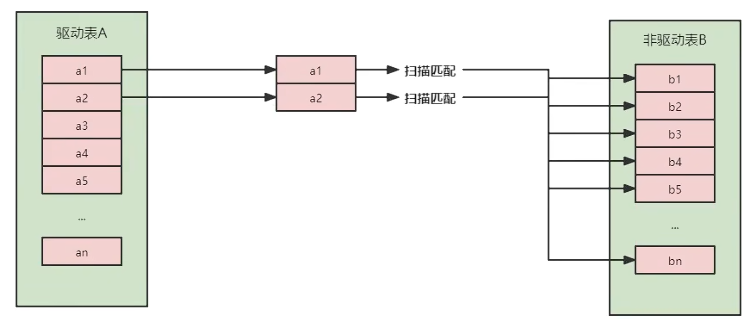
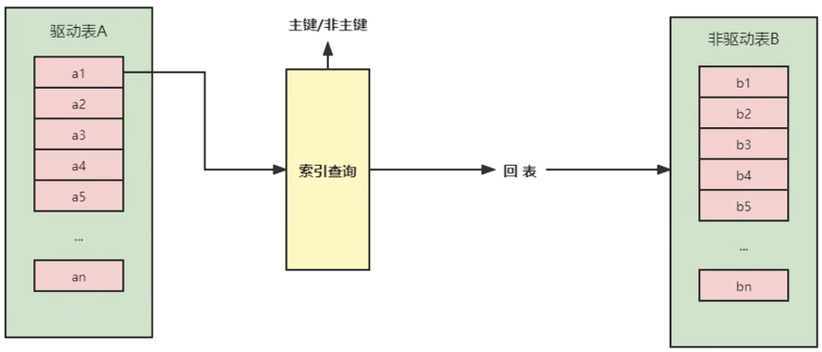
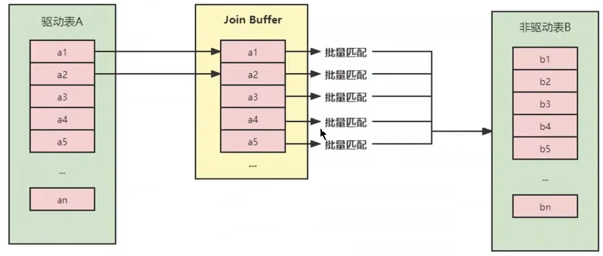
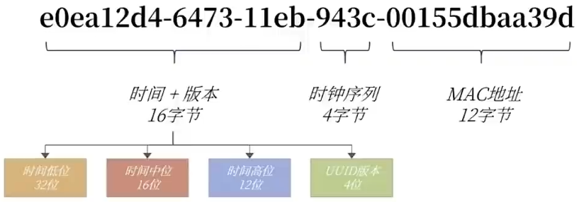
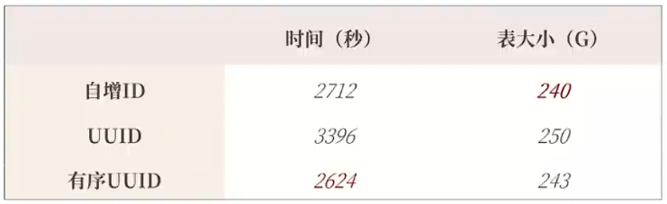

> <h1 id=""></h1>
- [**索引优化与查询优化**](#索引优化与查询优化)
	- [**索引失效案例**](#索引失效案例)
		- [全值匹配](#全值匹配) 
		- [最左前缀法则](#最左前缀法则)   
		- [主键插入顺序](#主键插入顺序) 
		- [计算、函数导致索引失效](#计算、函数导致索引失效) 
		- [类型转换导致索引失效](#类型转换导致索引失效)
		- [范围条件右边的列索引失效](#范围条件右边的列索引失效) 
		- [不等于(!= 或者<>)索引失效](#不等于索引失效)	 
		- [is null可以使用索引，is not null无法使用索引](#isnull可以使用索引，isnotnull无法使用索引)    
		- [like以通配符%开头索引失效](#like以通配符%开头索引失效)  
		- [OR前后存在非索引的列，索引失效](#OR前后存在非索引的列，索引失效)  
		- [数据库和表的字符集统一使用utf8mb4 	](#数据库和表的字符集统一使用utf8mb4)
	- [关联查询优化](#关联查询优化)
		- [采用左外连接](#采用左外连接) 	
		- [采用内连接](#采用内连接) 
		- [INNER JOIN	JOIN语句的原理](#INNERJOINJOIN语句的原理)
			- [驱动表和被驱动表](#驱动表和被驱动表)	
			- [Simple Nested-Loop Join (简单嵌套循环连接) ](#简单嵌套循环连接)
			- [Index Nested-Loop Join（索引嵌套循环连接](#索引嵌套循环连接)     
			- [Block Nested-Loop Join（块嵌套循环连接）](#块嵌套循环连接) 
		- [Hash Join](#HashJoin)
	- [**子查询优化**](#子查询优化)
	- [**排序优化**](#排序优化)
	- [**GROUP BY优化**](#GROUPBY优化)
	- [**优化分页查询**](#优化分页查询)
	- [**优先考虑覆盖索引**](#优先考虑覆盖索引)
	- [**如何给字符串添加索引**](#如何给字符串添加索引)
	- [**索引下推**](#索引下推)
	- [**普通索引VS唯一索引**](#普通索引VS唯一索引**)
	- [**其他查询优化策略**](#其他查询优化策略)
		- [EXISTS和IN的区分](#EXISTS和IN的区分)	
		- [COUNT(\*)与COUNT(具体字段)效率](#COUNT(\*)与COUNT(具体字段)效率) 
		- [关于SELECT(\*)](#关于SELECT(\*))    
		- [LIMIT 1 对优化的影响](#LIMIT1对优化的影响)   
	- [**淘宝数据库,主键如何设计的?**](#淘宝数据库,主键如何设计的?)
		- [淘宝的主键设计](#淘宝的主键设计) 
		- [推荐的主键设计](#推荐的主键设计)


<br/><br/><br/>

***
<br/>

> <h1 id="索引优化与查询优化">索引优化与查询优化</h1>
大多数情况下都默认采用`B+树`来构建索引。只是空间列类型的索引使用`R-树`，并且MEMORY表还支持`hash索引`。

其实，用不用索引，最终都是优化器说了算。优化器是基于什么的优化器？基于`cost开销(CostBaseOptimizer)`，它不是基于`规则(Rule-BasedOptimizer)`，也不是基于`语义`。怎么样开销小就怎么来。另外，**SQL语句是否使用索引，跟数据库版本、数据量、数据选择度都有关系。**


<br/><br/><br/>

***
<br/>

> <h1 id="索引失效案例">索引失效案例</h1>

**数据准备**

`学员表` 插 `50万` 条，`班级表` 插 `1万` 条。

```mysql
CREATE DATABASE dbtest_optimization;
USE dbtest_optimization;
```

<br/>

<b>步骤1：建表</b>

```mysql
CREATE TABLE `class` (
    `id` INT(11) NOT NULL AUTO_INCREMENT,
    `className` VARCHAR(30) DEFAULT NULL,
    `address` VARCHAR(40) DEFAULT NULL,
    `monitor` INT NULL ,
    PRIMARY KEY (`id`)
) ENGINE=INNODB AUTO_INCREMENT=1 DEFAULT CHARSET=utf8;

CREATE TABLE `student` (
    `id` INT(11) NOT NULL AUTO_INCREMENT,
    `stuno` INT NOT NULL ,
    `name` VARCHAR(20) DEFAULT NULL,
    `age` INT(3) DEFAULT NULL,
    `classId` INT(11) DEFAULT NULL,
    PRIMARY KEY (`id`)
    #CONSTRAINT `fk_class_id` FOREIGN KEY (`classId`) REFERENCES `t_class` (`id`)
) ENGINE=INNODB AUTO_INCREMENT=1 DEFAULT CHARSET=utf8;
```

<br/>

<b>步骤2：设置参数</b>
命令开启：允许创建函数设置

```shell
set global log_bin_trust_function_creators=1; # 不加global只是当前窗口有效。
```

<br/>

<b>步骤3：创建函数</b>
生成随机字符串函数

```mysql
DELIMITER //

CREATE FUNCTION rand_string(n INT) RETURNS VARCHAR(255)
BEGIN
    DECLARE chars_str VARCHAR(100) DEFAULT 'abcdefghijklmnopqrstuvwxyzABCDEFJHIJKLMNOPQRSTUVWXYZ';
    DECLARE return_str VARCHAR(255) DEFAULT '';
    DECLARE i INT DEFAULT 0;

    WHILE i < n DO
        SET return_str = CONCAT(return_str, SUBSTRING(chars_str, FLOOR(1 + RAND() * 52), 1));
        SET i = i + 1;
    END WHILE;

    RETURN return_str;
END //

DELIMITER ;
-- 如果要删除函数，可以使用以下命令：
-- DROP FUNCTION rand_string;
```

<br/>

生成随机数函数

```mysql
DELIMITER //

CREATE FUNCTION rand_num(from_num INT, to_num INT) RETURNS INT(11)
BEGIN
    DECLARE i INT DEFAULT 0;
    SET i = FLOOR(from_num + RAND() * (to_num - from_num + 1));
    RETURN i;
END //

DELIMITER ;
```

<br/>

<b>步骤4：创建存储过程</b>
创建往stu表中插入数据的存储过程

```mysql
DELIMITER //

CREATE PROCEDURE insert_stu(START INT, max_num INT)
BEGIN
    DECLARE i INT DEFAULT 0;
    SET autocommit = 0; # 设置手动提交事务
    REPEAT # 循环
        SET i = i + 1; # 赋值
        INSERT INTO student (stuno, name, age, classId) VALUES
        ((START + i), rand_string(6), rand_num(1, 50), rand_num(1, 1000));
    UNTIL i = max_num
    END REPEAT;
    COMMIT; # 提交事务
END //

DELIMITER ;
# 假如要删除
# DROP PROCEDURE insert_stu;
```

<br/>

创建往class表中插入数据的存储过程

```mysql
DELIMITER //

CREATE PROCEDURE `insert_class`(max_num INT)
BEGIN
    DECLARE i INT DEFAULT 0;
    SET autocommit = 0;
    REPEAT
        SET i = i + 1;
        INSERT INTO class (classname, address, monitor) VALUES
        (rand_string(8), rand_string(10), rand_num(1, 100000));
    UNTIL i = max_num
    END REPEAT;
    COMMIT;
END //

DELIMITER ;
```

<br/>

<b>步骤5：调用存储过程</b>

```mysql
#执行存储过程，往class表添加1万条数据
CALL insert_class(10000);
#执行存储过程，往stu表添加50万条数据
CALL insert_stu(100000,500000);
```

<br/>

<b>步骤6：删除指定表上的索引</b>

创建存储过程

```mysql
DELIMITER //
CREATE PROCEDURE `proc_drop_index`(dbname VARCHAR(200),tablename VARCHAR(200))
BEGIN
        DECLARE done INT DEFAULT 0;
        DECLARE ct INT DEFAULT 0;
        DECLARE _index VARCHAR(200) DEFAULT '';
        DECLARE _cur CURSOR FOR SELECT index_name 
        						 FROM information_schema.STATISTICS 
        						 WHERE table_schema=dbname 
                                 AND table_name=tablename 
                                 AND seq_in_index=1 
                                 AND index_name <>'PRIMARY' ;
        #每个游标必须使用不同的declare continue handler for not found set done=1来控制游标的结束
		DECLARE CONTINUE HANDLER FOR NOT FOUND set done=2 ;
        #若没有数据返回,程序继续,并将变量done设为2
        OPEN _cur;
        FETCH _cur INTO _index;
        WHILE _index<>'' DO
            SET @str = CONCAT("drop index " , _index , " on " , tablename );
            PREPARE sql_str FROM @str ;
            EXECUTE sql_str;
            DEALLOCATE PREPARE sql_str;
            SET _index='';
            FETCH _cur INTO _index;
        END WHILE;
    CLOSE _cur;
END //
DELIMITER ;
```

<br/>

执行存储过程

```mysql
CALL proc_drop_index("dbname","tablename");
```

***
<br/><br/><br/>
> <h2 id="全值匹配">全值匹配</h2>
`全值匹配`是指在MySQL中查询条件的顺序和数量与联合索引中列的顺序和数量相同。全值匹配可以充分的利用组合索引，查询效率最高。

分析查询语句中用到的索引

```mysql
EXPLAIN SELECT SQL_NO_CACHE * FROM student WHERE age=30;
EXPLAIN SELECT SQL_NO_CACHE * FROM student WHERE age=30 AND classId=4;
EXPLAIN SELECT SQL_NO_CACHE * FROM student WHERE age=30 AND classId=4 AND name = 'abcd';
```

<br/>

建立索引前执行：可以看到查询效率不高，因为没有索引，当前查询是全表扫描

```mysql
SELECT SQL_NO_CACHE * FROM student WHERE age=30 AND classId=4 AND name = 'abcd';
Empty set, 1 warning (0.09 sec)
```

<br/>

<b>在不同字段以及字段组合上建立索引</b>

```mysql
CREATE INDEX idx_age ON student(age);
CREATE INDEX idx_age_classid ON student(age,classId);
CREATE INDEX idx_age_classid_name ON student(age,classId,name);
```

<br/>

建立索引后执行：

```mysql
SELECT SQL_NO_CACHE * FROM student WHERE age=30 AND classId=4 AND name = 'abcd';
Empty set, 1 warning (0.02 sec)
```

分别测试后，可以发现，当符合全值匹配要求的时候，查询效率最高

 ***
 <br/><br/><br/>
 > <h2 id="最左前缀法则">最左前缀法则</h2>
在MySQL中创建联合索引时会遵守最左前缀匹配原则，即在检索数据时从联合索引的最左边开始匹配，并且不跳过索引中的列。

<b>举例1</b>:前面的索引顺序是`age->classId->name`，这里跳过中间的classId

```mysql
EXPLAIN SELECT SQL_NO_CACHE * FROM student WHERE student.age=30 AND student.name = 'abcd';
*************************** 1. row ***************************
           id: 1
  select_type: SIMPLE
        table: student
   partitions: NULL
         type: ref
possible_keys: idx_age_classid_name
          key: idx_age_classid_name
      key_len: 5
          ref: const
         rows: 18672
     filtered: 10.00
        Extra: Using index condition
```

可以看到key_len值为5，表示只使用了age字段作为索引，说明只是用了索引的一部分。

<br/>

<b>举例2:</b>跳过最左的age

```mysql
EXPLAIN SELECT SQL_NO_CACHE * FROM student 
WHERE student.classId=1 AND student.name = 'abcd';
*************************** 1. row ***************************
           id: 1
  select_type: SIMPLE
        table: student
   partitions: NULL
         type: ALL
possible_keys: NULL
          key: NULL
      key_len: NULL
          ref: NULL
         rows: 499086
     filtered: 1.00
        Extra: Using where
```

可以看到，type值为ALL，表示没有使用索引。

> 结论：MySQL可以为多个字段创建索引，一个索引最多可以包括16个字段。**对于多列索引，过滤条件要使用索引，必须按照索引创建时的顺序依次满足，一旦跳过某个字段，索引后面的字段都将无法被用作索引。**如果查询条件中没有使用这些字段中的第一个字段，那么多列索引不会被使用。

***
<br/><br/><br/>
> <h2 id="主键插入顺序">主键插入顺序</h2>
对于一个使用`InnoDB`存储引擎的表来说，在我们没有显示的创建索引时，表中的数据实际上都是存储在`聚簇索引`的叶子节点的。而记录又存储在数据页中的，数据页和记录又是按照记录`主键值从小到大`的顺序进行排序，所以如果我们`插入`的记录的`主键值是依次增大`的话，那我们每插满一个数据页就换到下一个数据页继续插，而如果我们插入的`主键值忽小忽大`的话，则可能会造成`页面分裂`和`记录移位`。

为了避免这样无谓的性能损耗，最好让插入的记录的`主键值依次递增`

所以建议：让主键具有`AUTO_INCREMENT`，让存储引擎自己为表生成主键，而不是我们手动插入

***
<br/><br/><br/>
> <h2 id="计算、函数导致索引失效">计算、函数导致索引失效</h2>

<b>1）查询条件中包含函数，导致索引失效</b>

**创建索引**

```mysql
CREATE INDEX idx_name ON student(NAME);
```

<br/>

第一种写法：索引生效

```mysql
EXPLAIN SELECT SQL_NO_CACHE * FROM student WHERE student.name LIKE 'abc%'\G
*************************** 1. row ***************************
           id: 1
  select_type: SIMPLE
        table: student
   partitions: NULL
         type: range
possible_keys: idx_name
          key: idx_name
      key_len: 63
          ref: NULL
         rows: 19
     filtered: 100.00
        Extra: Using index condition
```

<br/>

第二种写法：索引失效

```mysql
EXPLAIN SELECT SQL_NO_CACHE * FROM student WHERE LEFT(student.name,3) = 'abc';
*************************** 1. row ***************************
           id: 1
  select_type: SIMPLE
        table: student
   partitions: NULL
         type: ALL
possible_keys: NULL
          key: NULL
      key_len: NULL
          ref: NULL
         rows: 499086
     filtered: 100.00
        Extra: Using where
```

`LEFT(student.name,3)`中,你需要一条一条从数据库中取出数据,然后跟`’abc’`做比较,性能很差.

<br/>

<b>2）查询条件中包含计算，导致索引失效</b>

```mysql
CREATE INDEX idx_sno ON student(stuno);
```

```mysql
-- 索引失效
EXPLAIN SELECT SQL_NO_CACHE id, stuno, NAME FROM student WHERE stuno+1 = 900001;


-- 索引有效
EXPLAIN SELECT SQL_NO_CACHE id, stuno, NAME FROM student WHERE stuno = 900000;
```

<br/>

 ```mysql
EXPLAIN SELECT SQL_NO_CACHE id, stuno, NAME FROM student WHERE stuno+1 = 900001\G
*************************** 1. row ***************************
           id: 1
  select_type: SIMPLE
        table: student
   partitions: NULL
         type: ALL
possible_keys: NULL
          key: NULL
      key_len: NULL
          ref: NULL
         rows: 499086
     filtered: 100.00
 ```

```mysql
EXPLAIN SELECT SQL_NO_CACHE id, stuno, NAME FROM student WHERE stuno = 900000\G
*************************** 1. row ***************************
           id: 1
  select_type: SIMPLE
        table: student
   partitions: NULL
         type: ref
possible_keys: idx_sno
          key: idx_sno
      key_len: 4
          ref: const
         rows: 1
     filtered: 100.00
        Extra: NULL
```


***
<br/><br/><br/>
> <h2 id="类型转换导致索引失效">类型转换导致索引失效</h2>

```mysql
EXPLAIN SELECT SQL_NO_CACHE * FROM student WHERE name='123';# 使用到索引

EXPLAIN SELECT SQL_NO_CACHE * FROM student WHERE name=123; # 未使用到索引
```

name字段的数据类型是VARCHAR，`name=123`发生数据类型转换，导致索引失效。

<br/>

```mysql
EXPLAIN SELECT SQL_NO_CACHE * FROM student WHERE name='123'\G
*************************** 1. row ***************************
           id: 1
  select_type: SIMPLE
        table: student
   partitions: NULL
         type: ref
possible_keys: idx_name
          key: idx_name
      key_len: 63
          ref: const
         rows: 1
     filtered: 100.00
        Extra: NULL
```

```mysql
EXPLAIN SELECT SQL_NO_CACHE * FROM student WHERE name=123\G
*************************** 1. row ***************************
           id: 1
  select_type: SIMPLE
        table: student
   partitions: NULL
         type: ALL
possible_keys: idx_name
          key: NULL
      key_len: NULL
          ref: NULL
         rows: 499086
     filtered: 10.00
        Extra: Using where
```

> 结论：设计实体类属性时，一定要与数据库字段类型相对应。否则，就会出现类型转换的情况


***
<br/><br/><br/>
> <h2 id="范围条件右边的列索引失效">范围条件右边的列索引失效</h2>
当查询条件中使用了范围查询（例如，使用了`<`、`<=`、`>`、`>=`、`BETWEEN`等运算符）时，**在该范围条件右边()的列索引不会被MySQL优化器使用**。

一般发生在优化器使用联合索引的情况下，当联合索引的某个列，被用于范围查询时，该联合索引右侧的列，不会被使用。

```mysql
# 删除多余的索引
CALL proc_drop_index('dbtest_optimization','student');
ALTER TABLE student DROP INDEX idx_name;
ALTER TABLE student DROP INDEX idx_age;
ALTER TABLE student DROP INDEX idx_age_classid;

# 创建聚簇索引
CREATE INDEX idx_age_classid_name ON student(age,classId,name);
CREATE INDEX idx_age_name_classid ON student(age,name,classId);
```

<br/>

```mysql
CREATE INDEX idx_age_classid_name ON student(age,classId,name);

EXPLAIN SELECT SQL_NO_CACHE * FROM student
WHERE student.age=30 AND student.classId>20 AND student.name = 'abc' ;
*************************** 1. row ***************************
           id: 1
  select_type: SIMPLE
        table: student
   partitions: NULL
         type: range
possible_keys: idx_age_classid_name
          key: idx_age_classid_name
      key_len: 10
          ref: NULL
         rows: 18652
     filtered: 10.00
        Extra: Using index condition
```

使用了索引`idx_age_classid_name`，使用到的索引长度为10，说明只用到了age和classId.

解决方法:可以在创建索引的时候这样:`CREATE INDEX idx_age_name_classId ON student(age, NAME, classId)`

<br/>

```mysql
CREATE INDEX idx_age_name_classid ON student(age,name,classId);

EXPLAIN SELECT SQL_NO_CACHE * FROM student
WHERE student.age=30 AND student.classId>20 AND student.name = 'abc' ;
*************************** 1. row ***************************
           id: 1
  select_type: SIMPLE
        table: student
   partitions: NULL
         type: range
possible_keys: idx_age_classid_name,idx_age_name_classid
          key: idx_age_name_classid
      key_len: 73
          ref: NULL
         rows: 1
     filtered: 100.00
        Extra: Using index condition
```

使用了索引`idx_age_name_classid`，使用到了索引的全部字段

> 应用开发中范围查询，例如：金额查询，日期查询往往都是范围查询。应将查询条件放置where语句最后。（创建的联合索引中,务必把范围涉及到的字段写在最后.这属于规范，一种暗示，where条件中字段的顺序，不影响联合索引的使用）

<br/>

> **创建的联合索引时，务必把范围涉及到的字段写在最后**

***
<br/><br/><br/>
> <h2 id="不等于索引失效">不等于(!= 或者<>)索引失效</h2>

* 为name字段创建索引

```mysql
CREATE INDEX idx_name ON student(NAME);
```

```mysql
EXPLAIN SELECT SQL_NO_CACHE * FROM student WHERE student.name <> 'abc';
EXPLAIN SELECT SQL_NO_CACHE * FROM student WHERE student.name != 'abc';
*************************** 1. row ***************************
           id: 1
  select_type: SIMPLE
        table: student
   partitions: NULL
         type: ALL
possible_keys: NULL
          key: NULL
      key_len: NULL
          ref: NULL
         rows: 499086
     filtered: 90.00
        Extra: Using where
```

执行计划中的type值为ALL，表明SQL语句没有使用索引。在编写SQL语句中，应尽量避免使用此类查询条件。

***
<br/><br/><br/>
> <h2 id="isnull可以使用索引，isnotnull无法使用索引">is null可以使用索引，is not null无法使用索引</h2>

* `IS NULL`: 可以触发索引

```mysql
EXPLAIN SELECT SQL_NO_CACHE * FROM student WHERE age IS NULL;

*************************** 1. row ***************************
           id: 1
  select_type: SIMPLE
        table: student
   partitions: NULL
         type: ref
possible_keys: idx_age_name_classid
          key: idx_age_name_classid
      key_len: 5
          ref: const
         rows: 1
     filtered: 100.00
        Extra: Using index condition
```

<br/>

* `IS NOT NULL`: 无法触发索引

```mysql
EXPLAIN SELECT SQL_NO_CACHE * FROM student WHERE age IS NOT NULL;
*************************** 1. row ***************************
           id: 1
  select_type: SIMPLE
        table: student
   partitions: NULL
         type: ALL
possible_keys: idx_age_name_classid
          key: NULL
      key_len: NULL
          ref: NULL
         rows: 499086
     filtered: 50.00
        Extra: Using where
```

> 结论：最好在设计数据表的时候就将`字段设置为 NOT NULL 约束`，比如可以将INT类型的字段，默认值设置为0。将字符类型的默认值设置为空字符串('')
>
> 拓展：同理，在查询中使用`not like`也无法使用索引，导致全表扫描

<br/>

**上述结论有问题**

<b>IS NULL可以走索引的原因</b>

非聚簇索引是通过B+树的方式进行存储的,null值作为最小数看待,全部放在树的最左边,形成链表,如果获取is null的数据,可以从最左开始直到找到记录不是null结束

<br/>

<b>IS NULL不走索引的情况</b>

当null值占多数时,IS NULL不走索引，is not null此时可以走索引

非聚簇索引查询需要回表才能获得记录数据(覆盖索引除外),那么在这过程中优化器发现回表次数太多,执行成本已经超过全表扫描。例如:几乎所有数据都命中,都需要回表.这个时候,优化器会放弃索引,走效率更高全表扫描

<br/>

<b>IS NOT NULL走索引的情况</b>

当null值占大多数的时候

当使用覆盖索引的时候。无需回表，在聚簇索引上，可以获得所有非空数据的时候。

>总之查询条件中包含IS NULL，IS NOT NULL，查询是否使用索引看成本，结合场景去分析

***
<br/><br/><br/>
> <h2 id="like以通配符%开头索引失效">like以通配符%开头索引失效</h2>
在使用LIKE关键字进行查询的查询语句中，如果匹配字符串的第一个字符为'%'，索引就不会起作用。只有'%'不在第一个位置，索引才会起作用。

```mysql
CREATE INDEX idx_name ON student(name);
```

<br/>

* 使用到索引

```mysql
EXPLAIN SELECT SQL_NO_CACHE * FROM student WHERE name LIKE 'ab%';
*************************** 1. row ***************************
           id: 1
  select_type: SIMPLE
        table: student
   partitions: NULL
         type: range
possible_keys: idx_name
          key: idx_name
      key_len: 63
          ref: NULL
         rows: 754
     filtered: 100.00
        Extra: Using index condition
```

<br/>

* 未使用到索引

```mysql
EXPLAIN SELECT SQL_NO_CACHE * FROM student WHERE name LIKE '%ab%';

*************************** 1. row ***************************
           id: 1
  select_type: SIMPLE
        table: student
   partitions: NULL
         type: ALL
possible_keys: NULL
          key: NULL
      key_len: NULL
          ref: NULL
         rows: 499086
     filtered: 11.11
        Extra: Using where
```

> 拓展：Alibaba《Java开发手册》
>
> 【强制】页面搜索严禁左模糊或者全模糊，如果需要请走搜索引擎来解决。


***
<br/><br/><br/>
> <h2 id="OR前后存在非索引的列，索引失效">OR前后存在非索引的列，索引失效</h2>
在WHERE子句中，如果在OR前的条件列进行了索引，而在OR后的条件列没有进行索引，那么索引会失效。也就是说，**OR前后的两个条件中的列都是索引时，查询中才使用索引。**

因为OR的含义就是两个只要满足一个即可，因此`只有一个条件列进行了索引是没有意义的`，只要有条件列没有进行索引，就会进行`全表扫描`，因此所以的条件列也会失效。

查询语句使用OR关键字的情况：

```mysql
# 未使用到索引
EXPLAIN SELECT SQL_NO_CACHE * FROM student WHERE age = 10 OR classid = 100;

*************************** 1. row ***************************
           id: 1
  select_type: SIMPLE
        table: student
   partitions: NULL
         type: ALL
possible_keys: idx_age_name_classid
          key: NULL
      key_len: NULL
          ref: NULL
         rows: 499086
     filtered: 11.88
        Extra: Using where
```

<br/>

因为classId字段上没有索引，所以上述查询语句没有使用索引。

```mysql
#使用到索引
EXPLAIN SELECT SQL_NO_CACHE * FROM student WHERE age = 10 OR name = 'Abel';
*************************** 1. row ***************************
           id: 1
  select_type: SIMPLE
        table: student
   partitions: NULL
         type: index_merge
possible_keys: idx_age_name_classid,idx_name,idx_age
          key: idx_age,idx_name
      key_len: 5,63
          ref: NULL
         rows: 10113
     filtered: 100.00
        Extra: Using union(idx_age,idx_name); Using where
```

因为age字段和name字段上都有索引，所以查询中使用了索引。这里使用到了`index_merge`，简单来说index_merge就是对age和name分别进行了扫描，然后将这两个结果集进行了合并。这样做的好处就是`避免了全表扫描`。

***
<br/><br/><br/>
> <h2 id="数据库和表的字符集统一使用utf8mb4">数据库和表的字符集统一使用utf8mb4</h2>
统一使用utf8mb4( 5.5.3版本以上支持)兼容性更好，统一字符集可以避免由于字符集转换产生的乱码。不同的`字符集`进行比较前需要进行`转换`会造成索引失效。


<br/><br/><br/>

***
<br/>

> <h1 id="关联查询优化">关联查询优化</h1>

**数据准备**

```mysql
#图书
CREATE TABLE IF NOT EXISTS `book` (
	`bookid` INT(10) UNSIGNED NOT NULL AUTO_INCREMENT,
	`card` INT(10) UNSIGNED NOT NULL,
	PRIMARY KEY (`bookid`)
);


# 分类
CREATE TABLE IF NOT EXISTS `classification` (
	`id` INT(10) UNSIGNED NOT NULL AUTO_INCREMENT,
	`card` INT(10) UNSIGNED NOT NULL,
	PRIMARY KEY (`id`)
);

# 向分类表中添加20条记录
INSERT INTO `classification`(card) VALUES(FLOOR(1 + (RAND() * 20)));

# 向图书表中添加20条记录
INSERT INTO book(card) VALUES(FLOOR(1 + (RAND() * 20)));
```

<br/>

```mysql
DELIMITER $
CREATE PROCEDURE insert_classification(IN number INT)
BEGIN
  DECLARE i INT DEFAULT 0;
	WHILE i<number DO
		INSERT INTO `classification`(card) VALUES(FLOOR(1 + (RAND() * 20)));
		SET i = i + 1 ;
	END WHILE;
END $
DELIMITER ;

CALL insert_classification(20)
```

***
<br/><br/><br/>
> <h2 id="采用左外连接">采用左外连接</h2>
`LFET JOIN` 连表操作中，左表中的每一行都会被包含在结果集中，而右表的行只有当满足连接条件时才会出现在结果中，所以右表是关键的。在右表中对连接条件建立索引可以提高检索效率。

```mysql
EXPLAIN SELECT SQL_NO_CACHE * FROM `classification` LEFT JOIN book ON classification.card = book.card\G


+--------------+------------------+--------------------------------------------+
| 属性          | 第一行值          | 第二行值                                     |
+--------------+------------------+--------------------------------------------+
| id           | 1                | 1                                          |
| select_type  | SIMPLE           | SIMPLE                                     |
| table        | classification   | book                                       |
| partitions   | NULL             | NULL                                       |
| type         | ALL              | ALL                                        |
| possible_keys| NULL             | NULL                                       |
| key          | NULL             | NULL                                       |
| key_len      | NULL             | NULL                                       |
| ref          | NULL             | NULL                                       |
| rows         | 20               | 20                                         |
| filtered     | 100.00           | 100.00                                     |
| Extra        | NULL             | Using where; Using join buffer (hash join) |
+--------------+------------------+--------------------------------------------+
```

type值为ALL，说明当前的SQL语句没有使用索引。查询的效率还是比较低的。

<br/>

其中，表book是被驱动表，给book中的card列添加索引，就可避免全表扫描。

```mysql
CREATE INDEX idx_book_card ON book(card);
```

```mysql
EXPLAIN SELECT SQL_NO_CACHE * FROM `classification` LEFT JOIN book ON classification.card = book.card\G
+--------------+------------------+--------------------------------------------------+
| 属性         | 第一行值           | 第二行值                                           |
+--------------+------------------+--------------------------------------------------+
| id           | 1                | 1                                                |
| select_type  | SIMPLE           | SIMPLE                                           |
| table        | classification   | book                                             |
| partitions   | NULL             | NULL                                             |
| type         | ALL              | ref                                              |
| possible_keys| NULL             | idx_book_card                                    |
| key          | NULL             | idx_book_card                                    |
| key_len      | NULL             | 4                                                |
| ref          | NULL             | dbtest_optimization.classification.card          |
| rows         | 20               | 1                                                |
| filtered     | 100.00           | 100.00                                           |
| Extra        | NULL             | Using index                                      |
+--------------+------------------+--------------------------------------------------+
```

可以看到第二条记录的type变为了ref，rows的优化也比较明显。

<br/>

<b>给驱动表添加索引</b>

再给驱动表classification添加索引，驱动表依然全表扫描。驱动表type值为index，表明使用了索引，但是依然进行了全表扫描。

```mysql
CREATE INDEX idx_classification_card ON classification(card);
```

```mysql
EXPLAIN SELECT SQL_NO_CACHE * FROM `classification` LEFT JOIN book ON classification.card = book.card\G
+--------------+--------------------------+--------------------------------------------+
| 属性          | 第一行值                  | 第二行值                                     |
+--------------+--------------------------+--------------------------------------------+
| id           | 1                        | 1                                          |
| select_type  | SIMPLE                   | SIMPLE                                     |
| table        | classification           | book                                       |
| partitions   | NULL                     | NULL                                       |
| type         | index                    | ref                                        |
| possible_keys| NULL                     | idx_book_card                              |
| key          | idx_classification_card  | idx_book_card                              |
| key_len      | 4                        | 4                                          |
| ref          | NULL                     | dbtest_optimization.classification.card    |
| rows         | 20                       | 1                                          |
| filtered     | 100.00                   | 100.00                                     |
| Extra        | Using index              | Using index                                |
+--------------+--------------------------+--------------------------------------------+
```


***
<br/><br/><br/>
> <h2 id="采用内连接 INNER JOIN">采用内连接 INNER JOIN</h2>

```mysql
EXPLAIN SELECT SQL_NO_CACHE * FROM `classification` INNER JOIN book ON classification.card = book.card\G
```

对于内连接，查询优化器会自动选择驱动表和被驱动表。

连接字段上有索引的表，会优先成为被驱动表。驱动表，无论是否添加索引，都会进行全表扫描。

在两个表的连接条件都存在索引的情况下，会选择小的表作为驱动表。`小表驱动大表`

***
<br/><br/><br/>
> <h2 id="JOIN语句的原理">JOIN语句的原理</h2>
join方式连接多个表，本质就是各个表之间数据的循环匹配。MySQL5.5版本之前，MySQL只支持一种表间关联方式，就是嵌套循环(Nested Loop Join)。如果关联表的数据量很大，则join关联的执行时间会很长。在MySQL5.5以后的版本中，MySQL通过引入BNLJ算法来优化嵌套执行。

<br/><br/>
> <h3 id="驱动表和被驱动表">驱动表和被驱动表</h3>
驱动表就是主表，被驱动表就是从表、非驱动表。

* **对于内连接来说：**

```mysql
SELECT * FROM A JOIN B ON ...
```

优化器会根据查询语句做优化，决定先查哪张表。先查询的那张表就是驱动表，反之就是被驱动表。通过explain关键字可以查看。

<br/>

* **对于外连接来说：**

```mysql
SELECT * FROM A LEFT JOIN B ON ...
# 或
SELECT * FROM B RIGHT JOIN A ON ... 
```

通常，大家会认为A就是驱动表，B就是被驱动表。但也未必。测试如下：

```mysql
CREATE TABLE a(f1 INT, f2 INT, INDEX(f1)) ENGINE=INNODB;
CREATE TABLE b(f1 INT, f2 INT) ENGINE=INNODB;

INSERT INTO a VALUES(1,1),(2,2),(3,3),(4,4),(5,5),(6,6);
INSERT INTO b VALUES(3,3),(4,4),(5,5),(6,6),(7,7),(8,8);

SELECT * FROM b;

# 测试1
EXPLAIN SELECT * FROM a LEFT JOIN b ON(a.f1=b.f1) WHERE (a.f2=b.f2);

# 测试2
EXPLAIN SELECT * FROM a LEFT JOIN b ON(a.f1=b.f1) AND (a.f2=b.f2);
```

>优化器有时会优化外连接为内连接，因此被驱动表和驱动表有时由优化器决定

<br/><br/>
> <h3 id="简单嵌套循环连接">Simple Nested-Loop Join (简单嵌套循环连接)</h3>

算法相当简单，从表A中取出一条数据1，遍历表B，将匹配到的数据放到result.. 以此类推，驱动表A中的每一条记录与被驱动表B的记录进行判断：



可以看到这种方式效率是非常低的，以上述表A数据100条，表B数据1000条计算，则A*B=10万次。开销统计如下:

| 开销统计         | SNLJ           |
| ---------------- | -------------- |
| 外表扫描次数     | 1              |
| 内表扫描次数     | A（A表条目数） |
| 读取记录数       | A+B*A          |
| JOIN比较次数     | B*A            |
| 回表读取记录次数 | 0              |

当然mysql肯定不会这么粗暴的去进行表的连接，所以就出现了后面的两种对Nested-Loop Join优化算法。

<br/><br/>
> <h3 id="索引嵌套循环连接">Index Nested-Loop Join（索引嵌套循环连接）</h3>
Index Nested-Loop Join其优化的思路主要是为了`减少内层表数据的匹配次数`，所以要求被驱动表上必须`有索引`才行。通过外层表匹配条件直接与内层表索引进行匹配，避免和内存表的每条记录去进行比较，这样极大的减少了对内层表的匹配次数。



驱动表中的每条记录通过被驱动表的索引进行访问，因为索引查询的成本是比较固定的，故mysql优化器都倾向于使用记录数少的表作为驱动表（外表）。

| 开销统计         | SNLJ   | INLJ                   |
| ---------------- | ------ | ---------------------- |
| 外表扫描次数     | 1      | 1                      |
| 内表扫描次数     | A      | 0                      |
| 读取记录数       | A+B\*A | A+B(match)             |
| JOIN比较次数     | B\*A   | A\*Index(Height)       |
| 回表读取记录次数 | 0      | B(match) (if possible) |

被驱动表加索引，效率是非常高的，如果索引不是主键索引，还需要进行一次回表查询。

<br/><br/>
> <h3 id="块嵌套循环连接">Block Nested-Loop Join（块嵌套循环连接）</h3>
如果存在索引，那么会使用index的方式进行join，如果join的列没有索引，被驱动表要扫描的次数太多了。每次访问被驱动表，其表中的记录都会被加载到内存中，然后再从驱动表中取一条与其匹配，匹配结束后清除内存，然后再从驱动表中加载一条记录，然后把被驱动表的记录再加载到内存匹配，这样周而复始，大大增加了IO的次数。为了减少被驱动表的IO次数，就出现了Block Nested-Loop Join的方式。

不再是逐条获取驱动表的数据，而是一块一块的获取，引入了`join buffer缓冲区`，将驱动表join相关的部分数据列（大小受join buffer的限制）缓存到join buffer中，然后全表扫描被驱动表，被驱动表的每一条记录一次性和join buffer中的所有驱动表记录进行匹配（内存中操作），将简单嵌套循环中的多次比较合并成一次，降低了被驱动表的访问频率。

>注意：
>
>这里缓存的不只是关联表的列，select后面的列也会缓存起来。
>
>在一个有N个join关联的sql中会分配N-1个join buffer。所以查询的时候尽量减少不必要的字段，可以让join buffer中可以存放更多的列。



| 开销统计           | SNLJ    | INLJ                   | BNLJ                                        |
| ------------------ | ------- | ---------------------- | ------------------------------------------- |
| 外表扫描次数：     | 1       |  1                      | 1                                           |
| 内表扫描次数：     | A       | 0                      | A * used_column_size/join_buffer_size+1     |
| 读取记录数：       | A+B * A | A+B(match)             | A+B*(A * used_column_size/join_buffer_size) |
| JOIN比较次数：     | B * A   | A * Index(Height)      | B * A                                       |
| 回表读取记录次数： | 0       | B(match) (if possible) | 0                                           |

参数设置：

* block_nested_loop

通过`show variables like '%optimizer_switch%` 查看 `block_nested_loop` 状态。默认是开启的。

* join_buffer_size

驱动表能不能一次加载完，要看join buffer能不能存储所有的数据，默认情况下`join_buffer_size=256k`。

```mysql
mysql> show variables like '%join_buffer%';
+------------------+--------+
| Variable_name    | Value  |
+------------------+--------+
| join_buffer_size | 262144 |
+------------------+--------+
```

join_buffer_size的最大值在32位操作系统可以申请4G，而在64位操作系统下可以申请大于4G的Join Buffer空间（64位Windows除外，其大值会被截断为4GB并发出警告）。

<br/><br/>
> <h3 id="Join小结">Join小结</h3>
* **整体效率比较：INLJ > BNLJ > SNLJ**

* 永远用小结果集驱动大结果集（其本质就是减少外层循环的数据数量）

  `小的度量单位指的是表行数 * 每行大小`，每行大小受查询列表影响表行数受到where过滤的影响

```mysql
select t1.b,t2.* from t1 straight_join t2 on (t1.b=t2.b) where t2.id<=100; # 推荐
select t1.b,t2.* from t2 straight_join t1 on (t1.b=t2.b) where t2.id<=100; # 不推荐
```

* 为被驱动表匹配的条件增加索引(减少内存表的循环匹配次数)

* 增大join buffer size的大小（一次索引的数据越多，那么内层包的扫描次数就越少）

* 减少驱动表不必要的字段查询（字段越少，join buffer所缓存的数据就越多）

***
<br/><br/><br/>
> <h2 id="HashJoin">Hash Join</h2>
**从MySQL的8.0.20版本开始将废弃BNLJ，因为从MySQL8.0.18版本开始就加入了hash join默认都会使用hash join**

* Nested Loop：对于被连接的数据子集较小的情况下，Nested Loop是个较好的选择。
* Hash Join是做`大数据集连接`时的常用方式，优化器使用两个表中较小（相对较小）的表利用Join Key在内存中建立`散列值`，然后扫描较大的表并探测散列值，找出与Hash表匹配的行。
  * 这种方式适用于较小的表完全可以放入内存中的情况，这样总成本就是访问两个表的成本之和。
  * 在表很大的情况下并不能完全放入内存，这时优化器会将它分割成`若干不同的分区`，不能放入内存的部分就把该分区写入磁盘的临时段，此时要求有较大的临时段从而尽量提高I/O的性能。
  * 它能够很好的工作于没有索引的大表和并行查询的环境中，并提供最好的性能。Hash Join只能应用于等值连接，这是由Hash的特点决定的。

| 类别     | Nested Loop                                                  | Hash Join                                                    |
| -------- | ------------------------------------------------------------ | ------------------------------------------------------------ |
| 使用条件 | 任何条件                                                     | 等值连接（=）                                                |
| 相关资源 | CPU、磁盘I/O                                                 | 内存、临时空间                                               |
| 特点     | 当有高选择性索引或进行限制性搜索时效率比较高，能够快速返回第一次的搜索结果。 | 当缺乏索引或者索引条件模糊时，Hash Join比Nested Loop有效。在数据仓库环境下，如果表的记录数多，效率高。 |
| 缺点     | 当索引丢失或者查询条件限制不够时，效率很低；当表的记录数多时，效率低。 | 为建立哈希表，需要大量内存。第一次的结果返回较慢。 


    
<br/><br/><br/>

***
<br/>

> <h1 id="子查询优化">子查询优化</h1>


<br/><br/><br/>

***
<br/>

> <h1 id="排序优化">排序优化</h1>


<br/><br/><br/>

***
<br/>

> <h1 id="GROUPBY优化">GROUP BY优化</h1>


<br/><br/><br/>

***
<br/>

> <h1 id="优化分页查询">优化分页查询</h1>

    


<br/><br/><br/>

***
<br/>

> <h1 id="优先考虑覆盖索引">优先考虑覆盖索引</h1>


<br/><br/><br/>

***
<br/>

> <h1 id="如何给字符串添加索引">如何给字符串添加索引</h1>


<br/><br/><br/>

***
<br/>

> <h1 id="索引下推">索引下推</h1>


<br/><br/><br/>

***
<br/>

> <h1 id="普通索引VS唯一索引">普通索引VS唯一索引</h1>


   

<br/><br/><br/>

***
<br/>

> <h1 id="其他查询优化策略">其他查询优化策略</h1>

***
<br/><br/><br/>
> <h2 id="EXISTS和IN的区分">EXISTS和IN的区分</h2>

哪种情况下应该使用EXISTS，哪种情况应该用IN。选择的标准是看能否使用表的索引吗？

索引是个前提，其实选择与否还会要看表的大小。可以将选择的标准理解为`小表驱动大表`。

比如下面这样：

```mysql
SELECT * FROM A WHERE cc IN (SELECT cc FROM B)

SELECT * FROM A WHERE EXISTS (SELECT cc FROM B WHERE B.cc = A.cc)
```

<br/>

当A小于B时，用 EXISTS。因为EXISTS的实现，相当于外表循环，实现的逻辑类似于：

```mysql
for i in A
	for j in B
		if j.cc == i.cc then ...
```

<br/>

当 B 小于 A 时用 IN，因为实现的逻辑类似于：

```mysql
for i in B
	for j in A
		if j.cc == i.cc then ...
```

<b>结论：哪个表小就用哪个表来驱动，A 表小就用 EXISTS ，B 表小就用 IN</b>

***
<br/><br/><br/>
> <h2 id="COUNT(\*)与COUNT(具体字段)效率">COUNT(\*)与COUNT(具体字段)效率</h2>
问: 在MySQL中统计数据表的行数, 可以使用三种方式: `SELECT COUNT(*)`、`SELECT COUNT(1)` 和 `SELECT COUNT(具体字段)`，使用这三者之间的查询效率是怎样的?

<br/>

答:

前提: 如果你要统计的是某个字段的非空数据行数, 则另当别论, 毕竟比较执行效率的前提是结果一样才可以。

**环节1：** `COUNT(*)`和`COUNT(1)`都是对所有结果进行`COUNT`，`COUNT(*)`和`COUNT(1)`本质上并没有区别（二者执行时间可能略有差别，不过你还是可以把它俩的执行效率看成是相等的）。如果有WHERE子句，则是对所有符合筛选条件的数据行进行统计；如果没有WHERE子句，则是对数据表的数据行数进行统计。

<br/>

**环节2：** 如果是`MyISAM`存储引擎，统计数据表的行数只需要`O(1)`的复杂度，这是因为每张MyISAM的数据表都有一个meta信息存储了`row_count`值，而一致性则是由表级锁来保证的。

如果是InnoDB存储引擎，因为InnoDB支持事务，采用行级锁和MVCC机制，所以无法像MyISAM一样，维护一个row_count变量，因此需要采用`扫描全表`，进行循环+计数的方式来完成统计，时间复杂度是`O(n)`。

<br/>

**环节3：** 在InnoDB引擎中，如果采用`COUNT(具体字段)`来统计数据行数，要尽量采用二级索引。因为主键采用的索引是聚簇索引，聚簇索引包含的信息多，明显会大于二级索引（非聚簇索引）。对于`COUNT(*)`和`COUNT(1)`来说，它们不需要查找具体的行，只是统计行数，系统会`自动`采用占用空间更小的二级索引来进行统计。

如果有多个二级索引，会使用key_len小的二级索引进行扫描。当没有二级索引的时候，才会采用主键索引来进行统计。

***
<br/><br/><br/>
> <h2 id="关于SELECT(\*)">关于SELECT(\*)</h2>
在表查询中，建议明确字段，不要使用 * 作为查询的字段列表，推荐使用SELECT <字段列表> 查询。原因：

① MySQL在解析的过程中，会通过`查询数据字典`将"*"按序转换成所有列名，这会大大的耗费资源和时间。

② 无法使用`覆盖索引`

***
<br/><br/><br/>
> <h2 id="LIMIT1对优化的影响">LIMIT 1 对优化的影响</h2>
针对的是会扫描全表的SQL语句，如果你可以确定结果集只有一条，那么加上`LIMIT 1`的时候，当找到一条结果的时候就不会继续扫描了，这样会加快查询速度。

如果数据表已经对字段建立了唯一索引，那么可以通过索引进行查询，不会全表扫描的话，就不需要加上`LIMIT 1`了。

***
<br/><br/><br/>
> <h2 id="多使用COMMIT">多使用COMMIT</h2>
只要有可能，在程序中尽量多使用COMMIT，这样程序的性能得到提高，需求也会因为COMMIT所释放的资源而减少。

COMMIT所释放的资源：

* 回滚段上用于恢复数据的信息

* 被程序语句获得的锁

* redo / undo log buffer 中的空间

* 管理上述 3 种资源中的内部花费


<br/><br/><br/>

***
<br/>

> <h1 id="淘宝数据库,主键如何设计的?">淘宝数据库,主键如何设计的?</h1>

***
<br/><br/><br/>
> <h2 id="淘宝的主键设计">淘宝的主键设计</h2>
在淘宝的电商业务中，订单服务是一个核心业务。请问，`订单表的主键`淘宝是如何设计的呢？是自增ID吗？

打开淘宝，看一下订单信息：

订单号不是自增ID！我们详细看下上述4个订单号：

```mysql
1550672064762308113
1481195847180308113
1431156171142308113
1431146631521308113
```

订单号是19位的长度，且订单的最后5位都是一样的，都是08113。且订单号的前面14位部分是单调递增的。

大胆猜测，淘宝的订单ID设计应该是：

```mysql
订单ID = 时间 + 去重字段 + 用户ID后6位尾号
```

这样的设计能做到全局唯一，且对分布式系统查询及其友好。


***
<br/><br/><br/>
> <h2 id="推荐的主键设计">推荐的主键设计</h2>
`非核心业务`：对应表的主键自增ID，如告警、日志、监控等信息。

`核心业务` ：**主键设计至少应该是全局唯一且是单调递增**。全局唯一保证在各系统之间都是唯一的，单调递增是希望插入时不影响数据库性能。

这里推荐最简单的一种主键设计：UUID。

<br/>

**UUID的特点：**

全局唯一，占用36字节，数据无序，插入性能差。

- **认识UUID：**
	* 为什么UUID是全局唯一的？ 
	* 为什么UUID占用36个字节？ 
	* 为什么UUID是无序的？

<br/>

MySQL数据库的UUID组成如下所示：

```mysql
UUID = 时间+UUID版本（16字节）- 时钟序列（4字节） - MAC地址（12字节）
```

以UUID值e0ea12d4-6473-11eb-943c-00155dbaa39d举例：



<br/>

`为什么UUID是全局唯一的？`

在UUID中时间部分占用60位，存储的类似TIMESTAMP的时间戳，但表示的是从1582-10-15 00：00：00.00 到现在的100ns的计数。可以看到UUID存储的时间精度比TIMESTAMPE更高，时间维度发生重复的概率降 低到1/100ns。

时钟序列是为了避免时钟被回拨导致产生时间重复的可能性。MAC地址用于全局唯一。

`为什么UUID占用36个字节？`

UUID根据字符串进行存储，设计时还带有无用"-"字符串，因此总共需要36个字节。

`为什么UUID是随机无序的呢？`

因为UUID的设计中，将时间低位放在最前面，而这部分的数据是一直在变化的，并且是无序。

**改造UUID**

若将时间高低位互换，则时间就是单调递增的了，也就变得单调递增了。MySQL8.0可以更换时间低位和时间高位的存储方式，这样UUID就是有序的UUID了。

MySQL8.0还解决了UUID存在的空间占用的问题，除去了UUID字符串中无意义的"-"字符串，并且将字符串用二进制类型保存，这样存储空间降低为了16字节。

可以通过MySQL8.0提供的uuid_to_bin函数实现上述功能，同样的，MySQL也提供了bin_to_uuid函数进行转化：

```mysql
SET @uuid = UUID();
SELECT @uuid,uuid_to_bin(@uuid),uuid_to_bin(@uuid,TRUE);
```

**通过函数uuid_to_bin(@uuid,true)将UUID转化为有序UUID了**。全局唯一 + 单调递增，这不就是我们想要的主键！

<br/>

**有序UUID性能测试**

16字节的有序UUID，相比之前8字节的自增ID，性能和存储空间对比究竟如何呢？

我们来做一个测试，插入1亿条数据，每条数据占用500字节，含有3个二级索引，最终的结果如下所示：



从上图可以看到插入1亿条数据有序UUID是最快的，而且在实际业务使用中有序UUID在`业务端就可以生成`。还可以进一步减少SQL的交互次数。

另外，虽然有序UUID相比自增ID多了8个字节，但实际只增大了3G的存储空间，还可以接受。

>在当今的互联网环境中，非常不推荐自增ID作为主键的数据库设计。更推荐类似有序UUID的全局 唯一的实现。 
>
>另外在真实的业务系统中，主键还可以加入业务和系统属性，如用户的尾号，机房的信息等。这样 的主键设计就更为考验架构师的水平了。

<br/>

**如果不是MySQL8.0 怎么办？**

手动赋值字段做主键！

比如，设计各个分店的会员表的主键，因为如果每台机器各自产生的数据需要合并，就可能会出现主键重复的问题。

可以在总部MySQL数据库中，有一个管理信息表，在这个表中添加一个字段，专门用来记录当前会员编号的最大值。

门店在添加会员的时候，先到总部MySQL数据库中获取这个最大值，在这个基础上加1，然后用这个值作为新会员的“id”，同时，更新总部 MySQL 数据库管理信息表中的当前会员编号的最大值。

这样一来，各个门店添加会员的时候，都对同一个总部MySQL数据库中的数据表字段进行操作，就解决了各门店添加会员时会员编号冲突的问题。

