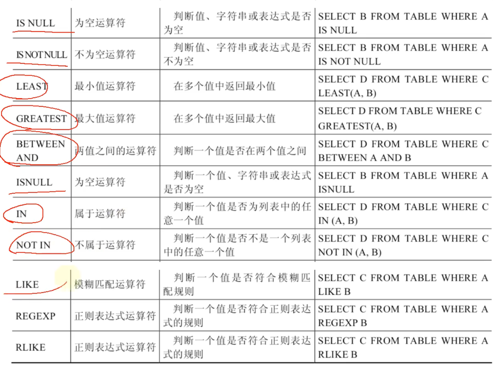
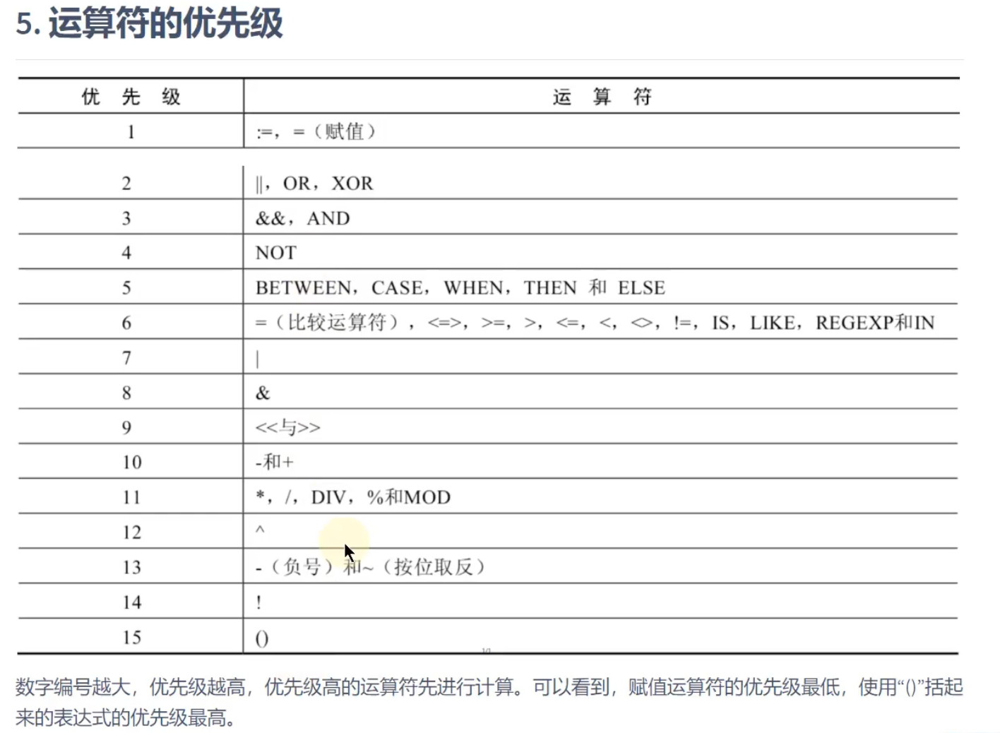
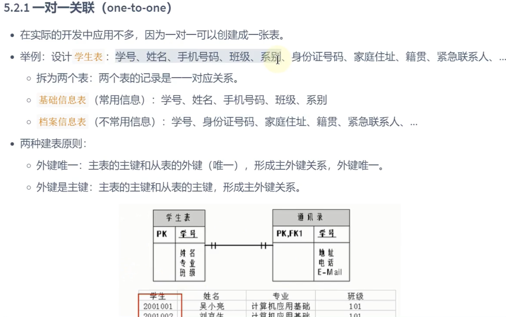
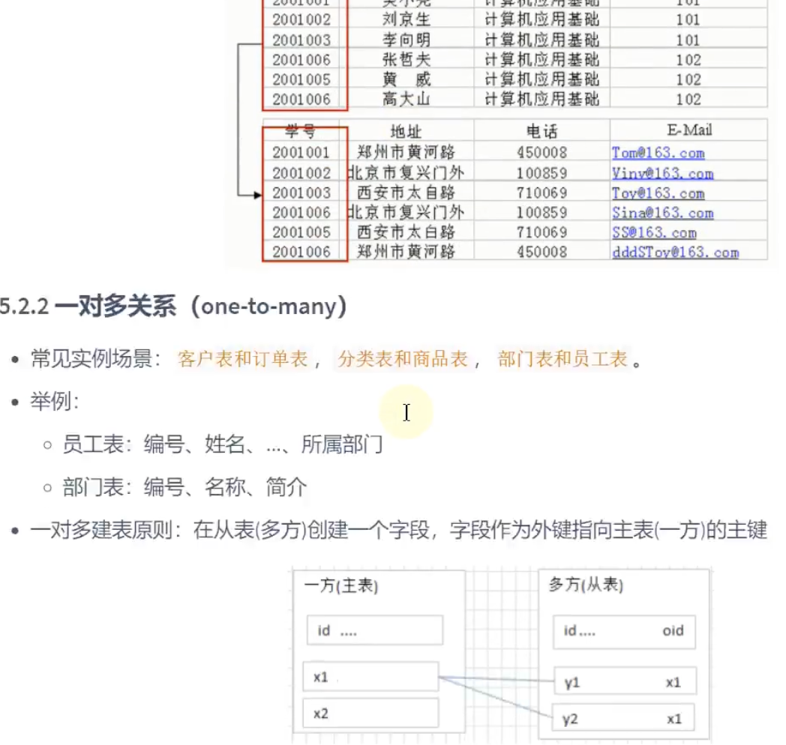
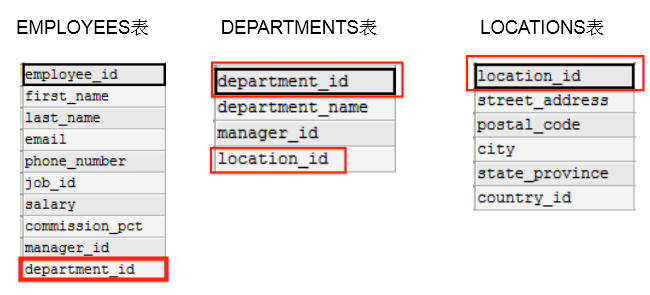

> <h1 id=""></h1>
- [**目录结构**](#目录结构)
- [**特殊的NULL运算**](#特殊的NULL运算)
- [**创建employees表**](#创建employees表)
- [**employees表批量插入数据**](#employees表批量插入数据)
- [**查employees表**](#查employees表)
- [**运算符**](#运算符)
	- [<=>安全等于](#安全等于)
	- [IN和WHERE使用](#IN和WHERE使用)
	- [XOR异或](#XOR异或)
- [** employees表排序和分页**](#employees表排序和分页)
	- [employees二级排序](#employees二级排序)
	- [分页limit](#分页limit)
- [**多表查询**](#多表查询)
	- [多表条件查询](#多表条件查询) 
	- [自连接](#自连接) 
	- [内连接vs外连接](#内连接vs外连接) 
	- [UNION的使用](#UNION的使用)
- [**mysql管理 ‌**](#mysql管理)
	- [基本命令行](#基本命令行)
	- [终端单行修改sql语句](#终端单行修改sql语句)
	- [终端多行修改sql语句](#终端多行修改sql语句)
- [**基本信息**](#基本信息)
	- [查看创建表信息](#查看创建表信息)
	- [查看表编码](#查看表编码)
- [**关系模型**](#关系模型)
	- [主键](#主键)
	- [外键](#外键)
	- [索引](#索引)
- [创建表](#创建表)
- [连接join](连接join)
	- [连接inner join](#连接innerJoin)
		- [建表、插入表](#建表、插入表)
		- [数据类型约束讲解](#数据类型约束讲解)
- **资料**
	- [《面试笔记》——MySQL终结篇（30问与答）-- 已上线阿里](https://mp.weixin.qq.com/s?__biz=MzkxMjE5NzUxNQ==&mid=2247483876&idx=1&sn=3ba83e9184f850c49a0b98e6e49513b3&chksm=c111d300f6665a16af6199d869d715186e969df0a9c207b0c216b91ed299f5f006cdea188a4b&token=1231184118&lang=zh_CN#rd)
	- [廖雪峰SQL教程-(可以执行sql语句查看结果)](https://liaoxuefeng.com/books/sql/relational/foreign-key/index.html)
	- [SQL-菜鸟教程](https://www.runoob.com/sql/sql-tutorial.html)


<br/><br/><br/>

***
<br/>

> <h1 id="目录结构">目录结构</h1>

| MySQL目录结构 | 说明 |
|:--|:--|
| bin目录 | 所有MySQL可执行文件,如:mysql |
| MySQLInstanceConfig | 数据库的配置向导,在安装时出现的内容 |
| data目录 | 系统数据库所在目录 |
| my.ini配置文件| MySQL主要配置文件 |
| /MySQL/MySQL Server8.0/data | 用户创建数据库所在目录 |

<br/>

DB: database,看作是数据库文件.(类似于:.doc、.txt、.mp3...)
DBMS: 数据库管理系统.(类似于word工具, wps工具等)

<br/>

**非关系型数据库:**

| 类型 | 代表数据库 |
|:--|:--|
| 键值型数据 | Redis |
| 文档型数据库 | MongoDB | 
| 搜索引擎数据库 | ES、Solr | 
| 列式数据库 | HBase | 
| 图形数据库 | InfoGrid(用于聊天) | 
|  |  | 

<br/>

- DDL数据定义语言: CREATE、ALTER 、DROP 、 RENAME、TRUNCATE
- DML数据操作语言: INSERT、DELETE 、UPDATE 、SELETE
- DCL数据控制语言: COMMIT 、ROLLBACK、SAVEPOINT、GRANT、REVOKE


<br/><br/><br/>

***
<br/>

> <h1 id="特殊的NULL运算">特殊的NULL运算</h1>

空值参与运算
空值:null
null不等同于0, '', "null"?

空值参与运算:结果一定为空.


<br/><br/><br/>

***
<br/>

> <h1 id="创建employees表">创建employees表</h1>

**创建employees员工表:**

```sql
CREATE TABLE `employees` (
  `employee_id` INT NOT NULL DEFAULT 0,
  `first_name` VARCHAR(20),
  `last_name` VARCHAR(25) NOT NULL,
  `email` VARCHAR(25) NOT NULL,
  `phone_number` VARCHAR(20),
  `hire_date` DATE NOT NULL,
  `job_id` VARCHAR(10) NOT NULL,
  `salary` DECIMAL(8,2) DEFAULT NULL,
  `commission_pct` DECIMAL(5,2),
  `manager_id` INT,
  `department_id` INT,
  PRIMARY KEY (`employee_id`),
  UNIQUE KEY `idx_email` (`email`),
  KEY `idx_manager_id` (`manager_id`),
  KEY `idx_department_id` (`department_id`),
  KEY `idx_job_id` (`job_id`)
);
```

- 添加 PRIMARY KEY (employee_id)
- manager_id、department_id、job_id 添加 MUL（普通索引）
- ✅ email 设为 唯一索引（UNI）
- ✅ 所有字段（除 employee_id、last_name、email、phone_number、hire_date等）默认 NULL
- ✅ DEFAULT NULL 显式声明（尽管大多数情况下 NULL 默认行为不变）

<br/>

**展示employees表结构**

显示表中字段的详细信息

```
mysql> desc employees;
+----------------+--------------+------+-----+---------+-------+
| Field          | Type         | Null | Key | Default | Extra |
+----------------+--------------+------+-----+---------+-------+
| employee_id    | int          | NO   | PRI | 0       |       |
| first_name     | varchar(20)  | YES  |     | NULL    |       |
| last_name      | varchar(25)  | NO   |     | NULL    |       |
| email          | varchar(25)  | NO   | UNI | NULL    |       |
| phone_number   | varchar(20)  | YES  |     | NULL    |       |
| hire_date      | date         | NO   |     | NULL    |       |
| job_id         | varchar(10)  | NO   | MUL | NULL    |       |
| salary         | decimal(8,2) | YES  |     | NULL    |       |
| commission_pct | decimal(5,2) | YES  |     | NULL    |       |
| manager_id     | int          | YES  | MUL | NULL    |       |
| department_id  | int          | YES  | MUL | NULL    |       |
+----------------+--------------+------+-----+---------+-------+
```


<br/><br/><br/>
> <h2 id="employees表批量插入数据">employees表批量插入数据</h2>

```sql
INSERT INTO employees (employee_id, first_name, last_name, email, phone_number, hire_date, job_id, salary, commission_pct, manager_id, department_id) VALUES
(1, 'Deborah Mendoza', 'Deborah Mendoza', 'mendodebo618@outlook.com', '80-6927-0560', '2020-08-20', 'C916Zxmp1T', 554.71, 870.82, 548, 433),
(2, '蒋子异', 'Jiang Ziyi', 'ziyijiang@outlook.com', '213-841-2863', '2018-12-02', 'xJJxHzV7ps', 75.50, 49.07, 357, 78),
(3, '樊玲玲', 'Fan Ling Ling', 'llf@gmail.com', '718-713-7276', '2009-07-01', 'Q7vmbrrubi', 266.16, 781.87, 707, 283),
(4, '杜頴璇', '杜頴璇', 'to1116@hotmail.com', '10-6298-1704', '2009-09-11', 'mcGy2zyS8V', 144.88, 234.24, 293, 870),
(5, 'Yip Wai Man', '葉慧敏', 'yip3@hotmail.com', '760-567-4104', '2001-10-01', 'XuaHjJzfCs', 547.61, 141.33, 563, 227),
(6, 'Nakagawa Nanami', '中川七海', 'nanami1@gmail.com', '212-749-3438', '2007-03-14', 'pCWr6ZCmBT', 327.37, 539.46, 12, 482);

```


<br/><br/><br/>

***
<br/>

> <h1 id="查employees表">查employees表</h1>

**查看数据:**

```sql
 select * from employees;
+-------------+----------------------+----------------------+---------------------------+----------------+------------+------------+--------+----------------+------------+---------------+
| employee_id | first_name           | last_name            | email                     | phone_number   | hire_date  | job_id     | salary | commission_pct | manager_id | department_id |
+-------------+----------------------+----------------------+---------------------------+----------------+------------+------------+--------+----------------+------------+---------------+
|           1 | Deborah Mendoza      | Deborah Mendoza      | mendodebo618@outlook.com  | 80-6927-0560   | 2020-08-20 | C916Zxmp1T | 554.71 |         870.82 |        548 |           433 |
|           2 | 蒋子异               | Jiang Ziyi           | ziyijiang@outlook.com     | 213-841-2863   | 2018-12-02 | xJJxHzV7ps |  75.50 |          49.07 |        357 |            78 |
|           3 | 樊玲玲               | Fan Ling Ling        | llf@gmail.com             | 718-713-7276   | 2009-07-01 | Q7vmbrrubi | 266.16 |         781.87 |        707 |           283 |
|           4 | 杜頴璇               | 杜頴璇               | to1116@hotmail.com        | 10-6298-1704   | 2009-09-11 | mcGy2zyS8V | 144.88 |         234.24 |        293 |           870 |
|           5 | Yip Wai Man          | 葉慧敏               | yip3@hotmail.com          | 760-567-4104   | 2001-10-01 | XuaHjJzfCs | 547.61 |         141.33 |        563 |           227 |
|           6 | Nakagawa Nanami      | 中川七海             | nanami1@gmail.com         | 212-749-3438   | 2007-03-14 | pCWr6ZCmBT | 327.37 |         539.46 |         12 |           482 |
|           7 | 吴岚                 | Wu Lan               | lanwu7@outlook.com        | 80-1327-7272   | 2016-06-09 | Ovr0Lq5z2e | 485.87 |          89.86 |        837 |           598 |
|           8 | Fang Zhennan         | 方震南               | fang1130@outlook.com      | 7607 612395    | 2014-10-10 | pgVk4erTsh | 898.13 |         596.49 |        910 |           822 |
|           9 | Pak Ting Fung        | 白霆鋒               | paktingfung6@yahoo.com    | 3-2065-0436    | 2006-04-24 | RCUpcXAyM7 | 211.20 |         941.01 |        826 |           564 |
|          10 | Tang Jialun          | Tang Jialun          | jialta9@gmail.com         | 312-480-3272   | 2025-03-17 | QQb9ZasU2X | 895.55 |         656.24 |        256 |           546 |
```

<br/>

```sql
mysql> SELECT employee_id, salary AS "月工资(salar别名)", salary *(1+IFNULL(commission_pct,0))* 12 "年工资", commission_pct FROM employees;
+-------------+------------------------+---------------+----------------+
| employee_id | 月工资(salar别名)      | 年工资        | commission_pct |
+-------------+------------------------+---------------+----------------+
|           1 |                 554.71 |  5803287.2664 |         870.82 |
|           2 |                  75.50 |    45363.4200 |          49.07 |
|           3 |                 266.16 |  2500424.1504 |         781.87 |
|           4 |                 144.88 |   408978.8544 |         234.24 |
|           5 |                 547.61 |   935295.9756 |         141.33 |
|           6 |                 327.37 |  2123164.6824 |         539.46 |
|           7 |                 485.87 |   529753.7784 |          89.86 |
|           8 |                 898.13 |  6439484.3244 |         596.49 |
|           9 |                 211.20 |  2387430.1440 |         941.01 |
|          10 |                 895.55 |  
```

- **`salary *(1+IFNULL(commission_pct,0))* 12 `**: 表示用**薪水**和**‌ commission_pct** 作计算,作为新的查询列值;
	- **IFNULL(commission_pct,0):** 表示employees表中的commission_pct字段若是为空通过`IFNULL()`函数指认为0,防止为**NULL**.


<br/>

**查询常熟: "?尚硅谷", 1234**

```sql
mysql> SELECT "?尚硅谷", 1234, employee_id, last_name FROM employees;
+------------+------+-------------+----------------------+
| ?尚硅谷    | 1234 | employee_id | last_name            |
+------------+------+-------------+----------------------+
| ?尚硅谷    | 1234 |           1 | Deborah Mendoza      |
| ?尚硅谷    | 1234 |           2 | Jiang Ziyi           |
| ?尚硅谷    | 1234 |           3 | Fan Ling Ling        |
| ?尚硅谷    | 1234 |           4 | 杜頴璇               |
| ?尚硅谷    | 1234 |           5 | 葉慧敏               |
| ?尚硅谷    | 1234 |           6 | 中川七海             |
| ?尚硅谷    | 1234 |           7 | Wu Lan               |
| ?尚硅谷    | 1234 |           8 | 方震南               |
| ?尚硅谷    | 1234 |           9 | 白霆鋒               |
```

在`employees`表中没有`?尚硅谷`、`‌1234`但是我们可以通过常量对其进行默认设值.

<br/>

**根据条件查询:**

**条件放在FROM关键字后面.**

```sql
mysql> SELECT "?尚硅谷", 1234, employee_id, last_name FROM employees where last_name = 'Jiang Ziyi';
+------------+------+-------------+------------+
| ?尚硅谷    | 1234 | employee_id | last_name  |
+------------+------+-------------+------------+
| ?尚硅谷    | 1234 |           2 | Jiang Ziyi |
+------------+------+-------------+------------+
1 row in set (0.01 sec)
```


<br/><br/><br/>

***
<br/>

> <h1 id="运算符">运算符</h1>

**DUAL是伪表**

在sql中, + 表示加法运算,并不是表示连接.

```sql
mysql> SELECT 100, 100+0, 1000-2 FROM DUAL;
+-----+-------+--------+
| 100 | 100+0 | 1000-2 |
+-----+-------+--------+
| 100 |   100 |    998 |
+-----+-------+--------+
1 row in set (0.00 sec)
```

<br/>

```sql
# a看作0来处理
mysql> SELECT 100, 100+'a', 1000-5 FROM DUAL;
+-----+---------+--------+
| 100 | 100+'a' | 1000-5 |
+-----+---------+--------+
| 100 |     100 |    995 |
+-----+---------+--------+
1 row in set, 1 warning (0.00 sec)
```

<br/>

```sql
# 与NULL作运算还是NULL
mysql> SELECT 100, 100+'a', 1000-5 , 100 + NULL FROM DUAL;
+-----+---------+--------+------------+
| 100 | 100+'a' | 1000-5 | 100 + NULL |
+-----+---------+--------+------------+
| 100 |     100 |    995 |       NULL |
+-----+---------+--------+------------+
1 row in set, 1 warning (0.00 sec)
```

<br/>

```sql
# 取模运算 
mysql> SELECT 12 % 3 AS "取模运算", 12 % 5, 12 MOD -5 FROM DUAL;
+--------------+--------+-----------+
| 取模运算     | 12 % 5 | 12 MOD -5 |
+--------------+--------+-----------+
|            0 |      2 |         2 |
+--------------+--------+-----------+
```

<br/>

两边都是字符串的话,则按照ANSI的比较规则进行比较.

```‌sql
mysql> SELECT 'a' = 'a', 'ab' = 'ab', 'a' = 'b' FROM DUAL;
+-----------+-------------+-----------+
| 'a' = 'a' | 'ab' = 'ab' | 'a' = 'b' |
+-----------+-------------+-----------+
|         1 |           1 |         0 |
+-----------+-------------+-----------+
1 row in set (0.00 sec)
```

<br/>

**只要有null参与判断,结果就为null**

```sql
mysql> SELECT 1 = NULL, NULL = NULL FROM DUAL;
+----------+-------------+
| 1 = NULL | NULL = NULL |
+----------+-------------+
|     NULL |        NULL |
+----------+-------------+
1 row in set (0.00 sec)
```



```sql
SELECT last_name, salary, commission_pct
FROM employees
WHERE  ISNULL(commission_pct);

Empty set (0.00 sec)
```

<br/>

**NULL、ISNULL、IS NOT NULL** 查询区别:

```sql
# commission_pct 不为空的结果
SELECT salary, commission_pct
FROM employees
WHERE  NOT commission_pct <=> NULL;

+--------+----------------+
| salary | commission_pct |
+--------+----------------+
| 554.71 |         870.82 |
|  75.50 |          49.07 |
| 266.16 |         781.87 |
| 144.88 |         234.24 |
```

<br/>

**此时执行,不会有任何结果.**

```sql
SELECT last_name, salary, commission_pct FROM employees WHERE commission_pct = NULL;
```

<br/><br/>
> <h3 id="安全等于"> <=>安全等于 </h3>

**<=>: 安全等于.记忆技巧: 为NULL而生.**

```sql
mysql> SELECT 1 <=> 2, 1 <=> '1', 1 <=> 'a', 0 <=>  'a' FROM DUAL;
+---------+-----------+-----------+------------+
| 1 <=> 2 | 1 <=> '1' | 1 <=> 'a' | 0 <=>  'a' |
+---------+-----------+-----------+------------+
|       0 |         1 |         0 |          1 |
+---------+-----------+-----------+------------+
1 row in set, 2 warnings (0.00 sec)
```

<br/>

```sql
SELECT last_name, salary, commission_pct
FROM employees
WHERE commission_pct <=> NULL;

Empty set (0.00 sec)
```

因为 commission_pct 的字段值没有为NULL的所以查询不到数据.

<br/><br/>
> <h3 id="IN和WHERE使用">IN和WHERE使用</h3>

**IN和WHERE使用:**

```sql
SELECT last_name, salary, department_id 
FROM employees
WHERE department_id = 10 or department_id = 20 or department_id = 30;
//等同于如下:WHERE department_id IN(10, 20, 30)

+--------------+--------+---------------+
| last_name    | salary | department_id |
+--------------+--------+---------------+
| Tan Xiaoming | 127.11 |            30 |
+--------------+--------+---------------+
1 row in set (0.00 sec)
```

<br/><br/>
> <h3 id="XOR异或">XOR异或</h3>

```sql
SELECT last_name, salary, department_id 
FROM employees
WHERE department_id = 50 XOR salary > 600

+----------------------+--------+---------------+
| last_name            | salary | department_id |
+----------------------+--------+---------------+
| 方震南               | 898.13 |           822 |
| Tang Jialun          | 895.55 |           546 |
| 毛麗欣               | 876.48 |           210 |
| 菊地陸               | 951.72 |           932 |
| Billy Cole           | 873.28 |           133 |
| 藤田明菜             | 625.72 |           769 |
| Chow Lai Yan         | 716.48 |           987 |
| Gu Xiuying           | 840.20 |           744 |
| 宮崎詩乃             | 816.52 |           500 |
```

`department_id = 50 XOR salary > 600`:
- 情况一: department_id = 50 但是 salary <= 600;
- 情况二: department_id != 50 但是 salary > 600;

xor表示2种情况满足一个即可.

<br/>

**运算符的优先级:**



***
<br/><br/><br/>
> <h2 id="employees表排序和分页">employees表排序和分页</h2>
**默认排序是按照先后添加的顺序进行排序的.**
<br/>

使用 GROUP BY进行排序
- 升序:ASC
- 降序:DESC

**ORDER BY若是后面没有指明,默认是升序排列.**

```sql
SELECT employee_id, last_name, salary 
FROM employees
ORDER BY salary DESC;

+-------------+----------------------+--------+
| employee_id | last_name            | salary |
+-------------+----------------------+--------+
|          93 | Shannon Torres       | 997.42 |
|          91 | 大野悠人             | 994.69 |
|          78 | 严云熙               | 989.71 |
|         108 | 渡辺聖子             | 968.77 |
|          43 | 岡本健太             | 962.12 |
|          35 | Tina Carter          | 961.96 |
|          72 | Tse Tsz Ching        | 959.99 |
|          20 | 菊地陸               | 951.72 |
|          67 | Matsumoto Kaito      | 933.77 |
|         121 | 孔詩涵               | 922.72 |
|          50 | 顧小慧               | 919.50 |
|          69 | Judith Woods         | 913.95 |
|           8 | 方震南               | 898.13 |
```

<br/><br/>

**注意: 列的别名只能在order by中使用,不能在where中使用.**

**ORDER BY在列别名中使用:**

```sql
SELECT employee_id, last_name, salary *12 AS 年薪
FROM employees
-- ORDER BY salary DESC
ORDER BY salary

+-------------+----------------------+------------+
| employee_id | last_name            | 年薪 |
+-------------+----------------------+------------+
|          39 | Harada Misaki        |      55.32 |
|          16 | 青木拓哉             |     222.24 |
|          29 | Marcus Soto          |     532.08 |
|          79 | Feng Lan             |     574.08 |
|          22 | Glenn Herrera        |     616.44 |
|          15 | Lu Xiuying           |     645.36 |
|         105 | Peng Zhennan         |     679.08 |
|          68 | Lok Lai Yan          |     732.48 |
|           2 | Jiang Ziyi           |     906.00 |
|         115 | 今井悠人             |    1059.00 |
```

<br/><br/>

**where和order by**结合使用,但是注意:where和from是紧贴在一块使用的.

```sql
SELECT department_id, employee_id, last_name, salary 
FROM employees
WHERE department_id IN (30, 40, 60)
ORDER BY department_id DESC

+---------------+-------------+--------------+--------+
| department_id | employee_id | last_name    | salary |
+---------------+-------------+--------------+--------+
|            30 |          13 | Tan Xiaoming | 127.11 |
+---------------+-------------+--------------+--------+
```

- 查询步骤:先是select
- 然后:where条件
- 然后: order by

<br/><br/>
> <h3 id="employees二级排序"> employees二级排序</h3>

**二级排序:显示员工信息,按照department_id降序排列、salary升序排列**

```sql
SELECT employee_id, salary, department_id
FROM employees
ORDER BY department_id DESC, salary ASC;

+-------------+--------+---------------+
| employee_id | salary | department_id |
+-------------+--------+---------------+
|          63 | 327.40 |           987 |
|          26 | 716.48 |           987 |
|          70 | 894.46 |           971 |
|          64 | 424.76 |           953 |
|          59 | 547.69 |           938 |
|          83 | 344.89 |           935 |
|          20 | 951.72 |           932 |
|          42 | 455.37 |           931 |
```

<br/><br/>
> <h3 id="分页limit">分页limit</h2>
分页: 使用limit进行数据分页显示

**LIMIT 位置偏移量, 条目数**

**`公式:LIMIT(pageNo -1) * pageSize, pageSize`** 

```sql
# 每页显示20条数据,此时显示第一页
SELECT employee_id, last_name
FROM employees
LIMIT 0, 20

+-------------+-----------------+
| employee_id | last_name       |
+-------------+-----------------+
|           1 | Deborah Mendoza |
|           2 | Jiang Ziyi      |
|           3 | Fan Ling Ling   |
|           4 | 杜頴璇          |
|           5 | 葉慧敏          |
|           6 | 中川七海        |
|           7 | Wu Lan          |
|           8 | 方震南          |
|           9 | 白霆鋒          |
|          10 | Tang Jialun     |
|          11 | Jia Jialun      |
|          12 | 邵曉彤          |
|          13 | Tan Xiaoming    |
|          14 | 魏云熙          |
|          15 | Lu Xiuying      |
|          16 | 青木拓哉        |
|          17 | Tam Ling Ling   |
|          18 | 江明詩          |
|          19 | 毛麗欣          |
|          20 | 菊地陸          |
+-------------+-----------------+
20 rows in set (0.00 sec)
```

<br/><br/>

**提示:** 在MySQL8.0新特性: `LIMIT ... OFFSET ...`

**where、order by、limit结合使用:**

```sql
SELECT employee_id, last_name, salary
FROM employees
WHERE salary > 300
ORDER BY salary DESC
LIMIT 0, 10
# 结构LIMIT 10 = LIMIT 0, 10. 也可以 LIMIT 10

+-------------+-----------------+--------+
| employee_id | last_name       | salary |
+-------------+-----------------+--------+
|          93 | Shannon Torres  | 997.42 |
|          91 | 大野悠人        | 994.69 |
|          78 | 严云熙          | 989.71 |
|         108 | 渡辺聖子        | 968.77 |
|          43 | 岡本健太        | 962.12 |
|          35 | Tina Carter     | 961.96 |
|          72 | Tse Tsz Ching   | 959.99 |
|          20 | 菊地陸          | 951.72 |
|          67 | Matsumoto Kaito | 933.77 |
|         121 | 孔詩涵          | 922.72 |
+-------------+-----------------+--------+
10 rows in set (0.00 sec)
```


<br/><br/><br/>
> <h2 id="多表查询">多表查询</h2>

**表的3种关系:一对一、一对多、多对多**

 


<br/><br/>

**部门表departments创建:**

```sql
CREATE TABLE `departments` (
    `department_id` INT NOT NULL DEFAULT 0,
    `department_name` VARCHAR(40) NOT NULL,
    `manager_id` INT,
    `location_id` INT,
    PRIMARY KEY (`department_id`),
    KEY `idx_manager_id` (`manager_id`),  -- 手动创建索引（可省略）
    KEY `idx_location_id` (`location_id`), -- 手动创建索引（可省略）
    CONSTRAINT `fk_manager` FOREIGN KEY (`manager_id`) REFERENCES `employees` (`employee_id`) ON DELETE SET NULL,
    CONSTRAINT `fk_location` FOREIGN KEY (`location_id`) REFERENCES `locations` (`location_id`) ON DELETE SET NULL
);
```

- **解释：**
	- `KEY idx_manager_id (manager_id), KEY idx_location_id (location_id)`: MySQL 在添加外键时会自动创建索引，因此手动创建索引可以省略。

	- `FOREIGN KEY (manager_id) REFERENCES employees(employee_id)`: 让 manager_id 关联 employees 表的 employee_id。

	- `FOREIGN KEY (location_id) REFERENCES locations(location_id)`: 让 location_id 关联 locations 表的 location_id。

	- `ON DELETE SET NULL`: 当关联的记录被删除时，将 manager_id 或 location_id 设为 NULL（可改为 CASCADE 级联删除）


<br/>

**位置表locations创建:**

```sql
CREATE TABLE `locations` (
    `location_id` INT NOT NULL DEFAULT 0,
    `street_address` VARCHAR(60),
    `postal_code` VARCHAR(20),
    `city` VARCHAR(40),
    `state_province` VARCHAR(30),  
    `country_id` CHAR(4),  
    PRIMARY KEY (`location_id`),
    KEY `idx_country_id` (`country_id`),  -- MySQL 在创建外键时会自动创建索引
    CONSTRAINT `fk_country` FOREIGN KEY (`country_id`) REFERENCES `countries` (`country_id`) ON DELETE SET NULL
);
```

- **解释**
	- `KEY idx_country_id (country_id)`: 手动创建索引（如果外键存在，这一步可省略）。

	- `FOREIGN KEY (country_id) REFERENCES countries(country_id)`: 让 country_id 关联 countries 表，这样它自动变成 MUL 类型。




<br/>

**城市表countries创建:**

```sql
CREATE TABLE `countries` (
    `country_id` CHAR(4) NOT NULL,
    `country_name` VARCHAR(50),
    PRIMARY KEY (`country_id`)
);
```

<br/>

查询雇员id和部门:

- **出现错误**
	- employees: 107条
	- departments: 27条
	- 107*27= 2889,每个部门与每个人都匹配,出现错误(出现了笛卡尔积错误).

```sql
SELECT employee_id, department_name
FROM employees, departments;
# 或者等价于: FROM employees CROSS JOIN departments;


+-------------+--------------------+
| employee_id | department_name    |
+-------------+--------------------+
|          13 | 溫俊宇             |
|         115 | 溫俊宇             |
|          35 | 溫俊宇             |
|         104 | 溫俊宇             |
|          39 | 溫俊宇             |
|         107 | 溫俊宇             |
|          79 | 溫俊宇             |
|          55 | 溫俊宇             |
|          57 | 溫俊宇             |
|          78 | 溫俊宇             |
|          30 | Yu Jiehong         |
|          59 | Yu Jiehong         |
|          77 | Yu Jiehong         |
|          18 | Yu Jiehong         |
|          80 | Yu Jiehong         |
|          56 | Yu Jiehong         |
|          85 | Yu Jiehong         |
|           6 | Yu Jiehong         |
|          36 | Yu Jiehong         |
|          13 | 梅梓軒             |
|         115 | 梅梓軒             |
|          35 | 梅梓軒             |
|         104 | 梅梓軒             |
|          39 | 梅梓軒             |
|         107 | 梅梓軒             |
|          79 | 梅梓軒             |
|          55 | 梅梓軒             |
|          57 | 梅梓軒             |
|          85 | Tan Shihan         |
|           6 | Tan Shihan         |
|          36 | Tan Shihan         |
+-------------+--------------------+
2889 rows in set (0.02 sec)
```
**`CROSS JOIN`:** 交叉连接;

**错误原因:缺少连接的条件**

**修正后:**

```sql
SELECT employee_id, department_name
FROM employees, departments
-- 2个表连接条件
WHERE employees.`department_id` = departments.department_id;

+-------------+------------------------+
| employee_id | department_name        |
+-------------+------------------------+
|          57 | 工程部                 |
|          81 | 研究及開發部           |
|          43 | Accounting & Finance   |
|          13 | 法律部                 |
|          71 | 服務支援部             |
|          47 | Research & Development |
|          39 | 服务支持部             |
|          84 | 生產部                 |
|         102 | 研究及開發部           |
|           2 | 市場部                 |
|          58 | Custom Service Support |
|          36 | 市場部                 |
|          56 | 市場部                 |
|          68 | 工程部                 |
|         112 | Accounting & Finance   |
|          65 | 采购部                 |
+-------------+------------------------+
16 rows in set (0.00 sec)
```

<br/><br/>
> <h3 id="多表条件查询">多表条件查询</h3>
从sql优化的角度,建议多表查询是,每个字段前都表名其所在的表.

```sql
SELECT employees.employee_id, employees.last_name, 
       employees.department_id, departments.department_id,
       departments.location_id
FROM   employees, departments
WHERE  employees.department_id = departments.department_id;

-- 给表起别名,当然 AS可以省略
-- 一旦使用别名,select、where必须使用表的别名否则会报错.
SELECT emp.employee_id, emp.last_name, 
       emp.department_id, dept.department_id,
       dept.location_id
FROM   employees AS emp, departments as dept
WHERE  emp.department_id = dept.department_id;

+-------------+----------------+---------------+---------------+-------------+
| employee_id | last_name      | department_id | department_id | location_id |
+-------------+----------------+---------------+---------------+-------------+
|           2 | Jiang Ziyi     |            78 |            78 |          31 |
|          13 | Tan Xiaoming   |            30 |            30 |         191 |
|          36 | 萧子韬         |           100 |           100 |         107 |
|          39 | Harada Misaki  |            45 |            45 |          60 |
|          43 | 岡本健太       |            28 |            28 |          62 |
|          47 | Yeung Wai Man  |            43 |            43 |          30 |
|          56 | Jia Jialun     |           100 |           100 |         107 |
|          57 | 金子蒼士       |             1 |             1 |          76 |
|          58 | 佐藤結翔       |            95 |            95 |         196 |
|          65 | 李霆鋒         |           119 |           119 |         130 |
|          68 | Lok Lai Yan    |           103 |           103 |         189 |
|          71 | 松田陽菜       |            37 |            37 |          49 |
|          81 | Yamashita Mai  |            11 |            11 |          39 |
|          84 | 崔震南         |            46 |            46 |          78 |
|         102 | 苏嘉伦         |            77 |            77 |           3 |
|         112 | Sugiyama Momoe |           107 |           107 |         136 |
+-------------+----------------+---------------+---------------+-------------+
16 rows in set (0.00 sec)
```

<br/><br/>
> <h3 id="多表查询分类">多表查询分类</h3>

**分类1：等值连接 vs 非等值连接**

***
<br/><br/>

**分类2:自连接 vs 非自连接**


<br/><br/>
> <h3 id="自连接">自连接</h3>
**自连接: 相当于又对自己拷贝了一份连接了.**


**提问: 查询employees表，返回“Xxx works for Xxx”**

```sql
SELECT worker.employee_id, worker.last_name, manager.employee_id, manager.last_name
FROM   employees worker, employees manager
WHERE  worker.manager_id = manager.employee_id ;

+-------------+-----------------+-------------+-----------------+
| employee_id | last_name       | employee_id | last_name       |
+-------------+-----------------+-------------+-----------------+
|           6 | 中川七海        |          12 | 邵曉彤          |
|          14 | 魏云熙          |          67 | Matsumoto Kaito |
|          18 | 江明詩          |          43 | 岡本健太        |
|          30 | 宮崎詩乃        |          55 | 方安琪          |
|          33 | Jiang Shihan    |         118 | Yu Jialun       |
|          40 | Takeuchi Yuito  |          56 | Jia Jialun      |
|          51 | 長谷川一輝      |         112 | Sugiyama Momoe  |
|          56 | Jia Jialun      |          33 | Jiang Shihan    |
|          58 | 佐藤結翔        |          96 | Lu Lan          |
|          59 | 梁榮發          |          52 | 郭慧琳          |
|          68 | Lok Lai Yan     |          74 | Qian Yunxi      |
|          77 | Feng Xiuying    |          46 | 關慧敏          |
|          80 | Fukuda Yuna     |          39 | Harada Misaki   |
|          84 | 崔震南          |          73 | Hui Wing Fat    |
|          85 | 黎永權          |          24 | Billy Cole      |
+-------------+-----------------+-------------+-----------------+
15 rows in set (0.00 sec)
```

***
<br/><br/>
> <h3 id="内连接vs外连接">内连接vs外连接</h3>

**分类3:内连接 vs 外连接**

<br/>

**内链接:** 合并具有同一列的两个以上的表的行, **结果集中不包含一个表与另一个表不匹配的行(只包含匹配条件的,不包含不匹配条件的)**

```sql
SELECT employee_id, department_name
FROM employees e, departments d
-- 2个表连接条件
WHERE e.`department_id` = d.department_id;

+-------------+------------------------+
| employee_id | department_name        |
+-------------+------------------------+
|          57 | 工程部                 |
|          81 | 研究及開發部           |
|          43 | Accounting & Finance   |
|          13 | 法律部                 |
|          71 | 服務支援部             |
|          47 | Research & Development |
|          39 | 服务支持部             |
|          84 | 生產部                 |
|         102 | 研究及開發部           |
|           2 | 市場部                 |
|          58 | Custom Service Support |
|          36 | 市場部                 |
|          56 | 市場部                 |
|          68 | 工程部                 |
|         112 | Accounting & Finance   |
|          65 | 采购部                 |
+-------------+------------------------+
16 rows in set (0.00 sec)
```

<br/>

**SQL99语法实现内连接:**

```sql
SELECT last_name, department_name
FROM employees e JOIN departments d
ON e.department_id = d.department_id;

+----------------+------------------------+
| last_name      | department_name        |
+----------------+------------------------+
| Jiang Ziyi     | 市場部                 |
| Tan Xiaoming   | 法律部                 |
| 萧子韬         | 市場部                 |
| Harada Misaki  | 服务支持部             |
| 岡本健太       | Accounting & Finance   |
| Yeung Wai Man  | Research & Development |
| Jia Jialun     | 市場部                 |
| 金子蒼士       | 工程部                 |
| 佐藤結翔       | Custom Service Support |
| 李霆鋒         | 采购部                 |
| Lok Lai Yan    | 工程部                 |
| 松田陽菜       | 服務支援部             |
| Yamashita Mai  | 研究及開發部           |
| 崔震南         | 生產部                 |
| 苏嘉伦         | 研究及開發部           |
| Sugiyama Momoe | Accounting & Finance   |
+----------------+------------------------+
16 rows in set (0.00 sec)
```

<br/>

在上面的基础上多加一个查询字段**city**:

```sql
SELECT last_name, department_name, city
FROM employees e JOIN departments d
ON e.department_id = d.department_id

JOIN locations l
ON d.location_id = l.location_id;

-- 加一个表,表示跟谁有关系

+----------------+------------------------+-------------+
| last_name      | department_name        | city        |
+----------------+------------------------+-------------+
| Jiang Ziyi     | 市場部                 | Tokyo       |
| Tan Xiaoming   | 法律部                 | Nagoya      |
| 萧子韬         | 市場部                 | Sapporo     |
| Harada Misaki  | 服务支持部             | Shenzhen    |
| 岡本健太       | Accounting & Finance   | Nagoya      |
| Yeung Wai Man  | Research & Development | Beijing     |
| Jia Jialun     | 市場部                 | Sapporo     |
| 金子蒼士       | 工程部                 | Leicester   |
| 佐藤結翔       | Custom Service Support | Manchester  |
| 李霆鋒         | 采购部                 | Dongguan    |
| Lok Lai Yan    | 工程部                 | Osaka       |
| 松田陽菜       | 服務支援部             | Los Angeles |
| Yamashita Mai  | 研究及開發部           | Shanghai    |
| 崔震南         | 生產部                 | Columbus    |
| 苏嘉伦         | 研究及開發部           | 东莞        |
| Sugiyama Momoe | Accounting & Finance   | Los Angeles |
```

`FROM employees e JOIN departments d`实际省略了,完整的是:`‌FROM employees e INNER JOIN departments d`

<br/><br/>

**外连接:** 两个表在连接过程中除了返回满足连接条件的行以外**还返回左（或右）表中不满足条件的行** **，这种连接称为左（或右） 外连接**。没有匹配的行时, 结果表中相应的列为空(NULL)。


- **外连接分类:**
	- 左外连接: **A+C**
		- 两个表中在连接过程中除了返回满足连接条件的行以外,还返回左表中不满足条件的行,这种连接称为左外连接.
	- 右外连接: **C+B**
		- 两个表中在连接过程中除了返回满足连接条件的行以外,还返回右表中不满足条件的行,这种连接称为右外连接.
	- 满外连接:  **A+C+B‌**
		- 两个表中在连接过程中除了返回满足连接条件的行以外,还返回左表中不满足条件的行,这种连接称为左外连接.


<br/>

**1.左外连接(LEFT OUTER JOIN)语法：**

```mysql
#实现查询结果是A
SELECT 字段列表
FROM A表 LEFT JOIN B表
ON 关联条件
WHERE 等其他子句;
```

- 举例：查询所有员工的last_name、department_name信息

```mysql
-- SQL99语法加入了JOIN...ON语法
SELECT e.last_name, e.department_id, d.department_name
FROM   employees e
LEFT OUTER JOIN departments d
ON   (e.department_id = d.department_id) ;

+----------------------+---------------+------------------------+
| last_name            | department_id | department_name        |
+----------------------+---------------+------------------------+
| Deborah Mendoza      |           433 | NULL                   |
| Jiang Ziyi           |            78 | 市場部                 |
| 白霆鋒               |           564 | NULL                   |
| Tang Jialun          |           546 | NULL                   |
| Jia Jialun           |           708 | NULL                   |
| 邵曉彤               |           539 | NULL                   |
| Tan Xiaoming         |            30 | 法律部                 |
| 魏云熙               |           597 | NULL                   |
| Lu Xiuying           |           680 | NULL                   |
| 青木拓哉             |           899 | NULL                   |
| Tam Ling Ling        |           388 | NULL                   |
| 宮崎詩乃             |           500 | NULL                   |
| Liang Zhennan        |           446 | NULL                   |
| Anne Torres          |           557 | NULL                   |
| Jiang Shihan         |           443 | NULL                   |
| 程震南               |           503 | NULL                   |
| Tina Carter          |           379 | NULL                   |
| 萧子韬               |           100 | 市場部                 |
| 郝秀英               |           535 | NULL                   |
| 斎藤聖子             |           283 | NULL                   |
| Harada Misaki        |            45 | 服务支持部             |
| Takeuchi Yuito       |           278 | NULL                   |
| Au Ching Wan         |           931 | NULL                   |
| 岡本健太             |            28 | Accounting & Finance   |
...
..
.
| Yu Jialun            |           355 | NULL                   |
| 長谷川翼             |           799 | NULL                   |
| 大塚大輔             |           388 | NULL                   |
| 孔詩涵               |           619 | NULL                   |
+----------------------+---------------+------------------------+
120 rows in set (0.00 sec)
```

```sql

```

<br/>

**右外连接(RIGHT OUTER JOIN)语法：**

```mysql
#实现查询结果是B
SELECT 字段列表
FROM A表 RIGHT JOIN B表
ON 关联条件
WHERE 等其他子句;
```

- 举例：

```mysql
SELECT e.last_name, e.department_id, d.department_name
FROM   employees e
RIGHT OUTER JOIN departments d
ON    (e.department_id = d.department_id) ;

+----------------------+---------------+------------------------+
| last_name            | department_id | department_name        |
+----------------------+---------------+------------------------+
| Deborah Mendoza      |           433 | NULL                   |
| Jiang Ziyi           |            78 | 市場部                 |
| Fan Ling Ling        |           283 | NULL                   |
| 杜頴璇               |           870 | NULL                   |
| 葉慧敏               |           227 | NULL                   |
| 中川七海             |           482 | NULL                   |
| Wu Lan               |           598 | NULL                   |
| 方震南               |           822 | NULL                   |
| 白霆鋒               |           564 | NULL                   |
···
··
·
| NULL           |          NULL | 採購部                 |
| NULL           |          NULL | 外销部                 |
| NULL           |          NULL | Marketing              |
| NULL           |          NULL | 研究及开发部           |
| NULL           |          NULL | 信息技术支持部         |
| 李霆鋒         |           119 | 采购部                 |
+----------------+---------------+------------------------+
120 rows in set (0.00 sec)
```

<br/>

**满外连接(FULL OUTER JOIN)**

- 满外连接的结果 = 左右表匹配的数据 + 左表没有匹配到的数据 + 右表没有匹配到的数据。
- SQL99是支持满外连接的。使用FULL JOIN 或 **FULL OUTER JOIN来实现**。
- 需要注意的是，MySQL不支持FULL JOIN，但是可以用 LEFT JOIN **UNION** RIGHT join代替。

```sql
MySQL 不支持 FULL OUTER JOIN，所以会报 ERROR 1064 (42000)

SELECT e.last_name, e.department_id, d.department_name
FROM   employees e 
FULL OUTER JOIN departments d
ON e.department_id = d.department_id;

ERROR 1064 (42000): You have an error in your SQL syntax; check the manual that corresponds to your MySQL server version for the right syntax to use near 'FULL OUTER JOIN departments d
ON e.department_id = d.department_id' at line 3
```

**那该如何解决呢?**

使用**UNION关键字**进行解决

<br/><br/>
> <h3 id="UNION的使用">UNION的使用</h3>
**合并查询结果**

利用UNION关键字，可以给出多条SELECT语句，并将它们的结果组合成单个结果集。合并时，两个表对应的列数和数据类型必须相同，并且相互对应。各个SELECT语句之间使用UNION或UNION ALL关键字分隔。

语法格式：

```mysql
SELECT column,... FROM table1
UNION [ALL]
SELECT column,... FROM table2
```


> 注意：执行UNION ALL语句时所需要的资源比UNION语句少。如果明确知道合并数据后的结果数据不存在重复数据，或者不需要去除重复的数据，则尽量使用UNION ALL语句，以提高数据查询的效率。


<br/>

```sql

```

<br/>

```sql

```


<br/>

```sql

```


<br/>

```sql

```

<br/>

```sql

```

<br/>

```sql

```


<br/>


```sql

```


<br/><br/><br/>

***
<br/>

> <h1 id="mysql管理">mysql管理</h1>
<br/>

> <h2 id="基本命令行">基本命令行</h2>

| **命令行** | 作用 | 效果 |
|:--|:--| :--|
| sudo /usr/local/mysql/support-files/mysql.server start <br/> <br/>// 若是配置了环境变量后可以: <br/> sudo mysql.server start | **‌ 启动 MySQL 服务** | Starting MySQL <br/>SUCCESS!  |
| sudo mysql.server stop | **关闭 MySQL 服务** |  |
| sudo restart | **重启 MySQL 服务** |  |
| sudo mysql.server status | 检查 MySQL 服务状态 | SUCCESS! MySQL running (99253) |
| sudo mysql -u root -p | 进入mysql指令环境(否则无法通过sql语句在终端操作数据库) |  |
| show databases | 列出 MySQL 数据库管理系统的数据库列表 |  |
| use db_test(数据库名); | USE 数据库名 |  |
| show tables; | 显示指定数据库的所有表，使用该命令前需要使用 use 命令来选择要操作的数据库 |  |
| exit; <br/><br/> quit; | 退出 mysql> 命令提示窗口可以使用 exit 命令 |  |
| ALTER TABLE old_table_name RENAME TO new_table_name; | 修改表名old_table_name为new_table_name | |
|  |  |  |
|  |  |  |

<br/><br/>

**要想在终端通过Shell命令操作数据库,你需要进入sql的指令环境如下:**

```sh
mysql -u root -p;                      
Enter password: 

Welcome to the MySQL monitor.  Commands end with ; or \g.
Your MySQL connection id is 26
Server version: 8.4.0 MySQL Community Server - GPL

Copyright (c) 2000, 2024, Oracle and/or its affiliates.

Oracle is a registered trademark of Oracle Corporation and/or its
affiliates. Other names may be trademarks of their respective
owners.

Type 'help;' or '\h' for help. Type '\c' to clear the current input statement.
```

<br/>

**查看数据库版本:**

```sh
SELECT VERSION();
+-----------+
| VERSION() |
+-----------+
| 8.4.0     |
+-----------+
1 row in set (0.00 sec)
```

<br/>

**列出 MySQL 数据库管理系统的数据库列表**

```sh
mysql> show databases;

+--------------------+
| Database           |
+--------------------+
| db_test            |
| information_schema |
| mysql              |
| performance_schema |
| sys                |
+--------------------+
5 rows in set (0.01 sec)
```

<br/>

**使用db_test数据库**

```sh
use db_test;

Reading table information for completion of table and column names
You can turn off this feature to get a quicker startup with -A

Database changed
```

<br/>

**展示db_test数据库下的所有的数据表:**

```sh
mysql> show tables;

+-------------------+
| Tables_in_db_test |
+-------------------+
| blog_article      |
| blog_auth         |
| blog_tag          |
| sp_douban_movie   |
| user              |
+-------------------+
5 rows in set (0.01 sec)
```

<br/>

**显示user数据表的属性，属性类型，主键信息 ，是否为 NULL，默认值等其他信息。**

```sh
show columns from user;

+-------+--------------+------+-----+---------+-------+
| Field | Type         | Null | Key | Default | Extra |
+-------+--------------+------+-----+---------+-------+
| id    | int          | NO   | PRI | NULL    |       |
| name  | varchar(191) | YES  |     | NULL    |       |
| age   | int          | YES  |     | NULL    |       |
| sex   | tinyint      | YES  |     | NULL    |       |
| phone | varchar(191) | YES  |     | NULL    |       |
+-------+--------------+------+-----+---------+-------+
5 rows in set (0.01 sec)
```

<br/>

**输出db_test数据库管理系统的性能及统计信息**

```sh
show table status from db_test;

mysql> show table status from db_test;
+-----------------+--------+---------+------------+------+----------------+-------------+-----------------+--------------+-----------+----------------+---------------------+---------------------+------------+--------------------+----------+----------------+--------------------+
| Name            | Engine | Version | Row_format | Rows | Avg_row_length | Data_length | Max_data_length | Index_length | Data_free | Auto_increment | Create_time         | Update_time         | Check_time | Collation          | Checksum | Create_options | Comment            |
+-----------------+--------+---------+------------+------+----------------+-------------+-----------------+--------------+-----------+----------------+---------------------+---------------------+------------+--------------------+----------+----------------+--------------------+
| blog_article    | InnoDB |      10 | Dynamic    |    0 |              0 |       16384 |               0 |            0 |         0 |              1 | 2025-03-19 18:17:07 | NULL                | NULL       | utf8mb3_general_ci |     NULL |                | 文章管理           |
| blog_auth       | InnoDB |      10 | Dynamic    |    1 |          16384 |       16384 |               0 |            0 |         0 |              2 | 2025-03-19 18:17:07 | 2025-03-19 18:17:07 | NULL       | utf8mb3_general_ci |     NULL |                |                    |
| blog_tag        | InnoDB |      10 | Dynamic    |    0 |              0 |       16384 |               0 |            0 |         0 |              1 | 2025-03-19 18:17:07 | NULL                | NULL       | utf8mb3_general_ci |     NULL |                | 文章标签管理       |
| gorm_user       | InnoDB |      10 | Dynamic    |    4 |           4096 |       16384 |               0 |            0 |         0 |              5 | 2025-03-19 19:00:18 | 2025-03-20 20:06:38 | NULL       | utf8mb4_0900_ai_ci |     NULL |                |                    |
| sp_douban_movie | InnoDB |      10 | Dynamic    |    0 |              0 |       16384 |               0 |            0 |         0 |              1 | 2025-03-05 14:21:56 | NULL                | NULL       | utf8mb4_0900_ai_ci |     NULL |                |                    |
| user            | InnoDB |      10 | Dynamic    |    1 |          16384 |       16384 |               0 |            0 |         0 |           NULL | 2025-03-19 16:25:25 | NULL                | NULL       | utf8mb4_0900_ai_ci |     NULL |                |                    |
+-----------------+--------+---------+------------+------+----------------+-------------+-----------------+--------------+-----------+----------------+---------------------+---------------------+------------+--------------------+----------+----------------+--------------------+
6 rows in set (0.01 sec)
```

<br/><br/><br/>
> <h2 id="终端单行修改sql语句">终端单行修改sql语句</h2>

| 功能 | Windows/Linux 快捷键	| Mac 等效操作| 
| :-- | :-- | :--|  
| 删除前字符| 	Backspace | 	Delete 键| 
| 删除后字符	| Delete 或 Ctrl+D	| Fn + Delete | 
| 跳行首/行尾	| Ctrl+A/Ctrl+E	| 同 Ctrl+A/Ctrl+E ✅ | 
| 删除到单词开头	| Ctrl+W	| Ctrl+W ✅ | 
| 删除到行尾	| Ctrl+K	| Ctrl+K ✅ | 


导入现有数据表、表的数据:
方式一: source 文件的路径名

```
source ./atdb/qq.sql;
```

方式二: 基于线有的图像化sql工具,选择工具-》执行sql脚本-〉选中xx.sql即可.


<br/><br/><br/>

***
<br/>

> <h1 id="基本信息">基本信息</h1>

**创建数据库：**

```sql
create database HGDatabase;
Query OK, 1 row affected (0.02 sec)

 show databases;
+--------------------+
| Database           |
+--------------------+
| HGDatabase         |
| information_schema |
| mysql              |
| performance_schema |
| sys                |
+--------------------+
5 rows in set (0.00 sec)
```

<br/>

**创建 employees 表**

```sql
 create table employees(id int, name varchar(15));
Query OK, 0 rows affected (0.10 sec)

mysql> show tables;
+----------------------+
| Tables_in_hgdatabase |
+----------------------+
| employees            |
+----------------------+
1 row in set (0.00 sec)
```

<br/>

**插入数据：**

```sql
insert into employees values(1001, 'Tom');

insert into employees values(1002, 'shtart');

insert into employees values(1003, '李白');

```

***
<br/><br/>
> <h3 id="查看创建表信息">查看创建表信息</h3>


**展示创建表employees信息：**

```sql
show create table employees;
+-----------+----------------------------------------------------------------------------------------------------------------------------------------------------------+
| Table     | Create Table                                                                                                                                             |
+-----------+----------------------------------------------------------------------------------------------------------------------------------------------------------+
| employees | CREATE TABLE `employees` (
  `id` int DEFAULT NULL,
  `name` varchar(15) DEFAULT NULL
) ENGINE=InnoDB DEFAULT CHARSET=utf8mb4 COLLATE=utf8mb4_0900_ai_ci |
+-----------+----------------------------------------------------------------------------------------------------------------------------------------------------------+
1 row in set (0.01 sec)
```

`CHARSET=utf8mb4 COLLATE=utf8mb4_0900_ai_ci：` 表示表的编码，若不是utf8可能无法插入中文数据，要注意。

***<br/><br/>
> <h3 id="查看表编码">查看表编码</h3>


**查看编码指令：**

```sql
mysql> show variables like 'character_%'
    -> ;
+--------------------------+--------------------------------------------------------+
| Variable_name            | Value                                                  |
+--------------------------+--------------------------------------------------------+
| character_set_client     | utf8mb4                                                |
| character_set_connection | utf8mb4                                                |
| character_set_database   | utf8mb4                                                |
| character_set_filesystem | binary                                                 |
| character_set_results    | utf8mb4                                                |
| character_set_server     | utf8mb4                                                |
| character_set_system     | utf8                                                   |
| character_sets_dir       | /usr/local/Cellar/mysql/8.0.23_1/share/mysql/charsets/ |
+--------------------------+--------------------------------------------------------+
8 rows in set (0.05 sec)
```

<br/>


```sql

```

<br/>


```sql

```

<br/>


```sql

```

<br/>


```sql

```

<br/>


```sql

```

<br/>


```sql

```

<br/>


```sql

```

<br/>


<br/><br/><br/>
> <h2 id="终端多行修改sql语句">终端多行修改sql语句</h2>


```sh
mysql> CREATE TABLE test_teacher00 (
    -> id_num INT PRIMARY KEY AUTO_INCREMENT,
    -> age INT NOT NULL,
    -> 
```

在 macOS 终端的 `mysql` 命令行中，无法直接用鼠标或快捷键在 SQL 语句内部自由移动光标并修改已输入的内容。但可以采取以下方法解决：  

- **方法 1：使用 Ctrl + C 取消当前输入**  
因为 `mysql>` 提示符显示 `->` 说明当前 SQL 语句没有结束，仍在等待输入。这时，你可以按 **`Ctrl + C`** 终止当前输入，重新开始输入正确的 SQL 语句。

<br/>

- **方法 2：使用 `\c` 取消当前输入**  
如果已经输入了一部分 SQL 但未执行，可以输入 `\c` 然后按回车，取消当前 SQL 语句，之后重新输入：  

```sql
mysql> \c
```
然后重新正确输入 `CREATE TABLE` 语句。

<br/>

**方法 3：使用 `edit` 命令（推荐）**
如果你的 MySQL 支持 `edit` 命令，你可以在输入 SQL 语句时输入：

```sql
mysql> \e
```
这会打开默认的文本编辑器（通常是 `vi` 或 `nano`），你可以在其中编辑 SQL 语句，编辑完成后保存退出，MySQL 会自动执行修改后的 SQL 语句。
<br/>

**vim退出方法:**
- 按 I 键是进入编辑模式
- 按 Esc 退出编辑模式;
	- 输入 :wq 然后按 Enter 进行保存并退出;
	- 强制退出不保存，可以使用 :q!

<br/>

- **方法 4：使用 `source` 方式执行 SQL 文件**  
如果 SQL 语句较长，可以使用文本编辑器（如 `vim` 或 `nano`）编辑 SQL 文件，然后在 MySQL 终端执行：

```sql
mysql> source /path/to/sqlfile.sql;
```
这样可以更方便地编辑和修改 SQL 语句。


<br/><br/><br/>

***
<br/>

> <h1 id="关系模型">关系模型</h1>
<br/>

> <h2 id="主键">主键</h2>
在关系数据库中，一张表中的每一行数据被称为一条记录。一条记录就是由多个字段组成的。例如，students表的两行记录：

| id	| class_id	| name	| gender | 	score | 
|:--|:--|:--|:--|:--|
| 1	| 1	| 小明	| M	| 90 | 
| 2	| 1	| 小红	| F	| 95 | 

每一条记录都包含若干定义好的字段。同一个表的所有记录都有相同的字段定义。

对于关系表，有个很重要的约束，就是任意两条记录不能重复。不能重复不是指两条记录不完全相同，而是指能够通过某个字段唯一区分出不同的记录，这个字段被称为主键。

<br/><br/><br/>
> <h2 id="外键">外键</h2>


<br/><br/><br/>
> <h2 id="索引">索引</h2>


<br/><br/><br/>

***
<br/>

> <h1 id="创建表">创建表</h1>


<br/><br/><br/>

***
<br/>

> <h1 id="连接">连接</h1>


<br/><br/><br/>

># <h2 id="连接innerJoin">[连接inner join](https://www.runoob.com/sql/sql-join-inner.html)</h2>

```sql
SELECT a.* 
FROM test_articles a 
JOIN test_article_tags at ON a.id = at.article_model_id 
JOIN test_tags t ON at.tag_model_id = t.id 
WHERE t.tag = 'Golang' 
LIMIT 20 OFFSET 0;
```
让我们逐步解析这个包含多表关联的SQL查询，结合示例数据表说明每个环节的作用：

<br/><br/>
> <h3 id="建表、插入表">建表、插入表</h3>

- **1.数据表结构说明**
假设我们有3个数据表：test_articles（文章表）、tags（标签表）、article_tags（文章-标签关系表）.
<br/>

**创建 articles（文章表）:**

```sql
CREATE TABLE test_articles (
    id INT PRIMARY KEY AUTO_INCREMENT,  -- 自增 ID
    title VARCHAR(255) NOT NULL,        -- 文章标题
    content TEXT NOT NULL,              -- 文章内容
    created_at TIMESTAMP DEFAULT CURRENT_TIMESTAMP, -- 创建时间
    updated_at TIMESTAMP DEFAULT CURRENT_TIMESTAMP ON UPDATE CURRENT_TIMESTAMP -- 更新时间
);
```

<br/><br/>
> <h3 id="数据类型约束讲解">数据类型约束讲解</h3>

**1️⃣数据类型约束详解:**

```sql
created_at TIMESTAMP DEFAULT CURRENT_TIMESTAMP
```

**作用：**
- 自动记录数据创建时间
当向表中插入新记录时，如果未显式指定 created_at 的值，数据库会自动将当前时间戳（服务器时间）存入该字段

- **关键特性：**
	- 仅触发一次：只在数据插入时自动填充
	- 不可修改：除非手动更新该字段值
	- 典型用途：数据创建时间的审计追踪

<br/>

**2️⃣数据类型约束详解:**

```sql
updated_at TIMESTAMP DEFAULT 0 ON UPDATE CURRENT_TIMESTAMP
```


- **作用：**
	- 初始默认值：DEFAULT 0
		- 插入数据时若未指定值，会存入 0000-00-00 00:00:00（零日期值）
	- 自动更新时间：ON UPDATE CURRENT_TIMESTAMP
		- 当记录发生任何更新时，自动将当前时间戳写入该字段
<br/>

**插入数据:**

```sql
mysql> INSERT INTO test_articles (title, content) VALUES 
    -> ('Golang 入门指南', '学习 Go 语言基础'),
    -> ('深入理解数据库索引', '讲解数据库索引原理'),
    -> ('分布式系统设计', '分布式架构核心概念');
Query OK, 3 rows affected (0.01 sec)
Records: 3  Duplicates: 0  Warnings: 0
```

**查看数据:**

```sql
mysql> select * from test_articles;

+----+-----------------------------+-----------------------------+---------------------+---------------------+
| id | title                       | content                     | created_at          | updated_at          |
+----+-----------------------------+-----------------------------+---------------------+---------------------+
|  1 | Golang 入门指南             | 学习 Go 语言基础            | 2025-03-24 12:09:49 | 2025-03-24 12:09:49 |
|  2 | 深入理解数据库索引          | 讲解数据库索引原理          | 2025-03-24 12:09:49 | 2025-03-24 12:09:49 |
|  3 | 分布式系统设计              | 分布式架构核心概念          | 2025-03-24 12:09:49 | 2025-03-24 12:09:49 |
+----+-----------------------------+-----------------------------+---------------------+---------------------+
3 rows in set (0.00 sec)
```

<br/><br/>

**创建 tags（标签表）**

```sql
CREATE TABLE test_tags (
    id INT PRIMARY KEY AUTO_INCREMENT,  -- 自增 ID
    tag VARCHAR(100) UNIQUE NOT NULL    -- 标签名称（唯一）
);
```

<br/>

**插入数据:**

```
INSERT INTO test_tags (tag) VALUES 
('Golang'), 
('数据库'), 
('分布式系统');
```

<br/>

**查看:**

```
mysql> select * from test_tags;
+----+-----------------+
| id | tag             |
+----+-----------------+
|  1 | Golang          |
|  3 | 分布式系统      |
|  2 | 数据库          |
+----+-----------------+
3 rows in set (0.00 sec)
```

<br/><br/>

**‌ 创建 article_tags（文章-标签关系表）**

```sql
CREATE TABLE test_article_tags (
    id INT PRIMARY KEY AUTO_INCREMENT,  -- 关系 ID
    article_model_id INT NOT NULL,      -- 文章 ID（外键）
    tag_model_id INT NOT NULL,          -- 标签 ID（外键）
    FOREIGN KEY (article_model_id) REFERENCES test_articles(id) ON DELETE CASCADE,
    FOREIGN KEY (tag_model_id) REFERENCES test_tags(id) ON DELETE CASCADE,
    UNIQUE (article_model_id, tag_model_id) -- 确保文章和标签的关系不重复
);
```

<br/>

**插入数据:**

```sql
INSERT INTO test_article_tags (article_model_id, tag_model_id) VALUES 
(1, 1), -- 文章 1 关联 "Golang"
(2, 2), -- 文章 2 关联 "数据库"
(3, 3), -- 文章 3 关联 "分布式系统"
(1, 2); -- 文章 1 也关联 "数据库"
```

**查看:**

```
select * from test_article_tags;

+----+------------------+--------------+
| id | article_model_id | tag_model_id |
+----+------------------+--------------+
|  1 |                1 |            1 |
|  4 |                1 |            2 |
|  2 |                2 |            2 |
|  3 |                3 |            3 |
+----+------------------+--------------+
4 rows in set (0.00 sec)
```

***
<br/><br/>

**🔹第一步：先执行 JOIN article_tags**

```sql
SELECT a.*
FROM test_articles a
JOIN test_article_tags at ON a.id = at.article_model_id;
```
<br/>

**查询结果**

```
+----+-----------------------------+-----------------------------+---------------------+---------------------+
| id | title                       | content                     | created_at          | updated_at          |
+----+-----------------------------+-----------------------------+---------------------+---------------------+
|  1 | Golang 入门指南             | 学习 Go 语言基础            | 2025-03-24 12:09:49 | 2025-03-24 12:09:49 |
|  1 | Golang 入门指南             | 学习 Go 语言基础            | 2025-03-24 12:09:49 | 2025-03-24 12:09:49 |
|  2 | 深入理解数据库索引          | 讲解数据库索引原理          | 2025-03-24 12:09:49 | 2025-03-24 12:09:49 |
|  3 | 分布式系统设计              | 分布式架构核心概念          | 2025-03-24 12:09:49 | 2025-03-24 12:09:49 |
+----+-----------------------------+-----------------------------+---------------------+---------------------+
4 rows in set (0.01 sec)
```

📌 **解析**
- `JOIN test_article_tags` 让 **文章表 (`test_articles`) 和 `test_article_tags`（文章-标签关系表）** 连接起来。
- 每篇文章可能匹配多个标签，所以 `文章 1` 出现了两次（因为它有两个标签）。


<br/>

**SQL语句逐句解析:**

```sql
SELECT a.*
```
- **作用**：选取文章表所有字段
- **示例结果**：将返回id、title、content三个字段
- **注意**：使用`a.*`而非`*`可避免字段歧义

<br/>

```sql
FROM test_articles a
```
- **作用**：指定主查询表并设置别名
- **别名机制**：`test_articles a`等价于`test_articles AS a`
- **后续引用**：所有test_articles字段通过`a.column`访问

<br/>

```sql
JOIN test_article_tags at ON a.id = at.article_model_id
```
- **连接类型**：INNER JOIN（默认）
- **连接逻辑**：通过桥梁表建立文章与标签的关联

***
<br/><br/>

**🔹第一步：再 JOIN tags 过滤指定标签**

```
SELECT a.*
FROM test_articles a
JOIN test_article_tags at ON a.id = at.article_model_id
JOIN test_tags t ON at.tag_model_id = t.id
WHERE t.tag = 'Golang';

+----+---------------------+------------------------+---------------------+---------------------+
| id | title               | content                | created_at          | updated_at          |
+----+---------------------+------------------------+---------------------+---------------------+
|  1 | Golang 入门指南     | 学习 Go 语言基础       | 2025-03-24 12:09:49 | 2025-03-24 12:09:49 |
+----+---------------------+------------------------+---------------------+---------------------+
1 row in set (0.00 sec)
```

📌 **解析**
- 通过 **`JOIN tags`**，我们把 `test_article_tags` 表中的 `tag_model_id` 和 `test_tags` 表的 `id` 进行匹配，获取标签名称。
- 通过 **`WHERE t.tag = 'Golang'`**，我们筛选出了 **只带有 `Golang` 标签的文章**。

---
<br/><br/>

**🔹第三步：加上 `LIMIT` 进行分页**

```sql
SELECT a.*
FROM test_articles a
JOIN test_article_tags at ON a.id = at.article_model_id
JOIN test_tags t ON at.tag_model_id = t.id
WHERE t.tag = 'Golang'
LIMIT 20 OFFSET 0;

+----+---------------------+------------------------+---------------------+---------------------+
| id | title               | content                | created_at          | updated_at          |
+----+---------------------+------------------------+---------------------+---------------------+
|  1 | Golang 入门指南     | 学习 Go 语言基础       | 2025-03-24 12:09:49 | 2025-03-24 12:09:49 |
+----+---------------------+------------------------+---------------------+---------------------+
1 row in set (0.01 sec)
```

📌 **解析**
- `LIMIT 20 OFFSET 0` 让我们 **只获取前 20 条数据**，而不会返回所有匹配结果。
- **分页逻辑**
  - `OFFSET 0`：从第 0 条开始取数据（默认）。
  - `LIMIT 20`：最多取 20 条数据。