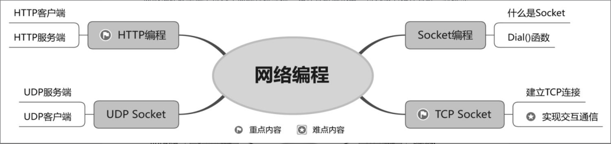
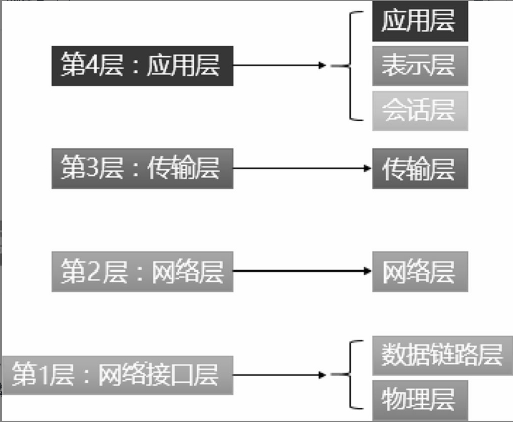
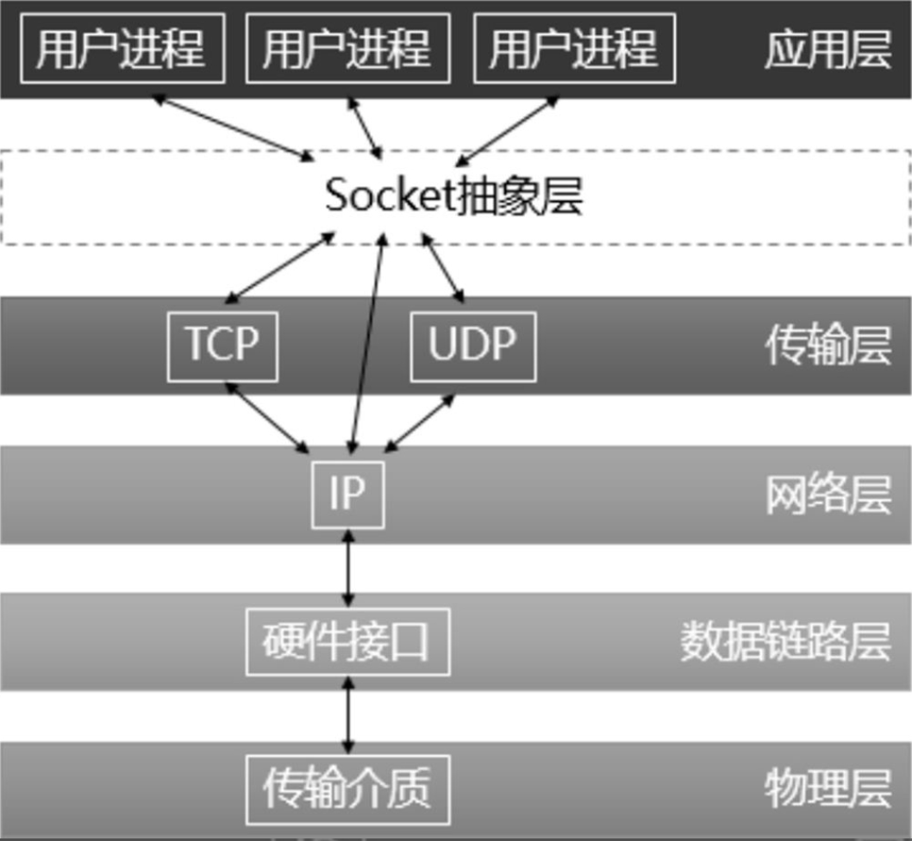
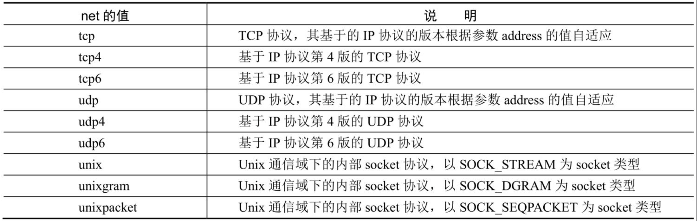
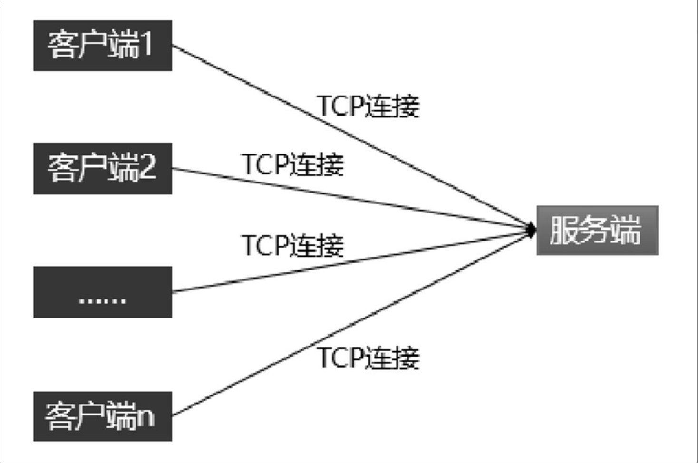
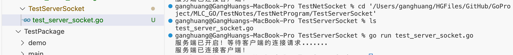
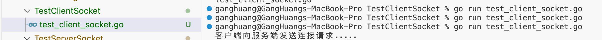
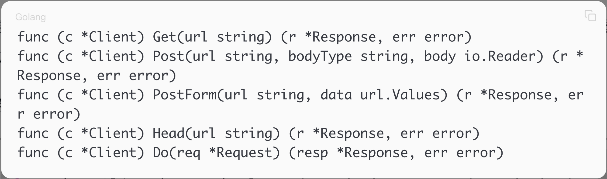

- [Socket编程](#Socket编程)
	- [什么是Socket](#什么是Socket)
- [TCPSocket](#TCPSocket)
	- [建立TCP连接](#建立TCP连接) 
	- [实现交互通信](#实现交互通信)
- [UDPSocket](#UDPSocket)
	- [UDP服务器端](#UDP服务器端) 
- [HTTP编程](#HTTP编程) 
	- [HTTP客户端](#HTTP客户端) 
	- [HTTP服务端](#HTTP服务端)
	- [响应数据配置](#响应数据配置)
	- [请求体里的JSON数据反序列化](#请求体里的JSON数据反序列化)
    - [2种JSON格式输出](#2种JSON格式输出)
    - [HTTPQuery参数解析](#HTTPQuery参数解析)
- [中间件](#中间件)
	- [中间件链式调用](#中间件链式调用)
	- [完整请求流程](#完整请求流程)
	- [ChainInterceptors实现原理](#ChainInterceptors实现原理)
	- [洋葱模型图解](#洋葱模型图解)
	- [运行示例](#运行示例)

***
<br/><br/><br/>

网络编程就是两个设备之间的数据交换，在计算机网络中，设备主要指计算机。数据交换就是当一个设备向另一个设备发送数据后，接受来自另一个设备的反馈。在网络编程中，发送连接请求的程序称作客户端(Client)，响应连接请求的程序称作服务器(Server)。其中，客户端程序可以在需要发送连接请求时再启动，而服务器程序则为了能够时刻响应连接请求，要一直保持启动状态。连接一旦建立，客户端程序和服务器程序就可以进行数据交换。




<br/><br/><br/>

> <h2 id="Socket编程">Socket编程</h2>

在底层网络应用开发中，Socket编程无处不在，这是因为大部分底层网络的应用开发都离不开Socket编程。换言之，HTTP编程、Web开发、IM通信、视频流传输的底层都是Socket编程。Socket编程主要是面向OSI模型的第3层和第4层协议。那么，什么是OSI模型呢？OSI模型就是互联网分层模型。如图18.1所示，互联网的逻辑实现可以大致分为4层，这4层又可以细分为7层，其中，每层都有自己的功能。OSI模型就像建筑物一样，每层都靠下一层支持。用户接触的只是最上面的一层，即应用层。

结合上述内容和图18.1可得到如下结论：越往上的层，越靠近用户；越往下的层，越靠近硬件。




**注意**，在开发过程中，开发者把互联网的逻辑实现分为5层，这5层由下到上依次是**物理层、数据链路层、网络层、传输层和应用层**。

- 物理层：把本地的计算机与外界的互联网连接起来，负责传送0和1的电信号。
- 数据链路层：在物理层的上方，确定物理层传输的0和1的电信号的分组方式及其代表的意义。
- 网络层：按照以太网协议的规则依靠MAC地址向外发送数据。
- 传输层：具备MAC地址和IP地址，就可以在互联网上让任意两台主机建立通信。
- 应用层：规定应用程序使用的数据格式，使应用程序能接收传输层的数据。


<br/><br/>
> <h2 id="什么是Socket">什么是Socket</h2>



Socket位于应用层与传输层之间的软件抽象层。因为Socket把复杂的TCP/IP协议隐藏在Socket的后面，开发者只需调用Socket的相关函数，即可让Socket组织符合指定协议的数据，实现通信的目的。

<br/>

&emsp; Socket又称套接字，是计算机之间进行通信的一种约定或方式。通过Socket约定，一台计算机可以接收其他计算机的数据，也可以向其他计算机发送数据。在程序开发过程中，常用的Socket类型有两种：流式Socket(SOCK_STREAM)和数据报式Socket(SOCK_DGRAM)。

&emsp; 流式Socket是一种面向连接的Socket，针对面向连接的TCP服务应用；数据报式Socket是一种无连接的Socket，针对无连接的UDP(user datagram protocol)服务应用。TCP就像送货到家的快递，既要送货到家，又要买家签收；UDP就像送到快递柜里的快递，只要货在快递柜里，买家是否签收不重要。

&emsp; 那么，Socket是如何实现通信的呢？如图18.2所示，网络层的IP地址可以唯一标识网络中的主机，而传输层的协议和端口可以唯一标识主机中的应用程序。因此，通过IP地址、协议和端口这3个要素就能够唯一标识网络中要互相通信的进程了。

<br/><br/>
> <h2 id="Dial()函数">Dial()函数</h2>


Dial()函数在使用其他编程语言实现Socket编程时，一般都按照如下步骤展开。

按照网络协议、IP地址或域名建立Socket。

使用端口绑定Socket。

监听端口。

建立连接。

发送、接收数据。

&emsp; 但是，在使用Go语言实现Socket编程时，没有上述编码步骤，这是因为Go语言标准库抽象和封装了上述步骤。在Go语言中，不论使用什么协议建立何种形式的连接，都只需要调用标准库中的Dial()函数。Dial()函数的语法格式如下。

```
func Dial(net, addr string) (Conn, error)
```

- **参数说明如下。**
	- net：网络协议的名字。
	- addr: IP地址或域名；在IP地址或域名后跟随端口号（端口号可选）​，用“:”分隔。
	- Conn：连接对象。
	- error：错误。参数net有9个常用可选值。

这些值分别代表在建立Socket连接时使用的通信协议，如表18.1所示。




使用Dial()函数通过IP地址建立TCP连接，代码如下。

```
conn, err := net.Dial("tcp", "127.0.0.1:3000")
```

<br/>

使用Dial()函数通过IP地址建立UDP协议，代码如下:

```
conn, err := net.Dial("udp", "127.0.0.1:3000")
```


<br/><br/><br/>

> <h2 id="TCPSocket">TCPSocket</h2>


TCP/IP(transmission control protocol/internet protocol)协议，即传输控制协议／网络协议，是一种面向连接的、可靠的、基于字节流的传输层(transport layer)通信协议。因为是面向连接的协议，所以数据像水流一样传输，存在黏包问题。所谓黏包问题，主要还是因为发送方一次性把所有数据都存入缓存区，接收方不知道消息之间的界限，不知道一次性提取多少字节的数据。

如图18.3所示，一个TCP服务端可以同时连接多个TCP客户端。例如，我国各个地区的用户都使用自己计算机的浏览器访问淘宝网。因为Go语言通过创建多个goroutine实现并发非常方便和高效，所以可以每建立一次链接就创建一个goroutine。




<br/><br/>
> <h2 id="建立TCP连接">建立TCP连接</h2>


在使用Go语言编写TCP服务端时，一般按照如下步骤展开。

定义通信的地址和端口。

使用Listen()函数监听TCP的地址和端口信息，并得到连接信息。

使用连接信息的Accept函数等待连接。

关闭TCP连接。

下面演示如何编写简单的TCP服务端。代码如下。

```
/// 服务端建立连接
package main

import (
	"fmt"
	"net"
)

func main() {
	// 创建TCP连接
	testSocketListen()
}

// TCP服务端服务- 创建TCP连接
func testSocketListen(){
	// 使用 net.Listen() 函数监听连接的地址与端口
	listener, err := net.Listen("tcp", "127.0.0.1:3000")
	if err != nil {
		fmt.Printf("监听失败！发送错误：%v\n", err)
		return
	}
	fmt.Println("服务端已开启！等待客户端的连接请求.......")
	// 响应由TCP客户端发送的连接请求
	conn, err := listener.Accept()
	if err != nil {
		fmt.Printf("响应失效！ 发生错误: %v\n", err)
	}
	fmt.Println("服务端已连接客户端！")
	defer conn.Close()
}
```

- **说明**
	- 在编写上述TCP服务端时，需要明确一个重点：为了创建TCP连接，需要调用net.Listen()函数，并向该函数传入3个参数，即协议类型(tcp)、IP地址和端口号


<br/>

TCP服务端编写完毕后，下面需要编写TCP客户端。在使用Go语言编写TCP客户端时，一般按照如下步骤展开。

定义通信的地址和端口。

使用Dial()函数建立与服务端的连接。

关闭TCP连接。

下面演示如何编写TCP客户端。代码如下。

```
/// 客户端建立连接
package main

import (
	"fmt"
	"net"
)


func main() {
	// 客户端连接
	testClientConnect()
}

func testClientConnect() {
	conn, err := net.Dial("tcp", "127.0.0.1:3000")	// 建立与服务端的连接
	if err != nil {
		fmt.Printf("连接失败！ 发生错误： %v\n", err.Error())
		return
	}

	fmt.Println("客户端向服务端发送连接请求.....")
	defer conn.Close()
}
```

为了保证上述程序成功运行，要打开两个VS Code窗口：一个窗口是TCP服务端（go.0.0.49.png）​，一个窗口是TCP客户端（go.0.0.50.png）​。

**TCP服务端**



<br/>
**TCP客户端**




<br/><br/>
> <h2 id="实现交互通信">实现交互通信</h2>

TCP服务端与TCP客户端建立连接后，就可以发送和接收数据，进而实现TCP服务端与TCP客户端交互通信。通过连接对象调用Write()函数，发送数据；通过连接对象调用Read()函数，接收数据。

为了让TCP服务端与TCP客户端交互通信，TCP服务端除了要使用net.Listen()函数得到连接信息，还要使用for循环不停响应由TCP客户端发送的连接请求。每响应一次由TCP客户端发送的连接请求，就创建一个用于执行发送和接收数据操作的goroutine。

对上述实现TCP服务端的代码修改如下。

```
// TCP服务端连接、发送数据
func testTCPServerSocketListenV2(){
	// 使用 net.Listen() 函数监听连接的地址与端口
	listener, err := net.Listen("tcp", "127.0.0.1:3000")
	if err != nil {
		fmt.Printf("监听失败！发送错误：%v\n", err)
		return
	}
	fmt.Println("服务端已开启！等待客户端的连接请求.......")
	for{
		// 响应由TCP客户端发送的连接请求
		conn, err := listener.Accept()
		if err != nil {
			fmt.Printf("响应失败！ 发生错误： %v\n", err)
			continue
		}
		// 对每个新连接创建的协程收发数据
		go process(conn)
	}

}
func process(conn net.Conn){
	defer conn.Close()

	for{
		var buf[128]byte
		// 接收数据
		n, err := conn.Read(buf[:])
		if err != nil {
			fmt.Printf("接收数据失败！ 发生错误：%v\n", err)
			break
		}
		fmt.Printf("已成功接收数据：%v\n", string(buf[:n]))
		// 发送数据
		if _, err = conn.Write([]byte("服务端消息！")); err != nil {
			fmt.Printf("发生数据失败！ 发生错误：%v\n", err)
			break
		}
	}
}
```

<br/>

**客户端代码**

```
// 客户端发送数据
func testTCPClientConnectV2() {
	conn, err := net.Dial("tcp", "127.0.0.1:3000")
	if err != nil {
		fmt.Printf("连接失败！发生错误：%v\n", err.Error())
		return
	}

	fmt.Println("客户端向服务器端发送连接请求......")
	defer conn.Close()
	inputReader := bufio.NewReader(os.Stdin)
	for{
		input, err  := inputReader.ReadString('\n')
		if err != nil {
			fmt.Printf("无法读取在控制台上输入的数据！发生错误： %v\n", err)
			break
		}
		trimmedInput := strings.TrimSpace(input)
		if trimmedInput == "Q" {
			break
		}
		// 发送数据
		if _,err := conn.Write([]byte(trimmedInput)); err != nil{
			fmt.Printf("发送数据失败！发生错误：%v\n", err)
			break
		}

		// 接收数据
		var recvData = make([]byte, 1024)
		if _,err := conn.Read(recvData); err != nil {
			fmt.Printf("接收数据失败！ 发生错误：%v\n", err)
			break
		}
		fmt.Printf("已成功接收数据： %v\n", string(recvData))
	}
}
```

- **说明**
	- 在修改后的TCP客户端代码中，加入了用户能在控制台上输入任意数据，并且把输入的数据发送给服务器端的功能。在VS Code窗口要开2个终端控制台的输入，才会出现运行结果。如下：

<br/><br/>

**运行服务端的代码，接收数据：**

```
ganghuang@GangHuangs-MacBook-Pro TestTCPServerSocket % go run test_tcp_server_socket.go

服务端已开启！等待客户端的连接请求.......
已成功接收数据：你好 😂哈哈
已成功接收数据：收到数据了吗？ 我收到了！
真的吗
已成功接收数据：🍒🍒请你吃樱桃
```

<br/>

**运行客户端的代码，并发送数据：**

```
ganghuang@GangHuangs-MacBook-Pro TestClientSocket % go run test_tcp_client_socket.go

客户端向服务器端发送连接请求......
你好 😂哈哈
已成功接收数据： 服务端消息！
收到数据了吗？ 我收到了！
已成功接收数据： 服务端消息！
🍒🍒请你吃樱桃
已成功接收数据： 服务端消息！
```


<br/><br/><br/>

> <h2 id="UDPSocket">UDPSocket</h2>

UDP（user datagram protocol，用户数据报协议）协议是OSI（open systeminterconnect，开放式系统互连）参考模型中的一种无连接传输层协议，不需要建立连接就能直接发送和接收数据，属于不可靠的、没有时序的通信。但是，UDP协议的实时性比较好，通常用于视频直播等相关领域。、

<br/><br/>
> <h2 id="UDP服务器端">UDP服务器端</h2>

在编写UDP服务器端时，一般按照如下步骤展开。

- 定义通信的地址和端口。
- 使用ListenUDP()函数监听UDP的地址和端口信息并得到连接信息。
- 与UDP客户端进行交互通信。

下面演示如何编写简单的UDP服务端。代码如下。

```
/// udp服务端接收数据
package main

import (
	"fmt"
	"net"
)

func main() {
	// udp服务端接收数据
	testUDPServerSocketV0()
}

func testUDPServerSocketV0() {
	// 使用
	conn, err := net.ListenUDP("udp", &net.UDPAddr{
		IP: net.IPv4(127,0,0,1),
		Port: 3000,
		Zone: "",
	})

	if err != nil {
		fmt.Println("监听失败！发送错误：", err)
		return
	}
	fmt.Println("服务端开启！ 等待客户端的连接请求.......")

	for{
		var data[1024]byte

		// 接收数据
		count, addr, err := conn.ReadFromUDP(data[:])
		if err != nil {
			fmt.Println("接收数据失败！发送错误：", err)
			continue
		}
		fmt.Printf("已成功接收数据： %s\n", data[0: count])

		
		// 发送数据
		_, errs := conn.WriteToUDP([]byte("👋你好！ 客户端！🍏"), addr)
		if errs != nil {
			fmt.Println("发送数据失败！ 发生错误❌：", errs)
			continue
		}
	}
}

```

运行后效果：

```
ganghuang@GangHuangs-MacBook-Pro TestUDPServerSocket % go run test_udp_server_socket.go
服务端开启！ 等待客户端的连接请求.......
已成功接收数据： 👋你好，服务器🧧端！！
```


<br/><br/>
> <h2 id="UDP客户端">UDP客户端</h2>

UDP服务器端编写完毕后，接下来要编写UDP客户端。

在编写UDP客户端时，一般按照如下步骤展开。

- 定义通信的地址和端口。
- 使用DialUDP()函数建立与服务器端的连接。
- 与UDP服务器端进行交互通信。
- 关闭UDP连接。

下面演示如何编写UDP客户端。代码如下。

```
/// udp客户端接收数据
package main

import (
	"fmt"
	"net"
)

func main() {
	// udp客户端接收数据
	testUDPClientSocket()
}

func testUDPClientSocket() {
	conn, err := net.DialUDP("udp", nil, &net.UDPAddr{
		IP: net.IPv4(127, 0, 0, 1),
		Port: 3000,
		Zone: "",
	})

	if err != nil {
		fmt.Println("连接失败！发生错误❌：", err)
		return
	}
	fmt.Println("客户端向服务器端发送连接请求......")
	defer conn.Close()

	// 发送数据
	sendData := []byte("👋你好，服务器🧧端！！")
	_, errs := conn.Write(sendData)
	if errs != nil {
		fmt.Println("发送数据失败！发生错误：", errs)
		return
	}

	// 接收数据
	data := make([]byte, 4096)
	_,_, errors := conn.ReadFromUDP(data)
	if errors != nil {
		fmt.Println("接收数据失败！ 发生错误：", errors)
		return
	}
	fmt.Printf("已成功接收数据： %s\n", string(data))
}
```

运行后：

```
ganghuang@GangHuangs-MacBook-Pro TestUDPClientSocket % go run test_udp_client_socket.go
客户端向服务器端发送连接请求......
已成功接收数据： 👋你好！ 客户端！🍏
```


<br/><br/><br/>
> <h2 id="HTTP编程">HTTP编程</h2>

  HTTP(hypertext transfer protocol)协议，即超文本传输协议，是互联网上应用最为广泛的一种网络协议，它规定了浏览器和服务器之间交互通信的规则，通过互联网传送文档的数据传送协议。HTTP协议通常承载于TCP协议之上。


<br/><br/>
> <h2 id="HTTP客户端">HTTP客户端</h2>

因为Go语言内置的net/http包涵盖HTTP客户端的具体实现，所以HTTP客户端的具体实现不需要借助第三方网络通信库。

为了实现HTTP客户端，net/http包中的Client类型提供如下几个函数。



- **函数说明如下。**
	- Get()：用于请求资源，如网址首页等。
	- Post()：用于发送数据。
	- PostForm()：用于提交标准编码格式为application/x-www-form-urlencoded的表单。
	- Head()：用于只请求资源的头部信息。
	- Do()：用于设定一些自定义的HTTP Header字段，满足HTTP请求中的定制信息。下面演示如何编写简单的HTTP客户端。

代码如下。

```
package main

import (
	"fmt"
	"io/ioutil"
	"net/http"
)

func main() {
	// http客户端发送请求
	testHttpClientV0()
}

// http客户端发送请求
func testHttpClientV0() {
	response, _ := http.Get("http://localhost:3000/hello")// 发送HTTP请求， 请求一个网页
	defer response.Body.Close() // 关闭请求
	body, _ := ioutil.ReadAll(response.Body) // 接收数据
	fmt.Println(string(body))	
}
```


<br/><br/>
> <h2 id="HTTP服务端">HTTP服务端</h2>

使用net/http包提供的http.ListenAndServe()函数可以监听指定地址并处理HTTP请求。http.ListenAndServe()函数的语法格式如下。

```
func ListenAndServe(addr string, handler Handler) error 
```

- **参数说明如下。**
	- addr：监听地址。
	- handler：用于处理连接请求的服务端处理程序，通常为空。

<br/>

此外，net/http包还提供http.ListenAndServeTLS()函数，用于处理HTTPS连接请求。http.ListenAndServeTLS()函数的语法格式如下。

```
func ListenAndServeTLS(addr, certFile, keyFile string, handler Handler) error
```

- **参数说明如下。**
	- addr：监听地址。
	- certFile：对应证书文件（如SSL证书）存放路径。
	- keyFile：对应证书私钥文件路径。
	- handler：用于处理连接请求的服务端处理程序，通常为空。

下面演示如何编写简单的HTTP服务端。代码如下。

```
package main

import (
	"flag"
	"net/http"
)

func main() {
	// http服务端请求
	testHttpServerV0()
}

// http服务端请求
func testHttpServerV0() {
	host := flag.String("host", "127.0.0.1", "listen host")	// 域名
	port := flag.String("port", "3000", "listen port")	// 端口

	http.HandleFunc("/hello", Hello)

	err := http.ListenAndServe(*host+":"+*port, nil) //处理HTTP请求
	if err != nil {
		panic(err)
	}
}
func Hello(w http.ResponseWriter, req *http.Request){
	w.Write([]byte("你好， 客户端！"))
}
```


为了保证上述程序成功运行，要打开两个VS Code窗口：一个窗口是HTTP服务器端，另一个窗口是HTTP客户端。

当运行程序时，要先运行HTTP服务器端，再运行UDP客户端，在UDP客户端所在VSCode窗口的控制台上打印如下的信息。如下：

<br/><br/>

**服务端运行：**

```
ganghuang@GangHuangs-MacBook-Pro TestHttpServer % go run test_http_server.go
```

<br/>

**客户端运行：**

```
ganghuang@GangHuangs-MacBook-Pro TestHttpClient %  go run test_http_client.go
你好， 客户端！
```


***
<br/><br/><br/>
> <h2 id="响应数据配置">响应数据配置</h2>

```go
func writeJSON(w http.ResponseWriter, v any)  {
	w.Header().Set("Content-Type", "application/json")
	json.NewEncoder(w).Encode(v)
}
```

&emsp; 用于将任意数据结构以 JSON 格式写入 HTTP 响应（`http.ResponseWriter`），通常用在 Web 服务（如 REST API）中返回 JSON 数据给客户端。

<br/>

- **说明：**
	- `w http.ResponseWriter`：用于向 HTTP 客户端（比如浏览器或 API 调用者）写入响应。

	- `v any`：Go 1.18+ 引入的泛型语法，`any` 是 `interface{}` 的别名，表示可以传入任意类型的值（比如 struct、map、slice 等）。

	- `w.Header().Set("Content-Type", "application/json")`
		- 设置 HTTP 响应头中的 `Content-Type` 为 `application/json`。
		- 这告诉客户端：“我返回的是 JSON 数据”，这样浏览器或 API 客户端就知道如何解析响应体。

	- `‌json.NewEncoder(w).Encode(v)` 
		- 使用标准库 `encoding/json` 中的 `json.Encoder`。
		- `json.NewEncoder(w)` 创建一个将数据编码为 JSON 并直接写入 `w`（即 HTTP 响应流）的编码器。
		- `.Encode(v)` 将变量 `v` 序列化为 JSON，并写入响应。

---
<br/> 

```go
type User struct {
	Name string `json:"name"`
	Age  int    `json:"age"`
}

func getUser(w http.ResponseWriter, r *http.Request) {
	user := User{Name: "Alice", Age: 30}
	writeJSON(w, user) // 直接返回 JSON: {"name":"Alice","age":30}
}
```

优点：
- **复用性强**：避免在每个 handler 里重复写设置 Header 和 Encode 的逻辑。
- **简洁清晰**：一行调用即可返回结构化 JSON。
- **流式输出**：`json.Encoder` 直接写入 `http.ResponseWriter`，无需先 marshal 成字节再写，节省内存（尤其对大对象更高效）。

---
<br/>

**注意事项**

1. **错误处理缺失**：  
   `Encode` 可能失败（比如 `v` 包含不可序列化的字段），但这里没有检查错误。生产环境中建议处理：
   ```go
   if err := json.NewEncoder(w).Encode(v); err != nil {
       http.Error(w, "Failed to encode JSON", http.StatusInternalServerError)
       return
   }
   ```

2. **尾部换行**：  
   `json.Encoder.Encode()` 会在 JSON 后自动添加一个换行符 `\n`，这是标准行为，一般不影响使用。


***
<br/><br/><br/>
> <h2 id="请求体里的JSON数据反序列化">请求体里的JSON数据反序列化</h2>

```go
r *http.Reqeust

type Req struct { 
	Account string json:"account" // email or phone 
} 
var req Req 
json.NewDecoder(r.Body).Decode(&req)
```

**在 HTTP 服务端中，把请求体里的 JSON 数据反序列化（解码）成 Go 结构体**。我们可以从“对象来源、执行过程、底层机制、常见注意点”四个层面来理解。

<br/>

```go
json.NewDecoder(r.Body).Decode(&req)
```

**含义：**

> 从 HTTP 请求体 `r.Body` 中读取 JSON 数据，并按字段标签规则，把数据填充到结构体 `req` 中。

这是 Go 标准库里 **最典型、最推荐的 HTTP JSON 入参解析方式**。

---
<br/> 

**1️⃣ `r.Body` 是什么？**

```go
r *http.Request
```

<br/>

* `r.Body` 类型是：

```go
io.ReadCloser
```

* 本质是一个 **流（stream）**
* 里面存放的是 HTTP 请求的原始 body 内容，例如：

<br/>

```json
{
  "account": "test@example.com"
}
```

⚠️ 注意：
`r.Body` **只能读一次**（读完就没了）

<br/>

**2️⃣ `json.NewDecoder(r.Body)` 做了什么？**

```go
decoder := json.NewDecoder(r.Body)
```

作用：

* 创建一个 **JSON 解码器**
* 解码器的输入来源是一个 `io.Reader`
* 这里传入的正是 HTTP 请求体流

等价理解为：

> “我要从这个输入流里，按 JSON 语法规则读取数据”

<br/> 

**3️⃣ `.Decode(&req)` 在干什么？**

```go
err := decoder.Decode(&req)
```

核心行为：

1. 从 `r.Body` 读取字节流
2. 按 JSON 规则解析
3. 根据结构体的 `json` tag 做字段映射
4. 将值写入 `req`（所以必须传指针）

<br/> 

**4️⃣ `Req` 结构体如何参与解码？**

```go
type Req struct {
    Account string `json:"account"`
}
```

对应 JSON：

```json
{
  "account": "xxx"
}
```

映射规则：

| JSON 字段 | Go 字段       |
| ------- | ----------- |
| account | Req.Account |

如果 JSON 是：

```json
{
  "account": "13800000000"
}
```

那么解码后：

```go
req.Account == "13800000000"
```

---
<br/>

**完整执行流程**

```text
HTTP 请求
  ↓
r.Body（字节流）
  ↓
json.Decoder 从流中读取
  ↓
JSON 语法解析
  ↓
字段名匹配 json tag
  ↓
写入结构体字段
```

---
<br/>

**为什么要用 `Decoder`，而不是 `Unmarshal`？**

很多人会问：

```go
body, _ := io.ReadAll(r.Body)
json.Unmarshal(body, &req)
```

<br/>

 **✅ `json.NewDecoder` 的优势**

| 方式      | 优点                  |
| ------- | ------------------- |
| Decoder | 流式读取，内存友好           |
| Decoder | 适合 HTTP Body        |
| Decoder | 可限制输入大小             |
| Decoder | 支持多次 Decode（JSON 流） |
<br/> 

**❌ `ReadAll + Unmarshal` 的问题**

* 一次性读入内存
* 大请求容易 OOM
* 不适合生产环境

**因此：**

> 服务端解析请求体 JSON，标准做法就是 `json.NewDecoder(r.Body).Decode(&req)`

---
<br/>

**上述写法是有隐患的**

正确写法：

```go
if err := json.NewDecoder(r.Body).Decode(&req); err != nil {
    http.Error(w, "invalid json", http.StatusBadRequest)
    return
}
```

<br/>

**2️⃣ Decode 必须传指针**

```go
Decode(&req)
```

原因：
Decode 要 **修改结构体内容**

<br/>

**3️⃣ JSON 多字段时会自动忽略多余字段**

JSON：

```json
{
  "account": "a@b.com",
  "password": "123456"
}
```

结构体：

```go
type Req struct {
    Account string `json:"account"`
}
```

* `password` 会被 **自动忽略**
* 不会报错


---
<br/>

**完整可运行示例（HTTP Handler）**

```go
func loginHandler(w http.ResponseWriter, r *http.Request) {
    type Req struct {
        Account string `json:"account"`
    }

    var req Req
    if err := json.NewDecoder(r.Body).Decode(&req); err != nil {
        http.Error(w, "Invalid JSON", http.StatusBadRequest)
        return
    }

    fmt.Println("account:", req.Account)
    w.Write([]byte("ok"))
}
```


<br/><br/><br/>
> <h2 id="2种JSON格式输出">2种JSON格式输出</h2>h2

若是工程代码中有如下：

```go
w.Write(jsonBytes)               // 第一次写入 JSON
json.NewEncoder(w).Encode(userMap) // 第二次又写一次 JSON
```

这样写 **有问题**，因为你这里调用了两次 JSON 输出。

* HTTP 响应只能写一次 JSON，否则浏览器会报错或者出现混乱数据
* `MarshalIndent` + `w.Write` 或者 `json.NewEncoder(w).Encode` **只能选一个**

---
<br/>

**正确用法**

** 方式 1：使用 `MarshalIndent`（漂亮缩进）**

```go
w.Header().Set("Content-Type", "application/json; charset=utf-8")

jsonBytes, err := json.MarshalIndent(userDto, "", "  ")
if err != nil {
    http.Error(w, "JSON 编码失败", http.StatusInternalServerError)
    return
}

w.Write(jsonBytes) // 直接写入响应
```

* `userDto` 可以是你的结构体或 map
* 浏览器 fetch 获取后，可以用 `JSON.stringify(data, null, 2)` 再打印漂亮

---
<br/>

**方式 2：使用 `json.NewEncoder(w).Encode`（不缩进，自动输出 JSON）**

```go
w.Header().Set("Content-Type", "application/json; charset=utf-8")
if err := json.NewEncoder(w).Encode(userDto); err != nil {
    http.Error(w, "JSON 编码失败", http.StatusInternalServerError)
    return
}
```

* `Encode` 会直接写入 `w`，默认是紧凑 JSON（没有换行缩进）
* 如果想要漂亮缩进，`Encode` 不支持，需要用 `MarshalIndent`


***
<br/><br/><br/>
> <h2 id="HTTPQuery参数解析">HTTPQuery参数解析</h2>


下面这行代码常用于从 URL 查询参数中读取 `limit` 并转换成 `int`：

```go
limit, _ := strconv.Atoi(r.URL.Query().Get("limit"))
```

例如请求：

```text
GET /list?limit=20
```

最终得到：

```go
limit = 20
```

<br/>

## 执行流程

```go
r.URL.Query().Get("limit") // "20"
strconv.Atoi("20")         // (20, nil)
limit = 20
```

整体链路：

```text
HTTP Query String → string → int → limit
```

<br/>

## 逐段解析

```go
r.URL.Query()
```

获取所有 URL 查询参数。例如：

```text
/list?limit=20&page=2
```

会解析成：

```go
map[string][]string{
    "limit": {"20"},
    "page":  {"2"},
}
```

<br/>

```go
r.URL.Query().Get("limit")
```

取出 `limit` 参数的第一个值，返回类型是 `string`；如果参数不存在，返回空字符串 `""`。

<br/>

```go
strconv.Atoi("20")
```

把字符串转成 `int`，返回值是 `(int, error)`：

```go
n, err := strconv.Atoi("20")
// n = 20
// err = nil
```

如果传入非法数字：

```go
n, err := strconv.Atoi("abc")
// n = 0
// err != nil
```

<br/>

```go
limit, _ := strconv.Atoi(...)
```

这是 Go 多返回值的忽略写法：`limit` 接收转换后的 `int`，`_` 丢弃 `error`。

<br/>

## 风险点

直接忽略 `error` 会把缺失参数和非法参数都转换成 `0`，容易让业务误判：

| 请求 | 解析结果 | 问题 |
|------|----------|------|
| `/list` | `Atoi("")` → `limit = 0` | 未传参数被当成 0 |
| `/list?limit=abc` | `Atoi("abc")` → `limit = 0` | 非法参数被当成 0 |

<br/>

## 推荐写法

如果 `limit` 有默认值，优先显式处理错误和非法范围：

```go
limitStr := r.URL.Query().Get("limit")

limit := 10 // 默认值
if v, err := strconv.Atoi(limitStr); err == nil && v > 0 {
    limit = v
}
```

更直接的写法：

```go
limitStr := r.URL.Query().Get("limit")

limit, err := strconv.Atoi(limitStr)
if err != nil || limit <= 0 {
    limit = 10
}
```

核心原则：**外部输入都不可信，Query 参数要同时处理缺失、格式错误和范围非法三类情况**。


***
<br/><br/><br/>
> <h3 id="strconvParseInt字符串转int64">strconv.ParseInt 字符串转 int64</h3>

`strconv.ParseInt(keyword, 10, 64)` 的作用是：**把字符串 `keyword` 按十进制解析成 `int64`**。

```go
n, err := strconv.ParseInt(keyword, 10, 64)
```

函数原型：

```go
func ParseInt(s string, base int, bitSize int) (i int64, err error)
```

参数含义：

| 参数 | 示例 | 说明 |
|------|------|------|
| `s` | `keyword`、`"123"` | 要转换的字符串 |
| `base` | `10` | 按什么进制解析，常用 `10` 表示十进制 |
| `bitSize` | `64` | 限制结果整数位数，`64` 表示按 `int64` 范围解析 |

常见 `base`：

| base | 含义 |
|------|------|
| `10` | 十进制 |
| `2` | 二进制 |
| `8` | 八进制 |
| `16` | 十六进制 |

常见 `bitSize`：

| bitSize | 对应范围 |
|---------|----------|
| `8` | `int8` |
| `16` | `int16` |
| `32` | `int32` |
| `64` | `int64` |

---
<br/>

## 示例

正常数字：

```go
keyword := "123"

n, err := strconv.ParseInt(keyword, 10, 64)
// n = 123
// err = nil
```

非法数字：

```go
keyword := "abc"

n, err := strconv.ParseInt(keyword, 10, 64)
// n = 0
// err != nil
```

负数：

```go
keyword := "-100"

n, err := strconv.ParseInt(keyword, 10, 64)
// n = -100
```

二进制解析：

```go
n, err := strconv.ParseInt("1010", 2, 64)
// n = 10
// err = nil
```

---
<br/>

## 和 Atoi 的区别

`strconv.Atoi(s)` 等价于 `strconv.ParseInt(s, 10, 0)` 后再转成 `int`，返回类型依赖当前平台的 `int` 大小；`ParseInt` 可以显式指定进制和位数，更适合数据库 ID、Redis key、订单号、用户 ID 等需要明确 `int64` 的场景。

| 方法 | 示例 | 返回类型 | 是否可控 bitSize |
|------|------|----------|------------------|
| `Atoi` | `strconv.Atoi("123")` | `int` | 否 |
| `ParseInt` | `strconv.ParseInt("123", 10, 64)` | `int64` | 是 |

典型用途：

```text
?keyword=123
?id=10001
?page=2
```

推荐写法是保留 `err` 并显式处理非法输入，不要把错误静默吞掉：

```go
id, err := strconv.ParseInt(r.URL.Query().Get("id"), 10, 64)
if err != nil || id <= 0 {
    // 返回参数错误或使用默认值
}
```

结论：**`strconv.ParseInt(keyword, 10, 64)` 就是把字符串 `keyword` 按十进制转换成 `int64`，如果不是合法数字就返回错误**。


<br/><br/><br/>

***
<br/>

> <h1 id="中间件">中间件</h1>


***
<br/><br/><br/>
> <h2 id="中间件链式调用">中间件链式调用</h2>


## 核心概念：洋葱模型

```text
ChainInterceptors(guarded, A, B, C)

请求流向（洋葱模型）：
┌─────────────────────────────────────────┐
│  C 进入 → B 进入 → A 进入 → guarded     │
│                 ↓ 业务处理              │
│  C 退出 ← B 退出 ← A 退出 ← guarded     │
└─────────────────────────────────────────┘
```

`ChainInterceptors(guarded, A, B, C)` 最终表现为：**C 最先进入，A 最靠近业务，响应返回时反向退出**。

<br/>

## 4 层中间件洋葱模型

```text
请求 ──→
        ┌────────────────────────────────────────┐
        │ 【1】JSONHeaderInterceptor 进入         │
        │   ┌──────────────────────────────────┐ │
        │   │ 【2】RecoverInterceptor 进入      │ │
        │   │   ┌────────────────────────────┐ │ │
        │   │   │ 【3】AccessLogInterceptor  │ │ │
        │   │   │ 进入                       │ │ │
        │   │   │   ┌──────────────────────┐ │ │ │
        │   │   │   │ 【4】TIDInterceptor  │ │ │ │
        │   │   │   │ 进入                  │ │ │ │
        │   │   │   │   ┌────────────────┐ │ │ │ │
        │   │   │   │   │   业务处理      │ │ │ │ │
        │   │   │   │   └────────────────┘ │ │ │ │
        │   │   │   │ 退出                  │ │ │ │
        │   │   │   └──────────────────────┘ │ │ │
        │   │   │ 退出                       │ │ │
        │   │   └────────────────────────────┘ │ │
        │   │ 退出                             │ │
        │   └──────────────────────────────────┘ │
        │ 退出                                   │
        └────────────────────────────────────────┘
                                     ←── 响应
```

**执行顺序：**

| 阶段 | 执行顺序 | 说明 |
|------|---------|------|
| 请求进入 | 1 → 2 → 3 → 4 → 业务 | 从外层到内层，层层深入 |
| 响应返回 | 业务 → 4 → 3 → 2 → 1 | 从内层到外层，层层退出 |

**每一层职责：**

| 层级 | 中间件 | 职责 |
|------|--------|------|
| 1 | `JSONHeaderInterceptor` | 设置响应头 `Content-Type: application/json` |
| 2 | `RecoverInterceptor` | 捕获 `panic`，防止服务崩溃 |
| 3 | `AccessLogInterceptor` | 记录请求方法、路径、耗时 |
| 4 | `RequestTIDInterceptor` | 生成追踪 ID，便于日志追踪 |

<br/>

## 简化代码示例

```go
// 假设 3 个简单拦截器
func A(next http.Handler) http.Handler {
    return http.HandlerFunc(func(w http.ResponseWriter, r *http.Request) {
        fmt.Println("A: 进入")
        next.ServeHTTP(w, r) // 调用下一层
        fmt.Println("A: 退出")
    })
}

func B(next http.Handler) http.Handler {
    return http.HandlerFunc(func(w http.ResponseWriter, r *http.Request) {
        fmt.Println("B: 进入")
        next.ServeHTTP(w, r)
        fmt.Println("B: 退出")
    })
}

func C(next http.Handler) http.Handler {
    return http.HandlerFunc(func(w http.ResponseWriter, r *http.Request) {
        fmt.Println("C: 进入")
        next.ServeHTTP(w, r) // 调用下一层
        fmt.Println("C: 退出")
    })
}

// 调用 ChainInterceptors
handler := ChainInterceptors(
    guarded, // 业务处理
    A, B, C, // 中间件
)
```

请求到达时输出：

```text
C: 进入
B: 进入
A: 进入
[guarded 业务处理]
A: 退出
B: 退出
C: 退出
```

***
<br/><br/><br/>
> <h2 id="完整请求流程">完整请求流程</h2>


假设用户调用登录接口：

```text
POST /api/v1/auth/login
Body: {"username": "test", "password": "123456"}
```

代码结构：

```go
return ChainInterceptors(
    guarded,                       // 内层：实际业务处理
    RequestTIDInterceptor,         // 4
    AccessLogInterceptor,          // 3
    RecoverInterceptor,            // 2
    JSONHeaderInterceptor,         // 1
)
```

请求完整旅程：

```text
┌─────────────────────────────────────────────────────────────────────┐
│  客户端发起请求                                                       │
│  POST /api/v1/auth/login                                            │
│  Body: {"username": "test", "password": "123456"}                    │
└─────────────────────────────────────────────────────────────────────┘
                                    ↓
┌─────────────────────────────────────────────────────────────────────┐
│ 第 1 层：JSONHeaderInterceptor                                       │
│   · 设置响应头：Content-Type: application/json                       │
│   · 调用 next.ServeHTTP()，进入下一层                                 │
└─────────────────────────────────────────────────────────────────────┘
                                    ↓
┌─────────────────────────────────────────────────────────────────────┐
│ 第 2 层：RecoverInterceptor                                          │
│   · defer recover() 捕获可能的 panic                                 │
│   · 调用 next.ServeHTTP()，进入下一层                                 │
└─────────────────────────────────────────────────────────────────────┘
                                    ↓
┌─────────────────────────────────────────────────────────────────────┐
│ 第 3 层：AccessLogInterceptor                                        │
│   · 记录请求开始时间                                                  │
│   · 调用 next.ServeHTTP()，进入下一层                                 │
└─────────────────────────────────────────────────────────────────────┘
                                    ↓
┌─────────────────────────────────────────────────────────────────────┐
│ 第 4 层：RequestTIDInterceptor                                       │
│   · 生成/提取追踪ID (例如: TID-20260430-abc123)                       │
│   · 设置到 context 中                                                │
│   · 调用 next.ServeHTTP()，进入下一层                                 │
└─────────────────────────────────────────────────────────────────────┘
                                    ↓
┌─────────────────────────────────────────────────────────────────────┐
│ 第 5 层：guarded (业务路由)                                          │
│   · APIGuardInterceptor 鉴权检查（公开接口，直接通过）                 │
│   · 路由匹配：找到 /api/v1/auth/login 对应的 Login 处理函数           │
│   · 执行 userHandler.Login(w, r)                                     │
│   · 业务逻辑：                                                        │
│     - 解析请求体                                                     │
│     - 验证用户名密码                                                  │
│     - 生成 Token                                                     │
│     - 返回 JSON 响应                                                 │
└─────────────────────────────────────────────────────────────────────┘
                                    ↓
                        【响应原路返回】
                                    ↓
┌─────────────────────────────────────────────────────────────────────┐
│ 第 4 层：RequestTIDInterceptor 返回                                  │
│   · 无额外处理，返回                                                  │
└─────────────────────────────────────────────────────────────────────┘
                                    ↓
┌─────────────────────────────────────────────────────────────────────┐
│ 第 3 层：AccessLogInterceptor 返回                                   │
│   · 计算耗时：200ms                                                   │
│   · 记录日志：[TID-20260430-abc123] POST /login 200 200ms            │
└─────────────────────────────────────────────────────────────────────┘
                                    ↓
┌─────────────────────────────────────────────────────────────────────┐
│ 第 2 层：RecoverInterceptor 返回                                     │
│   · 无 panic，直接返回                                               │
└─────────────────────────────────────────────────────────────────────┘
                                    ↓
┌─────────────────────────────────────────────────────────────────────┐
│ 第 1 层：JSONHeaderInterceptor 返回                                  │
│   · 响应头已设置，直接返回                                            │
└─────────────────────────────────────────────────────────────────────┘
                                    ↓
┌─────────────────────────────────────────────────────────────────────┐
│  客户端收到响应                                                       │
│  HTTP/1.1 200 OK                                                     │
│  Content-Type: application/json                                      │
│  Body: {"code":0,"data":{"token":"xxx"},"message":"登录成功"}        │
└─────────────────────────────────────────────────────────────────────┘
```

<br/>

## 快递包裹类比

```text
你寄快递（发送请求）：

1. 📦 打包盒           → JSONHeaderInterceptor（标记内容类型）
2. 📋 贴保价单         → RecoverInterceptor（如果出问题有保障）
3. 🏷️ 贴运单号         → AccessLogInterceptor（记录追踪信息）
4. 🚪 放入快递柜       → RequestTIDInterceptor（生成取件码）
5. 🏠 快递员取走配送   → guarded（实际送达目的地）

签收后，快递员返回确认，一层层上报回来...
```

<br/>

## 如果中间发生 panic

```text
假设 Login 内部 panic("数据库连接失败")

第 5 层：guarded → panic
         ↓
第 4 层：RequestTIDInterceptor → 正常返回
         ↓
第 3 层：AccessLogInterceptor → 正常返回
         ↓
第 2 层：RecoverInterceptor
         · 捕获到 panic
         · 记录错误日志
         · 返回 500 错误响应
         · 阻止程序崩溃
         ↓
客户端收到：{"code":500,"message":"服务器内部错误"}
```

**请求进入**：外层 → 内层（像剥洋葱皮）  
**响应返回**：内层 → 外层（像穿洋葱皮）

每一层都可以在请求前做预处理，也可以在响应后做日志、异常、清理等后处理。


***
<br/><br/><br/>
> <h2 id="ChainInterceptors实现原理">ChainInterceptors实现原理</h2>

**核心代码：**

```go
// HGHTTPInterceptor 表示一个可组合的 HTTP 拦截器。
type HGHTTPInterceptor func(http.Handler) http.Handler

// ChainInterceptors 在启动阶段把拦截器链装配为最终 handler，避免请求期重复构建。
func ChainInterceptors(base http.Handler, interceptors ...HGHTTPInterceptor) http.Handler {
    if base == nil {
        return nil
    }

    wrapped := base
    for i := len(interceptors) - 1; i >= 0; i-- {
        if interceptors[i] == nil {
            continue
        }
        wrapped = interceptors[i](wrapped)
    }

    return wrapped
}
```

从后往前包装是为了先构建内层，再把内层作为 `next` 交给外层：

```go
for i := len(interceptors) - 1; i >= 0; i-- {
    wrapped = interceptors[i](wrapped)
}
```

这样保证：**第一个外层参数最先执行进入逻辑，最后一个内层参数最靠近业务逻辑**。

***
<br/><br/><br/>
> <h2 id="洋葱模型图解">洋葱模型图解</h2>


## 函数嵌套调用

中间件的洋葱模型源于函数嵌套调用：外层在 `next.ServeHTTP` 前执行进入逻辑，在 `next.ServeHTTP` 返回后执行退出逻辑。

```go
func MiddlewareA(next http.Handler) http.Handler {
    return http.HandlerFunc(func(w http.ResponseWriter, r *http.Request) {
        fmt.Println("A: 进入")           // 1. 请求前
        next.ServeHTTP(w, r)             // 2. 调用下一层（进入洋葱内部）
        fmt.Println("A: 退出")           // 5. 响应后
    })
}

func MiddlewareB(next http.Handler) http.Handler {
    return http.HandlerFunc(func(w http.ResponseWriter, r *http.Request) {
        fmt.Println("B: 进入")           // 2. 请求前
        next.ServeHTTP(w, r)             // 3. 调用下一层（进入洋葱内部）
        fmt.Println("B: 退出")           // 4. 响应后
    })
}
```

## 组装和执行流程

```text
ChainInterceptors(business, A, B)

组装过程（从后往前）：
┌─────────────────────────────────────────────────────────┐
│  Step 1: wrapped = business                            │
│  Step 2: wrapped = B(business)     // B 包裹 business  │
│  Step 3: wrapped = A(B(business))  // A 包裹 B         │
│                                                         │
│  最终结构：A(B(business))                               │
│  就像：A { B { business } }                             │
└─────────────────────────────────────────────────────────┘

请求到达时的执行顺序：
┌─────────────────────────────────────────────────────────┐
│  请求 ──→ A.ServeHTTP()                                 │
│            │                                            │
│            ├─→ 打印 "A: 进入"                            │
│            │                                            │
│            ├─→ next.ServeHTTP()  (调用 B)               │
│            │     │                                      │
│            │     ├─→ 打印 "B: 进入"                     │
│            │     │                                      │
│            │     ├─→ next.ServeHTTP()  (调用 business)  │
│            │     │     │                                │
│            │     │     └─→ 业务处理                      │
│            │     │                                      │
│            │     ├─→ 打印 "B: 退出"                      │
│            │     │                                      │
│            │     └─→ 返回                               │
│            │                                            │
│            ├─→ 打印 "A: 退出"                            │
│            │                                            │
│            └─→ 返回 ──→ 响应                             │
└─────────────────────────────────────────────────────────┘
```

## 洋葱比喻

```text
        请求 ──→
                    ┌──────────────┐
                    │   中间件 A   │
                    │  ┌────────┐  │
                    │  │中间件 B│  │
                    │  │ ┌────┐ │  │
                    │  │ │业务│ │  │
                    │  │ │处理│ │  │
                    │  │ └────┘ │  │
                    │  └────────┘  │
                    └──────────────┘
                            ↓
        ←── 响应
```

## 递归调用比喻

```go
func A() {
    print("进入 A")
    B()           // A 等待 B 返回
    print("退出 A")
}

func B() {
    print("进入 B")
    business()    // B 等待 business 返回
    print("退出 B")
}

// 输出顺序：
// 进入 A → 进入 B → 业务处理 → 退出 B → 退出 A
```

## 电话流程比喻

```text
打电话找人：

你（客户端）
  ↓ 拨号
总机（中间件 A）─→ "请稍等" ─→ 转接
  ↓
分机（中间件 B）─→ "正在接通" ─→ 转接
  ↓
目标人员（业务处理）─→ "喂，你好"
  ↓ 挂断
分机（中间件 B）←─ "再见"
  ↓
总机（中间件 A）←─ "再见"
  ↓
你（客户端）收到响应
```

## 洋葱模型的好处

```text
┌─────────────────────────────────────────────────────────────┐
│ 1. 统一的请求/响应处理                                        │
│    - 每个中间件都能在请求前后做处理                           │
│    - 不需要在每个 handler 里重复写日志、错误处理等            │
├─────────────────────────────────────────────────────────────┤
│ 2. 责任分离                                                  │
│    - 日志中间件只管日志                                       │
│    - 恢复中间件只管 panic 捕获                                │
│    - 业务 handler 只管业务逻辑                               │
├─────────────────────────────────────────────────────────────┤
│ 3. 可插拔、可组合                                            │
│    - 随时添加/移除中间件                                      │
│    - 中间件顺序可调整                                         │
│    - 不同路由可使用不同中间件组合                             │
├─────────────────────────────────────────────────────────────┤
│ 4. 异常统一处理                                              │
│    - RecoverInterceptor 在外层捕获所有 panic                 │
│    - 避免整个服务崩溃                                         │
└─────────────────────────────────────────────────────────────┘
```


***
<br/><br/><br/>
> <h2 id="运行示例">运行示例</h2>


## 中间件组合

```go
handler := ChainInterceptors(
    businessHandler,
    RequestTIDInterceptor,   // 4 (最内层，最后进入，最先退出)
    AccessLogInterceptor,    // 3
    RecoverInterceptor,      // 2
    JSONHeaderInterceptor,   // 1 (最外层，最先进入，最后退出)
)
```

## 正常请求

```bash
curl http://localhost:8080/hello
```

服务器输出：

```text
========================================
【1-进入】JSONHeaderInterceptor - 设置响应头
【2-进入】RecoverInterceptor - 设置 panic 捕获
【3-进入】AccessLogInterceptor - GET /hello
【4-进入】RequestTIDInterceptor - TID: TID-20260430-ABC123
>>> 【业务处理】开始执行 <<<
>>> 【业务处理】执行完毕 <<<
【4-退出】RequestTIDInterceptor - TID: TID-20260430-ABC123
【3-退出】AccessLogInterceptor - 请求完成
【2-退出】RecoverInterceptor - 正常完成
【1-退出】JSONHeaderInterceptor - 响应已完成
========================================
```

客户端收到：

```json
{"code":0,"message":"Hello, World!"}
```

<br/>

**原始运行输出：**

```bash
$ curl http://localhost:8080/hello

# 服务器输出：
========================================
【1. JSONHeaderInterceptor】进入 - 设置响应头
【2. RecoverInterceptor】进入 - 设置 panic 恢复
【3. AccessLogInterceptor】进入 - GET /hello
【4. RequestTIDInterceptor】进入 - 生成追踪ID: TID-20260430-ABC123
>>> 【业务处理】helloHandler 开始执行 <<<
>>> 【业务处理】处理用户请求 <<<
>>> 【业务处理】返回响应内容 <<<
【4. RequestTIDInterceptor】退出 - 追踪ID: TID-20260430-ABC123
【3. AccessLogInterceptor】退出 - 请求处理完成
【2. RecoverInterceptor】退出 - 正常结束
【1. JSONHeaderInterceptor】退出 - 响应已返回
========================================

# 客户端收到：
{"code":0,"message":"Hello, World!"}
```

---
<br/>

## panic 捕获

```bash
curl http://localhost:8080/panic
```

服务器输出：

```text
========================================
【1-进入】JSONHeaderInterceptor - 设置响应头
【2-进入】RecoverInterceptor - 设置 panic 捕获
【3-进入】AccessLogInterceptor - GET /panic
【4-进入】RequestTIDInterceptor - TID: TID-20260430-ABC123
>>> 【业务处理】即将 panic <<<
【2-捕获】RecoverInterceptor - panic: 模拟数据库连接失败
【1-退出】JSONHeaderInterceptor - 响应已完成
========================================
```

客户端收到：

```json
{"code":500,"message":"服务器内部错误"}
```

<br/>

**原始 panic 输出：**

```bash
$ curl http://localhost:8080/panic

# 服务器输出：
========================================
【1. JSONHeaderInterceptor】进入 - 设置响应头
【2. RecoverInterceptor】进入 - 设置 panic 恢复
【3. AccessLogInterceptor】进入 - GET /panic
【4. RequestTIDInterceptor】进入 - 生成追踪ID: TID-20260430-ABC123
>>> 【业务处理】即将 panic <<<
【2. RecoverInterceptor】捕获 panic: 数据库连接失败！
【1. JSONHeaderInterceptor】退出 - 响应已返回
========================================

# 客户端收到：
{"code":500,"message":"服务器内部错误"}
```

关键点：`panic` 发生时，内层中间件的退出日志可能不会打印；`RecoverInterceptor` 捕获后返回外层继续执行，服务器不会崩溃。

---
<br/>

## 鉴权失败提前终止

```go
func AuthInterceptor(next http.Handler) http.Handler {
    return http.HandlerFunc(func(w http.ResponseWriter, r *http.Request) {
        if !isAuthenticated(r) {
            w.WriteHeader(401)
            w.Write([]byte(`{"code":401,"message":"未授权"}`))
            return // 不调用 next，直接返回
        }
        next.ServeHTTP(w, r)
    })
}
```

请求流程：

```text
【1-进入】JSONHeaderInterceptor
【2-进入】RecoverInterceptor
【3-进入】AuthInterceptor
【3-拦截】返回 401，不调用 next
【2-退出】RecoverInterceptor
【1-退出】JSONHeaderInterceptor
```

客户端收到：

```json
{"code":401,"message":"未授权"}
```

<br/>

**执行顺序总结表：**

| 场景 | 进入顺序 | 退出顺序 | 特点 |
|------|---------|---------|------|
| 正常请求 | 1→2→3→4→业务 | 业务→4→3→2→1 | 完整洋葱 |
| panic | 1→2→3→4→业务→panic | 2(捕获)→1 | 内层退出跳过 |
| 鉴权失败 | 1→2→3 | 3→2→1 | 提前终止 |

<br/>

## 运行测试方法

```bash
cd /Users/ganghuang/HGFiles/GitHub/GoProject/src/MLC_GO
go run main.go

# 输入 16 进入中间件演示
# 测试1: curl http://localhost:8080/hello
# 测试2: curl http://localhost:8080/panic
```

代码位置：

```text
TestNotes/ungrammar_pt/middleware_pt/middleware_demo.go
```

<br/>

## 总结

- **链式装配：** `ChainInterceptors` 在启动阶段从后往前包装中间件。
- **请求进入：** 外层 → 内层 → 业务。
- **响应返回：** 业务 → 内层 → 外层。
- **异常处理：** `RecoverInterceptor` 放在较外层，用于统一捕获内层 `panic`。
- **提前终止：** 中间件不调用 `next.ServeHTTP` 时，请求不会继续进入内层或业务处理。


