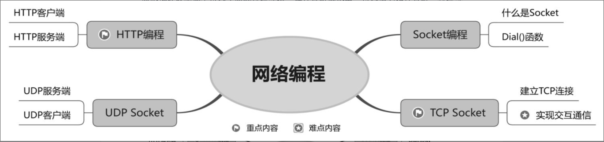

- [Socket编程](#Socket编程)
	- [什么是Socket](#什么是Socket)
- [TCPSocket](#TCPSocket)
	- [建立TCP连接](#建立TCP连接) 
	- [实现交互通信](#实现交互通信)
- [UDPSocket](#UDPSocket)
	- [UDP服务器端](#UDP服务器端) 
- [HTTP编程](#HTTP编程) 
	- [HTTP客户端](#HTTP客户端) 
	- [HTTP服务端](#HTTP服务端)

***
<br/><br/><br/>

网络编程就是两个设备之间的数据交换，在计算机网络中，设备主要指计算机。数据交换就是当一个设备向另一个设备发送数据后，接受来自另一个设备的反馈。在网络编程中，发送连接请求的程序称作客户端(Client)，响应连接请求的程序称作服务器(Server)。其中，客户端程序可以在需要发送连接请求时再启动，而服务器程序则为了能够时刻响应连接请求，要一直保持启动状态。连接一旦建立，客户端程序和服务器程序就可以进行数据交换。




<br/><br/><br/>

> <h2 id="Socket编程">Socket编程</h2>

在底层网络应用开发中，Socket编程无处不在，这是因为大部分底层网络的应用开发都离不开Socket编程。换言之，HTTP编程、Web开发、IM通信、视频流传输的底层都是Socket编程。Socket编程主要是面向OSI模型的第3层和第4层协议。那么，什么是OSI模型呢？OSI模型就是互联网分层模型。如图18.1所示，互联网的逻辑实现可以大致分为4层，这4层又可以细分为7层，其中，每层都有自己的功能。OSI模型就像建筑物一样，每层都靠下一层支持。用户接触的只是最上面的一层，即应用层。

结合上述内容和图18.1可得到如下结论：越往上的层，越靠近用户；越往下的层，越靠近硬件。


**注意**，在开发过程中，开发者把互联网的逻辑实现分为5层，这5层由下到上依次是**物理层、数据链路层、网络层、传输层和应用层**。

- 物理层：把本地的计算机与外界的互联网连接起来，负责传送0和1的电信号。
- 数据链路层：在物理层的上方，确定物理层传输的0和1的电信号的分组方式及其代表的意义。
- 网络层：按照以太网协议的规则依靠MAC地址向外发送数据。
- 传输层：具备MAC地址和IP地址，就可以在互联网上让任意两台主机建立通信。
- 应用层：规定应用程序使用的数据格式，使应用程序能接收传输层的数据。


<br/><br/>
> <h2 id="什么是Socket">什么是Socket</h2>


Socket位于应用层与传输层之间的软件抽象层。因为Socket把复杂的TCP/IP协议隐藏在Socket的后面，开发者只需调用Socket的相关函数，即可让Socket组织符合指定协议的数据，实现通信的目的。

<br/>

&emsp; Socket又称套接字，是计算机之间进行通信的一种约定或方式。通过Socket约定，一台计算机可以接收其他计算机的数据，也可以向其他计算机发送数据。在程序开发过程中，常用的Socket类型有两种：流式Socket(SOCK_STREAM)和数据报式Socket(SOCK_DGRAM)。

&emsp; 流式Socket是一种面向连接的Socket，针对面向连接的TCP服务应用；数据报式Socket是一种无连接的Socket，针对无连接的UDP(user datagram protocol)服务应用。TCP就像送货到家的快递，既要送货到家，又要买家签收；UDP就像送到快递柜里的快递，只要货在快递柜里，买家是否签收不重要。

&emsp; 那么，Socket是如何实现通信的呢？如图18.2所示，网络层的IP地址可以唯一标识网络中的主机，而传输层的协议和端口可以唯一标识主机中的应用程序。因此，通过IP地址、协议和端口这3个要素就能够唯一标识网络中要互相通信的进程了。

<br/><br/>
> <h2 id="Dial()函数">Dial()函数</h2>


Dial()函数在使用其他编程语言实现Socket编程时，一般都按照如下步骤展开。

按照网络协议、IP地址或域名建立Socket。

使用端口绑定Socket。

监听端口。

建立连接。

发送、接收数据。

&emsp; 但是，在使用Go语言实现Socket编程时，没有上述编码步骤，这是因为Go语言标准库抽象和封装了上述步骤。在Go语言中，不论使用什么协议建立何种形式的连接，都只需要调用标准库中的Dial()函数。Dial()函数的语法格式如下。

```
func Dial(net, addr string) (Conn, error)
```

- **参数说明如下。**
	- net：网络协议的名字。
	- addr: IP地址或域名；在IP地址或域名后跟随端口号（端口号可选）​，用“:”分隔。
	- Conn：连接对象。
	- error：错误。参数net有9个常用可选值。

这些值分别代表在建立Socket连接时使用的通信协议，如表18.1所示。


使用Dial()函数通过IP地址建立TCP连接，代码如下。

```
conn, err := net.Dial("tcp", "127.0.0.1:3000")
```

<br/>

使用Dial()函数通过IP地址建立UDP协议，代码如下:

```
conn, err := net.Dial("udp", "127.0.0.1:3000")
```


<br/><br/><br/>

> <h2 id="TCPSocket">TCPSocket</h2>


TCP/IP(transmission control protocol/internet protocol)协议，即传输控制协议／网络协议，是一种面向连接的、可靠的、基于字节流的传输层(transport layer)通信协议。因为是面向连接的协议，所以数据像水流一样传输，存在黏包问题。所谓黏包问题，主要还是因为发送方一次性把所有数据都存入缓存区，接收方不知道消息之间的界限，不知道一次性提取多少字节的数据。

如图18.3所示，一个TCP服务端可以同时连接多个TCP客户端。例如，我国各个地区的用户都使用自己计算机的浏览器访问淘宝网。因为Go语言通过创建多个goroutine实现并发非常方便和高效，所以可以每建立一次链接就创建一个goroutine。


<br/><br/>
> <h2 id="建立TCP连接">建立TCP连接</h2>


在使用Go语言编写TCP服务端时，一般按照如下步骤展开。

定义通信的地址和端口。

使用Listen()函数监听TCP的地址和端口信息，并得到连接信息。

使用连接信息的Accept函数等待连接。

关闭TCP连接。

下面演示如何编写简单的TCP服务端。代码如下。

```
/// 服务端建立连接
package main

import (
	"fmt"
	"net"
)

func main() {
	// 创建TCP连接
	testSocketListen()
}

// TCP服务端服务- 创建TCP连接
func testSocketListen(){
	// 使用 net.Listen() 函数监听连接的地址与端口
	listener, err := net.Listen("tcp", "127.0.0.1:3000")
	if err != nil {
		fmt.Printf("监听失败！发送错误：%v\n", err)
		return
	}
	fmt.Println("服务端已开启！等待客户端的连接请求.......")
	// 响应由TCP客户端发送的连接请求
	conn, err := listener.Accept()
	if err != nil {
		fmt.Printf("响应失效！ 发生错误: %v\n", err)
	}
	fmt.Println("服务端已连接客户端！")
	defer conn.Close()
}
```

- **说明**
	- 在编写上述TCP服务端时，需要明确一个重点：为了创建TCP连接，需要调用net.Listen()函数，并向该函数传入3个参数，即协议类型(tcp)、IP地址和端口号


<br/>

TCP服务端编写完毕后，下面需要编写TCP客户端。在使用Go语言编写TCP客户端时，一般按照如下步骤展开。

定义通信的地址和端口。

使用Dial()函数建立与服务端的连接。

关闭TCP连接。

下面演示如何编写TCP客户端。代码如下。

```
/// 客户端建立连接
package main

import (
	"fmt"
	"net"
)


func main() {
	// 客户端连接
	testClientConnect()
}

func testClientConnect() {
	conn, err := net.Dial("tcp", "127.0.0.1:3000")	// 建立与服务端的连接
	if err != nil {
		fmt.Printf("连接失败！ 发生错误： %v\n", err.Error())
		return
	}

	fmt.Println("客户端向服务端发送连接请求.....")
	defer conn.Close()
}
```

为了保证上述程序成功运行，要打开两个VS Code窗口：一个窗口是TCP服务端（go.0.0.49.png）​，一个窗口是TCP客户端（go.0.0.50.png）​。

**TCP服务端**


<br/>
**TCP客户端**


<br/><br/>
> <h2 id="实现交互通信">实现交互通信</h2>

TCP服务端与TCP客户端建立连接后，就可以发送和接收数据，进而实现TCP服务端与TCP客户端交互通信。通过连接对象调用Write()函数，发送数据；通过连接对象调用Read()函数，接收数据。

为了让TCP服务端与TCP客户端交互通信，TCP服务端除了要使用net.Listen()函数得到连接信息，还要使用for循环不停响应由TCP客户端发送的连接请求。每响应一次由TCP客户端发送的连接请求，就创建一个用于执行发送和接收数据操作的goroutine。

对上述实现TCP服务端的代码修改如下。

```
// TCP服务端连接、发送数据
func testTCPServerSocketListenV2(){
	// 使用 net.Listen() 函数监听连接的地址与端口
	listener, err := net.Listen("tcp", "127.0.0.1:3000")
	if err != nil {
		fmt.Printf("监听失败！发送错误：%v\n", err)
		return
	}
	fmt.Println("服务端已开启！等待客户端的连接请求.......")
	for{
		// 响应由TCP客户端发送的连接请求
		conn, err := listener.Accept()
		if err != nil {
			fmt.Printf("响应失败！ 发生错误： %v\n", err)
			continue
		}
		// 对每个新连接创建的协程收发数据
		go process(conn)
	}

}
func process(conn net.Conn){
	defer conn.Close()

	for{
		var buf[128]byte
		// 接收数据
		n, err := conn.Read(buf[:])
		if err != nil {
			fmt.Printf("接收数据失败！ 发生错误：%v\n", err)
			break
		}
		fmt.Printf("已成功接收数据：%v\n", string(buf[:n]))
		// 发送数据
		if _, err = conn.Write([]byte("服务端消息！")); err != nil {
			fmt.Printf("发生数据失败！ 发生错误：%v\n", err)
			break
		}
	}
}
```

<br/>

**客户端代码**

```
// 客户端发送数据
func testTCPClientConnectV2() {
	conn, err := net.Dial("tcp", "127.0.0.1:3000")
	if err != nil {
		fmt.Printf("连接失败！发生错误：%v\n", err.Error())
		return
	}

	fmt.Println("客户端向服务器端发送连接请求......")
	defer conn.Close()
	inputReader := bufio.NewReader(os.Stdin)
	for{
		input, err  := inputReader.ReadString('\n')
		if err != nil {
			fmt.Printf("无法读取在控制台上输入的数据！发生错误： %v\n", err)
			break
		}
		trimmedInput := strings.TrimSpace(input)
		if trimmedInput == "Q" {
			break
		}
		// 发送数据
		if _,err := conn.Write([]byte(trimmedInput)); err != nil{
			fmt.Printf("发送数据失败！发生错误：%v\n", err)
			break
		}

		// 接收数据
		var recvData = make([]byte, 1024)
		if _,err := conn.Read(recvData); err != nil {
			fmt.Printf("接收数据失败！ 发生错误：%v\n", err)
			break
		}
		fmt.Printf("已成功接收数据： %v\n", string(recvData))
	}
}
```

- **说明**
	- 在修改后的TCP客户端代码中，加入了用户能在控制台上输入任意数据，并且把输入的数据发送给服务器端的功能。在VS Code窗口要开2个终端控制台的输入，才会出现运行结果。如下：

<br/><br/>

**运行服务端的代码，接收数据：**

```
ganghuang@GangHuangs-MacBook-Pro TestTCPServerSocket % go run test_tcp_server_socket.go

服务端已开启！等待客户端的连接请求.......
已成功接收数据：你好 😂哈哈
已成功接收数据：收到数据了吗？ 我收到了！
真的吗
已成功接收数据：🍒🍒请你吃樱桃
```

<br/>

**运行客户端的代码，并发送数据：**

```
ganghuang@GangHuangs-MacBook-Pro TestClientSocket % go run test_tcp_client_socket.go

客户端向服务器端发送连接请求......
你好 😂哈哈
已成功接收数据： 服务端消息！
收到数据了吗？ 我收到了！
已成功接收数据： 服务端消息！
🍒🍒请你吃樱桃
已成功接收数据： 服务端消息！
```


<br/><br/><br/>

> <h2 id="UDPSocket">UDPSocket</h2>

UDP（user datagram protocol，用户数据报协议）协议是OSI（open systeminterconnect，开放式系统互连）参考模型中的一种无连接传输层协议，不需要建立连接就能直接发送和接收数据，属于不可靠的、没有时序的通信。但是，UDP协议的实时性比较好，通常用于视频直播等相关领域。、

<br/><br/>
> <h2 id="UDP服务器端">UDP服务器端</h2>

在编写UDP服务器端时，一般按照如下步骤展开。

- 定义通信的地址和端口。
- 使用ListenUDP()函数监听UDP的地址和端口信息并得到连接信息。
- 与UDP客户端进行交互通信。

下面演示如何编写简单的UDP服务端。代码如下。

```
/// udp服务端接收数据
package main

import (
	"fmt"
	"net"
)

func main() {
	// udp服务端接收数据
	testUDPServerSocketV0()
}

func testUDPServerSocketV0() {
	// 使用
	conn, err := net.ListenUDP("udp", &net.UDPAddr{
		IP: net.IPv4(127,0,0,1),
		Port: 3000,
		Zone: "",
	})

	if err != nil {
		fmt.Println("监听失败！发送错误：", err)
		return
	}
	fmt.Println("服务端开启！ 等待客户端的连接请求.......")

	for{
		var data[1024]byte

		// 接收数据
		count, addr, err := conn.ReadFromUDP(data[:])
		if err != nil {
			fmt.Println("接收数据失败！发送错误：", err)
			continue
		}
		fmt.Printf("已成功接收数据： %s\n", data[0: count])

		
		// 发送数据
		_, errs := conn.WriteToUDP([]byte("👋你好！ 客户端！🍏"), addr)
		if errs != nil {
			fmt.Println("发送数据失败！ 发生错误❌：", errs)
			continue
		}
	}
}

```

运行后效果：

```
ganghuang@GangHuangs-MacBook-Pro TestUDPServerSocket % go run test_udp_server_socket.go
服务端开启！ 等待客户端的连接请求.......
已成功接收数据： 👋你好，服务器🧧端！！
```


<br/><br/>
> <h2 id="UDP客户端">UDP客户端</h2>

UDP服务器端编写完毕后，接下来要编写UDP客户端。

在编写UDP客户端时，一般按照如下步骤展开。

- 定义通信的地址和端口。
- 使用DialUDP()函数建立与服务器端的连接。
- 与UDP服务器端进行交互通信。
- 关闭UDP连接。

下面演示如何编写UDP客户端。代码如下。

```
/// udp客户端接收数据
package main

import (
	"fmt"
	"net"
)

func main() {
	// udp客户端接收数据
	testUDPClientSocket()
}

func testUDPClientSocket() {
	conn, err := net.DialUDP("udp", nil, &net.UDPAddr{
		IP: net.IPv4(127, 0, 0, 1),
		Port: 3000,
		Zone: "",
	})

	if err != nil {
		fmt.Println("连接失败！发生错误❌：", err)
		return
	}
	fmt.Println("客户端向服务器端发送连接请求......")
	defer conn.Close()

	// 发送数据
	sendData := []byte("👋你好，服务器🧧端！！")
	_, errs := conn.Write(sendData)
	if errs != nil {
		fmt.Println("发送数据失败！发生错误：", errs)
		return
	}

	// 接收数据
	data := make([]byte, 4096)
	_,_, errors := conn.ReadFromUDP(data)
	if errors != nil {
		fmt.Println("接收数据失败！ 发生错误：", errors)
		return
	}
	fmt.Printf("已成功接收数据： %s\n", string(data))
}
```

运行后：

```
ganghuang@GangHuangs-MacBook-Pro TestUDPClientSocket % go run test_udp_client_socket.go
客户端向服务器端发送连接请求......
已成功接收数据： 👋你好！ 客户端！🍏
```


<br/><br/><br/>
> <h2 id="HTTP编程">HTTP编程</h2>

  HTTP(hypertext transfer protocol)协议，即超文本传输协议，是互联网上应用最为广泛的一种网络协议，它规定了浏览器和服务器之间交互通信的规则，通过互联网传送文档的数据传送协议。HTTP协议通常承载于TCP协议之上。


<br/><br/>
> <h2 id="HTTP客户端">HTTP客户端</h2>

因为Go语言内置的net/http包涵盖HTTP客户端的具体实现，所以HTTP客户端的具体实现不需要借助第三方网络通信库。

为了实现HTTP客户端，net/http包中的Client类型提供如下几个函数。


- **函数说明如下。**
	- Get()：用于请求资源，如网址首页等。
	- Post()：用于发送数据。
	- PostForm()：用于提交标准编码格式为application/x-www-form-urlencoded的表单。
	- Head()：用于只请求资源的头部信息。
	- Do()：用于设定一些自定义的HTTP Header字段，满足HTTP请求中的定制信息。下面演示如何编写简单的HTTP客户端。

代码如下。

```
package main

import (
	"fmt"
	"io/ioutil"
	"net/http"
)

func main() {
	// http客户端发送请求
	testHttpClientV0()
}

// http客户端发送请求
func testHttpClientV0() {
	response, _ := http.Get("http://localhost:3000/hello")// 发送HTTP请求， 请求一个网页
	defer response.Body.Close() // 关闭请求
	body, _ := ioutil.ReadAll(response.Body) // 接收数据
	fmt.Println(string(body))	
}
```


<br/><br/>
> <h2 id="HTTP服务端">HTTP服务端</h2>

使用net/http包提供的http.ListenAndServe()函数可以监听指定地址并处理HTTP请求。http.ListenAndServe()函数的语法格式如下。

```
func ListenAndServe(addr string, handler Handler) error 
```

- **参数说明如下。**
	- addr：监听地址。
	- handler：用于处理连接请求的服务端处理程序，通常为空。

<br/>

此外，net/http包还提供http.ListenAndServeTLS()函数，用于处理HTTPS连接请求。http.ListenAndServeTLS()函数的语法格式如下。

```
func ListenAndServeTLS(addr, certFile, keyFile string, handler Handler) error
```

- **参数说明如下。**
	- addr：监听地址。
	- certFile：对应证书文件（如SSL证书）存放路径。
	- keyFile：对应证书私钥文件路径。
	- handler：用于处理连接请求的服务端处理程序，通常为空。

下面演示如何编写简单的HTTP服务端。代码如下。

```
package main

import (
	"flag"
	"net/http"
)

func main() {
	// http服务端请求
	testHttpServerV0()
}

// http服务端请求
func testHttpServerV0() {
	host := flag.String("host", "127.0.0.1", "listen host")	// 域名
	port := flag.String("port", "3000", "listen port")	// 端口

	http.HandleFunc("/hello", Hello)

	err := http.ListenAndServe(*host+":"+*port, nil) //处理HTTP请求
	if err != nil {
		panic(err)
	}
}
func Hello(w http.ResponseWriter, req *http.Request){
	w.Write([]byte("你好， 客户端！"))
}
```


为了保证上述程序成功运行，要打开两个VS Code窗口：一个窗口是HTTP服务器端，另一个窗口是HTTP客户端。

当运行程序时，要先运行HTTP服务器端，再运行UDP客户端，在UDP客户端所在VSCode窗口的控制台上打印如下的信息。如下：

<br/><br/>

**服务端运行：**

```
ganghuang@GangHuangs-MacBook-Pro TestHttpServer % go run test_http_server.go
```

<br/>

**客户端运行：**

```
ganghuang@GangHuangs-MacBook-Pro TestHttpClient %  go run test_http_client.go
你好， 客户端！
```


